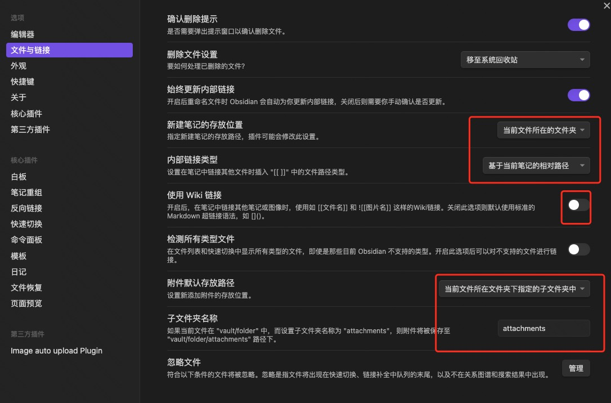

# 背景
用有道云写的博客，无法直接复制粘贴到掘金这样的平台，因为有道云的 markdown 图片是 **私有链**，掘金解析不了，就只能一张张上传。

# 简介
Obsidian 是专门为打造**个人知识库**而生的。
可以看看 Obsidian 的作者自己是怎么说的：

> **Why build yet another note-taking app?**
> 
> we started Obsidian because Erica couldn’t find anything that can satisfy her need to build a **personal knowledge base**.
> 来自： [https://obsidian.md/about](https://obsidian.md/about)

Obsidian 是一个本地化的 `markdown` 笔记软件, 所谓本地化，就是指我们写的笔记是存放到自己电脑的硬盘里的，所以天然也不需要导出了，保证了**数据的安全和所有权**，它对**图片的支持**也很好，可以自定义图片资源的存储路径，比如”当前文章所在文件夹“，使用时候直接复制粘贴图片到文件里，图片就自动存储到配置的目录下；它功能非常强大，提供了丰富的插件。

好用的 markdown 编辑器，只是 Obsidian 的基础功能，它真正厉害的地方在于知识管理, 传统的笔记软件是以**笔记收集**为目的，它们提供了免费且几乎无限的存储空间，利用云同步，将笔记存储到云端，实现了多设备的互通互联，这是它们的核心功能，但是这类软件，随着笔记数量增大后，很容易让我们陷入“收藏家谬论”，就是记了很多，看了很少，并没有真正的帮助你建立知识链路；

Obsidian 通过 **双向链接** 使两个不同的笔记关联了起来，在文章内部点击可以互相跳转，这样笔记就不再是一个个孤岛，而是构成了网状**关系图谱**的一部分，长期以往，思维的小溪终将汇聚成江河海洋。


# 使用场景
##  基本编辑

Obsidian 用来编辑 Markdown 非常舒服，目前也支持了 Typora 那种实时预览的编辑方式。代码高亮没问题，贴图没问题，公式也可以支持，这些基本的东西默认已经足够好用。
通过一些插件的协助效率更高。我自己比较喜欢的插件是这些：
[obsidian-various-complements-plugin](https://github.com/tadashi-aikawa/obsidian-various-complements-plugin)，这个插件用来自动补全很多东西，这是一个日本人在维护的插件，issue 反馈很快。我在使用过程中也对这个插件做了一些贡献：[自动补全算法](https://catcoding.me/p/input-complement-algorithm/)。
[cMenu-Plugin](https://github.com/chetachiezikeuzor/cMenu-Plugin)，在编辑页面加一些常见的 Markdown 格式按钮。
[obsidian-excalidraw-plugin](https://github.com/zsviczian/obsidian-excalidraw-plugin)，可以用来在 Obsidian 上画 excalidraw 格式的图，这是我最喜欢的画图工具，因为可以画出手绘风格的图。
还有些其他的辅助编辑的插件，大家可以自己去摸索。

##  Daily Notes
打开核心插件 Daily notes，绑定快捷键 `Ctrl-D` 到 `Open today's daily notes`，即可快速打开或者创建今天的日志，存放在一个自己设定的目录。

为什么一定要快捷键打开今天的日记页，因为我需要随手记录一点东西的时，这是个很好的选择，只有快才能不打断思维，并且形成习惯。

## 自动同步

所有笔记自动同步到 Github 上的私有库，通过插件 [obsidian-git](https://github.com/denolehov/obsidian-git) 自动定时 2 分钟同步一次，我经常工作的设备是 1 个 PC，两台笔记本，一个手机。

虽然 Obsidian 有移动端 App，但我已经习惯自己做的 [obweb](https://github.com/chenyukang/obweb)，我在自己的服务器上部署这个应用，然后通过微信悬浮打开应用的网页。

虽然有几个设备上，因为同一时间我只在一个设备上工作，定时拉取这种粗暴同步方式的体验甚至好过了 OneNote。即使是偶然出现了一些冲突之类，也就只是解决一下 Git 冲突的小事。

##  QuickAdd
QuickAdd 的概念应该是借鉴于 Emacs 的 org-mode。

简而言之就是我们可以预设一些文件格式、动作，让我们通过命令就可以快速创建文件，或者按某种格式记录内容，比如我设定了这些预设动作，通过命令运行某个命令，我就可以快速的记录一个 Todo，或者输入一个标题则开始写文章，或者是记录一个单词，或者是记录一个代码片段：


## TODO

Todo 的格式就是 Markdown 的 `- [ ]`，我用 Obsidian 管理 Todo 的好处在于每个 todo 都有上下文，我可能是 Daily 里面记录了 Todo，也可能是网页浏览时留下了一些 Todo，这些 Todo 散落在各个文件，但是我可以通过一条 [obsidian-tasks](https://github.com/schemar/obsidian-tasks) 语句生成一个 Task 视角，而在这个 Task 视角上编辑就等于编辑了散落在各个文件里的 Todo，真是绝妙！

```none
not done
sort by due desc
description includes #write
```

在 Obsidian 里显示为：


这种工作方式也是来自 Emacs 的 org-mode，我觉得 Obsidian 的这些插件都做得更容易使用，毕竟不是谁都有心思去学习 elisp 来配置 Emacs。

## 网页标注

网页标注是非常好的概念，这是我打通输入输出的必要工具。很多人喜欢收藏东西，用浏览器书签、知乎收藏夹之类的。因为收藏的时候没有自己写上标注和自己的理解，而且和自己的输入是隔离的，这样导致收藏的东西基本吃灰。

所以我们可以使用网页标注这种概念来把自己平时所看的东西变成输入。

网页标注我使用 [开源、可定制的网页批注工具 Hypothesis](https://sspai.com/post/63033)，通过 Hypothesis 我可以在浏览网页的时候把某些内容高亮或者添加注释，然后通过插件 [obsidian-hypothesis-plugin](https://github.com/weichenw/obsidian-hypothesis-plugin) 自动同步到我的知识库，这样我就可以在 Obsidian 里面看到我的记录。

比如我在浏览这个网页的时候，如果我觉得内容不错就写一点自己的评论，加上 #write 标签标识以后可能分享一下。


然后我的这个目录里面就会多出这么一条 Todo 记录，包含了网页的链接，我自己的备注等等信息：


这样的好处在于，我能通过上面类似的 [obsidian-tasks](https://github.com/schemar/obsidian-tasks) 语句筛选出来我的写作备选想法。

我积累了好多平时冒出来的想法，以及浏览网页时觉得想分享的东西，有了这些输入我就一直有输出的材料，这也是为什么我最近写文章更多了。


# 配置


# 小结
使用 Obsidian 也不过几个月，给人的感觉就是安心，数据安全存本地，需要同步可自行放 github, 而且再也不用担心卡顿问题，写完的文章发布到掘金等平台也很方便，最关键的，数据在自己手里，即便它倒闭了，也可以随时切换到其它软件。

# 参考
```c
https://juejin.cn/post/7220698356775469113
```
[Github+Picgo+Obsidian图床搭建](https://mp.weixin.qq.com/s?__biz=MzU4MzgxNjczMA==&mid=2247484554&idx=1&sn=bd6d9f62368fcb5a0cadab710c667ef9&chksm=fda207ffcad58ee90ad5e010ba233613425e0cb0ec36ca6d9e93b48e3ca72dbca4f2c68aa076&mpshare=1&scene=1&srcid=0918R1fV0Q23q1mEMsgh6ySb&sharer_sharetime=1663481322457&sharer_shareid=e436fa65c4c788721282168bf61f1107#rd)

[obsidian使用过程中的所有问题汇总](https://zhuanlan.zhihu.com/p/594872400)

[## 我的 Obsidian 使用经验](https://catcoding.me/p/obsidian-for-programmer/)

[# Obsidian 的 8 种进阶用法](https://eryinote.com/post/46)