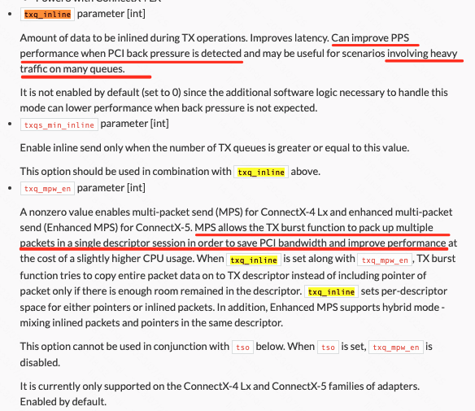

```table-of-contents
```
# PCI介
# 背景
测试4层LB时，client、server通过dperf打流，发现使用Mellanox Cx4-Lx 25G网卡的dpvs程序，bps总是无法打满带宽。但是dpvs的cpu使用率并不高，且存在Imiss丢包。

# 思路
## cpu频率
首先第一个看的就是CPU的频率，看转发线程对应的core是否存在降频的问题。
```
cat /proc/cpuinfo |grep -i MHz
```
## cpu使用率
### 程序性能
查看CPU使用率，如果是CPU使用率接近100%。那么可能需要对程序进行优化。
优化的时候，可以结合perf + 火焰图的方式来进行优化。
## pci
如果cpu使用率比较低，程序性能也没有问题。那么考虑瓶颈是否在PCIe设备上。

### PCIe 发生backPressure的现象
- 指标一
ethtool -S XXX 的输出中 outbound_pci_stalled_wr 统计。

.png)
.png)

PS：实际测试中，发现即使Mellanox网卡出现了拥塞，也没有出现 outbound_pci_stalled_wr 统计的增加。

- 指标二
网卡存在Imiss/rx_miss/rx_out_of_buffer/rx_discards_phy 丢包。但是程序占用的cpu还比较低，网卡的带宽打不满。

- 指标三
网卡的统计中，存在网卡发送 tx PFC pause Frame的统计。
> 注：谁发送PFC说明谁拥塞，需要通过PFC反压上游，减少上游的发送。因此如果网卡
> tx_pause在增加，说明网卡发生拥塞，应该是程序性能不行了，或者CPU低频，PCIe性能瓶颈等等。

```c
# 设置是否产生 pause frame
ethtool -A eth04 rx off tx off
ethtool -A eth03 rx off tx off

注：接受发送pause需要是开启的。如果将rx/tx pause关闭。则ethtool -S 的统计中不会有pause的增长。

# 查看网卡配置
查看：
ethtool --show-pause  eth03
or
ethtool -a eth03

# ethtool 查看Mellanox Cx4网卡的 pause 的统计：
# ethtool -S eth03 | grep -i -e pause -e flow
     rx_pause_ctrl_phy: 0
     tx_pause_ctrl_phy: 0
     rx_global_pause: 0
     rx_global_pause_duration: 0
     tx_global_pause: 0
     tx_global_pause_duration: 0
     rx_global_pause_transition: 0
     tx_pause_storm_warning_events: 0
     tx_pause_storm_error_events: 0

# 查看 intel 82599网卡的 Pause 统计:
# ethtool -S eth03 | grep -i -e pause -e flow
     fdir_overflow: 0
     tx_flow_control_xon: 0
     rx_flow_control_xon: 0
     tx_flow_control_xoff: 0
     rx_flow_control_xoff: 0
# dpip link show -x wan | grep -i -e pause -e flow
    flow_director_added_filters: 0
    flow_director_removed_filters: 0
    flow_director_filter_add_errors: 0
    flow_director_filter_remove_errors: 0
    flow_director_matched_filters: 0
    flow_director_missed_filters: 112210
    tx_flow_control_xon_packets: 0
    rx_flow_control_xon_packets: 0
    tx_flow_control_xoff_packets: 0
    rx_flow_control_xoff_packets: 0

```

### 背景
在平时设备的使用过程中，有可能遇到过数据通信错误(malformed TLP)， 或者网卡/磁盘在进行数据读写时性能没有达到预期，这些都可能和pcie 的max payload size配置或者PCIe的宽度有关系。

### pcie的用途
PCI Express技术， 是串行点对点互连协议， 提供用于可靠数据的高带宽可扩展解决方案传输。PCIe 用于用于不同模块之间的通信。网络适​​配器需要与 CPU 的内存（以及其他模块）进行通信。
这意味着为了处理网络流量，应该对通过 PCIe 进行通信的不同设备进行良好配置。将网络适配器连接到 PCIe 时，它​​会自动协商网络适配器和 CPU 之间支持的最大功能。

### pci宽度
PCIe 宽度决定了设备可并行用于通信的 PCIe 通道数。宽度标记为 xA，其中 A 是通道数（例如，x8 表示 8 通道）。 Mellanox 适配器支持 x8 和 x16 配置，具体取决于它们的类型。为了验证 PCIe 宽度，可以使用命令 lspci。
```text
# lspci -s 04:00.0 -vvv | grep Width
LnkCap: Port #0, Speed 8GT/s, Width x8, ASPM not supported, Exit Latency L0s unlimited, L1 unlimited
LnkSta: Speed 8GT/s, Width x8, TrErr- Train- SlotClk+ DLActive- BWMgmt- ABWMgmt-
```

>注：DevCap：表示设备的能力；DevCtl：表示协商后的结果；
>LnkCap：表示协商后的能力；LnkSta：表示实际的状态。
### pci速率
PCIe 速度被标识为“代”，其中 2.5GT/s 称为“gen1”，5GT/s 称为“gen2”，8GT/s 称为“gen3”。PCIe 3.0即表示“PCI gen3”

注意：除了支持的速度之外，各代之间的主要区别在于数据包的编码开销。对于第 1 代和第 2 代，在 PCIe 上发送的每个数据包都有 20% 的 PCIe 标头开销。这在第 3 代中得到了改进，其中开销减少到 1.5% (2/130)。


最大可能的 PCIe 带宽 =  PCIe宽度 * 速率。

### pci的MPS和MRRS
#### lspci查看
```c
查看方法：
# 查看网卡的PCIe
lspci | grep -i eth

# 树形查看: 可得到网卡PCIe的 PCIe bridge
lspci -t -v 

# 查看Pci的类型，以及供应商信息。
# -nn: Show PCI vendor and device codes as both numbers and names.
lspci -nn

# 查看指定 PCIe 的详细信息
lspci -s PCI_ID -vv


```


#### MPS
 **Max Payload Size, 简称MPS**：
PCIe设备是以TLP（Translation Layer Protocol）的形式发送报文的，而max payload size(简称mps)决定了pcie设备实际使用的tlp能够传输的最大字节数(类似于网络协议中的MTU)。PCIe设备发送TLP时，其最大payload不能超过mps的值。  


##### MPS定义

- 单个 TLP 的**Data Payload**最大字节数，固定可选：**128/256/512/1024/2048/4096B**。
- 链路初始化时**两端协商**，整条链路用同一个 MPS（取最小值）。

作用场景
- ✅ **所有写操作（Memory Write）**：大包必须拆成≤MPS 的小包发送。
- ✅ **读响应（Completion）**：返回的数据段不能超过 MPS。
- ✅ **链路层基础限制**：决定 PCIe 包的 “最大车厢容量”，影响**带宽利用率 / 延迟 / 缓存开销**。

MPS=256B：一次写 512B → 拆成**2 个 256B TLP**发送。

##### MPS和MPSS

mps定义在Device control register中。Device Control register 如下：


>PCIe设备含有“Max_Payload_Size”和“Max_Payload_Size Supported”参数，这两个参数分别在Device Capability寄存器和Device Control寄存器中定义。
>MPSS在device capability 里边，是指器件支持多大的MPS；
>MPS在device control 里边，是实际工作中的MPS，这个MPS是链路两端协商、由系统软件或者说RC写入的，个人是不能配置的。

- MPSS和MPS的区别
“Max_Payload_Size Supported”参数（DevCap的MPS）存放在一个PCIe设备中，TLP有效负载的最大值，该参数由PCIe设备的硬件逻辑确定，系统软件不能改写该参数。而Max_Payload_Size参数（即DevCtl的MPS）存放PCIe设备实际使用的，TLP有效负载的最大值。该参数由PCIe链路两端的设备协商决定，是PCIe设备进行数据传送时，实际使用的参数。
> DevCap中的 max payload size support 简称：MPSS ——设备支持的最大MPS。

- MPS 相关的寄存器

```text
Max_Payload_Size Supported - This field indicates the maximum payload size that the
Function can support for TLPs.
000b 128 bytes max payload size
001b 256 bytes max payload size
010b 512 bytes max payload size
011b 1024 bytes max payload size
100b 2048 bytes max payload size
101b 4096 bytes max payload size
110b Reserved
111b Reserved
```

- MPS的作用
PCIe设备发送数据报文时，使用Max_Payload_Size参数决定TLP的最大有效负载。当PCIe设备的所传送的数据大小超过Max_Payload_Size参数时，这段数据将被分割为多个TLP进行发送。当PCIe设备接收TLP时，该TLP的最大有效负载也不能超过Max_Payload_Size参数，如果接收的TLP，其Length字段超过Max_Payload_Size参数，该PCIe设备将认为该TLP非法。

>注：RC或者EP在发送存储器读完成TLP时，这个存储器读完成TLP的最大Payload也不能超过Max_Payload_Size参数，如果超过该参数，PCIe设备需要发送多个读完成报文。值得注意的是，这些读完成报文需要满足RCB参数的要求，有关RCB参数的详细说明见下文。

##### PCIe MPS协议
下图TLP通常的报文格式。

Data Payload的最大size是由设备的MPS（Max Payload Size）决定的。

##### TLP的Overhead开销

MPS 的设置，确定了传输指定数据量所需的 TLP（Transaction Layer Packet） 数量。随着 MPS 的增加，传输同一块数据所需的 TLP 数量会减少。


在不考虑Ack/Nak机制和Flow Control机制等因素的情况下，PCIe总线的真实有效速率可以这样计算：


> TLP开销Overhead 为：

> 对于任意的一个TLP来说，除了Data Payload，还有物理层添加的包头（1 Byte）、数据链路层添加的包编号（2 Bytes）、事务层添加的包头（12 or 16 Bytes）、事务层添加的ECRC（4Bytes，可选的）、数据链路层添加的LCRC（4Bytes）和物理层添加的包尾（1 Byte）。具体如下图所示：


.png)
因此：如果只从TLP Overhead考虑的话，显然每个TLP包含的Data Payload的量越大，真实有效速率越高「**实际应用中却并非如此，还要考虑其他因素**」。

在网卡收到数据包时，DMA通过PCIe将数据包从网卡硬件缓存中搬到内核内存中，如果MPS更大，则可以有更大的传输效率。

##### MPS的协商
注：==MPS类似于TCP/IP中的MTU==。

```bash
         RC(512)
           │  链路①
       Switch(512)
       /          \
  链路②           链路③
DevA(512)       DevB(256)
```


###### 逐链路协商结果（per-link 策略）

|链路|两端能力|协商 MPS|
|---|---|---|
|链路① RC ↔ Switch|512 vs 512|**512**|
|链路② Switch ↔ DevA|512 vs 512|**512**|
|链路③ Switch ↔ DevB|512 vs 256|**256**|

DevA 和 RC 之间走的是 512，路径上每一跳都支持 512，全程畅通无阻。
```
DevA(512) ──[512B TLP]──▶ Switch(512) ──[512B TLP]──▶ RC(512)
```

核心问题：RC 怎么知道写 DevB 只能用 256B？
这是 per-link 策略的关键难点。RC 自身 MPS 寄存器设为 512，**但它写 DevB 时必须用 256B 的 TLP**，否则 DevB 处理不了。
```bash
RC 写 DevA：可以发 512B TLP ✅
RC 写 DevB：只能发 256B TLP ✅（软件保证）

Switch 转发时：
  链路① 上跑 512B → Switch 能处理 ✅
  链路③ 上跑 256B → DevB 能处理 ✅
```
**谁来保证？** —— 软件（BIOS/OS/驱动）在配置阶段记录了每个 Endpoint 的 MPS，DMA 引擎或 CPU 发起传输时按目标设备的 MPS 切片。

###### 全局最小值策略

整个 PCIe 层级域（整个树： 一个RC对应一个PCIe树）必须使用同一个全局 MPS，不能各跑各的。

```bash
全拓扑最小 = 256（因为 DevB 拖累）
→ RC、Switch、DevA、DevB 全部强制设为 256
→ DevA ↔ RC 之间也只能跑 256B TLP（白白浪费带宽）
```

###### 小结

|策略|DevA MPS|DevB MPS|实现复杂度|
|---|---|---|---|
|**per-link**|**512**|256|较高（软件要记录每个目标的 MPS）|
|**全局最小**|256|256|简单（统一配置）|

Linux 内核默认用**全局最小值策略**（`pci=pcie_bus_safe`），因为实现更简单可靠；性能敏感场景可以配置 `pci=pcie_bus_perf` 启用 per-link 策略。


##### MPS的协商范例

DevCtl中的mps的大小是由PCIe链路两端的设备协商决定的，系统的DevCtl 的 MPS值设置是在上电以后的设备**枚举配置（即枚举DevCap的MPS supported，选择 最小的）**阶段完成的。

以主板上的PCIe RC和PCIe SSD为例，他们都在Device Capability Register里声明自己能支持的各种MPS，OS的PCIe驱动侦测到他们各自的能力值，然后挑低的那个设置到两者的Device Control register中。

虽然PCIe Spec规定，TLP的Data Payload最高可达4096 Bytes，但同时也规定了PCIe体系结构中，所有的设备，都必须使用相同的Max_Payload_Size值。换一句话说，整个总线的Max_Payload_Size值必须使用总线体系结构中所有设备的最小的Max_Payload_Size Supported值(即最小的DevCap 的 MPS)。具体如下图所示：

>**注：** 每个设备所支持的Max_Payload_Size最大值信息，存在于Device Capability Register中。
>Max_Payload_Size值的设置是在PCIe总线枚举和配置的过程中完成的，软件确定了Max_Payload_Size的值后，会将该值写入到每个设备的Device Control Register中。

**选用PCIe链路两端最小的Max_Payload_Size Supported参数初始化Max_Payload_Size参数**。
在实际应用中，尽管有些PCIe设备的Max_Payload_Size Supported参数可以为256B、512B、1024B或者更高，但是如果PCIe链路的对端设备可以支持的Max_Payload_Size参数为128B时，系统软件将使用对端设备的Max_Payload_Size Supported参数，初始化该设备的Max_Payload_Size参数，

>注意：目前在大多数EP（EndPoint）中，Max_Payload_Size Supported参数不大于512B，因为在大多数**处理器系统**的RC（root complex）中，Max_Payload_Size Supported参数也不大于512B。因此即便EP支持较大的Max_Payload_Size Supported参数，并不会提高数据传送效率。

==比如：发现的情况是，不同机器上，同样的网卡，不同CPU，得到的 PCIe的 DevCtl 的 MPS是不同的。可能不同处理器系统的RC的MPS不同？==
注：setpci设置 PCIe的 DevCtl 的 MPS好像并不会生效???

- 协商场景：
1. 控制器驱动（DT和ACPI），在枚举完成所有设备并分配号BAR资源之后，调用此接口进行MPS的协商配置。
2. hotplug驱动，热插拔场景，新插入一个设备的时候也会调调用此接口进行MPS协商。


#### MRRS
**Max Read Request Size，简称MRRS**
Max_Read_Request_Size(简称mrrs)参数由PCIe设备决定，该参数规定了PCIe设备一次能从目标设备读取多少数据。Max_Read_Request_Size参数在Device Control寄存器中定义。该参数与存储器读请求TLP的Length字段相关，其中Length字段不能大于Max_Read_Request_Size参数。在存储器读请求TLP中，Length字段表示需要从目标设备读取多少数据。

值得注意的是，Max_Read_Request_Size参数与Max_Payload_Size参数间没有直接联系，Max_Payload_Size参数仅与存储器写请求和存储器读完成报文相关。

PCIe总线规定存储器读请求，其读取的数据长度不能超过Max_Read_Request_Size参数，即存储器读TLP中的Length字段不能大于这个参数。如果一次存储器读操作需要读取的数据范围大于Max_Read_Request_Size参数时，该PCIe设备需要向目标设备发送多个存储器读请求TLP。

PCIe总线规定Max_Read_Request_Size参数的最大值为4KB，但是系统软件需要根据硬件特性决定该参数的值。因为PCIe总线规定EP在进行存储器读请求时，需要具有足够大的缓冲接收来自目标设备的数据。

如果一个EP的Max_Read_Request_Size参数被设置为4KB，而且这个EP每发出一个4KB大小存储器读请求时，EP都需要准备一个4KB大小的缓冲。这对于绝大多数EP，这都是一个相当苛刻的条件。为此在实际设计中，一个EP会对Max_Read_Request_Size参数的大小进行限制。

MRRS可以比MPS大，比如MPS设置为256B，MRRS设置为4KB，通常MRRS大于等于MPS。


##### MRRS是没有协商的

MRRS 相当于我基于它，设置本端接收缓冲区大小，隐含告诉对端我本端最大能承接多少；
因此，MRRS是设备自己设（主机设自己的，设备设自己的），不需要协商，只要 MRRS ≥ MPS 即可

##### MRRS影响的是请求的个数，MPS影响的是发送的TLP的大小

|参数|全称|作用方向|约束对象|
|---|---|---|---|
|**MPS**|Max Payload Size|发送端写数据 / 完成包响应|**TLP 的 payload 大小上限**|
|**MRRS**|Max Read Request Size|发起读请求端|**单次读请求能请求的字节数上限**|


- **返回的响应 Completion TLP 个数**
    只由 总读取字节数 + MPS 决定，和 MRRS 一毛钱关系都没有。
    只要 MPS 固定、要读的总数据固定，拆出来的响应 TLP 数量永远固定。
    
- **下发的 Memory Read 请求 TLP 个数**
    只由 总读取字节数 + MRRS 决定。
    MRRS 越大，发起的读请求包越少。


固定 MPS=256B
```bash
1. MRRS=512B
    一次读请求最多要 512B
    响应时，链路会拆成：2 个 256B TLP 响应包
    
2. MRRS=1024B
    一次读请求直接要 1024B
    响应时，链路拆成：4 个 256B TLP 响应包

3. MRRS=4096B
    响应时，链路拆成：16 个 256B TLP 响应包
```

MRRS 影响的是 Read 请求发包次数：**MRRS 越大，发的读请求越少，总线命令开销越小，吞吐越高；MRRS不影响TLP的最大大小，TLP的最大大小是由MPS决定的**。
```bash
要读 4KB 数据:
- MRRS=512：要发 8 次 Read 请求；响应时，基于TLP最大为MPS，需要16个 256B的 TLP响应包；
- MRRS=1024：只发 4 次 Read 请求；响应时，基于TLP最大为MPS，需要16个 256B的 TLP响应包；
- MRRS=4096：只发 1 次 Read 请求；响应时，基于TLP最大为MPS，需要16个 256B的 TLP响应包；


----------------------------

要读：总数据 1024B，分别看2种 MRRS：MRRS=512B、MRRS=1024B
（1）MPS=256，MRRS=512B
主机端发起Read请求：
    Read Req #1  请求 512B  → 对端
    Read Req #2  请求 512B  → 对端
对端受MPS=256限制，自动拆小包返回：
    Comp TLP #1  256B
    Comp TLP #2  256B
    Comp TLP #3  256B
    Comp TLP #4  256B
总结：
    只发 2次Read请求
    照样收 4个256B响应包

(2) MPS=256，MRRS=1024B
规则：一次直接拉满要 1024B（我们要的总量刚好 1024）
主机端发起Read请求：
    Read Req #1  请求 1024B  → 对端
对端还是受MPS=256限制，拆成4个小包返回：
    Comp TLP #1  256B
    Comp TLP #2  256B
    Comp TLP #3  256B
    Comp TLP #4  256B
总结：
    仅发 1次Read请求
    依然收 4个256B响应包
```

- **MPS 由链路稳定性、兼容决定**，一般 256/512 别动太小
- **MRRS 建议设成比 MPS 大一档甚至拉满 4KB**
- 高性能设备（NVMe/GPU/10G + 网卡）：
    MPS=256/512，**MRRS 直接拉 4096**

#### MPS对性能的影响
网卡自带的内存和CPU使用的内存进行数据传递时，是通过PCIe总线进行数据搬运的。Max Payload Size为每次传输数据的最大单位（以字节为单位），它的大小与PCIe链路的传送效率成正比，该参数越大，PCIe链路带宽的利用率越高。


- 作用
pice协议规定有数据的TLP包的传递规则是：按照指定DW长度单位传递数据，发送端的数据承载量不得超过“Device Control Register”中的“Max_Payload_Size”数值，接收端中，所接收到的数据量也不能超过接收端“Device Control Register”中的“Max_Payload_Size”数值。

所以mps主要的作用是:  
(1) **mps的大小影响pcie设备的传输效率。** 对于比较大的数据量，如果mps设置比较小，那么数据只能被分割成多个TLP进行发送，势必会影响pcie链路带宽的利用率。但是mps的值也不是越大越好，一方面mps设置的越大，硬件处理数据包所需的内存和逻辑量也随之增加； 另一方面，mps的值是一个自协商的结果，当前市场上支持较大mps值的ep设备不常见，所以没有必要设置本端的mps值太大。
(2) **不合理的mps设置会导致数据通信时上报"Malformed TLP"错误。** RC设备在与EP设备对接时，对端的EP设备的MPS可能各不相同，需要RC端去适配EP端的mps, 如果EP设备接收的TLP length字段超过了它的mps配置，该设备就会认为该TLP非法。

- 影响
在MPS在PCIe整体性能中，有至关重要的作用。随着MPS大小的增加，PCIe传输效率也在不断的提升。


#### setpci设置

注：`【14：12】`是mrrs, `[7:5]`是mps。

> 注：setpci对于MRRS的设置，在设备重启之后，会失效。
> 可以通过在BIOS中设置MRRS，并且保存配置，下次再次reboot，依然有效。

> 注：整个总线的Max_Payload_Size值必须使用总线体系结构中所有设备所支持的最小的Max_Payload_Size值。「木桶原理」


**注：DevCtl 的MPS在运行时不可以通过 setpci 来更改，MRRS在运行时可以通过 setpci 更改。**


#### 内核参数控制MPS模式
**kernel parameter 命令行参数**

pcie_bus_tune_off 不对PCIe MPS(Max Payload Size)进行调整，而是使用BIOS配置好的默认值。  
pcie_bus_safe 将每个设备的MPS都设为root complex下**所有设备**支持的MPS中的最大值  （指的是设置最小的那个设备的mps为所有设备的mps。）
pcie_bus_perf 将设备的MPS设为其上级总线允许的最大MPS，同时将MRRS(Max Read Request Size)设为能支持的最大值(但不能大于设备或总线所支持的MPS值)  
pcie_bus_peer2peer 将每个设备的MPS都设为最安全的”128B”，以确保支持所有设备之间的点对点DMA，同时也能保证热插入(hot-added)设备能够正常工作，但代价是可能会造成性能损失。


> 为什么提供这么多模式呢，就是因为PCIe设备能力不同，需要两端设备协商一致，如果MPS不一致，可能会出现畸形报文的错误。

pcie_bus_safe和pcie_bus_peer2peer都可以保证两端设备的MPS一样，这两种模式不同在于P2P场景可能是跨RC的，P2P模式直接设置128byte，所有设备都能够支持。对于pcie_bus_perf 模式，两端设备MPS可能是不同的。

```c
比如设置 pci=pcie_bus_perf；

# cat /etc/default/grub
GRUB_TIMEOUT=5
GRUB_DISTRIBUTOR="$(sed 's, release .*$,,g' /etc/system-release)"
GRUB_DEFAULT=saved
GRUB_DISABLE_SUBMENU=true
GRUB_TERMINAL_OUTPUT="console"
GRUB_CMDLINE_LINUX="crashkernel=512M console=tty0 console=ttyS0,115200"
GRUB_DISABLE_RECOVERY="true"
GRUB_CMDLINE_LINUX_DEFAULT="intel_idle.max_cstate=0 pci=pcie_bus_perf default_hugepagesz=1G hugepagesz=1G hugepages=100 isolcpus=1,2,3,4,5,6,7,8,9,22,23,24,25,26,27,28,29,30"
GRUB_TERMINAL="console serial"
GRUB_SERIAL_COMMAND="serial --speed=115200 --unit=0 --word=8 --parity=no --stop=1"

#grub2-mkconfig -o /boot/grub2/grub.cfg >/dev/null 2>&1
#reboot
```


#### 内核编译开关控制MPS模式

编译开关控制MPS模式；
drivers/pci/Kconfig
默认模式 PCIE_BUS_DEFAULT，MPS设置同 upstream bridge设备。
```c
choice
	prompt "PCI Express hierarchy optimization setting"
	default PCIE_BUS_DEFAULT
	depends on PCI && EXPERT
	help
	  MPS (Max Payload Size) and MRRS (Max Read Request Size) are PCIe
	  device parameters that affect performance and the ability to
	  support hotplug and peer-to-peer DMA.

	  The following choices set the MPS and MRRS optimization strategy
	  at compile-time.  The choices are the same as those offered for
	  the kernel command-line parameter 'pci', i.e.,
	  'pci=pcie_bus_tune_off', 'pci=pcie_bus_safe',
	  'pci=pcie_bus_perf', and 'pci=pcie_bus_peer2peer'.

	  This is a compile-time setting and can be overridden by the above
	  command-line parameters.  If unsure, choose PCIE_BUS_DEFAULT.

config PCIE_BUS_TUNE_OFF
	bool "Tune Off"
	depends on PCI
	help
	  Use the BIOS defaults; don't touch MPS at all.  This is the same
	  as booting with 'pci=pcie_bus_tune_off'.

config PCIE_BUS_DEFAULT
	bool "Default"
	depends on PCI
	help
	  Default choice; ensure that the MPS matches upstream bridge.

config PCIE_BUS_SAFE
	bool "Safe"
	depends on PCI
	help
	  Use largest MPS that boot-time devices support.  If you have a
	  closed system with no possibility of adding new devices, this
	  will use the largest MPS that's supported by all devices.  This
	  is the same as booting with 'pci=pcie_bus_safe'.

config PCIE_BUS_PERFORMANCE
	bool "Performance"
	depends on PCI
	help
	  Use MPS and MRRS for best performance.  Ensure that a given
	  device's MPS is no larger than its parent MPS, which allows us to
	  keep all switches/bridges to the max MPS supported by their
	  parent.  This is the same as booting with 'pci=pcie_bus_perf'.

config PCIE_BUS_PEER2PEER
	bool "Peer2peer"
	depends on PCI
	help
	  Set MPS = 128 for all devices.  MPS configuration effected by the
	  other options could cause the MPS on one root port to be
	  different than that of the MPS on another, which may cause
	  hot-added devices or peer-to-peer DMA to fail.  Set MPS to the
	  smallest possible value (128B) system-wide to avoid these issues.
	  This is the same as booting with 'pci=pcie_bus_peer2peer'.

endchoice
```

> EP: endpoint; RP: root port, RP和终端设备EP不同，它的主要作用是用来连接其他的PCIe设备.

#### kernel pcie mps实现

- 命令行或者编译模式获取pcie_bus_config
参见：drvier/pci/pci.c

```c
#ifdef CONFIG_PCIE_BUS_TUNE_OFF
enum pcie_bus_config_types pcie_bus_config = PCIE_BUS_TUNE_OFF;
#elif defined CONFIG_PCIE_BUS_SAFE
enum pcie_bus_config_types pcie_bus_config = PCIE_BUS_SAFE;
#elif defined CONFIG_PCIE_BUS_PERFORMANCE
enum pcie_bus_config_types pcie_bus_config = PCIE_BUS_PERFORMANCE;
#elif defined CONFIG_PCIE_BUS_PEER2PEER
enum pcie_bus_config_types pcie_bus_config = PCIE_BUS_PEER2PEER;
#else
enum pcie_bus_config_types pcie_bus_config = PCIE_BUS_DEFAULT;
#endif
```
```c
static int __init pci_setup(char *str)
{
...
            } else if (!strncmp(str, "pcie_bus_tune_off", 17)) {
                pcie_bus_config = PCIE_BUS_TUNE_OFF;
            } else if (!strncmp(str, "pcie_bus_safe", 13)) {
                pcie_bus_config = PCIE_BUS_SAFE;
            } else if (!strncmp(str, "pcie_bus_perf", 13)) {
                pcie_bus_config = PCIE_BUS_PERFORMANCE;
            } else if (!strncmp(str, "pcie_bus_peer2peer", 18)) {
                pcie_bus_config = PCIE_BUS_PEER2PEER;
....
}
early_param("pci", pci_setup);
```

- 枚举到设备时候， 调用pci_configure_mps(dev)配置mps
参见：drivers/pci/probe.c
```c
static void pci_configure_device(struct pci_dev *dev)
{
    pci_configure_mps(dev);
    ....
}
```

配置设备MPS， 如果PCIE_BUS_DEFAULT模式，即设置同 upstream bridge。
PCIE_BUS_TUNE_OFF模式就不配置MPS。如果是PCIE_BUS_PEER2PEER模式, MPS配置为128B，否则就按照支持MPSS能力配置。
其他mps模式配置在之后 的pcie_bus_configure_settings()处理。

```c
static void pci_configure_mps(struct pci_dev *dev)
{
	struct pci_dev *bridge = pci_upstream_bridge(dev);
	int mps, mpss, p_mps, rc

	if (!pci_is_pcie(dev))
		return;

	/* MPS and MRRS fields are of type 'RsvdP' for VFs, short-circuit out */
	if (dev->is_virtfn)
		return;

	/*
	 * For Root Complex Integrated Endpoints, program the maximum
	 * supported value unless limited by the PCIE_BUS_PEER2PEER case.
	 */
	if (pci_pcie_type(dev) == PCI_EXP_TYPE_RC_END) {
		if (pcie_bus_config == PCIE_BUS_PEER2PEER)
			mps = 128;
		else
			mps = 128 << dev->pcie_mpss;
		rc = pcie_set_mps(dev, mps);
		if (rc) {
			pci_warn(dev, "can't set Max Payload Size to %d; if necessary, use \"pci=pcie_bus_safe\" and report a bug\n",
				 mps);
		}
		return;
	}

	if (!bridge || !pci_is_pcie(bridge))
		return;

	mps = pcie_get_mps(dev);
	p_mps = pcie_get_mps(bridge);

	if (mps == p_mps)
		return;

	if (pcie_bus_config == PCIE_BUS_TUNE_OFF) {
		pci_warn(dev, "Max Payload Size %d, but upstream %s set to %d; if necessary, use \"pci=pcie_bus_safe\" and report a bug\n",
			 mps, pci_name(bridge), p_mps);
		return;
	}

	/*
	 * Fancier MPS configuration is done later by
	 * pcie_bus_configure_settings()
	 */
	if (pcie_bus_config != PCIE_BUS_DEFAULT)
		return;

	mpss = 128 << dev->pcie_mpss;
	if (mpss < p_mps && pci_pcie_type(bridge) == PCI_EXP_TYPE_ROOT_PORT) {
		pcie_set_mps(bridge, mpss);
		pci_info(dev, "Upstream bridge's Max Payload Size set to %d (was %d, max %d)\n",
			 mpss, p_mps, 128 << bridge->pcie_mpss);
		p_mps = pcie_get_mps(bridge);
	}

	rc = pcie_set_mps(dev, p_mps);
	if (rc) {
		pci_warn(dev, "can't set Max Payload Size to %d; if necessary, use \"pci=pcie_bus_safe\" and report a bug\n",
			 p_mps);
		return;
	}

	pci_info(dev, "Max Payload Size set to %d (was %d, max %d)\n",
		 p_mps, mps, mpss);
}
```
范例


pcie_bus_configure_settings()配置了PCIE_BUS_PEER2PEER、PCIE_BUS_SAFE以及PCIE_BUS_PERFORMANCE模式。
```c
/*
 * pcie_bus_configure_settings() requires that pci_walk_bus work in a top-down,
 * parents then children fashion.  If this changes, then this code will not
 * work as designed.
 */
void pcie_bus_configure_settings(struct pci_bus *bus)
{
    u8 smpss = 0;

    if (!bus->self)
        return;

    if (!pci_is_pcie(bus->self))
        return;
    
    /*
     * FIXME - Peer to peer DMA is possible, though the endpoint would need
     * to be aware of the MPS of the destination.  To work around this,
     * simply force the MPS of the entire system to the smallest possible.
     */ 
    if (pcie_bus_config == PCIE_BUS_PEER2PEER)
        smpss = 0;

    if (pcie_bus_config == PCIE_BUS_SAFE) {
        smpss = bus->self->pcie_mpss;
    
        pcie_find_smpss(bus->self, &smpss);
        pci_walk_bus(bus, pcie_find_smpss, &smpss);
    }

    pcie_bus_configure_set(bus->self, &smpss);
    pci_walk_bus(bus, pcie_bus_configure_set, &smpss);
}   
EXPORT_SYMBOL_GPL(pcie_bus_configure_settings);
```
搜索pcie_bus_configure_settings调用的地方。
主要归为：
4. 控制器驱动（DT和ACPI），在枚举完成所有设备并分配号BAR资源之后，调用此接口进行MPS的协商配置。
5. hotplug驱动，热插拔场景，新插入一个设备的时候也会调调用此接口进行MPS协商。


- 获取mps和设置mps接口
```c
/**
 * pcie_get_mps - get PCI Express maximum payload size
 * @dev: PCI device to query
 *
 * Returns maximum payload size in bytes
 */
int pcie_get_mps(struct pci_dev *dev)
{
    u16 ctl; 

    pcie_capability_read_word(dev, PCI_EXP_DEVCTL, &ctl);

    return 128 << ((ctl & PCI_EXP_DEVCTL_PAYLOAD) >> 5);
}
EXPORT_SYMBOL(pcie_get_mps);

/**
 * pcie_set_mps - set PCI Express maximum payload size
 * @dev: PCI device to query
 * @mps: maximum payload size in bytes
 *    valid values are 128, 256, 512, 1024, 2048, 4096
 *
 * If possible sets maximum payload size
 */
int pcie_set_mps(struct pci_dev *dev, int mps) 
{
    u16 v;
    int ret; 

    if (mps < 128 || mps > 4096 || !is_power_of_2(mps))
        return -EINVAL;

    v = ffs(mps) - 8; 
    if (v > dev->pcie_mpss)
        return -EINVAL;
    v <<= 5;

    ret = pcie_capability_clear_and_set_word(dev, PCI_EXP_DEVCTL,
                          PCI_EXP_DEVCTL_PAYLOAD, v);

    return pcibios_err_to_errno(ret);
}
EXPORT_SYMBOL(pcie_set_mps);
```


### PCie反压
如果网卡丢包，还可以看看是否存在PCI背压的统计，Pause Frame 发送的统计。如下所示：
```c
1> 下图为Mellanox Cx4-LX 25G的统计输出
# ethtool -S eth03 | grep -i -e pci -e pause -e control
     tx_mac_control_phy: 1266552
     rx_mac_control_phy: 0
     rx_pause_ctrl_phy: 0
     tx_pause_ctrl_phy: 1266552
     rx_pci_signal_integrity: 0
     tx_pci_signal_integrity: 3
     outbound_pci_stalled_rd: 0
     outbound_pci_stalled_wr: 0
     outbound_pci_stalled_rd_events: 0
     outbound_pci_stalled_wr_events: 0
     rx_global_pause: 0
     rx_global_pause_duration: 0
     tx_global_pause: 1266552
     tx_global_pause_duration: 555665182
     rx_global_pause_transition: 0
     tx_pause_storm_warning_events: 0
     tx_pause_storm_error_events: 0

主要是：
 tx_pause_ctrl_phy：网卡发送的Pause帧的数量
 outbound_pci_stalled_wr：Pcie背压

2> 下图为 Intel 82599 10G的统计输出
# ethtool -S eth03 | grep -i flow_
     tx_flow_control_xon: 0
     rx_flow_control_xon: 0
     tx_flow_control_xoff: 0
     rx_flow_control_xoff: 0
```
-  Mellanox Cx4-Lx 的统计说明：


-  Intel 82599 10G 的统计说明:
rx_flow_control_xon是在**网卡的RX Buffer满或其他网卡内部的资源受限**时，给交换机端口发送的开启流控的pause帧计数。对应的，tx_flow_control_xoff是在资源可用之后发送的关闭流控的pause帧计数。

- 查看网络流控配置
```c
ethtool -a eth1
```


- 设置网络流控配置
解决方案：关闭网卡流控

```
ethtool -A ethx autoneg off //自协商关闭
ethtool -A ethx tx off //发送模块关闭
ethtool -A ethx rx off //接收模块关闭
```


### 提升PCI利用率的其他方法
参考：dpdk的在Mellanox Cx4-Lx网卡上的调优。

参考：[dpdk20.11在Mellanox Cx4-Lx 25G上调优](http://fast.dpdk.org/doc/perf/DPDK_20_11_Mellanox_NIC_performance_report.pdf)

#### Mellanox网卡的cqe_compress
- 定义
Mellanox 术语：
- SR: Send Request
- RR: Receive Request
- WQ：Working Queue
- WQE：Working Queue Entry
- CQ：Completion Queue
- CQE：Completion Queue Entry

参见：https://www.mail-archive.com/netdev@vger.kernel.org/msg110152.html

- 查看 & 设置
```c
# 设置
mlxconfig -y -d 0000:3b:00.0 set CQE_COMPRESSION=1
mlxconfig -y -d 0000:3b:00.1 set CQE_COMPRESSION=1
reboot(比如重启才可以生效，再次重启依然有效)

# 查看 
mlxconfig -d 0000:3b:00.1 query

# CQE compress 的值：
CQE_COMPRESSION ：BALANCED(0)
CQE_COMPRESSION ：AGGRESSIVE(1)
```


#### Mellanox网卡的其他参数

```c
添加DPVS的启动参数：txq_inline=200,txq_mpw_en=1
./dpvs -- -l 1,2,3,4,5,6,7,8,9,22,23,24,25,26,27,28,29,30 -w 0000:3b:00.1,txq_inline=200,txq_mpw_en=1 -w 0000:3b:00.0,txq_inline=200,txq_mpw_en=1 --syslog local5
注意：通过这种方式，丢包减少，通过tx的pause也会大幅度减少。
```

.png)
# 参考
```c
https://zhuanlan.zhihu.com/p/469795776

知乎的不错的文章：
https://zhuanlan.zhihu.com/p/397543197

https://www.hikunpeng.com/document/detail/zh/kunpenggrf/tuningtip/kunpengtuning_12_0025.html

sina文章：这个文章还不错
https://blog.sina.com.cn/s/blog_6472c4cc0102dse9.html

PCIe性能：
https://docs.xilinx.com/v/u/en-US/wp350
http://trac.gateworks.com/wiki/PCI
```