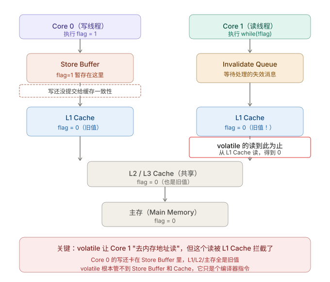
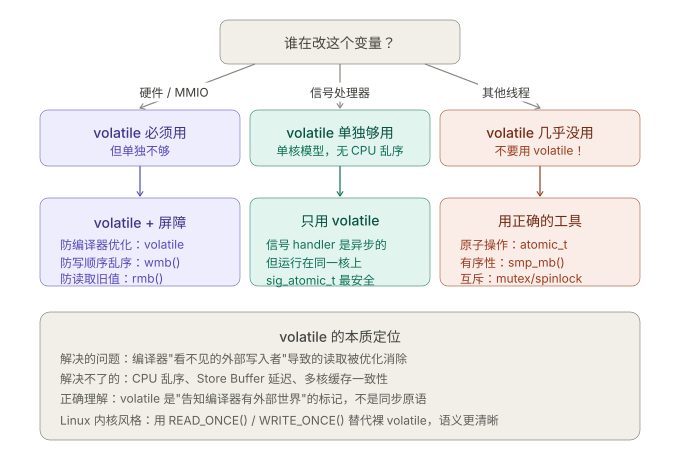

```table-of-contents
```

# 背景

# volatile 的作用

**`volatile` 的唯一作用**：告诉编译器"每次都去内存读，不要把值缓存在寄存器里"。它只作用在编译时，不产生任何 CPU 指令。

即：`volatile` **约束编译器，不约束 CPU**；

```c
volatile int x;
```



## volatile 保证什么

编译器保证：
1. 每次读都从内存加载（不会缓存寄存器）
2. 每次写都真的写回内存
3. 不删除、合并、重排对它的访问（在编译器层面）

## volatile 不保证什么

**`volatile` 无法解决的问题**：

- 不能防止 CPU 乱序执行
- 不能让写操作立即对其他核可见（Store Buffer 问题）
- 不能保证"读-改-写"的原子性（`volatile int v; v++` 仍是三条非原子指令）

### volatile 为什么无法解决可见性问题
在多核 CPU 里，读取路径是这样的：
```bash
寄存器 ← L1 Cache ← L2 Cache ← L3 Cache ← 内存
```



`volatile` 对编译器说的是：**"每次读写都发出访问那个内存地址的指令"**。编译器照做了，确实生成了 `LDR`（Load： 读内存）指令，而不是直接用寄存器里的缓存值。


但 CPU 执行 `LDR` 时，查询顺序是：
```bash
寄存器 → L1 Cache → L2 Cache → L3 Cache → 主存
```
`volatile` 只保证**不用寄存器缓存**，但 **L1 Cache 照样会被命中**。而 Core 0 的写入此时还卡在 Store Buffer 里，L1 Cache 里的值根本没更新——Core 1 读到的仍然是旧值。

#### 一条写指令的真实旅程

`volatile` 告诉编译器"每次都去内存地址读"，但这句话有个致命的隐含前提——**它只管编译器生不生成 `STORE`/`LOAD` 机器指令**，生成指令之后发生什么，它完全不知情。
真正的问题在于：**`STORE` 指令执行后，数据不是直接写到共享内存的**。


一条写指令的真实旅程：
```bash
Core 0 执行 MOV [flag_addr], 1
         │
         ▼
    Store Buffer  ← 数据先在这里！（Core 0 私有，其他核看不到）
         │
         │  异步、延迟刷新（可能几十个时钟周期后）
         ▼
    Core 0 L1 Cache
         │
         │  MESI 协议：发送 Invalidate 消息给其他核
         ▼
    Core 1 收到失效信号，把自己 L1 Cache 里的旧值标记为无效
         │
         ▼
    Core 1 下次读 flag，才会去取最新值
```

`volatile` 保证的只是第一步：**让编译器生成真正的 `MOV` 指令，而不是把值缓存在寄存器里跳过这条指令**。但==数据进入 Store Buffer 之后的整个旅程，`volatile` 完全不参与==。

### 什么解决了可见性问题

#### 带 memory order的原子操作

```c
#include <stdatomic.h>

atomic_int flag = 0;
int data = 0;

// 写线程
data = 100;
atomic_store_explicit(&flag, 1, memory_order_release);

// 读线程
while (!atomic_load_explicit(&flag, memory_order_acquire));
printf("%d\n", data);
```

分析：
```bash
### release（写侧）

- 保证：`data=100` **先对外可见**
- 才允许 `flag=1` 被观察到


### acquire（读侧）

- 一旦看到 `flag=1`
- 必须重新获取后续数据（不能用旧 cache）


建立了：flag → data 的 happens-before 关系
```

#### 内存屏障

`smp_mb()` 之所以能解决可见性，是因为它生成的是真正的 **CPU 硬件指令**（x86 上是 `MFENCE`，ARM 上是 `DMB ISH`），这条指令直接作用于两个硬件结构：

**对写线程（Core 0）**：强制把 Store Buffer 里所有待提交的写刷入缓存一致性系统（MESI 协议），并广播 Invalidate 消息给其他核。

**对读线程（Core 1）**：强制排空 Invalidate Queue——处理掉所有收到但还没处理的"请把你的缓存行标为无效"消息，让 L1 Cache 中的旧值失效，下次读就必须从更新后的缓存或内存拿。

一句话总结：

> `volatile` 是**编译器指令**，告诉编译器"别用寄存器缓存"，它的管辖范围止步于编译器生成的指令。`smp_mb()` 是**硬件指令**，直接命令 CPU 刷 Store Buffer 和 Invalidate Queue，这才是多核可见性的真正保障。两者解决的是完全不同层次的问题。

#### `volatile` 与屏障的边界

|层次|谁负责|工具|
|---|---|---|
|编译时：要不要生成 STORE/LOAD 指令|编译器|`volatile`|
|运行时：STORE 何时从 Store Buffer 刷入 Cache|CPU 硬件|`smp_wmb()`|
|运行时：LOAD 何时感知到其他核的写入|CPU 硬件|`smp_rmb()`|
|缓存一致性：失效信号何时广播给其他核|MESI 协议硬件|屏障触发|

`volatile` 是编译时的概念，Store Buffer 是运行时的硬件，两者根本不在同一个层次上。这就是为什么 `volatile` 能保证"每次都读内存地址"，却无法保证读到的是最新值——因为"最新值"还堵在另一个核的 Store Buffer 里，还没走完 MESI 协议的路。

**用一个比喻来理解**：
想象你在公司写了一份文件更新（`STORE` 指令），`volatile` 保证的是"你确实把文件交给了前台收件箱"（Store Buffer）。但前台什么时候把文件送到公司的公共档案室（共享内存），其他同事什么时候能从档案室看到更新——这些 `volatile` 一概不管。
内存屏障（`smp_mb()`）的作用是：**"停下，等前台把文件送到档案室，并通知所有同事档案已更新，才允许后续操作继续"**。

# 什么时候用  volatile

当你写代码时，问自己：
（1）这个变量会被“硬件”修改吗？
如果会修改，用 volatile

（2）这个变量会被“另一个线程”修改吗？
用 atomic / 锁（不要用 volatile）

## volatile 用在哪里？

`volatile` 单独用，还是配合屏障用，完全取决于"谁在改这个变量"：



### 场景一：硬件或寄存器

**凡是“内存背后是硬件”的「即：硬件要读写这块内存的」，都必须 volatile**。

- NIC doorbell（MMIO）
- 硬件寄存器

### 场景二：中断 / 信号处理（有限使用）

```c
volatile sig_atomic_t flag = 0;

中断处理：
void handler(int) {
    flag = 1;
}
```

```c
主线程：
while (!flag);
```

这里 volatile 的作用：防止编译器把 flag 优化成寄存器变量

## `volatile` 必须配合什么使用？

### volatile 和 内存屏障的配合使用

一个真实的 MMIO 例子：volatile 必须 + 屏障配合；驱动程序里写两个寄存器，顺序不能错：
```c
/* 正确做法：volatile 防编译器消除读写 + wmb 防 CPU 乱序 */
volatile uint32_t *dma_src  = (volatile uint32_t *)0xFE000000;
volatile uint32_t *dma_dst  = (volatile uint32_t *)0xFE000004;
volatile uint32_t *dma_ctrl = (volatile uint32_t *)0xFE000008;

*dma_src  = src_addr;   /* 必须先写地址 */
*dma_dst  = dst_addr;
wmb();                  /* 保证上面两个写在 ctrl 之前到达硬件 */
*dma_ctrl = START_DMA;  /* 写寄存器，最后才触发 DMA */
```

这里 `volatile` 和 `wmb()` 各司其职，缺一不可：没有 `volatile`，编译器可能合并或消除这些写；没有 `wmb()`，CPU 可能乱序把 `START_DMA` 提前发给硬件，导致 DMA 读到未初始化的地址。


## 小结

`volatile` 的真正语义是：**"这个变量可能被编译器感知不到的外部力量修改，每次读写都必须真正访问内存地址"**。

它能做到的只有这一件事。所以：
- 用于 MMIO / 硬件寄存器：`volatile` 必须用，但单独不够，要配合 `rmb()`/`wmb()` 防 CPU 乱序。
- 用于信号处理器：`volatile sig_atomic_t` 单独就够，因为信号在同一核上异步打断，不涉及多核 Store Buffer。
- 用于多线程同步：**不要用 `volatile`**，它根本解决不了多核可见性问题，用 `atomic_t`、`smp_mb()`、锁。
- Linux 内核现代写法：用 `READ_ONCE(x)` 代替 `*(volatile typeof(x) *)&x`，用 `WRITE_ONCE(x, val)` 代替赋值，避免写出容易被误解的裸 `volatile`。

# 其他
## volatile 修饰结构体时，结构体的成员也是volatile的吗
```c
struct A {
    int data;
};
volatile A a;
const A b;

```
答案是结构体内所有的都是volatile，引用c++标准里的一句话：
```bash
[Note: volatile is a hint to the implementation to avoid aggressive optimization involving the object because the value of the object might be changed by means undetectable by an implementation. See 1.9 for detailed semantics. In general, the semantics of volatile are intended to be the same in C + + as they are in C. ]
```
这里大体可以理解为一个对象是volatile，那对象里所有的成员也都是volatile。

# 小结
## 内核不建议使用 volatile 关键字

参考：[Why the "volatile" type class should not be used](https://www.kernel.org/doc/Documentation/process/volatile-considered-harmful.rst)

# 参考
```bash

# 高性能程序volatile的错误使用
https://mp.weixin.qq.com/s/tYZmMUxJnp_xEZpTJZ20xg

# # Volatile and memory barriers
https://jpbempel.github.io/2015/05/26/volatile-and-memory-barriers.html
  
### Volatile, Memory Barriers, and Load/Store Reordering
https://systemtbe.blogspot.com/2014/05/volatile-memory-barriers-and-loadstore.html


# Memory Model and Synchronization Primitive - Part 1: Memory Barrier
https://www.alibabacloud.com/blog/597460
```