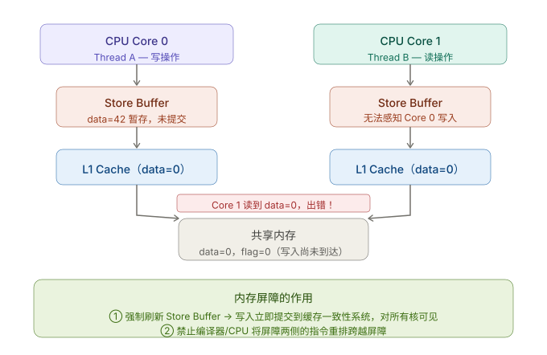
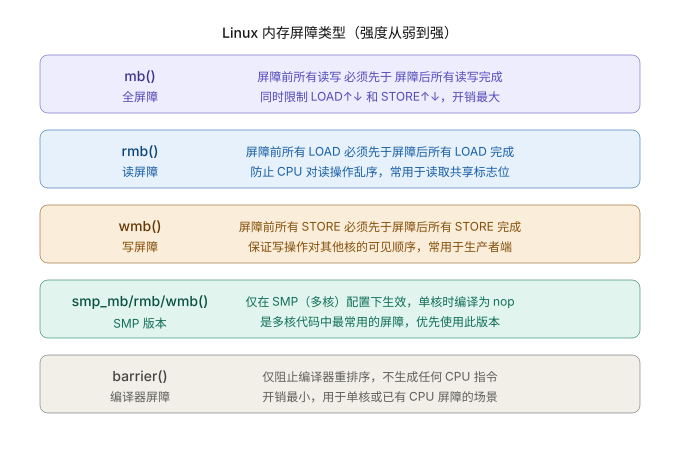

```table-of-contents
```

# 访问内存的发展
从硬件的角度来看，最初对内存的访问过程大概是这样：
```bash
CPU <--> 内存
```

相对于 CPU 的执行频率，直接访问内存速度较慢，于是引入存储速度比内存更快、但更贵、更小容量的 `CPU cache` ，用于缓存最近访问的内存数据，硬件拓扑结构如下图（不考虑多级 cache 情形）：


于是访问内存的过程变成了这样：
```bash
1. cahce 命中，直接从 cache 中读取
   CPU <--> CPU cache
2. cahce 未命中，从内存加载到 cache ，再从 cache 读取
   CPU <--> CPU cache <--> 内存
```

有了 `CPU cache`，速度上得到了很大提升，但人的追求永无止境，为了更快的速度，在 `CPU` 和 `cache` 之间， 又加入了更快更贵更小容量的 `store buffer` 存储。此时硬件拓扑如下：


在有 `store buffer` 缓存的情形下，`写操作数据`写入到 `store buffer` ，在需要的时候再写入到 `cache` 。


# 为什么需要内存屏障

## 乱序
现代系统存在两层"乱序"：
**1. 编译器重排序**：编译器为了优化，可能把看似无关的语句调换顺序。
**2. CPU 乱序执行（Out-of-Order Execution）**：CPU 为了最大化流水线利用率，会对==读写指令重排序==。每个 CPU 核心还有 ==Store Buffer 和 Invalidate Queue，导致写操作不会立刻对其他核心可见==。




## 编译层面(编译器重排)

如果前后代码无数据依赖关系，如果编译优化选项（-O2或者-O3)级别比较高会发生代码乱序，提升性能。

**注意：c/c++的关键字volatile只保证数据从寄存器回写到主存，没有内存屏障功能，也不保证原子性。**

```bash
原本代码：
data = 100;  
flag = 1;

编译乱序/编译器重排之后：
flag = 1;  
data = 100;
```


## CPU层面(CPU乱序执行：Out-of-Order Execution)

现在的CPU处理器支持乱序执行（out-of-order)。如果刚刚接触这个概念，**十有八九会对乱序执行产生误解，**以为是因为单纯的cpu指令乱序执行导致了上面示例代码的assert失败，其实不然。

**乱序执行的本质**： 
乱序执行是说，给定一串执行指令，cpu为了提升执行效率，会找出没有数据依赖的指令，让他们并行执行，但是，执行执行结果写回寄存器是顺序的。哪怕是先被执行的指令，它的运算结果也是按照指令次序写回到最终的寄存器的。这个和很多程序员理解的乱序执行是有区别的。所以在单核处理器系统中，虽然CPU内部支持乱序执行，但是CPU会保证最终执行结果符合程序员的要求，这种情况下不需要使用内存屏障。这里从linux内核内存屏障函数定义也可以看出：

```c
#if defined(CONFIG_ARM_DMA_MEM_BUFFERABLE) || defined(CONFIG_SMP)
#define mb()        __arm_heavy_mb()
#define rmb()       dsb()
#define wmb()       __arm_heavy_mb(st)
#define dma_rmb()   dmb(osh)
#define dma_wmb()   dmb(oshst)
#else
#define mb()        barrier()                                                                                                                              
#define rmb()       barrier()
#define wmb()       barrier()
#define dma_rmb()   barrier()
#define dma_wmb()   barrier()
#endif
```

可以看到如果是非SMP系统，内存屏障都定义成barrier()函数，这个函数就是编译器层面的内存屏障函数，避免编译器乱序执行代码。


### 为什么SMP系统会乱序

乱序的核心原因和现代cpu为了追求性能，实现的`memory model`有关，现代cpu内部有`store buffer/cache/invaliate queue`和`缓存一致性协议(MESI)`的方案导致乱序的可能。


```bash
拿上面的范例，举例子：

即使顺序没变：
data = 100;   // 还在 store buffer
flag = 1;     // 已经对外可见

另一个核看到 flag=1，但 data 还是旧值
```

# 内存屏障作用
内存屏障建立的是： **happens-before 关系**；

内存屏障防止 **编译器 重排 + CPU乱序执行**，内存屏障保证了**可见性（Visibility）和有序性（Ordering）**。
**（1）可见性（Visibility）**：强制将 Store Buffer 中的写操作提交到缓存一致性系统（MESI），让其他核心能看到最新值。
**（2）有序性（Ordering）**：阻止编译器和 CPU 将屏障前的操作"跑"到屏障之后，或将屏障后的操作"提前"到屏障之前执行。

## 为什么需要内存屏障

多核系统中真实执行是这样的：

- CPU 有 store buffer / cache
- CPU指令可以乱序执行
- 编译器重排

```c
经典问题：

// 线程1
data = 100;
flag = 1;

// 线程2
if (flag == 1)
    printf("%d\n", data);

结果：可能输出 0


```


# 内存屏障分类




## 写屏障（Store Barrier / Write Fence）
保证：屏障之前的写 → 对其他核可见 → 才允许之后的写发生

## 读屏障（Load Barrier / Read Fence）
保证：屏障之后的读不能被提前。
## 全屏障（Full Barrier / Memory Fence）

# 内存屏障API

Linux / DPDK / C11 写法对照如下。

```c
rte_mb();           // DPDK
smp_mb();           // Linux kernel
__sync_*            // GCC legacy atomic
atomic_thread_fence(seq_cst)
```

**全屏障** `mb()` / `smp_mb()`：限制所有读写跨越屏障重排，开销最大，用于无法单独区分读写方向时。

**写屏障** `wmb()` / `smp_wmb()`：仅约束 STORE 顺序，生产者端常用。比全屏障便宜，因为只需刷新 Store Buffer 而不用等待 Invalidate Queue。

**读屏障** `rmb()` / `smp_rmb()`：仅约束 LOAD 顺序，消费者端常用。处理 Invalidate Queue 中的失效消息，确保读到最新数据。

**编译器屏障** `barrier()`：等价于 `asm volatile("" ::: "memory")`，只告诉编译器"别乱动这些内存"，不生成任何 CPU 指令，零运行时开销，适用于单核或已有其他 CPU 屏障的场合。

`smp_*` 系列版本在单核（UP）编译时退化为 `barrier()`，多核（SMP）编译时才展开为真正的 CPU 屏障指令。内核代码中几乎总应该用 `smp_mb()` 而非 `mb()`。


# 悲观锁(读写锁/自旋锁/mutex)和内存屏障
锁与内存屏障：**锁是内含屏障的重型工具**
`mutex_lock()` 在获取锁时隐含 **acquire 语义**（等价于 `smp_mb()`），`mutex_unlock()` 在释放时隐含 **release 语义**。这意味着：
被同一把锁保护的临界区内，所有读写对其他核来说是有序且可见的。**用了锁就不要再手动加 `smp_mb()`**，既无必要又增加开销。

反过来，手动屏障的价值在于**无锁路径**——当你用 `atomic_t` + 标志位实现无锁队列、环形缓冲区、或单生产者单消费者时，屏障以极低的开销提供有序性保证，而锁的 CAS + 竞争仲裁在高频路径上会成为瓶颈。


小结：
**（1）加锁 = 内含全屏障**。`mutex_lock()` 在获取锁时插入 acquire 语义屏障，`mutex_unlock()` 插入 release 语义屏障，确保临界区内的读写不会泄漏到临界区外。
**（2）有锁时不需要手动加屏障**（同一把锁保护的数据）。如果你用了 `mutex`，临界区内的操作已有序，多余的 `mb()` 只是浪费。
**（3）手动屏障用于无锁路径**。当你用原子变量 + 标志位替代锁来提升性能时，就必须手动处理有序性。`seqlock`、`RCU`、无锁队列都属于这类。

一句话总结：**锁是带互斥能力的重型内存屏障；内存屏障是没有互斥能力的轻型有序性保证**。当不需要互斥、只需要保证其他核看到正确的写顺序时，用屏障而不是锁，性能会好很多。**在高性能内核代码里，选择依次是：能用 `smp_rmb/wmb` 就不用 `mb`，能用 `mb` 就不用锁；能用 `atomic` + 屏障就不用 `mutex`**。
```c
mutex/spinlock = 屏障（mb）+ 互斥（CAS + 等待队列）
smp_mb()       = 纯屏障，无互斥
atomic_t       = 原子读改写，屏障语义因架构而异
barrier()      = 只管编译器，CPU 随意
volatile       = 只管编译器"别缓存寄存器"，其余都不管
```


# 乐观锁（cas）和内存屏障



CAS 一定提供原子性；是否提供顺序性取决于所用的内存序（或是否配套内存屏障）；可见性依赖缓存一致性 + 内存序。
> 注：现代处理器中有CAS指令，并且是一条指令(x86 上是 `LOCK CMPXCHG`)，保证了CAS的原子性。

CAS 本身**不自动保证完整顺序性**；是否有顺序，取决于：
- 使用的 API
- 指定的 memory_order

CAS ≠ 内存屏障，但可以“携带”内存屏障语义
```c
(1) 在 C11 / GCC __atomic 中

atomic_compare_exchange_strong_explicit(
    &obj, &expected, desired,
    memory_order_acq_rel,
    memory_order_relaxed);

这里：
- CAS 成功时 = acquire + release 屏障
- CAS 失败时 = relaxed
```

|CAS + memory_order|等价效果|
|---|---|
|relaxed|只有原子性|
|acquire|CAS 后读不会提前|
|release|CAS 前写不会延后|
|acq_rel|双向屏障|
|seq_cst|全局顺序|

## CAS 与 volatile 的关系

`volatile` 和 CAS 解决的是**完全不同层次**的问题，经常被错误地混搭使用：

**`volatile` 的唯一作用**：告诉编译器"每次都去内存读，不要把值缓存在寄存器里"。它只作用在编译时，不产生任何 CPU 指令。

**`volatile` 无法解决的问题**：

- 不能防止 CPU 乱序执行
- 不能让写操作立即对其他核可见（Store Buffer 问题）
- 不能保证"读-改-写"的原子性（`volatile int v; v++` 仍是三条非原子指令）

**两者搭配的误区**：`volatile` 修饰 CAS 操作的目标变量**毫无额外价值**，因为 CAS 指令本身已经直接操作内存地址，编译器不会对 `LOCK CMPXCHG` 做寄存器缓存优化。`volatile` 在这里只是安慰剂。

Linux 内核用 `READ_ONCE()` / `WRITE_ONCE()` 替代裸 `volatile`，它们本质上是 `volatile` 转型，但语义更清晰：明确告诉读者"此处有并发访问，且需要配合屏障或 CAS"。

## 小结

|能力|CAS|内存屏障|锁|
|---|---|---|---|
|原子性|✅|❌|✅|
|顺序性|⚠️|✅|✅|
|可见性|⚠️|✅|✅|
|互斥|❌|❌|✅|


当你写 CAS 时，必须问：

1. **是否需要顺序？ → 要用 acquire/release**
2. **是否需要互斥？ → CAS 不够，要锁**

## 范例

（1）错误写法
```c
atomic_int flag = 0;
int data = 0;

// 线程1
data = 100;
atomic_compare_exchange_strong_explicit(
    &flag, &expected, 1,
    memory_order_relaxed,
    memory_order_relaxed);

// 线程2
if (flag == 1)
    printf("%d\n", data);

结果：可能打印 0
分析： CAS 是原子的， 但没有顺序保证；
```


（2）正确写法
```c
// 线程1
data = 100;
atomic_store_explicit(&flag, 1, memory_order_release);

// 或 CAS + release

// 线程2
if (atomic_load_explicit(&flag, memory_order_acquire)) {
    printf("%d\n", data);
}
```


# volatile 关键字 和内屏屏障
volatile 只约束编译器；内存屏障约束 CPU/编译器的重排。


C 标准里 `volatile` 只有一个语义：**告诉编译器每次都从内存中读，不要把值缓存在寄存器里**。它解决的是编译器优化导致的"不去读内存"问题。

`volatile` **无法解决**的是 CPU 乱序和跨核可见性。即便每次都从"内存"读，如果 Store Buffer 里还有未提交的写，读到的仍是旧值。Linux 内核明确反对用 `volatile` 做多核同步，并提供了 `READ_ONCE()` / `WRITE_ONCE()` 宏来替代——它们用 `volatile` 转型防止编译器合并访问，但同时明确告诉读者此处需要配合屏障才能保证多核正确性。


# 原子变量和内存屏障

`atomic_t` 与内存屏障：原子性 ≠ 有序性
`atomic_inc(&v)` 保证的是这个"读-改-写"不会被其他核撕裂（atomicity），但**不保证**它与其他内存操作之间的相对顺序。

典型陷阱：
```c
atomic_inc(&counter); 
flag = 1; /* 可能被 CPU 提前到 atomic_inc 之前 */
```

需要有序性时，要么换用 `smp_mb()` 显式插入屏障，要么使用带屏障语义的变体；在用户态 C11/C++11 中，`_Atomic` 配合 `memory_order_acquire` / `memory_order_release` / `memory_order_seq_cst` 可以精确指定所需的屏障语义，比手动调用屏障更安全。
```c
/* 在 atomic 操作前后插入屏障 */ 
smp_mb__before_atomic(); 
atomic_inc(&counter); 
smp_mb__after_atomic();
```

# 内存屏障的使用场景
## 生产者-消费者

`wmb()` 和 `rmb()` 必须**成对使用**才能构成完整的有序性保证：



## 其他场景

**无锁环形缓冲区（kfifo）**：写入数据后调用 `smp_wmb()`，再更新写指针；读取前调用 `smp_rmb()`，再读数据。内核 `kfifo` 就是用这个模式在单生产者单消费者时完全不加锁。

**设备驱动 MMIO**：寄存器操作对硬件而言的顺序至关重要。`writel()` / `readl()` 等函数已内置屏障，直接用即可；若用 `__raw_writel()` 则需手动插入屏障。

**RCU（Read-Copy-Update）**：RCU 的 `rcu_assign_pointer()` 内含 `smp_wmb()`，`rcu_dereference()` 内含 `smp_read_barrier_depends()`，是内核中最精密的屏障用法。


# load buffer 和 store buffer 以及  Invalid Queue

参考：[# 内存屏障今生之Store Buffer, Invalid Queue](https://blog.csdn.net/wll1228/article/details/107775976)
参考：[# 每个程序员都应该了解的内存知识](https://zhuanlan.zhihu.com/p/611133924)


# 编译器屏障 vs CPU 屏障
## 编译器屏障（Compiler Barrier）
## CPU 内存屏障

# 参考
```bash
# LINUX KERNEL MEMORY BARRIERS
https://www.kernel.org/doc/Documentation/memory-barriers.txt

# Volatile and memory barriers
https://jpbempel.github.io/2015/05/26/volatile-and-memory-barriers.html

# Memory Model and Synchronization Primitive - Part 1: Memory Barrier
https://www.alibabacloud.com/blog/memory-model-and-synchronization-primitive---part-1-memory-barrier_597460
# Memory Model and Synchronization Primitive - Part 2: Memory Model
https://www.alibabacloud.com/blog/memory-model-and-synchronization-primitive---part-2-memory-model_597461

### Volatile, Memory Barriers, and Load/Store Reordering
https://systemtbe.blogspot.com/2014/05/volatile-memory-barriers-and-loadstore.html

# 彻底搞懂内存屏障（上）
https://blog.csdn.net/GetNextWindow/article/details/126565892?spm=1001.2101.3001.10752
# 彻底搞懂内存屏障（下）
https://blog.csdn.net/GetNextWindow/article/details/126679252?spm=1001.2101.3001.10796

```