```table-of-contents
```
# 基础知识
这里先给大家复习下阻塞、非阻塞、同步、异步 I/O 的概念。
## IO
### 什么是IO
IO指的是输入Input/输出Output，但是从汉语角度来说，出和入是相对的，所以我们需要个参照物。

这里我们的参照物选择为程序运行时的主存储空间，外部通常包括网卡、磁盘等。

有了上述的设定理解起来就方便多了，我们来一起看下：

> **IO的本质是数据的流动，数据可以从网卡到程序内存，也可以从程序内存写到网卡，磁盘操作也是如此。**

所以可以把常见的IO分为:

- **网络IO**：内存和网卡的数据交互
    
- **文件IO**：内存和磁盘的数据交互


### 什么是IO事件
事件可以理解为一种状态或者动作，也就是状态的迁移会触发一种相应的动作。

网络IO的事件通常包括：

- **可读事件**
    
- **可写事件**
    
- **异常事件**
    

理解可读可写事件是非常有必要的，一般来说一个socket大部分时候是可写的，但是并不是都可读。

可读一般代表是一个新连接或者原有连接有新数据交互，对于服务端程序来说也是重点关注的事件。


### 什么是IO复用

设想假如有几万个IO事件，那么应用程序该如何管理呢？这就要提到IO复用了。

**IO复用从本质上来说就是应用程序借助于IO复用函数向内核注册很多类型的IO事件，当这些注册的IO事件发生变化时内核就通过IO复用函数来通知应用程序。**


从图中可以看到，IO复用中复用的就是一个负责监听管理这些IO事件的线程。
之所以可以实现一个线程管理成百上千个IO事件，是因为大部分时间里某个时刻只有少量IO事件被触发。

大概就像这样：**草原上的一只大狗可以看管几十只绵羊，因为大部分时候只有个别绵羊不守规矩乱跑，其他的都是乖乖吃草**。

## 阻塞 I/O

先来看看**阻塞 I/O**，当用户程序执行 `read` ，线程会被阻塞，一直等到内核数据准备好，并把数据从内核缓冲区拷贝到应用程序的缓冲区中，当拷贝过程完成，`read` 才会返回。

注意，**阻塞等待的是「内核数据准备好」和「数据从内核态拷贝到用户态」** 这两个过程。过程如下图：


## 非阻塞 I/O
**非阻塞IO**正是致力于解决长时间等待IO事件，其具体处理方式是：先查询IO事件是否准备就绪，当IO事件准备就绪了，则会真正的通过系统调用实现数据读写；查询操作，不管是否数据准备就绪都会立即返回，即非阻塞；因此，通常情况下，会通过轮询，来不断监听IO事件是否准备就绪；

非阻塞的 read 请求在数据未准备好的情况下立即返回，可以继续往下执行，此时应用程序不断轮询内核，直到数据准备好，内核将数据拷贝到应用程序缓冲区，`read` 调用才可以获取到结果。


注意，==这里最后一次 read 调用，获取数据的过程，是一个同步的过程，是需要等待的过程。这里的同步指的是内核态的数据拷贝到用户程序的缓存区这个过程。==

举个例子，如果 socket 设置了 `O_NONBLOCK` 标志，那么就表示使用的是非阻塞 I/O 的方式访问，而不做任何设置的话，默认是阻塞 I/O。

因此，无论 read 和 send 是阻塞 I/O，还是非阻塞 I/O 都是同步调用。因为在 read 调用时，内核将数据从内核空间拷贝到用户空间的过程都是需要等待的，也就是说这个过程是同步的，如果内核实现的拷贝效率不高，read 调用就会在这个同步过程中等待比较长的时间。

## 事件驱动

事件驱动的核心是，以事件为连接点，当有IO事件准备就绪时，以事件的形式通知相关线程进行数据读写，进而业务线程可以直接处理这些数据，这一过程的后续操作方，都是被动接收通知，看起来有点像回调操作；
这种模式下，IO读写线程、业务线程工作时，必有数据可操作执行，不会在IO等待上浪费资源，这便是`事件驱动`的核心思想。

注：**事件驱动是相对于Polling轮询模式**。

## 异步 I/O（AIO： async IO）

真正的**异步 I/O** 是「内核数据准备好」和「数据从内核态拷贝到用户态」这**两个过程都不用等待**。

当我们发起 `aio_read` （异步 I/O） 之后，就立即返回，内核自动将数据从内核空间拷贝到用户空间，这个拷贝过程同样是异步的，内核自动完成的，和前面的同步操作不一样，**应用程序并不需要主动发起拷贝动作**。过程如下图：


### linux 内核的IO：本质上是同步IO（一般是非阻塞同步IO）
linux 内核中，epoll IO多路复用，某个fd收到数据之后，epoll_wait产生IN事件，然后在这个fd上进行read，本质上还是同步IO。
因为，系统调用read，需要从内核态到用户态拷贝数据。

### RDMA的IO：默认是异步IO（一般是非阻塞异步IO）
RDMA的一大特性 就是零拷贝，提前预申请一块内存，通过`post recv`提前下发到 RQ中，产生CQE通知的时候，数据已经在Recv Buffer中。
即产生事件通知的时候，用户就可以拿到这块数据，不用再考虑了。这个就是异步IO。

## 类比和关联 

举个你去饭堂吃饭的例子，你好比应用程序，饭堂好比操作系统。

阻塞 I/O 好比，你去饭堂吃饭，但是饭堂的菜还没做好，然后你就一直在那里等啊等，等了好长一段时间终于等到饭堂阿姨把菜端了出来（数据准备的过程），但是你还得继续等阿姨把菜（内核空间）打到你的饭盒里（用户空间），经历完这两个过程，你才可以离开。

非阻塞 I/O 好比，你去了饭堂，问阿姨菜做好了没有，阿姨告诉你没，你就离开了，过几十分钟，你又来饭堂问阿姨，阿姨说做好了，于是阿姨帮你把菜打到你的饭盒里，这个过程你是得等待的。

异步 I/O 好比，你让饭堂阿姨将菜做好并把菜打到饭盒里后，把饭盒送到你面前，整个过程你都不需要任何等待。

很明显，异步 I/O 比同步 I/O 性能更好，因为异步 I/O 在「内核数据准备好」和「数据从内核空间拷贝到用户空间」这两个过程都不用等待。


# 网络IO处理的演进

要理解网络框架有哪些，必须要清楚网络框架完成了哪些事情。


我们可以知道，要完成一个数据交互，涉及了几大块内容：

- **IO事件监听**
    
- **数据拷贝**
    
- **数据处理和计算**


小林认为，这三大块内容，不论什么形式的框架都绕不开，也是理解网络架构的关键所在。


## 基于线程模型
### 一个连接一个线程（One Request One Thread）


最初的处理方式是，每个连接都用独立的一个线程来处理这一系列的操作，即 建立连接、数据读写、业务逻辑处理；这样一来最大的弊端在于，N 个连接就需要 N 个线程资源，消耗巨大。

所以，在网络模型演化过程中，不断的对这几个阶段进行拆分，比如，将建立连接、数据读写、业务逻辑处理等关键阶段分开处理；这样一来，每个阶段都可以考虑使用单线程或者线程池来处理，极大的节约线程资源；同时，又能获得超高性能。

处理完业务逻辑后，随着连接关闭后线程也同样要销毁了，但是这样不停地创建和销毁线程，不仅会带来性能开销，也会造成浪费资源，而且如果要连接几万条连接，创建几万个线程去应对也是不现实的。

### 资源复用(线程池)
要这么解决这个问题呢？我们可以使用「资源复用」的方式。
也就是不用再为每个连接创建线程，而是创建一个「线程池」，将连接分配给线程，然后一个线程可以处理多个连接的业务。

不过，这样又引来一个新的问题，一个线程怎样才能高效地处理多个连接的业务？

当一个连接对应一个线程时，线程一般采用「read -> 业务处理 -> send」的处理流程，如果当前连接没有数据可读，那么线程会阻塞在 `read` 操作上（ socket 默认情况是阻塞 I/O），不过这种阻塞方式并不影响其他线程。

但是引入了线程池，那么一个线程要处理多个连接的业务，线程在处理某个连接的 `read` 操作时，如果遇到没有数据可读，就会发生阻塞，那么线程就没办法继续处理其他连接的业务。

要解决这一个问题，最简单的方式就是将 socket 改成非阻塞，然后线程不断地轮询调用 `read` 操作来判断是否有数据，这种方式虽然该能够解决阻塞的问题，但是解决的方式比较粗暴，因为轮询是要消耗 CPU 的，而且随着一个 线程处理的连接越多，轮询的效率就会越低。

上面的问题在于，线程并不知道当前连接是否有数据可读，从而需要每次通过 `read` 去试探，去轮询。

## 事件驱动模型 / 基于事件的驱动模型(EDM: Event-Drive-Model)
当前流行的是基于事件驱动的IO复用模型，相比多线程模型优势很明显。

事件驱动编程是一种编程范式，程序的执行流由外部事件来决定，它的特点是包含一个事件循环，当外部事件发生时使用回调机制来触发相应的处理。
通俗来说就是：**有一个循环装置在一直等待各种事件的到来，并将到达的事件放到队列中，再由一个分拣装置来调用对应的处理装置来响应**。


### I/O 多路复用
那有没有办法在只有当连接上有数据的时候，线程才去发起读请求呢？答案是有的，实现这一技术的就是 I/O 多路复用。

I/O 多路复用技术会用一个系统调用函数来监听我们所有关心的连接，也就说可以在一个监控线程里面监控很多的连接。
我们熟悉的 select/poll/epoll 就是内核提供给用户态的多路复用系统调用，线程可以通过一个系统调用函数从内核中获取多个事件。

在获取事件时，先把我们要关心的连接传给内核，再由内核检测：
- 如果没有事件发生，线程只需阻塞在这个系统调用，而无需像前面的线程池方案那样轮训调用 read 操作来判断是否有数据。
- 如果有事件发生，内核会返回产生了事件的连接，线程就会从阻塞状态返回，然后在用户态中再处理这些连接对应的业务即可。


当下开源软件能做到网络高性能的原因就是 I/O 多路复用吗？
是的，基本是基于 I/O 多路复用。

### Reactor 模型
用过 I/O 多路复用接口写网络程序的同学，肯定知道是**面向过程** 的方式写代码的，这样的开发的效率不高。
于是，==大佬们基于面向对象的思想，对 I/O 多路复用作了一层封装，让使用者不用考虑底层网络 API 的细节==，**只关注应用代码的编写**。

大佬们还为这种模式取了个让人第一时间难以理解的名字：**Reactor 模式**。

### 事件驱动模型(EDM: Event-Drive-Model) 对比 DPDK中的轮询模式（PMD: Poll Mode Driver）

 **（0）对比 **



|对比项|EDM|DPDK PMD|
|---|---|---|
|驱动方式|事件通知|主动轮询|
|CPU状态|可休眠|永远忙|
|是否依赖中断|是|基本不用|
|延迟|较高|极低|
|CPU利用率|低|极高|
|吞吐量|中等|极高|
|系统调用|有|无|
|内核参与|强依赖|完全绕过|
|网络栈|kernel TCP/IP|用户态|
|典型接口|epoll_wait|rte_eth_rx_burst|
|适合场景|高并发连接|高速数据面|


 **（1）事件驱动模型（EDM）：被动等待 **
 
CPU不主动找数据，而是配置好监听（如 `epoll_wait`），然后挂起等待内核通知。整个路径是：
```bash
NIC 收包 → 产生硬件中断 → CPU 停下当前任务 → 内核中断处理
→ 数据经协议栈处理 → 拷贝进 socket 缓冲区 → 唤醒 epoll
→ 产生事件 → 用户态执行IO操作

--------------

核心思想：“当 socket 可读/可写时，内核通知我，我再处理。”

应用程序
    ↓
epoll_wait()
    ↓（睡眠）
内核检测到网络事件
    ↓
唤醒进程
    ↓
处理socket
```
每个步骤都有代价：中断本身打断流水线、内核/用户态切换需要上下文切换（保存寄存器)、数据拷贝消耗内存带宽。但好处是 **CPU 不浪费**——没包时可以去做别的事。


 **（2）DPDK PMD（Poll Mode Driver）：主动轮询 **
 
PMD 的思路是"与其等通知，不如自己盯着"。专用 CPU 核心运行一个紧凑的 `while(1)` 循环，直接读取 NIC 的 RX 环形描述符队列：
```c
while (1) {
	// 核心就是这一行，不断重复 
	nb_rx = rte_eth_rx_burst(port_id, queue_id, mbufs, MAX_PKT_BURST);
}
```
NIC 通过 DMA 直接把包写入 Hugepage 内存，CPU 轮询到描述符有数据时立即处理，**全程无中断、无系统调用、无数据拷贝**。代价是那颗CPU Core核心从此不能做别的事，即使没有流量也在空转。


 **(3) 使用场景 **

|场景特征|选择|
|---|---|
|大量并发连接、流量稀疏（Web、微服务）|**事件驱动模型**|
|极低延迟要求（< 10 µs）、流量密集|**DPDK PMD**|
|高吞吐包转发（路由器、防火墙、NFV）|**DPDK PMD**|
|普通服务器、不想独占 CPU 核|**事件驱动模型**|
|金融交易、高频报单|**DPDK PMD 或 RDMA**|

两者并非竞争关系——很多系统用 DPDK 处理数据面（快速路径），用事件驱动处理控制面（慢速路径），各司其职。
现代系统很多是：==控制面 EDM + 数据面 PMD==。

|模块|模型|
|---|---|
|管理连接|epoll|
|数据转发|DPDK|
|配置/查询接口|event-driven|
|fast path|polling|

# Reactor(分配器：Dispatcher)

Reactor 翻译过来的意思是「反应堆」，可能大家会联想到物理学里的核反应堆，实际上并不是的这个意思。
这里的反应指的是「**对事件反应**」，也就是**来了一个事件，Reactor 就有相对应的反应/响应**。
事实上，Reactor 模式也叫 `Dispatcher` 模式，我觉得这个名字更贴合该模式的含义，即 **I/O 多路复用监听事件，收到事件后，根据事件类型分配（Dispatch）给某个进程 / 线程**。

## 介绍
网络框架的设计离不开 **I/O 线程模型**，线程模型的优劣直接决定了系统的吞吐量、可扩展性、安全性等。
当前主流高性能的**I/O线程模型**的实现本质是**进程/线程/协程和 I/O多路复用的一个封装**，让用户只要聚焦业务处理，屏蔽网络请求处理的细节。

reactor模型作为其中的事件分发器，负责将读写事件分发给对应的读写事件处理者。
reactor模型是一种**事件驱动**的**应用层**I/O模型，基于**分而治之**和**事件驱动**的思想，致力于构建一个**高性能**的**可伸缩**的I/O模型。

Reactor 模式，市面上常见的开源软件很多都采用了这个方案，比如 Redis、Nginx、Netty 等等，所以学好这个模式设计的思想，不仅有助于我们理解很多开源软件，而且也能在面试时吹逼。


## 基本组件

从本质上理解，无论什么网络框架都要完成两部分操作：
- **IO操作**：数据包的读取和写入，以及连接新建
- **CPU操作**：数据请求的处理和封装


Reactor 模型中的反应器角色类似于事件转发器（承接连接建立、IO处理以及事件分发），示例图下：


Reactor 模式由 `Reactor 线程`、`Handlers 处理器（处理资源池）`两大角色组成，两大角色的职责分别如下：

- Reactor 线程（IO线程）的职责：负责监听和分发事件，事件类型包含连接事件（新建连接）、读写事件。
- Handlers 处理器（worker线程）的职责：负责处理事件，如 read -> 业务逻辑 -> send，非阻塞的执行业务处理逻辑。


### 事件
客户端向服务器端发送连接请求，该请求对应了服务器的一个连接事件；
连接建立后，客户端给服务器端发送写请求，服务器端收到请求，需要从请求中读取内容，这就对应了服务器的读事件；
服务器经过处理后，把结果值返回给客户端，这就对应了服务器的写事件；


### 角色

上述描述了 Reactor 的事件，每个事件都需要有一个专门的负责人，在 Reactor 模型中，这个负责人就是角色，其说明如下：

- 连接事件由 acceptor来处理，只负责接收连接；acceptor 在接收连接后，会创建 handler，用于网络连接上对后续读写事件的处理；
- 读写事件由 handler 处理，处理完后响应客户端；
- 在连接事件、读写事件会同时发生的高并发场景中，需要reactor 角色专门监听和分配事件：连接事件交由 acceptor 处理；读写请求交由 handler 处理；


## reactor和线程


Reactor 模式是灵活多变的，可以应对不同的业务场景，灵活在于：
- Reactor 的数量可以只有一个，也可以有多个；
- 处理资源池可以是单个进程 / 线程，也可以是多个进程 /线程；

将上面的两个因素排列组设一下，理论上就可以有 4 种方案选择：
- 单 Reactor 单进程 / 线程；
- 单 Reactor 多进程 / 线程；
- 多 Reactor 单进程 / 线程；
- 多 Reactor 多进程 / 线程；

其中，「多 Reactor 单进程 / 线程」实现方案相比「单 Reactor 单进程 / 线程」方案，不仅复杂而且也没有性能优势，因此实际中并没有应用。
剩下的 3 个方案都是比较经典的，且都有应用在实际的项目中
- 单 Reactor 单进程 / 线程；
- 单 Reactor 多线程 / 进程；
- 多 Reactor 多进程 / 线程；

方案具体使用进程还是线程，要看使用的编程语言以及平台有关：
- Java 语言一般使用线程，比如 Netty;
- C 语言使用进程和线程都可以，例如 Nginx 使用的是进程，Memcache 使用的是线程。

### 单 Reactor 单进程 / 线程： RTC模式

这种模式最为简洁，一个线程完成了连接的监听、接收新连接、处理连接、读取数据、写入数据全套工作。


在这种模式种IO操作和CPU操作是没有分开的，都是由1个线程来完成的，显然如果在Handler处理某个请求超时了将会阻塞客户端的正常连接。

一般来说，C 语言实现的是**单 Reactor 单进程**的方案，因为 C 语编写完的程序，运行后就是一个独立的进程，不需要在进程中再创建线程。

而 Java 语言实现的是**单 Reactor 单线程**的方案，因为 Java 程序是跑在 Java 虚拟机这个进程上面的，虚拟机中有很多线程，我们写的 Java 程序只是其中的一个线程而已。


#### 流程
可以看到进程里有 **Reactor、Acceptor、Handler** 这三个对象：

- Reactor 对象的作用是监听和分发事件；
- Acceptor 对象的作用是获取连接；
- Handler 对象的作用是处理业务；

对象里的 select、accept、read、send 是系统调用函数，dispatch 和 「业务处理」是需要完成的操作，其中 dispatch 是分发事件操作。

接下来，介绍下「单 Reactor 单进程」这个方案：
- Reactor 对象通过 select （IO 多路复用接口） 监听事件，收到事件后通过 dispatch 进行分发，具体分发给 Acceptor 对象还是 Handler 对象，还要看收到的事件类型；
- 如果是连接建立的事件，则交由 Acceptor 对象进行处理，Acceptor 对象会通过 accept 方法 获取连接，并创建一个 Handler 对象来处理后续的响应事件；
- 如果不是连接建立事件， 则交由当前连接对应的 Handler 对象来进行响应；
- Handler 对象通过 read -> 业务处理 -> send 的流程来完成完整的业务流程。

#### 优缺点
单 Reactor 单进程的方案因为全部工作都在同一个进程内完成，所以实现起来比较简单，不需要考虑进程间通信，也不用担心多进程竞争。

这种方案存在 2 个缺点：
- （1）第一个缺点，因为只有一个进程/线程，**无法充分利用 多核 CPU 的性能**；
一个线程支持处理的连接数非常有限，CPU 很容易打满，性能方面有明显瓶颈；
 
- （2）第二个缺点，Handler 对象在业务处理时，整个进程是无法处理其他连接的事件的，**如果业务处理耗时比较长，那么就造成响应的延迟**；
在单线程 Reactor 模式中，Reactor 和 Handler 都在同一条线程中执行。这样，带来了一个问题：当其中某个 Handler 阻塞时，会导致其他所有的 Handler 都得不到执行。

所以，单 Reactor 单进程的方案**不适用计算机密集型的场景，只适用于业务处理非常快速的场景**。

#### 应用
Redis 是由 C 语言实现的，它采用的正是单 Reactor 单进程的方案，因为 Redis 业务处理主要是在内存中完成，操作的速度是很快的，性能瓶颈不在 CPU 上，所以 Redis 对于命令的处理是单进程的方案。

即：在Redis中由于都是内存操作，速度很快，这种瓶颈虽然存在但是不够明显。

### 单 Reactor 多进程 / 线程：Pipeline模式
为了解决IO操作和CPU操作的不匹配，也就是IO操作和CPU操作是在一个线程内部串行执行的，这样就拉低了CPU操作效率。


一种解决方法就是将IO操作和CPU操作分别由单独的线程来完成，各玩各的互不影响。单Reactor线程完成IO操作、复用工作线程池来完成CPU操作就是一种解决思路。这样就产生了**单 Reactor 多线程 / 多进程**的方案。

闻其名不如看其图，先来看看「单 Reactor 多线程」方案的示意图如下：

在这种模式种由Reactor线程完成连接的管理和数据读取&写回，完全掌管IO操作。
工作线程池处理来自上游分发的任务，对其中的数据进行解码、计算、编码再返回给Reactor线程和客户端完成交互。


Reactor 多线程模型将`业务逻辑`交给多个线程进行处理。除此之外，多线程模型其他的操作与单线程模型是类似的，比如连接建立、IO事件读写以及事件分发等都是由一个线程来完成。

#### 流程

详细说一下这个方案：
- （1）Reactor 对象通过 select （IO 多路复用接口） 监听事件，收到事件后通过 dispatch 进行分发，具体分发给 Acceptor 对象还是 Handler 对象，还要看收到的事件类型；
- （2）如果是连接建立的事件，则交由 Acceptor 对象进行处理，Acceptor 对象会通过 accept 方法 获取连接，并创建一个 Handler 对象来处理后续的响应事件；
- 如果不是连接建立事件， 则交由当前连接对应的 Handler 对象来进行响应；


上面的三个步骤和单 Reactor 单线程方案是一样的，接下来的步骤就开始不一样了：
一般的请求中，耗时最长的一般是业务处理，所以用一个线程池（worker 线程池）来处理业务操作，在性能上的提升也是非常可观的。
- （3）Handler 对象不再负责业务处理，只负责数据的接收和发送，Handler 对象通过 read 读取到数据后，会将数据发给子线程里的 Processor 对象进行业务处理；
- （4）子线程里的 Processor 对象就进行业务处理；处理完后，将结果发给主线程中的 Handler 对象，接着由 Handler 通过 send 方法将响应结果发送给 client；


#### 优缺点
单 Reator 多线程的方案优势在于**能够充分利用多核 CPU 的能**，那么也存在其他问题：

**（1）多线程竞争资源的问题**
那既然引入多线程，那么自然就带来了多线程竞争资源的问题。
例如，子线程完成业务处理后，要把结果传递给主线程的 Reactor 进行发送，这里涉及共享数据的竞争。

要避免多线程由于竞争共享资源而导致数据错乱的问题，就需要在操作共享资源前加上互斥锁，以保证任意时间里只有一个线程在操作共享资源，待该线程操作完释放互斥锁后，其他线程才有机会操作共享数据。

**（2）单Reactor线程不足以处理大量连接的问题**
这种模式有效利用了多核，但是单Reactor线程来完成IO操作在高并发场景中仍然会出现瓶颈。
换句话说，连接实在太多了，一个Reactor线程忙不过来建立新连接和响应旧连接这些事情，因此Reactor线程也需要几个帮手。

连接建立、IO事件读取以及事件分发完全通过单线程处理；比如当某个连接通过系统调用正在读取数据，此时相对于其他事件来说，完全是阻塞状态，新连接无法处理、其他连接的IO查询/IO读写以及事件分发都无法完成。

对于像 Nginx、Netty 这种对高性能、高并发要求极高的网络框架，这种模式便显得有些吃力了。因为，无法及时处理新连接、就绪的IO事件以及事件转发等。

#### 其他
##### 单 Reactor 多进程
聊完单 Reactor 多线程的方案，接着来看看单 Reactor 多进程的方案。

事实上，单 Reactor 多进程相比单 Reactor 多线程实现起来很麻烦，主要因为要考虑子进程 <-> 父进程的双向通信，并且父进程还得知道子进程要将数据发送给哪个客户端。

而多线程间可以共享数据，虽然要额外考虑并发问题，但是这远比进程间通信的复杂度低得多，因此实际应用中也看不到单 Reactor 多进程的模式。


### 多 Reactor 多进程 / 线程（主从 Reactor 多线程模型）：pipeline模式
水平扩展往往是提供性能的有效方法。

我们将Reactor线程进行扩展，一个Reactor线程负责处理新连接，多个Reactor线程负责处理连接成功的IO数据读写。
也就是进一步将监听&创建连接 和 处理连接 分别由两个及以上的线程来完成，进一步提高了IO操作部分的效率。


要解决「单 Reactor」的问题，就是将「单 Reactor」实现成「多 Reactor」，这样就产生了第 **多 Reactor 多进程 / 线程**的方案。
在单 Reactor多线程模型中，我们提到，其主要缺陷在于同一时间无法处理**大量新连接**、**IO就绪事件**；因此，将主从Reactor模式应用到这一块，就可以解决这个问题。


注：在海量客户端并发请求的场景下，主从多线程模式甚至可以适当增加 SubReactor 线程的数量，从而利用多核能力提升系统的吞吐量。

#### 流程

主从 Reactor 模式中，分为了主 Reactor 和 从 Reactor，分别处理 `新建立的连接`、`IO读写事件/事件分发`。

- 主 Reactor 可以解决同一时间大量新连接，将其注册到从 Reactor 上进行IO事件监听处理
- IO事件监听相对新连接处理更加耗时，此处我们可以考虑使用线程池来处理。这样能充分利用多核 CPU 的特性，能使更多就绪的IO事件及时处理。

主从Reactor多线程模型由多个 Reactor 线程组成，每个 Reactor 线程都有独立的 Selector 对象。MainReactor 仅负责处理客户端连接的 Accept 事件，连接建立成功后将新创建的连接对象注册至 SubReactor。再由 SubReactor 分配线程池中的 I/O 线程与其连接绑定，它将负责连接生命周期内所有的 I/O 事件。

方案详细说明如下：
- 主线程中的 MainReactor 对象通过 select 监控连接建立事件，收到事件后通过 Acceptor 对象中的 accept  获取连接，将新的连接分配给某个子线程；
- 子线程中的 SubReactor 对象将 MainReactor 对象分配的连接加入 select 继续进行监听，并创建一个 Handler 用于处理连接的响应事件。
- 如果有新的事件发生时，SubReactor 对象会调用当前连接对应的 Handler 对象来进行响应。
- Handler 对象通过 read -> 业务处理 -> send 的流程来完成完整的业务流程。

#### 优缺点

多 Reactor 多线程的方案虽然看起来复杂的，但是实际实现时比单 Reactor 多线程的方案要简单的多，原因如下：

- 主线程和子线程分工明确，主线程只负责接收新连接，子线程负责完成后续的业务处理。
- 主线程和子线程的交互很简单，主线程只需要把新连接传给子线程，子线程无须返回数据，直接就可以在子线程将处理结果发送给客户端。


#### 应用

大名鼎鼎的两个开源软件 Netty 和 Memcache 都采用了「多 Reactor 多线程」的方案。

采用了「多 Reactor 多进程」方案的开源软件是 Nginx，不过方案与标准的多 Reactor 多进程有些差异。
具体差异表现在主进程中仅仅用来初始化 socket，并没有创建 mainReactor 来 accept 连接，而是由子进程的 Reactor 来 accept 连接，通过锁来控制一次只有一个子进程进行 accept（防止出现惊群现象），子进程 accept 新连接后就放到自己的 Reactor 进行处理，不会再分配给其他子进程。

## 小结

Reactor 模型也叫 Dispatcher 模式，底层是 **I/O 多路复用结合线程池**，主要是用于服务器端处理高并发网络 IO 请求。Reactor 模型的核心思想可以总结成 2个"3种"：
- 3种事件：连接事件、读事件、写事件；
- 3种角色：reactor、acceptor、handler；

 Reactor 模型核心是围绕`事件驱动`模型
- 一方面监听并处理IO事件。
- 另一方面将这些处理好的事件分发业务线程处理。


# Proactor（主动器）

Proactor，中文翻译为"前摄器"。乍一看，这个翻译还是挺懵的，个人觉得**主动器**更符合 Proactor 模型的本意。
Proactor 可以理解为“当有连接、读写等IO事件时，操作系统内核在处理完事件后主动通知我们的程序代码”。底层的异步IO（AIO）机制可能借助于DMA和Zero-Copy技术来实现，理论上性能更高。

前面提到的  **Reactor 是==非阻塞同步==网络模式 **，而 **Proactor 是==非阻塞异步==网络模式**。

## Proactor 模式的工作流程


介绍一下 Proactor 模式的工作流程：

- Proactor Initiator 负责创建 Proactor 和 Handler 对象，并将 Proactor 和 Handler 都通过  Asynchronous Operation Processor 注册到内核；
- Asynchronous Operation Processor 负责处理注册请求，并处理 I/O 操作；
- Asynchronous Operation Processor 完成 I/O 操作后通知 Proactor；
- Proactor 根据不同的事件类型回调不同的 Handler 进行业务处理；
- Handler 完成业务处理；

## 优缺点

- Proactor 在处理高耗时 IO 时的性能要高于 Reactor，但对于低耗时 IO 的执行效率提升并不明显；
- Proactor 的异步性使其并发处理能力要强于 Reactor；
- Proactor 的实现逻辑复杂，编码成本较 Reactor 要高很多；
- Proactor 的异步高度依赖于操作系统对于异步的支持。若操作系统对异步的支持不好，Proactor 的性能还不如 Reactor；

## Linux 下异步 I/O 的支持不完善问题

- 早期 Linux （`aio` 系列函数） 不支持真正的 Proactor
- 现代 Linux（尤其是 io_uring） 已经支持接近 Proactor 的模型

现在是：
- ==传统接口（epoll）= Reactor==
- ==io_uring = 接近真正 Proactor==
- ==RDMA CQ = 硬件级 Proactor==

### `aio` 系列函数的不完善
`aio` 系列函数是由 POSIX 定义的异步操作接口，不是真正的操作系统级别支持的，而是在用户空间模拟出来的异步，并且仅仅支持基于本地文件的 aio 异步操作，网络编程中的 socket 是不支持的，这也使得基于 Linux 的高性能网络程序都是使用 Reactor 方案。

而 Windows 里实现了一套完整的支持 socket 的异步编程接口，这套接口就是 `IOCP`，是由操作系统级别实现的异步 I/O，真正意义上异步 I/O，因此在 Windows 里实现高性能网络程序可以使用效率更高的 Proactor 方案。

即：由于 Linux 对纯异步 I/O 支持的缺失，Linux 下的高性能网络编程主要采用 **Reactor 模式** 。
Reactor 模式基于 `select`、`poll` 或 `epoll` 等 I/O 复用技术。它关注的是“就绪”事件（如 Socket 可读或可写），当事件触发时，应用程序需要自己调用同步 I/O 函数（如 `read` 或 `write`）来完成数据拷贝

###  Linux 的最新进展 (io_uring：非阻塞异步IO)

**io_uring 的引入**：
Linux Kernel 5.1 引入了 io_uring，这是一套全新的异步 I/O 接口 。与旧的 AIO 不同，io_uring 提供了真正的内核级异步支持，并且支持 Polling 模式。在高性能场景下（特别是高队列深度），io_uring 的性能表现优异，甚至有赶超 SPDK 的趋势。这标志着 Linux 终于具备了实现真正 Proactor 模式的内核基础。

`io_uring` 做了两件关键事情：
```bash
 (1) submission queue  ：提交队列
 (2) completion queue  ：完成队列
```

这已经是： 标准 Proactor 双队列结构；你会发现：==这和 RDMA CQ 非常像==。

# Reactor 和 Proactor 的区别
Proactor 正是采用了异步 I/O 技术，所以被称为异步网络模型。

## 区别

- **Reactor 是非阻塞同步网络模式，感知的是==就绪==可读写事件**。
在每次感知到有事件发生（比如可读就绪事件）后，就需要应用进程主动调用 read 方法来完成数据的读取，也就是要应用进程主动将 socket 接收缓存中的数据读到应用进程内存中，这个过程是同步的，读取完数据后应用进程才能处理数据。
    
- **Proactor 是异步网络模式， 感知的是==完成==的读写事件**。
在发起异步读写请求时，需要传入数据缓冲区的地址（用来存放结果数据）等信息，这样系统内核才可以自动帮我们把数据的读写工作完成，这里的读写工作全程由操作系统来做，并不需要像 Reactor 那样还需要应用进程主动发起 read/write 来读写数据，操作系统完成读写工作后，就会通知应用进程直接处理数据。

因此，**Reactor 可以理解为「来了事件操作系统通知应用进程，让应用进程来处理」**，
而 **Proactor 可以理解为「来了事件操作系统来处理，处理完再通知应用进程」**，即不需要像 Reactor 感知到事件后，还需要调用 read 来从内核中获取数据。
这里的「事件」就是有新连接、有数据可读、有数据可写的这些 I/O 事件；
这里的「处理」包含从驱动读取到内核以及从内核读取到用户空间

举个实际生活中的例子，Reactor 模式就是快递员在楼下，给你打电话告诉你快递到你家小区了，你需要自己下楼来拿快递。而在 Proactor 模式下，快递员直接将快递送到你家门口，然后通知你。

无论是 Reactor，还是 Proactor，都是一种基于「事件分发」的网络编程模式，区别在于 **Reactor 模式是基于「待完成」的 I/O 事件，而 Proactor 模式则是基于「已完成」的 I/O 事件**。

## Proactor 和 Reactor 对比

从 I/O 模型角度看：

Proactor = 更接近硬件思维  
Reactor = 更接近软件调度思维

这背后其实是同一条演化路径。

## Proactor：更接近硬件思维（全托管模式）

Proactor 模式对应的是**异步 I/O (Asynchronous I/O)**。之所以说它接近“硬件思维”，是因为它将 I/O 操作的繁琐细节（包括等待数据准备好、将数据从内核态拷贝到用户态）完全下放给了操作系统（内核）甚至硬件（如支持 DMA 的网卡）。

**核心逻辑**：应用程序只负责“发起请求”和“接收结果”。操作系统在后台默默完成所有数据传输工作，直到数据完全进入用户缓冲区后，才通知应用程序。

**硬件思维体现**：这种模式模拟了硬件中断的机制——CPU 发出指令后不等待，硬件处理完后通过中断通知 CPU。在 Proactor 中，操作系统扮演了“硬件”的角色，应用程序感知到的是“已完成” (Completed) 的 I/O 事件。

**生活类比**：就像快递员直接把快递送到你家门口（数据已在用户内存），你开门直接拿着用就行，中间的运输过程你完全不用操心。

## Reactor：更接近软件调度思维（半托管模式）

Reactor 模式对应的是**非阻塞同步 I/O (Non-blocking Synchronous I/O)**，通常基于 I/O 多路复用（如 epoll）。之所以说它是“软件调度思维”，是因为操作系统只负责通知“状态”，具体的“劳动”仍需应用程序（软件）自己调度代码来完成。

**核心逻辑**：操作系统只告诉应用程序“数据来了”（就绪状态），但数据还在内核缓冲区。应用程序必须自己编写代码，主动调用 `read` 函数将数据从内核拷贝到用户内存。

**软件调度体现**：Reactor 的本质是一个**事件分发器 (Dispatcher)** 。它通过软件逻辑（循环监听）来调度不同的事件处理器。应用程序拥有更高的控制权，决定何时读、读多少，这是一种典型的软件层面的任务调度逻辑。

**生活类比**：快递员只给你打电话说“快递到楼下了”（事件就绪），你必须自己下楼（调用 read）把快递搬回家。

## 联系
无论是 Reactor，还是 Proactor，都是一种基于「事件分发」的网络编程模式；
区别在于 Reactor 模式是基于「待完成」的 I/O 事件，而 Proactor 模式则是基于「已完成」的 I/O 事件。

### 同一条演化路径：事件驱动与性能极致

尽管实现方式不同，但它们背后的“演化路径”是一致的，即**从阻塞到非阻塞，从轮询到事件驱动**，目的是为了最大化 CPU 的利用率。

 **Reactor** 是在操作系统对异步 I/O 支持不完善时的最佳软件解法（如 Linux 早期），它通过软件复用（epoll）解决了并发问题。
 
**Proactor** 则是 I/O 模型演化的终极形态（如 Windows IOCP 或 Linux io_uring），它试图将 I/O 操作彻底剥离出 CPU 的指令流，让 CPU 专注于业务逻辑，而将数据搬运交给内核或硬件。

**Reactor (软件思维)**：关注“就绪” (Ready)。应用层很忙，既要等通知，又要亲自干活（读写数据）。适合对 I/O 控制粒度要求高的场景。
**Proactor (硬件思维)**：关注“完成” (Completion)。应用层很懒，只等结果，脏活累活（读写数据）全扔给系统/硬件。适合追求极致吞吐量的场景。
**演化路径**：两者都是为了将 CPU 从无谓的等待（阻塞）中解放出来，只是 Proactor 走得更远，将数据拷贝的等待也消除了。


### 演进历史
#### 从计算机体系结构角度看
##### 第一阶段：CPU 主导一切（Reactor 时代）
早期计算机：
相对于CPU，IO是瓶颈
- 磁盘慢
- 网络慢

所以设计哲学是：CPU 调度一切，这时候 Reactor 合理。

因为：
- I/O 远慢于 CPU
- 等待是常态
- 让 CPU 决定何时操作

##### 第二阶段：DMA 普及
当 DMA 出现：
- 数据不再需要 CPU 搬运
- 设备可以自己写内存

这时出现一个关键变化： I/O 完成已经不需要 CPU 参与，但软件模型还停留在 Reactor。这是第一个“错位”。

##### 第三阶段：NVMe / RDMA / 100G 网络

现代设备：
- NVMe 支持 64K 队列
- RDMA 支持百万 QP
- 200G/400G NIC

此时：CPU 已经是瓶颈 ，而不是 I/O。

如果还用 Reactor：
- CPU 要频繁 epoll
- 要大量状态机调度
- 要手动 read/write

这会导致：增加 cache miss   、增加上下文切换 、增加软件复杂度。

##### 于是：系统开始向硬件模型靠拢
硬件的世界是：
```bash
提交命令 → 等完成
```

这和：
- NVMe SQ/CQ
- RDMA WQE/CQE
- GPU kernel launch

完全一致。这就是： Proactor 更接近硬件思维。


#### 从“控制权”角度理解
Reactor 是：反馈驱动（event ready → action）
Proactor 是：目标驱动（submit → autonomous execution）

Reactor 世界：CPU 主导 I/O；
Proactor 世界：CPU 主导策略  +  硬件主导执行；

**（1）Reactor 模型**：
控制权在： 软件调度器
应用必须：
```bash
- 管理状态机
- 管理缓冲区
- 管理 read/write 时机
```
这是一种：==以线程+事件循环为中心的模型==。

**（2）Proactor 模型**：
控制权在： 设备 + DMA + completion queue
应用只需要：
```bash
- 提交
- 处理完成事件
```

这是一种：==以队列+DMA为中心的模型==。
```bash
此中的队列指的是：比如 发送队列/完成队列
	其实是硬件和软件之间的命令通道，更精确一点：一块共享内存区域，用来提交任务和接收完成结果。
```

因为硬件天然是：`Command → Execute → Complete`, 而不是：轮询 → 再执行；
硬件无法理解“事件循环”，  它只能理解：描述符 + 命令结构体。

## 展望
### 设备越来越强时，Reactor到 Proactor的演化
Reactor → Proactor  ，不是理念之争，而是硬件能力演进的自然结果。
Reactor 是：“CPU 在等设备”
Proactor 是： “设备在完成后叫醒 CPU”
当设备越来越强时：系统必然向 Proactor 演化。

当：
```bash
- I/O 设备变成并行计算单元
- NIC 变成可编程芯片(或者含有DPU)
- SSD 内部有 ARM 核
- GPU 是独立计算单元
```
那么： 软件必须退居二线，系统变成：
```bash
用户态负责 orchestrate (编排和调度)
硬件负责 execute（执行）
```
==CPU 变成控制平面；硬件变成数据平面。这就是现代数据中心架构==。

AI 数据中心中：
```bash
- GPU kernel launch（计算）
- NCCL 通信（网络）
- RDMA 传输（网络）
- NVMe 读写（存储）
```

全都是：提交 → 硬件完成 → 通知。
如果还用 Reactor 模型：CPU 会被调度开销拖死。未来 10 年是 Proactor 架构的时代。

### AI 数据中心的 网络、存储、GPU 调度，本质上正在形成一个统一的 Completion-Driven（完成驱动）架构
#### 什么是 Completion-Driven 架构
系统围绕“任务完成事件”运转，而不是围绕“线程轮询”运转。
核心模式：`提交任务  →  硬件并行执行  →  完成写入队列  →  上层调度下一步`。
而不是：
```c
while(true) {
    轮询
    判断
    再执行
}
```

#### AI 的并行度已经远超 CPU 能力
一个大模型训练节点可能有：
```bash
- 8–16 张 GPU（例如 NVIDIA 的 H100）
- 400G/800G RDMA 网卡
- 多个 NVMe SSD
- 数百 GB/s 内存带宽
```


现在问一个问题：CPU 还可能“亲自调度”每个 I/O 和通信吗？
不可能。CPU 只能：
```bash
- 提交
- 等完成
- 再编排下一步
```
这就是 Completion-Driven。

#### 网络已经是“队列设备”

以 RDMA 为例：
```bash
- 你写 WQE
- NIC 执行 DMA
- 完成写 CQE
```

这是纯粹的硬件执行。如果用 Reactor，下面的操作会导致CPU 被打爆。
```bash
- 你要不停 epoll
- 再 read
- 再 copy
```
在大规模分布式训练里：AllReduce 每秒几万次，只有 Completion 模型才撑得住。

#### 存储已经完全队列化
NVMe 天然是：`Submission Queue 以及 Completion Queue`；
SSD 内部甚至有多核 ARM 控制器。它根本不是“磁盘”概念。
它更像：一个异步计算设备。

#### GPU 本身就是 Completion 架构
GPU 调度流程：
```bash
Launch kernel
↓
GPU 异步执行
↓
Event / Stream completion
```
CUDA stream 本质上就是命令队列。

#### 能耗是更深层原因
传统数据中心：
```bash
- 目标：CPU 利用率 70~80%
- 追求“机器别闲着”
```

AI 数据中心：
```bash
- GPU 永远满载
- 真正限制是：电力 + 散热
```

即：AI 数据中心的核心指标已经不是 CPU 使用率。
而是：**每瓦特算力（Performance per Watt）、每 token 能耗（Energy per Token）、每 FLOP 成本（Cost per FLOP）**。
未来竞争不是：谁 CPU 快，而是：谁能把 1 度电变成最多 token。

AI 数据中心的本质变化是：
```bash
AI 数据中心的本质变化是：

> 电力 → 变成算力  
> 算力 → 变成 token  
> token → 变成收入
```

```bash
（1）每瓦特算力（Performance per Watt）：
瓦特（W）是功率单位。1 瓦特 = 1 焦耳 / 秒；意思是：每秒消耗多少能量；
数据中心不是算“用了多少电”，而是算：每秒在烧多少电，因为电费是持续消耗。

每瓦特算力 = 每秒能做多少计算 / 每秒消耗多少功率
比如：GPU 每秒 1000 TFLOPS，功耗 500W；1000 / 500 = 2 TFLOPS/W，每消耗 1 瓦电力，能做 2 TFLOPS 计算。


（2）每 token 能耗（Energy per Token）
token 是：模型输出的最小单位（字/词片段）
推理阶段关注：生成 1 个 token 需要多少电？
每 token 能耗 = 推理总能耗 / 生成 token 数
比如：一次对话消耗 0.1 焦耳，生成 50 token，0.1 / 50 = 0.002 焦耳 / token。
这个指标非常关键，因为：商业化 = token 产出效率；如果每 token 成本太高，模型就不赚钱


（3）每 FLOP 成本（Cost per FLOP）
FLOP = Floating Point Operation（一次浮点运算）
每 FLOP 成本 = 总成本 / 总 FLOP；这个指标衡量：你算一次浮点数要花多少钱。

训练一个模型要多少 FLOP？
比如 GPT 级模型：可能要 10^23 ~ 10^25 FLOP
如果：数据中心电费 + 折旧 + 运维 = 1000 万美元，完成了 10^23 FLOP。

```

轮询模型 = 空转 CPU  
Completion 模型 = CPU 只在必要时唤醒

节省功耗巨大。在超大规模集群里，这是战略级差异。

##### 物理层：每瓦特算力
关注：单位电力的计算效率

核心对象：
```bash
- GPU
- 芯片设计
- 工艺制程
```
这是“硬件效率”。

##### 算法层：每 FLOP 成本
关注：完成一次计算要花多少钱

受影响因素：
```bash
- 每瓦特算力
- GPU 价格
- 数据中心规模
- 利用率
```
这是“经济效率”。

##### 应用层：每 token 能耗
关注： 产出一个业务单位要消耗多少能量
受影响因素：
```bash
- 模型结构
- 推理优化
- batch size
- KV cache
- 并行策略
```
这是“产品效率”。

#### 小结
所以，网络是队列，存储是队列，GPU 是队列，整个系统自然收敛。
AI 训练有一个特征：计算、通信、存储高度流水线化；一个 iteration 可能是：
```bash
GPU 前向计算
↓
GPU 反向计算
↓
RDMA 同步梯度
↓
NVMe checkpoint
```

如果每一步都靠线程调度：
```bash
- context switch
- cache miss
- 抢锁
- 内核态切换
```
延迟会指数叠加。

使用 Completion-Driven 的好处是：所有阶段都是“提交-完成”模型，调度逻辑极度简单，如下，形成自然 pipeline。
```bash
收到 GPU 完成 → 提交 RDMA
收到 RDMA 完成 → 提交下一步
```

**类比**：
可以把 AI 数据中心看成：巨型异步电路系统
每个组件都是：
```bash
- 自主执行单元
- 通过队列连接
- 通过完成事件触发下一阶段
```

这非常像：硬件流水线 或 片上网络（NoC），而不是传统服务器架构。


## 小结
- Reactor 是==非阻塞同步==网络模型，Proactor 是==非阻塞异步==网络模型；
- ==Reactor 是 I/O 多路复用和线程池的完美结合==；
- Reactor模型看似高深，其实是生活中很多真实案例的写照，比如：
>（1）夜市一个老板一辆推车的单人炒粉模式，从点菜，出餐，结算都是老板一人完成，这个就对应了 单 Reactor单线程模型；
>（2）医院叫号看病就对应了 单 Reactor多线程模型，一个叫号机负责叫号，多名医生负责接待病人；
>（3）大型餐饮就餐对应了 多 Reactor多线程模型，一个接待员负责接客送客，多名服务员，每名服务员负责几桌客人，然后有专门的端菜人员负责给客人端菜，比如：海底捞；

- Proactor 主要是采用异步的方式来处理 IO 事件（比如：叫外卖，下单支付后不需要关注，直接处理自己的事情，等外卖好了之后，外卖小哥会把主动把外卖送到你手上），不过目前 Linux 对 AIO支持的不太友好，使用该模型的 Netty5 最终也为此夭折了；

# 参考
```bash
# 高性能网络编程之 Reactor 网络模型（彻底搞懂）
https://juejin.cn/post/7092436770519777311

# 高性能网络模式：Reactor 和 Proactor
https://xiaolincoding.com/os/8_network_system/reactor.html#%E6%BC%94%E8%BF%9B

# Linux I/O模型：从阻塞调用到io_uring
https://www.iserica.com/posts/linux-io-from-blocking-to-uring/

# 图说 Linux 高性能网络架构的那些事
https://mp.weixin.qq.com/s/Wbp2inTGJmOq9dRkIRqkeQ
```