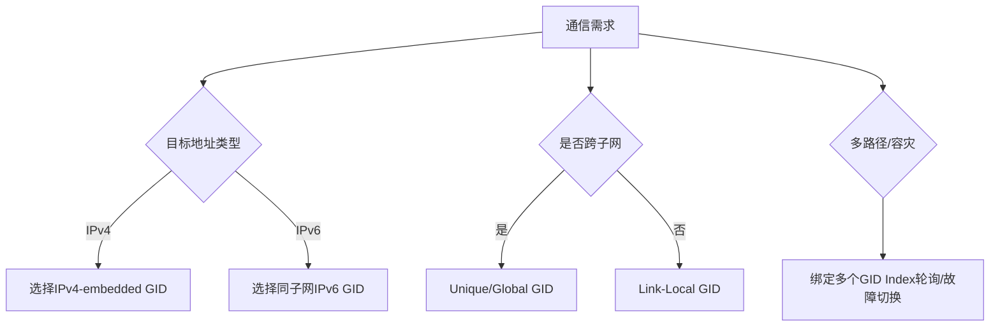
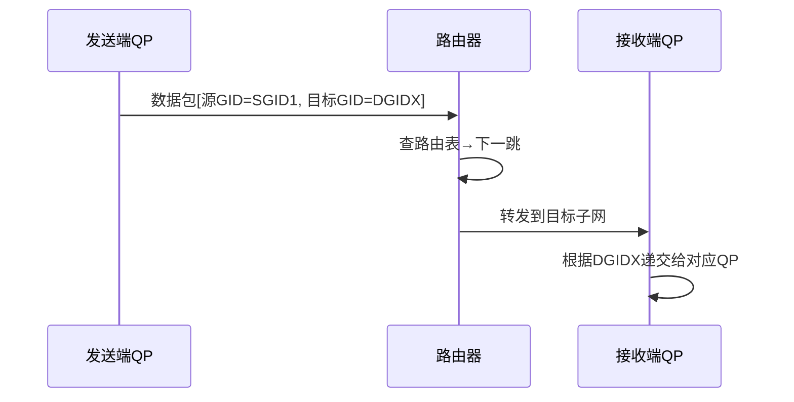

```table-of-contents
```
# 配置
## 编辑器

## 文件与链接


# 插件
在「设置->第三方插件」中进行插件的安装，点击「社区插件」后面的「浏览」按钮打开插件列表界面进行安装即可。安装插件前，需要先将安全模式的开关关闭。如下所示：


## 图片辅助类
### Clear Unused Images
在写笔记时，经常会粘贴一些图片到笔记中，图片也会存储到Obsidian的附件文件夹 ，如果后期在笔记中删除了图片的引用，附件里面的图片并不会被删除，所以我们可以使用该插件清理没有引用到的图片，释放磁盘空间也避免杂乱无章。该插件支持的功能如下：

- 删除的图片可以选择放到回收站或者永久删除
- 排除某些文件夹不清理（对于我们专门存储图片的文件夹可以排除之外）

使用方式：使用 CMD/Ctrl + P 打开命令，搜索Clear 就可以看到，执行后即可清除未引用的图片:


### Image auto upload Plugin

上传图片插件，可以设置粘贴图片时直接上传到图床，也可以在某一篇笔记中使用命令执行上传文章内的图片。这个功能在我们将笔记发布到三方平台或者迁移的时候很有用，迁移的时候我们只需要将笔记文件单个markdown文件拷走就行，不用关注有哪些图片。

设置如下所示：==关闭剪贴板自动上传==

![[attachments/Pasted image 20250207130135.png]]

#### 下面的暂时忽略（应该不用设置picgo）
该插件使用的是Picgo去上传图片的，所以我们还需要在系统中安装Picgo并配置好图床，点击打开[Picgo下载地址](https://link.juejin.cn?target=https%3A%2F%2Fmolunerfinn.com%2FPicGo%2F "https://molunerfinn.com/PicGo/")，下载完成请查看[配置文档](https://link.juejin.cn?target=https%3A%2F%2Fpicgo.github.io%2FPicGo-Doc%2Fzh%2Fguide%2F "https://picgo.github.io/PicGo-Doc/zh/guide/")，Picgo是一个免费开源的图床软件支持将图片上传到多个平台。

**注意：** 如果笔记开启了Wiki链接，可能会导致该插件找不到图片，无法上传。需要在设置中关闭Wiki链接后，重新粘贴图片或者将wiki链接修改为普通链接再进行上传。

普通链接即markdown格式链接，下面是wiki链接和普通链接的区别：
```lua
下面是wiki链接
![[20230409153023.png]]

下面是普通链接


```
使用方式：使用 CMD/Ctrl + P 打开命令，查找 upload 执行即可。

### Image Toolkit
点击图片放大之类的功能，比较像一般的图片浏览器的工具栏。

## 其他
### dataview
使用代码块实现的数据视图插件，可以通过一定的语法去汇总、查询笔记中的数据，如果利用的好能很大的提升自己的效率和使用笔记的体验。

因为特性比较多，可以去 [官方文档](https://link.juejin.cn?target=https%3A%2F%2Fblacksmithgu.github.io%2Fobsidian-dataview%2F "https://blacksmithgu.github.io/obsidian-dataview/") 查看具体使用方式，下面简单的列一下基本用法，如果会一些编程的知识，使用起来犹如鱼得水：

- 根据元数据（元数据可以是文件名称、创建时间、修改时间、metadata等）查询为表格视图，列表视图
- 查询待办任务（支持过滤完成未完成、支持按照文件名称分组）
- 支持js API可以进行更加高级的查询
- 内置常用的函数处理数据

下面是我查询发布文章的代码
```lua
table WITHOUT ID
link(file.path, file.path) as "路径", default(status, "publish") as "状态",  elink("https://gslnzfq.cn/archives/"+post_id, "查看") as "网站链接"
where post_id>0 
sort default(status, "publish") desc

```
实现效果如下所示，我们可以直接点击右侧链接查看发布的文章详情
 
### Projects
该插件名称是Projects，也比较容易理解，可以读取某个文件夹下面的笔记并通过读取metadata生成表格，在项目管理的时候用的比较多。也可以理解为dataview的图形版本，他会提供三种视图：table、kanban、calendar，下面是我使用的一个样例：


上述生成的项目列的字段也是通过metadata存储的，所以我们也可以使用dataview进行高级查询，例如我们可以通过d_deadline展示还有多久到期等。

### advanced Tables
因为Obsidian内置的表格编辑体验不是很好，需要完全使用markdown源码的方式编写表格，该插件为了增强表格功能提供了下面的特性：

- 自动格式化表格代码（使用tab或者回车的时会自动对齐表格列分隔符）
- 可以像excel一样进行切换单元格换行（tab切换到下一个单元格，回车切换到下一行）
- 添加、移动、删除行和列
- 设置列的对齐方式（左对齐、右对齐、居中对齐）
- 对列数据进行排序
- 支持移动端编辑器

安装完成，可以右侧面板就可以看到表格操作的工具了，将光标放在表格中就可以操作了。


### auto-link-title
粘贴链接后显示为网页的标题，例如粘贴了 `www.baidu.com/` 就会展示成下面的内容，自动拉取网页的标题，对于引用文章等比较方便，网页标题比网址更加的直观。
```c
[百度一下，你就知道](https://www.baidu.com/)
```

### Local images
可以说和 Image auto upload Plugin 插件相反，该插件可以查找笔记中的外部图片并下载，可能会说这个插件的使用场景是什么呢，下面是我想到的一些场景：

- 自己搭建图床的服务器要过期了，例如我之前使用的阿里的OSS要过期了，那我就下载图片后重新配置其他图床再上传
- 使用剪藏插件剪藏的其他网站的内容，需要将图片下载到本地，防止其资源过期或删除等导致文章图片无效

使用方式：使用 CMD/Ctrl + P 打开命令，查找插件名称执行即可。

# 问题记录
## obsidian 渲染画面显示不全
如下所示，最近常常出现滚动或者编辑时画面突然显示不全，非常影响笔记的使用。


### 解决
“已经尝试了重装，重启” 这两招估计不太行, 因为一般都是主题和插件引起的, 
重启插件后还在，可以试试切回默认主题, 且禁掉你觉得可能影响排版的插件。

# 使用技巧
## ob使用mermaid画图
obsidian自带Mermaid库，不需要安装、不需要配置，直接在obsidian中使用。

比如：


### 时序图




# 其他
## 图床
### 图床的目的
配置图床的目的：解决 Obsidian 图片存储问题，一般来说 Obsidian 图片是以本地链接的方式存储在文章当中，当图片移动的时候文章中的图片就会出错。

### 什么是图床
你可以简单的把它理解为**一个专门用于上传图片的网盘**。所有存进去的图片，你都能够得到一个链接，通过这个链接，就能够打开你需要的图片。
这便是：**图片即链接。**
所以，有了图床之后，我在 Obsidian 中插入图片，只需要放一个链接：


### 图床的优点


图床所带的好处，主要有两点：
第一，**无需管理图片**。放到图床中的图片，你使用它，都只需要一个链接，把这个链接放到你需要的内容中，图片就能展示出来。
第二，**内容与图片完全分离。**
之前，我使用 Bear 来完成写作，图片也是放 Bear 中。后来，我想把 Bear 中的内容迁出，真是大费周章。而迁移的最大难点，便是图片的迁移。
但是，有了图床，这就简单多了：因为我文章中所使用的图片，全都只是链接。
这样一来，我所有的笔记，也就全都只是纯文本。

所以，在未来我可以轻松把所有笔记迁移到一款新的工具中。比如，在 Obsidian 中的笔记，我可以直接全选复制，粘贴到 Typora 中。

# 参考
```c
常见的插件
https://juejin.cn/post/7221495028032323644

Obsidian 使用技巧
https://pkmer.cn/Pkmer-Docs/10-obsidian/obsidian%E4%BD%BF%E7%94%A8%E6%8A%80%E5%B7%A7/obsidian%E4%BD%BF%E7%94%A8%E6%8A%80%E5%B7%A7/
```