```table-of-contents
```
# 介绍
Mermaid `[ 'mə:meid ]`（字面翻译：美人鱼；女子游泳健将） 是一个基于 JavaScript 的图表生成工具，它使用简单的文本语法来创建丰富的图表和可视化内容。主要特点包括：
- **纯文本描述**：使用类似 Markdown 的简洁语法
- **多种图表支持**：流程图、序列图、甘特图、类图等
- **无缝集成**：支持 GitHub、GitLab、VS Code 等平台
- **开源免费**：MIT 许可证，可自由使用

#  核心图表类型

## 基本结构
### 关键字与方向
关键字和方向，是最基本的。你得告诉 **Mermaid**，你要画的是个什么图，图的走向是什么？
- 使用 `关键字`，声明图的**类型**
- 使用 `方向`，声明图的**方向**(走向)

#### 关键字
所有 Mermaid 图表都以图表类型声明开始：
```bash
graph TD  // 流程图
sequenceDiagram  // 序列图
gantt  // 甘特图
```

> 注意 ：关键字的所有字母，必须**全部小写**！任何一个字母大写都会导致报错！

#### 方向
**方向有四种 (五种写法)：**
```text
TB
    top to bottom 自上而下
TD
    top-down 自上而下
BT
    bottom to top 自下而上
LR
    left to right 从左往右
RL
    right to left 从右往左
```

> 注意 方向的字母必须全部**大写**！否则会报错！

#### 语法
- **关键字**与**方向** 写在**首行**；先写**关键字**，用一个**空格**隔开，再写**方向**
- 书写后续代码时，**推荐**用一个 制表符 `tab` 缩进后书写；只是推荐，不缩进也不会报错

#### 语句的结束
**Mermaid** 语句的结束，有**两种**方式:
1. 在结尾加 分号 `;`
2. 换行
3. 也可以两个都用，**换行 + 分号**

范例1：
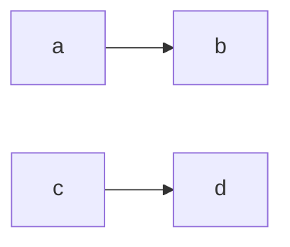

范例2：


## 流程图 (Flowchart)
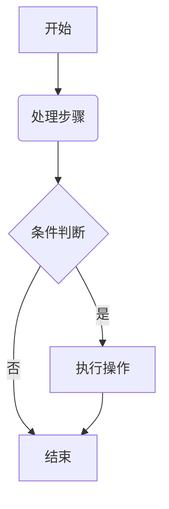
### 流程图语法
```text
graph [方向]
    A[方形节点] --> B(圆角节点)
    B --> C{菱形条件}
    C -->|条件1| D[结果1]
    C -->|条件2| E[结果2]
```

说明：
```bash
方向标识：
    TB/TD: 从上到下
    BT: 从下到上
    RL: 从右到左
    LR: 从左到右
```


## 序列图 (Sequence Diagram)
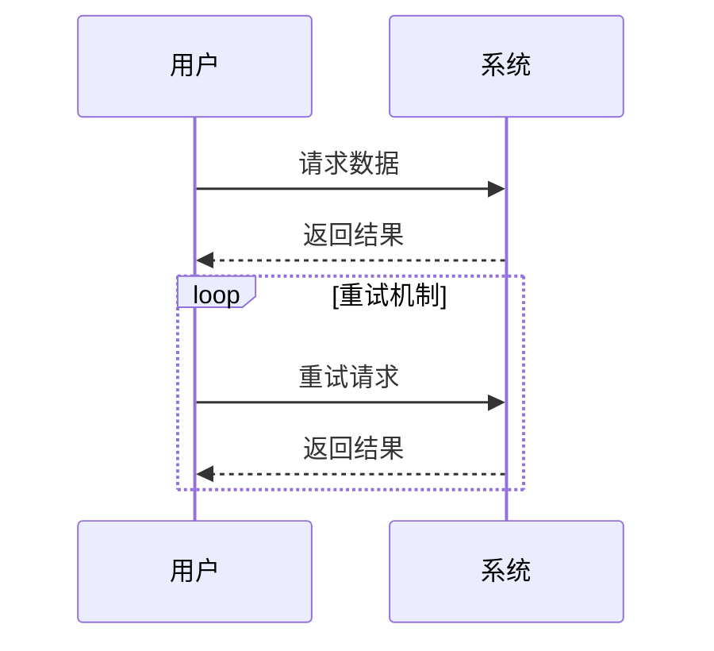

## 甘特图 (Gantt Chart)
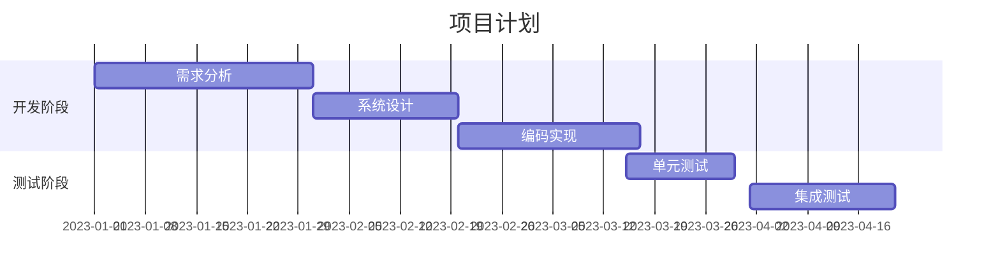

## 状态图 (State Diagram)
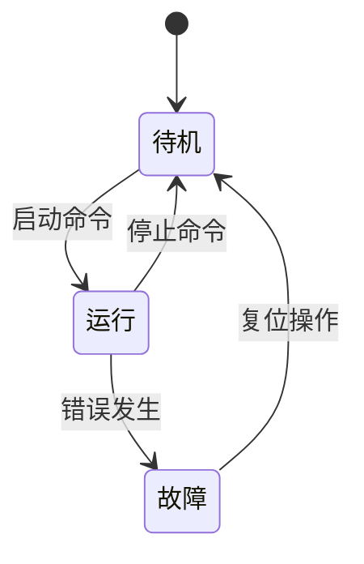

## 饼图 (Pie Chart)
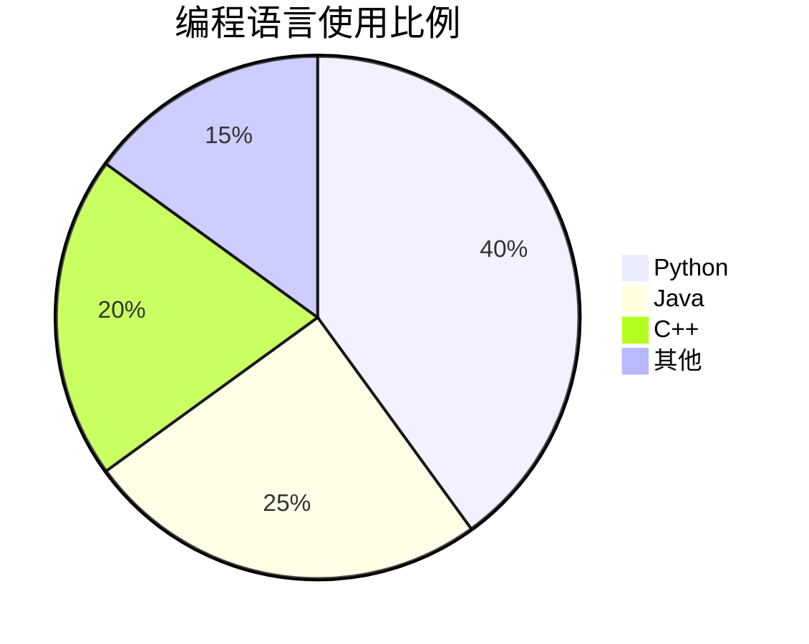

## 类图 (Class Diagram)

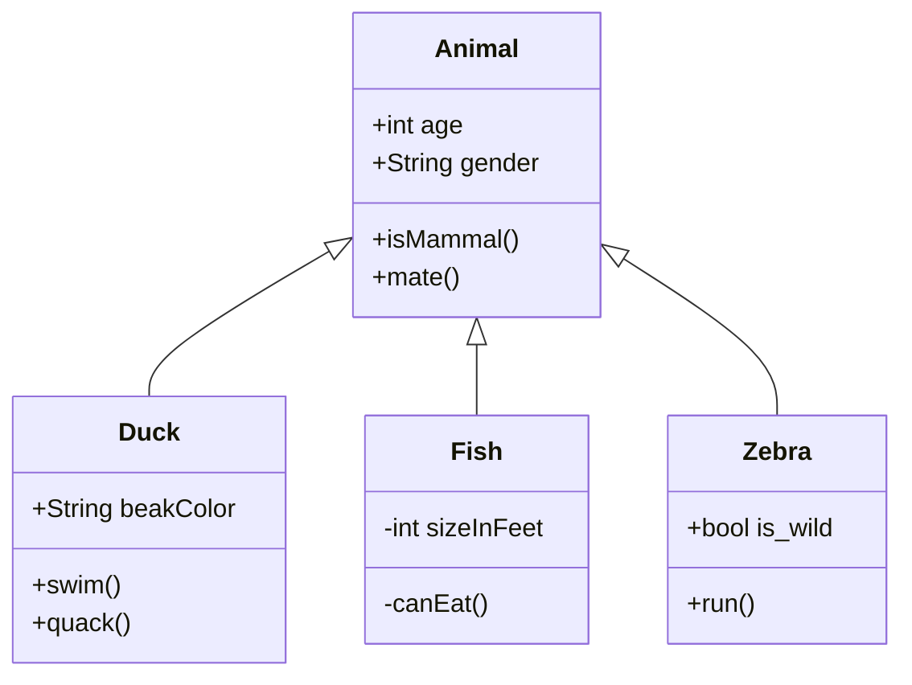


## 数据包图（packet）
如下所示，TCP头的结构：

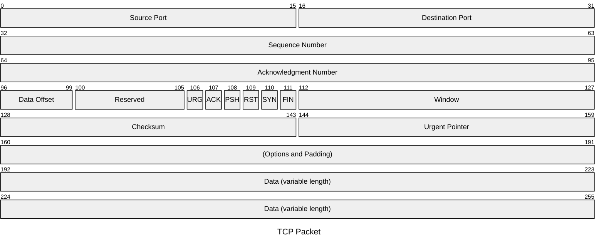

## 柱状图和折线图(xy-chart)
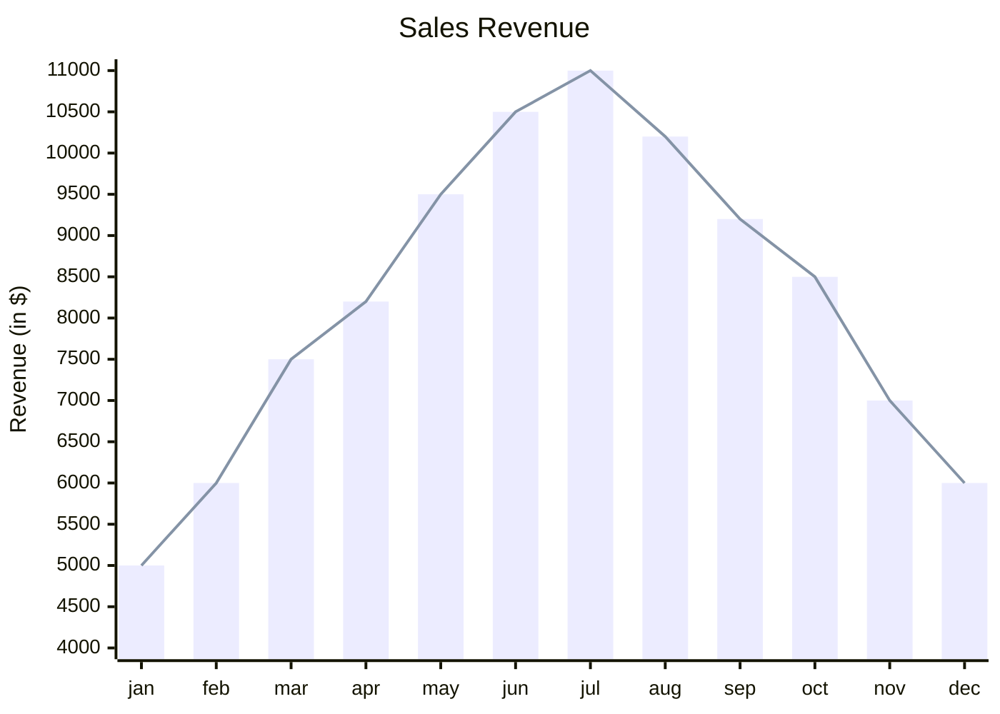

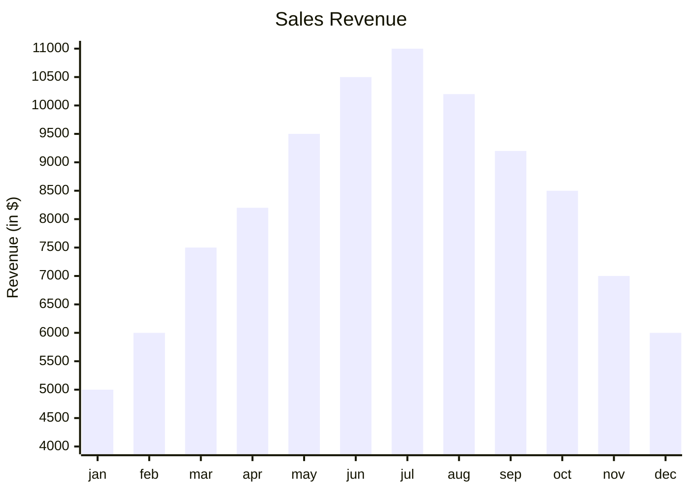

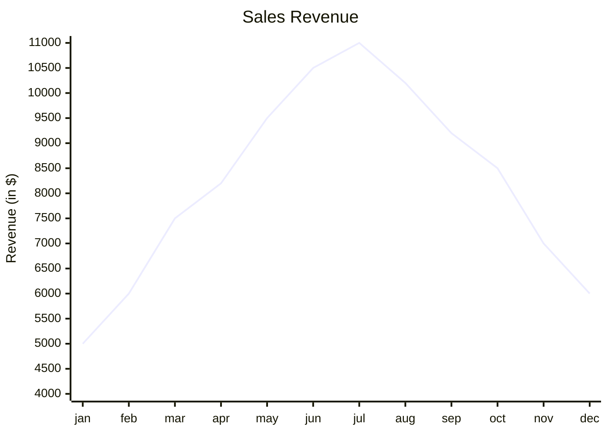

## 象限图(quadrant-chart)
象限图是一种将坐标平面分成四个象限（区域）的图表，常用于：
- 把数据点根据两个变量的不同取值范围，划分到四个象限里；
- 便于分析数据在不同象限的位置和分布；
- 例如，用于绩效分析、风险评估、市场细分等。
简单来说，**象限图就是在XY坐标系基础上，通过两条中轴线将图分成四个部分，展示数据的分类情况**。

## 状态图(state)

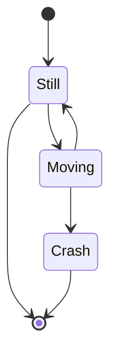


## 时间线(timeline)
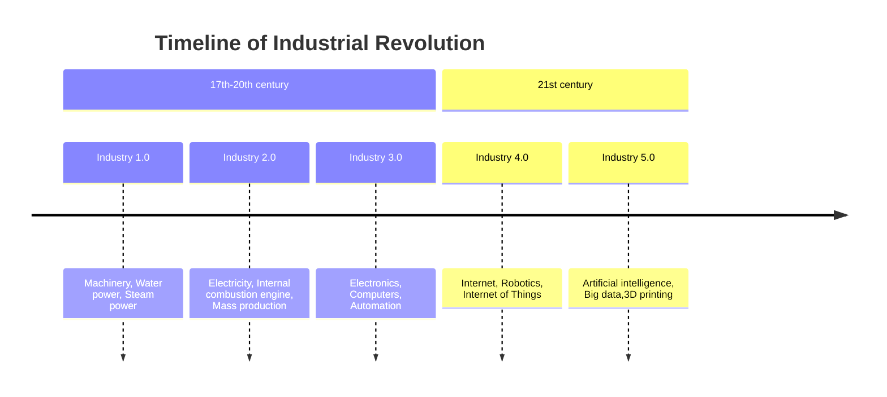

## ER图(Entity Relationship图)

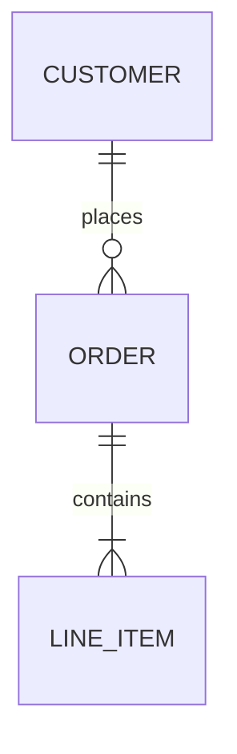

## 看板图(kanban)
看板图（Kanban 图）是一种可视化工作流程的图表，起源于日本丰田的生产管理体系，现在广泛用于**敏捷开发、项目管理、任务流程控制**等领域。

**Kanban 图** 是一种将工作项按照状态分栏展示的图表，常见的栏有：
- 📝 To Do（待办）
- 🚧 In Progress（进行中）
- ✅ Done（已完成）

### Kanban 的关键理念
**可视化工作**：让每个人都能看到项目当前状态。
 **限制在制品数量（WIP）**：避免多任务导致效率低。
**持续流动**：任务从左到右流动，清晰反映进度。
**持续改进**：通过观察瓶颈优化流程。

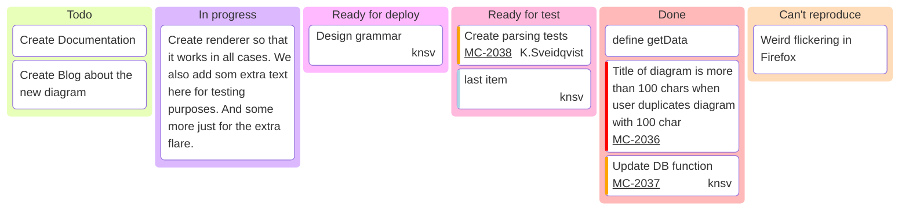


## 需求图（requirement）

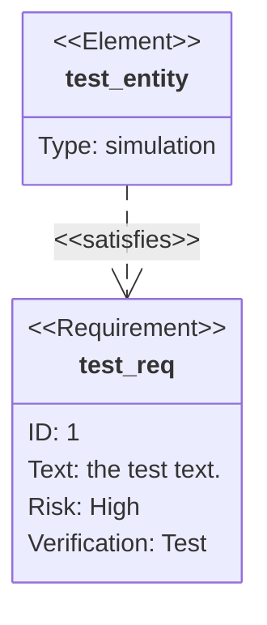

# 如何使用 Mermaid
## mermaid在线编辑器

[mermaid在线编辑](https://mermaid.live/)

### 支持的图表


## VS Code 集成
5. 安装 Mermaid 插件
6. 创建 `.mmd` 文件
7. 编写 Mermaid 代码
8. 右键选择 "Preview Mermaid"

## 在 Markdown 中使用
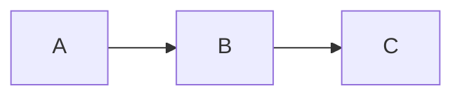


# 参考
```bash

# Mermaid 系列
https://pkmer.cn/tags/mermaid/

# Mermaid 流程图
https://pkmer.cn/Pkmer-Docs/02-%E7%9F%A5%E8%AF%86%E7%AE%A1%E7%90%86%E5%9F%BA%E7%A1%80/mermaid/mermaid%E8%AF%AD%E6%B3%95-%E6%B5%81%E7%A8%8B%E5%9B%BE/

# Mermaid 语法
https://pkmer.cn/Pkmer-Docs/02-%E7%9F%A5%E8%AF%86%E7%AE%A1%E7%90%86%E5%9F%BA%E7%A1%80/mermaid/mermaid%E8%AF%AD%E6%B3%95/


```