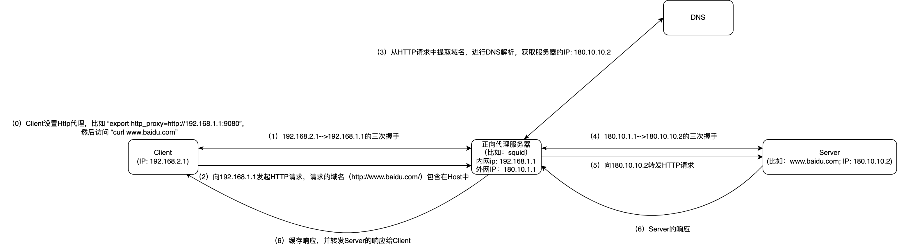

```table-of-contents
```
# 概述
# 代理的作用
代理服务器根据不同的配置和使用，可能会有不同的功能，这些功能主要包括：
- 内容过滤
代理可以根据一定的规则限制某些请求的连接。比如有些公司会设置内部网络无法访问某些购物、游戏网站，或者学校的网络不让学生访问色情暴力的网站等。
- 缓存Cache
代理服务器可以作为缓存使用，对于某些资源只需要第一次访问的时候去下载，以后代理直接把缓存的结果返回给客户端，节约网络带宽的开销，加速请求的访问，在更快的时间内返回结果。
- 负载均衡
通过反向代理将多个用户的请求均衡的分发给多个真实的后端服务器。
- 安全
公司可以在内网和外网之间通过代理进行转发，这样不仅对外隐藏了实现的细节，而且可以在代理层对爬虫、病毒性请求、攻击进行过滤，保护内部服务。

# 代理可做的事情
上诉的功能的实现都依赖于代理的特性，它可以在客户端和服务器端做一些事情，根据代理做的事情不同，它的角色和功能也就不同。那么，代理具体可以做哪些事情呢？比如：
- 修改 HTTP 请求：url、header、body
- 过滤请求：根据一定的规则丢弃、过滤请求
- 决定转发到哪个后端（可以是静态定义的，也可以是动态决定）
- 保存服务器的应答，后续的请求可以直接使用保存的应答
- 修改应答：对应答做一些格式的转换，修改数据，甚至返回完全不一样的应答数据
- 重试机制，如果后端服务器暂时无法响应，隔一段时间重试
# 分类
## 正向代理
正向代理服务器主要应用于内部网络希望访问外部网络时缓存页面数据。由于公网IP地址缺，企业内部成百上千台计算机不可能同时配置公网地址，目前的解决方案就是通过一个统一的网络接口连接Internet。
### 原理
代理的核心功能可以用一句话概括：接受客户端的请求，转发到后端服务器，获得应答之后返回给客户端。
HTTP代理服务器会自动提取请求数据包的HTTP Request数据，然后进行DNS查询，再对服务器进行三次握手以及HTTP请求，并且把HTTP Response的数据转发给发送请求的客户端；HTTP代理服务器使用的端口通常是8080，如下图所示：

- 对于Web客户端来说，代理扮演的服务器角色，接收请求（Request），返回响应（Response）。
- 对于Web服务器来说，代理扮演的客户端角色，发送请求（Request），接收响应（Response）。

### 分类
#### 传统代理
传统代理：需要在客户端手动设置代理服务器（如HTTP_PROXY）。
对于客户端，代理服务器端是不透明的，可知的。

比如：内网访问外网时，通过在内网服务器上配置HTTP Proxy，然后通过Squid做七层代理。
#### 透明代理
透明代理：透明代理与传统的正向代理相似，区别在于传统的正向代理需要每个客户端都进行代理服务器的设置。而透明代理通过网关进行部署。即，所有的设置都是由管理员在网关服务器以及代理服务器进行的。因此，透明代理对于用户是透明的，不需要用户进行任何设置。

比如：内网出外网的网关为SNAT，如SNAT在内网发送默认路由引流内网出外网流量，或者在服务器上内网到外网的流量默认打隧道到SNAT设备，在SNAT设备上，将身为内网IP的SIP 进行NAT为公网IP，然后出外网。
那么就可以认为 SNAT 网关就是透明代理。

### 代理设置
#### 环境变量形式
有关网络代理的几个环境变量

all_proxy指定了全部协议都可以通过这个代理，它的优先级要低于其他变量。例如系统配置了http_proxy和all_proxy变量，则curl在进行http访问的时候会通过http_proxy指定的代理，在进行https访问的时会首先尝试通过https_proxy指定的代理，但是由于并没有设置https_proxy，最终all_proxy指定的代理生效。

**理解**
```bash
export http_proxy=http://ip:port
```
环境变量http_proxy指明了为哪种网络协议配置代理，这里是http协议。即只有http协议的网络请求会使用该环境变量配置的代理，其它网络协议，sftp等，则不会使用该环境变量配置的代理。
而其取值中的http，则表示的是代理服务器的服务协议，即系统与代理服务通信时使用的协议，比较常见的代理协议有：
```bash
http://
https://
socks://
```
另外还有：
```bash
ss://
ssr://
vmess://
```

**设置代理**
```bash
(1) 设置临时代理（仅在当前shell会话生效）
# export http_proxy=http://ip:port
# export https_proxy=http://ip:port

(2) 设置永久代理
# vi /etc/profile, 添加下列内容
export http_proxy=http://ip:port
export https_proxy=http://ip:port

# source /etc/profile

(3)取消代理
# unset http_proxy
# unset https_proxy
```

#### 其他形式
比如：curl 以及wget 命令设置代理
```bash
curl -x $proxy:11080 $url
wget -e "http_proxy=$proxy:11080" $url
npm config set proxy http://$proxy:11080"
pip install --proxy="$proxy:11080" $python-package
```
### 应用
#### Squid正向代理
所有的客户端通过设置代理服务器连接值Squid，通过代理上网。此模型下，Squid主要负责提供缓存加速服务和访问控制的功能。
### 范例
（1）client设置HTTP_PROXY，在Client执行`curl www.baidu.com`, 抓包如下所示：

分析：
client访问百度，client中不会进行DNS解析，先和代理服务器进行三次握手，然后HTTP请求，HTTP请求中包含请求的完整域名。代理服务器提取域名，进行DNS解析，然后和后端服务器建连，发起HTTP请求。

（2）client不设置HTTP代理，在Client执行`curl www.baidu.com`, 抓包如下所示：

Client中先进行DNS解析，获取服务器的IP地址，然后进行TCP三次握手，发起HTTP请求，HTTP请求的路径是相对路径。

### 常见问题
#### 代理无效问题
- 应用程序不读取环境变量的问题
网络代理的环境变量只能算是建议，实际运行的程序不一定会去使用环境变量配置的网络代理，此时对应程序将绕过代理配置直接执行网络连接，表现为代理配置无效。
设置了HTTP_PROXY，发送的http请求默认就是给代理服务器发送请求是因为发送http请求的工具支持了代理，会检查是否有http_proxy环境变量设置设置(或者工具用到的包中有检查HTTP_PROXY)，如果存在，则走代理。比如：curl， 比如 yum。但是如果直接用 echo xxx | nc -tv IP PORT 这种来模拟HTTP请求，应该是无法完成代理的。

- 环境变量的大小写问题
有的应用可能会去读取HTTP_PROXY等大写的环境变量，此时自然读取不到对应的值，这种情况下，可以通过对大小写的环境变量同时设置的方式来保证兼容性，例如：
```bash
# export http_proxy=http://xx.xx.xx.xx:9707
# export HTTP_PROXY=http://xx.xx.xx.xx:9707
# export Http_Proxy=http://xx.xx.xx.xx:9707
```

## 反向代理


# 对比
## HTTP正向代理 和 SNAT
## HTTP反向代理 和 DNAT
# 参考
```c
# 通过NAT64实现ipv6 client 访问ipv4 Server
https://blog.csdn.net/legend050709/article/details/123377713

# Linux设置网络代理
https://blog.csdn.net/Dancen/article/details/128045261
```