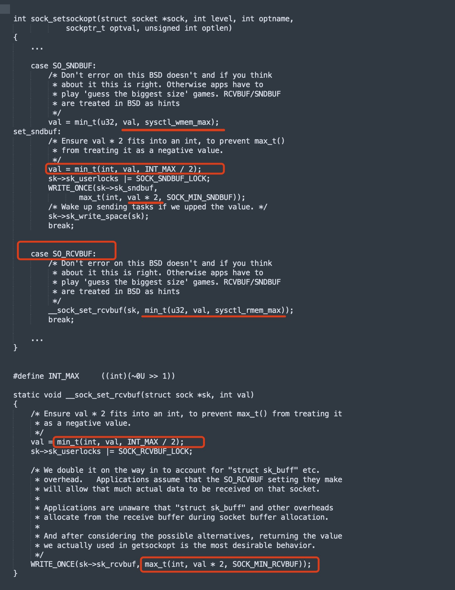

```table-of-contents
```

# 内核参数
```bash
$ sysctl -a |grep -i mem
net.core.optmem_max = 20480
net.core.rmem_default = 212992
net.core.rmem_max = 212992
net.core.wmem_default = 212992
net.core.wmem_max = 212992
net.ipv4.igmp_max_memberships = 20
net.ipv4.tcp_mem = 94500000	915000000	927000000
net.ipv4.tcp_rmem = 4096	87380	4194304
net.ipv4.tcp_wmem = 4096	16384	4194304
net.ipv4.udp_mem = 1520178	2026906	3040356
net.ipv4.udp_rmem_min = 4096
net.ipv4.udp_wmem_min = 4096
vm.lowmem_reserve_ratio = 256	256	32	0	0
vm.memory_failure_early_kill = 0
vm.memory_failure_recovery = 1
vm.nr_hugepages_mempolicy = 1000
vm.overcommit_memory = 0
```
![[attachments/Pasted image 20250210162146.png]]

# 所有协议socket的缓冲区
```bash
net.core.rmem_default = 212992
net.core.wmem_default = 212992
net.core.wmem_max = 212992
net.core.rmem_max = 212992
```

## 默认缓冲区
```bash
net.core.rmem_default = 212992
net.core.wmem_default = 212992
```

上面是各种类型socket的默认读写缓冲区大小，然而对于特定类型的socket则可以设置独立的值覆盖默认值大小。例如==tcp类型的socket就可以用`/proc/sys/net/ipv4/tcp_rmem`和`tcp_wmem` 中的默认值 == 来覆盖。

### 含义

`rmem_default`：一个非TCP的 Socket的被创建出来时，程序不通过`setsockopt`设置读缓冲区时，默认的读缓冲区大小，单位字节；  

`wmem_default`：一个非TCP的 Socket的被创建出来时，程序不通过`setsockopt`设置写缓冲区时，默认的写缓冲区大小，单位字节；


## 最大缓冲区
```bash
net.core.wmem_max = 212992
net.core.rmem_max = 212992
```

### 含义
`rmem_max`：一个Socket的**读**缓冲区**可由程序通过`setsockopt`设置**的最大值，单位字节；  

`wmem_max`：一个Socket的**写**缓冲区**可由程序通过`setsockopt`设置**的最大值，单位字节；

所以，我称`r/wmem_max`为：**可由程序设置的缓冲区最大值**。
实际缓冲区的取值：是比较2个值后，还会存在一个2倍的关系。

#### 程序的实际的socket的 recv buffer的取值
在内核代码中，程序通过 `setsockopt` 设置`SO_RCVBUF`参数的时候，会取内核参数`rmem_max`和`setsockopt`设置的值中，比较小的那个，然后`*2`。
无论，tcp的socket 还是 udp的  socket 都是这样。


```bash
/net/core/sock.c 中的 sock_setsockopt 函数
```




## 注意
### `net.core.rmem_default` 和  `net.core.rmem_max` 的大小没关系
==`net.core.rmem_default` 可以设置的 比 `net.core.rmem_max` 还要大==。因为这2个其实没有必然的联系，一个是程序不设置缓冲区时取的默认值，一个是程序设置缓冲区时，系统的限制上限值。


同理：`net.core.wmem_default` 应该也可以比 `net.core.wmem_max` 大。

### 程序启动后更改系统的default以及max缓冲区大小的影响

####  udp的 listen 的 socket 

udp 的进程， `udp listen socket` 后续不会再产生`socket`，那么程序启动之后，再更改 缓冲区的系统配置，对于存量的`udp listen socket`也不会生效。

#### socket 系统调用产生的 socket 
程序启动之后，再通过 `socket 系统调用`产生的`socket`，那么新产生的 `socket`
的缓冲区的大小，其实是会受到系统参数的调整的影响的。

### 查看已经创建的socket的缓冲区的大小
```bash
# ps -ef |grep named
root      8810  6094  0 10:47 pts/0    00:00:00 grep --color=auto named
named    10677     1 99  2023 ?        1140-05:27:02 /usr/sbin/named -u named -c /etc/named.conf -t /var/named/chroot

# ss -nump
Recv-Q Send-Q                                                      Local Address:Port                                                                     Peer Address:Port
0      0                                                           10.52.145.147:34953                                                                       223.5.5.5:53
	 skmem:(r0,rb16000000,t0,tb262144000,f0,w0,o0,bl0)
0      0                                                           10.52.145.147:58997                                                                       223.5.5.5:53
	 skmem:(r0,rb16000000,t0,tb262144000,f0,w0,o0,bl0)

# sysctl -a | grep -i mem
net.core.optmem_max = 20480
net.core.rmem_default = 212992
net.core.rmem_max = 8000000
net.core.wmem_default = 262144000
net.core.wmem_max = 16777216
net.ipv4.tcp_rmem = 4096	87380	6291456
net.ipv4.tcp_wmem = 4096	16384	4194304
net.ipv4.udp_mem = 3060042	4080058	6120084
net.ipv4.udp_rmem_min = 4096
net.ipv4.udp_wmem_min = 4096
```

## 测试程序
```c
#include <stdio.h>
#include <stdlib.h>
#include <unistd.h>
#include <errno.h>
#include <sys/types.h>
#include <sys/socket.h>

int main(int argc, char **argv)
{
    if (argc != 2) {
        printf("Usage: %s $RCFBUFSIZE\n", argv[0]);
        goto error;
    }

    // 按照执行参数设置UDP SOCKET接收缓冲区大小
    int rcvBufSize = atoi(argv[1]);
    if (rcvBufSize <= 0) {
        printf("rcvBufSize(%d) <= 0, error!!!\n", rcvBufSize);
        goto error;
    }
    printf("you want to set udp socket recv buff size to %d\n", rcvBufSize);

    int sockfd;
    while (1) {
	    // 创建udp socket。
	    sockfd = socket(AF_INET, SOCK_DGRAM, 0);
	    if (sockfd < 0) {
	        printf("create socket error=%d(%s)!!!\n", errno, strerror(errno));
	        goto error;
	    }

	    // 查看系统默认的socket接收缓冲区大小
	    int defRcvBufSize = -1;
	    socklen_t optlen = sizeof(defRcvBufSize);
	    if (getsockopt(sockfd, SOL_SOCKET, SO_RCVBUF, &defRcvBufSize, &optlen) < 0) {
	        printf("getsockopt error=%d(%s)!!!\n", errno, strerror(errno));
	        goto error;
	    }
	    printf("OS default udp socket(%d) recv buff size is: %d\n", sockfd, defRcvBufSize);

	    // 按照执行参数设置UDP SOCKET接收缓冲区大小
	    optlen = sizeof(rcvBufSize);
	    if (setsockopt(sockfd, SOL_SOCKET, SO_RCVBUF, &rcvBufSize, optlen) < 0) {
	        printf("setsockopt error=%d(%s)!!!\n", errno, strerror(errno));
	        goto error;
	    }
	    printf("set udp socket(%d) recv buff size to %d OK!!!\n", sockfd, rcvBufSize);

	    // 查看当前UDP SOCKET接收缓冲区大小
	    int curRcvBufSize = -1;
	    optlen = sizeof(curRcvBufSize);
	    if (getsockopt(sockfd, SOL_SOCKET, SO_RCVBUF, &curRcvBufSize, &optlen) < 0) {
	        printf("getsockopt error=%d(%s)!!!\n", errno, strerror(errno));
	        goto error;
	    }
	    printf("OS current udp socket(%d) recv buff size is: %d\n", sockfd, curRcvBufSize);

	    close(sockfd);

	    printf("-------------------------\n");
	    sleep(2);
    }

    exit(0);

error:
    if (sockfd >= 0)
        close(sockfd);
    exit(1);
}

```

# TCP缓冲区
```bash
net.ipv4.tcp_mem = 94500000	915000000	927000000
net.ipv4.tcp_rmem = 4096	87380	4194304
net.ipv4.tcp_wmem = 4096	16384	4194304
```


## `net.ipv4.tcp_mem`
```bash
net.ipv4.tcp_mem = 94500000	915000000	927000000
```
  该内核参数也是包括三个值，用来定义内存管理的范围，第一个值的意思是当page数低于该值时，TCP并不认为他为内存压力，第二个值是进入内存的压力区域时所达到的页数，第三个值是所有TCP sockets所允许使用的最大page数，超过该值后，会丢弃后续报文。page是以页面为单位的，为系统中socket全局分配的内存容量。

## TCP接收缓冲区
### 原理
接收缓冲区把数据缓存入内核，应用进程一直没有调用recv()进行读取的话，此数据会一直缓存在相应socket的接收缓冲区内。
不管进程是否调用recv()读取socket，对端发来的数据都会经由内核接收并且缓存到socket的内核接收缓冲区之中。
recv()，就是把内核缓冲区中的数据拷贝到应用层用户的buffer里面，并返回。

对于TCP，如果应用进程一直没有读取，接收缓冲区满了之后，发生的动作是：接收端通知发发端，接收窗口关闭（win=0）。这个便是滑动窗口的实现。保证TCP套接口接收缓冲区不会溢出，从而保证了TCP是可靠传输。因为对方不允许发出超过所通告窗口大小的数据。 这就是TCP的流量控制，如果对方无视窗口大小而发出了超过窗口大小的数据，则接收方TCP将丢弃它。

### 内核参数
```bash
net.ipv4.tcp_rmem = 4096	87380	4194304
```

以上是TCP socket的读缓冲区的设置，每一项里面都有三个值。
第一列表示每个 TCP socket 的最小收包缓冲。
第二列表示每个 TCP socket 的默认收包缓冲，此数值将会覆盖全局参数 `net.core.rmem_default`。
 第三列表示每个 TCP socket 最大收包缓冲，注意通过`setsockopt`指定过 `SO_RCVBUF` 的 socket 不受此参数限制。此数值 不覆盖 全局参数 `net.core.rmem_max`，此数值的默认值由 `max(87380, min(4 MB, tcp_mem[1]*PAGE_SIZE/128))` 得到。

 > 注：`net.ipv4.tcp_rmem`的第3个值，即最大值，感觉其实没有啥用。
 

### 取值

（1）如果TCP是 `socket` 不通过`setsockopt` 来设置缓冲区的大小，那么 就取的是 `net.ipv4.tcp_rmem`的第二个值，即默认值，不是 `net.core.rmem_default`的值。

（2）如果TCP是`socket` 通过`setsockopt` 来设置缓冲区的大小，实际的取值为：
`min(设置值， net.core.rmem_max) * 2`, 和 实际的 `net.ipv4.tcp_rmem`的第3个值，即最大值没有关系。


## TCP发送缓冲区
### 发送的原理
进程调用send()发送的数据的时候，最简单情况（也是一般情况），将数据拷贝进入socket的内核发送缓冲区之中，然后send便会在上层返回。
换句话说，send（）返回之时，数据不一定会发送到对端去（和write写文件有点类似）。
send()，仅仅是把应用层buffer的数据拷贝进socket的内核发送buffer中，发送是TCP的事情，和send其实没有太大关系。

### 内核参数
```bash
net.ipv4.tcp_wmem = 4096	16384	4194304
```

以上是`TCP socket`的写缓冲区的设置，每一项里面都有三个值，第一个值是缓冲区最小值，中间值是缓冲区的默认值，最后一个是缓冲区的最大值。

## 注意
### 程序启动后更改系统的default以及max缓冲区大小的影响
#### tcp listen socket

#### tcp accept 产生的socket

#### socket 系统调用产生的 socket 

程序启动之后，再通过 `socket 系统调用`产生的`socket`，那么新产生的 `socket`。

### 查看已经创建的socket的缓冲区的大小
```bash
# ss -tump
```

## 测试
### 测试一：socket系统调用新建socket
将上面的 程序进行调整：
```c

sockfd = socket(AF_INET, SOCK_DGRAM, 0);
跳转为：
sockfd = socket(AF_INET, SOCK_STREAM, 0);

```

### 测试二：listen 以及 accept socket

# UDP缓冲区
```bash
net.ipv4.udp_mem = 1520178	2026906	3040356
net.ipv4.udp_rmem_min = 4096
net.ipv4.udp_wmem_min = 4096
```

==每个UDP socket都有一个接收缓冲区，没有发送缓冲区==；
从概念上来说就是只要有数据就发，不管对方是否可以正确接收，UDP不需要重传，所以不需要发送缓冲区。

UDP：当套接口接收缓冲区满时，新来的数据报无法进入接收缓冲区，此数据报就被丢弃。UDP是没有流量控制的；快的发送者可以很容易地就淹没慢的接收者，导致接收方的UDP丢弃数据报。


# 程序中缓冲区
## socket缓冲区的设置
## socket缓冲区的获取
## 程序运行过程中更改内核的缓冲区参数

# socke缓冲区相关的统计计数
##


# 内核实现
## 创建socket
```bash
sockfd = socket(AF_INET, SOCK_STREAM, 0); // TCP socket
sockfd = socket(AF_INET, SOCK_DGRAM, 0); // UDP socket
```

先是 IP层，是 `ipv4` 还是 `ipv6`(`AF_INET or AF_INET6`)，然后才是协议层，是`tcp`还是 `UDP`（`SOCK_STREAM or SOCK_DGRAM`）。


### 内核实现

```bash
net/ipv4/af_inet.c 中：

对于TCP而言：
	inet_create-->sock_init_data -----> tcp_v4_init_sock (注册在 全局变量 struct proto tcp_prot 中) ----> tcp_init_sock


对于udp而言，就是：
	inet_create-->sock_init_data -----> udp_init_sock (注册在 全局变量 struct proto udp_prot 中)。
```

在创建`socket` 时，就设置了`socket` 的 `recvbuf，sedBuf` 为 默认值。
所以，即使后续没有调用 `setsockopt` 来设置缓冲区大小，也是取得了默认值。

```c
static const struct net_proto_family inet_family_ops = {
	.family = PF_INET,
	.create = inet_create,
	.owner	= THIS_MODULE,
};


static int inet_create(struct net *net, struct socket *sock, int protocol,
		       int kern)
{
	
	...

	sock_init_data(sock, sk); // 先设置 inet的默认值，即任何的四层协议，默认值都是取得是 sysctl_rmem_default or  sysctl_wmem_default.
	...

	if (sk->sk_prot->init) { // 基于不同的四层协议，取不同的四层协议的值。
		err = sk->sk_prot->init(sk);
		if (err) {
			sk_common_release(sk);
			goto out;
		}
	}

	....
}


void sock_init_data(struct socket *sock, struct sock *sk)
{
	sk_init_common(sk);
	sk->sk_send_head	=	NULL;

	timer_setup(&sk->sk_timer, NULL, 0);

	sk->sk_allocation	=	GFP_KERNEL;
	sk->sk_rcvbuf		=	sysctl_rmem_default;
	sk->sk_sndbuf		=	sysctl_wmem_default;
	sk->sk_state		=	TCP_CLOSE;
	sk_set_socket(sk, sock);
	....
}


static int tcp_v4_init_sock(struct sock *sk)
{
	....
	tcp_init_sock(sk);
	...

	return 0;
}

void tcp_init_sock(struct sock *sk)
{
	...
	// sysctl_tcp_wmem[1] ：代表取得是sysctl 中 tcp协议的默认值
	WRITE_ONCE(sk->sk_sndbuf, sock_net(sk)->ipv4.sysctl_tcp_wmem[1]);
	WRITE_ONCE(sk->sk_rcvbuf, sock_net(sk)->ipv4.sysctl_tcp_rmem[1]);
	...
}


int udp_init_sock(struct sock *sk)
{
 // 内核参数中没有udp协议的最小值，默认值，最大值的配置。
	skb_queue_head_init(&udp_sk(sk)->reader_queue);
	sk->sk_destruct = udp_destruct_sock;
	return 0;
}

```

## 设置socket缓冲区

```bash
setsockopt(sockfd, SOL_SOCKET, SO_RCVBUF, &rcvBufSize, optlen);
```

# 网络性能调优
## 高并发场景
### TIME_WAIT 连接复用
`TIME_WAIT` 连接默认要等 2MSL 时长才释放，长时间占用源端口，当这种状态连接数量累积到超过一定量之后可能会导致无法新建连接。

#### 查看
如果短连接并发量较高，它所在 `netns` 中 `TIME_WAIT` 状态的连接就比较多。

#### 设置
所以建议开启 `TIME_WAIT` 复用，即允许将 `TIME_WAIT` 连接重新用于新的 TCP 连接:
```bash
net.ipv4.tcp_tw_reuse=1
```
注：在高版本内核中，`net.ipv4.tcp_tw_reuse` 默认值为 2，表示仅为回环地址开启复用，基本可以粗略的认为没开启复用。

### 扩大源端口范围
高并发场景，对于 client 来说会使用大量源端口，源端口范围从 `net.ipv4.ip_local_port_range` 这个内核参数中定义的区间随机选取，在高并发环境下，端口范围小容易导致源端口耗尽，使得部分连接异常。

通常 Pod 源端口范围默认是 `32768-60999`，建议将其扩大，调整为 `1024-65535`: `sysctl -w net.ipv4.ip_local_port_range="1024 65535"`。

### 调大最大文件句柄数
在 linux 中，每个连接都会占用一个文件句柄，所以句柄数量限制同样也会限制最大连接数， 对于像 Nginx 这样的反向代理，对于每个请求，它会与 client 和 upstream server 分别建立一个连接，即占据两个文件句柄，所以理论上来说 Nginx 能同时处理的连接数最多是系统最大文件句柄数限制的一半。

系统最大文件句柄数由 `fs.file-max` 这个内核参数来控制，一些环境默认值可能为 `838860`，建议调大:
```bash
fs.file-max=1048576
```

### 调大全连接连接队列的大小

TCP 全连接队列的长度如果过小，在高并发环境可能导致队列溢出，使得部分连接无法建立。
#### 查看
如果因全连接队列溢出导致了丢包，从统计的计数上是可以看出来的：
```bash
# 用 netstat 查看统计
$ netstat -s | grep -E 'overflow|drop'
    12178939 times the listen queue of a socket overflowed
    12247395 SYNs to LISTEN sockets dropped
    
# 也可以用 nstat 查看计数器
$ nstat -az | grep -E 'TcpExtListenOverflows|TcpExtListenDrops'
TcpExtListenOverflows           12178939              0.0
TcpExtListenDrops               12247395              0.0
```

#### 设置

全连接队列的大小取决于 `net.core.somaxconn` 内核参数以及业务进程调用 `listen` 时传入的 `backlog` 参数，取两者中的较小值`(min(backlog,somaxconn))`。
一些编程语言通常是默认取 `net.core.somaxconn` 参数的值作为 `backlog` 参数传入 `listen` 系统调用（比如Go语言）。

高并发环境可以考虑将其改到 `65535`:
```bash
sysctl -w net.core.somaxconn=65535
```

#### 检查设置值
如何查看队列大小来验证是否成功调整队列大小？可以执行 `ss -lntp` 看 `Send-Q` 的值。
```bash
$ ss -lntp  
State Recv-Q Send-Q Local Address:Port Peer Address:Port Process  
LISTEN 0 65535 0.0.0.0:80 0.0.0.0:* users:(("nginx",pid=347916,fd=6),("nginx",pid=347915,fd=6),("nginx",pid=347887,fd=6))
```

`ss` 用 `-l` 查看 `LISTEN` 状态连接时。
`Recv-Q` 表示的当前已建连但还未被服务端调用 `accept()` 取走的连接数量，即全连接队列中的连接数；
`Send-Q` 表示的则是最大的 `listen backlog` 数值，即全连接队列大小。
如果 `Recv-Q` 大小接近 `Send-Q` 的大小时，说明连接队列可能溢出。

#### 注意

需要注意的是，Nginx 在 `listen` 时并没有读取 `somaxconn` 作为 `backlog` 参数传入，而是在 `nginx` 配置文件中有自己单独的参数配置:
```bash
server {  
    listen  80  backlog=1024;  
    ...
```

如果不设置，`backlog` 在 linux 上默认为 511:
```text
backlog=number  
	sets the backlog parameter in the listen() call that limits the maximum length for the queue of pending connections. By default, backlog is set to -1 on FreeBSD, DragonFly BSD, and macOS, and to 511 on other platforms.
```

也就是说，即便你的 `somaxconn` 配的很高，nginx 所监听端口的连接队列最大却也只有 511，高并发场景下还是可能导致连接队列溢出，所以建议配置下 `nginx` 的 `backlog` 参数。

不过如果用的是 `Nginx Ingress` ，情况又不太一样，因为 `Nginx Ingress Controller` 会自动读取 `somaxconn` 的值作为 `backlog` 参数写到生成的 `nginx.conf` 中，参考 [源码](https://github.com/kubernetes/ingress-nginx/blob/controller-v0.34.1/internal/ingress/controller/nginx.go#L592)。


## 高吞吐场景
### 调大 UDP 缓冲区
`UDP socket` 的发送和接收缓冲区是有上限的，如果缓冲区较小，高并发环境可能导致缓冲区满而丢包。

#### 查看
```bash
# 使用 netstat 查看统计  
$ netstat -s | grep "buffer errors"  
429469 receive buffer errors  
23568 send buffer errors  
  
# 也可以用 nstat 查看计数器  
$ nstat -az | grep -E 'UdpRcvbufErrors|UdpSndbufErrors'  
UdpRcvbufErrors 429469 0.0  
UdpSndbufErrors 23568 0.0
```

还可以使用 `ss -nump` 查看当前缓冲区的情况:
```bash
$ ss -nump  
Recv-Q    Send-Q          Local Address:Port         Peer Address:Port    Process  
0         0             10.10.4.26%eth0:68              10.10.4.1:67       users:(("NetworkManager",pid=960,fd=22))  
     skmem:(r0,rb212992,t0,tb212992,f0,w0,o640,bl0,d0)
```

`rb212992` 表示 UDP 接收缓冲区大小是 `212992` 字节；
`tb212992` 表示 UDP 发送缓存区大小是 `212992` 字节。
`Recv-Q` 和 `Send-Q` 分别表示当前接收和发送缓冲区中的数据包字节数。

#### 设置
##### UDP 发送缓冲区大小
UDP 发送缓冲区大小取决于：
（1）`net.core.wmem_default` 和 `net.core.wmem_max` 这两个内核参数，分别表示缓冲区的默认大小和最大上限。
    
（2）如果程序自己调用 `setsockopt` 设置 `SO_SNDBUF` 来自定义缓冲区大小，取值不会超过 `net.core.wmem_max`；然后最终取值还会有一个2倍的关系。

（3）如果程序没自己调用 `setsockopt` 设置，则会使用 `net.core.wmem_default` 作为缓冲区的大小。
    
##### UDP 接收缓冲区大小
同理，UDP 接收缓冲区大小取决于:

（1）`net.core.rmem_default` 和 `net.core.rmem_max` 这两个内核参数，分别表示缓冲区的默认大小和最大上限。
    
（2）如果程序自己调用 `setsockopt` 设置 `SO_RCVBUF` 来自定义缓冲区大小，取值不会超过 `net.core.rmem_max`；然后最终取值还会有一个2倍的关系。

（3）如果程序没自己调用 `setsockopt` 设置，则会使用 `net.core.rmem_default` 作为缓冲区的大小。

##### 注意
需要注意的是，这些内核参数在容器网络命名空间中是无法设置的，是 Node 级别的参数，需要在节点上修改。
建议修改值：
```bash
net.core.rmem_default=26214400 # socket receive buffer 默认值 (25M)，如果程序没用 setsockopt 更改 buffer 长度的话，默认用这个值。  
net.core.wmem_default=26214400 # socket send buffer 默认值 (25M)，如果程序没用 setsockopt 更改 buffer 长度的话，默认用这个值。  
net.core.rmem_max=26214400 # socket receive buffer 上限 (25M)，如果程序使用 setsockopt 更改 buffer 长度，最大不能超过此限制。  
net.core.wmem_max=26214400 # socket send buffer 上限 (25M)，如果程序使用 setsockopt 更改 buffer 长度，最大不能超过此限制。
```

### 调大 TCP 缓冲区
TCP socket 的发送和接收缓冲区也是有上限的，不过对于发送缓冲区，即便满了也是不会丢包的，只是会让程序发送数据包时卡住，等待缓冲区有足够空间释放出来，所以一般不需要优化发送缓冲区。

对于接收缓冲区，在高并发环境如果较小，可能导致缓冲区满而丢包。

#### 查看
```bash
$ nstat -az | grep TcpExtTCPRcvQDrop  
TcpExtTCPRcvQDrop 264324 0.0
```

还可以使用 `ss -ntmp` 查看当前缓冲区情况:
```bash
$ ss -ntmp
ESTAB        0             0                    [::ffff:109.244.190.163]:9988                       [::ffff:10.10.4.26]:54440         users:(("xray",pid=3603,fd=20))
     skmem:(r0,rb12582912,t0,tb12582912,f0,w0,o0,bl0,d0)
```
`rb12582912` 表示 TCP 接收缓冲区大小是 `12582912` 字节；
`tb12582912` 表示 TCP 发送缓存区大小是 `12582912` 字节。
`Recv-Q` 和 `Send-Q` 分别表示当前接收和发送缓冲区中的数据包字节数。


#### 设置
如果存在 `net.ipv4.tcp_rmem` 这个参数，对于 TCP 而言，会覆盖 `net.core.rmem_default` 和 `net.core.rmem_max` 的值。 

(1) 单位是字节， `net.ipv4.tcp_rmem` 的三个值 分别是 `min, default, max`。
    
(2) 如果程序没用 `setsockopt` 更改 `buffer` 长度，就会使用 `default` 作为初始 `buffer` 长度(覆盖 `net.core.rmem_default`)，然后根据内存压力在 `min` 和 `max` 之间自动调整。

(3) 如果程序使用了 `setsockopt` 更改 `buffer` 长度，则使用传入的长度 (仍然受限于 `net.core.rmem_max`)。


#### 注意
`net.ipv4.tcp_rmem` 这个参数网络命名空间隔离的，而在容器网络命名空间中，一般默认是有配置的，所以如果要调整 TCP 接收缓冲区，需要显式在 Pod 级别配置下内核参数:
```bash
net.ipv4.tcp_rmem="4096 26214400 26214400"
```

## 参数级别
### Pod 内核参数
```bash
sysctl -w net.core.somaxconn=65535  
sysctl -w net.ipv4.ip_local_port_range="1024 65535"  
sysctl -w net.ipv4.tcp_tw_reuse=1  
sysctl -w fs.file-max=1048576  
sysctl -w net.ipv4.tcp_rmem="4096 26214400 26214400"
```

### 节点内核参数
```bash
net.core.rmem_default=26214400  
net.core.wmem_default=26214400  
net.core.rmem_max=26214400  
net.core.wmem_max=26214400
```
修改 `/etc/sysctl.conf` 并执行 `sysctl -p`


# 参考
```bash
# 网络性能调优
https://luckymrwang.github.io/2022/10/21/%E7%BD%91%E7%BB%9C%E6%80%A7%E8%83%BD%E8%B0%83%E4%BC%98/

# UDP：Socket缓冲区大小修改与系统设置
https://blog.csdn.net/test1280/article/details/79776938

```