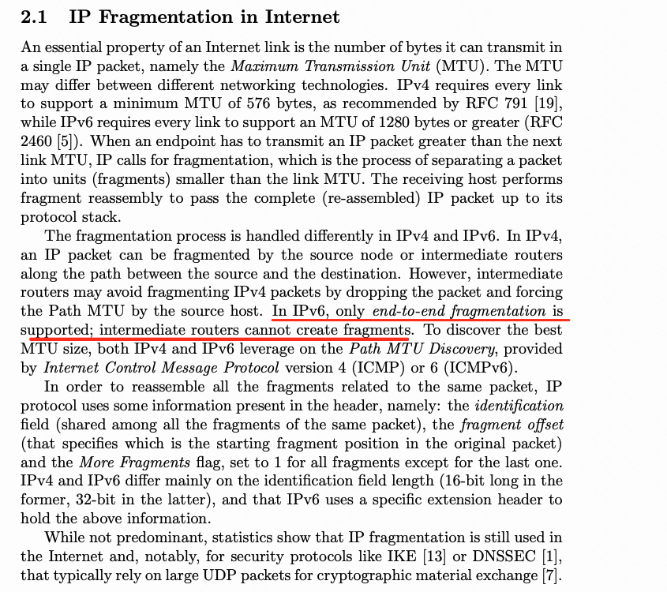
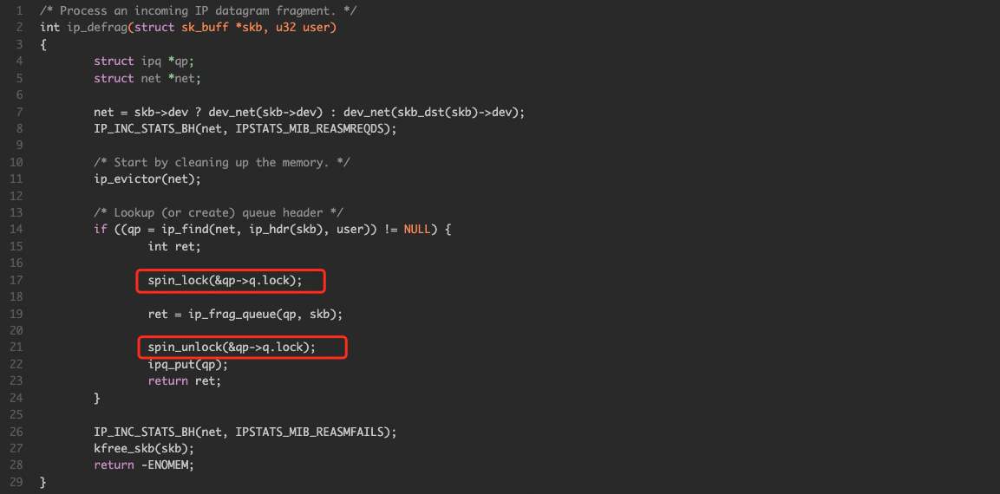

```table-of-contents
```
# 分片
## 定义
IP协议在传输数据包时，将数据报文分为若干分片进行传输，并在目标系统中进行重组。这一过程称为分片（ fragmentation）。


> 注：如果 IP 包设置了 DF 标志，中间路由便不能将它分片，只能向发送者报告 ICMP **目的不可达** 错误。其中，类型为 3 ，表示目的不可达；代码为 4 表示 **需要分片，但设置了DF标志** （ fragmentation required, and DF flag set ）。


## 原理
IP分片发生在IP层，不仅源端主机会进行分片，中间的路由器也有可能分片，因为不同的网络的MTU是不一样的。
如果传输路径上的某个网络的MTU比源端网络的MTU要小，路由器就可能对IP数据报再次进行分片。而分片数据的重组只会发生在目的端的IP层。


片偏移字段指的是该片偏移原始数据报开始处的位置,当数据报被分片后，**每个片的总长度值要改为该片的长度值。**

在分片时，除最后一片外，其他每一片中的数据部分（除 IP首部外的其余部分，即IP载荷部分长度）必须是8字节的整数倍。

- 第一个分片:如果MF为1而 Fragment Offset = 0，表示该IP报文为第一个分片，而且后续有分片；
- 中间分片:如果MF为1而Fragment Offset不是0，表示该IP报文为中间的一个分片；
- 最后分片:如果MF为0而Fragment Offset不是0，表示该报文是最后一个分片;

## 分片与上层协议
IP分片是发生在网络的第三层，那么它的上层（第四层）是如何处理这种长数据包的呢？
### 四层为UDP && ICMP
> UDP和ICMP协议没有考虑分片的问题，它的协议可以认为网络层没有长度限制，所以如果我们在UDP协议中，发送大的数据时，就必然触发IP层分片。  

###  四层为TCP
> TCP协议本身支持分段，TCP协议在建立连接时会协商MSS（Maxitum Segment Size），这个协商的过程发生在建立TCP连接的过程中。


MSS加包头数据就等于MTU。
拿TCP包做例子，报文传输MSS=1460字节的数据的话，再加上20字节IP包头，20字节TCP包头，那么MTU就是（1500）。 client 和 real server 分别根据自己MTU计算出支持的最大MSS发送给对方，双方根据最小的MSS达成协议。

下图用来说明，TCP协议分段和UDP协议触发的IP层分片的区别。


## 其他
### 各个分片的差异
当数据报分片时，每个分片都会得到一个首部。分片首部的大部分内容和原数据相同，如IP地址、版本号、协议和标识等等。所不同的主要就是标志、总长度和分片偏移字段 以及校验和。
> 分片可以带也可以不带原数据报的选项。
> 分片中数据的大小必须为8字节的整数倍，否则IP无法表达其偏移量。

### TCP也可能导致分片
但是也不能认为，TCP协议就不会触发IP层分片；因为在TCP协议握手时，client 和 real server只是取了自己网卡的MTU， 但是它们之间可能经过了很多的路由器，这些子网的MTU可能小于它们的MTU，所以在外部的复杂网络上，很多TCP协议也会触发IP层分片。

### 抓包和分片
注意 Tcpdump 中之所以能抓到超过1514字节的包，是因为目前大部分机器上都是开启了TSO/GSO的。
TCP分片的工作下放给了网卡驱动去做；而 Tcpdump 抓包是在网络设备子系统和协议栈的IP层之间，此时还没有进行分片，所以有可能会看到大于1514的包；
但是在真正发送出去的时候网卡驱动会根据MSS对TCP报文进行分片；可以对比服务端收到的抓包，服务端上收到的包就不会超过1514字节了

## IPv6与分片
IPv6协议中规定中间转发设备不能对IPv6报文进行分片，而将报文的分片将在源节点进行，分片重组在目的节点进行。
当中间转发设备的接口收到一个报文后，如果发现报文长度比转发接口的MTU值大，则会将其丢弃；同时将转发接口的MTU值通过ICMPv6报文的“Packet Too Big”消息发给源端主机，源端主机以该值重新分片或者重新发送IPv6报文，这样带来了额外流量开销。

备注：IPV6分片不同于IPV4。
- IPV4数据包在源可以分片，同时在中间转发节点也会分片，最终由目的主机进行重组，所以导致转发效率低下以及分片报文重组超时而丢弃所有接收的分片。
- IPV6只在源节点分片，目的节点重组。为了实现这样的端到端的通信，IPV6通过PMTU协议来实现链路上最小的MTU发现，从而实现端到端的通信以及提升报文的转发效率。

### 中间设备不允许IPv6分片

 IPv6并没有完全放弃分片机制，只是说它用一种完全不同的机制来实现分片。
- 分片和重组只能在端主机进行，中间设备不允许进行分片。
- 分片信息不在IPv6协议标准头里，而单独设计一个扩展头存放。这样IPv6报头成为固定的长度，且内部字段对齐，便于高效预取或者直接通过固定硬件处理，从而达到提高处理性能的目的。
 
在IPv4当中，中间路由器的分组以及目的主机的重组是很耗费时间的。这对网络当中的效率产生了一定程度的影响。所以，IPv6只允许源分片可以减少重组的时间，从而提高数据转发的效率。

### ipv6在源进行分片
 既然在路由器等中间转发设备上去掉IPv6分片机制，那么为什么在端主机还允许分片，直接全部禁止了不更好吗？

应用层对于数据报文的解释，它代表了一个数据报呢，还是说代表一个流。
如果是代表一个字节流(TCP报文)，只要持续发送数据流字节即可，网络情况好了就一次多发几个字节，网络情况不好了就少发几个甚至发1个字节，都无所谓。
但是对于用户数据报（UDP报文）是严格按照报文长度发送和接收的，应用程序之间定义了一个2000字节的应用层协议，那么一个报文就必须是2000字节长，不能说你IPv6为了转发效率而不让人家发长报文吧。因此，IPv6不能完全放弃分片机制。

### IPv6报文分片使用的扩展报头
在IPv6中，使用分片报头44来实现IPV6的报文分片，以便于源节点分片，目的节点进行重组。IPV4的分片是在基本报头中实现的，IPV6是通过基本报头的next-header来标识下一个报头，将分片报头紧跟在基本报头之后。
分片扩展报头中的信息与IPv4头部中的分片信息大致相同，identfication标识符字段为32位，IPv4为16位，这个更大的字段提供了在网络中容纳更多分片的能力。


### IPv6的PMTU机制
PMTU(Path MTU)， PMTU协议是通过ICMPv6的Packet Too Big报文来完成的。首先源节点假设PMTU就是其出接口的MTU，发出一个试探性的报文，当转发路径上存在一个小于当前假设的PMTU时，转发设备就会向源节点发送Packet Too Big报文，并且携带自己的MTU值，此后源节点将PMTU的假设值更改为新收到的MTU值继续发送报文。如此反复，直到报文到达目的地之后，源节点就能知道到达目的地的PMTU了。

PMTU的工作过程如图所示：


## 避免分片
为了缓解IP分片带来的问题，RFC1191和RFC1981提出了路径MTU发现（path MTU discovery，PMTUD）机制，旨在发现源和目的节点间网络路径上可传输的最大IP分组大小，从而避免分组在传输过程中出现分片。TCP协议默认启用了PMTUD机制。

### PMTUD背景
TCP MSS 解决了端到端的 fragmentation 问题，但是无法解决在传输链路的中间出现较小 MTU 的情况，如下图两台 router 直接的 MTU 小于发送方或者接收方。


PMTUD 就是为了解决这类问题，PMTUD 可以动态的检测到链路上最小的 MTU。
**PMTUD 仅支持 TCP 和 UDP 协议**，在开启了 PMTUD 的设备上 TCP 或者 UDP 一般会将 DF bit 设置为 1 即 Don’t Fragment。


### PMTUD 原理
路径MTU发现（即PMTUD）机制是RFC1191和RFC1981中定义的一种标准规范，用于解决IP分组在不同MTU网络间传输时可能出现的分片问题。

**PMTUD机制的工作原理：**
首先源主机Originator将生成的IP分组DF位置1并发送出去。
分组在传输的过程中，如果某台中间路由器Router的下一跳MTU值小于当前分组大小，那么路由器会生成一个ICMP Fragmentation Needed消息（ICMP消息，Type=3，Code=4）发送给源主机。
收到该消息后，源主机的IP层和TCP层会进行一次路径MTU值的同步，然后TCP层会依据更新后的路径MTU值，调整（通常为缩小）后续报文的MSS，并发送给IP层。IP层再次将分组的DF位置为1并发送给中间路由器，由中间路由器转发。
重复上述过程，直到特定大小的IP分组可以顺利在网络中传输、到达接收端，此时的IP分组大小即为源主机探测到的到达接收端的路径MTU值，依据该值封装分组大小，可以避免IP分片。


以上图为例，如果 Client 发送了一个 MSS 为 1460 且 DF bit 为 1 的数据包，router 发现该数据包大于了其接口 MTU，但是又无法对其进行 fragmentation （因为 DF bit = 1）。Router 会丢弃该包并返回一个 ICMP Destination Unreachable 并在里面包含 “”fragmentation needed and DF set” (type 3, code 4)。Client 收到该 ICMP 后会减小 MSS 并进行重传。

在这个 ICMP 里面还会加上下一跳的 MTU 值从而方便 Client 修改 MTU。


### PMTUD的问题
#### PMTUD报文被网络设备丢弃
在实际部署的时候 PMTUD 遇到的最大的问题是网络节点返回的 ICMP 被防火墙或者 ACL 阻挡并丢弃，出现这种情况可能导致网络情况不稳定。

可以通过在交换机/路由器上配置允许 ICMP unreachable 来解决（比如CICSO交换机上配置如下命令）：

```text
access-list 101 permit icmp any any unreachable
```

> 注：如果 PMTUD 报文还是被 网络节点中被丢弃。那么出现上诉中中间网络设备的MTU较小。另外一种解决方法是在 router 利用 route-map 上 **把 DF bit 清除掉，强制进行 fragmentation**。这种方法同时适用于 TCP 和 UDP。

> 如果是 TCP 的数据包，还有一种方法是在 router 接口上对 TCP Syn 里面的 MSS 进行替换，换成一个小的 MSS。
#### PMTUD后依然分片
即使源主机启用了PMTUD机制，但其生成的TCP报文仍然可能会被IP分片，从而引入IP分片攻击。
##### 中间路由器对TCP报文的分片
源主机在执行PMTUD的过程中，如果某台中间路由器的下一跳MTU值小于当前分组大小，依据PMTUD规范，路由器会反射一个ICMP消息给源主机。
但是可能该中间路由器下一跳MTU值过小，甚至小于源主机可接受的最小路径MTU值。
【目前看主机默认可接受的最小的 PMTU是552。】

```c
# sysctl -a |grep min_pmtu
net.ipv4.route.min_pmtu = 552
```
在收到这样一条消息后，源主机会依据自己可接受的最小路径MTU值（而不是路由器反射回来的路径MTU值）调整TCP报文的MSS。此外，源主机会将新生成的IP分组DF位置为0。最终，当新生成的IP分组到达路由器后，路由器会对分组进行IP分片，即中间路由器对TCP报文进行了IP分片。流程如下所示：


> 注意：可将 min_pmtu 设置为68字节（68字节是互联网上的最小MTU值），使其小于中间路由器的下一跳MTU值，从而避免中间路由器对TCP报文的分片。

##### 源主机对TCP报文的分片


如图所示，另一种会对TCP报文进行IP分片的情况是，当源主机（Linux内核3.8.1及之后版本）接收到一个ICMP Fragmentation Needed消息后，主机不能正确的将该消息匹配到当前的TCP socket上。
因为该消息中携带的是一个非TCP报文（例如是一个ICMP echo reply报文），那么主机会基于该消息首先更新IP层的路径MTU值。更新后的路径MTU值，并不能及时的反馈到TCP层，导致TCP层会将过大的TCP报文写入到IP层，进而引起IP层对这些报文的分片，分片数量通常跟TCP socket的当前发送窗口大小相关。


# 重组
## 重组的位置
linux对分片包的处理，和`LVS`的收包入口都是在内核netfilter模块， `hook`在（`NF_INET_PRE_ROUTING`）钩子上。但是对分片包处理的`hook`在LVS之前执行（`priority = NF_IP_PRI_CONNTRACK_DEFRAG`）。
可见，在LVS收包函数（`ip_vs_in`）调用之前，linux 系统已经对分片包合并了。

1. 网络转发到LVS的分片包，会由linux内核先对分片包重组；
2. LVS对`Real Server`转发时，如果数据包大于MTU ，就直接发送一个ICMP通知给客户端，通知客户的改TCP连接时的MSS

```c
static const struct nf_hook_ops ipv4_defrag_ops[] = {
    {
        .hook       = ipv4_conntrack_defrag,
        .pf     = NFPROTO_IPV4,
        .hooknum    = NF_INET_PRE_ROUTING,
        .priority   = NF_IP_PRI_CONNTRACK_DEFRAG,
    },
    {
        .hook           = ipv4_conntrack_defrag,
        .pf             = NFPROTO_IPV4,
        .hooknum        = NF_INET_LOCAL_OUT,
        .priority       = NF_IP_PRI_CONNTRACK_DEFRAG,
    },
};
```

注：分片后的IP数据报在重新组装时只能由目标主机进行，路由器不会进行重组操作。

## 原理
接收方正是根据接收到的分片报文的源IP、目的IP、 IP标识、分片标志位、分片偏移量来对接收到的分片报文进行重组。


```c
Identification       -  用来确认不同的分片是否属于同一个IP报文；
Flags                  -  其中IP_MF表示还有分片，此分片为中间分片；
Fragment Offset -  表示此分片在整个报文中的偏移地址。
```


如果中间路由链路 MTU 变小，经过的 IP 包大小超出限制，路由便再次对 IP 包进行分片。就算 IP 包已分过片，只要有分片大小超出限制，都要进一步划分：


### 内核实现


重组需要加锁，则可能会影响服务器的收包性能。
比如，一个报文存在3个分片，分片1 在CPU1处理，分片2和分片3在CPU2上。因为第一个分片含有四元组，后续分配不含有四层信息，同一个包的不同分片有可能被网卡给分配到不同的收包队列，进而被不同的CPU处理。

###  分片接收队列
下面以 Linux-4.15 内核版本来查看内核实现。

```c
struct ipq {
    struct inet_frag_queue q;
    u32         user;
    __be32      saddr;
    __be32      daddr;
    __be16      id;
    u8          protocol;
    int         vif;   /* L3 master device index */
};
```
实际的分片保存在结构体ipq中的成员q（inet_frag_queue）内，其中fragments指向分片队列的头，fragments_tail指向分片的队列尾。
```c
struct inet_frag_queue {
    struct hlist_node   list;
    struct sk_buff      *fragments;
    struct sk_buff      *fragments_tail;
};
```


内核将接收到的分片报文暂存在一个ipq结构的队列中。由ipq结构的定义与查找匹配函数（ip4_frag_match）可知，以下几个值唯一确定一个分片队列：
```c
user         重组报文的用户
saddr       源IP地址
daddr       目的IP地址
id              IP报文ID标识
protocol    传输层协议号
vif             L3 master device index
```
- user
重组报文的用户，也就是重组之后报文的使用者。
例如在ip_local_deliver中调用重组函数（ip_defrag），user参数使用的是IP_DEFRAG_LOCAL_DELIVER值，即此处的数据包重组是为了要传给本机的上层应用程序使用。
另外，netfilter的透明代理（tproxy）和socket匹配也需要将所有分片进行重组，如是此目的，user参数使用IP_DEFRAG_CONNTRACK_IN。
user参数的引入可使内核对同一组数据分片同时进行不同目的的重组，完整的user值参见内核代码ip_defrag_users枚举类型定义。

- vif
L3mdev设备索引。
l3mdev用于实现VRF（Virtual Forwarding and Routing）功能，不同的VRF之间是三层相互隔离的，在两个VRF中可存在其它几个参数相同的数据包，此时需要vif索引加以区分。

### 分片存储结构
IP分片在内核中分两级存储。
其一，根据IP报头的4个字段计算得到一个hash值，数据包按照此hash值散列于相应的bucket 中。此 hash 数组大小为1024。
所以，此处的查找非常简单，只需要将计算得到的hash值作为索引（ip4_frags.hash[hash]）即可得到相应的bucket。
**全局变量 ip4_frags **保存有所有ipv4相关的分片信息。
```c
struct inet_frags {
    struct inet_frag_bucket hash[INETFRAGS_HASHSZ];
};
struct inet_frag_bucket {
    struct hlist_head   chain;
    spinlock_t      chain_lock;
};

static struct inet_frags ip4_frags;
hash = ipqhashfn(iph->id, iph->saddr, iph->daddr, iph->protocol);
```

其二，在inet_frag_bucket结构中，chain链表用于将所有已接收到的分片通过分片队列结构（inet_frag_queue）中的list成员链接起来。
但是上文提到的ipq结构又在什么地方呢？
实际内核代码中inet_frag_queue属于ipq的一部分，为ipq的第一个成员，内核并不单独分配inet_frag_queue结构，而是通过分配一个ipq将其一并创建出来。**所以chain链表上也可以说是链接的ipq结构。**
```c
#define INETFRAGS_MAXDEPTH  128
```
以chain开头的链表长度最大为128，即内核最大能接收具有128个分片的数据包。


### 分片队列查找
内核在接收到一个分片时，首先查找是否已接收过同一个报文的其它分片。
查找过程在分片存储的二级结构中进行：
第一级通过IP报头的id、saddr、daddr和 protocol字段找到相应bucket。
第二级遍历bucket的chain链表，找到正确的ipq分片队列，匹配函数见ip4_frag_match实现。
```c
static bool ip4_frag_match(const struct inet_frag_queue *q, const void *a)
{
    return  qp->id == arg->iph->id &&
        qp->saddr == arg->iph->saddr &&
        qp->daddr == arg->iph->daddr &&
        qp->protocol == arg->iph->protocol &&
        qp->user == arg->user &&
        qp->vif == arg->vif;
}
```
如果是数据包的第一个分片没有ipq，此时如果chain链表的长度还没有超出INETFRAGS_MAXDEPTH（128），并且分片队列所占内存没有超出高阈值，分配一个新的ipq队列结构，添加到chain链表上。

### 分片的插入
现在找到了当前接收的分片所需放入的队列ipq（ipq->inet_frag_queue），需要考虑插入的位置了。
在结构inet_frag_queue中，成员fragments（struct sk_buff）指向第一个分片，fragments_tail指向最后一个。分片之间通过sk_buff的next成员组成一个单向链表，分片按照IP头部OFFSET字段的有小到大依次排列。
来看插入处理函数ip_frag_queue。

- a）正常情况下顺序接收到分片数据包，当前接收到的分片的OFFSET就会大于已接收的最后一个分片的OFFSET，或者如果是接收到第一个分片报文，分片链表末尾fragments_tail为空，此两种情况下，当前接收的分片都需要添加到sk_buff链表末尾，仅需要获得前一个sk_buff（prev）指针。
```c
    prev = qp->q.fragments_tail;
    if (!prev || FRAG_CB(prev)->offset < offset) {
        next = NULL;
        goto found;
    }
```

- b）接收到乱序分片。
需要遍历sk_buff分片链表查找合适插入位置，获取前一个（prev）与后一个（next）分片的sk_buff指针。
```c
    for (next = qp->q.fragments; next != NULL; next = next->next) {
        if (FRAG_CB(next)->offset >= offset)
            break;  /* bingo! */
        prev = next;
    }
```

- c）丢弃不合法分片。
正常情况下，每接收一个分片就将队列的接收计数加一，同时将相应的对端系统的接收计数加一，二者一致。但是，内核有可能在此期间接收到相同的源地址设备发送的另外一组需要分片的数据流，其会对应到另外一个分片队列，将会导致内核的对端系统（peer->rid）接收计数增加。此后，再次接收到前一个队列的分片时，分片队列 ipq 的 rid 就会小于对端系统的 rid，如果二者的差值大于64（ipfrag_max_dist 默认值）时，内核认为是非法的分片，将会丢弃整个分片队列。
```c
static int ip_frag_queue(struct ipq *qp, struct sk_buff *skb)
{
    struct sk_buff *prev, *next;
    struct net_device *dev;
    unsigned int fragsize;
    int flags, offset;
    int ihl, end;
    int err = -ENOENT;
    u8 ecn;

    if (qp->q.flags & INET_FRAG_COMPLETE)
        goto err;

    if (!(IPCB(skb)->flags & IPSKB_FRAG_COMPLETE) &&
        unlikely(ip_frag_too_far(qp)) &&
        unlikely(err = ip_frag_reinit(qp))) {
        ipq_kill(qp);
        goto err;
    }
    ...
}

static int ip_frag_too_far(struct ipq *qp)
{
    struct inet_peer *peer = qp->peer;
    // peer 主要是标识来自于同一个sip的分片。
    unsigned int max = qp->q.net->max_dist;
    unsigned int start, end;
    int rc;

    if (!peer || !max)
        return 0;
    start = qp->rid;
    end = atomic_inc_return(&peer->rid);
    qp->rid = end;
    rc = qp->q.fragments && (end - start) > max;
    if (rc) {
        struct net *net;

        net = container_of(qp->q.net, struct net, ipv4.frags);
        __IP_INC_STATS(net, IPSTATS_MIB_REASMFAILS);
    }
    return rc;
}

```

- d) 至此，我们也获得了当前分片的插入位置（prev和next），将分片链接到prev之后，next之前。
```c
    /* Insert this fragment in the chain of fragments. */
    skb->next = next;
    if (!next)
        qp->q.fragments_tail = skb;
    if (prev)
        prev->next = skb;
    else
        qp->q.fragments = skb;
```
当前接收的分片数据包可能与前一个或者后一个已有分片存在重叠部分，需要进行合并。
如果与前一个分片（prev）重叠，采用增加当前分片的OFFSET值的方法避开重叠部分；
如果是与后一个分片（next）重叠，一种情况是与后一分片的一部分重叠，采用增加后一分片的OFFSET的值来避开重叠部分；另外一种情况是重叠的部分包含整个后一分片，此时就可以free是否掉后一分片，继续检查是否与后后的分片重叠，循环进行处理，直到解决重叠问题为止。


### 分片重组
重组的前提是接收到所有的分片。内核判断一个队列是否接收到了所有分片需要满足三个条件：
- a）INET_FRAG_FIRST_IN  - 在接收到OFFSET为0值的数据包时设置此标志；
- b）INET_FRAG_LAST_IN   - 接收到IP报头中More Fragmentation（IP_MF）标志等于0的分片时，设置此标志位；
- c）inet_frag_queue中meat等于len
meat在每次成功插入一个分片后增加此分片的长度值，len值由最后一个分片的OFFSET值加上其长度获得。
```c
    if (qp->q.flags == (INET_FRAG_FIRST_IN | INET_FRAG_LAST_IN) &&
        qp->q.meat == qp->q.len)
        err = ip_frag_reasm(qp, prev, dev);
```

来看重组函数ip_frag_reasm，首先检查最近插入的分片报文是否为数据包的第一个分片，如果不是必定存在前一个分片（prev不为空），此时，如下的代码将使用最近插入的这个分片结构（sk_buff）作为分片链表的头。

首先克隆clone一份最近接收的这一分片，将克隆之后的分片重新链接到分片链表中，替换掉之前的分片。之后将链表头分片（fragments）克隆到最近接收的这一分片中，释放位于链表头的分片，将最近接收分片设置为链表头。
```c
    if (prev) {
        head = prev->next;
        fp = skb_clone(head, GFP_ATOMIC);
        if (!fp)
            goto out_nomem;
 
        fp->next = head->next;
        if (!fp->next)
            qp->q.fragments_tail = fp;
        prev->next = fp;
 
        skb_morph(head, qp->q.fragments);
        head->next = qp->q.fragments->next;
 
        consume_skb(qp->q.fragments);
        qp->q.fragments = head;
    }
```

其次检查所有分片的总长度是否超过65535，超出65535的数据包不做重组，函数直接返回。
```c
    ihlen = ip_hdrlen(head);
    len = ihlen + qp->q.len;
 
    if (len > 65535) goto out_oversize;
```
>IP 包全长由头部中的 _total length_ 字段决定，该字段共 16 位，因此一个 IP 包最大可达 216−1 ，即 65535 字节。除去头部 _20_ 字节，IP 包最多可承载 65535−20 ，即 65515 字节的数据. 当然了，IP 头部如果带有可选选项，长度就不止 20 字节了。这样，它能承载的数据量就要打些折扣，但不会低于 65535-60 ，即 65475 字节。其中，60 是 IP 头部的最大长度。

对于分片链表的头一个分片（head），如果其自身包括分片，需要做一些特殊处理。为其分片数据单独创建一个sk_buff，将其链接在链表头head之后。head仅包含数据区与页面数据存储区。修改相应的长度信息。
```c
    if (skb_has_frag_list(head)) {
        struct sk_buff *clone;
 
        clone = alloc_skb(0, GFP_ATOMIC);
 
        clone->next = head->next;
        head->next = clone;
        skb_shinfo(clone)->frag_list = skb_shinfo(head)->frag_list;
        skb_frag_list_init(head);
 
        for (i = 0; i < skb_shinfo(head)->nr_frags; i++)
            plen += skb_frag_size(&skb_shinfo(head)->frags[i]);
        clone->len = clone->data_len = head->data_len - plen;
        head->data_len -= clone->len;
        head->len -= clone->len;
    }
```

真正的重组操作，其实很简单。涉及到需要修改的为长度信息，包括data_len、len和truesize。head为最终重组完成后的sk_buff结构。
```c
    for (fp=head->next; fp; fp = fp->next) {
        head->data_len += fp->len;
        head->len += fp->len;
        head->truesize += fp->truesize;
    }
```

### 分片生存时间
现实网络环境中，有可能接收不到一个数据包的所有分片，无法重组数据包将导致这些分片一直驻留在分片队列中。内核采用超时机制处理这些分片。在接收到第一个数据包分片，创建分片队列后，内核随即启动超时计时器，超时时间从网络命名空间结构中获取（timeout）， 默认情况下超时时间为30秒钟（IP_FRAG_TIME）( 内核参数ipfrag_time 来设置)。
```c
static struct inet_frag_queue *inet_frag_alloc(struct netns_frags *nf, struct inet_frags *f, ...)
{
    timer_setup(&q->timer, f->frag_expire, 0);
}
static struct inet_frag_queue *inet_frag_intern(struct netns_frags *nf, ...)
{
    if (!mod_timer(&qp->timer, jiffies + nf->timeout))
        refcount_inc(&qp->refcnt);
}
 
#define IP_FRAG_TIME    (30 * HZ)       /* fragment lifetime    */
 
static int __net_init ipv4_frags_init_net(struct net *net)
{   
    net->ipv4.frags.timeout = IP_FRAG_TIME;
}
void __init ipfrag_init(void)
{   
    ip4_frags.frag_expire = ip_expire;
}
```
超时定时器在到期之后，使用ip_expire函数释放分片队列（ipq_put）。如果本机就是这些分片报文的目的主机，回复ICMP的分片重组超时消息（type=ICMP_TIME_EXCEEDED(11), code=ICMP_EXC_FRAGTIME(1)）。

### 分片重组内存管理
分片重组系统在初始化时，限定其内存使用不超过4M字节（high_thresh）的内存（基于网络命名空间），如果超过high_thresh，内核会释放一部分分片，将内存使用见底到3M字节（low_thresh）。

每个分片占用的内存使用其sk_buff的truesize值统计（其包括sk_buff结构体占用内存、skb_shared_info结构体占用内存与数据包占用内存的总和）。对于第一个分片，还要分配分片队列（ipq），也要计入到内存占用中。当分片重组或者超时删除之后，减低内容占用统计。
当接收到一个分片报文，查找是否已存在相应的分片队列时，检查当前网络命名空间中分片占用内存是否大于low_thresh，如大于，调唤醒初始化时注册的工作队列函数（inet_frag_worker）释放部分分片占用的内存。
在分配新的分片队列（inet_frag_queue）时，首先检查当前占用内存是否超过high_thresh，如超过不再分片新的分片队列。
```c
struct inet_frag_queue *inet_frag_find(...)
{
    if (frag_mem_limit(nf) > nf->low_thresh)
        inet_frag_schedule_worker(f);
}
static struct inet_frag_queue *inet_frag_alloc(...)
{
    if (!nf->high_thresh || frag_mem_limit(nf) > nf->high_thresh) {
        inet_frag_schedule_worker(f);
		return NULL;
	}
}
```
由于内存超限，inet_frag_worker函数每次执行最多扫描128个bucket中的分片队列，每次最多释放512个分片队列（inet_frag_queue）。执行完成之后记录最后扫描的bucket索引，下次被唤醒时，由此索引开始继续扫描。
```c
#define INETFRAGS_EVICT_BUCKETS   128  
#define INETFRAGS_EVICT_MAX   512
```

### 分片队列重建
分片bucket中的链表chain深度超过128时（系统中同时进行处理重组数据包的用户（IP_DEFRAG_LOCAL_DELIVER）或者l3mdev过多），将不能够再创建出新的分片队列（ipq）。此时也需要唤醒工作队列（inet_frag_worker）释放部分分片，并且在重建间隔大于5秒钟时，重建分片结构。
```c
#define INETFRAGS_MAXDEPTH  128  
#define INETFRAGS_MIN_REBUILD_INTERVAL (5 * HZ)
```

重建主要是改变了分片的hash值，rebuild重建函数修改了hash函数的参数ip4_frags.rnd，从而导致ip4_frags中以hash值为索引存储在bucket结构中的ipq链表出现索引与hash值不一致的情况。重建就是将二者调整一致。


## 调优

参考：[ip-sysctl.](https://www.kernel.org/doc/Documentation/networking/ip-sysctl.txt)
### 重组超时
- ipfrag_time
一个 IP 分片在内存中保留的最大时间，秒。

查看：
```c
netstat -s|grep timeout
601 fragments dropped after timeout
```

调整：
```c
net.ipv4.ipfrag_time = 30
sysctl -w net.ipv4.ipfrag_time=60
```

### 重组的内存阈值设置

- ipfrag_high_thresh
表示用于重组IP分段的内存分配最高值，一旦达到最高内存分配值，其它分段将被丢弃，直到达到最低内存分配值。

- ipfrag_low_thresh
(linux-4.17 开始弃用) 重组 IP 分片使用的内存下限，超过该值后内会通过移除不完整的分片队列来释放资源。过程中内核依旧会接收新的分片。

查看：
```c
netstat -s|grep reassembles
8094 packet reassembles failed
```

调整：
```c
net.ipv4.ipfrag_high_thresh 
net.ipv4.ipfrag_low_thresh
```

### 重组安全检查
- ipfrag_max_dist 
相同的源地址ip碎片数据报的最大数量. 这个变量表示在ip碎片被添加到队列前要作额外的检查.如果超过定义的数量的ip碎片从一个相同源地址到达，那么假定这个队列的 ip碎片有丢失，这个队列已经存在的ip碎片队列会被丢弃（并不是所有的队列的分片）。如果为0关闭检查。

IP 分片乱序到达的情况并非不常见，但如果从某个源 IP 上已经收到了许多分片，而其中的某个分片队列的分片还不完整，则多半该队列中的一片或多片数据已经丢失了。

- 查看
```c
netstat -s|grep reassembles
8094 packet reassembles failed
```

- 调整
把 ipfrag_max_dist 设置为0，就关掉此安全检查。
```c
sysctl -w net.ipv4.ipfrag_max_dist=0
```

### 分片的冲突链超过阈值
分片 hash bucket 冲突链太长超过系统默认值128。

查看：
```c
dmesg|grep "Dropping fragment"
inet_frag_find: Fragment hash bucket 128 list length grew over limit. Dropping fragment.
```

解决方案：热补丁调整hash大小；

# 其他
## MTU和MSS理解
**MTU的定义**
MTU代表最大传输单元（Maximum Transmission Unit），指的是网络中可以传输的最大数据包大小,也可以理解为网卡的最大发送能力和接收能力。
不同的数据链路具有不同的最大传输单元（MTU），例如FDDI（Fiber Distributed Data Interface）数据链路的MTU为4352字节，以太网的MTU为1500字节。
> FDDI 是一种高速局域网（LAN）标准，使用光纤作为传输介质。MTU（Maximum Transmission Unit）是指一个数据链路层协议所能传输的最大数据包大小。在FDDI网络中，MTU的大小是4352字节。这意味着在FDDI网络中，数据链路层协议能够传输的最大数据包大小为4352字节。如果要传输的数据包超过这个大小，就需要进行分片，将数据包分割成适合MTU大小的多个分片进行传输，并在接收端进行重组。

**MTU作用**
MTU作用在三层。发包是基于报文大小(IP头及其载荷大小)和MTU进行比较，超过MTU，则需要进行分片。

**MSS的定义**
MSS是最大段大小（Maximum Segment Size），是TCP层的概念，为了防止IP层进行分片，那么控制TCP层向下传递的数据的大小，即**基于MSS对TCP数据进行分段**。
这样可以防止过大的数据包在IP层分片，因为分片以及重组影响性能。通过端到端来协商MSS，防止IP层的分片。

**MSS的设置**
默认情况下，MSS是在路由上设置，路由查找到出口，MSS=出口的MTU-IP头长度-TCP头长度，默认1460。当然也可以通过socketopt的方式设置MSS的值。
> 收到 ICMP Need-frag 差错报文，也是更改某个路由的 MSS。收到 ICMP Need-frag 差错报文后，通过`ip -s route show cache `可以看到某个路由的 MSS的地址。

## 为什么IP层会分片，TCP还要分段
由于在网络传输中，IP层会自动对数据包进行分片，即使TCP层不对数据进行分段，数据包也会被IP层自动分片并正常传输。因此，TCP为什么还需要进行分段呢？

如果传输层对数据进行分段，那么IP层就不会再进行分片。如果传输层没有进行分段，那么IP层就有可能进行分片。
简单来说，TCP对数据进行分段的目的是为了让IP层不再进行分片，并且在发生重传时只重传已经分段的小份数据。这样可以提高传输效率和可靠性。

假设有一份较大的数据在TCP层不进行分段，则会在IP层进行分片，在传输过程中发生了某些分片丢包现象，TCP会进行重传，但重传的单位却是整个大份数据（尽管IP层会将数据切分为多个小包，每个小包的长度为MTU）。这是因为IP层并不关心数据的可靠性传输。

## IP分片后IP头的total-len以及tcp-checksum是否变化
对大包进行分片之后，第一个分片含有四层信息。
**ip头中的total-len信息**

每一个分片的 ip-total-len 并不是全部分片报文的总和的 total-len, 而是当前分片报文的 ip total-len. 如下所示，第一个分片的ip头中的 total-len 为 1500.

如下，最后一个分片（MF=0，因此计算925*8+1157 = 8557，减掉20字节的IP包头，正好等于首片UDP的 len）：


**首片的udp头的len信息**
udp头中的 len为total-len, 头部+数据的字节数，16位，即2字节。

由于发包是从应用层到底层进行发包的 + 分片在网络层，因此，分片只会更改IP头中的信息，对于TCP以及UDP等传输层中的信息，并不会进行更改。如下所示，udp的 len 依然是分片前的len，ip的 `total-len`是 1500.


注：tcp头中并没有 tcp total-len的信息。只有`tcp hdr`以及`tcp option`的长度信息。


**首片的tcp/udp头的checksum信息**
TCP/UDP 检验和是一个**端到端的检验和。它由发送端计算，然后由接收端验证**。 其目的是为了发现 TCP/UDP 首部和数据在发送端到接收端之间发生的任何改动。
一般在中间设备，比如交换机，路由器上不会检查转发包的TCP/UDP的checksum。但是一般会对链路层数据帧 进行循环冗余检验（CRC），可以检测到大多数的差错。
因此，分片的话，并不会重新计算首片报文的TCP/UDP的checksum, 因为checksum的检查是端上检查，检查之前，会有分片重组，此时在传输层检查TCP/UDP的checksum就没有问题了。

## 分片以及重组的时机
### ipv4
**分片**
IPv4报文可以在源端进行分片，也可以在中间设备进行分片。

**重组**
IPv4分片报文的重组，一般是在目的端进行重组，在中间设备如交换机不会进行重组。
因为各分片作为独立数据报进行传输，在网络中可能沿不同的路径传输，在中间的某一个路由器上收齐同一数据报的各个分片不现实。另外不在中间进行重组可以简化路由器上的协议，有助于减轻路由器负担。

### ipv6
**分片**
IPv6报文只能在源端进行分片，不可以在中间设备进行分片。

**重组**
IPv6报文只能在目的端进行重组，不可以在中间设备进行重组。

## 交换机ECMP路由选择对于分片的处理
- **具体问题**：
我们知道网络中路由转发是三层的转发，不涉及到四层的信息。
但是交换机上存在ECMP多路由的时候，对于非分片的TCP/UDP报文，为了保证同一条流选择ECMP的同一个路径，一般是基于报文的四元组进行hash选择路径。
但是对于TCP/UDP的分片报文，首片才有四层信息， 后续分片没有四层信息，那么对于同一个包/同一个流的多个分片，在ECMP中如何选择路径的问题？

> A：ECMP多路径，对于TCP/UDP无论是首片，还是后续分片。默认情况下，是基于三元组（SIP+DIP+PROTO）进行Hash的，这样可以保证同一个流的无论是否为分片，都选择同一个路径。

## 第一个分片和后续分片到达Server经过网卡的RSS是否分发到同一个接收队列

- **具体问题**：
网卡的RSS hash，在处理TCP/UDP非分片报文时候，默认是基于四元组Hash，决定将报文分发到哪一个网卡的接收队列。这样可以保证负载均衡以及同一个流的报文分发给同一个接受队列。但是，如果是TCP/UDP的分片报文，网卡的RSS是如何处理的，能否保证同一个流的分片都分到同一个接收队列？

> A：


## 分片和隧道封装
对于需要对报文进行隧道封装的场景。如果封装之后，报文长度超过了出口的MTU，则需要进行分片。那么是先分片，再进行封装；还是先封装，然后对外层进行分片。

- 先分片，再封装
内层报文进行分片，然后再给每个分片进行Vxlan封装。同一个大包的多个分片具有相同的外层四元组封装。

- 先封装，再分片
先进行Vxlan封装，再对外层的Vxlan报文进行分片。


**总结**：
建议是先分片，再封装。这样中间设备看不到分片报文，看到的都是隧道报文，这样防止中间设备丢弃掉缺乏四层信息的分片报文。
另外，同一个报文的分片的外层Vxlan封装的四元组都是相同的，这样可以保证同一个报文的分片封装都会交给服务器的同一个CPU来处理，进而在解封装后，同一个报文的分片交给服务器的同一个CPU来处理，这样有利于提升服务器重组性能。


# 分片带来的问题
**1. 分片带来了性能消耗** 
分片和重组会消耗发送方、接收方一定的CPU、内存等资源，如果存在大量的分片报文的话，可能会造成较为严重的资源消耗； 
分片对接收方内存资源的消耗较多，因为接收方要为接收到的每个分片报文分配内存空间，以便于等待最后一个分片报文到达后完成重组。

**2. 分片被中间节点丢失** 
首片分片报文包含原始报文的四层信息，而其他分片报文不包含，这可能导致分片报文在传输过程中被中间设备因为基于策略的路由而转发到错误的节点而丢弃，还可能被路径上的NAT设备、无状态防火墙等设备丢弃。
这会导致接收方收不到齐全的分片报文，进而导致重组失败。
>  如果某个分片报文在网络传输过程中丢失，那么接收方将无法完成重组，如果应用进程要求重传的话，发送方必须重传所有分片报文而不是仅重传被丢弃的那个分片报文，这种效率低下的重传行为会给端系统和网络资源带来额外的消耗。

**3. 分片攻击** 
黑客构造的分片报文，但是不向接收方发送最后一个分片报文，导致接收方要为所有的分片报文分配内存空间，可由于最后一个分片报文永远不会达到，接收方的内存得不到及时的释放（接收方会启动一个分片重组的定时器，在一定时间内如果无法完成重组，将向发送方发送ICMP重组超时差错报文）。
只要这种攻击的分片报文发送的足够多、足够快，很容易占满接收方的内存，让接收方无内存资源处理正常的业务，从而达到DOS的攻击效果。

**4. 安全隐患** 
由于分片只有第一个分片报文具有四层信息而其他分片没有，这给路由器、防火墙等中间设备在做访问控制策略匹配的时候带来了麻烦。
如果路由器、防火墙等中间设备不对分片报文进行安全策略的匹配检测而直接放行IP分片报文，则有可能给接收方带来安全隐患和威胁，因为黑客可以利用这个特性，绕过路由器、防火墙的安全策略检查对接收方实施攻击；
如果路由器、防火墙等中间设备对这些分片报文进行重组后再匹配其安全策略，那么又会对这些中间设备的资源带来极大的消耗，特别是在遇到分片攻击的时候，这些中间设备的所有内存资源会在第一时间被消耗完，导致设备程序运行异常，进而可能导致全网中断的严重后果。

**5. 高速率下的IPv4重组错误** 
在当今互联网的某些条件下，IPv4分片机制还不够健壮。
在高速率下，16位的IP标识字段不足以防止重复的id，从而导致频繁错误组装IP分片。
> 比如，高的PPS下大包的分片ID在短时间内回绕。第一个大包分片为分片1，分片2；短时间内第二个大包分片为分片11，分片22。两组分片具有相同的IP_ID，SIP，DIP。传递到后端服务器，可能重组错乱。比如分片1和分片22重组了。

而TCP和UDP的校验和也不足以防止由此产生的损坏的数据报被发送到上层协议。
> 分片1和分片22重组成功之后，此时`TCP`的`checksum err（16bit）`的概率大概是1/65535. 这样就会将损坏的数据包上传到上层协议。

## 解决手段
对于网关而言，比如 `LB` 网关，对于大包的处理，不建议进行分片。
**对于TCP大包的处理**:
- LB网关上调整正反向流量的MSS
- 后端Server上通过`ip route`设置 `advmss` 或者 通过 `iptables` 设置`MSS`的方式
> 此种情况适用于LB使用三角模式，回向流量不经过LB，无法设置回向流量的`MSS`，只能在后端进行设置。

- LB上不进行IP层分片，而是进行TCP分段。同时考虑给`Client`发送`ICMP need-frag`减少大包的发送；
> 由于TCP报文是基于字节流，没有边界。可以将一个TCP大包分段为2个TCP包。

**对于UDP大包的处理**：
- Client应用程序控制发送包的大小，尽量不要分片。比如控制最大发送1400B的包
- LB网关上收到大包，进行分片
> LB不发送 `icmp need-frag`给 UDP Client；如果发送，则后续`UDP Client`发送大数据包，会进行分片发送给`LB`，而LB多核，可能无法处理分片。

# 小结
基于上述种种原因，编写网络程序时，应该极力避免 IP 分片：
- 编写 UDP 应用，要严格控制数据报长度，不能超过链路最小 MTU ；
- 编写 TCP 应用，正常情况下由于MSS，可能不需要考虑这个问题。但是存在其他的问题
	- MSS只是Client和Server接口的MTU，中间设备的MTU并不知晓。可能中间设备的MTU更小，需要进行分片。
	- 中间设备给原始报文添加了隧道或者额外插入了信息，导致超过了MTU，需要进行分片。

# 参考
```c
# Linux下网络丢包故障定位
https://syxdevcode.github.io/2021/03/01/Linux%E4%B8%8B%E7%BD%91%E7%BB%9C%E4%B8%A2%E5%8C%85%E6%95%85%E9%9A%9C%E5%AE%9A%E4%BD%8D/

# IP分片报文的接收与重组 [代码级别实现]
https://blog.csdn.net/sinat_20184565/article/details/82670126

# 利用IP分片污染攻击TCP流量
https://mp.weixin.qq.com/s/7gA74jWC1RES76p1XBO_Kw
```