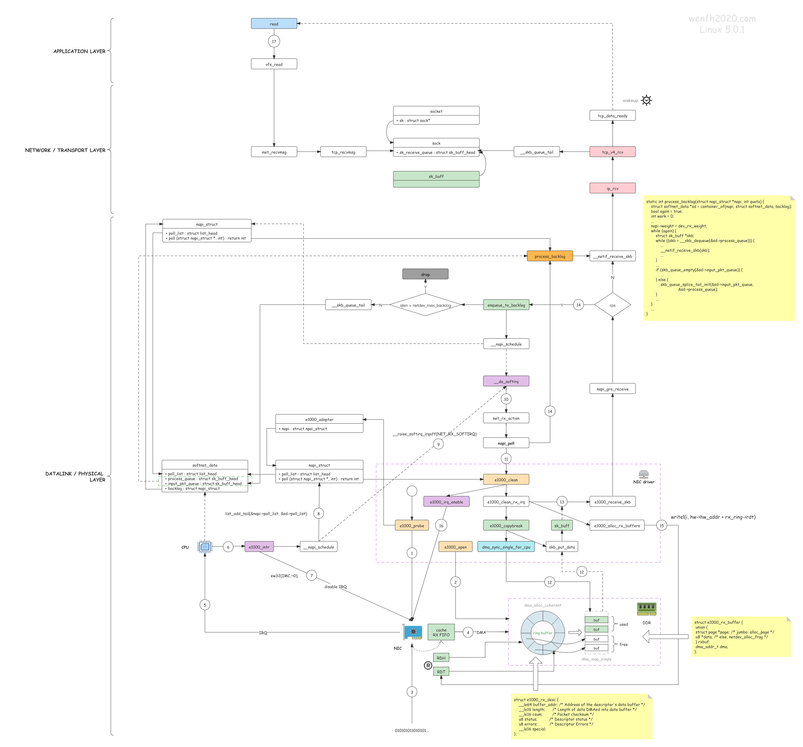

```table-of-contents
```
# 概述


当 NIC 把数据包通过 DMA 复制到内核缓冲区 `sk_buffer` 后，NIC 立即发起一个硬件中断。
CPU 接收后，首先进入上半部分，网卡中断对应的中断处理程序是网卡驱动程序的一部分，之后由它发起软中断，进入下半部分，开始消费 `sk_buffer` 中的数据，交给内核协议栈处理。


从比较高的层次看，一个数据包从被网卡接收到进入 socket 接收队列的整个过程如下：
1. 内核：初始化网卡驱动；其中包括了注册 `poll()` 方法；
2. 网卡：收到包；
3. 网卡：通过 DMA 将包复制到内核内存中的 **==ring buffer==**；
4. 网卡：如果此时 NAPI 没有在执行，就产生硬件中断（IRQ），通知系统收到了一个包（否则不用额外 IRQ 就会把包收走）；触发软中断；
5. 内核：调度到软中断处理线程 `ksoftirqd`；（`poll` 函数是网卡 驱动在初始化阶段注册的；每个 CPU 上都运行着一个 `ksoftirqd` 进程，在系统启动期 间就注册了）
6. 内核：软中断处理，调用 NAPI 的 `poll()` 从 ring buffer 收包，并以 `skb` 的形式送至更上层处理；
7. 协议栈：L2 处理；
8. 协议栈：L3 处理；
9. 协议栈：L4 处理。
10. 包从协议层进入相应 socket 的接收队列
注：如果网卡支持多队列，即RSS，则每个队列应该会对应一个ring buffer.
## 网络分层
TCP/IP 与 ISO/OSI分层对比如下:

而在Linux kernel中实现的分层模型如下:

整个代码分层结构实现,每层都有不同的数据结构去封装好,代码流程中充满了各种函数指针而不是直接的函数调用.这也是不可避免的,因为层与层的组成有很多方式,这也导致不是那么容易和清晰去追踪代码流程.

- UDP报文收发的整体架构


- ICMP报文收发的整体架构


## 网络层收包
### 整体流程
数据包在实际现网传输过程中，会经过各类交换机，路由器的转发处理，在这个过程中，路由器一般只处理到网络层。


注：

1）不同版本内核在函数名上可能存在一定差异，但整体调用逻辑基本不变;

2）该图仅展示 IPv4 的处理流程，IPv6 不在该图的函数中处理，但整体流程基本相似；

3）该图展示的流程仅为普通单播并且未进行 IP 分片的数据包处理流程，组播，多播，IP 分片的数据包在某些流程上存在差异；

- 从图中可以看到，***ip_rcv***函数为网络层向下层开放的入口，数据包通过该函数进入网络层进行处理，该函数主要对上传到网络层的数据包进行前期合法性检查，通过后交由 Netfilter 的钩子节点；
- 绿色方框内的**IP_PRE_ROUTING**为 Netfilter 框架的 Hook 点，该节点会根据预设的规则对数据包进行判决并根据判决结果做相关的处理，比如执行 NAT 转换；
- **IP_PRE_ROUTING**节点处理完成后，数据包将交由***ip_rcv_finish***处理，该函数根据路由判决结果，决定数据包是交由本机上层应用处理，还是需要进行转发；如果是交由本机处理，则会交由***ip_local_deliver***走本地上交流程；如果需要转发，则交由***ip_forward***函数走转发流程；
- 在数据包上交本地的流程中，**IP_LOCAL_INPUT**节点用于监控和检查上交到本地上层应用的数据包，该节点是 Linux 防火墙的重要生效节点之一；当包发往本地电脑, `ip_local_deliver` 必须找到合适的transport layer 函数来处理.IP包通常使用TCP或UDP作为 transport layer.
- 在数据包转发流程中，Netfilter 框架的**IP_FORWARD**节点会对转发数据包进行检查过滤；
- 而对于本机上层发出的数据包，网络层通过注册到上层的***ip_local_out***函数接收数据处理，处理 OK 进一步交由**IP_LOCAL_OUT**节点检测；
- 对于即将发往下层的数据包，需要经过**IP_POST_ROUTING**节点处理；网络层处理结束，通过***dev_queue_xmit***函数将数据包交由 Linux 内核中虚拟网络设备做进一步处理，从这里数据包即离开网络层进入到下一层；

### 本地收包
#### Defragmentation  
因为IP包是可以被分包的,使得不能马上确认一个完整的包收到.因此第一个任务是使用函数 `ip_defrag` 组装一个被分片的包.相应的代码流程如下:

kernel在一个独立的cache中管理原本大包的分片,这个cache被成为 _fragment cache_ . 比如 `net->ipv4.frags(ip_fragment.c)` . 在此cache中,属于一起的分片缓存在独立的一个等待队列中，直到所有分片齐全.

`ip_find` 被调用去寻找分片等待队列.它使用一个涉及fragment ID,起始和目的地址,和包协议标示的hashing来确认这个包的等待队列是否已存在.如果没有, 一个新的队列创建并把此包放在里面. 通过 `ip_frag_queue` 能把包放如队列.
`ip_frag_queue` 放如新包后,并检查包的所有分片是否都在cache中,调用 `ip_frag_reasm` 来组装分片.

如果包的所有分片没有都到达, `ip_defrag` 返回一个非空的错误值来结束IP层包的处理.但所有分包都达到时继续处理.


#### Delivery to the Transport Layer  
`ip_local_deliver` 处理完分包后,调用hook函数后继续调用 `ip_local_deliver_finish` .
包被传递到transport layer函数前需要确定协议是啥来调用相应协议的处理函数.所有基于IP层的协议都有一个 `net_protocol` 数据结构的实例:
```c
struct net_protocol {
        int                     (*handler)(struct sk_buff *skb);
        void                    (*err_handler)(struct sk_buff *skb, u32 info);
..
};

`handler` 是被传递包的协议处理函数.
`err_handler` 被调用当收到ICMP error信息时并需要传递到上层.
```
在函数 `inet_add_protocol` 中,通过hash方法把各个协议映射到数组 `inet_protos` 中的单一条目下.
找到相应的协议 `inet_protocol` ,并调用其中处理函数 `handler`.至此包从 IP层被传送到更高层处理.比如 `tcp_v4_rcv` 函数接收TCP包, `udp_rcv` 接收 UDP包.

### 转发包
转发函数 `ip_forward` 如下:


先检查TTL值允许被传递到下一个hop. 若可以, `ip_decrease_ttl` 把TTL减1并更新包的checksum.

一旦 `NF_INET_FORWARD` 被调用完,kernel继续在 `ip_forward_finish` 中处理,这个函数跳转到另外2个函数:

1. 如果包包含其他的参数(一般不会这种情况),它们被 `ip_forward_options` 处理.
2. `dst_output` 把包交给路由发送函数,这个函数在 `skb->dst->output` 中. 一般 `ip_output` 用作此目的, 把包发送到与目的相符的网络适配器. `ip_output` 是IP层的发送操作,

### ipv6收包
**ipv6网络层收包流程如下所示**：


### 发送包
kernel提供很多个函数来让上层协议发送数据通过IP层. `ip_queue_xmit` 是其中用的相对多的函数,流程如下:

来自同一个socket的所有包有相同的目的地址,所以路由不需要每次都决定, 之后会分析的 `(struct dst_entry *)skb->_skb_dst` 结构指向相应的路由信息.
一旦 `ip_send_check` 为这个包生成checksum后,kernel调用 `ip_local_out`, 并调用netfilter hook `NF_INET_LOCAL_OUT`. 最后 `dst_output` 被调用. , 这个函数在 `skb->dst->output` 中.一般是 `ip_output` ,该函数把包发送到与目的相符的网络适配器.

首先netfilter hook `NF_INET_POST_ROUTING` 被调用,紧接着 `ip_finish_output`.通过查看传送介质的MTU决定是否需要分片.如果不需要直接调用 `ip_finish_output2`.
这个函数查看socket buffer是否有足够空间给硬件头.必要的话,调用 `skb_realloc_headroom` 添加额外的空间.为了完成传送到network access layer（网络设备子系统）, 由路由层设置的 `dst->neighbour->output` 函数被调用, 通常是函数 `dev_queue_xmit`.

## 内核的udp处理流程
如下所示，Linux内核之UDP处理流程：


如果在应用层调用发送函数，若采用SOCK_DGRAM套接字，会触发内核`udp_sendmsg`调用，查找路由信息后，调用`ip_append_data`对数据做分片处理，然后调用`udp_push_pending_frames`进行UDP包封装，并把数据包交给IP层处理。

如果在应用层调用接收函数，IP层取出数据内容后，函数`ip_local_deliver_finish`会调用UDP模块的`udp_rcv`函数。数据包会被加入套接字队列，再由函数`udp_recvmsg`取出，并通知应用程序函数读取数据。

## 内核的TCP处理流程




# 网卡驱动初始化
网卡成功完成初始化之后，数据包通过网线到达网卡时，才能被正确地收起来送到更上层去处理。 因此，我们的工作必须从网卡初始化开始。
这一过程虽然是**==厂商相关==**的，但是非常重要；弄清楚了网卡驱动的工作原理， 才能对后面的部分有更加清晰的认识和理解。
网卡驱动一般都是作为独立的**==内核模块==**（kernel module）维护的。

## 常见驱动
目前主流的网卡驱动都是以太网驱动，例如最常见的 Intel 系列：

- igb：老网卡，其中的 `i` 是 `intel`，`gb` 表示（每秒 1）`Gb`
- ixgbe：`x` 是罗马数字 10，所以 `xgb` 表示 `10Gb`，`e` 表示以太网
- i40e：`intel` 40Gbps 以太网

**==`lx5_core`==** 驱动是如今常见的 Mellanox ConnectX-4/ConnectX-5 `25Gbps/40Gbps` 以太网卡的驱动。`mlx5_core` 这个驱动有点特殊，它支持以太网驱动，但由于历史原因，它的实现与普通以太网驱动有很大不同： Mellanox 是做高性能传输起家的（2019 年被 NVIDIA 收购），早期产品是 InfiniBand， 这是一个**==平行于以太网==**的二层传输和互联方案：

Infiniband 在高性能计算、RDMA 网络中应用广泛，但毕竟市场还是太小了，所以 后来 Mellanox 又对它的网卡添加了以太网支持。
表现在驱动代码上，就是会看到它有一些 特定的术语、变量和函数命名、模块组织等等，读起来比 ixgbe 这样原生的以太网驱动要累一些。 这里列一些，方便后面看代码：
```c
- WR：work request, work items that HW should perform
- WC: work completion, information about a completed WR
- WQ: work queue contains WRs, scheduled by HW, aka **==ring buffer==**
- SQ: sending queue
- SR: sending request
- RQ: receive queue
- RR: receive request
- QP: queue pair
- EQ: event queue, e.g. **==HW events==**
```

接下来看下一个具体 Mellanox 网卡的**==硬件相关信息==**：
```
$ lspci -vvv | grep Mellanox -A 50
d8:00.0 Ethernet controller: Mellanox Technologies MT27710 Family [ConnectX-4 Lx]
        Subsystem: Mellanox ... ConnectX-4 Lx EN, 25GbE dual-port SFP28, PCIe3.0 x8, MCX4121A-ACAT
        Interrupt: pin A routed to IRQ 114
        Capabilities: [9c] MSI-X: Enable+ Count=64 Masked-
                Vector table: BAR=0 offset=00002000
                PBA: BAR=0 offset=00003000
        Capabilities: [180 v1] Single Root I/O Virtualization (SR-IOV)
                ...
                Initial VFs: 8, Total VFs: 8, Number of VFs: 0, Function Dependency Link: 00
        ...
        Kernel driver in use: mlx5_core
        Kernel modules: mlx5_core
```
其中的一些关键信息：

1. **==网卡型号==**：`ConnectX-4`；
2. 25Gbe dual-port SFP28：**==最大带宽==** `25Gbps` 以太网卡；双接口，也就是在系统中能看到 `eth0` 和 `eth1` 两个网卡；
3. 插槽类型：`PCIe3.0 x8`；
4. **==硬件中断==**：`IRQ 114`， `MSI-X`；
5. 当前使用的**==网卡驱动==**：`mlx5_core`，对应的内核**==内核模块==**是 `mlx5_core`。

可以看到现在用的驱动叫 `mlx5_core`，接下来就来看它的实现，代码位于 **==`drivers/net/ethernet/mellanox/mlx5/core`==**。

## mlx5_core驱动
### 驱动模块注册：`module_init() -> init() -> pci/mlx5e init`
首先看内核启动时，驱动的注册和初始化过程。非常简单直接， **==`module_init()`==** 注册一个初始化函数，内核加载驱动执行：
```
// https://github.com/torvalds/linux/blob/v5.10/drivers/net/ethernet/mellanox/mlx5/core/main.c

static int __init init(void) {
    mlx5_register_debugfs();                // /sys/kernel/debug

    pci_register_driver(&mlx5_core_driver); // 初始化 PCI 相关的东西
    mlx5e_init();                           // 初始化 ethernet 相关东西
}

module_init(init);
```

初始化的大部分工作在 `pci_register_driver()` 和 `mlx5e_init()` 里面完成。

### PCI 相关初始化
#### PCI 驱动列表注册：`pci_register_driver()`
前面 `lspci` 可以看到这个网卡是 [PCI express](https://en.wikipedia.org/wiki/PCI_Express) 设备， 这种设备通过 [PCI Configuration Space](https://en.wikipedia.org/wiki/PCI_configuration_space#Standardized_registers) 识别。当设备驱动编译时，`MODULE_DEVICE_TABLE` 宏会导出一个 global 的 **==PCI 设备 ID 列表==**， 驱动据此识别它可以控制哪些设备，这样内核就能对各设备加载正确的驱动：

```
// https://github.com/torvalds/linux/blob/v5.10/include/linux/module.h

#ifdef MODULE
  /* Creates an alias so file2alias.c can find device table. */
  #define MODULE_DEVICE_TABLE(type, name)                    \
    extern typeof(name) __mod_##type##__##name##_device_table __attribute__ ((unused, alias(__stringify(name))))
#else  /* !MODULE */
  #define MODULE_DEVICE_TABLE(type, name)
#endif
```
`mlx5_core` 驱动的设备表和 PCI 设备 ID：
```
// https://github.com/torvalds/linux/blob/v5.10/drivers/net/ethernet/mellanox/mlx5/core/main.c

static const struct pci_device_id mlx5_core_pci_table[] = {
    { PCI_VDEVICE(MELLANOX, PCI_DEVICE_ID_MELLANOX_CONNECTIB) },
    { PCI_VDEVICE(MELLANOX, 0x1012), MLX5_PCI_DEV_IS_VF},    /* Connect-IB VF */
    { PCI_VDEVICE(MELLANOX, PCI_DEVICE_ID_MELLANOX_CONNECTX4) },
    { PCI_VDEVICE(MELLANOX, 0x1014), MLX5_PCI_DEV_IS_VF},    /* ConnectX-4 VF */
    { PCI_VDEVICE(MELLANOX, PCI_DEVICE_ID_MELLANOX_CONNECTX4_LX) },
    { PCI_VDEVICE(MELLANOX, 0x1016), MLX5_PCI_DEV_IS_VF},    /* ConnectX-4LX VF */
    { PCI_VDEVICE(MELLANOX, 0x1017) },            /* ConnectX-5, PCIe 3.0 */
    { PCI_VDEVICE(MELLANOX, 0x1018), MLX5_PCI_DEV_IS_VF},    /* ConnectX-5 VF */
    { PCI_VDEVICE(MELLANOX, 0x1019) },            /* ConnectX-5 Ex */
    { PCI_VDEVICE(MELLANOX, 0x101a), MLX5_PCI_DEV_IS_VF},    /* ConnectX-5 Ex VF */
    { PCI_VDEVICE(MELLANOX, 0x101b) },            /* ConnectX-6 */
    { PCI_VDEVICE(MELLANOX, 0x101c), MLX5_PCI_DEV_IS_VF},    /* ConnectX-6 VF */
    { PCI_VDEVICE(MELLANOX, 0x101d) },            /* ConnectX-6 Dx */
    { PCI_VDEVICE(MELLANOX, 0x101e), MLX5_PCI_DEV_IS_VF},    /* ConnectX Family mlx5Gen Virtual Function */
    { PCI_VDEVICE(MELLANOX, 0x101f) },            /* ConnectX-6 LX */
    { PCI_VDEVICE(MELLANOX, 0x1021) },            /* ConnectX-7 */
    { PCI_VDEVICE(MELLANOX, 0xa2d2) },            /* BlueField integrated ConnectX-5 network controller */
    { PCI_VDEVICE(MELLANOX, 0xa2d3), MLX5_PCI_DEV_IS_VF},    /* BlueField integrated ConnectX-5 network controller VF */
    { PCI_VDEVICE(MELLANOX, 0xa2d6) },            /* BlueField-2 integrated ConnectX-6 Dx network controller */
    { 0, }
};

MODULE_DEVICE_TABLE(pci, mlx5_core_pci_table);
```
`pci_register_driver()` 会将该驱动的各种回调方法注册到一个 **==`struct pci_driver mlx5_core_driver`==** 变量，
```
// https://github.com/torvalds/linux/blob/v5.10/drivers/net/ethernet/mellanox/mlx5/core/main.c

static struct pci_driver mlx5_core_driver = {
    .name           = DRIVER_NAME,
    .id_table       = mlx5_core_pci_table,
    .probe          = init_one,              // 初始化时执行这个方法
    .remove         = remove_one,
    .suspend        = mlx5_suspend,
    .resume         = mlx5_resume,
    .shutdown    = shutdown,
    .err_handler    = &mlx5_err_handler,
    .sriov_configure   = mlx5_core_sriov_configure,
};
```
#### 内核为网卡搜索和加载驱动：`pci_driver->probe()`
内核启动过程中，会通过 PCI ID 依次识别各 PCI 设备，然后为设备选择合适的驱动。 每个 PCI 驱动都注册了一个 `probe()` 方法，**==为设备寻找驱动就是调用其 probe() 方法==**。 
`probe()` 做的事情因厂商和设备而已，但总体来说这个过程涉及到的东西都非常多， 最终目标也都是使设备 ready。典型过程包括：

1. 启用 PCI 设备
2. 请求（requesting）内存范围和 IO 端口
3. 设置 DMA 掩码
4. 注册设备驱动支持的 ethtool 方法（后面介绍）

来看下 `mlx5_core` 驱动的 `probe()` 包含哪些过程：
```
// https://github.com/torvalds/linux/blob/v5.10/drivers/net/ethernet/mellanox/mlx5/core/main.c

static int init_one(struct pci_dev *pdev, const struct pci_device_id *id) {
    struct devlink       *devlink = mlx5_devlink_alloc();  // 内核通用结构体，包含 netns 等信息
    struct mlx5_core_dev *dev     = devlink_priv(devlink); // 私有数据区域存储的是 mlx5 自己的 device 表示
    dev->device = &pdev->dev;
    dev->pdev = pdev;

    mlx5_mdev_init(dev, prof_sel); // 初始化 mlx5 debugfs 目录
    mlx5_pci_init(dev, pdev, id);  // 初始化 IO/DMA/Capabilities 等功能
    mlx5_load_one(dev, true);      // 初始化 IRQ 等

    request_module_nowait(MLX5_IB_MOD);

    pci_save_state(pdev);
    if (!mlx5_core_is_mp_slave(dev))
        devlink_reload_enable(devlink);
}
```
- **调用栈和流程图**
```
.probe()
  |-init_one(struct pci_dev *pdev, pci_device_id id)
      |-mlx5_devlink_alloc()
      |   |-devlink_alloc(ops)        // net/core/devlink.c
      |       |-devlink = kzalloc()
      |       |-devlink->ops = ops
      |       |-return devlink
      |
      |-mlx5_mdev_init(dev, prof_sel)
      |   |-debugfs_create_dir
      |   |-mlx5_pagealloc_init(dev)
      |       |-create_singlethread_workqueue("mlx5_page_allocator")
      |           |-alloc_ordered_workqueue
      |               |-alloc_workqueue     // kernel/workqueue.c
      |
      |-mlx5_pci_init(dev, pdev, id);
      |   |-mlx5_pci_enable_device(dev);
      |   |-request_bar(pdev);             // Reserve PCI I/O and memory resources
      |   |-pci_set_master(pdev);          // Enables bus-mastering on the device
      |   |-set_dma_caps(pdev);            // setting DMA capabilities mask, set max_seg <= 1GB
      |   |-dev->iseg = ioremap()
      |
      |-mlx5_load_one(dev, true);
      |   |-if interface already STATE_UP
      |   |   return
      |   |
      |   |-dev->state = STATE_UP
      |   |-mlx5_function_setup       // Init firmware functions
      |   |-if boot:
      |   |   mlx5_init_once
      |   |     |-mlx5_irq_table_init // Allocate IRQ table memory
      |   |     |-mlx5_eq_table_init  // events queue
      |   |     |-dev->vxlan  = mlx5_vxlan_create
      |   |     |-dev->geneve = mlx5_geneve_create
      |   |     |-mlx5_sriov_init
      |   | else:
      |   |   mlx5_attach_device
      |   |-mlx5_load
      |   |   |-mlx5_irq_table_create     // 初始化硬中断
      |   |   |  |-pci_alloc_irq_vectors(MLX5_IRQ_VEC_COMP_BASE + 1, PCI_IRQ_MSIX);
      |   |   |  |-request_irqs
      |   |   |      for i in vectors:
      |   |   |        request_irq(irqn, mlx5_irq_int_handler) // 注册中断处理函数
      |   |   |-mlx5_eq_table_create      // 初始化事件队列（EventQueue）
      |   |      |-create_comp_eqs(dev)   // Completion EQ
      |   |          for ncomp_eqs:
      |   |            eq->irq_nb.notifier_call = mlx5_eq_comp_int;
      |   |            create_map_eq()
      |   |            mlx5_eq_enable()
      |   |-set_bit(MLX5_INTERFACE_STATE_UP, &dev->intf_state);
      |
      |-pci_save_state(pdev);
      |
      |-if (!mlx5_core_is_mp_slave(dev))
          devlink_reload_enable(devlink);
```


- 初始化 `devlink`：`mlx5_devlink_alloc()`
`struct devlink` 是个**==通用内核结构体==**：

```
// include/net/devlink.h
struct devlink {
    struct list_head list;
    struct list_head port_list;
    struct list_head sb_list;
    struct list_head dpipe_table_list;
    struct list_head resource_list;
    struct list_head param_list;
    struct list_head region_list;
    struct list_head reporter_list;
    struct mutex reporters_lock; /* protects reporter_list */
    struct devlink_dpipe_headers *dpipe_headers;
    struct list_head trap_list;
    struct list_head trap_group_list;
    struct list_head trap_policer_list;
    const struct devlink_ops *ops;
    struct xarray snapshot_ids;
    struct devlink_dev_stats stats;
    struct device *dev;
    possible_net_t _net;      // netns 相关
    u8 reload_failed:1,
       reload_enabled:1,
       registered:1;
    char priv[0] __aligned(NETDEV_ALIGN);
};
```

`mlx5_devlink_alloc()` 注册一些硬件特性相关的方法，例如 reload、info_get 等：
```
// drivers/net/ethernet/mellanox/mlx5/core/devlink.c

struct devlink *mlx5_devlink_alloc(void) {
    return devlink_alloc(&mlx5_devlink_ops, sizeof(struct mlx5_core_dev));
}

static const struct devlink_ops mlx5_devlink_ops = {
    .flash_update   = mlx5_devlink_flash_update,
    .info_get       = mlx5_devlink_info_get,
    .reload_actions = BIT(DEVLINK_RELOAD_ACTION_DRIVER_REINIT) | BIT(DEVLINK_RELOAD_ACTION_FW_ACTIVATE),
    .reload_limits  = BIT(DEVLINK_RELOAD_LIMIT_NO_RESET),
    .reload_down    = mlx5_devlink_reload_down,
    .reload_up      = mlx5_devlink_reload_up,
};
```

- 初始化 debugfs 和一些 WQ：`mlx5_mdev_init()`
这里面会初始化 debugfs 目录：**==`/sys/kernel/debug/mlx5/`==**

```
$ tree -L 2 /sys/kernel/debug/mlx5/
/sys/kernel/debug/mlx5/
├── 0000:12:00.0
│   ├── cc_params
│   ├── cmd
│   ├── commands
│   ├── CQs
│   ├── delay_drop
│   ├── EQs
│   ├── mr_cache
│   └── QPs
└── 0000:12:00.1
    ├── cc_params
    ├── cmd
    ├── commands
    ├── CQs
    ├── delay_drop
    ├── EQs
    ├── mr_cache
    └── QPs
```

- 初始化 PCI 相关部分：`mlx5_pci_init()`
```
static int
mlx5_pci_init(struct mlx5_core_dev *dev, struct pci_dev *pdev, const struct pci_device_id *id) {
    mlx5_pci_enable_device(dev);
    request_bar(pdev);            // Reserve PCI I/O and memory resources
    pci_set_master(pdev);         // Enables bus-mastering on the device
    set_dma_caps(pdev);           // setting DMA capabilities mask, set max_seg <= 1GB
    dev->iseg = ioremap(dev->iseg_base, sizeof(*dev->iseg)); // mapping initialization segment

    mlx5_pci_vsc_init(dev);
    dev->caps.embedded_cpu = mlx5_read_embedded_cpu(dev);
    return 0;
}
```

- 初始化硬中断（IRQ）、设置网卡状态为 UP：`mlx5_load_one()`

```
int mlx5_load_one(struct mlx5_core_dev *dev, bool boot) {
    dev->state = MLX5_DEVICE_STATE_UP;
    mlx5_function_setup(dev, boot);

    if (boot) {
        mlx5_init_once(dev);
    }

    mlx5_load(dev);
    set_bit(MLX5_INTERFACE_STATE_UP, &dev->intf_state);

    if (boot) {
        mlx5_devlink_register(priv_to_devlink(dev), dev->device);
        mlx5_register_device(dev);
    } else {
        mlx5_attach_device(dev);
    }
}
```

这里会初始化硬件中断，

```
      |   |-mlx5_load
      |   |   |-mlx5_irq_table_create     // 初始化硬中断
      |   |   |  |-pci_alloc_irq_vectors(MLX5_IRQ_VEC_COMP_BASE + 1, PCI_IRQ_MSIX);
      |   |   |  |-request_irqs
      |   |   |      for i in vectors:
      |   |   |        request_irq(irqn, mlx5_irq_int_handler) // 注册中断处理函数
      |   |   |-mlx5_eq_table_create      // 初始化事件队列（EventQueue）
      |   |      |-create_comp_eqs(dev)   // Completion EQ
      |   |          for ncomp_eqs:
      |   |            eq->irq_nb.notifier_call = mlx5_eq_comp_int;
      |   |            create_map_eq()
      |   |            mlx5_eq_enable()
```

使用的中断方式是 MSI-X。 当一个数据帧通过 DMA 写到内核内存 ringbuffer 后，网卡通过硬件中断（IRQ）通知其他系统。 设备有多种方式触发一个中断：

- MSI-X
- MSI
- legacy interrupts

设备驱动的实现也因此而异。驱动必须判断出设备支持哪种中断方式，然后注册相应的中断处理函数，这些函数在中断发 生的时候会被执行。
- **==MSI-X 中断是比较推荐的方式==**，尤其是对于支持多队列的网卡。 因为每个 RX 队列有独立的 MSI-X 中断，因此可以被不同的 CPU 处理（通过 `irqbalance` 方式，或者修改`/proc/irq/IRQ_NUMBER/smp_affinity`）。后面会看到 ，**处理中断的 CPU 也是随后处理这个包的 CPU【即硬中断和软中断是一个CPU core】*。这样的话，从网卡硬件中断的层面就可 以设置让收到的包被不同的 CPU 处理。
- 如果不支持 MSI-X，那 MSI 相比于传统中断方式仍然有一些优势，驱动仍然会优先考虑它。 这个 [wiki](https://en.wikipedia.org/wiki/Message_Signaled_Interrupts) 介绍了更多 关于 MSI 和 MSI-X 的信息。

### 以太网相关初始化：`mlx5e_init()`
PCI 功能初始化成功后，接下来执行以太网相关功能的初始化。

```
// en_main.c

void mlx5e_init(void) { 
    mlx5e_ipsec_build_inverse_table();
    mlx5e_build_ptys2ethtool_map();
    mlx5_register_interface(&mlx5e_interface);
}

static struct mlx5_interface mlx5e_interface = {
    .add       = mlx5e_add,
    .remove    = mlx5e_remove,
    .attach    = mlx5e_attach,
    .detach    = mlx5e_detach,
    .protocol  = MLX5_INTERFACE_PROTOCOL_ETH, // 接口运行以太网协议
};
```
#### **调用栈和流程图**

```
mlx5e_nic
  |-mlx5e_ipsec_build_inverse_table();
  |-mlx5e_build_ptys2ethtool_map();
  |-mlx5_register_interface(&mlx5e_interface)
     |-list_add_tail(&intf->list, &intf_list);
     |
     |-for priv in mlx5_dev_list
         mlx5_add_device(intf, priv)
          /
         /
mlx5_add_device(intf, priv)
 |-if !mlx5_lag_intf_add
 |   return // if running in InfiniBand mode, directly return
 |
 |-dev_ctx = kzalloc()
 |-dev_ctx->context = intf->add(dev)
     |-mlx5e_add
        |-netdev = mlx5e_create_netdev(mdev, &mlx5e_nic_profile, nch);
        |  |-mlx5e_nic_init
        |     |-mlx5e_build_nic_netdev(netdev);
        |        |-netdev->netdev_ops = &mlx5e_netdev_ops; // 注册 ethtool_ops, poll
        |-mlx5e_attach
        |  |-mlx5e_attach_netdev
        |      |-profile->init_tx()
        |      |-profile->init_rx()
        |      |-profile->enable()
        |          |-mlx5e_nic_enable
        |              |-mlx5e_init_l2_addr
        |              |-queue_work(priv->wq, &priv->set_rx_mode_work)
        |              |-mlx5e_open(netdev);
        |              |  |-mlx5e_open_locked
        |              |     |-mlx5e_open_channels
        |              |     |  |-mlx5e_open_channel
        |              |     |     |-netif_napi_add(netdev, &c->napi, mlx5e_napi_poll, 64);
        |              |     |     |-mlx5e_open_queues
        |              |     |         |-mlx5e_open_cq
        |              |     |         |   |-mlx5e_alloc_cq
        |              |     |         |       |-mlx5e_alloc_cq_common
        |              |     |         |           |-mcq->comp = mlx5e_completion_event;
        |              |     |         |-napi_enable(&c->napi)
        |              |     |-mlx5e_activate_priv_channels
        |              |        |-mlx5e_activate_channels
        |              |            |-for ch in channels:
        |              |                mlx5e_activate_channel
        |              |                  |-mlx5e_activate_rq
        |              |                     |-mlx5e_trigger_irq
        |              |-netif_device_attach(netdev);
```

#### `mlx5e_init() -> mlx5_register_interface() -> mlx5_add_device()`
```
// drivers/net/ethernet/mellanox/mlx5/core/dev.c

static LIST_HEAD(intf_list);      // 全局 interface 双向链表
static LIST_HEAD(mlx5_dev_list);  // 全局 mlx5 device 双向链表

int mlx5_register_interface(struct mlx5_interface *intf) {
    list_add_tail(&intf->list, &intf_list);

    list_for_each_entry(struct mlx5_priv *priv, &mlx5_dev_list, dev_list)
        mlx5_add_device(intf, priv); // 如果网卡运行的是 InfiniBand 协议，里面会直接返回
}
```

1. `mlx5/core/dev.c` 中初始化了两个全局变量，分别表示全局的 interface 和 mlx5 device 链表；
    
    - device 是 Mellanox 网络设备，例如一张网卡；
    - interface 是网络设备的**==特定接口类型的方法集合==**，例如这里用到的 `struct mlx5_interface mlx5e_interface` 是 Mellanox 的以太网接口方法；
2. 将给定的 interface 插入全局 interface 列表 `intf_list`；
3. 遍历全局 Mellanox device 列表 `mlx5_dev_list`，调用 `mlx5_add_device(intf, priv)` 初始化每个网卡的以太网相关部分。其中包括，
    
    - 根据给定的网络 profile，创建一个内核 netdev 设备；
    - 注册 ethtool 方法
    - 注册 RX/TX 队列初始化方法，并执行初始化
    - 注册 NAPI poll 方法
    - 初始化硬件中断等

```
static const struct mlx5e_profile mlx5e_nic_profile = {
    .init           = mlx5e_nic_init,                // 网卡以太网相关内容初始化
    .cleanup        = mlx5e_nic_cleanup,
    .init_rx        = mlx5e_init_nic_rx,             // 初始化接收队列（RX）
    .cleanup_rx     = mlx5e_cleanup_nic_rx,
    .init_tx        = mlx5e_init_nic_tx,             // 初始化发送队列（TX）
    .cleanup_tx     = mlx5e_cleanup_nic_tx,
    .enable         = mlx5e_nic_enable,              // 启用网卡时的回调
    .disable        = mlx5e_nic_disable,
    .update_rx      = mlx5e_update_nic_rx,
    .update_stats   = mlx5e_stats_update_ndo_stats,
    .update_carrier = mlx5e_update_carrier,
    .rx_handlers    = &mlx5e_rx_handlers_nic,        // 收包函数
    .max_tc         = MLX5E_MAX_NUM_TC,
    .rq_groups      = MLX5E_NUM_RQ_GROUPS(XSK),
    .stats_grps     = mlx5e_nic_stats_grps,
    .stats_grps_num = mlx5e_nic_stats_grps_num,
};
```

#### `mlx5_add_device() -> intf.add() -> mlx5e_add()`

- `mlx5e_create_netdev()`：创建 netdev、注册 `ethtool` 方法
`ethtool` 是一个命令行工具，可以查看和修改网卡配置，常用于收集网卡统计数据。 
内核实现了一个通用 `ethtool` 接口，网卡驱动只要实现这些接口，就可以使用 `ethtool` 来查看或修改网络配置； 在底层，它是通过 [==ioctl==](http://man7.org/linux/man-pages/man2/ioctl.2.html) 和设备驱动通信的。

```
// drivers/net/ethernet/mellanox/mlx5/core/en_main.c

const struct net_device_ops mlx5e_netdev_ops = {
    .ndo_open                = mlx5e_open,
    .ndo_stop                = mlx5e_close,
    .ndo_start_xmit          = mlx5e_xmit,
    .ndo_setup_tc            = mlx5e_setup_tc,
    .ndo_select_queue        = mlx5e_select_queue,
    .ndo_get_stats64         = mlx5e_get_stats,
    .ndo_set_rx_mode         = mlx5e_set_rx_mode,
    .ndo_set_mac_address     = mlx5e_set_mac,
    .ndo_vlan_rx_add_vid     = mlx5e_vlan_rx_add_vid,
    .ndo_vlan_rx_kill_vid    = mlx5e_vlan_rx_kill_vid,
    .ndo_set_features        = mlx5e_set_features,
    .ndo_fix_features        = mlx5e_fix_features,
    .ndo_change_mtu          = mlx5e_change_nic_mtu,
    .ndo_do_ioctl            = mlx5e_ioctl,
    .ndo_set_tx_maxrate      = mlx5e_set_tx_maxrate,
    .ndo_udp_tunnel_add      = udp_tunnel_nic_add_port,
    .ndo_udp_tunnel_del      = udp_tunnel_nic_del_port,
    .ndo_features_check      = mlx5e_features_check,
    .ndo_tx_timeout          = mlx5e_tx_timeout,
    .ndo_bpf                 = mlx5e_xdp,             // BPF
    .ndo_xdp_xmit            = mlx5e_xdp_xmit,        // XDP
    .ndo_xsk_wakeup          = mlx5e_xsk_wakeup,
    .ndo_get_devlink_port    = mlx5e_get_devlink_port,
};
```

- `mlx5e_attach()`
RX 队列及 RX handlers 初始化
今天的大部分网卡都使用 DMA 将数据直接写到内存，接下来操作系统可以直接从里 面读取。
实现这一目的所使用的数据结构就是 **==ring buffer==**（环形缓冲区）。 要实现这一功能，设备驱动必须和操作系统合作，**==预留（reserve）出一段内存来给网卡使用==**。 预留成功后，网卡知道了这块内存的地址，接下来收到的包就会放到这里，进而被操作系统取走。
```
static int mlx5e_init_nic_rx(struct mlx5e_priv *priv) {
    struct mlx5_core_dev *mdev = priv->mdev;

    mlx5e_create_q_counters(priv);
    mlx5e_open_drop_rq(priv, &priv->drop_rq);

    mlx5e_create_indirect_rqt(priv);
    mlx5e_create_direct_rqts(priv, priv->direct_tir);

    mlx5e_create_indirect_tirs(priv, true);
    mlx5e_create_direct_tirs(priv, priv->direct_tir);

    mlx5e_create_direct_rqts(priv, priv->xsk_tir);
    mlx5e_create_direct_tirs(priv, priv->xsk_tir);

    mlx5e_create_flow_steering(priv);
    mlx5e_tc_nic_init(priv);          // 初始化 TC offload 功能
    mlx5e_accel_init_rx(priv);        // 初始化 kTLS offload

#ifdef CONFIG_MLX5_EN_ARFS
    priv->netdev->rx_cpu_rmap =  mlx5_eq_table_get_rmap(priv->mdev);
#endif
```

以及 profile 中注册的 **==rx_handlers==**：
```
const struct mlx5e_rx_handlers mlx5e_rx_handlers_nic = {
    .handle_rx_cqe       = mlx5e_handle_rx_cqe,
    .handle_rx_cqe_mpwqe = mlx5e_handle_rx_cqe_mpwrq,
};
```

查看一台机器的 queue 数量：
```
$ ethtool -l eth0             # 能用 ethtool 看到这些信息，就是因为前面注册了 ethtool 的相应方法
Channel parameters for eth0:
Pre-set maximums:
RX:             0
TX:             0
Other:          0
Combined:       40          # 最多支持 40 个
Current hardware settings:
RX:             0
TX:             0
Other:          0
Combined:       40          # 目前配置 40 个
```

每个 Queue 的 descriptor 数量（或称 queue depth）：

```
$ ethtool -g eth0
Ring parameters for eth0:
Pre-set maximums:
RX:             8192
RX Mini:        0
RX Jumbo:       0
TX:             8192
Current hardware settings:
RX:             1024
RX Mini:        0
RX Jumbo:       0
TX:             1024
```

Hash：

```
$ ethtool -x eth0
RX flow hash indirection table for eth0 with 40 RX ring(s):
    0:      0     1     2     3     4     5     6     7
    8:      8     9    10    11    12    13    14    15
   16:     16    17    18    19    20    21    22    23
   24:     24    25    26    27    28    29    30    31
   32:     32    33    34    35    36    37    38    39
   40:      0     1     2     3     4     5     6     7
   48:      8     9    10    11    12    13    14    15
   56:     16    17    18    19    20    21    22    23
   64:     24    25    26    27    28    29    30    31
   72:     32    33    34    35    36    37    38    39
   80:      0     1     2     3     4     5     6     7
   88:      8     9    10    11    12    13    14    15
   96:     16    17    18    19    20    21    22    23
  104:     24    25    26    27    28    29    30    31
  112:     32    33    34    35    36    37    38    39
  120:      0     1     2     3     4     5     6     7
RSS hash key:
9a:b0:e3:53:ed:d4:14:7a:a0:...:e5:57:e8:6a:ec
RSS hash function:
    toeplitz: off
    xor: on
    crc32: off
```

- 启用网卡，注册 NAPI poll 方法
内核有一种称为 NAPI（New API）的机制，允许网卡注册自己的 poll() 方法，执行这个方法就会从相应的网卡收包。 
关于 NAPI 后面会有更详细介绍，这里只看一下注册时的调用栈：
```
mlx5e_open(netdev);
 |-mlx5e_open_locked
    |-mlx5e_open_channels
    |  |-mlx5e_open_channel
    |     |-netif_napi_add(netdev, &c->napi, mlx5e_napi_poll, 64); // 注册 NAPI
    |     |-mlx5e_open_queues
    |         |-mlx5e_open_cq
    |         |   |-mlx5e_alloc_cq
    |         |       |-mlx5e_alloc_cq_common
    |         |           |-mcq->comp = mlx5e_completion_event;
    |         |-napi_enable(&c->napi)                              // 启用 NAPI
    |-mlx5e_activate_priv_channels
       |-mlx5e_activate_channels
           |-for ch in channels:
               mlx5e_activate_channel                              // 启用硬中断（IRQ）
                 |-mlx5e_activate_rq
                    |-mlx5e_trigger_irq
```

- 启用硬中断，等待数据包进来
到这里，几乎所有的准备工作都就绪了，**==唯一剩下的就是打开硬中断==**， 等待数据包进来。

**==打开硬中断的方式因硬件而异==**，`mxl5_core` 驱动是在 `mlx5e_trigger_irq()` 中完成的。 调用栈见上面。

网卡启用后，驱动可能还会做一些额外的事情，例如启动定时器 或者其他硬件相关的设置。这些工作做完后，网卡就可以收包了。


## igb驱动
### 初始化
驱动会使用 `module_init` 向内核注册一个初始化函数，当驱动被加载时，内核会调用这个函数。

这个初始化函数（`igb_init_module`）的代码见 [`drivers/net/ethernet/intel/igb/igb_main.c`](https://github.com/torvalds/linux/blob/v3.13/drivers/net/ethernet/intel/igb/igb_main.c#L676-L697).

过程非常简单直接：
```
/**
 *  igb_init_module - Driver Registration Routine
 *
 *  igb_init_module is the first routine called when the driver is
 *  loaded. All it does is register with the PCI subsystem.
 **/
static int __init igb_init_module(void)
{
  int ret;
  pr_info("%s - version %s\n", igb_driver_string, igb_driver_version);
  pr_info("%s\n", igb_copyright);

  /* ... */

  ret = pci_register_driver(&igb_driver);
  return ret;
}

module_init(igb_init_module);
```

初始化的大部分工作在 `pci_register_driver` 里面完成，下面来细看。

#### PCI 初始化
Intel I350 网卡是 [PCI express](https://en.wikipedia.org/wiki/PCI_Express) 设备。 PCI 设备通过 [PCI Configuration Space](https://en.wikipedia.org/wiki/PCI_configuration_space#Standardized_registers) 里面的寄存器识别自己。

当设备驱动编译时，`MODULE_DEVICE_TABLE` 宏（定义在 [`include/module.h`](https://github.com/torvalds/linux/blob/v3.13/include/linux/module.h#L145-L146)） 会导出一个 **PCI 设备 ID 列表**（a table of PCI device IDs），驱动据此识别它可以 控制的设备，内核也会依据这个列表对不同设备加载相应驱动。

`igb` 驱动的设备表和 PCI 设备 ID 分别见： [drivers/net/ethernet/intel/igb/igb_main.c](https://github.com/torvalds/linux/blob/v3.13/drivers/net/ethernet/intel/igb/igb_main.c#L79-L117) 和[drivers/net/ethernet/intel/igb/e1000_hw.h](https://github.com/torvalds/linux/blob/v3.13/drivers/net/ethernet/intel/igb/e1000_hw.h#L41-L75)。
```
static DEFINE_PCI_DEVICE_TABLE(igb_pci_tbl) = {
  { PCI_VDEVICE(INTEL, E1000_DEV_ID_I354_BACKPLANE_1GBPS) },
  { PCI_VDEVICE(INTEL, E1000_DEV_ID_I354_SGMII) },
  { PCI_VDEVICE(INTEL, E1000_DEV_ID_I354_BACKPLANE_2_5GBPS) },
  { PCI_VDEVICE(INTEL, E1000_DEV_ID_I211_COPPER), board_82575 },
  { PCI_VDEVICE(INTEL, E1000_DEV_ID_I210_COPPER), board_82575 },
  { PCI_VDEVICE(INTEL, E1000_DEV_ID_I210_FIBER), board_82575 },
  { PCI_VDEVICE(INTEL, E1000_DEV_ID_I210_SERDES), board_82575 },
  { PCI_VDEVICE(INTEL, E1000_DEV_ID_I210_SGMII), board_82575 },
  { PCI_VDEVICE(INTEL, E1000_DEV_ID_I210_COPPER_FLASHLESS), board_82575 },
  { PCI_VDEVICE(INTEL, E1000_DEV_ID_I210_SERDES_FLASHLESS), board_82575 },
  /* ... */
};
MODULE_DEVICE_TABLE(pci, igb_pci_tbl);
```
前面提到，驱动初始化的时候会调用 `pci_register_driver`，这个函数会将该驱动的各 种回调方法注册到一个 `struct pci_driver` 变量，[drivers/net/ethernet/intel/igb/igb_main.c](https://github.com/torvalds/linux/blob/v3.13/drivers/net/ethernet/intel/igb/igb_main.c#L238-L249)：

```
static struct pci_driver igb_driver = {
  .name     = igb_driver_name,
  .id_table = igb_pci_tbl,
  .probe    = igb_probe,
  .remove   = igb_remove,
  /* ... */
};
```

### 网络设备初始化
通过 PCI ID 识别设备后，内核就会为它选择合适的驱动。每个 PCI 驱动注册了一个 `probe()` 方法，内核会对每个设备依次调用其驱动的 `probe` 方法，一旦找到一个合适的 驱动，就不会再为这个设备尝试其他驱动。

很多驱动都需要大量代码来使得设备 ready，具体做的事情各有差异。典型的过程：

1. 启用 PCI 设备
2. 请求（requesting）内存范围和 IO 端口
3. 设置 DMA 掩码
4. 注册设备驱动支持的 ethtool 方法（后面介绍）
5. 注册所需的 watchdog（例如，e1000e 有一个检测设备是否僵死的 watchdog）
6. 其他和具体设备相关的事情，例如一些 workaround，或者特定硬件的非常规处理
7. 创建、初始化和注册一个 `struct net_device_ops` 类型变量，这个变量包含了用于设 备相关的回调函数，例如打开设备、发送数据到网络、设置 MAC 地址等
8. 创建、初始化和注册一个更高层的 `struct net_device` 类型变量（一个变量就代表了 一个设备）

我们来简单看下 `igb` 驱动的 `igb_probe` 包含哪些过程。下面的代码来自 `igb_probe`，[drivers/net/ethernet/intel/igb/igb_main.c](https://github.com/torvalds/linux/blob/v3.13/drivers/net/ethernet/intel/igb/igb_main.c#L2038-L2059)：

```
err = pci_enable_device_mem(pdev);
/* ... */
err = dma_set_mask_and_coherent(&pdev->dev, DMA_BIT_MASK(64));
/* ... */
err = pci_request_selected_regions(pdev, pci_select_bars(pdev,
           IORESOURCE_MEM),
           igb_driver_name);

pci_enable_pcie_error_reporting(pdev);

pci_set_master(pdev);
pci_save_state(pdev);
```
### 网络设备启动
`igb_probe` 做了很多重要的设备初始化工作。除了 PCI 相关的，还有如下一些通用网络 功能和网络设备相关的工作：

1. 注册 `struct net_device_ops` 变量
2. 注册 ethtool 相关的方法
3. 从网卡获取默认 MAC 地址
4. 设置 `net_device` 特性标记

#### `struct net_device_ops`
网络设备相关的操作函数都注册到这个类型的变量中。[igb_main.c](https://github.com/torvalds/linux/blob/v3.13/drivers/net/ethernet/intel/igb/igb_main.c#L2038-L2059)：

```
static const struct net_device_ops igb_netdev_ops = {
  .ndo_open               = igb_open,
  .ndo_stop               = igb_close,
  .ndo_start_xmit         = igb_xmit_frame,
  .ndo_get_stats64        = igb_get_stats64,
  .ndo_set_rx_mode        = igb_set_rx_mode,
  .ndo_set_mac_address    = igb_set_mac,
  .ndo_change_mtu         = igb_change_mtu,
  .ndo_do_ioctl           = igb_ioctl,
  /* ... */
```

这个变量会在 `igb_probe()`中赋给 `struct net_device` 中的 `netdev_ops` 字段：

```
static int igb_probe(struct pci_dev *pdev, const struct pci_device_id *ent)
{
  ...
  netdev->netdev_ops = &igb_netdev_ops;
}
```

#### `ethtool` 函数注册
[`ethtool`](https://www.kernel.org/pub/software/network/ethtool/) 是一个命令行工 具，可以查看和修改网络设备的一些配置，常用于收集网卡统计数据。在 Ubuntu 上，可以 通过 `apt-get install ethtool` 安装。

`ethtool` 通过 [ioctl](http://man7.org/linux/man-pages/man2/ioctl.2.html) 和设备驱 动通信。内核实现了一个通用 `ethtool` 接口，网卡驱动实现这些接口，就可以被 `ethtool` 调用。
当 `ethtool` 发起一个系统调用之后，内核会找到对应操作的回调函数 。回调实现了各种简单或复杂的函数，简单的如改变一个 flag 值，复杂的包括调整网卡硬 件如何运行。
相关实现见：[igb_ethtool.c](https://github.com/torvalds/linux/blob/v3.13/drivers/net/ethernet/intel/igb/igb_ethtool.c)。

#### 中断（IRQ）
当一个数据帧通过 DMA 写到 RAM（内存）后，网卡是如何通知其他系统这个包可以被处理 了呢？

传统的方式是，网卡会产生一个硬件中断（IRQ），通知数据包到了。有**三种常见的硬中断类型**：

- MSI-X
- MSI
- legacy IRQ
先来思考这样一个问题：如果有大量的数据包到达，就会产生大量的硬件中断。CPU 忙于处 理硬件中断的时候，可用于处理其他任务的时间就会减少。

NAPI（New API）是一种新的机制，可以减少产生的硬件中断的数量（但不能完全消除硬中断 ）。

#### NAPI

NAPI 接收数据包的方式和传统方式不同，它允许设备驱动注册一个 `poll` 方法，然后调 用这个方法完成收包。
NAPI 的使用方式：

1. 驱动打开 NAPI 功能，默认处于未工作状态（没有在收包）
2. 数据包到达，网卡通过 DMA 写到内存
3. 网卡触发一个硬中断，**中断处理函数开始执行**
4. 软中断（softirq，稍后介绍），唤醒 NAPI 子系统。这会触发**在一个单独的线程里，调用驱动注册的 `poll` 方法收包**
5. 驱动禁止网卡产生新的硬件中断。这样做是为了 NAPI 能够在收包的时候不会被新的中 断打扰
6. 一旦没有包需要收了，NAPI 关闭，网卡的硬中断重新开启
7. 转步骤 2

**和传统方式相比，NAPI 一次中断会接收多个包，因此可以减少硬件中断的数量。**

`poll` 方法是通过调用 `netif_napi_add` 注册到 NAPI 的，同时还可以指定权重 `weight`，大部分驱动都 hardcode 为 64。后面会进一步解释这个 weight 以及 hardcode 64。

通常来说，驱动在初始化的时候注册 NAPI poll 方法。

#### `igb` 驱动的 NAPI 初始化
`igb` 驱动的初始化过程是一个很长的调用链：

1. `igb_probe` `->` `igb_sw_init`
2. `igb_sw_init` `->` `igb_init_interrupt_scheme`
3. `igb_init_interrupt_scheme` `->` `igb_alloc_q_vectors`
4. `igb_alloc_q_vectors` `->` `igb_alloc_q_vector`
5. `igb_alloc_q_vector` `->` `netif_napi_add`

从较高的层面来看，这个调用过程会做以下事情：

1. 如果支持 `MSI-X`，调用 `pci_enable_msix` 打开它
2. 计算和初始化一些配置，包括网卡收发队列的数量
3. 调用 `igb_alloc_q_vector` 创建每个发送和接收队列
4. `igb_alloc_q_vector` 会进一步调用 `netif_napi_add` 注册 poll 方法到 NAPI 变量

我们来看下 `igb_alloc_q_vector` 是如何注册 poll 方法和私有数据的： [drivers/net/ethernet/intel/igb/igb_main.c](https://github.com/torvalds/linux/blob/v3.13/drivers/net/ethernet/intel/igb/igb_main.c#L1145-L1271):
```
static int igb_alloc_q_vector(struct igb_adapter *adapter,
                              int v_count, int v_idx,
                              int txr_count, int txr_idx,
                              int rxr_count, int rxr_idx)
{
  /* ... */

  /* allocate q_vector and rings */
  q_vector = kzalloc(size, GFP_KERNEL);
  if (!q_vector)
          return -ENOMEM;

  /* initialize NAPI */
  netif_napi_add(adapter->netdev, &q_vector->napi, igb_poll, 64);

  /* ... */
```

`q_vector` 是新分配的队列，`igb_poll` 是 poll 方法，当它收包的时候，会通过 这个接收队列找到关联的 NAPI 变量（`q_vector->napi`）。
这里很重要，后面我们介绍从驱动到网络协议栈的 flow（根据 IP 头信息做哈希，哈希相 同的属于同一个 flow）时会看到。

### 启用网卡 (Bring A Network Device Up)
前面我们提到的 `structure net_device_ops` 变量，它包含网卡启用、发包、设置 mac 地址等回调函数（函数指针）。

当启用一个网卡时（例如，通过 `ifconfig eth0 up`），`net_device_ops` 的 `ndo_open` 方法会被调用。它通常会做以下事情：

1. 分配 RX、TX 队列内存
2. 打开 NAPI 功能
3. 注册中断处理函数
4. 打开（enable）硬中断
5. 其他

`igb` 驱动中，这个方法对应的是 `igb_open` 函数。

#### 准备从网络接收数据
今天的大部分网卡都**使用 DMA 将数据直接写到内存**，接下来**操作系统可以直接从里 面读取**。实现这一目的所使用的数据结构是 ring buffer（环形缓冲区）。

要实现这一功能，设备驱动必须和操作系统合作，**预留（reserve）出一段内存来给网卡 使用**。预留成功后，网卡知道了这块内存的地址，接下来收到的包就会放到这里，进而被 操作系统取走。

由于这块内存区域是有限的，如果数据包的速率非常快，单个 CPU 来不及取走这些包，新 来的包就会被丢弃。这时候，Receive Side Scaling（RSS，接收端扩展）或者多队列（ multiqueue）一类的技术可能就会排上用场。

一些网卡有能力将接收到的包写到**多个不同的内存区域，每个区域都是独立的接收队列**。这 样操作系统就可以利用多个 CPU（硬件层面）并行处理收到的包。只有部分网卡支持这个功 能。

Intel I350 网卡支持多队列，我们可以在 `igb` 的驱动里看出来。`igb` 驱动启用的时候 ，最开始做的事情之一就是调用 [`igb_setup_all_rx_resources`](https://github.com/torvalds/linux/blob/v3.13/drivers/net/ethernet/intel/igb/igb_main.c#L2801-L2804) 函数。这个函数会对每个 RX 队列调用 `igb_setup_rx_resources`, 里面会管理 DMA 的内存.
如果对其原理感兴趣，可以进一步查看 [Linux kernel’s DMA API HOWTO](https://github.com/torvalds/linux/blob/v3.13/Documentation/DMA-API-HOWTO.txt) 。

RX 队列的数量和大小可以通过 ethtool 进行配置，调整这两个参数会对收包或者丢包产生可见影响。


#### Enable NAPI
前面看到了驱动如何注册 NAPI `poll` 方法，但是，一般直到网卡被启用之后，NAPI 才被启用。

启用 NAPI 很简单，调用 `napi_enable` 函数就行，这个函数会设置 NAPI 变量（`struct napi_struct`）中一个表示是否启用的标志位。前面说到，NAPI 启用后并不是立即开始工 作（而是等硬中断触发）。

对于 `igb`，驱动初始化或者通过 ethtool 修改 queue 数量或大小的时候，会启用每个 `q_vector` 的 NAPI 变量。 [drivers/net/ethernet/intel/igb/igb_main.c](https://github.com/torvalds/linux/blob/v3.13/drivers/net/ethernet/intel/igb/igb_main.c#L2833-L2834):

```
for (i = 0; i < adapter->num_q_vectors; i++)
  napi_enable(&(adapter->q_vector[i]->napi));
```
#### 注册中断处理函数
启用 NAPI 之后，下一步就是注册中断处理函数。设备有多种方式触发一个中断：

- MSI-X
- MSI
- legacy interrupts

设备驱动的实现也因此而异。

驱动必须判断出设备支持哪种中断方式，然后注册相应的中断处理函数，这些函数在中断发 生的时候会被执行。

一些驱动，例如 `igb`，会试图为每种中断类型注册一个中断处理函数，如果注册失败，就 尝试下一种（没测试过的）类型。

**MSI-X 中断是比较推荐的方式，尤其是对于支持多队列的网卡**。因为每个 RX 队列有独 立的 MSI-X 中断，因此可以被不同的 CPU 处理（通过 `irqbalance` 方式，或者修改 `/proc/irq/IRQ_NUMBER/smp_affinity`）。我们后面会看到，处理中断的 CPU 也是随后处 理这个包的 CPU。这样的话，从网卡硬件中断的层面就可以设置让收到的包被不同的 CPU 处理。

如果不支持 MSI-X，那 MSI 相比于传统中断方式仍然有一些优势，驱动仍然会优先考虑它。 这个 [wiki](https://en.wikipedia.org/wiki/Message_Signaled_Interrupts) 介绍了更多 关于 MSI 和 MSI-X 的信息。

在 `igb` 驱动中，函数 `igb_msix_ring`, `igb_intr_msi`, `igb_intr` 分别是 MSI-X, MSI, 和传统中断方式的中断处理函数。

这段代码显式了驱动是如何尝试各种中断类型的， [drivers/net/ethernet/intel/igb/igb_main.c](https://github.com/torvalds/linux/blob/v3.13/drivers/net/ethernet/intel/igb/igb_main.c#L1360-L1413):

```
static int igb_request_irq(struct igb_adapter *adapter)
{
  struct net_device *netdev = adapter->netdev;
  struct pci_dev *pdev = adapter->pdev;
  int err = 0;

  if (adapter->msix_entries) {
    err = igb_request_msix(adapter);
    if (!err)
      goto request_done;
    /* fall back to MSI */
    /* ... */
  }

  /* ... */

  if (adapter->flags & IGB_FLAG_HAS_MSI) {
    err = request_irq(pdev->irq, igb_intr_msi, 0,
          netdev->name, adapter);
    if (!err)
      goto request_done;

    /* fall back to legacy interrupts */
    /* ... */
  }

  err = request_irq(pdev->irq, igb_intr, IRQF_SHARED,
        netdev->name, adapter);

  if (err)
    dev_err(&pdev->dev, "Error %d getting interrupt\n", err);

request_done:
  return err;
}
```

这就是 `igb` 驱动注册中断处理函数的过程，这个函数在一个包到达网卡触发一个硬 件中断时就会被执行。


#### 启用硬中断（enable interrupts），等待数据包进来
到这里，几乎所有的准备工作都就绪了，**==唯一剩下的就是打开硬中断==**， 等待数据包进来。

**==打开硬中断的方式因硬件而异==**，`igb` 驱动是在 `__igb_open` 里调用辅助函数 `igb_irq_enable` 完成的。

中断**==通过写寄存器的方式打开==**：
```
static void igb_irq_enable(struct igb_adapter *adapter)
{
  /* ... */
    wr32(E1000_IMS, IMS_ENABLE_MASK | E1000_IMS_DRSTA);
    wr32(E1000_IAM, IMS_ENABLE_MASK | E1000_IMS_DRSTA);
  /* ... */
}
```
现在，网卡已经启用了。驱动可能还会做一些额外的事情，例如启动定时器，工作队列（ work queue），或者其他硬件相关的设置。这些工作做完后，网卡就可以收包了。

# 网卡收包
从流程来说，网卡驱动初始化完成之后，我们就等着包从网卡上来了，也就是图中第 2 步：

这是物理层（L1）和数据链路层（L2）的行为，这里就不展开了。
# DMA 将包复制到 RX 队列 (ring buffer)
## 工作流程

数据从网线进入网卡，通过 DMA 直接写到 ring buffer（第 3 步），然后就该操作系统来收包了。

如果对其原理感兴趣，可以查看内核文档 [DMA API HOWTO: Dynamic DMA mapping Guide](https://www.kernel.org/doc/Documentation/DMA-API-HOWTO.txt)。

#### ==第一次数据复制==
在包从网卡到达应用层的过程中，会经历几次数据复制，这个对性能影响非常大，所以我们记录一下：

- 第一次是将包**==从网卡通过 DMA 复制到 ring buffer==**（下图左侧部分）；
**本次通过DMA进行数据拷贝，不消耗CPU资源。**


## 更上层来收包
这里需要停下来考虑一个问题：**==网卡是没有处理器的==**（近几年刚出现的所谓“ 智能网卡”除外，它们有自己独立的处理器、内存等等，可以与 CPU 并行处理），
所以 如果到达网卡的数据没有进程或线程来处理，就只能被丢弃。那么，接下来谁来收这些包，怎么收这些包呢？
有两种方式，我们分别来看下。
### 收包方式：100% 轮询 vs 硬件中断
#### Busy-polling（持续轮询）
给网卡预留专门的 CPU 和线程，100% 用于收发包，典型的方式是 DPDK；
- 优点：延迟低，吞吐高，因为 CPU 100% 给网卡了；
- 缺点：资源浪费、绕过了内核协 议栈（kernel bypass），但是业内没有一个足够公认和广泛使用的用户态协议栈，所 以这种方案主要用在纯 L3/L4 处理场景，例如网关（路由转发）、四层负载均 衡等等。
> XDP 技术出来之后，DPDK 的优势逐渐消失，对 XDP 感兴趣可移步： [==XDP (eXpress Data Path)：在操作系统内核中实现快速、可编程包处理（ACM，2018）==](https://arthurchiao.art/blog/xdp-paper-acm-2018-zh/)。
    
#### 硬件中断（IRQ)

在绝大部分场景下，预留专门的 CPU 用于收发包都是极大的资源浪费：
简单来说， 只需要在网卡有包达到时，通知 CPU 来收即可；
如果没有包，CPU 做别的事情去就可以了。 
那么网卡怎么通知 CPU 呢？答案是通过硬件中断（IRQ），这是最高优先级的通知机制，告诉 CPU 必须马上得到处理。 这就是经典的中断方式。
    
- 优点：在普通场景下，CPU 能够得到合理利用，不会浪费在空跑（一直执行 poll 方法）。
- 缺点：在吞吐很高的场景 下，IRQ 所占的开销很高，这也是为什么在高吞吐场景下引入了 DPDK。


中断方式针对高吞吐场景的**==改进==**是 **==NAPI 方式，简单来说它结合了轮询和中断两种方式==**。 绝大部分网卡都是这种模式，本文所用的 `mlx5_core` 就属于这一类。

### 中断方式改进：NAPI 机制（轮询+中断）

简单来说，NAPI 结合了轮询和中断两种方式。

- 每次执行到 NAPI poll() 方法时，也就是会执行到网卡注册的 poll() 方法时，会批量从 ring buffer 收包；
    
    在这个 poll 工作时，会尽量把所有待收的包都收完（**budget 可以配置和调优**）；在此期间内新到达网卡的包，也不会再触发 IRQ；
    
- 不在这个调度周期内，收到的包会触发 IRQ，然后内核来启动 poll() 再收包；
    
   ** 此外还有 IRQ 合并技术，用于减少 IRQ 数量，提升整体吞吐**。
    

假如此时 NAPI poll() 没有正在运行， 接下来我们看通过 IRQ 来通知 CPU（图中第 4 步）从 ring buffer 收包的。

# 触发硬件中断（IRQ）

DMA 将包复制到 ring buffer（内核内存）之后，网卡发起对应的中断（在 MSI-X 场景，中断和 RX 队列绑定）。 来个具体例子，下面是台 40 核的机器，
```
$ cat /proc/interrupts
         CPU0    CPU1   ...     CPU38   CPU39
   0:      33       0   ...        0       0  IR-IO-APIC    2-edge      timer
   1:       0       0   ...        0       0  IR-IO-APIC    1-edge      i8042
   8:       0       0   ...        0       0  IR-IO-APIC    8-edge      rtc0
   9:       0       0   ...        0       0  IR-IO-APIC    9-fasteoi   acpi
  ...                         
  93:       0       0   ...        0       0  DMAR-MSI    1-edge      dmar1
  94:       0       0   ...        0       0  DMAR-MSI    0-edge      dmar0
  96:   68719   42920   ...        0       0  IR-PCI-MSI 9437189-edge      mlx5_comp1@pci:0000:12:00.0
 ...                          
 179:    5743   15415   ...        0       1  IR-PCI-MSI 9439275-edge      mlx5_comp39@pci:0000:12:00.1
 200:       0       0   ...        0       0  IR-PCI-MSI 67188736-edge      ioat-msix
 NMI:    8282   78282   ...     8281    8281  Non-maskable interrupts
 PMI:    8282   78282   ...     8281    8281  Performance monitoring interrupts
 IWI:    3768   86227   ...     3083    0136  IRQ work interrupts
 CAL:  217210  245619   ...   425777  430686  Function call interrupts
```
- 第一列：中断号；
- 中间各列：在每个 CPU 上的中断次数；
- 最后一列：负责处理这种中断的函数，也叫**==中断服务例程==**（Interrupt Service Routines – ISR）。

其中的 **==`mlx5_comp{id}@pci:xxx`==** 就是我们网卡的中断处理函数， 它是在网卡初始化 IRQ 时生成的，后面会看到调用栈。

**==硬中断期间是不能再进行另外的硬中断的==**，也就是说不能嵌套。 所以硬中断处理函数（handler）执行时，会屏蔽部分或全部（新的）硬中断。

- 这就要求硬中断要尽快处理，然后关闭这次硬中断，这样下次硬中断才能再进来；
- 但是另一方面，中断被屏蔽的时间越长，丢失事件的可能性也就越大； 可以想象，如果一次硬中断时间过长，ring buffer 会被塞满导致丢包。

所以，**==所有耗时的操作都应该从硬中断处理逻辑中剥离出来==**， 硬中断因此能尽可能快地执行，然后再重新打开。软中断就是针对这一目的提出的。

内核中也有其他机制将耗时操作转移出去，不过对于网络栈，我们接下来只看软中断这种方式。

## 中断处理函数（ISR）注册
这个过程其实是在网卡驱动初始化（第一章）时完成的，但是第一章的内容太多了，所以我们放到这里看一下：

```
mlx5_load
 |-mlx5_irq_table_create
 |  |-table->irq = kcalloc()
 |  |-pci_alloc_irq_vectors(dev->pdev, MLX5_IRQ_VEC_COMP_BASE + 1, nvec, PCI_IRQ_MSIX);
 |  |-request_irqs
 |     |-for i in vectors:
 |         irq  = mlx5_irq_get(dev, i);
 |         irqn = pci_irq_vector(dev->pdev, i);
 |         irq_set_name(sprintf("mlx5_comp%d", vecidx-MLX5_IRQ_VEC_COMP_BASE), i);
 |         snprintf(irq->name, "%s@pci:%s", name, pci_name(dev->pdev));
 |         request_irq(irqn, mlx5_irq_int_handler, 0, irq->name, &irq->nh); // 注册中断处理函数
 |
 |-mlx5_eq_table_create      // 初始化事件队列（EventQueue）
    |-create_comp_eqs(dev)   // Completion EQ
        for ncomp_eqs:
          eq->irq_nb.notifier_call = mlx5_eq_comp_int; // 每个 EQ 事件完成时的回调函数
          create_map_eq()
          mlx5_eq_enable()
```

- 注册的中断处理函数是 **==`mlx5_irq_int_handler()`==**，
- 这个中断处理函数的名字是 `irq->name`，格式是 **==`mlx5_comp{id}@pci:xxx`==**，正是 `cat /proc/interrupts` 看到的最后一列；
- **==`request_irq()`==** 已经跳出了 mlx5_core 驱动，是通用内核代码，见 `include/linux/interrupt.h`。
- 每个中断都是事件，会进入 Mellanox 的事件队列（EQ），当事件完成时，会执行回调函数，这里注册的回调函数是 **==`mlx5_eq_comp_int()`==**

**注意是先注册 NAPI poll，再打开硬件中断； 硬中断先执行到网卡注册的 IRQ handler，在 handler 里面再触发 `NET_RX_SOFTIRQ` softirq。**
## 触发硬件中断：`mlx5_irq_int_handler()`
`mlx5_irq_int_handler()` 非常简单，

```
// drivers/net/ethernet/mellanox/mlx5/core/pci_irq.c

static irqreturn_t mlx5_irq_int_handler(int irq, void *nh) {
    atomic_notifier_call_chain(nh, 0, NULL); // 内核函数，见 kernel/notifier.c
    return IRQ_HANDLED;
}
```

然后中断事件就进入了 Mellanox 的完成队列（EQ），会执行 EQ 完成时的回调方法。
## 中断完成时的回调：`irq_nb.notifier_call() -> mlx5_eq_comp_int()`

```
// https://github.com/torvalds/linux/blob/v5.10/drivers/net/ethernet/mellanox/mlx5/core/eq.c

static int mlx5_eq_comp_int(struct notifier_block *nb) {
    struct mlx5_eq_comp *eq_comp = container_of(nb, struct mlx5_eq_comp, irq_nb);
    struct mlx5_eq      *eq      = &eq_comp->core;
    u32 cqn = -1;

    struct mlx5_eqe *eqe = next_eqe_sw(eq); // 从 event queue 拿出一个 entry
    do {
        dma_rmb(); // Make sure we read EQ entry contents after we've checked the ownership bit.

        struct mlx5_core_cq *cq = mlx5_eq_cq_get(eq, cqn); // 获取 EQ completion queue
        if (likely(cq)) {
            ++cq->arm_sn;
            cq->comp(cq, eqe);              // 执行 completion 方法，里面最主要的步骤是执行 napi_schedule()
            mlx5_cq_put(cq);                // refcnt--，释放空间
        }

        ++eq->cons_index;
    } while ((++num_eqes < MLX5_EQ_POLLING_BUDGET) && (eqe = next_eqe_sw(eq)));

    eq_update_ci(eq, 1); // 更新一个硬件寄存器，记录 IRQ 频率
    if (cqn != -1)
        tasklet_schedule(&eq_comp->tasklet_ctx.task);
}
```

是个比较简单的循环：
1. 获取下一个 EQ entry；
2. 获取 EQ 中的 CQ（完成队列）；然后对 CQ 中的包执行 `cq->comp()` 方法，这里面最重要的步骤是执行 `napi_schedule()`，如果此时 NAPI poll 还没开始执行，就会唤醒它；
    
    注意，这个处理循环是在软中断中执行的，而不是硬中断。
    
3. 重复 1 & 2，直到 budget 用完或者 EQ entry 为空，这里的 budget 是 Mellanox EQ polling budget，和后面将看到的 softirq budget 等等不是一个东西，需要注意。

最后，更新一个硬件寄存器，记录硬件中断频率。 可以用ethtool **调整 IRQ 触发频率**。

## `cq->comp() -> mlx5e_completion_event() -> napi_schedule()`

```
void mlx5e_completion_event(struct mlx5_core_cq *mcq, struct mlx5_eqe *eqe) {
    struct mlx5e_cq *cq = container_of(mcq, struct mlx5e_cq, mcq);

    napi_schedule(cq->napi);
    cq->event_ctr++;
    cq->channel->stats->events++;
}
```

## `napi_schedule() -> ____napi_schedule()`

接下来看从硬件中断中调用的 `napi_schedule` 是如何工作的。

注意，NAPI 存在的意义是**无需硬件中断通知就可以接收网络数据**。前面提到， NAPI 的轮询循环（poll loop）是受硬件中断触发而跑起来的。换句话说，NAPI 功能启用了 ，但是默认是没有工作的，直到第一个包到达的时候，网卡触发的一个硬件将它唤醒。后面 会看到，也还有其他的情况，NAPI 功能也会被关闭，直到下一个硬中断再次将它唤起。

`napi_schedule` 只是一个简单的封装，内层调用 `__napi_schedule`。

```
// https://github.com/torvalds/linux/blob/v5.10/net/core/dev.c

/**
 * __napi_schedule - schedule for receive
 * @n: entry to schedule
 *
 * The entry's receive function will be scheduled to run.
 * Consider using __napi_schedule_irqoff() if hard irqs are masked.
 */
void __napi_schedule(struct napi_struct *n) {
    unsigned long flags;

    local_irq_save(flags);
    ____napi_schedule(this_cpu_ptr(&softnet_data), n);
    local_irq_restore(flags);
}
```
获取对应这个 CPU 的 `structure softnet_data` 变量，作为参数传过去。

## 触发软件中断：`____napi_schedule() -> __raise_softirq_irqoff()`

```
// https://github.com/torvalds/linux/blob/v5.10/net/core/dev.c

/* Called with irq disabled */
static inline void ____napi_schedule(struct softnet_data *sd, struct napi_struct *napi) {
  list_add_tail(&napi->poll_list, &sd->poll_list);
  __raise_softirq_irqoff(NET_RX_SOFTIRQ);  // kernel/softirq.c
}
```

这段代码了做了两个重要的事情：

1. 将（从驱动的中断函数中传来的）`napi_struct` 变量，添加到 poll list，后者 attach 到这个 CPU 上的 `softnet_data`
2. `__raise_softirq_irqoff` 触发一个 `NET_RX_SOFTIRQ` 类型软中断。这会触发执行 `net_rx_action`（如果没有正在执行），后者是网络设备初始化的时候注册的（下一章会看到）。

接下来会看到，软中断处理函数 `net_rx_action` 会调用 NAPI 的 poll 函数来收包。

注意到目前为止，我们从硬中断处理函数中转移到软中断处理函数的逻辑，都是使用的本 CPU 变量。

驱动的硬中断处理函数做的事情很少，但软中断将会在和硬中断相同的 CPU 上执行。**这就 是为什么给每个 CPU 一个特定的硬中断非常重要：这个 CPU 不仅处理这个硬中断，而且通 过 NAPI 处理接下来的软中断来收包**。

后面我们会看到，Receive Packet Steering 可以将软中断分给其他 CPU。

## 硬中断调优
### 中断合并 Interrupt coalescing
中断合并会将多个中断事件放到一起，到达一定的阈值之后才向 CPU 发起中断请求。

这可以防止中断风暴，提升吞吐。减少中断数量能使吞吐更高，但延迟也变大，CPU 使用量下降；中断数量过多则相反。
```c
$ sudo ethtool -c eth0
Coalesce parameters for eth0:
Adaptive RX: off  TX: off
stats-block-usecs: 0
sample-interval: 0
pkt-rate-low: 0
pkt-rate-high: 0
...
```
注意：不是所有的设备都支持完整的配置。你需要查看你的驱动文档或代码来确定哪些支持，哪些不支持。ethtool 的文档说的：“驱动没有实现的接口将会被静默忽略”。

某些驱动支持一个有趣的特性“自适应 RX/TX 硬中断合并”。这个特性一般是在硬件实现的。驱动通常需要做一些额外的工作来告诉网卡需要打开这个特性（前面的 igb 驱动代码里有涉及）。
自适应 RX/TX 硬中断合并带来的效果是：带宽比较低时降低延迟，带宽比较高时提升吞吐。
用 `ethtool -C` 打开自适应 RX IRQ 合并：
```c
sudo ethtool -C eth0 adaptive-rx on
```
- `rx-usecs`: How many usecs to delay an RX interrupt after a packet arrives.
- `rx-frames`: Maximum number of data frames to receive before an RX interrupt.
- `rx-usecs-irq`: How many usecs to delay an RX interrupt while an interrupt is being serviced by the host.
- `rx-frames-irq`: Maximum number of data frames to receive before an RX interrupt is generated while the system is servicing an interrupt.
- 
不幸的是，通常并没有一个很好的文档来说明这些选项，最全的文档很可能是头文件。查看[include/uapi/linux/ethtool.h](https://github.com/torvalds/linux/blob/v3.13/include/uapi/linux/ethtool.h#L184-L255) ethtool 每个每个选项的解释。


### 硬中断亲和性（IRQ affinities）

#### 中断指定CPU
```c
sudo bash -c 'echo 1 > /proc/irq/8/smp_affinity'
```

对于支持多队列的网卡来说，可以尝试让特定的CPU来处理NIC生成的中断。
通过设置特定的CPU，可以分割将用于处理哪些IRQ的CPU。

#### irqbalance
不过，如果要调整IRQ亲和力，首先应该检查是否运行 irqbalance 守护程序。 这个守护进程尝试自动平衡IRQ到CPU，所以，在开启了 irqbalance 的情况下，它可能会覆盖你原有的设置。 如果正在运行 irqbalance，则应该禁用 irqbalance 或将 –banirq 与 IRQBALANCE_BANNED_CPUS 结合使用，或者，让 irqbalance 知道它不应该触及你想要自己分配的一组 IRQ 和 CPU 。

查看是否开启了 irqbalance 服务
```bash
systemctl status irqbalance
```

如果没有开启，可以将其开启，开启后，网卡硬中断所绑定的CPU，将由 irqbalance 来自动调配。


# 内核调度到 `ksoftirqd` 线程
现在来到了图中第 5 步：

软中断处理：从 ringbuffer 取数据送到协议栈。软中断线程 `ksoftirqd` 被处理器调度执行之后，会调用 `net_rx_action()` 方法。 这个函数的功能是 ring buffer 取出数据包，然后对其进行进入协议栈之前的大量处理。

`net_rx_action() -> napi_poll()`：从 ring buffer 读数据

## 软中断是什么
内核的软中断系统是一种**在硬中断处理上下文（驱动中）之外执行代码**的机制。**硬中断处理函数（handler）执行时，会屏蔽部分或全部（新的）硬中断**。中断被屏蔽的时间越长，丢失事件的可能性也就越大。所以，**所有耗时的操作都应该从硬中断处理逻辑中剥离出来**，硬中断因此能尽可能快地执行，然后再重新打开硬中断。
可以把软中断系统想象成一系列**内核线程**（每个 CPU 一个），这些线程执行针对不同事件注册的处理函数（handler）。如果你执行过 `top` 命令，可能会注意到`ksoftirqd/0` 这个内核线程，其表示这个软中断线程跑在 CPU 0 上。

## `ksoftirqd`
软中断对分担硬中断的工作量非常重要，因此软中断线程在内核启动的很早阶段就 `spawn` 出来了。
[`kernel/softirq.c`](https://github.com/torvalds/linux/blob/v3.13/kernel/softirq.c#L743-L758)展示了 `ksoftirqd` 系统是如何初始化的：

```c
static struct smp_hotplug_thread softirq_threads = {
      .store              = &ksoftirqd,
      .thread_should_run  = ksoftirqd_should_run,
      .thread_fn          = run_ksoftirqd,
      .thread_comm        = "ksoftirqd/%u",
};
static __init int spawn_ksoftirqd(void)
{
      register_cpu_notifier(&cpu_nfb);
      BUG_ON(smpboot_register_percpu_thread(&softirq_threads));
      return 0;
}
early_initcall(spawn_ksoftirqd);
```

`kernel/smpboot.c` 里面的代码首先调用 `ksoftirqd_should_run` 判断是否有 pending 的软中断，如果有，就执行 `run_ksoftirqd`，后者做一些 bookeeping 工作，然后调用`__do_softirq`。

## `__do_softirq`
`__do_softirq` 做的几件事情：

- 判断哪个 softirq 被 pending
- 计算 softirq 时间，用于统计
- 更新 softirq 执行相关的统计数据
- 执行 pending softirq 的处理函数

**查看 CPU 利用率时，`si` 字段对应的就是 softirq**，度量（从硬中断转移过来的）软中断的 CPU 使用量。

# 网络设备子系统
## 初始化

网络设备（netdev）的初始化在 `net_dev_init`。
### `struct softnet_data` 变量初始化
`net_dev_init` 为每个 CPU 创建一个 `struct softnet_data` 变量。这些变量包含一些指向重要信息的指针：

- 需要注册到这个 CPU 的 NAPI 变量列表
- 数据处理 backlog
- 处理权重
- receive offload 变量列表
- receive packet steering（RPS） 设置

### SoftIRQ Handler 初始化
`net_dev_init` 分别为接收和发送数据注册了一个软中断处理函数。
```c
static int __init net_dev_init(void)
{
  /* ... */
  open_softirq(NET_TX_SOFTIRQ, net_tx_action);
  open_softirq(NET_RX_SOFTIRQ, net_rx_action);
 /* ... */
}
```

## 收到数据包触发中断

如果 RX 队列有足够的描述符（descriptors），包会**通过 DMA 写到 RAM**。设备然后发起对应于它的中断。

### 中断处理函数
一般来说，中断处理函数应该将尽可能多的处理逻辑移出（到软中断），这至关重要，因为发起一个中断后，其他的中断就会被屏蔽。
注：此中说的中断处理函数都是指的是硬中断处理函数。

### NAPI 
NAPI 存在的意义是**无需硬件中断通知就可以接收网络数据**。
前面提到，NAPI 的轮询循环（poll loop）是受硬件中断触发而跑起来的。换句话说，NAPI 功能启用了，但是默认是没有工作的，直到第一个包到达的时候，网卡触发的一个硬件将它唤醒。
后面会看到，也还有其他的情况，NAPI 功能也会被关闭，直到下一个硬中断再次将它唤起。

`napi_schedule` 只是一个简单的封装，内层调用 `__napi_schedule`。[net/core/dev.c](https://github.com/torvalds/linux/blob/v3.13/net/core/dev.c#L4154-L4168):

```c
/**
 * __napi_schedule - schedule for receive
 * @n: entry to schedule
 *
 * The entry's receive function will be scheduled to run
 */
void __napi_schedule(struct napi_struct *n)
{
  unsigned long flags;
  local_irq_save(flags);
  ____napi_schedule(&__get_cpu_var(softnet_data), n);
  local_irq_restore(flags);
}
EXPORT_SYMBOL(__napi_schedule);

/* Called with irq disabled */
static inline void ____napi_schedule(struct softnet_data *sd,
                                     struct napi_struct *napi)
{
  list_add_tail(&napi->poll_list, &sd->poll_list);
  __raise_softirq_irqoff(NET_RX_SOFTIRQ);
}

```
`__get_cpu_var` 用于获取属于这个 CPU 的 `structure softnet_data` 变量。

这段代码了做了两个重要的事情：

1. 将（从驱动的中断函数中传来的）`napi_struct` 变量，添加到 poll list，后者 attach 到这个 CPU 上的 `softnet_data`
2. `__raise_softirq_irqoff` 触发一个 `NET_RX_SOFTIRQ` 类型软中断。这会触发执行`net_rx_action`（如果没有正在执行），后者是网络设备初始化的时候注册的

接下来会看到，软中断处理函数 `net_rx_action` 会调用 NAPI 的 poll 函数来收包。

注：驱动的硬中断处理函数做的事情很少，但软中断将会在和硬中断相同的 CPU 上执行。**这就是为什么给每个 CPU 一个特定的硬中断非常重要：这个 CPU 不仅处理这个硬中断，而且通过 NAPI 处理接下来的软中断来收包**。

## 数据处理
一旦软中断代码判断出有 softirq 处于 pending 状态，就会开始处理，执行`net_rx_action`，网络数据处理就此开始。


### `net_rx_action` 处理循环
**`net_rx_action` 从包所在的内存开始处理，包是被设备通过 DMA 直接送到内存的。**  
函数遍历本 CPU 队列的 NAPI 变量列表，依次出队并操作之。处理逻辑考虑任务量（work）和执行时间两个因素：

1. 跟踪记录工作量预算（work budget），预算可以调整
2. 记录消耗的时间

[net/core/dev.c](https://github.com/torvalds/linux/blob/v3.13/net/core/dev.c#L4380-L4383):
```c
while (!list_empty(&sd->poll_list)) {
    struct napi_struct *n;
    int work, weight;
        ....
    budget -= napi_poll(n, &repoll);
    /* If softirq window is exhausted then punt.
     * Allow this to run for 2 jiffies since which will allow
     * an average latency of 1.5/HZ.
     */
    if (unlikely(budget <= 0 || time_after_eq(jiffies, time_limit)))
      goto softnet_break;
```

可以看到内核是如何防止处理数据包过程霸占整个 CPU 的:
- budget :
budget 是该 CPU 的所有 NAPI 变量的总预算。这也是多队列网卡应该精心调整 IRQ Affinity 的原因。前面讲的，处理硬中断的 CPU接下来会处理相应的软中断，进而执行上面包含 budget 的这段逻辑。

多网卡多队列可能会出现这样的情况：多个 NAPI 变量注册到同一个 CPU 上。每个 CPU 上的所有 NAPI 变量共享一份 budget。

如果没有足够的 CPU 来分散网卡硬中断，可以考虑增加 `net_rx_action` 允许每个 CPU处理更多包。增加 budget 可以增加 CPU 使用量（`top` 等命令看到的 `sitime` 或 `si`部分），但可以减少延迟，因为数据处理更加及时。

- time_limit:
the CPU will still be bounded by a time limit of 2 jiffies, regardless of the assigned budget.

### 到达 limit 时退出循环
`net_rx_action` 下列条件之一退出循环：

1. 这个 CPU 上注册的 poll 列表已经没有 NAPI 变量需要处理(`!list_empty(&sd->poll_list)`)
2. 剩余的 `budget <= 0`
3. 已经满足 2 个 jiffies 的时间限制

```c
while (!list_empty(&sd->poll_list)) {
    struct napi_struct *n;
    int work, weight;
    ....
    budget -= napi_poll(n, &repoll);
    
    /* If softirq window is exhausted then punt.
     * Allow this to run for 2 jiffies since which will allow
     * an average latency of 1.5/HZ.
     */
    if (unlikely(budget <= 0 || time_after_eq(jiffies, time_limit)))
      goto softnet_break;

如果跟踪 `softnet_break`，会发现很有意思的东西：
softnet_break:
  sd->time_squeeze++;
  __raise_softirq_irqoff(NET_RX_SOFTIRQ);
  goto out;

```
`softnet_data` 变量更新统计信息，软中断的 `NET_RX_SOFTIRQ` 被关闭。

> /proc/net/softnet_stat 中的 `time_squeeze` 字段记录的是满足如下条件的次数：`net_rx_action` 有很多 `work` 要做但是 budget 用完了，或者 work 还没做完但时间限制到了。即： **==ring buffer 中还有包等待接收，但本次 softirq 的 budget 已经用完了==**。**这对理解网络处理的瓶颈至关重要。**
 

> 注：**==time_squeeze 计数在内核中只有一个地方会更新==**（内核 5.10），就是上面看到的那行代码；所以如果看到监控中有 time_squeeze 升高， 那一定就是执行到了以上 budget 用完的逻辑。

另外，`time_squeeze` 升高**==并不一定表示系统有丢包==**，只是表示 softirq 的收包预算用完时，RX queue 中仍然有包等待处理。只要 RX queue 在下次 softirq 处理之前没有溢出，那就不会因为 time_squeeze 而导致丢包；但如果有持续且 大量的 time_squeeze，那确实有 RX queue 溢出导致丢包的可能，需要结合其他监控指标 来看。在这种情况下，调大 budget 参数是更合理的选择：与其让网卡频繁触发 IRQ->SoftIRQ 来收包，不如让 SoftIRQ 一次多执行一会，处理掉 RX queue 中尽量多的 包再返回，因为中断和线程切换开销也是很大的。

#### 关闭 `NET_RX_SOFTIRQ` 
关闭 `NET_RX_SOFTIRQ` 是为了释放 CPU 时间给其他任务用。这行代码是有意义的，因为只有我们有更多工作要做（还没做完）的时候才会执行到这里，我们主动让出 CPU，不想独占太久。

然后执行到了 `out` 标签所在的代码。另外还有一种条件也会跳转到 `out` 标签：所有NAPI 变量都处理完了，换言之，budget 数量大于网络包数量，所有驱动都已经关闭 NAPI，没有什么事情需要 `net_rx_action` 做了。

`out` 代码段在从 `net_rx_action` 返回之前做了一件重要的事情：调用`net_rps_action_and_irq_enable`。Receive Packet Steering 功能打开时这个函数有重要作用：唤醒其他 CPU 处理网络包。

### NAPI `poll`
回忆前文，驱动程序会分配一段内存用于 DMA，将数据包写到内存。就像这段内存是由驱动程序分配的一样，驱动程序也负责解绑（unmap）这些内存，读取数据，将数据送到网络栈。

我们看下 `igb` 驱动如何实现这一过程的。
可以看到 `igb_poll` 代码其实相当简单。  
[drivers/net/ethernet/intel/igb/igb_main.c](https://github.com/torvalds/linux/blob/v3.13/drivers/net/ethernet/intel/igb/igb_main.c#L5987-L6018):
```c
static int igb_poll(struct napi_struct *napi, int budget)
{
        struct igb_q_vector *q_vector = container_of(napi,
                                                     struct igb_q_vector,
                                                     napi);
        bool clean_complete = true;
#ifdef CONFIG_IGB_DCA
        if (q_vector->adapter->flags & IGB_FLAG_DCA_ENABLED)
                igb_update_dca(q_vector);
#endif
        /* ... */
        if (q_vector->rx.ring)
                clean_complete &= igb_clean_rx_irq(q_vector, budget);
        /* If all work not completed, return budget and keep polling */
        if (!clean_complete)
                return budget;
        /* If not enough Rx work done, exit the polling mode */
        napi_complete(napi);
        igb_ring_irq_enable(q_vector);
        return 0;
}
```

- 执行 `igb_clean_rx_irq`，这里做的事情非常多，我们后面看
- 然后执行 `clean_complete`，判断是否仍然有 work 可以做。如果有，就返回 budget。在之前我们已经看到，`net_rx_action` 会将这个 NAPI变量移动到 poll 列表的末尾
- 如果所有 `work` 都已经完成，驱动通过调用 `napi_complete` 关闭 NAPI，并通过调用`igb_ring_irq_enable` 重新进入可中断状态。下次中断到来的时候回重新打开 NAPI


我们来看 `igb_clean_rx_irq` 如何将网络数据送到网络栈。
`igb_clean_rx_irq` 方法是一个循环，每次处理一个包，直到 budget 用完，或者没有数据需要处理了。
1. 分配额外的 buffer 用于接收数据，因为已经用过的 buffer 被 clean out 了。一次分配 `IGB_RX_BUFFER_WRITE (16)`个。
2. 从 RX 队列取一个 buffer，保存到一个 `skb` 类型的变量中
3. 判断这个 buffer 是不是一个包的最后一个 buffer。如果是，继续处理；如果不是，继续从 buffer 列表中拿出下一个 buffer，加到 skb。当数据帧的大小比一个 buffer 大的时候，会出现这种情况
4. 验证数据的 layout 和头信息是正确的
5. 更新 `skb->len`，表示这个包已经处理的字节数
6. 设置 `skb` 的 hash, checksum, timestamp, VLAN id, protocol 字段。hash，checksum，timestamp，VLAN ID 信息是硬件提供的，如果硬件报告 checksum error，`csum_error` 统计就会增加。如果 checksum 通过了，数据是 UDP 或者 TCP 数据，`skb` 就会被标记成 `CHECKSUM_UNNECESSARY`
7. 构建的 skb 经 `napi_gro_receive()`进入协议栈
8. 更新处理过的包的统计信息
9. 循环直至处理的包数量达到 budget


## 监控
**`/proc/net/softnet_stat`**

如果 `budget` 或者 `time limit` 到了而仍有包需要处理，那 `net_rx_action` 在退出循环之前会更新统计信息。这个信息存储在该 CPU 的 `struct softnet_data` 变量中。

```c
$ cat /proc/net/softnet_stat
6dcad223 00000000 00000001 00000000 00000000 00000000 00000000 00000000 00000000 00000000
6f0e1565 00000000 00000002 00000000 00000000 00000000 00000000 00000000 00000000 00000000
660774ec 00000000 00000003 00000000 00000000 00000000 00000000 00000000 00000000 00000000
61c99331 00000000 00000000 00000000 00000000 00000000 00000000 00000000 00000000 00000000
6794b1b3 00000000 00000005 00000000 00000000 00000000 00000000 00000000 00000000 00000000
6488cb92 00000000 00000001 00000000 00000000 00000000 00000000 00000000 00000000 00000000

```
```c
seq_printf(seq,
       "%08x %08x %08x %08x %08x %08x %08x %08x %08x %08x %08x\n",
       sd->processed, sd->dropped, sd->time_squeeze, 0,
       0, 0, 0, 0, /* was fastroute */
       sd->cpu_collision, sd->received_rps, flow_limit_count);
```
关于`/proc/net/softnet_stat` 的重要细节:

1. 每一行代表一个 `struct softnet_data` 变量。因为每个 CPU 只有一个该变量，所以每行  其实代表一个 CPU
2. 每列用空格隔开，数值用 16 进制表示
3. 第一列 `sd->processed`，是处理的网络帧的数量。如果你使用了 ethernet bonding，  
    那这个值会大于总的网络帧的数量，因为 ethernet bonding 驱动有时会触发网络数据被  
    重新处理（re-processed）
4. 第二列，`sd->dropped`，是因为处理不过来而 drop 的网络帧数量。
5. 第三列，`sd->time_squeeze`，前面介绍过了，由于 budget 或 time limit 用完而退出`net_rx_action` 循环的次数；即 **ringbuffer 还有包，但 softirq 预算用完了**
6. 接下来的 5 列全是 0
7. 第九列，`sd->cpu_collision`，是为了发送包而获取锁的时候有冲突的次数
8. 第十列，`sd->received_rps`，是这个 CPU 被其他 CPU 唤醒去收包的次数
9. 最后一列，`flow_limit_count`，是达到 flow limit 的次数。flow limit 是 RPS 的特性。


## 调优
** 调整 `net_rx_action` budget **

`net_rx_action` budget 表示一个 CPU 单次轮询（`poll`）所允许的最大收包数量。单次poll 收包是，所有注册到这个 CPU 的 NAPI 变量收包数量之和不能大于这个阈值。 调整：
```c
sysctl -w net.core.netdev_budget=600    # 600个包
net.core.netdev_budget_usecs = 2000     # 2ms, 设置 time_limit。
```
即 NAPI 触发了软中断，然后 在 net_rx_action 中 基于 budget 以及 time_limit  来进行收包和处理。

## 其他
### IRQ coalescing（中断合并）

通过 netdev_budget 可以减少中断的次数。
另外，通过中断合并，也可以减少中断的次数。

这个东西，允许中断前缓存数据包，如果简单来说，一个包就会触发中断，那么它可以做到10个包触发一次中断，有效降低中断次数，提高系统响应效率。

启用自适应RX / TX IRQ合并的结果是，当数据包速率较低时，将调整中断传送以改善延迟，并在数据包速率较高时提高吞吐量。


**查看网卡的中断合并是否已开启**:

```bash

ethtool -c eth01

Coalesce parameters for eth0:  
Adaptive RX: off TX: off  
stats-block-usecs: 0  
sample-interval: 0  
pkt-rate-low: 0  
pkt-rate-high: 0  
  
rx-usecs: 20  
rx-frames: 5  
rx-usecs-irq: 0  
rx-frames-irq: 5  
  
tx-usecs: 72  
tx-frames: 53  
tx-usecs-irq: 0  
tx-frames-irq: 5  
  
rx-usecs-low: 0  
rx-frame-low: 0  
tx-usecs-low: 0  
tx-frame-low: 0  
  
rx-usecs-high: 0  
rx-frame-high: 0  
tx-usecs-high: 0  
tx-frame-high: 0

注：其中，Adaptive 显示了当前 RX 和 TX 是否开启了中断合并。
```

**设置中断合并**
```bash
ethtool -C eth01 adaptive-rx on
```


# GRO（Generic Receive Offloading）
## 介绍
**Large Receive Offloading (LRO) 是一个硬件优化，GRO 是 LRO 的一种软件实现。**

两种方案的主要思想都是：**通过合并“足够类似”的包来减少传送给网络栈的包数，这有助于减少 CPU 的使用量**。

例如，考虑大文件传输的场景，包的数量非常多，大部分包都是一段文件数据。相比于每次都将小包送到网络栈，可以将收到的小包合并成一个很大的包再送到网络栈。这可以使得协议层只需要处理一个 header，而将包含大量数据的整个大包送到用户程序。

## 特点
### 缺点
信息丢失。如果一个包有一些重要的 option 或者 flag，那将这个包的数据合并到其他包时，这些信息就会丢失。这也是为什么大部分人不使用或不推荐使用LRO 的原因。

LRO 的实现，一般来说，对合并包的规则非常宽松。GRO 是 LRO 的软件实现，但是对于包合并的规则更严苛。
### 和抓包的关系
顺便说一下，如果你曾经用过 tcpdump 抓包，并收到看起来不现实的非常大的包，那很可能是你的系统开启了 GRO。接下来会看到，tcpdump 的抓包点（捕获包的 tap）在整个栈的更后面一些，在GRO 之后。
即：**GRO在tcpdump之前。**
## 流程


## 使用 ethtool 修改 GRO 配置
`-k` 查看 GRO 配置：
```c
$ ethtool -k eth0 | grep generic-receive-offload
generic-receive-offload: on
```

`-K` 修改 GRO 配置：
```c
sudo ethtool -K eth0 gro on
```
注意：对于大部分驱动，修改 GRO 配置会涉及先 down 再 up 这个网卡，因此这个网卡上的连接  都会中断。

## `napi_gro_receive`
如果开启了 GRO，`napi_gro_receive` 将负责处理网络数据，并将数据送到协议栈，大部分相关的逻辑在函数 `dev_gro_receive` 里实现。

### `dev_gro_receive`
```c
static struct list_head offload_base __read_mostly;  // offload list

static enum gro_result dev_gro_receive(struct napi_struct *napi, struct sk_buff *skb) {
    struct list_head *gro_head = gro_list_prepare(napi, skb);

    struct sk_buff *pp;
    struct packet_offload *ptype;                 // packet offload 相关结构体
    struct list_head      *head = &offload_base;
    list_for_each_entry_rcu(ptype, head, list) {
        if (ptype->type != skb->protocol || !ptype->callbacks.gro_receive)
            continue; // L2/L3 协议类型不同，或者没有回调方法，只能跳过

        skb_set_network_header(skb, skb_gro_offset(skb));
        skb_reset_mac_len(skb);
        NAPI_GRO_CB(skb)->same_flow = 0;
        NAPI_GRO_CB(skb)->flush = skb_is_gso(skb) || skb_has_frag_list(skb);
        NAPI_GRO_CB(skb)->free = 0;
        NAPI_GRO_CB(skb)->encap_mark = 0;
        NAPI_GRO_CB(skb)->recursion_counter = 0;
        NAPI_GRO_CB(skb)->is_fou = 0;
        NAPI_GRO_CB(skb)->gro_remcsum_start = 0;

        /* Setup for GRO checksum validation */
        ...

        pp = INDIRECT_CALL_INET(ptype->callbacks.gro_receive, ipv6_gro_receive, inet_gro_receive, gro_head, skb);
        break;
    }

    if (&ptype->list == head)
        goto normal;

    u32 hash = skb_get_hash_raw(skb) & (GRO_HASH_BUCKETS - 1);
    if (pp) { // 如果 pp 非空，说明这已经是一个完成的包，可以送到更上层去处理了
        skb_list_del_init(pp);
        napi_gro_complete(napi, pp);    // 将包送到协议栈
        napi->gro_hash[hash].count--;
    }

    // 执行到这里说明这个包不完整，需要执行 GRO 合并
    int same_flow = NAPI_GRO_CB(skb)->same_flow;
    if (same_flow) // 这个包属于已经存在的一个 flow，需要和其他包合并
        goto ok;

    if (NAPI_GRO_CB(skb)->flush) // 合并完成了，已经拿到完整包
        goto normal;

    if (unlikely(napi->gro_hash[hash].count >= MAX_GRO_SKBS)) { // 新建一个 entry 加到本 CPU 的 NAPI 变量的 gro_list
        gro_flush_oldest(napi, gro_head);
    } else {
        napi->gro_hash[hash].count++;
    }
    NAPI_GRO_CB(skb)->count = 1;
    NAPI_GRO_CB(skb)->age = jiffies;
    NAPI_GRO_CB(skb)->last = skb;
    skb_shinfo(skb)->gso_size = skb_gro_len(skb);
    list_add(&skb->list, gro_head);
    ret = GRO_HELD;

pull:
    int grow = skb_gro_offset(skb) - skb_headlen(skb);
    if (grow > 0)
        gro_pull_from_frag0(skb, grow);
ok:
    if (napi->gro_hash[hash].count) {
        if (!test_bit(hash, &napi->gro_bitmask))
            __set_bit(hash, &napi->gro_bitmask);
    } else if (test_bit(hash, &napi->gro_bitmask)) {
        __clear_bit(hash, &napi->gro_bitmask);
    }

    return ret;

normal:
    ret = GRO_NORMAL;
    goto pull;
}
```
首先检查 GRO 是否开启了，如果是，就准备做 GRO。
首先遍历 packet type 列表，找到合适的 receive 方法：
```c
$ cat /proc/net/ptype      # packet type (skb->protocol)
Type Device      Function
0800          ip_rcv
0806          arp_rcv
86dd          ipv6_rcv
```
然后遍历一个 offload filter 列表，如果高层协议（L3/L4）认为其中一些数据属于 GRO 处理的范围，就会允许其对数据进行操作。
协议层的返回是 `struct sk_buff *` 指针，指针非空表示这个 packet 需要做 GRO，非空表示可以送到协议栈 。另外，也可以通过这种方式传递一些协议相关的信息。例如，TCP 协 议需要判断是否以及合适应该将一个 ACK 包合并到其他包里。

如果协议层提示是时候 flush GRO packet 了，那就到下一步处理了。这发生在`napi_gro_complete`，会进一步调用相应协议的 `gro_complete` 回调方法，然后调用`netif_receive_skb` 将包送到协议栈。

接下来，如果协议层将这个包合并到一个已经存在的 flow，`napi_gro_receive` 就没什么事情需要做，因此就返回了。如果 packet 没有被合并，而且 GRO 的数量小于 `MAX_GRO_SKBS`（  
默认是 8），就会创建一个新的 entry 加到本 CPU 的 NAPI 变量的 `gro_list`。

### `napi_skb_finish`
一旦 `dev_gro_receive` 完成，`napi_skb_finish` 就会被调用。
```c
static gro_result_t napi_skb_finish(struct napi_struct *napi, struct sk_buff *skb, gro_result_t ret) {
    switch (ret) {
    case GRO_NORMAL:
        gro_normal_one(napi, skb, 1); break;
    case GRO_DROP:
        kfree_skb(skb); break;
    case GRO_MERGED_FREE:  // 已经被合并，释放 skb
        if (NAPI_GRO_CB(skb)->free == NAPI_GRO_FREE_STOLEN_HEAD)
            napi_skb_free_stolen_head(skb);
        else
            __kfree_skb(skb);
        break;

    case GRO_HELD:
    case GRO_MERGED:
    case GRO_CONSUMED:
        break;
    }

    return ret;
}
```
如果是 GRO_NORMAL，会调用 `gro_normal_one()`，它会更新当前 napi->rx_count 计数， 当数量足够多时，将调用 `gro_normal_list()`，后者会将包一次性都送到协议栈：
```c
// Queue one GRO_NORMAL SKB up for list processing. If batch size exceeded, pass the whole batch up to the stack.
static void gro_normal_one(struct napi_struct *napi, struct sk_buff *skb, int segs) {
    napi->rx_count += segs;
    if (napi->rx_count >= gro_normal_batch) // int gro_normal_batch __read_mostly = 8;
        gro_normal_list(napi); // 
}
```
这里的阈值 **==`gro_normal_batch` 默认是 8，可以通过 sysctl 配置==**：
```
$ sudo sysctl net.core.gro_normal_batch
net.core.gro_normal_batch = 8
```
### `gro_normal_list() -> netif_receive_skb_list_internal()`：批量将包送到协议栈
```
// Pass the currently batched GRO_NORMAL SKBs up to the stack.
static void gro_normal_list(struct napi_struct *napi) {
    if (!napi->rx_count)            // 没有包的话直接返回，什么都不做
        return;

    netif_receive_skb_list_internal(&napi->rx_list); // 注意这个函数没有返回值，所有错误都在内部处理

    INIT_LIST_HEAD(&napi->rx_list); // 把这个 NAPI 重新入队，并放到队首（下次最后一个被处理，因为刚处理过一次了）
    napi->rx_count = 0;             // 重置计数
}
```

接下来，是看 `netif_receive_skb` 如何将数据交给协议层。

# RPS
## 背景
前面我们讨论了网络设备驱动是如何注册 NAPI `poll` 方法的。每个 NAPI 变量都会运行在相应 CPU 的软中断的上下文中。而且，触发硬中断的这个 CPU 接下来会负责执行相应的软中断处理函数来收包。

换言之，同一个 CPU 既处理硬中断，又处理相应的软中断。

一些网卡（例如 Intel I350）在硬件层支持多队列。这意味着收进来的包会被通过 DMA 放到位于不同内存的队列上，而不同的队列有相应的 NAPI 变量管理软中断 `poll()`过程。因此，多个 CPU 同时处理从网卡来的中断，处理收包过程。

## 介绍
[RPS](https://github.com/torvalds/linux/blob/v3.13/Documentation/networking/scaling.txt#L99-L222)（Receive Packet Steering，接收包控制，接收包引导）是 RSS 的一种软件实现。因为是软件实现的，意味着任何网卡都可以使用这个功能，即便是那些只有一个接收队列的网卡。但是，因为它是软件实现的，这意味着 RPS 只能在 packet 通过 DMA 进入内存后，RPS 才能开始工作。

这意味着：**RPS 并不会减少 CPU 处理硬件中断和 NAPI `poll`（软中断最重要的一部分）的时间**，但是可以在 packet 到达内存后，将 packet 分到其他 CPU，从其他 CPU 进入协议栈。

## 原理
RPS 的工作原理是对个 packet 做 hash(一般是基于五元组进行hash)，以此决定分到哪个 CPU 处理。
然后 packet 放到每个 CPU独占的接收后备队列（backlog）等待处理。这个 CPU 会触发一个进程间中断（[IPI](https://en.wikipedia.org/wiki/Inter-processor_interrupt)，Inter-processor  
Interrupt）向对端 CPU。如果当时对端 CPU 没有在处理 backlog 队列收包，这个进程间中断会触发它开始从 backlog 收包。
> 注：`/proc/net/softnet_stat` 其中有一列是记录 `softnet_data`  变量（也即这个 CPU）收到了多少 IPI（`received_rps` 列）。

因此，`netif_receive_skb` 或者继续将包送到协议栈，或者交给 RPS，后者会转交给其他 CPU 处理。


## RPS 调优
使用 RPS 需要在内核做配置，而且需要一个掩码（bitmask）指定某个队列收到的包分发给哪些 CPU 。

bitmask 配置位于：`/sys/class/net/DEVICE_NAME/queues/QUEUE/rps_cpus`。

例如，对于 eth0 的 queue 0，你需要更改`/sys/class/net/eth0/queues/rx-0/rps_cpus`。

> 注：`rps_cpus`. 默认为0, 表示不启动RPS。

如果要让该队列被CPU0,1处理, 则设置如下，3代表十六进制表示11, 即指CPU0和CPU1。
```c
 echo "3" > /sys/class/net/eth*/queues/rx*/rps_cpus
```

如上，如果网卡支持多队列RSS，流量也可以利用RSS，那么没有必要配置RPS。
**如果遇到网卡队列个数少于CPU core的个数，RPS可能有用，并且 rps_cpus 最好配置在和这个队列对应的cpu 同numa的其他的cpu**。

注意：打开 RPS 之后，原来不需要处理软中断（softirq）的 CPU 这时也会参与处理。因此相应 CPU 的 `NET_RX`软中断 数量，以及 `si` 或 `sitime` 占比都会相应增加。

## RFS
RFS（Receive flow steering）和 RPS 配合使用。RPS 试图在 CPU 之间平衡收包，但是没考虑数据的本地性问题，如何最大化 CPU 缓存的命中率。
RFS 将属于相同 flow 的包送到相同的 CPU进行处理，可以提高缓存命中率。

RPS 记录一个全局的 hash table，包含所有 flow 的信息。这个 hash table 的大小可以在 `net.core.rps_sock_flow_entries`：
```c
sudo sysctl -w net.core.rps_sock_flow_entries=32768
```

其次，你可以设置每个 RX queue 的 flow 数量，对应着 `rps_flow_cnt`：
例如，eth0 的 RX queue0 的 flow 数量调整到 2048：
```c
sudo bash -c 'echo 2048 > /sys/class/net/eth0/queues/rx-0/rps_flow_cnt'
```
## aRFS(Hardware accelerated RFS)

**其实就是FDIR 感觉**。

假如你的网卡支持 aRFS，你可以开启它并做如下配置：

- 打开并配置 RPS
- 打开并配置 RFS
- 内核中编译期间指定了 `CONFIG_RFS_ACCEL` 选项。Ubuntu kernel 3.13.0 是有的
- 打开网卡的 ntuple 支持。可以用 ethtool 查看当前的 ntuple 设置
- 配置 IRQ（硬中断）中每个 RX 和 CPU 的对应关系

以上配置完成后，aRFS 就会自动将 RX queue 数据移动到指定 CPU 的内存，每个 flow 的包都会到达同一个 CPU，不需要你再通过 ntuple 手动指定每个 flow 的配置了。

# `netif_receive_skb`进入协议栈
从 `netif_receive_skb` 进入协议栈。

`netif_receive_skb`，这个函数在好几个地方被调用。两个最重要的地方（前面都看到过了）：
- `napi_skb_finish`：当 packet 不需要被合并到已经存在的某个 GRO flow 的时候
- `napi_gro_complete`：协议层提示需要 flush 当前的 flow 的时候

> 注：`netif_receive_skb` 和它调用的函数都运行在软中断处理循环（softirq processing loop）的上下文中，因此这里的时间会记录到 `top` 命令看到的 `si` 或者`sitime` 字段。


`netif_receive_skb` 首先会检查用户有没有设置一个接收时间戳选项（sysctl），这个选项决定在 packet 在到达 backlog queue 之前还是之后打时间戳。
如果启用，那立即打时间戳，在 RPS 之前（CPU 和 backlog queue 绑定）；
如果没有启用，那只有在它进入到 backlog queue 之后才会打时间戳。
如果 RPS 开启了，那这个选项可以将打时间戳的任务分散个其他CPU，但会带来一些延迟。

处理完时间戳后，`netif_receive_skb` 会根据 RPS 是否启用来做不同的事情。我们先来看简单情况，RPS 未启用。


## 不使用 RPS流程

如果 RPS 没启用，会调用`__netif_receive_skb`，它做一些 bookkeeping 工作，进而调用`__netif_receive_skb_core`，将数据移动到离协议栈更近一步。

`__netif_receive_skb_core` 工作的具体细节我们稍后再看。

## 使用 RPS流程

如果 RPS 启用了，它会做一些计算，判断使用哪个 CPU 的 backlog queue，这个过程由`get_rps_cpu` 函数完成。
```c
cpu = get_rps_cpu(skb->dev, skb, &rflow);
if (cpu >= 0) {
  ret = enqueue_to_backlog(skb, cpu, &rflow->last_qtail);
  rcu_read_unlock();
  return ret;
}
```
`get_rps_cpu` 会考虑前面提到的 RFS 和 aRFS 设置，以此选出一个合适的 CPU，通过调用`enqueue_to_backlog` 将数据放到它的 backlog queue。

### `enqueue_to_backlog`
首先从远端 CPU 的 `struct softnet_data` 变量获取 backlog queue 长度。如果 backlog 大于`netdev_max_backlog`，或者超过了 flow limit，直接 drop，并更新 `softnet_data` 的 drop统计。注意这是远端 CPU 的统计。
```c
  qlen = skb_queue_len(&sd->input_pkt_queue);
    if (qlen <= netdev_max_backlog && !skb_flow_limit(skb, qlen)) {
        if (skb_queue_len(&sd->input_pkt_queue)) {
enqueue:
            __skb_queue_tail(&sd->input_pkt_queue, skb);
            input_queue_tail_incr_save(sd, qtail);
            return NET_RX_SUCCESS;
        }
        /* Schedule NAPI for backlog device */
        if (!__test_and_set_bit(NAPI_STATE_SCHED, &sd->backlog.state)) {
            if (!rps_ipi_queued(sd))
                ____napi_schedule(sd, &sd->backlog);
        }
        goto enqueue;
    }
    sd->dropped++;
    kfree_skb(skb);
    return NET_RX_DROP;
```

> 注：`enqueue_to_backlog` 被调用的地方很少。在基于 RPS 处理包的地方，以及 `netif_rx`，会调用到它。大部分驱动都不应该使用 `netif_rx`，而应该是用 `netif_receive_skb`。如果你没用到 RPS，你的驱动也没有使用 `netif_rx`，那增大 `backlog` 并不会带来益处，因为它根本没被用到，因为没有数据包会被送到`input_pkt_queue`。

如果 `input_pkt_queue` 足够小，而 flow limit（后面会介绍）也还没达到（或者被禁掉了），那数据包将会被放到队列。这里的逻辑有点 funny，但大致可以归为为：

- 如果 backlog 是空的：如果远端 CPU NAPI 变量没有运行，并且 IPI 没有被加到队列，那就  
    触发一个 IPI 加到队列，然后调用`____napi_schedule` 进一步处理
- 如果 backlog 非空，或者远端 CPU NAPI 变量正在运行，那就 enqueue 包

#### 监控
由于 `input_pkt_queue` 打满或 flow limit 导致的丢包
在`/proc/net/softnet_stat` 里面的 dropped 列计数，包含本节提到的原因导致的 drop。

### Flow limits
RPS 在不同 CPU 之间分发 packet，但是，如果一个 flow 特别大，会出现单个 CPU 被打爆，而其他 CPU 无事可做（饥饿）的状态。
因此引入了 flow limit 特性，放到一个 backlog 队列的属  
于同一个 flow 的包的数量不能超过一个阈值。这可以保证即使有一个很大的 flow 在大量收包，小 flow 也能得到及时的处理。

默认，flow limit 功能是关掉的。要打开 flow limit，你需要指定一个 bitmap（类似于 RPS的 bitmap）。

打开 flow limit 功能的方式是，在`/proc/sys/net/core/flow_limit_cpu_bitmap` 中指定一个 bitmask，和通过 bitmask 打开 RPS 的操作类似。

### 调优
- **netdev_max_backlog **
如果你使用了 RPS，或者你的驱动调用了 `netif_rx`，那增加 `netdev_max_backlog` 可以改善在 `enqueue_to_backlog` 里的丢包（即 /proc/net/softnet_stat 里的 drop）。

```c
sudo sysctl -w net.core.netdev_max_backlog=3000
```

- **dev_weight**
`net.core.dev_weight` 决定了 backlog poll loop 可以消耗的整体 budget,默认值是 64。（参考前面更改`net.core.netdev_budget` 的章节）：
```c
sudo sysctl -w net.core.dev_weight=600
```

> 注：backlog 处理逻辑和设备驱动的 `poll` 函数类似，都是在软中断（softirq）的上下文中执行，因此受整体 budget 和处理时间的限制，前面已经分析过了。

### 处理 backlog 队列：NAPI poller
每个 CPU 都有一个 backlog queue，其加入到 NAPI 变量的方式和驱动差不多，都是注册一个`poll` 方法，在软中断的上下文中处理包。此外，还提供了一个 `weight`，这也和驱动类似。

注册发生在网络系统初始化的时候。
[net/core/dev.c](https://github.com/torvalds/linux/blob/v3.13/net/core/dev.c#L6952-L6955)的 `net_dev_init` 函数：
```c
sd->backlog.poll = process_backlog;
sd->backlog.weight = weight_p;
sd->backlog.gro_list = NULL;
sd->backlog.gro_count = 0;
```
backlog NAPI 变量和设备驱动 NAPI 变量的不同之处在于，它的 weight 是可以调节的，而设备驱动是 hardcode 64。在下面的调优部分，我们会看到如何用 sysctl 调整这个设置。

###  `process_backlog`
`process_backlog` 是一个循环，它会一直运行直至 `weight`（前面介绍了）用完，或者backlog 里没有数据了。

backlog queue 里的数据取出来，传递给`__netif_receive_skb`。这个函数做的事情和 RPS关闭的情况下做的事情一样。
即，`__netif_receive_skb` 做一些 bookkeeping 工作，然后调用`__netif_receive_skb_core` 将数据发送给更上面的协议层。

`process_backlog` 和 NAPI 之间遵循的合约，和驱动和 NAPI 之间的合约相同：NAPI is disabled if the total weight will not be used. The poller is restarted with the  
call to `____napi_schedule` from `enqueue_to_backlog` as described above.

process_backlog 函数返回接收完成的数据帧数量（在代码中是变量 `work`），`net_rx_action`（前面介绍了）将会从 budget（通过 `net.core.netdev_budget` 可以调整，前面介绍了）里减去这个值。


## 公共流程：`__netif_receive_skb_core`

`__netif_receive_skb_core` 完成**将数据送到协议栈**这一繁重工作（the heavy lifting of delivering the data)。这里面做的事情非常多， 按顺序包括：

1. 处理 skb 时间戳；
2. **==Generic XDP==**：软件执行 XDP 程序（XDP 是硬件功能，本来应该由硬件网卡来执行）；
3. 处理 VLAN header；
4. TAP 处理：例如 **==tcpdump 抓包==**、流量过滤；
5. TC：TC 规则或 **==TC BPF 程序==**；
6. Netfilter：处理 iptables 规则等。
再贴一下流程图，方便对照：

```
// https://github.com/torvalds/linux/blob/v5.10/net/core/dev.c

static int __netif_receive_skb_core(struct sk_buff **pskb, bool pfmemalloc, struct packet_type **ppt_prev) {
    struct sk_buff *skb = *pskb;
    net_timestamp_check(!netdev_tstamp_prequeue, skb); // 检查时间戳

    skb_reset_network_header(skb);
    if (!skb_transport_header_was_set(skb))
        skb_reset_transport_header(skb);
    skb_reset_mac_len(skb);

    struct packet_type *ptype    = NULL;
    struct net_device  *orig_dev = skb->dev;  // 记录 skb 原来所在的网络设备

another_round:
    skb->skb_iif = skb->dev->ifindex;         // 设置 skb 是从那个网络设备接收的
    __this_cpu_inc(softnet_data.processed);   // 更新 softnet_data.processed 计数

    if (static_branch_unlikely(&generic_xdp_needed_key)) { // Generic XDP（软件实现 XDP 功能）
        preempt_disable();
        ret2 = do_xdp_generic(skb->dev->xdp_prog, skb);
        preempt_enable();

        if (ret2 != XDP_PASS) {
            ret = NET_RX_DROP;
            goto out;
        }
        skb_reset_mac_len(skb);
    }

    if (skb->protocol == ETH_P_8021Q || skb->protocol == ETH_P_8021AD)
        skb = skb_vlan_untag(skb);

    if (skb_skip_tc_classify(skb))
        goto skip_classify;

    if (pfmemalloc)        // 跳过抓包逻辑
        goto skip_taps;

    list_for_each_entry_rcu(ptype, &ptype_all, list) {          // 抓包
        if (pt_prev)
            ret = deliver_skb(skb, pt_prev, orig_dev);
        pt_prev = ptype;
    }

    list_for_each_entry_rcu(ptype, &skb->dev->ptype_all, list) { // 抓包
        if (pt_prev)
            ret = deliver_skb(skb, pt_prev, orig_dev);
        pt_prev = ptype;
    }

skip_taps: // 如果是使用 goto 跳转过来的，那跳过了抓包逻辑（libpcap、tcpdump 等）
    if (static_branch_unlikely(&ingress_needed_key)) {           // TC ingress 处理
        bool another = false;
        skb = sch_handle_ingress(skb, &pt_prev, &ret, orig_dev, &another);
        if (another)             // TCP BPF 优化，通过 another round 将包从宿主机网卡直接送到容器 netns 内网卡
            goto another_round;  // 需要内核 5.10+
        if (!skb)
            goto out;

        if (nf_ingress(skb, &pt_prev, &ret, orig_dev) < 0)       // Netfilter  ingress 处理
            goto out;
    }
    skb_reset_redirect(skb);                                     // 重置 redirect

skip_classify: // 如果是使用 goto 跳转过来的，那跳过了抓包、TC、Netfilter 逻辑
    if (pfmemalloc && !skb_pfmemalloc_protocol(skb))
        goto drop;

    if (skb_vlan_tag_present(skb)) { // 处理 VLAN 头
        if (pt_prev) {
            ret = deliver_skb(skb, pt_prev, orig_dev);
            pt_prev = NULL;
        }
        if (vlan_do_receive(&skb))
            goto another_round;
    }

    bool deliver_exact = false;
    rx_handler = rcu_dereference(skb->dev->rx_handler);
    if (rx_handler) {
        if (pt_prev) {
            ret = deliver_skb(skb, pt_prev, orig_dev);
            pt_prev = NULL;
        }
        switch (rx_handler(&skb)) {
        case RX_HANDLER_CONSUMED:
            ret = NET_RX_SUCCESS;
            goto out;
        case RX_HANDLER_ANOTHER:
            goto another_round;
        case RX_HANDLER_EXACT:
            deliver_exact = true;
        case RX_HANDLER_PASS:
            break;
        }
    }

    if (unlikely(skb_vlan_tag_present(skb)) && !netdev_uses_dsa(skb->dev)) {
check_vlan_id:
        // 一些 VLAN 特殊处理
    }

    type = skb->protocol;

    /* deliver only exact match when indicated */
    if (likely(!deliver_exact)) {
        deliver_ptype_list_skb(skb, &pt_prev, orig_dev, type, &ptype_base[ntohs(type) & PTYPE_HASH_MASK]);
    }

    deliver_ptype_list_skb(skb, &pt_prev, orig_dev, type, &orig_dev->ptype_specific);

    if (unlikely(skb->dev != orig_dev)) {
        deliver_ptype_list_skb(skb, &pt_prev, orig_dev, type, &skb->dev->ptype_specific);
    }

    if (pt_prev) {
        if (unlikely(skb_orphan_frags_rx(skb, GFP_ATOMIC)))
            goto drop;
        *ppt_prev = pt_prev;
    } else {
drop:
        if (!deliver_exact)
            atomic_long_inc(&skb->dev->rx_dropped);   // 更新网卡的 rx_dropped 统计
        else
            atomic_long_inc(&skb->dev->rx_nohandler); // 更新网卡的 rx_nohandler 统计
        kfree_skb(skb);
        ret = NET_RX_DROP;
    }

out:
    *pskb = skb;
    return ret;
}
```

在`__netif_receive_skb_core`之前，它会先**检查是否插入了 packet tap（探测点），这些 tap 是抓包用的**。例如，`AF_PACKET` 地址族就可以插入这些抓包指令，一般通过 `libpcap` 库。

**如果存在抓包点（tap），数据就会先到抓包点，然后才到协议层。**
###  Generic XDP 处理（软件 XDP）
如果硬件网卡不支持 XDP 程序，那 XDP 程序会推迟到这里来执行。

XDP 的目的是将部分逻辑下放（offload）到网卡执行，通过硬件处理提高效率。 但是不是所有网卡都支持这个功能，所以内核引入了 Generic XDP 这样一个环境，如果网卡不支持 XDP， 那 XDP 程序就会推迟到这里来执行。它并不能提升效率，所以主要用来测试功能。

更多关于 XDP 的内容： [==XDP (eXpress Data Path)：在操作系统内核中实现快速、可编程包处理（ACM，2018）==](https://arthurchiao.art/blog/xdp-paper-acm-2018-zh/)。

### 送到抓包点（tap）
检查是否插入了 tap（探测点），这些 tap 是抓包用的。例如，`AF_PACKET` 地址族就 可以插入这些抓包指令，一般通过 `libpcap` 库。 如果存在 tap，数据就会送到 tap，然后才到协议层。

代码会轮询所有的 socket tap，将包放到正确的 tap 设备的缓冲区。

**==tap 设备监听的是三层协议==**（L3 protocols），例如 IPv4、ARP、IPv6 等等。 如果 tap 设备存在，它就可以操作这个 skb 了。

```
static inline void __netif_receive_skb_list_ptype(struct list_head *head,
                          struct packet_type *pt_prev, struct net_device *orig_dev) {
    if (!pt_prev)
        return;

    if (pt_prev->list_func != NULL)
        INDIRECT_CALL_INET(pt_prev->list_func, ipv6_list_rcv, ip_list_rcv, head, pt_prev, orig_dev);
    else
        list_for_each_entry_safe(skb, next, head, list) { // 遍历 list 中的每个 skb
            skb_list_del_init(skb);
            pt_prev->func(skb, skb->dev, pt_prev, orig_dev);
        }
}
```
如果对 packet 如何经过 pcap 有兴趣，可以阅读 [net/packet/af_packet.c](https://github.com/torvalds/linux/blob/v5.10/net/packet/af_packet.c)。
### TC 处理
通过 **==`sch_handle_ingress()`==** 进入 TC ingress 处理。 TC（Traffic Control）是 Linux 的流量控制子系统，

- 经典用途：限速；
- 有了 **TC BPF** 之后，还能通过 BPF 编程来做流量的透明拦截和处理，例如实现 K8s 的 Service 负载均衡。

更多信息：

1. [（译）《Linux 高级路由与流量控制手册（2012）》第九章：用 tc qdisc 管理 Linux 网络带宽](https://arthurchiao.art/blog/lartc-qdisc-zh/)
2. [（译）基于 BPF/XDP 实现 K8s Service 负载均衡 (LPC, 2020)](https://arthurchiao.art/blog/cilium-k8s-service-lb-zh/)
3. [（译）利用 eBPF 支撑大规模 K8s Service (LPC, 2019)](https://arthurchiao.art/blog/cilium-scale-k8s-service-with-bpf-zh/)

### Netfilter 处理
通过 **==`nf_ingress()`==** 进入 Netfilter ingress 处理。 Netfilter 是传统的内核包过滤子系统，iptables 是其用户空间客户端。


参考：[# Linux Netfilter and Traffic Control](https://wiki.dreamrunner.org/public_html/Linux/Networks/netfilter.html)
更多信息：

1. [(译) 深入理解 iptables 和 netfilter 架构](https://arthurchiao.art/blog/deep-dive-into-iptables-and-netfilter-arch-zh/)
2. [连接跟踪（conntrack）：原理、应用及 Linux 内核实现](https://arthurchiao.art/blog/conntrack-design-and-implementation-zh/)

### 送到协议层
通过 **==`skb->dev->rx_handler(&skb)`==** 进入 L3 ingress 处理，例如 IPv4 处理逻辑。

```c
type = skb->protocol;
list_for_each_entry_rcu(ptype,
                &ptype_base[ntohs(type) & PTYPE_HASH_MASK], list) {
        if (ptype->type == type &&
            (ptype->dev == null_or_dev || ptype->dev == skb->dev ||
             ptype->dev == orig_dev)) {
                if (pt_prev)
                        ret = deliver_skb(skb, pt_prev, orig_dev);
                pt_prev = ptype;
        }
}
```
上面的 `ptype_base` 是一个 hash table，每种协议在上面的 hash table 的一个 slot 里，添加一个过滤器到列表里。

每种协议在初始化时，通过 **==`dev_add_pack()`==** 注册各自的协议信息进去， 用于处理相应协议的网络数据，这就是协议层如何注册自身的。几种重要类型：
```
$ grep -R "dev_add_pack(" net/{ipv4,packet}/*
net/ipv4/af_inet.c:     dev_add_pack(&ip_packet_type);
net/ipv4/arp.c:         dev_add_pack(&arp_packet_type);
net/ipv4/ipconfig.c:    dev_add_pack(&rarp_packet_type);
net/ipv4/ipconfig.c:    dev_add_pack(&bootp_packet_type);
net/packet/af_packet.c: dev_add_pack(&po->prot_hook);
net/packet/af_packet.c: dev_add_pack(&f->prot_hook);
```


# 协议层注册与处理
接下来我们看协议层注册自身的实现。
本文会拿 IP 层作为例子，因为它最常用，大部分读者都很熟悉。
## IP 协议层


IP 层在函数 `inet_init` 中将自身注册到 `ptype_base` 哈希表。  
```
// https://github.com/torvalds/linux/blob/v5.10/net/ipv4/af_inet.c

static struct packet_type ip_packet_type __read_mostly = {
    .type = cpu_to_be16(ETH_P_IP),
    .func = ip_rcv,
    .list_func = ip_list_rcv,
};

static int __init inet_init(void) {
    // 分配各种 L4 协议的内存空间和协议号（proto index），并插入 L4 协议链表
    proto_register(&tcp_prot, 1);
    proto_register(&udp_prot, 1);
    proto_register(&raw_prot, 1);
    proto_register(&ping_prot, 1);

    (void)sock_register(&inet_family_ops); //  Tell SOCKET that we are alive...

    ip_static_sysctl_init(); // 注册路由相关的 sysctl 参数：net.ipv4.route.*

    // 注册几种基础 L4 协议的 rx handler
    inet_add_protocol(&icmp_protocol, IPPROTO_ICMP);
    inet_add_protocol(&udp_protocol,  IPPROTO_UDP);
    inet_add_protocol(&tcp_protocol,  IPPROTO_TCP);
    inet_add_protocol(&igmp_protocol, IPPROTO_IGMP);

    /* Register the socket-side information for inet_create. */
    for (struct list_head *r = &inetsw[0]; r < &inetsw[SOCK_MAX]; ++r)
        INIT_LIST_HEAD(r);
    for (struct inet_protosw *q = inetsw_array; q < &inetsw_array[INETSW_ARRAY_LEN]; ++q)
        inet_register_protosw(q);

    // 各种协议模块的初始化
    arp_init();          // Set the ARP module up
    ip_init();           // Set the IP module up
    init_ipv4_mibs();    // Initialise per-cpu ipv4 mibs
    tcp_init();          // Setup TCP slab cache for open requests
    udp_init();          // Setup UDP memory threshold
    udplite4_register(); // Add UDP-Lite (RFC 3828)
    raw_init();
    ping_init();
    icmp_init();         // Set the ICMP layer up
    ip_mr_init();        //  Initialise the multicast router

    init_inet_pernet_ops();

    ipv4_proc_init();    // 注册 /proc/net/*， 例如 cat /proc/net/tcp 能看到所有 TCP socket 的状态统计
    ipfrag_init();

    dev_add_pack(&ip_packet_type); // 注册 L3 rx handler：ip_rcv()/ip_list_rcv()

    ip_tunnel_core_init();
}
```

`__netif_receive_skb_core` 会调用 `deliver_skb` (前面介绍过了), 后者会调用`.func`  方法(这个例子中就是 `ip_rcv`)。

### `ip_rcv() -> NF_HOOK(PRE_ROUTING, ip_rcv_finish())`


`ip_rcv` 方法的核心逻辑非常简单直接，此外就是一些数据合法性验证，统计计数器更新等等。
它在最后会以  **netfilter hook** 的方式调用 `ip_rcv_finish` 方法。这样做的目的是，任何 iptables 规则都能在 packet 刚进入 IP 层协议的时候被应用，在其他处理之前。。
可以在 `ip_rcv` 结束的时候看到交给 netfilter 的代码：
```
// https://github.com/torvalds/linux/blob/v5.10/net/ipv4/ip_input.c

// IP receive entry point
int ip_rcv(struct sk_buff *skb, struct net_device *dev, struct packet_type *pt, struct net_device *orig_dev) {
    struct net *net = dev_net(dev);

    skb = ip_rcv_core(skb, net);
    if (skb == NULL)
        return NET_RX_DROP;

    return NF_HOOK(NFPROTO_IPV4, NF_INET_PRE_ROUTING, net, NULL, skb, dev, NULL, ip_rcv_finish);
}
```
###  Netfilter `NF_INET_PRE_ROUTING` hook
这里简单介绍下 `netfilter`, `iptables` 和 `conntrack`。
`NF_HOOK_THRESH` 会检查是否有 filter 被安装，并会适时地返回到 IP 协议层，避免过深的进入 netfilter 处理，以及在 netfilter 下面再做 hook 的 iptables 和 conntrack。

注意：**如果你有很多或者很复杂的 netfilter 或 iptables 规则，这些规则都是在软中断的上下文中执行的，会导致网络延迟。**但如果你就是需要一些规则的话，那这个性能损失看起来是无法避免的。

TC BPF 也是在软中断上下文中， 但要比 netfilter/iptables 规则高效地多，也发生在更前面（能提前返回），所以应尽可能用 BPF。

###  `ip_rcv_finish() -> routing -> dst_entry.input()`
netfilter 完成对数据的处理之后，就会调用 `ip_rcv_finish`。当然，前提是 netfilter 没有决定丢掉这个包。
为了能将包送到合适的目的地，需要一个路由子系统的 `dst_entry` 变量。为了获取这个变量，早期的代码调用了 `early_demux` 函数，`early_demux` 是一个优化项，试图路由这个包所需要的 `dst_entry` 变量，通过检查相应的变量是否缓存在 `socket` 变量上。[net/ipv4/ip_input.c](https://github.com/torvalds/linux/blob/v3.13/net/ipv4/ip_input.c#L317-L327):
```c
if (sysctl_ip_early_demux && !skb_dst(skb) && skb->sk == NULL) {
  const struct net_protocol *ipprot;
  int protocol = iph->protocol;
  ipprot = rcu_dereference(inet_protos[protocol]);
  if (ipprot && ipprot->early_demux) {
    ipprot->early_demux(skb);
    /* must reload iph, skb->head might have changed */
    iph = ip_hdr(skb);
  }
}
```

可以看到，这个函数只有在 `sysctl_ip_early_demux` 为 `true` 的时候才有可能被执行。默认 `early_demux` 是打开的。
如果这个优化打开了，但是并没有命中缓存（例如，这是第一个包），这个包就会被送到内核的路由子系统，在那里将会计算出一个 `dst_entry` 并赋给相应的字段。
路由子系统完成工作后，会更新计数器，然后调用 `dst_input(skb)`，后者会进一步调用`dst_entry` 变量中的 `input` 方法，这个方法是一个函数指针，有路由子系统初始化。例如，如果 packet 的最终目的地是本机（local system），路由子系统会将 `ip_local_deliver` 赋给 `input`。

#### 调优: 打开或关闭 IP 协议的 early demux 选项

关闭 `early_demux` 优化：
```c
sudo sysctl -w net.ipv4.ip_early_demux=0
```
默认是 1，即该功能默认是打开的。
添加这个 `sysctl` 开关的原因是，一些用户报告说，在某些场景下 `early_demux` 优化会导致 ~5% 左右的吞吐量下降。

### `ip_local_deliver`
回忆我们看到的 IP 协议层过程：

1. 如果需要重组，do it
2. 将包交给 netfilter 处理，同时还有一个回调函数，netfilter 处理完毕后会调用这个函数
3. 处理结束的时候，调用 `ip_local_deliver_finish()`，将数据包送到协议栈的更上层

`ip_local_deliver` 的逻辑与此类似：
```c
/*
 *      Deliver IP Packets to the higher protocol layers.
 */
int ip_local_deliver(struct sk_buff *skb)
{
        /*
         *      Reassemble IP fragments.
         */
        if (ip_is_fragment(ip_hdr(skb))) {
                if (ip_defrag(skb, IP_DEFRAG_LOCAL_DELIVER))
                        return 0;
        }
        return NF_HOOK(NFPROTO_IPV4, NF_INET_LOCAL_IN, skb, skb->dev, NULL,
                       ip_local_deliver_finish);
}
```
只要 packet 没有在 netfilter 被 drop，就会调用 `ip_local_deliver_finish` 函数。

### `ip_local_deliver_finish -> l4proto.callback`

`ip_local_deliver_finish` 从数据包中读取协议，寻找注册在这个协议上的 `struct net_protocol` 变量，并调用该变量中的回调方法。这样将包送到协议栈的更上层。

根据上层协议类型选择不同的 callback 函数把数据收走：

1. `tcp_v4_rcv`
2. `udp_v4_rcv`
3. `icmp_send`
### 监控统计
#### **读取`/proc/net/snmp` 获取详细的 IP 协议层统计**：
```c
$ cat /proc/net/snmp
Ip: Forwarding DefaultTTL InReceives InHdrErrors InAddrErrors ForwDatagrams InUnknownProtos InDiscards InDelivers OutRequests OutDiscards OutNoRoutes ReasmTimeout ReasmReqds ReasmOKs ReasmFails FragOKs FragFails FragCreates
Ip: 1 64 25922988125 0 0 15771700 0 0 25898327616 22789396404 12987882 51 1 10129840 2196520 1 0 0 0
...
```
这个文件包含几个协议层的统计信息。先是 IP 层。

与这些列相关的，IP 层的统计类型都定义在[include/uapi/linux/snmp.h](https://github.com/torvalds/linux/blob/v3.13/include/uapi/linux/snmp.h#L10-L59)：
```c
enum
{
  IPSTATS_MIB_NUM = 0,
/* frequently written fields in fast path, kept in same cache line */
  IPSTATS_MIB_INPKTS,     /* InReceives */
  IPSTATS_MIB_INOCTETS,     /* InOctets */
  IPSTATS_MIB_INDELIVERS,     /* InDelivers */
  IPSTATS_MIB_OUTFORWDATAGRAMS,   /* OutForwDatagrams */
  IPSTATS_MIB_OUTPKTS,      /* OutRequests */
  IPSTATS_MIB_OUTOCTETS,      /* OutOctets */
  /* ... */
}
```

#### **读取`/proc/net/netstat` 获取更详细的 IP 层统计**
```c
$ cat /proc/net/netstat | grep IpExt
IpExt: InNoRoutes InTruncatedPkts InMcastPkts OutMcastPkts InBcastPkts OutBcastPkts InOctets OutOctets InMcastOctets OutMcastOctets InBcastOctets OutBcastOctets InCsumErrors InNoECTPkts InECT0Pktsu InCEPkts
IpExt: 0 0 0 0 277959 0 14568040307695 32991309088496 0 0 58649349 0 0 0 0 0
```
格式和`/proc/net/snmp` 类似，除了每列的命字都一 `IpExt` 开头之外。

一些有趣的统计：

- `InReceives`: The total number of IP packets that reached ip_rcv before any data integrity checks.
- `InHdrErrors`: Total number of IP packets with corrupted headers. The header was too short, too long, non-existent, had the wrong IP protocol version number, etc.
- `InAddrErrors`: Total number of IP packets where the host was unreachable.
- `ForwDatagrams`: Total number of IP packets that have been forwarded.
- `InUnknownProtos`: Total number of IP packets with unknown or unsupported protocol specified in the header.
- `InDiscards`: Total number of IP packets discarded due to memory allocation failure or checksum failure when packets are trimmed.
- `InDelivers`: Total number of IP packets successfully delivered to higher protocol layers. Keep in mind that those protocol layers may drop data even if the IP layer does not.
- InCsumErrors: Total number of IP Packets with checksum errors.

> 注：这些计数分别在 IP 层的不同地方被更新。由于代码一直在更新，重复计数或者计数错误的 bug 可能会引入。如果这些计数对你非常重要，强烈建议你阅读内核的相应源码，确定它们是在哪里被更新的，以及更新的对不对，是不是有 bug。

## 高层协议注册
本文介绍 UDP 处理函数的注册过程，TCP 的注册过程与此一样，并且是在相同的时间注册的，但是TCP 太复杂了，得单独写一篇。。

在 `net/ipv4/af_inet.c` 中定义了 UDP、TCP 和 ICMP 协议的回调函数相关的数据结构，IP 层处理完毕之后会调用相应的回调.
```c
static const struct net_protocol tcp_protocol = {
        .early_demux    =       tcp_v4_early_demux,
        .handler        =       tcp_v4_rcv,
        .err_handler    =       tcp_v4_err,
        .no_policy      =       1,
        .netns_ok       =       1,
};
static const struct net_protocol udp_protocol = {
        .early_demux =  udp_v4_early_demux,
        .handler =      udp_rcv,
        .err_handler =  udp_err,
        .no_policy =    1,
        .netns_ok =     1,
};
static const struct net_protocol icmp_protocol = {
        .handler =      icmp_rcv,
        .err_handler =  icmp_err,
        .no_policy =    1,
        .netns_ok =     1,
};
```
这些变量在 `inet` 地址族初始化的时候被注册。
```c
if (inet_add_protocol(&icmp_protocol, IPPROTO_ICMP) < 0)
        pr_crit("%s: Cannot add ICMP protocol\n", __func__);
if (inet_add_protocol(&udp_protocol, IPPROTO_UDP) < 0)
        pr_crit("%s: Cannot add UDP protocol\n", __func__);
if (inet_add_protocol(&tcp_protocol, IPPROTO_TCP) < 0)
        pr_crit("%s: Cannot add TCP protocol\n", __func__);
```
接下来我们详细查看 UDP 协议。上面可以看到，UDP 的回调函数是 `udp_rcv`。这是从 IP 层进入 UDP 层的入口。我们就从这里开始探索。UDP 协议层的实现见[net/ipv4/udp.c](https://github.com/torvalds/linux/blob/v3.13/net/ipv4/udp.c)。
### udp协议层
#### `udp_rcv —> __udp4_lib_rcv`


`__udp4_lib_rcv` 首先对包数据进行合法性检查，获取 UDP 头、UDP 数据报长度、源地址、目标地址等信息。然后进行其他一些完整性检测和 checksum 验证。

回忆前面的 IP 层内容，在送到更上面一层协议（这里是 UDP）之前，会将一个 `dst_entry` 会关联到 `skb`。
如果对应的 `dst_entry` 找到了，并且有对应的 socket，`__udp4_lib_rcv` 会将 packet 放到 `socket` 的接收队列：
```c
sk = skb_steal_sock(skb);
if (sk) {
  struct dst_entry *dst = skb_dst(skb);
  int ret;
  if (unlikely(sk->sk_rx_dst != dst))
    udp_sk_rx_dst_set(sk, dst);
  ret = udp_queue_rcv_skb(sk, skb);
  sock_put(sk);
  /* a return value > 0 means to resubmit the input, but
   * it wants the return to be -protocol, or 0
   */
  if (ret > 0)
    return -ret;
  return 0;
} else {
```
如果 `early_demux` 中没有关联 socket 信息，那此时会调用`__udp4_lib_lookup_skb` 查找对应的 socket。
以上两种情况，最后都会将 packet 放到 socket 的接收队列：
```c
ret = udp_queue_rcv_skb(sk, skb);
sock_put(sk);
```
如果 socket 没有找到，数据报(datagram)会被丢弃：
```c
/* No socket. Drop packet silently, if checksum is wrong */
if (udp_lib_checksum_complete(skb))
        goto csum_error;
UDP_INC_STATS_BH(net, UDP_MIB_NOPORTS, proto == IPPROTO_UDPLITE);
icmp_send(skb, ICMP_DEST_UNREACH, ICMP_PORT_UNREACH, 0);
/*
 * Hmm.  We got an UDP packet to a port to which we
 * don't wanna listen.  Ignore it.
 */
kfree_skb(skb);
return 0;
```

#### `udp_queue_rcv_skb`
这个函数的前面部分所做的工作：

1. 判断和这个数据报关联的 socket 是不是[encapsulation](https://tools.ietf.org/html/rfc3948) socket。如果是，将 packet 送到该层的处理函数
2. 判断这个数据报是不是 UDP-Lite 数据报，做一些完整性检测
3. 验证 UDP 数据报的校验和，如果校验失败，就丢弃

最后，我们来到了 socket 的接收队列逻辑，判断队列是不是满了：
[net/ipv4/udp.c](https://github.com/torvalds/linux/blob/v3.13/net/ipv4/udp.c#L1548-L1549):
```c
int __sk_receive_skb(struct sock *sk, struct sk_buff *skb,
             const int nested, unsigned int trim_cap, bool refcounted)
{
    ...
	if (sk_rcvqueues_full(sk, skb, sk->sk_rcvbuf))
	  goto drop;
	...
	
}
```

##### `sk_rcvqueues_full`
```c
/*
 * Take into account size of receive queue and backlog queue
 * Do not take into account this skb truesize,
 * to allow even a single big packet to come.
 */
static inline bool sk_rcvqueues_full(const struct sock *sk, const struct sk_buff *skb,
                                     unsigned int limit)
{
        unsigned int qsize = sk->sk_backlog.len + atomic_read(&sk->sk_rmem_alloc);
        return qsize > limit;
}
```

 **调优: Socket receive queue memory**

上面看到，判断 socket 接收队列是否满了是和 `sk->sk_rcvbuf` 做比较。这个值可以被两个 sysctl 参数控制：最大值和默认值：
```c
$ sudo sysctl -w net.core.rmem_max=8388608
$ sudo sysctl -w net.core.rmem_default=8388608
```
你也可以在你的应用里调用 `setsockopt` 带上 `SO_RCVBUF` 来修改这个值(`sk->sk_rcvbuf`)，能设置的最大值不能超过 `net.core.rmem_max`。但是，你也可以 `setsockopt` 带上 `SO_RCVBUFFORCE` 来覆盖 `net.core.rmem_max`，但是执行应用的用户要有 `CAP_NET_ADMIN` 权限。

`skb_set_owner_r` 函数设置 UDP 数据包的 owner，并会更新计数器 `sk->sk_rmem_alloc`。

##### __udp_queue_rcv_skb

判断 queue 未满之后，就会将数据报放到里面：[net/ipv4/udp.c](https://github.com/torvalds/linux/blob/v3.13/net/ipv4/udp.c#L1554-L1561):
```c
bh_lock_sock(sk);
if (!sock_owned_by_user(sk))
  rc = __udp_queue_rcv_skb(sk, skb);
else if (sk_add_backlog(sk, skb, sk->sk_rcvbuf)) {
  bh_unlock_sock(sk);
  goto drop;
}
bh_unlock_sock(sk);
return rc;
```

第一步先判断有没有用户空间的程序正在这个 socket 上进行系统调用(`sock_owned_by_user`)。
如果没有，就可以调用`__udp_queue_rcv_skb`将数据报放到接收队列；
如果有，就调用 `sk_add_backlog` 将它放到 backlog 队列。
当用户空间程序释放在这个 socket 上的系统调用时（通过向内核调用 `release_sock`），这个数据报就从 backlog 移动到了接收队列。

`__udp_queue_rcv_skb` 调用 `sock_queue_rcv_skb` 将数据报送到 socket 接收队列；如果失败，更新统计计数并释放 skb。
```c
rc = sock_queue_rcv_skb(sk, skb);
if (rc < 0) {
  int is_udplite = IS_UDPLITE(sk);
  /* Note that an ENOMEM error is charged twice */
  if (rc == -ENOMEM)
    UDP_INC_STATS_BH(sock_net(sk), UDP_MIB_RCVBUFERRORS,is_udplite);
  UDP_INC_STATS_BH(sock_net(sk), UDP_MIB_INERRORS, is_udplite);
  kfree_skb(skb);
  trace_udp_fail_queue_rcv_skb(rc, sk);
  return -1;
}
```
#### 监控
以下文件可以获取非常有用的 UDP 统计：
```c
/proc/net/snmp
/proc/net/udp
```
##### `/proc/net/snmp`
```c
$ cat /proc/net/snmp | grep Udp\:
Udp: InDatagrams NoPorts InErrors OutDatagrams RcvbufErrors SndbufErrors
Udp: 16314 0 0 17161 0 0
```
Much like the detailed statistics found in this file for the IP protocol, you will need to read the protocol layer source to determine exactly when and where these values are incremented.
```c
InDatagrams: Incremented when recvmsg was used by a userland program to read datagram. Also incremented when a UDP packet is encapsulated and sent back for processing.
NoPorts: Incremented when UDP packets arrive destined for a port where no program is listening.
InErrors: Incremented in several cases: no memory in the receive queue, when a bad checksum is seen, and if sk_add_backlog fails to add the datagram.
OutDatagrams: Incremented when a UDP packet is handed down without error to the IP protocol layer to be sent.
RcvbufErrors: Incremented when sock_queue_rcv_skb reports that no memory is available; this happens if sk->sk_rmem_alloc is greater than or equal to sk->sk_rcvbuf.
SndbufErrors: Incremented if the IP protocol layer reported an error when trying to send the packet and no error queue has been setup. Also incremented if no send queue space or kernel memory are available.
InCsumErrors: Incremented when a UDP checksum failure is detected. Note that in all cases I could find, InCsumErrors is incrememnted at the same time as InErrors. Thus, InErrors - InCsumErros should yield the count of memory related errors on the receive side.
```

##### `/proc/net/udp`
```c
$ cat /proc/net/udp
  sl  local_address rem_address   st tx_queue rx_queue tr tm->when retrnsmt   uid  timeout inode ref pointer drops
  515: 00000000:B346 00000000:0000 07 00000000:00000000 00:00000000 00000000   104        0 7518 2 0000000000000000 0
  558: 00000000:0371 00000000:0000 07 00000000:00000000 00:00000000 00000000     0        0 7408 2 0000000000000000 0
  588: 0100007F:038F 00000000:0000 07 00000000:00000000 00:00000000 00000000     0        0 7511 2 0000000000000000 0
  769: 00000000:0044 00000000:0000 07 00000000:00000000 00:00000000 00000000     0        0 7673 2 0000000000000000 0
  812: 00000000:006F 00000000:0000 07 00000000:00000000 00:00000000 00000000     0        0 7407 2 0000000000000000 0

```

- `sl`: Kernel hash slot for the socket
- `local_address`: Hexadecimal local address of the socket and port number, separated by :.
- `rem_address`: Hexadecimal remote address of the socket and port number, separated by :.
- `st`: The state of the socket. Oddly enough, the UDP protocol layer seems to use some TCP socket states. In the example above, 7 is TCP_CLOSE.
- `tx_queue`: The amount of memory allocated in the kernel for outgoing UDP datagrams.
- `rx_queue`: The amount of memory allocated in the kernel for incoming UDP datagrams.
- `tr`, tm->when, retrnsmt: These fields are unused by the UDP protocol layer.
- `uid`: The effective user id of the user who created this socket.
- `timeout`: Unused by the UDP protocol layer.
- `inode`: The inode number corresponding to this socket. You can use this to help you determine which user process has this socket open. Check /proc/[pid]/fd, which will contain symlinks to socket[:inode].
- `ref`: The current reference count for the socket.
- `pointer`: The memory address in the kernel of the struct sock.
- `drops`: The number of datagram drops associated with this socket. Note that this does not include any drops related to sending datagrams (on corked UDP sockets or otherwise); this is only incremented in receive paths as of the kernel version examined by this blog post.
## 将数据放到 socket 队列
网络数据通过 `sock_queue_rcv` 进入 socket 的接收队列。

这个函数在将数据报最终送到接收队列之前，会做几件事情：

1. 检查 socket 已分配的内存，如果超过了 receive buffer 的大小，丢弃这个包并更新计数
2. 应用 `sk_filter`，这允许 BPF（Berkeley Packet Filter）过滤器在 socket 上被应用
3. 执行 `sk_rmem_scedule`，确保有足够大的 receive buffer 接收这个数据报
4. 执行 `skb_set_owner_r`，这会计算数据报的长度并更新 `sk->sk_rmem_alloc` 计数
5. 调用`__skb_queue_tail` 将数据加到队列尾端

最后，所有在这个 socket 上等待数据的进程都收到一个通知通过 `sk_data_ready` 通知处理函数。

# 其他
## 网卡监控
监控网络设备有几种不同的方式，每种方式的监控粒度（granularity）和复杂度不同。我 们先从最粗的粒度开始，逐步细化。

### Using `ethtool -S`
`ethtool -S` 可以查看网卡统计信息（例如丢弃的包数量）：

```
$ sudo ethtool -S eth0
NIC statistics:
     rx_packets: 597028087
     tx_packets: 5924278060
     rx_bytes: 112643393747
     tx_bytes: 990080156714
     rx_broadcast: 96
     tx_broadcast: 116
     rx_multicast: 20294528
     ....
```

监控这些数据比较困难。因为用命令行获取很容易，但是以上字段并没有一个统一的标准。 不同的驱动，甚至同一驱动的不同版本可能字段都会有差异。

你可以先粗略的查看 “drop”, “buffer”, “miss” 等字样。
然后，在驱动的源码里找到对应的 更新这些字段的地方，这可能是在软件层面更新的，也有可能是在硬件层面通过寄存器更新 的。如果是通过硬件寄存器的方式，你就得查看网卡的 data sheet（说明书），搞清楚这个 寄存器代表什么。ethtoool 给出的这些字段名，有一些是有误导性的（misleading）。

### Using `sysfs`
sysfs 也提供了统计信息，但相比于网卡层的统计，要更上层一些。

例如，获取 eth0 的接收端 drop 的数量：

```
$ cat /sys/class/net/eth0/statistics/rx_dropped
2
```

不同类型的统计分别位于 `/sys/class/net/<NIC>/statistics/` 下面的不同文件，包括 `collisions`, `rx_dropped`, `rx_errors`, `rx_missed_errors` 等等。
不幸的是，每种类型代表什么意思，是由驱动来决定的，因此也是由驱动决定何时以及在哪 里更新这些计数的。你可能会发现一些驱动将一些特定类型的错误归类为 drop，而另外 一些驱动可能将它们归类为 miss。

这些值至关重要，因此你需要查看对应的网卡驱动，搞清楚它们真正代表什么。

### Using `/proc/net/dev`
`/proc/net/dev` 提供了更高一层的网卡统计。
```
$ cat /proc/net/dev
Inter-|   Receive                                                |  Transmit
 face |bytes    packets errs drop fifo frame compressed multicast|bytes    packets errs drop fifo colls carrier compressed
  eth0: 110346752214 597737500    0    2    0     0          0  20963860 990024805984 6066582604    0    0    0     0       0          0
    lo: 428349463836 1579868535    0    0    0     0          0         0 428349463836 1579868535    0    0    0     0       0          0
```
这个文件里显式的统计只是 sysfs 里面的一个子集，但适合作为一个常规的统计参考。

前面的警告（caveat）也适用于此：如果这些数据对你非常重要，那你必须得查看内核源码 、驱动源码和驱动手册，搞清楚每个字段真正代表什么意思，计数是如何以及何时被更新的。

## 打时间戳 (timestamping)
前面提到，网络栈可以收集包的时间戳信息。如果使用了 RPS 功能，有相应的 `sysctl` 参数可以控制何时以及如何收集时间戳；一些网卡甚至支持在硬件上打时间戳。

**如果你想看内核网络栈给收包增加了多少延迟，那这个特性非常有用。**
内核[关于时间戳的文档](https://github.com/torvalds/linux/blob/v3.13/Documentation/networking/timestamping.txt)非常优秀，甚至还包括一个[示例程序和相应的 Makefile](https://github.com/torvalds/linux/tree/v3.13/Documentation/networking/timestamping)，有兴趣的话可以上手试试。
使用 `ethtool -T` 可以查看网卡和驱动支持哪种打时间戳方式：
```c
$ sudo ethtool -T eth0
Time stamping parameters for eth0:
Capabilities:
  software-transmit     (SOF_TIMESTAMPING_TX_SOFTWARE)
  software-receive      (SOF_TIMESTAMPING_RX_SOFTWARE)
  software-system-clock (SOF_TIMESTAMPING_SOFTWARE)
PTP Hardware Clock: none
Hardware Transmit Timestamp Modes: none
Hardware Receive Filter Modes: none
```
从上面这个信息看，该网卡不支持硬件打时间戳。但这个系统上的软件打时间戳，仍然可以帮助我判断内核在接收路径上到底带来多少延迟。

## `SO_INCOMING_CPU`
`SO_INCOMING_CPU` 直到 Linux 3.19 才添加, 但它非常有用，所以这里讨论一下。

使用 `getsockopt` 带 `SO_INCOMING_CPU` 选项，可以判断当前哪个 CPU 在处理这个 socket 的网络包。你的应用程序可以据此将 socket 交给在期望的 CPU 上运行的线程，增加数据本地性（data locality）和 CPU 缓存命中率。


# 参考
```c
# [内核源码] Linux 网络数据接收流程（TCP）- NAPI
https://wenfh2020.com/2021/12/29/kernel-tcp-receive/

# Linux 网络栈接收数据（RX）：原理及内核实现
https://arthurchiao.art/blog/linux-net-stack-implementation-rx-zh/

# [译] Linux 网络栈监控和调优：接收数据
https://arthurchiao.art/blog/tuning-stack-rx-zh/

# Linux 网络协议栈收消息过程-Ring Buffer
https://ylgrgyq.github.io/2017/07/23/linux-receive-packet-1/

# Linux 网络协议栈收消息过程-Per CPU Backlog
https://ylgrgyq.github.io/2017/07/24/linux-receive-packet-2/

# Linux 网络协议栈收消息过程-TCP Protocol Layer
https://ylgrgyq.github.io/2017/08/01/linux-receive-packet-3/


特别好的收包的文章，从源码角度看：++++++++
# [转][译] Linux 网络栈监控和调优：接收数据（2016）
https://colobu.com/2019/12/09/monitoring-tuning-linux-networking-stack-receiving-data/#/proc/net/softnet_stat
```