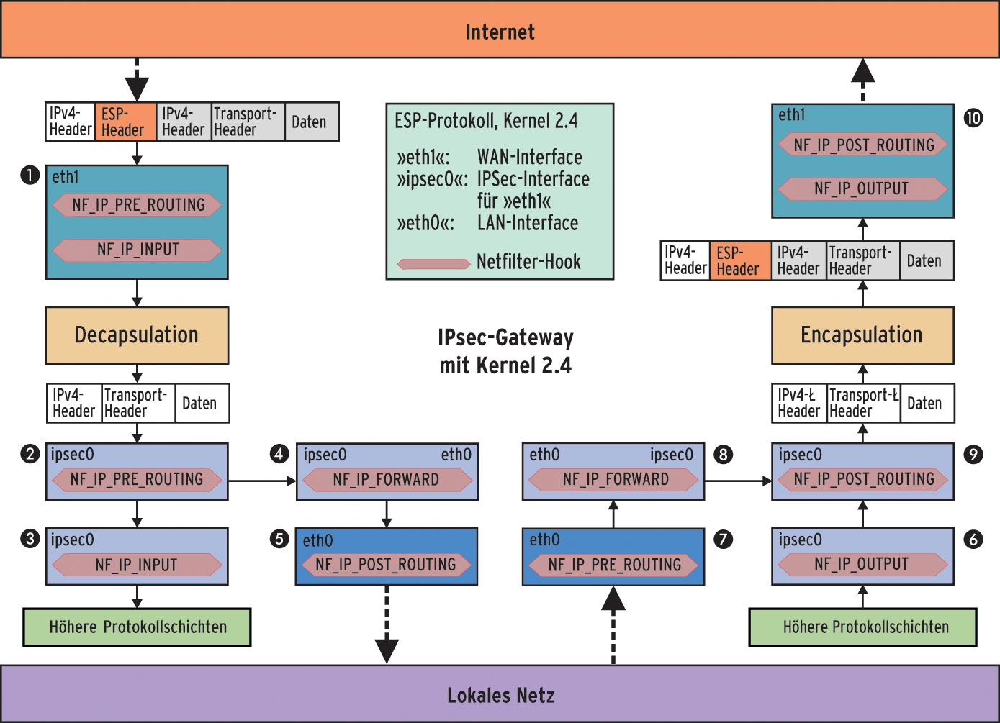
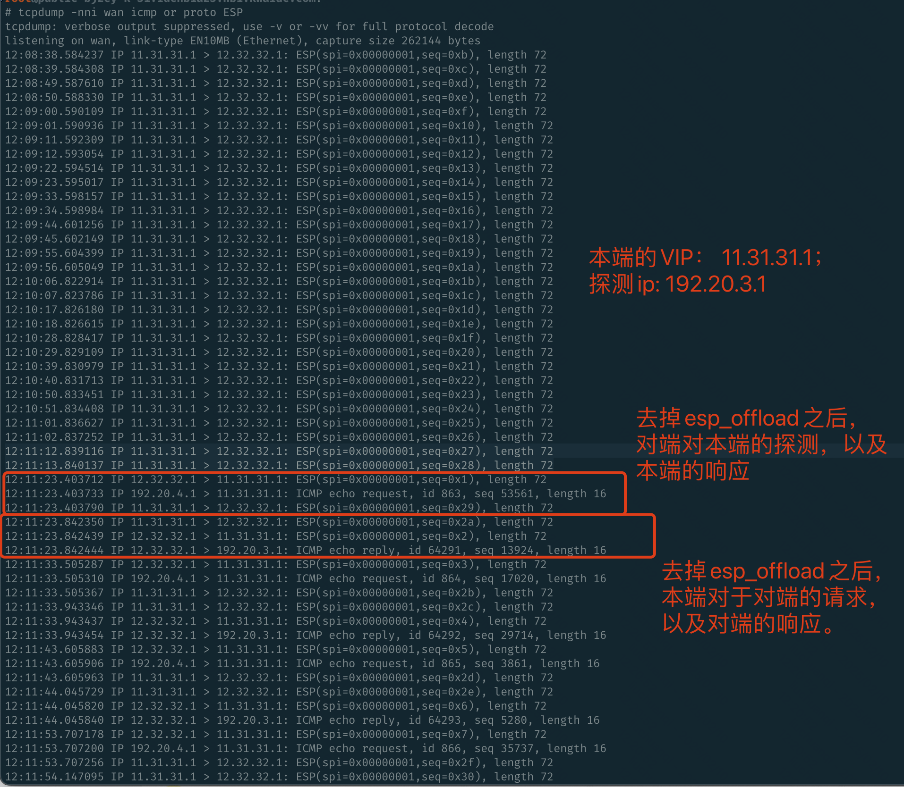

```table-of-contents
```

# 概述
IPsec协议帮助IP层建立安全可信的数据包传输通道。当前已经有了如StrongSwan、OpenSwan等比较成熟的解决方案，而它们都使用了Linux内核中的XFRM框架进行报文接收发送。

==XFRM的正确读音是transform(转换), 这表示内核协议栈收到的IPsec报文需要经过转换才能还原为原始报文==；同样地，要发送的原始报文也需要转换为IPsec报文才能发送出去。

# 基本概念
## XFRM 实例
 IPsec中有两个重要概念：**安全关联(Security Association)** 和 **安全策略(Security Policy)**，  这两类信息都需要存放在内核XFRM。
 
 内核XFRM使用**netns_xfrm**这个结构来组织这些信息，它也被称为`xfrm instance`(实例)。从它的名字也可以看出来，这个实例是与`network namespace`相关的，每个命名空间都有这样的一个实例，实例间彼此独立。所以同一台主机上的不同容器可以互不干扰地使用XFRM。
```c
struct net
{
    ......
   #ifdef CONFIG_XFRM
    struct netns_xfrm    xfrm;
    #endif 
    ......
}

```

## Netlink 通道
上面提到了`Security Association`和`Security Policy`信息，这些信息一般是**由用户态IPsec进程(eg：`StrongSwan`)下发到内核`XFRM`** 的，这个下发的通道在`network namespace`初始化时创建。

```c
static int __net_init xfrm_user_net_init(struct net *net)
{
    struct sock *nlsk;
    struct netlink_kernel_cfg cfg = {
        .groups    = XFRMNLGRP_MAX,
        .input    = xfrm_netlink_rcv,
    };
 
    nlsk = netlink_kernel_create(net, NETLINK_XFRM, &cfg);
    ......
    return 0;
}
```

这样，当用户下发IPsec配置时，内核便可以调用 `xfrm_netlink_rcv()` 来接收。

## XFRM State

XFRM使用`xfrm_state`表示`IPsec`协议栈中的`Security Association`，它表示了一条==单方向==的`IPsec`流量所需的一切信息，包括模式(`Transport`或`Tunnel`)、密钥、`replay`参数等信息。
用户态`IPsec`进程通过发送一个`XFRM_MSG_NEWSA`请求，可以让XFRM创建一个`xfrm_state`结构.

`xfrm_state`包含的字段很多，这里就不贴了，仅仅列出其中最重要的字段：
- id: 它是一个`xfrm_id`结构，包含该SA的目的地址、SPI、和协议(AH/ESP);
- props：表示该SA的其他属性，包括IPsec Mode(Transport/Tunnel)、源地址等信息;

每个xfrm_state在内核中会加入多个哈希表，因此，内核可以从多个特征查找到同一个SA：
```bash
xfrm_state_lookup()： 通过指定的SPI信息查找SA
xfrm_state_lookup_byaddr(): 通过源地址查找SA
xfrm_state_find(): 通过目的地址查找SA
```

### 查看

用户可以通过`ip xfrm state ls`命令列出当前主机上的`xfrm_state`
```bash
src 192.168.0.1 dst 192.168.0.2
    proto esp spi 0xc420a5ed(3290473965) reqid 1(0x00000001) mode tunnel
    replay-window 0 seq 0x00000000 flag af-unspec (0x00100000)
    auth-trunc hmac(sha256) 0xa65e95de83369bd9f3be3afafc5c363ea5e5e3e12c3017837a7b9dd40fe1901f (256 bits) 128
    enc cbc(aes) 0x61cd9e16bb8c1d9757852ce1ff46791f (128 bits)
    anti-replay context: seq 0x0, oseq 0x1, bitmap 0x00000000
    lifetime config:
      limit: soft (INF)(bytes), hard (INF)(bytes)
      limit: soft (INF)(packets), hard (INF)(packets)
      expire add: soft 1004(sec), hard 1200(sec)
      expire use: soft 0(sec), hard 0(sec)
    lifetime current:
      84(bytes), 1(packets)
      add 2019-09-02 10:25:39 use 2019-09-02 10:25:39
    stats:
      replay-window 0 replay 0 failed 0
```

## XFRM Policy

`XFRM`使用 **`xfrm_policy`表示IPsec协议栈中的Security Policy**，用户通过下发这样的规则，可以让`XFRM`允许或者禁止某些特征的流的发送和接收。用户态IPsec进程通过发送一个XFRM_MSG_POLICY请求，可以让`XFRM`创建一个`xfrm_state`结构。

```c
struct xfrm_policy {
    ......
    struct hlist_node    bydst;
    struct hlist_node    byidx;
 
    /* This lock only affects elements except for entry. */
    rwlock_t        lock;
    atomic_t        refcnt;
    struct timer_list    timer;
 
    struct flow_cache_object flo;
    atomic_t        genid;
    u32            priority;
    u32            index;
    struct xfrm_mark    mark;
    struct xfrm_selector    selector;
    struct xfrm_lifetime_cfg lft;
    struct xfrm_lifetime_cur curlft;
    struct xfrm_policy_walk_entry walk;
    struct xfrm_policy_queue polq;
    u8            type;
    u8            action;
    u8            flags;
    u8            xfrm_nr;
    u16            family;
    struct xfrm_sec_ctx    *security;
    struct xfrm_tmpl           xfrm_vec[XFRM_MAX_DEPTH];
    struct rcu_head        rcu;
};
```

我们重点关注下面列举出的这几个字段就行：

(1) selector：
表示该Policy匹配的流的特征

(2) action：
取值为XFRM_POLICY_ALLOW(0)或XFRM_POLICY_BLOCK(1)，前者表示允许该流量，后者表示不允许。

(3) xfrm_nr: 
表示与这条Policy关联的template的数量，template可以理解为xfrm_state的简化版本，xfrm_nr决定了流量进行转换的次数，通常这个值为1。

(4) xfrm_vec:
表示与这条Policy关联的template，数组的每个元素是xfrm_tmpl, 一个xfrm_tmpl可以还原(resolve)成一个完成state。

### 查看
与`xfrm_state`类似，用户可以通过`ip xfrm policy ls`命令列出当前主机上的`xfrm_policy`。

```bash
src 10.1.0.0/16 dst 10.2.0.0/16 uid 0
    dir out action allow index 5025 priority 383615 ptype main share any flag  (0x00000000)
    lifetime config:
      limit: soft (INF)(bytes), hard (INF)(bytes)
      limit: soft (INF)(packets), hard (INF)(packets)
      expire add: soft 0(sec), hard 0(sec)
      expire use: soft 0(sec), hard 0(sec)
    lifetime current:
      0(bytes), 0(packets)
      add 2019-09-02 10:25:39 use 2019-09-02 10:25:39
    tmpl src 192.168.0.1 dst 192.168.0.2
        proto esp spi 0xc420a5ed(3290473965) reqid 1(0x00000001) mode tunnel
        level required share any 
        enc-mask ffffffff auth-mask ffffffff comp-mask ffffffff
```

# 接收发送IPSec报文

## 概述

.png)

参考：[](https://thermalcircle.de/doku.php?id=blog:linux:nftables_ipsec_packet_flow#the_xfrm_framework)



```text
Figure 1: The ESP and plaintext packets pass through several Netfilter hooks in Freeswan (Kernel 2.4). The WAN interface »eth1« receives an ESP packet from the Internet (A). Regardless of the destination, the IPsec stack first forwards the unpacked plaintext packet to »ipsec0« (B). Packets for the local computer remain in »ipsec0« (C), all others go to the LAN interface »eth0« (E) via another hook in »ipsec0« (D). When sending, the process is reversed (6 to J).
```

## 内核中的目录结构


IPv4 以及 ipv6相关的ipsec子系统目录。


参考：[# Linux XFRM Intro](https://jyos-sw.medium.com/linux-xfrm-intro-d83bc7cb6608)

## 接收报文

下图展示了`XFRM`框架接收IPsec报文的流程：


从整体上看，IPsec报文的接收是一个**迂回**的过程，IP层接收时，根据报文的protocol字段，如果它是IPsec类型(AH、ESP)，则会进入XFRM框架进行接收，在此过程里，比较重要的过程是`xfrm_state_lookup()`, 该函数查找SA，如果找到之后，再根据不同的协议和模式进入不同的处理过程，最终，将原始报文的信息获取出来，重入`ip_local_deliver()`.然后，**还需经历`XFRM Policy`的过滤**，最后再上送到应用层。

### 收包和Tcpdump

（1）存在 `esp_offload + gro`:
    `tcpdump`看不到`esp`包，看到的是解封装之后的包。
注：收包方向，`GRO`在`Tcpdump`之前。

（2）不存在 `esp_offload + gro`:
    `tcpdump`可以看到`esp`包，也可以看到解封装之后的包。





## 发送报文

下图展示了`XFRM`框架发送IPsec报文的流程：


`XFRM`在报文路由查找后查找是否有满足条件的SA，如果没有，则直接走`ip_output()`,否则进入`XFRM`的处理过程，根据模式和协议做相应处理，最后殊途同归到`ip_output()` 。


### 发包和Tcpdump

.png)

如上所示，发包而言，`taps`是`tcpdump`的发包位置。
`tcpdump`在封装之后，即`tcpdump`看到的是`ESP`封装之后的包。看不到原始包。


# offload
参考：[# XFRM device - offloading the IPsec computations](https://docs.kernel.org/networking/xfrm_device.html)


## esp4_offload


### 注意
esp_offload 是一个普通的内核模块，不是驱动中。
收包而言 ，在tcpdump之前。
为了达到最大带宽，需要开启网卡的`gro`、`gso`，`esp_offload` 可能是挂在`gro`上面，所以开启后收到的包是解封后的。`GRO`不开启，可能`esp_offload` 无法生效。

### 安装
```bash
modprobe esp4_offload esp4
```

#### 查看

加载 `esp4_offload`时，ipsec控制程序下发对应的规则之后，查看规则，以及内核模块。

```bash

1》 清除存量的规则
# ip xfrm policy flush
# ip xfrm state flush

2》加载模块
# modprobe esp6_offload esp6 esp4_offload esp4

# lsmod |grep esp
esp6_offload           16384  0
esp6                   20480  1 esp6_offload
esp4_offload           16384  0 # 没有state规则引用 esp4_offload
esp4                   20480  1 esp4_offload


3》 启动ipesc控制程序，下发对应的规则

4》 规则查看
# ip -s xfrm state
src 12.32.32.1 dst 11.31.31.1
  proto esp spi 0x00000001(1) reqid 0(0x00000000) mode tunnel
  replay-window 0 seq 0x00000000 flag  (0x00000000)
  aead rfc4106(gcm(aes)) 0x3132333435363738393031323334353637383930 (160 bits) 128
  anti-replay context: seq 0x0, oseq 0x0, bitmap 0x00000000
  sel src 0.0.0.0/0 dst 0.0.0.0/0 uid 0
  lifetime config:
    limit: soft (INF)(bytes), hard (INF)(bytes)
    limit: soft (INF)(packets), hard (INF)(packets)
    expire add: soft 0(sec), hard 0(sec)
    expire use: soft 0(sec), hard 0(sec)
  lifetime current:
    17572(bytes), 382(packets)
    add 2025-02-12 10:51:49 use 2025-02-12 10:51:52
  stats:
    replay-window 0 replay 0 failed 0
src 11.31.31.1 dst 12.32.32.1
  proto esp spi 0x00000001(1) reqid 0(0x00000000) mode tunnel
  replay-window 0 seq 0x00000000 flag  (0x00000000)
  aead rfc4106(gcm(aes)) 0x3132333435363738393031323334353637383930 (160 bits) 128
  anti-replay context: seq 0x0, oseq 0x17e, bitmap 0x00000000
  sel src 0.0.0.0/0 dst 0.0.0.0/0 uid 0
  lifetime config:
    limit: soft (INF)(bytes), hard (INF)(bytes)
    limit: soft (INF)(packets), hard (INF)(packets)
    expire add: soft 0(sec), hard 0(sec)
    expire use: soft 0(sec), hard 0(sec)
  lifetime current:
    12664(bytes), 382(packets)
    add 2025-02-12 10:51:49 use 2025-02-12 10:51:52
  stats:
    replay-window 0 replay 0 failed 0

# ip xfrm policy
....略大部分mark
src 0.0.0.0/0 dst 192.20.13.2/32 uid 0
  dir out action allow index 9056441 priority 0 ptype main share any flag  (0x00000000)
  lifetime config:
    limit: soft (INF)(bytes), hard (INF)(bytes)
    limit: soft (INF)(packets), hard (INF)(packets)
    expire add: soft 0(sec), hard 0(sec)
    expire use: soft 0(sec), hard 0(sec)
  lifetime current:
    0(bytes), 0(packets)
    add 2025-02-12 10:51:49 use -
  mark 2/0xffffffff
  tmpl src 11.31.31.1 dst 12.32.32.1
    proto esp spi 0x00000001(1) reqid 0(0x00000000) mode tunnel
    level required share any
    enc-mask ffffffff auth-mask ffffffff comp-mask ffffffff
-----
src 0.0.0.0/0 dst 192.20.13.2/32 uid 0
  dir out action allow index 9056433 priority 0 ptype main share any flag  (0x00000000)
  lifetime config:
    limit: soft (INF)(bytes), hard (INF)(bytes)
    limit: soft (INF)(packets), hard (INF)(packets)
    expire add: soft 0(sec), hard 0(sec)
    expire use: soft 0(sec), hard 0(sec)
  lifetime current:
    0(bytes), 0(packets)
    add 2025-02-12 10:51:49 use -
  mark 1/0xffffffff
  tmpl src 11.31.31.1 dst 12.32.32.1
    proto esp spi 0x00000001(1) reqid 0(0x00000000) mode tunnel
    level required share any
    enc-mask ffffffff auth-mask ffffffff comp-mask ffffffff
-----
src 0.0.0.0/0 dst 0.0.0.0/0 uid 0
  dir fwd action allow index 9056426 priority 0 ptype main share any flag  (0x00000000)
  lifetime config:
    limit: soft (INF)(bytes), hard (INF)(bytes)
    limit: soft (INF)(packets), hard (INF)(packets)
    expire add: soft 0(sec), hard 0(sec)
    expire use: soft 0(sec), hard 0(sec)
  lifetime current:
    0(bytes), 0(packets)
    add 2025-02-12 10:51:49 use -
  tmpl src 0.0.0.0 dst 0.0.0.0
    proto esp spi 0x00000000(0) reqid 0(0x00000000) mode tunnel
    level use share any
    enc-mask ffffffff auth-mask ffffffff comp-mask ffffffff
-----
src 0.0.0.0/0 dst 0.0.0.0/0 uid 0
  dir in action allow index 9056416 priority 0 ptype main share any flag  (0x00000000)
  lifetime config:
    limit: soft (INF)(bytes), hard (INF)(bytes)
    limit: soft (INF)(packets), hard (INF)(packets)
    expire add: soft 0(sec), hard 0(sec)
    expire use: soft 0(sec), hard 0(sec)
  lifetime current:
    0(bytes), 0(packets)
    add 2025-02-12 10:51:49 use 2025-02-12 10:54:02
  tmpl src 0.0.0.0 dst 0.0.0.0
    proto esp spi 0x00000000(0) reqid 0(0x00000000) mode tunnel
    level use share any
    enc-mask ffffffff auth-mask ffffffff comp-mask ffffffff
-----

5》内核模块查看
# lsmod |grep esp
esp6_offload           16384  0
esp6                   20480  1 esp6_offload
esp4_offload           16384  2 # 此种的引用计数为2，因为有2个state。
esp4                   20480  3 esp4_offload # 此中的引用计数为3，2个state + esp4_offload;
```

如上，所示，`ip xfrm state` 查看无法查看到是否加载 了 `esp4_offload`.
可以通过 `lsmod | grep esp` 的引用计数来查看对应的规则是否引用 `esp4_offload` 。

#### 抓包


### 卸载
```bash
1. 停掉 ipsec 控制程序，以及 bird 引流；

2. 清理内核中存在的ipsec配置：
   ip xfrm state flush
   ip xfrm policy flush

3. lsmod | grep esp
# lsmod |grep -i esp
esp6_offload           16384  0
esp6                   20480  1 esp6_offload
esp4_offload           16384  0
esp4                   20480  1 esp4_offload

4. rmmod esp4_offload
```

#### 查看
不加载 `esp4_offload`时，ipsec控制程序下发对应的规则之后，查看规则，以及内核模块。

```bash
# 不加载 esp4_offload时，ipsec控制程序下发对应的规则之后，查看规则，以及内核模块。


1》 清除存量的规则
# ip xfrm policy flush
# ip xfrm state flush

2》卸载模块
# rmmod esp6_offload esp6 esp4_offload esp4


3》 启动ipesc控制程序，下发对应的规则

4》 规则查看
# ip -s xfrm state
src 12.32.32.1 dst 11.31.31.1
    proto esp spi 0x00000001(1) reqid 0(0x00000000) mode tunnel
    replay-window 0 seq 0x00000000 flag  (0x00000000)
    aead rfc4106(gcm(aes)) 0x3132333435363738393031323334353637383930 (160 bits) 128
    anti-replay context: seq 0x0, oseq 0x0, bitmap 0x00000000
    sel src 0.0.0.0/0 dst 0.0.0.0/0 uid 0
    lifetime config:
      limit: soft (INF)(bytes), hard (INF)(bytes)
      limit: soft (INF)(packets), hard (INF)(packets)
      expire add: soft 0(sec), hard 0(sec)
      expire use: soft 0(sec), hard 0(sec)
    lifetime current:
      460(bytes), 10(packets)
      add 2025-02-12 10:33:33 use 2025-02-12 10:33:36
    stats:
      replay-window 0 replay 0 failed 0
src 11.31.31.1 dst 12.32.32.1
    proto esp spi 0x00000001(1) reqid 0(0x00000000) mode tunnel
    replay-window 0 seq 0x00000000 flag  (0x00000000)
    aead rfc4106(gcm(aes)) 0x3132333435363738393031323334353637383930 (160 bits) 128
    anti-replay context: seq 0x0, oseq 0xa, bitmap 0x00000000
    sel src 0.0.0.0/0 dst 0.0.0.0/0 uid 0
    lifetime config:
      limit: soft (INF)(bytes), hard (INF)(bytes)
      limit: soft (INF)(packets), hard (INF)(packets)
      expire add: soft 0(sec), hard 0(sec)
      expire use: soft 0(sec), hard 0(sec)
    lifetime current:
      328(bytes), 10(packets)
      add 2025-02-12 10:33:33 use 2025-02-12 10:33:36
    stats:
      replay-window 0 replay 0 failed 0

# ip xfrm policy
....略大部分mark
src 0.0.0.0/0 dst 192.20.13.2/32 uid 0
  dir out action allow index 9049569 priority 0 ptype main share any flag  (0x00000000)
  lifetime config:
    limit: soft (INF)(bytes), hard (INF)(bytes)
    limit: soft (INF)(packets), hard (INF)(packets)
    expire add: soft 0(sec), hard 0(sec)
    expire use: soft 0(sec), hard 0(sec)
  lifetime current:
    0(bytes), 0(packets)
    add 2025-02-12 10:33:33 use -
  mark 2/0xffffffff
  tmpl src 11.31.31.1 dst 12.32.32.1
    proto esp spi 0x00000001(1) reqid 0(0x00000000) mode tunnel
    level required share any
    enc-mask ffffffff auth-mask ffffffff comp-mask ffffffff
----
src 0.0.0.0/0 dst 192.20.13.2/32 uid 0
  dir out action allow index 9049561 priority 0 ptype main share any flag  (0x00000000)
  lifetime config:
    limit: soft (INF)(bytes), hard (INF)(bytes)
    limit: soft (INF)(packets), hard (INF)(packets)
    expire add: soft 0(sec), hard 0(sec)
    expire use: soft 0(sec), hard 0(sec)
  lifetime current:
    0(bytes), 0(packets)
    add 2025-02-12 10:33:33 use -
  mark 1/0xffffffff
  tmpl src 11.31.31.1 dst 12.32.32.1
    proto esp spi 0x00000001(1) reqid 0(0x00000000) mode tunnel
    level required share any
    enc-mask ffffffff auth-mask ffffffff comp-mask ffffffff
----
src 0.0.0.0/0 dst 0.0.0.0/0 uid 0
  dir fwd action allow index 9049554 priority 0 ptype main share any flag  (0x00000000)
  lifetime config:
    limit: soft (INF)(bytes), hard (INF)(bytes)
    limit: soft (INF)(packets), hard (INF)(packets)
    expire add: soft 0(sec), hard 0(sec)
    expire use: soft 0(sec), hard 0(sec)
  lifetime current:
    0(bytes), 0(packets)
    add 2025-02-12 10:33:33 use -
  tmpl src 0.0.0.0 dst 0.0.0.0
    proto esp spi 0x00000000(0) reqid 0(0x00000000) mode tunnel
    level use share any
    enc-mask ffffffff auth-mask ffffffff comp-mask ffffffff
----
src 0.0.0.0/0 dst 0.0.0.0/0 uid 0
  dir in action allow index 9049544 priority 0 ptype main share any flag  (0x00000000)
  lifetime config:
    limit: soft (INF)(bytes), hard (INF)(bytes)
    limit: soft (INF)(packets), hard (INF)(packets)
    expire add: soft 0(sec), hard 0(sec)
    expire use: soft 0(sec), hard 0(sec)
  lifetime current:
    0(bytes), 0(packets)
    add 2025-02-12 10:33:33 use 2025-02-12 10:39:24
  tmpl src 0.0.0.0 dst 0.0.0.0
    proto esp spi 0x00000000(0) reqid 0(0x00000000) mode tunnel
    level use share any
    enc-mask ffffffff auth-mask ffffffff comp-mask ffffffff


5》内核模块查看
# 如下，下发规则，自动加载了esp4模块。
# lsmod |grep -i esp
esp4                   20480  2 # 两个state规则使用esp4
```

#### 抓包


### 规则下发
```bash
./ip xfrm state add src 192.21.7.27 dst 192.21.8.27 proto esp spi 0x321 mode tunnel aead 'rfc4106(gcm(aes))' 0x44434241343332312423222114131211f4f3f2f1 128 offload dev eth03 dir out

./ip xfrm state add src 192.21.8.27 dst 192.21.7.27 proto esp spi 0x123 mode tunnel aead 'rfc4106(gcm(aes))' 0x44434241343332312423222114131211f4f3f2f1 128 offload dev eth03 dir in

./ip xfrm policy add src 192.21.10.0/24  dst 192.21.8.133 dir in  tmpl src 192.21.8.27 dst 192.21.7.27 proto esp spi 0x123  mode tunnel

./ip xfrm policy add src 192.21.8.133 dst 192.21.10.0/24  dir out tmpl src 192.21.7.27 dst 192.21.8.27 proto esp spi 0x321  mode tunnel

```

如上所示，添加`state` 时，设置了 `offload` 标记，即使用 `esp_offload`.
如果机器的`iproute`包的版本太低，`ip xfrm`命令无法设置`esp_offload`，需要更新`iproute`版本，就可以做`offload [dev] dir DIR`的配置，
配置完，通过`lsmod | grep esp`查看`esp_offload`的引用计数，可以发现自动加载了`esp_offload`模块。

### 其他
#### 内核中的esp_offload 导致的问题

##### 加载了`esp_offload`模块后，导致内核crash问题
参考：[esp: remove the skb from the chain when it's enqueued in cryptd_wq](https://git.kernel.org/pub/scm/linux/kernel/git/torvalds/linux.git/commit/net/xfrm/xfrm_device.c?h=v6.1-rc8&id=d1d17a359ce6901545c075d7401c10179d9cedfd)

##### 加载了`esp_offload`模块后，`ip xfrm state` 中的 `output_mark`不生效

**(1)问题**
看出目前主机上有两条state，分别打上了0x300和0x400的mark


如下所示，规则引用了 esp_offload 模块：


为了方便观察skb是否打上mark，我们写一个iptables如下：
```bash
iptables -t mangle -I FORWARD -s 193.8.0.1 -j LOG
```

然后dmesg看一下: 发现没有打上mark。
.png)

将`esp_offload` 卸载，如下所示：


再次查看dmesg，如下所示，出现了mark。
.png)


**(2)解决**
内核5.4版本修复了该问题。
[xfrm: support output_mark for offload ESP packets](https://lore.kernel.org/stable/20200128135828.650597485@linuxfoundation.org/)

# ipsec应用strngswan理解


#   内核的统计
```bash
# cat /proc/net/xfrm_stat
XfrmInError             	0
XfrmInBufferError       	0
XfrmInHdrError          	0
XfrmInNoStates          	0
XfrmInStateProtoError   	0
XfrmInStateModeError    	0
XfrmInStateSeqError     	0
XfrmInStateExpired      	0
XfrmInStateMismatch     	0
XfrmInStateInvalid      	0
XfrmInTmplMismatch      	0
XfrmInNoPols            	0
XfrmInPolBlock          	0
XfrmInPolError          	0
XfrmOutError            	0
XfrmOutBundleGenError   	0
XfrmOutBundleCheckError 	0
XfrmOutNoStates         	0
XfrmOutStateProtoError  	0
XfrmOutStateModeError   	0
XfrmOutStateSeqError    	0
XfrmOutStateExpired     	0
XfrmOutPolBlock         	0
XfrmOutPolDead          	0
XfrmOutPolError         	0
XfrmFwdHdrError         	0
XfrmOutStateInvalid     	0
```
统计说明：[XFRM proc - /proc/net/xfrm_xx files](https://www.kernel.org/doc/Documentation/networking/xfrm_proc.txt)

# 参考
```c
# 使用 ip xfrm 手工配置 IPsec VPN
https://taoshu.in/net/manual-ipsec-ip-xfrm.html

## IPSEC介绍与实现
https://abcdxyzk.github.io/blog/2021/06/15/net-ipsec/

# XFRM -- IPsec协议的内核实现框架
https://switch-router.gitee.io/blog/IPsec-xfrm/
https://switch-router.gitee.io/blog/IPsec-nat-t/

# IPsec：XFRM -- IPsec协议的内核实现框架
https://blog.csdn.net/hhd1988/article/details/124856149


# Nftables - Netfilter and VPN/IPsec packet flow
https://thermalcircle.de/doku.php?id=blog:linux:nftables_ipsec_packet_flow#the_xfrm_framework
```