```table-of-contents
```
# 前言
RPC（Remote Procedure Call）远程过程调用，主要解决远程通信间的问题，不需要了解底层网络的通信机制；
消息队列（MQ）是一种能实现生产者到消费者单向通信的通信模型。
核心区别在于RPC是双向直接网络通讯，MQ是单向引入中间载体的网络通讯。

# 消息队列
消息队列（MQ）是一种能实现生产者到消费者单向通信的通信模型，一般来说是指实现这个模型的中间件。


## 队列
单纯去看队列，队列是一种特殊的线性表（访问受限的线性表），特殊之处在于它只允许在表的前端（front）进行删除操作，而在表的后端（rear）进行插入操作，和栈一样，队列是一种操作受限制的线性表。
进行插入操作的端称为队尾，进行删除操作的端称为队头。在队列前面增加限定词“消息”，意味着通过消息驱动来进行整体的架构实现。

## 消息队列的特点
### 解耦/异步通信

- Message Queue把请求的压力保存一下，逐渐释放出来，让处理者按照自己的节奏来处理。
- Message Queue是**异步**单向的消息。发送消息设计成是不需要**等待**消息处理的完成。

所以对于有同步返回需求，用Message Queue则变得麻烦了。


# 消息队列 Vs RPC

RPC（Remote Procedure Call）和 MQ（Message Queue，消息队列）都是分布式系统中最常见的服务通信方式，但它们解决的问题并不完全一样。很多人容易把它们理解成竞争关系，实际上更多是**互补关系**。

在架构上，RPC和MQ的差异点是，Message有一个中间结点Message Queue，可以把消息存储。



RPC（Remote Procedure Call）本质上是对本地函数调用的远程化模拟。调用方发出请求后会阻塞等待，直到远端执行完毕并返回结果——这是一种**同步、点对点**的通信。

MQ（消息队列）则完全不同。生产者把消息投入中间件（Broker）后立即返回，消费者随时拉取或由 Broker 推送——双方**无需同时在线，也无需互相知道对方**。


|特性|RPC（远程过程调用）|消息队列（MQ）|
|---|---|---|
|**通信模式**|点对点、同步/异步（主流为同步）|生产者-消费者、异步为主|
|**耦合程度**|强耦合（需知道对方地址、接口）|弱耦合（通过消息队列中转）|
|**消息方向**|请求-响应（双向）|单向（或请求-响应模式需额外实现）|
|**生命周期**|调用时双方必须同时在线|允许生产者和消费者不同时在线|

```bash
(1) RPC系统结构：

+----------+     +----------+
| Consumer | <=> | Provider |
+----------+     +----------+
Consumer调用的Provider提供的服务。

(2) Message Queue系统结构：

+--------+     +-------+     +----------+
| Sender | <=> | Queue | <=> | Receiver |
+--------+     +-------+     +----------+
Sender发送消息给Queue；Receiver从Queue拿到消息来处理。
```


## 对比

|维度|RPC|MQ|
|---|---|---|
|通信方式|同步、阻塞|异步、非阻塞|
|耦合程度|强耦合（需知道对端地址/接口）|松耦合（只认识 Broker）|
|可靠性|依赖网络，超时即失败|消息持久化，可重试|
|吞吐/削峰|无法缓冲，服务压力直接传导|Broker 缓冲，天然削峰填谷|
|实时性|极高（毫秒级响应）|相对较低（有入队/出队延迟）|
|消息顺序|天然有序（串行调用）|需要额外设计保序|
|适用场景|查询、计算、需要立即得到结果|通知、日志、任务分发、事件驱动|

## 联系


## 适用场景

|场景|推荐方案|
|---|---|
|需要实时返回结果（查用户信息、支付扣款）|RPC|
|需要可靠批量处理（发邮件、写日志）|MQ|
|不想关心下游是否在线（异步通知）|MQ|
|需要下游多个服务同时收到相同数据（广播）|MQ（发布-订阅）|
|低延迟且可接受同步等待|RPC|
|系统需应对突发流量（双11下单）|MQ（削峰）|


- 希望同步得到结果的场合，RPC合适。
- 希望使用简单，则RPC；RPC操作基于接口，使用简单，使用方式模拟本地调用。异步的方式编程比较复杂。
- 不希望发送端（RPC Consumer、Message Sender）受限于处理端（RPC Provider、Message Receiver）的速度时，使用Message Queue。

随着业务增长，有的处理端处理量会成为瓶颈，会进行同步调用到异步消息的改造。


## 小结

最简单理解：

- **RPC = 打电话**
    - 你打给对方
    - 对方马上接听
    - 马上给你结果
- **MQ = 发短信**
    - 你发出去
    - 对方什么时候看不确定
    - 不一定立刻回复


|项目|RPC|MQ|
|---|---|---|
|调用方式|同步|异步|
|是否等待结果|是|否|
|延迟|低|较高|
|实时性|高|一般|
|吞吐量|中|高|

# 使用 RabbitMQ 的 RPC 架构
在 OpenStack 中服务与服务之间使用 RESTful API 调用，而在服务内部则使用 RPC 调用各个功能模块。
正是由于使用了 RPC 来解耦服务内部功能模块，使得 OpenStack 的服务拥有扩展性强，耦合性低等优点。
OpenStack 的 RPC 架构中，加入了消息队列 RabbitMQ，这样做的目的是为了保证 RPC 在消息传递过程中的安全性和稳定性。
下面分析 OpenStack 中使用 RabbitMQ 如何实现 RPC 的调用。

## RabbitMQ 简介

RPC：假设你是一个饭店里的服务员，顾客向你点菜，但是你不会做菜，所以你采集了顾客要点什么之后告诉后厨去做顾客点的菜，这叫 RPC(remote procedure call)，因为厨房的厨师相对于服务员而言是另外一个人(在计算机的世界里就是 Remote 的机器上的一个进程)。厨师做好了的菜就是RPC的返回值。

任务队列和消息队列：本质都是队列，所以就只举一个任务队列的例子。假设这个饭店在高峰期顾客很多，而厨师只有很少的几个，所以服务员们不得不把单子按下单顺序放在厨房的桌子上，供厨师们一个一个做，这一堆单子就是任务队列，厨师们每做完一个菜，就从桌子上的订单里再取出一个单子继续做菜。


## 使用 RabbitMQ 的好处

（1）同步变异步：
可以使用线程池将同步变成异步，但是缺点是要自己实现线程池，并且强耦合。使用消息队列可以轻松将同步请求变成异步请求。

（2）低内聚高耦合：
解耦，减少强依赖。

（3）流量削峰：
通过消息队列设置请求阈值，超过阀值的抛弃或者转到错误界面。

（4）网络通信性能提高：
TCP 的创建和销毁开销大，创建 3 次握手，销毁 4 次分手，高峰时成千上万条的链接会造成资源的巨大浪费，而且操作系统每秒处理 TCP 的数量也是有数量限制的，必定造成性能瓶颈。RabbitMQ 采用信道通信，不采用 TCP 直接通信。一条线程一条信道，多条线程多条信道，公用一个 TCP 连接。一条 TCP 连接可以容纳N条信道(硬盘容量足够的话)，不会造成性能瓶颈。

## RabbitMQ 的三种类型的交换器
RabbitMQ 使用 Exchange(交换机 )和 Queue(队列)来实现消息队列。
在 RabbitMQ 中一共有三种交换机类型，每一种交换机类型都有很鲜明的特征。


### 广播式交换器类型(Fanout)

该类交换器不分析所接收到消息中的 Routing Key，默认将消息转发到所有与该交换器绑定的队列中去。


### 直接式交换器类型(Direct)

该类交换器需要精确匹配 Routing Key 与 Binding Key，如消息的 Routing Key = Cloud，那么该条消息只能被转发至 Binding Key = Cloud 的消息队列中去。


### 主题式交换器(Topic Exchange)

该类交换器通过消息的 Routing Key 与 Binding Key 的模式匹配，将消息转发至所有符合绑定规则的队列中。
Binding Key 支持通配符，其中`“*”匹配一个词组，“#”匹配多个词组(包括零个)`。


当生产者发送消息 `Routing Key=F.C.E` 的时候，这时候只满足 Queue1，所以会被路由到 Queue 中。
如果 `Routing Key=A.C.E` 这时候会被同时路由到 Queue1 和 Queue2 中，如果 `Routing Key=A.F.B` 时，这里只会发送一条消息到 Queue2 中。


## 连接设计

RabbitMQ 实现的 RPC 对网络的一般设计思路：消费者是长连接，发送者是短连接。但可以自由控制长连接和短连接。

一般消费者是长连接，随时准备接收处理消息;而且涉及到 RabbitMQ Queues、Exchange 的 auto-deleted 等没特殊需求没必要做短连接。发送者可以使用短连接，不会长期占住端口号，节省端口资源。


# 参考
```bash

```