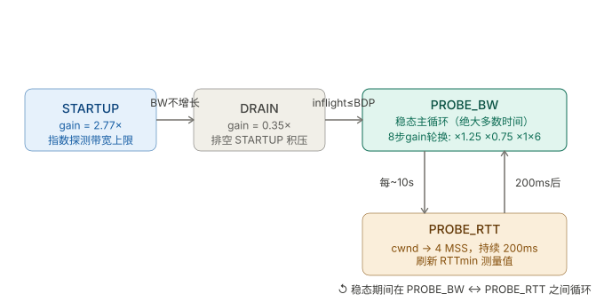

```table-of-contents
```
# 拥塞控制的机制
TCP 拥塞控制（Congestion Control）是 TCP 协议的核心灵魂，其目的是**防止过多的数据注入到网络中，使网络中的路由器或链路过载**。它通过动态调整发送方的**拥塞窗口（cwnd）**来控制发送速率。


超时：


收到三个相同ACK：往往是由于丢包（比如中间的某个包丢了）。

## 慢启动 (Slow Start)
## 拥塞避免 (Congestion Avoidance)
## 快重传 (Fast Retransmit)
## 快恢复 (Fast Recovery)

# 公平性问题
## 什么是公平性问题
**在多流共享网络链路时实现公平性**—— 简单说就是「不让某一个流独占带宽，让所有流按比例公平使用网络资源」。

## 不公平的范例
在共享网络（比如路由器、交换机链路）中，多个 TCP 流可能出现：

- 「贪婪流」：比如某些流（比如：大窗口、快增长的流）抢占大部分带宽；
- 「慢启动流」：新建立的流被已有流压制，无法获得合理带宽；
- 「异构流」：不同 RTT（往返时延）的流，若不做优化，**短 RTT 流会抢占长 RTT 流的带宽**。

## 造成不公平的原因

公平性问题的本质在于：不同TCP流可能在**不同的时间启动，有不同的RTT（往返时间），经过不同的路径**。

## 公平性的目标

TCP 拥塞控制的公平性目标：**在拥塞时，所有流的发送速率收敛到「相等」（或按权重分配），且不出现饥饿（某流完全无带宽）**。

在相同的网络条件下（特别是共享同一个瓶颈链路时），不同的 TCP 流应该获得大致相等的带宽份额。

## TCP如何解决公平性问题的
TCP 通过 “丢包驱动 + AIMD（加性增 / 乘性减）” 机制，实现近似公平（max-min fairness）。

### 1-「加法增、乘法减（AIMD）」：公平性的核心数学保障
这是保证TCP公平性的**最根本的设计原则**。

- **加性增**：在拥塞避免阶段，每条TCP流每经过一个RTT，拥塞窗口（cwnd）增加1个MSS（最大段大小），速率缓慢线性增长；
这意味着窗口是线性增长的，增长速率较慢且与当前窗口大小无关。

- **乘性减**：一旦检测到丢包（通常视为拥塞信号），拥塞窗口（cwnd）会立刻减半（TCP Reno）或重置（TCP Tahoe），速率快速下降。


#### AIMD保障公平性的举例

假设两条TCP流共享一个瓶颈链路：

1. **如果流1的窗口比流2大**：当它们同时遇到丢包进行乘性减时，**流1减小的绝对值更大**。例如流1窗口=100，流2=50，丢包后都减半，流1变为50，流2变为25。大的流下降得更剧烈。
    
2. **在拥塞避免阶段**：两者都线性增加。窗口较小的流（25）增加的速率虽然绝对值小，但**增加的相对比例更高**（增加1相对于25，增长了4%）。而窗口较大的流（50）增加1，仅增长2%。
    
3. **收敛过程**：通过这种"大窗口流下降快、上升慢；小窗口流下降慢、上升快"的机制，两条流的窗口会逐渐收敛到平衡点附近，最终均等共享带宽。

#### 小结

**结论**：AIMD 通过“**快者多罚，慢者少罚**”的机制，在数学上保证了长期收敛于公平点。

### 2- 「拥塞信号触发公平收敛」：所有流共享拥塞反馈

TCP 用「丢包」「ECN（显式拥塞通知）」作为拥塞信号，**所有流都会感知到同一个拥塞信号**，并做出速率调整：

- 当网络拥塞（比如路由器/交换机队列满），所有流都会收到丢包 / ECN 信号；
- 所有流都会执行「降窗」操作（比如 Reno 减半 cwnd），相当于「重置所有流的速率起点」；
- 降窗后，所有流重新慢启动 或者 拥塞避免，速率同步增长，自然趋向公平。

### 3- 「慢启动阈值（ssthresh）」：限制贪婪流的快速扩张
- 新流启动时，`cwnd` 从 1 开始**指数增长**（慢启动），但超过 `ssthresh` 后进入线性增长（拥塞避免）；
- 若某流想「贪多」，快速增长的 `cwnd` 会触发拥塞（丢包），被迫降窗，从而被拉回公平速率。

## 与RTT相关的公平性问题及补偿机制

经典的TCP（如Reno 的 AIMD）存在一个固有的不公平性：**RTT越短的流，带宽抢占能力越强**。因为窗口增加是基于RTT的（每RTT增加1），所以RTT短的流窗口增长得更快，更容易填满缓冲区。

即：**RTT 短的流（距离近）单位时间内能进行更多次 AIMD 循环，增长更快，会挤压 RTT 长的流**。比如 RTT=10ms 的流 1 秒能增长 100 次，RTT=100ms 的流仅增长 10 次）。

### 问题以及分析

经典的RTT不公平性问题是指，当多个TCP流共享一个瓶颈链路时，RTT较短的流会获得比RTT较长的流更多的带宽。

这背后的主要推手是**ACK时钟驱动**和**窗口增长机制**。在传统的拥塞控制算法中，拥塞窗口的增长通常是以收到ACK为事件驱动的。短RTT流能更快地收到ACK，因此其窗口增长得更快，能更快地抢占可用带宽，最终导致长RTT流的饥饿。

### 补偿机制
#### TCP CUBIC(Linux 默认，基于时间)
CUBIC 的核心思路是**将窗口的增长与RTT解耦，使其主要成为一个关于时间的函数**。
它不再像传统算法那样，每收到一个ACK就增加一点窗口，而是**让窗口的增长只取决于自上次拥塞事件以来经过的绝对时间**。
这意味着，无论一个流的RTT是10毫秒还是100毫秒，只要它们经历了拥塞后的时间相同，它们窗口的增长量就是基本一致的。

> 即：**拥塞避免阶段，拥塞窗口的增机值和RTT无关，而是和时间间隔有关系（时间间隔 = 当前收到ACK的时间 - 上次拥塞的绝对时间）**；
> 不管是长RTT的流，还是短RTT的流，只要经历的时间间隔相同，就会有相同的拥塞窗口增加值。

**效果**：长 RTT 流虽然 ACK 回来得慢，但 CUBIC 允许它在收到 ACK 时“大步跳跃”到当前时间 tt 对应的理论窗口值，而不是像 Reno 那样一步步爬。这在一定程度上拉平了短 RTT 流的增长优势。

#### TCP BBR (基于模型，Google 出品)
BBR 走的是一条全新的道路，它==不依赖丢包作为拥塞信号==，而是试图建立一个明确的数据传输模型。这个模型的核心是**带宽延迟积（BDP，Bandwidth-Delay Product）**，即瓶颈带宽乘以最小RTT，控制发送速率**将 inflight 数据量限制在 BDP 附近**。

BBR ==周期性地探测瓶颈带宽和最小RTT，然后进行发送速率控制，使得在飞数据量在BDP附近==，以实现高吞吐和低延迟。

## 经典 TCP 算法的公平性优化（针对性解决问题）
不同 TCP 算法针对「异构流（不同 RTT）」「多流竞争」等场景，对公平性做了专项优化：

|算法|公平性设计要点|解决的公平性问题|
|---|---|---|
|TCP Reno|基础 AIMD + 丢包触发降窗|解决基本的多流带宽抢占，实现「粗粒度公平」|
|TCP CUBIC|非线性增长（拥塞避免阶段 `cwnd` 按立方增长）+ 快速收敛到公平点|解决 Reno 在高带宽时延积（BDP）链路的公平性差、收敛慢问题|
|TCP Vegas|基于延迟（而非丢包）检测拥塞，提前降窗|解决「丢包触发降窗」导致的公平性震荡，减少长 RTT 流被短 RTT 流压制|
|TCP BBR|基于带宽 - 时延乘积（BDP）调整速率，不依赖丢包，按链路实际容量分配速率|解决传统 AIMD 对长 RTT 流的不公平（短 RTT 流抢占带宽），适配高速链路|
|TCP Fair|显式按 RTT 调整增长速率（长 RTT 流增长更快）|专门解决异构 RTT 流的公平性问题|

## 特殊场景的公平性保障
### TCP流与非 TCP 流（如 UDP）的公平性
#### 问题
TCP与UDP在公平性上的核心矛盾在于：**TCP是“绅士”**（自带拥塞控制，网络拥塞时主动退让），而**UDP是“莽夫”**（没有拥塞控制，只会按应用要求的速率持续发送）。

这就导致一个后果：**UDP流量会挤压TCP流量的带宽**。模拟实验表明，无拥塞控制的UDP流与TCP流共享瓶颈链路时，TCP流的吞吐量会显著下降，甚至出现“饿死”现象。随着实时多媒体业务（视频会议、VoIP等）大量使用UDP，这个问题日益突出

#### 应对方案
##### 端口队列隔离（最基础、最常用）
把 **TCP 流量** 和 **UDP 流量** 放进 **不同的硬件队列**，互不干扰。

##### 网络层干预——主动队列管理（AQM）
AQM（Active Queue Management）

**逻辑**：
- 队列开始变长时，提前随机丢包
- 对 UDP：丢包它也不减速，但至少不会让队列无限膨胀
- 对 TCP：丢包会减速，从而保护 TCP 不被饿死

**WRED 还能**：
- 给 UDP 更高的丢包概率
- 给 TCP 更低的丢包概率
实现 **偏向保护 TCP** 的公平。


RED通过**早期随机丢包**来预防拥塞：
- **监控队列长度**：计算平均队列长度
- **概率丢包**：当平均队列长度超过最小阈值时，**随机丢弃**部分数据包；超过最大阈值时，丢弃所有到达的包
- **作用于UDP流**：即使UDP流自己不减速，RED的丢包会导致其数据丢失。如果UDP应用对丢包敏感（如视频会花屏），会间接促使应用层降低发送速率

### 多路径 TCP（MPTCP）的公平性
MPTCP 多路径传输时，避免「多子流抢占单路径流的带宽」：

- 核心规则：所有子流的总速率 ≤ 单路径 TCP 流的速率，保证对单路径流的公平。

# 拥塞控制算法

## CUBIC(内核默认)

## BBR
### BBR 的背景：为什么需要它？

在传统的 TCP 算法（如 CUBIC），**用“丢包/ECN”当作拥塞信号**；网络带宽小、缓冲区小。但现代网络面临以下挑战：

#### 中间节点缓冲区膨胀（Bufferbloat）：以丢包/ECN为信号会导致时延变大

路由器缓存越来越大。CUBIC 为了探测最大带宽，发送端会不断加速发送数据，直到路由器的缓冲区（Buffer）被完全填满并溢出（丢包），发生了丢包才减速，这样会导致延迟飙升。
因为一旦缓冲区被填满，新到达的数据包必须在队列中等待前面的包发送完毕。如果缓冲区很大（现代路由器通常如此），这个等待时间（排队延迟）可能高达几百毫秒甚至几秒。
```bash
传统算法（Reno、CUBIC）把丢包当作拥塞信号——"网丢了包，说明满了，我退让"。
但现代网络（深缓冲、无线链路、卫星）让这个假设失效：路由器可以缓冲几百毫秒的数据，丢包时已经造成巨大时延；无线网络的丢包根本不是拥塞导致的。
```

#### 长肥管道（LFN： long-fat network）：丢包后发送速率断崖式下降
**长肥管道（LFN： long-fat network）：** 
在跨海光缆等**高带宽、高延迟**链路上，微小的丢包会导致 CUBIC 传输速度断崖式下跌。
==在这种长肥管道中，丢包是有概率发生的，但是丢包会导致速率断崖式下降==。

#### 尾时延（tail latency）问题：网络拥塞导致的排队延迟导致尾时延飙升
**尾时延（tail latency）问题**：
在数据中心或互联网服务中，网络拥塞导致的**排队延迟**是尾时延的主要贡献者：
```bash
- 当多个流竞争瓶颈链路时，传统拥塞控制算法（如 CUBIC）倾向于填满路由器缓冲区，造成队列堆积。
- 这些队列会引入毫秒甚至秒级的排队延迟，一旦发生在关键请求上，就会拉高尾时延。
```


#### 小结
在传统的 TCP 算法（如 CUBIC），**用“丢包/ECN”当作拥塞信号**，会导致**尾时延大**，以及丢包后发送速率断崖式下降。

Google 工程师为了解决这些问题，提出了 **BBR**。

### BBR介绍

**BBR（Bottleneck Bandwidth and RTT）** 是一种现代 TCP 拥塞控制算法，它**不再依赖“丢包”作为拥塞信号**，而是基于对网络的建模（**基于带宽时延积）来控制发送速率，将 inflight 数据量限制在 BDP 附近**。

### BBR原理

BBR 希望**直接测量瓶颈链路的带宽和 RTT**，得到**带宽时延积**，从而精确控制发送速率**将 inflight 数据量限制在 BDP 附近**，==使网络中数据包的排队延迟趋近于零，同时逼近链路最大带宽==。也就是：==尽量填满链路，但不制造排队==。
> 效果：**排队延迟趋近于零，同时逼近链路最大带宽。**

> 即：不要等拥塞发生，直接建模“链路能承受多少数据”，**将 inflight 数据控制在 BDP（带宽时延积）附近，避免在链路中产生排队**。

### BBR机制
#### 带宽与 RTT 的测量
- **瓶颈带宽（BtlBw）**：通过最近一段时间内发送的数据量除以时间，取最大值（窗口化）。
- **最小 RTT（RTprop）**：持续跟踪窗口期内（如 10 秒）观察到的最小 RTT，避免队列延迟影响测量。

#### 发送速率控制

BBR 不直接控制拥塞窗口（cwnd），而是控制**发送速率**（或称 pacing rate），使**发送速率匹配瓶颈带宽，同时将 inflight 数据量限制在 BDP 附近**。

```bash
send rate = bottleneck bandwidth  
inflight（在途数据量） = BDP（带宽时延积） = bandwidth × RTT

```

### BBR和CUBIC对比

|维度|CUBIC|BBR|
|---|---|---|
|**设计哲学**|基于丢包|基于带宽和延迟模型|
|**拥塞信号**|丢包（重复 ACK、超时）|带宽与 RTT 的变化，丢包仅用于重传|
|**关键参数**|拥塞窗口（cwnd），三次函数增长因子|带宽（BtlBw），最小 RTT（RTprop），增益系数|
|**启动方式**|慢启动（指数增长，丢包时结束）|Startup（指数增长，速率饱和时结束）|
|**稳态行为**|丢包后快速恢复，窗口呈三次曲线上升|周期性探测带宽（ProbeBW），尝试小幅增加速率|
|**队列延迟**|易导致缓冲区膨胀，延迟较高|目标零队列，延迟接近物理极限|
|**高丢包环境**|性能下降严重，误判拥塞|丢包不直接降低速率，抗丢包能力强|
|**适用场景**|传统互联网、中等带宽/延迟、对公平性要求高的场景|高带宽高延迟（跨国、数据中心）、无线、对延迟敏感的场景|


先看两者的 cwnd 行为差异：


CUBIC 每次探到丢包就回退 0.7x，再慢慢爬回来，不断重复。BBR 则在 STARTUP 之后迅速稳定，在固定的增益模式下周期探测——不依赖丢包。

|维度|CUBIC|BBR|
|---|---|---|
|拥塞信号|丢包（被动感知）|BtlBW + RTTmin（主动测量）|
|cwnd 驱动|三次函数增长 + 0.7x 回退|pacing_gain 轮换|
|控制量|拥塞窗口（cwnd）|发送速率（pacing rate）|
|RTT 膨胀|严重（填满 buffer）|极低（工作在 RTTmin）|
|丢包率高时|吞吐急剧下降|相对稳定（不以丢包为信号）|
|公平性|CUBIC 间公平|BBR 间公平，与 CUBIC 竞争有优势|
|复杂度|低|较高（需维护 BtlBW 和 RTTmin 滤波器）|


### BBR 的四个阶段
BBR 通过一个状态机，持续探测和维护对 `BtlBW`、`RTTmin` 的估计：



四个阶段的逻辑：

**STARTUP**：类似慢启动，但目标是估计 `BtlBW`。`pacing_gain=2.77×`（≈ln2的倒数），每 RTT 翻倍发送，直到连续 3 轮 BtlBW 估计值不再增长，说明已探到瓶颈带宽。

**DRAIN**：STARTUP 会在网络里积压一些包（因为发送速率超过了管道容量）。DRAIN 用很低的 `gain=0.35×` 快速排空这些积压，直到 inflight 降回 BDP。

**PROBE_BW**：稳态主循环。每 8 个 RTT 为一轮：第 1 步用 `1.25×` 探测是否带宽有增长，第 2 步用 `0.75×` 排空探测造成的积压，剩余 6 步用 `1×` 巡航。这就是 BBR cwnd 图上那种规律三角波的来源。

**PROBE_RTT**：大约每 10 秒触发一次。把 cwnd 压到 4 个 MSS 持续 200ms，让管道排空，测量真实的 `RTTmin`（消除缓冲排队造成的虚假延迟）。这是 BBR 能长期保持精确 RTTmin 估计的关键。

### BBR改善尾时延
#### 尾时延的原因

尾时延（tail latency）主要来自`排队延迟（queueing delay）`；
传统拥塞控制算法（如 CUBIC）为了充分利用带宽，会不断填满路由器缓冲区，导致数据包在队列中等待。
**尾时延表现**：当多个流突发发送时，队列深度瞬间增长，排在队尾的包可能经历数十甚至数百毫秒的等待，拉高尾时延。


#### CUBIC 的队列堆积（典型行为）
```bash
队列深度
   ^
   |            /~~~~~~~~~~\
   |           /            \
   |          /              \
   |         /                \
   |        /                  \
   |       /                    \
   |      /                      \
   |     /                        \
   |    /                          \
   |   /                            \
   |  /                              \
   | /                                \
   |/                                  \
   +----------------------------------------> 时间
      慢启动    丢包    窗口恢复    持续堆积
```

- CUBIC 在慢启动和拥塞避免阶段会逐渐填满缓冲区。
- 丢包后窗口减半，但队列依然存在。
- 长期存在队列，引入持续排队延迟。

#### BBR 的零队列行为
BBR的核心目标是：inflight ≈ BDP = 带宽 × 最小RTT，也就是 只填满链路，不填满队列。

```bash
队列深度
   ^
   |   /\      /\      /\      /\
   |  /  \    /  \    /  \    /  \
   | /    \  /    \  /    \  /    \
   |/      \/      \/      \/      \
   +----------------------------------------> 时间
      探测   排空   探测   排空   探测
```

- 只在探测带宽时短暂出现微小队列（红色尖峰），其余时间队列长度 = 0。
- 绝大多数数据包经历的是纯粹的传播延迟，无排队等待。

#### 为什么 BBR 不能完全消除所有尾时延
##### BBR和CUBIC混跑
当 BBR 与 CUBIC 等传统算法混合时，**CUBIC 流会在链路上堆积队列，BBR 流也会被这些队列影响**，导致延迟升高。

```bash
队列深度
 ^
 |    CUBIC 流产生的长队列
 |   ~~~~~~~~~~~~~~~~~~~~~~~~~
 |   |                      |
 |   |   BBR 流被迫等待     |
 |   |                      |
 +----------------------------> 时间
```

##### ProbeRTT 导致的瞬时延迟
BBR 每 10 秒左右会进入 ProbeRTT 状态，将发送窗口降至很小（4 MSS）以重新测量最小 RTT。此时发送速率骤降，可能导致短暂的应用层排队（主机侧），增加尾时延（通常 < 200ms）。

```bash
  发送速率
     ^
     |     正常 ProbeBW      ProbeRTT
     |  ~~~~~~~~~               |
     |                         |  降速
     |                         v
     +----------------------------> 时间
  主机队列
     ^
     |                         短暂堆积
     |                         /
     |                        /
     +----------------------------> 时间
```

##### 非网络因素
尾时延还可能来自应用层（GC、锁竞争）、CPU 调度、内存分配等，BBR 无法解决。


### BBR的优缺点
#### 优点
- **高吞吐：**  
充分利用瓶颈带宽，尤其在长肥网络中比 CUBIC 吞吐量更高。

- **低延迟，以及减少尾时延** 
避免在队列堆积排队，RTT 接近物理传输延迟，缓解缓冲区膨胀。

- **改善尾时延** ：
BBR 的设计哲学是以带宽和延迟为模型，==主动避免在链路上产生排队，而尾时延的主要来源恰恰是网络设备中的排队延迟==。

- **对丢包不敏感**：
丢包仅影响重传，不直接触发速率下降（除非导致带宽测量下降）。

#### 缺点
- **在某些场景下与 CUBIC 共存时公平性略差**：
在与 CUBIC 流量竞争时，BBR 往往会抢走大部分带宽，因为它不认为丢包是减速信号。

- **对延迟测量敏感**：
如果最小 RTT 测量不准确（例如路径变化），可能影响性能。


### BBR应用场景

- **视频流媒体：** YouTube 和 Netflix 大量使用 BBR，第一个确保低时延，第二个是确保==在高丢包的移动网络下依然能流畅播放高清视频==。因为BBR不以丢包作为拥塞的检测，丢包仅仅是重传，速率并不会断崖式下降。

- **跨境/长距离传输（长肥管道「LFN」）：** 解决跨国链路因距离产生的 RTT 较高以及==偶发丢包导致的限速问题==。

- **浅 buffer 场景**：浅 buffer 场景下，CUBIC 刚开始 probe 就触发丢包，吞吐大幅振荡；BBR 根本不关心丢包，能维持稳定发送。

- **CDN 加速：** 提升内容分发在最后一公里网络的传输效率。

### BBR设置

```bash
# 查看当前拥塞控制算法
sysctl net.ipv4.tcp_congestion_control

# 临时设置为 bbr
sysctl -w net.ipv4.tcp_congestion_control=bbr
```

# 流量控制和拥塞控制对比
**（1）流量控制**：
发送方不能无脑的发数据给接收方，要==考虑接收方处理能力==。
如果一直无脑的发数据给对方，但对方处理不过来，那么就会导致触发重发机制，从而导致网络流量的无端的浪费。
为了**避免「发送方」发送的数据量超出接收方的接受能力**，TCP 提供一种机制可以让「发送方」根据「接收方」的实际接收能力控制发送的数据量，这就是所谓的流量控制。


**（2）拥塞控制**：
前面的流量控制是避免「发送方」的数据填满「接收方」的缓存，但是并不知道网络的中发生了什么。
一般来说，计算机网络都处在一个共享的环境。因此也有可能会因为其他主机之间的通信使得网络拥堵。

在网络出现拥堵时，如果继续发送大量数据包，可能会导致数据包时延增大、丢包等，这时 TCP 就会重传数据，但是一重传就会导致网络的负担更重，于是会导致更大的延迟以及更多的丢包，这个情况就会进入恶性循环被不断地放大....

所以，TCP 不能忽略网络上发生的事，它被设计成一个无私的协议，当网络发送拥塞时，TCP 会自我牺牲，降低发送的数据量。
于是，就有了**拥塞控制**，目的就是，**考虑网络全链路的接受能力，避免「发送方」的数据填满整个网络。**


# 参考
```bash

```