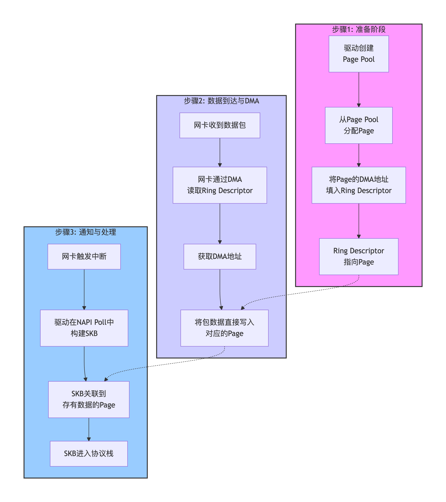

```table-of-contents
```
# 介绍
page pool是网络模块的一个页面池缓存机制，主要用于分配以及回收已经分配的页面。

内核协议栈中，报文处理过程中，申请page是为了存放收发的数据的。驱动使用page_pool机制缓存了page，避免频繁的申请释放。==page_pool是内核提供的一个page缓存机制，专为网卡驱动使用的。并且一个page_pool绑定一个队列==。

# 为什么要引入 `page_pool`
在传统 Linux 网络栈中，网卡收到数据包后，驱动需要调用 `alloc_pages()` 分配内存来存放数据。当数据包被上层协议栈处理完毕（或被丢弃）后，驱动调用 `put_page()` 释放内存。

## 传统模式的痛点

**(1)分配慢**：`alloc_pages()` 涉及复杂的 buddy system（伙伴系统）查找、锁竞争、NUMA 节点选择等，耗时较长。
**(2)DMA 映射开销大**：每次分配新页后，都需要调用 `dma_map_page()` 将虚拟地址映射为物理地址供网卡 DMA 使用；释放时需 `dma_unmap_page()`。这些操作涉及 IOMMU 表项更新，非常昂贵。
**(3)缓存局部性差**：频繁分配释放导致 CPU 缓存（Cache）失效，且内存页可能分散在不同 NUMA 节点。
**(4)高 PPS 下的瓶颈**：在百万级包每秒（PPS）的场景下，内存分配/释放的开销甚至超过了数据包处理本身的开销，成为主要瓶颈。

## `page_pool` 的解决方案

- **(1)缓存复用**：驱动不再每次向系统申请新页（从全局的 Buddy System 申请，需要加锁），而是从 `page_pool` 中获取“用过但已回收”的页。
- **(2)DMA 映射持久化**：页面在加入 pool 时已经做好了 DMA 映射（或快速映射），取出时无需重新映射，极大减少 IOMMU 操作。
- **(3)锁无关（Lockless）**：利用 per-CPU 缓存（ptr-ring）技术，绝大多数分配/释放操作无需加锁，极大提升并发性能。
- **(4)NUMA 感知**：确保分配的内存页位于网卡所在的 NUMA 节点，减少跨节点访问延迟。

### 为什么 `page_pool` 能加速？

因为它跳过了最慢的两个环节：
**(1)Buddy System 分配**： Buddy System 有可能涉及到加锁。
**(2)IOMMU Map/Unmap**：页面在 Pool 里期间，DMA 映射一直保持着。传统模式下，每次收包都要 Map，每次释放都要 Unmap，这是巨大的开销。

## Buddy System 内存分配介绍

**Buddy System 不是全局的，而是按 NUMA 节点 + 内存域（zone）划分的 “分区管理”，无全局单一池**。


- **NUMA 节点维度**：
    多 NUMA 架构下，每个 NUMA 节点有独立的内存控制器和物理内存，Buddy System 为每个节点维护独立的内存池。分配内存时优先从当前 CPU 所属 NUMA 节点分配（减少跨节点访问延迟），而非全局池。

- **内存域（zone）维度**：
    每个 NUMA 节点内，按内存的访问特性划分 zone：
    - `ZONE_DMA`：ISA DMA 可访问的低地址内存（<16M）；
    - `ZONE_DMA32`: 用于只能寻址 32 位地址的设备（< 4GB）。
    - `ZONE_NORMAL`：内核直接映射的常规内存；
    - `ZONE_HIGHMEM`：高端内存（32 位系统 > 896M，64 位系统基本不用）。
        
        每个 zone 有独立的 Buddy 链表，分配时按需求（如 DMA 内存）从对应 zone 获取。


- **页阶数（order）维度**：
    每个 zone 内，按连续页的数量（2^order 个）维护 11 条独立的空闲链表（order0~10），比如 order3 对应 8 个连续 4K 页（32K）

### 详解

Buddy 系统是 Linux 最底层的内存管理机制，它使用 Page 粒度来管理内存。通常情况下一个 Page 的大小为 4K，在 Buddy 系统中分配、释放、回收的最小单位都是 Page。


#### 层次化划分

一个系统的内存总大小动辄几G几十G，不同的内存区域也有不同的特性。Buddy 使用层次化的结构把这些特性给组织起来：

- **1、Node**。在 NUMA 架构下存在多个 Memory 和 CPU 节点，不同 CPU 访问不同 Memory 节点的速度是不一样的，使用 Node 的形式把各个 Memory 节点的内存管理起来。

- **2、Zone**。某些外设只能访问低 16M 的物理地址，某些外设只能访问低 4G 的物理地址，32bit 的内核空间只能直接映射低 896M 物理地址。根据这些地址空间的限制，把同一个 node 内的内存再划分成多个 zone 。

- **3、Order Freelist**。按照空闲内存块的长度，把内存挂载到不同长度的 freelist 链表中。freelist 的长度是以 (2^order x Page) 来递增的，即 1 page、2 page、4 page … 2^n，通常情况下最大 order 为10 对应的空闲内存大小为 4M bytes。在分配时，如果一个空闲块的大小不能被任一长度整除，它就从大到小逐个分解成多个 (2^order x Page) 块来挂载；在释放时，首先把内存释放到对应长度的链表中，随后看看和该内存大小相同、地址相邻的兄弟块(Buddy)是不是free的，如果可以和 buddy 块合并成一个大块挂载到更高一阶的链表，在挂载的时候继续尝试合并。这就是 Buddy 的核心思想，已2的幂个 page 的长度来管理内存方便分配和释放，最核心的目的就是减少内存的碎片化。

- **4、Migrate Type**。为了进一步减少碎片化，系统对内存按照迁移类型进行了分类，最基本的迁移类型有：不可移动(unmovable)、可移动(movable)、可回收(reclaimable)。初始的最大块空闲内存都是 unmovable 的，如果其中一小块分配给了 reclaimable ，那么剩下的内存都变成了 reclaimable。这样坏的类型和坏的类型集中到了一起，避免坏情况的扩散从而造成多个 Free 区域无法合并的情况。

- **5、PerCPU 1 Page Cache**。大于 1 Page 的内存分配大多发生在内核态，而用户态的内存分配使用的是缺页机制所以分配的大小一般是 1 Page。针对大小为 1 Page 的内存分配，系统设计了一个免锁的 PerCPU cache 来支撑。1 Page (Order = 0) 的空闲内存优先释放到 PCP 中，超过了一定 batch 才会释放到 Order Freelist当中；同样 1 Page 的内存也优先在 PCP 中分配。


|ayer|item|category|descript|
|---|---|---|---|
|0|node|0-n|NUMA 结构含有多个 Memory 节点  <br>UMA 结构只有一个 Memory 节点|
|1|zone|ZONE_DMA  <br>ZONE_DMA32  <br>ZONE_NORMAL  <br>ZONE_HIGHMEM  <br>ZONE_MOVABLE  <br>ZONE_DEVICE|(<16M)x86架构下某些ISA外设的DMA寻址能力为16M  <br>(<4G)历史32bit下的外设DMA寻址能力为4G  <br>-  <br>在x86 32bit下，超过896M的内存无法在内核态线性映射，称为高端内存。x86_64因为虚拟空间很大，没有这块内存。  <br>这些区域的物理内存支持动态的热插拔  <br>为某些设备预留的内存区域|
|2.1|order freelist|2^0 Page  <br>…  <br>2^max_order Page|按照2的幂个 Page 的大小来分类空闲内存|
|2.1.1|migrate type|MIGRATE_UNMOVABLE  <br>MIGRATE_MOVABLE  <br>MIGRATE_RECLAIMABLE  <br>MIGRATE_HIGHATOMIC  <br>MIGRATE_CMA  <br>MIGRATE_ISOLATE|把每级 order freelist 按照迁移类型分成多个链表|
|2.2|PCP|PerCPU:  <br>MIGRATE_UNMOVABLE  <br>MIGRATE_MOVABLE  <br>MIGRATE_RECLAIMABLE|针对 1 Page 创建的 PerCPU的cache，其中只包含3种基本的 migrate type|


### 为什么不设计成全局？

- **性能**：全局池会导致所有 CPU 竞争同一把锁，高并发场景下锁冲突严重，延迟飙升；
- **NUMA 亲和性**：跨 NUMA 节点分配内存会增加内存访问延迟（几十纳秒→几百纳秒），分区管理可优先分配本地 NUMA 内存；
- **内存隔离**：不同 zone 有不同的用途（如 DMA 内存），全局池无法区分，易导致关键内存耗尽。

### Buddy System 分配内存时需要加锁吗？
**结论：需要加锁，但不是全局锁，而是 “per-zone + per-CPU” 的精细锁，尽可能减少竞争**。

Buddy System 的锁分为两层，核心是**per-zone 锁**（zone->lock）：

- **核心锁：zone->lock**：
    每个内存域（zone）有一把独立的自旋锁（spinlock），保护该 zone 内所有 order 的空闲链表。分配 / 释放内存时，必须持有该 zone 的锁。
    - 示例：从 node0 的 ZONE_NORMAL 分配内存，只需加`node0->zone_normal->lock`，不影响其他 zone / 节点。
    
- **优化：per-CPU 缓存（pcp）**：
    为了减少 zone->lock 的竞争，内核引入了**每 CPU 页缓存（Per-CPU Page Cache，pcp）**。只有当 PCP 空了或满了，才会去操作 Node/Zone 级别的 Buddy System。
    - 每个 CPU 为每个 zone 维护 pcp 缓存，缓存少量低阶页（order0~1）；
    - 分配低阶页时，优先从当前 CPU 的 pcp 缓存获取（无锁），缓存耗尽时再从 zone 的 Buddy 链表批量获取（加 zone 锁）；
    - 释放低阶页时，先放入 pcp 缓存，缓存满时再批量归还给 Buddy 链表（加 zone 锁）。


加锁的场景：

- **操作 Per-CPU Pageset (PCP) 时**：**不需要自旋锁**。因为 PCP 是每 CPU 的变量，其他 CPU 无法访问，天然无锁。这是高频小内存分配的主要路径（快路径）。

- **操作 Zone 级 Buddy System 时**：**需要加锁**。当 PCP 为空需要补充，或 PCP 满需要回收到 Buddy System 时，必须获取该 Zone 的自旋锁 (`zone->lock`)。

- **结论**：在极端高并发场景下（如百万 PPS 网络包处理），如果大量线程同时导致 PCP 耗尽并争抢 `zone->lock`，会产生严重的锁竞争，导致性能急剧下降。这也是为什么网络子系统要引入 `page_pool` 的原因。

# page-pool的机制

一个`page_pool`实例通常对应一个硬件队列。


```bash
+------------------+
|       Driver     |
+------------------+
        ^
        |
        |
        |
        v
+--------------------------------------------+
|                request memory              |
+--------------------------------------------+
    ^                                  ^
    |                                  |
    | Pool empty                       | Pool has entries
    |                                  |
    v                                  v
+-----------------------+     +------------------------+
| alloc (and map) pages |     |  get page from cache   |
+-----------------------+     +------------------------+
                                ^                    ^
                                |                    |
                                | cache available    | No entries, refill
                                |                    | from ptr-ring
                                |                    |
                                v                    v
                      +-----------------+     +------------------+
                      |   Fast cache    |     |  ptr-ring cache  |
                      +-----------------+     +------------------+
```


注意：如果cache失效（比如：cache被用完了），skb的slab申请释放和page_pool申请释放page，就需要访问内核全局内存，需要加锁，加锁会导致访问变慢，进而可能导致丢包。

# Ring Descriptor & Page & SKB 的关系

## 角色定义
### Ring Descriptor (环形缓冲区描述符)
这是位于驱动和网卡硬件之间的一个**环形数组**。每个描述符项的核心内容就是一个指向内存地址的指针（DMA地址）。
它就像一份“交接单”，告诉网卡硬件：“请把收到的数据放到这个地址的内存里去”。

==Rx/Tx Ring: 类似于 QP中的 send queue, recv queue;  Ring Descriptor 就是WQE/WR==；

### Page (struct page)
物理内存页（`struct page`）作为数据包的 “物理存储载体”，网卡 DMA 直接写入该页，它是数据最终被存放的物理载体。

`page_pool`就像一个高效的内存“回收站”，专门负责分配和回收这些页面，目的是避免频繁地向系统申请内存，从而提升性能。

### SKB (struct sk_buff)
SKB (struct sk_buff)是 内核网络协议栈的核心数据结构。用于管理一个网络包的全部信息。它就像一个“快递包裹”，包含了协议头信息、数据指针以及管理信息。在收包流程中，它会被创建，并指向存有数据的Page，然后在内核协议栈的各个层级(二/三/四层)间传递。

**内容**：元数据（源/目的 IP、端口、协议类型等）+ 指向数据的指针。

### 三者的关系



|组件|核心定位|所属层级|核心作用|
|---|---|---|---|
|网卡 ring 描述符（desc）|硬件层面的 “内存地址索引”，存储在网卡的 RX/TX ring（环形缓冲区）中|网卡硬件 + 驱动|告诉网卡 DMA 引擎：“该把数据包写到哪个物理内存地址？”（收包）/“从哪个地址读包发送？”（发包）|
|page_pool 的 page|物理内存页（`struct page`），由 page_pool 管理的缓存页|内核内存子系统|作为数据包的 “物理存储载体”，网卡 DMA 直接写入该页，避免频繁分配 / 释放内存|
|skb（sk_buff）|内核网络层的 “数据包容器”，封装 page 和协议头信息|内核协议栈|为协议栈（TCP/IP）提供统一的数据包操作接口，关联物理页和逻辑数据|

```bash
+----------------+       +----------------+       +----------------+
|  Ring Buffer   |       |   Memory       |       |  Network Stack |
| (Kernel Driver)|       | (Physical RAM) |       | (SKB)          |
+----------------+       +----------------+       +----------------+
|  Desc [0]      |------>|  Page A        |<------|  SKB 1         |
| - DMA Addr: PA |  (1)  | - Data: [HTTP] |  (3)  | - head: (meta) |
| - Len: 1500    |       | - Refcnt: 2    |       | - data: ->PageA|
| - Status: HW   |       +----------------+       | - len: 1500    |
+----------------+                                +----------------+
       ^
       | (2) NIC DMA writes here
+----------------+
|  Network Card  |
|  (Hardware)    |
+----------------+
```

- **(1) 映射关系**：Ring Desc 中存储了 Page 的**物理地址 (PA) 或者 IOVA地址 **。
- **(2) 数据流**：网卡通过 DMA 引擎，直接将数据写入 Page 对应的物理内存。
- **(3) 封装关系**：SKB 被创建，其 `data` 指针指向 Page 中的特定偏移量（Offset），SKB 本身只占用很小的内存（元数据），大数据在 Page 里。


## 整体流程：它们是如何协同的？


### 驱动初始化
**初始化阶段：提前 “准备好内存 + 指令”**

- RX ring（desc）：驱动初始化时申请一段连续内存（通常是 DMA 可访问的），分成固定数量的`desc`节点，每个`desc`包含：
    
    - `addr`：物理内存地址（后续填 page_pool 的 page 物理地址）；
    - `status`：状态位（OWN 位：1 = 归HW, 硬件，0 = 归 SW, 即：CPU）；
    - `len`：数据包长度。

> 注：desc 中的地址是 **物理地址 (Physical Address)** 或 **IOVA (IOMMU 虚拟地址)**。

- page_pool：驱动创建 page_pool 时，向内核伙伴系统预分配一批`struct page`，并调用`dma_map_single()`将 page 的物理地址映射到**设备地址空间**（让网卡 DMA 能访问），避免收包时重复映射。

- 填充 desc：驱动从 page_pool 取空闲 page，将其**物理地址**（dma_addr_t 类型）写入 desc 的`addr`字段，然后设置 desc 的 OWN 位为 1（归硬件），完成 RX ring 的初始化填充。

### 收包后的DMA 操作（无 CPU 参与）

- 网卡硬件接收到数据包后，先暂存到硬件 FIFO（避免数据丢失）；
- DMA 引擎遍历 RX ring，找到 OWN 位 = 1 的 desc，读取其`addr`（page 的物理地址）；
- DMA 引擎直接将 FIFO 中的数据包写入该物理地址（**DMA 写操作**，全程无 CPU 介入，零拷贝核心）；
- 写入完成后，DMA 引擎将 desc 的 OWN 位置 0（归 SW），并更新`len`为实际数据包长度。触发 **MSI-X 中断**，通知驱动：“有新包了”。

### 软中断处理(内核处理：从 “物理页” 到 “协议栈可操作的 skb”)
- 在NAPI（New API）机制下，中断处理函数会快速关闭中断，并触发软中断（`NET_RX_SOFTIRQ`）进行后续处理，避免高流量下的“中断风暴”。
- 中断处理程序遍历 RX ring，找到 OWN 位 = 0(即：归于SW) 的 desc，提取 page 物理地址和数据包长度；
- 驱动根据 page 物理地址找到对应的`struct page`（page_pool 管理的页），创建`skb`并将该 page 挂载到 skb 上（skb 的`data`指针指向 page 内的数据包起始位置）；
- 为了不影响下一次收包，驱动立即从 page_pool 取新的空闲 page，填充到当前 desc 中（重置 OWN 位 = 1）；
- **协议栈处理**：带着数据的`skb`随后被递交给内核的网络协议栈（如IP层、TCP/UDP层），最终经过一系列处理（如路由查找、Netfilter过滤）后，被放到对应应用程序的Socket接收队列中，等待应用程序读取。


# 收包的流程

详细流程：
```bash
1 NIC 需要 buffer
2 driver 从 page_pool_alloc_pages()
3 page 放入 RX descriptor
4 NIC DMA packet 到 page
5 driver poll RX ring
6 build skb
7 skb->data 指向 page
8 进入 network stack
```

```bash
                ┌───────────────────────┐
                │        NIC (DMA)      │
                └────────────┬──────────┘
                             │
                             ▼
                ┌───────────────────────┐
                │ RX Ring Descriptor    │
                └────────────┬──────────┘
                             │
                             ▼
                ┌───────────────────────┐
                │ page_pool_alloc_pages │
                └────────────┬──────────┘
                             │
                             ▼
                ┌───────────────────────┐
                │ build_skb()           │
                └────────────┬──────────┘
                             │
                             ▼
                ┌───────────────────────┐
                │ napi_gro_receive()    │
                └────────────┬──────────┘
                             │
                             ▼
                ┌───────────────────────┐
                │ netif_receive_skb()   │
                └────────────┬──────────┘
                             │
                             ▼
                ┌───────────────────────┐
                │ ip_rcv()              │
                └────────────┬──────────┘
                             │
                             ▼
                ┌───────────────────────┐
                │ tcp_v4_rcv()          │
                └────────────┬──────────┘
                             │
                             ▼
                ┌───────────────────────┐
                │ tcp_queue_rcv()       │
                └────────────┬──────────┘
                             │
                             ▼
                ┌───────────────────────┐
                │ sk_rcvbuf 判断        │
                └────────────┬──────────┘
                             │
                 满          │        未满
                丢弃         ▼
                        放入 socket queue
```

## 收包丢包汇总

```bash
2. RX ring 无 buffer  
3. page_pool 分配失败  
4. skb 分配失败  
5. backlog queue 满  
6. sk_rcvbuf 满  
7. TCP 接收缓冲区满
```


# 参考
```bash
# Page Pool API
https://linuxkernel.org.cn/doc/html/latest/networking/page_pool.html

# linux 5.4.18 page_pool源码分析（附图）
https://adg.csdn.net/695245d45b9f5f31781b4f28.html

# 网卡不拥塞却丢包严重：从 Page Pool 机制找答案
https://mp.weixin.qq.com/s/AnjEfpSefdzYkgiIUB16pg
```