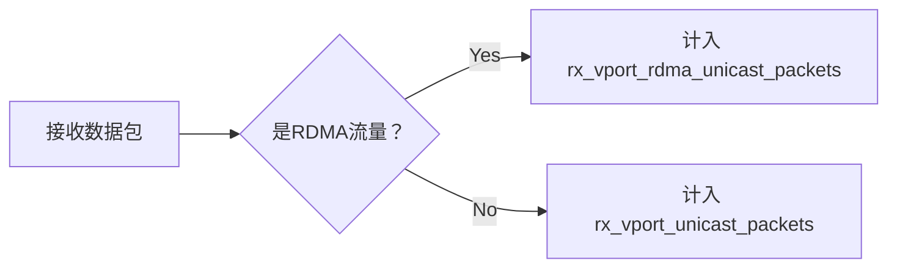

```table-of-contents
```
# ethtool的统计

## 统计范例
```c
intel 82599 10G网卡的统计
# ethtool -S eth03 | grep -i -e miss -e out_of -e disca -e fifo -e buff
     rx_no_buffer_count: 0
     fdir_miss: 0
     rx_fifo_errors: 0
     rx_missed_errors: 0
     tx_fifo_errors: 0
     alloc_rx_buff_failed: 0

Mellanox Cx4-Lx 25G 网卡的统计
# ethtool -S eth03 | grep -i -e disc -e fifo -e out_of -e miss -e buffer
     rx_out_of_buffer: 0
     rx_steer_missed_packets: 24627
     rx_out_of_range_len_phy: 0
     rx_discards_phy: 0
     tx_discards_phy: 0
     rx_buffer_passed_thres_phy: 0
     rx_prio0_discards: 0
     rx_prio1_discards: 0
     rx_prio2_discards: 0
     rx_prio3_discards: 0
     rx_prio4_discards: 0
     rx_prio5_discards: 0
     rx_prio6_discards: 0
     rx_prio7_discards: 0

主要是：
   rx_out_of_buffer：
   rx_discards_phy：

Mellanox Cx4-Lx 25G 网卡的统计
# ethtool -S eth03 | grep -i -e pci -e pause -e control
     tx_mac_control_phy: 1266552
     rx_mac_control_phy: 0
     rx_pause_ctrl_phy: 0
     tx_pause_ctrl_phy: 1266552
     rx_pci_signal_integrity: 0
     tx_pci_signal_integrity: 3
     outbound_pci_stalled_rd: 0
     outbound_pci_stalled_wr: 0
     outbound_pci_stalled_rd_events: 0
     outbound_pci_stalled_wr_events: 0
     rx_global_pause: 0
     rx_global_pause_duration: 0
     tx_global_pause: 1266552
     tx_global_pause_duration: 555665182
     rx_global_pause_transition: 0
     tx_pause_storm_warning_events: 0
     tx_pause_storm_error_events: 0

主要是：
 tx_pause_ctrl_phy：
 outbound_pci_stalled_wr：
```

注：ethtool -S 的输出中，不同网卡，不同固件版本，驱动版本，甚至操作系统版本，其输出可能都不一样。有rx_dropped，rx_fifo_error, rx_missed_errors, rx_discards_phy 等等。

## 重要的统计说明
### 收包丢包统计
#### Mellanox 网卡的 rx_discards_phy
```c
rx_discards_phy:
	The number of received packets dropped due to lack of buffers on a physical port. If this counter is increasing, it implies that the adapter is congested and cannot absorb the traffic coming from the network.ConnectX-3 naming : rx_fifo_errors
```
Mellanox 网卡的 rx_discards_phy 应该指的是 网卡的硬件缓存满了导致的丢包。


按照上面的理解：  
rte_eth_stats_get 指的是软件的统计；  
rte_eth_xstats_get 展示了物理硬件的一些统计计数（驱动通过寄存器读取），rx_discards_phy 的统计应该是网卡的硬件缓存满或者PCIe 总线阻塞导致无法把包发送给内核的内存中。


#### Mellanox 网卡的 rx_out_of_buffer
```c
rx_out_of_buffer:
	Number of times receive queue had no software buffers allocated for the adapter’s incoming traffic.
```
Mellanox 网卡的 rx_out_of_buffer 应该指的是 rx ring buffer 溢出。


#### intel 网卡的相关丢包统计
intel ixgbe网卡中的 rx_fifo_errors 以及 rx_missed_errors 统计，应该都是指的是 网卡硬件缓存满了导致的丢包。


#### intel 的 alloc_rx_buff_failed 统计


### pci相关


### pause frame相关

-  outbound_pci_stalled_wr 和 tx_pause_ctrl_phy 区别
tx_pause_ctrl_phy：这个是网卡外联其他网络设备，比如交换机，由于网卡的硬件接收缓存满了，需要给对端设备发送Pause Frame，暂停对方给本端设备发包。

outbound_pci_stalled_wr：这个是机器内，PCIe设备之间通过PCIe协议通信时，事务层由于credit不足，由于流控控制而发送失败的情况。


### 其他
- Mellanox 网卡的 rx_out_of_range_len_phy
```c
rx_out_of_range_len_phy:
	The number of received packets dropped due to length greater than allowed on a physical port. If this counter is increasing, it implies that the peer connected to the adapter has a larger MTU configured. Using same MTU configuration shall resolve this issue.
```
收到了超过接口MTU的包，硬件丢弃。

- Mellanox 网卡的 tx_discards_phy
```c
tx_discards_phy:
	The number of packets which were discarded on transmission, even no errors were detected. the drop might occur due to link in down state, head of line drop, pause from the network, etc
```

## 统计分组
### 分组介绍
参考：[Mellanox mlx5 Ethtool counters](https://docs.kernel.org/networking/device_drivers/ethernet/mellanox/mlx5/counters.html)
[UNDERSTANDING MLX5 ETHTOOL COUNTERS](https://enterprise-support.nvidia.com/s/article/understanding-mlx5-ethtool-counters)

分组介绍一：


分组介绍二：


根据统计的类别，可以分为information , **Acceleration** 和 error.

比如：


### Ring / Software Port Counter Table


```bash
# ethtool -S eth01 | grep rx[0-9]*_packets
     rx_packets: 231489200
     rx_packets_phy: 2572965292
     rx0_packets: 221870072
     rx1_packets: 149337
     rx2_packets: 114253
     rx3_packets: 95294
     rx4_packets: 99219
     rx5_packets: 99093
     rx6_packets: 100297
     rx7_packets: 101940
     rx8_packets: 101419
     rx9_packets: 98423
     rx10_packets: 99722
     rx11_packets: 95147
     rx12_packets: 89489
     rx13_packets: 92630
     rx14_packets: 116891
     rx15_packets: 104672
     rx16_packets: 92939
     rx17_packets: 98031
     rx18_packets: 105305
     rx19_packets: 106794
     rx20_packets: 97336
     rx21_packets: 94963
     rx22_packets: 89824
     rx23_packets: 114178
     rx24_packets: 103528
     rx25_packets: 110613
     rx26_packets: 91062
     rx27_packets: 129274
     rx28_packets: 100352
     rx29_packets: 2889641
     rx30_packets: 109399
     rx31_packets: 109895
     rx32_packets: 100678
     rx33_packets: 95946
     rx34_packets: 94585
     rx35_packets: 88391
     rx36_packets: 98632
     rx37_packets: 94718
     rx38_packets: 110114
     rx39_packets: 89022
     rx40_packets: 105979
     rx41_packets: 95155
     rx42_packets: 102661
     rx43_packets: 101242
     rx44_packets: 105808
     rx45_packets: 97078
     rx46_packets: 101859
     rx47_packets: 105401
     rx48_packets: 115322
     rx49_packets: 101222
     rx50_packets: 100115
     rx51_packets: 300771
     rx52_packets: 100110
     rx53_packets: 101202
     rx54_packets: 106597
     rx55_packets: 116969
     rx56_packets: 94744
     rx57_packets: 100147
     rx58_packets: 95345
     rx59_packets: 403060
     rx60_packets: 100644
     rx61_packets: 95568
     rx62_packets: 99083
```

如上所示：`rx[i]_packets` 即 表示 某个`ring`的统计，也有整个`port`的统计。
`rxi_packets`时：表示的是某个`ring`的统计。`i`为`ring`的`index`。 
`rx_packets`时：表示的是整个`port`的统计。

其他同理：`rx[i]_bytes、|tx[i]_packets、tx[i]_bytes`


|**Counter**|**Description**|**Type**|
|---|---|---|
|rx[i]_packets|The number of packets received on ring i.ConnectX-3 naming : rx[i]_packets|Informative|
|rx[i]_bytes|The number of bytes received on ring i.ConnectX-3 naming : rx[i]_bytes|Informative|
|tx[i]_packets|The number of packets transmitted on ring i.ConnectX-3 naming : tx[i]_packets|Informative|
|tx[i]_bytes|The number of bytes transmitted on ring i.ConnectX-3 naming : tx[i]_bytes|Informative|
|tx[i]_tso_packets|The number of TSO packets transmitted on ring i [A].|Acceleration|
|tx[i]_tso_bytes|The number of TSO bytes transmitted on ring i [A].|Acceleration|
|tx[i]_tso_inner_packets|The number of TSO packets which are indicated to be carry internal encapsulation transmitted on ring i [A]|Acceleration|
|tx[i]_tso_inner_bytes|The number of TSO bytes which are indicated to be carry internal encapsulation transmitted on ring i [A].|Acceleration|
|rx[i]_lro_packets|The number of LRO packets received on ring i [A].|Acceleration|
|rx[i]_lro_bytes|The number of LRO bytes received on ring i [A].|Acceleration|
|rx[i]_csum_unnecessary|Packets received with a CHECKSUM_UNNECESSARY on ring i [A].|Acceleration|
|rx[i]_csum_none|Packets received with CHECKSUM_NONE on ring i [A].|Acceleration|
|rx[i]_csum_complete|Packets received with a CHECKSUM_COMPLETE on ring i [A].|Acceleration|
|rx[i]_csum_unnecessary_inner|Packets received with inner encapsulation with a CHECK_SUM UNNECESSARY on ring i [A].|Acceleration|
|tx[i]_csum_partial|Packets transmitted with a CHECKSUM_PARTIAL on ring i [A].|Acceleration|
|tx[i]_csum_partial_inner|Packets transmitted with inner encapsulation with a CHECKSUM_PARTIAL on ring i [A].|Acceleration|
|tx[i]_csum_none|Packets transmitted with no hardware checksum acceleration on ring i.|Informative|
|tx[i]_stoppedtx_queue_stopped (1)|Events where SQ was full on ring i. If this counter is increased, check the amount of buffers allocated for transmission.|Error|
|tx[i]_waketx_queue_wake (1)|Events where SQ was full and has become not full on ring i.|Error|
|tx[i]_droppedtx_queue_dropped (1)|Packets transmitted that were dropped due to DMA mapping failure on ring i. If this counter is increased, check the amount of buffers allocated for transmission.|Error|
|rx[i]_wqe_err|The number of wrong opcodes received on ring i.|Error|
|tx[i]_nop|The number of no WQEs (empty WQEs) inserted to the SQ (related to ring i) due to the reach of the end of the cyclic buffer. When reaching near to the end of cyclic buffer the driver may add those empty WQEs to avoid handling a state the a WQE start in the end of the queue and ends in the beginning of the queue. This is a normal condition.|Informative|
|rx[i]_mpwqe_frag|The number of WQEs that failed to allocate compound page and hence fragmented MPWQE’s (Multi Packet WQEs) were used on ring i. If this counter raise, it may suggest that there is no enough memory for large pages, the driver allocated fragmented pages. This is not abnormal condition.|Informative|
|rx[i]_mpwqe_filler_cqes|The number of filler CQEs events that where issued on ring i.berfore kernel 4.19 name was rx[i]_mpwqe_filler|Informative|
|rx[i]_cqe_compress_blks|The number of receive blocks with CQE compression on ring i [A].|Acceleration|
|rx[i]_cqe_compress_pkts|The number of receive packets with CQE compression on ring i [A].|Acceleration|
|rx[i]_cache_reuse|The number of events of successful reuse of a page from a driver’s internal page cache – supported from Kernel 4.9|Acceleration|
|rx[i]_cache_full|The number of events of full internal page cache where driver can’t put a page back to the cache for recycling (page will be freed) – supported from Kernel 4.9|Acceleration|
|rx[i]_cache_empty|The number of events where cache was empty – no page to give. driver shall allocate new page – supported from Kernel 4.9|Acceleration|
|rx[i]_cache_busy|The number of events where cache head was busy and cannot be recycled. driver allocated new page – supported from Kernel 4.9|Acceleration|
|rx[i]_xmit_more|The number of packets sent with xmit_more indication set on the skbuff (no doorbell) – Supported from kernel 4.8|Acceleration|
|tx[i]_cqes|The number of completions received on the CQ of TX ring. Supported from kernel 4.19|Informative|
|ch[i]_poll|The number of invocations of [NAPI](https://en.wikipedia.org/wiki/New_API) poll of channel. Supported from kernel 4.19|Informative|
|ch[i]_arm|The number of times the NAPI poll function completed and armed the completion queues on channelSupported from kernel 4.19|Informative|
|ch[i]_aff_change|The number of times the NAPI poll function explicitly stopped execution on a CPU due to a change in affinity, on channel. Supported from kernel 4.19|Informative|
|rx[i]_congst_umr|The number of times an outstanding UMR request is delayed due to congestion, on ringSupported from kernel 4.19|Error|
|ch[i]_events|The number of hard interrupt events on the completion queues of channel. Supported from kernel 4.19|Informative|
|rx[i]_mpwqe_filler_strides|The number of strides consumed by filler CQEs on ring. Supported from kernel 4.19|Informative|
|rx[i]_xdp_tx_xmit|The number of packets forwarded back to the port due to XDP program XDP_TX action (bouncing). these packets are not counted by other software counters. These packets are counted by physical port and vPort counters – supported from kernel 4.9Before kernel 4.19 name was rx[i]_xdp_tx|Informative|
|rx[i]_xdp_tx_full|The number of packets that should have been forwarded back to the port due to XDP_TX action but were dropped due to full tx queue. these packets are not counted by other software counters. These packets are counted by physical port and vPort countersyou may open more rx queues and spread traffic rx over all queues and/or increase rx ring sizesupported from kernel 4.9|Error|
|rx[i]_xdp_tx_err|The number of times an XDP_TX error such as frame too long and frame too short occurred on XDP_TX ring of RX ring. Supported from kernel 4.19|Error|
|rx[i]_xdp_tx_cqesrx_xdp_tx_cqe (1)|The number of completions received on the CQ of the XDP-TX ring. Supported from kernel 4.19|Informative|
|rx[i]_xdp_drop|The number of packets dropped due to XDP program XDP_DROP action. these packets are not counted by other software counters. These packets are counted by physical port and vPort counters – supported from kernel 4.9|Informative|
|rx[i]_xdp_redirect|The number of times an XDP redirect action was triggered on ring. .Supported from kernel 4.19|Acceleration|
|tx[i]_xdp_xmit|The number of packets redirected to the interface(due to XDP redirect). These packets are not counted by other software counters. These packets are counted by physical port and vPort counters – Supported from kernel 4.19|Informative|
|tx[i]_xdp_full|The number of packets redirected to the interface(due to XDP redirect), but were dropped due to full tx queue. these packets are not counted by other software counters. you may enlarge tx queues. Supported from kernel 4.19|Informative|
|tx[i]_xdp_err|The number of packets redirected to the interface(due to XDP redirect) but were dropped due to error such as frame too long and frame too short . Supported from kernel 4.19|Error|
|tx[i]_xdp_cqes|The number of completions received for packets redirected to the interface(due to XDP redirect) on the CQ . Supported from kernel 4.19|Informative|
|rx[i]_cache_waive|The number of cache evacuation. This can occur due to page move to another NUMA node or page was pfmemalloc-ed and should be freed as soon as possible. Supported from kernel 4.14|Acceleration|

### 设备本身DEVICE COUNTERS


### PHYSICAL PORT COUNTERS
```c
The physical port counters are the counters on the external port connecting adapter to the network. This measuring point holds information on standardized counters like IEEE 802.3, RFC2863, RFC 2819, RFC 3635 and additional counters like flow control, FEC and more.
```

|**Counter**|**Description**|**Type**|
|---|---|---|
|rx_packets_phy|The number of packets received on the physical port. This counter doesn’t include packets that were discarded due to FCS, frame size and similar errors.<br><br>ConnectX-3 naming : rx_packets|Informative|
|tx_packets_phy|The number of packets transmitted on the physical port.<br><br>ConnectX-3 naming : tx_packets|Informative|
|rx_bytes_phy|The number of bytes received on the physical port, including Ethernet header and FCS.<br><br>ConnectX-3 naming : rx_bytes|Informative|
|tx_bytes_phy|The number of bytes transmitted on the physical port.<br><br>ConnectX-3 naming : tx_bytes|Informative|
|rx_multicast_phy|The number of multicast packets received on the physical port.<br><br>ConnectX-3 naming : rx_multicast_packets|Informative|
|tx_multicast_phy|The number of multicast packets transmitted on the physical port.<br><br>ConnectX-3 naming : tx_multicast_packets|Informative|
|rx_broadcast_phy|The number of broadcast packets received on the physical port.<br><br>ConnectX-3 naming : rx_broadcast_packets|Informative|
|tx_broadcast_phy|The number of broadcast packets transmitted on the physical port.<br><br>ConnectX-3 naming : tx_broadcast_packets|Informative|
|rx_crc_errors_phy|The number of dropped received packets due to FCS (Frame Check Sequence) error on the physical port. If this counter is increased in high rate, check the link quality using **rx_symbol_error_phy** and **rx_corrected_bits_**phy counters below.<br><br>ConnectX-3 naming : rx_crc_errors|Error|
|rx_in_range_len_errors_phy|The number of received packets dropped due to length/type errors on a physical port.<br><br>ConnectX-3 naming : rx_in_range_length_error|Error|
|rx_out_of_range_len_phy|The number of received packets dropped due to length greater than allowed on a physical port.<br><br>If this counter is increasing, it implies that the peer connected to the adapter has a larger MTU configured. Using same MTU configuration shall resolve this issue.<br><br>ConnectX-3 naming : rx_out_range_length_error|Error|
|rx_oversize_pkts_phy|The number of dropped received packets due to length which exceed MTU size on a physical port<br><br>If this counter is increasing, it implies that the peer connected to the adapter has a larger MTU configured. Using same MTU configuration shall resolve this issue.<br><br>ConnectX-3 naming : rx_frame_errors|Error|
|rx_symbol_err_phy|The number of received packets dropped due to physical coding errors (symbol errors) on a physical port.|Error|
|rx_mac_control_phy|The number of MAC control packets received on the physical port.|Informative|
|tx_mac_control_phy|The number of MAC control packets transmitted on the physical port.|Informative|
|rx_pause_ctrl_phy|The number of link layer pause packets received on a physical port. If this counter is increasing, it implies that the network is congested and cannot absorb the traffic coming from to the adapter.|Informative|
|tx_pause_ctrl_phy|The number of link layer pause packets transmitted on a physical port. If this counter is increasing, it implies that the NIC is congested and cannot absorb the traffic coming from the network.|Informative|
|rx_unsupported_op_phy|The number of MAC control packets received with unsupported opcode on a physical port.|Error|
|rx_discards_phy|The number of received packets dropped due to lack of buffers on a physical port. If this counter is increasing, it implies that the adapter is congested and cannot absorb the traffic coming from the network.<br><br>ConnectX-3 naming : rx_fifo_errors|Error|
|tx_discards_phy|The number of packets which were discarded on transmission, even no errors were detected. the drop might occur due to link in down state, head of line drop, pause from the network, etc|Error|
|tx_errors_phy|The number of transmitted packets dropped due to a length which exceed MTU size on a physical port.|Error|
|rx_undersize_pkts_phy|The number of received packets dropped due to length which is shorter than 64 bytes on a physical port. If this counter is increasing, it implies that the peer connected to the adapter has a non-standard MTU configured or malformed packet had arrived.|Error|
|rx_fragments_phy|The number of received packets dropped due to a length which is shorter than 64 bytes and has FCS error on a physical port. If this counter is increasing, it implies that the peer connected to the adapter has a non-standard MTU configured.|Error|
|rx_jabbers_phy|The number of received packets d due to a length which is longer than 64 bytes and had FCS error on a physical port.|Error|
|rx_64_bytes_phy|The number of packets received on the physical port with size of 64 bytes.|Informative|
|rx_65_to_127_bytes_phy|The number of packets received on the physical port with size of 65 to 127 bytes.|Informative|
|rx_128_to_255_bytes_phy|The number of packets received on the physical port with size of 128 to 255 bytes.|Informative|
|rx_256_to_511_bytes_phy|The number of packets received on the physical port with size of 256 to 512 bytes.|Informative|
|rx_512_to_1023_bytes_phy|The number of packets received on the physical port with size of 512 to 1023 bytes.|Informative|
|rx_1024_to_1518_bytes_phy|The number of packets received on the physical port with size of 1024 to 1518 bytes.|Informative|
|rx_1519_to_2047_bytes_phy|The number of packets received on the physical port with size of 1519 to 2047 bytes.|Informative|
|rx_2048_to_4095_bytes_phy|The number of packets received on the physical port with size of 2048 to 4095 bytes.|Informative|
|rx_4096_to_8191_bytes_phy|The number of packets received on the physical port with size of 4096 to 8191 bytes.|Informative|
|rx_8192_to_10239_bytes_phy|The number of packets received on the physical port with size of 8192 to 10239 bytes.|Informative|
|link_down_events_phy|The number of times where the link operative state changed to down. In case this counter is increasing it may imply on port flapping. You may need to replace the cable/transceiver.|Error|
|rx_out_of_buffer|Number of times receive queue had no software buffers allocated for the adapter's incoming traffic.|Error|
|module_bus_stuck|The number of times that module's I2C bus (data or clock) short-wire was detected. You may need to replace the cable/transceiver - supported from kernel 4.10|Error|
|module_high_temp|The number of times that the module temperature was too high. If this issue persist, you may need to check the ambient temperature or replace the cable/transceiver module - supported from kernel 4.10|Error|
|module_bad_shorted|The number of times that the module cables were shorted. You may need to replace the cable/transceiver module - supported from kernel 4.10|Error|
|module_unplug|The number of times that module was ejected - supported from kernel 4.10|Informative|
|rx_buffer_passed_thres_phy|The number of events where the port receive buffer was over 85% full. Supported from kernel 4.14|Informative|
|tx_pause_storm_warning_events|The number of times the device was sending pauses for a long period of time - supported from kernel 4.15|Informative|
|tx_pause_storm_error_events|The number of times the device was sending pauses for a long period of time, reaching time out and disabling transmission of pause frames. on the period where pause frames were disabled, drop could have been occurred - supported from kernel 4.15|Error|
|rx[i]_buff_alloc_err / rx_buff_alloc_err|Failed to allocate a buffer to received packet (or SKB) on port (or per ring)|Error|
|rx_bits_phy|This counter provides information on the total amount of traffic that could have been received and can be used as a guideline to measure the ratio of errored traffic in **rx_pcs_symbol_err_phy**& **rx_corrected_bits_phy.**|Informative|
|rx_pcs_symbol_err_phy|This counter counts the number of symbol errors that wasn’t corrected by FEC correction algorithm or that FEC algorithm was not active on this interface. If this counter is increasing, it implies that the link between the NIC and the network is suffering from high BER, and that traffic is lost. You may need to replace the cable/transceiver. The error rate is the number of **rx_pcs_symbol_err_phy** divided by the number of rx_phy_bits on a specific time frame.|Error|
|rx_corrected_bits_phy|The number of corrected bits on this port according to active FEC (RS/FC). If this counter is increasing, it implies that the link between the NIC and the network is suffering from high BER. The corrected bit rate is the number of **rx_corrected_bits_phy** divided by the number of **rx_phy_bits** on a specific time frame|Error|
|phy_raw_errors_lane[l]|This counter counts the number of physical raw errors per lane [l] index. The counter counts errors before FEC corrections. If this counter is increasing, it implies that the link between the NIC and the network is suffering from high BER, and that traffic might be lost. You may need to replace the cable/transceiver. Please check in accordance with rx_corrected_bits_phy.  <br>Supported from kernel 4.20|Error|

### PRIORITY PORT COUNTERS
The following counters are physical port counters that being counted per L2 priority (0-7).
**Note: 'p'** in the counter name represents the priority.


### VPORT COUNTERS

Counters on the eswitch port that is connected to the VNIC.


|**Counter**|**Description**|**Type**|
|---|---|---|
|rx_vport_unicast_packets|Unicast packets received, steered to a port including Raw Ethernet QP/DPDK traffic, excluding RDMA traffic|Informative|
|rx_vport_unicast_bytes|Unicast bytes received, steered to a port including Raw Ethernet QP/DPDK traffic, excluding RDMA traffic|Informative|
|tx_vport_unicast_packets|Unicast packets transmitted, steered from a port including Raw Ethernet QP/DPDK traffic, excluding RDMA traffic|Informative|
|tx_vport_unicast_bytes|Unicast bytes transmitted, steered from a port including Raw Ethernet QP/DPDK traffic, excluding RDMA traffic|Informative|
|rx_vport_multicast_packets|Multicast packets received, steered to a port including Raw Ethernet QP/DPDK traffic, excluding RDMA traffic|Informative|
|rx_vport_multicast_bytes|Multicast bytes received, steered to a port including Raw Ethernet QP/DPDK traffic, excluding RDMA traffic|Informative|
|tx_vport_multicast_packets|Multicast packets transmitted, steered from a port including Raw Ethernet QP/DPDK traffic, excluding RDMA traffic|Informative|
|tx_vport_multicast_bytes|Multicast bytes transmitted, steered from a port including Raw Ethernet QP/DPDK traffic, excluding RDMA traffic|Informative|
|rx_vport_broadcast_packets|Broadcast packets received, steered to a port including Raw Ethernet QP/DPDK traffic, excluding RDMA traffic|Informative|
|rx_vport_broadcast_bytes|Broadcast bytes received, steered to a port including Raw Ethernet QP/DPDK traffic, excluding RDMA traffic|Informative|
|tx_vport_broadcast_packets|Broadcast packets transmitted, steered from a port including Raw Ethernet QP/DPDK traffic, excluding RDMA traffic|Informative|
|tx_vport_broadcast_bytes|Broadcast packets transmitted, steered from a port including Raw Ethernet QP/DPDK traffic, excluding RDMA traffic|Informative|
|rx_vport_rdma_unicast_packets|RDMA unicast packets received, steered to a port (counters counts RoCE/UD/RC traffic) [A]|Acceleration|
|rx_vport_rdma_unicast_bytes|RDMA unicast bytes received, steered to a port (counters counts RoCE/UD/RC traffic) [A]|Acceleration|
|tx_vport_rdma_unicast_packets|RDMA unicast packets transmitted, steered from a port (counters counts RoCE/UD/RC traffic) [A]|Acceleration|
|tx_vport_rdma_unicast_bytes|RDMA unicast bytes transmitted, steered from a port (counters counts RoCE/UD/RC traffic) [A]|Acceleration|
|rx_vport_ rdma _multicast_packets|RDMA multicast packets received, steered to a port (counters counts RoCE/UD/RC traffic) [A]|Acceleration|
|rx_vport_ rdma _multicast_bytes|RDMA multicast bytes received, steered to a port (counters counts RoCE/UD/RC traffic) [A]|Acceleration|
|tx_vport_ rdma _multicast_packets|RDMA multicast packets transmitted, steered from a port (counters counts RoCE/UD/RC traffic) [A]|Acceleration|
|tx_vport_ rdma _multicast_bytes|RDMA multicast bytes transmitted, steered from a port (counters counts RoCE/UD/RC traffic) [A]|Acceleration|
|rx_steer_missed_packets|Number of packets that was received by the NIC, however was discarded because it did not match any flow in the NIC flow table. supported from kernel 4.16|Error|
|rx_packets|Representor only: packets received, that were handled by the hypervisor. supported from kernel 4.18|Informative|
|rx_bytes|Representor only: bytes received, that were handled by the hypervisor. supported from kernel 4.18|Informative|
|tx_packets|Representor  only: packets transmitted, that were handled by the hypervisor. supported from kernel 4.18|Informative|
|tx_bytes|Representor  only: bytes transmitted, that were handled by the hypervisor. supported from kernel 4.18|Informative|

#### rx_vport_unicast_packets 和 rx_vport_rdma_unicast_packets

|**特性**|`rx_vport_unicast_packets`|`rx_vport_rdma_unicast_packets`|
|---|---|---|
|**流量类型**|常规以太网/IP流量|仅RDMA协议流量|
|**包含DPDK/Raw Eth**|✅|❌|
|**包含RDMA (RoCE/UD/RC)**|❌|✅|
|**统计目的**|传统网络应用流量|高性能RDMA应用流量|




### 其他
#### RDMA协议相关统计


#### ethtool 的硬件统计和软件统计如何区分


#### 硬件加速的方法


# dpdk程序中的统计
在开发DPDK应用的时候，我们可以通过rte_eth_stats_get函数获取网卡统计信息中的imissed计数来判断网卡是否出现丢包。


注：对于ixgbe 驱动，则DPDK中 rte_eth_stats_get 调用的是 ixgbe_dev_stats_get；

## imiss
### 定义

Q: imiss 是 网卡的接收队列满吗？还是 ring_buffer 满？  
A: 根据上面的定义，是被硬件丢弃，应该是网卡的接收队列满。不应该是 ring_buffer 满，ring_buffer 是内核使用的，应该是一个软件的概念。


SW： software 

Q: imiss 统计是否可以基于队列？  
A: imiss统计，是全局的。并且是从寄存器中获取到的，因此是硬件统计。

ixgbe_dev_stats_get 中的实现如下。


# ifconfig的统计


# 参考
```c
https://enterprise-support.nvidia.com/s/article/understanding-mlx5-ethtool-counters
https://www.houzhibo.com/archives/1373
https://docs.kernel.org/networking/device_drivers/ethernet/mellanox/mlx5/counters.html
```