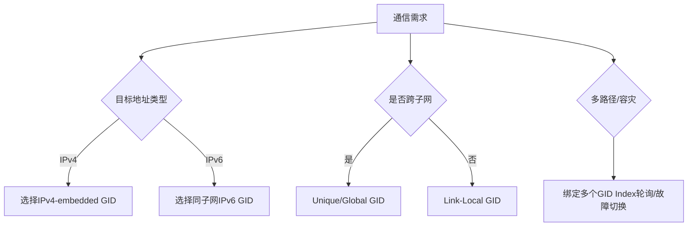

```table-of-contents
```

# RDMA通信模型
## 概述
RDMA是**基于消息的传输协议**，数据传输都是**异步**操作。

RDMA一共支持三种队列，发送队列(SQ)和接收队列(RQ)，完成队列(CQ)。
SQ和RQ都属于WQ(work queue)。
另外，SQ和RQ通常成对创建，被称为Queue Pairs(QP)。

定义了 2 大类型的队列: WQ和CQ。


## WQ
WQ（Work Queue）：App 要收/发数据，就会放置一个 WR（Work Request）到 WQ 作为 WQE（WQ Element）。WQE 是 RNIC 硬件执行任务单元，包含了软件需要硬件执行的动作。RNIC 会获取到 WQE 进行处理。

### SQ 和 RQ

因为 RDMA 支持全双工通信，所以 WQ 进一步细分为 SQ 和 RQ，并称为 QP（Queue Pairs）。通信双方使用一对 QP，通过 BTH QPN 唯一标识，并以此创建 Channel。1 个 RDMA App 可以按需创建多对不同的 QPs 和 Channels。这些 QP 可以用于不同的通信目的，例如：使用不同的服务类型。

SQ（Send Queue）：存放 Send WQE。
RQ（Receive Queue）：存放 Receive WQE。


## CQ
CQ（Complete Queue）：RNIC 每处理完一个 WQE 之后，就会写入一个 CQE 到 CQ，App 从 CQE 中确认一个 WC（Worker Completion）。

# QP
## Work queue
## SQ(send queue)
## RQ(receive queue)

## SRQ(shared receive queue)
## QP 标识
### lid
#### sm_lid
`sm_lid` 指的是 **Subnet Manager Local Identifier**。它是 InfiniBand 网络中用于标识子网管理器（Subnet Manager, SM）的一种标识符。

### gid
#### 概述
**GID (Global Identifier)** 是RDMA网络中**128位全局唯一地址**，核心作用是为QP提供跨子网的可路由标识：
- **本质**：IPv6格式地址（RFC 2373）
- **绑定层级**：关联到HCA（Host Channel Adapter）的**物理端口或虚拟端口**
- **关键特性**：支持路由（RoCEv2/IB）或本地通信（RoCEv1）

#### 介绍

GID 即全局ID（global id），是Infiniband网络层（Network Layer）的地址，用于在跨子网时做路由。在Infiniband协议中，它的作用跟TCP/IP协议中的网络层地址即IP地址的作用是一样的。
因为目前在市场占据绝对主流的RDMA软件栈——OFED中，Infiniband/RoCE/iWARP共用一套代码，所以即使RoCE v2的网络层为IP协议，但是从使用RDMA软件栈的用户来讲，也使用GID来指定本端和对端的地址。
在RoCE v2的通信中，硬件需要知道要知道对端的地址信息，包括：目的GID（即目的IP）、目的MAC地址以及VLAN等等。这些信息都可以通过用户传入的DGID（Destination GID）直接或间接获取到；因为驱动程序会将GID转换为IP地址，然后通过网络侧的邻居表获取MAC地址和VLAN ID。

#### 作用

|**场景**|**作用**|
|---|---|
|**跨子网路由**|在IB和RoCEv2中实现子网间通信（核心价值）|
|**本地通信**|RoCEv1和IB子网内使用Link-Local GID|
|**多播支持**|通过Multicast GID（ff00::/8）实现组播通信|
|**协议兼容**|RoCEv2通过IPv4-embedded GID（::ffff:0:0/96）支持IPv4通信|
|**多路径容灾**|多GID绑定不同物理路径，实现负载均衡和故障切换|


#### GID的分类与生成机制

##### 通用分类

|**类型**|**前缀**|**作用域**|**生成方式**|
|---|---|---|---|
|**Link-Local**|`fe80::/10`|单子网内（不可路由）|HCA自动生成（基于端口GUID）|
|**Unique-Local**|`fd00::/8`|私有网络内（可路由）|管理员/SM配置|
|**Global**|`2000::/3`|互联网范围（可路由）|公网IPv6地址分配|
|**Multicast**|`ff00::/8`|多播组|应用按需创建|
|**IPv4-Embedded**|`::ffff:0:0/96`|IPv4 over RoCEv2|自动映射（`::ffff:192.168.1.1`）|

##### 协议差异

|**协议**|**GID意义**|**生成特点**|
|---|---|---|
|**InfiniBand**|子网间路由标识|SM（子网管理器）分配Unique/Global GID|
|**RoCEv1**|仅本地标识（无路由）|纯Link-Local GID（基于MAC生成）|
|**RoCEv2**|=IPv6地址（实际路由层）|自动映射IPv4/IPv6地址到GID|

|**操作**|**InfiniBand**|**RoCEv1**|**RoCEv2**|
|---|---|---|---|
|**GID配置**|SM管理|自动生成|跟随IP配置|
|**路由依赖**|IB路由器|无（仅二层）|IPv6路由器|
|**地址解析**|ibv_query_gid()|同左|可用getaddrinfo()|
|**IPv4支持**|不直接支持|不支持|通过IPv4-embedded实现|

|**层**|**InfiniBand**|**RoCEv2**|
|---|---|---|
|**网络层**|IB GID路由|IPv6路由|
|**传输层**|IB BTH头|UDP头 + IB BTH头|
|**链路层**|IB链路协议|以太网帧|

> 📌 **RoCEv1特殊定位**：  
> 在以太网链路层直接封装IB传输层（无IP头），故**GID无实际路由功能**

> ✅ **关键差异**：
> 
> - RoCEv1 **无路由能力** → GID仅本地有效
>     
> - RoCEv2 **依赖IP路由** → GID=IP地址
>     
> - IB **独立路由体系** → SM管理GID路由表


#### 多gid下gid的选择
**选择的原则**
（1）一个RDMA设备可能有多个端口（但通常我们使用端口1）。
（2）每个端口可能有多个GID（Global Identifier），每个GID对应一个IP地址（IPv4或IPv6）。
（3）在连接建立时，客户端和服务器端需要选择兼容的GID（例如，相同的IP版本和网络可达性）。
（4）常见的做法是选择与连接对端IP地址类型相匹配的GID（例如，如果对端是IPv4，则选择IPv4 GID；如果是IPv6，则选择IPv6 GID）。
（5）另外，我们可能希望选择与对端IP地址在同一个子网的GID，或者选择RoCEv2的GID（因为RoCEv2同时支持IPv4和IPv6，但实际上RoCEv2使用IPv4或IPv6作为网络层，但数据包格式是固定的）。




#### api接口
```c
ibv_query_gid
ibv_query_gid_ex
ibv_query_gid_table
ibv_query_device
ibv_query_port
```
##### 数据结构
```c
union ibv_gid {
    uint8_t         raw[16];
    struct {
        __be64  subnet_prefix;
        __be64  interface_id;
    } global;
};

enum ibv_gid_type {
    IBV_GID_TYPE_IB,
    IBV_GID_TYPE_ROCE_V1,
    IBV_GID_TYPE_ROCE_V2,
};

struct ibv_gid_entry {
    union ibv_gid gid;
    uint32_t gid_index;
    uint32_t port_num;
    uint32_t gid_type; /* enum ibv_gid_type */
    uint32_t ndev_ifindex;
};
```
##### `ibv_query_device`
##### `ibv_query_port`
##### `ibv_query_gid` 或 `ibv_query_gid_table`


### qpn
QPN是一个节点本地某个QP的唯一编号。既然RDMA通信的基本单位是QP，自然只通过GID找到对端节点是不够的，还要能够找到指定的QP才能进行数据交换。

#### gid 和 qpn结合
如下图所示，==通过GID + QPN的组合，我们就能在网络中唯一确定一个QP了==（通过GID + QPN的组合定位目的QP）：
==类似于TCP/IP中，通过`ip+port` 标识远程的一个服务程序/Socket==，`IP`标识远端主机的一个接口地址，`Port`标识服务或`socket`。
同理，`GID`标识远程主机的一个接口地址，`QPN`标识某个程序中的`QP`。


对于RC服务类型来说，在节点间通过基于`Socket`的数据交互掌握了彼此的`GID + QPN`之后，会通过`Modify QP`的动作将相关信息记录到`QPC(QP context)`中。一切就绪之后，就可以进行`Send/Recv`双边操作了，但是如果想要进行单边的`RDMA Write/Read`操作，这些信息是还不够的。


## 其他
### QPN分Send Queue和receive Queue吗？
QPN 是一个整体编号，标识的是整个 Queue Pair，而不是单独的 Send Queue 或 Receive Queue。
因此，`QPN`不分`Send Queue`和`receive Queue`；但是`PSN`其实是分`send psn`和`recv psn`。如下所示。

```bash
# /opt/mellanox/iproute2/sbin/rdma resource show qp
link mlx5_bond_0/1 lqpn 30278 rqpn 39296 type RC state RTS rq-psn 164604 sq-psn 658420 path-mig-state MIGRATED pdn 128 pid 61655 comm kucl-poll-event
```

### SRQ情况下，QPN的值是什么样的？
SRQ（Shared Receive Queue）允许多个 QP 共享同一个 Receive Queue，以==节约内存，但是不能节省QP的数量==。

在 SRQ 情况下：
（1）每个 QP 仍然有自己的 QPN。
QPN 是分配给 QP 的标识，与是否使用 SRQ 无关。

（2）所有使用 SRQ 的 QP 的接收操作都使用 同一个共享 RQ（Receive Queue），但每个 QP 还是有：
- 自己的 Send Queue；
- 自己的 QPN；

### XRC服务类型下，QPN的值是什么样的？


# QP连接
## QP 建链
建立一对 QP 之间的 Channel，过程中协商通信参数。包括：

（1）GID（Global Identifier，全局 ID）：GID 是 IB 网络的唯一标识。IB 网络中用于标识和寻址网络中的节点或端口。
（2）QPN：QP 的唯一标识，确定建链的对象，GID+QPN 可以在 IB 网络中确定唯一的一个 QP。
（3）VA（虚拟地址）：App 希望访问的虚拟地址。
（4）rkey：remote addr key, 同上。
（5）qkey：queue key, 是 UD（不可靠数据报）服务类型中专用的 Key，用于校验数据报的合法性。

### 链路和连接
QP 建立 “链路（Channel）” 和 “连接（Connection）” 是两个不同的概念。

RDMA 支持 4 种基本的服务类型，以满足不同服务对可靠性和传输速率的不同需求。


其中，RC、UC 是存在 Connection 的，而 RD、UD 则不存在 Connection，而是直接传输 Datagram。


RC 服务类型类比 TCP 协议，进行通信的 QP 之间需要建立一对一 Connection。RC 通过 ACK 确认、重传、保序等机制，确保数据能在 QP 间进行有序、可靠的传输，适用于对数据可靠性和完整性较高的场景。但相对的，由于连接机制和可靠性保障机制的存在，导致 RC 的通信开销较大。当节点数增加时，将占用更多的网卡和内存等资源。


### 作用

# QP状态以及状态机
参考：
[# QP state machine](https://www.rdmamojo.com/2012/05/05/qp-state-machine/)
[# Using the QP states](https://www.rdmamojo.com/2012/05/10/using-the-qp-states/)
[InfiniBand协议学习（2）---- 软件传输接口](https://zhuanlan.zhihu.com/p/110898225)


# CQ
## QP和CQ的关系


一个QP包含一个Send Queue(SQ)，一个Receive Queue(RQ)以及对应的Send Completion Queue(SCQ)和Receive Completion Queue(RCQ)。
用户发送请求的时候，把请求封装为一个Work Queue Element(WQE)发送到SQ里面，然后RDMA网卡会把这个WQE发送出去，当这个WQE完成的时候，对应的SCQ里面会被放一个Completion Queue Element(CQE)，然后用户可以从SCQ里面Poll这个CQE并通过检查状态来确认对应的WQE是否成功完成。
需要指出的是，**不同的QP可以共用CQ来减少SRAM的存储消耗**。


## send/recv独立的cq or 共享的cq

### 背景


如上所示，最简单的使用send/recv方式发送请求和响应。
对于其中一端而言，比如拿发送端来举例，产生的`send CQE`和`recv CQE`可以在一个CQ中，也可以在两个CQ中。


### 独立cq的问题
对于发送端而言，如果使用2个CQ，即`send CQE`在`send CQ`中，`recv CQE`在另外一个`CQ「recv CQ」`中。
正常来说，应该是先获取到`send CQE`，然后获取到`recv CQE`。
实际上获取`send CQE`和`recv CQE`无法保序，即无法保证获取`send CQE`和`recv CQE`的先后顺序。

#### 潜在问题
如果`send CQ`和 `recv CQ`对应2个不同的`CQ`，那么从2个`CQ`中获取`CQE`无法保序。 无法保序就可能存在一些问题。

比如：业务的逻辑是，RPC的请求和响应是一一对应的，为了保证一一对应，一般请求和响应都有相同的 `id`。即收到响应的时候，需要基于响应中的 `id`查询在链表或者`hash`表中到RPC请求。
而RPC请求的`id`什么时候加入到 链表或者`hash`表中呢？
如果业务的逻辑实现不是很优雅的话，比如是在收到 `send cqe`的时候才进行加入。那么就可能存在问题。
因为 `send cqe`  和 `recv cqe`的获取无法保序，有可能先获取到 `recv cqe`，即先获取到响应，那么此时基于 `id`是无法查询到请求的。

#### 原因分析
潜在的可能性存在两种：
1》发送端收到的ACK和响应的`RoceV2 RDMA`的路径不一致（比如五元组不一致），导致到达的先后顺序无法保证。

2》发送端的`send CQ`和 `recv CQ`对应2个不同的`CQ`，就会出现从2个`CQ`中获取`CQE`无法保序。
比如发送端的线程使用 `Polling` 方式从2个`CQ`中取`CQE`，先从`Send CQ`中取`CQE`，再从`recv CQ`中取`CQE`。
有可能`Send CQ`取`CQE`的流程结束之后，此时产生了`Send CQE`，然后产生了 `recv CQE`，后续从`recv CQ`中取`CQE`。那么就是先获取到`recv CQE`，在下一轮`Polling` 中才可以获取到`Send CQE`。

注：其中`1》`不一定成立，需要验证。

#### 解决
（1）`send CQ`和 `recv CQ`共享相同的`CQ`。
（2）业务逻辑修改。
不要在获取到`send cqe`才进行插入处理，可以完成`send`的准备之后就提前插入；
然后在收到`recv cqe`进行查询。

####  小结
即对于一端而言，如果`send CQ`和 `recv CQ`对应2个不同的`CQ`。那么==从2个`CQ`中获取`CQE`无法保序==。 


# 生产者和消费者角度理解QP和CQ
(1) 对于WQ来说，Host是生产者，RNIC是消费者。
- Host（CPU）生产WR, 把WR放到WQ中去
- RDMA硬件消费WR

(2) 对于CQ来说，RNIC是生产者，Host是消费者。
- RDMA硬件生产WC, 把WC放到CQ中去
- Host（CPU）消费WC


# QP的flush
## 为什么要flush
## flush的含义
## flush SQ(send queue)
## flush RQ(receive queue: 非 SRQ)
## flush SRQ
## 其他


# QP 相关API
## 数据结构
### ibv_qp
```c
struct ibv_qp {
	struct ibv_context     *context;
	void		       *qp_context;
	struct ibv_pd	       *pd; /* qp所属的 pd */
	struct ibv_cq	       *send_cq; 
	struct ibv_cq	       *recv_cq;
	struct ibv_srq	       *srq;
	uint32_t		handle;
	uint32_t		qp_num;
	enum ibv_qp_state       state;
	enum ibv_qp_type	qp_type; /* service type: RC/UD等 */

	pthread_mutex_t		mutex;
	pthread_cond_t		cond;
	uint32_t		events_completed;
};
```
### ibv_qp_attr
```c
/* qp 属性 */
struct ibv_qp_attr {
	enum ibv_qp_state	qp_state;
	enum ibv_qp_state	cur_qp_state;
	enum ibv_mtu		path_mtu; /* Path MTU (valid only for RC/UC QPs) */
	enum ibv_mig_state	path_mig_state;
	uint32_t		qkey;  /* Q_Key of the QP (valid only for UD QPs) */
	uint32_t		rq_psn; /* PSN for receive queue (valid only for RC/UC QPs) */
	uint32_t		sq_psn; /* PSN for send queue */
	uint32_t		dest_qp_num; /* Destination QP number (valid only for RC/UC QPs) */
	unsigned int		qp_access_flags;  /* Mask of enabled remote access operations (valid only for RC/UC QPs) */
	struct ibv_qp_cap	cap; /* QP capabilities */
	struct ibv_ah_attr	ah_attr;  /* Primary path address vector (valid only for RC/UC QPs) */
	struct ibv_ah_attr	alt_ah_attr; /* Alternate path address vector (valid only for RC/UC QPs) */
	uint16_t		pkey_index; /* Primary P_Key index */
	uint16_t		alt_pkey_index; /* Alternate P_Key index */
	uint8_t			en_sqd_async_notify;
	uint8_t			sq_draining; /* Is the QP draining? (Valid only if qp_state is SQD) */
	uint8_t			max_rd_atomic; /* Number of outstanding RDMA reads & atomic operations on the destination QP (valid only for RC QPs) */
	uint8_t			max_dest_rd_atomic; /* Number of responder resources for handling incoming RDMA reads & atomic operations (valid only for RC QPs) */
	uint8_t			min_rnr_timer; /* Minimum RNR NAK timer (valid only for RC QPs) */
	uint8_t			port_num;  /* Primary port number */
	uint8_t			timeout;
	uint8_t			retry_cnt; /* Retry count (valid only for RC QPs) */
	uint8_t			rnr_retry; /* RNR retry (valid only for RC QPs) */
	uint8_t			alt_port_num; /* Alternate port number */
	uint8_t			alt_timeout; /* Local ack timeout for alternate path (valid only for RC QPs) */
	uint32_t		rate_limit; 
};
```


#### timeout
当发送方发出请求后，在超时时间内没有收到 ACK（即响应），则认为目标 QP 不可达，会触发重传。
timeout的单位不是毫秒，而是指数形式。
**超时时间的公式**：
```bash
Timeout = 4.096 µs × 2^timeout
```

|`timeout` 值|超时时间（µs）|超时时间（毫秒）|
|---|---|---|
|0|4.096 µs|0.004 ms|
|5|131.072 µs|0.131 ms|
|10|4.194 ms|0.004 s|
|15|134 ms|0.134 s|
|20|4.3 秒||
|23|34.4 秒||
|31|8 分钟多|极大|


这意味着：
- `timeout=14` 时，大概是 67 ms；
- `timeout=20` 时，大约是 4.3 秒；
- `timeout=31` 是最大值，大概超过 8 分钟。


**如何选择合适的 `timeout` 值**？
- 局域网环境（数据中心、无丢包）：`timeout=14` 是一个很常见、比较保守的值。
- 高可靠网络、调试环境：`timeout=20` 或更大，用于容忍更多延迟。
- 低延迟、实时场景：`timeout=10` 左右，但要确保网络稳定，否则可能误触超时。
- RoCE 网络（需要考虑丢包）：建议 较高 timeout + 配置重传次数（如 retry_cnt=7）。


**相关参数建议一起调整**：

|参数|含义|建议|
|---|---|---|
|`timeout`|等待 ACK 的超时时间|14~20|
|`retry_cnt`|主动发送失败后的重试次数|最大是 7（含无限重试）|
|`rnr_retry`|接收方未准备好时的重试次数|通常设为 7|
|`max_rd_atomic`|允许的并发 read 操作数|取决于硬件|
|`min_rnr_timer`|RNR 等待时间|可以设为较低值如 12（≈0.5ms）|


#### rnr_rety
#### retry_cnt

## QP状态
### ibv_qp_state
```c
// RDMA的QP状态机的各个状态
enum ibv_qp_state {
	IBV_QPS_RESET,
	IBV_QPS_INIT,
	IBV_QPS_RTR, /* RTR: ready to receive */
	IBV_QPS_RTS, /* RTS: ready to send */
	IBV_QPS_SQD, /* Send Queue Drain */
	IBV_QPS_SQE, /*  Send Queue Error */
	IBV_QPS_ERR,
	IBV_QPS_UNKNOWN
};
```
### IBV_QPS_INIT
### IBV_QPS_RTR 和 IBV_QPS_RTS
### IBV_QPS_ERR
#### 背景
当需要关闭`QP`时，应用程序可能需要调用`ibv_destroy_qp`来销毁`QP`，但在这之前应该确保所有`WQE`都被处理完毕，以避免数据丢失或泄漏。

#### 分析
==当`QP`被通过`ibv_modify_qp`设置为错误状态（IBV_QPS_ERR）时，触发硬件`RNIC`中止所有未完成的`WR`以及停止接收新的`WR`，未完成的`WR`会生成相应的完成事件「`cqe`」。这时软件在`poll_cq`时，通过`cqe`信息，查找到资源，可以安全地释放资源，因为硬件`RNIC`已经停止了对这些内存的访问==。

> 注：每个未完成的`WQE`都会在关联的`CQ`中生成一个完成事件「WC」，状态码通常是`IBV_WC_WR_FLUSH_ERR(值为5)`。用户需要轮询`CQ`来处理这些`WC`，确认所有`WQE`都被正确清理后，才能通过`ibv_destroy_qp`安全销毁`QP`。应用程序需要处理这些`WC`完成事件，以避免资源泄漏。

#### 问题场景与风险
**（1）场景描述**
- 软件在销毁 QP 时，未等待 RNIC 完成所有未完成的 WR（Work Request），直接通过 `wr_id` 释放对应的内存。
- 此时 RNIC 可能仍在通过 DMA 访问该内存（例如正在传输数据或未完成 ACK 确认）。

**（2）风险**
- 内存访问冲突：RNIC 的 DMA 引擎可能正在读写已被释放的内存区域，导致数据损坏、段错误（Segmentation Fault）或硬件异常。
- 数据完整性破坏：若内存被释放后重新分配，新数据可能被 RNIC 的残余 DMA 操作覆盖。

**（3）何时可能出现该问题**
以下操作可能引发问题：
- **过早释放内存**：
在未确认 WR 完成的情况下，直接调用 `ibv_destroy_qp()` 销毁 QP，或手动释放内存。

- **未处理异步事件**：
未正确处理 CQ 事件；
风险：未轮询的完成事件可能导致 WR 残留，RNIC 可能仍持有内存的 DMA 引用。
解决：销毁 QP 前必须清空关联的 CQ中 该QP下的 WR 对应的 CQE。

- **QP 状态迁移不当**：
未将 QP 迁移到 Error State 就尝试销毁，导致 RNIC 继续处理 WR。

##### 同步机制与底层原理
**（1）硬件与软件协作**：
- RNIC 在 QP 进入 Error State 后，会立即停止处理 WR，并生成错误完成事件。
- 轮询 CQ 的行为等同于同步点，确保软件在释放内存前，RNIC 已彻底停止 DMA 操作。

**（2）内存序与 DMA 可见性**：
- 现代 RNIC 通过 PCIe 内存屏障（Memory Barrier）保证 DMA 操作的原子性。
- 内存释放（如 `free()`）需在 DMA 操作完成后执行，避免释放后 DMA 写回（如 Write-Back）。

#### 安全的关闭QP的步骤

**1》修改状态**
通过`ibv_modify_qp`将`QP`状态修改为`IBV_QPS_ERR`，这会停止使硬件停止处理队列中的`WQE`，并开始`flush`刷新未完成的`WQE`。

**2》轮询CQ，释放对应的资源**
未完成的`WQE`会通过关联的完成队列（CQ）生成WC完成事件，`wc` 的 `status`为 `IBV_WC_WR_FLUSH_ERR(值为5)`。
轮询`CQ`来处理这些`WC`，基于`WC`中的信息「比如：`wr_id`」，查找到资源，进行资源的释放。

**3》销毁QP**
确认所有`WQE`都被正确清理后，软件才可以调用`ibv_destroy_qp`安全地销毁`QP`。

##### 范例
```c
#include <infiniband/verbs.h>

void safe_destroy_qp(struct ibv_qp *qp, struct ibv_cq *cq) {
    struct ibv_qp_attr qp_attr = {
        .qp_state = IBV_QPS_ERR
    };

    // 1. 设置 QP 为错误状态
    if (ibv_modify_qp(qp, &qp_attr, IBV_QP_STATE)) {
        fprintf(stderr, "ERROR: Failed to set QP to ERROR state\n");
        return;
    }

    // 2. 处理所有刷新的 WQE
    struct ibv_wc wc;
    int num_comp;
    do {
        num_comp = ibv_poll_cq(cq, 1, &wc);
        if (num_comp < 0) {
            fprintf(stderr, "ERROR: ibv_poll_cq() failed\n");
            break;
        }
        if (num_comp > 0) {
            if (wc.status == IBV_WC_WR_FLUSH_ERR) {
                printf("WQE flushed (expected)\n");
            } else {
                fprintf(stderr, "WQE error: %s\n", 
                        ibv_wc_status_str(wc.status));
            }
            // 释放资源（假设 wr_id 指向用户分配的缓冲区）
            free((void*)wc.wr_id);
        }
    } while (num_comp > 0);

    // 3. 销毁 QP
    if (ibv_destroy_qp(qp)) {
        fprintf(stderr, "ERROR: Failed to destroy QP\n");
    }
}

```

#### 注意事项
**（1）顺序不可逆**
必须先将 `QP` 设为 `IBV_QPS_ERR`，再处理 CQ 事件，最后销毁 QP。直接销毁 QP 会导致未处理的 WQE 残留。

**（2）资源泄漏风险**
每个 `WQE` 可能关联内存缓冲区或其他资源。需在轮询 `CQ` 时通过 `wc.wr_id` 找到这些资源并释放。

**（3）多线程/异步操作** 
在刷新过程中「即将 QP 设为 `IBV_QPS_ERR`」，确保没有新 `WQE` 被提交到 `QP`。可通过锁机制等来实现。

==注：如果是多个`conn`共享一个`QP`，那么就不可以将 将 `QP` 设为 `IBV_QPS_ERR`状态==。

#### 小结
总结来说，正确关闭和销毁`QP`的关键在于：确保所有未完成的`WR`已经被`RNIC`处理或中止，并且软件已经确认这些操作的状态，之后再释放相关内存。
这需要严格的同步机制和状态管理，避免在硬件仍在使用内存时进行释放。

- **核心原则**：QP 销毁前必须确保 RNIC 已停止所有 DMA 操作，且所有未完成 WR 已通过 CQ 通知软件。
- **关键操作**：迁移 QP 到 Error State → 强制轮询 CQ → 按 `wr_id` 释放内存 → 销毁QP资源。

# CQ相关API
## WC状态
```c
/* wc(work complete) status */
enum ibv_wc_status {
	IBV_WC_SUCCESS,
	IBV_WC_LOC_LEN_ERR,
	IBV_WC_LOC_QP_OP_ERR,
	IBV_WC_LOC_EEC_OP_ERR,
	IBV_WC_LOC_PROT_ERR,
	IBV_WC_WR_FLUSH_ERR,
	IBV_WC_MW_BIND_ERR,
	IBV_WC_BAD_RESP_ERR,
	IBV_WC_LOC_ACCESS_ERR,
	IBV_WC_REM_INV_REQ_ERR,
	IBV_WC_REM_ACCESS_ERR,
	IBV_WC_REM_OP_ERR,
	IBV_WC_RETRY_EXC_ERR,
	IBV_WC_RNR_RETRY_EXC_ERR,
	IBV_WC_LOC_RDD_VIOL_ERR,
	IBV_WC_REM_INV_RD_REQ_ERR,
	IBV_WC_REM_ABORT_ERR,
	IBV_WC_INV_EECN_ERR,
	IBV_WC_INV_EEC_STATE_ERR,
	IBV_WC_FATAL_ERR,
	IBV_WC_RESP_TIMEOUT_ERR,
	IBV_WC_GENERAL_ERR,
	IBV_WC_TM_ERR,
	IBV_WC_TM_RNDV_INCOMPLETE,
};
```
### ibv_wc_status_str
打印对应的 `wc status` 的字符串。
### IBV_WC_LOC_PROT_ERR
#### 介绍
**IBV_WC_LOC_PROT_ERR（值为4）** 是 `InfiniBand Verbs (RDMA)` 操作中的一个错误状态码，表示在本地检测到保护相关的错误（**Local Protection Error**）。它通常发生在 RDMA 操作（如发送、接收、原子操作等）的执行过程中，表明本地 RDMA 资源（如内存权限、队列对配置）与请求的操作不兼容。即：`IBV_WC_LOC_PROT_ERR` 的核心原因是 **权限不匹配或配置错误**。

当某个 RDMA 操作（例如 `ibv_post_send` 提交的请求）完成后，若其工作完成状态 (`wc.status`) 为 **`IBV_WC_LOC_PROT_ERR`**，意味着：
- **本地保护检查失败**：目标内存区域（Memory Region, MR）的访问权限不允许当前操作，或者使用的内存没有注册到`MR`。
- **配置不匹配**：队列对（Queue Pair, QP）或内存区域的权限配置存在问题。

#### 常见原因及解决方案
**（1）内存区域（MR）权限不足**
RDMA 内存区域（MR）在注册时需指定访问权限（如 `IBV_ACCESS_LOCAL_WRITE`、`IBV_ACCESS_REMOTE_READ` 等）。若操作的权限超出 MR 的权限范围，会触发此错误。

示例场景：
- 尝试通过 QP 发送一个 **远程写请求**，但对应的 MR 未启用 `IBV_ACCESS_REMOTE_WRITE`。
- 尝试进行 **原子操作**，但 MR 未启用 `IBV_ACCESS_REMOTE_ATOMIC`。

**（2）队列对（QP）与内存区域（MR）的保护域（PD）不匹配**
RDMA 规则要求：**QP 和 MR 必须属于同一个保护域（Protection Domain, PD）**。如果 QP 引用了其他 PD 中的 MR，会导致保护错误。

**（3）队列对（QP）配置错误**
QP 在创建时需设置其操作类型（如 `IBV_QPT_RC`、`IBV_QPT_UD`），若配置的权限与实际操作冲突，会触发此错误。
示例场景：
- QP 类型为 `IBV_QPT_UD`（不可靠数据报），但尝试执行需要可靠连接的原子操作。
- QP 的 `max_rd_atomic`（未完成 RDMA 读/原子操作数）设置过大。

**（4）内存未对齐或地址越界**
RDMA 硬件对内存地址的对齐和范围有严格要求。若操作的内存地址未对齐或超出 MR 的范围，会引发保护错误。
比如：检查操作的 `byte_len` 是否在 MR 的范围内。
```c
struct ibv_sge sge = {
    .addr = (uintptr_t)buffer,   // 内存地址（需在 MR 范围内）
    .length = data_size,         // 数据长度（不可超过 MR 的 size）
    .lkey = mr->lkey            // 使用正确的 MR 的 lkey
};
```

**（5）密钥（lkey/rkey）错误**
每个 MR 都有一个本地密钥 (`lkey`) 和远程密钥 (`rkey`)。若请求中使用了无效的 `lkey` 或 `rkey`，会导致保护错误。


### IBV_WC_WR_FLUSH_ERR


# 参考
```bash
# RDMA cq event机制-ibv_req_notify_cq
https://zhuanlan.zhihu.com/p/688269158


```