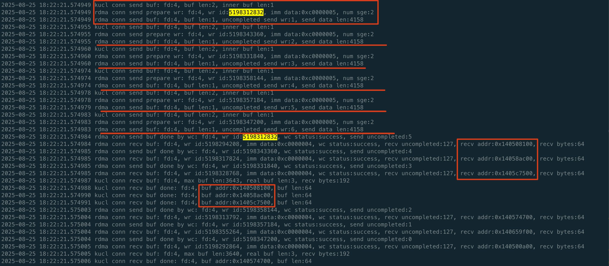

```table-of-contents
```
# 性能指标
## 时延
延迟是用户感受到的时间（比如，通过前端APP）。
### 时延分类
网络时延，简单来说，就是数据在网络上传输所需的时间。它可以细分为静态时延和动态时延。

#### 静态时延
静态时延，像是网络硬件的“天生”属性，包括互联（物理线路的时延）、转发和交换等过程，它相对稳定，主要由物理布局和设备性能决定。

**静态时延拆分**：
（1）物理线路的时延：一般来说1m的传输大概耗时是5ns。
（2）交换机转发时延（即中间节点每一跳转发的时延）：不考虑在交换机队列中缓存的时间，每经过一个交换机设备的时延是1us。
（3）端侧网卡转发时延：

#### 动态时延
动态时延则像是个“情绪化”的孩子，会随着网络负载、带宽利用率等因素波动，随时可能变化。
例如，通过UEC优化以太网，主要就是减少了这种“情绪化”的时延。

**动态时延 举例**：
（1）队列排队时延
（2）丢包重传时延
（3）程序 cache miss 或者加锁的时延。
（4）内核转发的时延。

### 端到端通信的时延拆分
#### 端侧时延
端侧的时延，分为：
（1）端侧程序的时延「动态时延」：比如程序 cache miss 或者加锁的时延
（2）端侧内核转发的时延「动态时延」：数据(报文)在内核中转发的时延。
（3）端侧网卡的排队的时延「动态时延」。
（4）端侧网卡转发的时延「静态时延」。

#### 物理线路的时延
通过数据线路进行转发，也有一定的时延「静态时延」；

==100km光纤的RTT是1ms，100m的RTT就是1us，1m的传输大概耗时是5ns==
交换机的转发时延约为0.8us（单向）。

.png)

此环境中服务器间物理网络RTT数据如下，单位为us

|   |   |   |   |   |   |
|---|---|---|---|---|---|
||RS24-1|RS24-2|D12-618|D12-619|D12-620|
|RS24-1|N/A|5|8|5|2|
|RS24-2|5|N/A|8|2|5|
|D12-618|8|8|N/A|8|8|
|D12-619|5|2|8|N/A|5|
|D12-620|2|5|8|5|N/A|

#### 中间节点的时延
中间节点的时延，分为：
（1）中间节点排队时延「动态时延」
（2）中间节点转发的时延「静态时延」

### 时延计算
- Server-Tor: 30m
- Tor-Leaf: 100m
- Leaf-SP：600m
- SP-SSP: 600m

- Pod内端到端：2*（30+100）= 260m


- Cluster内端到端：2*（30+100+600）= 1460m


- AZ内端到端：2*（30+100+600+600）= 2660m


#### 端到端通信时延
##### POD内
POD内：使用RDMA

| 覆盖范围 | 单向总时延(目标) | 单向交换机时延 | 单向物理链路时延 | 单向通讯库时延 | 单向两端网卡时延（ib_send_lat, 4k IO, 8 QP，25%带宽吞吐） |
|-----|-----|-----|-----|-----|-----|
| POD内<br>(使用RDMA) | 单向15us<br>(双向30us) | 3us（3跳） | 1.3us(260m) | 2us<br>(双向4us)| NV网卡3us，单向总时延：9.3us<br>HW网卡6.3us，单向总时延：12.6us |

##### Cluster或AZ内

Cluster或AZ内：使用用户态协议栈。
注：Cluster或AZ内没有使用RDMA，是因为跨POD，RDMA可能不是lossyless网络，在Lossy网络下，无有效的拥塞控制，RDMA性能退化严重。


| 覆盖范围 | 单向总时延(目标) | 单向交换机时延 | 单向物理链路时延 | 单向通讯库时延 | 单向两端网卡时延（用户态协议栈, 4k IO, 8 连接，25%带宽吞吐） |
|-----|-----|-----|-----|-----|-----|
| Cluster内<br>(使用libtpa用户态协议栈) | 暂定单向20us<br>(双向40us) | 5us（5跳） | 7.3us(1360m) | 2us<br>(双向4us)| NV网卡3us，单向总时延：17.3us<br>HW网卡6.3us，单向总时延：20.6us |
| AZ内<br>(使用libtpa用户态协议栈) | 暂定单向30us<br>(双向60us) | 7us（7跳） | 13.3us(2560m) | 2us<br>(双向4us)| NV网卡3us，单向总时延：15.3us<br>HW网卡6.3us，单向总时延：28.6us |

### 注意事项
用户使用RDMA通讯库中间件进行测试时 ，应该分为：
（1）网络层面的时延：即RDMA通讯库（通讯库软件，物理网络「比如：网线，中间的交换机」、 终端的RNIC网卡）
（2）业务逻辑层面的时延：

注：比如要区分这2个时延，否则很多业务使用RDMA通讯库中间件的时候，通过业务自己的测试程序的时候，发现时延很高。
==对于这种常见，需要RDMA通讯库中间件有自己的Trace功能，将通信库自身的关键函数、关键字段打印出来，同时打印出对应的时刻==。
这样可以在业务测试程序的时延较高时排除通讯库中间件自身的影响。

#### 网络层面时延的测试
测试网路层面的时延，那么就需要抛开业务的时延带来的干扰。

RDMA网络层面影响时延的因素：
（1）由于QP的数量过多会严重影响性能, 导致时延高；
（2）由于带宽的限制，也会导致发送的排队，这个也会影响性能。
比如：25G的Mellanox设备，没有进行网口bond的情况下，写4K的数据。
为了不排队，那么1us最多可以写多少的数据呢？
25Gbps/8 = 3G Bps。那么1us 就是 3K B的数据。那么如果写4K的数据，大概就是1.3us。
如果RDMA的client到Server的RTT是8us，那么8us/1.3us = 6；
也就意味着单机一次最多burst发送 6个4K的数据，才不会排队；更多的burst，就会导致排队。

测试：
```bash
测试一：
（1）背景流：建立占用多个QP，同时少占用带宽。
背景程序创建N个QP，每个连接发送少量的字节数。

（2）业务流：
只有一个连接，测试这样连接的时延是否收到背景流的QP的数量的影响。

注：RNIC是否也有类似于CPU那样，有PPS的限制，比如CPU那样有PPS的限制。比如：100G的RNIC网卡，每次发100B的数据，能否达到100G的限速；如果是1B的数据呢，是否可以达到100G的限速。

测试二：
提前建立500个QP，每个RPC请求，随机的选择1个QP，从微观上好像只会使用一个QP，宏观上每个QP都会被使用。
```

##### 常见的软件层面的时延测试工具
perftest 中的时延测试工具: 比如`ibv_write_lantency` 等等。
**这样的 工具中可以认为几乎没有任何的业务逻辑在其中。那么可以很好的反应  网络层面的时延 受到 QP数量「连接数」，以及 带宽「io_size 大小、线程数」等的影响**。


#### 范例



如上所示，是BS端的trace日志。
上面是client设置io-depth为1时，bs到某个cs的trace；下面是io-depth为6时，bs到这个cs的trace；
从trace的日志中，可以看到，io-depth为1时，单个rpc的时延为9us左右；io-depth为6时，单个rpc的时延为22us左右；主要是由于io-depth为多个时，在KRPC软件层面中可能存在等待「某个RPC接收响应之前穿插了其他的RPC请求的发送」。


由上，当client设置io-depth为N（N>1）时，那么对于某个RPC请求而言，就会在KRPC软件层存在由于发送其他RPC的请求带来的等待。这个等待时间也被计算到了RPC时延当中。
如果为了考量RDMA中间件KUCL的性能「如：时延、IOPS」以及QP数量增大带来的影响，那么就应该抛开KRPC软件层面的等待时延带来的影响，也就是意味着不可以设置IO-Depth大于1进行测试，这样测试的结果才可以近似的和RDMA测试工具Perftest进行粗略的对比。

## 吞吐
吞吐一般是单机或者整个集群的处理效率，比如可以容纳用户请求的数量。

### 时延和吞吐的关系
在某些场景下他们并不是强绑定的因果关系。
比如，集群中可以通过增加服务节点的数量，提升整个集群的吞吐能力。但是用户访问的时延，并不变。

## CPU使用率

## 抖动

## 丢包率

## 连接数

# 参考
```bash

```