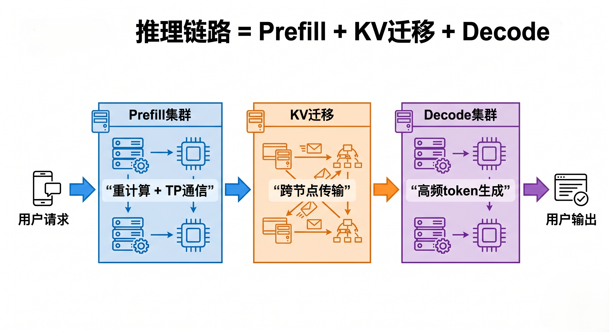
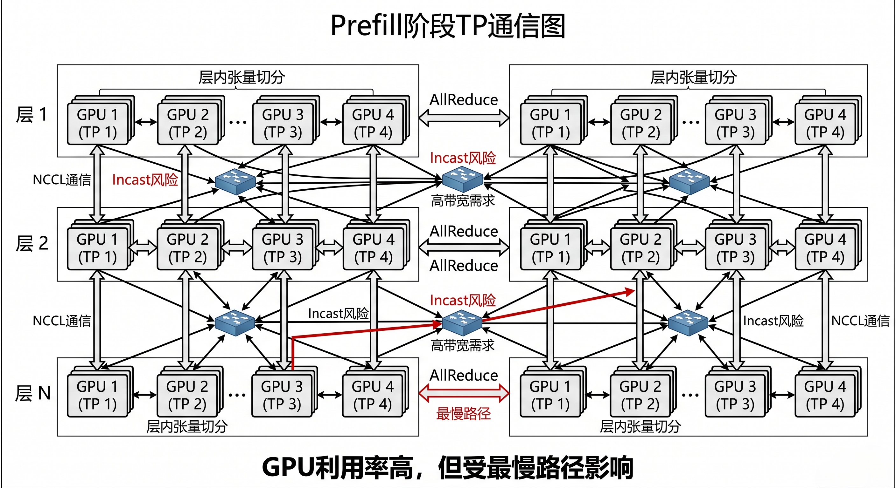
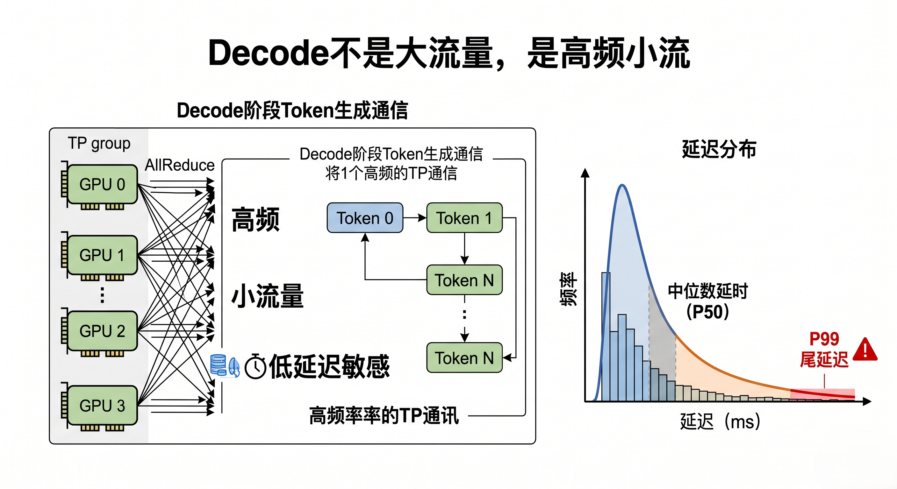
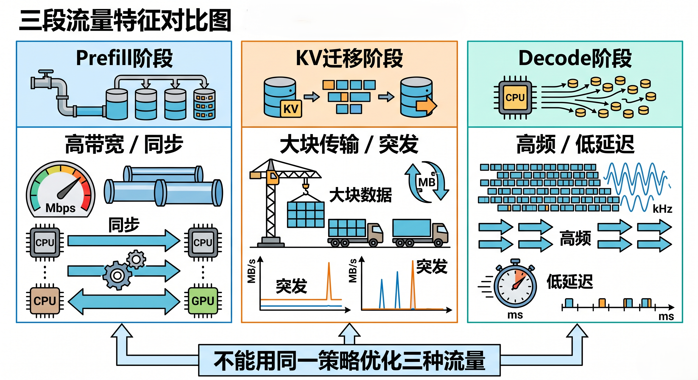
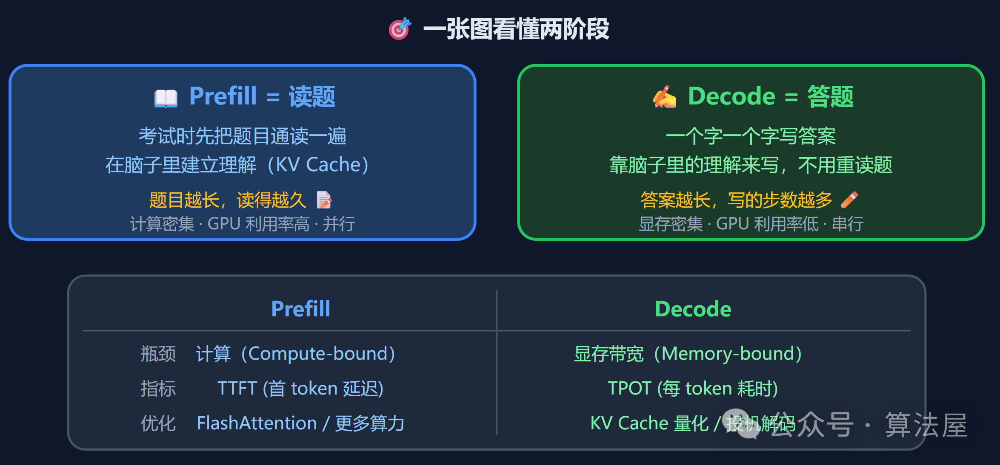
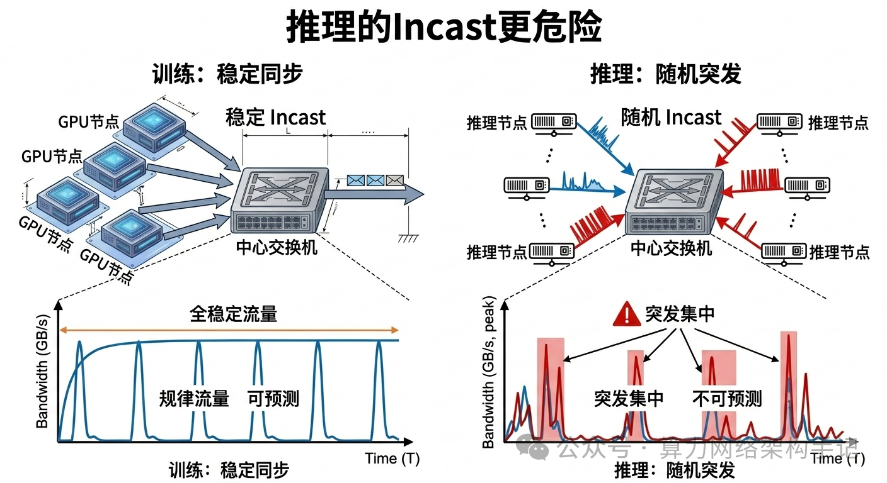

```table-of-contents
```
# 前言
你跟大模型聊天的时候，有没有注意到一个现象：**发完问题后，要等一小会儿才蹦出第一个字，但第一个字出来之后，后面的字就像开了水龙头一样哗哗地流出来。这不是网络延迟，也不是模型在"思考"——这背后其实是两个完全不同的计算阶段。**


# 推理的整体流程


## 输入与预处理


## embedding与位置信息


## transfrom 前向


## 解码决策


# 推理的两个阶段
当你采用 P/D 分离架构（Prefill / Decode 分离）之后：
- Prefill 在一组 GPU 上
- Decode 在另一组 GPU 上
- KV Cache 需要迁移
- TP（Tensor Parallel）还在参与通信

## P/D 分离后，推理链路从“单路径”变成“三段式”
在传统单机推理里，链路很简单： 输入 → 模型 → 输出

但在 P/D 分离之后，链路被拉长成：
**① Prefill 计算路径（重计算 + TP 通信）**
**② KV Cache 迁移路径（跨节点/跨 GPU）**
**③ Decode 路径（高频小步 + 低延迟敏感）**

这三段，每一段的“痛点”完全不同。
而很多性能问题，恰恰是因为：你只优化了其中一段。
所以第一件事必须明确：P/D 架构不是“更快”，而是“把问题拆开”。



## 第一阶段：Prefill（预填充）
Prefill 是干嘛的？一句话：**把输入 prompt 一次性“跑完一遍模型”。**
> 即：模型把你的问题从头到尾"看"一遍，把看到的东西记下来。

打个比方——你去餐厅点菜，服务员得先把你的菜单**从头到尾看完**，脑子里过一遍，才能去后厨下单。这个"看菜单"的过程就是 Prefill。


关键点：

1. **你发的 prompt 有多少 token，它就得处理多少**。1000 个 token 的 prompt，模型得一口气算完这 1000 个 token 的注意力关系。
    
2. 计算是**并行**的（GPU 擅长这个），但架不住量大。
    
3. 算完之后，把每个 token 的 Key 和 Value 向量缓存下来 → 这就是 **KV Cache**。
    

> **所以 prompt 越长，第一个字出来越慢**——因为 Prefill 要处理的 token 更多。

### 特点
特点是：
- token 多
- 计算重
- 类似训练中的 forward
- GPU 利用率通常很高

### 为什么 Prefill 一定会涉及 TP
因为模型大。
在实际部署中：70B / 100B 模型，单卡放不下，必须用 TP
也就是说：**同一层的计算，被拆到多张 GPU 上。**
于是，每一层都会发生：AllReduce、AllGather、ReduceScatter；这些都是 NCCL 集合通信。

### Prefill 的网络特征
不是小流量。  而是：**高带宽 + 同步通信**

也就是说：
- 类似训练
- 多卡同步
- Incast 风险存在
- ECN / DCQCN 很关键

### Prefill 阶段的注意事项



Prefill 阶段最容易出的问题，问题不是“算不动”。
而是：
- TP 通信不均衡
- 某些 GPU 慢
- AllReduce 被拖慢
- 跨 NUMA / 跨 NIC 不一致

最终表现为：**Prefill latency 偏高。**

## 第二阶段：KV Cache 迁移
Prefill 做完之后，会生成： **KV Cache**
它包含：每一层的 Key + 每一层的 Value

这个东西非常关键，因为：**Decode 阶段要反复用它。**

### KV 在哪里？

在 P/D 分离架构中：
- Prefill 在 A 集群
- Decode 在 B 集群

所以 KV 必须：**从 A 搬到 B**

### KV 迁移的本质是什么？

不是计算。  而是：**纯数据搬运。**

而且有几个特点：
- 数据量大（几十 MB 到几百 MB）
- 对延迟敏感（不能拖慢首 token）
- 突发性强（请求一来就要搬）

### 为什么 KV 迁移容易成为瓶颈？

因为它具备一个非常危险的组合： **大流量 + 突发 + 无法并行隐藏**

不像 Prefill，可以用 GPU 算力掩盖。  KV 迁移是纯网络时间。
一旦网络不行：
- 首 token 延迟直接上升
- 用户体验明显变差

### 典型问题表现
- Prefill 很快
- Decode 也不慢
- 但首 token 很慢

这时候大概率是：**KV 迁移卡住了。**


## 第三阶段：Decode（解码）

Decode 阶段和 Prefill 完全不同。
Prefill 是一次性计算。  Decode 是：一 token 一 token 生成。

**一句话概括：一个字一个字往外蹦，但每蹦一个字都很快，因为之前的活儿不用重做了。**

继续上面的比方——服务员已经把菜单记住了（KV Cache），现在开始一道一道上菜。每上一道菜，只需要想"根据之前记住的菜单，下一道该上啥"，不需要重新看一遍菜单。


每一步只需要：

1. 拿**上一步生成的 token** 作为输入
    
2. 和 **KV Cache** 里存好的历史信息做注意力计算
    
3. 把新 token 的 KV 也**追加**到 Cache 里
    
4. 输出下一个 token
    

因为每次只处理 **1 个 token**，所以速度飞快。


### Decode 的本质
每生成一个 token：
- 都要走一遍模型
- 都要用 KV Cache
- 都要同步

所以它的特点是：
- 高频
- 小批次
- 延迟敏感


### Decode 阶段是否有 TP 通信？

有。
因为模型仍然是 TP 切分的。
所以每个 token：
- 都要走 TP 的 AllReduce / AllGather

区别在于：**频率极高。**

### Decode 的网络特征

不是大流量。  而是：**高频小流量 + 极低延迟要求**

这会带来什么？
- buffer 不能太深
- ECN 不能太晚
- PFC 不能频繁
- tail latency 极其关键




### Decode 最典型问题

- 平均延迟 OK
- p99 很差
- 用户体验不稳定

本质原因：**同步通信中的尾延迟被放大。**

## 整体分析
### 三段结合起来看
我们把三段合起来：
（1）Prefill
- 重计算
- TP通信
- 高带宽

（2）KV迁移
- 大数据搬运
- 突发
- 延迟敏感

（3）Decode
- 高频
- 小流量
- 尾延迟敏感


你会发现一个关键点：**三段的“网络需求完全不同”。**

### 整体分析



1）这就是很多系统调不好的原因

因为很多人：
- 用一套网络策略
- 试图同时满足三种流量


结果就是：
- Prefill 不够快
- KV 迁移卡顿
- Decode 抖动

2）真正应该做的是：
**把三段当成三种不同流量类型。**
分别优化：
- Prefill → 带宽 + TP均衡
- KV迁移 → 带宽 + 路径直达
- Decode → 延迟 + 尾延迟控制

### 为什么 P/D 架构一旦规模上来，网络会成为核心瓶颈？
因为你把问题“拆开了”。拆开的结果是：
- 计算分离
- 数据迁移出现
- 通信路径变长

于是网络承担了：
- TP 通信
- KV 迁移
- Decode 同步

三种完全不同的压力。这时候网络不再是“辅助”。而变成：**决定推理系统上限的核心组件。**

### 小结



**Prefill 在拼带宽。**  
**KV 在拼路径。**  
**Decode 在拼延迟。**

而 TP / NCCL / ECN / DCQCN / buffer / 多轨，全部都是围绕这三件事服务的。
```bash
在 P/D 分离架构下，你迟早会看到：
- 真正的瓶颈，不在算。
- 在“数据怎么流”。
- 推理慢，不一定是算力不够。
- 更可能是，你没看懂数据是怎么流的。
```


# KV Cache 是什么

别被名字吓住，其实很简单。

Transformer 里的注意力机制需要三个东西：**Query、Key、Value**。

- **Query** = "我在找什么？"
    
- **Key** = "我这里有什么？"
    
- **Value** = "我这里的内容是什么。"
    

每个 token 过 Transformer 层的时候，都会产生自己的 K 和 V 向量。KV Cache 就是把**之前所有 token 的 K 和 V 存起来**，这样后面生成新 token 时，只需要算新 token 的 Q 和历史的 K 做匹配，而不用把前面的 token 重新过一遍网络。


**代价**：KV Cache 吃显存。模型越大、上下文越长，Cache 越大。这也是为什么长对话到后面会变慢或者 OOM 的原因之一。

## 理解
Prefill 是"理解你说了啥"，Decode 是"说出它想说的"。前者做一次但很重，后者做很多次但很轻。这就是为什么第一个字慢，后面的字快。


## KV Cache 跨节点迁移时，网络瓶颈到底出现在哪？

**KV Cache 跨节点迁移的瓶颈，通常不是“某一台交换机不够强”。**  
**而是“源端出不来、中间过不稳、目的端接不住”三者中的最慢段。**

更具体一点说，KV 迁移的瓶颈最常出现在 4 类位置：

**① 源端主机内部路径**

也就是：

- GPU 到 NIC 的路径
    
- PCIe / NUMA 亲和
    
- GPUDirect RDMA 是否真正走通
    

**② 源端 Leaf 上行汇聚**

也就是：

- 多个 P 节点同时完成 Prefill
    
- 同时向外发送大块 KV
    
- Leaf 上行口瞬间被打高
    


**③ 中间网络的跨 Leaf / 跨 Pod 路径**

也就是：

- Spine / Core 上的路径热点
    
- ECMP 不均
    
- 某些方向长期偏热
    

**④ 目的端的定向汇聚**

这是最容易被低估的部分。

因为很多时候，不是“很多 D 节点都在接 KV”。  
而是：

**很多 P 节点，同时把 KV 发向少数几个 D 副本 / TP 组。**

于是接收侧更容易形成 **定向 Incast**。

所以先别把问题想成： KV 在网络里传，瓶颈就在“网中间”。
更准确的理解应该是：**KV 迁移的瓶颈，本质上是“端到端数据路径上的最慢段 + 汇聚点”。**

### KV Cache 的完整迁移链路


### 第一类瓶颈：源端主机内部
一说“网络瓶颈”，就自动跳到交换机。 但在很多现场，问题根本还没走到交换机。

而是卡在：**P 侧 GPU → NIC 这段主机内部路径。**

1）为什么这里会卡？

因为 KV Cache 原本在 GPU 显存里。  要跨节点发出去，首先得从 GPU 这边搬到 NIC 能发出去的路径上。
这一步如果存在下面这些问题，性能会直接打折：

- GPU 和 NIC 跨 NUMA
- PCIe 路径不理想
- GPUDirect RDMA 没有真正生效
- 某些 NIC 实际路径更长
- 多张网卡性能不一致

于是你会看到一种很迷惑的现象：

- 网络好像没满
- 交换机看起来也不热
- 但 TTFT 很差
- 某些 KV 迁移总比别人慢

这时候，真正的根因可能是：**源端“出不来”。**

2）它会怎么表现？
- 同一台服务器，不同 GPU 对应的迁移速度不一样
- 某些轨道明显更慢
- 跨 NUMA 的路径延迟更高
- 多轨看似都在用，实际带宽叠不起来

如果你只盯交换机，通常会误诊。因为问题发生在网络之前。

3）一句话：**KV 迁移的第一道瓶颈，常常不是“网不通”，而是“主机内部路径不顺”。**


### 第二类瓶颈：源端 Leaf 上行

这是 KV 迁移里非常常见的第一个真正网络瓶颈。
原因并不复杂：在 P/D 分离架构下，很多请求会在一段时间内集中完成 Prefill。
一旦 Prefill 完成，它们就会开始：把 KV Cache 发出去。问题来了：
如果很多 P 节点挂在同一个 Leaf 下，  而它们又在相近时间窗口内同时发起 KV 迁移，  那 Leaf 会看到一种非常典型的现象：
**多个服务器下行口同时往少量上行口推大流量。** 这就是标准的汇聚。


1）为什么这里容易形成瓶颈？
因为 Leaf 的角色是“接入层汇聚”。服务器很多。  上行口有限。  
如果多个 P 节点一起推 KV，Leaf 上行口会非常容易出现：
- 队列升高
- ECN 标记增加
- PFC 风险上升
- 短时带宽挤压
    
也就是说：
**不是所有 KV 都在中间网络里才拥塞。**  
**很多拥塞在源端 Leaf 就已经开始了。**

2）这和训练有什么不同？

训练中的 collective 通信虽然也会形成 Incast。  但训练通常更“规律”。
KV 迁移不一样。它的特点是：
- 请求驱动
- 突发性强（不知道什么时候会产生请求，因此突发性强）
- 同步性差
- 很难完全预测
    
所以源端 Leaf 上行面对的，不是稳定大流。  而是：**一批一批突然冒出来的大流。** 这对队列控制更难。

3）一句话总结
**很多 KV 迁移问题，本质上是源端 Leaf 上行被突发汇聚打高。**


### 第三类瓶颈：中间网络
有人会天然把问题归因到 Spine / Core：
> 是不是骨干层带宽不够？  
> 是不是 Spine buffer 不够大？

这些当然值得看。  在 KV 迁移中，中间网络的瓶颈通常不是“全网带宽不够”。而是：**某些路径比其他路径更热。**
也就是：
- ECMP 不均
- 某些 Spine 口更热
- 某些方向成为热点
- 多个 P→D 流量对同一路径形成压强

1）为什么中间网络会出现热点？
因为 KV 迁移不是随机均匀的背景流量。  它是“有方向的”。
很多时候，流量模式不是：很多节点互相任意通信
而是：一批 P 节点向某些 D 副本 / TP 组 定向发送 KV；这就意味着，流量会在某些方向上更集中。
所以，即使网络是 Clos，  即使总带宽看起来够，  也依然会出现：局部路径热点。

2）这类问题怎么表现？
它通常表现得比较隐蔽：
- 平均带宽不高
- 但个别链路持续偏热
- 某些批次 TTFT 明显升高
- 迁移时间抖动大
- 不是所有请求都慢，而是“有时很慢”
这是典型的路径型瓶颈。

3）一句话总结：**中间网络最常见的问题，不是“总量不够”，而是“路径不均”。**


### 第四类瓶颈：目的端才是最容易被低估的地方
很多人会默认认为：KV 从 P 发出来，最危险的是源端和中间。其实不一定。在很多系统里，真正最容易形成严重汇聚的，恰恰是：目的端。

1）为什么目的端更容易形成定向 Incast？
因为 KV 不是发给“所有 D 卡”。  它通常是发给：**某个目标 Decode 副本 / TP 组。**
也就是说，很多 P 侧流量不是在全网均匀散开。  而是：
- 多个 P 源
- 指向少数几个 D 目标组

于是会发生什么？**多个发送端，同时把大块 KV 打向同一个 D 副本所在机架 / Leaf / 服务器。**
这就是典型的 **定向 Incast**。

2）目的端会卡在哪？
目的端最容易卡在三层：

第一层：目的端 Leaf 下行口；因为很多上游流量最后要汇聚到同一个接收方向。
第二层：D 侧 NIC；尤其当多个 KV 流同时进入同一台服务器。
第三层：D 侧 GPU 落地路径；如果接收后的落地、重组、映射不够顺，也会形成额外延迟。

3）为什么这个问题更难看出来？
因为从全网视角看，它不一定“总流量很大”。  但从目标 D 组视角看，它很可能是：**局部压力极大。**
所以你会看到：
- 某些 D 副本总是更忙
- 某些请求分到特定副本时更慢
- TTFT 呈现明显长尾
- 交换机总吞吐不大，但接收方向队列很高

这就是目的端定向汇聚的典型特征。

4）一句话总结：**KV 迁移里最容易被低估的瓶颈，不是“发不出去”，而是“目的端接不住”。**


### 为什么“平均带宽够了”不代表 KV 迁移就没问题？

很多人会看一眼监控，然后说：
- 网络平均利用率不高
- 400G 没跑满
- 交换机总体也不热

于是得出结论：网络不是瓶颈。
这个结论经常是错的。因为 KV 迁移真正怕的，从来不是“平均值”。
它更怕：
 **（1）短时突发**
也就是一小段时间内，流量突然冲上来。

 **（2）局部汇聚**
也就是不是全网热，而是某几个点突然很热。

**（3）尾延迟**
也就是不是大家都慢，而是少数请求特别慢。

换句话说：KV 迁移是典型的“平均值没那么有用”的场景。你真正要盯的是：
- 峰值
- 尖刺
- 局部端口热度
- 接收侧队列
- TTFT p99 / p999

因为用户不会因为“平均不错”就满意。  用户只会感知：为什么这次首 token 这么慢？


### 为什么 ECN / DCQCN 经常救不及时？
很多 KV 迁移问题，最后都会落到一个现象上：
- 队列先冲高
- ECN 才开始打标
- 发送端再慢慢降速
- 甚至来不及，PFC 就先触发了

为什么？因为 KV 迁移的流量形态很“突发”。它不像长期稳定的大流那样，  给控制系统足够时间去收敛。
而是：
- 突然来
- 很快堆
- 很快打高某个队列

于是会出现一个很现实的问题：拥塞反馈是“有”的，但反应速度未必跟得上。
尤其是在下面这些场景里更明显：
- 多个 P 节点同时完成 Prefill
- 多条 KV 流同时打向同一个 D 组
- 某些 Leaf / Spine / 接收端口形成短时热点

这时，ECN / DCQCN 面临的不是“长期平均控制”问题。  而是：能不能在尖峰把队列打爆前，足够快地压住它。所以你要记住：
**KV 迁移场景下，拥塞控制难点不是“有没有反馈”，而是“反馈够不够快”。**


### 如何判断KV迁移的瓶颈具体在哪里


KV Cache 跨节点迁移的网络瓶颈，最常见的不是“中间带宽不够”，而是“端到端链路上的最慢段 + 汇聚点”，尤其是源端上行和目的端定向 Incast。

因为它会直接改变你看问题的方式：
- 不再只盯交换机总带宽
- 不再只看平均值
- 不再把问题简单归因给“网络不够快”

而是开始真正看：
- 主机路径顺不顺
- 源端汇不汇聚
- 中间路径均不均
- 目的端接不接得住
- TTFT 是被哪一段拖慢的

这，才是 KV 迁移真正该看的地方。
```bash
- 源端能不能顺利发出。
- 中间能不能稳定通过。
- 目的端能不能接得住。
这三件事，缺一不可。
```

## KV Cache 到底谁生成、谁使用、谁迁移、谁更新、谁释放？
 **P/D 分离架构** 下，很多人会更懵：

> Prefill 卡算完 KV Cache。  
> Decode 卡拿到 KV Cache。  
> 那 Decode 卡只是读吗？  
> 它会不会更新 KV？  
> 新 token 的 KV 又是谁生成的？  
> 最后这堆 KV 谁来释放？

这篇文章，我们按一次真实的推理请求，把 KV Cache 的生命周期拆开：谁生成、谁使用、谁迁移、谁更新、谁释放。


### KV Cache 不是一次性数据，而是一个“会持续变长的上下文状态”

如果把 KV Cache 理解成： Prefill 生成一份 KV Cache，然后 Decode 一直读它。这句话说对了一部分，但不全面。
更完整的说法是：**Prefill 生成“历史 prompt 的 KV Cache”。Decode 使用这份 KV Cache，并且每生成一个新 token，都会追加这个新 token 对应的 KV。** 这就是最关键的一点。==KV Cache 不是一个静态文件，它更像一个会增长的上下文状态表==。

初始时：
- 用户输入 prompt
- Prefill 一次性计算整段 prompt
- 得到 prompt 中所有 token 的 KV Cache
  
然后进入 Decode：
- 第 1 个输出 token 生成时，要读历史 KV
- 同时生成这个新 token 自己的 KV
- 新 KV 追加进 KV Cache
- 第 2 个输出 token 再读“更长的历史 KV”
- 再追加自己的 KV


所以：**KV Cache 不是只在 Prefill 生成一次。Prefill 生成第一批，Decode 每一步继续追加。**


### KV Cache 不是 token，是注意力计算留下来的中间状态

把 KV Cache 理解成：把历史 token 存起来。这也不完全准确。
历史 token 当然重要。  但 KV Cache 不是简单存“我今天去了北京”这几个字。
它存的是：**模型在每一层 attention 里，为历史 token 计算出来的 Key 和 Value 向量。**

为什么要存？因为 Decode 阶段每生成一个新 token，都要回看历史上下文。
如果不存 KV Cache，每生成一个新 token，就要把前面所有历史 token 重新算一遍。那会非常慢。
有了 KV Cache 后，模型就不需要反复计算历史 token 的 K/V。它只需要：
- 为当前新 token 计算新的 Query
- 用当前 Query 去和历史 Key 做 attention
- 再读取历史 Value
- 最后得到当前 token 的输出

所以 KV Cache 的意义是：**把历史上下文中已经算过的注意力中间结果缓存下来，避免 Decode 阶段重复计算。**
也就是：**KV Cache 不是历史文本。**它是历史 token 在每一层 attention 中留下来的 Key / Value 状态。**
这就是为什么 KV Cache 对推理非常关键。它不是普通缓存。它直接决定：
- Decode 能不能快
- 显存占用有多大
- 长上下文能不能撑住
- 多用户并发时系统会不会爆
- P/D 分离时网络要不要搬大量状态


### 谁生成 KV Cache？
KV Cache 到底谁生成？答案分两段。

#### 第一段：Prefill 生成初始 KV Cache

用户输入一段 prompt，比如：“请解释一下 RoCE 网络里的 PFC 和 ECN 有什么区别。”
这段输入可能有几十、几百、几千甚至上万 token。Prefill 阶段会把这些 token 一次性送进模型。
在每一层 attention 里，每个 token 都会产生自己的：Key 和 Value；这些 K/V 被保存下来，就形成了初始 KV Cache。

所以：**Prompt 对应的 KV Cache，是 Prefill 生成的。**
这部分通常是“大块生成”。为 prompt token 可能很多，Prefill 一次性处理整段上下文。

#### 第二段：Decode 每生成一个 token，也会生成这个 token 的 KV
进入 Decode 后，模型开始一个 token 一个 token 往外吐。
比如生成：
- 第 1 个输出 token：A
- 第 2 个输出 token：B
- 第 3 个输出 token：C

每生成一个新 token，这个新 token 在每一层里同样会产生自己的 K/V。这些 K/V 也要追加到 KV Cache 中。否则下一步 Decode 就看不到刚生成的 token。这一步非常关键。

很多人误以为： Decode 只是用 KV，不生成 KV。这是不对的 。Decode 当然要用历史 KV。  但它同时还会给当前新 token 生成新的 K/V，并追加进去。

#### 小结

更准确的说法是：**Prefill 生成 prompt 的 KV。Decode 生成输出 token 的 KV。**


### 谁使用 KV Cache？
谁使用 KV Cache？这个问题也要分场景讲。

#### Decode 是最典型、最核心的使用者
KV Cache 最重要的价值，体现在 Decode 阶段。因为 Decode 每一步都要回看历史上下文。
比如生成第 10 个输出 token 时，模型要参考：用户 prompt 的所有 token, 以及前面已经生成的 9 个 token

这些历史内容对应的 K/V，都在 KV Cache 里。所以 Decode 每一步都会读 KV Cache。
它要读：历史 Key + 历史 Value，然后结合当前 token 的 Query，算出当前输出。

所以你可以这么理解：**Decode 每一步都在消费历史 KV Cache。**
但是注意：它不是“消费掉就没了”，而是读取、复用。

#### Prefill 阶段也会形成层内 attention 关系，但核心价值是“构建缓存”
Prefill 阶段处理的是整段 prompt。它在计算时当然也会进行 attention。  
但从 KV Cache 生命周期角度看，Prefill 最重要的角色是：一次性把 prompt 对应的 K/V 算出来并保存。

  
#### 小结

所以在讲“谁使用 KV Cache”时，可以简单说：
- Prefill 主要是生成初始 KV Cache
- Decode 主要是使用并追加 KV Cache

> **KV Cache 的核心使用者是 Decode。Decode 不是把 KV 用掉，而是在每一步读取历史 KV，并追加新的 KV。**


### 谁更新 KV Cache？

很多人听到“更新”，会误以为：“D 卡会修改原来的 KV，历史 KV 会被重写，KV Cache 会被重新计算。” 一般不是这样。
更准确地讲：**Decode 对 KV Cache 的更新，主要是追加新 token 的 KV，而不是改写历史 KV。**

#### 为什么不是改写历史 KV？

因为历史 token 的 K/V 已经算好了。例如 prompt 里的 token：
- “今天”
- “北京”
- “天气”

它们对应的 K/V 一旦生成，在同一次请求里通常不会变。后面每生成一个新 token，只是在历史后面增加新的 token。
所以 KV Cache 的增长方式更像：
- 初始：prompt KV
- 第一步：prompt KV + token1 KV
- 第二步：prompt KV + token1 KV + token2 KV
- 第三步：prompt KV + token1 KV + token2 KV + token3 KV

它不是：每一步都把前面全部 KV 改一遍。

**那为什么有人说 D 卡更新 KV？**
这里的“更新”容易产生歧义。如果“更新”指的是：在 KV Cache 后面追加当前新 token 的 K/V。那是对的。
如果“更新”指的是：修改 Prefill 生成的历史 KV。一般不这么理解。

所以更严谨的说法是：**Decode 阶段会维护 KV Cache 的增长。** 或者 **Decode 阶段会追加新 token 的 KV。** 
这比“更新 KV”更准确。

#### P/D 分离架构下，D 卡到底是不是只读？
不是。
D 卡对 Prefill 迁移过来的 prompt KV 来说，主要是读。  但对后续自己生成的新 token 来说，D 卡还要继续写入新增 KV。
所以一句话：**D 卡既读历史 KV，也写新增 KV。只不过它通常不改写已有历史 KV**。

#### 小结
Decode 所谓“更新 KV”，本质上是追加新 token 的 KV。D 卡不是只读，它会持续维护当前请求的 KV Cache 增长。


### P/D 分离下：P 卡生成什么？D 卡接收什么？D 卡继续做什么？

P/D 分离指的是：
- Prefill 放在 P 资源池
- Decode 放在 D 资源池
- 两类 GPU 负责不同阶段


这时候 KV Cache 的生命周期变成：
1. P 卡执行 Prefill
2. P 卡生成 prompt 对应的初始 KV Cache
3. 这份 KV Cache 迁移到 D 卡所在的 Decode 副本 / TP 组
4. D 卡读取这份历史 KV
5. D 卡每生成一个新 token，就追加新的 KV
6. 请求结束后，D 卡释放该请求的 KV Cache

#### P 卡生成什么？
P 卡生成的是：输入 prompt 对应的 KV Cache。也就是用户输入上下文的那一部分。

P 卡的特点是：
- 一次性处理长 prompt
- 计算量大
- TP 通信可能比较重
- 生成一大块初始 KV

#### D 卡接收什么？

D 卡接收的是：P 卡生成的初始 KV Cache。这一步就是 KV 迁移。
如果 P 和 D 不在同一个节点，这就会变成跨节点网络传输。
这也是 P/D 分离架构里非常关键的一条数据路径。

#### D 卡继续做什么？

D 卡做 Decode。也就是：
- 读取 prompt KV
- 生成第一个输出 token
- 追加这个输出 token 的 KV
- 再读取更长的 KV
- 再生成下一个 token
- 持续循环

所以 D 卡不是简单“消费 KV”。它是在接收初始 KV 后，继续维护后续生成过程中的 KV Cache。

#### 小结

**P 卡生成 prompt KV。D 卡接收 prompt KV，读取它，并在 Decode 过程中继续追加新 token KV。**


### 谁释放 KV Cache？

谁释放 KV Cache？
答案不是某一张 GPU 自己“想释放就释放”。

在工程系统里，KV Cache 的释放通常由：
- 推理引擎
- Runtime
- KV Cache Manager
- Scheduler
- Memory Manager

共同管理。

#### 什么时候释放？

一般在请求结束时释放。请求结束包括：
- 生成到 EOS
- 达到最大输出长度
- 用户取消
- 超时
- 调度系统中止请求
- 会话被清理

只要这个请求不再需要继续 Decode，它对应的 KV Cache 就可以被回收。

#### 为什么不能提前释放？

因为 Decode 后续 token 仍然要依赖历史 KV。

如果提前释放，就会出现：
- 后续 token 无法继续生成
- 需要重新 Prefill
- 或直接请求失败

所以 KV Cache 的生命周期必须至少覆盖：从 Prefill 完成，到 Decode 结束。

#### 为什么释放这件事很重要？

因为 KV Cache 很占显存。尤其在长上下文、多用户并发、长输出场景里，KV Cache 可能成为显存里最紧张的资源之一。

释放不及时，会导致：
- 显存碎片
- 可服务并发下降
- 新请求排队
- OOM
- 系统吞吐下降

所以 KV Cache 管理不是小事。它直接影响推理系统的并发能力。

#### 小结

**KV Cache 的释放，不是模型计算逻辑的一部分。它是推理系统资源管理的一部分。**


### 为什么 KV Cache 在多 GPU / TP 场景下更不容易懂？

因为在 TP 场景下，KV Cache 不是一整块放在一张卡上。大模型推理常常会用 TP。

这意味着：
- 权重被切到多个 GPU
- attention 计算被切到多个 GPU
- KV Cache 也往往按层、按 head、按张量维度分布在多个 GPU 上

所以 KV Cache 的归属不是：一份完整 KV 在某张 D 卡上。而更像：一个请求的 KV Cache 分片，分布在一个 Decode TP 组的多张 GPU 上。

这也是为什么在 P/D 分离架构里，不能简单说： KV 发给某一张 D 卡。
更准确的说法是：**KV 发给某个 Decode 副本 / TP 组。** 然后在这个 TP 组内部，各 GPU 持有自己负责的 KV 分片。

#### 这会影响谁生成？

如果 Prefill 也是 TP 组执行的，  那 prompt KV 也会在 P 侧 TP 组内分片生成。

#### 这会影响谁使用？

Decode 侧 TP 组要用对应分片。  如果分片布局不匹配，就可能需要重排或跨 GPU 通信。

#### 这会影响谁更新？

Decode 每一步追加的新 KV，也是在 TP 组内按分片追加。

#### 这会影响网络吗？

当然会。因为 P 侧 TP 组到 D 侧 TP 组的 KV 迁移，可能不是一条流。  
而是多张 GPU / 多张 NIC / 多条 rail 之间的数据搬运。

一旦调度或路径不合理，就会出现：
- KV 迁移热点
- D 侧定向 Incast
- 某些 rail 过热
- TTFT 抖动

#### 小结

 **TP 场景下，KV Cache 的单位不是“某张卡的一整块数据”。更准确的单位是“某个请求在一个 TP 组内分布式保存的一组 KV 分片”。**


### KV Cache 生命周期

|阶段|谁在做|对 KV Cache 的动作|关键点|
|---|---|---|---|
|Prefill|P 卡 / Prefill TP 组|生成 prompt KV|一次性生成初始上下文 KV|
|KV 迁移|P → D|传输 prompt KV|跨节点时会成为网络瓶颈|
|Decode 第一步|D 卡 / Decode TP 组|读取 prompt KV，生成 token1 KV|读历史，写新增|
|Decode 第 N 步|D 卡 / Decode TP 组|读取历史全部 KV，追加 tokenN KV|KV 持续增长|
|请求结束|Runtime / KV 管理器|释放该请求 KV|释放不及时影响并发|

  
这张表里最重要的是两句话：**P 卡不是生成全部 KV 后就结束整个生命周期。D 卡不是只读，它会在 Decode 阶段持续追加新的 KV。**


### 问题总结

（1）谁生成？
Prefill 生成 prompt 的初始 KV。Decode 每生成一个新 token，也生成这个 token 对应的新 KV。

（2）谁使用？
Decode 是 KV Cache 的核心使用者。它每一步都读取历史 KV 来生成下一个 token。

（3）谁更新？
Decode 会“追加”新 token 的 KV。严格说，这通常不是改写历史 KV，而是在 KV Cache 后面继续增长。

（4）谁释放？
请求结束后，由推理运行时 / KV Cache 管理器释放。释放太早会中断请求，释放太晚会浪费显存并降低并发。

（5）P/D 分离下怎么理解
P 卡负责生成初始上下文 KV。D 卡负责接收、读取，并在逐 token Decode 中继续追加新 KV。

（6）KV Cache 是什么？
```bash
KV Cache 不是：
  - 一块普通缓存
  - 一份固定文件
  - 一次性生成完的数据
  - D 卡只读的静态对象

更准确地说，它是：一个请求在推理过程中持续增长、被反复读取、最终被释放的上下文状态。
```

（7）KV Cache 的生命周期：
```bash
一旦你用“生命周期”来看它，很多问题就清楚了：
  - Prefill 负责生成初始 KV
  - Decode 负责使用并追加 KV
  - TP 组负责分布式保存 KV 分片
  - Runtime 负责管理和释放 KV
  - 网络负责在 P/D 分离时搬迁 KV
  - 调度负责决定 KV 应该归属哪个 Decode 副本
```


# 训练和推理

## 训练是“持续洪水”，推理是“随机爆发”
有这么一句话：

> **训练流量是可预测的。**  
> **推理流量是不可预测的。**


（1）训练像什么？

**稳定的洪水。**

- 每一步都有 AllReduce
    
- 每个 GPU 同步发流
    
- 节奏固定
    
- 流量模式一致


（2）推理像什么？

**随机爆发。**

- 请求什么时候来，不知道
    
- Prefill 什么时候触发，不知道
    
- KV 什么时候迁移，不知道
    
- Decode 什么时候同步，不知道

这就是本质差异：

**训练 = 同步 + 可控**  
**推理 = 异步 + 不可控**


### 训练为什么更容易控制？

训练为什么更容易控制？因为它是“同步系统”

训练网络的核心，是 AllReduce。
这意味着：

- 所有 GPU 同时发
    
- 所有 GPU 同时收
    
- 每一步节奏一致
    

1）这带来什么好处？

**流量高度可预测。**

你可以预判：

- 每秒多少数据
    
- 每轮多少通信
    
- 哪些节点参与

2）网络可以“提前准备”

因为模式固定：

- buffer 可以提前配置
    
- ECN 门限可以调优
    
- DCQCN 可以收敛
    
- 拥塞分布是稳定的
    
3）即使有 Incast，也是“稳定的 Incast”

也就是说：

- 每轮都这样
    
- 网络可以适应
    
- 控制算法可以收敛
    
4）所以，**训练的可控性，来自“重复”。**


### 推理为什么难以控制？

推理为什么难以控制？因为它是“异步叠加系统”。
推理系统不是一个流。而是很多流叠加。

1）多个请求同时存在

- 用户 A 请求
    
- 用户 B 请求
    
- 用户 C 请求
    

每个请求：

- 长度不同
    
- 时间不同
    
- 路径不同
    

2）Prefill 是突发源头

Prefill 特点：

- 一次性计算
    
- 大量 token
    
- 需要 TP 通信

当多个 Prefill 同时触发，**就是多源 Incast。**

3）KV 迁移是第二波冲击

- Prefill 结束
- KV 必须迁移
- 大块数据突发发送

如果多个请求同时迁移，网络瞬间被打满。

4）Decode 是高频小流

- 高频
- 小包
- 延迟敏感

这些流量虽然不大，但会叠加在大流上。

5）所以，推理流量不是一个模式，而是**多种模式叠加 + 时间错位 + 随机触发**


### 推理中的“随机 Incast”
Incast 在训练中已经很危险。但在推理中，更可怕。

1）训练 Incast

- 固定参与者
    
- 固定时间
    
- 固定规模
    

网络可以适应。

2）推理 Incast

- 随机参与者
    
- 随机时间
    
- 随机规模
    

你无法预判：

- 哪些 GPU 同时发
    
- 发多少
    
- 持续多久
    
3）结果是什么？

**buffer 来不及响应。**

- 队列瞬间打高
    
- ECN 标记滞后
    
- DCQCN 来不及降速
    
- PFC 被迫触发
    

4）结论：**推理 Incast 的问题，不是强度，而是不可预测性。**


### 为什么 ECN / DCQCN 在推理中更容易“失效”？

因为ECN / DCQCN依赖：时间。

1）ECN 的工作方式

- 队列升高
    
- 达到门限
    
- 标记 ECN
    
- 发送端降速
    

2）问题在于：

推理的突发太快。

- 队列还没来得及积累
    
- 突发已经结束
    
- 或已经打爆
    
结果是：**ECN 来不及打标。**

3）DCQCN 更慢

DCQCN 是反馈控制：

- 收到 ECN
    
- 调整速率
    
- 慢慢收敛
    

但推理流量：来得快，去得也快

结果：**控制还没生效，流量已经结束。**

4）结论就是：**推理场景中，拥塞控制往往“反应滞后”。**


### 为什么推理更容易触发 PFC？

因为它更容易“越过 ECN”。


1）正常路径应该是：

队列上升 → ECN → DCQCN降速 → 稳定


2）推理中的实际路径：

突发 → 队列瞬间爆 → ECN未及时触发 → 直接PFC

3）PFC 的问题

- 会暂停整个优先级流量
    
- 影响多个流
    
- 可能扩散
    
4）简单来说，就是：**推理更容易进入“PFC兜底模式”。**


### 推理系统缺少“节奏控制”


1）训练系统有：

- step
    
- batch
    
- iteration
    

这些都是：**天然节奏控制器。**

  

2）推理系统是：

- 请求随时来
    
- Prefill随时触发
    
- KV随时迁移

结果是什么？网络没有“呼吸节奏”。变成：持续被随机打击。

3）所以，**推理的难点，不是流量，而是没有节奏。**


### 小结
为什么推理场景下网络更难控制？
不是因为，流量更大；而是因为：流量更“乱”，更加难以预测。

**训练难在规模。**  
**推理难在不确定性。**

```bash
如果你在调推理网络，记住：你面对的不是：一个稳定系统而是：一个随时可能爆发的系统。
所以优化方向不是：单点带宽而是：
- 突发控制
- 流量调度
- 路径稳定
- 尾延迟
```

# 参考
```bash
# 为什么推理场景下网络“突发带宽”比训练更难控制？
https://mp.weixin.qq.com/s/JgvRTnW3XAsPlFnQ9yDYJg

# KV Cache 跨节点迁移时，网络瓶颈出现在哪？
https://mp.weixin.qq.com/s/OR1nyYM3QyrtifaUPLstsw
```