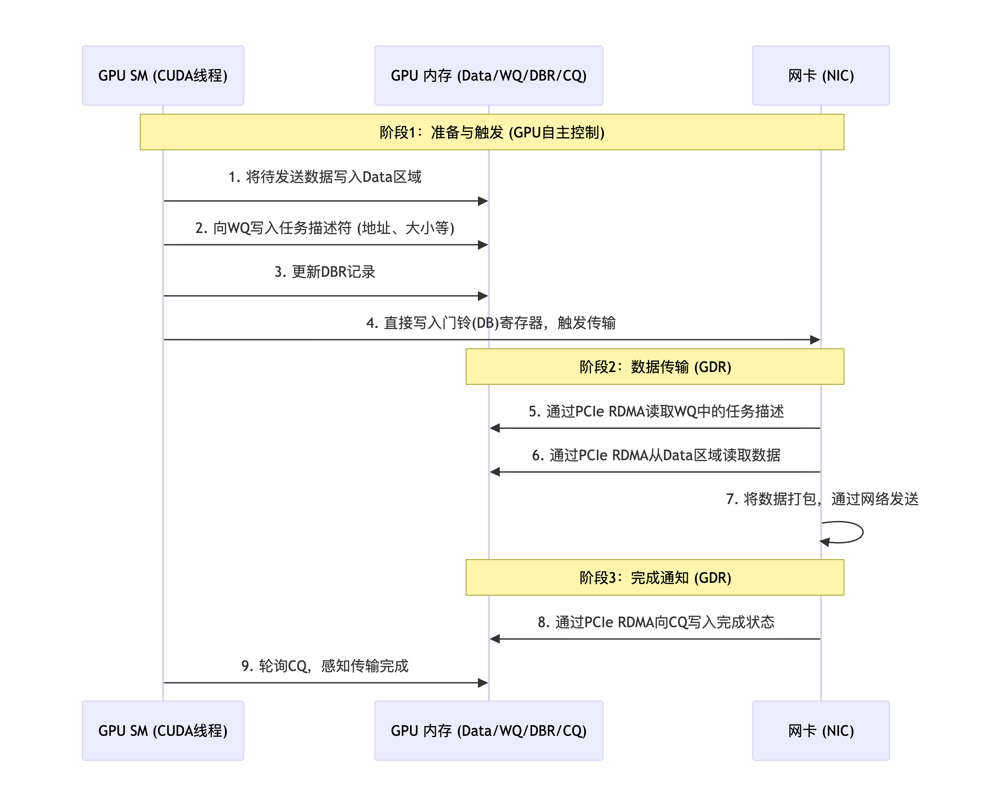

```table-of-contents
```

# 基础知识

## GPU VRAM（GPU显存：device memory）
VRAM = Video Random Access Memory（视频随机存取存储器）
VRAM 是 GPU 专用的内存（显存），类似于 CPU 使用的 DRAM（主机内存）。

## PCIe
### PCIe BAR

BAR（Base Address Register）：每个 PCIe 设备（GPU / NIC）都有若干个 BAR（基地址寄存器）。 

**BAR = 设备暴露给系统的一段“可被访问的地址空间”**
可以理解为：
```bash
设备内部内存 / 寄存器 → 映射到 PCIe 地址空间 → CPU / 其他设备可以访问
```

### PCIe P2P
PCIe Peer-to-Peer（P2P）：**PCIe设备之间直接通信，不经过 CPU/主机内存**。

#### 没有 P2P（传统路径） Vs  有 P2P（GDR）
（1）没有 P2P（传统路径）
```bash
NIC → Host Memory → GPU
```
 需要中转（staging buffer）, 多一次内存拷贝

（2）有 P2P（GDR）
```bash
NIC → GPU VRAM（直接）
```
无 CPU 参与，无 memcpy


### GPU/NIC/NVMe 通过PCIe插槽接入系统

### 主机内存(host memory) 如何接入系统
**主机内存（DRAM）和 HBM 都不是通过 PCIe 插槽接入的设备**，它们和 PCIe 设备（GPU「计算」 / NIC「网络」 / NVMe「存储」）属于完全不同的连接体系。

==主机内存（DRAM）插在主板的 **DIMM 插槽**（内存条）。DRAM 是直接挂在 CPU 内存控制器上的，不走 PCIe==
```bash
CPU（内存控制器 IMC）
        ↓
内存总线（DDR4 / DDR5）
        ↓
DRAM（主机内存）
```

#### 和 PCIe的区别

|项目|DRAM|PCIe 设备|
|---|---|---|
|插槽|DIMM|PCIe slot|
|控制器|CPU 内存控制器|PCIe Root Complex|
|协议|DDR|PCIe|
|延迟|低|高|

### HBM如何接入系统
HBM = High Bandwidth Memory（高带宽内存），其连接方式和 DRAM 完全不同。
HBM 是： **直接封装在 GPU / CPU 芯片旁边（甚至同一封装内）**；==HBM 和 GPU 是“贴在一起”的，而不是插在主板上==。

```bash
GPU die
   │
   ├── HBM stack（通过 TSV / interposer）
```

#### 和 PCIe的区别

DRAM（主机内存）：`CPU ↔ DRAM`, 不走PCIe, 走的内存总线；
HBM（GPU 内存）：`GPU ↔ HBM`, 更不走 PCIe（甚至不出封装）;
PCIe 设备：`CPU ↔ PCIe Root Complex ↔ NIC / GPU`; 

|类型|是否走 PCIe|连接方式|
|---|---|---|
|DRAM|❌|CPU 内存控制器（DIMM）|
|HBM|❌|芯片封装内部（interposer）|
|GPU/NIC|✔|PCIe 插槽|


# GPUDirect
GPUDirect 是 NVIDIA 开发的一系列技术的统称，旨在优化 GPU 与其他设备（如网络接口卡 NIC、存储设备 、主机内存 等）之间的数据传输，减少 CPU 参与，降低延迟和开销，提升性能；


## GPUDirect演进历史
### GPUDirect v1 (2010) - Shared Pinned Memory

- **说明**：早期通过共享主机内存实现GPU与第三方设备通信的技术，功能已被GDR、P2P等整合或替代，现较少单独提及。

### GPUDirect v2 (2011) - Peer-to-Peer (P2P)

- **功能**：支持同一PCIe总线上的GPU之间直接通信，绕过CPU和系统内存，提升GPU间数据传输效率。
- **技术突破**：消除GPU间通信的CPU中转开销。
- **应用场景**：多GPU协作计算（如深度学习模型并行、多GPU渲染）。

### GPUDirect RDMA（GDR） (2013)

- **功能**：允许RDMA设备（如InfiniBand网卡）直接访问GPU显存，无需通过主机内存中转，实现零拷贝数据传输。
- **技术突破**：解决数据路径问题，显著降低多机多卡通信延迟。
- **应用场景**：分布式AI训练、科学计算中的跨节点GPU通信（如MPI+GPU场景）。
- 
### GPUDirect Storage (2020)

- **功能**：允许存储设备（如NVMe SSD）与GPU显存直接通信，绕过CPU和系统内存，减少数据拷贝和延迟。
- **技术突破**：实现存储到GPU的零拷贝传输，降低I/O瓶颈。
- **应用场景**：高性能计算（HPC）、AI训练中大规模数据加载（如训练数据预取）。

### GPUDirect Async (2021+)

- **功能**：在GDR基础上进一步优化控制路径，允许GPU自主管理RDMA通信（如配置发送队列、触发传输），完全卸载CPU控制逻辑。
- **技术突破**：解决控制路径延迟问题，实现计算与通信的完全重叠。
- **应用场景**：超低延迟分布式训练、高频交易等对时延敏感的场景。

## 技术演进与关系
### 从数据路径到控制路径的优化

GDR与GDA是网络通信方向的连续创新，GDR解决数据路径问题，GDA进一步解决控制路径问题，两者结合可实现GPU与网络设备的最低延迟通信（如端到端延迟<1μs）。

- **GDR**：解决数据路径问题，实现RDMA设备与GPU显存的直接通信。
- **GDA**：在GDR基础上优化控制路径，将通信控制逻辑从CPU卸载到GPU，进一步降低延迟。


# GPUDirect RDMA
## 背景
### 没有GDR时
(1) 在传统的多节点或多设备通信架构中，当 GPU 需要将数据发送到网络（例如通过 InfiniBand 或 RoCE 网卡）时，典型流程如下：
- `GPU → 主机内存（CPU 内存）`：通过 PCIe 总线拷贝数据。
- `主机内存 → 网卡`：由 CPU 或 DMA 引擎将数据从内存传送到网卡（经过PCIe）。
- `网卡 → 远程节点`：通过高速网络发送。

```bash
GPU 显存 → (cudaMemcpy D2H) → CPU 内存(staging buffer)
         → RDMA NIC → 网络 → RDMA NIC
         → CPU 内存(staging buffer) → (cudaMemcpy H2D) → GPU 显存

H2D: host to device， 即主机内存到GPU显存
D2H: device to host, 即 GPU显存到主机内存
```

(2) 这种“绕道”方式存在以下问题：

|问题|影响|
|---|---|
|PCIe 带宽浪费|GPU↔主机内存 一次，主机内存↔NIC 一次，数据经过 PCIe 总线两次|
|高延迟|两次内存拷贝（`GPU→Host`，`Host→NIC`）。cudaMemcpy 引入毫秒级延迟（大块数据更明显）|
|内存占用|需要在 CPU 侧维护 staging buffer，内存压力增大|
|CPU 参与开销|CPU 必须参与每次数据搬运，占用 CPU 资源|


## 基本概念
### BAR（Base Address Register）

==PCIe 设备通过 BAR 向PCIe总线上的其他设备暴露自己的地址空间==。

比如：GPU 显存通过 **PCIe BAR（Base Address Register）** 对外暴露一块可被其他 PCIe 设备/CPU 直接访问的地址窗口。
```bash
GPU 显存 → 通过 BAR1 映射为 PCIe 物理地址 → 网卡 DMA 引擎直接读写
```

**两个 PCIe 设备（GPU + 网卡）在同一 PCIe 根复合体（RC: Root Complex）下**时，网卡的 DMA 引擎可以直接向 GPU 的 BAR 地址发起 read/write，就像访问普通内存一样。
 

GPU 有多个 BAR：

|BAR|大小|内容|
|---|---|---|
|BAR0|16 MB|GPU 控制寄存器（MMIO）|
|BAR1|最大 256 MB|**VRAM 全量映射**（Resizable BAR / Smart Access Memory 开启后）|
|BAR3|通常 32 MB|扩展寄存器|

BAR1 是核心：它把 GPU 的物理 VRAM 地址映射到 CPU 的物理地址空间（PA），让 PCIe fabric 上的任意 master（CPU、NIC）都能通过 PCIe 事务访问 GPU 内存。

**没有 Resizable BAR 时**，BAR1 只有 256 MB，CPU/NIC 只能访问 VRAM 的一个 256 MB 滑动窗口，GPUDirect RDMA 的地址注册受此限制。

**GPU 显存通过 PCIe 的 BAR1（Base Address Register） 暴露到 PCIe 地址空间**。RDMA NIC 通过 **PCIe Peer-to-Peer DMA** 能力，可直接读写 GPU 的 BAR1 空间，而不经过 CPU RAM。

```bash
+------------------+    PCIe Bus     +------------------+
|  GPU             |<--------------->|  RDMA NIC(mlx5)  |
|  HBM/GDDR        |                 |                  |
|                  | BAR1 暴露到 PCIe|                  |
+------------------+                 +------------------+
        ↑                                    ↑
        |          PCIe Root Complex          |
        +------------------------------------+
                          |
                      CPU / RAM
```


==对 PCIe 设备来说，只要目标地址处于另一个设备暴露出来的 BAR 空间，读写方式与访问系统内存类似==。 

NVIDIA 文档明确指出，`GPUDirect RDMA` 依赖“从各 PCIe 设备视角看，物理地址保持一致”，并利用 GPU 的 BAR 窗口把一部分显存暴露给对端设备访问。

这意味着 GPUDirect 不是“网卡直接理解 CUDA 内存”，而是分成两层：
(1) 用户态通信库识别一个指针属于 CPU 还是 GPU 地址空间。
(2) 内核态通过 NVIDIA 驱动提供的 `nvidia_p2p_get_pages()` 等接口，把 GPU 页 pin 住，并把对应 BAR 映射交给第三方设备 DMA 使用。

### IOMMU
#### RDMA主机内存(PCIe设备访问主机内存)的地址路径

正常 DMA（主机内存）： `NIC → IOVA → [IOMMU翻译] → PA → DRAM` 。 IOMMU管理这张映射表

```bash
RNIC 发起 DMA：
    DMA addr (IOVA)
        ↓
    IOMMU（可能转换）
        ↓
    Host Physical Address
```
如上：
（1）NIC DMA 看到的是 IOVA地址： ==设备（NIC）使用 IOVA（I/O Virtual Address）发起 DMA==
（2）RNIC 只关心“最终能访问到内存”：IOMMU 查 **IOMMU Page Table**（每个设备独立的 domain）将 IOVA 翻译为真实物理地址（PA）

#### GPUDirect RDMA的地址路径

```bash
NIC (RDMA) ──PCIe总线/PCIe switch──► GPU BAR 地址 ──► GPU显存
```

**RNIC 发出的 PCIe TLP（DMA 请求）里的地址  必须是 GPU 在 PCIe 总线上“对外公布”的地址（BAR address）**；

#### IOMMU的位置

IOMMU 不是挂在目标设备旁边的翻译器，它位于 **Root Complex（根联合体）内部**，是 CPU 域和 PCIe 总线之间的门卫。
```bash
┌─────────────────────────────────────────────┐
│               CPU Package                    │
│  ┌──────┐    ┌──────────┐    ┌───────────┐  │
│  │ CPU  │◄──►│  IOMMU   │◄──►│  Root     │  │
│  │ Core │    │(VT-d/SVM)│    │  Complex  │  │
│  └──────┘    └──────────┘    └─────┬─────┘  │
└────────────────────────────────────│─────────┘
                                     │ PCIe Bus
                    ┌────────────────┼──────────────┐
                    │                │              │
               ┌────┴────┐     ┌────┴────┐    ┌────┴────┐
               │  NIC    │     │PCIe Sw  │    │  GPU    │
               └─────────┘     └────┬────┘    └─────────┘
                                    │
                              (更多下游设备)
```

**IOMMU 只作用于进出 Root Complex 的流量**，它不在 PCIe 交换机里，也不在设备旁边。

**IOMMU 在主板/总线上**，而不是每个设备有一个（这样对于接入总线的任意设备，都有了虚拟地址）


#### 路径经过IOMMU的访问

IOMMU **只在访问“系统内存（DRAM）” 或者 跨RC的路径上生效**

#### 为什么 IOMMU 对 P2P 无效

P2P 流量：`RNIC → PCIe Switch → GPU`，而不是：`RNIC → Root Complex → IOMMU → DRAM`

**(1) 情形 A：NIC 和 GPU 在同一个 PCIe Switch 下**
```bash
NIC ──► PCIe Switch ──► GPU
        （完全不经过 Root Complex）
```
**IOMMU 根本不在这条路上。** PCIe Switch 按照 TLP 包头里的地址直接转发，它不认识 IOVA，只认 BAR 物理地址范围（每个设备的 BAR 地址范围在枚举时就写进了 Switch 的路由表）。
如果 NIC 发出的是 IOVA（比如 `0x10000`），而 GPU BAR 物理地址是 `0xF0000000`，Switch 查路由表找不到 `0x10000` 对应的端口，包就会被丢弃或报错。

**(2) 情形 B：P2P 流量必须经过 Root Complex**
```bash
NIC ──► Root Complex（IOMMU 在这里）──► PCIe Switch ──► GPU
```
这种情况下 IOMMU 确实在路径上，**理论上可以做 IOVA→GPU BAR PA 的翻译**。

但实际上做不到，原因是：

|问题|说明|
|---|---|
|**映射表没有这条目**|内核 DMA 子系统只在 NIC 的 IOMMU domain 里建立 IOVA→系统内存 PA 的映射，从不为"NIC访问GPU BAR"建立映射|
|**GPU BAR 由 nvidia 驱动管理**|nvidia.ko 不会调用 `iommu_map()` 把 GPU BAR 注册进 NIC 的 IOMMU domain|
|**性能极差**|即便路径通了，P2P 流量从 Switch 绕回 Root Complex 再转出去，带宽和延迟都极差|

#### PCIe routing

==只有 BAR 地址才能在 PCIe 网络中被正确路由到 GPU==；

```bash
(1) 正确情况（用 BAR 地址）
RNIC DMA write:
    addr = 0x10000000   (GPU BAR)
        ↓
PCIe Switch:
    “这个地址属于 GPU”
        ↓
GPU 收到数据 ✅

如上：这条路径通常不会经过 IOMMU， 不会做地址转换

------------------------

(2) 错误情况（用了 IOMMU 改过的地址）
RNIC DMA write:
    addr = 0x20000000   (IOVA)
        ↓
PCIe Switch:
    “这个地址不属于 GPU”
        ↓
    要么：
        - 发到 Host Memory
        - 或直接报错
👉 GPU 根本收不到 ❌
```

#### 先PCIe Routing，再IOMMU翻译是否可行

正确的理解是：**IOMMU 翻译必须发生在 PCIe 路由之前，而不是之后。**

```bash
【正确时序 - 访问系统内存】
NIC 发出 IOVA
  → Root Complex 的 IOMMU 翻译：IOVA → PA（系统内存）
  → 用 PA 写入 DRAM                         ✓

【你设想的错误时序】
NIC 发出 IOVA
  → PCIe Switch 用 IOVA 路由（找不到目标！） ✗
  → 到达 GPU 附近再翻译？（IOMMU 根本不在这里）

【Pass-through 下 P2P 的正确时序】
NIC 发出 GPU BAR PA（真实物理地址）
  → PCIe Switch 路由：PA 命中 GPU BAR 地址范围
  → 转发到 GPU                               ✓
```

#### PCIe ATS（Address Translation Service）

```bash
【ATS 方案】
NIC 先向 IOMMU 查询：这个 IOVA 对应的 PA 是什么？
  → IOMMU 返回 GPU BAR PA
NIC 用真实 PA 发出 DMA TLP
  → PCIe Switch 正确路由到 GPU               ✓
```
ATS 是 PCIe 规范的扩展，ATS 的本质就是把"翻译"从路径中提取出来，让设备在发包前就拿到真实 PA。

允许支持 ATS 的 endpoint（如 ConnectX-7）：

1. 向 IOMMU 发出 **Translation Request**（TR）事务
2. 收到 **Translation Completion**（TC）——得到 PA + 权限 bits
3. 把 PA 缓存在设备内部的 **Address Translation Cache（ATC：类似于TLB）**
4. 后续 DMA 直接发送带已翻译 PA 的 `Memory Write` 事务，**不再走 IOMMU 查表**

 **ATS 要求 IOMMU + PCIe 交换机 + endpoint 三方（RNIC/GPU）都支持**，目前支持还不完善。

```bash
IOMMU 的设计假设：
  设备 DMA 的目标是系统内存，IOMMU 管理这张翻译表

GPUDirect 的假设：
  设备 DMA 的目标是另一个设备的 BAR，地址由 PCIe 拓扑决定

这两个假设根本上冲突：
  IOMMU 不知道 PCIe P2P 的存在
  PCIe Switch 不知道 IOMMU 的存在
  两者各管一段，中间的地址必须统一才能打通
```
这也是为什么 ATS 要显式地让设备在发包前先查询 IOMMU 拿到真实 PA———它是为了在架构层面弥合这个裂缝，而不是靠 pass-through 这种"绕过问题"的方式。

#### 既然 P2P（`RNIC ↔ GPU`）数据路径不经过 IOMMU，那为什么开启 IOMMU 反而会出问题？
##### 问题的真正根源：注册阶段
**问题不在“数据路径是否经过 IOMMU”**，而在于：**IOMMU 改变了设备“被允许使用的地址空间”**

GPUDirect RDMA 工作前，必须把 GPU 显存注册给 NIC，让 NIC 知道"我要访问 GPU 显存时，该往哪个地址发包"。
```bash
应用层调用 ibv_reg_mr(gpu_ptr)
  → RDMA 驱动调用 nvidia-peermem 获取 GPU BAR 的页地址
  → 调用内核 DMA API: dma_map_page(nic_dev, gpu_bar_pa, ...)
  → DMA API 经过 IOMMU
  → IOMMU 给 NIC 分配一个 IOVA
  → NIC 的 MR（Memory Region）里存的是这个 IOVA
```

关键矛盾在这里：
```bash
注册阶段：NIC 被告知用 IOVA_X 访问 GPU 显存
传输阶段：NIC 发出目标地址为 IOVA_X 的 TLP
          → PCIe Switch 查路由表
          → 路由表里只有 GPU BAR PA（0xF0000000）
          → 找不到 IOVA_X
          → 丢包 ✗
```

即：IOMMU 在注册时"污染"了地址，让 NIC 拿到了一个 PCIe 网络里根本不可路由的地址。

##### 注册阶段和传输阶段的地址空间是分裂的
```bash
┌─────────────────────────────────────────────────────┐
│  注册阶段（经过 IOMMU）         传输阶段（走 Switch）│
│                                                      │
│  GPU BAR PA: 0xF000_0000       PCIe 路由表:          │
│      ↓ IOMMU 分配 IOVA             0xF000_0000 → GPU │
│  IOVA:       0x0001_0000           0x0001_0000 → ??? │
│      ↓ 写入 NIC MR                                   │
│  NIC 认为应发往 0x0001_0000    NIC 发出 0x0001_0000  │
│                                    Switch 懵了 ✗     │
└─────────────────────────────────────────────────────┘
```
Pass-through 下 IOVA = PA，两个阶段的地址统一，矛盾消失。
Pass-through 同时解决两层：IOVA = PA，注册拿到的就是 GPU BAR PA，Switch 能正确路由。

##### 还有第二个问题：IOMMU 可能直接拒绝映射
`dma_map_page()` 传入的是 GPU BAR 的物理页，而 IOMMU 驱动通常**拒绝将设备 BAR 地址映射进另一个设备的 domain**：

```bash
GPU BAR 不是系统 RAM
  → 不在 struct page 管理范围
  → iommu_map() 对这类地址行为未定义
  → 部分内核版本直接返回错误
  → nvidia-peermem 注册失败，P2P 根本启动不了
```


#### IOMMU类比
把 IOMMU 想象成一个**门卫+地址翻译官**：

- 正常模式(如：NIC访问主机内存)：NIC 说"我要访问地址 0x1000"，门卫把它翻译成真实地址 0xABCD 再放行
- Pass-through：NIC 说"我要访问 0x1000"，门卫直接放行，目标就是物理地址 0x1000
- GPUDirect 要求：NIC 必须能直接用 GPU BAR 的物理地址发起访问，任何中间翻译都会打断这条路
```bash
GPU driver（NVIDIA 驱动）做了什么？

5. 把 GPU VRAM 映射到 PCIe BAR（或 window）
6. 把这个 BAR 地址告诉 RNIC
7. RNIC 用这个地址做 DMA
```


### cudaMalloc 分配的内存：设备内存，GPU 独占
**（1） CPU 侧调用**
`cudaMalloc` 只能在 CPU 侧调用，不可以在GPU侧调用「GPU 内可以 malloc，但那是 device malloc（另一套机制），但是性能差」。
高性能场景下，用：CPU 中进行 cudaMalloc + GPU 使用。
```bash
CPU 预分配（cudaMalloc）
   ↓
传给 kernel
   ↓
GPU 使用（索引/切分）
```

**（2）分配的是GPU设备内存**
`cudaMalloc` 分配的是 **GPU 设备内存（Device Memory）**，物理上位于GPU显卡的 HBM2/HBM3 或 GDDR6 芯片上。

**（3）GPU kernel（device code）可以直接访问该内存**
GPU kernel（device code）可以直接访问**：通过 GPU 内存控制器，带宽极高（HBM3 可达 3.2 TB/s）


**（4）CPU 不能直接 dereference (解引用)这个指针**：
`void* ptr` 返回的是 GPU 虚拟地址空间中的地址，在 CPU 进程中不可以访问指针指向的地址空间，强制访问会 segfault。但是在CPU程序中，可以传递这个指针。
```c
float *d_ptr;
cudaMalloc(&d_ptr, size);

printf("%f\n", d_ptr[0]); // ❌ 错误, 导致 segfault coredump；
```

**（5）CPU 需通过 `cudaMemcpy` 或 **Unified Memory（cudaMallocManaged）** 的缺页迁移机制才能访问**
```c
float *d_ptr; // device ptr: 表明指向的是GPU内存
float *h_ptr = malloc(size); //  host ptr: 表明指向的是CPU主机内存

cudaMalloc(&d_ptr, size); //申请GPU内存

// GPU → CPU
cudaMemcpy(h_ptr, d_ptr, size, cudaMemcpyDeviceToHost);

// CPU → GPU
cudaMemcpy(d_ptr, h_ptr, size, cudaMemcpyHostToDevice);
```

**（6）小结**：
`cudaMalloc` 只能在 CPU 侧调用，`cudaMalloc` 分配的内存主要是给 GPU（kernel）用的，但 CPU 程序负责申请、管理和触发使用。


|角色|做什么|
|---|---|
|CPU 程序|调用 `cudaMalloc` / 管理生命周期 / 发起计算|
|GPU kernel|**真正读写这块内存进行计算**|

```bash
典型流程是：

	CPU程序
	  ↓
	cudaMalloc（在GPU上分配内存）
	  ↓
	cudaMemcpy（H2D）（把数据拷到GPU）
	  ↓
	GPU kernel 使用
	  ↓
	cudaMemcpy（D2H）（拷回CPU）
	  ↓
	cudaFree
```

#### cudaMalloc/cudaFree的开销：BFC用户态内存分配器

GPU 深度学习训练中，Tensor 的形状和大小在每个 iteration 都可能不同，却需要在极短时间内完成大量内存分配/释放。直接调用 `cudaMalloc` / `cudaFree` 代价极高（μs 级别的 API 调用 + 驱动同步），远远跟不上算子调度节奏。

因此 TensorFlow（以及后来的 PyTorch 等框架）在 GPU 内存之上实现了一层用户态内存分配器，**BFC（带合并的最佳适配内存分配器：Best-Fit with Coalescing）** 就是 TF 的经典实现。它一次性向驱动申请大块内存（Chunk Pool），再在用户态按需切割和回收，避免频繁走 CUDA 驱动层。

BFC有些类似于：DPDK的memheap；

### cudaMalloc 地址和GPU设备的绑定
单机存在多个GPU设备，CPU上调用 cudaMalloc，涉及到 **分配在哪个 GPU → 能不能从指针反查设备 → RDMA 注册 MR 时如何处理**。

**（1）单机多卡时，CPU从哪个GPU分配内存？**
CUDA runtime 维护一个**线程局部**的 "current device" 状态：
```c
// 线程 A
cudaSetDevice(0);
cudaMalloc(&ptr_a, size);   // → GPU 0 的 HBM

// 线程 B（独立线程）
cudaSetDevice(2);
cudaMalloc(&ptr_b, size);   // → GPU 2 的 HBM

// 获取当前 GPU
int dev;  
cudaGetDevice(&dev); // `cudaMalloc` 就是在这个 device 上分配
```

==`cudaSetDevice` 是线程私有（TLS变量）的，两个线程互不干扰==。如果**从未调用 `cudaSetDevice`**，默认 device 是 GPU 0。

每次 `cudaSetDevice(n)` 实际上是：
1》在当前线程的 TLS（Thread-Local Storage）写入 `current_device = n`
2》关联或创建该 GPU 的 **CUDA Context**（若尚未创建）
3》后续所有 CUDA API 调用（malloc/launch/memcpy）都在该 context 下执行
```c
Thread TLS
┌─────────────────────┐
│ current_device = 2  │──→  GPU 2 Context ──→ cudaMalloc → GPU 2 HBM
└─────────────────────┘
```

**(2) 拿到一个指针，能不能反推出 GPU 设备？**

指针值本身（UVA 地址）：不能直接判断属于哪个 GPU，必须问 runtime（`cudaPointerGetAttributes`）
```c
cudaPointerAttributes attr;
cudaPointerGetAttributes(&attr, ptr);

// attr.type:
//   cudaMemoryTypeDevice  → 设备内存（cudaMalloc）
//   cudaMemoryTypeHost    → 固定主机内存（cudaMallocHost）
//   cudaMemoryTypeManaged → 统一内存（cudaMallocManaged）
//   cudaMemoryTypeUnregistered → 普通 malloc

// attr.device → 所在 GPU 编号（0, 1, 2...）
// attr.devicePointer → 该设备上的设备指针
// attr.hostPointer → 主机侧映射指针（若有）
```
为什么不能靠地址值判断？
每个 GPU 都有独立的虚拟地址空间，但 CUDA 在 64 位系统上会给不同 GPU 的地址空间分配不重叠的 VA 范围（通过 nvidia-uvm 驱动管理），所以地址值本身有时能区分——但这是实现细节，不保证跨驱动版本稳定，不应依赖。

### 单机多卡(GPU)的信息查看

**（1）获取单机的GPU个数，以及每个GPU的信息**：
```c
#include <stdio.h>
#include <cuda_runtime.h>

int main() {
    // 获取 GPU 数量
    int count = 0;
    cudaGetDeviceCount(&count);

    printf("GPU count: %d\n", count);

    for (int i = 0; i < count; i++) {
    /*
        cudaDeviceProp 里有：
        GPU 型号（A100 / H100 等）
        显存大小
        SM 数量
        PCIe 号（Pcie层的 device_id，bus_id）
        完整 PCI 地址是：Domain:Bus:Device.Function, 比如：0000:65:00.0；

    */
        cudaDeviceProp prop;
        cudaGetDeviceProperties(&prop, i);

        printf("GPU %d:\n", i);
        printf("  Name: %s\n", prop.name);
        printf("  Total Global Mem: %lu MB\n", prop.totalGlobalMem / 1024 / 1024);
        printf("  SM Count: %d\n", prop.multiProcessorCount);
        printf("  PCI Bus ID: %d\n", prop.pciBusID);
        printf("  PCI Device ID: %d\n", prop.pciDeviceID);
    }

    return 0;
}
```

**（2）GPU的 PCI Device ID 和 CUDA device id**：
```c
// pcie device id
char busid[32];
cudaDeviceGetPCIBusId(busid, sizeof(busid), dev);

// cuda device id
int dev;  
cudaGetDevice(&dev); // `cudaMalloc` 就是在这个 device 上分配
```

PCI Device ID（硬件拓扑编号） 和  CUDA device id（逻辑编号:0/1/2）不同：
CUDA device id是CUDA runtime 分配的编号，从 0 开始，顺序可能变化（受环境变量影响）。
PCI Device ID是 硬件真实位置，对应 lspci，不会变（除非硬件拓扑变）；

注：A100 / H100 也有一个“device ID”（芯片型号 ID），那个是 PCI vendor/device ID（比如 0x20B0）

**（3）单机多GPU和多RNIC，在同一个RC下匹配**



整体架构：


通过脚本的方式，识别单机上的IB设备（RNIC），以及 GPU；将IB设备和GPU配对在同一个RC下。


1》 对于主机内存而言，如果单个NUMA上存在多个IB设备，其实是将同一块主机内存作为MR注册到每个IB设备中（每个IB设备创建一个PD）的，但是其实这块内存在使用的时候，通过DPDK的mempool以及memheap来管理，每次取一小块来使用的，保证不重复，不重叠；
> 注：一个IB设备，只会属于一个NUMA，一个RC；一个Conn只会选择一个Dev作为出口/入口。


2》 对于GPU内存而言，如果单个NUMA上的每个IB设备绑定了多个GPU（同RC下），是在每个GPU上申请内存，然后进行MR注册。`dev->gpu_mrs[gpu_id] = mr`, 后续传递是可以基于 gpu_addr 反差出 gpu_id，进而得到对应的MR的 lkey/rkey等信息。
> 即：每个GPU内存都注册一个MR；另外，GPU的内存，UCL内部不进行管理。本身GPU内存在CPU中也不可以访问。


### cudaMallocManaged：统一内存
cudaMallocManaged 申请的内存是 uva（Unified virtual address）；CUDA runtime 自动做 page fault 以及数据迁移（CPU ↔ GPU）。
`cudaMallocManaged`（统一内存）默认不会立刻拷贝数据，而是**按需迁移（on-demand migration）**，类似于COW（写时拷贝：copy on write）。
它的行为是：
- 初始：只是**分配一块统一虚拟地址空间（UVA）**
- 访问时：**首次（比如GPU）访问时发生 page fault，申请物理内存；另外一端设备（比如GPU）中再次访问，就存在了拷贝「数据迁移」 **

```c
float *ptr;
cudaMallocManaged(&ptr, size);

// CPU直接访问
ptr[0] = 1.0;

// GPU也能访问
kernel<<<...>>>(ptr);
```

**（1）分配阶段**
```c
cudaMallocManaged(&ptr, size);
```
此时：只是生成了uva（统一地址），`CPU VA = GPU VA` ， 数据还没有真正“在哪边固定”。

**（2）第一次访问（关键）**
假设 CPU 先访问：`ptr[0] = 1;`
发生：
```bash
CPU page fault
  ↓
CUDA runtime 介入
  ↓
把该 page 映射到 CPU memory
```

如果 GPU 之后访问：`kernel<<<...>>>(ptr);` , 发生：
```bash
GPU page fault
  ↓
把 page 从 CPU → GPU（通过 PCIe copy）

这一步才是真正的“拷贝”
```

**(3) 按需迁移（on-demand migration）**
迁移是“按页”的（不是整块），例如：分配 1GB，只访问 4KB，只迁移那 4KB


**(4) 什么时候会发生“拷贝”
可以理解为：只要访问发生在“另一侧”，就会触发迁移

```
1> 情况1：CPU → GPU
CPU 写过
GPU 读
→ page migrate 到 GPU


2> 情况2：GPU → CPU
GPU 写过  
CPU 读  
→ page migrate 回 CPU

3> 情况3：频繁切换（最糟糕）
CPU → GPU → CPU → GPU

会发生：page thrashing（抖动）
```

### nvidia_peermem 内核模块

**（1）介绍**
nvidia_peermem 是 NVIDIA 官方提供的 Linux 内核模块（从 CUDA 11.4 / 驱动 R470 起内置于 GPU 驱动包中），作为 RDMA 子系统的 peer memory 插件。其作用是：**让 RDMA 网卡（InfiniBand / RoCE）能直接读写 GPU 显存，无需经过 CPU 内存中转**，即实现 GPUDirect RDMA。

|场景|数据路径|CPU 参与|额外拷贝次数|
|---|---|---|---|
|无 nvidia_peermem|GPU显存 → CPU内存 → 网卡 DMA → 对端CPU内存 → 对端GPU显存|✅ 全程参与|2次（send + recv）|
|有 nvidia_peermem|GPU显存 ←→ 网卡 DMA（PCIe P2P 直接）|❌ 不参与数据路径|0次|

**（2）工作原理**
NVIDIA 的 nvidia_peermem 内核模块是一个用于 RDMA（远程直接内存访问）系统的插件，主要功能是让 RDMA 网卡（NIC）能够直接访问 GPU 显存。具体工作原理如下：
```bash
1》 注册接口：该模块会向 RDMA 核心子系统（ib_core）注册一个 peer_memory_client 接口，表明它可以处理特定类型的内存（这里是 GPU 显存）。
2》 自动触发：当应用程序调用 ibv_reg_mr() 注册内存区域（MR）时，如果传入的地址属于 GPU 显存虚拟地址，系统会自动调用 nvidia_peermem 模块。
3》 内存映射：nvidia_peermem 模块会通过 NVIDIA GPU 驱动（NVIDIA官方提供的专有GPU内核驱动模块，通常以nvidia.ko形式存在于Linux内核中）获取该显存区域的 DMA 映射能力（支持两种模式：绕过 IOMMU 或使用 IOMMU 的地址转换）。
    a. IOMMU绕过模式：允许RDMA网卡直接访问GPU显存物理地址
    b. IOMMU转换模式：通过IOMMU硬件实现地址重映射（iova-->pha）
4》 返回 IOVA：最终模块会提供一个 I/O 虚拟地址（IOVA），RDMA 网卡可以直接用这个地址进行 DMA 操作，无需 CPU 参与数据拷贝。
```

**（3）作用细节：**
RDMA 子系统（ib_core）在做 DMA 操作前，需要能 **pin（锁页）** 住目标内存，得到物理地址列表后才能编程 DMA 引擎。
- 对于 CPU 内存：Linux 内核自带 get_user_pages() 即可完成 pin
- 对于 GPU 显存：必须通过 NVIDIA 私有内核 API 完成 pin，这正是 nvidia_peermem 的职责。

nvidia_peermem 向 RDMA 子系统注册自己为 **peer memory client**（通过 ib_register_peer_memory_client）：

```bash
// Step 1: 用户态 ibv_reg_mr() 注册 GPU 内存
// RDMA 驱动检测到地址属于 GPU，转交给 peer memory client

  

// Step 2: nvidia_peermem 调用 GPU 驱动 pin 显存
nvidia_p2p_get_pages(virt_addr, size, &page_table,
free_callback, data);
// ↑ 返回物理页表 (nvidia_p2p_page_table_t)，每页对应一个 BAR 物理地址

  

// Step 3: 在需要 IOMMU 的平台上，额外做 DMA 地址映射
nvidia_p2p_dma_map_pages(pci_dev, page_table, &dma_mapping);
// ↑ 返回 dma_addresses[]，网卡可直接使用的 I/O 地址

  

// Step 4: RDMA 驱动用 dma_addresses 编程网卡 DMA 引擎，发起传输


// Step 5: 传输完成后解 pin（懒解 pin 优化：尽量延迟此步骤）
nvidia_p2p_put_pages(virt_addr, page_table);
```


### ibv_reg_mr : GPU显存的内存注册流程

```bash
应用调用 ibv_reg_mr(pd, gpu_ptr, size, flags)
              ↓
       ib_core 检测到地址属于 GPU 显存
              ↓
       调用 nvidia_peermem 的 peer_memory_client 接口
              ↓
       nvidia_peermem → cuPointerGetAttribute(CU_POINTER_ATTRIBUTE_P2P_TOKENS)
              ↓
       获取 GPU 物理地址列表（非连续 GPU 物理页）
              ↓
       在 RDMA NIC 内部建立 MR，lkey/rkey 绑定到 GPU 物理地址（BAR1 映射）
              ↓
       返回 struct ibv_mr { lkey, rkey, addr }
              ↓
   后续 ibv_post_send 中，NIC 通过 lkey/rkey 直接 Pcie P2P DMA GPU 显存
```

**(1)约束**：

|约束项|说明|
|---|---|
|BAR 窗口大小|GPU BAR1 窗口通常 256MB ~ 16GB（取决于 GPU 型号），超出则无法做 GDR（ibv_reg_mr失败）|
|页对齐|GPU 显存分配需按 GPU 页（通常 2MB）对齐|
|内核驱动版本|需要 nvidia-peermem.ko 或 NVIDIA 驱动 ≥ 465 内置支持|
|RDMA NIC 支持|需要 ConnectX-5 或更高（mlx5），或其他支持 P2P DMA 的 HCA|

GPU 显存可做 GDR 的总量受限于 BAR1 窗口（通常 256MB ~ 16GB，取决于 GPU 型号）;
若同时注册的 GPU MR 总大小超过 BAR1，ibv_reg_mr 会失败（自动回退 CPU）
    

**(2) 主机内存的 ibv_reg_mr 和 GPU内存的 ibv_reg_mr 对比**：

**GPU 内存的 ibv_reg_mr 比 CPU 内存慢约 10~100 倍（毫秒级）**
- 使用 ibv_reg_mr 函数注册 GPU 内存（如显存）时，耗时明显高于注册 CPU 内存，延迟可能在毫秒级别，差距可达 10 至 100 倍。
推荐通过 提前缓存 GPU 内存的注册信息，或在系统初始化时预先注册长期使用的内存区域（buffer），避免运行时重复注册带来的性能损耗。
在数据处理的实时关键路径（热路径）中，应避免临时分配 GPU 内存并立即注册（如调用 ibv_reg_mr），否则会引入显著延迟，影响性能。


|项目|普通 CPU 内存注册（MR）|GPU 显存注册（MR）|
|---|---|---|
|注册时间|微秒级|毫秒级（需要 CUDA 驱动介入）|
|地址类型|普通虚拟地址|GPU 显存地址（cudaMalloc 返回）|
|依赖|无额外内核模块|需要 nvidia_peermem.ko|
|DMA 路径|CPU RAM → PCIe → NIC|GPU BAR1 → PCIe P2P → NIC|
|BAR1 限制|无|受 BAR1 窗口大小限制|


##  GDR介绍

**GPUDirect RDMA(GDR)**  是NVIDIA 提供的一项技术，允许第三方PCIe设备（主要是 RDMA NIC）直接通过PCIe总线与GPU的内存进行数据交换，而无需经过CPU或主机内存。

```bash
GPUDirect RDMA enables third-party devices (like RDMA NICs) to directly access GPU memory over PCIe, bypassing the CPU and host memory, enabling low-latency and high-bandwidth data transfers between GPUs across nodes.
```

核心点：
- **RDMA NIC 通过PCIe 直接访问 GPU memory**
- **更高效率**：绕过 CPU 和  host memory
- **更低延迟**：降低 latency，提高 bandwidth


在没有 GDR 技术之前，GPU 需要先将数据从显存搬移到系统内存，然后再利用 RDMA 传输到目标节点，目标节点的 GPU 还需要再做一次数据从系统内存到显存的搬移动作。这一过程涉及多次内存拷贝和 CPU 参与，增加了延迟和开销。
```bash
主机内存 ↔ GPU 内存拷贝：

默认就是用：
cudaMemcpy(dst, src, size, cudaMemcpyKind);

常见方向：
cudaMemcpyHostToDevice   // H → D
cudaMemcpyDeviceToHost   // D → H
cudaMemcpyDeviceToDevice // D → D
```

GPUDirect RDMA 则允许**第三方设备直接访问 GPU 暴露出来的 PCIe BAR 映射**，从而减少一次主机内存中转，提高有效带宽并降低端到端时延。

具体来说，GDR 技术允许 RDMA 网卡在获得 GPU 地址指针后调用 GPU 驱动接口，将 GPU 虚拟地址转换为物理地址，完成地址查询与内存注册后，RDMA 即可直接访问该 GPU 显存区域。

## GDR的作用

NVIDIA GPUDirect RDMA（GDR）技术允许 RDMA 网卡直接访问 GPU 显存，数据路径缩短为：
```bash
GPU 显存 ←→ PCIe P2P ←→ RDMA NIC ←→ 网络
```

核心收益：
- 消除 CPU staging buffer：零拷贝路径，减少一倍 PCIe 流量
- 更低延迟：节省 cudaMemcpy 时间（大块数据下可减少数十毫秒）
- CPU 解放：CPU 不再参与数据面搬运

## GPUDirect 与 GDR 的关系

**包含关系**：GPUDirect 是一个技术家族，包含了多种优化 GPU 与其他设备之间数据传输的技术；而 GDR 是 GPUDirect 技术家族中的一项具体技术，专注于解决 GPU 与 RDMA 设备之间的数据传输问题。

**技术目标**：GPUDirect 的目标是优化 GPU 与其他设备之间的数据传输，减少 CPU 参与，降低延迟和开销；而 GDR 的目标是实现 GPU 显存与 RDMA 网卡之间的直接数据传输，进一步降低传输延迟。

**应用场景**：GPUDirect 技术广泛应用于高性能计算、数据中心、云计算等领域，用于加速 GPU 与存储设备、网络设备之间的数据传输；而 GDR 技术则更侧重于在分布式计算、多机多卡通信等场景中，实现 GPU 显存与 RDMA 网卡之间的直接数据传输，提高通信效率。


## 普通 RDMA vs GPU Direct RDMA

### 对比
数据路径对比：
```bash
普通 RDMA（主机内存）:
  NIC <──PCIe──> 主机内存 (CPU DRAM)
                    ↑
               CPU 可直接访问

GPU Direct RDMA:
  NIC <──PCIe──> GPU 显存 (VRAM)
                    ↑
           CPU 不直接参与数据路径
           GPU 可直接发起/接收数据
```


|维度|主机内存 RDMA|GPU Direct RDMA|
|---|---|---|
|**内存来源**|`malloc` / `mmap`|`cudaMalloc` / `cuMemAlloc`|
|**注册函数**|`ibv_reg_mr()`|`ibv_reg_mr()` (相同！)|
|**底层驱动**|标准页表 pin|`nvidia_peermem` 或 `nv_peer_mem`|
|**页面固定**|内核 `get_user_pages`|CUDA 驱动 peer memory 接口|
|**IOMMU 处理**|标准|需要 NIC 支持 peer-to-peer|
|**延迟**|低|略高（PCIe 拓扑影响大）|
|**带宽瓶颈**|内存带宽|PCIe 带宽（GPU↔NIC）|
|**CPU 参与**|否（DMA bypass）|否（完全 bypass）|
|**前提依赖**|无特殊依赖|`nvidia_peermem` 模块必须加载|


## GDR数据传输路径
要清晰地理解GPUDirect RDMA（GDR）的价值，最好的方式就是对比“有GDR”和“没有GDR”时，数据从一台服务器的GPU到另一台服务器GPU的完整旅程。

我们以Client Server架构为例，假设Client端的GPU要将一批训练好的模型梯度数据，发送给Server端的GPU进行聚合。

### 传统方式 (无 GDR)

```bash
Client Node
───────────
GPU Memory
    │
    │ PCIe DMA
    ▼
Host Memory
    │
    │ RDMA DMA
    ▼
NIC
    │
    │ Network
    ▼
NIC
    │
    │ RDMA DMA
    ▼
Host Memory
    │
    │ PCIe DMA
    ▼
GPU Memory
───────────
Server Node
```

5. **准备 (Client端)**：GPU内的数据需要发送，CPU介入，将数据从GPU显存拷贝到主机内存的一个临时缓冲区。
6. **装车 (Client端)**：CPU通知网卡，数据已在主机内存中。网卡通过DMA方式，将数据从主机内存拷贝到自己的网卡缓冲区。
7. **运输**：网卡将数据打包，通过网络发送到Server端。
8. **卸货 (Server端)**：Server端的网卡收到数据，同样通过DMA方式，将数据放入主机内存的临时缓冲区。
9. **入库 (Server端)**：CPU再次介入，将数据从主机内存拷贝到目标GPU的显存中，供GPU计算使用。

可以看到，数据在整个过程中被拷贝了四次，CPU在这两端都承担了繁重的搬运和协调工作。

### 有GDR
```bash
Client Node
───────────
GPU Memory
    │
    │ RDMA DMA (PCIe P2P)
    ▼
NIC
    │
    │ Network
    ▼
NIC
    │
    │ RDMA DMA (PCIe P2P)
    ▼
GPU Memory
───────────
Server Node
```
启用GPUDirect RDMA后，一切都变得简单高效。

10. **直装 (Client端)**：CPU只负责“告诉”网卡：“GPU显存里的数据已经准备好了，地址是XXX，你去取吧。”随后，支持GDR的网卡通过PCIe总线，直接发起一个RDMA读操作，将数据从GPU显存拷贝到自己的网卡缓冲区。
11. **直运**：网卡将数据打包，通过网络发送到Server端。
12. **直卸 (Server端)**：Server端的网卡收到数据包后，识别出这是一个RDMA操作。它根据数据包里的目标地址信息，通过PCIe总线，直接将数据写入目标GPU的显存中。

在这个流程中，数据从源GPU显存直达目标GPU显存，主机内存被完全绕过，CPU仅在初始阶段下达指令，之后便不再参与。

### 对比


|传输阶段|无 GPUDirect RDMA 的传统路径|有 GPUDirect RDMA 的优化路径|
|---|---|---|
|**路径总览**|**GPU显存 → 主机内存 → 网卡 → ... → 主机内存 → GPU显存**|**GPU显存 → 网卡 → ... → 网卡 → GPU显存**|
|**数据拷贝次数**|发送端2次 + 接收端2次 = **共4次**|发送端1次 + 接收端1次 = **共2次**|
|**CPU参与度**|**全程深度参与**。CPU负责从GPU拷贝数据、通知网卡、处理中断等，负担很重。|**基本不参与**。数据的读写完全由网卡和GPU通过PCIe总线直接完成，CPU只在最初协调。|
|**关键瓶颈**|**主机内存带宽**和**CPU处理能力**成为数据流动的新瓶颈，限制了GPU和网络的性能发挥。|**PCIe带宽**是主要瓶颈，但这是GPU和网卡通信的“直连通道”，效率远高于经过CPU。|


## PCIe 拓扑影响性能

```bash
理想拓扑（同一 PCIe Switch）:
  CPU
   │
  PCIe Switch
   ├── NIC (ConnectX-6)
   └── GPU (A100)
  → 低延迟，高带宽

次优拓扑（跨 Root Complex）:
  CPU
   ├── PCIe RC0 ── NIC
   └── PCIe RC1 ── GPU
  → 数据需经过 CPU 的 QPI/UPI 互联，带宽受限

检查拓扑：
nvidia-smi topo -m
```

## GDR通信

## 前置条件
### IOMMU 要求：关闭 IOMMU 或  IOMMU pass-through（直通映射）
**发起 P2P DMA 的设备（NIC）所使用的地址，必须与目标设备（GPU）BAR 的物理地址相同**，即 IOVA = PA（identity mapping）。

因此，GPUDirect RDMA 的部署要求通常只有两种选择：
(1) 关闭 IOMMU。
(2) 将 IOMMU 配置为 pass-through（直通映射），也就是 identity mapping（恒等映射：地址不变的映射，输入 = 输出）。
```bash
`iommu=pt`（pass-through 模式）的含义是：
	IOVA = PA（恒等映射） 
	IOMMU 硬件仍在工作，但不做地址翻译，只做访问保护（可选）
```


这也是很多 Linux 部署文档会建议在内核启动参数中使用 iommu.passthrough=1 或等价配置的原因，但无论具体参数名如何变化，底层要求始终不变：IOMMU 不能做地址重映射。

### ibv_reg_mr的开销：尽量缓存已 pin 的映射，减少重复 pin/unpin 的开销

GPUDirect RDMA 还受 BAR 资源限制。NVIDIA 指出，GPU 显存通过 BAR1 等窗口暴露给外设，而 pin GPU memory in BAR 是高成本操作，可能达到毫秒级。 这也是高性能实现通常需要 lazy unpinning 和 registration cache 的原因，即尽量缓存已 pin 的映射，减少重复 pin/unpin 的开销。

### 同一个RC/socket下：RNIC和GPU在同一个RC/socket下
RNIC和GPU在同一个RC/socket下

# GPUDirect Async
## 介绍
**GPUDirect Async (GDA)** 是一项允许GPU直接触发与第三方设备（如网卡）通信操作的技术，即 允许 GPU kernel 直接触发网络或 IO 操作，而不需要 CPU 参与。

```bash
GPUDirect Async is a technology that enables direct synchronization and communication triggering between a GPU and a third-party device, such as a network interface card (NIC) without CPU intervention.
```

## 背景
在GDA出现之前，即使有了GDR，通信流程依然存在瓶颈。GDR解决了**数据路径**的问题（数据不用经过CPU内存），但**控制路径**（谁负责发号施令、检查任务是否完成）依然由CPU主导。

**传统 GPU 网络通信**，通信流程如下：
```bash
1》GPU 计算完成，需要将数据发送给其他节点。
2》GPU 通知 CPU：通过中断或轮询告知 CPU“数据准备好了”。
3》CPU 介入控制：CPU 收到信号后，执行上下文切换，运行通信库（如 MPI, NCCL），构建网络描述符（Work Queue Entries, WQEs）。
4》CPU 触发网卡：CPU 将描述符写入网卡（NIC）的门铃寄存器（Doorbell），命令网卡开始传输。
5》数据传输：网卡通过 DMA 直接从 GPU 显存读取数据并发送（这一步是 GDR 做的，很快）。

```

问题所在：虽然数据搬运（步骤 5）很快，但**步骤 2、3、4 完全依赖 CPU**。在高并发、低延迟的大模型训练场景中，频繁的 CPU 中断、上下文切换和队列管理成为了巨大的延迟来源，且占用了宝贵的 CPU 算力。

```bash
GPU kernel 完成计算
        │
        ▼
CPU 检测 GPU event
        │
        ▼
CPU post RDMA request
        │
        ▼
NIC 发包

流程图：
GPU kernel
    │
    ▼
CPU polling / interrupt
    │
    ▼
CPU post RDMA WQE
    │
    ▼
NIC send
```

在这个流程中，CPU就像一个频繁介入的“调度员”。对于需要频繁、细粒度通信的现代应用（如大规模分布式训练、实时数据分析），这种CPU的频繁介入带来了两大弊端：
- **增加延迟**：每一次通信都需要CPU参与，增加了往返时间。
- **消耗CPU资源**：CPU需要不断地轮询和同步，占用了宝贵的CPU核心周期，这些周期本可以用于运行其他应用或操作系统服务

## GDA解决的问题
GDA 的核心目标：**让 GPU 直接驱动 NIC**。 即 GPU 可以`GPU kernel → NIC doorbell`，而不需要 `GPU → CPU → NIC`，这样GPU可以直接启动 RDMA。

GDA 解决上述**控制路径的瓶颈**，实现CPU与GPU的**控制流解耦**。具体来说，它解决了以下问题：
**（1）消除CPU调度延迟（Low Latency）**：允许GPU直接“敲门”（Ring Doorbell）通知网卡开始工作，不再需要CPU作为中间人转发指令。
**（2）降低CPU占用率 (CPU Offloading)**：将CPU从高频的通信轮询和同步操作中解放出来。CPU只需在初始设置时参与，之后的数据传输和同步由GPU和网卡自主完成。
**（3）GPU的计算和通信融合**：通信操作的发起由GPU控制，可以和与 GPU 的计算流（CUDA Stream）紧密绑定。GPU 可以在一个流中计算，同时在另一个流中发起通信，或者在计算指令后紧接着插入通信发起指令，实现真正的**计算与通信重叠 (Overlap)**，且无需等待 CPU 调度。

## 流量路径图
GDA改变的是 **控制路径**（control path），不改变数据路径，数据路径通常仍然是 **GDR**。

下面我们通过Client端发送数据给Server端的例子，通过两张流量路径图，来看看GDA带来的根本性变化。这实际上是GDR和GDA协同工作的完美状态。

### 场景一：仅有GDR，无GDA（控制路径依然经过CPU）
这张图展示了在有GDR但无GDA的情况下，Client端发送数据的完整流程。GDR虽然实现了数据直通，但整个通信的“指挥权”依然在CPU手里。


```bash
GPU kernel
     │
     ▼
CPU poll event
     │
     ▼
CPU post RDMA WQE
     │
     ▼
NIC doorbell
```

### 场景二：GDR + GDA 协同工作（数据+控制全优化）
这张图展示了GDR和GDA协同工作时的完美状态。GDA接管了“指挥权”，让GPU能够自己管理整个通信流程。

```bash
Client Node
GPU kernel
    │
    │ trigger
    ▼
NIC
    │
    │ Network
    ▼
NIC
    │
    │ RDMA DMA
    ▼
GPU memory
Server Node
```


## GDA 的技术原理
GDA 的核心思想是：将**通信控制的发起权**从 CPU 彻底移交给 GPU。即：将通信控制平面从CPU卸载到GPU，让GPU的流多处理器（SM）通过MMIO敲门铃(doorbell)，能够直接驱动网卡。即：**GDA 允许 GPU kernel 通过 MMIO 直接访问设备寄存器**，从而触发 RNIC 等设备执行DMA操作；也就是：`GPU SM → PCIe MMIO → Device doorbell`

```bash
GPU persistent kernel
      │
      │ write WQE
      ▼
Send Queue
      │
      │ MMIO
      ▼
NIC doorbell
      │
      ▼
NIC DMA data
```

在这个模型下，整个数据传输的控制流程完全由**GPU内核中的CUDA线程**主导。


## GDA的关键组件协同

### NVIDIA GPU (Hopper/Blackwell 及以后架构)
内置了专门的硬件逻辑或通过新的 CUDA API（如 `cudaGraph` 扩展或特定的 NVSHMEM/NVLink 增强接口），支持直接构造网络操作描述符。

### 支持 GDA 的网卡 (ConnectX-7/BlueField-3 及更新)
网卡固件和驱动程序经过特殊优化，能够识别并接受来自 GPU PCIe 总线直接写入的控制指令，而不仅仅接受来自 CPU 的指令。

### 通信库 (NCCL / MPI)
上层软件栈（如 NCCL）被重构，不再为每个小包去调用 CPU 系统调用，而是预先配置好通信图（Communication Graph），由 GPU 在运行时自动触发。

## 问题
### GDA情况下，Poll CQ是CPU来处理还是GPU？
#### 模式1：CPU poll（主流，今天最常见）

```bash
流程：

GPU → NIC   （doorbell / WQE via GDA）  
NIC → GPU   （DMA data）  
  
NIC → Host Memory（CQE）  ，CPU → poll CQ → 通知 GPU
```

即：GPU 发请求, CPU 收 completion

# 参考
```bash
# 【GPUDirect 】GPUDirect RDMA (GDR)、GPUDirect Async (GDA)技术是什么？
https://blog.csdn.net/bandaoyu/article/details/160316834

```