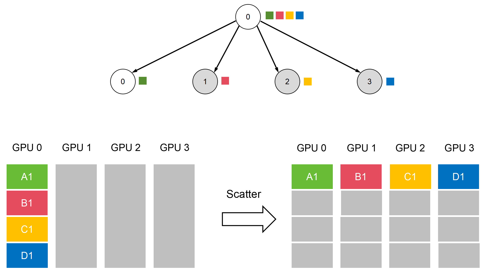
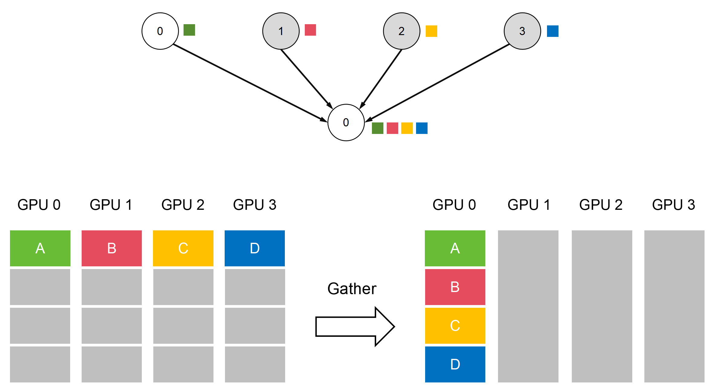
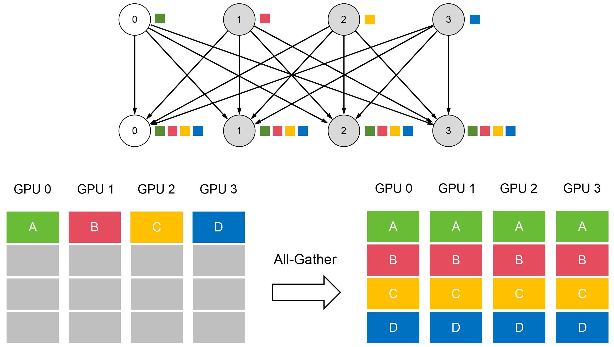

```table-of-contents
```
# 数据并行 (Data Parallelism)

# 模型并行 (Model Parallelism)

# 通信模式
点对点大家一看就懂，就是两个点之间进行通信。一个是Sender，一个是Receiver。
什么是集合通信呢？是指一组（多个）节点内进行通信。在我们传统通信里，就是点到多点，多点到多点，涉及到组网（网状、星状、环状、mesh等）那种。

## 点对点通信（Point to point communication，P2P）
## 集合通信（Collective communication，CC）

# 通信原语
NCCL还定义了一些计算节点之间数据交换的基本操作模式，并将其命名为——“通信原语（也有写作“通信元语”）。
这些通信原语包括：Broadcast、Scatter、Gather、All-Gather、Reduce、All-Reduce、Reduce-Scatter、All-to-All等。
这些通信原语是构建复杂通信行为的“原子操作”。现在所有复杂的AI算力集群，内部通信都是基于这些通信原语。它们极大地提升了并行计算的效率和便利性。

## Broadcast（1对多的广播）

这个最简单。当主节点执行Broadcast操作时，数据会从主节点发送至其他所有节点。


Broadcast是一个典型的分发、散播行为。在分布式机器学习中，Broadcast常用于网络参数的初始化。


## Scatter（1对多的发散）

Scatter也是一种分发、散播行为。它也是将主节点的数据发送至其他所有节点。只不过，Broadcast发送的是完整数据，而Scatter是将数据进行切割后，再分发，就像分生日蛋糕。



## Gather（多对1的收集）

Gather，是将多个sender（发送节点）上的数据收集到单个节点上，可以理解为反向的Scatter。



## All-Gather（多对多的收集）

Gather是多个到一个，All-Gather是多个到多个。  

All-Gather是将多个sender（发送节点）上的数据收集到多个节点上。它相当于多个Gather操作。或者说，是一个Gather操作之后，跟着一个Broadcast操作。

即：**All-Gather = Gather + Broadcast = 多个 Gather**




# 参考
```bash

```