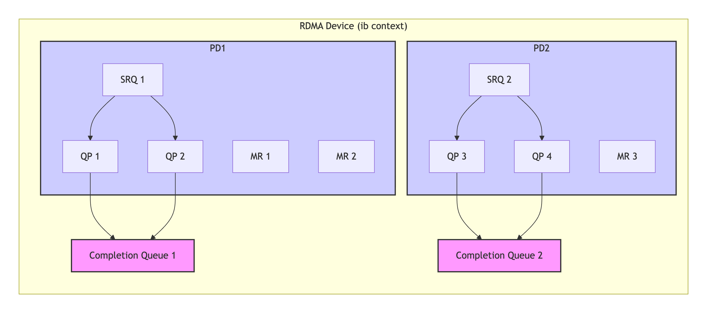

```table-of-contents
```
# 背景
## 传统以太网通信的问题
在深入探讨 RDMA 技术之前，我们先来了解一下传统网络通信存在的问题。以常见的 TCP/IP 通信模式为例，当数据在网络中传输时，需要经过操作系统内核以及多层软件协议栈的处理。这一过程会涉及到多次的数据拷贝和系统调用等导致的上下文切换，从而导致较高的延迟和大量的 CPU 资源消耗。


具体来说：
当发送端应用程序要发送数据时，数据首先会从用户空间的缓冲区拷贝到内核空间的缓冲区，然后经过协议栈的封装，再通过网卡发送出去。在接收端，数据则需要从网卡接收，经过协议栈的解封装，再从内核空间拷贝到用户空间的缓冲区，以供应用程序使用。

这些数据拷贝和上下文切换操作不仅占用了宝贵的 CPU 时间，还使得数据传输的延迟难以降低，尤其是在处理大量小数据块的传输或者对实时性要求较高的应用场景时，传统网络通信的这些问题就显得更加突出，严重影响了系统的整体性能和响应速度。

### TCP/IP存在的问题

传统TCP/IP通信存在的主要问题就是I/O瓶颈问题。在高速网络环境下与网络I/O相关的主机处理的高开销（数据移动操作和复制操作）限制了机器之间的传输带宽。

具体来说，传统的TCP/IP网络通信是通过内核发送消息。通过内核来传输消息这种机制会导致性能低和灵活性差。

- 性能低的主要原因是：由于网络通信通过`内核传递`，需要在内核中频繁进行协议封装和解封操作，造成很大的数据移动和数据复制开销。

- 灵活性差的原因是：是因为网络通信协议在`内核中进行处理`，这种方式很难支持新的网络协议和新的消息通信协议以及发送和接收接口。


# DMA


DMA(直接内存访问)是一种能力，允许在计算机主板上的设备直接把数据发送到内存中去，数据搬运不需要CPU的参与。

传统内存访问需要通过CPU进行数据copy来移动数据，通过CPU将内存中的Buffer1移动到Buffer2中。

# 通信的分类

通信的实现方式分为两种类型：机器内通信与机器间通信。

**（1）机器内通信**
- 共享内存（QPI/UPI），比如：CPU与CPU之间的通信可以通过共享内存。
- PCIe，通常是CPU与GPU之间的通信。
- NVLink，通常是GPU与GPU之间的通信，也可以用于CPU与GPU之间的通信。

**（2） 机器间通信**
- TCP/IP 网络协议。
- RDMA (Remote Direct Memory Access) 网络协议。
	- InfiniBand
	- iWARP
	- RoCE


## PCIe

PCI-Express（peripheral component interconnect express），简称PCIe，是一种高速串行计算机扩展总线标准，主要用于扩充计算机系统总线数据吞吐量以及提高设备通信速度。

PCIE本质上是一种全双工的的连接总线，传输数据量的大小由通道数（lane，信道）决定的。

通常，1个连接通道lane称为X1，**每个通道lane由两对数据线组成，一对发送，一对接收，每对数据线包含两根差分线。即X1只有1个lane，4根数据线**，每个时钟每个方向1bit数据传输。依此类推，X2就有2个lane，由8根数据线组成，每个时钟传输2bit。类似的还有X12、X16、X32。


### PCIe吞吐量(可用带宽)


`吞吐量=传输速率*编码方案`

传输速率为每秒传输量（GT/s），而不是每秒位数（Gbps），是因为传输量包括**不提供额外吞吐量的开销位**，比如：PCIe 1x和PCIe 2x使用8b/10b编码方案，导致占用了20%(=2/10)的原始信道带宽。

- GT/s，Giga transtion per second (千兆传输/秒)，即每一秒内传输的次数，重点在于描述物理层通信协议的速率属性，可以不和链路宽度等关联。
- Gbps，Giga Bits per second (千兆位/秒)。GT/s和Gbps之间不存在成比例的换算关系。

PCIe 2.0协议支持5.0GT/s，即每一条Lane上支持每秒钟传输5G个Bit，但这并不意味着PCIe 2.0协议的每一条Lane支持5Gbps的速率。为什么这么说呢，因为PCIe 2.0的物理层协议中使用的是8b/10b编码方案，即每传输8个Bit，需要发送10个Bit，这多出来的2Bit并不是对上层有意义的信息。那么，PCIe 2.0协议的每一条Lane支持`5*8/10=4Gbps=500MB/s`的速率。以一个PCIe 2.0 x8的通道为例，x8的可用带宽为`4*8=32Gbps=4GB/s`。

同理，PCIe 3.0协议支持8.0GT/s，即每一条Lane上支持每秒钟传输8G个Bit。而PCIe 3.0的物理层协议中使用的是128b/130b编码方案，即每传输128个Bit，需要发送130个Bit，那么，PCIe 3.0协议的每一条Lane支持`8*128/130=7.877GB/s=984.6MB/s`的速率。以一个PCIe 3.0 x16的通道为例，x16的可用带宽为`7.877*16=126.032 Gbps=15.754GB/s`。


### PCIE体系架构
PCIE体系架构一般包含根组件RC（root-complex），交换器switch，终端设备EP（endpoint）等类型的PCIE设备组成。
RC在总线架构中只有一个，用于处理器和内存子系统与I/O设备之间的连接；而switch的功能通常是以软件形式提供的，它包括两个或更多的逻辑PCI到PCI的连接桥（PCI-PCI Bridge），以保持与现有PCI兼容。


# RDMA总体介绍


## 介绍


**Remote**：数据通过网络与远程机器间进行数据传输。数据在 2 台服务器之间进行 P2P 传输。

**Direct**：不需要 CPU 和 Kernel 的参与，有关发送传输的所有内容都卸载到 RNIC上。

**Memory**：2 台服务器上的 Application 之间的内存地址直接传输，延迟最低、带宽最大（服务器内延迟降至 10μs 微秒以下）。

**Access**：send、receive、read、write、atomic操作。


## RDMA的技术特点


### 内核旁路：kernel-bypass

RDMA 提供一个专有的 Verbs interface 而不是传统的TCP/IP Socket interface。应用程序可以直接在用户态执行数据传输，不需要在内核态与用户态之间做上下文切换。

### 零拷贝：zero-copy

RDMA的网络收发接口可以直接把用户态的buffer地址交给RDMA网卡，网卡负责将buffer中的数据发送到远端，或将收到的远端数据写入buffer。这就避免了socket网络收发接口中需要先将数据复制到内核的收发缓冲区的一次数据拷贝操作。

> 注：因为`bypass kernel`, 所以做到了零拷贝。即：用户空间的地址进行了注册之后，硬件DMA到用户空间的地址进行读写。

一些用户态协议栈和内核零拷贝特性（`SOCK_ZEROCOPY`）也能实现数据收发的零拷贝，但在接口和使用模式上目前还没有RDMA的自然和高效。这是因为RDMA是基于这个目标设计的，而普通的`socket`接口和`TCP/IP`协议栈设计时就没有考虑过这个目标。

此外RDMA的零拷贝特性是与硬件实现相关的，普通网卡的收发功能是无法支持RDMA语义中收发操作的零拷贝的。
RDMA的每个应用程序都能直接访问集群中的设备的虚拟内存，这意味着应用程序能够直接执行数据传输，在不涉及到网络软件栈的情况下，数据能够被直接发送到缓冲区或者能够直接从缓冲区里接收，而不需要被复制到网络层。

### hardware-offloading(CPU卸载：cpu offload)
#### 概述
RDMA无需CPU干预，该工作实际上被卸载到 NIC，因此它绕过了主机的 CPU（CPU Offload 或 Bypass）。
存在2个优点：
（1）应用程序可以访问（远程）内存，而无需内核和用户空间进程消耗任何主机 CPU 周期进行读写。
（2）CPU 中的缓存不会被访问的内存内容填充。
**CPU 周期和缓存可用于实际的应用程序工作负载，而不是用于移动数据**。

#### 扩展
RDMA协议大多是通过网卡硬件实现的，网卡会实现从链路层到传输层协议的报文封装、解析、可靠传输等功能。而一般的网卡是没有这些功能的，只负责报文的不可靠传输，其他功能都要通过软件实现，通过CPU完成。这就让使用RDMA接口和硬件的应用能获得更低的网络CPU开销和网络时延。

RDMA协议也有软件实现，例如内核中的rxe（ROCEv2）和siw（iWARP）模块。在软件实现RDMA协议时，就不存在上面所说的优势了。此外，其他协议栈（例如TCP/IP）理论上也能卸载到网卡上实现，但实际上比较罕见。这可能也与RDMA从一开始就是为硬件实现而设计的有关。

### 传输与编程模型

**（1）传输协议加速**
RDMA 可以执行称为协议加速的操作。基于消息的事务以及进行收集/分散(SGL)的能力（**读取多个缓冲区并将它们作为一个整体发送，同时将它们写入多个接收缓冲区**）加快了实际数据移动的速度。

**（2）传输接口和语义**
RDMA最大的特点是其特有的read/write传输接口和语义。在read/write语义中，read和write的对端是不需要感知其他节点对其内存的read和write操作的。这使得一个节点可以在软件逻辑不主动参与、甚至不感知的情况下，与多个节点完成数据收发交互。这在其他网络编程模型下是无法做到的。

RDMA能够支持这些语义是因为RDMA协议包含了比传输层更高层次的**会话层协议**，在这些高层协议中实现了这些语义。而普通的socket编程基于的TCP/IP协议只包含到传输层协议。事实上**目前主流的RDMA协议ROCEv2和iWARP都是在TCP/UDP传输协议上层封装RDMA会话层协议来实现的**。
RDMA协议不是一种单一的协议，而是能够实现RDMA功能的一套协议族。事实上，任何协议族只要能支持RDMA规范中定义的接口和语义，就能被称为RDMA协议。

因此，RDMA的传输和编程模型也不是RDMA专有的，通过自行设计上层协议和编程接口，也可以实现RDMA-like的网络编程接口和模型，例如`google`的`SNAP/Pony-express`。只是这些协议如果不能卸载到网卡硬件上完成，就仍然要通过协议栈软件实现，运行在CPU上。但即使如此，协议栈能够在接到远端请求时直接响应而不需要再与上层应用交互，也能在合适的场景下显著提升网络交互性能。

### 小结
RDMA 通过以下关键特性解决了这些问题：
- **内核旁路 (Kernel Bypass):** 用户空间应用程序可以直接向 RDMA 网卡 (称为 HCA - Host Channel Adapter) 提交工作请求，数据传输路径绕过了内核网络协议栈。
- **零拷贝 (Zero-Copy):** 数据可以直接从应用程序的内存发送到远程应用程序的内存，避免了中间的多次内存拷贝。
- **CPU卸载 (CPU Offload):** 许多数据传输的控制逻辑，包括连接管理、可靠性保证、数据校验等，都由HCA硬件来完成，从而将 CPU 资源释放给应用程序。

这些特性共同赋予了RDMA无与伦比的性能优势：
- 极低的**延迟**： 通常可以达到微秒级，远低于传统网络的毫秒级。
- 极高的**吞吐量**： 能够充分利用现代高速网络链路的带宽（如100Gbps、200Gbps甚至更高）。
- 显著降低的**CPU使用率**： 使得CPU能够更高效地执行计算密集型任务。

## RDMA和以太网通信的对比


对比传统的网络传输机制，RDMA无需操作系统和TCP/IP协议栈的介入。**RDMA的内核旁路机制，允许应用与网卡之间的直接数据读写**，将服务器内的数据传输时延降低到1us以下。同时，RDMA的内存零拷贝机制，允许接收端直接从发送端的内存读取数据，极大的减少了CPU的负担，提升CPU的效率。


### RDMA 设备所在的NUMA
#### 非bond口
```bash
# ibdev2netdev
mlx5_0 port 1 ==> eth01 (Up)
mlx5_1 port 1 ==> eth02 (Down)
mlx5_2 port 1 ==> eth03 (Down)
mlx5_3 port 1 ==> eth04 (Down)

(1) 查看ib设备：
# cat /sys/class/infiniband/mlx5_0/device/numa_node
0

(2) 查看以太网设备：
# cat /sys/class/net/eth01/device/numa_node
0

(3) 基于pcie查看

# ethtool -i eth01
driver: mlx5_core
version: 5.1-2.3.7
firmware-version: 14.30.1004 (MT_2420110034)
expansion-rom-version:
bus-info: 0000:3b:00.0
supports-statistics: yes
supports-test: yes
supports-eeprom-access: no
supports-register-dump: no
supports-priv-flags: yes

# lspci -s 0000:3b:00.0 -vv | grep -i numa
    NUMA node: 0


# cat /sys/bus/pci/devices/0000\:3b\:00.0/numa_node
0
```


#### bond口
```bash
# ibdev2netdev
mlx5_bond_0 port 1 ==> bond0 (Up)

# ip a
8: eth01: <BROADCAST,MULTICAST,SLAVE,UP,LOWER_UP> mtu 1518 qdisc mq master bond0 state UP qlen 1000
    link/ether 0c:42:a1:e8:87:8c brd ff:ff:ff:ff:ff:ff
9: eth02: <BROADCAST,MULTICAST,SLAVE,UP,LOWER_UP> mtu 1500 qdisc mq master bond0 state UP qlen 1000
    link/ether 0c:42:a1:e8:87:8c brd ff:ff:ff:ff:ff:ff
10: bond0: <BROADCAST,MULTICAST,MASTER,UP,LOWER_UP> mtu 1500 qdisc noqueue state UP qlen 1000
    link/ether 0c:42:a1:e8:87:8c brd ff:ff:ff:ff:ff:ff
    inet 10.16.87.224/26 brd 10.16.87.255 scope global bond0
       valid_lft forever preferred_lft forever
    inet6 fe80::e42:a1ff:fee8:878c/64 scope link
       valid_lft forever preferred_lft forever


# ethtool -i eth01
driver: mlx5_core
version: 24.07-0.6.1
firmware-version: 14.28.2006 (MT_2420110034)
expansion-rom-version:
bus-info: 0000:3b:00.0
supports-statistics: yes
supports-test: yes
supports-eeprom-access: no
supports-register-dump: no
supports-priv-flags: yes


(1) 查看ib设备：
# cat /sys/class/infiniband/mlx5_bond_0/device/numa_node
0

(2) 查看以太网设备：
# cat /sys/class/net/eth01/device/numa_node
0

(3) 基于pcie查看
# cat /sys/bus/pci/devices/0000\:3b\:00.0/numa_node
0

# lspci -s 0000:3b:00.0 -vv | grep -i numa
    NUMA node: 0
```

### RDMA 的MTU
RDMA 无论是使用 `IB`, 还是 `RoCe/RoCeV2`, MTU的取值，只能如下：
```bash
256, 512, 1024, 2048, 4096 bytes
```

如下所示，以太网的MTU设置为`1500`，但是实际`RDMA`使用 `RoceV2`的时候，活跃的`MTU`依然是`1024`.


#### RoCEv1/RoCEv2的MTU
RoCEv1/RoCEv2 底层链路层使用的是 Ethernet，因此 **RoCEv1/RoCEv2 的 MTU 是 小于 以太网接口的 MTU 的最大 2 的幂**。
主要是：考虑了RoCE传输头和CRC字段等。


```bash
Please note that RoCE's MTU is subject to InfiniBand MTU restrictions. The RoCE's MTU values are 256 byte, 512 byte, 1024 byte, and 2K. In general RoCE MTU is the largest power of 2 that is still lower than mlx4_en interface MTU.

请注意，RoCE 的 MTU 受限于 InfiniBand MTU 的限制。RoCE 的 MTU 值为 256 字节、512 字节、1024B、 2048B、 4096B。

一般来说，RoCE MTU 是小于 以太网接口的 MTU 的最大 2 的幂。
```

在 RoCE 模式下，`ibv_query_port()` 仍然会返回一个 `active_mtu` 字段，值通常是 IB 档位之一（`1024/2048/4096`）。  
这个值由 **驱动根据 netdev MTU 自动折算**，你不能在 `/sys/class/infiniband` 里手动改。

举个例子：
```bash
 netdev MTU=1500 → active_mtu=1024
 netdev MTU=9000 → active_mtu=4096
```


#### IB的MTU

```bash
# 设置到 2048
echo 2048 > /sys/class/infiniband/mlx5_0/ports/1/mtu

注：RDMA的链路层是IB时，存在这个MTU的文件，如果是RoCE，则不存在这个文件。、
```

#### RDMA的MTU和ethernet(比如依赖于以太网的内核TCP)的MTU的关系

（1）`RoCEv1/RoCEv2` 底层链路层使用的是 Ethernet，**RoCEv1/RoCEv2 的 MTU 是 小于 以太网接口的 MTU 的最大 2 的幂**。

（2）`IB`的`MTU`和 `Linux netdev` 的 MTU 互不影响（即使同一个物理端口）。
比如：你把 `mlx5_0` 的 IB MTU 改成 `2048`，但是 `ens5f0` 的 Linux MTU 还是 `1500`，那么：
- RDMA 走 2048 MTU
- 内核 TCP 还是走 1500 MTU


#### 其他
##### 查看RDMA设备的链路类型
```bash
# ibdev2netdev
mlx5_0 port 1 ==> eth06 (Up)
mlx5_1 port 1 ==> eth07 (Up)

# cat /sys/class/infiniband/mlx5_0/ports/1/link_layer
Ethernet
```

##### 查看RDMA网卡的MTU
```bash
ibv_devinfo -v
```

##### RDMA通信两端MTU的协商

通信两端之间用**RoCE协议**交换`active_mtu`并进行协商。将使用最小的MTU。

```bash
RoCE protocol exchanges "active_mtu" values and negotiates it between both ends. The minimum MTU will be used.
```

##### RDMA接口的MTU的选择与设置

对于使用大IO的应用程序，建议扩大MTU。
注意：如果您更改端口MTU，则所有链路上的网络元素（交换机和路由器）中的MTU也应该一同修改。

一旦你修改了端口（port）的MTU后，InfiniBand的 `active MTU`将自动调整为适合该MTU的最大尺寸。

例如，一旦将端口MTU设置为`4200`，`active_mtu`将更改为4096。

但是，**最好不要将端口MTU配置为9000，因为这会浪费内存**。

建议的MTU值如下：
想让`active MTU`为`4096`-->将端口`MTU`配置为4200
想让`active MTU`为`2048`-->将端口`MTU`配置为2200


## RDMA的优势
### 低CPU开销
相对于 TCP，在使用 RDMA 的 100Gbps 场景下，CPU 占用率从 100% 下降到 10%。CPU 处理能力不再是带宽的限制，网卡自身的硬件规格才是。

（1）TCP 网络中，100Gbps 网络带宽处理需要消耗 64 颗 2.5GHz Core（按 1MHz CPU 处理 1Mbps Net I/O 计算）；
（2）RDMA 网络中，CPU 无需再做收发包中断处理，不仅降低延迟，也节省了 CPU。

### 高吞吐（大带宽）

### 低时延
相对于 TCP，网络时延从 ms 级降低到 10μs 以下。

（1）TCP 网络中，对于一个数据报文，内核协议栈会执行多次内存拷贝、中断处理，上下文切换等会产生数十微秒的固定时延；

（2）RDMA 网络中，Application 直接操作 RNIC Verbs API，不再经过 System-call 切换到内核态，没有内核切换开销。另外，由于数据报文头都在 RNIC 上处理，不用拷贝到内核态处理，Zero-Copy 延迟会显著减少。


# RDMA协议
RDMA最早在Infiniband传输网络上实现，技术先进，但是价格高昂(**只有Mellanox（现已被英伟达收购）和Intel（2012年，英特尔公司出资收购了QLogic的InfiniBand技术）供应商提供全套网络解决方案**)，后来业界厂家把RDMA移植到传统Ethernet以太网上，降低了RDMA的使用成本，推动了RDMA技术普及。在Ethernet以太网上，根据协议栈融合度的差异，分为iWARP和RoCE两种技术，而RoCE又包括**RoCEv1和RoCEv2两个**版本(RoCEv2的最大改进是支持IP路由)。
各RDMA网络协议栈的对比，如下图所示：


在三种主流的RDMA技术中，可以划分为两大阵营。
**一个是IB技术，另一个是支持RDMA的以太网技术(RoCE和iWARP)。
其中, IBTA力挺的技术自然是IB和RoCE, Mellanox公司是这方面的急先锋。
而iWARP则是IEEE/IETF力挺的技术，主要是Chelsio公司在推进**。


在存储领域，支持RDMA的技术早就存在，比如：SRP(SCSI RDMA Protocol)和iSER(iSCSI Extensions for RDMA)。如今兴起的NVMe over Fabrics如果使用的不是FC网络的话，本质上就是 NVMe over RDMA。 
换句话说，NVMe over InfiniBand, NVMe over RoCE 和 NVMe over iWARP 都是 NVMe over RDMA。

## IB协议
**IB（InfiniBand）：** （直译为 “无限带宽” 技术，缩写为IB）。是一个为大规模、易扩展机群而设计的**网络通信技术协议**。可用于计算机内部或外部的数据互连，服务器与存储系统之间直接或交换互连，以及存储系统之间的互连。

基于 `InfiniBand` 架构的 `RDMA` 技术，由`IBTA（InfiniBand Trade Association）` 提出。搭建基于 IB 技术的 RDMA 网络需要专用的 IB 网卡和 IB 交换机。

InfiniBand 最重要的一个特点就是**高带宽**、**低延迟**，因此在高性能计算项目中广泛的应用。 主要用于高性能计算（HPC）、高性能集群应用服务器和高性能存储。

### InfiniBand 的网络架构
InfiniBand 是一种基于通道的结构，组成单元主要分为四类：

- HCA（Host Channel Adapter，主机通道适配器）
- TCA（Target Channel Adapter，目标通道适配器）
- InfiniBand link（连接通道，可以是电缆或光纤，也可以是板上链路）
- InfiniBand交换机和路由器（组网用的）


通道适配器CA就是搭建InfiniBand通道用的。所有传输均以通道适配器开始或结束，以确保安全或在给定的QoS（服务质量）级别下工作。

使用 InfiniBand 的系统可以由多个子网（Subnet）组成，每个子网最大可由 6 万多个节点组成。

- 子网内部，InfiniBand 交换机进行二级处理。
- 子网之间，使用路由器或网桥进行连接。


infiniBand 的二级处理过程非常简单，每个 InfiniBand 子网都会设一个子网管理器，生成16位的 LID（本地标识符）。InfiniBand 交换机包含多个 InfiniBand 端口，并根据第二级本地路由标头中包含的LID，将数据包从其中一个端口转发到另一个端口。**除管理数据包外，交换机不会消耗或生成数据包**。

简单的处理过程，加上自有的Cut-Through技术，InfiniBand 将转发时延大幅降低至 100ns 以下，明显快于传统以太网交换机。

### InfiniBand 的协议栈

InfiniBand 协议同样采用了分层结构，各层相互独立，下层为上层提供服务，如下图所示：


Infiniband报文封装格式如下图所示：


- **物理层**
定义了在线路上如何将比特信号组成符号，然后再组成帧、数据符号以及包之间的数据填充等，详细说明了**构建有效包的信令协议**等。

- **链路层**
定义了数据包的格式以及数据包操作的协议，如：流控、 路由选择、编码、解码等。

- **网络层**
通过在数据包上添加一个40字节的全局的路由报头（Global Route Header, GRH）来进行路由的选择，对数据进行转发。**在转发的过程中，路由器仅仅进行可变的CRC校验，这样就保证了端到端的数据传输的完整性**。

- **传输层**
再将数据包传送到某个指定的队列偶（Queue Pair, QP）中，并指示 QP 如何处理该数据包。

### InfiniBand 组网

InfiniBand 组网跟普通的交换机不太一样，InfiniBand 的组网成本很高。如果希望这个网络中任何两个计算节点的网卡之间互相无损地通信，需要使用一种叫做胖树（Fat Tree）的网络拓扑，大概是如下一种拓扑结构，方块是交换机，椭圆是计算节点。

胖树主要有两层，上面一层是核心层，不连任何计算节点，它的功能就是转发流量；下面一层是接入层，接入各类计算节点。

胖树拓扑成本高的主要原因是：某一个接入交换机上，假如有36个口，那如果为了达到无损速率，一半的口，也就是18个口可以给计算节点连，剩下一半要连到上层的核心交换机上。要知道，任何一根线，就是1万多块钱呢，如果达到无损，就要冗余地做这些连接。


### NVIDIA InfiniBand 商用产品

Mellanox 在全球 InfiniBand 市场的占有率基本上无敌的存在，在英伟达收购 Mellanox 之后，也于2021年推出了自己的第七代 NVIDIA InfiniBand 架构：NVIDIA Quantum-2。

NVIDIA Quantum-2 平台包括：NVIDIA Quantum-2 系列交换机、NVIDIA ConnectX-7 InfiniBand 适配器、BlueField-3 InfiniBand DPU以及电缆（cable）。


**(1)NVIDIA Quantum-2 系列交换机**
该交换机采用紧凑型1U设计，包括风冷和液冷版本。
交换机的芯片制程工艺为7nm，单芯片拥有570亿个晶体管（比A100 GPU还多）。单个交换机采用64个400Gb/s端口或128个200Gb/s端口的灵活搭配，提供总计 51.2Tb/s的双向吞吐量。NVIDIA NDR 400Gb/s InfiniBand 交换机如下图所示：


**(2)NVIDIA ConnectX-7 InfiniBand 适配器**
Cx7支持PCIe Gen4和Gen5，具有多种外形规格，可提供 400Gb/s 吞吐量。


### 注意
IB 因其极致的性能（能够实现小于 3 μs 时延和 400Gb/s 以上的网络吞吐），在高性能计算领域中备受青睐。
需要注意的是，构建 Infiniband 网络需要配置全套专用设备，如专用网卡、专用交换机和专用网线，限制了其普及性。
其次，它的技术架构封闭，不兼容现有的以太网标准。这意味着，绝大多数通用数据中心都无法兼容 Infiniband 网络。
尽管存在这些局限，InfiniBand 仍因其极致的性能成为特定领域的首选。例如，全球流行的人工智能应用 ChatGPT 背后的分布式机器学习系统，就是基于 Infiniband 网络构建的。

## iWARP协议
**iWARP（Internet Wide Area RDMA Protocal, 互联网广域 RDMA 协议）：** 
基于 TCP/IP 协议的 RDMA 技术，由 IETF 标 准定义。iWARP 支持在标准以太网基础设施上使用 RDMA 技术，但服务器需要使用支持iWARP 的网卡。虽然`RDMA Consortium`表示iWARP不是一个缩写，也不仅仅适用于广域网，但在`RDMA Consortium`几个创始厂商以及主要玩家`intel`、`chelsio`的文档中都能找到这个名词的全称。

**iWRAP**是一种将 RDMA 封装在 TCP/IP 协议中的技术。
RDMA 旨在提供高性能传输，而 TCP/IP 侧重于可靠性，其三次握手、拥塞控制等机制削弱了 iWRAP 的 RDMA 技术优势，导致其性能大幅下降。因此，iWRAP 由于先天设计上的局限性，逐渐被业界淘汰。


### 软件实现iWARP
支持`iWARP`协议RDMA功能的网卡主要有`Chelsio`的T6和`Intel`的`X722、E810`等。
和支持RoCEv2的rxe类似，Linux内核中也有软件支持`iWARP`的模块，名称是`siw`。


### iWARP和ROCE
`iWARP`的历史比`ROCE`更久一些，在`Infiniband`协议和产品出现后，许多厂商认同RDMA这种网络模式，但对IB协议和设备的前景并不看好。
因此，这些厂商成立了`RDMA Consortium`，开始在主流的`Ethernet/IP/TCP`协议族基础上设计一种能在传统网络设备上传输的`RDMA`协议，也就是`iWARP`。

和IB与ROCE不同，iWARP通过`TCP`协议在传输层保证了在有损网络中的可靠传输，因此可以用于广域网、互联网等存在丢包、乱序等现象的网络环境。


#### 区别
iWARP和ROCE其实两者的主要差异就在于：iWARP基于TCP协议，硬件实现复杂，在IDC机房内部传输这种可靠性较高的环境下，TCP协议的可靠传输机制带来的价值不易体现，而硬件实现TCP协议的复杂性则可能带来成本和时延的上升。

RoCEv2基于UDP协议，硬件实现要简单的多，上层基于IB协议，对于Mellanox这种老牌IB厂商还节省了协议开发成本并掌握了技术主导权。


#### 发展
目前大体的情况是`iWARP`网卡的时延会高于`RoCEv2`网卡，但`RoCEv2`在不可靠网络下仍然基本不可用。
`iWARP`协议在2014年后就基本稳定了，厂商的工作主要是将`iWARP`和`TCP/IP`协议在网卡上实现的更加高效。而`RoCE`则仍然有厂商（主要是`Mellanox`，也包括华为和其他一些厂商和研究者）在尝试改进其拥塞控制和可靠传输机制，但这种机制必然和TCP协议比较类似。如何在获得可靠传输能力的同时避免复杂度和性能上的代价，目前仍然没有一个很好的答案。

从目前的使用情况看，**`RoCEv2`的市场占用率要高于`iWARP`**，但这很大程度上也和`RDMA/IB`技术与市场的发展历史过程有关。

## ROCE协议

为降低 RDMA 的使用成本，并推动其在通用数据中心的应用，IBTA 于 2010 年发布了 **RoCE（RDMA over Converged Ethernet，融合以太网的远程直接内存访问）** 技术。
RoCE 将 Infiniband 的数据格式（IB Payload）“移植”到以太网，使 RDMA 能够在标准以太网环境下运行。`RoCE` 支持在标准以太网基础设施上使用`RDMA`技术，但是需要交换机支持无损以太网传输，需要服务器使用 `RoCE` 网卡。

### ROCE产生的背景
在2011年接触到RDMA网络时，使用的是`Mellanox`的`Infiniband`卡，这种IB卡使用的协议从链路层开始就是IB专用协议。因此使用这种网卡时，需要使用专门的IB交换机和带IB光模块的IB连接线，那时一条不长的IB连接线就要数千元。组建一套IB网络成本很高，还需要额外的网络规划部署工作，因此在一段时间后我们的产品中就不再使用IB网络了。`RoCE`和`iWARP`都是为了解决IB网络的成本和部署问题而产生的技术。通过在`2/3/4`层采用通用的`ethernet/ip/tcp/udp`协议，采用RoCE和iWARP技术的RDMA报文可以在普通的`ethernet/ip`网络环境和硬件设备下传输，避免了专门建设IB网络的成本和工作。

### ROCE的两个版本
RoCE有两个版本，v1版本是基于以太网链路层（L2）实现的RDMA协议，v2版本则使用了`ethernet/ip/udp/ib数据`作为链路层/网络层/传输层协议，可实现跨三层流量转发，当前数据中心主推方案，v2协议规定了`RoCEv2`使用UDP端口4791。==由于v2版本使用了ip协议，可以复用普通的ip路由器，因此得到了较广泛的应用==。

**RDMA技术，最大的突破是将网络层和传输层放到了硬件中（服务器的网卡上）来实现，数据报文进入网卡后，在网卡硬件上就完成四层解析，直接上送到应用层软件，四层解析CPU无需干预**。


因此：
- **RoCEv1**：基于二层以太网，仅限于同一子网内通信，无法跨子网传输；
- **RoCEv2**：基于三层 IP 网络，支持跨子网通信，提高了灵活性和可扩展性。


### ROCE可靠传输

RDMA 网络对丢包极为敏感，任何数据包丢失都可能触发大量重传，严重影响传输性能。
IB传输协议是假设自身处于无损网络下的，即Infiniband 依赖专用设备确保网络可靠性。

而 **RoCE是基于融合以太网实现 RDMA 通信，这里的融合以太网是指能够提供无损传输的以太网**。因此，RoCE 网络需要无损以太网支持，以避免丢包对性能造成重大影响。

目前，大多数数据中心采用 DCQCN（由微软与 Mellanox 提出）或 HPCC（由阿里巴巴提出）算法，为 RoCE 网络提供可靠性保障。


`RoCEv2`通过`ethernet`和`ip`协议路由转发报文，因此要求这两层的转发设备都能提供无损传输。
`RoCEv2`要求的无损传输是通过交换机和路由器的一些增强特性实现的。
在以太网交换机上实现`RoCE`报文的无损传输需要交换机支持`PFC（Priority Flow Control）`，`PFC`通过`802.1q`协议定义的`vlan`标签实现基于优先级的流量传输控制。
当出现网络拥塞时，`PFC`会优先保障高优先级的链路报文不被丢弃，从而实现某种程度的无损传输。
如果`RoCEv2`报文需要经过路由，需要支持将`vlan`标签中的优先级映射到`IP`的`DSCP`字段中，让路由器通过`DSCP`字段保障`RoCEv2`报文的优先传输，或者要求路由器支持`vlan`标签中的优先级字段`PCP`。即：当`RoCEv2`报文经过路由时，如果路由设备不支持`VLAN`标签的处理，可能需要将`PCP`映射到三层的`DSCP`字段，以便路由器根据`DSCP`来保障传输优先级。或者，路由器需要直接支持基于`VLAN`的`PCP`来进行优先级处理。


#### PCP


PCP（Priority Code Point，优先级代码点）是位于VLAN标签头部的一个3比特字段，属于**IEEE 802.1Q标准**中定义的二层QoS标记机制。它用于标识以太网帧的优先级，支持8个优先级等级（0-7），数值越大表示优先级越高。

##### PCP与无损网络的关系

在RoCEv2的无损网络中，PCP是**PFC（基于优先级的流量控制）** 的关键依据：
- PFC通过PCP值识别不同优先级的流量队列，当某队列发生拥塞时，仅暂停该优先级流量的发送，避免全局阻塞。
- 若未正确映射PCP到DSCP，可能导致路由器无法识别RoCEv2流量的优先级，进而引发拥塞丢包，影响RDMA性能。

##### PCP的作用与定义

**（1）位置与功能**：
PCP位于VLAN标签的头部（即802.1Q头部），是3比特的字段，用于标记二层网络的流量优先级。通过PCP值，网络设备（如交换机）可以识别并优先处理高优先级流量（如RoCEv2的RDMA流量）。

**（2）优先级等级**：
PCP值的范围为0（最低）到7（最高）。例如，在RoCEv2网络中，通常会将RDMA流量映射到较高的PCP值（如3或更高），以保障低延迟和无丢包传输

##### PCP与DSCP的映射需求
RoCEv2协议基于UDP/IP封装，其报文可能跨越三层网络（经过路由器）。此时需解决以下问题：

**（1）二层与三层QoS的衔接**：
VLAN标签（含PCP）在跨三层路由时会被剥离，而路由器需根据三层IP头部的DSCP字段识别优先级。因此，需要将二层的PCP值映射到三层的DSCP字段，确保端到端的优先级一致性。

**（2）两种实现方式**：

- **方式1：映射PCP到DSCP**  
在边缘设备（如接入交换机）上配置优先级映射规则，将VLAN的PCP值转换为IP头部的DSCP值。例如，`PCP=3`映射为`DSCP=24`（对应RoCEv2的流量类别），路由器根据DSCP值进行队列调度和拥塞管理。

- **方式2：路由器直接支持PCP**  
若路由器保留并识别`VLAN`标签中的PCP值（需支持`VLAN-aware`路由），则无需映射，直接基于`PCP`提供优先级保障。但此场景较少见，因跨路由时`VLAN`标签通常被剥离。

### ROCE的硬件要求

`RoCE`虽然能在`ethernet/ip`网络上传输，但对网络中的设备仍是有一定的功能要求的。此外，要让交换机和路由器支持`RoCE`报文的优先传输，需要在`RDMA`网卡和交换机上都配置上对应的`vlan`和标签信息。
`RoCE`对网络设备的要求以及大规模部署时的配置复杂度，使其使用规模受到了限制，很少有超过一千台主机的集群配置通过RoCEv2通信。
`Mellanox`实现了自行改进的`RoCE`协议，来支持`RoCE`在有损网络(Lossy)上的传输。但到目前为止这种协议虽然可用，但在丢包场景下的性能较差，且无法和普通的`RoCEv2`协议兼容互通，因此实际使用场景有限。

ROCEv2同样需要专门的网卡才能支持`stack offloading`和`zero copy`等特性，`Mellanox`的`CX-5/CX-6`等网卡可以支持硬件ROCEv2协议。

### 软件实现ROCEv2
Linux内核中也支持了基于软件实现的`ROCEv2`，模块名为rxe。
rxe模拟实现了ROCEv2设备，并且在`libibverbs`中也提供了相应的支持。
应用程序可以通过`verbs`接口与`rxe`设备交互来实现`RDMA`通信，而不需要通过支持RDMA的网卡。`rxe`模块会根据`ROCEv2`协议规范，完成IB层传输协议的封装，之后通过Linux内核协议栈实现`UDP/IP/Ethernet`层的封装，最终通过普通的以太网网卡将报文发出。

使用`rxe`软件实现的RDMA通信当然就失去了`hardware stack offloading`和数据面不需要`syscall`的优势，但仍然有`RDMA`交互模式以及`zero copy`方面的一些优势。
此外通过`rxe`理论上可以让部分对高性能网络没有需求的设备也加入到`RDMA`网络中来，而无需配备专门的`RDMA`网卡。


# 相关组织
## 标准和生态组织
### IBTA
IBTA：`Infiniband Trade Association`，IB行业协会，由IB行业的主要厂商构成，**负责制定和维护`Infiniband`协议标准(IB Spec),以及设备认证**。IB协议与RoCE协议就是IBTA制定的。

IBTA独立于各个厂商，通过赞助技术活动和推动资源共享来将整个行业整合在一起，并且通过线上交流、营销和线下活动等方式积极推广IB和RoCE。

**IBTA会对商用的IB和RoCE设备进行协议标准符合性和互操作性测试及认证**，由很多大型的IT厂商组成的委员会领导，其主要成员包括博通，HPE，IBM，英特尔，Mellanox和微软等，华为也是IBTA的会员。

#### IB Spec规范文档
[IB Specification Release 1.4 英文版](https://gitcode.com/Open-source-documentation-tutorial/5c371/blob/main/IB%20Specification%20Vol%201-Release-1.4.pdf)


### IETF
IETF：Internet Engineering Task Force，互联网工程任务组。
最大的网络标准制定组织。**iWARP协议由IEEE/IETF制定**。

#### RDMA Consortium
RDMA Consortium，RDMA联盟，由Adaptec, Broadcom, Cisco, Dell, EMC, Hewlett-Packard, IBM, Intel, Microsoft和Network Appliance等公司建立。
Verbs和iWARP初始版本的规范就是这个组织设计和提交给IETF的。


### OFA和OFED
#### OFA
OFA(OpenFabrics Alliance) 是一个基于开源的，非盈利组织，负责开发、测试、认证、支持和分发==独立于厂商的开源跨平台的RDMA/Advanced Networks 软件和OFED软件==，该联盟的使命是开发和推广软件，通过以最小的 CPU 开销直接向应用程序提供线速消息传递、超低延迟和最大带宽来实现最大的应用程序效率。

该联盟成立于2004年6月，当时名为OpenIB联盟，最初专注于开发独立于供应商、基于Linux的InfiniBand软件堆栈。
2005年，该联盟承诺支持Windows，此举将使软件堆栈真正跨平台。
2006年，该组织再次扩大其章程，包括对iWARP的支持，并在2010年增加了对RoCE（融合以太网上的RDMA）的支持，用于通过以太网提供高性能RDMA和内核旁路解决方案。
2014年，联盟再次扩大，成立了OpenFabrics接口工作组，以整合对其它高性能网络的支持。

#### OFED
OFED 是由 OFA 推出的一个开源软件包，全称是 `OpenFabrics Enterprise Distribution`。
它包含了 **支持 RDMA 的内核模块、驱动程序、库、工具、API（如 libibverbs、librdmacm 等）**。

##### MLNX-OFED（Mellanox OFED）
MLNX-OFED 是 Mellanox（已被 NVIDIA 收购）基于 OFED 的一个定制版本。
它是 Mellanox 专为其自家硬件（Infiniband/RoCE 网卡等）优化的版本。
在 OFED 的基础上加入了 Mellanox 的驱动、工具（如 `ibstat`、`ibdev2netdev`）、优化配置脚本等。
**性能和兼容性通常优于通用 OFED，但仅适用于 Mellanox 的硬件**。


####  OFA和IBTA
上述两个组织是配合关系。
==IBTA主要负责开发、维护和增强Infiniband协议标准规范(IB Spec)==；
==OFA负责开发和维护Infiniband协议和上层应用API==。

### OCP
Open Compute Project（开放计算项目）：是一个由科技公司联合发起的**开源硬件社区**，核心是通过开放协作，重构数据中心的服务器、网络、存储、电源、散热等硬件设计，追求更高效率、更低成本与更快创新速度。

核心要点（一句话版）：OCP 是**数据中心硬件界的 “开源社区 + 标准组织”**，把服务器、网卡、交换机等**硬件设计公开共享**，让企业和厂商能**基于标准**快速定制、迭代，**避免重复造轮子**，适配超大规模与 AI 算力需求。

```bash
Linux Foundation —— 软件开源
OCP Foundation —— 数据中心硬件开源
```

- **起源**：Facebook 发现传统服务器厂商（如  Dell Technologies、  Hewlett Packard Enterprise）提供的服务器：成本高、设计不透明、不适合超大规模数据中心；于是 Facebook 自己设计服务器，把设计方案开源，让供应商按这个标准生产；这就是 OCP 的开始。

- **核心逻辑**：像软件开源一样，==硬件设计开放共享、标准统一==，加速创新、降低门槛、提升兼容性。

#### OCP 的主要成员
OCP 现在已经是全球最大的开放硬件组织之一，成员包括很多科技公司，例如：
```bash
- Meta Platforms
- Microsoft
- Google
- Intel
- NVIDIA
- Broadcom
```
以及大量服务器厂商和云厂商。

#### OCP 主要做什么
##### 开源数据中心硬件设计
```bash
服务器主板
机架
交换机
电源
散热系统
```
厂商可以直接按照这些设计生产设备。

##### 制定开放标准
例如网络硬件：
```bash
- OCP NIC
- OCP switch
- OCP rack
```    
这样不同厂商设备可以互相兼容。

##### 技术项目协作
OCP 内部有很多技术项目组，例如：
```bash
- 网络
- 存储
- AI 加速器
- 数据中心电源
```
企业可以在这些项目里一起设计新技术。


## 开发社区

### Linux社区

Linux社区：负责RDMA内核子系统和RDMA网卡驱动的开发维护。
RDMA的网卡驱动有3种类型，分别由Linux内核社区、OFED和Mellanox维护，彼此之间会有一些差异，也会互相移植特性。

Linux内核的RDMA子系统还算比较活跃，经常会讨论一些协议细节，对框架的修改比较频繁，另外包括华为和Mellanox在内的一些厂商也会经常对驱动代码进行修改。代码位于内核drivers/infiniband/目录下，包括框架核心代码和各厂商的驱动代码。

### RDMA社区
RDMA社区：负责用户态接口库libibverbs开发维护。

对于上层用户，IB提供了一套与Socket套接字类似的接口——`libibverbs`，前文所述三种协议(`IB, ROCE, iWARP`)都可以使用`verbs`接口。参考着协议、`API`文档和示例程序很容易就可以写一个`Demo`出来。本专栏中的RDMA社区专指其用户态社区，在`github`上其仓库的名字为`linux-rdma`。

仓库为：[https://github.com/linux-rdma/](http://link.zhihu.com/?target=https%3A//github.com/linux-rdma/ "https://github.com/linux-rdma/")


`linux-rdma`主要包含两个子仓库：
**(1) rdma-core**
用户态核心代码，API，文档以及各个厂商的用户态驱动。

**(2) perftest**
一个功能强大的用于**测试RDMA性能的工具**。

### UCX
UCX(Unified Communication X： 统一通信 X)是一个**建立在RDMA等技术之上**的用于数据处理和高性能计算的**通信框架**，RDMA是其底层核心之一。我们可以将其理解为是**位于应用和`RDMA API`之间的中间件，为上层用户又封装了一层更易开发的接口**。


代码仓：[https://github.com/openucx/ucx](https://link.zhihu.com/?target=https%3A//github.com/openucx/ucx)

# 硬件厂商

设计和生产IB相关硬件的厂商有不少，包括Mellanox、华为、收购了Qlogic的IB技术的Intel，博通、Marvell，富士通等等。
其中 Marvell 是收购的 Qlogic 品牌，Mellanox 被英伟达收购。

**（1）Mellanox**
IB领域的领头羊，协议标准制定、软硬件开发和生态建设都能看到Mellanox的身影，其在社区和标准制定上上拥有最大的话语权。目前最新一代的网卡是支持200Gb/s的ConnextX-6系列。

**（2）华为**
去年初推出的鲲鹏920芯片已经支持100Gb/s的RoCE协议，技术上在国内处于领先地位。但是软硬件和影响力方面距离Mellanox还有比较长的路要走，相信华为能够早日赶上老大哥的步伐。


# RDMA软件架构

## Linux RDMA架构
这里只讨论Linux上的RDMA软件栈。
Linux RDMA 架构主要包含：**内核 RDMA 子系统** 和 **rdma-core 用户空间包**。

### rdma用户空间包：rdma-core
**rdma-core**：开源的==`RDMA`用户态软件协议栈==，`repo`为`https://github.com/linux-rdma/rdma-core`。`rdma-core`是`rdma`在用户态的主要组件。
用户态的程序需要通过`rdma-core`提供的用户态`verbs API`来和内核中的`rdma`子系统、`rdma`设备驱动、以及`rdma`设备本身交互，来使用`rdma`通信功能。
其中包括用户态库`libibverbs`、`librdmacm`和`libibumad`。
不同的`rdma`设备有不同的内核驱动，这些设备驱动向用户态提供的操作接口和功能也各不相同，`libibverbs`对不同设备驱动进行了相应的适配，支持了当前主流的`rdma`设备驱动，包括`rxe/siw`这两种软件实现的`rocev2/iwarp`设备驱动。
`ibv_`系列API就由`rdma-core`中的`libibverbs`提供。

#### 组成
这是一个重要的用户空间软件包，提供了与内核 RDMA 子系统交互所需的库和工具。

- **libibverbs**：
最核心的用户空间库，它封装了通过 uverbs 接口与内核驱动通信的细节，为应用程序提供了标准的 Verbs API。

- **Provider 库 (e.g., libmlx5.so, librxe.so)**： 
这些是 libibverbs 根据检测到的硬件动态加载的库，它们包含了针对特定硬件或软件 provider 的特定逻辑，用于将通用的 libibverbs 调用转换为特定于该 provider 的 uverbs 命令。

- **librdmacm**：
一个用户空间库，用于简化 RDMA 连接的建立和管理。

- **实用工具**： 
如 ibv_devices (列出可用的 RDMA 设备), ibv_devinfo (显示设备属性) 等。


### 内核RDMA子系统：kernel RDMA subsystem
**kernel RDMA subsystem**：开源的==Linux内核中的RDMA软件栈==，是Linux内核的一部分，主要包括内核的rdma子系统框架，以及**各种rdma设备的驱动**。`ib_`系列接口由其中的`ib_core.ko`提供。

Linux 内核提供了对 RDMA 技术的强大且成熟的支持，主要通过其 RDMA 子系统实现。这个子系统是内核的一部分，为各种 RDMA 硬件（如 InfiniBand HCAs, RoCE NICs, iWARP NICs）提供了一个统一的、硬件无关的编程接口。

#### 组成
- **核心模块 (ib_core)**： 提供核心的数据结构、API 实现和设备管理框架。
- **硬件驱动 (Hardware Drivers)**： 针对特定 HCA 硬件的驱动程序（例如 mlx5_core for Mellanox, i40iw for Intel iWARP）。这些驱动实现了 Verbs API 中与硬件相关的部分，并向核心层注册其设备。
- **用户空间接口 (ib_uverbs)**： 提供了一个**字符设备接口**（通常是 /dev/infiniband/uverbsX），允许用户空间应用程序或者 rdma-core 库通过 ioctl 调用来访问内核 RDMA 资源和执行操作。
- **连接管理模块 (e.g., ib_cm, rdma_cm)**： 帮助建立和管理 RDMA 连接。


## 其他

除了上述开源社区发布的版本外，OFA和厂商基于社区版本也会发布自己的软件包：

### ofed
`ofed：OpenFabrics Enterprise Distribution`，是一个**开源软件包集合**，具体是OFA负责开发和维护的开源软件包集合，其中**包含内核框架和驱动、用户框架和驱动、以及各种中间件、测试工具和API文档，软件包（rpm、dpkg等）**。
`ofed`中提供了`rdma-core`和内核`RDMA`子系统的另一个版本，和前两者是互相替代的关系。
`ofed`定期从前两个社区`repo`中获取最新版本的代码，并对各商用OS发行版进行适配，发布相应的软件包。


#### ofed_info：查看 ofed的版本信息
```bash
# ofed_info -s
MLNX_OFED_LINUX-5.4-3.1.0.0:

# ofed_info -n
5.4-3.1.0.0


# which ofed_info
/bin/ofed_info

# file /bin/ofed_info
/bin/ofed_info: Bourne-Again shell script, ASCII text executable, with very long lines

# rpm -qf /bin/ofed_info
ofed-scripts-5.4-OFED.5.4.3.1.0.x86_64


# rpm -ql ofed-scripts
/usr/bin/hca_self_test.ofed
/usr/bin/ofed_info
/usr/bin/ofed_rpm_info
/usr/sbin/ofed_uninstall.sh
/usr/sbin/sysinfo-snapshot.py
/usr/sbin/vendor_post_uninstall.sh
/usr/sbin/vendor_pre_uninstall.sh
```

#### ofed_rpm_info: 查看ofed中各个包的信息

```bash
# ofed_rpm_info
ar_mgr 1.0 5.9.1.MLNX20210811.gb359a4e.54241
ar_mgr 1.0 5.9.1.MLNX20210811.gb359a4e
clusterkit 1.4.390 1.54241
clusterkit 1.4.390 1
dapl 2.1.10.1.mlnx OFED.4.9.0.1.4.53100
dapl 2.1.10.1.mlnx OFED.4.9.0.1.4
dpcp 1.1.13 1.54241
dpcp 1.1.13 1
dump_pr 1.0 5.9.1.MLNX20210811.gb359a4e.54241
dump_pr 1.0 5.9.1.MLNX20210811.gb359a4e
fabric-collector 1.1.0.MLNX20170103.89bb2aa 0.1.53100
fabric-collector 1.1.0.MLNX20170103.89bb2aa 0.1
hcoll 4.7.3199 1.54241
hcoll 4.7.3199 1
ibdump 6.0.0 1.53100
ibdump 6.0.0 1
ibsim 0.10 1.53100
ibsim 0.10 1
ibutils2 2.1.1 0.136.MLNX20210617.g4883fca.54241
ibutils2 2.1.1 0.136.MLNX20210617.g4883fca
iser 5.4 OFED.5.4.3.0.7.1
isert 5.4 OFED.5.4.3.0.7.1
kernel-mft 4.17.2 12
knem 1.1.4.90mlnx1 OFED.5.1.2.5.0.1
libvma 9.3.1 1
libxlio 1.0.6 1
mlnx-dpdk 20.11.0 1.54241
mlnx-dpdk 20.11.0 1
mlnx-en 5.4 3.1.0.0.g49f69b0
mlnx-ethtool 5.13 1.54241
mlnx-ethtool 5.13 1
mlnx-iproute2 5.11.0 1.54241
mlnx-iproute2 5.11.0 1
mlnx-nfsrdma 5.4 OFED.5.4.3.0.7.1
mlnx-nvme 5.4 OFED.5.4.3.0.7.1
mlnx-ofa_kernel 5.4 OFED.5.4.3.1.0.1
mlnx-tools 5.2.0 0.54241
mlnx-tools 5.2.0 0
mpi-selector 1.0.3 1.53100
mpi-selector 1.0.3 1
mpitests 3.2.20 5d20b49.53100
mpitests 3.2.20 5d20b49
mstflint 4.16.0 1.54241
mstflint 4.16.0 1
multiperf 3.0 0.14.g5f0fd0e.53100
multiperf 3.0 0.14.g5f0fd0e
ofed-docs 5.4 OFED.5.4.3.1.0
openmpi 4.1.2a1 1.54241
openmpi 4.1.2a1 1
opensm 5.9.1.MLNX20210811.517c4ae 0.1.54241
opensm 5.9.1.MLNX20210811.517c4ae 0.1
openvswitch 2.14.1 1.54241
openvswitch 2.14.1 1
perftest 4.5 0.6.gbb9a707.54241
perftest 4.5 0.6.gbb9a707
rdma-core 54mlnx1 1.54241
rdma-core 54mlnx1 1
rshim 2.0.6 1.ga97dc5d
sharp 2.5.1.MLNX20210812.e3c2616 1.54241
sharp 2.5.1.MLNX20210812.e3c2616 1
sockperf 3.7 0.gita1e8e835a689.53100
sockperf 3.7 0.gita1e8e835a689
srp 5.4 OFED.5.4.3.0.7.1
ucx 1.11.0 1.54241
ucx 1.11.0 1
xpmem 2.6.3 2.53100
xpmem 2.6.3 2
ofed-scripts 5.4 OFED.5.4.3.1.0
```

```bash
# which ofed_rpm_info
/bin/ofed_rpm_info

# file /bin/ofed_rpm_info
/bin/ofed_rpm_info: Bourne-Again shell script, ASCII text executable

# rpm -qf /bin/ofed_rpm_info
ofed-scripts-5.4-OFED.5.4.3.1.0.x86_64
```

### 厂商版ofed

一些厂商会在开源ofed的基础上，增加一些私有的增强特性和一些专用的配置、测试工具，发布针对自家产品的ofed软件包。比如华为的`HW_OFED`和`Mellanox`的`MLNX_OFED`。
这些定制版本基于开源OFED开发，由厂商自己测试和维护，会在开源软件包基础上提供私有的增强特性，并附上自己的配置、测试工具等。

#### Mellanox OFED 软件栈

Mellanox OFED 是一个单一的软件堆栈，包括驱动、中间件、用户接口，以及一系列的标准协议 IPoIB、SDP、SRP、iSER、RDS、DAPL(Direct Access Programming Library)，支持 MPI、Lustre/NFS over RDMA 等协议，并提供 Verbs 编程接口；Mellanox OFED 由开源 OpenFabrics 组织维护。

Mellanox OFED 软件堆栈是承载在 InfiniBand 硬件和协议之上的，软件通过协议和硬件进行有效的数据传输。


## RDMA各个组件的关系

### 基于xilinx的rdma组件调用关系图

根据多个流程(rdma_accept ,创建qp,创建cm_id,创建cp等)整理出组件关系图：


其中各个不同颜色的箭头代表几种不同的流程的组件调用过程：
绿色箭头：app使用xilinx用户态驱动so库的流程（RDMA读写）
蓝色箭头：app不使用cm的rdma控制面流程（如通过socket建链）
黄色箭头：rdma_accept 改变qp状态的流程（cm建链）
红色箭头：创建qp的流程
黑色箭头：创建cm_id流程
淡蓝色箭头：创建cp流程和reg mr流程

#### 组件
##### 用户空间
**（1）Application**
各种RDMA应用程序（比如xperf、rping工具、spdk等）

**（2）so**：==RDMA用户态动态链接库(rdma用户态驱动， 或者uverbs provider)==，作用：
- 实现并且向上层应用提供各种Verbs API
- 在各种Verbs API的逻辑中调用到各厂商驱动注册的钩子函数
- 提供进入内核态的接口
- `libxib.so`：xilinx网卡的用户态驱动，也是个动态链接库，实现厂商的驱动逻辑。
如果是`Mellanox`的`RNIC`卡，那么对应的就是`libmlx.so`；
如果是`Huawei`的`RNIC`卡，那么对应的就是`libmlx.so`, 
```bash
(1) Mellanox 网卡

# ll /usr/lib64/libibverbs*
-rw-r--r-- 1 root root 209606 Nov 15  2021 /usr/lib64/libibverbs.a
lrwxrwxrwx 1 root root     15 May 28 11:57 /usr/lib64/libibverbs.so -> libibverbs.so.1
lrwxrwxrwx 1 root root     23 May 28 11:57 /usr/lib64/libibverbs.so.1 -> libibverbs.so.1.14.35.0
-rwxr-xr-x 1 root root 131384 Nov 15  2021 /usr/lib64/libibverbs.so.1.14.35.0

/usr/lib64/libibverbs:
total 0
lrwxrwxrwx 1 root root 23 May 28 11:57 libmlx5-rdmav34.so -> ../libmlx5.so.1.19.35.0

# readelf -a /usr/lib64/libmlx5.so.1.19.35.0 | grep -v ibv_cmd | grep ibv
 0x0000000000000001 (NEEDED)             Shared library: [libibverbs.so.1]
0000002610d8  001800000007 R_X86_64_JUMP_SLO 0000000000000000 ibv_get_device_name + 0
000000261120  001f00000007 R_X86_64_JUMP_SLO 0000000000000000 ibv_create_cq + 0
000000261130  002100000007 R_X86_64_JUMP_SLO 0000000000000000 ibv_dontfork_range + 0
0000002611e0  003300000007 R_X86_64_JUMP_SLO 0000000000000000 ibv_destroy_cq + 0
000000261210  003900000007 R_X86_64_JUMP_SLO 0000000000000000 ibv_alloc_pd + 0
000000261248  003d00000007 R_X86_64_JUMP_SLO 0000000000000000 ibv_query_device + 0
000000261328  005500000007 R_X86_64_JUMP_SLO 0000000000000000 ibv_dealloc_pd + 0
0000002613c8  006600000007 R_X86_64_JUMP_SLO 0000000000000000 ibv_qp_to_qp_ex + 0
0000002613e0  006800000007 R_X86_64_JUMP_SLO 0000000000000000 ibv_query_port + 0
000000261400  006a00000007 R_X86_64_JUMP_SLO 0000000000000000 ibv_get_device_index + 0
000000261420  006d00000007 R_X86_64_JUMP_SLO 0000000000000000 ibv_dofork_range + 0
000000261478  007900000007 R_X86_64_JUMP_SLO 0000000000000000 ibv_query_gid_type + 0
0000002614e8  008400000007 R_X86_64_JUMP_SLO 0000000000000000 ibv_reg_mr + 0
000000261510  008900000007 R_X86_64_JUMP_SLO 0000000000000000 ibv_dereg_mr + 0
000000261578  009300000007 R_X86_64_JUMP_SLO 0000000000000000 ibv_resolve_eth_l2_fro + 0
    24: 0000000000000000     0 FUNC    GLOBAL DEFAULT  UND ibv_get_device_name@IBVERBS_1.1 (28)
    31: 0000000000000000     0 FUNC    GLOBAL DEFAULT  UND ibv_create_cq@IBVERBS_1.1 (28)
    33: 0000000000000000     0 FUNC    GLOBAL DEFAULT  UND ibv_dontfork_range@IBVERBS_1.1 (28)
    51: 0000000000000000     0 FUNC    GLOBAL DEFAULT  UND ibv_destroy_cq@IBVERBS_1.1 (28)
    57: 0000000000000000     0 FUNC    GLOBAL DEFAULT  UND ibv_alloc_pd@IBVERBS_1.1 (28)
    61: 0000000000000000     0 FUNC    GLOBAL DEFAULT  UND ibv_query_device@IBVERBS_1.1 (28)
    85: 0000000000000000     0 FUNC    GLOBAL DEFAULT  UND ibv_dealloc_pd@IBVERBS_1.1 (28)
   102: 0000000000000000     0 FUNC    GLOBAL DEFAULT  UND ibv_qp_to_qp_ex@IBVERBS_1.6 (31)
   104: 0000000000000000     0 FUNC    GLOBAL DEFAULT  UND ibv_query_port@IBVERBS_1.1 (28)
   106: 0000000000000000     0 FUNC    GLOBAL DEFAULT  UND ibv_get_device_index@IBVERBS_1.9 (32)
   109: 0000000000000000     0 FUNC    GLOBAL DEFAULT  UND ibv_dofork_range@IBVERBS_1.1 (28)
   121: 0000000000000000     0 FUNC    GLOBAL DEFAULT  UND ibv_query_gid_type@IBVERBS_PRIVATE_34 (23)
   132: 0000000000000000     0 FUNC    GLOBAL DEFAULT  UND ibv_reg_mr@IBVERBS_1.1 (28)
   137: 0000000000000000     0 FUNC    GLOBAL DEFAULT  UND ibv_dereg_mr@IBVERBS_1.1 (28)
   147: 0000000000000000     0 FUNC    GLOBAL DEFAULT  UND ibv_resolve_eth_l2_from_g@IBVERBS_1.1 (28)
   239: 000000000004b130     8 FUNC    GLOBAL DEFAULT   12 mlx5dv_qp_ex_from_ibv_qp_@@MLX5_1.10
  0x0090: Version: 1  File: libibverbs.so.1  Cnt: 4


如上所示：libmlx5.so.1.19.35.0 就是Mellanox RNIC的RMDA verbs providers（即: rdma用户态驱动）

(2) Huawei 网卡：

# ll /usr/lib64/libhrn3-rdmav*
-r-xr-xr-x 1 root root 256304 Jun 18 14:12 /usr/lib64/libhrn3-rdmav34.so
lrwxrwxrwx 1 root root     18 Jun 18 14:13 /usr/lib64/libhrn3-rdmav.so -> libhrn3-rdmav34.so

# readelf -a /usr/lib64/libhrn3-rdmav34.so | grep -v ibv_cmd | grep ibv
 0x0000000000000001 (NEEDED)             Shared library: [libibverbs.so.1]
00000023d598  005900000007 R_X86_64_JUMP_SLO 0000000000000000 ibv_dontfork_range + 0
00000023d838  00d800000007 R_X86_64_JUMP_SLO 000000000000f5d0 roce3_fill_ibv_sw_wc + 0
00000023dc48  019000000007 R_X86_64_JUMP_SLO 0000000000000000 ibv_dofork_range + 0
    89: 0000000000000000     0 FUNC    GLOBAL DEFAULT  UND ibv_dontfork_range@IBVERBS_1.1 (6)
   216: 000000000000f5d0   108 FUNC    GLOBAL DEFAULT   10 roce3_fill_ibv_sw_wc
   400: 0000000000000000     0 FUNC    GLOBAL DEFAULT  UND ibv_dofork_range@IBVERBS_1.1 (6)

```


##### 内核空间
**（（1） 中间交互模块**
负责通过ABI（应用二进制接口）来处理用户态的系统调用请求，用户态verbs陷入内核，需要通过这一层的ib_uverbs模块来解析命令。

**（2） ko**：内核RDMA子系统核心模块，作用：

- 向使用内核态Verbs的应用程序提供内核态Verbs API
- 在各种Verbs API的逻辑中调用到各厂商驱动注册的钩子函数
- 管理各种RDMA资源，为用户态提供服务
- xilinx_ib.ko：xilinx网卡的内核态驱动模块，负责直接和硬件交互，对硬件寄存器进行编程。

##### 硬件
指xilinx网卡。


#### 快路径(数据路径)
快路径：==不走内核，效率高，一般走数据面的流程（`RDMA read/write`, `ibv_post_send/recv`, `ibv_poll_cq`, 用户态APP将wr提交给硬件后，硬件就直接处理了，读写数据的过程中内核不用参与，不存在用户态和内核态的上下文切换）==。


```bash
+------------------+            +------------------------+
| User-space App   |            | Kernel-space Driver    |
| using libibverbs |<---------->| (e.g., mlx5 kernel mod)|
+------------------+            +------------------------+
         |
         v
+------------------------+
| Verbs Provider (userspace)  |
| (e.g., libmlx5.so)     |
+------------------------+
         |
         v
+------------------------+
| HW-resources mmap 到用户态 |
| (doorbell, QP buffers)  |
+------------------------+
         |
         v
+------------------------+
|     RNIC 硬件 (NIC)      |
+------------------------+

```

##### 快路径的原理
使用 `libibverbs` 接口进行 `post_send` 和 `post_recv` 等操作时，没有传统意义上的用户态到内核态的上下文切换。

这是因为： `verbs provider` 用户态驱动在用户态运行， 硬件资源（如QP, CQ, doorbell page）通过 `mmap` 映射到用户态「即： mmio技术： 将硬件设备的寄存器/缓冲区映射到主机内存地址空间的机制」，从而用户态程序可以直接与 NIC 通信。 实际提交 `work request` 时，用户程序直接将数据写入映射的内存区域（如 `Doorbell区域`），这是直接与硬件交互的，不需要陷入内核。

##### RDMA Verbs 和 传统的socket 对比

- 传统 Socket I/O：系统调用 `send()/recv()` 需要陷入内核，由内核调度数据，从用户空间 copy 到内核，再交给网络驱动。
- RDMA Verbs：应用通过 `libibverbs` 和 `libmlx5` 等用户态驱动，直接构造 `Work Request` 并放入 `Queue Pair (QP)`，然后写入 doorbell（一个 MMIO 映射），通知硬件执行。

`RDMA Verbs`的快路径（数据路径）中：
- **不需要 syscall**（除非进行内存注册、QP 创建等初始化）。
- **不触发内核调度或上下文切换**。    
- 所以可以达到亚微秒级延迟（微秒甚至纳秒级别）。


#### 慢路径(控制路径)
慢路径：都要通过内核，效率相对较低，一般走控制面的流程（建链、资源创建/回收，收发工作任务等）。


### 基于mlnx的rdma组件调用关系图


在介绍Verbs功能时提到，不同的Verbs功能需要不同的权限。在规范中定义了每种Verbs功能所需的使用权限，**只有数据面相关的功能可以由普通用户直接调用，例如Post Send、Post Recv等；控制面的功能都只能由特权用户调用，例如Create QP、Register MR等**。

 （1）数据路径
用户态`libibverbs`提供的`ibv_`接口是普通用户就能够使用的，因此它能在用户态直接实现的只有==数据面的接口，通过调用`libmlx5.so`等网卡对应的**用户态驱动**直接与HCA交互==。

（2）控制路径
其他==控制面相关的`ibv_`接口，都需要通过系统调用进入内核态，通过内核检查调用操作合法后，再调用内核`ib_core`模块的`ib_`接口来实现==。
通过这种方式，可以避免普通用户态程序错误的或者恶意的操作HCA。此外，注册MR等操作需要在内核态建立VA到PA的映射页表，并pin住物理页。由于RDMA的实现并没有基于`VFIO/IOMMU`，因此这些操作需要在内核中完成。

（2.1）控制路径中用户态和内核态交互的接口
用户态与内核态交互的接口是`/dev/infiniband/uverbsN`字符设备文件，`libibverbs`通过`write`这个文件向内核提交操作请求，`ib_uverbs.ko`负责解析`write`的内容，根据内容中的请求信息再去调用`ib_core.ko`提供的`ib_`接口。

#### 组件
##### 用户空间
**（1）Application**
各种RDMA应用程序（比如perftest）、中间件（比如UCX）、spdk 等。

**（2）so** ：RDMA软件栈用户态核心动态链接库，作用：

- 实现并且向上层应用提供各种Verbs API
- 在各种Verbs API的逻辑中调用到各厂商驱动注册的钩子函数
- 提供进入内核态的接口
- libmlx5.so：**Mellanox ConnectX-5网卡的用户态驱动**，也是个动态链接库，实现厂商的驱动逻辑。

##### 内核空间
**(1) 中间交互模块**
负责通过ABI（应用程序二进制接口）来处理用户态的系统调用请求，用户态`verbs`陷入内核，需要通过这一层的`ib_uverbs`模块来解析命令；
另外右侧的`xxx.ko`指的是使用内核`verbs`接口（比如`ib_post_send`）的上层应用程序所需要的处理系统调用的自定义模块。

**(2) ko**：内核RDMA子系统核心模块，作用：
- 向使用内核态Verbs的应用程序提供内核态Verbs API
- 在各种Verbs API的逻辑中调用到各厂商驱动注册的钩子函数
- 管理各种RDMA资源，为用户态提供服务
- mlx5_ib.ko：`Mellanox ConnectX-5`网卡的内核态驱动模块，负责直接和硬件交互。

##### 硬件
指Mellanox ConnectX-5网卡。


#### 快路径(数据路径)

绕过内核（快路径）；不存在用户态和内核态的上下文切换。
不需要陷入内核的Verbs接口走的是左边红色箭头的”快路径“：


#### 慢路径(控制路径)

**控制路径上，用户态和内核态主要是通过系统调用来对`/dev/infiniband/uverbsN`字符设备文件进行操作的，从而实现交流信息的**。

最近的协议栈也支持了`ioctl()`系统调用需要陷入内核态的接口，走的是标红色箭头的“慢路径”：


## 小结
这样一来，就出现了3种`rdma`用户态/内核态的软件栈，虽然这3者的功能和接口基本相同，主体代码也都来自相同社区，但彼此之间仍然会存在一些版本差异和兼容性问题。

例如如果安装了`ofed/mlnx_ofed`版本的内核`rdma`模块，内核原生的一些驱动和模块可能就会无法使用，例如`rxe`、`siw`等。


# RDMA 基本元素和操作类型
## 基本概念
### 硬件相关
#### Fabric
```bash
A local-area RDMA network is usually referred to as a fabric.
```
所谓Fabric，就是支持RDMA的局域网(LAN)。
所以`libfabric`可以理解为支持局域网(LAN)（支持RDMA、socket……等通信协议）的编程库。
#### CA

CA是Channel Adapter(通道适配器)的缩写。
那么，CA就是将系统连接到Fabric的硬件组件。 在IBTA中，一个CA就是IB子网中的一个终端结点(End Node)。

CA分为两种类型，一种是HCA, 另一种叫做TCA, 它们合称为xCA。
其中， HCA(Host Channel Adapter)是支持"verbs"接口的CA;
TCA(Target Channel Adapter)可以理解为"weak CA", 不需要像HCA一样支持很多功能。 
而在IEEE/IETF中，CA的概念被实体化为RNIC（RDMA Network Interface Card）, iWARP就把一个CA称之为一个RNIC。

##### HCA
HCA（Host Channel Adapter，主机通道适配器）
在IB协议中就指代RDMA网卡硬件。

##### TCA
TCA（Target Channel Adapter，目标通道适配器）

#### NIC和RNIC
- NIC: Network Interface Card
- RNIC: RDMA Network Interface Card

#### WQ
WQ：Work Queue，工作队列。
##### WQE
WQE：Work Queue Entry，工作队列项。
#### SQ 和 RQ
##### SQ
SQ：Send Queue，发送队列。
##### RQ
RQ：Receive Queue，接收队列。

#### QP
QP：Queue Pair，队列对(队列偶)。

QP是RDMA技术中通信的基本单元。队列偶就是一对队列，SQ（Send Queue，发送工作队列）和 RQ（Receive Queue，接收工作队列）。用户调用API发送接收数据的时候，实际上是将数据放入QP当中，然后以轮询的方式，将QP中的请求一条条的处理。


##### QPN
QPN：Queue Pair Number，QP编号。

#### SRQ
SRQ：Shared Receive Queue，共享接收队列。

##### SRQN
SRQN：SRQ Number。

##### SRQ Limit
SRQ Limit，SRQ资源警戒阈值。

#### CQ
Completion Queue，完成队列。
##### CQE
Completion Queue Entry，完成队列项。

#### WR 和 WC
##### WR
Work Request，工作请求。
##### WC
Work Completion，工作完成。

### 内存相关
MR: Memory Region (内存区域)
MW: Memory Window (内存窗口)
PD: Protection Domain (保护域)
VA: Virtual Address (虚拟地址)
PA: Physical Address (物理地址)
DMA: Direct Memory Access (直接内存访问)

#### MR
Memory Region，内存区域。
MR是注册到RDMA网卡的一块内存区域，RDMA网卡只能访问用户注册过的MR范围内的内存。注册时会在内存中创建MR内存的VA->PA映射页表，并pin住相应的物理页。之后RDMA网卡才能通过这个页表来获取用户态下发的VA对应的PA，从而访问到物理内存。这个过程和IOMMU注册和访问的过程类似，RDMA网卡实现了IOMMU的类似功能。



#### PD
PD：Protection Domain，保护域。

#### MW
Memory Window，内存窗口。

### 连接相关
- QPN: Queue Pair Number
- PSN: Packet Sequence Number
- LID: Local Identifier
- GID: Global Identifier
- MTU: Maximum Transfer Unit

#### GID
GID：Global Identifier，全局ID。用于标识RDMA设备节点，类似于IP地址或MAC地址。长度为128bit，格式有点像IPv6地址。


### 工作请求相关
WR: Work Request (工作请求)
WQE: Work Queue Element (工作队列元素)
CQE: Completion Queue Element (完成队列元素)
SGE: Scatter/Gather Element (分散/聚集元素)

### 状态相关
- RTR: Ready to Receive (准备接收)
- RTS: Ready to Send (准备发送)
- ERROR: 错误状态
- RESET: 重置状态

### 服务质量相关
- QoS: Quality of Service
- SL: Service Level
- VL: Virtual Lane
- 
### 性能相关
- Latency: 延迟
- Bandwidth: 带宽
- IOPS: Input/Output Operations Per Second
- PPS: Packets Per Second

### 安全相关
- AH: Address Handle
- Keys: 密钥
- Rkey: Remote Key
- Lkey: Local Key

#### AH
AH：Address Handle，地址句柄。

#### L_KEY 和 R_KEY

### 其他
#### libibverbs
libibverbs则是专门针对IB接口的编程库(Verbs API)。
libibverbs之于IB，就如sockets之于TCP/IP。
##### libibverbs 和 OFED
IB接口的其他关键软件组件主要包括用户空间库和内核空间模块，它们实现了API并能够创建IB通信资源，但这些都是由Open Fabric Enterprise Distribution (OFED)来规定的。

OFED的用户空间库在rdma-core存储库中，内核组件在linux的driver/infiniband subsystem子系统中。

##### `rdma-core`中的`libibverbs`目录下的`verbs.h` 和 RDMA编程中的 include的文件`infiniband/verbs.h` 的关系

RDMA编程中引入的 `#include <infiniband/verbs.h>` 其实就是 `rdma-core`中的`libibverbs`目录下的`verbs.h`。
编程中的 include的文件`infiniband/verbs.h` 属于 稳定版本的 rdma-core-devel 安装包。
`rdma-core`仓库中的 `libibverbs/verbs.h`属于 开发中的源代码。

如下所示：
```bash
# find / -type f -name verbs.h
/usr/include/infiniband/verbs.h
/home/rdma-core-51.0/libibverbs/verbs.h

# diff -urN /usr/include/infiniband/verbs.h /home/rdma-core-51.0/libibverbs/verbs.h

# rpm -qf /usr/include/infiniband/verbs.h
rdma-core-devel-51mlnx1-1.51237.x86_64


```


#### libfabric
libfabric是另一个抽象各种网络技术的低级通信库，通常也叫做OFI(Open Fabric Interface)，为高性能并行和分布式应用程序定义了通信API。

libfabric是由OFI工作组（OFIWG）开发，该工作组是Open Fabrics Alliance (OFA)的一个子组。OFIWG对任何人开放，不限于OFA成员。

##### libfabric 和 OFI 以及 libibverbs的区别和联系
libibverbs是由 OpenFabrics Alliance (OFA)开发的 **InfiniBand Verbs 原生接口**，直接操作 RDMA 硬件（如队列对、内存注册等）。

在高速互连网络领域，除了IB网络一家独大，当然还有其它专有和特定于供应商的网络，比如，Cray有uGNI接口，Intel omnipath有PSM2, Cisco 有usNIC等等。虽然有多家供应商可以提供不同的接口互连实现方式。

OFI打算通过提供一个抽象的API（libfabric）来统一所有可用的接口。然后，每个供应商将通过其`libfabric-provider`来支持OFI，后者将在自己的接口中调用相应的函数。
这样，使用`libfabric API`编写的用户级网络应用程序就可以在不同的供应商之间移植。

**（1）libfabric 和 libibverbs**
`libfabric`是`OpenFabrics Interfaces (OFI)` 的实现，旨在提供一个==更通用、跨不同网络技术==的接口，支持不仅仅是`InfiniBand`，还包括`RoCE`、`iWARP`、`TCP`、`UDP`等。
实际上==libfabric可以构建在 libibverbs 之上，作为更高层次的抽象==。

`libfabric` 可以通过 **verbs Provider** 直接调用 `libibverbs` 的底层接口，实现对 InfiniBand/RoCE 硬件的操作。 这意味着 `libfabric` 在支持 InfiniBand 时，实际是建立在 `libibverbs` 之上的高层封装。

**（2）libfabric 和 OFI**
OFI 本身是一个框架，而libfabric是其具体实现。

OFI 一个 **跨网络技术的高性能通信框架**，定义了一套通用 API，支持多种底层传输（如 InfiniBand、TCP、RoCE 等）。

##### OFI 框架


OFI是一个专注于向应用程序提供fabric通信服务的框架，可以将OFI描述为提供fabric服务的库和应用程序的集合。OFI的关键组件有：应用程序接口、provider库、内核服务、守护进程和测试应用程序。


# RDMA通信通路
RDMA 采用了 **数控分离** 通信通路：


## 控制通路
需要 Kernel 的参与，使用 Socket API 传输控制信令，用于创建和管理 “数据通路” 数据传输时所需要的资源。例如：Channel、QP（Queue Pairs）、MR（Memory Region）等。

## 数据通路

不需要 Kernel 的参与，使用 Verbs API 传输业务数据。

# RDMA通信模型
RDMA 采用了基于 **MQ Channel（消息队列通道）的 P2P 全双工通信模型**，定义了 2 大类型的队列: WQ和CQ。


## WQ
WQ（Work Queue）：App 要收/发数据，就会放置一个 WR（Work Request）到 WQ 作为 WQE（WQ Element）。WQE 是 RNIC 硬件执行任务单元，包含了软件需要硬件执行的动作。RNIC 会获取到 WQE 进行处理。

### SQ 和 RQ

因为 RDMA 支持全双工通信，所以 WQ 进一步细分为 SQ 和 RQ，并称为 QP（Queue Pairs）。通信双方使用一对 QP，通过 BTH QPN 唯一标识，并以此创建 Channel。1 个 RDMA App 可以按需创建多对不同的 QPs 和 Channels。这些 QP 可以用于不同的通信目的，例如：使用不同的服务类型。

SQ（Send Queue）：存放 Send WQE。
RQ（Receive Queue）：存放 Receive WQE。


## CQ
CQ（Complete Queue）：RNIC 每处理完一个 WQE 之后，就会写入一个 CQE 到 CQ，App 从 CQE 中确认一个 WC（Worker Completion）。


# RDMA操作类型
## send 和 recv
## write 和 read
## Post Send Request 和 Post Receive Request
### Post Send Request 
### Post Receive Request
## Post SRQ Recv

# RDMA通信的传输模式
TCP/IP协议族可以通过TCP协议提供可靠流式传输，也可以通过UDP协议提供不可靠的数据报传输。与之类似，RDMA也可以提供不同类型的传输服务。

RDMA传输服务属性维度和普通的网络传输服务是一样的：有连接/无连接（数据报），可靠/不可靠。

这里的有连接，指的是传输两端的QP是固定的，一个本端QP只能向一个远程QP收发数据，与TCP类似；而无连接传输则可以在每次传输中指定不同的远端和QP。

这里的可靠，与TCP的可靠传输基本相同，包括数据正确性、完整性和有序性。保证可靠性的方式和TCP等可靠传输协议类似，包括checksum、seq/ack机制等。

但RDMA中这两种属性是可以任意组合的，因此形成了四种服务类型：
```text
RC：Reliable Connection，可靠连接传输。类似TCP。
RD：Reliable Datagram，可靠数据报传输。
UC：Unreliable Connection，不可靠连接传输。
UD：Unreliable Datagram，不可靠数据报传输。类似UDP。
```

**其中RC和UD与TCP、UDP概念类似，使用最广**。


## RC
**Reliable Connection (RC)**：可靠连接模式。
提供端到端的可靠性，确保数据包按顺序到达且不丢失。适用于需要高可靠性和顺序传输的应用场景。

## UD
 **Unreliable Datagram (UD)**：不可靠数据报模式。
 数据包的传输不保证可靠性和顺序。适合于对延迟敏感且能够容忍数据丢失的应用，例如实时流媒体或某些高频交易应用。
## RD
**Reliable Datagram (RD)**：可靠数据报模式。
结合了不可靠数据报的灵活性和可靠连接的保证。适用于需要一定可靠性但又不希望建立长时间连接的应用场景。

## UC
**Unreliable Connection (UC)**：不可靠连接模式。
类似于 UD，但通常用于流式传输，允许在不保证可靠性的情况下进行数据传输。

## UB


# Verbs
## 概述
Verbs直译过来是“动词”的意思，它在RDMA领域中有两种含义：

(1) 由IB规范所描述的一组抽象定义，规定了各厂商的软硬件在各种Verbs下应该执行的动作或者表现出的行为。
IB规范并未规定如何编程实现这些Verbs，在这种含义下，Verbs是与操作系统无关的。

举个例子，IB规范要求所有RDMA设备必须支持Create QP的行为（IB 规范11.2.5.1）：

> 描述：  
> ​ 为指定的设备创建一个QP。  
> ​ 用户必须指定一组用于初始化QP的属性。  
> ​ 如果创建QP所需的属性有非法值或者缺失，那么应该返回错误，该QP不会被创建；如果成功， 那么返回该QP的指针和QPN。  
> ​ ……  
> 输入：  
> ​ 设备指针；  
> ​ SQ关联到的CQ；  
> ​ RQ关联到的CQ，如果是XRC的INI QP，则可以不携带此参数；  
> ​ ……  
> 输出：  
> ​ 新创建的QP的指针；  
> ​ QP Number;  
> ​ SQ的最大WR容量。  
> ​ ……  

可以看出IB规范中的Verbs，就像教科书中对一个概念进行定义，讲的是“需要支持什么，但具体怎么实现我不做规定”。


（2）由`OpenFabrics`推动实现的一组RDMA应用编程接口（API）。既然是API，那么必然和运行的操作系统相关。Verbs API有Linux版本以及Windows版本（Windows版很久没有更新了）。

我们还是以Create QP为例，下文引用自Linux用户态Verbs API的帮助文档（[ibv_create_qp(3): create/destroy queue pair](https://link.zhihu.com/?target=https%3A//linux.die.net/man/3/ibv_create_qp)）：

> 名称：  
> ​ ibv_create_qp - create a queue pair (QP)  
> 概要：

```text
#include <infiniband/verbs.h>
struct ibv_qp *ibv_create_qp(struct ibv_pd *pd, struct ibv_qp_init_attr *qp_init_attr); 
```

> 描述：  
> ​ ibv_create_qp()通过一个关联的PD创建一个QP，参数qp_init_attr是一个ibv_qp_init_attr类型的结构体，其定义在<infiniband/verbs.h>中。

```text
struct ibv_qp_init_attr {
	struct ibv_cq          *send_cq;        /* CQ to be associated with the Send Queue (SQ) */
	struct ibv_cq          *recv_cq;        /* CQ to be associated with the Receive Queue (RQ) */
	struct ibv_srq         *srq;            /* SRQ handle if QP is to be associated with an SRQ, otherwise NULL */
	struct ibv_qp_cap       cap;            /* QP capabilities */
	enum ibv_qp_type        qp_type;        /* QP Transport Service Type: IBV_QPT_RC, IBV_QPT_UC, or IBV_QPT_UD */
	...
};
```

> ​ 函数ibv_create_qp()会更新qp_init_attr->cap struct的内容，返回创建的QP所真正支持的规格……  
> 返回值：  
> ​ ibv_create_qp()返回被创建的QP的指针，或者在失败时返回NULL。QPN将在返回的指针所指向的结构体中。

可见Verbs API即是对IB规范中的Verbs定义的具体软件实现。

Verbs的第一种语义直接查阅IB规范的第11章即可，里面做了非常详细的描述。

本文介绍的是第二种语义，包含Verbs API是什么，如何和硬件产生交互，我们如何通过Verbs API来编写RDMA程序。如无特殊说明，下文中的Verbs均特指Verbs API。

## Verbs API是什么

# RDMA 方案的设计思路


RDMA 实现方案的设计思路中比较重要的三点：
（1）初始化和配置等低频操作可以进入内核态执行；
（2）数据传输等高频操作旁路内核；
（3）独立的 QP、CQ 资源保证多线程并发。


下图中横向箭头表示的是某应用程序执行的步骤。每个步骤中下行的箭头和方框表示当前这个步骤的简要实现流程。


# GPU通信
## GPU通信技术
AI 应用所涉及的技术能力包括语音、图像、视频、NLP 等多方面，而这些都需要强大的计算资源支持。AI 技术对算力的需求是非常庞大的，虽然 GPU 的计算能力在持续提升，但是对于 AI 来说，单卡的计算能力就算再强，也是有极限的，这就需要多 GPU 组合。而 GPU 多卡的组合，主要分为单个服务器多张 GPU 卡和多个服务器，每个服务器多张卡这两种情况，无论是单机多卡还是多机多卡，GPU 之间需要有超强的通信支持。


### 单机多卡GPU通信

#### GPUDirect 

GPUDirect 是 NVIDIA 开发的一项技术，可实现 GPU 与其他设备（例如网络接口卡 (NIC) 和存储设备）之间的直接通信和数据传输，而不涉及 CPU。

传统上，当数据需要在 GPU 和另一个设备之间传输时，数据必须通过 CPU，从而导致潜在的瓶颈并增加延迟。使用 GPUDirect，网络适配器和存储驱动器可以直接读写 GPU 内存，减少不必要的内存消耗，减少 CPU 开销并降低延迟，从而显著提高性能。GPU Direct 技术包括 GPUDirect Storage、GPUDirect RDMA、GPUDirect P2P 和 GPUDirect Video。

#### GPUDirect Storage

GPUDirect Storage 允许存储设备和 GPU 之间进行直接数据传输，绕过 CPU，减少数据传输的延迟和 CPU 开销。

通过 GPUDirect Storage，GPU 可以直接从存储设备（如固态硬盘（SSD）或非易失性内存扩展（NVMe）驱动器）访问数据，而无需将数据先复制到 CPU 的内存中。这种直接访问能够实现更快的数据传输速度，并更高效地利用 GPU 资源。


GPUDirect Storage 的主要特点和优势包括：

- 减少 CPU 参与：通过绕过 CPU，实现 GPU 和存储设备之间的直接通信，GPUDirect Storage 减少了 CPU 开销，并释放 CPU 资源用于其他任务，从而改善系统的整体性能。
- 低延迟数据访问：GPUDirect Storage 消除了数据通过 CPU 的传输路径，从而最小化了数据传输的延迟。这对于实时分析、机器学习和高性能计算等对延迟敏感的应用非常有益。
- 提高存储性能：通过允许 GPU 直接访问存储设备，GPUDirect Storage 实现了高速数据传输，可以显著提高存储性能，加速数据密集型工作负载的处理速度。
- 增强的可扩展性：GPUDirect Storage 支持多 GPU 配置，允许多个 GPU 同时访问存储设备。这种可扩展性对于需要大规模并行处理和数据分析的应用至关重要。
- 兼容性和生态系统支持：GPUDirect Storage 设计用于与各种存储协议兼容，包括 NVMe、NVMe over Fabrics和网络附加存储（NAS）。它得到了主要存储供应商的支持，并集成到流行的软件框架（如NVIDIA CUDA）中，以简化与现有的 GPU 加速应用程序的集成。

#### GPUDirect Peer to Peer（P2P）简介

某些工作负载需要位于同一服务器中的两个或多个 GPU 之间进行数据交换，在没有 GPUDirect P2P 技术的情况下，来自 GPU 的数据将首先通过 CPU 和 PCIe 总线复制到主机固定的共享内存。然后，数据将通过 CPU 和 PCIe 总线从主机固定的共享内存复制到目标 GPU，数据在到达目的地之前需要被复制两次。


有了 GPUDirect P2P 通信技术后，将数据从源 GPU 复制到同一节点中的另一个 GPU 不再需要将数据临时暂存到主机内存中。如果两个 GPU 连接到同一 PCIe 总线，GPUDirect P2P 允许访问其相应的内存，而无需 CPU 参与。前者将执行相同任务所需的复制操作数量减半。


#### NVLink
##### 背景

算力的提升不仅依靠单张 GPU 卡的性能提升，往往还需要多 GPU 卡组合。在多 GPU 系统内部，GPU 间通信的带宽通常在数百GB/s以上，PCIe总线的数据传输速率容易成为瓶颈，且PCIe链路接口的串并转换会产生较大延时，影响GPU并行计算的效率和性能。

GPU发出的信号需要先传递到PCIe Switch, PCIe Switch中涉及到数据的处理，CPU会对数据进行分发调度，这些都会引入额外的网络延迟，限制了系统性能。


##### 解决思路
为此，NVIDIA推出了能够提升GPU通信性能的技术——**GPUDirect P2P**技术，使GPU可以通过 PCI Express 直接访问目标GPU的显存，避免了通过拷贝到CPU host memory作为中转，大大降低了数据交换的延迟。但受限于PCI Express总线协议以及拓扑结构的一些限制，无法做到更高的带宽。此后，NVIDIA 提出了 NVLink 总线协议。


##### NVLINK介绍
NVLink 是一种高速互连技术，旨在加快 CPU 与 GPU、GPU 与 GPU 之间的数据传输速度，提高系统性能。NVLink通过GPU之间的直接互联，可扩展服务器内的多GPU I/O，相较于传统PCIe总线可提供更高效、低延迟的互联解决方案。


##### NVLINK的性能
NVLink的首个版本于2014年发布，首次引入了高速GPU互连。2016年发布的P100搭载了第一代NVLink，提供 160GB/s 的带宽，相当于当时 PCIe 3.0 x16 带宽（双向）的 5 倍。之后陆续发布了很多新版本，V100搭载的 NVLink2 将带宽提升到300GB/s ，A100搭载了NVLink3带宽为600GB/s。H100中包含18条第四代NVLink链路，总带宽（双向）达到 900 GB/s，是PCIe 5.0 x16带宽（双向）的7倍。


##### NVLINK高速互联的方式
NVLink高速互联主要有两种：

- 第一种是以桥接器的形式实现。
- 另一种是在主板上集成 `NVLink` 接口。


##### PCIe 总线 和 NVLINK对比

在 `GPUDirect P2P` 技术中，多个 GPU 通过 PCIe 直接与 CPU 相连，而 `PCIe3.0*16` 的双向带宽不足 32GB/s，当训练数据不断增长时，PCIe 的带宽满足不了需求，会逐渐成为系统瓶颈。为提升多 GPU 之间的通信性能，充分发挥 GPU 的计算性能，NVIDIA 于 2016 年发布了全新架构的 NVLink。NVLink 是一种高速、高带宽的互连技术，用于连接多个 GPU 之间或连接 GPU 与其他设备（如CPU、内存等）之间的通信。NVLink 提供了直接的点对点连接，具有比传统的 PCIe 总线更高的传输速度和更低的延迟。

- 高带宽和低延迟：NVLink 提供了高达 300 GB/s 的双向带宽，将近 PCle 3.0 带宽的 10 倍。点对点连接超低延迟，可实现快速、高效的数据传输和通信。
- GPU 间通信：NVLink 允许多个 GPU 之间直接进行点对点的通信，无需通过主机内存或 CPU 进行数据传输。
- 内存共享：NVLink 还支持 GPU 之间的内存共享，使得多个 GPU 可以直接访问彼此的内存空间。
- 弹性连接：NVLink 支持多种连接配置，包括 2、4、6 或 8 个通道，可以根据需要进行灵活的配置和扩展。这使得 NVLink 适用于不同规模和需求的系统配置。


##### NVSwitch

NVLink 技术无法使单服务器中 8 个 GPU 达到全连接，为解决该问题，NVIDIA 在 2018 年发布了 NVSwitch，实现了 NVLink 的全连接。NVIDIA NVSwitch 是首款节点交换架构，可支持单个服务器节点中 16 个全互联的 GPU，并可使全部 8 个 GPU 对分别达到 300GB/s 的速度同时进行通信。


NVSwitch芯片是一种类似交换机的物理芯片（ASIC），通过NVLink接口可以将多个GPU高速互联到一起，可创建无缝、高带宽的多节点GPU集群，实现所有GPU在一个具有全带宽连接的集群中协同工作，从而提升服务器内部多个GPU之间的通讯效率和带宽。NVLink和NVSwitch的结合使NVIDIA得以高效地将AI性能扩展到多个GPU。


### 多机多卡GPU通信

#### GPUDirect RDMA 简介

GPUDirect RDMA 结合了 GPU 加速计算和 RDMA（Remote Direct Memory Access）技术，实现了在 GPU 和 RDMA 网络设备之间直接进行数据传输和通信的能力。它允许 GPU 直接访问 RDMA 网络设备中的数据，无需通过主机内存或 CPU 的中介。

GPUDirect RDMA，就是计算机1的GPU可以直接访问计算机2的GPU内存。而在没有这项技术之前，GPU需要先将数据从GPU内存搬移到系统内存，然后再利用RDMA传输到计算机2，计算机2的GPU还要做一次数据从系统内存到GPU内存的搬移动作。GPUDirect RDMA技术使得进一步减少了GPU通信的数据复制次数，通信延迟进一步降低。


GPUDirect RDMA 通过绕过主机内存和 CPU，直接在 GPU 和 RDMA 网络设备之间进行数据传输，显著降低传输延迟，加快数据交换速度，并可以减轻 CPU 负载，释放 CPU 的计算能力。另外，GPUDirect RDMA 技术允许 GPU 直接访问 RDMA 网络设备中的数据，避免了数据在主机内存中的复制，提高了数据传输的带宽利用率。


## GPU通信软件

通信软件指用于分布式训练时，多个计算设备之间的集合通信。在分布式系统中，各个节点间往往存在大量的集合通信需求，而我们可以用消息传递接口 (Message Passing Interface，MPI，一套集合通信相关的接口标准) 来定义一些比较底层的消息通信行为。譬如 Reduce、AllReduce、Scatter、Gather、AllGather 等。

### 常见的集合通信库
常见的集合通信库（如：Open MPI、Gloo、NCCL等）都在 MPI 的基础上，对各种集合通信的模式和算法作了各自的实现。

**（1）Open MPI**：

Open MPI 是一个开源 MPI（消息传递接口 ）的实现，由学术，研究和行业合作伙伴联盟开发和维护。因此，Open MPI 可以整合高性能计算社区中所有专家，技术和资源，以构建可用的最佳 MPI 库。

**（2）Gloo**：

Gloo 是 Facebook 开源的一套集体通信库，提供了对机器学习中有用的一些集合通信算法。如：Barrier，Broadcast，AllReduce。

**（3）NCCL**：

NCCL（Nvidia Collective multi-GPU Communication Library）是英伟达基于 NVIDIA GPU 的一套开源的集合通信库。
如其官网描述：NVIDIA 集合通信库（NCCL）实现了针对 NVIDIA GPU 性能优化的多 GPU 和多节点集合通信原语。NCCL 提供了诸如 All Gather，All Reduce，Broadcast，Reduce，Reduce-Scatter 等实现，这些实现优化后可以通过 PCIe、 NVLink、InfiniBand 等高速互联，从而实现高带宽和低延迟。

因为 NCCL 是 NVIDIA 基于自身硬件定制的，能做到更有针对性且更方便优化，故在英伟达硬件上，NCCL 的效果往往比其它的通信库更好。

NCCL主要做几件事：**探测计算节点的网络设备和拓扑结构**，使用算法自动调优选择一个最优的通信方式。


### NCCL 集合通信库

#### 通信原语

并行任务的通信一般可以分为 Point-to-point communication 和 Collective communication 。

P2P 通信这种模式只有一个sender和一个receiver，实现起来比较简单。

集合通信包含多个sender多个receiver，一般的通信原语包括broadcast，gather，all-gather，scatter，reduce，all-reduce，reduce-scatter，all-to-all等。

**（1）Reduce**：
从多个sender那里接收数据，最终combine到一个节点上。


**（2）All-reduce**：
从多个sender那里接收数据，最终combine到每一个节点上。


# 参考
```bash

知乎：
	SaVir 的 RDMA系列文章（系列文章：+++++）：
	https://www.zhihu.com/people/saviour-li/posts?page=2
	
	RDMA杂谈
	https://www.zhihu.com/column/c_1231181516811390976


# 计算机刨根问底 RDMA系列文章。
https://mp.weixin.qq.com/mp/appmsgalbum?__biz=MzU4NjY5OTcyMg==&action=getalbum&album_id=3188049582178402307&scene=173&subscene=&sessionid=svr_e8ef80606e3&enterid=1743653960&from_msgid=2247486764&from_itemidx=1&count=3&nolastread=1&uin=&key=&devicetype=iMac+Mac15%2C7+OSX+OSX+14.6+build(23G80)&version=13080a11&lang=zh_CN&nettype=WIFI&ascene=78&fontScale=100


CSDN:
    bandaoyu: 排名600左右（系列文章：++++++）
    https://blog.csdn.net/bandaoyu/category_11340014.html


    大隐隐于野: 排名3k左右（系列文章：++++++）
    https://blog.csdn.net/weixin_43778179/category_12427415.html
    
	烟云的计算：排名176
    https://blog.csdn.net/jmilk/category_12895544.html

	CodeFarmerL: 排名3000左右；
	https://lincolnli.blog.csdn.net/category_12356430.html

  
  文章：
	# 解锁RDMA 技术：从原理到应用的深度剖析
	https://zhuanlan.zhihu.com/p/14616821063

	# AI 集群基础设施 InfiniBand 详解（万字长文）
	https://juejin.cn/post/7314941294873362495

	# 全网最全的RDMA拥塞控制入门基础教程
	https://blog.csdn.net/m0_54218263/article/details/134157581
	
	RDMA知识小结
	https://blog.csdn.net/dillanzhou/article/details/122464717
    
    RDMA概念，协议，通信流程详解
    https://blog.csdn.net/weixin_43778179/article/details/132830962

    科普文：软件架构网络系列之【RDMA技术梳理】
    https://blog.csdn.net/Rookie_CEO/article/details/144179161


视频学习：
	bilibili中学习RDMA
	
```