```table-of-contents
``` 

# 为什么要有SRQ(Shared Receive Queue)

## per QP的RQ预分配的内存多
```bash
发送方                        接收方
  │                             │
  │                         提前 post receive buffer
  │                         [  buffer = 1MB  ] ← 必须先准备好
  │──── RDMA Send ─────────────▶│
  │                         消息写入 buffer
```
SEND/RECV双边操作需要响应端预先注册分配接收内存区域和下发RQ WQE，SRQ通过多QP共享1个RQ来减少需预分配的内存量.
当系统中存在大量 QP 时，如果每个 QP 都单独维护 RQ，就需要预分配大量内存，导致资源浪费。


没有SRQ的情况下，因为RC/UC/UD的接收方不知道对端什么时候会发送过来多少数据，所以必须做好最坏的打算，做好突发性收到大量数据的准备，也就是向RQ中下发足量的的接收WQE；另外RC服务类型可以利用流控机制来反压发送方，也就是告诉对端”我这边RQ WQE不够了“，这样发送端就会暂时放缓或停止发送数据。

但是正如我们前文所说，第一种方法由于是为最坏情况准备的，大部分时候有大量的RQ WQE处于空闲状态未被使用，这对内存是一种极大地浪费；
第二种方法虽然不用下发那么多RQ WQE了，但是流控是有代价的，即会增加通信时延。

## RC服务下使用SRQ会有更好的性能
前面介绍了：RC服务下，如果不使用 SRQ，则会存在消息级别的流控，这个会增加延迟；
实际测试过程中，的确发现，在连接数比较少时，使用SRQ时，时延会更低。

## 批量post srq rcv
如果RC服务，不使用SRQ，则每个QP在收到消息之后，都需要通过 `ibv_post_recv` 填充 N 个 `rcv WQE`；M个QP，就需要调用 M次；
但是如果多个QP共享SRQ，就消耗的`Rcv WQE`达到一定阈值，就可以通过`ibv_post_srq_recv`批量一次性填充多个。

# SRQ带来的问题
## 内存浪费问题：R-WR 的 buffer 必须按最大值预分配
### 内部碎片
每个 Receive WR 在 post 时，必须指定一个固定大小的 buffer。  
由于 SRQ 是被多个 QP **共享**的，来自不同 QP 的请求消息大小各不相同（有的 4KB，有的 512KB，有的 1MB）。

> 问题在于：接收方在 post WR 时，根本不知道下一条消息有多大。

为了保证任何消息都能被接收，SRQ 上每个 WR 的 buffer 必须按照**最大可能消息大小**来分配：

```bash
SRQ 中每个 WR 的 buffer：

┌─────────────────────────────────────────────┐
│              1 MB (最大值)                   │
├──────────┬──────────────────────────────────┤
│ 实际数据  │         浪费的空间               │
│  (4 KB)  │         (约 1020 KB)             │
└──────────┴──────────────────────────────────┘
```

假设 SRQ 中预 post 了 1000 个 WR，每个 buffer = 1MB：
```bash
总预分配内存 = 1000 × 1MB = 1GB

实际某次消息大小分布：
  - 800 条消息 × 4KB   = 3.2MB  实际使用
  - 150 条消息 × 64KB  = 9.6MB  实际使用
  - 50  条消息 × 1MB   = 50MB   实际使用
  ───────────────────────────────
  实际使用 ≈ 63MB，但预分配了 1GB → 浪费约 94%
```

### 外部碎片
**外部碎片**通常与内存分配器或内存注册（Memory Registration）相关：

- RDMA 需要对内存进行 **注册（Memory Registration）**，通常要求物理连续或通过 MTT/MPT 进行映射。
- 大量不同生命周期的 buffer 被频繁分配和释放时，可能导致内存区域不连续。
- 这会增加 **MR（Memory Region）管理开销**，甚至影响 DMA 性能。

在 SRQ 场景中，如果应用尝试通过不同大小的内存池来优化，也可能引入外部碎片问题。


## 竞争问题
SRQ为多个QP共享。拿RC服务类型举例，正常情况下的使用是一个线程下的多个QP共享一个SRQ，那么其实就存在一个竞争的问题。

实际测试发现：==存在多个连接（QP）+ 大带宽的情况下，单线程使用多个SRQ有更好的性能==。
> 单线程使用单个SRQ（单线程下的多个QP绑定单个SRQ）无法将网卡带宽打满；
>  但是如果单线程使用多个SRQ（单线程下的多个QP绑定多个SRQ），可以将带宽打满。
> - 注：上面的测试结果，和网卡是否为bond没有关系，即使是没有进行bond，测试结果也是如此。


## RC服务下缺乏消息级别的流控问题
RC服务类型下，使用SRQ会导致缺乏消息（接收方Recv WQE）级别的流控，那么就可能会导致接收方SRQ的WQE不足的问题带来的失败。
因此，对于通讯库而言，就需要在通信库的软件层实现基于消息的流控。

注：可以通过`send_with_imm/write_with_imm` 来发送流控的控制消息，通过`imm`来区分是控制消息还是日常的数据消息。
接收端使用SRQ的每个QP连接，在SRQ之上还有一个接收的缓冲区，可基于`min(当前conn的接收缓冲区， SRQ的剩余可用WQE)` 作为 credict, 发送给发送端；发送端基于 credict 进行流控，发送端也需要有一个存在一个消息级别的发送缓冲区，发送缓冲区满，就 `return -1， errno= EAGAIN`。


# SRQ
## SRQ怎么做的 
SRQ通过允许很多QP共享接收WQE（以及用于存放数据的内存空间）来解决了上面的问题。当任何一个QP收到消息后，硬件会从SRQ中取出一个WQE，根据其内容存放接收到的数据，然后硬件通过Completion Queue来返回接收任务的完成信息给对应的上层用户。


## SRQ Limit

SRQ可以设置一个水线/阈值，当队列中剩余的WQE数量小于水线时，这个SRQ会就上报一个**异步事件**。提醒用户“队列中的WQE快用完了，请下发更多WQE以防没有地方接收新的数据”。这个水线/阈值就被称为`SRQ Limit`，这个上报的事件就被称为`SRQ Limit Reached`。


# SRQ的内存浪费问题
## 解决方法
### 多 SRQ 分级buffer 池
根据不同的消息大小创建多个 SRQ，例如：

- 小消息 SRQ：4KB
- 中等消息 SRQ：64KB
- 大消息 SRQ：1MB

**方案**：不同 QP 根据业务类型绑定到不同的 SRQ，从而提高内存利用率。

```bash
（1）Buffer 池分级：

Level 0: [  64B  ][  64B  ][  64B  ] × 500  → 处理小控制消息
Level 1: [  4KB  ][  4KB  ][  4KB  ] × 300  → 处理普通消息
Level 2: [ 64KB  ][ 64KB  ][ 64KB  ] × 100  → 处理中等消息
Level 3: [  1MB  ][  1MB  ][  1MB  ] × 20   → 处理大消息

传统 SRQ（单一大小）：
         [  1MB  ][  1MB  ][  1MB  ] × 920  → 全部按最大值


（2）实现方式
方式A：多个 SRQ，每个 SRQ 对应一个 buffer 大小
       SRQ_small  (64B  × 500)
       SRQ_medium (4KB  × 300)
       SRQ_large  (1MB  × 20 )

       问题：发送方如何知道该往哪个 SRQ 发？
       → 需要约定好协议（如用 QKey 区分）

方式B：单个 SRQ + 应用层 buffer 管理
       SRQ 中 post 的 WR 指向"虚拟 header buffer"
       收到消息后，应用层从合适的池中取 buffer 并拷贝
       → 有一次额外 memcpy 开销
```

**优缺点**：

|||
|---|---|
|✅|显著降低内存浪费|
|✅|无额外 RTT，延迟不受影响|
|❌|需要预测消息大小分布来设计分级|
|❌|多 SRQ 管理复杂度上升|


### 两阶段接收/汇合协议（Two-Phase Receive / Rendezvous Protocol）

在 **RDMA、MPI、NCCL** 等高性能通信框架中，**Rendezvous Protocol（汇合协议）** 是一种用于**大消息传输**的通信机制。
因为数据传输前，**发送方和接收方需要“汇合”或“会合”**，即双方都准备好后才进行真正的数据传输，这与词语本身“约定会面”的含义一致。


**思想**：先用一个小的固定 buffer** 接收"元数据"，再根据元数据按需分配精确大小的 buffer 接收真实数据。

**流程**：先通过小消息进行协商，再使用 **RDMA Read/Write** 进行数据传输。

```bash

发送方                              接收方
  │                                   │
  │                               SRQ 中只 post 小 buffer（如 64B）
  │                               用于接收 metadata
  │                                   │
  │──① Send(metadata) ───────────────▶│
  │   {msg_id, actual_size=512KB}      │
  │                               ② 收到 metadata
  │                               ③ 按需分配 512KB buffer
  │                               ④ 将 buffer 地址通知发送方
  │◀─────────── Send(rkey, addr) ──────│
  │                                   │
  │──⑤ RDMA Write(512KB data) ────────▶│
  │   直接写入精确大小的 buffer          │
  │──⑥ Send(completion notify) ───────▶│
  │                                   │
```

**优缺点**

|||
|---|---|
|✅|buffer 大小与消息完全匹配，零浪费|
|✅|SRQ 中只需少量小 buffer，内存极省|
|❌|增加一轮 RTT（延迟上升）|
|❌|小消息用此方案得不偿失（overhead > 收益）|

**实践**：
MPI 实现（OpenMPI、MVAPICH）普遍采用此方案，以 `eager threshold`（通常 16KB~64KB）为界：小消息用 Eager（直接发），大消息用 Rendezvous（两阶段）。

### 头体分离：Header-Data 分离（Inline Metadata + On-Demand Data Buffer）
#### 思路
**思路**：
将每条消息拆分为 **固定大小的 Header** + **可变大小的 Data**，Header 走 Send/Recv，Data 走 RDMA Write。
```bash
（1）消息结构：
┌─────────────────┬──────────────────────────────┐
│   Header (64B)  │     Payload (可变大小)         │
│ • msg_type      │                              │
│ • payload_size  │   通过 RDMA Write 直接写入     │
│ • src_addr      │   接收方预先暴露的内存区域      │
│ • dst_offset    │                              │
└─────────────────┴──────────────────────────────┘
       ↓ Send/Recv                  ↓ RDMA Write
  SRQ 只需 64B buffer          接收方大块注册内存


（2）与Rendezvous方案的区别：
方案二（Rendezvous）：
  发送方 → 发 metadata → 等待 rkey → 再发数据
  需要 2 个 RTT

方案三（Header-Data 分离）：
  接收方提前暴露大块内存（如 ring buffer）
  发送方直接 RDMA Write 到指定 offset
  只需 1 个 RTT（Header 通知 + 数据已写入）
```

#### 详细流程

**完整时序图**：
```bash
发送方                              接收方
  │                                   │
  │   ═══════ 连接建立阶段 ════════    │
  │◀──[TCP: rkey=0xDEAD, addr=0x7f3a]─│  接收方暴露内存信息
  │                                   │
  │   ════════ 数据传输阶段 ═══════    │
  │                                   │
  │──[Send: Header{size=512K,          │  ← SRQ 小buffer(64B)接收
  │          offset=0x500000}]────────▶│
  │                                   │
  │──[RDMA Write: 512KB 数据           │  ← 直接写入 Ring Buffer
  │   → addr=0x7f3a+0x500000]─────────▶│    接收方 CPU 不感知
  │                                   │
  │──[Send: Completion{id=42}]─────────▶│  ← SRQ 小buffer(64B)接收
  │                                   │  接收方现在知道数据已就绪
  │                                   │  处理 ring_buf[0x500000]
```


**（1）连接建立时交换内存信息**：
```bash
接收方启动时，预先注册一块大内存：

接收方代码：
┌─────────────────────────────────────────────┐
│  void *data_buf = malloc(64MB);             │
│  struct ibv_mr *mr = ibv_reg_mr(            │
│      pd, data_buf, 64MB,                    │
│      IBV_ACCESS_REMOTE_WRITE |              │
│      IBV_ACCESS_LOCAL_WRITE                 │
│  );                                         │
│                                             │
│  // 现在 mr->rkey 和 data_buf 地址需要      │
│  // 告诉发送方                              │
└─────────────────────────────────────────────┘

通过 TCP/Socket 握手交换（连接建立阶段）：

接收方 ──[TCP]──▶ 发送方
  发送：{
    remote_addr = 0x7f3a00000000,  // data_buf 的虚拟地址
    rkey        = 0xDEADBEEF,      // MR 的访问令牌
    total_size  = 64MB
  }

发送方收到后保存：
  peer.remote_addr = 0x7f3a00000000
  peer.rkey        = 0xDEADBEEF
  peer.buf_size    = 64MB
```


**（2）接收方维护 Ring Buffer，暴露偏移量**

```bash
接收方的 Ring Buffer（64MB 连续内存）：

物理内存：
0x7f3a00000000                              0x7f3a04000000
│                                                        │
▼                                                        ▼
┌────────────────────────────────────────────────────────┐
│                    64 MB                               │
└────────────────────────────────────────────────────────┘
      ↑ head(读指针)                  ↑ tail(写指针)
      
接收方维护两个指针（offset，不是绝对地址）：
  head_offset = 0x200000   // 下一个可读的位置（已写入待处理）
  tail_offset = 0x500000   // 下一个可写的位置（空闲区域开始）
  
  空闲区域 = tail → head（环绕）
```

**(3) 发送大消息的完整流程**

```bash
发送方想发送一条 512KB 的消息：

① 发送方向接收方发送 Header（通过 Send/Recv，走 SRQ）：

  Header（64B）内容：
  {
    msg_id   = 42,
    msg_size = 512KB,
    dst_offset = 0x500000   // 告诉接收方：我会写到这个偏移
  }
  
  注意：dst_offset 由发送方计算！
  发送方维护一个"写指针"，双方通过信用机制保持同步


② 发送方构造 RDMA Write WR：

  struct ibv_send_wr wr = {
      .opcode     = IBV_WR_RDMA_WRITE,
      .wr.rdma = {
          // 接收方的绝对地址 = 基地址 + 偏移
          .remote_addr = peer.remote_addr + 0x500000,
          .rkey        = peer.rkey,          // 访问令牌
      },
      .sg_list = &sge,   // 本地数据
      .num_sge = 1,
  };
  ibv_post_send(qp, &wr, &bad_wr);
  // 网卡直接 DMA 写入接收方内存，CPU 不参与！


③ 发送方发送 Completion 通知（Send/Recv）：
  {
    msg_id     = 42,
    type       = COMPLETION,
    offset     = 0x500000,
    size       = 512KB
  }


④ 接收方：
  SRQ 收到 Completion 通知
  → 知道 offset=0x500000, size=512KB 的数据已就绪
  → 直接处理 data_buf + 0x500000 处的数据
  → 处理完后移动 head_offset
```

**发送方如何管理写偏移？**

```bash
这是关键！发送方和接收方各自维护一个"虚拟写指针"，通过信用（Credit）机制同步：

发送方维护：
  send_offset = 0   // 当前写到哪了
  credits     = 64  // 还能写多少个 slot（接收方授权的）

接收方维护：
  recv_offset = 0   // 期望读到哪
  
当接收方处理完数据，释放空间后：
  接收方发送 Credit 补充消息 → 发送方
  {type=CREDIT, freed_bytes=512KB}
  
发送方收到 credit 后更新可用空间，继续发送
这样双方的"写指针"始终保持一致
```


# 硬件缓存

## QPC

### bond场景下QPC的物理port 选择

对于 Mellanox / RoCE： bond 是在 RDMA driver 层做 path 选择，每个 QP 在建立连接时：
- 会选定一个 port（物理口），后续通信就固定走这个 port
所以：==一个 QP 只属于一个 port==，不会跨 port，bond 只是“创建时帮你选”。


**QPC（QP Context）**：创建 QP 时，mlx5 LAG 驱动通过 LAG hash（通常是 `qp_num & 1` 或 5-tuple hash）将这个 QP 的 TX/RX 数据路径绑定到某个物理端口。QPC 的 port affinity 体现在数据包收发路径上。

### 查看以及设置bond场景下qp落入到那个物理port


```c
static struct mlx5_dv_context_ops mlx5_dv_ctx_ops = {
    .query_device = _mlx5dv_query_device,

    .query_qp_lag_port = _mlx5dv_query_qp_lag_port,
    .modify_qp_lag_port = _mlx5dv_modify_qp_lag_port,
    .modify_qp_udp_sport = _mlx5dv_modify_qp_udp_sport,
    ....
}
```

## SRQC（SRQ Context）和 CQC（CQ Context）

### bond场景下每个线程的SRQ/CQC个数问题
#### 问题

基于libibverbs的编程，2个网卡进行bond，创建RC类型的QP连接，每个QP连接都是per-thread的，不会跨线程使用。
如果在一个线程中只创建一个SRQ，这个线程中的所有QP都关联到这个SRQ中；
已知QPC是per物理端口的，在某个线程中创建了一个QP，这个QPC只会落在bond口的一个成员口，那么对于SRQC是不是也这样呢？
是不是需要在一个线程中至少创建2个SRQ，2个SRQC分布在bond口的2个成员口，一个现场中的多个QP，基于QPC所在的slave端口，绑定该QP所在线程分配给这个salve上SRQ，这样更合理？不知道上面理解的对不对？如果理解没有问题，如何做到合理绑定？


#### bond 的两种形态

你的问题答案完全取决于 bond 是哪种实现：
即：**单卡多口的bond，以及单卡单口的bond**。


即：
**QPC 是 per 物理端口的；正确LAG hash 决定端口亲和性
单设备 LAG （单卡多口）下SRQC是设备级资源，不是per-port资源；双设备LAG（单卡单口的bond）下SRQC是 per-NIC，跨设备不可能**。

#### QPC / SRQC / CQC 三者对比


**QPC（QP Context）**：创建 QP 时，mlx5 LAG 驱动通过 LAG hash（通常是 `qp_num & 1` 或 5-tuple hash）将这个 QP 的 TX/RX 数据路径绑定到某个物理端口。QPC 的 port affinity 体现在数据包收发路径上。

**SRQC（SRQ Context）**：在 mlx5 LAG 单设备模式（单卡多口bond）下，两个物理端口共享同一套 ICM（NIC 的硬件上下文内存）。SRQC 是设备级对象，没有 port affinity。当 Port 0 上的 QP 收包需要取 WQE 时，会通过内部总线访问 SRQC——这个访问和从哪个端口来的包无关。

#### 分析
下面只分析单设备 LAG （单卡多口bond）下的情况。

##### （1）单设备 LAG 的硬件全景：


##### （2）单线程多个SRQ的优点：


##### （3）单卡多口bond下：SRQ 和 CQ 数量的完整分析

核心结论先说：**单设备 LAG 下，SRQC 和 CQC 没有 port affinity，但两个物理 RX engine 同时访问同一个 SRQC/CQC 时存在内部总线级的原子竞争**，所以拆分的收益完全成立。


#### 补充测试

```bash
同样的测试用例，同样的测试机器，一个是单设备的bond场景（单卡双物理口bond）下的测试；一个是非bond，只用一个物理口下的测试；
两种场景下：
1》都发现2个srq比一个srq的性能好；
2》两场场景对比:`单设备的bond场景一个SRQ` 和 `非bond单物理口一个SRQ 对比，性能接近；
			   2个SRQ时，2种场景也是性能接近。
```

**AI分析**：之前我把 SRQC 竞争的根源归结为"两个物理口 RX 引擎互相竞争"，这是不准确的。单物理口 1 SRQ vs 2 SRQ 有性能差距，说明竞争的真正来源根本不是物理口数量。



2 SRQ 为何在单口场景也有效


**AI 分析**：


#### 结论

猜测：
SRQC 和 CQC 在单设备 LAG 下**物理上是IB设备级资源**，没有端口亲和性（不属于bond的成员口）；
但通过让 QP 的关联关系（QP→SRQ，QP→CQ）与 QP 的 lag_port 对齐，就能让对应的物理 RX/TX engine 只访问"属于自己那一半"的 SRQC/CQC，从而在逻辑上实现端口隔离，消除硬件原子操作的跨口竞争。

```bash

对于单设备 LAG，每个线程的推荐配置是：

1 × ibv_context（整个程序共享）
1 × PD（线程内共享）

2 × SRQ → 2 × SRQC
    SRQ-0：关联所有 port0 QP，只有 port0 RX engine 访问其 head ptr
    SRQ-1：关联所有 port1 QP，只有 port1 RX engine 访问其 head ptr
    效果：消除两个物理 RX engine 对 SRQC head ptr 的原子竞争

4 × CQ → 4 × CQC
    send_cq[0]：port0 QP 的 send 完成
    recv_cq[0]：port0 QP 的 recv 完成（实际是 SRQ-0 上的 WQE 消费通知）
    send_cq[1]：port1 QP 的 send 完成
    recv_cq[1]：port1 QP 的 recv 完成
    效果：send/recv 路径解耦，CQ 深度精确定制，send 可懒回收

N × QP → N × QPC
    QPC 本已 per-QP 独立，有 lag_port 字段标记端口亲和性
    通过 mlx5dv_modify_qp_lag_port 显式控制，不依赖 hash 随机性
```


# 代码层面理解SRQ
## 头尾指针的移动

看代码大概是这个样子的：
SRQ 是一个由软件维护 head（生产）和硬件推进 tail（消费）的环形队列，软件通过 post_recv 写入 WQE 并推进 软件 head，NIC 在收包时消费 WQE 并推进硬件 tail，软件通过 CQE 间接更新 软件 tail，从而完成软硬件协同的生产-消费模型。

chatgpt 是这样理解的，如下所示：
```bash
tail（用户态）：
    生产 WQE → ring buffer 写入

head（硬件）：
    消费 WQE → 通过 CQE 间接体现

CQE：
    是 head 前进的唯一“可见信号”
```


# 参考
```bash
# 【RDMA】11. RDMA之Shared Receive Queue
https://blog.csdn.net/bandaoyu/article/details/113120391

# 以太网 RDMA 网卡综述
https://crad.ict.ac.cn/cn/article/pdf/preview/10.7544/issn1000-1239.202331036.pdf
```