```table-of-contents
``` 

# 硬件缓存

## QPC

### bond场景下QPC的物理port 选择

对于 Mellanox / RoCE： bond 是在 RDMA driver 层做 path 选择，每个 QP 在建立连接时：
- 会选定一个 port（物理口），后续通信就固定走这个 port
所以：==一个 QP 只属于一个 port==，不会跨 port，bond 只是“创建时帮你选”。


**QPC（QP Context）**：创建 QP 时，mlx5 LAG 驱动通过 LAG hash（通常是 `qp_num & 1` 或 5-tuple hash）将这个 QP 的 TX/RX 数据路径绑定到某个物理端口。QPC 的 port affinity 体现在数据包收发路径上。

### 查看以及设置bond场景下qp落入到那个物理port


```c
static struct mlx5_dv_context_ops mlx5_dv_ctx_ops = {
    .query_device = _mlx5dv_query_device,

    .query_qp_lag_port = _mlx5dv_query_qp_lag_port,
    .modify_qp_lag_port = _mlx5dv_modify_qp_lag_port,
    .modify_qp_udp_sport = _mlx5dv_modify_qp_udp_sport,
    ....
}
```

## SRQC（SRQ Context）和 CQC（CQ Context）


### bond场景下每个线程的SRQ/CQC个数问题
#### 问题

基于libibverbs的编程，2个网卡进行bond，创建RC类型的QP连接，每个QP连接都是per-thread的，不会跨线程使用。
如果在一个线程中只创建一个SRQ，这个线程中的所有QP都关联到这个SRQ中；
已知QPC是per物理端口的，在某个线程中创建了一个QP，这个QPC只会落在bond口的一个成员口，那么对于SRQC是不是也这样呢？
是不是需要在一个线程中至少创建2个SRQ，2个SRQC分布在bond口的2个成员口，一个现场中的多个QP，基于QPC所在的slave端口，绑定该QP所在线程分配给这个salve上SRQ，这样更合理？不知道上面理解的对不对？如果理解没有问题，如何做到合理绑定？


#### bond 的两种形态

你的问题答案完全取决于 bond 是哪种实现：
即：**单卡多口的bond，以及单卡单口的bond**。



即：
**QPC 是 per 物理端口的；正确LAG hash 决定端口亲和性
单设备 LAG （单卡多口）下SRQC是设备级资源，不是per-port资源；双设备LAG（单卡单口的bond）下SRQC是 per-NIC，跨设备不可能**。

#### QPC / SRQC / CQC 三者对比




**QPC（QP Context）**：创建 QP 时，mlx5 LAG 驱动通过 LAG hash（通常是 `qp_num & 1` 或 5-tuple hash）将这个 QP 的 TX/RX 数据路径绑定到某个物理端口。QPC 的 port affinity 体现在数据包收发路径上。

**SRQC（SRQ Context）**：在 mlx5 LAG 单设备模式（单卡多口bond）下，两个物理端口共享同一套 ICM（NIC 的硬件上下文内存）。SRQC 是设备级对象，没有 port affinity。当 Port 0 上的 QP 收包需要取 WQE 时，会通过内部总线访问 SRQC——这个访问和从哪个端口来的包无关。

#### 分析
下面只分析单设备 LAG （单卡多口bond）下的情况。

##### （1）单设备 LAG 的硬件全景：



##### （2）单线程多个SRQ的优点：


##### （3）单卡多口bond下：SRQ 和 CQ 数量的完整分析

核心结论先说：**单设备 LAG 下，SRQC 和 CQC 没有 port affinity，但两个物理 RX engine 同时访问同一个 SRQC/CQC 时存在内部总线级的原子竞争**，所以拆分的收益完全成立。




#### 结论
SRQC 和 CQC 在单设备 LAG 下**物理上是设备级资源**，没有端口归属；但通过让 QP 的关联关系（QP→SRQ，QP→CQ）与 QP 的 lag_port 对齐，就能让对应的物理 RX/TX engine 只访问"属于自己那一半"的 SRQC/CQC，从而在逻辑上实现端口隔离，消除硬件原子操作的跨口竞争。

```bash

对于单设备 LAG，每个线程的推荐配置是：

1 × ibv_context（整个程序共享）
1 × PD（线程内共享）

2 × SRQ → 2 × SRQC
    SRQ-0：关联所有 port0 QP，只有 port0 RX engine 访问其 head ptr
    SRQ-1：关联所有 port1 QP，只有 port1 RX engine 访问其 head ptr
    效果：消除两个物理 RX engine 对 SRQC head ptr 的原子竞争

4 × CQ → 4 × CQC
    send_cq[0]：port0 QP 的 send 完成
    recv_cq[0]：port0 QP 的 recv 完成（实际是 SRQ-0 上的 WQE 消费通知）
    send_cq[1]：port1 QP 的 send 完成
    recv_cq[1]：port1 QP 的 recv 完成
    效果：send/recv 路径解耦，CQ 深度精确定制，send 可懒回收

N × QP → N × QPC
    QPC 本已 per-QP 独立，有 lag_port 字段标记端口亲和性
    通过 mlx5dv_modify_qp_lag_port 显式控制，不依赖 hash 随机性
```


# 其他
## RDMA 中的错误
IB协议中有三种错误类型，立即错误（immediate error）、完成错误（Completion Error）以及异步错误（Asynchronous Errors)。

立即错误的是“立即停止当前操作，并返回错误给上层用户”；完成错误指的是“通过CQE将错误信息返回给上层用户”；而异步错误指的是“通过中断事件的方式上报给上层用户”。

它们都是底层向上层用户报告错误的方式，只是产生的时机不一样而已。

### 立即错误
用户在Post Send时传入了非法的操作码，比如想在UD的时候使用RDMA WRITE操作。
结果：产生立即错误（有的厂商在这种情况会产生完成错误）

一般这种情况下，驱动程序会直接退出post send流程，并返回错误码给上层用户。注意此时WQE还没有下发到硬件就返回了。

### 异步错误 (Async Event)

用户态下发了多个WQE，所以硬件会产生多个CQE，但是软件一直没有从CQ中取走CQE，导致CQ溢出。
结果：产生异步错误
因为软件一直没取CQE，所以自然不会从CQE中得到信息。此时IB框架会调用软件注册的事件处理函数，来通知用户处理当前的错误。

### 完成错误（CQE Error）
用户下发了一个WQE，操作类型为SEND，但是长时间没有受到对方的ACK。
结果：产生完成错误
因为WQE已经到达了硬件，所以硬件会产生对应的CQE，CQE中包含超时未响应的错误详情。

#### 完成错误的错误检测
完成错误是硬件通过在CQE中填写错误码来实现上报的，一次通信过程需要发起端（Requester）和响应端（Responder）参与，具体的错误原因也分为本端和对端。我们先来看一下错误检测是在什么阶段进行的。


##### Requester的错误检测点
Requester 的错误检测点有两个：
（1）本地错误检测
即对SQ中的WQE进行检查，如果检测到错误，就从本地错误检查模块直接产生CQE到CQ，不会发送数据到响应端了；如果没有错误，则发送数据到对端。

（2）远端错误检测
即检测响应端的ACK是否异常，ACK/NAK是由对端的本地错误检测模块检测后产生的，里面包含了响应端是否有错误，以及具体的错误类型。
无论远端错误检测的结果是否有问题，都会产生CQE到CQ中。

##### Responder 的错误检测点
Responder 的错误检测点只有一个：
（1）本地错误检测
实际上检测的是对端报文是否有问题，IB协议也将其称为“本地”错误检测。如果检测到错误，则会体现在ACK/NAK报文中回复给对端，以及在本地产生一个CQE。

##### 注意
需要注意的是，上述的产生ACK和远端错误检测只对面向连接的服务类型有效；
无连接的服务类型，比如UD类型并不关心对端是否收到，接收端也不会产生ACK，所以在Requester的本地错误检测之后就一定会产生CQE，无论是否有远端错误。

#### 常见的完成错误

- RC服务类型的SQ完成错误
- Local Protection Error  
    本地保护域错误。本地WQE中指定的数据内存地址的MR不合法，即用户试图使用一片未注册的内存中的数据。  
    
- Remote Access Error  
    远端权限错误。本端没有权限读/写指定的对端内存地址。  
    
- Transport Retry Counter Exceeded Error  
    重传超次错误。对端一直未回复正确的ACK，导致本端多次重传，超过了预设的次数。  
    
- RC服务类型的RQ完成错误  
    
- Local Access Error  
    本地访问错误。说明对端试图写入其没有权限写入的内存区域。  
    
- Local Length Error  
    本地长度错误。本地RQ没有足够的空间来接收对端发送的数据。


# 代码层面理解SRQ
## 头尾指针的移动

看代码大概是这个样子的：
SRQ 是一个由软件维护 head（生产）和硬件推进 tail（消费）的环形队列，软件通过 post_recv 写入 WQE 并推进 软件 head，NIC 在收包时消费 WQE 并推进硬件 tail，软件通过 CQE 间接更新 软件 tail，从而完成软硬件协同的生产-消费模型。

chatgpt 是这样理解的，如下所示：
```bash
tail（用户态）：
    生产 WQE → ring buffer 写入

head（硬件）：
    消费 WQE → 通过 CQE 间接体现

CQE：
    是 head 前进的唯一“可见信号”
```


# 参考
```bash
# 【RDMA】11. RDMA之Shared Receive Queue
https://blog.csdn.net/bandaoyu/article/details/113120391

# 以太网 RDMA 网卡综述
https://crad.ict.ac.cn/cn/article/pdf/preview/10.7544/issn1000-1239.202331036.pdf
```