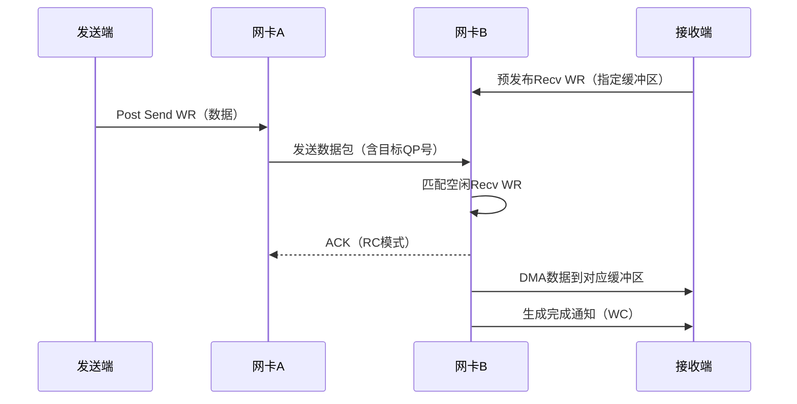
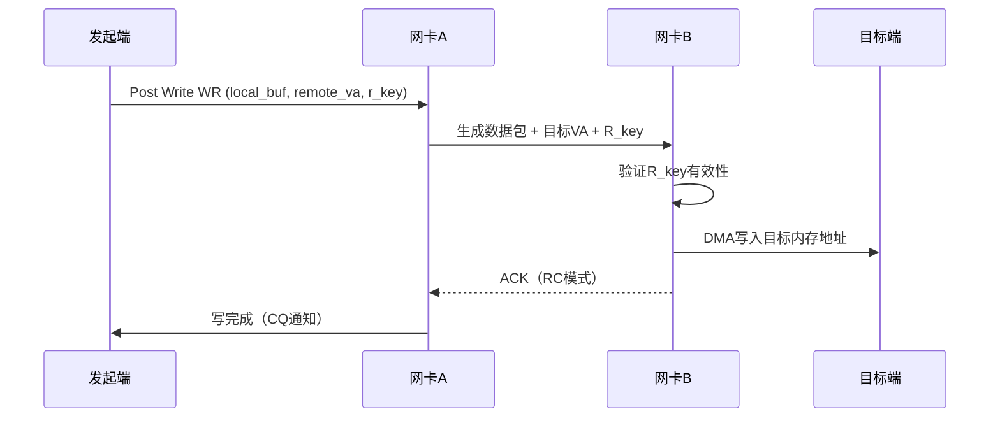
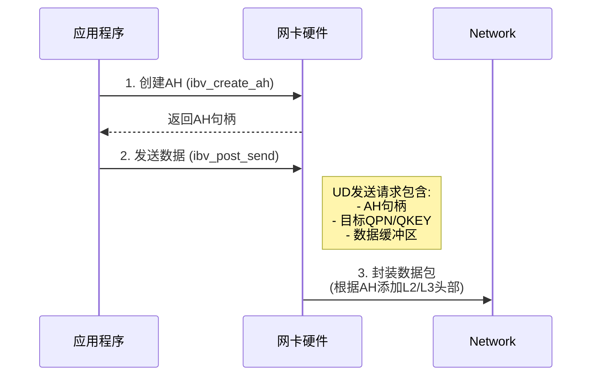

```table-of-contents
```
# 服务类型
## 连接方式：有连接和无连接的理解
### 有连接
**面向连接 (Connection-Oriented - CO)**：

**（1）机制：** 
在数据传输开始之前，两个QP（Queue Pair，队列对）之间必须显式地建立一条逻辑连接。
这通常通过交换连接参数（如QPN, PSN等）并确认来完成，==类似于TCP三次握手「通过三次握手协商一些信息」==。

通过交换：本端QP就可以绑定对端的`GID`，`QPN`等信息。

 **（2）特点：**
**路径固定**：连接建立后，数据包沿着固定的路径（虚拟通道）传输。
**状态维护**：通信双方（或HCA硬件）需要维护连接状态（如序列号、确认状态）。
**有序性保证（可选）**：某些连接类型（如RC）可以提供数据包按序到达的保证。
**可扩展性：** 1个QP通常只能连接1个远程QP（1:1）。连接多个对端需多个QP。

 **（3）开销：** 
连接建立/拆除有额外开销。

**（4）类比：** 
类似于打电话，需要先拨号接通（建立连接）才能通话（传输数据）。

### 无连接
**无连接 (Connectionless - CL)**：
QP并不绑定到特定的远程QP。==发送端在每个工作请求 (Work Request, WR) 中指定完整的目的地址信息，包括目标GID和QPN==。这种方式类似于UDP，无需预先建立连接，每个数据包独立寻址。

**（1）机制：** 
 无需预先建立连接。
 发送端QP直接将数据包发送到目标QP的地址（QPN + GID/LID）。接收端QP监听其地址以接收可能来自不同发送者的数据包。
==类似于UDP，不需要建立连接，指定对端的地址，就可以直接进行发送==。

**（2）特点：**
**路径可能变化**：数据包可能通过不同的网络路径到达。
**无状态**：通信双方（HCA）不需要为特定的通信对端维护连接状态信息。
**无序**：数据包到达顺序无法保证，可能与发送顺序不同。
**可扩展性：** 1个QP可同时与大量远程QP通信（1:N），只需知道对方地址。

**（3）开销：** 
无连接建立/拆除开销，每个数据包需携带完整的目标地址信息。

**（4）类比：** 
类似于寄信，只需知道对方地址（QPN+GID/LID「网络地址」），写好信（封装数据包）投入邮箱即可，无需事先建立连接。


### 两者对比

- **（1）管理开销：** 
RC/UC需要显式的连接管理（建立/销毁），UD/RD则没有此开销。

**（2）硬件友好性**
无连接：简化硬件设计（无状态）
有连接：复杂状态机换取功能丰富性

- **（3）可扩展性：**
UD/RD一个QP可以同时与非常多的远程QP通信（只需知道其地址），具有极好的可扩展性。
RC/UC一个QP通常只能与一个远程QP建立连接（1：1）；

- **（4）路径稳定性：** 
RC/UC提供稳定的虚拟路径；
UD/RD的数据包路径可能变化。

- **（5）组播支持：** 
只有UD原生支持将单个操作发送到多个目标QP（组播）。RC/UC/RD是单播（1：1）。


|**维度**|有连接 (RC/UC/XRC)|无连接 (UD/Raw)|
|---|---|---|
|**核心特征**|需预先建立端到端逻辑通道（QP对QP）|无预连接，直接指定目标地址发送|
|**状态维护**|存储连接状态（序列号、目标R_key等）|**无状态**，每次发送携带完整目标信息|
|**硬件成本**|高（需缓存连接上下文）|极低（无状态硬件）|

**连接性是内存语义的前提**：单边操作（Read/Write）需预先交换内存元数据（`虚拟地址 + R_key`），这些元数据必须存储在连接上下文中。无连接服务无法满足此需求。


## 可靠性：可靠传输和不可靠传输的理解

指传输层是否提供**端到端**的保证，确保数据包最终被正确无误地送达目标内存。

```bash
In RDMA, every packet has a CRC and corrupted packets are being dropped (for any transport type). The Reliability of a QP transport type refers to the whole message reliability.
```

注意：==可靠性指的是消息(message)的可靠性，而不是包的可靠性。每个包都有CRC校验，如果CRC校验不过，都会被丢弃==。

```bash
(1)Reliable: 
There is a guarantee that messages are delivered at most once, in order and without corruption.  

(2)Unreliable: 
There isn't any guarantee that the messages will be delivered or about the order of the packets.
```

### 可靠传输
**（1）机制：** 
提供端到端的传输保证。核心机制包括：
- **序列号 (Packet Sequence Number - PSN)：** 每个数据包携带唯一序列号。
- **确认 (Acknowledgements - ACK/NACK)：** 接收方对成功接收的数据包发送ACK，对丢失/损坏的数据包发送NACK。
- **超时重传 (Retransmission on Timeout)：** 发送方在未收到ACK/NACK超时后重传数据包。
- **CRC校验：** 验证数据包完整性。

**（2）保证：** 
确保数据包无丢失、无重复、无损坏（通过CRC校验）；
并且：
1> 对于面向连接的服务（比如：RC「有连接+可靠」），始终保证按序交付；
2> 对于无连接的服务（比如： RD 「无连接+可靠」），保证消息内按序交付「即：一次`post_send`发送的消息，被拆分为多个数据包，多个包之间可以按序交付；
但是多次`post_send`发送的消息，无法保证」。

**（3）开销：** 
需要维护序列号、处理`ACK/NACK`、管理重传缓冲区，增加了处理复杂性和潜在的延迟（等待ACK）。

### 不可靠传输
**（1）机制：** 
不提供端到端的传输保证。通常只有基本的CRC校验（可能硬件丢弃损坏包）。

**（2）特点：**
不保证数据包一定送达。可能丢失、损坏、重复、乱序。
- **无序列号/ACK/NACK：** 发送方不跟踪数据包是否到达或顺序。
- **无重传：** 数据包丢失或损坏即丢失。
- **无顺序保证：** 数据包到达顺序不确定。

**（3）开销：** 
极低，处理逻辑简单，延迟最小。

**（4）类比：**
类似于UDP，尽力而为交付，不保证可靠和有序。

### ACK 和 NACK/NAK
#### 定义
`ACK`和`NACK`是包，不是消息(message)。

#### NACK/NAK(否定确认)


#### RDMA中的ACK和NACK类比TCP中的机制
TCP不显式发送NACK，而是通过超时和重复ACK来隐式表示丢包。RDMA协议中NACK机制更直接，用于通知错误。


### 两者对比

- **传输保证：** 
RC/RD保证数据最终正确送达（除非发生不可恢复错误）。UC/UD不保证，应用层需要处理丢包/乱序。
- **延迟：**
UC/UD通常具有最低的延迟，因为没有ACK等待和重传逻辑。RC/RD的可靠机制会引入一定的延迟（尤其是等待ACK的延迟）。
- **CPU开销：**
RC/RD的可靠机制（序列号管理、ACK处理、重传）需要更多的HCA硬件资源和/或驱动软件参与，可能增加CPU开销。UC/UD处理极其轻量。
- **缓冲区管理：**
RC需要维护重传缓冲区；UD/RD通常不需要（应用需处理丢包重传或容忍）。


|**维度**|可靠 (RC/XRC)|不可靠 (UC/UD)|
|---|---|---|
|**传输保证**|数据不丢失、不乱序、不重复|可能丢包、乱序、重复|
|**实现机制**|序列号、ACK/NACK、重传、流量控制|无确认、无重传、无顺序保证|
|**延迟代价**|高（等待ACK/重传）|低（直接发送）|
|**适用操作**|支持所有操作（包括Read/Atomic）|不支持需响应的操作（如Read）|
|**设计目的**|提供强一致性保证|为延迟敏感场景牺牲可靠性|

**可靠性是复杂操作的基础**：RDMA Read和Atomic操作本质是==请求-响应模型==，需要严格的有序性和可靠性保证。不可靠服务无法支持此类操作。

## 消息语义和内存语义
指RDMA操作**如何访问和标识目标内存**。

### 消息语义
消息语义 (Message Semantics)：数据传递依赖收发双方协同，发送方推送消息到接收方预发布的缓冲区（双边操作）。

**(1)操作：** 
`Send`：发送数据到远端QP的接收队列
`Recv`：预声明缓冲区以接收消息


**(2)机制：**
==发起方仅发送“消息”，不显式指定目标内存地址==。
目标端必须提前发布`Recv Work Request (WR)` 到其接收队列(RQ)，这些`WR`指向用于存放接收数据的本地内存缓冲区。

**(3)目标感知：**
目标端`HCA/RX队列`感知消息到达！ 
当消息到达时，`HCA`根据接收队列中的`Recv WR`，将数据放入对应的目标缓冲区。
目标应用通过`CQ`感知消息到达并知道是哪个缓冲区收到了数据。

**(4)耦合性：** 
`Send/Recv`需要发送方和接收方的协作。
发送方发起`Send`，接收方必须==提前准备==好`Recv`来接收它。

#### 工作流(send/recv 为例)



#### 区分目标内存地址以及目标地址
目标地址：指的是对端的`QPN+GID/LID`。
目标内存地址：指定的是对端的虚拟内存地址。

### 内存语义
内存语义 (Memory Semantics / Memory Verbs)：发起端直接读写远端应用内存，无需远端CPU参与（零拷贝、单边操作）。

**(1) 操作：** 
`RDMA Write`：将本地数据写入远端内存
`RDMA Read`：从远端内存读取数据到本地
`Atomic`：远端内存的原子操作（CAS/FAADD等）

**(2) 机制：** 
==发起方指定目标内存地址==；
操作直接读写远程应用程序预先注册并告知的内存缓冲区的虚拟地址。

**（3）目标感知** ：
目标端`CPU/RX队列`无感知;
数据直接由`HCA`放入或取出目标内存。

**（4）单向性：** 
`Write/Read`本质是单向操作（发起方到目标内存 或 目标内存到发起方）。

#### 工作流(RDMA write为例)



#### 目标感知机制
##### 后续 Send 操作（最常见）
**后续 Send 操作（最常见）：** 
发起方在完成 RDMA Write 后，通常会紧接着向目标节点发送一个 **Send WR（携带一个小的通知消息或“Doorbell”）**。目标应用需要预先准备好一个接收请求（Recv WR）来接收这个 Send。
    - 当目标的 RNIC 收到这个 Send 消息并处理完目标的 Recv WR 时，**会在目标应用关联的接收 CQ 中放置一个 CQE**。
    - 目标应用通过轮询或事件方式感知到这个 Recv 的完成。
    - 这个 Recv 的完成通知隐含地表示：“之前发过来的 RDMA Write 数据已经就绪，可以安全使用了”。发起方 Send 的消息内容可以用来标识是哪个 Write 完成了（例如包含一个地址偏移量或序列号）。

##### 目标定期查看内存的标记
- **共享内存状态标志：** 
发起方在 RDMA Write 的数据缓冲区中，或者在一个单独的小块共享内存区域中，写入一个状态标志（例如，从一个值更新到另一个值）。目标应用需要定期轮询检查这个内存位置的标志位是否改变。这种方式延迟不确定（取决于轮询间隔），且容易产生缓存一致性问题（需要处理）。

##### write with imm
发起方可以发送一个 **write with Immediate Data** WR。
注：带有 imm 的 write，需要接收方的 `receive queue` 消耗一个 WR, 对应的WC中带有这个 `imm data`.

### 设计哲学
设计哲学：为什么需要两种语义？

**（1）安全与性能的权衡**
- 内存语义：牺牲安全性（暴露内存）换取极致性能
- 消息语义：通过缓冲区隔离保证安全，扩展性强

 **（2）硬件卸载的边界**
- **内存语义**：网卡需实现虚拟地址转换（`VA→PA`）和权限验证（`R_key`），复杂度高。
- **消息语义**：网卡仅需管理队列缓冲区，实现简单（适合UD/Raw等轻量级服务）。
    
**（3）应用场景的分化**
- 内存访问密集型（存储/数据库）→ 内存语义
- 通信密集型（HPC/ML）→ 消息语义


### 两者对比

|**维度**|内存语义 (Memory Semantics)|消息语义 (Message Semantics)|
|---|---|---|
|**操作类型**|单边 (Unilateral)|双边 (Bilateral)|
|**CPU参与**|**零参与**（网卡直操作内存）|接收方需发布Recv WR（参与协调）|
|**目标定位**|任意远程内存地址（需`VA + R_key`）|接收方预发布的缓冲区|
|**权限控制**|通过`R_key`验证内存区域|通过Recv WR授权缓冲区访问|
|**典型服务类型**|RC, UC, XRC|**所有类型**（RC/UC/UD/XRC/Raw）|
|**最大传输长度**|理论无上限（受内存区域大小限制）|受限（UD通常≤4KB）|
|**安全风险**|高（暴露内存地址）|低（缓冲区隔离）|


#### 性能特征对比

|**指标**|内存语义|消息语义|
|---|---|---|
|**延迟**|极低（单次操作≈0.5~1μs）|较高（需缓冲区匹配 + CQ通知）|
|**吞吐**|高（零拷贝 + 大块数据传输）|中低（小消息 + 多次交互）|
|**CPU开销**|**趋近于0**（完全卸载）|接收方需处理CQ事件|
|**扩展性**|差（1:1连接限制）|高（UD支持1:N通信）|
|**内存占用**|高（需注册大量内存区域）|低（循环使用缓冲区）|

#### 使用场景
##### 内存语义的黄金场景
比如：需要低延迟、高带宽 单向读写远程内存（如更新远程状态、读取远程数据）的场景。
需要绕过目标CPU（零拷贝，低开销）的场景。
需要执行原子操作（保证多节点内存操作的原子性，如锁、计数器）的场景。

**分布式存储系统**（如NVMe-oF）
- 需求：块设备远程读写（大块数据 + 零CPU开销）
- 操作：`RDMA Write`写入数据，`RDMA Read`读取元数据

**强一致性数据库**（如Spanner）
- 需求：跨节点内存同步（原子操作保证一致性）
- 操作：`Atomic CAS`更新锁状态，`RDMA Read`读取日志

**高频交易系统**
- 需求：纳秒级内存同步（订单簿更新）
- 操作：`RDMA Write`推送价格，`Atomic FAADD`更新计数

##### 消息语义的黄金场景

需要传统消息传递模型（类似TCP Socket/Send/Recv, MPI）。
需要目标应用明确知道消息到达并处理。
需要动态接收不同大小、不同来源的消息。

**集群通信框架**（如MPI）
- 需求：多节点广播/收集（AllReduce, Broadcast）
- 操作：`UD Send`组播梯度参数

**流式数据处理**（如Kafka生产者）
- 需求：小消息流水线传输（容忍乱序）
- 操作：`UC Send`推送消息批次
        
**控制平面信令**
- 需求：低延迟心跳/配置更新
- 操作：`UD Send with Imm`传递指令（立即数标记类型）


## 服务类型的划分
RDMA（Remote Direct Memory Access）的核心价值在于提供低延迟、高吞吐量、低CPU开销的远程内存直接访问能力。
其服务类型（Transport Service Type）根据**连接方式**（面向连接 vs. 无连接）和**可靠性**（可靠 vs. 不可靠）两个关键维度进行划分，形成了四种主要的服务类型。


### RC（可靠+有连接）
### RD（可靠+无连接）

#### Ib spec规范中有说明RD但`libibvers`中未实现
```c
// libibverbs/verbs.h, 如下所示，并没有 RD的实现
enum ibv_qp_type {
    IBV_QPT_RC = 2,
    IBV_QPT_UC,
    IBV_QPT_UD,
    IBV_QPT_RAW_PACKET = 8,
    IBV_QPT_XRC_SEND = 9,
    IBV_QPT_XRC_RECV,
    IBV_QPT_DRIVER = 0xff,
};
```

### UC（不可靠+有连接）
### UD（不可靠+无连接）
UD 的核心设计目标是提供**低延迟、无连接、不可靠、消息边界保留**的数据报传输。

### XRC(extend RC)

### RAW

### 各个服务类型的属性对比


### 服务类型的选择


## 服务类型和操作之间的关系

RDMA 的服务类型定义了数据传输的语义（可靠性、连接性、排序）。操作定义了具体的数据搬运方式。
组合关系如下表：

|**操作**|RC|UC|UD|XRC|Raw|
|---|---|---|---|---|---|
|**Send**|✅|✅|✅|✅|✅|
|**Send with Immediate**|✅|✅|✅|✅|✅|
|**RDMA Write**|✅|✅|❌|✅|❌|
|**RDMA Write with Imm**|✅|✅|❌|✅|❌|
|**RDMA Read**|✅|❌|❌|✅|❌|
|**Atomic Operations**|✅|❌|❌|✅|❌|

### 操作维度
#### send
- **支持所有服务类型：** 
- 因为它是双边操作，依赖接收方预发布的缓冲区（Recv WR），无需知道对方内存地址。
- 硬件只需将数据放入提前预设的缓冲区，不涉及远程内存直接访问。

#### send with imm
**支持所有服务类型**：包括 UD 和 Raw，与基础 Send 操作一致。
本质仍是**双边操作**，依赖接收方预发布的缓冲区（Recv WR）。
不涉及远程内存直接访问（无需 `R_key`），因此不受连接性或可靠性约束。

**立即数（Immediate Data）**： 作为带外元数据（32-bit整数），由硬件直接写入接收端的 工作完成项（WC），不占用应用数据缓冲区。

##### 优势
（1）无需占用接收端应用数据缓冲区
立即数通过硬件直接写入接收端的 WC，无需占用接收端应用数据缓冲区，避免额外数据解析开销。

（2）比通过数据负载传递更快
可用作轻量级信号（如消息类型标识、事务ID、错误码），比通过数据负载传递更快。

##### 操作流程
(1) 发送端：
```c
struct ibv_sge sg = {数据缓冲区};  
struct ibv_send_wr wr = {
  .opcode = IBV_WR_SEND_WITH_IMM,
  .imm_data = htonl(0x1234),  // 4字节立即数（网络字节序）
  .sg_list = &sg,
  .num_sge = 1
};
```

（2）接收端：在完成队列（CQ）的工作完成项（WC）中获取立即数：
```c
if (wc->opcode == IBV_WC_RECV) {
  uint32_t imm_value = ntohl(wc->imm_data);  // 从WC提取立即数
}
```


#### write
- **需要连接状态（RC/UC/XRC）：** 
发起方必须知道目标内存地址和 `R_key`（在连接建立时交换）。

- **UC vs RC：** 
UC 支持 Write，因为它只需要单边操作语义和基本连接状态（包含目标地址/R_key）。
虽然传输不可靠（可能丢包,无重传机制），适用于容忍丢包的场景（如视频流）。但协议本身允许发起方直接写入目标内存。可靠性由应用层保证（如果需要）。

#### write with imm

##### write with imm 和 send with imm 对比
对比 `SEND_WITH_IMM` 和 `RDMA_WRITE_WITH_IMM` 的区别：

|**特性**|Send with Imm|Write with Imm|
|---|---|---|
|**操作类型**|双边操作（依赖Recv WR）|单边操作（直接写内存）|
|**目标地址**|接收方指定的缓冲区|发起方指定的远程内存地址|
|**是否需要 R_key**|否|**是**（需远程内存权限）|
|**支持服务类型**|所有类型（含UD/Raw）|仅需连接的类型（RC/UC/XRC）|

**根本原因**：  
`RDMA_WRITE_WITH_IMM` 本质是 **Write + 立即数通知**。

#### read
 Read 是请求-响应操作，复杂度最高。

- **需要连接状态：** 发起方需要目标内存地址/R_key，目标方需要知道请求的来源并返回数据到发起方指定的本地内存（也需要地址/L_key）。这需要双向连接状态。
	
- **需要可靠性（RC, XRC）：** 请求包或响应包丢失会导致操作失败或挂起。因此，它必须在可靠传输（RC, XRC）上运行。UC 的不可靠性使其无法支持 Read。
	
- **需要序列号/确认：** 匹配请求和响应，保证有序和可靠交付。

#### Atomic Operations
 原子操作本质上是特殊的 Read-Modify-Write。它们具有与 RDMA Read 相同的需求：需要精确的目标地址/R_key、请求-响应交互、以及极高的可靠性保证，因此只能在 RC 和 XRC 上执行。

### 操作类型和产生的CQE的opcode的关系

|操作类型|发送端 WR opcode|发送端 CQE opcode|接收端是否需要 post recv|接收端 CQE opcode|是否有 imm|如何判断 imm 有效|
|---|---|---|---|---|---|---|
|**Send**|`IBV_WR_SEND`|`IBV_WC_SEND`（需 signaled）|必须|`IBV_WC_RECV`|无|不适用|
|**Send with imm**|`IBV_WR_SEND_WITH_IMM`|`IBV_WC_SEND`（需 signaled）|必须|`IBV_WC_RECV`|有|`wc_flags & IBV_WC_WITH_IMM`|
|**RDMA Write**|`IBV_WR_RDMA_WRITE`|`IBV_WC_RDMA_WRITE`（需 signaled）|不需要|无 CQE|无|不适用|
|**RDMA Write with imm**|`IBV_WR_RDMA_WRITE_WITH_IMM`|`IBV_WC_RDMA_WRITE`（需 signaled）|必须|`IBV_WC_RECV_RDMA_WITH_IMM`|有|opcode 已保证（也可检查 flag）|
|**RDMA Read**|`IBV_WR_RDMA_READ`|`IBV_WC_RDMA_READ`（需 signaled）|不需要|无 CQE|无|不适用|


**wc中几个重要的字段：wr_id， imm_data, wc_flags, opcode， status**

```c
The struct ibv_wc describes the Work Completion attributes.

struct ibv_wc {
    uint64_t        wr_id;
    enum ibv_wc_status  status;
    enum ibv_wc_opcode  opcode;
    uint32_t        vendor_err;
    uint32_t        byte_len;
    uint32_t        imm_data;
    uint32_t        qp_num;
    uint32_t        src_qp;
    int             wc_flags;
    uint16_t        pkey_index;
    uint16_t        slid;
    uint8_t         sl;
    uint8_t         dlid_path_bits;
};
```

### 服务类型维度


# UD
## 概念
### Q_Key

### AH

在RDMA的**不可靠数据报（UD）** 服务类型中，**AH（Address Handle）** 是实现无连接通信的核心组件。

#### AH是什么？
AH（Address Handle） 是一个**路径上下文对象**，封装了从本地QP发送数据到**目标QP所在节点**所需的完整网络路径信息。
其作用==类似于传统网络中UDP Socket的"目标地址+端口"==，但额外包含RDMA链路层的关键参数。

```c
struct ibv_global_route {
    union ibv_gid       dgid; /* dest gid */
    uint32_t        flow_label;
    uint8_t         sgid_index;
    uint8_t         hop_limit;
    uint8_t         traffic_class;
};


struct ibv_ah_attr {
    struct ibv_global_route grh;
    uint16_t        dlid;
    uint8_t         sl;
    uint8_t         src_path_bits;
    uint8_t         static_rate;
    uint8_t         is_global;
    uint8_t         port_num;
};

struct ibv_ah {
    struct ibv_context     *context;
    struct ibv_pd          *pd;
    uint32_t        handle;
};

struct ibv_ah *ibv_create_ah(struct ibv_pd *pd, struct ibv_ah_attr *attr);
```

#### 为什么UD服务必须使用AH
UD作为无连接（Connectionless）服务，每次发送数据包时需明确告知网卡（HCA）：

1. **目标主机在哪里？** （网络地址：GID/LID + 子网信息）
2. **如何到达目标主机？** （路径参数：SL、VL、Hop Limit等）
3. **目标QP是谁？** （目标QP号：QPN）

AH将这些信息**预封装**成一个轻量级句柄，解决以下问题：

|**问题**|**AH的解决方案**|
|---|---|
|避免每次发送携带完整地址|预存路径信息，发送时仅传递AH句柄|
|加速硬件寻址|HCA直接解析AH，无需软件查表|
|支持多路径|不同AH可指向同一主机的不同路径|

> **关键原因**：==UD无连接特性，要求独立路由每个数据包，AH通过预存路径信息实现硬件加速==。

#### AH的工作原理

##### AH的核心字段
```c

```

|**字段**|**InfiniBand**|**RoCEv2 (以太网)**|**作用**|
|---|---|---|---|
|目标地址|DLID (Destination LID)|DGID (Destination GID)|目标节点的网络标识|
|源地址|SLID (Source LID)|SGID (Source GID)|源节点的网络标识|
|服务等级|SL (Service Level)|DSCP/TOS (IP层)|控制带宽/优先级|
|虚拟通道|VL (Virtual Lane)|无|避免网络阻塞|
|跳数限制|Hop Limit|TTL (Time-To-Live)|防止环路|
|目标QP号|Dest QPN|Dest QPN|指定目标节点的接收QP|
|端口号|Port Num|UDP源/目标端口 (RoCEv2)|区分不同服务|

##### 数据发送流程





#### 注意事项
##### AH的生命周期管理
- **创建开销**：`ibv_create_ah()` 需访问内核，**避免频繁创建销毁**。
- **复用策略**：对同一目标节点**缓存AH**（如使用hash表管理）。

##### QKEY的作用
- UD数据包必须携带`remote_qkey`，接收方QP会校验其是否匹配本地`qkey`。
- **安全建议**：使用随机生成的QKEY（非默认0x01234567）防止非法访问。

##### 多网络环境适配
- **InfiniBand**：AH依赖LID和路径计算。
- **RoCEv2**：AH封装DGID/SGID和UDP端口（默认为4791）。

##### 错误处理
- **AH失效场景**：网络拓扑变更（如交换机重启）需重建AH。
- **检测方法**：发送失败返回`IBV_WC_REM_ACCESS_ERR`错误码。

##### 性能优化技巧
**AH池化** 为常用目标节点预创建AH，避免发送路径上的动态创建开销。
**轻量级QKEY更新** 无需重建QP，通过`ibv_modify_qp()`动态更新QKEY提升安全性。
**RoCEv2的UDP端口重用** 同一主机上不同QP的通信可使用相同UDP端口（4791）减少AH参数差异。

### GRH（全局路由头）
GRH 本质上就是一个 **简化版的 IPv6 头**，一共是40B；如下所示：

```bash
0                   1                   2                   3
0 1 2 3 4 5 6 7 8 9 0 1 2 3 4 5 6 7 8 9 0 1 2 3 4 5 6 7 8 9 0 1
+-+-+-+-+-+-+-+-+-+-+-+-+-+-+-+-+-+-+-+-+-+-+-+-+-+-+-+-+-+-+-+-+
|Version| Traffic Class |           Flow Label                  |
+-+-+-+-+-+-+-+-+-+-+-+-+-+-+-+-+-+-+-+-+-+-+-+-+-+-+-+-+-+-+-+-+
|         Payload Length        |  Next Header |  Hop Limit     |
+-+-+-+-+-+-+-+-+-+-+-+-+-+-+-+-+-+-+-+-+-+-+-+-+-+-+-+-+-+-+-+-+
|                                                               |
+                                                               +
|                                                               |
+                       Source GID (128 bit)                    +
|                                                               |
+                                                               +
|                                                               |
+-+-+-+-+-+-+-+-+-+-+-+-+-+-+-+-+-+-+-+-+-+-+-+-+-+-+-+-+-+-+-+-+
|                                                               |
+                                                               +
|                                                               |
+                 Destination GID (128 bit)                     +
|                                                               |
+                                                               +
|                                                               |
+-+-+-+-+-+-+-+-+-+-+-+-+-+-+-+-+-+-+-+-+-+-+-+-+-+-+-+-+-+-+-+-+
```

字段说明：
```bash
Version（4 bit）：
	固定 = 6，表示基于 IPv6 格式
	
Traffic Class（8 bit）：
	DSCP (6 bit) + ECN (2 bit)
	用途：QoS / 拥塞控制（RoCEv2 很关键）

Flow Label（20 bit）：
	用于流标识，一般都是0；

Payload Length（16 bit）：
	后续 payload 大小

Next Header（8 bit）：
	下一层协议；
	常见值：
	- UDP（RoCEv2）
	- IB BTH（InfiniBand）

Hop Limit（8 bit）：
	类似 TTL

Source GID（128 bit）：
	发送端的 GID

Destination GID（128 bit）：
	接收端的 GID
```


## UD下send 和 recv
### UD的recv
#### UD无连接，那么接收端如何知道是谁发的报文

## UD服务WC的产生

发送端和接收端的WC的产生时机如下：


```bash
(1) Requester considers a message operation complete once the (one packet) message was sent to the fabric.
(2) Responder considers a message operation complete once it received a complete message and it written the data to its (local) memory.
```

### 发送端Signaled的SR的WC产生的时机


```bash

```

### 接收端WC产生的时机


## 特点
### 无连接：有可能一个机器的多个QP，给另外一个机器的一个QP发送消息

### 不可靠：UD的包中不存在psn
`UD`由于是不可靠连接，不保证包是否达到，是否有序等，因此包中不存在`PSN`。即：BTH中的PSN号是无效的；
如果想要`UD`变得可靠：可能需要在应用层(比如：payload data)中添加`PSN`、`ACK`等可靠性机制。

### 无状态

## UD和数据分段、IP分片
### UD：一个 WR （消息）就是一个报文
==UD不支持对大的消息进行MTU拆分为多个包，意味着，UD模式下 ，一个消息（或者一个WR），就是一个包。因此，限制消息的大小为MTU==。


### 为什么 RDMA UD 不支持按 MTU 拆分消息？

**为什么 RDMA UD 不能像 RC 一样，让网卡自动对大消息按照MTU进行分片（segmentation）？**

结论先说清楚：UD 不支持超过 MTU 的自动分片，不是因为做不到，而是因为：一旦支持，就必须引入可靠性和状态管理，从而失去 UD 的本质价值，==UD 的核心语义（无连接、无状态、低开销）== 。

UD 的设计契约其实非常简单：
```bash
1 个 WR (Work Request)
    ↓
1 个 Packet（完整、独立、原子）
```

这个“==原子性==”非常关键：要么这个 packet 到达，要么丢掉，**不存在“半个消息”**。

#### 如果UD服务类型，允许 NIC 基于MTU进行分片，会发生什么？
假设你发 64KB：
```bash
WR (64KB)
   ↓
NIC 切成 16 个 packet（每个 4KB）
```


**问题1：丢包导致语义崩塌**
UD 是不可靠的， 如果丢了第 7 个 packet，接收端收到的是：
```bash
1 2 3 4 5 6 ❌ 8 9 ...
```
那这个 WR 算：
- 成功？（错）
- 失败？（但部分数据已经交付了）
- 重传？（UD 没这个机制）

**问题2：接收端无法重组**
UD 的 recv 是这样的：`ibv_post_recv(qp, recv_wr)`, 每个 recv buffer = 接收一个 packet；
它不知道：
- 这个 packet 属于哪个“message”
- 一共有多少片
- 顺序是什么

因为：**UD header 里PSN无效，也没有 segmentation 信息**；

# RC
## RC下read 和 write

## RC下send 和 recv

## WC的产生

```bash
(1) Requester considers a message operation complete once there is an ack from the responder side that the message was read/written to its memory.

(2) Responder considers a message operation complete once the message was read/written to its (local) memory.
```


### 发送端WC产生的时机
### 接收端WC产生的时机

## UD和RC对比


# XRC

**扩展可靠连接（XRC：Extended Reliable Connection，XRC）** 是`InfiniBand`规范的后续补充，显著减少大型集群连接所需的`QP`数量，专为**多对多通信**设计。
在`XRC`中，一个`XRC`发起`QP`可与远程节点的所有进程通信，将集群连接总数降低至进程数的倍数。


## 背景
**传统 RC（Reliable Connection）的瓶颈**：
    - 每个通信对端需创建独立的 QP（Queue Pair），当节点数量增加时，QP 数量呈平方级增长（例如 1000 节点需 100 万 QP），严重消耗资源。

## 介绍

**XRC 的改进**：
- 通过共享接收资源（XRC SRQ）和复用发送端 QP，将 QP 数量从 O(N2) 降低到 O(N)，显著提升扩展性。


XRC 把 QP 拆成了两种：

|方向|QP 类型|所在端|说明|
|---|---|---|---|
|连接发起方「主动方」|XRC Initiator|**Client**|每个连接一个，必须的|
|连接接收方「被动方」|XRC Target|**Server**|**多个连接可以共享一个**|

有 N 个连接：
**Client**：
- 需要为每个连接创建 **XRC Initiator QP** → **N 个 QP**
- 消耗与 RC 模式相同（无法减少）

**Server**：
- 创建 **一个或少量 XRC Target QP**，被所有 client QP 共享
- **QP 数量与连接数无关，可以仅用 1 个**


|模式|Client QP 数量|Server QP 数量|总体效果|
|---|---|---|---|
|**RC**|N|N|对等连接，资源线性增长|
|**XRC**|N|**<< N（通常为 1）**|**大幅减少 server 端 QP 数量**|

举例如下：

|模式|Client QP 数量|Server QP 数量|
|---|---|---|
|RC|1000|1000|
|XRC|1000|**1–N（典型为 1）**|


## XRC domain

## XRC和RC对比

## XRC和SRQ对比

### 类比
假设你有很多人要给一个仓库送快递包裹：
- **RC 模式**：每个快递员（连接）都需要专属收货人（接收QP）和仓库（RQ）；
- **SRQ 模式**：每个快递员仍有独立的收货人（QP），但他们共用一个仓库（RQ）；
- **XRC 模式**：很多快递员共用一个收货人（共享QP），由这个收货人将包裹放入仓库；
- **XRC + SRQ**：快递员共用收货人，这个收货人再把包裹放进一个共享仓库。


## XRC和DCT对比
`RDMA DCT（Dynamic Connected Transport）`

# 共享QP（Shared QP, SQP）
## 级别
### 一个线程中多个连接共享QP
#### 场景
某个`client` 和 某个`server`端在`RC`模式下，每个一对一的线程中都存在多个连接，多个连接复用一个`QP`。
如果每个 `client` 和 `server` 都只是存在一个连接，都将消耗一个`QP`，那么就无法多个连接共享QP。

### 一个进程中的多个线程共享QP
#### 场景
比如：块存场景。
client（BS: block server）和server(CS: chunk server)端都是存在多个线程，client的每个线程和Server的每个线程都存在一个长连接。
那么每个client 单进程存在的连接的个数为：`N*M*K`；如果一个连接消耗一个QP，那么就会消耗`N*M*K`个QP。
```bash
N: client的线程的个数
M: server的线程的个数
K: 集群中server的个数
```

#### 目标
如果可以`一个进程中的多个线程共享QP`, 那么单机虽然存在`N*M*K`个连接，但是可能消耗 K个QP。


### 一个节点上的多个进程复用QP
#### 场景
即：RDMA支持容器场景。
比如，一个物理机器上存在多个容器，每个容器中跑相同的业务进程，使用RDMA进行通信。


# 其他
## 减少QP的数量
### 背景
### 目标
既减少 client 的 QP 数量，又减少 server 的 QP 数量


### 方案

|技术|是否能减少 client QP 数量|是否能减少 server QP 数量|备注|
|---|---|---|---|
|**RC**|❌ 不行|❌ 不行|每连接一对 QP|
|**XRC**|❌ 不行|✅ 可以显著减少|client 端 QP 仍为 N|
|**UD**|✅ 可以共享 QP|✅ 可以共享 QP|但仅支持 unreliable、无连接|
|**DC (DCT/DCI)**|✅ 可以显著减少|✅ 可以显著减少|需硬件支持，适合大规模|


#### 使用 UD（Unreliable Datagram）
**QP 数量**：只需要 1 个 UD QP 就可以和多个对端通信；双方（client/server）均可减少 QP 数量。
**缺点**：
- 无连接，不可靠（无重传、乱序）
- 只支持 send/recv，不支持 RDMA read/write
- 应用层需保证可靠性（如 ACK 超时重传）

**适用于**：
- 多播、广播、服务发现
- 不要求可靠性的轻量级通信

#### 使用 DCT（Dynamically Connected Transport）

DC 是 Mellanox/NVIDIA 提出的可扩展连接模型，支持数万个连接的高效实现。

**概念**：
- DCI（Initiator）：client 用一个或少量 DCI 发起连接（共享）
- DCT（Target）：server 上创建 DCT，供所有 client 动态连接
- QP 是由 driver 动态管理的，**client 和 server 都可以用非常少的 QP 支撑很多连接**

**特点**：

|项目|描述|
|---|---|
|可靠性|✅ 是 reliable 的|
|支持操作|✅ send/recv, RDMA read/write|
|client/server QP 数|❗ 少量（比如几十个 DCI/DCT 支撑数万个连接）|
|前提条件|**RNIC 硬件必须支持（如 ConnectX-4/5/6）**|

**适用于**：
- 高并发 RPC
- 数据中心 scale-out 场景

#### RDMA Connection Multiplexing / QP 共享技术（上层协议层）

一种**应用层多路复用连接**的策略，思想类似于：
- Client 和 Server 都只用少量 QP（比如每进程几个）
- 多个“逻辑连接”通过自定义协议复用同一个QP
- 类似 HTTP/2 复用或 QUIC stream


**实现方式：**
- 使用 UD + 应用协议
- 或在 RC/XRC 上维护“虚拟 connection id”，让上层协议调度数据流
    

**代表项目：**
- eRPC（有效支持大规模 connection with few QPs）


# 参考
```bash
# RDMA(5)服务类型：RC向左，UD向右
https://mp.weixin.qq.com/s/Auj5wY_ucKFGAxpF1zeCow

# 关于RDMA你想知道的一切：深入解析与技术洞见（SNIA网络研讨会）
https://mp.weixin.qq.com/s/C9hSTCAUgpdzSbB4IDfkQA
```