```table-of-contents
```
# 概述
用户空间程序使用称为verbs的函数直接访问 RDMA NIC（RNIC）。要将Verbs 发布到 RNIC，应用程序会调用用户态 RDMA 驱动程序。 然后，驱动程序在主机的内存中准备一个工作队列元素 (Work Queue Element ，WQE)，并通过程序化 IO (Programmed IO，PIO：也就是 MMIO) 在 RNIC 上敲响门铃。

# `libibverbs`库
```bash
git clone git://git.kernel.org/pub/scm/libs/infiniband/libibverbs.git
```

出现下面的说明：
```text
The libibverbs git repo is no longer in use.  The libibverbs package,
as well as all other RDMA related packages that directly open and use
the various kernel device files specific to the RDMA subsystem, have
been pulled together into a single package called rdma-core that is
now hosted on github:

git://github.com/linux-rdma/rdma-core

All future code and releases will be through signed tags in the above
repository.

Thanks,

The linux RDMA community.
```

## 查看`libibverbs`库的版本
### 方法一：`pkg-config --modversion`
```bash
# pkg-config --modversion libibverbs
1.10.30.0
```

### 方法二：`/lib64/libibverbs.so.1*`
```bash
# ll /lib64/libibverbs.so.1*
lrwxrwxrwx 1 root root     23 Aug 30  2022 /lib64/libibverbs.so.1 -> libibverbs.so.1.10.30.0
-rwxr-xr-x 1 root root 118920 Aug 30  2022 /lib64/libibverbs.so.1.10.30.0
如上所示，libibverbs的版本是 1.10；

通过 strings 命令，同样可以确定，如下所示：

$ strings /lib64/libibverbs.so.1.10.30.0 |grep VERBS
IBVERBS_1.0
IBVERBS_1.1
IBVERBS_1.5
IBVERBS_1.6
IBVERBS_1.7
IBVERBS_1.8
IBVERBS_1.9
IBVERBS_1.10
IBVERBS_PRIVATE_25
```

### 范例

范例如下所示：
```bash
# 查看当前安装的 libibverbs rpm包
# yum list installed |grep libibverbs
libibverbs.x86_64              51mlnx1-1.51237          installed
libibverbs-utils.x86_64        51mlnx1-1.51237          installed

# 查看 libibverbs 的具体版本
# pkg-config --modversion libibverbs
1.10.30.0

# 查找 libibverbs.pc 文件
# find /usr -name "libibverbs.pc"
/usr/lib64/pkgconfig/libibverbs.pc


# 查看 libibverbs.pc 文件内容
# cat /usr/lib64/pkgconfig/libibverbs.pc
prefix=/usr
exec_prefix=${prefix}
libdir=${prefix}//usr/lib64
includedir=${prefix}//usr/include

Name: libibverbs
Description: RDMA Core Userspace Library
URL: https://github.com/linux-rdma/rdma-core
Version: 1.10.30.0
Libs: -L${libdir} -libverbs
Libs.private:  -lmlx5 -libverbs -lpthread
Requires.private: libnl-3.0, libnl-route-3.0
Cflags: -I${includedir}

# rpm -qf /usr/lib64/pkgconfig/libibverbs.pc
rdma-core-devel-51mlnx1-1.51237.x86_64

```


如下所示：查看 `rdma-core-devel` 包的内容。
```bash
# rpm -ql rdma-core-devel
/usr/include/infiniband
/usr/include/infiniband/acm.h
/usr/include/infiniband/acm_prov.h
/usr/include/infiniband/arch.h
/usr/include/infiniband/ib.h
/usr/include/infiniband/ib_user_ioctl_verbs.h
/usr/include/infiniband/ibnetdisc.h
/usr/include/infiniband/ibnetdisc_osd.h
/usr/include/infiniband/mad.h
/usr/include/infiniband/mad_osd.h
/usr/include/infiniband/mlx5_api.h
/usr/include/infiniband/mlx5_user_ioctl_verbs.h
/usr/include/infiniband/mlx5dv.h
/usr/include/infiniband/opcode.h
/usr/include/infiniband/sa-kern-abi.h
/usr/include/infiniband/sa.h
/usr/include/infiniband/tm_types.h
/usr/include/infiniband/umad.h
/usr/include/infiniband/umad_cm.h
/usr/include/infiniband/umad_sa.h
/usr/include/infiniband/umad_sa_mcm.h
/usr/include/infiniband/umad_sm.h
/usr/include/infiniband/umad_str.h
/usr/include/infiniband/umad_types.h
/usr/include/infiniband/verbs.h
/usr/include/infiniband/verbs_api.h
/usr/include/rdma
/usr/include/rdma/rdma_cma.h
/usr/include/rdma/rdma_cma_abi.h
/usr/include/rdma/rdma_verbs.h
/usr/include/rdma/rsocket.h
/usr/lib64/libibmad.a
/usr/lib64/libibmad.so
/usr/lib64/libibnetdisc.a
/usr/lib64/libibnetdisc.so
/usr/lib64/libibumad.a
/usr/lib64/libibumad.so
/usr/lib64/libibverbs.a
/usr/lib64/libibverbs.so
/usr/lib64/libmlx5.a
/usr/lib64/libmlx5.so
/usr/lib64/librdmacm.a
/usr/lib64/librdmacm.so
/usr/lib64/pkgconfig/libibmad.pc
/usr/lib64/pkgconfig/libibnetdisc.pc
/usr/lib64/pkgconfig/libibumad.pc
/usr/lib64/pkgconfig/libibverbs.pc
/usr/lib64/pkgconfig/libmlx5.pc
/usr/lib64/pkgconfig/librdmacm.pc

# rpm -q --whatrequires rdma-core-devel
no package requires rdma-core-devel

# rpm -qR rdma-core-devel
/usr/bin/pkg-config
ibacm(x86-64) = 51mlnx1-1.51237
infiniband-diags(x86-64) = 51mlnx1-1.51237
libibmad.so.5()(64bit)
libibnetdisc.so.5()(64bit)
libibumad(x86-64) = 51mlnx1-1.51237
libibumad.so.3()(64bit)
libibverbs(x86-64) = 51mlnx1-1.51237
libibverbs.so.1()(64bit)
libmlx5.so.1()(64bit)
librdmacm(x86-64) = 51mlnx1-1.51237
librdmacm.so.1()(64bit)
pkgconfig(libibmad)
pkgconfig(libibumad)
pkgconfig(libibverbs)
pkgconfig(libnl-3.0)
pkgconfig(libnl-route-3.0)
rdma-core(x86-64) = 51mlnx1-1.51237
rpmlib(CompressedFileNames) <= 3.0.4-1
rpmlib(FileDigests) <= 4.6.0-1
rpmlib(PayloadFilesHavePrefix) <= 4.0-1
rpmlib(PayloadIsXz) <= 5.2-1


# ofed_rpm_info | grep -i -e rdma -e core
mlnx-nfsrdma 5.1 OFED.5.1.2.3.7.1
rdma-core 51mlnx1 1
```

## libibverbs-utils 和 libibverbs 库
```bash
# yum list installed |grep libibverbs
libibverbs.x86_64              51mlnx1-1.51237          installed
libibverbs-utils.x86_64        51mlnx1-1.51237          installed

# rpm -ql libibverbs
/etc/libibverbs.d
/etc/libibverbs.d/mlx5.driver
/usr/lib64/libibverbs
/usr/lib64/libibverbs.so.1
/usr/lib64/libibverbs.so.1.10.30.0
/usr/lib64/libibverbs/libmlx5-rdmav25.so
/usr/lib64/libmlx5.so.1
/usr/lib64/libmlx5.so.1.14.30.0
/usr/share/doc/libibverbs-51mlnx1
/usr/share/doc/libibverbs-51mlnx1/libibverbs.md

# rpm -ql libibverbs-utils
/usr/bin/ibv_asyncwatch
/usr/bin/ibv_devices
/usr/bin/ibv_devinfo
/usr/bin/ibv_rc_pingpong
/usr/bin/ibv_srq_pingpong
/usr/bin/ibv_uc_pingpong
/usr/bin/ibv_ud_pingpong
/usr/bin/ibv_xsrq_pingpong
/usr/share/man/man1/ibv_asyncwatch.1.gz
/usr/share/man/man1/ibv_devices.1.gz
/usr/share/man/man1/ibv_devinfo.1.gz
/usr/share/man/man1/ibv_rc_pingpong.1.gz
/usr/share/man/man1/ibv_srq_pingpong.1.gz
/usr/share/man/man1/ibv_uc_pingpong.1.gz
/usr/share/man/man1/ibv_ud_pingpong.1.gz
/usr/share/man/man1/ibv_xsrq_pingpong.1.gz


```

## API

### 介绍


### 是否线程安全
`libibvers`的`API`是线程安全的。


### 是否fork安全
`libibvers`的`API`不是`fork`安全的


### API分类

通过 `InfiniBand` 发送消息的主要方法是通过 `Verbs API`。`libibverbs` 是此 API 的标准实现，由 `Linux-RDMA` 社区维护。
`Verbs` 中有两种函数：慢速路径函数和快速路径函数。
（1）慢速路径函数（例如 ibv_open_device、ibv_alloc_pd 等）与资源（例如上下文、保护域和内存区域）的创建和配置有关。
它们之所以被称为“慢速”，是因为它们涉及内核，因此会产生上下文切换的昂贵开销。

（2）快速路径函数（例如 ibv_post_send、ibv_poll_cq 等）处理操作的启动和完成。
它们之所以被称为“快速”，是因为它们绕过内核，因此比慢速路径函数快得多。通信的关键路径主要由快速路径函数组成，有时还包括慢速路径函数（例如 ibv_reg_mr），用于动态注册内存区域（取决于通信中间件）。

#### 数据路径(快路径)的API
```c
The following verbs are considered as data operations:

ibv_post_send()
ibv_post_recv()
ibv_post_srq_recv()
ibv_poll_cq()
ibv_req_notify_cq
```


经验：在数据路径（即 数据线程中），尽量避免或者减少 控制操作API的调用。

#### 控制路径(慢路径)的API

其他的，非上面的数据路径的API，就是控制路径的API。
控制路径的API，可能涉及到上下文转换，RDMA设备的访问，资源的申请以及释放，会造成`cache miss`等，影响性能。


### 设备函数(Device functions)
```c
struct ibv_device **ibv_get_device_list(int *num_devices);
 
void ibv_free_device_list(struct ibv_device **list);
 
const char *ibv_get_device_name(struct ibv_device *device);
 
uint64_t ibv_get_device_guid(struct ibv_device *device);
```

### 上下文函数(Context functions)
```c
struct ibv_context *ibv_open_device(struct ibv_device *device);
 
int ibv_close_device(struct ibv_context *context);
```

### 查询函数(Query functions)
```c
int ibv_query_device(struct ibv_context *context,
                     struct ibv_device_attr *device_attr);
 
int ibv_query_port(struct ibv_context *context, uint8_t port_num,
                   struct ibv_port_attr *port_attr);
 
int ibv_query_pkey(struct ibv_context *context, uint8_t port_num,
                   int index, uint16_t *pkey);
 
int ibv_query_gid(struct ibv_context *context, uint8_t port_num,
                  int index, union ibv_gid *gid);
```

### 异步事件(Asynchronous events)函数
```c
int ibv_get_async_event(struct ibv_context *context,
                        struct ibv_async_event *event);
 
void ibv_ack_async_event(struct ibv_async_event *event);
```


### PD(Protection Domains)相关函数
```c
struct ibv_pd *ibv_alloc_pd(struct ibv_context *context);
 
int ibv_dealloc_pd(struct ibv_pd *pd);
```

### MR(Memory Regions)相关函数
```c
struct ibv_mr *ibv_reg_mr(struct ibv_pd *pd, void *addr,
                          size_t length, enum ibv_access_flags access);
 
int ibv_dereg_mr(struct ibv_mr *mr);
```

### AH(Address Handles)相关函数
```c
struct ibv_ah *ibv_create_ah(struct ibv_pd *pd, struct ibv_ah_attr *attr);
 
int ibv_init_ah_from_wc(struct ibv_context *context, uint8_t port_num,
                        struct ibv_wc *wc, struct ibv_grh *grh,
                        struct ibv_ah_attr *ah_attr);
 
struct ibv_ah *ibv_create_ah_from_wc(struct ibv_pd *pd, struct ibv_wc *wc,
                                     struct ibv_grh *grh, uint8_t port_num);
 
int ibv_destroy_ah(struct ibv_ah *ah);
```

### 完成事件管道(Completion event channels)相关函数
```c
struct ibv_comp_channel *ibv_create_comp_channel(struct ibv_context *context);
 
int ibv_destroy_comp_channel(struct ibv_comp_channel *channel);
```


### CQ (Completion Queues)控制函数
```c
struct ibv_cq *ibv_create_cq(struct ibv_context *context, int cqe,
                             void *cq_context,
                             struct ibv_comp_channel *channel,
                             int comp_vector);
 
int ibv_destroy_cq(struct ibv_cq *cq);
 
int ibv_resize_cq(struct ibv_cq *cq, int cqe);
```

### SRQ(Shared Receive Queue) 控制函数
```c
struct ibv_srq *ibv_create_srq(struct ibv_pd *pd,
                               struct ibv_srq_init_attr *srq_init_attr);

int ibv_destroy_srq(struct ibv_srq *srq);

int ibv_modify_srq(struct ibv_srq *srq,
                   struct ibv_srq_attr *srq_attr,
                   enum ibv_srq_attr_mask srq_attr_mask);

int ibv_query_srq(struct ibv_srq *srq, struct ibv_srq_attr *srq_attr);
```

### QP(Queue Pair) 控制函数
```c
struct ibv_qp *ibv_create_qp(struct ibv_pd *pd,
                             struct ibv_qp_init_attr *qp_init_attr);

int ibv_destroy_qp(struct ibv_qp *qp);

int ibv_modify_qp(struct ibv_qp *qp, struct ibv_qp_attr *attr,
                  enum ibv_qp_attr_mask attr_mask);

int ibv_query_qp(struct ibv_qp *qp, struct ibv_qp_attr *attr,
                 enum ibv_qp_attr_mask attr_mask,
                 struct ibv_qp_init_attr *init_attr);
```

### 向QP/SRQ中post WR函数（Posting Work Requests to QPs/SRQs）
```c
int ibv_post_send(struct ibv_qp *qp, struct ibv_send_wr *wr,
                  struct ibv_send_wr **bad_wr);

int ibv_post_recv(struct ibv_qp *qp, struct ibv_recv_wr *wr,
                  struct ibv_recv_wr **bad_wr);

int ibv_post_srq_recv(struct ibv_srq *srq,
                      struct ibv_recv_wr *recv_wr,
                      struct ibv_recv_wr **bad_recv_wr);
```

### 从CQ中读取WC（Reading Completions from CQ）
```c
int ibv_poll_cq(struct ibv_cq *cq, int num_entries, struct ibv_wc *wc);
```

### 请求和管理CQ事件（Requesting / Managing CQ events）
```c
int ibv_req_notify_cq(struct ibv_cq *cq, int solicited_only);

int ibv_get_cq_event(struct ibv_comp_channel *channel,
                     struct ibv_cq **cq, void **cq_context);

void ibv_ack_cq_events(struct ibv_cq *cq, unsigned int nevents);
```

### 多播组( Multicast group)
```c
int ibv_attach_mcast(struct ibv_qp *qp, union ibv_gid *gid, uint16_t lid);

int ibv_detach_mcast(struct ibv_qp *qp, union ibv_gid *gid, uint16_t lid);
```

### 其他常见函数（General functions）
```c
int ibv_rate_to_mult(enum ibv_rate rate);

enum ibv_rate mult_to_ibv_rate(int mult);

const char *ibv_node_type_str(enum ibv_node_type node_type);

const char *ibv_port_state_str(enum ibv_port_state port_state);

const char *ibv_event_type_str(enum ibv_event_type event);

const char *ibv_wc_status_str(enum ibv_wc_status status);
```

## 各个资源的依赖关系


# IB Spec和IB实现(libibverbs)对比


## IB Spec（InfiniBand Specification）
参考：[ibta:InfiniBand Trade Association](https://www.infinibandta.org/)

### IB Spec 是什么
`IB Spec（InfiniBand Specification）`是由 `IBTA` 制定的官方技术规范文档，定义了：
- InfiniBand 架构的 **协议、接口、通信模型、拓扑结构**；
- **链路层、网络层、传输层、应用层的行为**；
- **各种传输模式**（RC、UC、UD、XRC、DCT、Raw Ethernet等）；
- **设备功能、QP 状态机、内存模型、地址解析、安全等内容**。

## IB Spec 和 libibverbs 的关系与区别
### libibverbs 是什么
**libibverbs** 是 Linux RDMA 栈中用户态的 **verbs 接口库实现**，提供了访问底层 RDMA 网络硬件（如 Mellanox、Intel 网卡）的统一 API。
它是对 **IB Spec 中 verbs 接口定义的一种实现**，由 Linux RDMA 子系统提供，允许开发者进行：
- 创建 QP、MR、CQ 等资源；
- 进行发送、接收、RDMA 读写操作；
- 管理 RDMA 网络连接；
- 使用高级功能如 SRQ、XRC、DCT、Atomic 等。

### 两者关系

|项目|IB Spec|libibverbs|
|---|---|---|
|类型|标准规范|软件实现（API 库）|
|由谁维护|IBTA（国际组织）|Linux 社区 / OFED（如 RDMA-core）|
|工作层级|理论规范，硬件中立|用户态编程接口|
|内容|定义行为、接口、状态机|提供函数封装、资源管理|
|目的|指导硬件与驱动实现|供开发者使用、构建程序|
|是否面向开发者|❌（主要面向芯片、驱动厂商）|✅（直接面向RDMA应用开发者）|
|是否依赖硬件|理论上不依赖具体实现|是，依赖厂商驱动（如 mlx5、rxe）|


|层级|组件|说明|
|---|---|---|
|硬件|Mellanox/Inspur/Intel 网卡|实现 IB Spec 的底层通信功能|
|驱动|`mlx5`, `rxe`, `hns`, 等|驱动程序，实现 verbs 内核接口|
|用户态库|`libibverbs`, `rdma-core`|提供标准 verbs API 封装|
|应用程序|MPI, RDMA RPC, 你写的程序|调用 libibverbs 进行数据通信|
|标准规范|**IB Spec**|指导上述所有行为必须符合一致性|


### 使用场景
如果你正在：
- 写 RDMA 程序 ： 建议你重点掌握 **libibverbs + verbs API + rdma-core**；
- 做驱动/协议栈开发 ： 深入阅读 **IB Spec Volume 1-3**；
- 想了解特定行为是否合规 ： 查 IB Spec 判断定义与行为是否一致。

### 小结
IB Spec 是协议标准，libibverbs 是对标准的实现与接口封装。前者规范了 RDMA 的“规则”，后者让你“写代码用起来”。

## IB Spec中定义的规范和 libibverbs 中实现的差异
参考：[# Compare of verbs implementation vs. the specifications](https://www.rdmamojo.com/2013/11/23/compare-of-verbs-implementation-vs-the-specifications/)


# 详细API接口
## 前言
```bash
Unsignaled completion    = 无信号完成  = 静默完成
Work Requests            = 工作请求   = WR
Work Completion          = 工作完成   = WC
Send Request             = 发送请求   = SR
Receive Requests         = 接收请求   = RR
Send Queue               = 发送队列   = SQ
```

## ibv_post_send
### 介绍
参考:  [# ibv_post_send()](https://www.rdmamojo.com/2013/01/26/ibv_post_send/)


### 数据结构
```c
#include <infiniband/verbs.h>

int ibv_post_send(struct ibv_qp *qp, struct ibv_send_wr *wr,
    struct ibv_send_wr **bad_wr);


struct ibv_sge {
	uint64_t		addr;
	uint32_t		length;
	uint32_t		lkey;
};

/* send work request */
struct ibv_send_wr {
     uint64_t       wr_id; /* User defined WR ID */
     struct ibv_send_wr     *next; /* Pointer to next WR in list, NULL if last WR */
     struct ibv_sge        *sg_list; /* Pointer to the s/g array, 注，此中其实是数组，不是list */
     int            num_sge; /* Size of the s/g array */
     enum ibv_wr_opcode  opcode; /* Operation type , 比如是： IBV_WR_SEND or IBV_WR_RDMA_WRITE */
     unsigned int        send_flags; /* Flags of the WR properties */
     /* When opcode is *_WITH_IMM: Immediate data in network byte order.
      * When opcode is *_INV: Stores the rkey to invalidate
      */
     union {
          __be32              imm_data; /* Immediate data (in network byte order) */
          uint32_t       invalidate_rkey; /* 使用invalidate操作使之前的rkey失效 */
     };
     union {
          struct {
               uint64_t  remote_addr; /* Start address of remote memory buffer */
               uint32_t  rkey; /* Key of the remote Memory Region */
          } rdma;
          struct {
               uint64_t  remote_addr; /* Start address of remote memory buffer */ 
               uint64_t  compare_add;  /* Compare operand */
               uint64_t  swap; /* Swap operand */
               uint32_t  rkey; /* Key of the remote Memory Region */
          } atomic;
          struct {
               struct ibv_ah  *ah; /* Address handle (AH) for the remote node address */
               uint32_t  remote_qpn; /* QP number of the destination QP */
               uint32_t  remote_qkey; /* Q_Key number of the destination QP */
          } ud;
     } wr;
     union {
          struct {
               uint32_t    remote_srqn;  /* Number of the remote SRQ */
          } xrc;
     } qp_type;
     union {
          struct {
               struct ibv_mw  *mw; /* Memory window (MW) of type 2 to bind */
               uint32_t       rkey;  /* The desired new rkey of the MW */
               struct ibv_mw_bind_info  bind_info; /* MW additional bind information */
          } bind_mw;
          struct {
               void             *hdr; /* Pointer address of inline header */
               uint16_t       hdr_sz; /* Inline header size */
               uint16_t       mss; /* Maximum segment size for each TSO fragment */
          } tso;
     };
};
```

**参数**：

|Name|Direction|Description|
|---|---|---|
|qp|in|Queue Pair that was returned from **ibv_create_qp()**|
|wr|in|Linked list of Work Requests to be posted to the Send Queue of the Queue Pair|
|bad_wr|out|A pointer to that will be filled with the first Work Request that its processing failed|


**返回值**：

|Value|Description|
|---|---|
|0|On success|
|errno|On failure and no change will be done to the QP and _bad_wr_ points to the SR that failed to be posted|
|EINVAL|Invalid value provided in _wr_|
|ENOMEM|Send Queue is full or not enough resources to complete this operation|
|EFAULT|Invalid value provided in _qp_|


### wr_id
```bash
wr_id:
    A 64 bits value associated with this WR. 
    If a Work Completion will be generated when this Work Request ends, it will contain this value
```
64bit的无符号数，标识一个WR。
如果这个WR能够生成对应的WC，那么WC中也会包含这个wr_id。
wr_id：作为联系WR和WC的纽带。

### `sg_list` 和 `num_sge`
```bash
(1) sg_list:
    Scatter/Gather array, as described in the table below. 
    It specifies the buffers that will be read from or the buffers where data will be written in, depends on the used opcode.
    The entries in the list can specify memory blocks that were registered by different Memory Regions.
    The message size is the sum of all of the memory buffers length in the scatter/gather list

(2) num_sge:
     Size of the sg_list array.
    This number can be less or equal to the number of scatter/gather entries that the Queue Pair was created to support in the Send Queue (qp_init_attr.cap.max_send_sge). 
    If this size is 0, this indicates that the message size is 0
```

#### 注意事项


如上所示：
（1）WR中的`sge_list`中的多个`sge`的访问顺序是未知的。DMA可能并发访问`WR`中的`sge_list`中的多个`sge`。
如果并发访问多个`sge`，那么如果`sge`的地址存在重叠，写数据后最终的数据内容是未知的。

（2）`WR`中`sge`代表的内存空间需要一直存在，直到收到了对应的`WC`。
因为DMA什么时候访问`sge`代表的内存是未知的。`CPU`驱动的应用程序只能靠`WC`来感知结束，没有收到`WC`之前，是不允许释放这块空间的。

（3）`CPU`驱动的程序和`DMA`驱动的硬件是并行的，异步的。
两者可能都会操作`sge`代表的内存空间，两者之间通过`WC`来传递信号控制内存空间的访问。


### `wr.rdma.remote_addr` 和 `wr.rdma.rkey`
```bash
(1)wr.rdma.remote_addr:
    Start address of remote memory block to access (read or write, depends on the opcode). Relevant only for RDMA WRITE (with immediate) and RDMA READ opcodes.

(2)wr.rdma.rkey:
	r_key of the Memory Region that is being accessed at the remote side. Relevant only for RDMA WRITE (with immediate) and RDMA READ opcodes
```


### `wr.atomic`
```bash
(1) wr.atomic.remote_addr: 
    Start address of remote memory block to access

(2) wr.atomic.rkey:
    r_key of the Memory Region that is being accessed at the remote side. Relevant only for atomic operations

(3) wr.atomic.compare_add:
    For Fetch and Add: the value that will be added to the content of the remote address. 
    For compare and swap: the value to be compared with the content of the remote address. 
    Relevant only for atomic operations

(4) wr.atomic.swap:
    Relevant only for compare and swap: 
        the value to be written in the remote address if the value that was read is equal to the value in wr.atomic.compare_add.
    Relevant only for atomic operations
```

### `wr.ud`
```bash
(1) wr.ud.ah:
    Address handle (AH) that describes how to send the packet.
    This AH must be valid until any posted Work Requests that uses it is not considered outstanding anymore.
    Relevant only for UD QP

(2) wr.ud.remote_qpn:
    QP number of the destination QP. The value 0xFFFFFF indicated that this is a message to a multicast group.
    Relevant only for UD QP

(3) wr.ud.remote_qkey:
    Q_Key value of remote QP.
    Relevant only for UD QP
```

### opcode
#### IBV_WR_SEND
#### IBV_WR_SEND_WITH_IMM
#### IBV_WR_RDMA_WRITE
#### IBV_WR_RDMA_WRITE_WITH_IMM
#### IBV_WR_RDMA_READ
#### IBV_WR_ATOMIC_FETCH_AND_ADD
#### IBV_WR_ATOMIC_CMP_AND_SWP

### send_flag
```c
enum ibv_send_flags {
       IBV_SEND_FENCE       = 1 << 0,
       IBV_SEND_SIGNALED    = 1 << 1,
       IBV_SEND_SOLICITED   = 1 << 2,
       IBV_SEND_INLINE      = 1 << 3,
       IBV_SEND_IP_CSUM     = 1 << 4
};
```


#### IBV_SEND_SIGNALED

##### 使用静默完成/无信号完成（Working with Unsignaled completions）
参考：
[使用无信号完成](https://blog.csdn.net/bandaoyu/article/details/119145598)
[Working with Unsignaled completions](https://www.rdmamojo.com/2014/06/30/working-unsignaled-completions/)

默认情况下，所有工作请求（WR）在处理完成后都会生成工作完成(WC)。但是，当处理完成时，发送请求(SR)可能会也可能不会生成工作完成(WC) - 这完全由应用程序控制，这称为静默完成/无信号完成 ( **Unsignaled Completions)**。

##### 什么是'静默完成/无信号完成(Unsignaled Completions)) '
`Unsignaled Completion` 是一种机制，允许应用程序发布发送请求(SR： send request)，当它们的处理结束时；==只要工作请求(WR)的处理没有出错，就不会（在与发送队列SQ相关联的完成队列CQ中）生成工作完成(WC)==。

> 注：**如果发送请求(SR)以错误结束，即使它被发布为使用静默完成(Unsignaled Completion)，它也会生成一个工作完成(WC)**。

##### 为什么要使用'无信号完成'？

```bash
Handling Work Requests consumes machine's resources:
- Generation of the Work Completion by the RDMA device
- Polling for the Completion Queue for Work Completions
- Reading the Work Completion and check it status

Handling less Work Completions will help to reduce the CPU usage of the application, thus to increase the effectiveness of the application and to improve the latency of handled messages.
```

处理'工作请求'WR，会消耗设备的作用：
```bash
- 由 RDMA 设备(硬件)生成'工作完成'WC
- 轮询(Polling )完成队列（CQ）获取'工作完成'WC
- 读取'工作完成'WC并检查其状态
```

处理较少的工作完成(WC) 将有助于**降低应用程序的 CPU 使用率**，从而提高应用程序的效率并改善处理消息的延迟。
使用`Unsignaled completion`告诉RDMA设备处理完不要生成WC；

##### 什么时候使用'无信号完成'？


对于`recv queue`，消息到来（incoming messages）异步消耗'接收请求'RR(Receive Requests)而产生'工作完成'wc；
对于`send queue`，发送请求`sr(send request)` （处理）完结后产生'工作完成'wc。
另外，完结的'接收请求'RR产生的'工作完成'WC可能包含重要信息（操作码opcode、消息大小size、来源origin等），
但完结的'发送请求'sr的'工作完成'wc不包含重要信息。

因此，**'无信号完成' 一般是 针对'发送请求'sr 来使用**。

在'发送请求'sr中可以指定的操作有两组：
（1）需要对端返回响应的操作：请求远程端发送数据的操作（RDMA Read and RDMA Atomic operations）
（2）不需要对端响应的操作：将数据发送到远程端的操作（Send and RDMA Write operations with or without immediate data）

```bash
(1) Unsignaled Completions can be used for operations from the first group if all the following conditions are met:

- The application can request the remote side to read several buffers before it needs to use their content
- All incoming data is written to different memory buffers
- The Memory Regions that contain the incoming data do not need to be destroyed/reused
```
如果满足以下所有条件，`Unsignaled Completions` 可用于第一组的操作：
- 应用程序可以请求远程端读取多个缓冲区(在需要使用它们的内容之前)
- 所有传入的数据都写入不同的内存缓冲区
- 存放传入数据的内存区域不需要销毁/重用


```bash
(2) Unsignaled Completions can be used for operations from the second group if all the following conditions are met:

- The application can send several messages before it needs acknowledge that there processing ended
- The Memory Regions that contain the data to be sent don't need to be destroyed/reused
- For UD QPs, Address Handles to the remote side don't need to be destroyed/reused
```
如果满足以下所有条件，`Unsignaled Completions` 可用于第二组的操作：
- 应用程序可以不需要逐个确认的连续发送多条消息。
- 存放要发送的数据的内存区域不需要销毁/重用。（内存区域需要销毁/重用的，就应产生WC尽快把内存区的数据读出来，好把内存让给后面的应用）
- 对于 `UD QP`，远程端的地址句柄(Address Handles )不需要销毁/重用

##### 如何使用'无信号完成'？

 对'无信号完成'的支持是按 `Queue Pair`配置的。
 (1) 创建`Queue Pair`时，应将其创建为在'发送队列'中支持'无信号完成'（属性 `qp_init_attr.sq_sig_all` 应设置为 0； 默认应该就是0）。
 (2) 对于每个已发布的'发送请求'SR'：
 如果在 `wr.send_flags` 中设置了标志 `IBV_SEND_SIGNALED`，则在该'发送请求'sr'处理结束时将生成'工作完成'wc。
 如果清除此标志，则不会生成'工作完成'wc（只要它的完成没有错误）。

##### 注意事项


这意味着如果使用配置为使用'无信号完成'(`Unsignaled Completions`)的`Queue Pair`，则必须确保偶尔的（在'发送队列'SQ充满未完成的'发送请求'SR之前）`posted`一个会生成`WC`的`Send Request`。

> ==注：查看代码时，发现只有产生CQE时才会移动send queue的尾指针(消费者指针)。如下所示：==
```bash
rdma-core中的：
	ibv_poll_cq --> mlx5_poll_cq --> poll_cq (providers/mlx5/cq.c)--> mlx5_poll_one--->
	mlx5_parse_cqe 中查看对于 wq->tail 的操作。

注：mlx5_wq_overflow 来在 _mlx5_post_send 时判断是否send queue是否满了。
```


分析：==对于send queue，这个相当于是在软件层来操作SQ的头指针和尾指针，不需要硬件(消费者)来操作尾指针，这样可以提升性能。== 因为硬件操作尾指针，需要IOMMU通过PCIe来访问，影响性能。

```bash
SQ头指针的移动：
	软件post_send的时候，移动head指针。

SQ尾指针的移动：
	产生CQE时候，可以得到关联的WR，可以得知这个WR在queue中的位置，进而可以移动尾指针（在CPU 进行 poll_cq的时候，移动 SQ的尾指针）。

SQ是否为满判断：
	mlx5_wq_overflow 来在 _mlx5_post_send 时判断是否send queue是否满了。

哪些WR可以产生CQE：
	signaled的WR 或者 unsignaled的WR产生了错误
```

不遵循此规则可能会导致'发送队列'SQ被'发送请求'SR灌满，那将不会生'成工作完成'，可能会导致下面的情况：
(1)  发送队列已满，因此无法向其发送新的发送请求。（无法发新的可产生WC的请求让它产生WC？）
(2) 发送队列不能清空：因为不能再生成'工作完成'（原因是没有'工作完成'，如果有'工作完成'，可以轮询它清空发送队列）
(3) 所有发布的'发送请求'sr的状态都被认为是未知的


如上所示：
（1）发送无`IBV_SEND_SIGNALED` 标志的SR，其实也是也会分配某种资源；并且这种资源只能在后续的带有`IBV_SEND_SIGNALED` 标志的SR产生的WC中才会被释放。这也是为什么前面说的一直发送无`IBV_SEND_SIGNALED` 标志的SR，可能导致发送队列SQ满的原因。
另外，软件只有通过WC才可以知道未完成的WR的状态`the status of the outstanding Work Request`。

（2）发送几个无`IBV_SEND_SIGNALED` 标志的SR，然后再发送一个带有`IBV_SEND_SIGNALED` 标志的SR；当收到WC时，说明前面的几个无`IBV_SEND_SIGNALED` 标志的SR已经完成了，只不过没有产生WC。

##### 学习思路


##### 小结
在 `InfiniBand Verbs API` 中，并没有 `IBV_SEND_UNSIGNALED` 这个标志位。相反，是否生成完成通知（Signaled Completions）是通过设置 `IBV_SEND_SIGNALED` 标志来控制的。

**有信号的完成（Signaled Completions）**
当你在发送请求中设置 `IBV_SEND_SIGNALED` 标志时，表示该发送操作完成后会在完成队列（Completion Queue, CQ）中生成一个完成通知（Completion Event）。应用程序可以通过轮询或等待完成队列来获取这个通知。
==因此，对于`write`、`read`、`send`操作，操作完成并不是一定会有`WC`生成，必须是设置有`IBV_SEND_SIGNALED`，发起端才会有`WC`生成==。

**无信号的完成（Unsignaled Completions）**
如果你不希望发送操作完成后生成完成通知，可以不设置 `IBV_SEND_SIGNALED` 标志。这样，发送操作完成后不会在完成队列中生成完成通知，应用程序也不会收到这个操作完成的通知。

#### IBV_SEND_SOLICITED


`IBV_SEND_SOLICITED` ==标志作用于**发送操作**，但主要影响**接收端**的事件生成逻辑==。
`IBV_SEND_SOLICITED` 是发送端给接收端打的一个“标记”，告诉接收端：“如果接收端配置了 `solicited_only` 模式，那么处理我这个消息时，请在接收端生成一个完成事件（WC/CQE）”。==它是发送端控制接收端在特定配置下是否生成完成事件的“请求开关”==。


##### 接收端为什么需要设置`IBV_SEND_SOLICITED` 标志

###### 接收端使用默认的 `solicited_only=0` 

**（一）如果接收端不设置 `solicited_only=1`（即：使用默认的 `solicited_only=0` 或等效配置）**：

那么服务端硬件会为所有成功完成的接收操作生成工作完成，无论接收到的消息是否设置了 `Solicited Event` 指示（即无论发送端是否设置了 `IBV_SEND_SOLICITED` 标志）。

这种情况下，服务端的完成队列(CQ)将会在以下情况下产生工作完成(WC)：
 **（1）所有接收到的请求消息：**
- 客户端设置了 `IBV_SEND_SOLICITED` 的请求消息。
- 客户端**没有设置** `IBV_SEND_SOLICITED` 的请求消息（如果存在）。
> 注：本质上，只要是成功匹配到接收队列工作请求（Recv WR）并放入接收缓冲区的消息，都会生成接收完成。

**（2）任何其他类型的入站消息：**
**（2.1）意外的消息：** 
如果其他QP（非预期的客户端、配置错误、恶意攻击）向该服务端QP发送了消息，并且该消息成功到达并被放入接收缓冲区，也会生成WC。
RC模式需要连接，这种情况相对较少，但UD模式更常见。

**(2.2) 带立即数的RDMA写入：** 
如果客户端执行了 `IBV_WR_RDMA_WRITE_WITH_IMM` 操作，服务端需要预先为接收立即数（而不是数据本身）发布`Recv WR`。当这种写入操作完成时，服务端会收到一个包含立即数的接收完成WC（`opcode` 为 `IBV_WC_RECV_RDMA_WITH_IMM`）。**这完全独立于 `SOLICITED` 标志。**

**(2.3) 服务端自身预投递的Recv WR的完成：**
服务端为了接收消息，必须提前向接收队列（Recv Queue）投递空的Recv WR（指定接收缓冲区）。每当一个Recv WR被消耗（即一个消息被成功放入该WR指定的缓冲区），无论这个消息是什么类型、是否重要、是否被请求，只要操作成功完成，硬件就会在关联的CQ上生成一个接收完成WC。 这是 `solicited_only=0` 模式下的核心行为。

###### 接收端的`solicited_only`配置取值以及效果

**(二) 对比**

|接收端 CQ 配置|生成接收完成 WC 的条件|对 RPC 服务端的影响|
|---|---|---|
|**`solicited_only=1`**|**仅当**接收到的消息**设置了 `Solicited Event` 指示**（即发送端设置了 `IBV_SEND_SOLICITED`）且成功放入 Recv Buffer。|服务端软件**只**处理标记为重要的请求（通常是RPC请求）的WC。极大减少WC数量，降低中断/轮询开销，提高性能。需精确控制。|
|**`solicited_only=0`** (默认)|**所有**成功放入 Recv Buffer 的消息，**无论**其 `Solicited Event` 指示如何。|服务端软件**必须处理所有**成功接收的消息的WC。包括所有请求（无论是否重要）、意外的消息、带立即数写入的通知等。WC数量多，软件开销大。|


##### 接收端生成 WC 的条件
接收端是否最终生成一个工作完成，**还取决于**接收端完成队列（CQ）创建时设置的 `solicited_only` 参数：
- 如果接收端 CQ 创建时设置了 `solicited_only=1`：只有接收到带有 `Solicited Event` 指示的消息时，才会在该消息的处理完成时生成一个接收完成(WC)。
- 如果接收端 CQ 创建时设置了 `solicited_only=0`（默认）：那么所有接收到的消息（无论是否有 `Solicited Event` 指示）在处理完成时都会生成一个接收完成（WC）。

即：必须确保在创建接收端 CQ 时设置了启用 Solicited-Only 模式的标志。仅仅发送端设置 `IBV_SEND_SOLICITED` 而接收端 CQ 未配置 `solicited_only=1` 是无效的！

==如果接收端 CQ 是默认配置 (`solicited_only=0`)，那么所有接收到的消息都会生成 WC，发送端的 `SOLICITED` 标志就没有实际作用（虽然包里有标记，但接收端无视这个标记）==。

##### 发送端的`IBV_SEND_SOLICITED`匹配的操作类型
```bash
it is only valid for the Send, Send with immediate and RDMA Write with immediate operations (since only those operations generate a Work Completion at the responder side).
```

==`IBV_SEND_SOLICITED` 标志只能够和 `send`、`send with imm`, `write with imm` 操作；因为只有这些操作类型，才可能会在接收端生成`WC`==.


##### 作用
**(1) 减少中断开销 (Performance Optimization)：**
- 在**高吞吐、低延迟**的应用中，**完成事件（WC）的处理**是主要的软件开销来源之一。
- 通过发送端只对关键消息标记 `SOLICITED`，接收端配置 `solicited_only=1`，可以**显著减少**接收端产生的 WC 数量。这直接降低了：
	- **中断频率：** 如果使用中断通知模式。
	- ==注：目前来看，使用`IBV_SEND_SOLICITED`时，接收端只能使用中断模式，而不是轮询模式==。
- 这对于接收端需要处理海量消息（但大部分不需要立即软件介入）的场景性能提升至关重要。


**(2) 请求-响应模式 (RPC-like)：** 这是最典型的场景。
- **客户端 (发送端)：** 
发送一个 **请求 (Request)** 消息时设置 `IBV_SEND_SEND_SOLICITED` 标志。

- **服务端 (接收端)：** 
创建接收 CQ 时设置 `solicited_only=1`。这样，服务端硬件**只会**为那些标记为 `Solicited` 的请求消息生成接收完成 WC。服务端软件只需要处理这些 WC 就知道有新的请求到达（避免了处理大量非请求消息产生的 WC 的开销）。服务端处理完请求后发送响应（响应通常不需要设置 `SOLICITED`，因为客户端通常配置为接收所有响应）。

- **客户端 (接收端)：** 
客户端接收响应的 CQ 通常配置为 `solicited_only=0`（默认），因为它期望收到所有的响应消息并需要相应的 WC。


##### 带立即数的 RDMA 写入 (Write With Immediate)`不依赖`于 `SOLICITED` 标志

如果客户端使用 `IBV_WR_RDMA_WRITE_WITH_IMM`，服务端需要为其发布专门的 Recv WR 来接收立即数（不是数据）。
**`Write With Immediate` 操作的接收完成 `不依赖`于 `SOLICITED` 标志** 

无论客户端是否设置 `IBV_SEND_SOLICITED`，也无论服务端 CQ 是否 `solicited_only=1`，只要服务端为接收立即数发布了 Recv WR，当 `Write With Immediate` 完成时，服务端一定会在 CQ 上收到一个接收完成 WC（`opcode = IBV_WC_RECV_RDMA_WITH_IMM`）。

注：==因为发送端设置里立即数，需要接收端产生recv WC才可以获取到这个立即数。因此，存在立即数的发送，接收端就必须产生WC，此时不依赖`SOLICITED` 标志==。


##### 服务端设置 `solicited_only=1` 的核心注意事项

 **(1)服务端接收队列 (Recv Queue) 管理：**
- **必须预投递 Recv WR：** 
服务端仍需提前向 Recv Queue 投递足够多的 Recv WR (接收工作请求) 来接收消息。`solicited_only=1` 不减少 Recv WR 的需求量！

- **WR 消耗与补充：** 
当硬件消耗一个 Recv WR 来存放一个 `SOLICITED` 请求时，会在 CQ 生成 WC。服务端软件在处理该 WC 时，必须立即向 Recv Queue 补充一个新的 Recv WR**，否则队列会耗尽，后续请求无法接收。

- **WR 耗尽风险：** 
在高负载或 WR 补充不及时时，Recv Queue 可能耗尽。耗尽后，即使客户端发送了 `SOLICITED` 请求，也会被硬件丢弃或导致错误（如 `IBV_WC_WR_FLUSH_ERR`），服务端完全不知情！

**（2）客户端非请求消息的静默丢弃：**
 任何未设置 `IBV_SEND_SOLICITED` 标志的消息（即使是合法的请求），在到达服务端并成功放入 Recv Buffer 后，不会产生 WC。
 
**服务端不知情：**
服务端软件完全不知道这些消息的存在。它们会消耗一个 Recv WR。 但服务端没有 WC，无法处理数据，也无法回收该 Recv WR 和缓冲区！
 这是最危险的情况。
 
**资源永久占用/泄漏**：
 持续的非 `SOLICITED` 消息，会快速耗尽 Recv WR 「由于服务端没有 WC」，进而导致服务端无法接收后续的 `SOLICITED` 请求（即使客户端发送了），服务完全瘫痪。由于服务端不知道非 `SOLICITED` 消息的存在，Recv Queue会一直被占用，无法释放。这相当于**内存泄漏**。


##### 总结
**协同工作：** 
`IBV_SEND_SOLICITED` 必须与接收端 CQ 的 `solicited_only` 配置（创建时设置）**一起使用才有效**。发送端打标记，接收端配置识别这个标记。

**优化事件：** 
主要目的是减少接收端不必要的接收完成事件 (WC)，从而降低中断或轮询开销，提升性能，尤其是在高吞吐、低延迟的请求-响应或选择性通知场景。

 **不影响发送完成：** 
 `IBV_SEND_SOLICITED` 只影响**接收端**是否生成 WC。控制**发送端**本地是否生成发送完成 WC 的是 `IBV_SEND_SIGNALED` 标志。


#### IBV_SEND_INLINE
参见：RDMA有序性

#### IBV_SEND_FENCE
参见：RDMA有序性

### 出错分析
（1）QP的 send_queue 满了：即未完成的send_WR个数超限制。
（2）参数超限制：某个WR中的SGE的个数超限制 或者 WR的 inline 数据超限制
（3）参数错误：某个WR的参数错误。

#### ibv_post_send 返回错误和 poll_cq 得到错误的 cqe

```bash
If ibv_post_send() itself fails that means that either:  
(1) The Send Queue is full (i.e. all of the Work Requests in the Send Queue are outstanding)  
(2) The posted Send Request is illegal:  
* too many scatter/gather elements  
* too much inline data (if inline data is used)  
* wrong opcode
```

#### post_send发生了段错误
一般主要是指向了无效的地址。
比如：
（1）内存地址无效
（2）next指针无效
（3）错误发生时，bad_wr设置为NULL等。


#### send WR不产生对应的WC


比如：
（1）确定`send_wr`确实被`post`了。
（2）确定`wr`设置了`signal`标签。
（3）等待一段事件，等待WC的产生。
（4）确定port的状态是ACTIVE，以及QP的状态是RTS状态。
（5）确定 `retry_cnt`和 `timeout`的组合，不是无限等待。
比如：发送完了，对端一直不回复ACK，或者发送的数据丢失或者ACK丢失，那么本端应该超时出错。
（6）确定 `rnr_retry`和 `min_rnr_timer`的组合，不是无限等待。
```bash
在 RDMA RC（Reliable Connection）模式 下，  
`ibv_post_send()` 所对应的 send completion（WC）是当本端 HCA 收到对端的 ACK 之后才会产生，  而不是仅仅把数据包从本端网卡发出去就立即产生。


```

### `send_wr`产生WC的条件
下面主要介绍的就是`RC`模式的 `send_WR`，在`post_send`之后产生WC的条件。

#### RC模式

RDMA RC 模式下，WC 的产生意味着该 WR 的“生命周期”真正结束：  
要么成功收到 ACK，要么重试耗尽失败。  NAK 不会立即触发 WC，只会驱动 HCA 自动重传。

(1) 成功收到对端的`ACK`，产生`IBV_WC_SUCCESS`状态的WC。
(2) 连续多次无法收到对端的`ACK`(比如对端的QP销毁了或者状态异常，或者网络丢包)，发送端产生`IBV_WC_RETRY_EXC_ERR（12）`状态的WC。
(3) 连续多次收到了对端发送的`NACK`(比如对端的`recv queue`空了，没有及时补充)，发送端产生`IBV_WC_RNR_RETRY_EXC_ERR（13）`状态的WC。

注：RC模式下，`ibv_post_send()` 所对应的 send completion（WC）是当本端 HCA 收到对端的 ACK 之后才会产生，  而不是仅仅把数据包从本端网卡发出去就立即产生。


### FAQ
####  ibv_post_send 是否会造成 上下文切换？
```bash
(1) Does ibv_post_send() cause a context switch?
No. Posting a SR doesn't cause a context switch at all; this is why RDMA technologies can achieve very low latency (below 1 usec).


(2) 
Every control operation (i.e. create/destroy/modify/query to any resource) will cause a context switch.  
However, the data operations won't create a context switch and from the same context,  
one can post new Work Request (either to the Send or Receive Queues).
```
`ibv_post_send` 不会造成用户态到内核态的上下文切换；比如：`libibverbs` -> `libmlx4` -> `work directly with the HW （bypass kernel）`
==控制路径的API调用（主要是配置硬件资源等）需要通过内核来执行，会导致上下文切换；但是数据路径的API调用不会导致上下文切换==。

注：`ibv_post_send`这样的通用的接口会调用到底层的用户态的硬件驱动层，用户态的硬件驱动层可能存在锁的操作。 
```bash
ibv_post_send() may be involved in several locks (spinlocks/mutexes) and write barriers  
(depends on the driver that you are using).
```

#### 可以post的wr的最大个数
```bash
#### How many WRs can I post?

There is a limit to the maximum number of outstanding WRs for a QP. This value was specified when the QP was created.
```

#### 能否知道WQ中存在多少个未完成的WR
```bash
#### Can I know how many WRs are outstanding in a Work Queue?

No, you can't. You should keep track of the number of outstanding WRs according to the number of posted WRs and the number of Work Completions that you polled.
```
可以在软件中记录。比如创建QP的时候，指定了最大的WR的个数，以及最大的SGE的个数。每次post_send下发多少个WR也是知道的，每次poll_cq的时候，产生的send_wr的wc也是知道的。那么其实可以知道该QP剩余的可用的send_WR的个数。

#### 是否可以post一个零字节的send WR？


## ibv_post_recv
参考：[# ibv_post_recv()](https://www.rdmamojo.com/2013/02/02/ibv_post_recv/)

### FAQ
#### 发送端发送大数据时，接收端是否可以是多个小的gather buffer？


如上所示：
（1）对于 `write`、`write with imm`操作：
那么在发送时指定的接收端的地址，需要是连续的虚拟地址。
```bash
When working with RDMA operations:  
* RDMA Write can read one or more local gather entries and write them to one remote contiguous block  
* RDMA Read can read from one remote contiguous block and write it locally to one or more scatter entries
```

（2）对于`send`、`send with imm`操作：
如果发送端发送一个大块的数据，接收端的`recv wr`可以是多个小的`buffer`的`gather-list`，只要总的长度之和大于发送的块的大小即可。
如果发送端是一个多个小的`buffer`的`scatter-list`, 接收端的`recv wr`是一个大的块的`buffer`（只有一个sge），只要大小足够容纳发送的内容，也是可以的。

#### RNR相关

##### RNR错误的原因以及处理方法


`RNR(receive not ready)`的直接原因：接收端的`recv WR`不足(针对于：`send`、`send with imm`, `write with imm` 操作)。

##### RC服务类型通信是否会产生RNR错误？


## ibv_poll_cq
### 介绍
### 数据结构
### wr_id
```bash
wr_id:
    The 64 bits value that was associated with the corresponding Work Request
```
### status
### opcode
### byte_len
### imm_data
### qp_num 和 src_qp
### wc_flags
```c
enum {
	IBV_WC_IP_CSUM_OK_SHIFT	= 2
};

enum ibv_wc_flags {
	IBV_WC_GRH		= 1 << 0,
	IBV_WC_WITH_IMM		= 1 << 1,
	IBV_WC_IP_CSUM_OK	= 1 << IBV_WC_IP_CSUM_OK_SHIFT,
	IBV_WC_WITH_INV		= 1 << 3,
	IBV_WC_TM_SYNC_REQ	= 1 << 4,
	IBV_WC_TM_MATCH		= 1 << 5,
	IBV_WC_TM_DATA_VALID	= 1 << 6,
};
```


## 异步事件

参考: [# ibv_get_async_event()](https://www.rdmamojo.com/2012/08/11/ibv_get_async_event/)
[# ibv_ack_async_event()](https://www.rdmamojo.com/2012/08/16/ibv_ack_async_event/)


### 结构体和API
```c
enum ibv_event_type {
    IBV_EVENT_CQ_ERR,
    IBV_EVENT_QP_FATAL,
    IBV_EVENT_QP_REQ_ERR,
    IBV_EVENT_QP_ACCESS_ERR,
    IBV_EVENT_COMM_EST,
    IBV_EVENT_SQ_DRAINED,
    IBV_EVENT_PATH_MIG,
    IBV_EVENT_PATH_MIG_ERR,
    IBV_EVENT_DEVICE_FATAL,
    IBV_EVENT_PORT_ACTIVE,
    IBV_EVENT_PORT_ERR,
    IBV_EVENT_LID_CHANGE,
    IBV_EVENT_PKEY_CHANGE,
    IBV_EVENT_SM_CHANGE,
    IBV_EVENT_SRQ_ERR,
    IBV_EVENT_SRQ_LIMIT_REACHED,
    IBV_EVENT_QP_LAST_WQE_REACHED,
    IBV_EVENT_CLIENT_REREGISTER,
    IBV_EVENT_GID_CHANGE,
    IBV_EVENT_WQ_FATAL,
};


static const char *const event_type_str[] = {
    [IBV_EVENT_CQ_ERR]              = "CQ error",
    [IBV_EVENT_QP_FATAL]            = "local work queue catastrophic error",
    [IBV_EVENT_QP_REQ_ERR]          = "invalid request local work queue error",
    [IBV_EVENT_QP_ACCESS_ERR]       = "local access violation work queue error",
    [IBV_EVENT_COMM_EST]            = "communication established",
    [IBV_EVENT_SQ_DRAINED]          = "send queue drained",
    [IBV_EVENT_PATH_MIG]            = "path migrated",
    [IBV_EVENT_PATH_MIG_ERR]        = "path migration request error",
    [IBV_EVENT_DEVICE_FATAL]        = "local catastrophic error",
    [IBV_EVENT_PORT_ACTIVE]         = "port active",
    [IBV_EVENT_PORT_ERR]            = "port error",
    [IBV_EVENT_LID_CHANGE]          = "LID change",
    [IBV_EVENT_PKEY_CHANGE]         = "P_Key change",
    [IBV_EVENT_SM_CHANGE]           = "SM change",
    [IBV_EVENT_SRQ_ERR]             = "SRQ catastrophic error",
    [IBV_EVENT_SRQ_LIMIT_REACHED]   = "SRQ limit reached",
    [IBV_EVENT_QP_LAST_WQE_REACHED] = "last WQE reached",
    [IBV_EVENT_CLIENT_REREGISTER]   = "client reregistration",
    [IBV_EVENT_GID_CHANGE]          = "GID table change",
    [IBV_EVENT_WQ_FATAL]            = "WQ fatal"
};


struct ibv_async_event {
    union {
        struct ibv_cq  *cq;
        struct ibv_qp  *qp;
        struct ibv_srq *srq;
        struct ibv_wq  *wq;
        int     port_num;
    } element;
    enum ibv_event_type event_type;
};


/*
* 某个RNIC的上下文。ibv_open_device 打开某个RNIC(struct ibv_device*类型)的返回值。
*/
struct ibv_context {
    struct ibv_device      *device; // 对应的 RNIC
    struct ibv_context_ops  ops; // RNIC相关的 操作
    int         cmd_fd;
    int         async_fd;  /* 接收异步事件的fd */
    /*
        MSI-X完成向量，将用于发信号通知完成事件。
        如果这些中断的IRQ关联掩码已配置为将要由不同内核处理每个MSI-X中断，
        则可以使用此参数在多个内核上 配置工作负载。值可以是[0..context-> num_comp_vectors）。
        （MSI-X completion vector that will be used for signaling Completion events. 
        If the IRQ affinity masks of these interrupts have been configured to spread each MSI-X interrupt 
        to be handled by a different core, 
        this parameter can be used to spread the completion workload over multiple cores. 
        Value can be [0..context->num_comp_vectors).）

    */
    int         num_comp_vectors; // compete vector num
    pthread_mutex_t     mutex;
    void               *abi_compat;
};


/**
 * ibv_get_async_event - Get next async event
 * @event: Pointer to use to return async event
 *
 * All async events returned by ibv_get_async_event() must eventually
 * be acknowledged with ibv_ack_async_event().
 */
int ibv_get_async_event(struct ibv_context *context,
            struct ibv_async_event *event);


/**
 * ibv_ack_async_event - Acknowledge an async event
 * @event: Event to be acknowledged.
 *
 * All async events which are returned by ibv_get_async_event() must
 * be acknowledged.  To avoid races, destroying an object (CQ, SRQ or
 * QP) will wait for all affiliated events to be acknowledged, so
 * there should be a one-to-one correspondence between acks and
 * successful gets.
 */
void ibv_ack_async_event(struct ibv_async_event *event);
```

### ibv_get_async_event

#### 介绍


（1）所有异步事件都会排队进入到 `ibv_context` 的队列中，`ibv_get_async_event` 从队列头获取一个发生的异步事件。
（2）`ibv_get_async_event`接口默认阻塞「即，如果队列中不存在异步事件，会阻塞等待」；可以设置为非阻塞，被`IO`多路复用管理。
（3）`ibv_get_async_event`接口是原子性，线程安全的。


#### 实现细节


如下所示，`ibv_get_async_event` 中会调用 `read` 系统调用，因此说 `ibv_get_async_event` 是一个阻塞函数。

```c

/*
 * Make sure that all structs defined in this file remain laid out so
 * that they pack the same way on 32-bit and 64-bit architectures (to
 * avoid incompatibility between 32-bit userspace and 64-bit kernels).
 * Specifically:
 *  - Do not use pointer types -- pass pointers in __u64 instead.
 *  - Make sure that any structure larger than 4 bytes is padded to a
 *    multiple of 8 bytes.  Otherwise the structure size will be
 *    different between 32-bit and 64-bit architectures.
 */

struct ib_uverbs_async_event_desc {
    __aligned_u64 element;
    __u32 event_type;   /* enum ib_event_type */
    __u32 reserved;
};


LATEST_SYMVER_FUNC(ibv_get_async_event, 1_1, "IBVERBS_1.1",
           int,
           struct ibv_context *context,
           struct ibv_async_event *event)
{
    struct ib_uverbs_async_event_desc ev;

    if (read(context->async_fd, &ev, sizeof ev) != sizeof ev)
        return -1;

    event->event_type = ev.event_type;

    switch (event->event_type) {
    case IBV_EVENT_CQ_ERR:
        event->element.cq = (void *) (uintptr_t) ev.element;
        break;

    case IBV_EVENT_QP_FATAL:
    case IBV_EVENT_QP_REQ_ERR:
    case IBV_EVENT_QP_ACCESS_ERR:
    case IBV_EVENT_COMM_EST:
    case IBV_EVENT_SQ_DRAINED:
    case IBV_EVENT_PATH_MIG:
    case IBV_EVENT_PATH_MIG_ERR:
    case IBV_EVENT_QP_LAST_WQE_REACHED:
        event->element.qp = (void *) (uintptr_t) ev.element;
        break;

    case IBV_EVENT_SRQ_ERR:
    case IBV_EVENT_SRQ_LIMIT_REACHED:
        event->element.srq = (void *) (uintptr_t) ev.element;
        break;

    case IBV_EVENT_WQ_FATAL:
        event->element.wq = (void *) (uintptr_t) ev.element;
        break;
    default:
        event->element.port_num = ev.element;
        break;
    }

    get_ops(context)->async_event(context, event);

    return 0;
}

// 将 struct ibv_context * 类型转换为 struct mlx5_context * 类型；
static inline struct mlx5_context *to_mctx(struct ibv_context *ibctx)
{
    return container_of(ibctx, struct mlx5_context, ibv_ctx.context);
}


void mlx5_async_event(struct ibv_context *context,
              struct ibv_async_event *event)
{
    struct mlx5_context *ctx;

    switch (event->event_type) {
    case IBV_EVENT_DEVICE_FATAL:
        ctx = to_mctx(context);
        ctx->flags |= MLX5_CTX_FLAGS_FATAL_STATE;
        break;
    default:
        break;
    }
}

```

#### 参数和返回值


#### 事件类型


##### QP相关事件
```bash
IBV_EVENT_QP_FATAL: 
	Error occurred on a QP and it transitioned to error state

IBV_EVENT_QP_REQ_ERR:
	Invalid Request Local Work Queue Error

IBV_EVENT_QP_ACCESS_ERR:
	Local access violation error

IBV_EVENT_COMM_EST:
	Communication was established on a QP

IBV_EVENT_SQ_DRAINED:
	Send Queue was drained of outstanding messages in progress

IBV_EVENT_PATH_MIG:
	A connection has migrated to the alternate path

IBV_EVENT_PATH_MIG_ERR:
	A connection failed to migrate to the alternate path

IBV_EVENT_QP_LAST_WQE_REACHED:
	Last WQE Reached on a QP associated with an SRQ
	
```


###### IBV_EVENT_QP_LAST_WQE_REACHED


##### WQ相关
```bash
WQ events:
    IBV_EVENT_WQ_FATAL:  Error occurred on a WQ and it transitioned to error state
```

###### IBV_EVENT_WQ_FATAL

##### CQ相关事件
```bash

IBV_EVENT_CQ_ERR: CQ is in error (CQ overrun)

Each polled completion is removed from the CQ and cannot be
returned to it.

The user should consume work completions at a rate that prevents
CQ overrun from occurrence.  In case of a CQ overrun, the async
event **IBV_EVENT_CQ_ERR** will be triggered, and the CQ cannot be
used.
```


##### SRQ相关事件
```bash
IBV_EVENT_SRQ_ERR:
	Error occurred on an SRQ

IBV_EVENT_SRQ_LIMIT_REACHED:
	SRQ limit was reached
```


###### IBV_EVENT_SRQ_LIMIT_REACHED

##### Port相关事件
```bash
IBV_EVENT_PORT_ACTIVE:
	Link became active on a port

IBV_EVENT_PORT_ERR:
	Link became unavailable on a port

IBV_EVENT_LID_CHANGE:
	LID was changed on a port

IBV_EVENT_PKEY_CHANGE:
	P_Key table was changed on a port

IBV_EVENT_SM_CHANGE:
	SM was changed on a port

IBV_EVENT_CLIENT_REREGISTER:
	SM sent a CLIENT_REREGISTER request to a port

IBV_EVENT_GID_CHANGE:
	GID table was changed on a port
```


##### Device相关事件
```bash
IBV_EVENT_DEVICE_FATAL:
	CA is in FATAL state
```


##### 小结

|Event name|Element type|Event type|Protocol|
|---|---|---|---|
|**IBV_EVENT_COMM_EST**|QP|Info|IB, RoCE|
|**IBV_EVENT_SQ_DRAINED**|QP|Info|IB, RoCE|
|**IBV_EVENT_PATH_MIG**|QP|Info|IB, RoCE|
|**IBV_EVENT_QP_LAST_WQE_REACHED**|QP|Info|IB, RoCE|
|**IBV_EVENT_QP_FATAL**|QP|Error|IB, RoCE, iWARP|
|**IBV_EVENT_QP_REQ_ERR**|QP|Error|IB, RoCE, iWARP|
|**IBV_EVENT_QP_ACCESS_ERR**|QP|Error|IB, RoCE, iWARP|
|**IBV_EVENT_PATH_MIG_ERR**|QP|Error|IB, RoCE|
|**IBV_EVENT_CQ_ERR**|CQ|Error|IB, RoCE, iWARP|
|**IBV_EVENT_SRQ_LIMIT_REACHED**|SRQ|Info|IB, RoCE, iWARP|
|**IBV_EVENT_SRQ_ERR**|SRQ|Error|IB, RoCE, iWARP|
|**IBV_EVENT_PORT_ACTIVE**|Port|Info|IB, RoCE, iWARP|
|**IBV_EVENT_LID_CHANGE**|Port|Info|IB|
|**IBV_EVENT_PKEY_CHANGE**|Port|Info|IB|
|**IBV_EVENT_GID_CHANGE**|Port|Info|IB, RoCE|
|**IBV_EVENT_SM_CHANGE**|Port|Info|IB|
|**IBV_EVENT_CLIENT_REREGISTER**|Port|Info|IB|
|**IBV_EVENT_PORT_ERR**|Port|Error|IB, RoCE, iWARP|
|**IBV_EVENT_DEVICE_FATAL**|Device|Error|IB, RoCE, iWARP|


### ibv_ack_async_event

#### 实现细节
```c
LATEST_SYMVER_FUNC(ibv_ack_async_event, 1_1, "IBVERBS_1.1",
		   void,
		   struct ibv_async_event *event)
{
	switch (event->event_type) {
	case IBV_EVENT_CQ_ERR:
	{
		struct ibv_cq *cq = event->element.cq;

		pthread_mutex_lock(&cq->mutex);
		++cq->async_events_completed;
		pthread_cond_signal(&cq->cond);
		pthread_mutex_unlock(&cq->mutex);

		return;
	}

	case IBV_EVENT_QP_FATAL:
	case IBV_EVENT_QP_REQ_ERR:
	case IBV_EVENT_QP_ACCESS_ERR:
	case IBV_EVENT_COMM_EST:
	case IBV_EVENT_SQ_DRAINED:
	case IBV_EVENT_PATH_MIG:
	case IBV_EVENT_PATH_MIG_ERR:
	case IBV_EVENT_QP_LAST_WQE_REACHED:
	{
		struct ibv_qp *qp = event->element.qp;

		pthread_mutex_lock(&qp->mutex);
		++qp->events_completed;
		pthread_cond_signal(&qp->cond);
		pthread_mutex_unlock(&qp->mutex);

		return;
	}

	case IBV_EVENT_SRQ_ERR:
	case IBV_EVENT_SRQ_LIMIT_REACHED:
	{
		struct ibv_srq *srq = event->element.srq;

		pthread_mutex_lock(&srq->mutex);
		++srq->events_completed;
		pthread_cond_signal(&srq->cond);
		pthread_mutex_unlock(&srq->mutex);

		return;
	}

	case IBV_EVENT_WQ_FATAL:
	{
		struct ibv_wq *wq = event->element.wq;

		pthread_mutex_lock(&wq->mutex);
		++wq->events_completed;
		pthread_cond_signal(&wq->cond);
		pthread_mutex_unlock(&wq->mutex);

		return;
	}

	default:
		return;
	}
}
```


```c
int ibv_cmd_destroy_qp(struct ibv_qp *qp)
{
	DECLARE_FBCMD_BUFFER(cmdb, UVERBS_OBJECT_QP, UVERBS_METHOD_QP_DESTROY, 2,
			     NULL);
	struct ib_uverbs_destroy_qp_resp resp;
	int ret;

	fill_attr_out_ptr(cmdb, UVERBS_ATTR_DESTROY_QP_RESP, &resp);
	fill_attr_in_obj(cmdb, UVERBS_ATTR_DESTROY_QP_HANDLE, qp->handle);

	switch (execute_ioctl_fallback(qp->context, destroy_qp, cmdb, &ret)) {
	case TRY_WRITE: {
		struct ibv_destroy_qp req;

		req.core_payload = (struct ib_uverbs_destroy_qp){
			.qp_handle = qp->handle,
		};

		ret = execute_cmd_write(qp->context,
					IB_USER_VERBS_CMD_DESTROY_QP, &req,
					sizeof(req), &resp, sizeof(resp));
		break;
	}

	default:
		break;
	}

	if (verbs_is_destroy_err(&ret))
		return ret;

	pthread_mutex_lock(&qp->mutex);
	while (qp->events_completed != resp.events_reported)
		pthread_cond_wait(&qp->cond, &qp->mutex);
	pthread_mutex_unlock(&qp->mutex);

	return 0;
}

LATEST_SYMVER_FUNC(ibv_destroy_qp, 1_1, "IBVERBS_1.1",
		   int,
		   struct ibv_qp *qp)
{
	return get_ops(qp->context)->destroy_qp(qp);
}


int mlx5_destroy_qp(struct ibv_qp *ibqp)
{
	struct mlx5_qp *qp = to_mqp(ibqp);
	struct mlx5_context *ctx = to_mctx(ibqp->context);
	int ret;
	struct mlx5_parent_domain *mparent_domain = to_mparent_domain(ibqp->pd);

	if (qp->rss_qp) {
		ret = ibv_cmd_destroy_qp(ibqp);
		if (ret)
			return ret;
		goto free;
	}

	if (!ctx->cqe_version)
		pthread_mutex_lock(&ctx->qp_table_mutex);

	ret = ibv_cmd_destroy_qp(ibqp);
	if (ret) {
		if (!ctx->cqe_version)
			pthread_mutex_unlock(&ctx->qp_table_mutex);
		return ret;
	}

	mlx5_lock_cqs(ibqp);

	__mlx5_cq_clean(to_mcq(ibqp->recv_cq), qp->rsc.rsn,
			ibqp->srq ? to_msrq(ibqp->srq) : NULL);
	if (ibqp->send_cq != ibqp->recv_cq)
		__mlx5_cq_clean(to_mcq(ibqp->send_cq), qp->rsc.rsn, NULL);

	if (!ctx->cqe_version) {
		if (qp->dc_type == MLX5DV_DCTYPE_DCT) {
			/* The QP was inserted to the tracking table only after
			 * that it was modifed to RTR
			 */
			if (ibqp->state == IBV_QPS_RTR)
				mlx5_clear_qp(ctx, ibqp->qp_num);
		} else {
			if (qp->sq.wqe_cnt || qp->rq.wqe_cnt)
				mlx5_clear_qp(ctx, ibqp->qp_num);
		}
	}

	mlx5_unlock_cqs(ibqp);
	if (!ctx->cqe_version)
		pthread_mutex_unlock(&ctx->qp_table_mutex);
	else if (!is_xrc_tgt(ibqp->qp_type))
		mlx5_clear_uidx(ctx, qp->rsc.rsn);

	if (qp->dc_type != MLX5DV_DCTYPE_DCT) {
		mlx5_free_db(ctx, qp->db, ibqp->pd, qp->custom_db);
		mlx5_free_qp_buf(ctx, qp);
	}
free:
	if (mparent_domain)
		atomic_fetch_sub(&mparent_domain->mpd.refcount, 1);

	mlx5_put_qp_uar(ctx, qp->bf);
	free(qp);

	return 0;
}

```


### ibv_get_async_event 和 ibv_ack_async_event 配合使用
```bash
NOTES :
   All async events that **ibv_get_async_event()** returns must be
   acknowledged using **ibv_ack_async_event()**.  To avoid races,
   destroying an object (CQ, SRQ or QP) will wait for all affiliated
   events for the object to be acknowledged; this avoids an
   application retrieving an affiliated event after the corresponding
   object has already been destroyed.

   **ibv_get_async_event()** is a blocking function.  If multiple threads
   call this function simultaneously, then when an async event
   occurs, only one thread will receive it, and it is not possible to
   predict which thread will receive it.
```

所有由 `ibv_get_async_event()` 返回的异步事件必须使用 `ibv_ack_async_event()` 进行确认。为了避免竞争条件，销毁一个对象（CQ、SRQ 或 QP）将等待该对象所有相关事件被确认；这可以避免在相应对象已经被销毁后，应用程序仍然获取到相关事件。

`ibv_get_async_event()` 是一个阻塞函数, 并且是线程安全的。如果多个线程同时调用此函数，当发生异步事件时，只有一个线程会接收到该事件（原子性），并且无法预测哪个线程会接收到它。


### QA


## ibv_create_qp
## ibv_modify_qp
## ibv_query_qp
## ibv_destroy_qp


# mlx5dv
## 介绍
**mlx5dv = Mellanox Direct Verbs（mlx5 Direct Verbs）**：mlx5dv 允许你绕过通用 verbs 抽象层，直接操作Mellanox / NVIDIA ConnectX 系列网卡硬件细节。头文件 `<infiniband/mlx5dv.h>`，由 `libmlx5.so` 提供。

mlx5dv 是  NVIDIA/Mellanox 在标准 `libibverbs` 之上提供的一套硬件直接访问 API。它不是替换 ibverbs，而是"绕过抽象层的旁路通道"——让你在需要时直接操作 ConnectX 网卡的内部数据结构（WQE、CQE、UAR 寄存器），而不通过驱动层的通用封装。



## 为什么会有 mlx5dv

ibibverbs 的设计目标是：
```bash
跨厂商统一接口  
屏蔽硬件差异
```

但问题是： **抽象 = 性能和能力损失**

很多 Mellanox 网卡的高级能力，libibverbs 根本表达不了，比如：
```bash
- UMR
- WQE layout 控制
- Doorbell batching
- BlueFlame（BF）
- DevX（直接控制 NIC 对象）
- CQE 压缩 / 格式控制
- Flow steering 硬件编程
```

所以 Mellanox 提供：**mlx5dv = “解锁 Mellanox NIC 全部能力的后门接口”**


## libibverbs 和 mlx5dv

`mlx5dv` 和 `libibverbs` 不是互斥关系——同一个 QP 可以先用 `ibv_create_qp` 创建，再用 `mlx5dv_init_obj` 拿到它内部的原始指针，然后直接往 WQ 里写 WQE，绕过 `ibv_post_send` 的层层检查。

### 两者对比

|维度|libibverbs|mlx5dv|
|---|---|---|
|抽象层级|高（通用）|低（硬件级）|
|可移植性|✅ 跨厂商|❌ Mellanox only|
|易用性|✅ 简单|❌ 复杂|
|性能|中|⭐ 极致|
|控制能力|有限|完全控制|
|API 稳定性|稳定|可能变|
|使用门槛|低|很高|




### 真实工程中的使用：混合使用

`libibverbs` 是**可移植的通用接口**，面向"正确运行"。API 稳定，文档完善，有合法性检查，跨 Mellanox / Intel / Broadcom 网卡都能用。99% 的 RDMA 应用（NCCL、OpenMPI、Ceph、NVMe-oF 客户端）用它就够了。

`mlx5dv` 是**Mellanox 硬件的直接操控层**，面向"极致性能"和"硬件特有功能"。它暴露的是 ConnectX 固件规范（PRM）里定义的原始数据结构，调用者必须手动处理字节序、对齐、fence 指令——没有任何保护网。代价是延迟降低 3–5 倍，以及解锁 DevX、Direct Rules、Crypto offload 这些 ibverbs 层完全封闭的能力。

两者最常见的生产用法是**混合模式**。

```c
qp = ibv_create_qp(...);

// 然后增强
mlx5_qp = mlx5dv_qp_ex_from_ibv_qp(qp);
```

# rdma-core库


# 参考
```bash
# libibverbs 官方源码
https://git.kernel.org/pub/scm/libs/infiniband/libibverbs.git/

# openfabrics 官网
https://www.openfabrics.org/#

# 集成在 ofed 中的 libibvers，ofed下载：（openfabrics 官网--> projects ---> Advanced Networks Software --> Ofed for Linux）
https://downloads.openfabrics.org/OFED/

# 集成在 ofed 中的各个组件（lib库）的下载：（openfabrics 官网--> projects ---> Advanced Networks Software --> Ofed for Linux）
https://downloads.openfabrics.org/

# libibverbs tar.gz 下载
https://www.openfabrics.org/downloads/libibverbs/

```