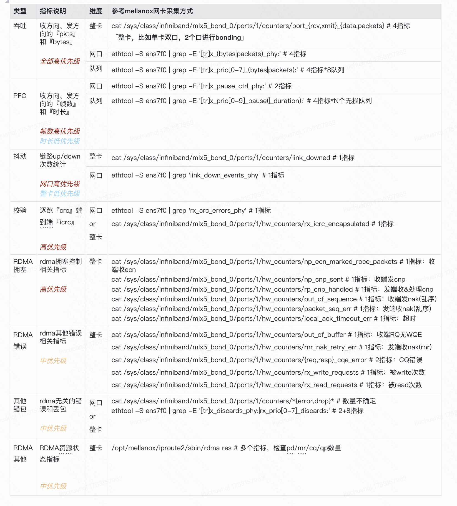
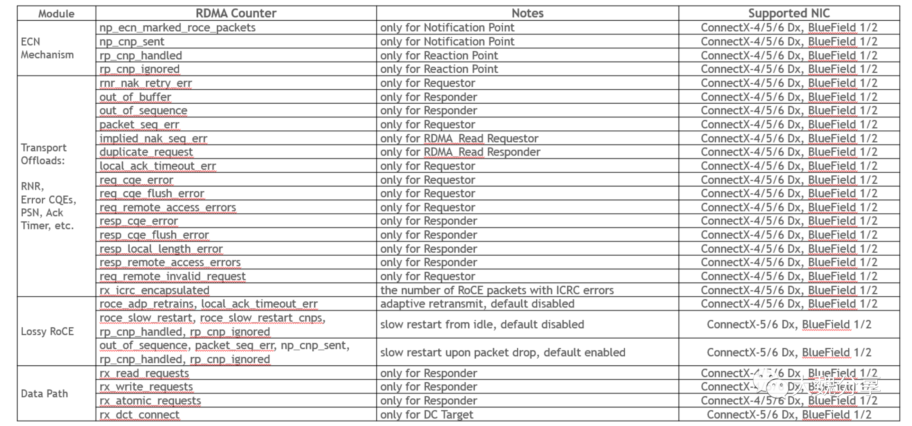

```table-of-contents
```
# 总览


.png)

.png)

# `ethtool -S` 查看 Mellanox网卡的RDMA统计
注意：目前 华为网卡，无法通过 ethtool 查看 RDMA 相关的统计。

```bash
# ethtool -S eth01 | grep -i rdma
     rx_vport_rdma_unicast_packets: 439107945
     rx_vport_rdma_unicast_bytes: 343918719286
     tx_vport_rdma_unicast_packets: 321535216
     tx_vport_rdma_unicast_bytes: 147370719852
     rx_vport_rdma_multicast_packets: 0
     rx_vport_rdma_multicast_bytes: 0
     tx_vport_rdma_multicast_packets: 0
     tx_vport_rdma_multicast_bytes: 0
```

## 统计脚本
### 方式一：vport之rdma流量统计
`eth01` 和 `eth02` 是 `RDMA RoceV2 bond` 口的2个成员口；
如下所示，`rx_vport_rdma_unicast_packets`, `rx_vport_rdma_unicast_bytes`, `tx_vport_rdma_unicast_packets`, `tx_vport_rdma_unicast_bytes`
的统计，应该就是识别到了`RDMA`的流量。

> 注：实际经过测试，`RDMA RoceV2 bond` 应该是生效了的。因此，应该是 `ethtool -S eth01 | grep -i rdma` 输出的问题。
> 测试方法：使用了`25G * 2`的`RDMA bond`配置，实际打流超过了单口的 `25G`，`get_rdma_bond_stats.sh` 以及 `get_bond_eth_stats.sh` 都可以显示流量超过了 25G。

```bash
# cat get_rdma_bond_stats.sh
#!/bin/bash

# 获取接口统计值（保持不变）
get_rdma_stats() {
    ethtool -S $1 | awk '
        /rx_vport_rdma_unicast_packets/ {rx_pkts = $2}
        /rx_vport_rdma_unicast_bytes/   {rx_bytes = $2}
        /tx_vport_rdma_unicast_packets/ {tx_pkts = $2}
        /tx_vport_rdma_unicast_bytes/   {tx_bytes = $2}
        END {
            # 如果找不到值则设为0
            rx_pkts = rx_pkts ? rx_pkts : 0
            rx_bytes = rx_bytes ? rx_bytes : 0
            tx_pkts = tx_pkts ? tx_pkts : 0
            tx_bytes = tx_bytes ? tx_bytes : 0
            print rx_pkts, rx_bytes, tx_pkts, tx_bytes
        }'
}

while true
do

    timestamp=$(date +%T.%N)
    
    slave1="eth01"
    slave2="eth02"
    bond_name="bond0"

    # 第一次采样 dev1
    read rx1_dev1 bytes_rx1_dev1 tx1_dev1 bytes_tx1_dev1 <<< $(get_rdma_stats ${slave1})
    # 第一次采样 dev2
    read rx1_dev2 bytes_rx1_dev2 tx1_dev2 bytes_tx1_dev2 <<< $(get_rdma_stats ${slave2})

    sleep 1
    
    # 第二次采样 dev1
    read rx2_dev1 bytes_rx2_dev1 tx2_dev1 bytes_tx2_dev1 <<< $(get_rdma_stats ${slave1})
    # 第二次采样 dev2
    read rx2_dev2 bytes_rx2_dev2 tx2_dev2 bytes_tx2_dev2 <<< $(get_rdma_stats ${slave2})
    
    # 计算dev1增量
    rx_diff_dev1=$((rx2_dev1 - rx1_dev1))
    bytes_rx_diff_dev1=$((bytes_rx2_dev1 - bytes_rx1_dev1))
    tx_diff_dev1=$((tx2_dev1 - tx1_dev1))
    bytes_tx_diff_dev1=$((bytes_tx2_dev1 - bytes_tx1_dev1))
    
    # 计算dev2增量
    rx_diff_dev2=$((rx2_dev2 - rx1_dev2))
    bytes_rx_diff_dev2=$((bytes_rx2_dev2 - bytes_rx1_dev2))
    tx_diff_dev2=$((tx2_dev2 - tx1_dev2))
    bytes_tx_diff_dev2=$((bytes_tx2_dev2 - bytes_tx1_dev2))
    
    # 计算bond整体增量（成员口增量之和）
    rx_diff_bond=$((rx_diff_dev1 + rx_diff_dev2))
    bytes_rx_diff_bond=$((bytes_rx_diff_dev1 + bytes_rx_diff_dev2))
    tx_diff_bond=$((tx_diff_dev1 + tx_diff_dev2))
    bytes_tx_diff_bond=$((bytes_tx_diff_dev1 + bytes_tx_diff_dev2))
    
    # 计算接口速率（bps = 字节增量 × 8）
    dev1_rx_pps=$rx_diff_dev1
    dev1_rx_bps=$((bytes_rx_diff_dev1 * 8))
    dev1_tx_pps=$tx_diff_dev1
    dev1_tx_bps=$((bytes_tx_diff_dev1 * 8))
    
    dev2_rx_pps=$rx_diff_dev2
    dev2_rx_bps=$((bytes_rx_diff_dev2 * 8))
    dev2_tx_pps=$tx_diff_dev2
    dev2_tx_bps=$((bytes_tx_diff_dev2 * 8))
    
    # 计算bond整体速率
    bond_rx_pps=$rx_diff_bond
    bond_rx_bps=$((bytes_rx_diff_bond * 8))
    bond_tx_pps=$tx_diff_bond
    bond_tx_bps=$((bytes_tx_diff_bond * 8))
    
    # 格式化输出
    echo "======================== $timestamp ========================"
    echo "${slave1}: RX $dev1_rx_pps pps, $dev1_rx_bps bps; TX $dev1_tx_pps pps, $dev1_tx_bps bps"
    echo "${slave2}: RX $dev2_rx_pps pps, $dev2_rx_bps bps; TX $dev2_tx_pps pps, $dev2_tx_bps bps"
    echo "${bond_name} : RX $bond_rx_pps pps, $bond_rx_bps bps; TX $bond_tx_pps pps, $bond_tx_bps bps"
done
```

### 方式二：ring/softdev 流量统计
RoveV2 是使用的 `以太网+IP+UDP(dstport: 4791)`, IB传输协议的信息放在了UDP载荷中， 所以**RoceV2的流量也就和普通的UDP流量是一样的**；
因此，`ethtool -S xxx`的输出中, `rx_packets/rx_bytes/tx_packets/tx_bytes`的统计，也完全可以统计到 RoceV2的流量。

```bash
# cat get_bond_eth_stats.sh
#!/bin/bash

# 获取接口统计值（保持不变）
get_rdma_stats() {
    ethtool -S $1 | awk '
        /rx_packets/ {rx_pkts = $2}
        /rx_bytes/   {rx_bytes = $2}
        /tx_packets/ {tx_pkts = $2}
        /tx_bytes/   {tx_bytes = $2}
        END {
            # 如果找不到值则设为0
            rx_pkts = rx_pkts ? rx_pkts : 0
            rx_bytes = rx_bytes ? rx_bytes : 0
            tx_pkts = tx_pkts ? tx_pkts : 0
            tx_bytes = tx_bytes ? tx_bytes : 0
            print rx_pkts, rx_bytes, tx_pkts, tx_bytes
        }'
}

while true
do

    timestamp=$(date +%T.%N)

    slave1="eth01"
    slave2="eth02"
    bond_name="bond0"

    # 第一次采样 dev1
    read rx1_dev1 bytes_rx1_dev1 tx1_dev1 bytes_tx1_dev1 <<< $(get_rdma_stats ${slave1})
    # 第一次采样 dev2
    read rx1_dev2 bytes_rx1_dev2 tx1_dev2 bytes_tx1_dev2 <<< $(get_rdma_stats ${slave2})
    sleep 1

    # 第二次采样 dev1
    read rx2_dev1 bytes_rx2_dev1 tx2_dev1 bytes_tx2_dev1 <<< $(get_rdma_stats ${slave1})
    # 第二次采样 dev2
    read rx2_dev2 bytes_rx2_dev2 tx2_dev2 bytes_tx2_dev2 <<< $(get_rdma_stats ${slave2})

    # 计算dev1增量
    rx_diff_dev1=$((rx2_dev1 - rx1_dev1))
    bytes_rx_diff_dev1=$((bytes_rx2_dev1 - bytes_rx1_dev1))
    tx_diff_dev1=$((tx2_dev1 - tx1_dev1))
    bytes_tx_diff_dev1=$((bytes_tx2_dev1 - bytes_tx1_dev1))

    # 计算dev2增量
    rx_diff_dev2=$((rx2_dev2 - rx1_dev2))
    bytes_rx_diff_dev2=$((bytes_rx2_dev2 - bytes_rx1_dev2))
    tx_diff_dev2=$((tx2_dev2 - tx1_dev2))
    bytes_tx_diff_dev2=$((bytes_tx2_dev2 - bytes_tx1_dev2))

    # 计算bond整体增量（成员口增量之和）
    rx_diff_bond=$((rx_diff_dev1 + rx_diff_dev2))
    bytes_rx_diff_bond=$((bytes_rx_diff_dev1 + bytes_rx_diff_dev2))
    tx_diff_bond=$((tx_diff_dev1 + tx_diff_dev2))
    bytes_tx_diff_bond=$((bytes_tx_diff_dev1 + bytes_tx_diff_dev2))

    # 计算接口速率（bps = 字节增量 × 8）
    dev1_rx_pps=$rx_diff_dev1
    dev1_rx_bps=$((bytes_rx_diff_dev1 * 8))
    dev1_tx_pps=$tx_diff_dev1
    dev1_tx_bps=$((bytes_tx_diff_dev1 * 8))

    dev2_rx_pps=$rx_diff_dev2
    dev2_rx_bps=$((bytes_rx_diff_dev2 * 8))
    dev2_tx_pps=$tx_diff_dev2
    dev2_tx_bps=$((bytes_tx_diff_dev2 * 8))

    # 计算bond整体速率
    bond_rx_pps=$rx_diff_bond
    bond_rx_bps=$((bytes_rx_diff_bond * 8))
    bond_tx_pps=$tx_diff_bond
    bond_tx_bps=$((bytes_tx_diff_bond * 8))

    # 格式化输出
    echo "======================== $timestamp ========================"
    echo "${slave1}: RX $dev1_rx_pps pps, $dev1_rx_bps bps; TX $dev1_tx_pps pps, $dev1_tx_bps bps"
    echo "${slave2}: RX $dev2_rx_pps pps, $dev2_rx_bps bps; TX $dev2_tx_pps pps, $dev2_tx_bps bps"
    echo "${bond_name} : RX $bond_rx_pps pps, $bond_rx_bps bps; TX $bond_tx_pps pps, $bond_tx_bps bps"
    echo
done
```

### 注意
#### 现象
上面的脚本`get_rdma_bond_stats.sh`，统计总的`RoceV2 bond` 可能没有问题，但是统计的每个`slave`成员口的 `RDMA RoceV2`流量统计，可能是有些问题的。
因为统计每个`slave`的统计，可能会发现一个`slave`没有`RDMA RoceV2`流量。但是其实可能这个口是有`RDMA`流量的，也可能是没有`RDMA RoceV2`流量的，无法准确判断。

为什么说，统计没流量，实际可能是有流量的呢？
因为使用下面的`get_bond_eth2_stats.sh` 来统计 `UTCP「用户态TCP」`的流量的时候，也是发现一个slave成员口，存在TCP的流量，另外一个成员口不存在TCP流量。但是使用下面的`get_bond_eth_stats.sh`来统计`UTCP`的流量的时候，发现两个`slave`都是有流量的；
因此`get_bond_eth2_stats.sh`中的统计，对于成员口来说可能是不准确的「对于`bond`的统计应该是准确的」。

#### 分析
（1）连接数过少，无法负载均衡。
（2）LACP协商错误；服务器或者交换机的LACP的hash策略不是`layer3+4`
（3）有可能是`RDMA`硬件卸载与内核`bonding`架构的兼容性问题，导致 `ethtool -S`统计错误。
（4）rdma 网卡 bond 机制的问题

#### 解决方法
> 注：此时采用对端交换机的接口的统计，肯定都是准确的。


## 其他
### 以太网流量(TCP流量)的统计
#### 方式一：vport 以太网流量统计

```bash
# cat get_bond_eth2_stats.sh
#!/bin/bash

# 获取接口统计值（保持不变）
get_rdma_stats() {
    ethtool -S $1 | awk '
        /rx_vport_unicast_packets/ {rx_pkts = $2}
        /rx_vport_unicast_bytes/   {rx_bytes = $2}
        /tx_vport_unicast_packets/ {tx_pkts = $2}
        /tx_vport_unicast_bytes/   {tx_bytes = $2}
        END {
            # 如果找不到值则设为0
            rx_pkts = rx_pkts ? rx_pkts : 0
            rx_bytes = rx_bytes ? rx_bytes : 0
            tx_pkts = tx_pkts ? tx_pkts : 0
            tx_bytes = tx_bytes ? tx_bytes : 0
            print rx_pkts, rx_bytes, tx_pkts, tx_bytes
        }'
}

while true
do

    timestamp=$(date +%T.%N)

    slave1="eth01"
    slave2="eth02"
    bond_name="bond0"

    # 第一次采样 dev1
    read rx1_dev1 bytes_rx1_dev1 tx1_dev1 bytes_tx1_dev1 <<< $(get_rdma_stats ${slave1})
    # 第一次采样 dev2
    read rx1_dev2 bytes_rx1_dev2 tx1_dev2 bytes_tx1_dev2 <<< $(get_rdma_stats ${slave2})
    sleep 1

    # 第二次采样 dev1
    read rx2_dev1 bytes_rx2_dev1 tx2_dev1 bytes_tx2_dev1 <<< $(get_rdma_stats ${slave1})
    # 第二次采样 dev2
    read rx2_dev2 bytes_rx2_dev2 tx2_dev2 bytes_tx2_dev2 <<< $(get_rdma_stats ${slave2})

    # 计算dev1增量
    rx_diff_dev1=$((rx2_dev1 - rx1_dev1))
    bytes_rx_diff_dev1=$((bytes_rx2_dev1 - bytes_rx1_dev1))
    tx_diff_dev1=$((tx2_dev1 - tx1_dev1))
    bytes_tx_diff_dev1=$((bytes_tx2_dev1 - bytes_tx1_dev1))

    # 计算dev2增量
    rx_diff_dev2=$((rx2_dev2 - rx1_dev2))
    bytes_rx_diff_dev2=$((bytes_rx2_dev2 - bytes_rx1_dev2))
    tx_diff_dev2=$((tx2_dev2 - tx1_dev2))
    bytes_tx_diff_dev2=$((bytes_tx2_dev2 - bytes_tx1_dev2))

    # 计算bond整体增量（成员口增量之和）
    rx_diff_bond=$((rx_diff_dev1 + rx_diff_dev2))
    bytes_rx_diff_bond=$((bytes_rx_diff_dev1 + bytes_rx_diff_dev2))
    tx_diff_bond=$((tx_diff_dev1 + tx_diff_dev2))
    bytes_tx_diff_bond=$((bytes_tx_diff_dev1 + bytes_tx_diff_dev2))

    # 计算接口速率（bps = 字节增量 × 8）
    dev1_rx_pps=$rx_diff_dev1
    dev1_rx_bps=$((bytes_rx_diff_dev1 * 8))
    dev1_tx_pps=$tx_diff_dev1
    dev1_tx_bps=$((bytes_tx_diff_dev1 * 8))

    dev2_rx_pps=$rx_diff_dev2
    dev2_rx_bps=$((bytes_rx_diff_dev2 * 8))
    dev2_tx_pps=$tx_diff_dev2
    dev2_tx_bps=$((bytes_tx_diff_dev2 * 8))

    # 计算bond整体速率
    bond_rx_pps=$rx_diff_bond
    bond_rx_bps=$((bytes_rx_diff_bond * 8))
    bond_tx_pps=$tx_diff_bond
    bond_tx_bps=$((bytes_tx_diff_bond * 8))

    # 格式化输出
    echo "======================== $timestamp ========================"
    echo "${slave1}: RX $dev1_rx_pps pps, $dev1_rx_bps bps; TX $dev1_tx_pps pps, $dev1_tx_bps bps"
    echo "${slave2}: RX $dev2_rx_pps pps, $dev2_rx_bps bps; TX $dev2_tx_pps pps, $dev2_tx_bps bps"
    echo "${bond_name} : RX $bond_rx_pps pps, $bond_rx_bps bps; TX $bond_tx_pps pps, $bond_tx_bps bps"
    echo
done
```


#### 方式二：ring/softdev 流量统计
同上面的`ring/softdev 流量统计`;


# `/sys/class/infiniband`文件系统

参考：
```bash
(1) 选择特定的内核版本
https://www.kernel.org/doc/html/

(2) 最新版内核(6.16.0)的 sysfs-class-infiniband 目录介绍：
https://www.kernel.org/doc/html/latest/admin-guide/abi-stable-files.html#abi-file-stable-sysfs-class-infiniband
```


```bash
# ibdev2netdev
hrn3_bond_0 port 1 ==> bond0 (Up)
mlx5_bond_0 port 1 ==> bond1 (Up)
```
（1）如下所示：Mellanox的RNIC网卡支持 counters目录，以及 hw_counters 目录；


(2) 如下所示：华为RNIC网卡不支持 counters目录，以及 hw_counters 目录；


## 统计分类


## counters
```bash
# ll /sys/class/infiniband/mlx5_bond_0/ports/1/counters/
total 0
-r--r--r-- 1 root root 4096 Jul  9 11:20 excessive_buffer_overrun_errors
-r--r--r-- 1 root root 4096 Jul  9 11:20 link_downed
-r--r--r-- 1 root root 4096 Jul  9 11:20 link_error_recovery
-r--r--r-- 1 root root 4096 Jul  9 11:20 local_link_integrity_errors
-r--r--r-- 1 root root 4096 Jul  9 11:20 multicast_rcv_packets
-r--r--r-- 1 root root 4096 Jul  9 11:20 multicast_xmit_packets
-r--r--r-- 1 root root 4096 Jul  9 11:20 port_rcv_constraint_errors
-r--r--r-- 1 root root 4096 Jul  9 11:20 port_rcv_data
-r--r--r-- 1 root root 4096 Jul  9 11:20 port_rcv_errors
-r--r--r-- 1 root root 4096 Jul  9 11:20 port_rcv_packets
-r--r--r-- 1 root root 4096 Jul  9 11:20 port_rcv_remote_physical_errors
-r--r--r-- 1 root root 4096 Jul  9 11:20 port_rcv_switch_relay_errors
-r--r--r-- 1 root root 4096 Jul  9 11:20 port_xmit_constraint_errors
-r--r--r-- 1 root root 4096 Jul  9 11:20 port_xmit_data
-r--r--r-- 1 root root 4096 Jul  9 11:20 port_xmit_discards
-r--r--r-- 1 root root 4096 Jul  9 11:20 port_xmit_packets
-r--r--r-- 1 root root 4096 Jul  9 11:20 port_xmit_wait
-r--r--r-- 1 root root 4096 Jul  9 11:20 symbol_error
-r--r--r-- 1 root root 4096 Jul  9 11:20 unicast_rcv_packets
-r--r--r-- 1 root root 4096 Jul  9 11:20 unicast_xmit_packets
-r--r--r-- 1 root root 4096 Jul  9 11:20 VL15_dropped
```

### 字段说明


|**Counter**|**Description**|**InfiniBand Spec Name**|**Group**|
|---|---|---|---|
|port_rcv_data|The total number of data octets, divided by 4, (counting in double words, 32 bits), received on all VLs from the port.|PortRcvData|Informative|
|port_rcv_packets|Total number of packets (this may include packets containing Errors. This is 64 bit counter.|PortRcvPkts|Informative|
|port_multicast_rcv_packets|Total number of multicast packets, including multicast packets containing errors.|PortMultiCastRcvPkts|Informative|
|port_unicast_rcv_packets|Total number of unicast packets, including unicast packets containing errors.|PortUnicastRcvPkts|Informative|
|port_xmit_data|The total number of data octets, divided by 4, (counting in double words, 32 bits), transmitted on all VLs from the port.|PortXmitData|Informative|
|port_xmit_packets<br><br>port_xmit_packets_64|Total number of packets transmitted on all VLs from this port. This may include packets with errors.<br><br>This is 64 bit counter.|PortXmitPkts|Informative|
|port_rcv_switch_relay_errors|Total number of packets received on the port that were discarded because they could not be forwarded by the switch relay.|PortRcvSwitchRelayErrors|Error|
|port_rcv_errors|Total number of packets containing an error that were received on the port.|PortRcvErrors|Informative|
|port_rcv_constraint_errors|Total number of packets received on the switch physical port that are discarded.|PortRcvConstraintErrors|Error|
|local_link_integrity_errors|The number of times that the count of local physical errors exceeded the threshold specified by LocalPhyErrors.|LocalLinkIntegrityErrors|Error|
|port_xmit_wait|The number of ticks during which the port had data to transmit but no data was sent during the entire tick (either because of insufficient credits or because of lack of arbitration).|PortXmitWait|Informative|
|port_multicast_xmit_packets|Total number of multicast packets transmitted on all VLs from the port. This may include multicast packets with errors.|PortMultiCastXmitPkts|Informative|
|port_unicast_xmit_packets|Total number of unicast packets transmitted on all VLs from the port. This may include unicast packets with errors.|PortUnicastXmitPkts|Informative|
|port_xmit_discards|Total number of outbound packets discarded by the port because the port is down or congested.|PortXmitDiscards|Error|
|port_xmit_constraint_errors|Total number of packets not transmitted from the switch physical port.|PortXmitConstraintErrors|Error|
|port_rcv_remote_physical_errors|Total number of packets marked with the EBP delimiter received on the port.|PortRcvRemotePhysicalErrors|Error|
|symbol_error|Total number of minor link errors detected on one or more physical lanes.|SymbolErrorCounter|Error|
|VL15_dropped|Number of incoming VL15 packets dropped due to resource limitations (e.g., lack of buffers) of the port.|VL15Dropped|Error|
|link_error_recovery|Total number of times the Port Training state machine has successfully completed the link error recovery process.|LinkErrorRecoveryCounter|Error|
|link_downed|Total number of times the Port Training state machine has failed the link error recovery process and downed the link.|LinkDownedCounter|Error|


## 硬件计数器：hw_counters
```bash
### HW Counters (RDMA diagnostics)
> The HW counters are counted per function and exposed on the function. Some counters are not counted per function.
```

```bash
# ll /sys/class/infiniband/mlx5_bond_0/ports/1/hw_counters/
total 0
-r--r--r-- 1 root root 4096 Jul  1 14:38 duplicate_request
-r--r--r-- 1 root root 4096 Jul  1 14:38 implied_nak_seq_err
-rw-r--r-- 1 root root 4096 Jul  1 14:38 lifespan
-r--r--r-- 1 root root 4096 Jul  1 14:38 local_ack_timeout_err
-r--r--r-- 1 root root 4096 Jul  1 14:38 np_cnp_sent
-r--r--r-- 1 root root 4096 Jul  1 14:38 np_ecn_marked_roce_packets
-r--r--r-- 1 root root 4096 Jul  1 14:38 out_of_buffer
-r--r--r-- 1 root root 4096 Jul  1 14:38 out_of_sequence
-r--r--r-- 1 root root 4096 Jul  1 14:38 packet_seq_err
-r--r--r-- 1 root root 4096 Jul  1 14:38 req_cqe_error
-r--r--r-- 1 root root 4096 Jul  1 14:38 req_cqe_flush_error
-r--r--r-- 1 root root 4096 Jul  1 14:38 req_remote_access_errors
-r--r--r-- 1 root root 4096 Jul  1 14:38 req_remote_invalid_request
-r--r--r-- 1 root root 4096 Jul  1 14:38 resp_cqe_error
-r--r--r-- 1 root root 4096 Jul  1 14:38 resp_cqe_flush_error
-r--r--r-- 1 root root 4096 Jul  1 14:38 resp_local_length_error
-r--r--r-- 1 root root 4096 Jul  1 14:38 resp_remote_access_errors
-r--r--r-- 1 root root 4096 Jul  1 14:38 rnr_nak_retry_err
-r--r--r-- 1 root root 4096 Jul  1 14:38 roce_adp_retrans
-r--r--r-- 1 root root 4096 Jul  1 14:38 roce_adp_retrans_to
-r--r--r-- 1 root root 4096 Jul  1 14:38 roce_slow_restart
-r--r--r-- 1 root root 4096 Jul  1 14:38 roce_slow_restart_cnps
-r--r--r-- 1 root root 4096 Jul  1 14:38 roce_slow_restart_trans
-r--r--r-- 1 root root 4096 Jul  1 14:38 rp_cnp_handled
-r--r--r-- 1 root root 4096 Jul  1 14:38 rp_cnp_ignored
-r--r--r-- 1 root root 4096 Jul  1 14:38 rx_atomic_requests
-r--r--r-- 1 root root 4096 Jul  1 14:38 rx_dct_connect
-r--r--r-- 1 root root 4096 Jul  1 14:38 rx_icrc_encapsulated
-r--r--r-- 1 root root 4096 Jul  1 14:38 rx_read_requests
-r--r--r-- 1 root root 4096 Jul  1 14:38 rx_write_requests
```


**CNP: Congestion Notification Packet**
**ECN: Explicit Congestion Notification**
**QCN: Quantized Congestion Notification, 量化拥塞通知**
**DCQCN: data center QCN, 数据中心量化拥塞通知**

### 分类

这些counters分为四大类：
- ECN Mechanism
- Transport Offloads
- Lossy RoCE
- Data Path




### 字段说明

|**Counter**|**Description**|**Group**|
|---|---|---|
|duplicate_request|Number of received packets. A duplicate request is a request that had been previously executed.|Error|
|implied_nak_seq_err|Number of time the requested decided an ACK. with a PSN larger than the expected PSN for an RDMA read or response.|Error|
|lifespan|The maximum period in ms which defines the aging of the counter reads. Two consecutive reads within this period might return the same values|Informative|
|local_ack_timeout_err|The number of times QP's ack timer expired for RC, XRC, DCT QPs at the sender side.<br><br>The QP retry limit was not exceed, therefore it is still recoverable error.|Error|
|np_cnp_sent|The number of CNP packets sent by the Notification Point when it noticed congestion experienced in the RoCEv2 IP header (ECN bits).<br><br>The counters was added in MLNX_OFED 4.1|Informative|
|np_ecn_marked_roce_packets|The number of RoCEv2 packets received by the notification point which were marked for experiencing the congestion (ECN bits where '11' on the ingress RoCE traffic) .<br><br>The counters was added in MLNX_OFED 4.1|Informative|
|out_of_buffer|The number of drops occurred due to lack of WQE for the associated QPs.|Error|
|out_of_sequence|The number of out of sequence packets received.|Error|
|packet_seq_err|The number of received NAK sequence error packets. The QP retry limit was not exceeded.|Error|
|req_cqe_error|The number of times requester detected CQEs completed with errors.<br><br>The counters was added in MLNX_OFED 4.1|Error|
|req_cqe_flush_error|The number of times requester detected CQEs completed with flushed errors.<br><br>The counters was added in MLNX_OFED 4.1|Error|
|req_remote_access_errors|The number of times requester detected remote access errors.<br><br>The counters was added in MLNX_OFED 4.1|Error|
|req_remote_invalid_request|The number of times requester detected remote invalid request errors.<br><br>The counters was added in MLNX_OFED 4.1|Error|
|resp_cqe_error|The number of times responder detected CQEs completed with errors.<br><br>The counters was added in MLNX_OFED 4.1|Error|
|resp_cqe_flush_error|The number of times responder detected CQEs completed with flushed errors.<br><br>The counters was added in MLNX_OFED 4.1|Error|
|resp_local_length_error|The number of times responder detected local length errors.<br><br>The counters was added in MLNX_OFED 4.1|Error|
|resp_remote_access_errors|The number of times responder detected remote access errors.<br><br>The counters was added in MLNX_OFED 4.1|Error|
|rnr_nak_retry_err|The number of received RNR NAK packets. The QP retry limit was not exceeded.|Error|
|rp_cnp_handled|The number of CNP packets handled by the Reaction Point HCA to throttle the transmission rate.<br><br>The counters was added in MLNX_OFED 4.1|Informative|
|rp_cnp_ignored|The number of CNP packets received and ignored by the Reaction Point HCA. This counter should not raise if RoCE Congestion Control was enabled in the network. If this counter raise, verify that ECN was enabled on the adapter. See [HowTo Configure DCQCN (RoCE CC) values for ConnectX-4 (Linux)](https://enterprise-support.nvidia.com/s/article/howto-configure-dcqcn--roce-cc--values-for-connectx-4--linux-x).<br><br>The counters was added in MLNX_OFED 4.1|Error|
|rx_atomic_requests|The number of received ATOMIC request for the associated QPs.|Informative|
|rx_dct_connect|The number of received connection request for the associated DCTs.|Informative|
|rx_read_requests|The number of received READ requests for the associated QPs.|Informative|
|rx_write_requests|The number of received WRITE requests for the associated QPs.|Informative|
|rx_icrc_encapsulated|The number of RoCE packets with ICRC errors.<br><br>This counter was added in MLNX_OFED 4.4 and kernel 4.19|Error|
|roce_adp_retrans|Counts the number of adaptive retransmissions for RoCE traffic<br><br>The counter was added in MLNX_OFED rev 5.0-1.0.0.0 and kernel v5.6.0|Informative|
|roce_adp_retrans_to|Counts the number of times RoCE traffic reached timeout due to adaptive retransmission<br><br>The counter was added in MLNX_OFED rev 5.0-1.0.0.0 and kernel v5.6.0|Informative|
|roce_slow_restart|Counts the number of times RoCE slow restart was used<br><br>The counter was added in MLNX_OFED rev 5.0-1.0.0.0 and kernel v5.6.0|Informative|
|roce_slow_restart_cnps|Counts the number of times RoCE slow restart generated CNP packets<br><br>The counter was added in MLNX_OFED rev 5.0-1.0.0.0 and kernel v5.6.0|Informative|
|roce_slow_restart_trans|Counts the number of times RoCE slow restart changed state to slow restart<br><br>The counter was added in MLNX_OFED rev 5.0-1.0.0.0 and kernel v5.6.0|Informative|
|roce_adp_retrans_to|Counts the number of adaptive retransmissions for RoCE traffic<br><br>The counter was added in MLNX_OFED rev 5.0-1.0.0.0 and kernel v5.6.0|Informative|
|roce_slow_restart|Counts the number of times RoCE traffic reached timeout due to adaptive retransmission<br><br>The counter was added in MLNX_OFED rev 5.0-1.0.0.0 and kernel v5.6.0|Informative|

#### ECN机制相关的四个counters
##### **（1）On Notification Point**：通知点的统计
- **np_ecn_marked_roce_packets**
```bash
the number of RoCEv2 packets received by the notification point which were marked for experiencing the congestion (ECN bits where '11' on the ingress RoCE traffic)
```
通知点收到的RoCEv2数据包的数量，这些数据包被标记为发生拥堵（ECN位在入口RoCE流量上为'11'）。


- **np_cnp_sent**
```bash
the number of CNP packets sent by the Notification Point when it noticed congestion experienced in the RoCEv2 IP header.
```
当通知点注意到RoCEv2 IP头出现拥堵时，它所发送的CNP数据包的数量。

##### **（2）On Reaction Point**：发应点的统计
- **rp_cnp_handled**
```bash
the number of CNP packets handled by the Reaction Point HCA to throttle the transmission rate.
```
反应点HCA处理的CNP数据包的数量，以节制传输速率

- **rp_cnp_ignored**
```bash
the number of CNP packets received and ignored by the Reaction Point HCA. This counter should not raise if RoCE Congestion Control was enabled in the network。
```
反应点HCA收到并忽略的CNP数据包的数量。如果网络中启用了RoCE拥塞控制，该计数器不应上升。


##### **（3）看一下这四个参数作用的位置**


#### TRANSPORT OFFLOADS相关的13个counters
##### (1) Receive Not Ready (for Send & Receive，仅针对iba收发)
- **`rnr_nak_retry_err `**:  
本机作为发送方，收到的RNR (Receiver Not Ready)  NAK数据包的数量（没有超过QP重试限制）。如果接收方qp的srq没有空闲了，这个计数会涨。
```bash
rnr_nak_retry_error (on Requestor): the number of received RNR NAK packets (QP retry limit was not exceeded)。收到的RNR (Receiver Not Ready)  
```

- **`out_of_buffer`**：
本机作为接收方，收包的时候发现没有RWR(receive work request)了。如果自己qp的srq满了，这个计数会涨。
```bash
out_of_buffer (on Responder): the number of drops occurred due to lack of Receive WQEs。
由于没有接收WQE而导致包的下降数量
```

##### (2) Error CQEs


##### (3) Packet Sequence Number相关

 - **`out_of_sequence`**：
 收到的乱序数据包的数量
```bash
out_of_sequence (on Responder): the number of out of sequence packets received
```

 - **`packet_seq_err`**：
收到的NAK序列错误数据包的数量（没有超过QP重试限制）。
```bash
packet_seq_err (on Requestor): the number of received NAK sequence error packets (QP retry limit was not exceeded)
```

 - **`implied_nak_seq_err`**：
当收到PSN大于预期的RDMA读取响应时，RDMA读取请求者检测到隐性NAK的次数。
```bash
implied_nak_seq_err (on RDMA Read Requestor): number of times the RDMA Read Requestor detects an implicit NAK when receiving RDMA Read Response with PSN larger than expected 
```

 - **`duplicate_request`**：
收到的先前已执行的RDMA读取请求的数量
```bash
duplicate_request (on RDMA Read Responder): number of received RDMA Read Request that had been previously executed.
```

##### （4）Acknowledge Timeout

 - **`local_ack_timeout`**：
对于RC、XRC、DCT的QP来说，QP的ack计时器过期的次数。
```bash
local_ack_timeout (on Requestor): the number of times QP's ack timer expired for RC, XRC, DCT QPs
```

##### （5）ICRC（Invariant Cyclic Redundancy Code） Error

 - **`rx_icrc_encapsulated`**：
有ICRC错误的RoCE数据包的数量。
```bash
rx_icrc_encapsulated: the number of RoCE packets with ICRC errors
```


#### Lossy RoCE相关的11个计数器


#### Data Path 相关的counters


### show_counters 脚本
```bash
(1) 命令的使用：
# show_counters
Valid command is: show_rdma_counters <rdma_device_name>
Example:
show_rdma_counters mlx5_0

(2) 脚本位置：
# which show_counters
/sbin/show_counters

(3) 脚本如下所示：
# cat /sbin/show_counters
#!/bin/bash

#This script dumps hw_counters and cm counters of
#all ports of the given rdma device.

function read_hw_counters()
{
	if [ ! -d /sys/class/infiniband/$device ] ; then
		echo "Device $device not found"
		exit 1
	fi

	ports=$(ls /sys/class/infiniband/$device/ports/)
	for port in $ports; do
		echo "Port $port hw counters:"
		counters_files=$(ls /sys/class/infiniband/$device/ports/$port/hw_counters/)

		for file in $counters_files; do
			value=$(cat /sys/class/infiniband/$device/ports/$port/hw_counters/$file)
			echo "$file: $value"
		done
	done
}

function read_cm_counters()
{
	if [ ! -d /sys/class/infiniband_cm/$device ] ; then
		return
	fi

	dirs=$(ls /sys/class/infiniband_cm/$device/)
	for port in $dirs; do
		if [ -z "${port##*[!0-9]*}" ]; then
			#if this is not port number, skip.
			continue
		fi
		echo "Port $port cm counters:"
		counters_dirs=$(ls /sys/class/infiniband_cm/$device/$port/)

		for dir in $counters_dirs; do
			counters_files=$(ls /sys/class/infiniband_cm/$device/$port/$dir/)
			for file in $counters_files; do
				value=$(cat /sys/class/infiniband_cm/$device/$port/$dir/$file)
				echo "$file: $value"
			done
		done
	done

}

if [ $# -lt 1 ]; then
	echo "Valid command is: show_rdma_counters <rdma_device_name>"
	echo "Example:"
	echo "show_rdma_counters mlx5_0"
	exit 0
fi

device=$1

read_hw_counters
read_cm_counters
```


## debug status


# iproute包中的RDMA工具
```bash
# /opt/mellanox/iproute2/sbin/rdma -h
Usage: rdma [ OPTIONS ] OBJECT { COMMAND | help }
       rdma [ -f[orce] ] -b[atch] filename
where  OBJECT := { dev | link | resource | system | statistic | help }
       OPTIONS := { -V[ersion] | -d[etails] | -j[son] | -p[retty] -r[aw]}

# rpm -qf /opt/mellanox/iproute2/sbin/rdma
mlnx-iproute2-5.11.0-1.54310.x86_64


```

`man /opt/mellanox/iproute2/share/man/man8/rdma.8`, 如下所示：


## 统计信息
### `/opt/mellanox/iproute2/sbin/rdma statistic show`
注：==`rdma statistic show` 其实读取的是`/sys/class/infiniband/xx/hw_counters「比如：/sys/class/infiniband/mlx5_0/ports/1/hw_counters/」`目录下的统计数据==。

#### 使用

`man /opt/mellanox/iproute2/share/man/man8/rdma-statistic.8` 如下所示：
```bash
man 8 rdma-statistic
```


#### 范例
```bash
# ibdev2netdev
mlx5_bond_0 port 1 ==> bond0 (Up)

# /opt/mellanox/iproute2/sbin/rdma statistic show
link mlx5_bond_0/1 rx_write_requests 0 rx_read_requests 0 rx_atomic_requests 0 out_of_buffer 0 out_of_sequence 0 duplicate_request 0 rnr_nak_retry_err 0 packet_seq_err 0 implied_nak_seq_err 0 local_ack_timeout_err 0 rx_dct_connect 0 resp_local_length_error 0 resp_cqe_error 3297 req_cqe_error 0 req_remote_invalid_request 0 req_remote_access_errors 0 resp_remote_access_errors 0 resp_cqe_flush_error 2792 req_cqe_flush_error 0 roce_adp_retrans 0 roce_adp_retrans_to 0 roce_slow_restart 0 roce_slow_restart_cnps 0 roce_slow_restart_trans 0 rp_cnp_ignored 0 rp_cnp_handled 0 np_ecn_marked_roce_packets 0 np_cnp_sent 0 rx_icrc_encapsulated 0
```

### `/opt/mellanox/iproute2/sbin/rdma resource show`
```bash
# /opt/mellanox/iproute2/sbin/rdma resource help
Usage: rdma resource
          resource show [DEV]
          resource show [qp|cm_id|pd|mr|cq]
          resource show qp link [DEV/PORT]
          resource show qp link [DEV/PORT] [FILTER-NAME FILTER-VALUE]
          resource show cm_id link [DEV/PORT]
          resource show cm_id link [DEV/PORT] [FILTER-NAME FILTER-VALUE]
          resource show cq link [DEV/PORT]
          resource show cq link [DEV/PORT] [FILTER-NAME FILTER-VALUE]
          resource show pd dev [DEV]
          resource show pd dev [DEV] [FILTER-NAME FILTER-VALUE]
          resource show mr dev [DEV]
          resource show mr dev [DEV] [FILTER-NAME FILTER-VALUE]

# /opt/mellanox/iproute2/sbin/rdma resource show
2: mlx5_bond_0: pd 3 cq 5 qp 8 cm_id 0 mr 3 ctx 2

如上所示，显示了qp的数量为8， mr个数为3，ctx个数为2， cq个数为5；
```


## 其他

### `sys/kernel/debug/mlx5`文件系统

==`/opt/mellanox/iproute2/sbin/rdma resource show xxx` 读取的其实是 `/sys/kernel/debug/mlx5/xxx`下的文件。==


```bash
# printf %x 8146
1fd2
# printf %x 8155
1fdb
```


如下所示，`0000:98:00.0` 是某个Mellanox网口的PCIe号。
```bash
# ll /sys/kernel/debug/mlx5/0000\:98\:00.0/
total 0
drwxr-xr-x   2 root root 0 Jun 27 11:24 cc_params
drwxr-xr-x   2 root root 0 Jun 18 12:39 cmd
drwxr-xr-x 197 root root 0 Jun 18 12:39 commands
drwxr-xr-x 137 root root 0 Jul  9 12:26 CQs
drwxr-xr-x   2 root root 0 Jun 27 11:24 delay_drop
drwxr-xr-x   2 root root 0 Jun 18 12:39 diag_cnt
drwxr-xr-x  37 root root 0 Jun 18 12:39 EQs
drwxr-xr-x  16 root root 0 Jul  9 12:26 QPs

# ll /sys/kernel/debug/mlx5/0000\:98\:00.0/QPs/
total 0
drwxr-xr-x 2 root root 0 Jun 27 11:24 0x11eb
drwxr-xr-x 2 root root 0 Jun 27 11:24 0x11f0
drwxr-xr-x 2 root root 0 Jun 27 11:24 0x11f5
drwxr-xr-x 2 root root 0 Jun 27 11:24 0x11fd
drwxr-xr-x 2 root root 0 Jul  9 12:26 0x1fd2
drwxr-xr-x 2 root root 0 Jul  9 12:26 0x1fd3
drwxr-xr-x 2 root root 0 Jul  9 12:26 0x1fd4
drwxr-xr-x 2 root root 0 Jul  9 12:26 0x1fd5
drwxr-xr-x 2 root root 0 Jul  9 12:26 0x1fd6
drwxr-xr-x 2 root root 0 Jul  9 12:26 0x1fd7
drwxr-xr-x 2 root root 0 Jul  9 12:26 0x1fd8
drwxr-xr-x 2 root root 0 Jul  9 12:26 0x1fd9
drwxr-xr-x 2 root root 0 Jul  9 12:26 0x1fda
drwxr-xr-x 2 root root 0 Jul  9 12:26 0x1fdb

# ll /sys/kernel/debug/mlx5/0000\:98\:00.0/QPs/0x1fd2/
total 0
-r-------- 1 root root 0 Jul  9 12:26 log2_page_sz
-r-------- 1 root root 0 Jul  9 12:26 mtu
-r-------- 1 root root 0 Jul  9 12:26 num_recv
-r-------- 1 root root 0 Jul  9 12:26 num_send
-r-------- 1 root root 0 Jul  9 12:26 pid
-r-------- 1 root root 0 Jul  9 12:26 rcv_wqe_sz
-r-------- 1 root root 0 Jul  9 12:26 remote_qpn
-r-------- 1 root root 0 Jul  9 12:26 state
-r-------- 1 root root 0 Jul  9 12:26 transport

# cat /sys/kernel/debug/mlx5/0000\:98\:00.0/QPs/0x1fd2/*
0xc
0x400
0x80
0x400
0x7bc3
0x100
0x423c
RTS
RC

# ll /sys/kernel/debug/mlx5/0000\:98\:00.0/QPs/0x1fdb/
total 0
-r-------- 1 root root 0 Jul  9 12:26 log2_page_sz
-r-------- 1 root root 0 Jul  9 12:26 mtu
-r-------- 1 root root 0 Jul  9 12:26 num_recv
-r-------- 1 root root 0 Jul  9 12:26 num_send
-r-------- 1 root root 0 Jul  9 12:26 pid
-r-------- 1 root root 0 Jul  9 12:26 rcv_wqe_sz
-r-------- 1 root root 0 Jul  9 12:26 remote_qpn
-r-------- 1 root root 0 Jul  9 12:26 state
-r-------- 1 root root 0 Jul  9 12:26 transport

# cat /sys/kernel/debug/mlx5/0000\:98\:00.0/QPs/0x1fdb/*
0xc
0x400
0x80
0x400
0x7bc3
0x100
0x4245
RTS
RC
```

```bash
# find / -type f -name transport
/etc/postfix/transport
/sys/kernel/debug/mlx5/0000:98:00.0/QPs/0x1fe5/transport
/sys/kernel/debug/mlx5/0000:98:00.0/QPs/0x1fe4/transport
/sys/kernel/debug/mlx5/0000:98:00.0/QPs/0x1fe3/transport
/sys/kernel/debug/mlx5/0000:98:00.0/QPs/0x1fe2/transport
/sys/kernel/debug/mlx5/0000:98:00.0/QPs/0x1fe1/transport
/sys/kernel/debug/mlx5/0000:98:00.0/QPs/0x1fe0/transport
/sys/kernel/debug/mlx5/0000:98:00.0/QPs/0x1fdf/transport
/sys/kernel/debug/mlx5/0000:98:00.0/QPs/0x1fde/transport
/sys/kernel/debug/mlx5/0000:98:00.0/QPs/0x1fdd/transport
/sys/kernel/debug/mlx5/0000:98:00.0/QPs/0x1fdc/transport
/sys/kernel/debug/mlx5/0000:98:00.0/QPs/0x11fd/transport
/sys/kernel/debug/mlx5/0000:98:00.0/QPs/0x11f5/transport
/sys/kernel/debug/mlx5/0000:98:00.0/QPs/0x11f0/transport
/sys/kernel/debug/mlx5/0000:98:00.0/QPs/0x11eb/transport


# find / -type f -name rcv_wqe_sz
/sys/kernel/debug/mlx5/0000:98:00.0/QPs/0x1fe5/rcv_wqe_sz
/sys/kernel/debug/mlx5/0000:98:00.0/QPs/0x1fe4/rcv_wqe_sz
/sys/kernel/debug/mlx5/0000:98:00.0/QPs/0x1fe3/rcv_wqe_sz
/sys/kernel/debug/mlx5/0000:98:00.0/QPs/0x1fe2/rcv_wqe_sz
/sys/kernel/debug/mlx5/0000:98:00.0/QPs/0x1fe1/rcv_wqe_sz
/sys/kernel/debug/mlx5/0000:98:00.0/QPs/0x1fe0/rcv_wqe_sz
/sys/kernel/debug/mlx5/0000:98:00.0/QPs/0x1fdf/rcv_wqe_sz
/sys/kernel/debug/mlx5/0000:98:00.0/QPs/0x1fde/rcv_wqe_sz
/sys/kernel/debug/mlx5/0000:98:00.0/QPs/0x1fdd/rcv_wqe_sz
/sys/kernel/debug/mlx5/0000:98:00.0/QPs/0x1fdc/rcv_wqe_sz
/sys/kernel/debug/mlx5/0000:98:00.0/QPs/0x11fd/rcv_wqe_sz
/sys/kernel/debug/mlx5/0000:98:00.0/QPs/0x11f5/rcv_wqe_sz
/sys/kernel/debug/mlx5/0000:98:00.0/QPs/0x11f0/rcv_wqe_sz
/sys/kernel/debug/mlx5/0000:98:00.0/QPs/0x11eb/rcv_wqe_sz
```

# 其他
## `/sys/class`下的 `device/resource`文件
### `/sys/class/net/eth01/device/resource`
### `/sys/class/infiniband/mlx5_bond_0/device/resource`
### 两者关系
```bash
/sys/class/net/eth01/device/resource
/sys/class/infiniband/mlx5_bond_0/device/resource
```

这两个 `resource` 文件**通常是指向同一个底层 PCI 设备的资源映射**，只是通过不同的“子系统视图”（Ethernet vs. Infiniband）访问同一个设备。
现代 Mellanox 网卡（如 ConnectX 系列）是 单一硬件设备（单一 PCI function），但它们支持多种协议：
- Ethernet（显示为 `eth*`）
- InfiniBand（显示为 `mlx5_*`）
- RDMA、RoCE、SR-IOV、DPDK 相关接口等

它们都绑定到同一个 PCI 设备，比如：
```bash
0000:81:00.0 Ethernet controller: Mellanox Technologies MT27800 Family [ConnectX-5]
```
该设备会被：
- Linux 网络子系统识别为 `eth01`（映射到 `/sys/class/net/eth01/...`）
- RDMA 子系统识别为 `mlx5_0`（或 bonding 后的 `mlx5_bond_0`，映射到 `/sys/class/infiniband/mlx5_*/...`）

#### 查看二者是否指向同一个 `PCI device`
```bash
# readlink -f /sys/class/net/eth01/device
/sys/devices/pci0000:3a/0000:3a:00.0/0000:3b:00.0

# readlink -f /sys/class/infiniband/mlx5_bond_0/device
/sys/devices/pci0000:3a/0000:3a:00.0/0000:3b:00.0
```
如果两者相同，说明这两个接口 其实都指向同一个 PCI 设备节点，因此：
```bash
/sys/class/net/eth01/device/resource
/sys/class/infiniband/mlx5_bond_0/device/resource
```
是 同一个文件，只是从不同路径访问。

```bash
# ls -li /sys/class/net/eth01/device/resource
41403 -r--r--r-- 1 root root 4096 Jun 19 21:14 /sys/class/net/eth01/device/resource

# ls -li /sys/class/infiniband/mlx5_bond_0/device/resource
41403 -r--r--r-- 1 root root 4096 Jun 19 21:14 /sys/class/infiniband/mlx5_bond_0/device/resource
```
如果 inode 一致，说明它们是同一个。

#### Mellanox 设备表现为多种接口


|子系统路径|作用|
|---|---|
|`/sys/class/net/eth0`|标准网络（Ethernet）接口|
|`/sys/class/infiniband/mlx5_0`|RDMA/Infiniband 接口|
|`/sys/class/infiniband/mlx5_bond_0`|Bonded RDMA 接口|
|`/sys/class/net/eth0/device`|指向实际的 PCI 设备目录|
|`/sys/class/infiniband/mlx5_0/device`|同样指向同一个 PCI 设备|

#### 小结

|问题|说明|
|---|---|
|是否同一个设备？|是，同一个 PCI 设备（如 ConnectX-5）。|
|是否同一个文件？|是，`/device/resource` 是同一个物理文件，内容完全一样。|
|为何路径不同？|因为 `eth01` 和 `mlx5_bond_0` 是不同子系统对该硬件的不同视图（Net vs Infiniband）。|

# 参考
```bash
# mellanox 网卡 ethtool 统计说明：
https://enterprise-support.nvidia.com/s/article/understanding-mlx5-ethtool-counters

# mellanox 网卡 Linux counters文件系统以及状态说明：
https://enterprise-support.nvidia.com/s/article/understanding-mlx5-linux-counters-and-status-parameters

# abi-file-stable-sysfs-class-infiniband
https://docs.kernel.org/admin-guide/abi-stable-files.html#abi-file-stable-sysfs-class-infiniband

# 硬件计数器详解@NVIDIA Mellanox NIC
https://mp.weixin.qq.com/s/8TMcLtX7nfhpqSyZS7zCtA
```