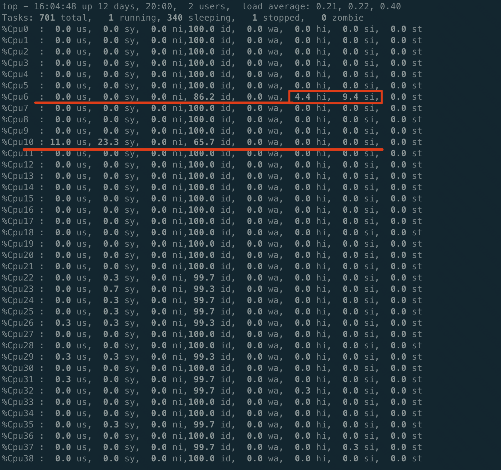

```table-of-contents
```
# RDMA
## RDMA 的工作原理
RDMA 的工作原理是通过硬件路径（NIC 和网络）将数据从一台主机上的用户应用程序内存直接复制到另一台主机上的用户应用程序内存中。RDMA是下图中的蓝线（图 3）。绿线描绘了您早已了解的传统 TCP/IP 流量


## 为什么需要RDMA
除了高性能计算之外，过去十年中我们还看到各种东西方流量持续大幅增长。这始于虚拟化。
可扩展性对许多资源（网络、存储、计算）提出了挑战。最重要的是，我们看到超融合基础设施（HCI）、存储复制和其他用例等消耗了更多的带宽。与此同时，随着我们获得更快的存储选项（NVMe、各种类型的 NVDIMM（N、F、P）或英特尔的 3D XPoint），对超低延迟的需求也随之增加，这导致了围绕其功能的新架构。

# 性能优化概述
RDMA性能优化这个东西说复杂也复杂，说简单也简单。
简单的点在于，从性能优化角度而言，其实软件层面我们可以做的设计和选择不会太多，因为性能上限是被硬件卡住的，所以我们为了追求尽可能逼近硬件上限的性能表现，其核心就在于**按照硬件最友好的方式去做数据访问**即可，没有特别多复杂的算法在这里面，当你想要高性能的时候，**多多了解硬件**就对了。

# 性能影响因素
## QP数量上升性能下降
参考：[# 【RDMA】qp数量和RDMA性能（节选翻译）|连接数](https://blog.csdn.net/bandaoyu/article/details/122947096)

[StaR: Breaking the Scalability Limit for RDMA](https://icnp21.cs.ucr.edu/papers/icnp21camera-paper30.pdf)

### 概述

RDMA的性能会随着连接数的增加而降低。测量（图1）表明，即使是最新的==CX-6（`NIC=Network Interface Card` ，网络接口卡、网卡，`RNIC: RDMA Network Interface Card`）要保持峰值性能最多能支持450个并发连接=。
当连接数超过3000个时，性能峰值的70%，而CPU利用率仍然很低。正如我们所看到的，尽管CX6比以前的CX5或CX4 NIC具有更高的端口速度和更多的片上资源，但RNIC的可扩展性问题仍然存在。


从本质上讲，为了给CPU减负，RNIC的片上内存，缓存一系列与连接相关的状态（DMA相关、网络相关和安全相关）。因此，当并发连接过多时，板载内存会被耗尽（其中一部分连接的状态就存在主机内存中），（当所需连接在板载内存中没有命中）它必须频繁地通过**慢速PCIe总线访问主机内**，以存获取连接状态，这会严重影响性能。

### 原因分析

conn是有状态的，这些状态会缓存在网卡的SRAM中，但是SRAM是有限的，混存的conn数量有限，当待请求的数据地址在网卡SRAM中的MTT/MPT没有命中的时候，网卡需要通过PCIe去在内存中的MTT和MPT进行查找，这是一个耗时的操作。尤其是当我们需要 `high fan-out（高扇出：指数据被大量独立的请求者或服务频繁访问）`、`fine-grained（细粒度: 指数据访问的操作粒度非常小）`的数据访问时，这个开销会尤为的明显。这或许就是性能下降的原因.


当并发性很高，在处理  状态 未存储在NIC上的连接时，NIC必须暂停，并通过慢速PCIe总线从主机内存获取状态，这会严重影响性能。


#### 详细介绍

当我们创建了QP之后，`RNIC`是需要保存状态数据的，比如`QP`的`metadata`，拥塞控制状态等等，除去QP中的`WQE`、`MTT`、`MPT`，一个QP大约对应`375B`的状态数据。这在以前`RNIC`的`SRAM`比较小的时候会是一个比较重的存储负担，所以==以前的RDMA工作会有`QP Sharing`的研究，就是不同的处理线程去共用QP来减少`meta data`的存储压力，但是这会带来一定的性能的损失（因为共享的QP，可能涉及到加锁）==。

现在新的RNIC的SRAM已经比较大了，**Mellanox的CX4、CX5系列的网卡的SRAM大约2MB**，所以现在新网卡上，QP的上限提升，小规模没问题，但**大规模集群时需创建几千个，几万个QP，仍然不够**。

当待请求的数据地址在`RNIC SRAM`中的`MTT/MPT`没有命中的时候，RNIC需要通过PCIe去在内存中的MTT和MPT进行查找，这是一个耗时的操作。尤其是当我们需要 `high fan-out、fine-grained`的数据访问时，这个开销会尤为的明显。这或许就是性能下降的原因。

RNIC上通常有一个小的**数据包缓冲区**，用于临时保存数据包，从而分摊每个数据包的硬件处理延迟，以便RNIC可以饱和带宽。当**带宽延迟积（BDP）** 增长时，它需要一个更大的数据包缓冲区来容纳更多的数据包。
然而，数据包可能属于不同的连接，需要不同的连接相关状态来处理。因此，保存连接状态的缓冲空间必须更大。在高带宽网络中处理许多小RDMA请求时，这个问题变得更加重要，因为数据包缓冲区中会有大量小数据包，这可能需要许多连接状态，很容易导致NIC内存上的状态丢失。
此外，高并发下的连接状态缓存未命中将导致数据包处理的临时暂停（来自PCIe的等待状态），这反过来需要更大的数据包缓冲区来容纳传入的数据包(从而进一步加重NIC内存的负担),否则，如果没有足够的内存，NIC必须暂停管道并停止接收数据包，影响性能。

### 解决思路

对面上面的RNIC 可伸缩性问题（即QP数量上升性能下降），以前的解决方案主要集中在**限制上层软件的使用，从而避免底层RNIC的可扩展性问题**。


基于软件的方案不论是缓解方案（例如，使用大内存页面或连接分组），或解决方案（例如，使用不可靠的数据报），始终无法解决 RNIC 可伸缩性问题。因此，才有下面的服务端**无状态RNIC**的解决方案。


#### 方案一：通过使用软件中间件来控制应用程序通信模式，避免生成过多连接

他们试图安排多个连接之间的通信需求，并有目的地在特定时间段内仅为RNIC上的部分连接提供服务，从而避免RNIC上的高并发性。
例如，ScalaRDMA 《Scalable RDMA RPC on  Reliable Connection with Efficient Resource Sharing》将连接分为几个组，通过阻止其他组即将启动操作的连接，一次只允许一个组运行，从而减轻了底层RNIC的负担。

##### 影响
（1）使用中间件会将开销带回CPU，这与RDMA的原理相反。
（2）中间件中连接之间的不可知调度可能会损害上层应用程序的性能，因为不同的连接之间可能存在依赖关系。
例如，在具有服务器-工作者结构的分布式机器学习中，下一轮参数分配只能在上一轮参数计算完成后开始（假设使用最广泛的同步模式）。这要求服务器节点及时分发参数并接收所有响应。

#### 方案二：减少可靠连接数。

通过使用`UD`、连接共享等方式避免或减少建立可靠连接数，从而减少网卡需缓存的连接状态信息.
（1）使用`UD`而非`RC`传输方式，可避免建立`1:1`的 `QP`连接；
（2）使 用 **动 态 连 接 共 享（`dynamically connectedtransport， DCT`）**、**扩展可靠连接 （`extended reliable connection，XRC`）**、**连接共享**等方式减少连接数；

##### 使用不可靠连接
尽管`RNIC`不需要在不可靠模式下保持连接相关状态，因此没有可伸缩性问题，但它可能会导致两方面的问题：

1）当网络有损时（即使在精心设计的数据中心），由于缺乏传输可靠性，它的性能可能非常低。
2）在软件中处理传输可靠性，可能会产生非常高的CPU成本。

#### 方案三：服务端无状态RNIC解决方案

 在本文中，为了解决这个问题，我们提出了无状态RNIC（StaR）。特别是，需要高并发性的应用程序通常具有非对称通信模式，即网络通信中只有一方（称为服务器）有许多连接，而另一方（称为客户端）只有少数。观察到这一点，StaR的关键见解是**将所有连接状态移动到客户端，服务器RNIC上不维护连接相关状态**。

具体来说，客户端RNIC跟踪服务器的所有状态，并引导服务器的RNIC完成其所有数据传输，包括接收或发送数据包、通知应用程序和生成ACK包等。

因此，由于RNIC内存不再限制其可扩展性，StaR可以显著提高服务器端具有大量扇入/扇出功能的应用程序的性能。

##### 挑战
虽然直觉很简单，但在实现上面临两大挑战：
1）如何在NIC上无状态的情况下完成RDMA功能？
2）如何确保NIC上无状态的安全性？

##### 解决思路
（1）在数据包中携带必要的状态。
具体来说，客户机跟踪服务器的传输状态，并生成向服务器传送必要状态的数据包。  
然后，服务器的无状态RNIC依赖于接收到的数据包中携带的连接状态来完成其RDMA处理。

（2）确保安全。
由于StaR针对的是数据中心场景，即所有物理机都由一家运营商管理，因此我们可以通过控制客户端NIC发送的数据包来确保安全性。
特别是，我们向每个NIC添加一个安全模块，它实际上是一个检查所有出站数据包的匹配操作表，只允许合法数据包进入服务器的无状态RNIC。


##### 效果

我们在基于FPGA的10Gbps NIC原型上实现了StaR，并构建了一个由9台机器组成的测试平台，每台机器都配备了一个StaR RNIC。测试台评估结果表明，随着连接数的增加，StaR能够保持最大带宽，与原始RNIC和最新基于软件的应用相比，上层应用的性能提高了4.14倍和1.35倍。

**(1) 吞吐**


**(2) 时延**


# 优化建议
## 避免或减少在数据路径中使用控制操作
```bash
the data operations that stay in the same context that they were called in (i.e. don't perform a context switch) and they are written in optimized way.

the control operations (all create/destroy/query/modify) operations are very expensive because:

Most of the time, they perform a context switch
Sometimes they allocate or free dynamic memory
Sometimes they involved in accessing the RDMA device
```

多个数据操作之间的调用之间，一般不需要执行上下文切换。

在数据路径中执行控制操作（比如：QP的创建/销毁/查询/状态修改）非常昂贵, 因为：
```bash
- 大多数时候，他们执行上下文切换
- 有时他们分配或释放动态内存
- 有时他们参与访问 RDMA 设备
```

作为一般经验法则，应**避免调用控制操作或减少其在数据路径中的使用**。
以下动词(verbs接口)被视为数据操作：
```bash
- ibv_post_send() 发送
- ibv_post_recv() 接收
- ibv_post_srq_recv() 共享接收队列
- ibv_poll_cq() 轮询完成队列
- ibv_req_notify_cq 通知完成
```

## 批量Post WR：如果需要需要对一个QP执行post 多个WRs操作, 最好使用list将他们连起来，一次发送完。

当用verbs接口`ibv_post_*()`中的一个, 来发送工作请求WR时，在一次调用中将多个工作请求作为链表发布，而不是每次使用一个工作请求的调用。

因为作为链表一次调用，允许低级驱动程序执行优化。

```bash
注意：every Work Request is one message (no matter the number of S/G entries it has).
```

## 减少CQE的数量：使用工作完成事件（CQE）时，在一次调用中确认多个事件
当RNIC完成与verbs关联的网络操作时，它通过DMA写将一个完成事件（completion event）推到与QP对相关联完成队列(CQ)。使用完成事件会增加RNIC的PCIe总线的额外开销。这种开销可以通过使用选择性信号（selective signaling）来减少。当使用大小为S的选择性标记发送队列时，最多为`S−1`个连续动词可以取消标记，也就是说，不会为这些动词推送一个完成事件。接收队列不能有选择地发信号通知。由于 S 很大（~128），我们交替使用术语“选择性信号”和“无信号”。

**另外，使用ack cq events机制的时候尽量一次ack尽可能多的events，一次释放完**。

使用事件处理工作完成时，在一个调用中确认多个完成而不是每次调用多个调用将提供更好的性能，因为执行的互斥锁较少。

```bash
acknowledging several completions in one call instead of several calls each time will provide better performance since less mutual exclusion locks are being performed.
```

类似于 `ibv_ack_cq_events(ev_cq, num_cq_events)`;

### 本端一次发送多个send wr，只有最后一个send wr(signaled)才产生CQE
比如：RC模式下，发送一个大的message，拆分为多个send wr（比如N个）。前面的 n-1个 send wr 是 unsignaled， 只有最后一个 send wr是 signaled；
当收到最后一个send WR的CQE时，前面的n-1个send wr肯定是发送完成了的。最终，n个send wr也产生了一个CQE。


==注：需要注意的是前 N-1 个send WR不产生CQE，可能会导致send queue满==。
> 因为前 N-1 个send WR不产生CQE，就无法将前N-1个WQE从send queue中移除。一旦第N个send WR产生CQE，就会将这N个send WR 从send queue移除。
- 从这里得知：==对于SQ，硬件作为消费者，尾指针的移动只有是能够产生CQE的WR(signaled)的消息发送完，才会移动；对于不产生CQE的WR，即使消息完成发送，硬件也不会移动尾指针==。


> ==注：查看代码时，发现只有产生CQE时才会移动send queue的尾指针(消费者指针)。如下所示：==
```bash
rdma-core中的：
	ibv_poll_cq --> mlx5_poll_cq --> poll_cq (providers/mlx5/cq.c)--> mlx5_poll_one--->
	mlx5_parse_cqe 中查看对于 wq->tail 的操作。

注：mlx5_wq_overflow 来在 _mlx5_post_send 时判断是否send queue是否满了。
```


分析：==对于send queue，这个相当于是在软件层来操作SQ的头指针和尾指针，不需要硬件(消费者)来操作尾指针，这样可以提升性能。== 因为硬件操作尾指针，需要IOMMU通过PCIe来访问，影响性能。

```bash
SQ头指针的移动：
	软件post_send的时候，移动head指针。

SQ尾指针的移动：
	产生CQE时候，可以得到关联的WR，可以得知这个WR在queue中的位置，进而可以移动尾指针（在CPU 进行 poll_cq的时候，移动 SQ的尾指针）。

SQ是否为满判断：
	mlx5_wq_overflow 来在 _mlx5_post_send 时判断是否send queue是否满了。

哪些WR可以产生CQE：
	signaled的WR 或者 unsignaled的WR产生了错误
```


### RPC场景：本端send WR不产生CQE
RC模式，RPC场景，即`ping-pong`一问一答，即本端send request，对端收到request，进行reponse。无论是发起端，还是相应端，只有recv wr才在本端产生CQE，send WR不产生CQE。

但是，这样也会带来其他的问题：**`send WQE`回收不及时，以及 `send buffer` 的回收不及时**。

|风险点|具体表现|
|---|---|
|无法确认 send 是否完成|unsignaled 的 send 不会生成 CQE，无法直接知道 “请求是否成功发送到对端”|
|无法处理 send 失败|若 send 因网络 / 对端问题失败（如 QP 错误、内存非法），无 CQE 则无法感知失败|
|发送队列（SQ）溢出|所有提交的发送请求（无论是否有信号）都被认为是“未完成的”（Outstanding），直到它们被一个后续的、有信号的 WR 的完成事件所“清理”|

如果是 signaled send WR, NIC 会生成`SEND CQE`，程序 poll 到 CQE 后就知道，这个 WQE 已完成，就可以：
```bash
1> 回收 send buffer
2> 复用 WQE slot
```

如果 UNSIGNALED, NIC 不会产生 CQE，于是程序，不知道 send 是否完成，会导致：
```bash
1> WQE 无法回收
SQ 是一个 ring, SQ depth = N, 如果没有 completion, head 一直向前, tail 不动，最终SQ 满，出现ibv_post_send() 失败。
相当于是：只有send queue，只有生产者，没有消费者。

2> send buffer 的回收不及时。
正常如果发送完成了之后，就可以回收 send buffer，但是现在不知道是否发送完成，就无法回收。
```

## 批量Poll CQE：一次poll 读取尽可能多的CQEs
`ibv_poll_cq()`允许一次读取多个完成。如果CQ中的工作完成数小于尝试读取的工作完成数，则意味着CQ为空，无需检查其中是否还有更多工作完成。

`ibv_poll_cq()`中的`num_entries`尽量设置的大一些。保证能一次将CQ中现存的CQE全部poll出。

这样做的，主要目的是消费者(CPU)尽可能快一点消费多一些CQE，**防止CQ溢出(overrun), 因为CQ溢出的危害实在是太大了**。

### CQE的生成
对于RDMA的Recv操作，RDMA除了接收对端传回的有效载荷，还需要通过DMA传输相应的完成队列元素（CQE）。
如下图最左侧显示，**NIC会分别生成两个单独的DMA来处理Payload和CQE**。


```bash
图7 对于对端RNIC使用Send操作发送少量数据时，本端RNIC的Recv操作优化
```

即：**CQE的生成，是网卡DMA通过PCIe写内存生成CQE的**。因为，应用程序在Poll CQ的时候，就不需要通过PCIe来访问了。


### Poll CQ的损耗
- 硬件生成 CQE → DMA 写到主存（CQE是CQ的一部分，CQ在主机内存，不在网卡内存） → 走 PCIe（网卡硬件主动发起）
- 用户态 poll CQ → CPU 读内存 → 不走 PCIe（只是读本地内存）

**硬件写CQE，和软件读CQE的安全性问题**：
```bash
CQE 有一个 owner bit：
（1）NIC 写 CQE 时：
1 写 CQE
2 flip owner bit

（2）CPU poll时：
if (owner == expected)
    CQE ready

上面的机制，避免了CPU 和 NIC 同时读写，这是 lock-free 的关键。
```
### 小结
对于WQ：应用程序是生产者，硬件是消费者。应用程序`post WQE（Post send/recv）`之后，需要通过PCIe 敲门铃（通过MMIO写硬件寄存器）的方式来通知硬件，有新的WQE任务要处理（CPU通知硬件，就是MMIO）。

对于CQ：硬件是生产者，应用程序是消费者。硬件通过PCIe写CQE，应用程序通过Poll CQ取CQE。（高性能IO中，硬件不需要通知CPU，因为CPU是Polling CQ的； 对于传统IO，硬件是通过中断来通知CPU的。）

## 同一个QP的SQ和RQ关联到一个CQ还是2个CQ？

**问题**：
```bash
有这样的一个通讯库，有多个线程，每个线程中都有多个连接，一个连接对应一个QP；每个连接都只在本线程中被访问，不会跨线程访问。
使用的是RC模式，send/recv操作，client和server之间通过ping-pong这种一问一答的方式进行通信。 

现在有一个问题，在每个线程中是创建一个CQ，还是2个CQ，性能更好？ 
1》如果是一个CQ，那么这个线程中的每个qp的SQ和RQ都关联这个CQ；这个线程在poll cq的时候，需要区分是SWR还是RWR的CQE，然后进行不同的处理。 
2》如果是两个CQ，那么这个线程中的每个qp的SQ关联一个CQ，RQ关联另外一个CQ；在这个线程中，poll 2个CQ，然后处理。
```

这个问题其实是 RDMA 通讯库设计里非常经典的一个取舍：**每线程 1 CQ vs 每线程 2 CQ（send / recv 分离）**

### 分析

前提条件：
```bash
- 多线程
- 每线程多个 QP
- QP 不跨线程
- RC
- ping-pong（严格 request → response）
- 每个线程 busy poll CQ
```

如果**只有一个线程进行Poll cq，那么是一个CQ好，还是2个CQ好**呢？
其实就应该看：一个CQ分支预测失败的开销，和两个CQ带来的多一个`ibv_poll_cq`哪个更大？
猜测：应该是一个CQ的性能更好一些。

### 使用一个CQ

```c
while (1) {
    n = ibv_poll_cq(cq, 32, wc);

    for (i = 0; i < n; i++) {
        if (wc[i].opcode == IBV_WC_RECV)
            handle_recv();
        else
            handle_send();
    }
}
```

优点：实现简单；
即使绑定同一 CQ，也必须按`opcode`（CQE 类型）+ `wr_id`（操作标识）过滤处理，不能依赖轮询顺序。

**使用 1 个 CQ 的重要注意事项：防止溢出(overrun)**
将该线程下所有 QP 的 SQ 和 RQ 都绑定到这 1 个 CQ 上，必须极其注意 CQ 的深度（Size）设置。


### 使用两个CQ
**（1）可以使用2个CPU**：
拆 CQ 后可以：
```bash
thread0 → poll recv_cq
thread1 → poll send_cq
```

另外，这种情况下，RPC的时延更低
> 因为如果是公用一个CQ，send WR也会产生CQE，recv WR也会产生CQE；在一个线程中进行poll cq，会同时得到 send CQE和recv CQE。
> 在发送端发送RPC请求后，收到对端响应之前，大概率会收到Send WR的CQE，需要进行处理，然后才是收到reponse的 recv CQE，进而导致RPC时延的计算偏大。

**（2）减少分支预测失败**：
如果使用一个CQ：每次 poll 到 CQE 后，必须先通过 `wc.opcode` 判断是 SEND（写完成）还是 RECV（读完成），再分支处理；
```bash
SEND CQE
RECV CQE
SEND CQE
RECV CQE
```
代码中：`switch(wc.opcode)` 可能会CPU 分支预测会失败。

使用2个CQ，就不会有分支：poll 收 CQ 时，拿到的 100% 是 RECV CQE；poll 发 CQ 时，拿到的 100% 是 SEND CQE，**完全省去 opcode 判断分支**。
```bash
recv_cq → 只有 RECV
send_cq → 只有 SEND
```
- 硬件层面：CQE 的 opcode 字段在内存中是离散的，CPU 分支预测器对 “随机混合的 SEND/RECV” 预测命中率低（约 50%），分支失败会导致流水线清空，这是隐性性能损耗；
- 软件层面：CQ分离后处理逻辑更简洁，无需在处理函数中加 if-else，代码执行路径更短。


**（3）灵活的CQ 深度设置以及Poll 策略**：
不同 CQ 可针对性设置深度（接收 CQ 通常需要更大的深度，避免接收 CQE 溢出）；
RC ping-pong 场景中，“recv CQ” 是核心（需要及时处理并回包），“send CQ” 仅需清理资源（优先级低）；
- 2 个 CQ 可针对性调优：
    - recv CQ：用较小的 poll 批量（如 16/32），高频 poll，保证收包延迟；
    - send CQ：用较大的 poll 批量（如 128/256），低频 poll，减少调用次数；
> 注：收 CQ 用小批量、发 CQ 用大批量，本质是围绕 **“延迟敏感型任务”** 和 **“吞吐量型任务”** 的差异化优化。

- 1 个 CQ 无法区分优先级，只能用统一的 poll 参数，要么牺牲收包延迟，要么增加 poll 开销。


### 中断模式下查看以及设置产生中断的CPU

```bash

/**
 * ibv_create_cq - Create a completion queue
 * @context - Context CQ will be attached to
 * @cqe - Minimum number of entries required for CQ
 * @cq_context - Consumer-supplied context returned for completion events
 * @channel - Completion channel where completion events will be queued.
 *     May be NULL if completion events will not be used.
 * @comp_vector - Completion vector used to signal completion events.
 *     Must be >= 0 and < context->num_comp_vectors.
 */
 
struct ibv_cq *ibv_create_cq(struct ibv_context *context, int cqe,
			     void *cq_context,
			     struct ibv_comp_channel *channel,
			     int comp_vector);
```

`ibv_create_cq`的`comp_vector`参数直接指定完成向量，驱动会将该向量对应的中断号绑定到指定的CPU-Core。
```bash
- 当你调用 `ibv_create_cq(context, ..., comp_vector)` 时，你指定了 `comp_vector`。
- 这个 `comp_vector` 对应网卡硬件的一个 MSI-X 中断向量。
- 操作系统会将这个 MSI-X 向量映射为一个 Linux IRQ 号。

注：`comp_vector` 的设计初衷就是让不同的 CQ 可以绑定到不同的 CPU Core，实现并行处理和缓存局部性（Cache Locality）。
```


中断模式下，产生的中断是**硬件中断**，但是中断处理，会分为中断的上下部分。
如果是轮询模式，则不会产生中断。

#### 查看中断号以及绑定的CPU

**（1）查看中断号**：

方法一：
```c
ll /sys/class/net/eth03/device/msi_irqs/

比如：
# ls /sys/class/net/eth03/device/msi_irqs/
418  420  422  424  426  428  430  432  434  436  438  440  442  444  446  448  450  452  454  456  458  460  462  464  466  468  470  472  474  476  478  480
419  421  423  425  427  429  431  433  435  437  439  441  443  445  447  449  451  453  455  457  459  461  463  465  467  469  471  473  475  477  479  481
```

方法二：
```bash
vim /proc/interrupts
```


如上所示，`mlx5_comp2@pci:0000:3b:00.0`，这个完成向量(comp_vector)是2，对应的中断号是本行的第一个字段，得到中断号之后，就可以得到该中断的CPU亲和性。
> 注：在 `/proc/interrupts` 中能看到的 RDMA 网卡中断号（如 mlx5_comp1），就是==硬件中断==。


**（2）查看中断号绑定的CPU亲和性**：
```bash
（1）查看：
# cat /proc/irq/483/smp_affinity_list
29

（2）设置：
# systemctl stop irqbalance
# systemctl disable irqbalance
# echo 6 > /proc/irq/419/smp_affinity_list
```

#### 查看某个CPU上实际产生的中断的次数
**背景**：
如果应用程序的性能差，但是又不知道是什么导致的性能差，此时可以看看线程所在的CPU上的中断的占比，来判断是否是中断响应导致性能差。


（1）先用`top->1`, 查看是否软中断和硬中断比较高：
如下所示：



#### 对于中断模式，如果设置了完成向量对应的中断的CPU亲和性为1，但该线程绑定在CPU2上，那么epoll_wait还可以感知到事件的发生吗？有什么影响？

可以感知到，epoll_wait能正常工作。

**中断在 CPU 1，处理在 CPU 2**，但中断处理和事件通知是两个不同阶段的事情：

- **中断处理阶段**：中断亲和性设置为CPU1，意味着当硬件产生CQE时，**网卡发出的MSI-X中断信号会被CPU1处理**。具体来说，CPU1会执行驱动注册的中断处理函数，这个函数负责从硬件事件队列(EQ)中读取事件，然后将事件加入到内核处理队列中。
    
- **事件通知阶段**：中断处理完成后，内核会唤醒等待在该CQ上的所有线程。这是内核的通用机制——**唤醒操作与线程当前绑定的CPU无关**。只要线程在`epoll_wait`上等待，它就会被标记为可运行，调度器会将其放在CPU2的运行队列中。


所以完整路径是：**硬件触发中断 → CPU1执行中断处理并唤醒等待队列 → CPU2上的应用线程被调度执行 → epoll_wait返回**。

### 使用CQ的注意事项
#### 如果CQ溢出(overrun)了，会有什么影响?
当 CQ 满时，NIC 无法再写 CQE，此时 HCA 会触发 CQ error，所有关联 的QP 进入 error state。
即：
```bash
- NIC 检测到 CQ 已满
- 触发 CQ error：当底层检测到CQ溢出时，会生成一个CQ错误，并向应用程序触发 `IBV_EVENT_CQ_ERR` 异步事件
- CQ 状态变为 error
- 与该 CQ 关联的 QP 进入 error state： 
	- QP 状态：RTS → ERR
	- NIC 会把未完成的 WR 全部 flush，意味着：未完成请求全部失败；
	- ibv_poll_cq() 可能得到 IBV_WC_WR_FLUSH_ERR，而不是正常的CQE；

简化流程:
CQ full
   ↓
CQ overrun
   ↓
CQ error event
   ↓
QP error
```

为什么 CQ overrun 设计得这么“狠”？
```bash
原因是 CQE 不能丢。
如果 NIC 在 CQ 满时简单丢弃 CQE，会导致：应用不知道哪些 WR 已完成, 这会破坏 RDMA 的基本语义，例如：
send buffer 是否可以释放？
recv buffer 是否可以复用？

因此硬件的策略是：宁可终止连接，也不能 silently drop CQE。
```

#### CQ溢出(overrun)的原因

CQ 本质是一个 NIC 写（生产者）、CPU 读（消费者）的环形队列。
如果 **`NIC 产生 CQE 的速度 > CPU poll CQ 的速度`**,  最终会发生 CQ 被写满，此时 NIC 无法再写新的 CQE，这就是 CQ overrun / CQ overflow。

**（1）配置层面**
- CQ 深度不足
- 中断 moderation 设置不当（如果使用中断模式）：
如果启用了中断聚合（Interrupt Moderation），网卡会积攒多个 CQE 后才触发一次中断。如果积攒速度过快而应用响应中断稍慢，可能在单次中断处理周期内 CQ 就满了。

**（2）软件层面**：poll cq 消费不及时
- poll 被阻塞：poll CQ 的线程被其他耗时操作抢占（比如加锁等待、磁盘 IO、sleep、日志打印、网络同步调用），导致长时间未执行`ibv_poll_cq`；
- poll 策略不合理：例如：`ibv_poll_cq(cq, 1, &wc)`; 每次只取一个 CQE。
- poll 线程被调度暂停(多个线程竞争一个CPU core)

**（3）硬件层面**
- 突发流量：比如 ping-pong 场景中多个客户端同时发起请求，短时间内 CQE 生成速度骤增，超过 poll 的处理能力；
- QP异常：QP 状态异常（如 RC 连接断连重连）导致 CQE 批量生成，或网卡固件 bug 引发 CQE 计数错误（极少数）。

#### 程序运行中，CQ overrun后能否补救？
一旦检测到 `CQ overrun`（可以通过 `ibv_get_async_event()` 捕获异步事件 `IBV_EVENT_CQ_ERR`来感知），**不可“补救”** 或恢复该 CQ 的正常使用，**必须重建**资源才可以恢复通信。

Verbs API (`libibverbs`) 没有提供“清空 CQ”或“重置 CQ 指针”的接口来修复溢出。CQ 的设计是一次性的，**CQ一旦出错，必须销毁重建**。
```bash
销毁重建：
1》销毁
- 立即停止向受影响的 QP 提交新的 Work Request。
- 先将关联的 QP 重置或销毁（`ibv_destroy_qp` 或先 modify 到 RESET 状态）。
- 销毁溢出的 CQ (`ibv_destroy_cq`)。

2》重建
- 创建一个新的 CQ（建议适当增加深度）。
- 创建新的 QP。
- 重新执行 QP 的状态机流转（INIT -> RTR -> RTS 等），重新建立连接（如果是 RC/UC 类型）。
```

#### 工程实践中的预防CQ overrun的方法
预防 CQ overflow 的核心原则：
```bash
减少 CQE
提高 poll 速度
增大 CQ 容量
限制 outstanding WR
```

**(1) CQ size 设计要足够大**
很多高性能 RDMA RPC 系统的配置：
```bash
CQ size       = 16384 ~ 65536
outstanding   = 128 ~ 512
signal ratio  = 1/32 ~ 1/128
poll batch    = 16 ~ 64
```

**(2) 减少send CQE的数量**
```bash
合理使用 unsignaled send
在 RC 模式下，不是每个 send 都必须产生 CQE。
```

**(3) 发送端流控**：限制 outstanding Send WR
```bash
很多 CQ overflow 其实是 应用层无限 post send。
正确做法：credit control。比如，只有当 Send CQE 回来， credit++， 才允许继续 send。

监控与动态调整：
1> 查询 CQ 使用情况：  
现代 RDMA 网卡驱动通常支持通过 sysfs 或 `ibv_exp_cq` 接口获取 CQ 的繁忙程度（如已使用的 CQE 数量）。  
应用程序可定期采样，若接近阈值则动态调整发送速率或通知上层降低负载。

2> 自适应流控：
基于 CQ 剩余容量实现发送端的背压(backpressure)机制：当 CQ 使用率超过一定百分比（如 80%）时，自动降低下发 WR 的速率，或暂停下发直到 CQ 被清空到安全水位。
```

**(4) poll CQ 必须足够快**
```bash
1> 使用 batch poll
2> 让 poll thread CPU pinned, 避免 scheduler 抢占。
3> 避免poll cq的线程阻塞
```

**（5）增加CQ数量**
send CQ和recv CQ分开；
单线程中设置多个CQ：比如高吞吐场景，按 QP 分组（每 8~16 个 QP 共享一个收 CQ / 发 CQ），分散单 CQ 的压力。


## 避免使用许多分散/聚集sge条目
在工作请求（发送请求或接收请求）中使用多个分散/聚集条目意味着 RDMA 设备将读取这些条目并将读取它们引用的内存。使用一个分散/聚集条目比使用多个分散/聚集条目提供更好的性能。

`Using one scatter/gather entry will provide better performance than more than one`.  数据尽量放在一块，一次读完。

## 避免使用围栏(Fence)
设置了栅栏标志的发送请求将被阻止，直到所有先前的 RDMA 读取和原子发送请求完成。这会降低带宽。

```bash
Send Request with the fence flag set will be blocked until all prior RDMA Read and Atomic Send Requests will be completed. This will decrease the BW.
```

## 避免使用atomic 原子操作
原子操作允许以原子方式执行读取-修改-写入。这通常会降低性能，因为这样做通常涉及锁定对内存的访问（取决于实现）。

```bash
因为牵扯到读改写，
doing this usually involved in locking the access to the memory.
```

## 设置特定任务或进程的CPU亲和性

当使用对称多处理 (SMP) 机器时，将进程绑定到特定的 CPU/核心可以更好地利用 CPU/核心，从而提供更好的性能。按照机器中 CPU/核心的数量执行进程并将进程分布到每个 CPU/核心可能是一个很好的做法。这可以通过“taskset”实用程序来完成。

```bash
binding the processes to a specific CPU(s)/core(s) may provide better utilization of the CPU(s)/core(s) thus provide better performance. This can be done with the "taskset" utility.
```

## 使用本地 NUMA 节点

在非统一内存访问 (NUMA) 计算机上工作时，将进程绑定到被视为 RDMA 设备的本地 NUMA 节点的 CPU/核心可能会因为更快的 CPU 访问而提供更好的性能。将进程分布到所有本地 CPU/核心可能是一个很好的做法。

```bash
binding the processes to CPU(s)/core(s) which are considered local NUMA nodes for the RDMA device may provide better performance because of faster CPU access. Spreading the processes to all of the local CPU(s)/core(s) may be a good practice.
```

### 程序中申请的内存要cache-line对齐

与使用未对齐的内存缓冲区相比，使用缓存行对齐的缓冲区（在 S/G 列表、发送请求、接收请求和数据中）将提高性能；它将减少 CPU 周期数和内存访问次数。

```bash
in S/G list, Send Request, Receive Request and data， it will decrease the number of CPU cycles and number of memory accesses.

如果有可能，all memory buffers (WRs, S/Gs, data) should be cache-line aligned in order to get best performance！
```

## 尽量减少重传

重传是性能杀手。RDMA中重传的主要原因有2个：
- 传输重传 - 远程 QP 未处于可以处理传入消息的状态，即至少未达到 RTR 状态，或移至错误状态
- RNR重传-响应方有一条消息应该消耗一个接收请求，但接收队列中没有任何接收请求

```bash
- remote QP isn't at a state that can process incoming messages, i.e. didn't get to, at least, RTR state, or moved to Error state

- there is a message that should consume a Receive Request in the responder side, but there isn't any Receive Request in the Receive Queue
```

如果不允许重传，`Setting QP.retry_cnt and QP.rnr_retry to zero will cause a failure (i.e. Completion with error) when the QP enters those flows`.

如果允许重传（比如业务上不可避免），`use low (as possible) delay between the retransmission`.

# 优化手段
## 提高带宽的手段
### 找到最适合 RDMA 设备的 MTU
MTU 值指定可以发送的最大数据包有效负载大小（即不包括数据包标头）。
使用最大可用 MTU 大小作为数据包载荷大小，将降低每个数据包的“支付价格(负载开销)”；有效负载数据占总使用带宽的百分比将会增加。

```bash
using the maximum available MTU size will decrease the "paid price" per packet; the percent of the payload data in the total used BW will be increased. However, there are RDMA devices which provide the best performance for MTU values which are lower than the maximum supported value. One should perform some testing in order to find the best MTU for the specific device that he works with.
```

### 使用大消息
发送几条大消息比发送大量小消息更有效。在应用程序级别，第一级应该通过 RDMA 收集数据并发送大消息。

```bash
Sending a few big messages is more effective than sending a lot of small messages. In application level one should collect data and send big messages over RDMA.
```

即：
（1）==一个 WR中包含多个sge==；
> 注：一个WR中包含多个sge, 相当于是发送大消息，不是大包，包大小是基于MTU。如果是一个sge，可以理解为发送小消息。

（2）一次`post_send`多个`WR`(以及一次 `post_recv`多个`WR`） ；每个`WR`的`sge`的个数不变。
> 注：这样相当于是发送的消息的大小不变。但是一次下发了更多的数据。

上面的两种方法，效果应该都是相当于是减少了`doorbell`(写寄存器)的次数；通过一次`doorbell`,多次`DMA`取数据。

### 处理多个未完成的发送请求
```bash
Working with multiple outstanding Send Requests and keeping the Send Queue always full (i.e. for every polled Work Completion post a new Send Request) will keep the RDMA device busy and prevents it from being idle.
```
这个思路在`rdma-core`中的历程中体现的很明显，那个架构就是把SR（send-request），RR(receive-request)的queue始终尽量多填充，整个流程没有任何拉齐时序的多余的操作！

### 配置QP以允许多个 RDMA 读取和原子操作并行
```bash
If one uses RDMA Read or Atomic operations, it is advised to configure the QP to work with several RDMA Read and Atomic operations in flight since it will provide higher BW.

```
如果使用 RDMA 读取或原子操作，建议将 QP 配置为与运行中的多个 RDMA 读取和原子操作配合使用，因为它将提供更高的 BW。

**原因**：
RNIC是包含多个`Processing Unit(PU)`的，同时由于QP内的请求处理是具有顺序的，且为了避免`cross-PU（跨PU）`的同步，一般而言我们认为一个QP对应一个PU来处理。

所以，我们可以在一个线程内建立多个QP来加速你数据处理，避免RDMA程序性能瓶颈卡在PU的处理上。

另一方面现在RNIC的SRAM很大，可以允许创建多个QP，有人提过使用两个QP会不会比一个QP好的问题，Dotan Barak认为2个好一些，但是需要实测一下，因为2个QP的管理更复杂，影响程序的简单性。


### 使用发送队列中的选择性信号
```bash
Working with selective signaling in the Send Queue means that not every Send Request will produce a Work Completion when it ends and this will reduce the number of Work Completions that should be handled.
```


一个QP执行多次`post_send`的场景，等多次SR(send request)的最后一次使用`signaled`标志来产生CQE（需要在创建qp的时候指定`sq_sig_all = 1`）

在发送队列中使用选择性信号意味着并非每个发送请求在结束时都会产生工作完成，这将减少应处理的工作完成的数量。

## 降低延迟的手段
### 使用轮询(polling)读取工作完成情况
```bash
Read Work Completions by polling，In order to read the Work Completion as soon as they are added to the Completion Queue, polling will provide the best results (rather than working with Work Completion events).
```
可以让产生CQE的第一时间就被poll 出来，cq_event机制是对CPU占用比较友好，但是增加了延时，也是等待CQE进如CQ然后产生一个事件，但是增加了cq_event函数的处理时间！

为了在工作完成添加到完成队列后立即读取它们，轮询将提供最佳结果（而不是使用工作完成事件）。

### 以inline内嵌方式发送小消息

小消息直接使用inline flag，在发送SR的时候data就放在请求命令中，不用去内存再取数据了。我们是可以控制inline data的size的。不同的RDMA device可能配置的方法不一样。使用的时候指定flag就行。


```bash
it eliminates the need of the RDMA device to perform extra read (over the PCIe bus) in order to read the message payload.
```
使用关系如上图所示： max_inline_data：表示能够内联发送的最大数据量（以字节为单位）。内联发送是指将较小的数据直接包含在发送操作中，而不需要额外的缓冲区。

在支持内联发送数据的 RDMA 设备中，内联发送小消息将提供更好的延迟，因为它消除了 RDMA 设备（通过 PCIe 总线）执行额外读取以读取消息有效负载的需要。

### 在 QP 的超时和 min_rnr_timer 中使用较低的值
```bash
If immediate data is used, use RDMA Write with immediate instead of Send with immediate：
Use low values in QP's timeout and min_rnr_timer
the waited time before a retransmission will be short.
```
在 QP 的超时和 `min_rnr_timer` 中使用较低的值意味着，如果出现错误并且需要重试（无论是因为远程 QP 没有应答还是没有未完成的接收请求），重传之前的等待时间将简短一点。

### 如果使用`imm data`立即数，请使用 `RDMA Write with imm data`而不是 `Send with imm data`

```bash
the send_with_imm causes the outstanding posted Receive Request to be read (in the responder side) and not only be consumed. write_with_imm 就仅仅是consumed而已。
```
当发送仅包含立即数据的消息时，带有立即数的 RDMA 写入将比带有立即的发送提供更好的性能，因为后者会导致未完成的已发布接收请求被读取（在响应方），而不仅仅是被消耗。

## 减少内存消耗的手段
### 使用共享接收队列 (SRQ)
```bash
using SRQ can save the total number of outstanding Receive Request thus reduce the total consumed memory.
```
使用 SRQ 可以节省未完成的接收请求的总数，从而减少消耗的总内存，而不是为每个队列对发布许多接收请求。

### 注册物理连续内存
```bash
Register physical contiguous memory, such as huge pages, can allow the low-level driver(s) to perform optimizations since lower amount of memory address translations will be required (compared to 4KB memory pages buffer).
```
寄存器物理连续内存（例如大页）可以允许低级驱动程序执行优化，因为需要较少量的内存地址转换（与 4KB 内存页缓冲区相比）。

这种情况下，也能在访问MTT的时候增加缓存命中，如果没有命中，就得通过PCIe发送请求，在内存的MTT和MPT中进行查找，这带来了相当的额外开销，尤其是当你的应用场景需要大量的、细粒度的内存访问的时候，此时RNIC SRAM中的MTT/MPT命中缺失带来的影响可能是致命的。

### 将使用的队列大小减少到最小
```bash
Reduce the size of the used Queues to the minimum
One should set the size of them to the minimum that is required by his application. 
评估清楚，用多少申请多少！
```
创建各种队列（队列对、共享接收队列、完成队列）可能会消耗大量内存。人们应该将它们的大小设置为其应用程序所需的最小值。

## 减少CPU消耗的手段
### 事件方式而非polling方式处理工作完成
```bash
Reading the Work Completions using events will eliminate the need to perform constant polling on the CQ since the RDMA device will send an event when a Work Completion was added to the CQ.
```

使用事件读取工作完成将消除在 CQ 上执行持续轮询的需要，因为当工作完成添加到 CQ 时，RDMA 设备将发送事件。


前面Reducing the latency中提到，使用cq_event机制会增加延迟，所以这里降低CPU的使用负载也是有代价的，实际使用时要综合考虑。[文武双全：RDMA cq event机制-ibv_req_notify_cq](https://zhuanlan.zhihu.com/p/688269158) 链接的文中详细总结了cq_event机制的使用逻辑，从send和recv两种角色进行分析讨论。


### 在响应者端处理请求的事件
```bash
Work with solicited events in Responder side:
When reading the Work Completions in the Responder side, the solicited event can be a good way to the Requestor to provide a hint that now is a good time to read the completions. This reduces the total number of handled Work Completions.
```

`solicited`机制会控制`CQE`的产生！这种机制，包括`signaled`标记，的前提就是对RDMA通信的理解，在一个持续通信的过程中，没有必要一直看每一次IO的`CQE`，除非里面有重要信息。只需要“抽检”即可。

当在响应者端读取工作完成时，请求事件可以是向请求者提供提示的好方法，表明现在是读取完成的好时机。这减少了已处理的工作完成总数。

### 与多个队列共享同一个CQ
```bash
Share the same CQ with several Queues:
eliminate the need to check several CQs in order to understand if an outstanding Work Request was completed.
```

CQ是可以在多个QP中共享的，甚至send WRs和recv WRS产色的CQE都可以放在同一个CQ中。CQ的使用将影响程序的实现框架，因为如果使用同一个CQ，就可以将poll cq的行为作为流程核心，增加对CQE的识别以将其归属到不同的QP上，甚至是SR或RR产生的都能区分。rdma-core中的各种pingpong的例程都是如此实现的。但是如果不同的QP使用不同的CQ，甚至QP建立的时候recv_cq和send_cq都指定了不同的CQ，则poll cq的行为必须分类处理。

对多个队列使用相同的 CQ 并减少 CQ 的总数将消除检查多个 CQ 的需要，以便了解未完成的工作请求是否已完成。这可以通过与多个发送队列、多个接收队列或它们的混合共享相同的 CQ 来完成。

## 提高可扩展性的手段
### 使用集体算法(collective algorithms)
```bash
Using collective algorithms will reduce the total number of messages that cross the wire and will decrease the total number of messages and resources that each node in a cluster will use. There are RDMA devices that provide special collective offload operations that will help reducing the CPU utilization.
```
这里的意思是使用集合通信语义，比如`allreduce`之类的，显然这是在大规模组网中各个节点之间进行数据同步的范畴，可以参考GDR。

可参考DAOS中CART的k项树算法；使用集体算法将减少通过线路的消息总数，并减少集群中每个节点将使用的消息和资源总数。有些 RDMA 设备提供特殊的集体卸载操作，有助于降低 CPU 利用率。

### 使用不可靠数据报 (UD) QP
```bash
If every node needs to be able to receive or send a message to any other node in the subnet, using a connected QP (either Reliable or Unreliable) may be a bad solution since many QPs will be created in every node. Using a UD QP is better since it can send and receive messages from any other UD QP in the subnet.
```

在“集群中的节点有频繁的相互收发”的场景下，UD被认为是可以考虑的方案，相对于RC连接，不用在每一个node上保存于其他所有node的QP连接，尤其是多个QPs的时候，复杂度降低很多。创建AH的时候就是指定了本节点的地址。别的节点访问此节点可以通过`AH + qpn + qkey`的方式访问。


如果每个节点都需要能够接收消息或向子网中的任何其他节点发送消息，则使用连接的 QP（可靠或不可靠）可能是一个糟糕的解决方案，因为将在每个节点中创建许多 QP。使用 UD QP 更好，因为它可以从子网中的任何其他 UD QP 发送和接收消息。

# 其他问题与优化
## 关注地址翻译的性能开销
前面我们提到，当待请求的数据地址在RNIC SRAM中的MTT/MPT没有命中的时候，RNIC需要通过PCIe去在内存中的MTT和MPT进行查找，这是一个耗时的操作。尤其是当我们需要 high fan-out、fine-grained的数据访问时，这个开销会尤为的明显。

### 优化方式
针对这个问题的优化方式主要有两种：
#### Large Page
无论是MTT亦或者操作系统的Page Table，虚拟地址到物理地址的映射表项是Page粒度的，即一个Page对应一个MTT的Entry或者Page Table的Entry（PTE）。使用Large Page可以有效的减少MTT的元素的个数，进而使得RNIC中的MTT Cache命中率更高。

#### 使用Contiguous Memory + PA-MR

新一代的CX网卡支持用户基于物理地址访问，为了避免维护一个繁重的Page Table，我们可以通过Linux的CMA API来申请一大块连续的物理内存。这样我们的MTT就只有一项，可以保证100%的Cache命中率。但是这个本身有一些安全隐患，因为使用PA-MR会绕过访问权限验证，所以使用的时候要注意这点。

## 关注RNIC PU/QP的执行模型

RNIC是包含多个Processing Unit(PU)的，同时由于QP内的请求处理是具有顺序的，且为了避免cross-PU的同步，一般而言我们认为一个QP对应一个PU来处理。
所以，我们可以在一个线程内**建立多个QP，充分利用多PU**来加速你数据处理，避免RDMA程序性能瓶颈卡在PU的处理上。


> 我的理解：图中的 processor Pool 就是PU的Pool。 RNIC中的多个PU，就类似于 CPU中的多核。

即：一个QP对应一个PU，这是我们对RNIC执行方式的一个简单建模。这个模型下，我们需要通过多QP来充分发挥多PU并行处理的能力，同时也要关注我们的操作减少PU之间的同步，PU之间同步对于性能有着较大的伤害。

跨PU的同步：即多个QP中的WQE如果访问共享数据，那么需要加锁（或原子操作）进行同步，这个就会影响性能。

## RMDA Verbs使用经验
对于RDMA的Verbs的使用，以我个人的经验来看，就是优先使用READ/WRITE，在一些需要CPU介入且需要Batch处理逻辑的，可以尝试使用SEND/RECV。

同时，一个READ/WRITE的WQE可以通过设置对应的FLAG来设置其是否需要在完成时需要被SIGNALED，如果不需要则该WQE完成时不会产生一个CQE。

此时一个常见的优化技巧是，当你需要连续在一个QP中发送K个READ/WRITE请求时，只把最后一个请求设置为SIGNALED，其他均为UNSIGNALED，由于QP的执行本身具备顺序关系，所以最后一个执行完了后一定意味着之前的WQE都已经执行完了。当然，是否执行成功需要Application-Specific的方法来确认。

# 项目经验
## 经验一：参考perftest
`perftest`作为很好的工具，没有什么业务逻辑。是很好的在引入新的RNIC网卡「HCA」时的测试工具，久经考验。
因此，需要好好的熟悉`perftest`的代码，熟悉各个参数的作用，以及其中的一些思想，来进行RDMA项目的优化。


# 参考

```bash
# 优化 RDMA 代码的建议和技巧-rdma性能优化技巧-避坑指南
https://mp.weixin.qq.com/s/gbqVV6hpEq5MnLXNmESRsQ

# 【RDMA】qp数量和RDMA性能（节选翻译）|连接数
https://blog.csdn.net/bandaoyu/article/details/122947096

# RDMA verbs编程技巧，性能优化tips 【系列文章可看】
https://zhuanlan.zhihu.com/p/688187171

# 【3.1 以太网RDMA优化--网卡缓存资源维度】
https://blog.csdn.net/li_kin/article/details/144680310

# Understanding RDMA Microarchitecture Resources for Performance Isolation
https://www.usenix.org/system/files/nsdi23-kong.pdf
```