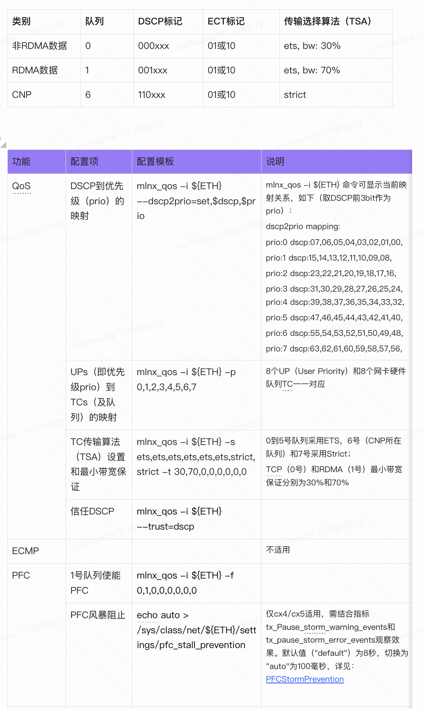

```table-of-contents
```
# 问题
# 方式
通过QOS配置，在交换机上将RDMA流量和TCP流量分到不同的队列。

# 配置




参考：[PFCStormPrevention](https://docs.nvidia.com/networking/display/mlnxofedv461000/flow+control#FlowControl-PFCStormPrevention)

# 目标
Pod内：
Cluster内：
AZ内：

- Pod内：


- Cluster内


- AZ内：


# 参考
```bash

```