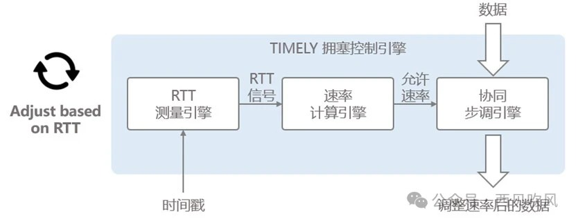
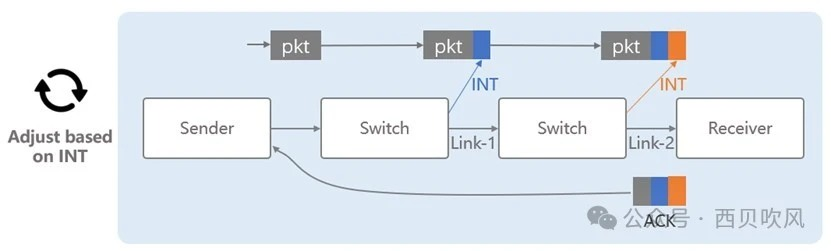
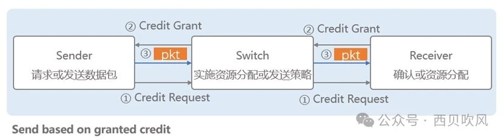
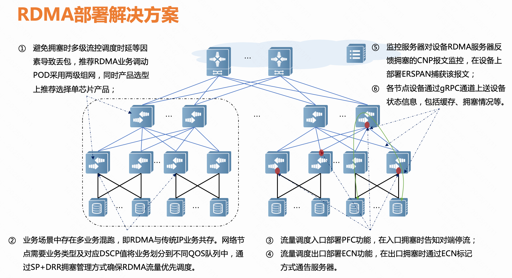
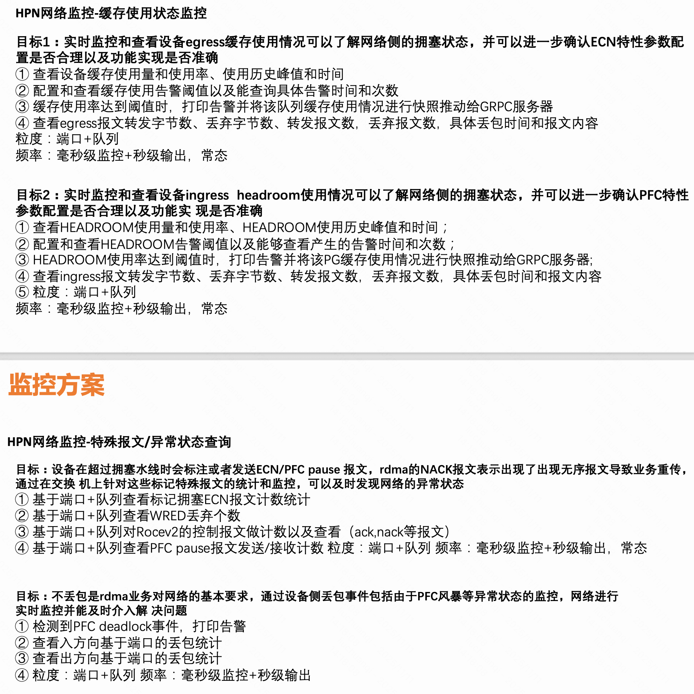

```table-of-contents
```
# 概述
在人工智能训练/推理、高性能计算（HPC）和分布式存储等关键业务场景中，服务器间的海量数据交互对网络性能提出了前所未有的挑战。即便是微秒级的延迟或极小的数据包丢失，都可能触发重传机制，导致计算任务长时间等待，整体业务性能急剧下降。

  
为应对这一挑战，**智能无损网络**应运而生——其目标是构建一条如同“数据高铁”般的专用通道，实现**零丢包、低延迟、高吞吐**的极致网络体验。
而支撑这一愿景的核心技术支柱，正是==流量控制（Flow Control）与拥塞控制（Congestion Control）==。
深入理解这两项机制的协同原理，是掌握现代数据中心网络架构的关键一步。


# 无损网络
## 什么是无损网络

## 无损网络的特点
==“0丢包”、“低时延”、“高吞吐”==
是无损网络三大核心特征。这三个指标相互影响：
● 0丢包：会抑制链路带宽，导致低吞吐，同时会增加大流的传输时延；
● 低时延：降低交换机队列排队，导致低吞吐；
● 高吞吐：保持链路高利用率，导致交换机的拥塞排队，导致小流的“高时延”。


## 为什么需要无损网络
### 业务角度
**（1）高性能计算**：
自2012年起，最新的AI模型训练所需要的计算量每3-4个月就要翻一倍。在过去5年，GPU算力增长了近90倍，而网络带宽仅增长了10倍。随着AI训练集群规模的增大，以及单节点算力的增长，AI训练逐渐从计算约束转换为网络通信约束。

为了满足日益复杂的神经网络和深度学习模型，数据中心会存在大量的分布式计算集群，但大量并行程序的通讯延迟，则会极大影响整个计算过程的效率。

**（2）存储**：
为了解决数据中心内爆炸式增长的数据存储和读取效率问题，利用以太网融合组网的分布式存储越来越受到欢迎。但因为存储网络中数据流以大象流为主，所以一旦因拥塞造成丢包，将会引发大象流重传，不仅降低效率，还会加重拥塞。

存储介质SSD(固态硬盘)的访问性能相比于分布式存储HDD(机械硬盘)已经提升了100倍，采用NVMe接口协议的SSD，访问性能可以提升10000倍。网络时延占比已经从原来小于5%提升到65%。网络时延也已经成为影响存储效率的重要因素。


**（3）需求**：
从前端用户的体验和后端应用的效率来看，眼下对于数据中心网络的要求是：延迟越低越好，效率越高越好。

**（4）问题：传统TCP/IP协议的问题**
传统TCP/IP协议在接收/发送报文时，内核需要做多次上下文切换，每次切换需要耗费5us-10us左右，需要至少三次的数据拷贝，需要耗费算力进行协议封装。

**（5）解决：RDMA**
RDMA网络相比TCP提供更高的单流通信带宽。RDMA网络的内核旁路和内存零拷贝特性，大大缩短了协议栈的通信处理时延以及数据搬移时延。RDMA允许用户态的应用程序直接读取和写入远程内存，无需CPU接入多次拷贝内存，并可绕过内核直接向网卡写数据，实现了高吞吐量、超低时延和低CPU开销。


**（6）问题：RDMA的问题带来的要求条件**
当前RDMA在以太网上的传输协议是RoCEv2，RoCEv2是基于**无连接协议的UDP协议**，相比**面向连接的TCP协议**，UDP协议更加快速、占用CPU资源更少，但其不像TCP协议那样有滑动窗口、确认应答等机制来实现可靠传输，一旦出现丢包，需要依靠上层应用检查并重传，这大大降低了RDMA传输效率。
当网络的丢包率大于千分之一时，将导致RDMA有效吞吐急剧下降；2%的丢包将使RDMA吞吐率下降为0。

要使得RDMA吞吐不受影响，丢包率必须保证在十万分之一以下，最好为无丢包。
总而言之，==RDMA的高效率依赖于无损网络，而实现不丢包的关键就是解决网络拥塞==。

### 丢包对RoCE协议影响很大


RDMA通常在数据中心的无损网络上运行，假设传输链路不会丢包。因此，它缺乏应对丢包的高效恢复机制。
在配置了PFC的无损网络中，RDMA可以避免传输重传的开销，从而达到极低的延迟和高吞吐，但这也使得RDMA在遇到丢包时表现较差。

### 小结：RDMA是刚性兑付网络（即：网络流量必须送达、不能丢、不能延迟太多）
来自金融领域的“刚性兑付”：  即**无论什么情况，都要足额兑付，不能打折、不能延迟**。

应用到数据中心网络上，就是：
(1) 无丢包：数据包不能随意丢弃（lossless）
(2) 低时延：延迟要稳定且尽可能低（low-latency, low-jitter）
(3) 高带宽：网络必须确保带宽能及时供给任务（high-throughput, guaranteed BW）
(4) 不能依靠基于丢包的拥塞控制：不允许靠丢包触发拥塞控制机制（例如 TCP Reno/CUBIC）
```bash
TCP CUBIC: 丢包情况下才会触发的拥塞控制方案，不适用RDMA刚性兑付网络的要求。

RDMA刚性兑付网络：无丢包，低时延，高带宽。
```


因此，“刚性兑付网络”就是：**网络必须保证流量“必须送达、不能丢、不能延迟太多”，否则整个集群训练会被拖慢甚至失败。**
这是相对于传统互联网“**最佳努力（best-effort）**”的传输模型而言的。

## 职责分明：流量控制 vs 拥塞控制

尽管目标一致——保障网络稳定高效运行，但流量控制与拥塞控制在网络中扮演着截然不同的角色。**它们的关系，恰如城市交通系统中的“交通警察”与“城市规划师”**。

**流量控制是点对点、局部化的精准调控机制**，关注的是发送端与接收端之间的链路状态。它的核心任务是防止接收方因处理能力不足而导致缓冲区溢出，从而**避免局部丢包**。
> 注：流量控制的核心在于接收方向发送方提供实时反馈，确保发送速率始终匹配接收能力，防止缓冲区溢出。


**拥塞控制则是端到端、全局性的动态调节机制，着眼于整个网络拓扑的负载状况**。当网络路径出现拥塞趋势时，它通过反馈机制通知源头降低发送速率，从根源上缓解网络压力。

二者各司其职、协同配合，共同构筑智能无损网络的稳定基石。


### 小结

流量控制与拥塞控制不仅是底层协议的实现细节，更是解决资源竞争与服务质量之间矛盾的系统性工程智慧。它们体现了==现代数据中心网络从“尽力而为(Best Effort)”向“确定性服务(Deterministic Service)”==的演进方向。


# 网络拥塞原因
## 分类
 网络中的拥塞整体可用分为两种。
 第一种是在端侧的拥塞（Endpoint Congestion），常见于多打一的incast场景，这种方式通常就要看各种各样的CC算法来使对应的发送端减速来解决。
 另一种就是网络侧拥塞（Fabric Congestion），即网络中因为hash不均导致的拥塞。
 
## 端侧拥塞的原因

常见于多打一的incast场景，这种方式通常就要看各种各样的CC算法来使对应的发送端减速来解决。

## 网络侧拥塞的原因
### 收敛比：上下行非对称设计

交换机的收敛比简单说就是总的输入带宽除以总的输出带宽。

```bash
以锐捷万兆交换机`RG-S6220-48XS6QXS-H`为例，下行可供服务器输入的带宽是`48*10G=480G`，上行输出的带宽是`6*40G=240G`，整机收敛比为`2:1`。
而25G交换机`RG-S6510-48VS8CQ`，下行可供服务器输入的带宽是`48*25G=1200G`，上行输出的带宽是`8*100G=800G`，整机收敛比是`1.5:1`。
```

#### 为什么会有收敛比
进行数据中心网络架构设计时，从**成本和收益**两方面来考虑，多数会采取非对称带宽设计，即上下行链路带宽不一致。

#### 收敛比带来的问题
上下行链路带宽不一致（收敛比）。
也就是说，当交换机的下联的服务器上行发包总速率超过上行链路总带宽时，就会在上行口出现拥塞。

### ECMP hash不均匀
当前数据中心网络多采用Fabric架构，并采用ECMP来构建多条等价负载均衡的链路，通过设置扰动因子并HASH选择一条链路来转发。

#### ECMP多路径流量不均衡
ECMP通过Hash来选择一条链路进行转发，该过程没有考虑所选择链路本身是否发生了拥塞。
ECMP并没有拥塞感知的机制，只是将流分散到不同的链路上转发，对于已经产生拥塞（链路饱和）的链路来说，很可能加剧链路的拥塞。


### TCP Incast(内播)
`TCP Incast`是`Many-to-One(多打一)`的通信模式，在数据中心云化的大趋势下这种通信模式常常发生，尤其是那些以`Scale-Out`方式实现的分布式存储和计算应用，包括`Hadoop`、`MapReduce`、`HDFS`等。


例如，当一个Parent Server向一组节点（服务器集群或存储集群）发起一个请求时，集群中的节点都会同时收到该请求，并且几乎同时做出响应，很多节点同时向一台机器（Parent Server）发送TCP数据流，从而产生了一个“微突发流”，使得交换机上连接Parent Server的出端口缓存不足，造成拥塞。

# 流控(flow control)和拥塞控制(congestion control)
## TCP的流控和拥塞控制
### 流控
#### 目的
- **防止发送方发送速度过快，导致接收方缓存区溢出。**

#### 作用对象
- **发送方和接收方之间的端到端连接**。

#### 实现方式
- TCP 使用 **接收窗口（Receiver Window, rwnd）** 来通知发送方自己缓冲区的可用大小。
- 发送方根据接收窗口大小限制自己的发送量，确保不淹没接收方。

#### 关键点
- 只关注**接收方的处理能力**。
- 发送方根据接收方的反馈（ACK 包中的窗口字段）调整发送速率。
- 属于**端点之间的控制**。

### 拥塞控制
#### 目的
- **防止整个网络（路由器、链路）发生拥塞，避免丢包和性能崩溃。**

#### 作用对象

- **整个网络路径上的中间节点和链路**。

#### 实现方式
- TCP 根据网络状态（丢包、RTT、ACK 延迟等）动态调整拥塞窗口（Congestion Window，cwnd）。
- 常见算法有：
    - 慢启动（Slow Start）
    - 拥塞避免（Congestion Avoidance）
    - 快重传（Fast Retransmit）
    - 快恢复（Fast Recovery）

#### 关键点
- 关注网络资源的整体利用和稳定。
- 发送方根据网络拥塞情况主动减少发送速率。
- 属于**端点对网络状态的自适应控制**。

### 流控和拥塞控制对比和联系

|**机制**|**所属环境**|**出现背景**|**核心作用**|**典型应用场景**|
|---|---|---|---|---|
|**基于信用的流控制 (CBFC)**|**InfiniBand (IB)**|**IB 架构的诞生。** 设计之初就要求网络必须是无损的，以保证极低延迟。|**链路层 (L2) 机制，从根本上杜绝丢包。** 发送前，接收方保证有缓冲区空间。|高性能计算 (HPC) 集群、科学计算、IB 存储网络。|
|**优先级流控制 (PFC)**|**RoCEv1/v2 (Data Center Ethernet)**|弥补 RoCE 对 **IB 无损传输层**的继承。标准以太网默认有损，会触发 RoCE 灾难性的 GBN 重传。|**外部强制模拟无损环境。** 当交换机队列满时，发送 PAUSE 帧停止上游流量，防止丢包。|基于 RoCE 的高性能存储网络、RoCE 部署的 AI/ML 集群。|
|**显式拥塞通知 (ECN)**|**通用 IP/Ethernet (DCB/DSCP)**|解决 TCP/IP 拥塞控制中的延迟问题（尾部延迟），以及传统 PFC 带来的队头阻塞。|**通知机制。** 交换机在拥塞开始时标记数据包，端点（HCA）接收到标记后**主动降速**。|数据中心网络 (DCN)、RDMA 拥塞控制（如 DCQCN）的基础。|
|**DCQCN** (Data Center Quantized Congestion Notification)|**RoCEv2 (数据中心)**|PFC 带来的**死锁、拥塞扩散**等问题，以及 RoCEv2 缺乏原生的端到端拥塞控制。|**端到端拥塞控制算法。** 使用 ECN 作为信号，结合量化反馈和速率控制，实现快速、稳定的拥塞缓解。|大规模 RoCEv2 部署的 **AI 训练集群**、超大规模数据中心网络。|


#### 对比

|方面|流控|拥塞控制|
|---|---|---|
|控制目标|防止接收方缓存溢出|防止网络拥塞（链路/路由器）|
|控制对象|发送方与接收方之间的连接|发送方与网络整体状态|
|控制信号|接收窗口 rwnd|拥塞窗口 cwnd，丢包信号|
|反馈机制|接收方告知可用缓冲空间大小|网络丢包/延迟、ACK反馈|
|调整发送速率|根据接收方缓冲调整|根据网络拥塞调整|


#### 联系
- 两者都是 TCP 发送方控制发送速率的机制。
- 拥塞控制基于流控之上，发送方发送的数据量受两者限制：
```bash
effective_window = min(rwnd, cwnd)
```
- 流控保证接收方不被淹没，拥塞控制保证网络不被淹没。
- 两者协同工作，确保 TCP 连接稳定且高效。

## RDMA的流控和拥塞控制


### 流控(FC)
`RDMA`协议中的流控和拥塞控制，虽然概念和TCP类似，但机制和实现细节因RDMA特性和底层协议（如`InfiniBand`、`RoCE`等）而有所不同。

#### 流控的实现方式分类
主动授权 or 被动限流？

##### 主动授权(window-based)
主动授权：server端基于接收队列空闲容量主动分配credit给client端，client端必须获得授权后才能发送消息。该方式流量控制精确，能有效防止server端过载，减少无效传输，但在网络延迟较高时可能影响吞吐量，存在授权延迟问题。

###### 范例一：RC服务类型（非SRQ）下基于message的流控
RC服务类型（非SRQ）下基于message的流控：就是基于接收方的RQ的WQE的数量，控制发送端可以发送的消息的数量。

注：TCP的拥塞控制中的发送窗口 = min(拥塞窗口，对端的接收窗口)，其实也是主动授权的方式来进行降低发送速率。

###### 范例二：IB网络中链路层的流控
IB网络中链路层的流控：基于credict的流控，就是主动授权的方式进行的流控。

##### 被动限流(rate-based)
被动限流：client端直接发送消息，server端在接收队列达到低水位阈值时发送禁止信号，队列恢复到高水位阈值时再发送许可信号。该方式在在轻负载情况下吞吐量更高，但反应滞后，可能出现短时间的队列溢出，尤其在突发流量场景下更严重。

###### 范例一：DCQCN的降速
DCQCN的降速：ROCEV2 网络中，交换机（CP：拥塞点）中缓存使用超过一定水位，会设置ECN标记，接收方（NP：通知点）会发送CNP给发送端（RP：反应点），降低发送速率。

###### 范例二：PFC
PFC带来的逐跳降速：ROCEV2 网络中，交换机缓存使用超过一定水位，会向上一跳发送Pause 帧，暂停某个队列的数据的发送。

##### 对比

**窗口基（window-based）** 的思路是“控制水龙头开启的大小”，即每次可以发送多少数据；
而**速率基（rate-based）** 则是“控制水龙头的流速”，即每秒钟可以流出多少水。

**（1）TCP（window-based） 和 RDMA（rate-based） 对比**：



**Window-based（窗口驱动）** 是 TCP 经典范式，控制的是"在途字节数上限（CWND）"。每次丢包才触发减速，粒度是一整个 RTT，在高带宽长距离链路（大 BDP）上收敛极慢，吞吐量呈锯齿形。TCP CUBIC 拥塞控制 是代表。

**Rate-based（速率驱动）** 直接控制"每秒发多少"，通过 pacing 均匀注入数据，可在亚-RTT 级别响应拥塞信号（RTT 增大、带宽估算下降或 ECN），吞吐量曲线平滑。BBR 是 TCP 里最典型的实现。

---

**（2）纯 RDMA 视角：window-based 和 rate-based 对比**：


> 注：IB 原生有两层独立机制：底层是 Credit-based 逐跳窗口流控（永不丢包），上层是 IBCC 的 Rate-based 注入速率调节（FECN/BECN）。RoCEv2 则将这两层替换为 PFC（替代 Credit）+ DCQCN（替代 IBCC）。两者的 RC QP 传输层几乎相同——都是消息级窗口。

|机制|所属层次|控制方式|核心信号|优点|缺点/局限性|
|---|---|---|---|---|---|
|**IB Credit FC**|链路层|信用基|接收端信用|全时主动，平滑，无损|拥塞扩散严重，受害者流|
|**PFC**|链路层|暂停帧|队列长度超阈值|简单，广泛部署|HoL 阻塞，拥塞扩散，死锁|
|**IB CC**|链路层 + 端到端|速率基|交换机标记|缓解拥塞扩散|参数复杂，收敛慢|
|**DCQCN**|端到端|速率基|ECN + CNP|快速响应，广泛验证|参数多达 10+，调优困难|
|**TIMELY**|端到端|速率基|RTT 测量|无需交换机支持|吞吐可能降低，收敛公平性问题|
|**HPCC**|端到端|速率基|INT 精确负载|单步收敛，极高精度|需要 INT 硬件支持|
|**RC 流控**|传输层|基于消息/信用|ACK/NAK|端到端可靠，按序交付|Go-Back-N 重传效率低|
|**veRoCE（字节）**|传输层 + 端到端|多路径速率基|路径状态|**多路径**解耦，**有损网络兼容**|新协议，生态待成熟|


“窗口基”拥塞控制在 RDMA 体系中**并不作为主流拥塞控制策略存在**——RDMA 的端到端拥塞控制几乎全面采用**速率基（Rate-based）** 方案，因为 RDMA 追求的是纳秒级延迟和硬件级控制精度，窗口基的 ACK-Clocking 机制在这里会产生不可接受的反馈延迟。


##### 小结
RoceV1/RoceV2中的PFC以及DCQCN：就是被动限流(rate-based)的方式进行流控。
IB中链路层的流控：就是主动授权的方式进行的流控。
RC类型中基于Message的流控：就是主动授权的方式进行的流控。

UCX、X-RDMA均采用类似主动授权的方式，限制client的发送速率。


如上图所示，window-based 呈现为锯齿状，这里的HPCC最为平滑。


#### IB链路层基于信用的流控（Credit-Based Flow Control, CBFC）
##### 背景
InfiniBand 从设计伊始就要求提供极低延迟、高带宽的网络，服务于对通信质量要求最高的 HPC 场景。**任何丢包都会导致重传，从而破坏低延迟目标。**

##### 解决办法
基于信用的流控制 (CBFC) 工作在链路层（逐跳）。接收方在缓冲区有空间时发送信用（Credit）给发送方。发送方只有收到足够的信用才发送数据。

##### 对比

**IB链路层和RoceV2的链路层(Ethernet)都属于链路层，但是链路层协议不同。只有 InfiniBand 拥有原生的、基于链路层信用的流控制。这是 IB 能够天然无损的核心原因。RoCEv2 作为上层协议，无法干预底层的 Ethernet 链路层，因此没有自己的信用流控制。

|**环境**|**协议/机制**|**实现层次**|**核心功能**|
|---|---|---|---|
|**InfiniBand (IB)**|**CBFC（Credit-Based Flow Control）**|**链路层**（逐跳/Hop-by-Hop）|确保两个直接相连的端口（如 HCA 到交换机，或交换机到交换机）之间在发送数据前，接收方有**足够的缓冲区**空间。这从根本上保证了 IB 网络的**无损**特性。|
|**RoCEv2**|**无原生的 CBFC**|N/A|RoCEv2 运行在标准 Ethernet/IP 协议栈之上，**没有 InfiniBand 那样的链路层 CBFC 机制**。因此，它必须依赖其他机制（如 PFC）来模拟无损环境。|


#### PFC

##### 背景
业界希望在成本更低、更通用的以太网 (Ethernet) 上运行 RDMA，即 RoCE。但 RoCE 继承了 IB 的传输层（注：是IB的传输层，如 RC QP），使用了低效的 **Go-back-N (GBN)** 丢包恢复。
IB使用低效的GBN，是为了硬件的实现简单，同时 由于IB存在链路层逐条的 基于信用的流控，基本不存在丢包，因此GBN没有问题。
但是 以太网默认有损。如果发生丢包，使用低效的GBN 重传会导致性能灾难。


##### 解决方法
**优先级流控制 (PFC)** 被引入到Roce，用于**强制模拟 IB 的无损环境**。当交换机缓冲区快满时，PFC 通过发送 PAUSE 帧，使上游设备停止发送特定优先级 (Priority) 的数据，从而避免缓冲区溢出和丢包。

##### 特点
（1）PFC (Priority Flow Control, 优先级流控制)  是以太网的扩展，工作在 数据链路层 (Data Link Layer, L2)。
（2）Pause帧是**逐跳 (Hop-by-Hop)** 的，只在直接相连的两个网络设备（如 HCA 和交换机，或交换机和交换机）之间发生作用。


##### Pause帧
 


##### 网卡开启关闭pause帧
大多数的网卡，都有流控的开关命令。Linux系统中，可通过ethtool工具控制。
```bash
ethtool -A ethx autoneg off　　//自协商关闭
ethtool -A ethx tx off　　　　//发送模块关闭
ethtool -A ethx rx off　　　　//接收模块关闭
```

##### PFC带来的问题
PFC 引入了严重的副作用：队头阻塞 (Head-of-the-Line Blocking, HOL)、拥塞扩散、死锁

##### Roce的PFC和IB的CBFC对比

|**特征**|**RoCE 的 PFC (Priority Flow Control)**|**IB 的 CBFC (Credit-Based Flow Control)**|
|---|---|---|
|**工作层次**|**数据链路层 (L2)**|**数据链路层 (L2)**|
|**流控粒度**|**优先级 (Priority)**：基于 802.1p 优先级标签。|**虚拟通道 (Virtual Lane, VL)**：基于 VL 和缓冲区槽位。|
|**基本机制**|**后向压力 (Backpressure)**：通过发送 **PAUSE 帧**，要求上游**停止**发送数据。|**前向许可 (Forward Permission)**：通过发送 **Credit 帧**，允许上游**发送**数据。|
|**工作模式**|**被动/事后**：在缓冲区快满时才启动暂停。|**主动/事前**：在发送数据前必须获得许可（Credit）。|
|**对丢包保证**|**模拟无损**：在理想情况下可防止丢包，但容易失败（如 PAUSE 帧丢失）。|**原生无损**：从机制上杜绝了因缓冲区溢出导致的丢包。|
|**副作用**|容易导致 **队头阻塞 (HOL)**、**拥塞扩散**，甚至 **死锁**。|通常不会引起这些问题，设计更稳定。|


###### 相同点 (Similarities)
1. **工作层次相同：** 两者都是工作在 **数据链路层 (L2)** 的**逐跳 (Hop-by-Hop)** 流量控制机制。
2. **目标相似：** 核心目标都是为了实现链路上的**无丢包传输**，从而保证上层 RDMA 协议的效率和低延迟。
3. **都是基于硬件：** 两者都依赖于网卡和交换机硬件来快速处理和响应这些控制帧或信号。


###### 不同点 (Differences)

1. **机制与哲学 (最关键区别)：**
    - **CBFC** 是基于**资源许可**的“拉式”系统 (Pull)，是**拥塞避免**哲学，天然无损。
    - **PFC** 是基于**压力反馈**的“推式”系统 (Push)，是**拥塞控制/抑制**哲学，是模拟无损。
        
2. **触发时机：**
    - CBFC 检查信用是**持续且主动**的，发送方在任何时候发送数据都需要信用。
    - PFC 只有在**拥塞发生临界点**时（缓冲区水位达到阈值）才被动触发。
        
3. **细粒度：**
    - CBFC 的粒度可以细到单个 VL 或缓冲区槽位。
    - PFC 的粒度粗糙得多，基于 8 个 802.1p 优先级，容易产生 HOL 阻塞。


#### IB传输层(IB以及Roce都有)基于信用的流控
参考：RDMA入门之三：3-IB规范和RDMA报文讲解 中的 可靠服务。


### 拥塞控制(CC)
#### 目的
防止网络中的交换机、链路发生拥塞，保持网络整体性能稳定。

#### 作用范围
网络路径中的多个节点和链路，不仅仅是端点。
但是流控，只是针对的是端点。

#### 分类
RDMA网络中的拥塞控制方案可以分为两大类：被动拥塞控制和主动拥塞控制。
这里的所谓主动和被动的区分依据，主要是：
**主动拥塞控制**：以“请求和分配”方式运行；
**被动拥塞控制**：则使用“尝试和退避/try and backoff”的方式运行。

> 注：不同厂家的叫法不同，有些被动拥塞控制的改进算法，也被称为主动拥塞控制，这个我们不做深入的讨论，比如HW的NPCC（Network-based Proactive Congestion Control），NPCC支持在网络设备上智能识别拥塞状态，然后由网络设备主动向发送端服务器发送CNP报文，使发送端服务器及时降低发送报文的速率，解决了拥塞反馈路径过长的问题，而且可以准确控制发送的CNP报文个数。但按上面的分类，其本质还是被动拥塞控制，只不过对某些环节进行优化而已。


##### 被动拥塞控制
被动拥塞控制又分为迭代探测和直接测量两种，迭代探测中有基于主机侧的端到端的控制方案，也有基于交换机辅助的控制方案。

###### 迭代探测的拥塞控制方案
迭代探测中，比较常见有基于丢包检测的CUBIC（丢包情况下才会触发的拥塞控制方案，不适用RDMA刚性兑付网络的要求，不在本文的讨论范围内）。
基于ECN的DCQCN、基于时延检测的Timely、Swift等，但一个共同的特点是发送端根据网络的拥塞反馈信号，对发送速率进行调节。

**优缺点**：
这类技术由于实现简单、易于部署被广泛使用；
但通常被认为存在拥塞反应滞后、控制回环时间长、容易引起吞吐率震荡、速率收敛慢、误伤老鼠流等问题，因此有很大的优化空间。

###### 直接测量的拥塞控制方案

直接测量算法的关键是利用交换机来精确测量当前的网络状态并显式反馈信息, 以便发送端快速做出拥塞反应, 并能准确地根据测量信息进行速率分配、控制网络拥塞。

如基于`INT遥测`的HPCC，HPCC在数据面上找到了突破，通过智能网卡与交换机的配合，端到端实时抓取拥塞信息，从而精确获取实时的链路负载，并且根据精确的链路负载来计算合适的发送速率。

##### 主动拥塞控制
与上述网络拥塞发生后再进行拥塞控制的被动拥塞控制方案不同，主动拥塞控制方案旨在防止拥塞发生，只有网络管道具有足够的容量时才发送数据。

主动拥塞控制以“请求和分配”方式运行，通过调度器主动对网络带宽进行统一的预约和分配, 以使总发送速率尽可能匹配瓶颈链路带宽，这样既可以充分利用带宽，又能防止丢包。

根据调度器的是集中部署还是分布式部署，又可以分为集中式调度器的主动主动拥塞控制和分布式调度器的主动拥塞控制。

###### 集中式调度器

集中式调度器的方案，主要依靠集中式调度器对网络资源预约和分配，终端依据调度器的分配进行数据包发送，该方案的关键是调度器如何对数据包进行全局调度，如FastPass；

###### 分布式调度器
分布式部署方案，又可以进一步细分为端到端的方案和逐跳的方案，在分布式端到端的拥塞控制方案中，发送端直接发送请求到接收端，由接收端预约和分配网络资源，而不需要交换机的参与；

而逐跳的拥塞控制方案中，需要交换机对网络中间链路辅以检测和管理，发送端、接收端共同完成资源的分配和调度，方案的关键是如何利用交换机提供的信息来进行或辅助数据包的调度发送，分布式部署方案比较典型的如ExpressPass。

#### 为什么TCP/IP中的CUBIC拥塞控制不适用RDMA?
TCP CUBIC 的控制逻辑是：
```bash
- 看到丢包 → 认为拥塞 → 减小窗口
- 重传丢失数据
- 再慢慢爬升

这种机制在互联网中很好用，因为网络本来就会丢包。但在大规模 AI 训练中完全不行。
```


#### 基于ECN（Explicit Congestion Notification）
- 网络交换机在拥塞时标记数据包（设置ECN位）。
- 端点检测到ECN后，降低发送速率。

##### 背景
传统的 TCP/IP（比如：TCP）依靠丢包来判断拥塞（隐式通知），这导致网络吞吐量波动大且延迟高。需要一种不依赖丢包的信号机制。

随着数据中心规模扩大，PFC 的副作用（HOL 阻塞、死锁）变得不可容忍。业界需要一个**端到端**、**不依赖暂停帧**的拥塞控制方案。

##### 解决办法
交换机在拥塞**开始积累**时，就对数据包打上 ECN 标记，**而不是等到缓冲区满才暂停**。

##### 特点
ECN工作在IP 层 。
交换机在数据包的 IP 头中设置一个特定位（ECN 标记），作为**拥塞信号**。
可以将ECN理解为一个**拥塞的开关**，不负责具体的拥塞控制算法。

##### 作用

明确通知网络端点拥塞已经开始积累。它本身不是控制机制，而是控制算法（如 DCQCN）的**拥塞信号基础**。
允许端点在丢包发生前主动降速。
广泛应用于 数据中心拥塞控制 (DC-CC)，特别是作为 **DCQCN 算法的输入信号**。需要交换机和网卡同时支持 ECN 标记和响应。

即：ECN 机制是 DCQCN 能够高效工作的前提和基础。

#### QCN（Quantized Congestion Notification）
QCN（Quantized Congestion Notification，量化拥塞通知）是一套应用于L2的端到端拥塞通知机制，通过主动反向通知，降低网络中的丢包率和延时，从而提高网络性能。目前在RoCEv2网络中大热的DCQCN拥塞控制算法就是QCN和DCTCP相互结合形成的，DCQCN算法使得RDMA在以太网中大规模部署成为现实。

- InfiniBand和部分RoCE设备支持。
- 交换机对拥塞状态做出量化反馈，端点根据反馈调整发送速率。
- 由交换机生成拥塞通知消息(CNM)发送给发送端。

        
#### 基于ECN的DCQCN（Datacenter QCN）
- RoCE v2中针对数据中心设计的拥塞控制协议。
- 结合ECN和QCN思想，通过端到端反馈调整速率。

##### 背景
彻底解决 PFC 的副作用（HOL 阻塞、拥塞扩散）。需要一个**快速、稳定、端到端**的拥塞控制算法。

#####  特点
DCQCN 是一个在 RDMA 环境下实现的**端到端拥塞控制算法**，基于 **ECN 信号**，运行在 HCA 固件或驱动中。采用**量化反馈**和 **速率调整**机制。
当 HCA 接收到带有 ECN 标记的数据包后，生成 CNP 反馈给发送方，发送方迅速降低发送速率。

1. **量化反馈：** 接收方将 ECN 信号转换成量化的拥塞通知包 (CNP)。
2. **速率调整：** 发送方收到 CNP 后，立即以指数级快速降速，然后通过线性增加（AIMD： 双曲线减速，来快速反应拥塞；线性增速，来缓慢探测带宽），确保快速收敛到公平带宽。）来探测带宽，实现**快速收敛和稳定低延迟**。

DCQCN 结合 ECN，代表了 RoCE 拥塞控制的新方向。
其核心思想是：**与其在链路层逐跳的暂停流量（PFC），不如让端点快速主动降速（ECN/DCQCN）。** 许多现代大规模 AI 集群已经使用 DCQCN 取代或与 PFC 结合使用，以获得更好的性能和稳定性。

#### 基于时延或RTT的拥塞控制：Google的Timely 以及 Swift
基于主机侧端到端的被动拥塞控制方案中，最具代表性的是拥塞控制算法Timely。

2015年，谷歌提出了一种基于时延的拥塞控制方案Timely。**Timely使用数据流的往返传递时间RTT作为量化链路拥塞的信息**，并设计了一套相应的梯度调速算法。相较于传统的软件测量的RTT，谷歌方案在他们的**智能网卡中集成了专有的RTT硬件测量电路**，这使得RTT测量拥塞的方案得以实用化。

在网络中，**端到端传输延迟主要是由网络节点中的排队延迟引起的**。也就是说，数据包的往返时间RTT可以体现其通过的所有队列的排队延迟，反映网络中的拥塞状态。

RTT是有效的拥塞信号，**相比于拥塞信号ECN，RTT不需要任何交换机进行反馈，因此也不需要对交换机进行任何修改**，当网络规模较大时，也减少了对交换机进行配置、维护和调优的开销。而且不同于ECN作为单点反馈信号，RTT可以反映整条路径上的拥塞情况。

Timely在发送方的网卡上即可实现，主要由三个部分构成：RTT测量引擎，速率计算引擎和速率控制引擎。
当收到ACK时，智能网卡会启动RTT测量引擎以精确测量RTT值。当RTT测量引擎测得RTT后，会把RTT的值传递给速率计算引擎。速率计算引擎是拥塞控制算法的核心部分，根据RTT的梯度值计算流的发送速率。速率控制引擎再根据速率计算引擎算得的发送速率调整每条流的发送速度。




##### 优点

- 端到端拥塞控制，无需交换机的配合；
- 基于发送速率控制而非基于窗口更适合低延时DC网络，提高带宽利用率。

##### 缺点

- 对时钟同步的依赖：Timely对时钟同步要求较高，需要确保网络中的时钟同步性能良好，否则可能影响算法的准确性，成本高；
- 复杂性：Timely的设计相对较为复杂，需要综合考虑多个资源的调整，这可能使得实现和管理相对繁琐；
- 对RTT的变化敏感，需要合理的建模避免过反应。


#### 基于INT的拥塞控制：阿里的 HPCC 拥塞控制

2019 年，阿里云提出了一种基于带内遥测INT的拥塞控制协议HPCC。相比于DCQCN 和Timely，HPCC方法牺牲了一定的带宽引入了INT能力，同时也获得了超高精度的拥塞控制性能。HPCC可以实现快速的算法收敛以更优的利用闲置带宽，同时保持交换机始终处于近零队列，从而实现超低的数据传输延迟。

##### 背景

传统的拥塞控制算法主要依赖于丢包，RTT时延，以及ECN拥塞标识，发送端根据ECN等拥塞标记试探性调整发送速率，这可能导致网络收敛速度慢。

（1）当拥塞发生，报文被标记，发送源收到CNP时，交换机队列已缓存了一定数量的数据报文，此时再调整发送速率已经来不及了。

（2）调优参数多，无法适配多场景：由于缺乏精准的拥塞信息，发送端试探性调整速率往往需要配合很多参数调优来保证性能，这也增加了在不同场景下的同一套流控机制调优的难度。

##### 介绍

HPCC在数据面上找到了突破，通过智能网卡与交换机的配合，端到端实时抓取拥塞信息，从而精确获取实时的链路负载，并且根据精确的链路负载来计算合适的发送速率。与DCQCN依赖定时器驱动不同，HPCC速率调整根据数据包的ACK来驱动。

HPCC借助更细粒度链路负载信息并重新设计了拥塞控制算法，能够在大规模网络下快速收敛、降低对大Buffer的依赖、保证数据流的公平性。



##### 优缺点

**优势：**
- 拥塞控制准确度高，解决了在拥塞期间处理延迟的INT信息和对INT信息的过度反应等挑战；
- 快速收敛、带宽利用率高，可以维持超浅队列以获得超低延迟。

**劣势：**
- 网卡和交换机都需要支持INT，交换机需要提供 INT 信息，网卡需要支持处理 INT 的能力，部署成本高；
- 对增量部署不够友好。


#### 基于信用Credit的拥塞控制

2014年，J. Perry等人提出了基于集中式调度器的主动拥塞控制方案FastPass，它改变了以往通过收发端和交换机分布式解决时延问题的方式，采用集中控制的方式，从而真正实现全局最优。它在网络中设置一个集中的调度器，所有发送端都需要与调度器交互信息，从而确定传送速率和路径，以此达到没有排队延迟，高带宽利用以及网络中流之间的资源共享，这种集中控制的方式类似于通过中心的导航系统为汽车导航，能够选择最优的通行方式到达目的地。FastPass不仅要对所有网络的需求有全面的了解，还需要对每个数据包进行调度，算法开销大，不利于部署在规模大的网络中；另外，全局调度器会有单点故障的问题。

2017年I.Cho等人提出ExpressPass，它是一个端到端的基于Credit的拥塞控制协议。在发送数据包之前，ExpressPass来预先探测拥塞，从而使数据传输能够保证有界延迟和快速收敛，并且可以应对Burst的到来，与传统TCP不同的是，当需要发送时，首先需要向接收端请求Credit，当接收端回传一个Credit，发送端才会发送一个包。有点类似于先买票再上车，人票对应。ExpressPass利用交换机来限制Credit的速率从而限制发送端速率。它的核心思想是将网络传输过程中正向拥塞通过交换机漏桶算法转换成反向Credit的拥塞，同时通过对短小的Credit进行拥塞控制，进而使正向网络不丢包，从而提升网络传输性能。它的本质是通过预先探测网络中的剩余带宽，进而可以准确确定发送速度。



##### 优缺点

**优势：**

- 保证数据传输的有界延迟和快速收敛，有效避免Burst；
    
- 提升浅Buffer可用性，降低丢包可能，减少重传，从而达到高性能。
    

**劣势：**

- 每次发送都需要等待Credit发送接收的RTT，对短流和长距网络不友好，对于短流来说，本来直接发送即可，在ExpressPass中却需要等Credit，并且有更大比例的Credit被浪费，如何更精确地控制Credit和分配是挑战。

#### PFC和ECN以及DCQCN对比

|**特征**|**PFC**|**ECN**|**DCQCN**|
|---|---|---|---|
|**类型**|流控机制 (Flow Control)|信号机制 (Signaling)|拥塞控制算法 (CC Algorithm)|
|**工作层**|链路层 (L2)|网络层 (L3)|传输层 (HCA)|
|**作用范围**|逐跳 (Hop-by-Hop)|逐跳标记，端到端生效|端到端 (End-to-End)|
|**核心机制**|发送 **PAUSE 帧**|**标记 IP 头** 上的 ECN 位|发送 **CNP 帧** 调整速率|
|**触发时机**|**缓冲区满**（即将丢包）|**缓冲区开始积累**（队列达到阈值）|接收 CNP 信号|
|**性能目标**|**零丢包**（模拟无损）|**低延迟信号**（避免丢包）|**高吞吐、低尾部延迟、公平性**|
|**主要问题**|HOL 阻塞、拥塞扩散|自身无控制能力，依赖上层算法|需要所有 HCA 和交换机支持|

这三种机制构成了一个演进的序列：
```bash
PFC (被动抑制丢包)→ECN (主动信号机制)→DCQCN (快速端到端控制)
```
- **PFC** 是初代 RoCE 的妥协方案，解决了丢包问题，但引入了严重的网络拓扑问题。
- **ECN** 为解决 PFC 的副作用提供了新的信号基础，允许在不暂停链路的情况下通知拥塞。
- **DCQCN** 利用 ECN 信号，提供了一个成熟、高性能、无 HOL 阻塞的**端到端**拥塞控制解决方案，成为大规模 RoCE 部署的黄金标准。


####  小结
业内的常见拥塞控制算法汇总如下：

- 基于ECN的CC：微软DCQCN、华为LDCP/NPCC等；
    
- 基于INT的CC：阿里HPCC/HPCC++、谷歌CSIG等；
    
- 基于RTT的CC：谷歌Timely/Swift/BBR、Copa、Nimbus、亚马逊SRD等；
    
- 基于Credit的CC：英伟达IB网络、FastPass、pHost、ExpressPass等。


另外，超级以太网联盟UEC也非常重视拥塞控制的方案实现，几个重点实现目标中就包括定义了一个可选的基于接收端的拥塞控制，它给发送端分配信用Credit，从而增强了基于发送端的拥塞控制，另外，也定了端到端遥测，端网协同的拥塞控制方案，可选支持对交换机的高级遥测进行增强，可缩短控制平面的信令时间，从而能够快速感知短时拥塞事件并做出反应，这种快速反应时间对于较高的链路速度尤其重要。

### 流控和拥塞控制的对比和联系


#### 对比

| 方面         | 流控(FC)                               | 拥塞控制（CC)                             |
|--------------|----------------------------------|------------------------------------|
| 控制目标     | 防止接收方缓冲区溢出               | 防止网络链路/交换机拥塞              |
| 控制粒度     | 点对点 QP 层                      | 端到端整个网络路径的交换机和链路                      |
| 反馈信号     | credit 信用更新                   | ECN 标记、QCN拥塞通知消息           |
| 响应机制     | 发送方根据credit限制发送数据       | 发送方根据拥塞反馈降低发送速率       |
| 关键协议     | InfiniBand信用机制、SRQ            | QCN、DCQCN、ECN               |
| 是否硬件支持 | 依赖于RDMA协议和NIC               | 依赖网络交换机和NIC支持             |
| 控制粒度     | 端点之间                         | 网络整体                         |


## RDMA 流量与拥塞控制详解

### 1. 优先级流控制 (PFC, Priority Flow Control)

|特征|详解|
|---|---|
|**出现背景**|RoCEv2 继承了 InfiniBand 的传输层协议，该协议对丢包**极度敏感**（使用低效的 Go-back-N 重传）。标准以太网默认有损，导致 RoCE 在丢包时性能崩溃。|
|**特点**|**链路层 L2 机制，逐跳 (Hop-by-Hop) 工作。** 基于 IEEE 802.1Qbb 标准。使用特殊的 **PAUSE 帧**来阻止上游流量。|
|**作用**|**强制模拟无损环境。** 在交换机缓冲区快满时，通过发送 PAUSE 帧，使上游设备停止发送特定优先级 (Priority) 的数据，从而**避免缓冲区溢出和丢包**。|
|**使用场景**|早期和当前的 **RoCE 部署**，特别是在需要高可靠性和零丢包的存储网络（如 iSCSI Extension for RDMA, iSER）中。|
|**缺点**|最大的缺点是副作用：**队头阻塞 (HOL)**、**拥塞扩散 (Congestion Spreading)** 和潜在的**死锁**。|

### 2. 显式拥塞通知 (ECN, Explicit Congestion Notification)

|特征|详解|
|---|---|
|**出现背景**|传统的 TCP/IP 依靠**丢包**来判断拥塞（隐式通知），这导致网络吞吐量波动大且延迟高。需要一种**不依赖丢包**的信号机制。|
|**特点**|**IP 层 L3 机制。** 交换机在数据包的 IP 头中设置一个特定位（ECN 标记），作为**拥塞信号**。它是一个**开关量信号**。|
|**作用**|**明确通知**网络端点拥塞已经开始积累。**它本身不是控制机制，而是控制算法（如 DCQCN）的信号基础。** 允许端点在丢包发生前主动降速。|
|**使用场景**|广泛应用于 **数据中心拥塞控制 (DCC)**，特别是作为 **DCQCN 算法的输入信号**。需要交换机和网卡同时支持 ECN 标记和响应。|
|**地位**|ECN 机制是 DCQCN 能够高效工作的**前提和基础**。|

### 3. 数据中心量化拥塞通知 (DCQCN, Data Center Quantized Congestion Notification)

|特征|详解|
|---|---|
|**出现背景**|彻底解决 PFC 的副作用（HOL 阻塞、拥塞扩散）和传统 RoCE 的低效重传。需要一个**快速、稳定、端到端**的拥塞控制算法。|
|**特点**|**端到端 (End-to-End) 拥塞控制算法。** 基于 **ECN 信号**，运行在 HCA 固件或驱动中。采用**量化反馈**和 **速率调整**机制。|
|**作用**|实现 **快速拥塞控制** 和 **高利用率**。当 HCA 接收到带有 ECN 标记的数据包后，生成 **CNP (Congestion Notification Packet)** 反馈给发送方，发送方迅速降低发送速率。|
|**使用场景**|大规模、高带宽的 **AI/ML 训练集群**、超大规模数据中心网络。这是现代 RoCEv2 部署中推荐的**首选拥塞控制方案**。|
|**控制逻辑**|**双曲线减速**（快速反应拥塞）和**线性增速**（缓慢探测带宽），确保快速收敛到公平带宽。|

---

## 对比总结

|特征|PFC|ECN|DCQCN|
|---|---|---|---|
|**类型**|流控机制 (Flow Control)|信号机制 (Signaling)|拥塞控制算法 (CC Algorithm)|
|**工作层**|链路层 (L2)|网络层 (L3)|传输层 (HCA)|
|**作用范围**|逐跳 (Hop-by-Hop)|逐跳标记，端到端生效|端到端 (End-to-End)|
|**核心机制**|发送 **PAUSE 帧**|**标记 IP 头** 上的 ECN 位|发送 **CNP 帧** 调整速率|
|**触发时机**|**缓冲区满**（即将丢包）|**缓冲区开始积累**（队列达到阈值）|接收 CNP 信号|
|**性能目标**|**零丢包**（模拟无损）|**低延迟信号**（避免丢包）|**高吞吐、低尾部延迟、公平性**|
|**主要问题**|HOL 阻塞、拥塞扩散|自身无控制能力，依赖上层算法|需要所有 HCA 和交换机支持|

### 演进关系

这三种机制构成了一个演进的序列：

PFC (被动抑制丢包)→ECN (主动信号机制)→DCQCN (快速端到端控制)


# 拥塞控制和可靠性
## TCP的拥塞控制和可靠性

## RDMA（Roce）的拥塞控制和可靠性
### RoCEv2 使用 RC时是否需要考虑可靠性与拥塞控制？
#### 可靠性
RC（Reliable Connection）本身是 **面向连接、可靠传输** 的服务，具有以下硬件特性：
- 自动重传（重发丢包）
- 顺序交付
- ACK/NACK 机制（在 RNIC 内部实现）

所以：在 丢包恢复和传输可靠性层面，硬件已经提供保障，不需要用户手动处理。

#### 拥塞控制
RoCEv2 是基于 IP 网络的，**不像 `Infiniband` 有端到端基于信用的流控机制（credit-based flow control）**，因此：

- 即使使用 RC 服务，**在以太网上也可能发生网络拥塞**。
- RC 层虽然可以自动重传，但如果发生拥塞导致队列堆积甚至丢包，会显著影响延迟和吞吐量。    
- **重传不是拥塞控制的替代方案！**
所以：使用 RC 时仍然需要考虑拥塞控制机制，尤其在大规模部署场景（例如超大 IDC）中。

### IB和Rocev2协议，都是使用RC服务，那么是否需要考虑拥塞控制？
#### IB的拥塞控制机制

 **（1）IB 协议内置基于信用的流控（Credit-based Flow Control）**：
- 发送端必须获得接收端的“credits”才可以发送数据包，确保接收端有缓冲空间。
- 这种信用机制天然避免了发送端过快发送导致接收端拥塞。

 **（2）IB 硬件交换机通常支持端到端拥塞管理**，比如 PFC（Priority Flow Control）和硬件级别的拥塞通知。

因此 IB 的 RC 传输模式在协议和硬件层面本身就带有拥塞控制机制，应用层一般不用关心拥塞控制。

#### RoCEv2 的情况

RoCEv2 是基于 IP/UDP 运行在以太网上的 RDMA 协议，**不具备 IB 那种信用机制**。UDP本身是无连接、无拥塞控制的网络。
RoCEv2 的 RC 只是保证可靠传输（自动重传、ACK/NACK），但**没有流控机制**，导致：

- 网络拥塞时，丢包会引发大量重传和性能崩溃（称为“TCP 退化”现象）。
- **必须依靠额外的拥塞控制机制**（如 DCQCN、TIMELY）来避免拥塞。

#### 对比

|方面|Infiniband (IB) RC|RoCEv2 RC|
|---|---|---|
|可靠性|硬件自动重传，信用机制保障|硬件自动重传，无信用机制|
|拥塞控制机制|内置信用机制，交换机支持端到端流控|无信用机制，需要 DCQCN、TIMELY 等拥塞控制|
|应用层拥塞控制需求|一般不需要，硬件已解决|必须考虑拥塞控制，否则性能崩溃|
|适用网络|专用 IB 网络|以太网，数据中心网络|


# RDMA拥塞控制(CC)概述
RDMA拥塞控制，用于管理和控制在RDMA网络中可能出现的网络拥塞情况，以确保数据传输的可靠性和性能。

**流量控制**：RDMA网络中的流量控制是一种基本的拥塞控制机制，用于确保发送方不会以太快的速度发送数据，从而超负荷了网络。RDMA可以使用不同的流控制机制，如基于信令或基于令牌的机制，来确保数据发送速率适应网络容量。

**拥塞检测**：RDMA网络中的拥塞检测是指检测网络中是否存在拥塞的迹象。这可以通过监视网络的性能指标（如延迟、丢包率、带宽利用率）来实现。如果检测到拥塞，就需要采取相应的措施来减轻拥塞，例如降低发送速率或重新路由数据。

**拥塞控制算法**：RDMA拥塞控制算法是用于管理和减轻拥塞的具体策略。一些常见的拥塞控制算法包括基于反馈的算法，如ECN（显式拥塞通知），以及基于源的算法，如基于窗口的拥塞控制。这些算法根据网络状态来自动调整发送速率以防止拥塞。

**负载均衡**：在RDMA网络中，负载均衡是一种重要的策略，用于将数据流量均匀分配到不同的网络路径或节点，以避免某一路径或节点成为瓶颈。负载均衡可以减少拥塞的可能性，从而提高整体性能。

**QoS（Quality of Service）设置**：为了确保关键应用程序的性能，RDMA网络通常支持QoS设置，这意味着可以为不同类型的数据流量分配不同的服务质量级别。这有助于确保关键任务的数据传输不会受到非关键任务的拥塞影响。

## 拥塞控制总体介绍


## RDMA 拥塞控制方法及其所在层次


### 硬件层（RNIC + 交换机）

#### IB

- 信用机制（credit-based flow control）是 IB 硬件和协议规范规定的，RNIC 和交换机实现硬件级别的流控。
- ECN 和 CNP 机制通过交换机检测拥塞并通知 RNIC。
- PFC 在链路层防止丢包。

#### RoCEv2
- DCQCN 依赖交换机 ECN 标记，RNIC 收到 CNP 后调整发送速率。
- PFC 作为以太网的链路层机制防止丢包。
- 交换机必须支持 ECN 和 PFC，RNIC 驱动需支持 DCQCN。

### libibverbs 层
- `libibverbs` 提供 RDMA 操作的 API，**不直接实现拥塞控制**。
- 拥塞控制逻辑一般不在 libibverbs 层，libibverbs 负责底层调用。

### 用户空间 / 应用层

#### TIMELY 拥塞控制
- 端到端 RTT 测量和速率调节，纯软件实现。
- 适合无 ECN 或 DCQCN 不支持的场景。

#### 应用层限速
- 基于请求控制、token bucket、流量检测等。
- 作为拥塞控制的补充或替代。


### 小结

RDMA 网络拥塞控制体系是**多层次协同工作**的：
```bash
┌─────────────────────────────────────────────────────────────────┐
│                      应用层（RDMA Verbs API）                      │
├─────────────────────────────────────────────────────────────────┤
│  传输层：RC 基于消息的流控（QP 信用 + ACK/NAK，Go-Back-N 重传）      │
├─────────────────────────────────────────────────────────────────┤
│  端到端拥塞控制：DCQCN / HPCC / TIMELY（速率基，ECN/INT/RTT 反馈）  │
├─────────────────────────────────────────────────────────────────┤
│  链路层流控：PFC（RoCE）或 Credit-based FC（IB）                    │
│             （最后一道防线，防止丢包）                             │
└─────────────────────────────────────────────────────────────────┘
```


|层级|IB拥塞控制机制|RoCEv2拥塞控制机制|
|---|---|---|
|硬件（RNIC + 交换机）|信用机制 + ECN/CNP + PFC|DCQCN + ECN + PFC|
|libibverbs|不涉及|不涉及|
|用户空间|额外限速/流控（特殊场景）|TIMELY 或应用限速|

|拥塞控制方法|必要条件|
|---|---|
|IB 信用机制|IB 专用交换机和 RNIC 支持|
|ECN + CNP|交换机 ECN 支持，RNIC 支持 CNP 处理|
|PFC|交换机链路层支持，设备支持 PFC|
|DCQCN|RoCEv2 网络，交换机 ECN 支持，RNIC 驱动支持|
|TIMELY|应用可测 RTT，用户空间控制速率能力|
|应用限速|应用逻辑控制发送速率|

## 拥塞解决
### 端侧
### 交换机侧
RDMA和TCP不同，它需要一个无损网络。对于普通的微突发流量，交换机的Buffer缓冲区可以起到一定作用，在缓冲区将突发的报文进行列队等待，但由于增加交换机Buffer容量的成本非常高，所以它所能起到的作用是有限的，一旦缓冲区列队的报文过多，仍旧会产生丢包。

为了实现端到端的无损转发，避免因为交换机中的Buffer缓冲区溢出而引发的数据包丢失，交换机必须引入其他机制，如流量控制，通过对链路上流量的控制，减少对交换机Buffer的压力，来规避丢包的产生。

# 拥塞分类
## 端侧拥塞: endpoint congestion
## fabric congestion

# 如何构建RDMA(Roce)无损网络
## 思路

## 网络视角：网络自身的优化(端侧和物理网络的融合)
在传统观念中，主机网络和物理网络是分离的实体，网卡是它们的边界。如果观察一下主机，它实际上是一个通过专有高速链路(如PCIe链路和NVLink)和交换机(如PCIe交换机和NVSwitch)连接异构节点(如CPU、GPU、DPU)的网络。Azure认为主机网络和物理网络在未来应该是融合的。

### 交换机buffer
交换机buffer的大小与性能直接相关，许多性能问题可以通过仅仅调大buffer来解决。希望未来交换机厂商提供新的缓存管理机制和更大的缓存。

## 应用视角：网络和应用的融合


# 网络监控




# 其他
## AIMD
AIMD英文全称：Additive Increase Multiplicative Decrease。TCP/IP模型中，属于transaction layer，为了解决拥塞控制的一个方法，即：**加性增，乘性减，或者叫做“和式增加，积式减少”。加增乘减**。


## cwnd
cwnd：英文全称：`congestion window`，拥塞窗口


# 参考
```bash

# Datacenter/RDMA拥塞控制
https://zhuanlan.zhihu.com/p/680380220

# 一文读懂无损网络
https://www.51cto.com/article/697192.html

# 如何为RDMA构建无损网络
https://www.ruijie.com.cn/jszl/82183/

# RDMA之无损网络
https://blog.csdn.net/yizhiniu_xuyw/article/details/126052903

# 大规模 RDMA AI 组网技术创新：算法和可编程硬件的深度融合【介绍了多个拥塞控制算法】
https://blog.csdn.net/Jmilk/article/details/145792856

# 全网最全的RDMA拥塞控制入门基础教程
https://blog.csdn.net/m0_54218263/article/details/134157581

# RDMA有损网络（Lossy）和选择性重传
https://zhuanlan.zhihu.com/p/699271616

# Lossy网络的RoCE方案——IRN
http://m.blog.chinaunix.net/uid-28541347-id-5887217.html
```