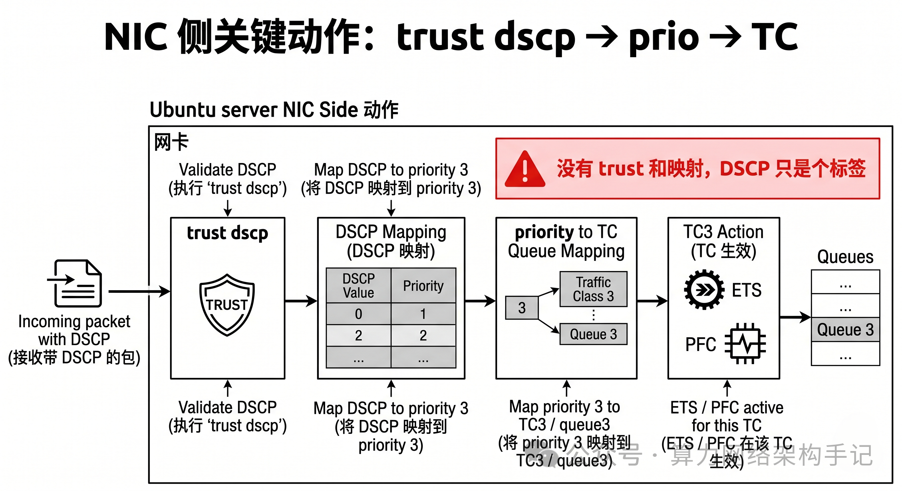

```table-of-contents
```
# 概述
RoCEv2 基于 **UDP/IP** 承载 RDMA，天生具备 IP 层 QoS 能力。

**DSCP（差分服务代码点）** 是其实现**流量分类、队列隔离、PFC 无损绑定、ECN 拥塞标记、端到端优先级转发**的底层核心标记，也是数据中心 AI 集群、高性能计算无损网络配置的基石。

本文从基础定义、报文结构、映射体系、行业标准值、与 PFC/ECN/DCQCN 联动、完整配置、常见问题等几个层面展开讲解。

# 基础概念与报文位置
## DSCP 定义

**DSCP（Differentiated Services Code Point，差分服务代码点）**，IETF DiffServ 架构核心字段，**6bit**，取值范围 **0~63**，用于给 IP 报文打上服务等级标签，网络设备依据该标签做**队列调度、带宽分配、拥塞处理、无损策略**。

## RoCEv2 报文内 DSCP 位置


RoCEv2 报文封装链：`以太网帧 → IP头 → UDP头(4791端口) → IB RDMA 载荷`

### IPv4


1）IPv4 头部 **TOS（服务类型）8bit 字段**：
- 前 **6bit = DSCP**（优先级标记）
- 后 **2bit = ECN（显式拥塞通知）**（拥塞状态标记）  
 整体合称 **DS 域**。

### IPv6


IPv6 对应 **Traffic Class 流量类别字段** 前 6bit 为 DSCP，后 2bit 为 ECN。

## 为什么 RoCEv2 必须用 DSCP
1）**RoCEv2 是三层网络协议**，可跨网段路由转发，仅靠二层 VLAN PCP 无法完成跨三层优先级传递，**DSCP 是端到端三层优先级唯一载体**。

2）RDMA 对丢包零容忍，需要精准流量隔离：RoCE 业务流量、CNP 拥塞报文、普通 TCP 流量必须划分独立队列，**DSCP 是分类依据**。

3）联动整套无损体系：**DSCP → CoS/PCP → 硬件队列 → PFC 无损 + ECN 拥塞标记 + DCQCN 速率控制**，全链路绑定。
```bash
CoS（Class of Service）: CoS 是交换机内部QoS分类
PCP（Priority Code Point）: 是 IEEE 802.1Q VLAN Tag 中的 3bit 优先级字段。PCP 是报文字段.
```

## PCP
PCP 是二层 VLAN Tag 里的 3 bit 优先级字段，也就是 802.1p priority。


# RoCEv2 完整优先级映射体系
RoCE 网络存在三层优先级转换，是所有配置的底层逻辑，极易配置错乱。

## 四层优先级对应关系

|层级|字段|位数|取值范围|作用|所属协议层|
|:--|:--|:--|:--|:--|:--|
|1. IP 层|**DSCP**|6bit|0~63|三层端到端流量标记、跨路由优先级|IPv4/IPv6|
|2. 链路层|**PCP（802.1p）**|3bit|0~7|二层 VLAN 帧优先级、PFC 绑定标识|以太网二层|
|3. 内部队列|**CoS（Traffic Class）**|3bit|0~7|交换机 / 网卡内部硬件队列号|设备内部|
|4. 端侧|RDMA QP 优先级|软件映射|绑定固定 CoS|应用侧 RDMA 队列优先级|网卡驱动|

## 映射原理

1）**DSCP → PCP/CoS 映射**

- 交换机 / 网卡配置**静态映射表**：把 64 个 DSCP 值，压缩映射到 8 个内部 CoS 队列（0~7）；同时同步转换为二层 PCP 值。
    
- 本质：**多 DSCP 聚合到同一 CoS/PCP**，因为 PFC 只基于 8 个二层优先级（PCP）做链路暂停，无法识别 64 级 DSCP。
    

2）**PFC 绑定对象**：PFC（基于优先级流控）**只绑定 PCP/CoS**，不直接绑定 DSCP；因此**DSCP 必须先映射到 CoS，才能启用对应队列无损**。

3）**ECN 标记位置**：  ECN 与 DSCP 同属 IP 头 DS 域后 2bit，**基于 DSCP 对应的队列做拥塞阈值检测、CE 标记**，标记结果随报文端到端传递。


## 行业官方标准默认值

这是全球 AI 数据中心 RoCEv2 标配，**99% 生产环境直接套用**

|流量类型|DSCP 十进制值|二进制|映射 CoS/PCP|队列|启用策略|用途|
|:--|:--|:--|:--|:--|:--|:--|
|RoCEv2 业务数据报文（RDMA 读写 / Send）|**26**|011010|**3**|队列 3|PFC+ECN+DCQCN|主业务无损传输|
|CNP 拥塞通知报文|**48**|110000|**7**|队列 7|高优先级、无 PFC、优先转发|反馈拥塞、触发发送端降速|
|普通尽力而为流量（TCP / 管理流量）|0（默认 BE）|000000|0|队列 0|有损、尽力转发|非 RDMA 普通业务|

> 补充：DSCP 26 二进制 `011010`，兼容传统 IP 优先级（前 3bit `011`=3），是历史兼容最优值；部分厂商方案也用 DSCP 46（EF 加速转发）做定制高性能场景。

# DSCP 在 RoCEv2 无损网络全链路工作流程

完整链路：**发送端网卡标记 → 交换机转发映射 → 队列调度 / PFC/ECN 处理 → 接收端解析 → CNP 反向反馈**

1）**发送端（RNIC 网卡）标记**：RDMA 应用下发 QP 传输请求，**网卡硬件自动给 RoCEv2 报文 IP 头打上固定 DSCP（默认 26）**，同时生成对应 PCP=3；CNP 报文自动标记 DSCP=48、PCP=7。

2）**交换机入口：优先级信任模式**

- 数据中心交换机端口必须配置 **`trust dscp`**（信任报文自带 IP 层 DSCP 标记），**禁止信任 PCP**，否则跨三层路由后优先级丢失。
    
- 交换机查表完成：`DSCP 26 → CoS 3`、`DSCP 48 → CoS 7` 映射。
    

3）**交换机队列与拥塞处理（核心）**

- **队列隔离**：RoCE 数据进入**队列 3**，CNP 进入**队列 7**，普通流量队列 0，**缓冲区完全隔离**，互不抢占。
    
- **PFC 无损（底层保障）**：仅对 **CoS 3** 开启 PFC；队列缓存超阈值，交换机向上游发暂停帧，**仅暂停该优先级流量**，杜绝缓冲区溢出丢包。
    
- **ECN 拥塞标记（中层平滑）**：队列 3 缓存介于最小 / 最大阈值间时，交换机修改报文 **ECN 位为 CE（拥塞遭遇）**，报文正常转发不丢弃。
    

4）**接收端处理与反馈**：接收网卡解析到 CE 标记报文，立刻生成 **CNP 报文（DSCP 48/CoS7）** 回传给发送端。

5）**发送端 DCQCN 速率调节**：发送端收到高优先级 CNP，依据 DCQCN 算法**动态降低 RoCE 发送速率**，从源头缓解拥塞，形成完整闭环。

# DSCP 与 RoCE 核心技术（PFC/ECN/DCQCN/ETS）深度联动
## DSCP & PFC（优先级流控）

1）关系：**DSCP 是 PFC 策略的源头分类依据**，PFC 不直接识别 DSCP，依靠`DSCP→CoS`映射绑定队列。

2）关键点：

- 必须**端到端全网映射统一**（所有服务器网卡 + 所有 Spine/Leaf 交换机 DSCP-CoS 映射完全一致），一处不匹配即优先级错乱、PFC 不生效、丢包。
    
- 仅给  **业务数据 CoS（3）** 开 PFC，**CNP 队列（7）绝对不开启 PFC**：CNP 是拥塞反馈报文，一旦被暂停会导致 DCQCN 闭环失效、全网死锁、流量雪崩。

## DSCP & ECN（显式拥塞通知）

1）同属 IP 头 DS 域：**DSCP 负责流量分类、队列归属；ECN 负责该队列内拥塞状态标记**。

2）工作绑定：交换机**基于每个 DSCP 映射队列**独立配置 ECN 上下阈值（Kmin/Kmax），不同流量阈值独立，互不干扰。

3）价值：优先用 ECN 平滑降速，**尽量不触发 PFC 硬暂停**，是 RoCE 网络高性能运行的最优状态。

## DSCP & DCQCN（数据中心量化拥塞控制）

DCQCN 端到端闭环完全依赖 DSCP 体系：

- 业务报文（DSCP26）承载 CE 拥塞标记；
    
- 反馈报文（DSCP48）高优先级传输，保障反馈低时延；
    
- 发送端依据 CNP 数量，精确调节对应 DSCP 流量的发送窗口与速率。

## DSCP & ETS（增强传输选择）

ETS 基于 **CoS 队列**做带宽权重分配，通过 DSCP 映射，给 RoCE 业务队列分配独占带宽权重，保障 RDMA 高吞吐，限制普通 TCP 流量带宽抢占。

```bash
ETS（Enhanced Transmission Selection，增强传输选择）是数据中心 QoS 中非常重要的一环，它和 PFC 经常配套出现。
其核心作用：给不同优先级队列分配带宽。

比如：
交换机端口：400G Port

├ Queue0  TCP
├ Queue1
├ Queue2
├ Queue3  RoCE
├ Queue4
├ Queue5
├ Queue6
└ Queue7

如果没有ETS，谁先抢到谁发，可能出现：TCP流量占满400G，RoCE拿不到带宽。

# ETS的工作机制

假设配置：
CoS3 (RoCE)  
Weight = 70%  
  
CoS0 (TCP)  
Weight = 30%

即：400G链路  
RoCE: 280G  
TCP:  120G
当两者都繁忙时，RoCE优先获得70%，TCP获得30%
```

# RoCEv2 DSCP 完整配置
覆盖英伟达 Mellanox 网卡、主流数据中心交换机配置。

## 网卡端（Mellanox/NVIDIA ConnectX 系列）配置



网卡默认出厂：`RoCE DSCP=26(CoS3)、CNP DSCP=48(CoS7)`，可通过`mlnx_qos`命令查看 / 修改。

```bash
# 查看当前DSCP映射配置  
mlnx_qos -i eth0  
  
# 配置RoCE数据报文DSCP=26，对应CoS 3  
mlnx_qos -i eth0 --dscp26 --traffic-class 3  
  
# 配置CNP报文DSCP=48，对应CoS 7  
mlnx_qos -i eth0 --cnp-dscp 48 --cnp-traffic-class 7  
  
# 永久固化配置（重启生效）
```
原理：网卡驱动层面完成**DSCP 标记 + DSCP-CoS 映射**，报文发出即携带正确 IP 层 DSCP。

## 交换机端（通用数据中心交换机）配置


核心三步：**端口信任 DSCP、DSCP-CoS 静态映射、对应 CoS 开启 PFC+ECN**

```bash
# 1. 全局端口配置：信任报文DSCP，不信任PCP  
interface GigabitEthernet1/0/1  
 qos trust dscp  
  
# 2. 配置DSCP到CoS（队列）映射（全网所有交换机完全一致）  
qos map dscp 26 to traffic-class 3  
qos map dscp 48 to traffic-class 7  
  
# 3. 仅对CoS 3（RoCE业务）开启PFC无损流控  
interface GigabitEthernet1/0/1  
 priority-flow-control enable  
 pfc cos 3enable  
  
# 4. 配置CoS 3队列ECN拥塞标记阈值  
qos ecn queue 3 minimum-threshold 80 maximum-threshold 240
```

# DSCP 常见问题、坑点与排错
## 核心配置坑

1）**全网映射不统一**：服务器网卡、Leaf、Spine 任意一台设备`DSCP-CoS`映射不一致，直接导致优先级错乱、PFC 不触发、RoCE 高延迟 / 丢包。

2）**端口信任模式错误**：交换机配置`trust dot1p(PCP)`而非`trust dscp`：RoCE 跨三层路由转发时，IP 层 DSCP 保留，但二层 VLAN 标签可能剥离 / 修改，**优先级直接丢失**，三层网络完全失效。

3）**CNP 队列错误开启 PFC**：对 CoS7（DSCP48）开启 PFC，CNP 拥塞报文被暂停，DCQCN 无法反馈，**全网流量死锁、带宽暴跌**。

4）**多无损队列冲突**：多个 DSCP 映射到不同 CoS 且全部开 PFC，多队列互抢缓冲区、PFC 反压扩散、网络抖动严重；生产建议**单 RoCE 专用无损队列**。


## 原理性坑（DSCP/PCP 粒度错位）

DSCP 是**6bit（64 级）**、PCP 是**3bit（8 级）**，多 DSCP 必须聚合映射；
若业务需要细粒度 QoS，只能拆分不同 CoS 队列，且配套独立 PFC/ECN 策略，复杂度陡增。

## 排错常用命令

```bash
# 网卡查看DSCP标记与映射  
mlnx_qos -i eth0  
  
# 交换机查看DSCP映射表  
display qos dscp-map  
  
# 查看端口信任模式、PFC开启状态  
display interface GigabitEthernet1/0/1 qos  
  
# 查看队列ECN标记统计、丢包统计  
display qos ecn statistics
```


# 小结
1）**定位**：DSCP 是 **RoCEv2 三层端到端 QoS 的唯一基础标记**，是打通 IP 层、链路层、网卡 / 交换机队列、PFC/ECN/DCQCN 全链路的枢纽。

2）**黄金标准**：生产固定 `RoCE业务 DSCP26→CoS3`、`CNP报文 DSCP48→CoS7`，全网严格统一映射。

3）**联动逻辑**：`DSCP标记 → 映射CoS队列 → 队列隔离 + PFC底层无损 + ECN中端拥塞标记 + DCQCN端到端速率闭环`。

4）**部署铁则**：端口**信任 DSCP**、仅业务 CoS 开 PFC、CNP 队列禁用 PFC、全网络映射完全一致。

# 参考
```bash
# RoCEv2 中 DSCP 技术详解
https://mp.weixin.qq.com/s/TieUD88j_E1HK4RhVY2avg
```