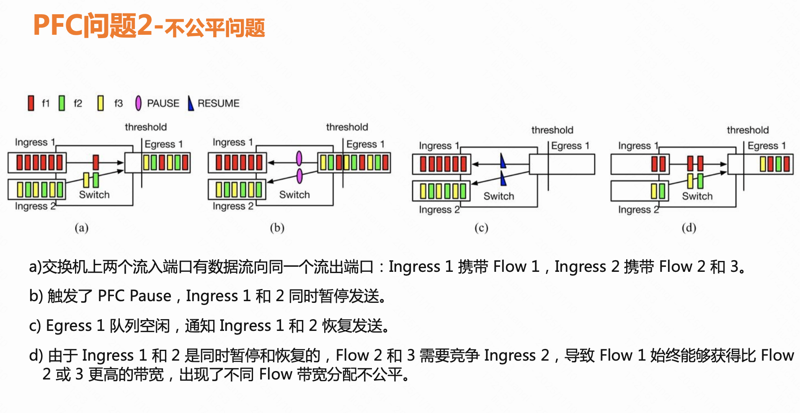
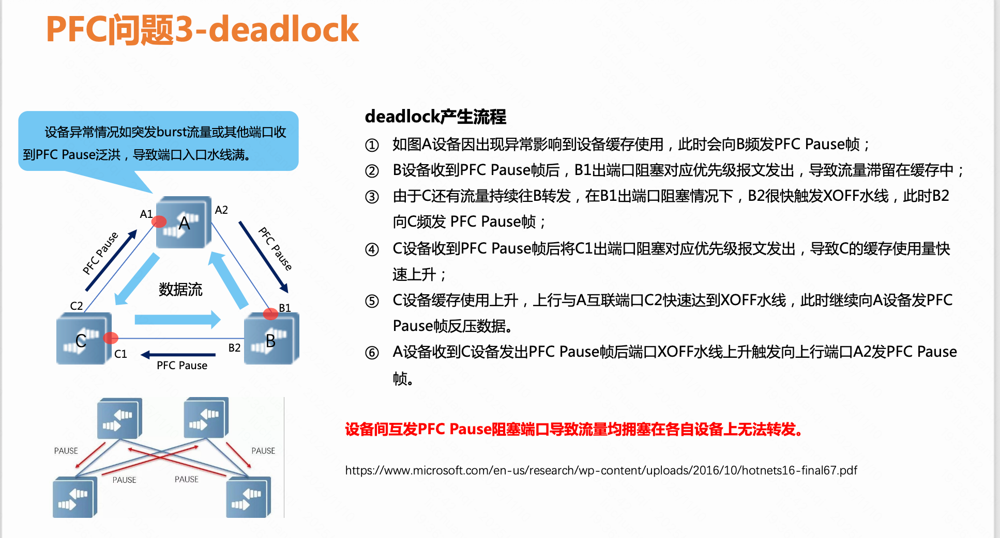

```table-of-contents
```

# IB传输层的重传：GO-BACK-N (GBN)
长期以来，HPC（高性能计算）社区一直在特定用途的Infiniband(IB)集群中使用RDMA，这些集群使用**IB链路层基于信用(credict)的流控**来使网络不丢包。由于数据包丢失在此类群集中很少见，因此RDMA Infiniband传输层（在NIC上实现）并非旨在高效恢复数据包丢失。 当接收方收到无序数据包（OOS: out of sequence）时，它只是丢弃该数据包并向发送方发送 否定确认（NACK）。当发送方看到NACK时，它重新发送在最后一个确认的数据包之后发送的所有数据包（即，它执行 **go-back-N重传「IB传输层的重传」**）。


为了利用以太网（Ethernet）在数据中心中的广泛使用的优势，引入了RoCE（基于融合以太网的RDMA：RDMA over  Converged Ethernet）,以便在以太网上使用RDMA。RoCEv2使得RDMA不仅可以通过以太网运行，还可以运行在IP路由网络（因为RoCEv2使用UDP，包含IP头，可以用IP路由）。RoCE采用了相同的Infiniband传输层设计（包括回退N（go-back-N）重传），并且使用PFC使以太网网络不丢包。

## Mellnaox网卡对于GBN的扩展


# Pause帧：基于端口的流量控制（Global PAUSE）

## Pause帧的报文格式


发送端暂停时间由以太网PAUSE控制帧中携带的2字节PAUSE Time定义，取值范围为0～65535，暂停时长的单位称为Quanta，每个Quanta等于传输512比特所需时间。

范例如下：


## 网卡开启关闭pause帧
大多数的网卡，都有流控的开关命令。Linux系统中，可通过ethtool工具控制。
```bash
ethtool -A ethx autoneg off　　//自协商关闭
ethtool -A ethx tx off　　　　//发送模块关闭 pause帧
ethtool -A ethx rx off　　　　//接收模块关闭 pause帧
```

## 基于端口的流量控制（Global PAUSE）的缺陷

基于端口的流量控制一旦开启，端口上所有类型流量都会被暂停，不同服务等级的流量都将受到影响，无法保证高优先业务的延迟和抖动。

另外，整个链路的流量暂停会大幅减少链路吞吐率并降低链路带宽利用率。因此，IEEE 802.3工作组在基于端口的流量控制基础上改进，提出了PFC（Priority-based Flow Control，基于优先级的流量控制）。

# PFC介绍
## 背景
### RDMA依赖一个无损网络
如下图所示，一旦发生丢包重传，RDMA 的性能就会急剧下降。
例如：大于 0.001% 的丢包率，就会导致网络有效吞吐急剧下降，尤其**当 0.01% 的丢包率甚至使 RDMA 的吞吐率下降为 0**。要让 RDMA 满速率传输，就要让丢包率必须保证在 1e-05（十万分之一）以下，最好为零丢包。如下图所示。

由此，RoCEv2 需要依赖一个 Lossless Network 来保障 0 丢包。


### RoceV2依赖的以太网默认有损 + IB传输层GBN低效
业界希望在成本更低、更通用的以太网 (Ethernet) 上运行 RDMA，即 RoCE。但 RoCE 继承了 IB 的传输层（注：是IB的传输层，如 RC QP），使用了低效的 **Go-back-N (GBN)** 丢包恢复。

**IB传输层**使用低效的GBN，是为了**硬件的实现简单以及传输的低时延**，同时 由于IB存在链路层逐跳的基于信用的流控，基本不存在丢包，因此**在IB网络中使用GBN没有问题**。

但是 **以太网默认有损（以太网在链路层和IP层默认没有流控）。如果发生丢包，使用IB传输层的低效的GBN 重传会导致性能灾难**。

## 丢包的原因

网络丢包的诸多原因可以分为 2 大类，下面我们分别讨论：

1. **网络拥塞（Networking Congestion）**：网络流量超过了 Router、Switch、RNIC 等硬件设备的处理和缓存能力而导致的丢包。
2. **物理链路故障**：网络物理链路断开导致的传输中断。


## PFC的引入

**网络怎么保证不丢包？**
交换机的缓冲区是有限的。流量一旦突发，缓冲区塞满，后来的包只能被丢掉——这是以太网的天然行为。但RDMA不接受这个行为。
所以AI集群需要一个机制，在包被丢掉之前，**让上游先停下来。这个机制叫 PFC**。

**优先级流控制 (PFC)** 被引入到==Roce==，用于**在以太网强制模拟 IB 的无损环境**。它的核心逻辑只有一句话：当我的缓冲区快满了，我就给上游发一个"暂停帧"， 让它停止发送，等我缓冲区腾出空间再继续。
当交换机缓冲区快满时，PFC 通过发送 PAUSE 帧，使上游设备停止发送特定优先级 (Priority) 的数据，从而避免缓冲区溢出和丢包。

整个过程是这样的：
```bash
正常发送  
→ 下游交换机缓冲区水位上涨  
→ 达到阈值，下游发出 PAUSE 帧  
→ 上游收到 PAUSE 帧，立刻暂停发送  
→ 下游缓冲区水位下降  
→ 下游发出 RESUME 帧，上游恢复发送
```

包没有被丢掉，只是"暂停"了一下。这就是PFC解决丢包问题的方式——**不是让包消失，而是让发送方等一等。**

> 总结：**PFC是Roce/RoceV2中以太网链路层的基于先级的流量控制。**
> ==因为RoceV2底层基于以太网+IP层进行传输，以太网和IP层没有流控，不能保证以太网网络无损，一旦丢包，IB传输层的丢包重传/乱序重传机制GBN会导致性能严重下降。因此，需要在以太网构建无损网络，PFC就是这个目的。
> 如果链路层是IB，由于IB链路层存在基于信用的流控，可以保证构架无损IB网络，因此IB网络中不需要PFC==。


## PFC解决了什么，又带来了什么？

PFC把以太网从"尽力而为"变成了"无损传输"，让RDMA 在以太网上跑成为可能。
但它有一个与生俱来的副作用：**它会把拥塞向上游传播。**  下游缓冲区满了，暂停上游。 上游被暂停，自己的缓冲区开始积压。 上游的上游也收到暂停帧。 拥塞像多米诺骨牌一样，一级一级往上传。

PFC存在HoL Blocking（Head-of-Line Blocking，队头阻塞）：一条流的拥塞，可能导致同一个端口上**所有流量**都被暂停，哪怕其他流量本来畅通无阻。


## VL（Virtual Lanes）

PFC是暂停机制的一种增强，PFC允许**在一条以太网链路上创建==8个虚拟通道==**，为**每条虚拟通道**指定一个优先等级（ Priority）并分配**专用的资源（如缓存区、队列等等）**，允许单独**暂停（Pause）和重启（Resume）其中任意一条虚拟通道（VL）**，而不影响其他虚拟通道流量的传输，保证其它虚拟通道的流量无中断通过。

PFC 将流量控制从 Port 粒度细化为了 VL 粒度。
这一方法使网络能够为单个虚拟链路创建无丢包类别的服务，使其能够与同一接口上的其它流量类型共存。


如下所示的，8个队列，其实就是8个虚拟通道。


# PFC分类
对网络流量进行分类，然后针对不同类别流量采用具体流控策略，实现精确控制，避免相互影响。

流量分类有两种不同的分类方法：传输层（Layer 2）和网络层（Layer 3）。Layer2 通过 vlan header（802.1q）里的 PCP（802.1p）位进行分类，对应 CoS（Class of Service）；Layer3 通过 IP header 里的 DSCP 进行分类，对应 DSCP。

在交换机支持 DSCP 的条件下，建议使用 L3 层的流控方式。从前面的介绍可以看到，L3 层的控制方式可跨多层交换机，DSCP 值在端到端的传输过程中不会发生变化。RoCE 使用 UDP 报文进行数据传输，建议 RoCE 的流控使用基于 DSCP 的方式。

## 基于VLAN的PFC

## 基于DSCP的PFC


# PFC的工作机制和流程

%202.png)

## PFC机制

PFC（Priority-based Flow Control，基于优先级的流量控制）也称为Per Priority Pause，是对全局 Pause机制的一种增强。
PFC允许网络设备根据不同数据流的优先级进行流量控制。当接收缓存中特定优先级对应的流量即将溢出时，网络设备可以向对端设备发送反压信号，要求对端设备停止发送特定优先级的流量，以防止缓存溢出和数据丢失。

PFC允许在一条以太网链路上创建8个虚拟通道，并为每条虚拟通道指定一个优先等级，允许单独暂停和重启其中任意一条虚拟通道，同时允许其它虚拟通道的流量无中断通过。这一方法使网络能够为单个虚拟链路创建无丢包类别的服务，使其能够与同一接口上的其它流量类型共存。


如上图所示，**DeviceA发送接口分成了8个优先级队列，DeviceB接收接口有8个接收缓存（buffer），两者一一对应**（报文优先级和接口队列存在着一一对应的映射关系），形成了网络中 8 个虚拟化通道，缓存大小不同使得各队列有不同的数据缓存能力。

当DeviceB的接口上某个接收缓存产生拥塞时，即某个设备的队列缓存消耗较快，超过一定阈值（可设定为端口队列缓存的 1/2、3/4 等比例），DeviceB向数据进入的方向（上游设备DeviceA）发送反压信号“STOP”。

DeviceA接收到反压信号，会根据反压信号指示停止发送对应优先级队列的报文，并将数据存储在本地接口缓存。如果DeviceA本地接口缓存消耗超过阈值，则继续向上游反压，如此一级级反压，直到网络终端设备，从而消除网络节点因拥塞造成的丢包。

### 接收入口快要满了， 为什么不可以丢包
==RoCE/PFC 网络要求“无损”==；
所以：接收队列的使用超过阈值，接下来不能直接drop新到来的包，只可以通过“暂停上游”而不是“本地丢包”，即用 backpressure 替代 drop。

总结：RoCE/PFC 网络要求==“无损”，只能是在接受队列丢包前，向上游反压（backpressure），代替本地丢包（drop）==。

## PFC工作流程


PFC工作原理如下：

(1)     Device A通过直连端口向Device B持续发送不同`802.1p`优先级标识的业务流量。Device B接收端口收到流量后，根据端口的优先级映射关系将`802.1p`标识的业务流量放到对应的队列中等待转发。例如，Priority为1的流量进入缓存队列1。

(2)     当缓存队列1的流量未及时转发，缓存空间虽未溢出但队列长度超出了PFC反压门限XOFF时，Device B立即向Device A发送PFC PAUSE帧。PFC PAUSE帧中`e[1]`置为1，表示队列1的流量要暂停发送一段时间，Device A按照PFC PAUSE帧的指示暂停发送对应优先级的流量。此时，Device A和Device B之间其他优先级的流量可以正常处理。如果缓存队列1持续超出XOFF，则Device A将会持续接收到多个PFC PAUSE帧，对应优先级流量一直处于暂停发送状态。

(3)  当拥塞情况缓解后，缓存队列1中的流量被转发，队列长度低于PFC反压解除门限XON。此时Device B向Device A发送RESUME消息，允许缓存队列1的流量正常发送。


## PFC的逐跳传递
```bash
下游入口堵  
→ 上游出口堵  
→ 上游入口也堵  
→ 再向更上游 pause
```
### 每一跳独立地产生自己的 PFC：PFC 不是“转发”

当Device B的出接口上某个队列产生拥塞时，导致本设备对应流量的入接口缓存超过门限，Device B向所有上游设备（数据报文的来源）发送PFC PAUSE帧。Device A接收到PFC PAUSE帧，会根据PFC PAUSE帧的指示，停止发送对应优先级的报文，并将数据存储到本地接口出方向的缓存空间。如果Device A本地接口出方向队列抢占共享缓存空间，进一步引发入接口缓存队列拥塞，也达到反压门限XOFF时，则Device A也向上游设备发送PFC PAUSE帧。通过逐级发送PFC PAUSE信号，直到抵达网络终端设备，这样可以有效消除网络节点因拥塞导致的数据包丢失。Device E接收到PFC PAUSE帧后，对该队列报文进行缓存，未达到Device E的缓存门限时，不向上游设备发送PFC PAUSE帧。


## PFC帧
“反压信号”实际上是一个以太帧，其具体报文格式如下所示。
%201.png)


|项目|描述|
|---|---|
|Destination address|目的MAC地址|
|Source address|源MAC地址。|
|Ethertype|以太网帧类型，取值为8808。|
|Control opcode|控制码，取值为0101。|
|Priority enable vector|反压使能向量。<br><br>其中E(n)和优先级队列n对应，表示优先级队列n是否需要反压。当E(n)=1时，表示优先级队列n需要反压，反压时间为Time(n)；当E(n)=0时，则表示该优先级队列不需要反压。|
|Time(0)～Time(7)|反压定时器。<br><br>当Time(n)=0时表示取消反压。|
|Pad|预留。<br><br>传输时为0。|
|CRC|循环冗余校验。|


设备会为端口上的8个队列设置各自的PFC门限值，当队列已使用的缓存超过PFC门限值时，则向上游发送PFC反压通知报文（XOFF），通知上游设备停止发包；当队列已使用的缓存降低到PFC门限值以下时，则向上游发送PFC反压停止报文(XON)，通知上游设备重新发包，从而最终实现报文的无丢包传输。

由此可见，PFC中流量暂停只针对某一个或几个优先级队列，不针对整个接口进行中断，每个队列都能单独进行暂停或重启，而不影响其他队列上的流量，真正实现多种流量共享链路。而对非PFC控制的优先级队列，系统则不进行反压处理，即在发生拥塞时将直接丢弃报文。

# PFC的芯片实现
## 交换机转发芯片（Switch ASIC）
在RoCEv2交换机中，数据包转发、流量控制、拥塞控制和负载均衡功能都是由接口板卡上的转发芯片完成，且流量控制技术和拥塞控制技术都与转发芯片的缓存管理联系紧密。因此，在介绍PFC工作原理前，需要简单了解交换机转发芯片的缓存机制。

转发芯片中存在一块公共的MMU（Memory Management Unit，内存管理单元）用于缓存设备端口接收和发送的数据报文。MMU的存储空间大小可以从几十MB到几个GB不等，对于高速低时延的数据中心交换机而言，一般配置较小的缓存空间以减少寻址时延。


设备将入（Ingress）和出（Egress）两个方向的报文都缓存到MMU中的物理缓存空间中。在逻辑上，MMU按队列粒度设置缓存上限并区分入方向和出方向队列。当设备接收报文时，先将报文按优先级映射到指定的入端口队列中，若该端口队列已占用的缓存空间大小与该报文长度之和超出入方向缓存上限，则缓存溢出，报文被丢弃。同理，设备发送的报文若超出端口队列的出方向缓存上限也会被丢弃。

## 入方向的“队列”和出方向的“队列”
入方向的“队列”是基于优先级映射实现的，也称为Priority Group。
出方向的“队列”表示不同的调度算法，例如加权公平队列（WFQ）、随机早期检测（RED），也称为Queue。

MMU除了设置缓存上限外，对入（Ingress）和出（Egress）方向端口队列还会细分不同“水线”，这些“水线”是影响流量控制和拥塞控制的关键。


### 同一个设备的出端口收到PFC如何通过入端口向上游反压
```bash
下游PFC → 导致本地egress阻塞  
→ 导致ingress缓存增长  
→ ingress超门限  
→ 本设备重新生成新的PFC
```


整体流程日下所示：

（1）正常转发


（2）出端口收到PFC：开始在出端口缓存数据


（3）出端口缓存满，入端口继续缓存：


（4）入端口缓存超越阈值，向上游发送PFC：


## “队列”缓存的水线设置：headroom/xoff
==PFC水线是基于入端口Buffer 进行触发的==，入端口方向提供的8 个队列（8个虚拟通道VL）可以将不同优先级的业务报文映射到不同队列上，从而实现不同优先级的报文分配不同的Buffer。


对于每个端口入方向的缓存，其可以根据场景分为三部分：**保证缓存、共享缓存和 headroom**。


- 保证缓存：每个队列的专用缓存，确保每个队列均有一定缓存以保证基本转发；
```bash
在这里面，保证缓存设置的原则是确保最大数据报文转发不产生拥塞，一般设置1500字节就可以了；
```
- 共享缓存：流量突发时可以申请使用的缓存，所有队列共享；
- Headroom：在触发PFC水线后，发出Pause帧，到服务器响应降速前，还可以继续使用的缓存，**保证不丢包**。Headroom缓存专门用于存储本队列触发PFC功能后接收到的报文。在发送PFC PAUSE帧之后到上游设备停止发包之前，这段时间内收到的报文存储在Headroom缓存中，防止报文被丢弃。


圆圈1对应保证缓存，它用来确保每个队列有一定缓存确保基本转发；
圆圈2对应共享缓存，在流量突发时使用，一般由所有端口队列共享；
圆圈3对应headroom，用于存储从触发PFC到上游设备响应限速的过程中飞行中（in-flight）的报文；
圆圈4是XOFF水线，表示分给该队列的共享缓存消耗完，触发发出PFC PAUSE(XOFF)帧，让发送方停止发送；
圆圈5是XON水线，表示缓存释放了一定量，发出PFC Resume(XON)帧，让发送方恢复发送。

### XOFF的设置
XOFF的设置过低，可能会导致频繁触发PFC机制，降低链路吞吐率
### headroom的设置
需要正确设置 headroom，偏大偏小都会有负面影响。
1. Headroom设置偏小，对端在未能响应PFC降速（因为PFC是逐跳传递的）时，发出报文的报文，因为headroom消耗完而丢包。
2. headroom设置偏大，留给XOFF水线设置的空间变小，XOFF水线设置偏小，设备频繁发PFC帧，对方频繁降速，线路带宽利用率偏低。

（1）PFC PAUSE帧通过链路传输所需的时间，这被称为传输延迟。在PFC PAUSE帧到达Device A并得到确认前，数据传输并未暂停，此时需要足够的Headroom缓存报文。
（2）接收端Device A的响应时间，即其内部逻辑处理PFC PAUSE帧所需的时间。规范中将此限制为60个Quanta，在10Gbps链路上相当于3840字节。
 （3）收发设备接口的MTU值。以接收设备为例，设想当Device B准备发送PFC PAUSE帧的瞬间，恰好有满载MTU尺寸的帧进入收发器逻辑。PFC PAUSE帧必须等待该数据包完成处理后才能发送。与此同时，Device A仍在持续发送流量并占用更多缓存空间。
 
# PFC特点

（1）PFC (Priority Flow Control, 优先级流控制)是构建**无损以太网**的手段之一， 能够**逐跳**提供**基于优先级（即基于队列，而非端口）的流量控制**。
（2）PFC 工作在**以太网的链路层 (Data Link Layer, L2)**。
（3）Pause帧是**逐跳 (Hop-by-Hop)** 的，只在直接相连的两个网络设备（如 HCA 和交换机，或交换机和交换机）之间发生作用。

## PFC 是 per-priority，不是 per-flow

## XOFF和XON的粒度是虚拟通道(VL)

## RoCEv2用PFC做链路层流控
### 链路层

计算机网络通常按**OSI七层模型**来划分：

|层级|名称|主要功能|
|---|---|---|
|7|应用层|应用程序之间的数据交互|
|6|表示层|数据格式转换、加密等|
|5|会话层|建立、管理会话连接|
|4|传输层|端到端数据传输、流控和差错控制（如TCP）|
|3|网络层|路由选择与IP寻址|
|**2**|**链路层**|**局域网内数据帧的传输，错误检测与流控**|
|1|物理层|物理信号传输（电缆、光纤等）|

**链路层**主要负责相邻网络设备之间的数据帧传输，通常是局域网内部的通信，比如以太网交换机和网卡之间。它包含了以太网MAC地址、帧格式、错误检测和局部流控等。

**链路层流控** 是在两个直接相连的设备（例如交换机端口和服务器网卡）之间，控制数据传输速度的一种机制。
PFC通过发送特殊的以太网PAUSE帧，告诉对端“请暂停发送某个优先级的数据”，以避免对端继续发送导致接收端缓冲区溢出。
这种机制只在相邻链路（链路层连接）上生效，**它不跨越多跳路由**，只对直接链路有效。

### RoceV2和PFC
**RoCE v2** 是在以太网UDP基础上实现的RDMA协议，利用UDP封装RDMA数据包，使其可以跨越多跳IP网络。
UDP本身不可靠，也不提供流控或拥塞控制。如果交换机端口缓冲区满了，UDP包就会丢失，严重影响RoCE性能。
因此，RoCE v2依赖底层链路层机制——PFC来实现精细的流控，阻止发送端继续发包，保证端口不丢包。

在传统以太网中，Ethernet流控机制是基于PAUSE帧实现的，但PAUSE是全局暂停，会影响所有流。
PFC（Priority Flow Control）则是基于`IEEE 802.1Qbb`标准，实现按优先级（Priority）单独流控，避免影响所有流。


# PFC的缺点

## 效率低下
PFC需要**逐级反压**，效率如同蜗牛爬行。

## 流控粒度较粗：无法基于flow进行流控

**PFC只能运行在【端口+优先级】这一粗粒度级别，无法细化到每一个Flow**，容易造成误杀。

为了破解这一难题，江湖中涌现出了一批基于Flow的拥塞控制算法的新秀。它们如同武林中的后起之秀，能够动态地调整每个Flow的发送速率，保持端口的队列深度稳定，从而避免触发PFC Pause。

## PFC unfairness 不公平问题


如下图：
（a）F1、F2 和 F3 分别通过 2 个 srcPort 向同一个 dstPort 发送流量。
（b）当 dstPort buffer 超过水线，则分别发送 PAUSE 帧给 2 个 srcPort。
（c）当 dstPort 缓过来之后，则分别发送 XON 帧给 2 个 srcPort。
（d）此时，F1 就会占用了比 F2、F3 更多的带宽。从而导致了不同 Flow 之间的带宽分配不公平问题。


## PFC HOL 对头阻塞问题
PFC 是 per-priority，不是 per-flow；
即使 只有 Flow1 导致拥塞，但 只要共享 priority 3，那么 所有选择 priority 3 的流，都会被 Pause。比如：A1 flow1 造成拥塞， A2/A3 的正常流也被暂停。这就是 HOL Blocking（队头阻塞）。


 PFC基于优先级的流量控制协议可能如上图所示，当Port4流量达到阈值后，向Port1和Port2发送Pause Frame，但导致Port1与Port3的数据传输暂停，从而影响整体。
因此，由于RoCE缺乏类似TCP的流量控制和拥塞控制算法，在丢包情况下，性能表现极差。

## PFC DeadLock 死锁问题


正常情况下，业务流量转发路径为A-B-C-D。当网络的**防环机制出现问题**时，将会导致业务流量从D向A转发。故障流量在A-B-C-D间转发，形成环路。如果网络设备A~D接口的缓存空间中使用的资源达到PFC XOFF门限，则网络设备向故障流量的上游发送PFC PAUSE帧。PFC PAUSE帧在环网中持续发送，最终导致所有设备进入PFC死锁状态，整网断流。

PFC死锁是指多个设备之间，因为环路等原因，同时出现了拥塞（各自端口缓存消耗超过了阈值），又都在等待对方释放资源，从而导致的“僵持状态”（==所有交换机的数据流永久堵塞==）。

多个设备发生拥塞后互相发送PFC PAUSE帧，使PFC PAUSE帧在网络内泛洪（PFC死锁，往往伴随着PFC Strom），PFC Decdlock 由于 PFC 的 PAUSE 反压效应，导致**网络内设备无法转发正常报文（整个网络或部分网络的吞吐量将快速跌零）**，使整网业务瘫痪。




正常情况下，当一台交换机的端口出现拥塞时，数据进入的方向(即下游设备)将发送PAUSE帧反压，上游设备接收到Pause帧后停止发送数据，如果其本地端口缓存消耗超过阈值，则继续向上游反压。如此一级级反压，直到网络终端服务器在Pause帧中指定Pause Time内暂停发送数据，从而消除网络节点因拥塞造成的丢包。


但在特殊情况下，例如发生链路故障或设备故障时，如上图所示，当4台交换机都同时向对端发送Pause帧，这个时候该拓扑中所有交换机都处于停流状态，由于PFC的反压效应，整个网络或部分网络的吞吐量将变为零。


## PFC Pause-Storm 风暴问题

前面提到，PFC 反压会产生死锁等严重问题，尤其在大规模组网的场景，PFC pause 反压报文会形成风暴。

由于PFC pause 是逐跳传递的，所有可能会引起Pause frame storm,比如，==NIC因为bug导致接收缓冲区填满==，
NIC会一直对外发送Pause frame。

需要在NIC端和交换机端**使能watchdog机制来防止pause storm 和 PFC 死锁**。


## 问题小结
```bash
A--->B:  A给B发送Pause，就是实际流量是B--->A,但是A自身存在问题或者缓冲区满了，那么A给B发送Pause，让B暂缓给A发送流量。
```
PFC 问题本质的原因是，Pause 机制运行在「端口 + 优先级」这个级别，不能细化到每一个Flow，而粗暴地将整个发送端口停下来了。
如果能够动态地调整每个 Flow 的发送速率，保持端口的队列深度比较稳定，那么就不会触发 PFCPause 了。
因此，基于 Flow 的拥塞控制算法出现了。

==基于以上的PFC的种种问题，在RoceV2中引入了DCQCN拥塞控制，就是在常规场景下尽可能的减少PFC，但是还是需要PFC作为兜底应对微突发==。

# 减少PFC的策略
## 端侧：发送端 
pacing，减少 burst。

## 端侧：接收端
快速消费，避免：NIC RX buffer积压

## 网络侧
### RoceV2 + DCQCN + 合理的 ECN阈值
ECN的水线的设置低于XOFF水线， 同构DCQCN提前降速，减少PFC的产生。

# PFC 死锁

## PFC 死锁是怎么形成的？

死锁不是随机发生的，它有一个明确的形成条件：

**网络里存在循环依赖。**

具体来说，需要同时满足三件事：
**① 缓冲区占用形成环路**
A 的缓冲区被等待发往 B 的数据占满， B 的缓冲区被等待发往 A 的数据占满， 两者互相依赖，谁也无法释放。
**② PFC 把这个占用关系锁住**
A 向 B 发 PAUSE，B 向 A 发 PAUSE， 双方都停止发送，但缓冲区里的数据没有任何出路。
**③ 没有任何外部机制打破这个循环**
没有超时丢包，没有优先级抢占， 数据永远待在缓冲区里，网络静止。


## 死锁容易出现的场景

在真实集群里，死锁最容易在以下场景出现：

- **多路径同时拥塞**：ECMP 把流量分散到多条路径， 多条路径同时触发 PFC，形成交叉依赖
    
- **存储流量和计算流量混跑**： 两种流量共享同一个优先级队列， 存储的大象流把计算流的 PFC 通道塞满
    
- **拓扑不对称**： 上下行带宽不匹配，某些节点天然成为拥塞汇聚点， 反复触发 PFC 直到形成环路

## PFC 死锁影响： 导致 整个网络或部分网络的吞吐量将跌零

PFC死锁是指多个设备之间，因为环路等原因，同时出现了拥塞（各自端口缓存消耗超过了阈值），又都在等待对方释放资源，从而导致的“僵持状态”（==所有交换机的数据流永久堵塞==）。

多个设备发生拥塞后互相发送PFC PAUSE帧，使PFC PAUSE帧在网络内泛洪（PFC死锁，往往伴随着PFC Strom），PFC Decdlock 由于 PFC 的 PAUSE 反压效应，导致**网络内设备无法转发正常报文（整个网络或部分网络的吞吐量将快速跌零）**，使整网业务瘫痪。

## 避免 PFC 死锁的手段

### 从拓扑层面消灭循环依赖
Rail-Optimized 组网的核心设计目标之一， 就是让同一个 AllReduce 的流量尽量走同一条路径， 不形成交叉。

### 用 ECN 降低 PFC 的触发频率
PFC 触发得越少，形成死锁的概率越低。 ECN 在拥塞早期就让发送方主动降速， 理想情况下 PFC 根本不需要触发。

这也是为什么工程师评估一个AI集群网络健康状况时，**PFC 触发次数是一个关键指标**—— 触发次数越多，说明网络越接近危险边缘。

### watchdog 机制
Watchdog 是工程上能够在 PFC 死锁**已经形成**之后将系统从死锁状态拉出来的唯一手段。

其核心思想是：如果**一个端口在某个优先级上被 PAUSE 持续太久，那它大概率已经陷入死锁环路**，此时打破规则（主动丢包）比继续等待恢复更优。

Watchdog 工作在 NIC 固件和交换机 ASIC 层，对每个 **（端口 × 优先级）** 组合独立维护一个计时器。

#### 触发PFC死锁检测

Device B的端口Interface收到来自Device A的PFC PAUSE帧后，停止发送对应优先级队列的报文。Device B启动PFC死锁检测定时器，在检测周期内检测该优先级队列收到的PFC PAUSE帧。


#### PFC死锁判定

如果在PFC死锁检测周期内，Device B上端口Interface的指定优先级队列一直处于PFC XOFF状态，即在检测周期内该优先级队列持续不断地收到PFC PAUSE帧，则Device B判定Device A发生死锁，进入死锁状态。


#### PFC死锁恢复

设备检测发生死锁后，将启动**死锁自动恢复定时器**。

（1）在自动恢复周期内：关闭PFC，忽略收到的PFC PAUSE帧，对数据报文执行转发或丢弃动作
设备将关闭该接口的PFC功能和PFC死锁检测功能，以忽略接口收到的PFC PAUSE帧。同时，设备对数据报文执行转发或丢弃动作（由管理员手工配置），以规避PFC死锁问题。

（2）在自动恢复定时器超时后：重新开启PFC功能和PFC死锁检测功能；
在自动恢复定时器超时后，设备将开启PFC功能和PFC死锁检测功能。如果经过死锁恢复后，仍不断出现PFC死锁现象，管理员可以设置PFC死锁的触发上限，当PFC死锁发生次数到达上限后，设备将强制关闭PFC功能和PFC死锁检测功能。待排除故障后，需要管理员手工恢复PFC功能和PFC死锁检测功能。

#### watchdog的丢包和 PFC预防丢包是否矛盾
Watchdog 触发丢包会打破 PFC 的"无损"承诺，但这是**有意为之**：死锁状态下所有流量都已冻结，丢掉一部分包换取系统恢复，是正确的工程取舍。上层 RDMA 协议（RoCEv2）的 QP 重传机制可以恢复被丢弃的数据。

> 注：丢包总比流量跌零要好

#### watchdog 治标不治本：watchdog是系统运行的兜底手段，不是优化手段

如果 Watchdog 每天触发超过 5 次，说明系统存在系统性问题——要么 headroom 算错了，要么 WQE 池太小，要么有慢接收端（Slow Receiver）。Watchdog 只是保证系统不会永久卡住的保险丝，不是优化手段。


# QA
## 为什么AI集群离不开PFC，却又要想办法少触发它？

**离不开它：**
RDMA 不接受丢包，以太网天然会丢包， PFC是唯一能在以太网上实现无损传输的机制。 没有 PFC，RoCEv2 就跑不起来。

**又怕它：**
PFC把拥塞变成了背压，背压会传播， 传播链条一旦形成环路，就是死锁。 死锁比丢包更可怕——丢包至少还能恢复， 死锁是整个网络静止。

所以AI集群在部署PFC的同时，必须配套另外两个机制来限制它的副作用：

**ECN**：在拥塞形成之前就让发送方主动降速，减少PFC被触发的频率。

**DCQCN**：把PFC和ECN协调起来， 动态控制每个发送方的速率， 让拥塞在源头消散，而不是在网络里传播。

三个机制不是并列关系，而是**分工配合**：
```bash
ECN  →  感知拥塞，主动降速，尽量不让 PFC 触发  
PFC  →  拥塞来不及消散时，暂停发送，保住最后一道防线  
DCQCN →  协调两者，动态调整速率，让整个系统稳定运行
```

PFC 是最后一道防线，不是第一道。 触发越少，网络越健康。


## 只有交换机才会产生PFC吗？
端侧的NIC 也能发 PFC，因为 NIC port 本身也有 RX buffer。


# PFC的配置
如果要说PFC的配置，就要考虑PFC的流程：

DSCP-Based PFC是基于L3的Hop-by-Hop flow control，支持最多8个虚拟优先级队列，在包传输路径拥塞时，接收者的接收队列长度达到一定阈值（XOFF）时，接收者给发送者发出PFC Pause Frame，指明要发送者暂停发送的虚拟队列以及暂停时间，暂停时间过后发送者可以继续发送。当接收队列减少到一定阈值（XON）时，接收者也可以发送给发送者一个暂停时间为0的pause frame，发送者解除发送限制。

%202.png)


## 主机侧配置
## 交换机侧配置


# 端侧产生PFC的原因
端侧（NIC）发 PFC 的根本原因：NIC ingress buffer 快满了；
```
网络进入NIC的速度 > NIC DMA/host/application消化速度
```
NIC RX FIFO上涨，达到 watermark, NIC 发送PFC pause，暂停上联交换机继续发包。

## 生产者消费者之消费者阻塞
本质上都是生产者消费者问题。

DMA和应用程序：主机内存的recv buffer queue作为缓冲区，DMA是生产者，应用程序是消费者。
网卡硬件的PHY/MAC和DMA： 网卡硬件中的FIFO队列是缓冲区，PHY/MAC或者来自于网络中的报文是生产者，DMA是消费者。

### 应用程序慢了/卡了
应用程序性能不足/硬件错误(内存条损坏)/内存不足等等，导致应用程序慢了/卡了。

#### 应用程序性能问题
程序的性能问题：比如跨NUMA，recv buff 不足或者被耗尽。

应用程序作为消费者：
1》对于DPDK应用程序而言，就是从rx ring buffer中取数据。
2》对于RDMA而言，就是从CQ中取CQE；如果不poll cqe，那么RQ的指针就不会移动，导致RQ满。
3》recv buffer被耗尽：如应用程序占用太多的recv buffer：
比如：DPDK的 rx-queue 对应的 mbufpool 中 mbuf耗尽，无法填充，进而导致 DMA没有足够的 rx buffer 导致；
比如：RDMA的 recv buffer 被应用（应用长时间占用recv buffer不释放）耗尽，导致没有足够的recv buffer 进行 post 填充 RQ；

RDMA的RQ满或 DPDK的 rx ring buffer 满了，就会导致DMA通过PCIe写出现问题，进而反压到网卡硬件的FIFO队列，最终导致FIFO队列满，出现丢包。


#### 应用程序依赖的资源存在问题或者竞争
##### 硬件问题或者内存不足
如果内存条坏了或者内存不足，应用程序无法申请到足够的资源，应用程序就会卡主或者变慢，导致消费慢了。
##### CPU被抢占/CPU降频
如果CPU被抢占，或CPU降频，那么相当于应用程序处理慢了。

#### 缓冲区大小配置不合理
比如：

### PCIe 降速（Gen 降低）或 PCIe Lane 数下降（宽度下降）
DMA将网卡硬件中的数据，通过PCIe搬运到主机内存。如果PCIe降速，那么会导致网卡硬件的FIFO队列满。


## 端侧如何防止PFC 风暴


# 以太网链路层的流控(PFC)和IB链路层的CBFC基于信用的流控(CBFC)对比

|**特征**|**RoCE 的 PFC (Priority Flow Control)**|**IB 的 CBFC (Credit-Based Flow Control)**|
|---|---|---|
|**工作层次**|**数据链路层 (L2)**|**数据链路层 (L2)**|
|**流控粒度**|**优先级 (Priority)**：基于 802.1p 优先级标签。|**虚拟通道 (Virtual Lane, VL)**：基于 VL 和缓冲区槽位。|
|**基本机制**|**后向压力 (Backpressure)**：通过发送 **PAUSE 帧**，要求上游**停止**发送数据。|**前向许可 (Forward Permission)**：通过发送 **Credit 帧**，允许上游**发送**数据。|
|**工作模式**|**被动/事后**：在缓冲区快满时才启动暂停。|**主动/事前**：在发送数据前必须获得许可（Credit）。|
|**对丢包保证**|**模拟无损**：在理想情况下可防止丢包，但容易失败（如 PAUSE 帧丢失）。|**原生无损**：从机制上杜绝了因缓冲区溢出导致的丢包。|
|**副作用**|容易导致 **队头阻塞 (HOL)**、**拥塞扩散**，甚至 **死锁**。|通常不会引起这些问题，设计更稳定。|


## 相同点 (Similarities)
4. **工作层次相同：** 两者都是工作在 **数据链路层 (L2)** 的**逐跳 (Hop-by-Hop)** 流量控制机制。
5. **目标相似：** 核心目标都是为了实现链路上的**无丢包传输**，从而保证上层 RDMA 协议的效率和低延迟。
6. **都是基于硬件：** 两者都依赖于网卡和交换机硬件来快速处理和响应这些控制帧或信号。

## 不同点 (Differences)

7. **机制与哲学 (最关键区别)：**
    - CBFC 是基于**资源许可（信用：credict）** 的拉式系统 (Pull)，是拥塞避免哲学，天然无损。
    - PFC 是基于**压力反馈(反压：backpresure)** 的推式系统 (Push)，是拥塞控制/抑制哲学，是模拟无损。
    
8. **触发时机：**
    - CBFC 检查信用是**持续且主动**的，发送方在任何时候发送数据都需要信用。
    - PFC 只有在**拥塞发生临界点**时（缓冲区水位达到阈值）才被动触发。

9. **细粒度：**
    - CBFC 的粒度可以细到单个 VL 或缓冲区槽位。
    - PFC 的粒度粗糙得多，基于 8 个 802.1p 优先级，容易产生 HOL 阻塞。

# 参考
```bash
# 智能无损网络技术白皮书-6W104
https://www.h3c.com/cn/Service/Document_Software/Document_Center/Home/Public/00-Public/Learn_Technologies/White_Paper/WP-17074/

# RoCEv2 高性能传输协议与 Lossless 无损网络
https://is-cloud.blog.csdn.net/article/details/145773002

# RDMA(6)流控：让数据流动如沐春风，为数据传输保驾护航
https://mp.weixin.qq.com/s/BjV5U7URuRQbQP_q0-j_Ng

# 一文讲清RoCEv2交换机的PFC和ECN
https://zhuanlan.zhihu.com/p/699916272
```