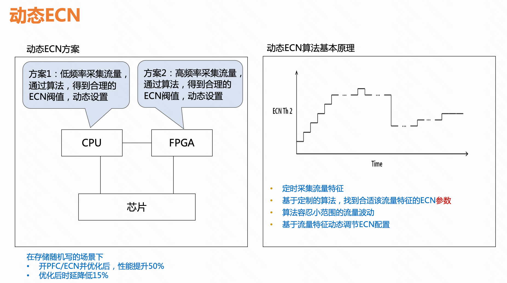
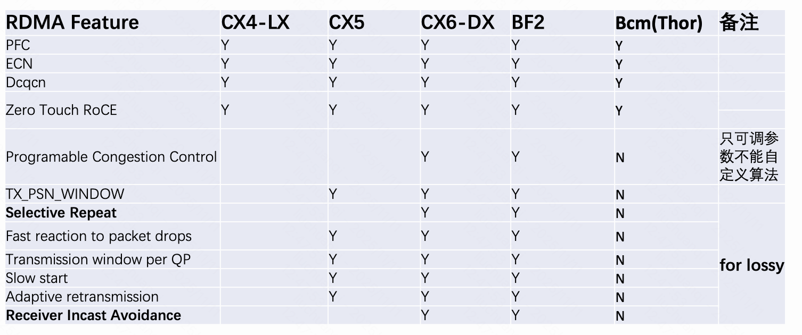
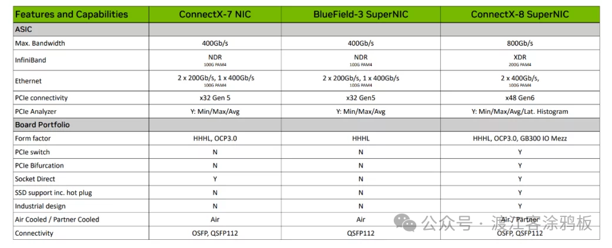
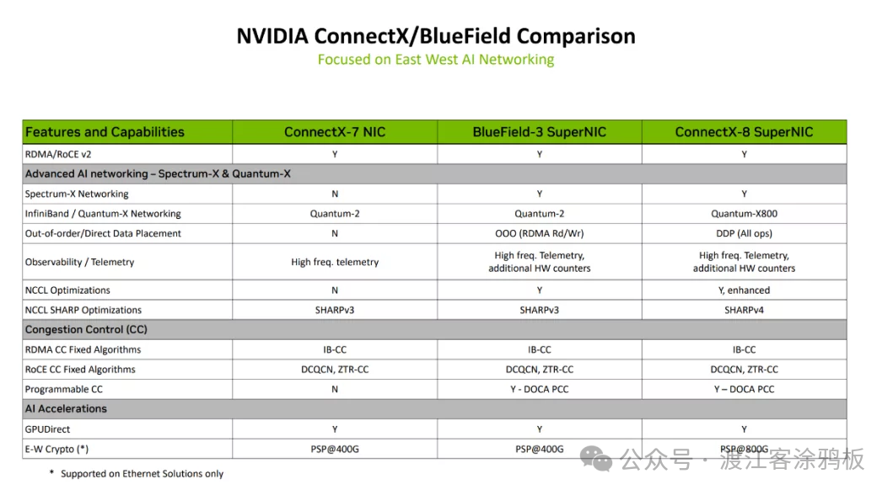

```table-of-contents
```
# ECN出现的背景
## PFC的问题

PFC 存在 Deadlock、Storm 等问题的本质是==无法精确管理每条 Flow==，**只能粗暴的关闭流量，而不能动态调整发送速率**。
另外，由于 PFC 会上下游网络设备之间的层层反压，所以在大规模 Lossless Network 中，效率很低。


因此，PFC 往往还需要结合更高效的拥塞控制算法，例如：ECN、DC-QCN 等，在不同的业务场景中采用合适的算法是重中之重。


# 介绍


## ECN在IP头中的位置

在RFC 2481标准中，IP报文头中DS域的最后两个比特位被定义为ECN域，并进行了如下定义：
·     比特位6用于标识发送端设备是否支持ECN功能，称为ECT位（ECN-Capable Transport）
·     比特位7用于标识报文在传输路径上是否经历过拥塞，称为CE位（Congestion Experienced）


以IPv4报文为例，RFC 3168对ECN域的取值进行如下规定：
·     ECN域的取值为00时，表示该报文不支持ECN功能。
·     ECN域的取值为01或者10时，表示该报文支持ECN功能，分别记为ECT（0）或ECT（1）。
·     ECN域的取值为11时，表示该报文在转发路径上发生了拥塞，记为CE。


## 整体流程

ECN 的基本工作流程如下：
```bash
Sender 发送的 IP 报文支持 ECN(10)；
Switch 在拥塞的情况下收到该 IP 报文，并将 ECN(10) 改为 ECN(11) 并转发，网络中其他 Switch 会透传该报文。
Receiver 收到 ECN(11) 报文，识别拥塞。
Receiver 向 Sender 每 ms 发送一个 CNP 消息，ECN(01)，指示降速的 DestQP。
Switch 正常转发 CNP 消息，该消息不会被网络丢弃。
Sender 收到 ECN(01) 后，解析报文，并对相应 RDMA QP 应用限速算法。
```


发送端：ECN = 10, 表示支持ECN；
拥塞点：交换机的接受缓冲区超过ECN水线，说明发生了拥塞，将报文ECN=11，表明发生了拥塞；
接收端：收到ECN=11的报文，表明网络中发生了拥塞 ，向发送端发送CNP报文（ECN=01）

### CNP报文格式
在 ECN 拥塞控制算法中，IP Header 的 ECN 字段用于打标识别拥塞，而 CNP（RoCEv2报文） 才是用于通知 Sender 降速的消息体。
CNP 报文格式如下图所示，其作用于 IB L4 传输层的 BTH，用于指示 Sender 对指定的 QP 进行降速，而不是对整个 Port 进行降速，依旧是一种细粒度的流控。


**OpCode（操作码）**：8bit。
	前 3bit 代表服务类型，有：RC 可靠连接、UC 不可靠连接、RD 可靠数据报、UD 不可靠数据报、RAW 数据报等类型；
	后 5bit 代表操作类型，有：SEND、RECEVICE、READ、WRITE、ACK 等类型。
	
**Partition Key（分区键）**：在 IB 网络中用于将一个 RDMA 网络分为多个逻辑分区。而在 RoCEv2 网络中，则可以采用 VxLAN 技术代替。

**ECN（显示拥塞通知）**：在 IB 网络中用于拥塞控制，包含 Forward 和 Backward 两个 bit，分别表示在发送和返回路径上遇到了拥塞。在 RoCEv2 中被 IP Header 中的 ECN 字段代替。

**Destination QP（Queue Pair Number）**：与 TCP Port num 类似，用于标识一个多路复用的 RDMA Channel 的目的端。与 TCP Port num 不同的是，一个 QP 由 Send/Recv 两个队列组成，使用同一个号码标识。

**Packet Sequence Number（包序列号）**：与 TCP 序列号类似，用于检查 RDMA 报文的传输顺序，可靠传输时生效。

# ECN和WRED策略
ECN功能需要和WRED策略配合应用。

## 设备的三种角色：CP/NP/RP

在部署ECN功能的WRED策略的组网图中，存在三类设备角色：


(1) 转发设备（Congestion Point）：
报文在网络中转发路径上经过的设备，转发设备支持ECN功能，可以识别报文中ECN域的取值。报文在转发设备的接口上可能发生拥塞，所以转发设备又称为Congestion Point，转发设备需要部署ECN功能的WRED策略。

(2) 报文接收端（Notification Point）：
接收端设备网卡支持ECN功能，可以识别报文中取值为01、10或者11的ECN域。接收端同时作为拥塞通知的发起设备，收到ECN域取值为11的报文时，将每隔时间周期T1发送拥塞通知报文给报文发送端，要求发送端降低报文发送速率。

(3) 报文发送端（Reaction Point）：
发送端设备网卡支持ECN功能，从发送端发出报文的ECN域的取值为01或者10。发送端同时作为拥塞通知的应答设备，收到拥塞通知时，将以一定的降速比率降低当前自身发送报文的发送速率，并开启计时器，当计时器超出时间T2（T2>T1）后，发送端设备未再次收到拥塞通知，则发送端认为网络中不存在拥塞，恢复一定的报文发送速率。当计时器在时间T2（T2>T1）内，发送端设备再次收到拥塞通知，则发送端进一步降低报文发送速率。

## WRED策略
没有开启ECN功能的WRED策略按照一定的丢弃策略随机丢弃接口出队列（出方向缓存）中的报文，WRED策略为每个队列都设定上限长度QL_max和下限长度QL_min，对队列中的报文进行如下处理：

（1）当队列的长度小于下限QL_min时，不丢弃报文；

（2） 当队列的长度超过上限QL_max时，丢弃所有到来的报文；

（3）当队列的长度在上限QL_max和下限QL_min之间时，开始随机丢弃到来的报文。队列越长，丢弃概率越高，队列丢弃概率随队列长度线性增长，不超出最大丢弃概率x%。


## ECN和WRED策略的配合

部署了ECN功能的WRED策略的转发设备（Congestion Point）对接收到的数据报文进行识别和处理的具体处理方式如下：

（1）当转发设备的报文在出方向排队，该队列的长度小于下限QL_min（QL_min也称为ECN低门限）时，不对报文进行任何处理，转发设备直接将报文从出接口转发。

（2） 当转发设备的报文在出方向进入队列排队，该队列的长度大于下限QL_min但小于上限QL_max（QL_max也称为ECN高门限）时：

（2.1）如果设备接收到的报文中ECN域取值为00，表示报文发送端不支持ECN功能，转发设备按照未开启ECN功能的WRED策略处理，即**随机丢弃**接收的报文。

（2.2）如果设备接收到的报文中ECN域取值为01或者10，表示报文发送端支持ECN功能，将按照WRED策略中的线性丢弃概率来**修改部分**入方向报文的ECN域为11后继续转发该报文，所有入方向接收到的报文**均不丢弃**。

（2.3）如果设备接收到的报文中ECN域取值为11，表示该报文在之前的转发设备上已经出现拥塞，此时转发设备不处理报文，**直接转发**，将报文从出接口转发。

（3） 当转发设备的报文在出方向进入队列排队，该队列的长度大于上限QL_max时：

（3.1）如果设备接收到的报文中ECN域取值为00，表示报文发送端不支持ECN功能，转发设备按照未开启ECN功能的WRED策略处理，即**随机丢弃**接收的报文。

（3.2） 如果设备接收到的报文中ECN域取值为01或者10，表示报文发送端支持ECN功能，将**100%修改**入方向报文的ECN域为11后继续转发该报文，所有入方向接收到的报文**均不丢弃**。

（3.3）如果设备接收到的报文中ECN域取值为11，表示该报文在之前的转发设备上已经出现拥塞，此时转发设备不处理报文，**直接转发**，将报文从出接口转发。

# ECN存在的问题
## ECN 拥塞控制滞后的问题

值得注意的是，尽管有 ECN 算法来缓解 PFC 的不足，但 ECN 依旧存在 “响应速度慢”、不能根除 “网络拥塞控制滞后” 的问题。
因为，拥塞标记首先要经过数跳 Switches 到达 Receiver，然后 CNP 也要再经过数跳 Switches 到达 Sender，最后才开始降速。这之间显然存在至少一个 RTT（Round-Trip Time，传输往返时间）的 “滞后”，也会存在 CNP 丢包和重传的情况。所以，在 “流量毛刺” 和 “严重拥塞” 的场景中，需要使用 Fast ECN、Fast CNP 等辅助技术来防止在降速之前就丢包了。

## ECN的设置问题
各个队列转发的数据流量特征会随时间动态变化，网络管理员通过静态设置ECN门限时，并不能满足实时动态变化的网络流量特征：
> 流量分为：带宽敏感，和时延敏感。

（1） ECN门限设置过高时，转发设备将使用更长的队列和更多缓存来保障流量发送的速率，满足吞吐敏感的大流的带宽需求。但是，在队列拥塞时，报文在缓存空间内排队，会带来较大的队列时延，不利于时延敏感的小流传输。

（2） ECN门限设置偏低时，转发设备使用较短的队列和少量缓存尽快触发来降低队列排队的时延，满足小流对时延的需求。但是，过低的ECN门限会降低网络吞吐率，影响吞吐敏感的大流，限制了大流的传输。


当拥塞发生时，从转发设备发送ECN域标记为11的数据报文到报文发送端降速的过程中，发送端仍以原速率持续发送数据报文。这段时间内网络中的拥塞将进一步恶化，只有合理并动态设置ECN低门限，设备才能**尽量避免触发PFC**，因为PFC会暂停发送，影响网络中的吞吐率。


# 时延ECN和动态ECN

ECN门限的设置是影响ECN功能的关键。H3C提供多种灵活方式触发ECN功能。
·     时延ECN：根据设备转发时延来触发ECN功能；
·     动态ECN：设备根据共享缓存占用情况来动态触发ECN功能；

## 时延ECN
### 报文从设备入端口到出端口转发的总时延

报文从设备入端口到出端口转发的总时延`dnode=dprocess+dqueue+dtransmit`，其中：

(1) 处理时延dprocess：数据报文进入设备端口后进行误码校验、分析报文头和查询表项出口等行为产生的时延，这部分时延通常只有微秒级别或更少。

(2) 排队时延dqueue：数据报文进入MMU缓存排队等待调度的时延，这部分时延与拥塞程度和占用缓存大小有关。想象一下一个堵车的场景，堵车长度越长（占用缓存越大），新到达拥堵路段的车辆越多（拥塞程度越高）则离开拥堵路段所消耗的时间越长。

(3) 传输时延dtransmit：表示将一个完整的数据报文从出端口转换为信号发送的时间，如果出端口速率为R(bps)，报文长度为L(bit)，则至少需要`L/R`才能将该分组报文完整发送。在数据中心高速链路上，R可以达到几十上百Gbps，传输时延只要纳秒量级。


```bash
 报文在设备内部处理时延的示意
```

传统的ECN功能仅与出方向队列中报文长度有关，缓存占用越多队列越长，ECN域被标记为11的概率越大。这种ECN的触发方式虽然可以避免丢包，但设备链路高负载运行时，流量强度（traffic intensity）大，报文都先进行缓存，等待出队列调度，导致排队时延dqueue增加。

### 流量强度

流量强度通常用`L*a/R`表示。其中，L表示分组报文的平均长度(bit/packet)，a表示分组报文到达队列的平均速率(packets/s)，R表示出端口的带宽速率(bps)。
`L*a/R＞1`时，到达端口的流量超过端口转发速率，队列缓存就会趋向于无限增长。为了避免丢包，必须要求网络系统中`L*a/R≤1`。

实际网络中，分组报文不是周期性规律地到达端口，且每个分组报文长度也属于随机分布。**在一段时间内密集到达的突发流量会超出端口转发速率，就造成排队**。此时，如果流量强度越趋近于1，理论上的排队时延就趋于无穷大。如果分组报文到达时间间隔较大报文长度较小，出端口有充足时间转发报文，则流量强度趋近于0，端口几乎不需要排队。


### 时延ECN的机制

时延ECN技术允许允许管理员为队列设置转发时延阈值T。转发芯片用报文从出端口转发的时间戳减去报文到达入端口的时间戳，得到报文在设备中转发处理的总延时dnode。如果dnode超出了设置的时延阈值T，则该端口队列将触发ECN功能，缓解拥塞情况。


## 动态ECN：动态设置交换机的ECN阈值



在部署基本ECN功能时，需要静态设置ECN门限，ECN门限如何取值非常具有挑战，而且也不能满足动态变化的网络流量需求。动态ECN提供了一种根据共享缓存占用情况来动态设置ECN高门限的方法。

可以将共享缓存看作一块所有队列共用的“海绵”，当某个队列产生突发流量时，“海绵”将突发流量全部吸收。但“海绵”存在缓存上限，某个队列占用多了，则其他队列可用缓存空间就相对减少。为了避免丢包，MMU会动态调整各队列可用的共享缓存空间，满足不同队列的需求。因此，动态设置ECN高门限时可以将队列可用的共享缓存空间大小作为参考基准，ECN高门限可以随着队列可用共享缓存空间大小动态变化。

动态ECN功能定义了队列长度阈值Dynamic_ECN。当转发设备上出端口的实时队列长度达到Dynamic_ECN阈值时，触发ECN功能标记ECN域为11，业务报文的接收端接收到ECN域为11的报文后，定期发送拥塞通知告知业务报文发送端降低报文速率，避免时延敏感的业务报文在设备上进一步拥塞。

```bash
Dynamic_ECN=Min（Shared_limit，Max（（Shared_limit - Offset），Floor））。其中，

·     Shared_limit表示队列可用的共享缓存空间大小；
·     Offset表示相对偏移量；
·     Floor表示队列的保障深度；
·     Min（x，y）函数表示取x和y之中较小的数；
·     Max（x，y）函数表示取x和y之中较大的数。
```

# ECN水线
## Kmin和Kmax


ECN的标记行为由交换机上的两个阈值控制：

**Kmin（最小阈值）**：队列深度低于Kmin时，不标记任何包。 网络处于正常状态，无需干预。

**Kmax（最大阈值）**：队列深度超过Kmax时，对所有包打满标记。 拥塞已经严重，需要让所有发送方立刻降速。

**Kmin 到 Kmax 之间**： 按概率标记，队列越深，标记概率越高。 这个区间实现了**渐进式的拥塞反馈**， 避免所有发送方同时降速造成的流量振荡。

## 参数的设置直接影响ECN的响应灵敏度

- Kmin设得太高：拥塞已经较严重才开始标记， ECN的提前介入优势丧失，PFC仍会频繁触发
    
- Kmin 设得太低：正常流量波动也会触发标记， 发送方频繁降速，带宽利用率下降
    
- Kmax与Kmin区间太窄：所有发送方几乎同时收到拥塞通知， 集体降速后流量骤降，随后又集体升速，形成周期性振荡


# PFC和 ECN

## 对比
ECN 和 PFC 的本质区别在于，ECN 流控是基于 IP 单播的 E2E 流控，流控发生在 Receiver 和 Sender 之间，网络中间件如 Switch 等设备只负责打标即可。而 PFC 流控需要网络中所有的 Switches 等设备都参与流控，层层反压。


### ECN水线(ECN_Min/ECN_Max)配置在发送队列， PFC水线(XOFF/XON)配置在接收队列

|特性|ECN (配合 DCQCN)|PFC (配合无损网络)|
|:--|:--|:--|
|配置位置|出口队列 (Egress Queue)|入口队列 (Ingress Queue)|
|触发条件|队列长度 > ECN 阈值 (水线较低)|队列长度 > PFC 阈值 (水线较高)|
|核心作用|早期预警：标记数据包，通知发送端降速|最后防线：发送暂停帧，强制上游停止发送|
|控制粒度|细粒度（基于流/连接的速率调整）|粗粒度（基于端口/优先级的物理暂停）|

ECN 在出口队列的原因：**"在哪里拥塞，就在哪里标记"**。
PFC 在入口缓冲的原因：**"PAUSE 要发回给谁，就在谁连接的那侧监测"**。

|互换假设|问题|
|---|---|
|ECN 放入口标记|入口时还不知道出口是否拥塞，标记时机错误，ECN 会乱打|
|PFC 放出口监测|出口方向朝向下游，PAUSE 只能发给下游——但下游是接收端，它没有发包，暂停它毫无意义|

#### ECN 放出口：**拥塞发生在转发 / 出口调度阶段**

- 拥塞的本质：ECN 本质是“出口拥塞信号”，**多个入方向流量往同一个出端口冲，更容易在出口堆积，出现拥塞 。
- ECN 目的：**提前发现拥塞、标记报文、触发端侧 DCQCN 降速**，避免队列进一步塞满而触发 PFC。
- 标记时机：报文已经查完路由、确定从哪个口出去、进入**出口队列**时，才知道是否拥塞。
- 如果在入口标记：入口看不到 “最终出端口” 的队列情况，标记不准、容易误报。

一句话：**出口队列（多入口打一个出口）才是真正的拥塞点，ECN 要在这里 “看见” 拥塞并打标。**

#### PFC 放入口：**PFC 是 “反压上游”，保护本机入口缓存不溢出**

- PFC 目的：**防止丢包，而不是拥塞检测**。当本机入口缓存快被上游发来的流量塞满时，必须让上游 “慢一点 / 停一停”。
- 工作流程：
    1. 下游设备（如交换机 B）**入口队列**水位达到 `xoff`
    2. 交换机 B 向上游（交换机 A / 网卡）发 **PFC PAUSE 帧**
    3. 上游停止发送该优先级流量，直到下游入口水位降到 `xon`。
    
- 如果把 PFC 水线放出口：出口队列满了再去反压上游，**延迟太大**—— 上游停发前，大量报文已经在路上，最终还是会在入口溢出丢包。

一句话：**PFC 是 “入口保不丢” 的刹车，必须在入口缓存快满时就踩。**

## PFC和ECN配合

ECN和PFC不是替代关系，是**分层防御**：
ECN在第一层介入，依赖发送方的主动配合。 PFC在第二层兜底，强制暂停，不依赖发送方的配合。


```bash
正常状态  
↓ 队列深度超过 Kmin  
ECN 开始标记 → 发送方收到 CNP → 主动降速  
↓ 降速不及时，队列继续上涨  
↓ 队列深度超过 PFC 阈值  
PFC 触发 → PAUSE 帧发出 → 强制暂停上游  
↓ 极端情况  
丢包
```

网络中如果同时部署了PFC和ECN功能时，我们希望ECN门限设置可以保证设备优先触发ECN功能，降低报文发送端的速率缓解拥塞情况，而非先触发PFC功能直接通知发送端停止发送报文。
只有当ECN功能触发后未缓解拥塞，拥塞反而严重恶化时才触发PFC功能，此时通知发送端停止数据报文发送，直到拥塞缓解后再通知继续发送数据报文。

ECN和PFC同时部署减缓拥塞时的作用顺序应如下图所示：


### ECN的水线 必须低于 PFC的水线
整个  RoCEV2 + DCQCN + PFC 协作的核心工程约束：

```bash
ECN min (100KB) < ECN max (400KB) ≪ PFC XOFF (出口总缓冲 × 80%)
```

ECN 在出口队列还很浅时就开始标记，DCQCN 拿到信号后主动把发送速率降下来，出口队列随之缩短，入口缓冲水位永远不会到达 XOFF——PFC 保持沉默，网络保持无损且无阻塞。
**PFC 只在 ECN 来不及反应（如突发 Incast）时才作为紧急刹车介入**，这就是"==DCQCN 主控，PFC 兜底=="的完整设计意图。

### AI ECN

当拥塞发生时，从转发设备发送ECN域标记为11的数据报文到报文发送端降速的过程中，发送端仍以原速率持续发送数据报文。这段时间内网络中的拥塞将进一步恶化，只有合理并动态设置ECN低门限，设备才能**尽量避免触发PFC**，因为PFC会暂停发送，影响网络中的吞吐率。

AI ECN利用设备本地的AI业务组件，按照一定流量模型算法动态优化ECN门限。


设备内的转发芯片会采集当前流量的特征数据，比如队列缓存占用率、流量吞吐率以及大小流占比等，然后将这些网络流量实时信息传递给AI业务组件。

AI ECN功能启用后，AI业务组件收到推送的流量实时信息后，将智能的对当前的流量特征进行判断，识别当前的网络流量场景是否符合已知的流量模型。
（1）如果该流量模型符合大量已知流量模型中的一种，AI业务组件将根据已知流量模型推理出实时ECN门限最优值。
（2） 如果该流量模型不符合已知流量模型，AI组件将基于现网状态，在保障高带宽、低时延的前提下，不断地实时修正当前的ECN门限，并最终计算出最优的ECN门限配置。

最后，AI业务组件将最优ECN门限下发到设备转发芯片中，调整ECN门限。
AI ECN能够根据流量特征和变化而实时调整ECN门限：
（1）当队列中小流占比高时，降低ECN触发门限，保证多数小流的低时延性。
（2）当队列中大流占比高时，提高ECN触发门限，保证多数大流的高吞吐性。

## 衡量一个AI集群网络调优质量的指标

理想状态下，ECN把拥塞消解在萌芽阶段， PFC几乎不需要触发。
衡量一个AI集群网络调优质量的重要指标之一， 正是 **PFC 触发次数与 ECN 标记次数的比值**—— ECN标记多、PFC触发少，说明拥塞被提前消解； PFC频繁触发，说明ECN的水位线配置需要重新审视。

# ECN的局限性
ECN依赖发送方的主动降速，存在一个前提假设：**发送方必须支持 ECN，且必须及时响应 CNP。**


在RoCEv2集群里，这个条件通常满足—— 主流RNIC（如 Mellanox ConnectX 系列）均支持 DCQCN， CNP 响应机制内置在硬件中。

但ECN无法解决所有拥塞场景：
- **Incast 场景**：大量发送方同时向同一个接收方发送数据， 队列在极短时间内从空到满，ECN来不及响应， PFC直接触发甚至发生丢包
- **参数配置不当**：Kmin/Kmax 水位线、CNP 发送间隔、 DCQCN速率恢复参数之间相互影响， 任何一个参数配置失当都可能让ECN失效
    
这也是为什么AI集群的网络调优， 需要将 ECN、PFC、DCQCN 作为一个整体来设计， 而不是单独配置每一个机制。


# 硬件对于ECN的支持情况





参考：[# 深入分析NVIDIA ConnectX-8 SuperNIC和ConnectX-7之间的差异](https://mp.weixin.qq.com/s/DT-t3nbTaNEIiGYVP7DNKg)


# ECN Overlay
ECN Overlay功能使VXLAN网络支持ECN功能：当VXLAN网络中设备出接口拥塞时，可标记报文ECN域为CE，并确保CE标记在报文传输过程中不被丢失。

VXLAN隧道入节点的出接口发生拥塞为例，报文ECN域处理流程和传递ECN信息的过程为：


(1)     ECN信息的映射：在VXLAN隧道的发起端检测到拥塞时，设备将原始IP报文的ECN域标记为CE。报文发送时，将原始IP报文进行VXLAN封装，此时设备将原始IP报文ECN域的CE映射到VXLAN报文外层IP头部的ECN域中。

(2)     ECN信息的传递：在VXLAN网络中传递的报文将携带CE标记，Underlay的中转设备不进行修改。

(3)     ECN信息的恢复：在VXLAN隧道的终结端解封装VXLAN报文时，执行第一步中相反的操作，即设备将VXLAN报文外层IP头部的ECN域中的信息复制到原始IP报文的ECN域中。

即：VXLAN封装前，将内层IP头的ECN标记复制到外层VXLAN报文的IP头中；VXLAN解封装时，将外层VXLAN的IP头的ECN标记，复制到内层IP头的ECN中。


# 参考
```bash
# 快速ECN拥塞标记
https://support.huawei.com/enterprise/zh/doc/EDOC1100198639/2be927d1
```