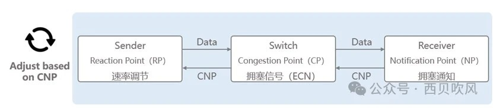
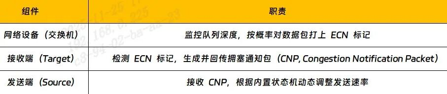
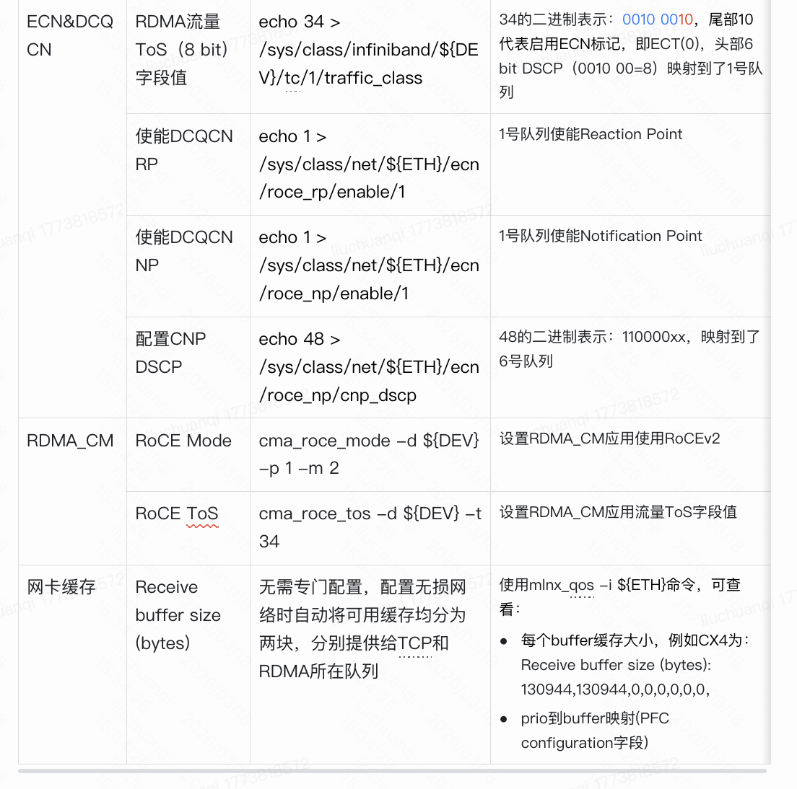
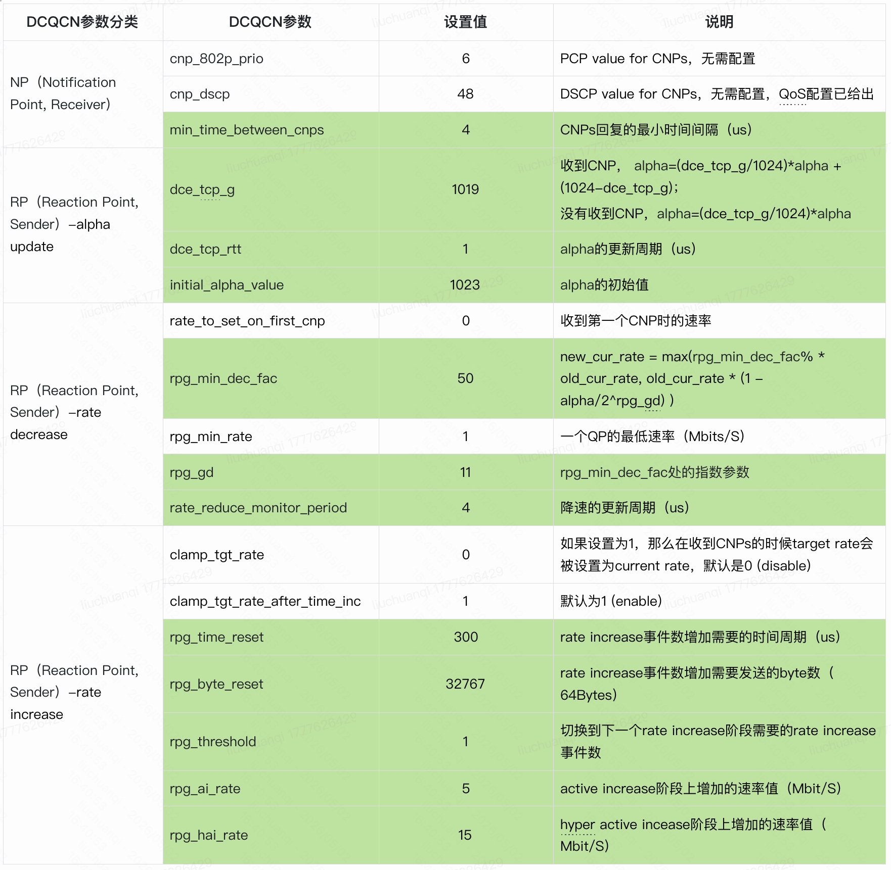
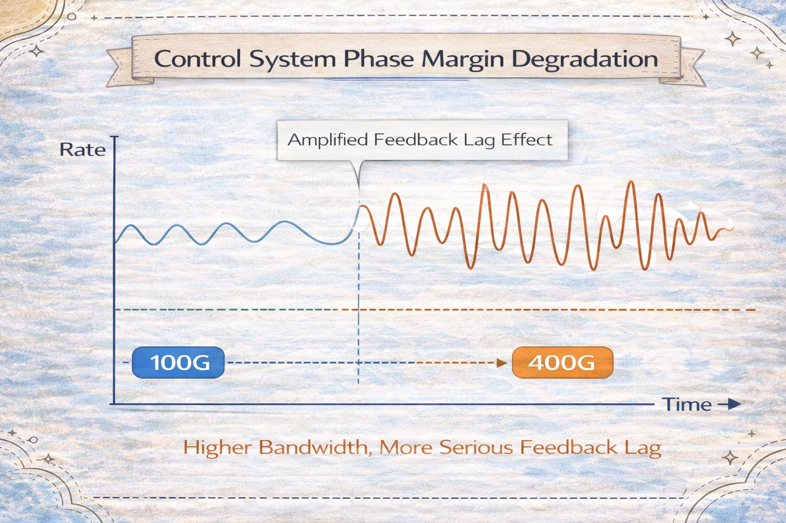
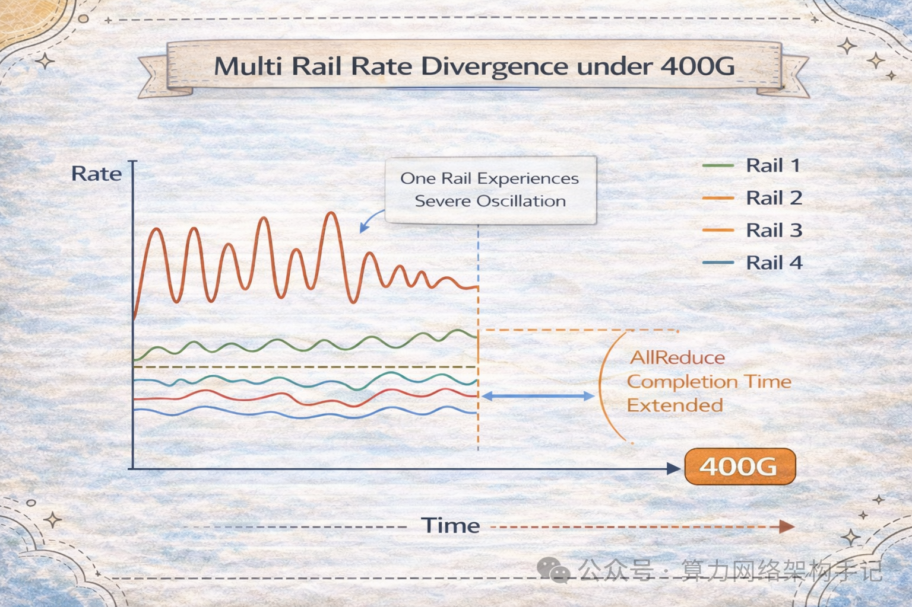
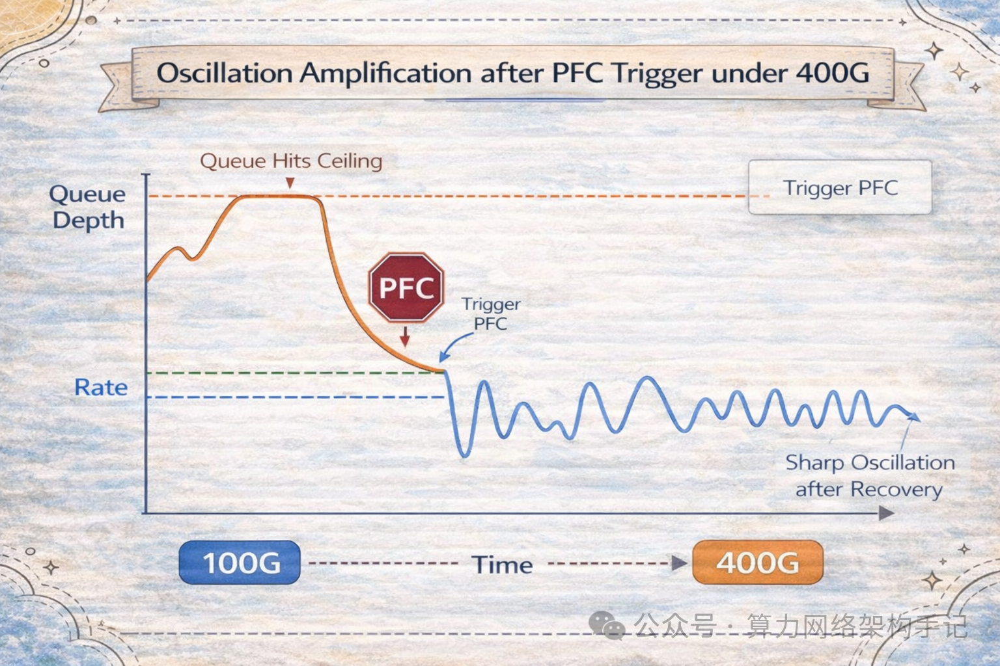

```table-of-contents
```

# DCTCP

DCTCP（Data Center TCP）是专为**数据中心网络**设计的 TCP 变种，由微软研究院在 2010 年提出，它的核心目标是解决传统 TCP（如 Reno, CUBIC）在数据中心环境下遇到的两个主要问题：

1. **高吞吐量与低延迟的矛盾**：传统 TCP 为了填满大带宽管道，往往需要维持很大的发送窗口，这会导致交换机缓冲区排队，增加延迟。
2. **对突发流量的适应性差**：数据中心流量具有极强的突发性（Incast），传统 TCP 的“锯齿状”窗口调整（AIMD）反应太慢或太剧烈，导致带宽利用率波动大。


## DCTCP核心思想

DCTCP 的关键创新在于**利用 ECN (Explicit Congestion Notification) 进行精细化的拥塞感知，而不是依赖丢包**。

1. **交换机侧 (ECN 标记)**：
    
    - 交换机设置一个较低的队列阈值 KK 。
    - 当队列长度超过 KK 时，交换机对所有进入的数据包打上 ECN 标记（概率通常为 100%，即硬阈值）。
    - 这与传统 RED/ECN 不同，传统方式是在最小和最大阈值之间概率标记，而 DCTCP 追求的是**精确反映拥塞程度**。
2. **接收端 (反馈)**：接收端会统计一个RTT内被标记的包的比例，并反馈给发送端。
    
    - 接收端收到带 ECN 标记的包后，在 TCP ACK 中通过 ECE (ECN-Echo) 标志位告诉发送端：“我收到了拥塞标记”。
    - DCTCP 接收端会统计一段时间内收到的 ECN 标记比例 αα (0 到 1 之间)。 αα 越大，说明网络拥塞越严重。

3. **发送端 (速率调整)**：
    
    - 发送端根据 αα 值**平滑地**调整拥塞窗口 (cwnd)。
    - 公式大致为： cwndnew=cwndold×(1−α2)cwndnew​=cwndold​×(1−2α​) 。
    - **关键区别**：传统 TCP 一旦检测到拥塞（丢包或 ECN），直接将窗口减半（ β=0.5β=0.5 ），不管拥塞多轻微。而 DCTCP 如果只有 10% 的包被标记 ( α=0.1α=0.1 )，它只减少 5% 的窗口。这使得 DCTCP 能够**维持极低的队列长度**（因为阈值 KK 设得很低），同时保持极高的带宽利用率。


## 传统TCP和DCTCP

### 对比

传统 TCP 是为**广域网（WAN）** 设计的 “稳健型” 协议，**以丢包为拥塞信号、窗口（AIMD：加性增，乘性减）剧烈调整**；
DCTCP 是为**数据中心**量身定制的 “低时延型” 协议，**以 ECN 为拥塞信号、窗口平滑调整**；

|特性|传统 TCP (CUBIC / Reno)|DCTCP (Data Center TCP)|
|:--|:--|:--|
|设计目标|广域网 (WAN) 兼容性。假设网络延迟高、丢包随机、带宽波动大。|数据中心 (DC) 极致性能。假设网络延迟极低、带宽极大、丢包主要由拥塞引起。|
|拥塞信号来源|主要依赖丢包 (Packet Loss)。认为丢包=拥塞。ECN 仅作为辅助或未被充分利用。|完全依赖 ECN (显式拥塞通知)。利用交换机标记来感知拥塞，严禁依赖丢包。|
|响应机制|剧烈调整 (AIMD)。一旦检测到拥塞（丢包或 ECN），直接将发送窗口减半 (50%)，无论拥塞多轻微。|平滑调整 (Proportional)。根据拥塞标记的比例 ( $ \alpha $ ) 按比例微调窗口。拥塞轻则少降，拥塞重则多降。|
|队列管理目标|填满缓冲区。为了最大化利用长肥管道 (Long Fat Pipe)，倾向于维持较大的排队队列，导致高延迟。|维持低队列。目标是让交换机队列长度接近于零，从而获得超低延迟。|
|吞吐量稳定性|锯齿状波动。窗口在“增加”和“减半”之间大幅震荡，导致带宽利用率不稳定。|高度稳定。窗口调整平滑，能持续稳定地跑满带宽，无大幅震荡。|


**（1）拥塞检测机制对比**：
- **传统 TCP**：
    - 依赖**丢包**作为拥塞信号（如 Reno/CUBIC）
    - 随机丢包也会触发窗口剧烈收缩，导致吞吐震荡

- **DCTCP**：
    - 依赖 **ECN（显式拥塞通知）** 标记
    - 交换机队列超过阈值时打 ECN 标记，不丢包
    - 仅将 ECN 标记视为拥塞，忽略随机丢包，避免不必要的窗口下降


**（2）拥塞窗口调整策略**
- **传统 TCP**：
    - 丢包时窗口**直接减半**（如 Reno）或更激进收缩
    - 窗口变化剧烈，易引发吞吐抖动和时延尖峰
    
- **DCTCP**：
    - 计算**加权平均拥塞概率 α**（标记报文占比）
    - 平滑收缩窗口：`cwnd = cwnd * (1 - α/2)`
    - 窗口变化平缓，减少队列堆积，降低长尾时延


#### 传统 TCP (以 CUBIC 为例) 的工作流程

- **盲目探测**：它不断增大发送窗口直到网络“崩溃”（发生丢包）。
- **惩罚过重**：一旦丢包，它假设网络严重拥塞，立即将速度砍掉一半。
- **问题**：在数据中心这种微秒级延迟的网络中，缓冲区很小。传统 TCP 稍微一探头就会填满缓冲区导致丢包，然后又被罚停，导致**延迟高且带宽利用率忽高忽低**。

#### DCTCP 的工作流程

1. **交换机标记**：数据中心交换机配置一个很低的队列阈值 KK 。只要队列超过 KK ，交换机就给数据包打上 **ECN 标记**（而不是等队列满了再丢包）。
2. **接收端反馈**：接收端统计收到带标记包的比例，计算出拥塞程度 αα (0.0 ~ 1.0)。
    - 例如： α=0.1α=0.1 表示 10% 的包遇到了轻微拥塞。
    - 例如： α=0.9α=0.9 表示 90% 的包遇到了严重拥塞。
3. **发送端微调**：发送端根据 αα 调整窗口：
```
新窗口=旧窗口×(1−α2)新窗口=旧窗口×(1−2α​)
```
4. **结果**：发送端能精确感知网络负载，将队列长度死死控制在阈值 KK 附近，既不让队列积压（低延迟），又不让链路空闲（高吞吐）。

### 为什么 DCTCP 不能在公网 (WAN) 使用


**（1）依赖全网 ECN 支持**：
DCTCP 要求路径上的**每一个路由器/交换机**都支持并正确配置 ECN 标记。公网设备异构复杂，很多老旧设备不支持 ECN 或直接丢弃带 ECN 标记的包，导致 DCTCP 失效甚至性能更差。

 **（2）RTT 差异**：公网 RTT 变化巨大且较长，DCTCP 的快速反馈机制在长延迟下可能不稳定。


## DCTCP 与 DCQCN 的关系

**DCQCN 是 DCTCP 思想在RoCEv2 领域的“继承者”和“增强版”，但它结合了 QCN (Quantized Congestion Notification) 的机制以适应无损网络的需求。**

```bash
DCTCP：TCP 世界的数据中心拥塞控制
DCQCN：RDMA 世界的 DCTCP
```

|特性|DCTCP|DCQCN|
|:--|:--|:--|
|传输协议|TCP (运行在操作系统内核或用户态栈)|RoCEv2 (运行在网卡硬件固件中，绕过 OS)|
|网络类型|有损网络 (Lossy)。允许少量丢包，靠 TCP 重传保证可靠。|无损网络 (Lossless)。严禁丢包，依赖 PFC 防止丢包。|
|反馈机制|利用 TCP ACK 中的 ECE 标志位带回拥塞信息。|利用专门的 CNM (Congestion Notification Message) 报文带回拥塞信息。|
|控制对象|调整 TCP 拥塞窗口 (cwnd)。|调整网卡硬件的发送速率 (Rate)。|
|配合机制|不需要 PFC。|必须配合 PFC 作为防丢包的最后一道防线。|
|主要目标|降低 TCP 流的延迟，提高吞吐量。|在保证零丢包的前提下，实现 RDMA 的低延迟和高吞吐，避免 PFC 风暴。|


# DCQCN
DCQCN 是为了解决 RoCEv2 依赖 **PFC** 带来的 HOL 阻塞和拥塞扩散问题。它将拥塞控制的责任从 L2 转移到了 **端到端** 的 HCA 传输层算法。

==RDMA 使用 InfiniBand (IB) 时，不使用 DCQCN。 DCQCN 是 RoCEv2 专用的拥塞控制机制，不适用于 InfiniBand==。

## 为什么需要DCQCN
### PFC的问题

PFC 存在 Deadlock、Storm 等问题的本质是==无法精确管理每条 Flow==，**只能粗暴的关闭流量，而不能动态调整发送速率**。
另外，由于 PFC 会上下游网络设备之间的层层反压，所以在大规模 Lossless Network 中，效率很低。


因此，PFC 往往还需要结合更高效的拥塞控制算法，例如：ECN、DC-QCN 等，在不同的业务场景中采用合适的算法是重中之重。

## 为什么 IB 不需要也不支持 DCQCN？

**DCQCN**（Data Center Quantized Congestion Notification）是 **为 RoCE 在以太网上的无损传输设计的**，包含三部分：

5. **ECN 标记**（交换机在 IP 头标记拥塞）
6. **CNP 通知**（接收方发回拥塞通知包）
7. **速率控制**（发送方用 AIMD 算法降速）

> **IB 不需要这些**，因为：
> - IB 是 **原生无损网络**，通过 **Credit-Based Flow Control** 防止 buffer 溢出。
> - IB 交换机使用 **FECN/BECN**（Forward/Backward ECN）机制，**不需要 IP 头**。
> - IB 不走 UDP/IP，**无法使用 ECN（IP header bit）**。


## DCQCN工作层次：以太网的网络层（ECN） + IB的传输层（CNP）
DCQCN工作在以太网的网络层，以及IB的传输层。


### ECN（Explicit Congestion Notification，显式拥塞通知）

ECN 是 IP 层的一项扩展功能，允许网络设备在数据包头部标记拥塞状态，而非直接丢包。

- 标记阶段：当交换机检测到出端口队列长度超过预设阈值时，将经过的数据包的 IP 头部中的 ECN 位设置为“CE”（Congestion Experienced）。

- 反馈阶段：接收端识别到被标记的包后，在返回的确认报文（如 TCP ACK 或 RoCEv2 的 CNP）中携带拥塞信息。

- 调速阶段：发送端接收到拥塞信号后，主动降低发送速率，避免进一步加剧网络压力。


# CNP

CNP (Congestion Notification Packet)：

## 格式


如上所示：BTH头中：OPcode（1B） 为 129（0x81）。

CNP 是 RoCEv2（基于 UDP / IP）上的一个特殊控制报文，不属于 TCP/IP 标准协议，所以它的“格式”主要体现在：
- 以 **UDP over IPv4/IPv6** 为承载
- **UDP 目的端口为 4791（RoCE v2）**
- **RoCEv2 BTH 头中 opcode = 0x81（CNP）**
```bash
┌────────────┐
│   Ethernet │
└────────────┘
┌────────────┐
│   IP (v4/v6)│
└────────────┘
┌────────────┐
│   UDP Header│   Src Port = 任意
│             │   Dst Port = 4791
└────────────┘
┌────────────┐
│  RoCE BTH   │ <── 关键字段：opcode = 0x81 表示 CNP
└────────────┘
┌────────────┐
│   no payload│   （CNP 不带 payload）
└────────────┘
```


范例如下：


### CNP opcode 对照表（RoCE）

|名字|opcode|解释|
|---|---|---|
|SEND|0x0–0x0B|正常 RDMA 发送|
|RDMA READ|0x0C–0x0F||
|RDMA WRITE|0x10–0x17||
|**CNP**|**0x81**| 拥塞通知|
|ACK/NACK|0x80||

## 特点
CNP报文的设计目标是快速、明确地通知拥塞，因此具有以下特点：

- **明确的拥塞信号 (Explicit Congestion Signal):** 它不依赖于丢包或时延变化来推断拥塞，而是由接收端（看到ECN标记的报文）明确生成并发送的信号。
    
- **高优先级 (High Priority):** CNP报文通常被赋予较高的优先级，以确保它们能够快速到达发送端，使拥塞控制算法尽快生效。
    
- **低开销 (Low Overhead):** CNP报文的Payload极小，甚至为空，传输开销非常低。
    
- **基于ECN触发 (ECN-Triggered):** CNP的生成机制是：交换机在感知拥塞时对数据报文设置ECN标记，接收端收到带ECN标记的数据报文后，向对应的发送端发送CNP。
    
- **速率反馈 (Rate Feedback):** CNP报文直接导致发送端在DCQCN算法下降低其发送速率，而不是像TCP那样依赖慢启动和拥塞避免。

### 小结
CNP 的特点：
**（1）工作在RDMA传输层**
**（2）不携带Payload数据（只有 BTH）：这是为了快速通知，不浪费带宽**。
**（3）opcode = 0x81（唯一标识）：是判断 CNP 的核心依据**。
**（4）目的 QP = 引发拥塞的流的 QP：用于告诉 sender 哪个 QP 需要降速（基于流的限速）**。
**（5）走 RoCEv2（UDP 4791）通道**
**（6）基于 ECN 触发，不是基于队列溢出：区别于 PFC（基于 lossless + pause）**


## 传统的CNP
传统CNP（Congestion Notification Packet）拥塞通知方式的处理流程如下所示：


8. 转发设备DeviceA发现端口存在拥塞，因此在转发报文时给报文携带ECN拥塞标记（ECN字段置为11），以标示网络中存在拥塞。
9. 转发设备DeviceB收到报文后，发现报文的目的地址不是本机，则不对报文进行处理，正常转发给宿端服务器。
10. 宿端服务器收到报文后，发现报文中携带ECN拥塞标记（ECN字段为11），则知道网络中存在拥塞，因此向源端服务器发送CNP拥塞通知报文，以通知源端服务器进行流量降速。

从这里可以看出，拥塞发生点为DeviceA，但是对拥塞进行反馈的设备却是网络尾部的宿端服务器。过长的拥塞反馈路径使得源端服务器流量不能及时降速，从而导致转发设备缓存可能进一步拥塞恶化，甚至引发整网因PFC流控而暂停流量的发送。


## 快速CNP(fast-CNP)

快速CNP拥塞通知：在转发设备上使能**快速CNP**拥塞通知功能后，转发设备会在转发报文时将报文的信息记录在流表表项中，并在后续收到携带ECN拥塞标记的报文时，基于学习到的流表表项信息**直接向源端服务器发送CNP拥塞通知报文**，缩短了拥塞反馈路径，从而及时调整源端服务器的流速，缓解转发设备缓存的拥塞。

快速CNP（Congestion Notification Packet）拥塞通知方式的处理流程如下所示：


（1）转发设备DeviceA发现端口存在拥塞，因此在转发报文时给报文携带ECN拥塞标记（ECN字段置为11），以标示网络中存在拥塞。
（2）转发设备DeviceB收到报文后，发现报文中携带ECN拥塞标记（ECN字段为11），则知道网络中存在拥塞，因此向源端服务器发送CNP拥塞通知报文，以通知源端服务器进行流量降速。
（3）同时，转发设备DeviceB发现报文的目的地址不是本机，则将报文转发给宿端服务器。

### 源端服务器的过度降速问题
对于宿端服务器，收到携带ECN拥塞标记的报文，也会向源端发送CNP拥塞通知报文。对于DeviceA发出的同一份ECN拥塞标记报文，若DeviceB和宿端服务器都进行响应并向源端服务器发送CNP拥塞通知报文，则会引起源端服务器的过度降速。

此时可以通过如下方法进行解决：
（1）关闭宿端服务器对ECN拥塞标记报文的响应功能，使得宿端服务器收到ECN拥塞标记报文后，不向源端服务器发送CNP拥塞通知报文。
（2）在DeviceB上设置发送CNP拥塞通知报文的聚合时间，这样DeviceB收到下游发送的CNP拥塞通知报文时，会判断与其上一次发送CNP拥塞通知报文的时间差，若小于聚合时间，则丢弃从下游收到的CNP拥塞通知报文。

## CNP的调节机制

**CNP报文**（在DCQCN机制中）**不调节发送端的“拥塞窗口”（Congestion Window, CWND）。**
相反，CNP报文直接作用于发送端的**发送速率（Rate）**，也就是**发送限制器（Rate Limiter）**，而不是窗口大小。

### CNP如何利用目的QP（Destination QP）

CNP报文中的**目的QP (Destination Queue Pair Number)** 字段是必不可少的，但它的作用是**路由和识别**，而不是调节窗口：

**路由 (Routing):** 
CNP是由接收端（Reaction Point）生成的，它必须包含原始数据报文的发送端（即CNP的目的地）的QP和端口信息。这样，CNP才能被网络正确路由到生成拥塞的那个发送端主机。

 **识别流 (Flow Identification):** 
 发送端收到CNP后，通过检查这个QP，能够精确地知道哪个数据流（哪个QP）导致了拥塞，从而只对该特定的数据流应用速率降低惩罚。


### DCQCN的速率调节机制
CNP的作用是**触发速率降低**（Rate Control），而不是调节拥塞窗口（Window Control）。

当发送端收到一个CNP报文后，它会执行以下动作来降低速率：

2. **即时惩罚 (Multiplicative Decrease):** 发送端立即将其允许的发送速率 Rallow​ 乘以一个**惩罚因子 β**（例如 β=0.5），即：
```bash
R_new​=R_old​×β
```
  
3. **CNP抑制 (CNP Suppression):** 为了避免接收端在短暂拥塞期间发送过多的CNP导致发送端过度惩罚，DCQCN通常会采用一个**时间窗口**或**CNP计数器**来抑制后续的CNP，直到速率降低生效。
    
4. **速率增加 (Additive Increase):** 在没有收到CNP（即没有拥塞）时，发送端会像传统TCP一样，**缓慢地、线性地增加**其速率，直到达到带宽限制或再次触发拥塞。


## 存在的问题
### 大量异构的网卡和交换机
- **NIC 差异**：云基础设施不断发展，通常最新一代的服务器一次一个集群或一个机架进行部署。Region 内的不同集群可能使用不同的 NIC，每代 NIC 的 DCQCN 都有不同实现方式。当具有不同代差的 NIC 相互通信时，这会导致许多无法预期的行为。

- **交换机差异**：部署的交换机来自多个不同供应商，使用的 ASIC 和交换机操作系统都有所不同，这导致了运维成本的增加。可以考虑使用KNOS来统一操作系统，SAI来屏蔽底层的ASIC的差异。

#  DCQCN的原理

DCQCN只需要可以支持WRED和ECN的数据中心交换机（市面上大多数交换机都支持），其他的协议功能在端节点主机的NICs上实现。

DCQCN的拥塞控制过程中主要分为三部分：发送端（RP）调整流量发送速率，沿途转发交换机（CP）利用ECN标记报文携带网络链路的拥塞信息，接收端（NP）将收到拥塞标记通过CNP协议报文反馈给发送端。



## 角色：CP/NP/RP
%201.png)

DCQCN 定义了以下角色和功能定位：
**（1）RP（Reaction Point）**：Sender RNIC，负责根据拥塞通知调整发送速率。
**（2）CP（Congestion Point）**：Switch，负责检测拥塞并标记 ECN。
**（3）NP（Notification Point）**：Receiver RNIC，负责生成 CNP 并反馈给 Sender。


DCQCN 和 ECN 的核心区别是前者设计了一套复杂的量化数据算法，在 RP、CP、NP 三个维度进行精细化的参数调控。

**CP 算法**：与 DCTCP 算法相同，即：在出口队列中，如果队列长度超过阈值，则对到达的报文进行 ECN 打标，并根据实际情况调整 DCTCP 算法中定义的 Kmin、Kmax、Pmax 等参数。

**NP 算法**：当一个带有 ECN 标记的报文到达 NP 时，表示网络拥塞了，NP 生成 CNP，NP 算法则规定了生成 CNP 的方式和时间。

**RP 算法**：当 CNP 到达 RP 时，就开始根据 RP 算法中定义的降低公式 new_rate = old_rate * (1 - α/2) 进行降速和后续的恢复。其中 α是可动态调整的降速因子。

## DCQCN

DCQCN 是专为 RoCEv2 设计的先进拥塞控制算法，融合了 ECN 的思想，并引入**量化反馈**与**动态速率调整**机制，形成一个完整的闭环控制系统。

DCQCN 的三大核心组件：



### 发送端的状态机行为

快速收敛（Fast Convergence）：收到 CNP 后，立即大幅降低发送速率，迅速缓解拥塞。
主动恢复（Gradual Recovery）：在未收到新 CNP 的时间段内，以线性速率逐步提升发送速度，试探可用带宽。
主动探测（Proactive Probing）：若长时间无拥塞信号，则以指数级增速抢占空闲带宽，最大化资源利用率。
通过这种自适应、动态响应的机制，DCQCN 实现了在**避免拥塞的同时，持续逼近网络带宽极限**，显著提升整体效率。


# DCQCN的优缺点
## 优势

### 基于流的拥塞控制
**基于流的拥塞控制**：实现了基于流的拥塞控制。

### 分布式控制
**分布式控制**：引入了分布式控制的思想，允许数据中心网络中的交换机独立地进行拥塞检测和控制，这种分布式方法可以更好地适应大规模网络的动态性和异构性；


## 劣势
### 需要PFC配合使用（RoceV2+PFC+DCQCN)
DCQCN 通常与 PFC 配合使用（PFC 负责链路级流控防止丢包，DCQCN 负责端到端速率控制）。如果 DCQCN 反应不够快或配置不当，队列仍会填满触发 PFC，进而可能引发 PFC 相关的头阻塞（HOL Blocking）、死锁或风暴问题。DCQCN 并不能完全替代 PFC，只是减少了 PFC 触发的频率。

### 参数调优复杂

**参数敏感**：DCQCN 的性能高度依赖于多个参数的配置，包括交换机上的 ECN 标记阈值（Kmin, Kmax）、最大标记概率（Pmax），以及网卡端的速率恢复参数（如 AI（增加因子）、MD（减少因子）、G（增益）等）。

**场景依赖**：不同的网络拓扑、流量模型（如 AI 训练中的 Incast 流量）需要不同的参数组合。缺乏通用的“最佳实践”，往往需要针对具体环境进行反复测试和调优。

**协同要求高**：DCQCN 需要交换机（支持 ECN 标记）和网卡（支持 CNM 报文生成和处理）的紧密配合，任何一端配置不当都会导致性能下降甚至失效。

### 端到端反馈延迟
**拥塞反应滞后、控制回环时间长**：
DCQCN是一个“感知-反馈-降速”的反应式控制环路，其响应速度受限于网络RTT（往返时间）; 
DCQCN 的工作流程是：交换机标记 ECN -> 接收端收到带标记的包 -> 接收端生成 CNP（Congestion Notification Packet）-> 发送端收到 CNP 并降速。这个闭环过程存在物理延迟（RTT）。在超大规模集群或长链路中，这个延迟可能导致拥塞控制在高速率下显得“迟钝”，无法完全避免微突发（Micro-burst）导致的丢包或延迟抖动。

### 公平性问题
**多流竞争下的不公平**：虽然 DCQCN 旨在解决 PFC 的不公平性，但在某些复杂的流量模式下（例如长短流混合、不同 RTT 的流竞争），DCQCN 仍可能出现带宽分配不公平的情况。长 RTT 的流（跨越更多交换机）收到拥塞信号的延迟更大，可能导致其在降速前占据了过多缓冲区，挤占了短 RTT 流的带宽。

**Incst 场景挑战**：在典型的“多对一”（Incast）流量场景中，大量发送方同时向一个接收方发送数据，即使有 DCQCN，交换机缓冲区的瞬时压力也可能导致部分流被过度抑制，而其他流未能及时降速。即：在“多对一”的聚合场景中，DCQCN 有时难以协调成百上千个发送方的速率，导致部分发送方过度降速，而另一些则抢占带宽，造成整体吞吐下降。

### RDMA traffic 与 TCP traffic 共存问题

RoCEv2 网络中如果混合：
```bash
RDMA
TCP
```

会出现问题：
- RDMA → DCQCN
- TCP → TCP congestion control

两个控制逻辑完全不同：
```bash
RDMA aggressive
TCP conservative
```
有可能导致TCP流量饿死的问题。

### 硬件依赖与兼容性

**专用硬件支持**：
DCQCN 的高效运行依赖于支持 ECN 标记的智能网卡（SmartNIC，如 NVIDIA Mellanox CX 系列）和支持 DCB/ECN 的数据中心交换机。老旧设备或不支持完整 DCB 协议栈的设备无法有效部署 DCQCN。

**异构网络困难**：
DCQCN 没有严格标准，缺乏统一规范，比如：Mellanox、Broadcom、Intel 不同厂商实现不同。
在混合了不同厂商设备或部分不支持 DCQCN 的节点的网络中，难以实现全局一致的拥塞控制策略，可能导致性能瓶颈。


### 对 ECN 标记的依赖性：静态阈值的局限性 vs. 动态流量模型

DCQCN 依赖 switch ECN marking。典型要求：`ECN threshold < PFC threshold`；否则：PFC先触发，DCQCN来不及控制。但是：
```bash
- buffer size 不同
- topology 不同
- traffic pattern 不同
```
ECN的阈值很难统一配置。

现代数据中心流量极其复杂（混合了长流、短流、Incast、Outcast），且随时间动态变化。一套**静态参数**无法适应所有场景。

**标记滞后性**：DCQCN 依赖交换机在队列长度超过阈值时标记 ECN。如果阈值设置过高，拥塞发生后才标记，反应不够及时；如果设置过低，可能导致过早降速，带宽利用率不足。

**标记粒度问题**：ECN 标记是基于队列长度的概率标记，对于突发性极强的流量（如大模型训练中的梯度同步），可能无法精确反映瞬时拥塞程度，导致控制不够精准。

# DCQCN与PFC的协同配置

在实际的RoCE网络中，PFC和DCQCN是同时启用、协同工作的。==PFC 与 DCQCN 并非互斥，而是互补协同，形成“主动预防 + 被动兜底”的双重保障体系==。
==DCQCN 像是智能导航系统，提前规划最优路线、避开拥堵；PFC 则像紧急刹车系统，在即将追尾时果断介入，确保安全==。只有两者协同运作，才能真正实现端到端的无损通信。


**瞬时微突发**： 当网络中出现短暂的流量突发时，交换机缓冲区可能瞬间被填满。此时，PFC会迅速介入，触发暂停机制，防止了丢包。这是“治标”，解决了瞬时问题。

**持续拥塞**： 如果拥塞是持续性的（例如多个服务器同时向一个目标发送大量数据），PFC会反复被触发。虽然它防止了丢包，但并没有解决根本问题。拥塞还在持续，缓冲区始终很高，最终导致延迟增加。

**DCQCN根除拥塞**： 就在PFC工作的同时，交换机也检测到了持续的拥塞（高队列深度）。它开始给数据包打ECN标记。接收端生成CNP，CNP通知发送端降低速，DCQCN机制随后被激活，交换机队列深度开始下降，拥塞根源得到缓解。随着DCQCN发挥作用，网络中的拥塞被消除，交换机缓冲区水位下降。PFC检测到队列低于阈值，便会发送“解除暂停”的信号，链路恢复正常传输。

DCQCN与PFC的协同工作，构成了现代RDMA数据中心网络拥塞管理的黄金标准。它们并非简单的替代关系，而是相辅相成、各司其职的完美搭档：PFC在链路层提供毫秒级的无损保障，果断处置瞬时突发，为高性能应用守住“零丢包”的生命线；而DCQCN在端到端层面实施精细化的速率调控，从源头化解持续拥塞，确保了网络整体的高效与公平。

## 为什么DCQCN要搭配PFC?

DCQCN：拥塞控制，目标：避免交换机队列过长。本质：rate control，它的目标不是 保证不丢包。
PFC：防止丢包，解决的是：交换机 buffer 满；本质：link-level backpressure，也就是防止丢包。

### PFC 的价值与局限(为什么不能只要 DCQCN)

**应对瞬时微突发**：网络流量存在大量不可预测的微突发（Micro-burst）。当一瞬间海量数据涌入交换机，导致缓存即将溢出时，**DCQCN根本来不及反应（DCQCN的反馈时间长）**。这时，PFC的PAUSE暂停帧会在微秒级内立即触发，强制上游设备暂停发送，从而守住“零丢包”的底线。对于依赖无损网络的RDMA来说，任何一次丢包都会导致巨大的性能惩罚，这是不可接受的。
> 注：==DCQCN 无法应对瞬时微突发，因此需要PFC==。

**作为DCQCN失效的兜底**：DCQCN是一个端到端的反馈机制，存在端到端反馈滞后。从拥塞发生、ECN标记、接收端生成CNP，再到发送端降速，这个闭环需要时间。在这个时间窗口内，PFC是唯一能防止缓存溢出的机制。正如DCQCN的原始论文所强调的：“PFC仍然是必需的，需要使用PFC做兜底来避免丢包”。

**优势**：==响应迅速（微秒级）==、控制精准，是实现==零丢包==最直接有效的手段。

**挑战**：若未合理配置，可能引发==队头阻塞（Head-of-Line Blocking）或PFC 风暴==——即暂停信号沿链路上游传播，造成级联式流量冻结，最终影响整体网络吞吐。

因此，==PFC的作用是**治标**，它是一个“粗暴”但**即时生效**的保底机制。==。

### DCQCN 的价值与局限(为什么不能只要 PFC)

PFC的队头阻塞，以及死锁问题，以及PFC Storm问题。


### 两者的配合以及对比（DCQCN 为主，PFC 为辅）

|特性|PFC (Priority Flow Control)|DCQCN (Data Center Quantized Congestion Notification)|
|:--|:--|:--|
|作用层级|链路层 (Layer 2)|传输层/端到端 (Layer 3/4 逻辑)|
|触发条件|交换机端口队列长度达到阈值（即将溢出）|交换机检测到拥塞并标记 ECN，接收端回传 CNM|
|反应速度|极快 (微秒级)。直接暂停上游邻居端口的发送。|较慢 (毫秒级)。依赖 RTT 往返时间来传递拥塞信号。|
|控制范围|逐跳 (Hop-by-Hop)。只影响直接相连的上游设备。|端到端 (End-to-End)。通知源端网卡降低发送速率。|
|主要目的|防止丢包（最后一道防线）。确保缓冲区不溢出。|消除拥塞根源。通过降低源端速率，减少进入网络的流量，从而避免触发 PFC。|
|副作用|可能导致头阻塞 (HOL Blocking)、死锁、风暴。|配置复杂，存在反馈延迟。|


目前的最佳实践是 **“DCQCN 为主，PFC 为辅”**：
- **正常情况**：DCQCN 实时监控网络状态，动态调整发送速率，使得网络始终处于“拥塞但未满”的状态。此时 **PFC 几乎不会被触发**（PFC 帧的数量接近于零）。
- **异常情况**：当出现突发的**微突发**或 DCQCN 反应不及的瞬间，队列长度触顶，PFC 立即介入，强行暂停上游发送，保住数据包不丢失。
- **恢复**：一旦队列水位下降，PFC 解除暂停，DCQCN 继续维持合理的速率。


### RoceV2为什么怕丢包

核心矛盾：RDMA 的“零丢包”要求 vs. 以太网的“尽力而为”

**(1) RDMA 的基因**：
RDMA（远程直接内存访问）设计的初衷是让 CPU 绕过操作系统内核直接进行数据传输。==为了简化网卡（NIC）硬件逻辑并降低延迟，传统的 RDMA 协议（包括 RoCEv2）假设底层网络是绝对可靠的（Lossless）==。
- RoCEv2 网卡硬件通常没有实现复杂的 TCP 重传机制（如快速重传、选择性确认 SACK 等）。
- 一旦数据包丢失，RoCEv2 协议栈的处理代价极高：通常需要超时重传（Go-Back-N 机制），这会触发上层应用感知到的巨大延迟抖动，甚至导致 QP（Queue Pair，队列对）进入错误状态并断开连接。


**(2)以太网的本性**：
标准以太网是“尽力而为”（Best-Effort）的。当交换机缓冲区满时，默认行为就是**丢包**。

**结论**：如果没有一种机制在缓冲区满之前强行停止发送，数据包就会丢失，进而导致 RDMA 业务崩溃。

### 小结
如果说 **PFC 是“被动防御”**，那么**DCQCN拥塞控制就是“主动预防”**。它的目标是在网络尚未发生严重拥塞之前，提前调节流量，维持网络健康状态。

通过各种优化参数配置，DCQCN能实现很好的端到端拥塞控制效果，既能保证吞吐，和业务低时延。
但是，DCQCN并不能消除对PFC的依赖，仍需要使用PFC做来避免丢包，只是==DCQCN会大大降低PFC发生的频率==。

- **日常调速（DCQCN）：** 
DCQCN 持续进行 **端到端的速率调整**，努力将网络流量控制在一个健康的水平，减少拥塞和微突发的发生，这是 **常态** 的、**慢速** 的管理。

- **紧急刹车（PFC）：** 
 当网络中出现 瞬时、不可预测的**微突发流量** ，交换机缓冲区在 DCQCN 反应过来之前瞬间饱和时，**PFC 会迅速介入**，触发 PAUSE 机制，**紧急刹车**，确保 **零丢包** 的绝对无损目标。

- **DCQCN 消除副作用：** 
PFC 触发后，虽然避免了丢包，但可能引起线头阻塞。DCQCN 随后接收到 CNP 或 ECN 信号，会开始降低发送速率，**从源头解除拥塞**，从而尽快让 PAUSE 状态解除，**消除 PFC 带来的负面影响**。


## RoceV2+PFC+DCQCN的配置

DCQCN 的设计理念是在拥塞时通过 ECN 让发送端降低传输速率，从而尽量避免触发 PFC，因为 PFC 被触发，发送流量会完全停止，DCQCN 需要考虑如下两个关键点：
（1）确保 PFC 不会太早触发：即先使用 ECN 发送拥塞反馈使流量变慢。
（2）确保 PFC 不会太晚触发：PFC防止丢包，拥塞较严重产生缓冲区溢出进而出现丢包。


通过合理设置下面三个参数，可以满足上述需求：

**Headroom Buffers（防缓冲区溢出丢包）**：发送至上游设备的 PAUSE 消息需要一些时间到达并生效。为避免丢包，PAUSE 发送方 必须保留足够的缓冲区，以处理在此期间可能收到的任何数据包。这包括发送 PAUSE 时正在传输的数据包，以及上游设备在处理 PAUSE 消息时发送的数据包。

**PFC Threshold（向上游发送PFC）**：这是一个==入口阈值==。当到达该阈值时，会向上游发送 PFC PAUSE 报文。

**ECN Threshold**：这是一个==出口阈值==。ECN 阈值等于 WRED 开始填充级别值。一旦出口队列超过此阈值，交换 机将开始为该队列中的数据包进行 ECN 标记。DCQCN 要有效，此阈值必须低于入口 PFC 阈值，以确保 PFC 不 会在交换机有机会使用 ECN 标记数据包之前触发。设置非常低的 WRED 填充级别可提高 ECN 标记概率。例如， 使用默认共享缓冲区设置，WRED 开始填充级别为 10% 可确保标记无丢失数据包。但是，如果填充级别较高，则 ECN 标记的概率降低。

### ECN水线(ECN_Min/ECN_Max)配置在发送队列， PFC水线(XOFF/XON)配置在接收队列


# DCQCN的配置以及查看

## 交换机侧的参数配置

## 主机侧的参数配置
### TI 和 TD
在 RoCEv2 的 DCQCN 中，**TI（Increase Timer）** 和 **TD（Decrease Timer）** 是控制发送速率“加速 / 减速节奏”的两个关键时间参数，本质上是**发送端速率调整的节拍器（pacing timers）**。

DCQCN 在发送端（Reaction Point, RP）实现速率控制，核心逻辑是：**收到 CNP → 降速 → 无拥塞时回升**。
DCQCN 的核心目标是：**既要快速响应拥塞（降速），又要平滑恢复（升速）**；其中：TD 负责“快速刹车”，TI 负责“慢慢加速”。



####  TI — Rate Increase Timer（速率增加计时器）

TI 是发送端（Reaction Point, RP）在**没有收到 CNP** 时周期性触发速率上调的时间间隔。每隔 TI 时间（或每发送 B 字节，二者取其先），RP 就执行一次速率增加。

速率增加分两个阶段，TI 均作为触发周期：
- **Fast Recovery (FR)**：刚发生降速后，快速恢复到目标速率 Rt（接近降速前）
- **Active Increase (AI)**：进入稳态后，以固定步长 Rai 线性加速

- TI 控制：**多久尝试“加速”一次**
- 触发条件：当前没有明显拥塞（或拥塞已经缓解）
- 行为：
    - 周期性地 **增加发送速率**
    - 类似 TCP 的 additive increase（但 DCQCN 更复杂）

直观理解：TI 决定“多久踩一脚油门”

#### TD —Rate Decrease Timer（降速降低计时器）

TD 是两次连续降速之间的**最短时间间隔**。收到第一个 CNP 触发降速后，在 TD 时间内即使再次收到 CNP，也**不会再次降速**。
这是因为一次拥塞事件会在 RTT 内产生多个 CNP 副本，若不设保护窗口，同一个拥塞会造成多次叠加降速，速率会被打到极低。

- TD控制：**多久执行一次“减速响应”**
- 触发条件：收到 **CNP（Congestion Notification Packet）**
- 行为：
    - 周期性地 **降低发送速率**
    - 避免一次 CNP 就连续疯狂降速（节流）

直观理解：TD 决定“刹车动作的频率上限”

#### 两者配合

|阶段|TI 的作用|TD 的作用|
|---|---|---|
|CNP 到来|暂停增速，等 FR 阶段完成|开启保护窗口，屏蔽后续重复 CNP|
|FR 阶段|每隔 TI 触发一次快速步进|TD 窗口内不允许再次降速|
|AI 阶段|每隔 TI 累加 Rai|TD 过期后才允许下次降速|

TI 和 TD 不是对立的，而是： **构成一个“负反馈控制系统”**
TI和TD类似于AIMD，可以类比控制论：
- TD = 快速负反馈（抑制系统发散）
- TI = 慢速正向恢复（提高利用率）

#### 常用配置
通常推荐 `TD ≈ RTT`（数据中心内约 1–4 μs）；

- TD：μs 级（快速）
- TI：几十 μs ~ ms 级（慢恢复）


## 端上的配置
### 主机侧QOS配置



（1）为TCP流量，RDMA流量，CNP包设置了不同的队列  （CNP是反馈拥塞的包，需要及时的反馈给发送端，担心被RDMA大象流对头阻塞，设置单独的队列）
（2）设置RDMA流量的TOS值
（3）设置RDMA流量所在队列的PFC enable
（4）设置RDMA流量所在队列的 DCQCN的NP/RP 使能；

### 主机侧的DCQCN配置



#### 范例
参数分两类：
- `roce_rp/*` → 控制“怎么调速”
- `roce_np/*` → 控制“多久发一次CNP”

```bash
# DCQCN优化参数；
# 策略：减少反馈（CNP） + 加速更猛 + 降速更轻
## 适合于：
- 网络 buffer 足够大
- ECN 阈值合理
- 追求吞吐（throughput > latency）

echo 1 > /sys/class/net/$eth/ecn/roce_rp/enable/1  
echo 1 > /sys/class/net/$eth/ecn/roce_np/enable/1  
echo 64 > /sys/class/net/$eth/ecn/roce_np/min_time_between_cnps  // 两次发送 CNP 的最小时间间隔
echo 15 > /sys/class/net/$eth/ecn/roce_rp/rpg_ai_rate   // 每次“加速阶段”（TI触发）增加多少速率(ai: additive Increase)
echo 150 > /sys/class/net/$eth/ecn/roce_rp/rpg_hai_rate // “高速阶段（hai: Hyper Additive Increase）”的加速速率（比 ai_rate 更猛）
echo 80 > /sys/class/net/$eth/ecn/roce_rp/rpg_min_dec_fac # 最小降速比例（Minimum Decrease Factor, 单位 %）,需要<100; 值越大 → 降速越“温和”.  比如：80，意味着 降到 80%（降得少）

```

把整个系统想成开车：

|参数|对应|
|---|---|
|ai_rate|油门踩多少|
|hai_rate|地板油|
|min_dec_fac|刹车踩多狠|
|min_time_between_cnps|刹车提醒频率|


## 查看
### mlnx_qos
```bash
#查询QoS
mlnx_qos -i ${ETH}
#示例:
$ mlnx_qos -i eth05
DCBX mode: OS controlled
Priority trust state: dscp
dscp2prio mapping:
        prio:0 dscp:07,06,05,04,03,02,01,00,
        prio:1 dscp:15,14,13,12,11,10,09,08,
        prio:2 dscp:23,22,21,20,19,18,17,16,
        prio:3 dscp:31,30,29,28,27,26,25,24,
        prio:4 dscp:39,38,37,36,35,34,33,32,
        prio:5 dscp:47,46,45,44,43,42,41,40,
        prio:6 dscp:55,54,53,52,51,50,49,48,
        prio:7 dscp:63,62,61,60,59,58,57,56,
default priority:
Receive buffer size (bytes): 20016,156096,0,0,0,0,0,0,
Cable len: 7
PFC configuration:
        priority    0   1   2   3   4   5   6   7
        enabled     0   1   0   0   0   0   0   0   
        buffer      0   1   0   0   0   0   0   0   
tc: 0 ratelimit: unlimited, tsa: ets, bw: 30%
         priority:  0
tc: 1 ratelimit: unlimited, tsa: ets, bw: 70%
         priority:  1
tc: 2 ratelimit: unlimited, tsa: ets, bw: 0%
         priority:  2
tc: 3 ratelimit: unlimited, tsa: ets, bw: 0%
         priority:  3
tc: 4 ratelimit: unlimited, tsa: ets, bw: 0%
         priority:  4
tc: 5 ratelimit: unlimited, tsa: ets, bw: 0%
         priority:  5
tc: 6 ratelimit: unlimited, tsa: strict
         priority:  6
tc: 7 ratelimit: unlimited, tsa: strict
         priority:  7
```

# 400G 时代 DCQCN 开始接近物理极限
在 100G 时代，DCQCN 是可调的。在 400G 时代，DCQCN 开始变得“脆弱”。
不是参数不好。不是网卡不行。而是： **带宽提升 4 倍，但物理约束没有同步线性扩展**。
很多人没意识到：DCQCN 不是抽象算法。它是一个：**建立在物理传播延迟、buffer 容量、反馈周期之上的控制系统**。
当带宽跨越 400G，控制系统的**稳定区间开始变窄**。

## 原因分析
### 第一道物理墙：BDP 暴涨
我们先看一个最基础的公式：带宽时延积BDP = 带宽 × RTT

假设：
```bash
- RTT = 8μs（典型单层 spine 结构）
- 带宽 100G → 400G
```
那么 BDP 直接放大 4 倍。这意味着：在反馈信号回来之前，链路上已经飞出去 4 倍的数据。

DCQCN 是基于反馈的控制系统。反馈没有变快。但数据飞得更多。这会导致：
```bash
- ECN 标记滞后
- CNP 到达时已过冲
- 队列深度瞬间暴涨
```

### 第二道物理墙：交换机 Buffer 没有 4 倍增长
很多人以为：带宽 4 倍，buffer 也会 4 倍。
现实是：
```bash
- 单芯片 buffer 增长有限
- 每端口分配 buffer 更少
- 端口数还在增加
```

在 400G 时代：单端口可用 buffer 可能反而下降。而 AI 流量是 Incast。
Incast 的瞬时队列深度和`fan-in × BDP` 强相关。

当：BDP 变大，但buffer 没变大；结果是：ECN 窗口被压缩到极窄。
这会直接导致：
```bash
- 调参空间变小
- 稍微不对就触发 PFC
```


### 第三道物理墙：控制反馈周期没有变短

DCQCN 依赖以下流程：
5. 交换机标记 ECN
6. 接收端生成 CNP
7. CNP 返回发送端
8. 发送端调整速率

这个闭环延迟是：
```bash
≈ RTT + NIC 处理时间
```

400G 并没有缩短 RTT。甚至在大规模 fabric 下：
- 拓扑更大
- 路径更复杂

控制周期不变。但单位时间注入数据暴涨。结果是：控制系统从“轻微过冲”变成“剧烈震荡”。在控制理论里，这叫：相位裕量下降。


### 第四道墙：多 Rail 并发放大不一致性

在 400G 时代，常见形态是：8 卡 8  × 400G；每个 rail 是独立 DCQCN 控制。
问题是： DCQCN 是 per-QP 控制，不是全局协调控制。

当带宽极高时：
- 小小 α 差异
- 小小恢复时间差

都会在极短时间内放大。结果是：
- rail 速率分化
- chunk 完成时间分裂
- rank consistently slower

这在 100G 时代不明显。在 400G 时代会直接变成：iteration variance



### 第五道墙：PFC 在 400G 下更具破坏性
在 100G 时代：PFC 一次 pause，代价还能接受。

在 400G 时代：
- 单位时间内冻结的数据量更大
- Incast 更猛烈
- pause 恢复后的速率震荡更剧烈

而且：PFC 与 DCQCN 是耦合的。一旦进入 pause：
- DCQCN α 继续变化
- 速率恢复节奏被打乱
- 系统进入混沌区

在高带宽下：PFC 不再是保护机制，而是放大器。



## 真正的极限在哪里？
当：
- BDP 接近或超过可用 buffer
- ECN 窗口接近 0
- 控制周期无法缩短
- Incast fan-in 继续增加


DCQCN 就会进入一个状态：可调空间接近消失。你会发现：
- 调 g 不对
- 调 ECN 不对
- 调恢复时间也不对

因为你已经触碰物理边界。这不是参数问题。这是：控制系统的BDP极限。

## 未来发展
400G 时代暴露的问题说明：传统基于反馈的拥塞控制正在接近极限。

未来方向可能是：
- 更智能的速率预测
- 更细粒度的 per-flow 控制
- 更大的 on-chip buffer
- 更低延迟 fabric
- **主动拥塞避免**而非**被动反馈**

也就是说：从“反应式控制”走向“预测式控制”。

## 小结
400G 不是简单的带宽升级。它是一次控制系统的压力测试。DCQCN 没有变差。只是：它正在接近它的物理边界。
当带宽继续上升到 800G、1.6T，如果控制模型不变，我们面对的将不是“优化问题”，而是体系结构问题。


# 大厂实现

总结：AZ级通用RDMA场景大多采用window-based的拥塞控制算法，除了高性能，低延时（低平均延时，低P99）之外，还要具备多路径快速切换，以及更高级别的路径逃生能力。
当前国内实现AZ级RDMA的公司目前只有腾讯，使用自研window拥塞控制算法HARP加自研网卡+内核的方式部署，阿里智能网卡+UDP卸载的方式解决虚机存储卸载问题。
国外以谷歌和AWS为代表的公司均使用Window-based算法实现AZ级RDMA。


## 大厂自己开发的 拥塞控制协议
### 有了RoceV2+PFC+DCQCN的拥塞控制，为什么还要额外的拥塞控制

从表面上看，RoCEv2 + PFC + DCQCN 已经形成了一个看似完整的闭环：**PFC 提供链路层的无丢包保障，DCQCN 提供端到端的速率控制**。但无法覆盖现代数据中心（尤其是 **AI 集群**）的所有拥塞场景。另外，依然需要依赖PFC，PFC始终存在死锁，风暴 以及队头阻塞的问题。

#### PFC 风暴与死锁的残余风险
虽然 DCQCN 旨在减少 PFC 的使用，但在极端故障（如链路震荡、网卡异常、配置错误）或超大规模集群（万卡集群）中，局部的 PFC 触发仍可能像多米诺骨牌一样扩散，形成PFC 风暴，甚至导致全网瘫痪。DCQCN 本身无法完全阻断这种物理层面的连锁反应。

**解决方案：**
```bash
- PFC 死锁检测与恢复机制：
需要在交换机或控制器层面部署额外的逻辑，实时监测 PFC 暂停帧的传播路径，一旦发现死锁特征，强制打破循环（例如丢弃特定优先级包或重置端口）。

- 无 PFC 架构探索：
为了彻底根除 PFC 风险，业界正在推动“无 PFC RoCE”方案（通过增强网卡的重传能力容忍少量丢包），这需要全新的拥塞控制协议配合。
```

#### 静态配置无法适应动态流量
DCQCN的性能高度依赖于ECN阈值、速率恢复步长等数十个参数的调优。参数调优复杂。
- **静态配置的缺陷**：网络管理员通常会设置一组静态参数。    
- **动态流量的挑战**：在白天运行小规模通信任务时，这组参数可能很好用。但到了晚上进行万亿参数大模型训练时，流量模型完全改变，原来的参数可能就不再适用，导致带宽利用率下降或拥塞加剧。

**额外的拥塞控制**往往意味着引入**动态的、自适应的**机制，甚至引入**全局视角**来调度流量。

#### AI 训练场景难以适用
##### AI 训练集群的流量特点
AI 训练（例如使用NCCL ）集群的流量特点：
```bash
compute
↓
AllReduce
↓
burst traffic

(1) 强同步：
4096 GPU
同时发送

(2) Incast
64 → 1

(3) Microburst 微突发：
burst duration
≈ 100ns – 1µs
```

随着网络规模从几十台服务器扩展到万卡、十万卡级别的AI集群，`RoceV2+PFC+DCQCN`这个组合拳开始显得力不从心。

##### `RoceV2+PFC+DCQCN`的拥塞控制对于AI集群的不适用问题（影响）

**(1) `RoceV2+PFC+DCQCN`固有的滞后性：无法应对“落后者同步”问题**

- **同步屏障**：All-Reduce 操作中，只要有一个数据包迟到，所有 GPU 都要等待。DCQCN 造成的微小延迟抖动（Jitter）会被放大，显著降低 GPU 利用率（MFU）。

- **流量模式单一但强度极大**：AI 训练流量具有高度的周期性和突发性，通用的 DCQCN 参数往往不是最优解。

**原理**：DCQCN是一个闭环反馈系统。发送端发送数据 →→ 交换机发生拥塞（队列变长）→→ 交换机打ECN标记 →→ 接收端生成CNP包 →→ CNP包传回发送端 →→ 发送端降速。
    
**现实**：这个来回需要至少1-2个网络RTT（往返时间）。对于现代400G/800G网络和微突发流量，1个RTT（比如 1μs1μs）足以让交换机缓存溢出。
    
**AI场景的特殊性（落后者同步）**：在AI分布式训练中，所有计算节点都在做**All-Reduce**同步。如果其中一个流因为拥塞变慢了（称为“落后者”），它会让其他所有节点都在同步屏障前空转等待。
    
**结果**：DCQCN的滞后性意味着它**无法完全避免拥塞的发生**，只能试图在拥塞发生后尽快恢复。而这种“先拥塞、后降速”的过程，恰恰会制造出那个导致整网性能下降的“落后者”。

##### 小结
这个问题的核心答案在于：**现有的`RoceV2+PFC+DCQCN`这套机制是“反应式”的，并且控制粒度太粗；而现代AI分布式训练流量是“同步式”和“突发式”的，二者存在根本性的矛盾。**

==简单来说，DCQCN+PFC总是在问题**发生之后**才去补救，而大规模AI集群需要的是在问题**发生之前**就主动规避==。

**解决方案：**
```bash
- 定制化拥塞控制：
针对 AI 训练流量特征定制的 CC 算法（如 NVIDIA 的 SHARP 技术结合特定的 CC 策略，或华为的 iLossless 中的智能算法），能够预测流量高峰，提前预留缓冲区或调整速率，实现“零抖动”。
```
### 有没有可能完全去掉 PFC？

虽然目前必须搭配PFC，但业界确实在研究“无 PFC 的 RoCE”方案，但这需要改变现有的协议栈或硬件逻辑：

**（1）基于选择性重传的 RoCE (RoCE with Retransmission)**：
```bash
思路：
PFC存在的一个背景：RNIC网卡为了降低延迟，简化了硬件逻辑，在发生丢包时，使用了Go-back-N进行重传，这样的代价很大。因此，引入了PFC，防止丢包，就是因为丢包的代价很大。

如果RNIC实现了选择性重传，丢包的代价不大，那么就不需要引入PFC。
```
- 修改网卡固件或驱动，让 RoCEv2 具备类似 TCP 的快速重传能力（选择性重传），能够容忍少量丢包而不中断连接。
- 缺点：**增加了网卡硬件复杂度，引入了重传延迟**，破坏了 RDMA 原本的超低延迟优势。目前仅有部分厂商（如 Broadcom 在某些场景下）在尝试，尚未成为主流标准。


**（2）HPCC (High Precision Congestion Control)**：
```bash
思路：
  DCQCN 需要配合HPCC的一个原因是，DCQCN的拥塞反馈时间长(一个RTT)，无法应对微突发。

如果某个拥塞控制协议，拥塞反馈时间短，可以快速响应，是不是也不需要PFC了。
```
- 利用 INT (In-band Network Telemetry) 技术，在数据包中携带精确的链路负载信息，实现**比 DCQCN 更快反馈**、更精准的拥塞控制。
- 现状：即使使用 HPCC，大多数部署**仍然保留 PFC 作为安全网**，因为物理链路的瞬时突发极难通过软件算法完全预测和避免。

## KS的AZ级PFC-Free的Lossy网络的拥塞控制

%201.png)

支持的AZ级RDMA是基于咱们自研的拥塞控制算法，而不是现在网卡上自带的DCQCN。
自研的拥塞控制算法。这个能力依赖网卡需要具备拥塞控制算法的可编程能力，以及相匹配的拥塞控制信号发送/接受能力（部署形态：通过软件以旁路的形式部署，从硬件中采集拥塞信息，经过软件计算，下发拥塞控制信息，进行拥塞控制）。
当前使用AZ级RDMA的业务是社科DHPS（推荐在线服务系统： 使用RDMA来解决单机CPU算力资源不足的问题），所使用的网卡为BF3 supernic 2x200G，当前这款网卡是满足咱们自研拥塞控制算法要求的。
当前2x100G的NV CX6不具备上述能力，所以在2x100G环境中暂时无法支持AZ级RDMA。

**设计原则**：

● 互通基准：
	○ 卡间需要统一「cnp响应频率」和「独立rtt探测包格式」
	○ 用CC算法抹平win/rate实现区别
● 调速机制：RTT+ECN
	○ 慢启动，避免启动突发拥塞导致丢包
	○ 依赖rtt升速/降速，rtt回包需要高优队列
	○ 依赖cnp/nack降速
	○ 借助cnp辅助target_rtt微调
● 公平收敛：
	○ AIMD与跨卡公平性
● 落地依赖：
	○ 优先以NV的doca能力作为基准，让HW补齐


## 腾讯的HARP

腾讯云自研的高性能网络协议——HARP（Highly Available and Reliable Protocol）：

腾讯自研HARP基于Window-Based  PFC-Free+RTT or ECN的拥塞控制算法，使能存储业务在AZ内，能够PFC-Free。
● 实时链路检测
HARP在每个连接内采用多路径传输，每条路径有独立的拥塞探测能力，并在100微秒时间内重新探测一条新的可用路径。

● 多路径并行传输
HARP通过多路径并行传输，每条路径有独立的拥塞探测能力

● 大规模组网支持
HARP支持大规模组网，轻松支持10000+节点，同时维持极低的硬件资源消耗，满足云硬盘服务大规模部署的需求。

● 应用场景
HARP协议栈最初设计用于存储与高性能计算场景，如AI训练、键值存储、分布式大数据应用等，现已在腾讯云的云硬盘（CBS）与弹性RDMA（EFI）业务中落地应用


## AWS的SRD
AWS SRD采用Window-Based+RTT+ PFC Free的拥塞控制算法

**基于RD无连接可靠传输** : 区别于传统的 TCP 协议， Amazon 的专利提出了一种无连接的可靠传输方案。这避免了连接建立和维护的开销， 尤其适用于大规模分布式计算环境， 能够有效提升系统扩展性和性能。
**乱序数据包传输和重组** : 为了进一步提升传输效率， Amazon 的专利允许数据包以乱序的方式在网络中传输， 并将数据包的重组操作交给接收端的主机软件处理。
**多路径传输**: Amazon 的专利还描述了一种多路径传输机制， 将数据流分成多个流子 (flowlet)， 通过不同的网络路径进行传输。
**增强容错能力**: 当某条路径出现故障时， 数据可以自动切换到其他可用路径， 提高系统的可靠性和稳定性。
**路径监控与动态调整**：监控每条路径上的报文RTT值，发现次优路径并动态调整报文转发，避免拥塞或丢包。

## Google 的 Falcon

## 标准组织
### IWARP
IWARP:

iWARP 的设计目标是在不保证无损的通用网络上支持 RDMA： iWARP 在硬件中实现了整个 TCP 协议栈以及其他多个层，以将 TCP 的字节流语义转换为 RDMA 段。
硬件实现的 TCP 协议栈： iWARP NIC 在硬件中实现了整个 TCP 协议栈，包括拥塞控制、流量控制和数据重传机制。
RDMA 协议转换层： iWARP NIC 包含一个 RDMA 协议转换层，负责将 TCP 字节流语义转换为 RDMA 段。
多路径传输： iWARP 可以利用多条网络路径来传输数据，从而提高网络利用率和可靠性	

### UEC(超以太网联盟)和GSE(全调度以太网)


# 参考
```bash
# 出道即是巅峰！不可不懂的DCQCN：数据中心大规模部署RDMA的拥塞控制方案
https://mp.weixin.qq.com/s/G5uHcU-lBycxlIjfDMyJBA

# DCQCN——数据中心拥塞控制算法
https://mp.weixin.qq.com/s/Ktwff7dOIx1zNmL3HYvzsA

```