```table-of-contents
```
# 传统SRIOV的缺陷
SR-IOV（Single Root Input/Output Virtualization）技术能够将一个物理PCIe设备模拟成多个虚拟的PCIe设备（基于SR-IOV引入的Virtual Function，VF），专门用于针对VM的网卡虚拟化。根据OSU大学公开的性能评估结果，SR-IOV虚拟化RDMA的小消息延迟相对于非虚拟化RDMA只增加了0.5us~1us，大消息延迟和非虚拟化RDMA无明显差距。此外，基于SR-IOV的虚拟化RDMA和非虚拟化RDMA的可达带宽无明显差距。


SR-IOV架构中，一个I/O设备支持最多256个虚拟功能，同时将每个功能的硬件成本降至最低。SR-IOV引入了两个功能类型：
- PF（Physical Function，物理功能）：这是支持SR-IOV扩展功能的PCIe功能，主要用于配置和管理SR-IOV，拥有所有的PCIe设备资源。PF在系统中不能被动态地创建和销毁（PCI Hotplug除外）。
- VF（Virtual Function，虚拟功能）：“精简”的PCIe功能，包括数据迁移必需的资源，以及经过谨慎精简的配置资源集，可以通过PF创建和销毁。


## VF 灵活性不足：VF不支持动态分配和按需创建


即VF不支持动态分配和按需创建，使用过SRIOV的都清楚VF初始化必须echo一个具体sriov_num的设备个数，如果开始初始化的是2个，后面你想用3个，那就必须把当前两个清零释放掉，重启分配初始化为3个，再重新创建新的三个VF。清零释放意味着当前正使用VF的VM需要放弃其对应的虚拟RNIC。
这意味着 VF 数只能在宿主机启动阶段配置。预留过多 VF 也不可行，因为每个 VF 占用63 条虚拟队列、如果每个队列desc深度设置为存储 5000个 MTU 尺寸的数据包，就需要总计消耗 2.4 GB 内存。
（PS：个人觉得，这里的例子有点极端了，实际上安全容器很少需要这么多队列，即使需要，队列深度也不需要这么大，不过内存开销确实是一个问题）

## VFIO 直通容器时：需要ping住所有容器/虚拟的内存导致容器启动时间长


RunD 运行容器（也包括虚拟机）使用VF设备直通（Passthrough）的时候，一般需要将容器的内存都pin住，导致RunD启动时间比较长。
原因是：设备直通通过网卡的DMA代替传统半虚拟化的memcpy方式，为了保证虚拟机间的内存隔离，虚拟机hypervisors必须为直通设备设置合适的I/O页面表（IOPT，IO page tables），以限制其直接内存访问（DMA）。

而当前的设备大多是不支持page fault的处理，即不支持IOPF，所以一般hypervisors就会把容器/虚拟机整个内存pin住。因为对于hypervisor，整个虚拟机的内存都是潜在发生DMA的内存区域。

# RDMA虚拟化
## RDMA的优势和虚拟化的优势
RDMA 通过将大部分网络功能卸载到 NIC 中实现性能的提升，有效地绕过操作系统内核，获得比传统 TCP / IP 堆栈更高的吞吐量和更低的延迟。

我们已经注意到了虚拟模式网络对容器应用程序的好处，即增强的隔离性、可移植性和可控性。同时，RDMA 还可以为许多具有微服务架构的应用程序提供显著的性能提升。

那么问题是，我们如何将 RDMA 网络与需要虚拟模式网络的容器应用程序结合使用，尤其是在云环境中。

## RoCEv2在虚拟化场景的目标

RDMA over Converged Ethernet v2（RoCEv2）在多租户/虚拟化场景中的核心目标是：  

**在同一张物理网络和网卡上，让多个“租户（VM / 容器 / Pod）”安全、高效地共享RDMA能力，同时保持隔离性 + 性能接近裸机**。

## 核心挑战
RoCEv2（RDMA over Converged Ethernet v2）在多租户/虚拟化场景下面临独特挑战：RDMA 的核心优势（kernel bypass、零拷贝）与虚拟化的核心需求（隔离、共享、动态调度）天然冲突。

传统 RDMA 假设物理独占硬件，虚拟化需要解决三个矛盾：

|矛盾|传统 RDMA|虚拟化需求|
|---|---|---|
|地址注册|物理内存直接注册|每个 VM/容器独立虚地址|
|QP 资源|物理 QP 数量有限|N 个租户各需大量 QP|
|数据面隔离|无隔离机制|租户间零泄漏|

## 实现技术路线



### 方案一：SR-IOV
PCIe SR-IOV 标准将一块物理 RNIC（PF）在硬件层面切分为多个虚拟功能（VF），每个 VF 拥有独立的 PCIe 配置空间、独立的内存地址映射、独立的 QP 资源池，直接 passthrough 给 VM/容器，整个数据路径不经过 VMM（hypervisor）。

#### 方案
网卡（如 NVIDIA / Mellanox ConnectX）支持：
- PF（Physical Function）
- VF（Virtual Function）

每个 VF 分配给一个 VM：
```bash
+-------------------+
| Physical NIC (PF) |
|   ├── VF1 → VM1   |
|   ├── VF2 → VM2   |
|   └── VF3 → VM3   |
+-------------------+
```

- **MR（Memory Region）隔离**：每个 VF 注册独立的 MR，RNIC 硬件通过 IOMMU（VT-d/AMD-Vi）进行 DMA 地址转换，确保 VF 间内存不可互访。
- **QP（Queue Pair）分配**：硬件维护 QP 到 VF 的映射表，VF 的 Send/Recv Queue 物理上独立，不共享寄存器组。
- **中断向量隔离**：每个 VF 独享 MSI-X 向量，completion event 直接投递到对应 VM，不需要 VMM 转发。

#### 特点
（1）每个 VF 类似一张“虚拟 RDMA 网卡”：
每个 VF 拥有：
- 独立 QP（Queue Pair）
- 独立 CQ
- 独立 Doorbell
- 独立 GID / IP

VM 内可直接使用 RDMA（libibverbs）。

（2）硬件做隔离（NIC enforce）


#### 优缺点

（1）优点
- 接近裸机性能（zero-copy + kernel bypass）
- 延迟极低

（2）缺点
- 灵活性差（VF 数量有限： Mellanox ConnectX-7 最多 ~256 VF/端口）
- 管理复杂（需要预分配）
- VF 间迁移需要重建 QP 连接

### 方案二：软件 vRDMA（半虚拟化）

#### 原理
通过 Hypervisor（如 KVM）提供虚拟 RDMA 设备：
- guest 看到一个“虚拟 RDMA NIC”
- 实际由 host 转发/代理

```bash
VM → virtio-rdma → Host RDMA → NIC
```

核心思路是在 Host 侧维护一个 **vRDMA Proxy**，将 Guest 的 RDMA verbs 调用拦截、翻译并代理到物理 RNIC。Guest Driver（如 virtio-rdma、VMware PVRDMA）通过共享内存 Doorbell 通知 Host，避免频繁 VM Exit。
数据面仍尽量保持零拷贝：Guest 内存通过 IOMMU pin 住后直接映射到 Host 侧的 MR，DMA 操作直接读写 Guest 物理内存。

#### 适应场景

适用于 VF 资源耗尽、或需要更灵活 QP 复用的场景。

### RoCEv2 over VxLAN 

RoCEv2 原生运行在 UDP/IP 之上（目标端口 4791），可以结合 overlay 网络实现租户隔离：

- **VxLAN 方式**：使用 VNI（VxLAN Network Identifier，24-bit，约 1600 万租户）进行逻辑隔离，需要 RNIC 支持 VxLAN offload（硬件封解包），否则 CPU 开销大。DSCP（IP TOS 字段）用于在 underlay 网络中保持 QoS 优先级映射。

```bash
RoCEv2 packet:  
UDP dst port 4791  
+ VXLAN header (VNI)  
+ RDMA payload
```

#### 扩展
**RoCEv2 over VxLAN（硬件卸载）**：新一代 RNIC 支持在硬件层完成 VxLAN 封装/解封装 + RDMA 操作，使 VxLAN 多租户隔离不再有额外延迟代价，理论上可达到与裸机 RoCEv2 相近的性能。

### 无损网络的多租户挑战

RoCEv2 对丢包极其敏感（一次重传会让 RDMA 吞吐断崖式下降），在多租户场景下需要同时保证：

**PFC 域隔离**：为每个租户分配独立 802.1p priority 队列，配置独立 PFC 阈值，使一个租户的拥塞产生的 PAUSE 帧不能传导到其他 priority 队列。实践中通常只保留 1~2 个 priority 开启 PFC，其余走普通 ECN。

**DCQCN 速率控制**：交换机在端口队列超过阈值时标记 ECN CE bit，目标端的 RNIC 生成 CNP（Congestion Notification Packet）发回给源端，源端 RNIC 硬件根据 DCQCN 算法降速（指数退避），无需 CPU 介入。这样多租户的速率控制完全在硬件层完成。

**QoS 带宽隔离**：通过 RNIC 的 Hardware QoS（如 Mellanox 的 QoS Profile）为每个 VF 设置最大/最小带宽，防止一个租户饿死其他租户。

### 小结

RoCEv2 多租户 = **“SR-IOV（硬件隔离） + Overlay（网络隔离） + RDMA PD/MR（访问隔离） + QoS（资源控制）”**


# ConnectX 网卡内部如何做 VF/QP 隔离（硬件 pipeline）


## 整体硬件 pipeline

“NIC 内部有一条带上下文（context）的硬件流水线，每个包/操作都带着‘属于哪个 VF / QP / PD’，所有访问都被逐级校验”

每个 RDMA 操作 = (VF + QP + PD + MR) 四重上下文绑定，NIC pipeline 每一步都做硬件校验

先看一条 RDMA 包从 wire 进来，到访问内存的路径：
```bash
Wire (RoCEv2 UDP)
   ↓
Parser（解析 UDP / BTH）
   ↓
Flow Steering（查规则 → 定位 VF / QP）
   ↓
QP Context Lookup（拿到 QP 上下文）
   ↓
Protection Domain Check（权限校验）
   ↓
Memory Translation（MTT / MPT 查表）
   ↓
DMA Engine（发起 PCIe 读写）
   ↓
Host Memory
```
发送路径反过来。

核心：**每一步都在“带上下文执行 + 做硬件校验”**

### Flow Steering：流量隔离入口

NIC 内有一套 match-action 引擎：类似于

```bash
match:  
dst_ip, src_ip, UDP port, VLAN, VNI  
  
action:  
→ 指定 VF  
→ 指定 QP
```


## VF 隔离
### PCIe 层：VF 是独立 Function
SR-IOV 后：
- 每个 VF 有：
    - 独立 PCIe Function ID（PCIe号，即：Requester ID）
    - 独立 BAR
    - 独立 Doorbell 区域

NIC 内部会记录：Requester ID → VF Context

### Doorbell 写入（用户态发起 RDMA）
用户态调用 verbs：ibv_post_send()
本质是：向 NIC BAR 写 doorbell（MMIO）

NIC 内部处理：
```bash
PCIe Write (doorbell)
   ↓
识别 Requester ID（哪个 VF）
   ↓
映射到 VF Context
   ↓
进入该 VF 的 Work Queue
```

关键隔离点：VF A 的 doorbell **只能触发自己的 WQ**，无法访问其他 VF 的队列

## QP 隔离：核心是 QP Context
### QPC 是什么
QPC（Queue Pair Context）在硬件中是一个**上下文结构体**：
包含：

- QP number（QPN）
- 状态（RTS / ERR）
- 所属 PD
- send/recv queue 指针
- PSN（packet sequence number）
- key（权限）

### 收包时如何定位 QP？
RoCEv2 包中有：
- BTH（Base Transport Header）
    - 包含 **QPN**

硬件流程：
```bash
Packet arrives  
   ↓  
Parser 解析 BTH  
   ↓  
拿到 QPN  
   ↓  
QP Context Table 查找
```

这个 QP Context Table（QPC Table） 在 NIC 内部（SRAM / HBM）。

这一步实现：不同 VF 之间 QP 完全隔离


### QP 和 VF 的绑定

每个 QP context 里有：owner_vf_id

## PD（Protection Domain）隔离：核心安全机制
QP 只是“通信对象”，真正防止“内存乱访问”的是 PD。

### PD 的作用
PD 是一个“安全域”：QP + MR + SRQ  必须属于同一个 PD; CQ不属于PD下的，CQ是基于Ib设备（即VF/PF）的。

### 硬件校验

当一个 RDMA 操作（如 RDMA WRITE）发生时：
```bash
QP context → 找到 PD
MR lookup → 找到 MR 所属 PD

if mismatch:
    拒绝（硬件丢弃）
```

这保证：即使知道 rkey，也不能跨 PD 访问内存

## MR / Memory 隔离（最关键）
### Memory Region 结构
注册内存时：ibv_reg_mr()

NIC 内部创建：
- MPT（Memory Protection Table entry）
- MTT（Memory Translation Table）

### 访问流程
RDMA WRITE：
```bash
Packet → 包含 rkey + addr  
↓  
MPT lookup（通过 rkey）  
↓  
校验：  
- 权限（读/写）  
- 地址范围  
- PD 是否匹配  
↓  
MTT lookup（VA → PA）  
↓  
DMA
```

硬件强制检查，如果：
- 越界
- rkey 错误
- PD 不一致

**NIC 硬件直接丢弃**

## DMA 隔离：IOMMU + NIC 配合
NIC 最终要发起：PCIe DMA → Host Memory？如何防止乱写？

双重保护：NIC check + IOMMU check

### IOMMU
- 每个 VF 有独立 address space
- NIC DMA 必须经过 IOMMU

### NIC 内部校验
- MTT 已限制地址范围
- VF context 限制可访问 MR

## 小结
每个 RDMA 操作 = (VF + QP + PD + MR) 四重上下文绑定，NIC pipeline 每一步都做硬件校验。

ConnectX 做 VF/QP 隔离，本质是 5 层硬件机制：
```bash
① PCIe Function 隔离
- VF 独立 Requester ID
- Doorbell 隔离

② QP Context 校验
- QP 绑定 VF
- 收包时校验归属

③ PD（Protection Domain）
- QP/MR 必须同 PD
- 防止跨租户访问

 ④ MR + rkey 机制
- 硬件校验：地址范围 + 权限 + key

⑤ IOMMU + DMA 控制
- 防止非法内存访问
```

# 参考
```bash
# Stellar: 新一代 RDMA 网络
https://mp.weixin.qq.com/s/XTN2m59zNcCWkNdpE17l2Q

# FreeFlow: 基于软件的虚拟RDMA容器云网络（上）
https://www.infoq.cn/article/2ljyuw*4qvgce94dqb64
https://www.usenix.org/system/files/nsdi19spring_kim_prepub.pdf

# RDMA NIC虚拟化
https://zhuanlan.zhihu.com/p/651023182

```