```table-of-contents
```

# 概述

# 背景
## 为什么不选择TCP
TCP 是 IP 网络中可靠数据传输的主要手段，自诞生以来一直很好地服务于 Internet，并且仍然是大多数通信的最佳协议。
但是，它**不适合对延迟敏感的处理**，TCP 在数据中心最好的往返延迟差不多是 25us，因拥塞（或链路故障）等待导致的异常值可以是 50 ms，甚至数秒，带来这些延迟的主要原因是TCP丢包之后的重传机制。
另外，TCP传输是一对一的连接，只有单路径，就算解决了时延的问题，也难在故障时重新快速连线。

TCP 是通用协议，没有针对HPC场景进行优化。

## 为什么不选择RoCEv2
RoCE（RDMA over Converged Ethernet），也称为 InfiniBand over Ethernet，允许在以太网上运行 InfiniBand 传输，理论上可以提供 AWS 数据中心中 TCP 的替代方案。

EFA 接口与 InfiniBand/RoCE 接口非常相似。但是 InfiniBand 传输不适合 AWS 可扩展性要求。
原因之一是 **RoCEv2 需要 PFC（优先级流量控制），这在大型网络上是不可行**的，因为它会造成队头阻塞、拥塞扩散和偶尔的死锁。PFC 更适合比 AWS 规模小的数据中心。
此外，即使使用 PFC，RoCE 在拥塞（类似于 TCP）和次优拥塞控制下仍**会遭受 ECMP（等价多路径路由）冲突**。

## 为什么选择SRD
SRD是专为AWS设计的可靠的、高性能的、低延迟的网络传输。这是数据中心网络数据传输的一次重大改进。
任何真实的网络中都会出现丢包、拥塞阻塞等一系列问题。这不是说每天会发生一次的事情，而是一直在发生。

大多数协议（如 TCP）是按顺序发送数据包，这意味着单个数据包丢失会扰乱队列中所有数据包的准时到达（这种效应称为“队头阻塞”）。而这实际上会对丢包恢复和吞吐量产生巨大影响。

### 多路径发包提高吞吐
SRD 的创新在于有意通过多个路径分别发包，虽然包到达后通常是乱序的，但AWS实现了在接收处以极快的速度进行重新排序，最终在充分利用网络吞吐能力的基础上，极大地降低了传输延迟。


SRD 可以一次性将构成数据块的所有数据包推送到所有可能路径，这意味着SRD不会受到队头阻塞的影响，可以更快地从丢包场景中恢复过来，保持高吞吐量。


### 尾时延低
众所周知，P99尾部延迟代表着只有1％的请求被允许变慢，但这也恰恰反映了网络中所有丢包、重传和拥塞带来的最终性能体现，更能够说明“真实”的网络情况。SRD能够让P99 尾延迟直线下降（大约 10 倍）。


## TCP/RoCEv2/SRD协议对比和小结



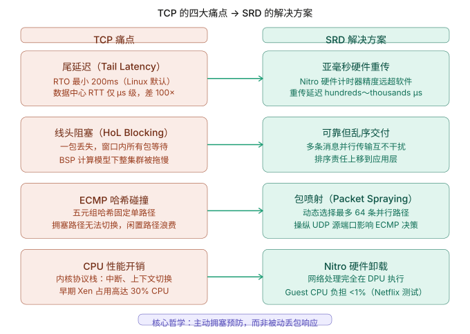


SRD 不依赖PFC；
解决了队头阻塞问题：通过多路径包喷射；
解决ECMP hash冲突：多路径+主动选择路径；
解决了尾时延问题：多路径+压毫秒级重传；


# 介绍
SRD(Scalable Reliable Datagram： 可扩展的可靠数据报文) 是 AWS 在 2021 年公开披露的**自研传输层协议，运行在 Nitro 网卡硬件内**。它不是一个软件库，是硬件卸载的协议。

核心哲学是**可靠但不保证有序**——把排序权交还给上层，换来多路径并行、亚毫秒重传、消除线头阻塞三大收益。

SRD 的"乱序容忍"设计，本质是一种好的职责委托——**==传输层只管可靠到达，排序交给更了解业务语义的上层==**（比如 MPI 库本身就需要处理消息序号），这比 TCP 在传输层强行保序更高效。
```bash
SRD：
  传输层 → 只负责“可靠”
  应用层 → 决定“是否需要有序”
```

# SRD特点

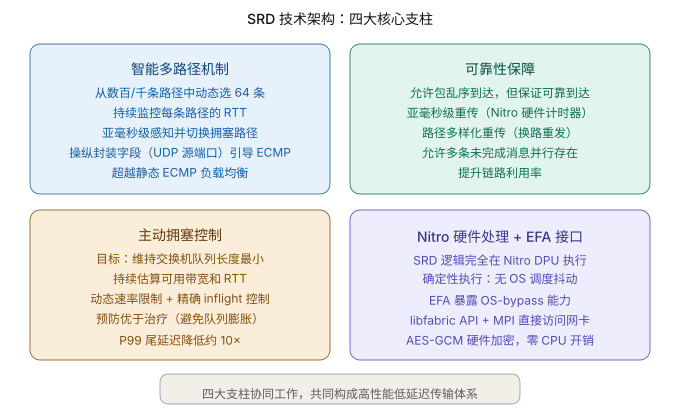

## 多路径负载均衡 以及切换

```bash
应用层
   │
   ▼
SRD Sender
   │
   ├── Packet Spray（拆包）
   ├── RTT Monitor（路径感知）
   ├── Retransmission（快速重传）
   │
   ▼
==============================
      多路径网络（ECMP）
==============================
   ▲        ▲        ▲
 Path A   Path B   Path C
   │        │        │
   ▼        ▼        ▼
SRD Receiver
   │
   ├── Reorder（乱序重排）
   ├── ACK/NACK
   │
   ▼
应用层
```

### 多路径包喷射（Multi-Path Packet Spraying）

为了减少丢包的机会，流量应该在可用路径上均匀分布。即使对于单个应用程序流，SRD发送方依然需要在多个路径上喷洒（Spray）数据包。尤其是对于重量流，以最小化热点的机会并检测次优路径。
通过尽可能多的网络路径发包，同时避免路径过载。利用ECMP标准，==发端控制数据包封装来控制ECMP路径选择，实现多路径的负载平衡==。


### 选择低负载路径
我们将SRD设计为与未启用多路径的传统流量共享网络，因此仅随机喷射数据包是不够的。为了尽量减少繁重的传统流的影响，SRD避免使用过载路径，这可以**通过为每条路径收集的往返时间 (RTT) 信息获取**。

> 注：等价多路径路由（ECMP）:两个EFA（Elastic Fabric Adapter，弹性结构适配器）实例之间可能有数百条路径，通过使用大型多路径网络的一致性流哈希（ECMP）的属性和SRD对网络状况的快速反应能力，可以找到消息的最有效路径。数据包喷射（Packet Spraying）可防止出现拥塞热点，并可以从网络故障中快速无感地恢复。

### 路径切换(repath)
在规模上，偶尔的硬件故障是不可避免的；为了允许从网络链路故障中快速恢复，如果用于原始传输的路径变得不可用，SRD能够重新路由重传的数据包，而无需等待，需要2-3个数量级时长的，整个网络范围的路由更新收敛。此路由更改由SRD完成，**无需重新建立昂贵的连接通路**。


## 可靠但乱序的传输

SRD提供**可靠但乱序**的交付，并将次序恢复留给上层。我们发现严格的有序交付通常是不必要的，强制执行它只会造成队列头部阻塞、增加延迟并减少带宽。

平衡多条可用路径之间的流量有助于减少排队延迟并防止数据包丢失，但是，它不可避免地导致大型网络中的无序数据包到达。众所周知，恢复网卡中的数据包排序非常昂贵，这些网卡通常具有有限的资源（内存带宽、重排序缓冲区容量或开放排序上下文的数量）。

我们考虑让Nitro网卡按顺序发送接收消息，类似于常见的可靠传输，如TCP或Infiniband可靠连接(RC)。但是，这将限制可扩展性或在出现丢包时增加平均延迟。如果我们推迟向主机软件发送乱序数据包，我们将需要一个大的中间缓冲区，并且我们将大大增加平均延迟，因为许多数据包被延迟，直到丢失的数据包被重新发送。大多数或所有这些数据包可能与丢失的数据包无关，因此这种延迟是不必要的。丢弃乱序数据包“解决”了缓冲问题，而不是延迟问题，并增加了网络带宽消耗。因此，我们决定将数据包传送到主机，即使它们可能是乱序的。

应用程序处理乱序数据包对于字节流协议（如TCP）是站不住脚的，其中消息边界对传输层是不透明的，但在使用基于消息的语义时很容易。每个流的排序或其他类型的依赖跟踪由SRD之上的消息传递层完成；消息层排序信息与数据包一起传输到另一端，对SRD不透明。

> 即： SRD 作为一个在硬件中的协议，不负责排序，而是交给上层进行排序。其是可靠数据报的传输，对于字节流协议的排序交给上层。


### SRD 如何实现"可靠但乱序"？
**可靠（Reliable）** = 每一个包最终都会到达，一个都不少。通过重传机制保证。
**有序（Ordered）** = 包按发送顺序到达。需要额外的排序机制。

TCP 同时保证这两者。SRD 只保证前者，放弃后者——但这不是降级，而是**把排序的时机和责任交给更合适的人**。
**"可靠"和"有序"从来就是两件独立的事**，TCP 把它们捆在一起是为了实现字节流抽象，SRD 把它们解耦是因为 HPC/AI 的消息抽象根本不需要全局有序。



用一个快递类比：快递公司保证你买的 10 本书"全部送达"（可靠），但不保证按购买顺序一本一本送（有序）。如果你是要逐章阅读一套连续剧，你需要有序；如果你是要把 10 本书摆上书架，只要 10 本全到了，你自己按书名排就好——这就是 MPI。

TCP = 快递必须按购买顺序一本一本敲门交付，第 2 本没到，第 3～10 本压着不给你。 SRD = 10 本全到后你自己整理，哪本先到先拿，NACK 催第 2 本尽快补发。

SRD 的设计完全自洽：**NACK + 重传保证了"不丢"，乱序交付加上上层消息语义保证了"能用"，两者合在一起就是"可靠但不保证有序"**——这正是 HPC 和 AI 训练真正需要的语义。

#### 如何区分延迟达到和丢包

**（1）问题的本质**

**（2）核心机制：自适应乱序定时器**

SRD 区分"延迟"和"丢失"的核心工具是**每条路径的 RTT 实时估算**。逻辑如下：
用一个自适应的乱序等待定时器（Reorder Timer）来区分"延迟"和"丢失"，而这个定时器的关键依据就是当前网络的 RTT 估算。


- 为什么 RTT 差值是正确的等待尺度
这是整个机制的物理直觉。SRD 把一个连接的包喷射到多条路径，每条路径的 RTT 不同。#1 走了快路径（5μs），#2 走了慢路径（15μs），#3 走了快路径（5μs）——那么 #3 比 #2 先到是完全正常的，最多晚 10μs。



如果网络突然拥塞，所有路径 RTT 都变大，SRD 的 Reorder Timer 是跟着 RTT 估算值实时调整的。


#### SRD 为什么能把窗口做得极窄——数据中心的先天优势

这是 SRD 区别于公网协议（如 QUIC）的根本原因：它只在 AWS 数据中心内部运行，这个环境有几个特殊属性让 RTT 极其稳定。


#### 如何去重(如果 NACK 之后，"丢失"的包又晚到了怎么办)
NACK 触发了重传，但原始包其实只是很慢，也到了。这时接收端会收到两份 `#2`。


#### 小结

==最快路径和最慢路径的 RTT 之差。超过这个差值某个包还没到，就不是"慢"，是"丢了"==。

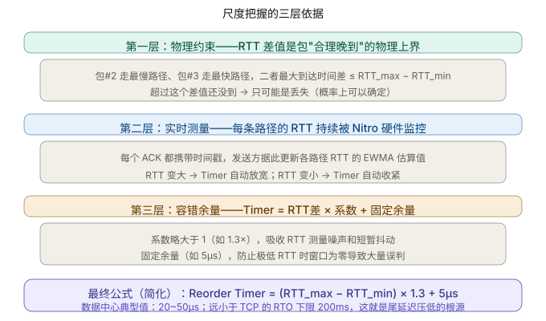

SRD 的高明之处在于，它把这个判断建立在**实时测量的物理量**上，而不是一个拍脑袋的保守超时值。**数据中心内**的 RTT 差只有几十微秒，所以 Reorder Timer 可以做得极窄，判断极快——这正是它相比 TCP 的 200ms RTO 下限能把**尾延迟**压低一到两个数量级的根本机制。

如果是在**公网**上用同样的逻辑，RTT 差动辄几百毫秒、抖动极大，Timer 就不得不设得很宽，优势就消失了——这也是为什么 SRD 被 AWS 设计为**只在自己可控的数据中心内部运行**，而不对外暴露的深层原因。

### 上层如何处理乱序
**不同使用场景，"上层"的处理方式完全不同**，甚至有些场景根本不需要排序。


#### TCP 为什么要强制排序？

TCP 的"有序"设计来自一个特定的抽象：**字节流（byte stream）**。应用拿到的是一条连续的字节河流，字节 100 之前必须是字节 99，否则语义就错了（想象 HTTP 报文头部被打乱）。这个约束在公网上合理，但在 HPC 场景里是多余的负担。

MPI 的抽象完全不同，它是**消息（message）**，每条消息是独立的语义单元，有自己的 Tag 和 Rank 标识。进程 A 发给进程 B 的消息#7，和发给进程 C 的消息#3，天然就是独立的，不需要全局排序。

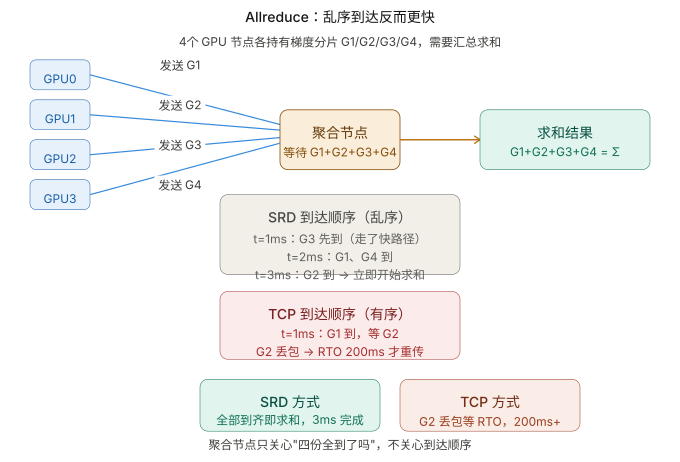

##### TCP 的队头阻塞：有序的代价
这里还有一个更微妙的问题：TCP 的有序性为什么会造成额外的伤害？


#### 在上层(DPU或者应用层)完成乱序重组
SRD 实际工作的关键不在于协议，而在于它在硬件中的实现方式。换种说法，就目前而言，**SRD 仅在使用 AWS Nitro DPU 时才有效**。

SRD乱序交付的数据包需要重新排序才能被操作系统读取，而处理混乱的数据包流显然不能指望“日理万机”的 CPU。即便真通过CPU 来完全负责 SRD 协议并重新组装数据包流，无疑是高射炮打蚊子——大材小用，那会使系统一直忙于处理不应该花费太多时间的事情，而根本无法真正做到性能的提升。

在SRD这一不寻常的“协议保证”下，当网络中的并行导致数据包无序到达时，AWS将消息顺序恢复留给上层，因为它对所需的排序语义有更好的理解，并选择**在AWS Nitro卡中实施SRD可靠性层**。其目标是让SRD尽可能靠近物理网络层，并避免主机操作系统和管理程序注入的性能噪音。这允许快速适应网络行为：快速重传并迅速减速以响应队列建立。

AWS说他们希望数据包在“栈上”重新组装，他们实际上是在说希望 DPU 在将数据包返回给系统之前，完成将各个部分重新组合在一起的工作。系统本身并不知道数据包是乱序的。系统甚至不知道数据包是如何到达的。它只知道它在其他地方发送了数据并且没有错误地到达。

这里的关键就是 DPU。AWS SRD 仅适用于 AWS 中配置了 Nitro 的系统。现在不少使用AWS的服务器都安装和配置了这种额外的硬件，其价值在于启用此功能将能够提高性能。用户需要在自己的服务器上专门启用它，如果需要与未启用 SRD 或未配置 Nitro DPU 的设备通信，就不会得到相应的性能提升。


## 快速的丢包响应
自有拥塞控制算法，基于每个连接动态速率限制，结合RTT（Round Trip Time）飞行时间来检测拥塞，可快速从丢包或链路故障中恢复

快速的丢包响应：SRD对丢包的响应比任何高层级的协议(比如TCP)都快得多。偶尔的丢包，特别是对于长时间运行的HPC应用程序，是正常网络操作的一部分，不是异常情况。

SRD 不像 TCP 那样靠超时或三次重复 ACK 来检测丢包，而是用 **NACK（否定确认）**  主动告知发送方哪个包丢了，实现亚毫秒级重传。


NACK 机制的关键在于**接收方主动**。收到包`#3` 但没收到包`#2`，接收方立即知道有空洞，立刻发 NACK 通知发送方，不需要等到 RTO 超时（RTO 往往是毫秒到秒级）。这是 SRD 能把 P99 尾延迟压低一个数量级的根本原因。

### 为什么SRD的尾时延低

尾时延来自：**排队 + 丢包 + 重传慢**；


## 连接的可扩展性
连接的可扩展：使用SRD，与其他可靠协议（如InfiniBand可靠连接RC）不同，一个进程可以创建并使用一个QP与任何数量的对等方进行通信。

# SRD应用场景



# 各大云厂商的传输协议横向对比


**Google 走了相似的路。** Falcon（2023）和 SRD（2020）的设计思路高度相似——都是以太网硬件卸载、可靠乱序、硬件多路径——但 Google 选择了与 Intel IPU E2000 合作并通过 OCP 开源，而 AWS 完全自研且保持专有。两条路反映了两家公司对"开放生态 vs 垂直整合"的不同判断。

# 总结和感悟

**垂直整合的护城河。** SRD 能做到这些，根本原因是 AWS 同时控制了硬件（Nitro）、网络拓扑（数据中心 Clos）和虚拟化层三个维度。用现成的白盒交换机搭建的数据中心无法直接复刻这套设计——这是专有标准相对开放标准的时间差优势。

**"合理的带宽浪费"换时间。** 早年网络带宽珍贵，协议设计以节省带宽为第一优先；现在数据中心带宽相对便宜，SRD 用多路径并发、换路重传换来了延迟降低——相同硬件、更少时间，就是效率提升。
SRD 的多路径设计是一种"合理的带宽浪费换时间"——网络带宽现在已经相对便宜，把同一份数据分散到多条路径并发送、甚至换路重传，是值得的；
而节省下来的时间（延迟降低）才是真正有价值的资源。

**BSP（Bulk Synchronous Parallel） 模型决定了尾延迟的重要性。** HPC 和 ML 训练普遍使用 BSP 模型，每一轮同步都要等最慢的节点。P99.9 延迟的一次毛刺，就能让整个 GPU 集群停下来等待，因此尾延迟的改善会线性地转化为训练吞吐提升。


# 参考
```bash
# 通往 3200 Gbps 的旅程：AWS 上的高性能显存传输
https://zhuanlan.zhihu.com/p/1890992237430695361

# 亚马逊AWS高性能网络技术SRD：用于弹性可扩展的HPC云优化传输协议
https://mp.weixin.qq.com/s/QXBELFjK3Td2jqMpn4MJ2A

# RDMA中的load balance(mutipath)技术
https://mp.weixin.qq.com/s/k2rLCPfP1DuFjfsR93sTZg

# AWS SRD (Scalable Reliable Datagram)
https://www.ernestchiang.com/en/notes/general/aws-srd-scalable-reliable-datagram/
```