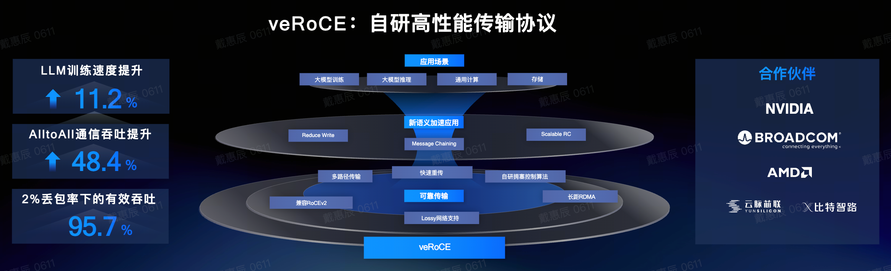

```table-of-contents
```

# 背景
主流的RoCEv2高速网络存在两大关键局限：
（1）依赖PFC无损网络，而大规模组网中PFC极易引发网络稳定性问题，制约集群规模扩展；
（2）不支持多路径传输，易导致ECMP冲突进而造成拥塞。

## RoCEv2丢包性能断崖式下跌

- ‌**丢包敏感**‌：RDMA 协议本身没有滑动窗口和确认应答机制，一旦丢包，吞吐会急剧下降。比如丢包率超过 0.1% 时，吞吐可能直接腰斩；如果丢到 2%，吞吐基本归零。
    
- ‌**重传效率低**‌：传统 RDMA 网卡（比如 CX-3/CX-4）在丢包后需要重传整个窗口的数据（GBN：go-back-N），效率很低，进一步拖慢速度。

## RoCEv2依赖无损网络，部署成本高‌

- ‌**必须用 PFC/ECN**‌：要避免丢包，得靠 PFC（流量控制）和 ECN（显式拥塞通知）来构建无损网络，但 PFC 容易引发网络风暴，ECN 配置复杂，对交换机要求也高。
    
- ‌**硬件成本高**‌：得用支持 PFC 的交换机和网卡，整体部署和维护成本都上去了。

##  RoCEv2不支持多路径传输

不支持多路径传输，易导致ECMP冲突进而造成拥塞。


# 介绍
字节跳动在火山引擎 Force 大会上正式发布了veRoCE传输协议，在保持**RoCEv2兼容**特性的同时（即：veROCE是在ROCEv2协议基础上做了修补，并不是全新设计），通过一系列改进，使RDMA能够**原生容忍丢包和乱序**，从而**摆脱对无损网络的依赖**。。



```bash
veRoCE = 面向云环境的“虚拟化增强版 RoCE”
ve = virtualized enhanced（偏“虚拟化增强版”的意思）
```

veRoCE 的设计遵循 “最小修改、最大增强” 原则，在保留 RDMA语义、用户接口的基础上，仅通过必要的协议扩展，解决传统方案的核心痛点。
> RDMA的成功很大程度上源于其精心设计的消息语义（如READ/WRITE）、数据包格式和用户接口（如ibverbs）。veRoCE的目标是在保留这些优点的前提下，引入必要的增强功能，以解决丢包和乱序问题。

# 核心特性


**多路径传输（Multi-Path Transmission）**：支持通过改变源端数据包熵值（依赖交换机ECMP）或在交换机层面进行数据包喷洒（交换机逐包的多路径，而不是ECMP），实现流量在多条网络路径上传输，充分利用网络带宽。


**乱序交付原生支持（Native Out-of-Order Delivery）**：响应端（Responder）能够直接处理乱序到达的数据包，这得益于每个数据包都携带了支持直接数据放置（DDP）的扩展头，让数据无需等待保序即可直接交付应用，大幅减少网卡缓存开销。在 veRoCE 中，报文乱序接收和 DDP 对所有语义（RDMA Write, RDMA Read, Send/Recv, Atomics等）提供原生支持。

**高效的丢包检测（Efficient Packet Loss Detection）**：通过引入选择性确认（SACK）机制，接收方可以精确告知发送方哪些数据包（包括乱序的）已收到，从而快速推断出丢包。

**硬件友好的选择性重传（Hardware-Friendly Selective Retransmission）**：基于SACK信息，实现快速、精准的选择性重传算法，只重传丢失的包，避免不必要的重传，节省带宽。采用基于SACK的选择性重传策略，通过接收端位图精确确定丢包位置。


**独立的PSN空间**：与传统IB/RoCE不同，veRoCE为Read Response数据包在响应端分配了独立的PSN空间。请求端在收到这些响应后，发送相应的ACK或SACK进行确认。这种设计统一了Send/Write包和Read Response包的丢包检测与快速重传机制。

**灵活的拥塞控制框架（Flexible Congestion Control, FCC）**：解耦拥塞控制与传输可靠性，支持路径级或连接级（支持路径粒度和连接粒度两种拥塞控制模式）、基于窗口或基于速率的多种拥塞控制算法。拥塞信号可通过独立的数据包（CNP）传递，不影响确认（ACK）包的合并。将拥塞信号与可靠传输完全解耦，避免数据传输干扰拥塞感知的准确性。针对路径拥塞不均衡问题，veRoCE 提出了基于报文序列号的快速慢路径检测算法，以最小的开销快速定位并剔除慢路径。


**兼容性和易用性**：
支持通用的 verbs 接口，消息语义与保序模型和 RoCEv2 一致，业务可以无缝切换。veRoCE 的连接管理支持协议协商，与 RoCEv2 网卡互通时可自动回退到 RoCEv2 模式。该协议在与核心新功能无关的部分与 RoCEv2 保持完全一致，大大降低了迁移和部署的门槛。


# 传输头扩展

veRoCE在数据包格式上对RoCEv2进行了扩展，引入了多个新的扩展传输头，这是其实现高级特性的基础。

## 通用数据包格式与CRC

veRoCE使用一个独立的UDP目的端口号（预计为4794，RoCEv2为4791）。一个32位的循环冗余校验（CRC）覆盖IP头、UDP头、基础传输头（BTH）、扩展传输头及负载中的所有不变字段，确保了端到端的数据完整性。计算CRC时，IP和UDP头中的可变字段（如TTL、校验和、DSCP/ECN）被替换为1，使其变化不影响CRC值。


## 扩展头详解
### 基础传输头（BTH）
基础传输头（BTH）：格式与IB规范基本一致，但引入了新的操作码（Opcode），如SACK、ACK_Rsp、SACK_Rsp、RTT Request/Response和Slow path。BTH中的Retrans标志位（1比特）用于标识该数据包是原始包还是重传包。


### MSN扩展头（MSNETH）

作用：携带消息序列号（MSN），用于消息级（WQE级）的完成确认，而非单个数据包。

字段：24位MSN，8位保留。

赋值：对于请求消息（Send, Write, Read Request），由请求端赋值；对于响应消息（Read Response, AtomicAck），由响应端赋值。


### 数据包偏移扩展头（POETH）

作用：实现直接数据放置（DDP） 和加速重传的关键。

字段：24位消息内数据包顺序（PO： packet order ）。

功能：在语义包中，PO表示该包在其所属消息中的顺序（从0开始）。对于Send/Read操作，接收方利用PO计算负载应放置在内存中的偏移地址。在确认包（ACK/SACK）中，PO字段携带的是 aPSN + 1（即第一个丢失的包）的PO值，帮助发送方快速定位需要重传的数据在WQE中的位置。


#### Mellanox Cx7在原生RoCEv2协议上支持RDMA WRITE/RDMA READ多路径
其实以前也讲过, 在RoCE的报文格式中, 因为**传输层要求严格保序**, 报文设计上相对简单.就是一个简单的First/Middle/Last.


==中间的报文并不携带操作远端内存的地址. 因此乱序后将无法知道远端该如何写入==.

当然Nvidia也做了一个简单的处理, 是否能够通过**拆分成多个独立的WRITE报文, 每个都携带地址**, 这样就可以乱序发送了呢? 

但是对于一个消息而言, 我们还需要通知对方是否完成了, 因此发送端还需要等前面独立拆分的WRITE报文都确认接收后, 再发送一个WRITE_With_Imm消息确认. 或者通过一个ATOMIC消息更新接受端的Fence flag, 这样实际上还是增加了一个Round-Trip-time. 

#### Mellanox Cx7在原生RoCEv2协议上不支持SEND/RECV多路径

这种做法**对于RDMA WRITE/RDMA READ可以实现, 但是对于SEND/RECV是有缺陷的**.

这个差异的根本原因在于两种语义在**数据放置（Data Placement）**上有本质不同。



**（1）RDMA WRITE 包含"目标地址" —— 天然支持乱序**

每个 RDMA WRITE 数据包的传输层头部都带有 **RETH（RDMA Extended Transport Header）**：

```
[ BTH | RETH: VA + rkey + DMAlen | Payload ]
```

NIC 收到任意一个 OOO 包，可以**立刻独立完成 DMA**，直接写到 `VA` 指定的内存地址。包与包之间没有任何先后依赖关系，硬件状态机极简单。

**（2）Send/Recv 的 WQE 必须按序消费**

Send 操作的数据包**没有目标地址**，接收端 NIC 必须从 **RQ（Receive Queue）** 按 FIFO 顺序取出下一个 WQE，才知道这条消息该放到哪块 buffer 里：

```
消息到达 → 取 WQE #N（含 sge/buf 地址）→ DMA → 生成 CQE
```

如果包乱序到达，NIC 面临的问题：

- **消息边界不确定**：一条 Send 消息可能跨多个包，NIC 无法知道哪些包属于同一条消息
- **WQE 无法预先消费**：`WQE #1` 对应`消息 #1`，`消息 #2` 跳过来了怎么办？要么先临时 buffer 整条消息（片上 SRAM 开销巨大），要么回退到按序处理
- **CQE 通知语义**：应用层的 `ibv_poll_cq()` 期望 CQE 按消息粒度有序出现，乱序 CQE 打破上层所有假设


**（3）硬件实现代价不对称**


**（4）小结**：
CX7 的 OOO（称为 **Out-of-Order Data Placement**）本质上就是允许 WRITE 包在 Reorder Buffer 里不等序号连续就直接落地内存，然后用 PSN bitmap 跟踪哪些 payload 已写入。这对 Send/Recv 而言需要的"消息重组引擎"代价则完全不在同一数量级。

所以这是一个**收益/代价**的工程取舍，而非技术上做不到：WRITE 的 OOO 用极低的硬件代价换来了对网络 reorder 的极强容忍性，Send/Recv 则无此必要。


#### 多路径支持（多路径乱序传输）和 接收端通过DDP有序接收

**veRoCE 为了多路径，支持了iWARP DDP**， 并且**把iWARP的DDP Header中的 MSN（Message Sequence Number） / MO (Message Offset) 通过 MSNETH / POETH 扩展头实现**。

> 即：为了支持DDP的功能, veRoCE增加了MSN Extended Transport Header (MSNETH)和Packet Offset Extended Transport Header (POETH).


DDP在每个数据分段中间添加了一个Message Sequence Number(MSN)和Message Offset(MO), 通过MSN和MO其实就非常容易的在多种语义上支持乱序接收, 并且可以在接受端判断消息是否完成, 然后完成Imm提交或者执行Fence flag更新, 这样相对于RoCE现有的实现还节省了一个Round-Trip-Time.

### RQ扩展头（RQETH）

作用：将Send或Write-with-ImmDt消息与响应端接收队列（RQ）中的一个特定工作队列元素（WQE）关联起来。

字段：24位RQMSN，与接收WQE的序列号对应。这使得乱序到达的Send包仍能找到正确的目标缓冲区。


### ACK扩展头（AETH）

作用：携带确认信息。veRoCE修改了其中MSN和Syndrome字段的定义。

MSN字段：在确认包中，携带接收方的aMSN（已累积确认的MSN）。在Read Response包中，携带对应Read Request的MSN，用于请求端进行请求-响应对应。

Syndrome字段：将RoCEv2中的PSN-Error NAK重新用作Packet Drop NAK，用于通知发送方数据包被交换机剪枝（trimming）了。


### SACK扩展头（SACKETH）

作用：选择性确认乱序到达的包，是快速丢包检测的核心。

结构：包含一个128位的位图（Bitmap），每个比特对应一个PSN，1表示已收到。Bitmap Starting PSN和Bitmap Valid Length定义了位图覆盖的PSN范围。


### RTT探测头（RTTReqETH/RTTRspETH）

作用：用于精确测量网络往返时间（RTT），是拥塞控制的重要输入。

字段：包含CC上下文ID和四个时间戳（Tx1, Rx1, Tx2, Rx2），分别记录请求发送/接收、响应发送/接收的时间。通过计算 (Rx2 - Tx1) - (Tx2 - Rx1) 可以得到网络RTT。

# 在有损网络中保证可靠

veRoCE的可靠连接（RC）服务是其核心，它保证了在存在丢包、乱序和多路径传输的网络中，语义数据包能够被最多一次、无错地传递。设计围绕 “序列号管理、确认协议、丢包恢复” 三大核心，同时兼容 RDMA 原有语义与 RoCEv2 生态。

## PSN与MSN：双重序列机制
veRoCE使用了双重序列号机制来分别管理数据包和消息。通过 PSN（数据包序列号）和 MSN（消息序列号）的分离与独立空间分配，实现数据包与消息的精准追踪：
### PSN（数据包序列号）：
**PSN（数据包序列号）**：用于标识和排序单个数据包。

每个报文都在其 BTH 中携带一个 PSN 进行传输. PSN 用于识别丢失或乱序的报文, 并且对于可靠连接服务, 用于将一个确认报文关联到一个给定的语义报文，接收方通过PSN位图记录包的到达情况，并划分了有效区和乱序区来区分重复包和乱序包。

然后==veRoCE定义了两个PSN空间, 一个 QP 同时维护两套独立的 PSN 序列号==:
1. SQ PSN 空间: 用于自己发起的 Send/Write/Read Request.
2. Response PSN 空间: 用于自己为收到的 Read/Atomic Request 生成的响应.


#### 标准RoCE协议实际上是无法支持Window Based拥塞控制
RoCE的一个缺陷：标准的RoCE协议实际上是无法支持Window Based拥塞控制的.
1. 数据包和ack报文单独发送,数据包里面没有携带ack字段
2. Read resp报文是用ack报文封装,实质是数据包,而read resp并没有对应的ack;

也就是说
1. 由于响应报文不使用 PSN, 它们无法被接收端(即原始的 Requester)用常规的 ACK/NAK 机制来确认.
2. 对 Read Request 报文的确认是隐式的, 通过 Read Response 报文中携带的 PSN 来实现.
3. 对 Read Response 报文的可靠性保证几乎完全依赖于请求端的超时重传 (RTO).

如果采用window based拥塞控制,需要ack来驱动,read场景就会导致read resp直接发不出去了, 不改RoCE协议, 解法只能变成使用定时器加token/credit,又变成rate based了.

**因此veRoCE定义了两个PSN空间, 理论上也可以解决这个问题**.


#### PSN编码


然后我们来讨论一下PSN编码, 理论上PSN的长度很大(24bits), 但接收端 PSN bitmap长度限制了整个乱序区的大小, 如果一个报文的 PSN 等于或大于 aPSN + bitmap_length + 1, 接收端无法在其 PSN bitmap中记录该报文的到达, 因此该报文会被接收端丢弃.


### MSN（消息序列号）
MSN 将可靠性从报文(Packet)粒度提升到了消息粒度；

MSN（消息序列号）：用于标识和追踪完整的消息（对应一个WQE）。同样，**SQ消息和Read Response消息也使用独立的MSN空间**。aMSN（已累积确认的MSN）的推进意味着接收方已完整收到该序号及之前的所有消息，发送方可以据此完成相应的WQE。


aMSN（已累积确认的MSN） 的前进是发送端硬件可以安全地生成 CQE, 通知应用操作完成的唯一可靠信号, 这样就可以很高效的实现Write-with-Imm的处理.


## 三级确认协议：ACK、SACK与NAK

确认协议是可靠性的基石。veRoCE在RoCEv2的ACK/NAK基础上，强化了SACK机制。


### ACK
**ACK（确认）**：累积确认，表示aPSN及之前的所有包都已按序收到。支持合并（Coalescing）以减少开销。


对于每个Packet都需要ACK, 然后ACK也是可以聚合的, 即允许单个 ACK 作为对一个或多个先前语义报文的确认.
当接收端生成一个 ACK/SACK 时, 其 BTH.PSN 字段用 aPSN (确认 PSN)填充. 当发送端收到一个 ack_pkt 时, 它应将其 aPSN 前进到该 ack_pkt 的 BTH.PSN. 对于 Read, Atomic 和 Send-with-Invalidation, ACK 报文确认该报文已被收到.

### SACK
**SACK（选择性确认）**：veRoCE的创新重点。通过位图精确报告哪些乱序包已到达。


SACK 报文用于选择性地确认在接收端乱序到达的语义报文, SACK的聚合和具体实现相关. 考虑到SACK有128bit的bitmap, 为了平衡精度和开销， 可以使用一种Lazy SACK的处理方式, 不为每个乱序报文都生成一个 SACK, 而是当接收端的乱序度(OOOD，即最高收到PSN与aPSN之差) 超过一个阈值（如由多路径引起的最大预期乱序）时, 接收端才发送一个 SACK. 这也意味着当 OOOD 低于阈值时, 接收端继续返回 ACK. 这避免了为每个乱序包都生成SACK的开销。OOOD 被定义为最高收到的 PSN (hPSN) 与 aPSN 之间的差值. 用于发送 SACK 报文的 OOOD 阈值可以被认为是多路径所引起的最大乱序程度.


### NAK
**NAK（否定确认）**：主要用于报告错误。

veRoCE NAK 协议与 IB 规范保持一致. NAK 码 b'00000' (PSN 序列错误)被重用为Packet Drop NAK. 对于 Packet Drop NAK, NAK 报文应在错误被检测到后立即传输.

实际上在这里是针对交换机支持数据包剪枝Packet Trimming(NDP)机制的一个响应, 这是一个显示的丢包响应信号.


## 丢包检测与快速选择性重传

### 丢包检测

检测方式：SACK 位图直接推断丢包&传输计时器（RTO）超时触发丢包判断

**SACK触发**：收到SACK时，发送方可以推断aPSN + 1的包很可能已丢失，并结合位图信息，快速发起选择性重传。

**RTO超时触发**：与传统TCP类似，如果一个包在定时器超时(RTO)前未被确认, 将触发重传. 一旦 RTO 重传被触发, 发送端应停止由 SACK 触发的快速重传, 直到 aPSN+1 被确认为止.

### 快速选择性重传
连续的 SACK 报文可能有重叠的bitmap. 如果每个 SACK 报文都简单地触发对 `[aPSN + 1, aPSN+N]` 范围内未收到报文的重传, 将会有大量不必要的重传, 因为连续的 SACK 报文很可能包含重叠的bitmap. 下图提供了一个例子. 报文 2 被重传了两次, 因为两个 SACK 的bitmap都指示报文 2 尚未收到. 


为了避免因连续收到重叠位图的SACK而导致对同一丢失包的重复重传，veRoCE 推荐一种快速选择性重传机制, 以缓解不必要的重传。
veRoCE在 发送端或接收端维护一个变量 RxtPSN（重传PSN） 变量，它记录了来自上一个 SACK bitmap的最高有效 PSN, 并且在每次收到或传输 SACK 时进行更新. 对于每个收到的或传输的新 SACK, 只有 PSN > RxtPSN 的bitmap条目才应被考虑用于选择性重传.  为了避免由丢失的重传报文引起的 RTO, 发送端或接收端还应记录 RxtPSN 最后一次更新的时间. 当 RxtPSN 在一段时间内没有更新时, RxtPSN 应被重置为 aPSN, 以允许进行第二次选择性重传. 该时间阈值的典型值为网络 RTT.

下图描绘了当 RxtPSN 在发送端维护时, 快速选择性重传是如何工作的.


注意 veRoCE 并不强制要求此设计, 因为 RxtPSN 也可以在接收端维护. 在发送端收到第一个 SACK 后, 它解析bitmap, 重传报文 [5, 6, 8] 并将 RxtPSN 更新为 8. 当第二个 SACK 到达时, 重传的报文 `[5, 6, 8]` 仍在网络中传输. 在 RxtPSN 的帮助下, 发送端只重传了 PSN 大于 RxtPSN 的报文 10 和 11.

如果重传的报文再次丢失, RxtPSN 将会长时间停滞, 导致 RxtPSN 被重置. 下图描绘了这个过程.


图中的第一个 SACK 触发了报文 `[5, 6, 8]` 的重传, 但报文 `[5, 6]` 再次丢失了. 第二个 SACK 只重传了报文 10, 11, 因为 RxtPSN 已经前进到 8. 当第三个 SACK 到达时, RxtPSN 已经停滞了足够长的时间, 从而被重置为 aPSN (即 4), 于是报文 `[5, 6]` 被第二次重传.

```bash
其实这一部分的异常处理实现还是有一些问题的, 尝试在纯硬件ASIC上构建SACK是一件非常难的事情, Google Falcon和Intel一起搞IPU重新流片了3~4次. 当然veRoCE这样的处理方式还是有一些缺陷的, 就不展开指出了.
```


## 关键操作流程

### Send/RDMA Write操作

Send/RDMA Write操作：请求端为每个消息分配MSN和PSN，并为每个包计算PO。响应端利用PO和RQMSN（对于Send）直接进行DDP，将数据放入正确内存位置，无需重新排序。消息的完成由MSN的累积确认（aMSN）驱动。


实际上是在解释DDP的工作原理, RDMA Write 操作的一个示例如下:


1. 请求端向发送队列(Send Queue)提交一个 Write WQE. QP 根据消息大小和 MTU 创建了 4 个 write 请求报文 (PSN = 100-103).
    
2. 请求端按顺序将报文传输给响应端. 报文可能被网络重排序. 例如, 报文 100 和报文 101 在响应端乱序到达. 响应端直接将数据放置到主机内存而无需对它们进行重排序.
    
3. 响应端向请求端返回 ack_pkts 以确认 Write 请求的到达, 并且响应端可以执行 ACK 聚合以减少 ack_pkts 的数量. 例如, 最后 4 个报文的 ACK 被聚合了. 在该消息的最后一个散乱报文(straggler packet)被响应端处理后, 响应端回复一个 AETH.MSN 设置为 1 的 ACK. 一个 Write 消息的散乱报文可以通过响应端的 PSN bitmap来识别.
    
4. 在收到带有新 MSN 值(即本例中的 1)的 ack_pkt 后, 请求端完成该 write 消息.


对于 Write-with-ImmDt 和 Send-with-ImmDt  消息, 由最后一个报文携带的立即数需要被复制到 CQE 中. 在乱序到达的情况下, 最后一个报文可能在 CQE 生成之前到达, 立即数需要被缓存在响应端.


在 MSN 为 2 的 Write 请求完全收到后, 响应端才为 MSN 为 3 的 Write-with-ImmDt 请求发布 CQE.

### RDMA Read操作

Read 请求仅占用一个 PSN. 后续的请求会顺序使用下一个 PSN, 不会跳过任何 PSN. 在收到 Read 请求后, 响应端会缓冲它们, 直到所有在前的请求都被处理完毕. 对于一个 Read Response, 其 AETH.MSN 填充的是相应 Read Request 的 MSN.

RDMA Read操作：Read Request和Read Response使用独立的PSN和MSN空间。

RDMA Read 操作的一个示例如下:


1. 请求端向发送队列(Send Queue)提交一个 Read Request WQE, 随后一个 Read Request 报文被传输到响应端. 该 Read Request 仅占用一个 PSN.
    
2. 在收到 Read Request 后, 响应端应向请求端回复一个 ACK (也受 ACK 聚合影响). 这个 ACK **不**表示 read 请求的完成, 而是确认 Read Request 已被响应端收到.
    
3. 响应端缓冲该 read 请求. 当所有在前的请求都处理完毕后, 响应端开始为该 Read Request 生成一个 Read Response 消息.
    
4. 响应端按照被缓冲的 Read Request 的指示发送出 Read Response 报文. 对于一个 Read Request, 响应端可能根据消息大小和 MTU 生成多个 Read Response 报文. 来自 Read Response 的报文和来自 SQ 的报文处于**独立的 PSN 空间**.
    
5. 请求端收到 Read Response 报文, 并回复 ack_pkts (即 ACK_Rsp/SACK_Rsp) 以确认它们的到达. 当收到的 Read Response 报文填补了 PSN 范围中的一些"空洞"时, PSN 和 MSN 可能得以推进, 并通过确认报文返回给响应端.
    
6. 响应端收到这些 ack_pkts. 当 ack_pkts 中的 MSN (指 Response MSN)相比上次收到的 MSN 有所前进时, 响应端**释放**相应数量的 Read Request.


### 原子操作（RDMA Atomic）

原子操作使请求端能够在响应端的一个指定地址上执行一个 64 位的操作. 这些操作原子性地读取, 修改和写入目标地址, 并保证对该地址的其他 QP 的操作不会在读取和写入之间发生. veRoCE 支持 IB 规范(章节 9.4.5)中定义的 FetchAdd 和 CmpSwap 原子操作. 原子操作请求仅占用一个 PSN. 在收到原子操作请求后, 响应端会**缓冲**它们, 直到所有在前的请求都被处理完毕. 响应端可以回复一个 ACK 或 SACK 来表明收到了原子操作请求. 然而, 这**不能**被用作请求端操作的完成信号. 原子操作只有在收到 **AtomicACK** 时才能被认为是完成的.

原子操作的一个示例如下:


1. 请求端向发送队列提交一个原子操作请求 WQE, 此时还有一个在途的 Write 请求 WQE. 随后一个原子操作请求报文被传输到响应端. 该原子操作请求仅占用一个 PSN.
    
2. 在收到原子操作请求后, 响应端应向请求端回复一个 ACK (也受 ACK 聚合影响). 这个 ACK **不**表示原子操作的完成, 而是确认原子操作请求已被响应端收到.
    
3. 响应端缓冲该原子操作请求. 当所有在前的请求都处理完毕后, 响应端执行该原子操作, 并为该原子操作生成一个 **AtomicAck 消息**.
    
4. 响应端发送出 AtomicAck 消息. 每个 AtomicAck 消息占用**一个 PSN** 和**一个 MSN**.
    
5. 请求端收到 AtomicAck 报文, 并回复 `ACK_Rsp` 以确认它们的到达. 当收到的 AtomicAck 报文填补了 PSN 范围中的一些"空洞"时, PSN 和 MSN 可能得以推进, 并通过确认报文返回给响应端.
    
6. 响应端收到这些 ack_pkts. 当 ack_pkts 中的 MSN 相比上次收到的 MSN 有所前进时, 响应端**释放**相应数量的原子操作请求.


我们要理解原子操作的本质. 像 `FetchAdd`或 `Compare-and-Swap`这样的操作, 都包含两个步骤:

1. **Read**: 从远端内存地址读取一个原始值.
    
2. **Write**: 根据读取到的值和一个输入值进行计算, 然后将新值写回同一个内存地址.
    

关键在于, 这两个步骤必须是**原子**的, 中间不能被其他任何操作打断.  如果 `AtomicAck` 丢失了怎么办?

在 RoCEv2 模型下, Requester 只能等待 RTO 超时, 然后重传整个 `Atomic Request`. 这会导致远端的原子操作被**错误地执行两次**, 完全违背了"原子性"的初衷.

在 veRoCE 模型下, 由于 `AtomicAck` 有自己的 PSN, 如果它丢失了, Requester 会发现 Response PSN 空间出现"空洞", 或者最终由 Requester 侧的定时器超时(注意, 这里是等待响应的定时器, 而非 RTO). Requester 就可以向 Responder 发送一个 `NAK_Rsp` 或者通过其他机制(如超时后发送一个查询状态的特殊包), 请求 Responder 仅重传那个丢失的 `AtomicAck`, 而**不是重新执行原子操作**. Responder 在执行完原子操作后, 应该缓存住结果(`AtomicAck` 的内容), 直到它被 Requester 确认为止.


## Operation Ordering的调整

为了加速DDP并避免在硬件中缓冲数据，veRoCE放宽了部分操作的排序保证。==在传统IB/RoCE中，后提交的Send或RDMA Write一定在前一个操作完成后才执行。而在veRoCE中，两个Send或RDMA Write操作之间默认没有顺序保证==。如果它们写入同一内存区域，后发的操作数据可能被先到的覆盖。 这个修改是为了加速 DDP 过程并避免在硬件中缓冲数据载荷。应用程序如需严格顺序，必须在第二个操作上设置 Fence指示位。

### 小结
**把iWARP的DDP Header**中的 MSN（Message Sequence Number） / MO (Message Offset) **通过 RDMA IB传输层的 MSNETH / POETH 扩展头实现**，==每个报文都携带有这样的扩展头中，来达到即使多路径乱序传输，但是接收端有序接收==。

# 错误处理与包剪枝
## 错误处理的调整

veRoCE移除了与无损网络和严格排序相关的一些错误类型（如包序列错误），因为它们在有损、乱序环境下是正常现象而非错误。同时，增加了针对丢包和Read Response/AtomicAck的错误处理：

- **新增错误**：Packet Drop error，由Packet Drop NAK触发。
- **新增错误行为类**：Class N，用于处理响应端可恢复的错误（如请求端报告的Packet Drop NAK_Rsp）。

## 包剪枝（Packet Trimming）

包剪枝是一种网络主动拥塞管理技术，类似于ECN，但更激进。当交换机队列拥塞时，它可以选择性地剪掉数据包尾部的负载部分，只保留头，并将其标记为已剪枝。这比直接丢包更友好，因为：

4. **保留重传信息**：剪枝后的包保留了所有传输头（BTH, MSNETH, POETH等），发送方收到对应的Packet Drop NAK后，能立刻知道哪个包（PSN）的哪部分（通过PO可定位）需要重传。

5. **更快缓解拥塞**：立即减少了队列中的数据量。

6. **veRoCE原生支持**：接收方收到剪枝包后，会回复Packet Drop NAK，触发快速重传。由于veRoCE支持乱序交付，剪枝包（可能因进入高优先级队列而先到）不会造成问题。

# 拥塞控制与多路径管理
## 灵活的拥塞控制（FCC）框架
veRoCE 提出 FCC（Flexible Congestion Control）框架，通过 “信号独立传输、多模式可选、精准时延探测” 三大核心设计，实现对复杂网络的动态适配。

veRoCE将拥塞控制与传输可靠性解耦，提供了极大的灵活性：

### 拥塞通知
 双模式信号传递：支持带内和带外两种方式

每个接收端 QP 维护一个或多个拥塞信号上下文(Congestion Signal Contexts, CSC)来记录拥塞相关信息. 有两种方法将拥塞信号回传给发送端:

1. **带内(Inband)**: ack_pkts 可以携带拥塞信号, 如 ECN (使用 BTH 头中的 BECN 字段), 这可以被基于窗口的拥塞控制算法利用.
    
2. **带外(Out-of-band)**: 拥塞信号也可以使用独立的 CNP (Congestion Notification Packets)返回给发送端, 这使得基于速率的拥塞控制算法成为可能.
    
CNP 的生成速率是实现相关的. 例如, 即使接收端 QP 要求 NIC 硬件为每个 ECN 标记的报文都生成一个 CNP, 硬件也可能以类似于 ACK 聚合的方式来聚合 CNP. 一旦一个 CNP 被发送, 拥塞信号上下文应被重置.


### RTT探测

RTT 是使用独立的 RTT 探测报文来测量的. 具体算法和Google Falcon和CIPU eRDMA是一样的, 一个 RTT 探测请求返回 4 个时间戳:


1. Tx timestamp 1: RTT 请求报文在发送端的发送时间. 该时间戳由请求中的 RTTReqETH 携带, 并由 RTT 响应中的 RTTRspETH 回显.
    
2. Rx timestamp 1: RTT 请求报文在接收端的接收时间. 该时间戳由 RTT 响应中的 RTTRspETH 携带.
    
3. Tx timestamp 2: RTT 响应报文在接收端的发送时间. 该时间戳由 RTT 响应中的 RTTRspETH 携带.
    
4. Rx timestamp 2: RTT 响应报文在发送端的接收时间. 该时间戳由发送端自己标注.


这 4 个时间戳被传递给 CC (拥塞控制)模块. 如何使用这些时间戳由 CC 算法决定. 三种可能的方式包括: a.  网络往返延迟可以由  计算得出. b.  主机处理延迟可以由  计算得出. c.  如果请求端和响应端时间同步, 网络单向延迟可以由  和  计算得出.

==一个 RTT 请求的 UDP 源端口字段根据它正在探测的路径来设置, 而 RTT 响应的源端口与其对应的 RTT 请求保持相同.==


> 注：其实这一点veRoCE还是做的有问题的, 在《谈谈Google Falcon的可靠传输论文并对比分析CIPU eRDMA》也写到过: **RoCE 没有将拥塞控制与数据路径集成.** 它的拥塞控制是作为一个附加组件实现的, 依赖于带外探测(out-of-band probes)来收集拥塞信号. 这种分离使其拥塞响应迟缓；事实上像Google Falcon和CIPU eRDMA都采用带内的方式, 有更大的优势. 具体能解决什么问题涉密就不多说了.


## 两种拥塞控制模式


一个采用多路径的可靠连接, 其拥塞控制机制可以工作在两种模式下:  **连接级(connection-wise)** 和 **路径级(path-wise)**. 在任一模式下, 发送端 QP 维护一个或多个拥塞控制上下文(Congestion Control Context, CCC)来控制发送速率. 注意对于单路径的可靠连接, 无需区分连接级和路径级模式, 它们是相同的.


### 路径级模式（Sender-spreading 多路径）
路径级：为每条路径维护独立的发送速率和CC上下文。接收端通过CNP的源端口区分路径并反馈拥塞信号。

sender 为每条路径分配独立 UDP 源端口，通过交换机 ECMP 实现流量分发。每条路径维护独立拥塞控制上下文（CCC），或通过加权轮询机制共享一个 CCC，实现路径专属速率调整。receiver 通过 CNP 的 UDP 源端口区分路径，反馈路径专属拥塞信号

### 连接级模式（Switch Adaptive Routing 多路径）

连接级：所有路径使用一个总速率，并在各路径上轮询分发。速率会收敛到最慢路径的可用带宽。

sender 与 receiver 无法区分路径，累计所有路径的 ECN 标记数据包数量。全局维护一个传输速率，均匀分配至所有路径，速率收敛至所有路径中的最低可用值。仍通过 per-path RTT 探测识别慢路径，辅助优化流量分发。

## 路径选择模块：慢路径检测与多路径适配
路径选择模块核心是 “识别劣质路径、优化流量分发”，与拥塞控制模块协同工作，提升整体网络利用率。

### 多路径传输实现方式
**源端熵值调整**：sender 通过修改数据包熵值（比如：sport ， flow-label， DSCP等字段），依托交换机 ECMP 哈希算法将流量分发至不同路径。

**交换机喷洒**：交换机层面直接将数据包分发至多条路径，sender 无需感知路径细节。

### 慢路径检测机制

随着时间的推移, 路径质量可能会下降(例如, 由于链路错误), 使一条路径变成"慢路径"(高延迟/丢包). 慢路径检测是一个可选但推荐的增强功能, 以提高网络效率. 发送端可以使用以下机制来识别并从慢路径迁移流量:

**大的 PSN 差异 (在接收端)**:

- 检测触发条件：receiver 收到的语义数据包 PSN 与已接收最高 PSN（hPSN）的差值超过阈值，判定为 “慢包”。
- 信号反馈：接收端随后向发送端发送一个慢包信号(Slow-Packet Signal, 一个 Opcode 为 `bin10000100` 的报文).
- 路径标记：如果发送端在一段时间内收到针对某条路径的多个慢包信号, 该路径就可能被标记为慢路径.

慢路径检测算法可以是实现相关的. 其他指标, 例如, 延迟的 ACK, RTT 探测/响应丢失, 也可以被用来识别慢路径.
> 注：事实上在一些ScaleAcross的场景, 物理路径上延迟就有很大的差异, 简单剔除慢路径将会导致高延迟路径实际带宽无法使用的问题.  其实多路径转发吧, 里面需要很多巧妙的设计, 但是抱歉涉密不能讲.

### 路径选择核心逻辑

**优先选择低时延、低拥塞路径**：通过 RTT 探测数据和拥塞信号，动态评估路径质量。

**避免路径过载**：路径级拥塞控制模式下，通过调整各路径传输速率，防止单路径拥塞蔓延。

**兼容单路径场景**：单路径连接时，无需区分连接级与路径级模式，拥塞控制与路径选择逻辑自动简化。


# 性能表现

- ‌**veRoCE**‌：LLM训练速度相较于RoCEv2提升约11.2%；AlltoAll通信吞吐提升约48.4%；在2%丢包率下，有效吞吐仍能达到网卡带宽的约95.7%。

- ‌**RoCEv2**‌：在2%丢包率下，因丢包过多而通信中断。

# 总结
veRoCE 通过传输头扩展、双重序列号、选择性确认等轻量化创新，在保留 RDMA 核心优势（原生低延迟、高带宽优势）的同时，彻底解决了传统方案对无损网络的依赖，为构建高性能、高弹性、可扩展的新一代 AI 基础设施提供了坚实的通信底座。

# 思考

## 正确的 RoCE 路径
渣B（zarbot） 认为：当今的RDMA现代化改造似乎有些讽刺的意味, 也就是我一直在讲的, **RoCE这十年一开始就走错了...** 事实上正确的选择如下:


## 字节的veRoCE和AWS的SRD的对比

值得称赞的是veRoCE 维持了RDMA Verbs语义, 不像AWS SRD那样为了多路径搞的整个生态都不兼容.

另一个现代化改造是多路径的支持能力, 相对于NV和BRCM（博通）倾向于在交换机上做PacketSpray（包喷洒）, veRoCE也选择支持了**端侧多路径**的能力. 最终通过“多路径传输, 乱序交付, 高效的丢包检测, 硬件友好的选择性重传, 以及灵活的拥塞控制等特性“实现了RDMA现代化改造.

## RDMA现代化目标分析

渣B（zarbot）一直给过一个RDMA现代化的目标:

- 集合通信能够保证95%以上的Fabric利用率
    
- 丢包率5%的时候仍然能够保证90%的Goodput
    
- 无需任何交换机的高级特性, 网卡实现多路径和拥塞控制
    
- 超大规模(128K QPs)并支持所有QP开启多路径转发能力.
    
- 兼容RDMA RC Verbs, 线下RDMA应用无需修改代码即可直接运行.
    
- Incast 128打1这样的场景, 每个QP之间的带宽差额最大100Kbps.
    
- 完全OS无感知的热迁移
    
- 完善的RDMA虚拟化支持

## Lossless or Lossy

选择Lossy, 这是veRoCE做的非常好的一点. 但实际上当你选择Lossy和支持多路径的时候, 就不可避免的将整个协议按照iWARP的方式改造, 对UDP传输做加法, 从TCP中学来SACK；延迟测量来自于Swift；多路径又要不可避免的抄iWARP的DDP. 还记得某人莫名其妙的在几个月前某个会上大放厥词: iWARP已死, 结果实际上都要在iWARP那里抄作业.

实质上的问题就是, 早期RDMA主要用于HPC场景, 带宽需求很小, 相反延迟需求更高, 因此基本上不怎么丢包, 所以一个强Lossless假设和简单的可靠传输就可以解决问题. 但是到了AI时代这是完全不同的情况, 极大带宽的带宽需求要求必须放弃Lossless和Strong Order, 通过iWARP DDP这样的技术实现weak order和多路径转发充分利用带宽才能获得收益.

当然这件事本身是很难的, 对于NV(Mellanox)在已有的硬件架构上推倒重来更是尴尬. 也就导致了他们持续性的坚持走Lossless的路.

# 参考
```bash
# 谈谈字节的veRoCE, 但为啥不叫VeiWARP呢?
https://mp.weixin.qq.com/s/PS13bBMc817BvkUtK-xxLg

```