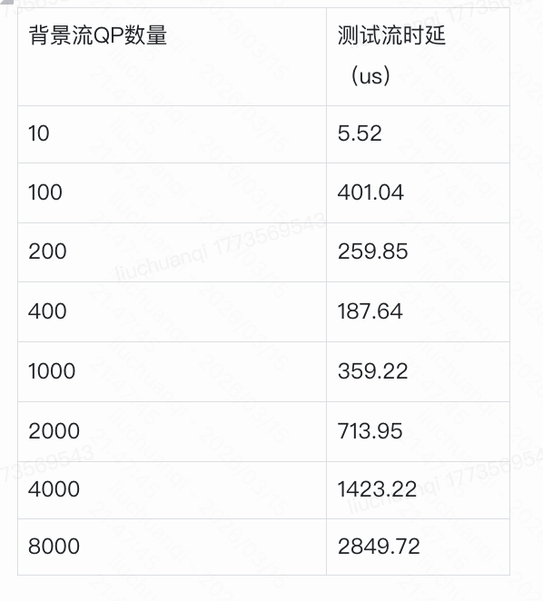

```table-of-contents
```
# 引言
RDMA允许直接访问远端内存以提供低CPU开销、低延迟和高带宽的网络传输，可以满足当前数据中心应用及云存储等交互式系统的需求. 但在现有系统中部署以太网RDMA网卡仍然面临很多问题和挑战，需要综合考虑存储容量、部署规模、网络环境、现有应用程序的兼容性和可移植性等多方面的因素. 目前已有较多的研究工作基于以太网RDMA网卡进行改进和优化，以充分发挥其性能优势.  下图统计了本文以太网RDMA网卡优化方向的相关论文.


# 概述
RDMA 被期望具有高度的可扩展性：在不可避免存在丢包的大规模数据中心网络中表现良好(高网络可伸缩性)，并支持每个服务器的大量高性能连接(高连接可伸缩性)。
商用 RoCEv2 网卡(RNIC)由于依赖于无损的、有限规模的网络结构，缺乏可伸缩性，并且只支持少量的性能连接。
最近的研究IRN通过放宽无丢包网络的要求来提高网络的可扩展性，但连接的可扩展性问题仍未得到解决。  
本文描述旨在提高网络可伸缩性及连接可扩展性。

# RNIC的可扩展性问题
商用RoCEv2 NIC（RNIC）同时存在网络可扩展性和连接可扩展性问题。
一方面，**网络可扩展性问题来自PFC（基于优先级的流控制）**，这是RDMA实现无损网络结构所需的。**PFC带来了诸如线路阻塞、拥塞扩展、偶尔死锁和大规模集群中PFC风暴**等问题。因此，数据中心运营商倾向于**将PFC配置限制在较小的网络范围内**（例如，POD内配置PFC，中等集群）。

另一方面，连接可扩展性问题是当**活跃连接数**（即队列对（QP））超过某个小阈值（例如256）时RDMA性能急剧下降的现象。尽管商用RNIC是黑盒，但这种性能崩溃现象的根本原因被解释为连接之间的上下文切换导致的缓存未命中。

## 网络可扩展性问题(Network scalability)
由于RoCEv2的网络可扩展性问题主要由PFC引起，IRN采取了第一步来重新考虑RDMA的网络需求，通过用更有效的选择性重传替换默认的有损恢复机制go-back-N，消除了PFC，并允许RDMA在有损网络中良好工作。

然而，SR的引入并不简单：它添加了一些特定于SR的数据结构，从而增加了内存消耗。为了减少片上内存开销，IRN进行了一些RoCEv2报头扩展，但仍需要比现有RNIC实现多3-10%的内存。因此，IRN实现了高网络可扩展性，但未解决连接可扩展性问题。


## 连接可扩展性问题(Connection scalability)
SRNIC利用IRN的有损RDMA方法来提高网络可扩展性，并通过设计指导原则进一步解决连接可扩展性问题：以简单而高效的方式最小化RNIC的片上存储器需求。因此，SRNIC实现了高网络可扩展性和连接可扩展性。


# 连接可扩展性问题
## 问题
存在较多连接时，表现为：性能随着QP的数量的提升出现了下降。
> 注：其实是**随着活跃的QP的个数的提升，性能存在下降。需要区分QP的总数量（total QP count）和活跃QP的数量（active QP）**。

因为：在现代数据中心 RDMA 服务中，**RNIC 的瓶颈不是带宽，而是 NIC SRAM（QP context cache）**。

我们使用现成的商用RNIC（包括启用PFC的Mellanox CX-5和CX-6）来演示此问题。如图2a所示，当QP数量从128增加到16384时，Mellanox CX-6的总吞吐量下降了46%（从97到52 Gbps），并且从CX-5到CX-6的连接可扩展性没有明显改善。

如下所示，对于Mellanox Cx5/Cx6 100G网卡，**active QP个数在 256时是一个性能的拐点**。


## 分析
RNIC性能下降的根本原因通常解释为==QPC缓存未命中=。

商用RNIC通常采用无DRAM架构，该架构没有DRAM直接连接到RNIC芯片以降低成本、功耗和面积，但只有有限的片上SRAM。
因此，RNIC只能在芯片上缓存少量QPC，而将其他QPC存储在主机内存中。当活动QP的数量增加到超过单芯片内存大小时，频繁的缓存未命中以及主机内存和RNIC之间的上下文切换会导致性能崩溃。
> 注：==网卡必须将部分 QP 的上下文换出到 **Host DRAM (主机内存)** 中。每次调度这些 QPC 时，网卡需要通过 PCIe 去读取上下文，这带来了巨大的延迟开销和 PCIe 带宽争用，导致吞吐量断崖式下跌==。

我们在图2b中的实验从某种意义上验证了这一点。在性能崩溃期间，我们观察到大量额外的PCIe带宽和ICM缓存miss的增加。这两个指标都反映了某些类型的缓存未命中，导致256个QP后额外的PCIe流量增加。

### RNIC结构

.png)
.png)

#### 片上内存 和 主机内存

**（1）什么时候缓存到网卡上**
- 频繁访问的QP信息：频繁使用的QP信息通常会被缓存到网卡的硬件缓存中。这些信息包括QP的上下文信息(QPC)、内存翻译表（MTT）等。通过将这些信息缓存到网卡上，可以减少访问延迟，提高数据传输性能。（根据网卡缓存算法预测要收发哪个QP）

- 关键控制数据：一些关键的控制数据，如当前的发送和接收队列指针、信号标志等，也会被缓存到网卡上。这些数据需要快速访问，以确保高效的队列管理和数据传输。

**（2）什么时候存储到主机内存上**

- 较少使用的QP信息：较少使用的QP信息通常会存储在主机内存中。网卡在需要时通过DMA机制从主机内存中读取这些信息。这样可以节省硬件缓存空间，确保频繁访问的数据能够快速访问。

- 大规模的QP信息：当系统中存在大量的QP时，硬件缓存可能无法容纳所有的QP信息。在这种情况下，部分QP信息会存储在主机内存中。网卡会根据需要动态地从主机内存中加载这些信息。


### QPC和QPC Cache

虽然片上SRAM是有限的，但性能下降得如此之早，这是不正常的。给定一个QP的片上内存大小和QP上下文（QPC）大小，我们可以估计在没有缓存未命中和性能崩溃的情况下可以支持的高性能QP的最大数量：


让我们以Mellanox CX-5为例。其片上内存大小为∼2 MB，QPC（QP Context）需要∼375 B，因此CX-5支持的高性能QP的最大数量可以达到5.6K（2 MB/375 B），这与图2a所示的事实相矛盾，即CX-5的性能在256个QP时就开始崩溃。这种矛盾意味着存在显著提高连接可扩展性的空间。
> 注：论文强调拐点不是固定 256，而是随流量模型、Outstanding、消息大小剧烈变化。
> 我的怀疑点是 2M 的 SRAM 是不是不是 QP Cache的大小，而是共享的大小，实际给QPC Cache 的大小更小一些。

QPC：维护一个 QP 的所有上下文，大小大概在400B左右。里面包括很多状态，例如：
```bash
QP number
send queue state
recv queue state
PSN (packet sequence number)
ACK state
retry counter
RDMA key
memory translation info
timers
```

## 改进方法

本文利用具有选择性重传的有损 RDMA概念模型来推导相关的数据结构，将这些数据结构归纳归类为两类：RDMA 一般需要的通用数据结构和有损耗 RDMA 带来的选择性重传特定数据结构，并分别讨论了将其最小化的不同优化策略，以提高连接的可伸缩性。


### WQE Cache
WQE Cache：SQ WQE 缓存可以用于缓存从主机内存中的 SQ 中获取的 `Send WQE`。假设每个 QP 在专用缓存中存储 `8 个 WQEs (64b *8)`， 10K QP 占用 4.9 MB 的片上内存。类似地， RNIC 需要从 RQ 中获取 `Receive WQEs` 来处理传入的 SEND 请求，并且可以分配一个 `RQ WQE` 缓存来存储获取的 `Receive WQEs`。 `RQ WQE`缓存的内存大小与 `SQ WQE` 缓存的内存大小相似。

#### 优化方案
##### RQ
对于RWQE，由于难以预测哪个QP会收到对端的send报文，因此需要为每个QP都预取一些RWQE下来，但这样将大量浪费SRAM，因此决定采用无预取RWQE的方案，而是将RQC放到本地SRAM中，当接受到send报文便查询RQC拿到RQ Buf地址，再去host 取下RWQE使用，相比于提前预取RWQE多出1us左右的PCIe数据来回时延，但在数据中心，小消息的典型 RDMA 网络延迟是几十微秒，增加的 1µs 延迟一般可以忽略不计。对于延迟敏感的场景(1µs 很重要)，例如机架级部署，可以通过SRQ的RWQE 缓存以优化延迟，即SRQ支持RWQE预取，减小片上SRAM需求，但对应用编程有挑战。

注意：SRNIC原文描述的是RQ使用共享RWQE Cashe的策略优化延时，但这还是难以解决大量QP突发性收到send的问题，因此从用户使用场景上要求以及逻辑配合优化更加容易实现，即SRQ预取方案。


##### SQ
SQ 在包含 WQE 时是活动的，在其他情况下是不活动的。 SQ 调度器每次从主机内存中的数万个SQs 中选择一个活动 SQ 来发送接下来的消息。SQ 调度器的设计挑战如下：

挑战1：活动 SQs 不能盲目调度，因为它们也受到拥塞控制。一个 SQ 一旦被调度，如果由于拥塞控制的信用不足而不允许发送消息，调度不仅不能生效，而且会浪费时间，降低性能。
挑战2：RNIC 和主机内存之间的 PCIe 往返延迟很高(基于 FPGA 的 RNIC 大约 1µs)，并且至少需要两个 PCIe事务(一个 WQE 获取和一个消息获取)来执行一个调度决策。如果没有仔细的设计，调度迭代之间的高延迟将显著降低性能。
挑战#3：主机内存中有成千上万个 SQs，但 RNIC 内的片上内存非常有限。禁止在 RNIC 中为不同的 SQs 使用单独的 WQE 缓存。
为了解决这些挑战，提出指导原则：SQs 应该在它们既活跃又有信用时调度，即应对挑战1；使用适当的批次处理事务和少量WQE缓存，来隐藏PCIe 延迟，即应对挑战2和挑战3。

在这些原则的指导下，提出了一种无缓存 SQ 调度器，它可以在数万个 qp 之间进行快速调度，并且对片上内存的需求最小。


### MTT
MTT：RDMA 使用数据包中的虚拟地址，而 PCIe 系统依赖于物理地址来执行 DMA 事务。为了执行地址转换， RNIC 维护一个 MTT 来将内存区域的虚拟页映射到物理页。 MTT 的大小取决于内存区域的总大小和页面大小，与连接数无关。

SRNIC原文中只描述了SRAM存放一个MTT表（4G内存）存放大小优化，这对应商用 RNIC 是不可取的，因为多个QP的SQ和RQ可能同时需要查不同MTT表。

#### 优化方案
将MTT一级表放本地SRAM，由key索引，MTT二级表放HOST DDR，同时让HOST使用2MB巨页存放用户数据和QP Buf，尽可能的减小MTT表项大小以及提高MTT一级表直接击中连续物理地址的概率。


## 改进后效果

通过上面所述优化，可以节省大量SRAM，从而存放更多的QPC，进而大幅度提高连接扩展性，即大规模连接下不会损失性能。
此外，通过扩展IB协议可能很好的应对无损和有损网络，大幅度降低对PFC需求，甚至可以摒弃PFC。


# perftest测试QP数量对于性能的影响和论文中测试的差异
## perftest测量方法和结果
如下的测试，Client和Server同TOR，都是100G的Mellanox网卡，没有使用Bond。

```bash
(1) Server端：
背景流：
ib_write_bw -d mlx5_0 -x 3 -q 1000 -s 2050 -F --run_infinitely -p 18519 --report_gbits
测时延：
ib_write_lat -x 3 -d mlx5_0 --report_gbits -s 4096 -n 1000 -p 18516 
ib_write_lat -x 3 -d mlx5_0 --report_gbits -a -p 18516 

(2) client端： 
背景流：
ib_write_bw -d mlx5_0 -x 3 -q 1000 -s 2050 -F 27.105.180.3 -p 18519 --report_gbits --run_infinitely 
测时延：
ib_write_lat -x 3 -d mlx5_0 --report_gbits -s 4096 -n 1000 27.105.180.3 -p 18516
ib_write_lat -x 3 -d mlx5_0 --report_gbits -a 27.105.180.3 -p 18516

参数说明：
      -d：指定IB设备
  -x: 指定gid index；
  -q: 指定qp数量，只有测试带宽时可用
  -s: 指定io size;
  --run_infinitely: 程序一直运行
  -p: server端监听端口或者client端指定server端的端口
  -n: 数据交换迭代测试
  -a: 测试各个io-size(从4,8,16,32,64,..., 一直到, 默认每个io-size的测试次数为1000次)的时延;
  
  
server端设置`-s` 应该是为了设置post recv wr的buf的大小。
```

### 场景一：背景流未占满带宽时
（1）在背景流没将网卡带宽占满「占用60%左右带宽时」时，测试流（单个连接，io-size=4K）的时延随着QP数量的变化情况。
```bash
背景流：
ib_write_bw -d mlx5_0 -x 3 -q 1000 -s 1024 -F --run_infinitely -p 18519 --report_gbits
ib_write_bw -d mlx5_0 -x 3 -q 1000 -s 1024 -F 27.105.180.3 -p 18519 --report_gbits --run_infinitely

测试流：
ib_write_lat -x 3 -d mlx5_0 --report_gbits -s 4096 -n 1000 -p 18516 
ib_write_lat -x 3 -d mlx5_0 --report_gbits -s 4096 -n 1000 27.105.180.3 -p 18516
```


### 场景二：背景流接近占满带宽时
在背景流将网卡带宽占满「占用90%+带宽时」时，测试流（单个连接，io-size=4K）的时延随着QP数量的变化情况。
```bash
背景流：
ib_write_bw -d mlx5_0 -x 3 -q 1000 -s 2048 -F --run_infinitely -p 18519 --report_gbits
ib_write_bw -d mlx5_0 -x 3 -q 1000 -s 2048 -F 27.105.180.3 -p 18519 --report_gbits --run_infinitely

测试流：
ib_write_lat -x 3 -d mlx5_0 --report_gbits -s 4096 -n 1000 -p 18516 
ib_write_lat -x 3 -d mlx5_0 --report_gbits -s 4096 -n 1000 27.105.180.3 -p 18516
```



### 伪结论

通过上面的测试，**误以为，QP数量的提升，性能略微下降**。

## 分析

### active QP的理解

RDMA NIC 不是“每个QP轮流处理”，而是类似于如下的：
```bash
packet pipeline
   ↓
QP context lookup
   ↓
execute
```

**active QP 更接近 同时参与调度的 QP**，即 **==某个时刻== NIC 需要同时处理多少个 QP**，而不是系统一共有多少 QP。

### perftest 的实际行为
perftest 的模式通常是：`ib_write_bw or ib_send_bw`

结构如下：
```bash
for each QP:
    post send
poll completion
```
确实是 遍历所有 QP。  但在 NIC 的视角里，这和论文中的 **active QP workload** 是两件完全不同的事情。

典型 perftest（例如  perftest 的 `ib_write_bw`）行为更像这样：
```bash
QP1: post 64 WR
QP2: post 64 WR
QP3: post 64 WR
...
```

然后 NIC 实际看到的是：
```bash
QP1 packet burst
QP2 packet burst
QP3 packet burst
```

也就是：同一个QP连续处理很多packet；这样 NIC 的行为是：
```bash
load QP1 context
process 64 packets
reuse context
```
几乎没有 cache miss。

### SRNIC论文的 测试
论文中的 workload 更像：RPC server；模式如下，每个 QP 只有 1 个 packet
```bash
client1 → QP1 → 1 packet
client2 → QP2 → 1 packet
client3 → QP3 → 1 packet
client4 → QP4 → 1 packet
```

NIC的行为：
```bash
load QP1 context
load QP2 context
load QP3 context
...
```


把 NIC QP cache 想象成 **CPU L1 cache**。
单个perftest 测试类似于如下：
```bash
AAAAAAA
BBBBBBB
CCCCCCC
```

SRNIC论文的 测试类似于如下，每次访问不同对象。
```bash
ABCDEFGHIJKL...
```

### 小结
SRNIC 研究的是：大量 active QP + random access
单个perftest 测试的是：顺序访问 QP + cache friendly traffic；因此，NIC QPC cache 没被打爆。

## 测试方法的改进
为了复现 SRNIC 研究中的active QP的提升，性能下降的效果。
进行如下的测试：

多打一的场景：即多个client和单个server建立连接，这样保证server中的多个QP都是活跃的。


# 其他
## UCX中的解决方案


使用 UD 这种方式，软件层实现有序。

## PCIe DMA 读写主机内存的实时数据查看


# 小结

# 参考
```bash
# SRNIC: A Scalable Architecture for RDMA NICs
https://www.usenix.org/system/files/nsdi23-wang-zilong.pdf

# 【RDMA】qp数量和RDMA性能（节选翻译）|连接数
https://blog.csdn.net/bandaoyu/article/details/122947096
```