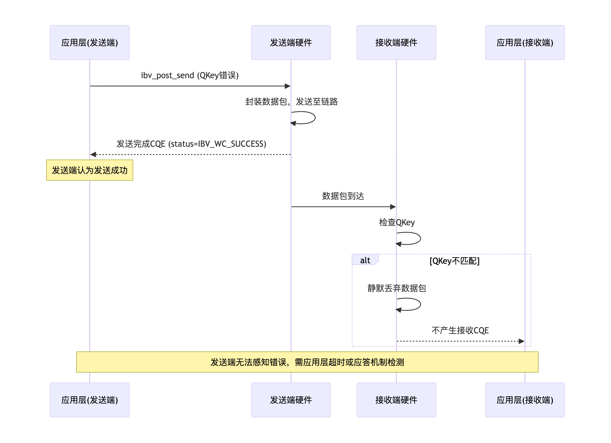
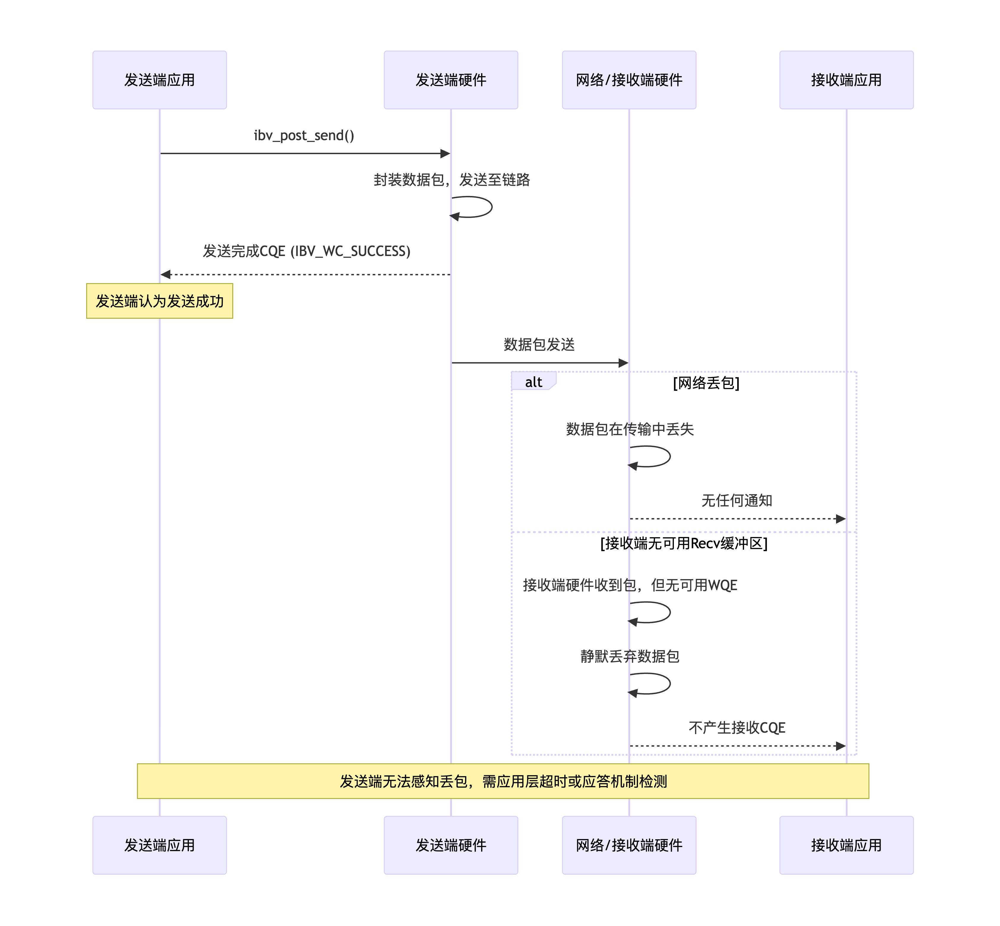

```table-of-contents
```
# 背景

如果是RC服务类型，由于RNIC网卡的片上内存有限，可存储的QPC(QP context)个数有限制，可支持的active QP个数有限；
比如：使用Cx6网卡，当active QP个数超过一定数目（比如256或者512个），就会导致性能下降。

## UD的优缺点
### 优点
#### 无连接
不需要保存复杂状态/上下文，只需要知道对端 GID+QPN+QPKEY 就可以通信。

#### 延迟小
无建立连接的开销；无连接状态机，无 ACK；

#### 连接扩展性好
一个 QP → 可以和 N 个对端通信
```bash
RC → N connections = N QP
UD → 1 QP → N peers
```

QP 占用硬件资源少（无连接状态），单卡可创建数万 UD QP；

#### 支持多播
UD 是唯一支持 multicast 的 verbs 服务类型

### 缺点
#### 不可靠
丢包、乱序需应用层实现重传 / 排序（如序列号 + 超时重传）；

#### MTU限制Message的大小 
一个WR(message)就是一个包。
如果消息长度 > MTU，发送端 Post_send的时候，会产生CQE error。

#### 无拥塞控制 & 无流控

缺乏硬件级的拥塞控制：硬件无拥塞感知，网络拥塞时丢包率飙升。
缺乏硬件级的流控：发送过快会导致对端接收队列溢出丢包，需应用层做速率控制；高吞吐率下通常不如 RC 模式稳定。

#### 无连接导致存在响应时，需要维护QPN+GID和QKEY的对应关系

server端的单个QP可以和多个client的QP通信，收包时如何知道是哪个Client以及哪个QP发来的消息呢 ？

==**如何唯一标识一个 Client：(client_gid, src_qp)**==
```bash
不同IB网卡的QPN可能重复;
一个IB网卡可以有多个QP;

GID: 就相当于是IB网卡的IP地址，可以标识一个网卡，类似于TCP/IP中的一个IP；
QPN：就类似于TCP/IP通信中的Port，代表的是一个服务；
```

**Client的网卡**：就是通过GRH（全局路由头），GRH头中包含了SGID；
**Client的QP**：就是通过BTH头中QPN，但是BTH在应用层是不可见，就可以同构 `recv WC`中的信息`wc.src_qp`；
> 注：但是==QKey 不会出现在 WC中，需要提前进行交换QKEY，然后存储 QKEY和GID+QPN的对应关系==。


```c
struct ibv_wc {
       uint64_t             wr_id; /* ID of the completed Work Request (WR): 该 wc对应的wr */
       enum ibv_wc_status   status; /* Status of the operation */
       enum ibv_wc_opcode   opcode; /* Operation type specified in the completed WR */
       uint32_t             vendor_err;
       uint32_t             byte_len; /* Number of bytes transferred; 接收或者发送的字节数 */
       /* When (wc_flags & IBV_WC_WITH_IMM): Immediate data in network byte order.
        * When (wc_flags & IBV_WC_WITH_INV): Stores the invalidated rkey.
        */
       union {
              __be32        imm_data;  /* Immediate data (in network byte order) */
              uint32_t      invalidated_rkey; /* Local RKey that was invalidated */
       };
       uint32_t             qp_num;   /* Local QP number of completed WR: wr 所在的qp */
       uint32_t             src_qp;   /* Source QP number (remote QP number) of completed WR (valid only for UD QPs) */
       unsigned int         wc_flags; /* Flags of the completed WR */
       uint16_t             pkey_index;  /* P_Key index (valid only for GSI QPs) */
       uint16_t             slid;  /* Source LID */
       uint8_t                     sl;    /* Service Level */
       uint8_t                     dlid_path_bits;      /* DLID path bits (not applicable for multicast messages) */
};
```

知道了哪个Client，以及哪个QP，可以在收到消息之后，进行回消息。


##### 如何区分Client上的不同流
在应用层实现，在 payload 里加：
```c
struct msg {  
	uint32_t conn_id;  
	uint32_t seq;  
	uint32_t ack;
	...  
};
```

这样，同一个 UD QP可以被多连接复用，然后在 payload中区分不同的连接。


## UD的特点 

|特征|UD 特点|
|---|---|
|连接模型|无连接：知道对端地址（GID+QPN+QKEY）即可发数据|
|可靠性|不可靠：无重传、无确认、无流控，丢包 / 乱序由应用层处理|
|报文大小|受网卡 MTU 限制（通常 2048/4096 字节），超 MTU 硬件直接丢弃|
|安全机制|QKey（Queue Key）：发送方 QKey 必须与接收方 QP 的 QKey 一致，否则丢包|
|地址标识|依赖「LID（本地标识，IB 子网）+ GID（全局标识，RoCE）+ QPN（QP 号）」|
|组播 / 广播|唯一支持 RDMA 组播的服务类型（RC/UC 不支持）|
|QP 复用|一个 UD QP 可向多个对端发报文，无需创建多个 QP|

## UD使用场景
### 发送小包
由于UD的MTU限制了发送消息的大小，所以UD只能发送小包。

#### 周期性心跳检测
**心跳检测 (Heartbeat)**：周期性发送小数据包。

### 支持广播
UD支持广播

#### 服务发现
广播/组播查询可用服务。

## 基于libverbs的UD服务的编程
### 流程
client / server 都需要：
```c
1. ibv_open_device
2. ibv_alloc_pd
3. ibv_reg_mr
4. ibv_create_cq
5. ibv_create_qp (UD)
6. ibv_modify_qp → INIT → RTR → RTS
```

server 额外：
```c
post_recv（必须提前）
```

交换信息：比如通过 TCP控制面交换
```bash
QPN
LID / GID
QKey
```

client 发送：
```c
1. 创建 AH（ibv_create_ah）
2. ibv_post_send（IBV_WR_SEND）
```

server端接收：
```c
poll CQ → IBV_WC_RECV
```


### 代码范例
（1）公共部分：
```c
# cat ud_common.h
#ifndef UD_COMMON_H
#define UD_COMMON_H

#include <infiniband/verbs.h>
#include <stdint.h>

#define MSG_SIZE    64      // 消息大小（字节）
#define GRH_SIZE    40      // GRH 头部大小（字节）
#define Q_KEY       0x11111111  // UD 的 Q_Key，双方必须一致

// 通过 UDP 交换的信息
struct exchange_info {
    uint32_t qpn;           // 对端 QP 号
    union ibv_gid gid;      // 对端 GID
};

// 全局资源
struct resources {
    struct ibv_device **dev_list;
    struct ibv_device *dev;
    struct ibv_context *ctx;
    struct ibv_pd *pd;
    struct ibv_cq *cq;
    struct ibv_qp *qp;
    struct ibv_mr *mr;
    char *send_buf;
    char *recv_buf;
    struct ibv_ah *ah;          // 地址句柄（指向远程）
    uint32_t local_qpn;
    union ibv_gid local_gid;
    struct exchange_info remote;
};

// 初始化 RDMA 资源（设备、PD、CQ、QP、内存）
int init_rdma_resources(struct resources *res);

// 获取本地 GID（端口1，索引0）
int get_local_gid(struct resources *res, union ibv_gid *gid);

// 创建地址句柄指向远程
int create_ah(struct resources *res);

// 投递一个接收请求
int post_recv(struct resources *res);

// 投递一个发送请求
int post_send(struct resources *res, const char *data);

// 轮询 CQ，直到收到一条消息或发送完成
// is_server: 1=等待接收, 0=等待发送完成
int poll_completion(struct resources *res, int is_server);

// 通过 UDP 交换 QPN 和 GID
// is_server: 1=服务器角色，0=客户端角色
// server_ip: 仅在客户端时提供服务器 IP
// port: UDP 端口
int exchange_info(struct resources *res, int is_server, const char *server_ip, int port);

// 清理资源
void cleanup_rdma_resources(struct resources *res);

#endif
```

```c
# cat ud_common.c

#include "ud_common.h"
#include <stdio.h>
#include <stdlib.h>
#include <string.h>
#include <unistd.h>
#include <arpa/inet.h>
#include <sys/socket.h>
#include <netinet/in.h>

int init_rdma_resources(struct resources *res)
{
    // 1. 获取设备列表，选择第一个可用设备
    int num_devices;
    res->dev_list = ibv_get_device_list(&num_devices);
    if (!res->dev_list || num_devices == 0) {
        fprintf(stderr, "No IB devices found\n");
        return -1;
    }
    res->dev = res->dev_list[0];
    res->ctx = ibv_open_device(res->dev);
    if (!res->ctx) {
        fprintf(stderr, "Failed to open device\n");
        return -1;
    }

    // 2. 分配保护域
    res->pd = ibv_alloc_pd(res->ctx);
    if (!res->pd) {
        fprintf(stderr, "Failed to allocate PD\n");
        return -1;
    }

    // 3. 创建 CQ
    res->cq = ibv_create_cq(res->ctx, 10, NULL, NULL, 0);
    if (!res->cq) {
        fprintf(stderr, "Failed to create CQ\n");
        return -1;
    }

    // 4. 创建 UD 类型 QP
    struct ibv_qp_init_attr qp_init = {
        .qp_type = IBV_QPT_UD,
        .send_cq = res->cq,
        .recv_cq = res->cq,
        .cap = {
            .max_send_wr = 10,
            .max_recv_wr = 10,
            .max_send_sge = 1,
            .max_recv_sge = 1
        }
    };
    res->qp = ibv_create_qp(res->pd, &qp_init);
    if (!res->qp) {
        fprintf(stderr, "Failed to create QP\n");
        return -1;
    }
    res->local_qpn = res->qp->qp_num;

    // 5. 注册内存（发送和接收缓冲区）
    res->send_buf = malloc(MSG_SIZE);
    res->recv_buf = malloc(MSG_SIZE + GRH_SIZE);
    if (!res->send_buf || !res->recv_buf) {
        fprintf(stderr, "Failed to allocate buffers\n");
        return -1;
    }
    memset(res->send_buf, 0, MSG_SIZE);
    memset(res->recv_buf, 0, MSG_SIZE + GRH_SIZE);

    res->mr = ibv_reg_mr(res->pd, res->send_buf, MSG_SIZE,
                         IBV_ACCESS_LOCAL_WRITE);
    if (!res->mr) {
        fprintf(stderr, "Failed to register MR\n");
        return -1;
    }

    // 6. 修改 QP 状态到 RTS
    struct ibv_qp_attr qp_attr;
    int attr_mask;

    // INIT
    qp_attr.qp_state = IBV_QPS_INIT;
    qp_attr.pkey_index = 0;
    qp_attr.port_num = 1;
    qp_attr.qkey = Q_KEY;
    attr_mask = IBV_QP_STATE | IBV_QP_PKEY_INDEX | IBV_QP_PORT | IBV_QP_QKEY;
    if (ibv_modify_qp(res->qp, &qp_attr, attr_mask)) {
        fprintf(stderr, "Failed to modify QP to INIT\n");
        return -1;
    }

    // RTR -> RTS
    qp_attr.qp_state = IBV_QPS_RTS;
    qp_attr.sq_psn = 0;
    attr_mask = IBV_QP_STATE | IBV_QP_SQ_PSN;
    if (ibv_modify_qp(res->qp, &qp_attr, attr_mask)) {
        fprintf(stderr, "Failed to modify QP to RTS\n");
        return -1;
    }

    return 0;
}

int get_local_gid(struct resources *res, union ibv_gid *gid)
{
    return ibv_query_gid(res->ctx, 1, 0, gid);
}

int create_ah(struct resources *res)
{
    struct ibv_ah_attr ah_attr = {
        .is_global = 1,                 // RoCEv2 必须为 1
        .port_num = 1,
        .dlid = 0,
        .grh = {
            .dgid = res->remote.gid,
            .sgid_index = 0,
            .hop_limit = 1,
            .traffic_class = 0
        }
    };
    res->ah = ibv_create_ah(res->pd, &ah_attr);
    return res->ah ? 0 : -1;
}

int post_recv(struct resources *res)
{
    struct ibv_sge sge = {
        .addr = (uintptr_t)res->recv_buf,
        .length = MSG_SIZE + GRH_SIZE,
        .lkey = res->mr->lkey
    };
    struct ibv_recv_wr wr = {
        .wr_id = 1,
        .sg_list = &sge,
        .num_sge = 1
    };
    struct ibv_recv_wr *bad_wr;
    return ibv_post_recv(res->qp, &wr, &bad_wr);
}

int post_send(struct resources *res, const char *data)
{
    memcpy(res->send_buf, data, MSG_SIZE);

    struct ibv_sge sge = {
        .addr = (uintptr_t)res->send_buf,
        .length = MSG_SIZE,
        .lkey = res->mr->lkey
    };
    struct ibv_send_wr wr = {
        .wr_id = 2,
        .sg_list = &sge,
        .num_sge = 1,
        .opcode = IBV_WR_SEND,
        .send_flags = IBV_SEND_SIGNALED,
        .wr.ud = {
            .ah = res->ah,
            .remote_qpn = res->remote.qpn,
            .remote_qkey = Q_KEY
        }
    };
    struct ibv_send_wr *bad_wr;
    return ibv_post_send(res->qp, &wr, &bad_wr);
}

int poll_completion(struct resources *res, int is_server)
{
    struct ibv_wc wc;
    int ret;
    int done = 0;

    while (!done) {
        ret = ibv_poll_cq(res->cq, 1, &wc);
        if (ret < 0) {
            fprintf(stderr, "Poll CQ error\n");
            return -1;
        }
        if (ret == 0) {
            usleep(1000);
            continue;
        }

        if (wc.status != IBV_WC_SUCCESS) {
            fprintf(stderr, "WC error: %s\n", ibv_wc_status_str(wc.status));
            return -1;
        }

        if (wc.opcode == IBV_WC_RECV) {
            // 处理接收：跳过 GRH
            char *payload;
            if (wc.wc_flags & IBV_WC_GRH) {
                payload = res->recv_buf + GRH_SIZE;
                printf("Received: %.*s\n", MSG_SIZE, payload);
            } else {
                payload = res->recv_buf;
                printf("Received (no GRH): %.*s\n", MSG_SIZE, payload);
            }
            // 重新投递接收
            if (post_recv(res))
                fprintf(stderr, "Failed to repost recv\n");
            done = 1;
        } else if (wc.opcode == IBV_WC_SEND) {
            printf("Send completed\n");
            done = 1;
        }
    }
    return 0;
}

int exchange_info(struct resources *res, int is_server, const char *server_ip, int port)
{
    struct sockaddr_in addr;
    int sock = socket(AF_INET, SOCK_DGRAM, 0);
    if (sock < 0) {
        perror("socket");
        return -1;
    }

    struct exchange_info local_info = { .qpn = res->local_qpn };
    memcpy(&local_info.gid, &res->local_gid, sizeof(local_info.gid));

    if (is_server) {
        // 服务器：绑定端口，接收客户端信息，回复本地信息
        memset(&addr, 0, sizeof(addr));
        addr.sin_family = AF_INET;
        addr.sin_addr.s_addr = INADDR_ANY;
        addr.sin_port = htons(port);
        if (bind(sock, (struct sockaddr *)&addr, sizeof(addr)) < 0) {
            perror("bind");
            close(sock);
            return -1;
        }

        struct sockaddr_in client_addr;
        socklen_t len = sizeof(client_addr);
        if (recvfrom(sock, &res->remote, sizeof(res->remote), 0,
                     (struct sockaddr *)&client_addr, &len) != sizeof(res->remote)) {
            perror("recvfrom");
            close(sock);
            return -1;
        }
        printf("Server: received remote QPN=%u, GID=%s\n",
               res->remote.qpn,
               inet_ntop(AF_INET6, &res->remote.gid, (char[64]){}, 64));

        if (sendto(sock, &local_info, sizeof(local_info), 0,
                   (struct sockaddr *)&client_addr, len) != sizeof(local_info)) {
            perror("sendto");
            close(sock);
            return -1;
        }
    } else {
        // 客户端：发送本地信息到服务器，然后接收回复
        memset(&addr, 0, sizeof(addr));
        addr.sin_family = AF_INET;
        addr.sin_port = htons(port);
        inet_pton(AF_INET, server_ip, &addr.sin_addr);

        if (sendto(sock, &local_info, sizeof(local_info), 0,
                   (struct sockaddr *)&addr, sizeof(addr)) != sizeof(local_info)) {
            perror("sendto");
            close(sock);
            return -1;
        }

        if (recvfrom(sock, &res->remote, sizeof(res->remote), 0, NULL, NULL) != sizeof(res->remote)) {
            perror("recvfrom");
            close(sock);
            return -1;
        }
        printf("Client: received remote QPN=%u, GID=%s\n",
               res->remote.qpn,
               inet_ntop(AF_INET6, &res->remote.gid, (char[64]){}, 64));
    }

    close(sock);
    return 0;
}

void cleanup_rdma_resources(struct resources *res)
{
    if (res->ah) ibv_destroy_ah(res->ah);
    if (res->mr) ibv_dereg_mr(res->mr);
    if (res->send_buf) free(res->send_buf);
    if (res->recv_buf) free(res->recv_buf);
    if (res->qp) ibv_destroy_qp(res->qp);
    if (res->cq) ibv_destroy_cq(res->cq);
    if (res->pd) ibv_dealloc_pd(res->pd);
    if (res->ctx) ibv_close_device(res->ctx);
    if (res->dev_list) ibv_free_device_list(res->dev_list);
}
```


(2) server端：
```c
#include "ud_common.h"
#include <stdio.h>
#include <stdlib.h>

int main(int argc, char *argv[])
{
    int port = (argc > 1) ? atoi(argv[1]) : 12345;

    struct resources res = {0};

    // 1. 初始化 RDMA 资源
    if (init_rdma_resources(&res)) {
        fprintf(stderr, "Failed to init RDMA resources\n");
        cleanup_rdma_resources(&res);
        return 1;
    }

    // 2. 获取本地 GID
    if (get_local_gid(&res, &res.local_gid)) {
        fprintf(stderr, "Failed to get local GID\n");
        cleanup_rdma_resources(&res);
        return 1;
    }

    // 3. 与客户端交换 QPN 和 GID（服务器角色）
    if (exchange_info(&res, 1, NULL, port)) {
        fprintf(stderr, "Failed to exchange info\n");
        cleanup_rdma_resources(&res);
        return 1;
    }

    // 4. 创建地址句柄指向客户端
    if (create_ah(&res)) {
        fprintf(stderr, "Failed to create AH\n");
        cleanup_rdma_resources(&res);
        return 1;
    }

    // 5. 投递一个接收请求，准备接收数据
    if (post_recv(&res)) {
        fprintf(stderr, "Failed to post recv\n");
        cleanup_rdma_resources(&res);
        return 1;
    }

    // 6. 等待接收消息
    printf("Server waiting for message...\n");
    if (poll_completion(&res, 1) != 0) {
        fprintf(stderr, "Error during polling\n");
        cleanup_rdma_resources(&res);
        return 1;
    }

    cleanup_rdma_resources(&res);
    return 0;
}
```

(3) client端：
```c
#include "ud_common.h"
#include <stdio.h>
#include <stdlib.h>
#include <string.h>

int main(int argc, char *argv[])
{
    if (argc < 2) {
        fprintf(stderr, "Usage: %s <server_ip> [port]\n", argv[0]);
        return 1;
    }

    const char *server_ip = argv[1];
    int port = (argc > 2) ? atoi(argv[2]) : 12345;

    struct resources res = {0};

    // 1. 初始化 RDMA 资源
    if (init_rdma_resources(&res)) {
        fprintf(stderr, "Failed to init RDMA resources\n");
        cleanup_rdma_resources(&res);
        return 1;
    }

    // 2. 获取本地 GID
    if (get_local_gid(&res, &res.local_gid)) {
        fprintf(stderr, "Failed to get local GID\n");
        cleanup_rdma_resources(&res);
        return 1;
    }

    // 3. 与服务器交换 QPN 和 GID
    if (exchange_info(&res, 0, server_ip, port)) {
        fprintf(stderr, "Failed to exchange info\n");
        cleanup_rdma_resources(&res);
        return 1;
    }

    // 4. 创建地址句柄指向服务器
    if (create_ah(&res)) {
        fprintf(stderr, "Failed to create AH\n");
        cleanup_rdma_resources(&res);
        return 1;
    }

    // 5. （可选）预投递一个接收，以便接收可能的回复（本示例中客户端只发不收，但留出接口）
    // 为了通用性，也投递一个接收
    if (post_recv(&res)) {
        fprintf(stderr, "Failed to post recv\n");
        cleanup_rdma_resources(&res);
        return 1;
    }

    // 6. 发送一条消息
    const char *msg = "Hello from client!";
    printf("Client sending: %s\n", msg);
    if (post_send(&res, msg)) {
        fprintf(stderr, "Failed to post send\n");
        cleanup_rdma_resources(&res);
        return 1;
    }

    // 7. 等待发送完成
    if (poll_completion(&res, 0) != 0) {
        fprintf(stderr, "Error during polling\n");
        cleanup_rdma_resources(&res);
        return 1;
    }

    cleanup_rdma_resources(&res);
    return 0;
}
```

### 注意事项
#### GRH 头
UD recv buffer：前 40 bytes = GRH， 实际数据：buf + 40

##### IB网络 和 RoceV2网络分层

**（1）IB 报文整体结构**：

```bash
┌──────────────────────────────────────────┐
│        Local Routing Header (LRH)        │  ← 链路层（IB交换机用）
├──────────────────────────────────────────┤
│        Global Routing Header (GRH)       │  ← 类似 IP（可选）
├──────────────────────────────────────────┤
│        Base Transport Header (BTH)       │  ← RDMA核心头
├──────────────────────────────────────────┤
│   Extended Transport Headers (ETHs)      │  ← RDMA操作相关
├──────────────────────────────────────────┤
│                Payload                   │  ← 数据
├──────────────────────────────────────────┤
│            ICRC / VCRC                   │  ← 校验
└──────────────────────────────────────────┘

LRH（Local Routing Header）——IB链路层: 类似以太网 MAC + VLAN 的角色，完全不依赖 IP
GRH（Global Routing Header）——类似 IP 层：
```

**（2) RoceV2 报文整体结构**：

```bash
┌──────────────────────────────────────────┐
│            Ethernet Header               │
├──────────────────────────────────────────┤
│              IP Header (IPv4/IPv6)       │
├──────────────────────────────────────────┤
│              UDP Header                  │
├──────────────────────────────────────────┤
│        Base Transport Header (BTH)       │  ← RDMA核心
├──────────────────────────────────────────┤
│   Extended Transport Headers (ETHs)      │
├──────────────────────────────────────────┤
│                Payload                   │
├──────────────────────────────────────────┤
│                ICRC                      │
└──────────────────────────────────────────┘
```

从协议栈看，RoCEv2 用 UDP/IP 头部替代了 IB 的 GRH，让 RoCEv2 包可以跨路由。

##### RoCEv2 下UD编程时为什么会感知到GRH头？
**问题**：
本身在RoCEv2中都没有GRH头，GRH头是IB网络中的三层头，但是在UD编程中，收包的时候需要跳过GRH头（40B），后面才是payload；发包的时候，要设置AH中的GRH信息。


**统一编程模型**：为了让同一份 RDMA 应用程序既能在原生 IB 网络上运行，也能在 RoCE 网络上运行，Verbs API 被设计为**始终假设 GRH 存在**。==RoCEv2 并没有真的发 GRH，而是：用 IP Header + UDP Header 来承载 GRH 的信息==。RoCEv2 强制使用类似 IB GRH 的地址信息（GID），  并把它映射到 IP/UDP 头中，同时在接收侧以 GRH 结构形式暴露给应用。
> 即：==RoCEv2 UD 能感知 GRH，  不是因为网络上真的有 GRH，  而是 NIC 把 IP 头“翻译”成了 GRH 结构给你用==。

|IB GRH 字段|RoCEv2 对应|
|---|---|
|DGID|目的 IP|
|SGID|源 IP|
|Flow Label|IPv6 Flow Label|
|Traffic Class|DSCP|
|Hop Limit|TTL|

在 RoCEv2网络的接收端，NIC 内部会做：
```bash
解析 IP Header
    ↓
构造一个“伪 GRH”
    ↓
写入到 recv buffer 前面
```

**UD（无连接）**：每个包都可能来自不同源，必须携带地址（GID），才知道是哪个源过来的报文。对于RC而言，则不需要GRH信息，因为RC是可靠连接，QP已经绑定了对端，不需要地址信息。

#### QKey 错误无感知



对于发送端而言，Signaled 的 WR，NIC发送出去之后，就产生了CQE（IBV_WC_SUCCESS），无法感知到QKEY错误。
对于接收端而言， 接收端会做 QKey 校验，校验失败 → 直接硬件静默丢包，不反馈、不通知、不给 CQE。

#### 丢包不可见
中间网络或者接收端丢包，没有 CQE 错误，发送端和接收端都无法感知，需要应用层 ACK / 超时。



两种常见丢包场景：
- **网络丢包**：数据包在传输路径中丢失，接收端完全无感知。
- **接收端无可用接收缓冲区**：数据包到达接收端硬件，但因没有预先 post 的 recv WQE 而被硬件丢弃。

#### AH 创建开销
频繁 create_ah → 性能差；
解决：缓存 AH

缓存 AH

# 思路

## 基于QUIC协议的可靠性在用户态实现UD的可靠传输

下面是通过：`Claude-Opus-4.6`分析得到的。一次输入问题，直接得出的，还没有调整的。

### 一、动机与背景分析
#### 为什么选 UD 而非 RC

RDMA RC（Reliable Connected）模式虽然提供了硬件级别的可靠传输，但存在严重的可扩展性问题。每条 RC 连接需要在网卡（RNIC）上维护独立的 QP Context，包括发送/接收队列、序列号状态、重传定时器等。在大规模集群中（例如数千节点的 all-to-all 通信），QP 数量呈 O(N²) 增长，导致网卡上的 cache（通常只能缓存几百到几千个 QP Context）频繁 thrash，性能急剧下降——这就是所谓的 **"QP scalability problem"**。
而 UD 模式下，单个 QP 即可与任意数量的远端通信，网卡上的状态极小，天然具备高可扩展性。

#### 为什么借鉴 QUIC

QUIC 所面对的问题与我们的场景高度同构：QUIC 是在不可靠的 UDP 之上、在用户态构建可靠传输；
我们的目标是**在不可靠的 RDMA UD 之上、在用户态构建可靠传输**。

QUIC 的很多设计决策——单调递增的包号消除重传歧义、多流复用避免队头阻塞、精细的流控分层、可插拔的拥塞控制——都直接适用于我们的场景。

同时，**RDMA UD 比 UDP 有着更低的基础延迟（kernel bypass、zero-copy），在其上构建的可靠协议有机会达到比 QUIC 更低的端到端延迟**。

### 二、整体架构设计
核心设计原则是：**网卡只负责不可靠数据报的收发（UD），所有传输语义（可靠性、序号、流控、拥塞控制）全部在用户态软件中实现**。这与 QUIC 把传输逻辑从内核 TCP 搬到用户态的理念一脉相承。

```bash
┌─────────────────────────────────────────────────┐
│              应用层 (Application)                 │
│         send(conn, stream, data, len)            │
├─────────────────────────────────────────────────┤
│           Stream 管理层 (Stream Layer)            │
│    流级别流控 / 有序交付 / 分片重组                  │
├─────────────────────────────────────────────────┤
│         连接管理层 (Connection Layer)              │
│  连接级别流控 / 多路复用 / 连接迁移 / 加密(可选)     │
├─────────────────────────────────────────────────┤
│         可靠传输层 (Reliability Engine)            │
│  ACK 处理 / 丢包检测 / 重传调度 / RTT 估算          │
├─────────────────────────────────────────────────┤
│         拥塞控制层 (Congestion Control)            │
│    可插拔: NewReno / CUBIC / BBR / DCQCN / TIMELY│
├─────────────────────────────────────────────────┤
│         Pacing / 发送调度层                        │
│        令牌桶 / Timer-wheel / busy-poll           │
├─────────────────────────────────────────────────┤
│         UD 传输层 (UD Transport)                  │
│      ibv_post_send / ibv_post_recv / CQ poll     │
├─────────────────────────────────────────────────┤
│              RDMA NIC Hardware                    │
└─────────────────────────────────────────────────┘
```



### 三、数据包格式设计
#### 3.1 UD 约束

UD 模式下，每个数据包最大只能携带一个 MTU 的数据（IB 网络通常 4096 bytes，RoCE 通常约 4096 或受限于以太网 MTU）。GRH（Global Route Header）占 40 bytes，所以可用载荷略小于 MTU。所有协议头都必须设计得紧凑。

#### 3.2 包头设计（借鉴 QUIC Packet Header）
```bash
0                   1                   2                   3
 0 1 2 3 4 5 6 7 8 9 0 1 2 3 4 5 6 7 8 9 0 1 2 3 4 5 6 7 8 9 0 1
+-+-+-+-+-+-+-+-+-+-+-+-+-+-+-+-+-+-+-+-+-+-+-+-+-+-+-+-+-+-+-+-+
|  Header Form  |  Packet Type  |         Reserved/Flags        |
+-+-+-+-+-+-+-+-+-+-+-+-+-+-+-+-+-+-+-+-+-+-+-+-+-+-+-+-+-+-+-+-+
|                     Connection ID (64-bit)                    |
|                                                               |
+-+-+-+-+-+-+-+-+-+-+-+-+-+-+-+-+-+-+-+-+-+-+-+-+-+-+-+-+-+-+-+-+
|                     Packet Number (64-bit)                    |
|                                                               |
+-+-+-+-+-+-+-+-+-+-+-+-+-+-+-+-+-+-+-+-+-+-+-+-+-+-+-+-+-+-+-+-+
|                      Frame(s) Payload                         |
|                          ...                                  |
+-+-+-+-+-+-+-+-+-+-+-+-+-+-+-+-+-+-+-+-+-+-+-+-+-+-+-+-+-+-+-+-+
```

关键字段说明：

**Connection ID（连接标识符，8字节）**：这是借鉴 QUIC 最核心的设计之一。由于 UD QP 是共享的，不同逻辑连接的包都从同一个 QP 收发，必须通过 Connection ID 来区分不同的逻辑连接。接收端根据 Connection ID 在本地哈希表中查找对应的连接上下文。Connection ID 还使得连接可以在不同 QP 之间迁移而不中断（类似 QUIC 的连接迁移）。

**Packet Number（包号，8字节）**：这里严格遵循 QUIC 的设计——**包号单调递增，永不重用**。即使是重传的数据，也会使用新的包号封装。这彻底消除了 TCP 的重传歧义（retransmission ambiguity）问题，使得 RTT 采样始终准确。实际实现中可以用变长编码压缩包号（如 QUIC 的 1/2/4 字节编码），但在数据中心内网场景下，为了简化解析开销，直接使用 8 字节也可接受。

**Packet Type**：区分包的类型，包括 Initial（握手初始包）、Handshake（握手确认包）、Short Header（数据包，握手完成后使用更短的头部）、Retry 等。数据中心内部如果不需要加密认证，可以简化握手类型。

#### 3.3 帧格式（Frame-based Design）

每个 UD 包的 payload 部分由一个或多个 **Frame** 组成，这也是直接借鉴 QUIC 的**多帧复用**设计。帧类型包括：

**STREAM Frame**：携带应用数据，包含 Stream ID（标识哪条逻辑流）、Offset（该数据在流中的字节偏移量，用于接收端按序重组）、Length（数据长度）、FIN bit（标识流的结束）。Offset 的使用是 QUIC 的精华之一——即使包号不连续、即使数据被重传到不同的包中，接收端都能根据 Stream ID + Offset 精确定位数据在流中的位置。

**ACK Frame**：确认接收到的包号范围，采用 QUIC 风格的 ACK Range 编码。一个 ACK Frame 可以报告多个不连续的包号范围（等效于 TCP SACK，但更紧凑）。同时包含 ACK Delay 字段（ACK 延迟时间），用于精确计算 RTT。

**MAX_DATA Frame**：通告连接级别的流控窗口更新（类似 QUIC 的 MAX_DATA）。

**MAX_STREAM_DATA Frame**：通告某条流的流控窗口更新。

**STREAM_DATA_BLOCKED / DATA_BLOCKED Frame**：当发送端被流控阻塞时发送，通知对端及时扩大窗口。

**NEW_CONNECTION_ID / RETIRE_CONNECTION_ID Frame**：用于连接 ID 的轮换和迁移。

**PING / PONG Frame**：保活和 RTT 探测。

**CONNECTION_CLOSE Frame**：连接关闭。

一个 UD 包中可以同时包含 ACK Frame 和 STREAM Frame（ACK 搭便车），减少纯 ACK 包的数量。这种帧复用在 UD MTU 受限的场景下尤为重要，能提高每个包的利用率。


### 四、连接管理与多路复用

#### 4.1 连接建立

借鉴 QUIC 的 1-RTT 握手（数据中心内部如不需要 TLS 认证，可以进一步简化为 0-RTT）：

第一步，客户端发送 Initial 包，携带 Connection ID proposal、初始流控参数（初始窗口大小、最大流数量等）。由于是 UD，客户端需要知道服务端的 QP Number 和 GID/LID，这些信息可通过带外机制（如 etcd/ZooKeeper 注册表、或额外的 CM 服务）预先获取。

第二步，服务端回复 Handshake 包，确认 Connection ID，回传自己的流控参数。此时连接建立完成，双方可以立即开始传输数据。

如果要防止地址欺骗（UD 场景下对端地址来自 GRH，可以伪造），可引入类似 QUIC Retry 的机制：服务端先回一个 Retry Token，客户端需携带此 Token 重发 Initial 包，以验证源地址的可达性。但在可信的数据中心内网环境中，这一步通常可以省略。

#### 4.2 Connection ID 与多路复用

一个 UD QP 上可以同时承载数百甚至数千条逻辑连接，每条连接通过唯一的 Connection ID 区分。接收端在 poll CQ 取到一个 UD 包后，先解析前几个字节获取 Connection ID，然后在一个 **高效的哈希表**（如 Cuckoo Hash 或 Robin Hood Hash）中查找对应的连接上下文。

每条连接（Connection）下又可以承载多条流（Stream），每条流有独立的 Stream ID、字节偏移计数器、流级流控状态。这就是 QUIC 的多流复用模型，相比 RC 的单一字节流，天然避免了队头阻塞（Head-of-Line Blocking）——一条流的丢包不会阻塞其他流的数据交付。

#### 4.3 连接迁移

由于连接标识不再绑定于底层的 QP Number 或 address handle，而是由 Connection ID 唯一标识，所以连接可以在不同的 UD QP 之间迁移。例如，在 QP 故障或负载均衡时，发送端可以从新的 QP 发送带有相同 Connection ID 的包，接收端识别到 Connection ID 后更新该连接的源地址信息即可。这种解耦带来了极大的灵活性。

### 五、可靠性机制（核心模块）

#### 5.1 包号单调递增原则

这是从 QUIC 借鉴的最重要的设计决策之一。TCP 的序列号标识的是字节流中的位置，重传的报文段使用相同的序列号，这导致了"重传歧义"——收到一个 ACK 时无法确定它确认的是原始传输还是重传，从而 RTT 采样不准确（Karn's Algorithm 只是一个 workaround）。

在我们的协议中，Packet Number 是全局单调递增的计数器，每发送一个包（无论是新数据还是重传数据），都消耗一个新的包号。**数据在流中的位置由 STREAM Frame 的 Offset 字段标识，而不是由包号标识**。因此：

当收到 ACK 确认了包号 N 时，发送端能准确知道这就是包号 N 的 ACK，从而精确计算 RTT 样本。当需要重传 Stream X 的 Offset `[1000, 2000)` 这段数据时，会把它放入一个新的包（比如包号 N+10），包号 N+10 被 ACK 后，发送端知道重传成功了，且能准确计算这次重传的 RTT。


#### 5.2 ACK 机制

接收端维护一个**已收到包号的位图或区间列表**。在发送 ACK Frame 时，将这些区间编码进去。ACK Frame 的结构类似于：

```bash
Largest Acknowledged:     最大已确认包号
ACK Delay:               从收到最大包号到发送ACK的延迟（微秒）
ACK Range Count:         ACK 区间数量
First ACK Range:         从 Largest Ack 开始往回的连续确认数量
[Gap, ACK Range]*:       后续的间隔和连续确认区间
```

这与 QUIC 的 ACK Frame 编码完全一致。例如，如果接收端收到了包号 1-5, 8-10, 15，那么 ACK Frame 会编码为三个区间：`[15,15], [8,10], [1,5]`。

**ACK 发送策略**：在数据中心低延迟场景下，不宜像 TCP 那样延迟 ACK（delayed ACK 通常 40ms，太慢了）。推荐的策略是每收到 N 个包发一个 ACK（N 可配置，典型值为 2-4），或者设置一个很短的延迟定时器（如 10-50 微秒）。在高吞吐场景下，ACK 可以搭便车（piggyback）在反方向的数据包中。ACK 本身不需要被 ACK（QUIC 的设计），这避免了 ACK 确认风暴。

#### 5.3 丢包检测

丢包检测采用 QUIC 的两种机制并行：

**基于包号的检测（Packet Threshold）**：如果一个包号之后已经有 kPacketThreshold 个更大的包号被确认（QUIC 默认为 3），则认为该包丢失。这与 TCP 的三个重复 ACK 触发快速重传原理类似，但由于包号单调递增且 ACK Range 精确，判断更加干净利落。

**基于时间的检测（Time Threshold）**：如果一个包发送后经过了 `max(kTimeThreshold × smoothed_rtt, kGranularity)` 的时间仍未被确认，则判定丢失。kTimeThreshold 通常取 9/8（即 1.125 倍 SRTT）。这处理了包号阈值方法可能漏检的尾部丢包`（tail loss）` 场景。

两种检测方式是互补的。在数据中心中，RTT 通常在微秒级别（10-100μs），所以时间阈值检测需要较精确的定时器或基于 `RDMA CQE timestamp` 的时间追踪。

#### 5.4 重传机制

当检测到丢包后，将丢失包中携带的 STREAM Frame 数据标记为"待重传"。重传时，这些数据会被重新封装进新的包（分配新包号），并可能与其他帧合并。重传逻辑维护一个**重传队列**（按优先级排序：重传数据优先于新数据），每次有发送机会时，优先从重传队列取数据。

**PTO（Probe Timeout）**：当一段时间内没有收到任何 ACK（所有 in-flight 包可能都丢了），触发 PTO。PTO 的超时值基于 SRTT 计算，采用指数退避。PTO 触发时，发送一个或两个探测包（包含未确认的数据或 PING Frame），目的是刺激对端发送 ACK，从而更新丢包检测状态。

#### 5.5 Sent Packet 元数据管理

发送端需要维护一个 **sent_packets** 数据结构（按包号索引的有序映射），记录每个 in-flight 包的元数据：发送时间戳、包大小、包含的帧列表（哪些 Stream 的哪些 Offset 范围）。当 ACK 到达时，从 sent_packets 中移除已确认的包，提取 RTT 样本，更新拥塞窗口。当包被判定丢失时，从 sent_packets 中提取需要重传的帧数据，加入重传队列。

为了避免 sent_packets 无限增长，使用 QUIC 的策略：被确认的包立即移除；被判定丢失且已重传的包标记为 lost 并在确认重传后移除。

### 六、拥塞控制

#### 6.1 设计原则

拥塞控制层设计为**可插拔**的模块，通过一组统一的回调接口与可靠性引擎交互。这是 QUIC 的一大优势——因为在用户态实现，切换拥塞算法只需修改用户态代码，无需修改内核，非常灵活。

拥塞控制器的接口定义大致如下：
```c
struct congestion_controller {
    void (*on_packet_sent)(cc_state *cc, uint64_t pkt_num, 
                           uint32_t bytes, uint64_t send_time);
    void (*on_ack_received)(cc_state *cc, uint64_t largest_acked,
                            uint32_t acked_bytes, uint64_t rtt_sample,
                            uint64_t ack_time, bool ecn_ce);
    void (*on_packet_lost)(cc_state *cc, uint32_t lost_bytes, 
                           uint64_t lost_send_time);
    uint64_t (*get_cwnd)(cc_state *cc);
    uint64_t (*get_pacing_rate)(cc_state *cc);
    bool (*can_send)(cc_state *cc, uint64_t bytes_in_flight);
};
```

#### 6.2 数据中心场景下的拥塞算法选择

**DCQCN（Data Center QCN）**：如果网络支持 ECN/PFC（RoCEv2 环境下通常支持），DCQCN 是最自然的选择。它是专门为数据中心 RDMA 设计的拥塞控制算法，原本在 RC 模式下由网卡固件实现，但在我们的用户态框架中，可以在软件中实现其逻辑——监测 ECN CE 标记（通过解析 GRH 或 CQE 中的 ECN 位），根据 CNP（Congestion Notification Packets）的频率来调节发送速率。

**TIMELY**：Google 提出的基于 RTT 的数据中心拥塞控制算法，利用精确的 RTT 测量来推断拥塞程度。我们的框架由于有精确的 RTT 采样（得益于 QUIC 的包号设计），TIMELY 是非常合适的。TIMELY 计算 RTT 的梯度（gradient）：如果 RTT 在上升，说明队列在累积，降低发送速率；如果 RTT 稳定或下降，则逐步增加速率。

**HPCC（High Precision Congestion Control）**：阿里提出的算法，利用 INT（In-band Network Telemetry）信息，获取交换机端口的精确队列深度和链路利用率。如果网络支持 INT，这可以提供最精确的拥塞信号。

**BBR**：Google 的 BBR 算法在数据中心场景下也有不错的表现（特别是 BBRv2 对公平性和低延迟的改进）。它通过估算瓶颈带宽（BtlBw）和最小 RTT（RTprop）来驱动发送速率，不依赖丢包信号，适合丢包率极低的数据中心环境。

**NewReno / CUBIC**：作为基础实现，可以先支持这两个经典算法，用于对比和 fallback。


#### 6.3 Pacing（发送速率平滑）

QUIC 强调 pacing 的重要性，我们的实现也必须支持。在数据中心高速网络中，突发发送（burst）会导致交换机缓冲区短暂溢出，造成不必要的丢包。Pacing 将包的发送均匀分布在时间上。

实现方式有以下几种。在纯 busy-polling 的模型中（数据中心高性能场景常用），每次 poll 循环中检查当前时间是否到达下一个包的发送时间，到了才发送。发送间隔 = 包大小 / pacing_rate。时间源可以使用 `rdtsc` 指令（纳秒级精度），避免 `clock_gettime` 的系统调用开销。另一种方式是使用 timer wheel 或 `timerfd`，但在微秒级延迟要求下，busy-polling 方式更可靠。

#### 6.4 bytes_in_flight 的维护

拥塞控制的核心状态之一是 `bytes_in_flight`（已发送但尚未确认的字节数）。发送一个包时增加该包大小，收到 ACK 确认一个包时减去该包大小，检测到丢包时也减去（因为需要重传，不再算 in-flight）。发送条件为 `bytes_in_flight + 待发送包大小 <= cwnd`。

#### 6.5 ECN 支持

在 RoCEv2 环境下，IP 头中的 ECN 位可以由交换机标记。UD 接收端可以从 GRH 或 WC（Work Completion）中获取 ECN 信息。接收端在 ACK Frame 中报告收到的 ECN-CE 标记数量，发送端据此触发拥塞响应（类似 QUIC 的 ECN 处理）。

### 七、流量控制

#### 7.1 两级流控模型

与 QUIC 完全一致，采用**连接级**和**流级**两层流量控制：

**流级流控（Per-Stream Flow Control）**：每条 Stream 有独立的接收窗口。接收端通过 MAX_STREAM_DATA Frame 通告某条流的最大允许接收偏移量。例如，接收端发送 `MAX_STREAM_DATA { stream_id=5, max_data=1048576 }` 表示流 5 的发送端最多可以发送到偏移量 1MB 的位置。发送端不得发送超过此偏移量的数据。

**连接级流控（Connection-Level Flow Control）**：所有流共享一个连接级的总接收窗口。接收端通过 MAX_DATA Frame 通告整条连接的最大允许接收总字节数。即使某条流还有剩余流控额度，如果连接级窗口耗尽，也不能发送。

两级流控的意义在于：流级流控防止单条流消耗过多接收端的缓冲区（影响其他流）；连接级流控限制整条连接的总资源消耗，防止一个连接耗尽接收端的全部内存。

#### 7.2 窗口更新策略

接收端在消费掉缓冲区中的数据后（应用层 read），及时发送窗口更新帧。更新策略可以参考经典的做法：当已消费的数据量超过初始窗口的一半时，发送更新。在数据中心低延迟场景下，可以更激进地更新（每次 read 后立即更新），或者让窗口更新搭便车在下一个 ACK 或数据包中。

一个优化是**自动调节窗口大小（Auto-tuning）**：根据 RTT 和吞吐率动态调整接收窗口，类似 Linux TCP 的 autotuning。窗口大小应至少为 `BDP（带宽延迟积）= 链路带宽 × RTT`，以确保管道充满。在 100Gbps、RTT=10μs 的数据中心中，BDP 约为 125KB，窗口至少应设为这个量级。

#### 7.3 反压（Backpressure）机制

当发送端被流控阻塞时，发送 STREAM_DATA_BLOCKED 或 DATA_BLOCKED Frame 通知对端。这不仅是信令，还可以帮助对端检测"窗口更新丢失"的情况——如果接收端已经发送了窗口更新但该包丢失了，发送端的 BLOCKED 帧能刺激接收端重发更新。

#### 7.4 接收缓冲区管理

接收端为每条流维护一个**重组缓冲区（Reassembly Buffer）**。由于 UD 包可能乱序到达，接收端需要根据 STREAM Frame 的 Offset 将数据插入正确的位置。这可以用一个**有序区间映射**（如红黑树或简单的链表，key 为 Offset 范围）实现。当连续的数据从偏移量 0 开始可读时，将数据交付给应用层，并推进流的"已消费偏移量"。

对于整个 UD QP，接收端需要预先 post 足够多的 receive WRs（Work Requests）。如果 receive WRs 耗尽，新到达的 UD 包会被网卡丢弃。因此需要一个 **receive buffer pool 管理模块**，动态调整 posted receive WRs 的数量，确保不会因为 RQ 耗尽而丢包。这是 UD 特有的挑战——receive buffer 的管理本身就是一种"底层流控"。


### 八、多路径(multi-path)和负载均衡
#### 8.1 背景
在用户态 RDMA UD 可靠传输栈中，大象流（Elephant Flow）不只是一个"占用带宽"的问题——它在多个维度同时制造破坏。理解这一点是设计解决方案的起点。

**什么是大象流**：在数据中心流量分布中，约 5% 的流占据了超过 80% 的字节数。这些流持续数百毫秒到数秒，字节数从几百 MB 到数十 GB。相对地，鼠流（Mice Flow）数量极多但极短，往往只有几十个包。两类流共享同一网络时，大象流天然地挤压鼠流。

**RDMA UD 场景下的三重恶化**：

第一，ECMP 哈希碰撞——传统 ECMP 按五元组哈希，多条大象流极易碰撞到同一物理链路，使该链路过载而其他链路空闲；
传统 RDMA（RC/UD）通常只使用一条固定路径（基于 GID 和 LID 的最短路径），无法动态避开拥塞链路。

第二，PFC 风暴传导——单条大象流触发 PFC 后，暂停帧沿整条链路传播，导致同链路上所有鼠流的 HOL（队首阻塞）；
第三，可靠传输的放大效应——在加了可靠性之后，大象流的重传本身又成为新的大象流，在拥塞链路上进一步加剧问题。
第四，UD 无连接，单 QP / 单路径传输时，所有流（大象 + 小象）共享五元组，共享同一个路径，共享同一个交换机的同一发送队列，无优先级调度；

##### 问题空间的完整定义

在加了 QUIC 理念的可靠传输（含流控 + 拥塞控制）后，大象流带来的问题实际上分为三个相互耦合的子问题，必须同时解决。

**子问题 1：链路负载不均衡**。ECMP 的五元组哈希是静态的——一旦一条大象流被哈希到链路 A，它在整个生命周期内都走链路 A，即使链路 B 完全空闲。当多条大象流哈希碰撞（分配到同一条路径）时，链路 A 严重过载，加剧拥塞。

**子问题 2：大象流对鼠流的 HOL 阻塞**。在同一队列中，大象流的大量包排在鼠流前面，鼠流必须等到这些包全部发出才能被服务。可靠传输的 ACK 等待机制进一步放大了这种延迟。另外，由于 PFC（Priority Flow Control） 的全局停等机制，一个拥塞的大象流很容易阻塞整个交换机端口，导致所有经过该端口的流（包括对延迟敏感的短消息）都受到严重影响。同时，==单路径传输无法充分利用现代数据中心中多网卡、多交换机、多链路的带宽资源==。

**子问题 3：可靠传输与拥塞控制的干扰**。大象流触发拥塞后，拥塞控制器降低发送速率，但此时 ACK 已经积压，重传定时器可能比实际 RTT 更悲观，导致不必要的超时重传，反过来又产生新的流量突发。

**子问题4：UD 无连接特定导致单QP传输时更加严重**： 所有流（大象 + 小象）共享五元组，共享同一个路径。

#### 8.2 设计思路
MPQUIC（MultiPath QUIC）是 QUIC 的扩展，核心能力是**同一会话内的多路径并行传输**，可将不同流 / 报文分配到不同物理路径，天然适配 RDMA UD 的多 HCA / 多端口 / 多 GID 特性，既能保留 UD 的硬件优势，又能解决大象流阻塞问题。

解决思路不是单点优化，而是在五个层次形成协同防线：流量识别 → 精细化分流 → 流量整形 → 感知型调度 → 多路径负载均衡。



#### 8.3 详细设计

##### 层1--流量识别

核心问题：不能等流量传完再分类，必须在线、实时地判断一条流是否是大象流。

设计思路是**双阈值在线升级**：每次发包时累加字节数和检查持续时间，满足任一阈值则从鼠流升级为大象流。这个升级是单向的原子操作，不可逆，一旦识别就持续按大象流处理。流表用哈希表实现，查找 O(1)，热路径延迟 < 100ns。




##### 层2--精细化分流（Flowlet）

**原理**：大象流的发送在自然存在的"间隔"处断开，每段称为一个 Flowlet。当间隔超过阈值（约等于两条路径 RTT 差的 2 倍），可以认为上一段的所有包已经在路上，此时换路径不会导致乱序。



**关键设计点**：阈值不能太小（否则切割过于频繁，乱序风险增大），也不能太大（否则切割机会少，多路径利用率低）。实践中取两条路径 RTT 差的 2 倍，是保守但有效的经验值，可以根据实际测量动态调整。

##### 层3--流量整形

**原理**：鼠流和大象流走完全独立的队列通道，发送仲裁器按 8:1 比例服务两条通道。大象流进入低优先级队列前还要过令牌桶，控制其发送速率不超过路径估算带宽。



**关键设计点**：队列隔离是彻底的，两条通道在物理上使用不同的环形缓冲区，互相没有任何竞争。8:1 比例可以根据实际场景调整，鼠流比例越高，延迟保障越强，但大象流的吞吐上限越低。令牌桶的速率参数由层 4 的调度器实时传入。

##### 层4--感知型调度

**原理**：每条路径维护三个实时指标——`srtt`（平滑往返时延）、`bw_estimate`（带宽估算）、`ecn_ce_ratio`（拥塞标记率）。三者合并成一个代价值，代价最低的路径获得最高调度权重。权重每次收到 ACK 后触发刷新。



**关键设计点**：代价函数三个系数（0.5 / 0.3 / 0.2）可按场景调整，延迟敏感场景把 srtt 系数调高，吞吐优先场景把 bw 系数调高。拥塞的 Path 2 不会被彻底剔除，保留小比例流量用于持续探测其状态恢复，避免路径恢复后被遗忘。

##### 层5--多路径负载均衡

**原理**：多路径同时发送时，如果各路径拥塞控制器完全独立，合计速率会成倍超过公平份额，挤占其他连接带宽。Coupled CC（联合拥塞控制）在检测到合计速率超出上限时，对所有路径等比缩放，使整个多路径连接对外表现得像"一条路径"一样公平竞争。



**关键设计点**：`fair_share` 通过单路径 BBR 探测估算——即如果只用一条路径发，它能跑多快。等比缩放确保"多路径连接"和"单路径连接"在同一段网络上竞争时，获得的带宽份额相同，而不是成倍地抢占。

##### 五层协同总结



五层的协同逻辑是：识别结果决定包走哪条通道（层 1 → 层 2/3），分流边界决定调度器的选路时机（层 2 → 层 4），调度权重决定每条路径的令牌桶速率（层 4 → 层 3），拥塞反馈同时影响调度权重和整形速率（层 5 → 层 4 → 层 3）。任何一层单独工作效果都有限，五层闭环才能在大象流场景下同时保障鼠流延迟、带宽聚合和公平竞争。

### 九、分片与重组（Segmentation & Reassembly）

UD 模式有 MTU 限制（单个 UD 消息不能超过路径 MTU），这是与 RC 最大的差异之一（RC 的 RDMA Write/Read 可以传输任意大小的数据，网卡自动分片）。因此，大消息的分片和重组必须在软件中完成。

#### 9.1 基于 Stream Offset 的天然分片

QUIC 的流模型天然解决了这个问题。发送端将应用层交付的大消息视为字节流，根据当前可用的包空间（MTU 减去协议头和其他帧的大小），将字节流切割成多个 STREAM Frame，每个 Frame 携带不同的 Offset 范围。例如，应用发送一个 16KB 的消息到 Stream 5，假设每个 UD 包可用载荷约 4000 字节，则会被分成大约 4 个包：

```bash
包 N: STREAM { stream_id=5, offset=0, length=4000, data=... }  
包 N+1: STREAM { stream_id=5, offset=4000, length=4000, data=... }  
包 N+2: STREAM { stream_id=5, offset=8000, length=4000, data=... }  
包 N+3: STREAM { stream_id=5, offset=12000, length=4000, FIN=0, data=... }
```

接收端根据 Offset 重组，完全不需要额外的分片协议头。这比传统的 IP 分片或自定义的分片序号方案更优雅——丢失一个分片不需要重传整个消息，只需重传丢失分片对应的 Offset 范围。

#### 9.2 消息边界保留

如果应用需要保留消息边界（而非字节流语义），可以引入**消息级流**的概念：每个消息对应一个 Stream（使用不同的 Stream ID），或者在 STREAM Frame 中增加一个 MESSAGE_BOUNDARY 标志，表示该 Frame 是一个完整消息的最后一个分片。接收端在看到此标志且所有前序 Offset 数据都到齐时，将整个消息交付给应用。

### 十、实现架构与关键数据结构

#### 10.1 线程模型

在高性能数据中心场景下，推荐的线程模型是 **Run-to-Completion + Busy Polling**，类似 DPDK 的模型：

每个工作线程绑定一个 CPU 核心，拥有一个或多个 UD QP。线程在一个紧凑的事件循环中运行：首先 poll CQ 获取完成事件（包括发送完成和接收完成）；然后处理接收到的包（解析帧、更新 ACK 状态、交付数据）；接着处理定时器事件（丢包检测、PTO、pacing）；最后发送待发送的包（重传 + 新数据）。

这种模型避免了线程切换和锁竞争的开销。如果需要多核扩展，可以将连接按 Connection ID 哈希分配到不同的工作线程（类似 QUIC 的多线程架构），每个线程独立处理自己负责的连接集合。

#### 10.2 核心数据结构

**Connection Table**：`HashMap<ConnectionID, ConnectionState>`，用于接收到 UD 包后快速查找连接上下文。

**ConnectionState** 包含：本端和对端的地址信息（QPN, GID, LID, SL）、address handle（`ibv_ah`，缓存以避免重复创建）、发送端状态（next_packet_number, sent_packets, bytes_in_flight, congestion_controller, pacing_state）、接收端状态（largest_received_pkt_num, ack_ranges, ecn_counters）、流表（`HashMap<StreamID, StreamState>`）、连接级流控状态（max_data_local, max_data_remote, data_sent, data_received）。

**StreamState** 包含：send_buffer（待发送数据的环形缓冲区）、retransmit_queue（待重传的 Offset 范围列表）、send_offset（下一个要发送的偏移量）、max_stream_data_remote（对端允许的最大偏移量）、recv_buffer（重组缓冲区，基于 Offset 的有序区间映射）、recv_offset（下一个待交付的偏移量）、max_stream_data_local（本端通告的最大接收偏移量）。

**SentPacketInfo**：`OrderedMap<PacketNumber, SentPacket>`，每个 SentPacket 记录 { send_time, size, frames[], ack_eliciting, in_flight }。

#### 10.3 关键路径优化

**批量操作**：利用 ibv_post_send 和 ibv_post_recv 的链式 WR 特性，一次系统调用可以 post 多个 WR。在 poll CQ 时也使用 ibv_poll_cq 的批量模式（一次取多个 CQE）。

**内存池**：预分配所有需要的缓冲区（send buffer、receive buffer、SentPacketInfo 等），避免运行时的 malloc/free。所有用于 UD 收发的缓冲区都需要预先注册为 MR（Memory Region），注册开销较大，必须预先完成。

**Address Handle 缓存**：UD 发送需要指定目标的 address handle（`ibv_ah`）。为每个对端缓存其 AH，避免在每次发送时重新创建。

**CQE Timestamp**：如果网卡支持 CQE completion timestamp（Mellanox ConnectX 系列支持），利用硬件时间戳来精确计算包的发送/接收时间，获得更精确的 RTT 样本。这比软件时间戳（rdtsc）更准确，因为软件时间戳包含了 poll 延迟。

**SRQ（Shared Receive Queue）**：如果使用多个 UD QP（例如多线程场景），可以使用 SRQ 来共享接收缓冲区，减少总的接收缓冲区数量。


### 十一、与 QUIC 的差异点和额外考量

#### 11.1 不需要加密（通常）

QUIC 在公网环境中强制 TLS 1.3 加密，但在数据中心内网中，RDMA UD 通常运行在可信网络中，加密并非必需。省去加密解密可以大大降低 CPU 开销。但如果安全需求存在（多租户场景），可以引入轻量级的认证机制（如基于 Connection ID 的 HMAC），不需要完整的 TLS 握手。

#### 11.2 MTU 更大

数据中心内部的 IB/RoCE 网络通常支持 4KB MTU（IB 网络甚至支持 4096 bytes），比公网的 1200-1500 bytes 大得多。这意味着每个 UD 包可以携带更多数据，协议头的相对开销更低，单个 ACK Frame 可以报告更多区间。

#### 11.3 RTT 极低

数据中心内部 RTT 在微秒级别（10-100μs），而 QUIC 在公网上面对的 RTT 通常在毫秒级别。这意味着拥塞控制和丢包检测的时间尺度完全不同。定时器精度要求更高，time-based 丢包检测的阈值需要更细粒度（几十微秒而非几毫秒）。PTO 的最小值也应相应调低。

#### 11.4 Receive Buffer 管理

这是 RDMA UD 特有的挑战：接收端必须预先 post receive WRs，每个 WR 指向一块预注册的缓冲区。如果 RQ 中没有可用的 receive WR，网卡会静默丢弃到来的包。因此，接收端必须持续监控 RQ 的填充水平，在消耗到一定阈值后及时 refill。一个好的策略是维护一个 high-water mark 和 low-water mark：当 RQ 中的 WR 数量降到 low-water mark 时，批量 post 一批新的 receive WRs 直到达到 high-water mark。

#### 10.5 GRH Overhead

UD 模式下，每个接收到的包前面会附带 40 字节的 GRH（Global Route Header），这是 IB 规范强制的。需要在 receive buffer 中为 GRH 预留空间，解析时跳过或利用（可以从 GRH 中提取源 GID、Traffic Class/ECN 等信息）。


### 十二、简要示意：核心发送/接收流程

#### 发送侧伪代码
```c
function send_loop():
    while true:
        // 1. Poll send CQ, 回收已完成的 send WRs
        poll_send_completions()
        
        // 2. 处理所有连接的定时器
        now = rdtsc_to_us()
        for conn in active_connections:
            check_loss_detection_timer(conn, now)
            check_pto_timer(conn, now)
        
        // 3. 对每个可发送的连接，组装并发送包
        for conn in connections_with_data_or_acks:
            while conn.cc.can_send(conn.bytes_in_flight) 
                  and now >= conn.next_pacing_time:
                
                pkt = new_packet(conn.next_packet_number++)
                remaining = MTU - HEADER_SIZE - GRH_SIZE
                
                // 优先搭载 ACK
                if conn.has_pending_ack:
                    ack_frame = build_ack_frame(conn.recv_state)
                    pkt.add_frame(ack_frame)
                    remaining -= ack_frame.size
                
                // 优先搭载流控更新
                if conn.has_flow_control_updates:
                    fc_frames = build_fc_frames(conn)
                    pkt.add_frames(fc_frames)
                    remaining -= fc_frames.total_size
                
                // 优先发送重传数据
                for stream in conn.streams_with_retransmit:
                    while remaining > MIN_FRAME_SIZE 
                          and stream.retransmit_queue not empty:
                        frame = build_stream_frame(stream, 
                                    stream.retransmit_queue, remaining)
                        pkt.add_frame(frame)
                        remaining -= frame.size
                
                // 发送新数据（受流控和拥塞控制约束）
                for stream in conn.streams_with_new_data:
                    while remaining > MIN_FRAME_SIZE 
                          and stream.send_offset < stream.max_stream_data_remote
                          and conn.data_sent < conn.max_data_remote:
                        frame = build_stream_frame(stream, 
                                    stream.send_buffer, remaining)
                        pkt.add_frame(frame)
                        remaining -= frame.size
                
                if pkt.has_frames():
                    serialize_and_post_send(conn, pkt)
                    record_sent_packet(conn, pkt, now)
                    conn.bytes_in_flight += pkt.size
                    conn.next_pacing_time = now + pkt.size / conn.cc.pacing_rate
                else:
                    break
```


#### 接收侧伪代码

```c
function recv_loop():
    while true:
        // 1. Poll recv CQ
        completions = poll_recv_cq(batch_size=32)
        
        for wc in completions:
            buf = wc.buffer  // 前40字节是GRH
            grh = parse_grh(buf[0:40])
            payload = buf[40 : 40 + wc.byte_len]
            
            // 2. 解析包头，查找连接
            header = parse_packet_header(payload)
            conn = connection_table.lookup(header.connection_id)
            if conn is None:
                if header.type == INITIAL:
                    conn = handle_new_connection(header, grh)
                else:
                    drop(payload)
                    continue
            
            // 3. 更新包号记录（用于构建ACK）
            conn.recv_state.record_received(header.packet_number)
            
            // 4. 解析并处理每个帧
            offset = HEADER_SIZE
            while offset < len(payload):
                frame = parse_frame(payload, offset)
                
                switch frame.type:
                    case STREAM:
                        stream = conn.get_or_create_stream(frame.stream_id)
                        stream.recv_buffer.insert(frame.offset, frame.data)
                        conn.data_received += frame.data.length
                        // 尝试交付连续数据给应用
                        deliver_to_application(stream)
                    
                    case ACK:
                        newly_acked = process_ack(conn, frame)
                        for pkt in newly_acked:
                            rtt_sample = now - pkt.send_time - frame.ack_delay
                            update_rtt(conn, rtt_sample)
                            conn.bytes_in_flight -= pkt.size
                            conn.cc.on_ack_received(...)
                        detect_lost_packets(conn)
                    
                    case MAX_DATA:
                        conn.max_data_remote = max(conn.max_data_remote, 
                                                    frame.max_data)
                    
                    case MAX_STREAM_DATA:
                        stream = conn.get_stream(frame.stream_id)
                        stream.max_stream_data_remote = max(
                            stream.max_stream_data_remote, frame.max_data)
                    
                    // ... 其他帧类型
                
                offset += frame.size
            
            // 5. 判断是否需要发送 ACK
            if should_send_ack(conn):
                schedule_ack(conn)
        
        // 6. Refill receive queue
        refill_recv_wrs_if_needed()
```

### 十三、现有参考实现与相关工作

在工业界和学术界，已经有一些类似思路的项目可以参考：

**Homa**（Stanford，Bob Behnam & John Ousterhout）是一个专为数据中心设计的传输协议，运行在不可靠传输之上，使用 receiver-driven 的调度和优先级队列来优化尾延迟。它的很多思想（如 unscheduled bytes、granted bytes 的两阶段发送）可以融入我们的设计。

**eRPC**（Carnegie Mellon）在 RDMA UD 之上实现了一个高性能 RPC 框架，包含了简单的可靠传输机制（基于 Go-back-N 和定时器的重传）。它的实现相对简单，没有 QUIC 那么精细的流控和拥塞控制，但其 UD 收发路径的工程优化非常值得学习。

**QUIC 本身的开源实现**（如 Google 的 quiche、Cloudflare 的 quiche、Microsoft 的 MsQuic、ngtcp2 等）可以直接参考其可靠性引擎、拥塞控制和流控的代码实现。

**Mellanox/NVIDIA 的 UCX（Unified Communication X）** 框架中的 UD 传输层也实现了一定程度的可靠性（基于 window-based 的 ACK 和重传），可以作为 RDMA UD 可靠传输的工程参考。

### 十四、总结

将 QUIC 的设计理念移植到 RDMA UD 之上，本质上是在"最合适的地方做最合适的事"：让网卡做它最擅长的事——以极低延迟、高吞吐量收发不可靠数据报；让用户态软件做它最灵活的事——以精细的算法实现可靠性、流控和拥塞控制。这种分工既保留了 UD 的可扩展性优势（单 QP 对多对端、最小化网卡状态），又通过软件的灵活性获得了 RC 所不具备的可定制性（可插拔拥塞控制、多流复用、精确 RTT 估算等）。

核心的设计要点可以总结为：以 Connection ID 实现无状态 QP 上的有状态连接管理；以单调递增包号消除重传歧义实现精确 RTT 测量；以帧复用最大化每个 MTU 受限包的利用率；以两级流控保护接收端资源；以可插拔拥塞控制适配不同的数据中心网络特性；以 busy-polling + pacing 实现微秒级的调度精度。


# 其他

## 用户态实现可靠的UD 和 基于DPDK的用户态TCP协议栈的对比

==总体上，两者基本没有什么太大的差别，性能上应该是 用户态实现可靠的UD 性能更好一些 ==。

### 相同点
都是by-pass kernel，都是零拷贝。都是在用户态实现可靠性、拥塞控制、流控；

|方案|底层技术|可靠性实现|硬件依赖|
|---|---|---|---|
|**用户态可靠 UD**|RDMA (InfiniBand/RoCE) + libverbs|应用层（软件）在 UD 基础上增加序列号、ACK、重传、拥塞控制等机制|需要 RDMA 网卡（如 Mellanox ConnectX 系列）和相应驱动|
|**DPDK TCP 栈**|DPDK + 用户态 TCP/IP 协议栈（如 mTCP、F-Stack）|软件实现完整的 TCP 协议，包括可靠传输、流控、拥塞控制|任何支持 DPDK 的网卡（常见以太网卡）|

- **用户态可靠 UD**：本质是在 RDMA 硬件提供的无连接、不可靠数据报服务上，通过软件封装实现类似 TCP 的可靠传输。它利用硬件零拷贝、内核旁路、RDMA 卸载能力，同时通过单个 UD QP 支持大量对端（避免 RC 的 QP 扩展瓶颈）。
    
- **DPDK TCP 栈**：完全用软件模拟网络协议栈，利用 DPDK 直接管理网卡 DMA 环形队列，实现零拷贝收发包，将 TCP 协议处理（如重传、窗口、拥塞控制）完全放在用户态，以换取高吞吐和低延迟。


### 对比

**（1）DPDK + 用户态 TCP 的 DMA**

网卡只做一件事：把整帧以太网包（L2 + L3 + L4 头部 + 数据）DMA 到 DPDK 的 ring 缓冲区；即：DMA 只帮你省了数据拷贝，没帮你省协议解析。然后 CPU 必须干如下的事情：
```bash
- 解析以太网头
- 解析 IP 头
- 解析 TCP 头
- 校验 TCP 校验和
- 按五元组查连接（哈希表）
- 确认滑动窗口
- 处理拥塞状态
```


**（2）RDMA UD 的 DMA**
RDMA 网卡硬件干了协议解析：
```bash
- 解析 GRH / BTH 头
- 校验 QKey（硬件直接过滤非法包）
- 找到对应 UD QP
- 把数据 DMA 到你指定的地址
```

软件层进行：
```bash
- 查连接（哈希表）
- 确认滑动窗口
- 处理拥塞状态
```

# 参考
```bash

```