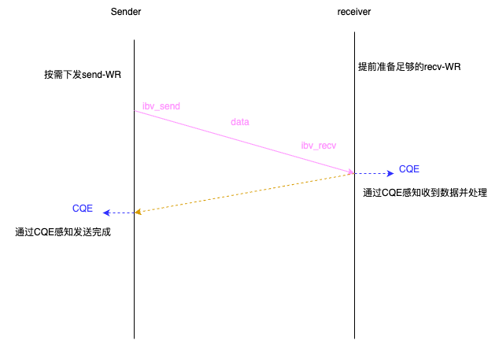
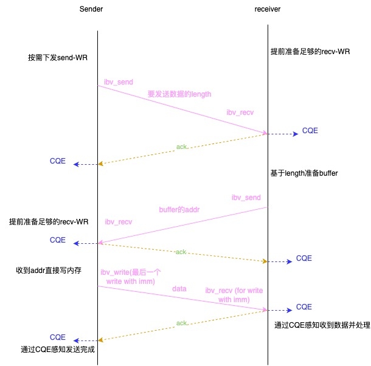
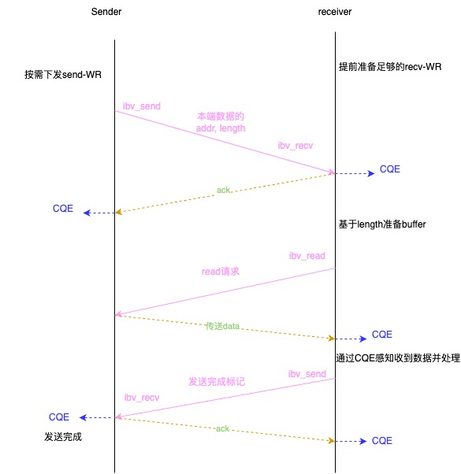

```table-of-contents
```
# 背景
## 需求背景
在阿里巴巴的实践表明，原生以太网无法满足云数据库/存储系统的极端性能要求。

## RDMA的优点
除了超低延迟（通常约2us）和高吞吐量之外，RDMA还支持零拷贝和内核旁路、CPU offload，因此可以减少与传统网络协议栈（包括上下文切换、协议处理和数据拷贝）相关的开销。


# 原生RDMA存在的问题
使用RDMA需要解决以下问题：
- 编程复杂性太高
- 问题定位困难：缺乏排障工具
- 大规模集群中（跨Pod: lossy RDMA）存在性能抖动和拥塞
- 大消息会增加`incast「即多打一」`拥塞概率。

## RDMA编程复杂
RDMA技术在数据中心越来越受欢迎，但是在规模生产环境中，RDMA的实际收益还不够明显。
一个重要原因是**RDMA编程复杂性太高，对于编程人员不够友好**。RDMA verbs编程有一堆的新概念（QP，MR，PD，RQ，SQ，CQ，……），这跟传统Socket编程区别很多。想要直接把已有应用直接迁移到RDMA更是不可能。

原生RDMA库（即libverbs）比socket编程复杂很多，一个简单的ping-pong程序RDMA需要200行代码，而socket只需要50行。

原生RDMA库的复杂性是开发人员构建高效的基于RDMA的应用程序的主要障碍。他们需要熟悉远程内存访问、队列对的概念，以及RDMA上的许多其他要素，以便更好地构建他们的应用程序。RDMA和socket编程之间的一个重要语义鸿沟是远程读/写与基于连接的编程范式有很大不同。发送方不知道接收方应用程序的处理进度和有效性。这使得无法将现有的商业应用程序直接移植到支持RDMA的集群。

## RDMA可扩展性挑战
**（1）RDMA资源占用会随着集群规模扩展快速增加**
RDMA的最大优点之一是零拷贝，但单边模式需要按需分配内存，即在每个连接的任何传输开始之前就保留更多内存。相反，在TCP/IP中，内核可以以较少的保留自动管理缓冲区。

比如连接数和内存的占用。`Pangu`中每个`【BS】block server`上有N个线程，每个`【CS】chunk server`上有M个线程，而每两个线程之间都要建立`fullmesh`的链接，换算下来每个`chunk server`的内存占用为：`N*M*block_server_number*depth*message_size`，因此导致了高内存占用。单机的连接数：`N*M*集群机器个数: `

> 注：**Pangu** 一个阿里云开发的高可靠、高可用、高性能的**分布式文件系统，类似于Ceph**。Pangu中每个服务器上有两个核心组件：block server和chunk server。


**（2）大规模RDMA集群存在拥塞和严重的incast**。
大规模生产系统必须面对明显的性能抖动和拥塞。这些问题很少出现在小规模可控的实验环境中。这些问题很容易影响在数百台机器上运行的应用程序的整体性能，每台机器上有数千个连接。大消息是另一个问题，因为它们增加了incast拥塞的可能性。


比如：生产服务器中的一个典型场景是分布式存储，如盘古或ESSD，并且始终遵循`incast`流量模式。此外，与`Facebook`中的部署类似，网络工作负载总是在饱和和非饱和之间切换，如下图所示，它很容易使RNIC过载，导致拥塞。


另一方面，拥塞也会导致抖动。
尽管对DCQCN进行了微调，但由于大尺寸消息阻碍了RNIC处理，在较大的集群中观察到了一些严重的抖动情况。在生产环境中，严重的抖动可能导致70%的吞吐量降低（从3.4 GBps到1.1 GBps）和215倍的更高的延迟。

**（3）建联速度太慢**
缓慢的连接建立可能会延迟恢复，并增加群集返回`steady-state`的时间。
使用==`RDMA_CM`的RDMA的连接建立时间约为4ms，而TCP的连接建立时间约为100us==。

在以前的稳态集群中，这并没有引起足够的注意。然而，在生产环境中，情况更加复杂，一些应用程序可能会重新启动，并且在大规模生产环境中可以弹性地添加或删除机器。
此外，集群有时可能会被扩展或升级。这种情况随着规模的扩大而变得更糟，并且容易导致**网络抖动(jitter)和长尾(long tail)问题**。在64台计算机集群中建立连接时，ESSD的吞吐量将比稳态低近65%。

## RDMA健壮性问题
**（1）RDMA单边操作无法感知对端应用层的处理状态**

即使RNIC在硬件层提供确认，发送方也无法确定实际应用程序是否已经感知到数据包。
在接收器（即应用程序）完成数据处理之前，不会释放缓冲区。在这种情况下，接收到越来越多的数据，但发送方不知道进展情况，继续发送。

当没有可用的缓冲区时，将引发接收器未就绪（RNR）错误。使用单边操作时，此问题变得更难解决。RNR错误会增加重传率，从而浪费网络带宽和CPU周期。在更糟糕的情况下，它可能会导致抖动。

**（2）原生RDMA库和RNIC无法感知通信的对端是否还活着**
这一点跟TCP很不同，TCP会有内核做链接保活，**RDMA是kernel by pass的，即使对端挂了，本地也不会受到任何通知，这会导致链接泄露**，跟这个链接相关的资源也无法释放。
> 注：KUCL使用Kernel TCP进行建联，可以感知到对端是否活着，不用keepalive机制了。

例如，在使用原生RDMA库时，如果一台机器崩溃，则不会通知对等方。因此，qp和各种资源被保持，直到将来的通信再次发生，然后产生错误。TCP的`keep-alive`选项很好地解决了这种资源泄漏问题。不幸的是，在RDMA的较低级别实现中没有替代方案。


## RDMA问题排查工具缺失

快速定位潜在的错误和性能瓶颈有助于质量改进、提升性能以及长期维护。对于调试和调优，由于底层硬件和RDMA编程接口提供了灵活而复杂的访问模式，因此很容易触发错误。开发人员实际上很难找到性能瓶颈的根本原因。有时，很难确定性能问题是否与RDMA有关。

需要一些补充小工具, 比如：
1）原始RDMA堆栈无法提供`netstat`作为分析工具来帮助查找连接级别信息；
2） 没有有效的`pingmesh`工具；
3） 缺乏对复杂性能评估和压力测试的实用工具；
4） 必须有一些措施来模拟网络异常，例如消息丢失，但不幸的是，`Linux netfilter`不能在RDMA数据平面上工作；


# RDMA的编程模型
原生以太网无法满足我们的网络性能要求，而RDMA可以提供：超低延迟(2微秒)、高吞吐、旁路内核。因此RDMA可以降低传统TCP协议栈上下文切换开销、协议处理开销、数据拷贝开销。  

RDMA提供RC、UD、RD等多种连接，同时提供两类数据语义：

- 单边语义：RDMA Write/Read/Atomic这类语义不需要对端CPU参与。
- 双边语义：Send/Recv，这类语义跟传统以太网有些相似，需要对端CPU配合做一些事情（但不需要CPU做协议栈处理）。

# X-RDMA介绍
阿里RDMA通信库`X-RDMA`；X-RDMA是一款通信中间件，部署并大量用于阿里的**云存储和数据库**系统。

X-RDMA很多功能是业务需求推动的，比如稳健性、高效的资源管理以及用于调试和性能调整的便捷工具。

X-RDMA与最近的研究项目完全专注于压榨原始硬件性能不同，它强调大规模生产集群的**健壮性（稳定性）、可伸缩性（弹性）和可维护性（可观测性、 可运维性）**。

X-RDMA简化了编程模型，扩展了RDMA协议以实现应用程序感知，并提出了每台机器具有数千个连接的资源管理机制。它还使用内置的跟踪（trace）、调优和监视（monitor）工具减少了管理和性能调优的工作量。

# X-RDMA设计思想
**条件性能最大化/Conditional Performance Maximization**：针对原生RDMA的问题，如何解决上述问题，同时保持原始性能是我们基于RDMA设计的主要考虑因素。

X-RDMA采用几种设计原则来实现理想的目标：

（1）抽象高级数据结构和接口，以简化复杂的编程模型。

（2）提供轻量级和高效的协议扩展以提高健壮性。

（3）添加资源管理系统和内部流量控制，以在大规模数据集的恶劣情况下保持性能。

（4）集成实用程序和工具、方案，以满足调试、性能瓶颈检测和调优的要求。

（5）探索有效的线程模型、消息模型和工作流程，简化功能实现，发挥RDMA的原始性能。

## 条件性能最大化
**条件性能最大化（Conditional Performance Maximization）** ：
是一种在**特定约束或环境条件**下，通过==优化参数、资源分配或策略，使系统或模型的性能指标达到最优==的方法。

这一概念广泛应用于计算机系统、机器学习、网络优化、资源管理等领域，核心目标是在满足前置条件（如硬件限制、实时负载、能耗约束等）的前提下，实现性能的极限提升。

# 架构设计
## 整体架构
X-RDMA可以抽象为3层和16个主要组件，如图4所示。


在中间层，X-RDMA实现了用于可靠协议扩展、资源管理、流控制和性能分析的有用组件。

总体而言，这些组件被分为四个独立的系统，为各种开发人员带来了便利。
**X-RDMA的API是为大规模生产环境设计的，并牺牲了不常用的功能**来避免复杂的编程抽象陷阱。

### 协议扩展
通过Seq-Ack和KeepAlive对传统的RDMA协议栈进行了扩展。FlowCtl是作为同一层中的另一个协议扩展提供的。

### 资源管理
资源管理由MixMsg、MemCache和QPCache来处理。前两个组件特定于启用RDMA的内存，而最后一个组件与QP相关。

### 系统分析
系统分析由跟踪、统计、配置、过滤、模拟和监控六个组件组成。

### 调试和管理工具
有五个关联实用程序：XR-ping、XR-perf、XR-stat、XR-server和XR-adm，它们便于调试和管理。

### 底层数据结构

一些基本的数据结构，如定时器、任务、fd，构成了X-RDMA的底层。

### 数据结构和API
在上层，X-RDMA提供了三个高度抽象的数据结构，8个主要的API来简化RDMA原语。
原生RDMA Verbs库有近30个数据结构（ibv_pd/mr/cq/wc/qp/wr等）。

X-RDMA提供了三种简单但关键的数据结构：上下文（Context）、通道（Channel）和消息（Message）。如下表所示，X-RDMA专注于提供基于组合需求的最小API集，以获得更好的性能和可用性。


# 详细设计

## 消息模型
### 背景
阿里大部分应用通信采用RPC模式，其中请求-响应（request-response）模式通常用于多个进程之间的通信。X-RDMA的实现方式基本相同。

**RDMA缓冲区预分配会引入大量开销**
由于RDMA操作的内存需要事先注册（内存注册），这个动作==是将虚地址pin在物理内存中防止page换出（即物理内存的swap），然后将页表项也发给网卡==，这个动作比较耗时间。

### 解决机制
为了更好地**平衡性能和资源利用率**，即**降低内存准备的开销和过多的内存占用**。

X-RDMA采用了一种混合消息策略，包括两种模式：
**（1）用来最大化性能的小消息模式**
**（2）用来减少内存占用的大消息模式**。

具体就是：X-RDMA将消息分成两类(即大消息、小消息)分别处理，当有效负载大小小于S字节的阈值时，应将其视为小消息，反之就是大消息。默认情况下，此值设置为4 KB。
这种划分类似于`MPI`的渴望和汇合协议（`eager and rendezvous protocol`）。

> 注：MPI（Message Passing Interface）是消息传递接口，用于进程间通信，在并行计算中非常重要。在MPI（Message Passing Interface）中，`eager`（渴望）和`rendezvous`（会合）是两种经典的**消息传输协议**，用于优化不同大小消息的通信性能。它们的设计目标是在**延迟**（Latency）和**资源占用**（Buffer Management）之间实现平衡。
> (1)eager（渴望）协议
> - eager协议应该是在发送消息时不等待接收方确认就直接发送，适合小消息。这样减少延迟，因为不需要握手。但风险是如果接收方还没准备好，可能会占用过多缓冲区，导致资源问题。比如，如果发送方大量发送小消息，而接收方处理不过来，可能缓冲区溢出。
> - **优点**：
>> 低延迟：无需握手，消息直接发送，减少了通信往返时间（RTT）。
>> 简单高效：适合高频小消息场景（如短控制消息）。
>
> - **缺点**：
>>接收方可能因缓冲区不足导致消息丢失（需依赖MPI实现的重传或错误处理机制）。
>>大量eager消息可能导致接收方内存耗尽。

> (2) rendezvous（会合）协议
> - rendezvous协议则是先进行握手，确保接收方准备好了再发送数据。适合大消息，避免缓冲区占用过多。虽然增加了握手带来的延迟，但对于大消息来说，这种开销相对较小，且能保证可靠性，避免资源浪费。
> - **核心思想**：
>> 先握手，再发送：发送方先与接收方协商，确认接收方缓冲区就绪后，再传输数据。
> - **优点**：
>> 资源安全：避免接收方缓冲区溢出，适合大消息传输。
>
> - **缺点**：
>>额外延迟：握手过程引入了至少一个RTT的延迟。
>>协议开销：对小消息不友好，握手开销可能超过数据传输本身。

### 小消息：一阶段接收
**小消息对延迟敏感**，默认将4KB以内的消息称为小消息。因此，**采用`RDMA` 的 `SEND/RECV`完成收发**，两侧各只需要下发一个WR，效率比较高。

对于小消息，发送方直接向接收方发送数据，从而触发接收端的recv WR。每个数据传输只需要一个RDMA操作。但是，接收方需要预先分配足够的缓冲区。
因此，为避免较多的内存占用，小消息的有效负载大小不能很大，否则它将消耗更多的缓冲区，从而导致高内存消耗。



### 大消息：两阶段接收
**大消息对吞吐敏感**，而对于延迟可能不是那么敏感。对于大消息，使用 `ibv_write/ibv_read` 单边操作， 可以充分发挥 写大数据的优势，

大消息收发通过多轮协商（可能会造成延迟增大）完成，对于大消息：
（1）发送方将首先发布 Send WR以唤醒接收方的recv WR。接收器将根据需要准备可供RDMA使用的缓冲区。我们称这个阶段为缓冲准备阶段。
（2）之后，实际的数据传输依赖于来自发送方的RDMA写/读。在此模式下，每个数据传输至少需要两个RDMA操作。

如下所示，为 write 方式发送数据：



如下所示， 为read方式发送数据：



#### 大消息和小消息比较
在生产环境中，小消息比大消息（通常传输时间长）对高延迟更敏感。

#### 读写拆分在其他场景的应用
比如，存算分离的场景：


计算节点写磁盘：计算节点向分布式存储写入数据，首先发送Send给存储节点，通知在计算节点已经注册好的内存区域，要求来读某些数据并落盘。存储节点使用RDMA READ读取计算节点的数据到本地。最后发送Send通知计算节点写入完成。

计算节点读磁盘：计算节点去读取分布式存储中的数据。首先发送Send给存储节点，通知在计算节点已经注册好的内存区域，要求从磁盘读取某些数据。存储节点使用RDMA WRITE将数据主动写入计算节点。最后发送Send通知计算节点读取完成。


### RPC中客户端读替换服务器写（Read Replace Writ）
X-RDMA支持内置RPC：在大多数RPC实现中，可能需要接收方将响应发回给发送方。

**传统 RPC 模式**： 客户端发送请求→ 服务端处理并返回结果。


#### X-RDMA支持RPC存在的问题

RDMA 支持三种基本操作：
- **Send/Recv**：需要收发双方的协调（双边操作）。
- **Write**：发起方直接将数据写入对端内存（单边操作，无需对端参与）。
- **Read**：发起方主动从对端内存读取数据（单边操作，无需对端参与）。

##### 为什么不用 Send/Recv？
虽然 Send/Recv 是双边操作，天然适合 RPC 的请求-响应模式，但其需要服务端显式接收数据（依赖 CPU 中断或轮询），在高并发场景下会引入额外开销。
而 Read/Write 作为单边操作，完全绕过操作系统，更适合高性能场景。

##### RPC响应为什么不用RDMA write?
如果服务端使用write发送响应，则会增加服务端的网络负载和计算开销。
使用 Read 时，服务端只需将结果写入内存，无需主动推送数据到客户端，减少了服务端的网络负载和计算开销。

#### 思路
总体思路：**开销是尽可能的放在客户端，而不是服务端**。

**（1）避免服务端显式参与**
若服务端通过 Write 返回响应，客户端需要提前告知服务端其内存地址和权限（需注册内存区域），这会引入服务端额外的元数据交换和同步开销。

客户端主动从服务端内存读取结果，无需服务端感知客户端的内存布局。服务端只需将结果写入固定位置，客户端按需读取即可，简化了协调逻辑。

**（2）降低服务端负载**
 使用 Read 时，服务端只需将结果写入内存，无需主动推送数据到客户端，减少了服务端的网络负载和计算开销。


#### 解决
为了解决这个问题，X-RDMA允许发送方（对于请求而言，client是发送方）直接处理响应。接收方应该让发送方知道响应的大小和地址，发送方将通过RDMA Read被动地获取响应。

对于服务端的响应，步骤如下：
a. 服务端发送一个WR告知客户端有数据要发送；
b. 客户端按需准备好接收buffer；
c. 客户端通过`RDMA READ`读取数据。

#### 范例
假设一个分布式键值存储系统使用 RDMA 实现 RPC：

1. **客户端请求**：
    - 客户端将请求（例如 `GET key1`）通过 Write 写入服务端的请求队列内存。
2. **服务端处理**：
    - 服务端轮询请求队列，读取请求并处理，将结果（例如 `value1`）写入结果内存区域。
3. **客户端主动获取结果**：
    - 客户端通过 Read 主动直接从结果内存区域拉取数据。

这种方式避免了服务端主动向客户端推送结果带来的复杂性，同时通过单边操作最小化延迟。


## 线程模型
### 无锁操作、无系统调用
X-RDMA采用无锁(lock-free)、无原子(atomic-free)，无系统调用(no-syscall)，以减少总线锁定和用户空间及内核空间之间上下文切换的开销。它避免使用任何锁，只允许在非关键路径上进行原子操作和系统调用。

### 资源per线程
X-RDMA的线程模型设计原则一般是运行完备的。
高级资源，如上下文、通道、memCache、QP Cache等，都在per-thread级别上运行，以避免线程之间的同步。这些资源在每个上下文中只初始化一次。


### 类NAPI方式事件处理
X-RDMA使用混合轮询（hybrid polling）方法。
线程首先使用epoll，然后在触发消息或计时器事件时切换到繁忙轮询（busy polling），类似于Linux内核中的NAPI。
X-RDMA向每个线程定时器注册一些事件，包括keepAlive、statistics等。在空闲时间内，可以根据应用程序的方案配置轮询模式。

### RTC模式的线程模型
X-RDMA采用RTC（run-to-complete）的线程模型，因此每个线程都有一个单独的工作流，如下图：


（1）为了建立连接（xrdma_channel），双方首先开始处于侦听或连接状态（图中的S1）。

（2）开发人员应该从内存缓存中请求RDMA启用的内存或者手动注册RDMA启用的内存（图中的S2）

（3）X-RDMA支持event模式和polling模式。
除了轮询（polling）模式，X-RDMA还提供接收消息的事件（event）模式。

可通过`xrdma_get_event_fd()`的方式获取polling所需的fd，然后调用`xrdma_process_event()`进行事件处理。

（4）X-RDMA发送消息是异步非阻塞的。
在通信过程中，消息不会阻止下一条消息，即使它未完成。因此可能有多个消息在同时发送，被称为飞行消息（inflight messages），但是 X-RDMA将飞行消息的数量限制为小于CQ深度的depth。

（5）通信过程中发生超时事件的情况：
X-RDMA会自动发送keepAlive信息做链接保活。链接的心跳信息依赖于timer超时事件，X-RDMA会自动发送keepAlive信息做链接保活（即发送NOP消息「“No Operation”，也就是空操作，一种不执行实际数据传输的操作指令，用于**连接保活或测试链路**」）。


（6）X-RDMA可以动态更改配置（S8）以调整运行状态。

## 资源管理
为了提高性能、减少内存占用并缩短建联时间，X-RDMA使用内存缓存和QP缓存来管理每个线程的资源。

### 内存缓存
为了调整启用RDMA的内存的容量，X-RDMA将每个上下文启用RDMA的内存作为内存缓存进行管理，**该内存缓存包含多个相同大小的MR**。如果容量不足，它将注册新的MR。
如果资源利用率低，它将通过回收空闲的MR来缩减容量。

此外，之前的研究指出，**随着MR数量的增加，性能会下降**。研究中，每次注册MR采用4KB大小，当MR数量超过1000时面临压力。
我们将每个MR设置为4MB（增大MR的大小，减少MR的数量??），以避免性能降级。在我们的实现中，我们可以自动或手动扩展内存缓存的容量（用于更细粒度的调优）。


### QP缓存
由于**缓慢的连接建立会导致抖动**，我们**将连接作为每个线程的资源缓存**进行管理。
X-RDMA通过将其状态设置为`IBV_QPS_RESET(QPS: QP state)`并将其释放到QP缓存，直接完成QP销毁阶段。、后续如果存在新建QP，XRDMA将重用QP缓存中的这个QP，以加快连接的建立。

## RDMA协议拓展
X-RDMA从以下几个方面对RDMA做了拓展：KeepAlive、Seq-Ack Window、Flow Control.
此中的协议扩展，指的是RDMA协议的特性扩展。

### KeepAlive
#### 背景
TCP/IP协议栈会由内核发送心跳消息检查链接是否存活，但**RDMA协议栈没有内核参与**，因此无法由内核自动发送心跳信息。

根据我们在生产环境中部署RDMA的经验，我们观察到，由于超时、网络故障、机器崩溃等各种情况，**连接泄漏(connection leak)** 可能不可避免地发生。

因此，**链接保活检查**是必须的，因为有很多的原因会导致链接泄露。

#### 链接保活检查机制
基于**RC模式**的原生可靠性（可靠交付和按序到达），X-RDMA采用RDMA写（RDMA Write）来实现KeepAlive，因为其内核旁路功能不会唤醒对等方的应用程序并消耗CPU资源。

在我们的实现中，如果一个链接在S毫秒内没有和对端通信时，X-RDMA会触发KeepAlive机制的探测请求，即通过RDMA Write探测链接是否存在。Write的payload是零字节。

（1）如果对端还存活，RNIC网卡会自动回复ACK报文。
（2）如果连接中断，应立即释放相应的资源（如QP），以避免连接泄漏。

### 序列确认窗口：Seq-Ack Window
#### 背景
（1）网卡的ack只能保证数据已经到达对端，但并不能保证接收侧的应用程序已经处理了这些数据报文。

（2）发送小消息时，X-RDMA需要接收方提前准备好接收buffer，如果消息数量很多而**接收方的buffer数量可能不足**，则会导致RNR（request not ready），这不仅会导致性能下降，甚至会导致链接断开。

#### Seq-Ack Window机制
**思路**
基于消息，而不是常用的双向字节流，X-RDMA提供了应用层seq-ack窗口机制，因此保证了RNR-free。

通过X-RDMA的`seq-ack window`机制可以避免RNR出现。
具体做法是：
（1）每一方都有一个窗口来缓冲飞行（`in-flight`）中的请求：
收发两边分别有一个缓存`in-flight`请求的环形缓冲区`ring buffer`窗口，其环形长度是飞行中的消息深度。

（2）任何一方都将记录其**当前的seq-ack编号**，每次发送数据时（RDMA Write/Send 操作）时，都将当前`seq-ack`编号通过`RDMA immediate Data`发送给对方，以减少DMA trip。成功接收N条消息但没有任何ACK后，将触发一条独立ACK消息以确认到达。

具体算法如下图：


算法1使用seq-ack窗口机制显示两侧的发送和接收操作。ACK/ACKED和SEQ/WTA分别是发送方/接收方窗口的左边和右边。在发送方方面，对于每个发送请求，SEQ将增加1。在接收到请求时，接收方还应增加WTA。然后，它根据请求的状态决定发送方是否通过RDMA Read获取数据。然后，接收器调用rdma_read_done并确定此消息中的ACK是否等于RTA。如果为真，接收器将更新RTA，直到RTA等于WTA或任何未完成消息丢失。当向发送方发回消息时，它会将ACKED更新为RTA，并将ACKED作为最新的ACK号码附加到下一条消息。

##### 避免死锁
如果连接双方在确保前一个ACK之前尝试同时向对方发布WR，则在一方知道前一个ACK之前，他们无法成功发布WR，因为没有任何一方具有可用的确认窗口，因此陷入死锁。

这种死锁不同于TCP死锁，TCP死锁的根本原因是缓冲区的大小有限。为了避免这种情况，我们添加了NOP消息机制来主动触发完成。NOP消息保存在环形缓冲区中。X-RDMA利用每上下文计时器检测一个上下文中所有连接的死锁，以减少开销。如果存在，发送方将使用NOP消息通知接收方打破死锁。

#### TCP死锁
##### 场景
**（1）接收方窗口为零（Zero Window）**
- **触发条件**：
    - 接收方应用层处理数据较慢，导致接收缓冲区满，接收窗口（`rwnd`）变为零。
    - 接收方通过ACK报文通知发送方窗口为零（`rwnd=0`）。
- **死锁表现**：
    - 发送方因窗口为零停止发送数据。
    - 接收方因未处理完数据无法腾出缓冲区，持续通告`rwnd=0`。
    - 双方陷入僵局，数据流停止。

##### 原因

- **应用层处理速度与网络速率不匹配**：接收方处理数据的速度低于发送方的发送速率，导致缓冲区持续积压。
- **静态缓冲区分配**：固定大小的缓冲区无法适应动态流量波动。
- **缺乏反向压力（Backpressure）机制**：发送方无法主动限制应用层的数据生成速率。

##### 解决方法
**（1）持续定时器（Persist Timer）**
- **机制**：
    - 当发送方收到`rwnd=0`的ACK时，启动持续定时器。
    - 定时器超时后，发送方发送**零窗口探测报文（Zero Window Probe, ZWP）**，仅包含1字节数据。
    - 若接收方仍通告`rwnd=0`，则重置定时器并重复；若窗口打开，则恢复传输。
- **作用**：
    - 避免发送方因长时间等待窗口更新而永久阻塞。

**(2) 窗口更新报文（Window Update）**
- **机制**：
    - 接收方处理完部分数据后，缓冲区腾出空间，主动发送`ACK`报文携带新的`rwnd`。
    - 发送方收到后立即恢复数据传输。
- **问题**：
    - 若接收方的窗口更新报文丢失，发送方无法得知窗口已打开，导致死锁。


**(3) 协议增强**
- **SACK（选择性确认）**：允许接收方告知发送方已成功接收的非连续数据块，减少重传量。
- **TCP Window Scaling**：通过扩大窗口规模（Window Scale Option）支持更大的`rwnd`值，缓解小窗口问题。

**(4) 动态调整缓冲区大小**
- **自适应缓冲区**：根据网络状态和应用负载动态调整接收缓冲区大小。
Linux中通过`sysctl`参数动态调节：
```bash
sysctl -w net.ipv4.tcp_rmem="4096 87380 6291456" # 最小、默认、最大接收缓冲区 sysctl -w net.ipv4.tcp_wmem="4096 16384 4194304" # 发送缓冲区
```

**(5) 应用层优化**

- **异步非阻塞I/O**：确保接收方应用层及时读取数据，避免缓冲区堆积。
- **批量处理**：减少频繁的小数据操作，提升处理效率。

 **(6)反向压力机制**
- **应用层流量控制**：当接收方缓冲区接近满载时，通知发送方降低数据生成速率。
    - **示例**：HTTP/2中的流控（Flow Control）机制。

### 流量控制：Flow Control
#### 背景
在大规模incast场景下DCQCN并不能很好的工作，具体体现在：

DCQCN是一种被动式拥塞控制方法，DCQCN无法在具有大量incast（即大量入站连接）的大规模集群中非常有效地执行。
在CC起作用之前可能已经出现了性能下降（比如ECN报文还没有返回，交换机buffer就已经出现了丢包）。

1）DCQCN在incast场景中是被动控制，但在反应开始之前可能会对应用程序产生有害影响。
2） 根据我们在大规模集群中的统计，由于大量的incast，会产生更多的CNP（拥塞通知包）和PFC暂停帧，这将降低整个网络的性能和鲁棒性。
> 注：
> (1) 当发生incast时，多个数据流同时到达同一个接收端，可能导致交换机或接收端的缓冲区被迅速填满.
> (2) CNP: Congestion Notification Packet，拥塞通知包，用于通知网络中的拥塞情况，让发送方调整传输速率，避免进一步加剧拥塞.
> (3) PFC: Priority-based Flow Control, PFC是一种流量控制机制，允许在以太网中针对不同优先级的流量进行Pause帧的发送，防止缓冲区溢出，从而避免数据包丢失

#### Flow Control机制
X-RDMA通过消息分段和消息排队来协助DCQCN缓解网络拥塞。

注：X-RDMA通信库里消息分段和消息排队两种流控算法均基于原生RDMA库构建，没有特定的硬件或软件约束。

##### 消息分段：Fragmentation
大消息的危害：大型(large size)请求通常会阻止RNIC处理，因为RNIC应确保完成此请求。

消息分段：对于大尺寸RDMA WR，其有效载荷将被分解为多个固定的中等尺寸分段，其原始目的地按顺序排列。
但是，如果分段尺寸较小，过多分段将使RNIC饱和。中等大小的片段可以使RNIC受益，同时不会阻止其他请求。实际上，X-RDMA将分段大小设置为64KB。

##### 消息排队：Queuing
消息排队：X-RDMA限制同时能发起的WR请求数量为N，多出来的请求放到队列里排队。

为了补救拥塞，X-RDMA将未完成的RDMA WRs数量限制为N，因此使用队列来缓冲额外的请求。在发布新RDMA WR之前，X-RDMA确定当前未完成RDMA WRs的数量n是否超过阈值N。如果n小于N，RDMA WR能发布到SQ中。否则，它将首先推送到队列，然后在满足条件（SQ未满）的情况下发布到SQ。

## 性能和问题的分析框架
在大规模生产环境中，抖动、超时、性能降级和故障等错误可能会在不同阶段出现。X-RDMA负责跟踪这些问题，无论它们是来自上层应用程序还是来自下层硬件层。如何尽快定位bug是生产环境中的首要需求。

X-RDMA提供了众多工具和机制定位各种类型的bug，分析工具如下图：


### Tracing
#### X-RDMA数据通路模式
X-RDMA数据通路有两种模式，分别是：

- bare-data模式（裸数据，未经修饰的数据）：直接发送用户的原始数据，不做任何的链路追踪。
    
- req-res模式：在req-res模式下，X-RDMA重建原始有效负载，每条消息在原始有效负载内包含一个报头。我们使用此报头附加跟踪和故障排除所需的信息。

X-RDMA将裸数据设置为其默认模式，以提高性能。如果需要跟踪，X-RDMA将切换到req-rsp模式，在该模式下，跟踪数据可以附加到头部。

#### tracing功能
以前的工作只关注于测量RTT，而忽略了每个RDMA请求的细粒度分解。实际上，这些阶段中的一些可能是性能不佳的实际原因。

X-RDMA实施以下个案方法来检测长延迟的根本原因：
（1）定位网络拥塞。
通常，导致长请求延迟的原因包括分组丢失（丢包）、长暂停时间「比如：PFC暂停帧后的“暂停传输”到“恢复传输”之间的时间间隔」和网络L1中的过度饱和请求。
X-RDMA实现了一种发现机制来测量网络L1下「指的链路的中间节点的时间??」的开销。
双方同步其时钟，并将时间偏移计算为 Toff 。
然后，发送方将使用本地时间T1将时间戳附加到报头，并且接收方也将接收到的时间戳保持为T2。实际请求时间可以估计为T2−T1− Toff 。这种方法的先决条件是发送方和接收方应具有良好的同步时钟，以避免偏差。

（2） 发现慢polling：
应用程序的工作线程可能会执行耗时的操作，并且没有及时的轮询。因此，它将导致缓慢的请求和长尾。X-RDMA统计两次轮询（polling）操作之间的时间间隔，发现慢polling。因此，它可以检测轮询导致的性能下降。

（3）发现执行较慢的代码。
X-RDMA将时间测量指令插入到不同的关键代码段中。如果特定代码段的执行时间超过阈值，X-RDMA将在日志中记录其位置。监视器可以收集这些日志。

### Monitoring
我们提供三种工具弥补RDMA工具不足的问题，分别是：
- XR-Stat：对标TCP的netstat
- XR-Ping：对标TCP的ping，以及RDMA自己的rping（rping功能太简单了）
- XR-Perf：用于做RDMA性能和压力测试。

> 注：
> - (1) ICMP ping：基于ICMP（Internet Control Message Protocol）的`Echo Request`和`Echo Reply`消息。
>> **局限性**：
>> - 禁ping：许多网络设备或防火墙会过滤ICMP流量，导致Ping不可达。
>> - 无法检测特定TCP端口是否开放或服务是否存活。
> - (2) TCP ping：一种通过TCP协议模拟Ping行为的工具，通过向目标主机的**特定端口**发送TCP SYN包，通过TCP握手过程实现**延迟测量和连通性检测**。
>>**常见工具**：
>>- **`tcping`**：类似于 `ping` 命令的工具，但它使用的是 TCP 协议，而不是 ICMP 协议。它主要用于测试那些禁用了 ICMP 协议（即禁用 ping 命令）的主机，但开放了 TCP 端口的网络连通性。
>>- **`hping3`**（支持自定义TCP包的高级工具）。
>>- **`nmap`**（通过`-sP`或`-PS`参数实现TCP Ping扫描）。

#### XR-Stat
基于通道抽象，X-RDMA可以提供与netstat工具类似的每连接统计信息。
这些统计数据还可以包括其他资源，如内存缓存（memory cache）。
在与监控系统协调时，它为故障排除和性能分析提供原始数据。尽管如此，RDMA网络对数据包丢失和高延迟非常敏感。
同时，整个系统还将监控PFC状态、队列丢弃计数器和缓冲区利用率作为关键指标。

#### XR-Ping
由于原始Ping无法模拟真实的RDMA网络，并且基于RDMA的rping过于简单且存在缺陷，X-RDMA设计了一个RDMA友好的Ping工具，能够通过利用集中式监视器显示网络连接矩阵，即全网状连接状态。

XR-ping将ping ToR层中的所有机器，然后将结果聚合到监视器中的连接矩阵。

#### XR-Perf
除了基准测试和压力测试之外，我们还需要一种更灵活的方法来定制流模型，例如大象和老鼠流。
XR-Perf可以满足这些要求。通过将其集成到监控系统中，我们可以收集信息，分析复杂场景，并从更高的角度了解RDMA和X-RDMA的性能。

### 额外框架
#### 内存缓存隔离
**内存缓存隔离/Memory Cache Isolation**:
原始RDMA库缺少警告开发人员内存访问错误的检测机制，特别是那些由对支持RDMA的内存的越界访问引起的错误。因此，开发人员很难找到根本原因。
在X-RDMA的实现中，内存缓存将通过`mmap`分配给堆栈空间附近的更高地址空间。此外，还标记了内存缓存地址，以避免与其他线程的地址冲突。

#### 模拟故障
**模拟故障/Emulate Fault**：
为了模拟故障情况，X-RDMA实现了一个名为Filter的简单错误注入模块，用于诸如丢弃消息、慢速消息等故障情况。开发人员可以通过调优系统在线启用或禁用筛选器。

#### 在RDMA和TCP之间切换
**在RDMA和TCP之间切换**：为了处理一些罕见的RDMA网络异常情况，如严重拥塞、高度incast或协议栈崩溃，X-RDMA提供了一种模拟机制来临时切换到TCP网络。


### 性能调优
#### 参数类别
X-RDMA通信库有很多参数可以调整，可分为两类：
(1) 运行时动态可调的（通过XR-adm命令控制）；
(2) 程序启动参数是可配置的。

具体如下表：
online（可以动态） ：表示可以动态变更的参数；
offline（运行时保持不变）：表示启动参数。


#### 精细调优
不同的应用可能有不同的要求。作为中间件，X-RDMA提供了一种机制，可以将有用的X-RDMA-internal和较低级别的RDMA令牌（标识符）导出到这些应用程序。

中间件通常会封装RDMA的复杂性，但有时为了灵活性，会提供接口让应用访问底层资源。例如，导出QP的句柄让应用直接发布工作请求，或者让应用注册自己的MR以便更高效的内存管理。

##### X-RDMA-internal
“X-RDMA-internal”应该是指X-RDMA中间件自身内部的逻辑资源标识符。
中间件通常会有自己的抽象层，可能封装了一些资源管理或配置的参数，比如虚拟连接信息、会话ID或者内部队列的状态。

**使用场景**
中间件封装了底层RDMA的复杂性，向应用程序提供简化的高层抽象接口。
这些资源标识符可能是中间件为了简化用户接口而设计的，比如应用程序不需要直接操作QP（Queue Pair），而是通过中间件提供的句柄来管理连接。


##### 较低级别的RDMA令牌
“较低级别的RDMA令牌”，这应该指RDMA原生的一些资源或结构，比如QP（队列对）、CQ（完成队列）、MR（内存区域）等。这些是RDMA API中的基础元素。

**使用场景**
用户可能是在开发需要精细控制RDMA资源的应用，或者需要中间件提供更底层的访问能力。比如，某些高性能应用可能需要绕过中间件的某些抽象，直接操作QP来优化性能，或者需要访问特定的内存区域进行零拷贝操作。


##### 为何需要导出这两类令牌
**（1）灵活性与性能的平衡**
- **X-RDMA-internal令牌**：适用于通用场景，简化开发但可能牺牲部分性能。
- **较低级别令牌**：适用于高性能、定制化场景，需开发者具备RDMA底层知识。

 **（2）调试与监控**
- 导出底层令牌后，应用程序可直接访问硬件性能计数器（如NIC队列深度、DMA延迟），实现细粒度监控。

 **(3) 混合操作模式**
比如：应用程序通过X-RDMA-internal令牌管理连接，但通过导出的QP句柄直接发布高优先级工作请求。
```c
// 通过中间件建立连接
conn_handle = x_rdma_connect("192.168.1.100", 18515);

// 导出底层QP句柄
struct ibv_qp *qp = x_rdma_get_native_qp(conn_handle);

// 直接发布RDMA Write操作
struct ibv_send_wr wr = {.opcode = IBV_WR_RDMA_WRITE, ...};
ibv_post_send(qp, &wr, &bad_wr);
```
##### 实现方法

在运行X-RDMA应用程序时，有一个特定的空闲线程管理本地配置。管理工具XR-adm负责将配置从运行的X-RDMA应用程序分发到这些控制线程。

# X-RDMA收益和总结
## 线上情况

目前（2017）阿里有超过4000台服务器部署了X-RDMA，使用RoCEv2协议。最大的一个RDMA集群有4个子集群，每个子集群有256个节点，每个节点有一张双口的25Gbps Mellanox ConnectX4-Lx网卡。

几乎所有业务场景都以X-RDMA作为基本组件进行部署。这些基于RDMA的产品包括X-DB、ESSD、盘古和PolarDB，它们要求健壮性、可维护性和高性能。使用X-RDMA构建的应用程序构成了阿里巴巴用于网络购物服务的基础设施。

## 性能基准
### 与其他中间件的比较
我们使用X-RDMA分别在req-res模式和bare-data模式下实现pingpong测试，并将bare-data模式与原生RDMA库中的ibv_rc_pingpong进行比较。
与其他测试工具相比，ibv_rc_pingpong可以被视为一个理想的基线，因为它除了原始的RDMA操作之外没有额外的开销。

由于X-RDMA采用了混合消息传递策略，如下图所示，XR-perf实现了与ibv_rc_pingpong相似的性能，在极少数情况下平均最多降低10%。


将X-RDMA与最先进的RDMA库进行了比较：UCX和Libfabric。在某些情况下，X-RDMA的延迟（5.60us）比UCX（5.87us）和Libfabric（6.20us）中更好的UCX-am-rc低5%/10%。

## 收益
X-RDMA已经在阿里大量使用，几乎所有的基于RDMA的应用都在使用X-RDMA。X-RDMA收益如下：
- 网络吞吐提升24%（在拥塞时，通过额外的流量控制和资源管理，它可以有效地缓解网络抖动，提高24%的吞吐量）
- 网络延迟降低5%（与UCX的ucx-am-rc中的5.87us相比，为5.60us）
- 使用X-RDMA，开发人员可以比RDMA节省至少70%的开发和维护时间。

### 简化编程
**与原生RDMA相比**：
X-RDMA提供了大规模生产所需的几乎所有网络功能。例如，在没有X-RDMA的情况下，要在盘古实现数据平面和协议，需要2000 LOC原生RDMA代码。相比之下，在没有任何其他网络代码的情况下，X-RDMA API只需要大约40 LOC。

### 鲁棒性增强
#### 建立时间
一旦应用QP缓存，连接建立时间将从3946us减少到2451us，从而节省38%的时间。这源于通过重用回收的QP减少了QP创建时间。此外，4096个连接的连接建立阶段只需3秒左右，而使用rdma_cm需要10秒。
下图的图8，显示ESSD可以在不到2秒内快速切换到稳态，并达到6 KOPS（约24 Gbps）。


#### 无RNR
与原始RNR错误数（平均为0.91）相比，X-RDMA可以通过seq-ack机制确保应用程序无RNR。如，下图的图9.


#### 流控制
我们模拟了一个节点的incast场景，该节点有6144个连接和所有的外部RDMA读/写操作。图10显示了流量控制的效果。

CNP（拥塞通知包）和TX Pause分别是DCQCN和PFC中的关键索引。值越高，网络拥塞越严重。应用流量控制后，带宽可以提高24%左右。此外，平均CNP数量减少到1∼2%，并且TX暂停被直接最小化到接近零。

# 经验
## RNIC缓存的影响是有限的
在最近的一些工作中已经指出RDMA对于大规模应用的性能较差。这是由于RNIC中SRAM的容量有限。
根据我们对ConnectX-4 RNIC的评估，即使QP数量增加到60K，缓存对性能的影响也几乎低于10%。这不应该是关于可扩展性的主要问题。

## 注意SRQ
使用共享接收队列（SRQ），多个QP可以将其RQ绑定到同一个。SRQ可以有效地减少内存使用。然而，它违反了我们的`RNR-free`设计原则，这意味着SRQ可能导致网络抖动。
在X-RDMA中，虽然默认情况下禁用了SRQ，但仍支持SRQ。我们建议在每个节点的QP数量低于10K时不要启用SRQ。

## 避免使用连续的物理内存
根据我们的统计，大规模服务器上的内存分段是不可避免的。使用连续物理内存可以缓存友好，但在某些情况下，这会导致内存不足问题，并触发内核内存回收，从而降低整个系统的速度。
我们评估了三种模式（即**非连续模式、连续模式和hugepage模式**），结果表明，非连续模式具有相当的性能和较少的分段。


# 参考
```bash

# X-RDMA的论文
https://madsys.cs.tsinghua.edu.cn/publication/x-rdma-effective-rdma-middleware-in-large-scale-production-environments/CLUSTER19-ma.pdf

# 阿里云RDMA通信库XRDMA论文详解
https://blog.csdn.net/weixin_43778179/article/details/135484158

# 阿里RDMA通信库X-RDMA
https://mp.weixin.qq.com/s/dY2uoSEcHwqFKtbJ6l10WA

# X-RDMA：阿里巴巴在大规模生产环境中使用的高效RDMA中间件——【上篇】
https://mp.weixin.qq.com/s/3RPRVgDzQOmz6eOgYbDYqA

# X-RDMA：阿里巴巴在大规模生产环境中使用的高效RDMA中间件——【下篇】
https://mp.weixin.qq.com/s/EI8XOQlReYV8B8dqy6xfYQ
```