```table-of-contents
```

# 概述

UCL(unified communication library) 是 RDMA 统一通讯库中间件。
业务使用RDMA，可以发挥RDMA的`kernel bypss`,  `offload cpu`、`zero-copy`的特性。
通过`UCL`，屏蔽了底层RDMA编程的众多概念以及编程复杂性，为业务提供`类socket`编程的接口，让业务快速、简易的享受到`RDMA`带来的==低时延、高带宽、低CPU使用率==的高性能网络服务。

# 背景
## 为什么要实现基于RDMA的通讯库中间件
### 服务器的网络传输的瓶颈从带宽到CPU的转变
之前服务器的网络带宽不足的时候，比如服务器的网卡10G,25G的IDC中，服务器的CPU往往是过剩的。
但是到了100G网卡以及200G/400G网卡之后，相当于带宽，这个时候服务器的CPU往往是瓶颈了。
尤其是AI快速发展对于高性能网络的需求，需要更大的带宽/更低的时延，IDC中的服务器的网络带宽都进行了升级，这个时候通算场景(基于CPU)的业务，相比于网络带宽，CPU成为了瓶颈。这个时候就特别需要通过各种途径减少CPU的消耗。

#### 减少CPU使用的方法
##### 网络侧
使用RDMA、用户态协议栈，可以通过零拷贝传输、bypass kernel (减少系统调用和上下文切换)来减少CPU的使用。
另外，RDMA还可以通过`offload CPU`的方式减少CPU的损耗(即RDMA可以将协议栈放在了网卡上「比如报文的封装/解封装都是在网卡上」) 。  

##### 业务侧

业务层：比如`rpc`通信，序列化和反序列化可以使用其他方式，比如RAW方式或者KV的方式取代PB，甚至不进行序列化和反序列化来达到节省CPU的效果。
之前有听`RPC`的同学，同TOR下的RPC通信，序列化和反序列化可能消耗了一个`RPC`请求/响应一半的时延。

之前社科应该使用了Raw(没有序列化和反序列化)+rdma，相对于基于内核TCP的rpc性能提升了70%；然后百度开源的底层基于RDMA的brpc相对于基于内核tcp的brpc性能应该是提升了17%。

#### 其他
统一封装的通讯库中间件(比如：UCL)，可以达到网络侧和业务侧分层解耦，业务层关注业务侧的逻辑，不需要关注底层的网络传输协议。
底层的网络传送协议可以随意的切换，业务侧代码都不需要改动。另外就是可以为业务侧屏蔽底层(网络层)各种复杂的概念、编程接口等等。  


### 业务需求

业内除了阿里自研的**通算场景的通讯库**X-RDMA之后，其他的更多的是**智算场景（基于GPU）面向集合通信的通讯库 以及传统HPC下的接口（比如：libfabric以及UCX等等）**。
一个比较大的原因就是这些**头部大厂的业务起步早，业务因为性能的需求**，更早的在业务层面自己就完成了RDMA的集成。
但是KS的现状是此类基础服务业务暂未开始RDMA方面的建设工作，这就为通算场景的统一通讯库提供了契机。

%201.png)

#### 分布式存储服务

分布式存储服务，比如底层使用块存的服务，类似于Ceph的存储服务。
存放服务分为多层：端上(给业务「比如MySQL」提供虚拟的磁盘)、调度层（选择哪个节点进行落盘，多副本，纠错恢复）、底层落盘层（SPDK + Nvme）。

（1）网络通信一：
存储服务的端上(计算节点：提供虚拟磁盘的服务)和存储调度层之间需要UTCP或者RDMA传输（如果两个节点的物理部署跨越了POD，在没有自研的RDMA的拥塞算法解决丢包以及选择性重传的情况下，就使用UTCP）。

（2）网络通信二：
存储调度层和底层落盘层之间的通信(同一个POD内，使用RDMA通信)。

#### 数据库/KV Cache

KV cache: 类似于Memcached和Redis这种提供热数据的分布式缓存之间的数据同步。

数据库：比如MySQL 节点之间的同步。

#### 消息中间件
消息中间件：比如Kafka, 一边是生产者，一边是消费者，中间是分布式存储层集群（对于业务不可见），那么存储层各个节点之间的数据同步就需要高性的网络。

#### 大数据
大数据 = 数据量巨大 + 需要分布式计算；RDMA的一个特性，就是高带宽，低CPU使用率，很适合大数据中的大量数据的传输。

```bash
典型问题：
- TB / PB 级数据处理
- 日志分析
- 用户行为统计
- 实时风控 / 推荐

单机能力不够 → 必须分布式
```

**Apache Spark** 和 **Apache Flink** 都是大数据领域的核心计算框架。Spark 和 Flink 它们在大数据栈里的位置是"计算层"——数据存在 HDFS、S3、Kafka 等地方，Spark/Flink 负责把数据取出来、算完、再写回去。整个大数据体系大致分三层：
- **存储层**：HDFS、S3、HBase、Iceberg
- **计算层**：Spark（离线为主）、Flink（实时为主）← 这两个就在这里
- **查询层**：Hive、Presto/Trino、ClickHouse

**如何选择？** 一句话记住：如果你的数据已经躺在磁盘上等你批量处理，用 Spark；如果数据是持续流入、需要毫秒级响应，用 Flink。很多公司两个都用，Flink 跑实时管道，Spark 跑每天凌晨的离线报表。

```bash

                数据平台
                    │
     ┌──────────────┼──────────────┐
     │                             │
  离线计算                      实时计算
     │                             │
  Spark                        Flink

-------------------------------

Spark 是 通用大数据计算引擎：
	架构思路：数据 → 分区 → 多节点并行计算 → 汇总


数据 (HDFS / S3)
		│
┌───────▼────────┐
│   Spark Driver  │
└───────┬────────┘
		│ 调度
┌───────▼────────┐
│   Executors     │ (多节点)
│ 分布式计算      │
└───────┬────────┘
		│
	  输出

-----------------------------

Flink: 真正的实时流处理系统
	核心思想：数据永远在流动（stream），等数据攒一批再处理.
	
数据源（Kafka 等）
        │
        ▼
   ┌──────────────┐
   │   Flink Job   │
   │  实时处理流    │
   └──────┬───────┘
          │
          ▼
     实时输出（DB / Dashboard）

```

## 为什么要自研通讯库，而不是使用类似于UCX这种？

.png)

API风格：倾向于类socket接口，业务适配简单。
传输支持：UCX不支持utcp，对于Lossy RDMA场景，使用UTCP（Lossy RDMA出现之前）可能更好。
公司的战略：软件自主可控，硬件生态开放。

## UCL和阿里的X-RDMA对比
### 对比

### UCL可以从X-RDMA借鉴的地方
#### 边界动态调节优化
##### 混合消息策略（MixMsg）：大消息和小消息自动优化
大消息：两段式接收（汇合协议：  rendezvous protocol）
小消息：一段式接收（渴望协议、急切协议： eager  protocol），延迟低，适合小消息。

大小消息的边界是：64k；

##### NAPI
Hybrid Polling: epoll → busy-poll 切换

##### SRQ默认禁用
使用共享接收队列（SRQ），多个QP可以将其RQ绑定到同一个。SRQ可以有效地减少内存使用。然而，它违反了我们的`RNR-free`设计原则，这意味着SRQ可能导致网络抖动。
在X-RDMA中，虽然默认情况下禁用了SRQ，但仍支持SRQ。我们建议在每个节点的QP数量低于10K时不要启用SRQ。

#### 故障注入
**模拟故障/Emulate Fault**：为了模拟故障情况，X-RDMA实现了一个名为Filter的简单错误注入模块，用于诸如丢弃消息、慢速消息等故障情况。开发人员可以通过调优系统在线启用或禁用筛选器。

#### 流控
分段流控（Fragmentation + Queuing）：大消息自动分段 + outstanding WRs 限制排队，与 DCQCN 协调；

#### MemCache 动态扩展
按需注册/回收 MR，适配连接数波动大的场景


# 内核相关的socket接口
## 参考
### rsocket 接口
`rsocket` 接口 如下所示：

```c
int rsocket(int domain, int type, int protocol);  
int rbind(int socket, const struct sockaddr *addr, socklen_t addrlen);  
int rlisten(int socket, int backlog);  
int raccept(int socket, struct sockaddr *addr, socklen_t *addrlen);  
int rconnect(int socket, const struct sockaddr *addr, socklen_t addrlen);  
int rshutdown(int socket, int how);  
int rclose(int socket);  
  
ssize_t rrecv(int socket, void *buf, size_t len, int flags);  
ssize_t rrecvfrom(int socket, void *buf, size_t len, int flags,  
    struct sockaddr *src_addr, socklen_t *addrlen);  
ssize_t rrecvmsg(int socket, struct msghdr *msg, int flags);  
ssize_t rsend(int socket, const void *buf, size_t len, int flags);  
ssize_t rsendto(int socket, const void *buf, size_t len, int flags,  
  const struct sockaddr *dest_addr, socklen_t addrlen);  
ssize_t rsendmsg(int socket, const struct msghdr *msg, int flags);  
ssize_t rread(int socket, void *buf, size_t count);  
ssize_t rreadv(int socket, const struct iovec *iov, int iovcnt);  
ssize_t rwrite(int socket, const void *buf, size_t count);  
ssize_t rwritev(int socket, const struct iovec *iov, int iovcnt);  
  
int rpoll(struct pollfd *fds, nfds_t nfds, int timeout);  
int rselect(int nfds, fd_set *readfds, fd_set *writefds,  
     fd_set *exceptfds, struct timeval *timeout);  
  
int rgetpeername(int socket, struct sockaddr *addr, socklen_t *addrlen);  
int rgetsockname(int socket, struct sockaddr *addr, socklen_t *addrlen);  
  
#define SOL_RDMA 0x10000  
enum {  
 RDMA_SQSIZE,  
 RDMA_RQSIZE,  
 RDMA_INLINE,  
 RDMA_IOMAPSIZE,  
 RDMA_ROUTE  
};  
  
int rsetsockopt(int socket, int level, int optname,  
  const void *optval, socklen_t optlen);  
int rgetsockopt(int socket, int level, int optname,  
  void *optval, socklen_t *optlen);  
int rfcntl(int socket, int cmd, ... /* arg */ );  
  
off_t riomap(int socket, void *buf, size_t len, int prot, int flags, off_t offset);  
int riounmap(int socket, void *buf, size_t len);  
size_t riowrite(int socket, const void *buf, size_t count, off_t offset, int flags);

```
## socket的创建和关闭
### 定义
### 使用

## readv 和 writev
### 定义
```c
#include <sys/uio.h>

ssize_t readv(int fd, const struct iovec *iov, int iovcnt);
ssize_t writev(int fd, const struct iovec *iov, int iovcnt);

struct iovec {
   void  *iov_base;    /* Starting address */
   size_t iov_len;     /* Number of bytes to transfer */
};
```
### 使用

# 设计思想
## 总结

总结来说，UCL 的设计哲学是数据路径极致优化 + 控制路径充分解耦 + 异常时自动降级保活。
高性能靠 bypass kernel + 零拷贝 + 无锁 + NUMA-aware，高可用靠 fallback FSM + QP Pool + ctrl/data 分离 + 多 SRQ。

### 高可用
高可用主要体现在四个层面：

**（1） 网口bond**
**（2） RDMA层：多QP，一个QP存在问题，切换到另外一个QP**

**（3） 传输层：RDMA→UTCP 自动降级**：
当 RDMA 通道出现 CQ error、QP error 或心跳超时时，认为该conn的RDMA传输异常，转为UTCP传输协议，**业务层完全无感知（业务看到的fd不变）**。
> 注：通过在UCL抽象层设置发送队列`txq`和接收队列`rxq`，实现传输层UTCP和RDMA的切换时的数据不丢，不重。
> 发送端发送数据的时候，收到ACK或者send_CQE的时候，才会将数据从发送队列中剥离，否则会存在一个缓存。
> 接收端接收数据的时候，会存在一个数据的去重。
> 对于UTCP而言，可以通过seq来去重；对于RDMA而言，PSN实在BTH头，网卡进行卸载，CPU程序不可见，因此需要在每个发送的数据之前添加固定长度的头（带有Seq）信息。

**（4）QP Pool 复用**：
预创建 QP 池，建连时从池中取已初始化的 QP，避免 ibv_create_qp 的耗时和失败风险。连接断开时 reset QP 放回池中复用。
> 注： QP POOL是进程粒度的，其实主要是在Kpoll中进行查询，QP也是在Kpoll及其子线程中进行创建、删除、状态更改。

**（5）控制/数据路径分离**：
kpoll 控制线程处理建链、协商、心跳，kpoll及其slave 线程异步执行 ibv_create_qp 等耗时操作，worker 线程专注数据收发。控制路径异常不拖垮数据路径。

**（6）多 SRQ 分组**：
连接按 ID 分组到不同 SRQ，单连接流量异常不影响全局。


### 高性能
高性能主要体现在六个层面：
**（1） DPDK bypass kernel**：
PMD busy-poll 收包，无中断无上下文切换，无系统调用，syscall 开销从 ~5us 降到 ~0.1us。

**（2）大页内存 && RDMA 零拷贝 Put/Get**：
UCL_put 直接 RDMA Write 到远端内存，CPU 不参与数据搬运。Prealloc 模式下远端预分配 buffer，本地 RDMA Write 后通知远端读取。

**（3）NUMA-aware 三层内存 && 内存的cache**：
mempool 固定大小内存：大页绑定 NUMA node → DPDK mempool per-lcore cache → thread cache 无锁 TAILQ，全链路避免跨 NUMA 访问和锁竞争。
ucl_malloc非固定大小内存：thread-local 级别的cache && numa级别的共享cache && 本numa的heap动态管理的内存 && 跨numa的heap管理的内存作为兜底。

**（4）锁最小化/无锁操作**：
数据路径几乎无锁——conn 查找 O(1) 数组索引、QP Pool SPSC ring、skbuff mempool per-lcore cache、malloc thread cache、VQP sq SPSC ring。

**（5）CPU 亲和性 + 批量操作**：
线程独占 CPU core busy-poll，`ibv_poll_cq/ibv_post_send/mempool_get_bulk/txq_enqueue_burst` 全部批量处理。

**（6）cache-line对齐 && prefetch预取 && 分支预测**：
核心数据结构全部cache-line对齐；避免 false sharing：不同线程操作的数据不在同一 cache line；
分支预测：likely和unlikely
prefetch预取 ：

## 零拷贝进行发送和接收
### 背景
#### 基于linux内核的应用的发送和接收
应用程序通过 系统调用 `read/write` 进行数据的接收和发送，这个就涉及到数据的拷贝，在用户态和内核态进行数据拷贝。
```c
ssize_t read(int fd, void *buf, size_t count);

ssize_t write(int fd, const void *buf, size_t count);
```
比如：`write` 进行数据的发送，就涉及到将数据从用户态拷贝到内核态中的发送缓冲区；
write 成功返回之后，业务就可以将用户态的这块数据释放了，而不必关心内核什么时候以及是否将发送缓冲区中的数据发送出去。

#### 零拷贝的问题
##### 发送数据
拿发送举例，通过注册接口，提前注册一大块内存到RDMA/用户态协议，然后应用每次发送数据的内存，都是从这块已经注册过的内存空间申请的。

如果需要发送零拷贝，应用程序在调用 `write_zw` 接口成功返回之后「==write_zw 必须是非阻塞异步的==」，此时数据是否发送出去，其实是不知道的。
只有数据成功发送出去之后（对于可靠连接，就是发送出去，并且收到对方的ACK； 对于非可靠连接，本端发送出去之后，就可以进行释放）才可以将这块内存进行释放。

由于 应用程序在调用 `write_zw` 接口成功返回之后，并不知道数据是否发送出去。至于数据是否发送出去，只有底层的通讯库才知道，因此这块内存的释放，只能是通过底层通讯库进行释放，那么就需要在应用程序在调用 `write_zw` 接口的时候，将内存释放的函数作为参数传入。

==总结：发送接口，为了达到零拷贝，需要应用层通过`write`接口向通讯库传递释放函数，具体的释放是可以感知到发生完成的底层通讯库来进行调用进行释放的。==

##### 接收数据
对于接收数据同样如此，提前注册一大块内存，RDMA/用户态协议栈收到数据之后，DMA将数据拷贝到某块内存空间，然后给业务上报`In`事件(即： 可读事件)；
业务调用 `read_zc` 接口进行数据的读取。这个时候的接口，就不能是 类似于 `ssize_t read(int fd, void *buf, size_t count)` 这种接口了。
而是需要 类似于 `readv` 的这种接口，`iovec`中得到要读取的数据的地址，以及长度；另外需要在 `iovec` 中封装释放函数：即业务读取数据结束，并且处理完毕，后续不再使用这块数据之后，可以调用释放函数来释放数据。

```c
#include <sys/uio.h>

ssize_t readv(int fd, const struct iovec *iov, int iovcnt);

ssize_t writev(int fd, const struct iovec *iov, int iovcnt);

ssize_t preadv(int fd, const struct iovec *iov, int iovcnt,
			  off_t offset);

ssize_t pwritev(int fd, const struct iovec *iov, int iovcnt,
			   off_t offset);

struct iovec {
   void  *iov_base;    /* Starting address */
   size_t iov_len;     /* Number of bytes to transfer */
};
```

为什么基于Linux内核的 `read` 不需要释放 函数呢？
因为 基于Linux内核的 `read` 涉及到从内核态到用户态的数据拷贝，在`read`结束之后，内核态中这块内存其实是可以释放了的。

==总结：接收接口，为了达到零拷贝，通讯库需要通过`read`接口向应用层传递释放函数，具体的释放是业务不再使用这块内存的数据之后，主动调用释放函数进行释放的。==

### 和基于内核的发送接收对比

（1）数据路径对比
```bash
(1) 内核 read/write：
接收: 用户态buf ← memcpy ← 内核缓冲区 ← DMA ← NIC
发送: 用户态buf → memcpy → 内核缓冲区 → DMA → NIC

(2) 用户态零拷贝：
接收: 用户态 DMA 缓冲区 ← DMA ← NIC
发送: 用户态 DMA 缓冲区 → DMA → NIC
无任何 memcpy
```

## 回调函数
### 什么是回调函数

**回调函数本质上就是：把一个函数当作参数传给另一个函数，在合适的时机再被"回头调用"。**

那我们来个生活中的例子：
想象你去火锅店吃饭，但发现需要排队。有两种方式等位：
**（1）傻等法**：站在门口一直盯着前台，不停问"到我了吗？到我了吗？"
**（2）回调法**：拿个小 buzzer（呼叫器），该干嘛干嘛去，等轮到你时，buzzer 会自动震动提醒你。

**回调函数的核心思想是："控制反转"（IoC）**—— 把"何时执行"的控制权交给了别人，而不是自己一直轮询检查。

### 为什么需要回调函数

在深入代码前，我们先搞清楚为啥需要这玩意儿？回调函数解决了哪些问题？

**（1）解耦**：调用者不需要知道被调用者的具体实现
**（2）异步处理**：可以在事件发生时才执行相应代码，不需要一直等待
**（3）提高扩展性**：同一个函数可以接受不同的回调函数，实现不同的功能
**（4）实现事件驱动**：GUI编程、网络编程等领域的基础；
**（5）延迟执行** - 在特定条件满足时才执行代码
**（6）控制反转（IoC）** - 把"何时执行"的控制权交给调用者


最后用一句话总结回调函数：**把"怎么做(什么时候做)"的权力交给别人(这样自己不需要一直傻等)，自己只负责"做什么"的一种编程技巧。**

### 回调函数的基本结构：举例说明
```c
// 1. 定义回调函数类型（函数指针类型）
typedef void (*CallbackFunc)(int);

// 2. 实际的回调函数
void onTaskCompleted(int result) {
    printf("哇！任务完成了！结果是: %d\n", result);
}

// 3. 接收回调函数的函数
void doSomethingAsync(CallbackFunc callback) {
    printf("开始执行任务...\n");
    // 假设这里是一些耗时操作
    int result = 42;
    printf("任务执行完毕，准备调用回调函数...\n");
    // 操作完成，调用回调函数
    callback(result);
}

// 4. 主函数
int main() {
    // 把回调函数传递过去
    doSomethingAsync(onTaskCompleted);
    return 0;
}

```

上面的代码中：
```bash
1. `CallbackFunc` 是一个函数指针类型，它定义了回调函数的签名
2. `onTaskCompleted` 是实际的回调函数，它会在任务完成时被调用
3. `doSomethingAsync` 是接收回调函数的函数，它在完成任务后会调用传入的回调函数
4. 在 `main` 函数中，我们将 `onTaskCompleted` 作为参数传给了 `doSomethingAsync`
```

这就是回调函数的基本结构！**核心就是把函数的地址当作参数传递，然后在合适的时机调用它；当然也可以定义一个结构体，其中含有函数指针成员，在函数之间传递该结构体**。


### 回调函数的陷阱与最佳实践

#### 生命周期问题：回调函数中引用了已经被销毁的对象。
```c
void dangerousCallback() {
    char* buffer = new char[100];
    
    // 注册一个在未来执行的回调函数
    registerCallback([buffer]() {
        // 危险！此时buffer可能已经被删除
        strcpy(buffer, "Hello");
    });
    
    // buffer在这里被删除
    delete[] buffer;
}

```


## IO多路复用

`Polling` 模式和 `Event`模式是 `per-thread`的，即一个进程中，允许部分线程是`polling`模式，部分线程是`event`模式。

### 自定义的epoll （io多路复用）
自定义的 `epoll`，实现类似于内核协议栈提供的`epoll`的`API`接口。内核协议栈对外提供的 epoll 的接口如下所示：
```c
int epoll_create(int size); 
int epoll_ctl(int epfd, int op, int fd, struct epoll_event *event); 
int epoll_wait(int epfd, struct epoll_event *events,int maxevents, int timeout);
```

自定义的 `epoll`，也需要提供类似于上面的接口。
```c
int xxx_epoll_create(int size); 
int xxx_epoll_ctl(int epfd, int op, int fd, struct epoll_event *event); 
int xxx_epoll_wait(int epfd, struct epoll_event *events,int maxevents, int timeout);
```

### 事件
#### EPOLLIN 可读事件
`recv cq` 产生一个`cqe`，说明`receive queue`消耗了一个`wqe`, 即收到了一份数据。那么此时就是一个可读事件, 同时还需要继续给`receive queue`补充一个`wqe`「类似于令牌桶需要补充tokens」。


##### `EPOLLIN` 事件 + `read` 返回值
###### Linux 内核中 `EPOLLIN` 事件 + 调用`read` 返回 0
在 Linux 内核的 `Epoll` 中，ET模式下的非阻塞的`fd`，**判断对端是否关闭连接**（即是否接受到`fin`报文），有两种方法：

1> **方法一**：收到`EPOLLIN` 事件，`while` 循环调用`read`, 查看`read`是否返回 0；
```c
ssize_t read_n(int fd, void *vptr, size_t n)
{
    size_t nleft;
    ssize_t nread;
    char *ptr;

    ptr = vptr;
    nleft = n;
    while (nleft > 0) {
        if ((nread = read(fd, ptr, nleft)) < 0) {
            if ((errno == EINTR) || (errno == EAGAIN))
                nread = 0;      /* and call read() again */
            else
                return (-1);
        } else if (nread == 0)
            break;      /* EOF */

        nleft -= nread;
        ptr += nread;
    }

    return (n - nleft);     /* return >= 0 */
}
```


2> **方法二**：`epoll_ctl` 添加 `EPOLLRDHUP` 事件，查看是否有`EPOLLRDHUP` 事件的产生。 

通过上诉两种方法，某一端在断开`TCP`连接之后，会发送`finish`报文告知对端，对端可以通过上面的两种方法来感知连接的关闭，进而采取

###### Linux 内核中 `EPOLLIN` 事件 + 调用`read` 返回 `-1, errno = EAGAIN`
在 `Linux` 内核的 `Epoll` 中，`ET`模式下的非阻塞的`fd`，收到  `EPOLLIN` 事件，则需要：
循环调用 `read`, 直到返回 `-1, errno = EAGAIN`, 表示接受缓冲区的数据读取完毕，下次再进行重试。

###### RDMA中`EPOLLIN` 事件 + `read` 返回值
不同于`Linux` 内核中，一端调用`close`断开`TCP`连接，会发送`finish`报文来告知对端，然后对端可以感知到。
==对于`RDMA`中而言，一方关闭了QP的连接（销毁QP），没有发送任何信息来告知对端的，对端也无法判断本端的`QP`关闭了==。
> 注：RDMA中的连接可以借助于基于内核的TCP连接来感知，即每个RDMA连接对应一个TCP的连接。TCP连接可以用来：
> （1）通过QP发送数据前，通过TCP连接作为控制连接来协商QP等信息。
> （2）用来保活，感知对端QP的正常。
> （3）通过事件感知对端的连接的关闭等。

因此，==设计通讯库时，也不可以在`RDMA通讯库`的接口`xxx_read/ xxx_recv`，调用`RDMA的相关接口`无法读取到数据时（即读取的数据的长度为0），对用户直接返回`0`，而是应该返回的是`-1, errno = EAGAIN`==。
因为，应用程序的编写，还是按照`Linux 内核下`的`EPOLLIN`事件 + `read`的编程习惯来调用`RDMA通讯库`的接口`xxx_read/ xxx_recv`。
用户会在`xxx_read/ xxx_recv`返回0时，认为对端关闭了连接，进而调用`xxx_close`将本端的连接也给关闭了。

#### EPOLLOUT 可写事件
`send cq` 产生一个`cqe`，说明`send queue`消耗了一个`wqe`, 即发送数据完成。那么此时就是一个可写事件。此时不需要给`send queue`补充`wqe`。
业务需要发送数据的时候，会自动实时的给`send queue`进行`post WR「即补充wqe」`。

### Event模式
event 模式下，worker线程中，会执行**系统调用 epoll_wait**；
将某个worker线程下的RDMA以及UTCP以及KTCP的事件模式，统统放入到一个epoll下；
（1）通过调用一次epoll_wait即可感知到RDMA/UTCP/KTCP的事件。
（2）有事件返回之后，后续才会执行各个传输层的处理；否则，就会阻塞在 epoll_wait，直到超时 

2.1> 对于RDMA而言，传输层的处理就是`poll_cq`的操作 「基于Recv CQE的wr_id(低48bit) --> recv buffer ptr--->conn --->pconn, 将recv buff 加入到 conn的 recv list中」
2.2> 对于UTCP而言，传输层的处理就是 utcp的收发队列的处理（rte_eth_rx_burst/rte_eth_tx_burst等等）。
2.3> 对于KTCP而言，传输层的处理无。

### Polling 模式
polling模式下，worker线程不会执行系统调用epoll_wait，对于RDMA的TCP控制连接，是通过控制线程kpoll通过系统调用epoll_wait进行监听的。
kpoll 和 worker之间通过 rte_ring 来传递消息。

（1）每次 worker线程中执行 ucl_epoll_wait 需要从 rte_ring中消费消息并且处理。
 (2) ucl_epoll_wait 中还要执行各个传输层协议的polling操作：
 2.1> 对于RDMA而言，传输层的处理就是`poll_cq`的操作 「基于CQE的wr_id --> recv buffer --->conn --->pconn, 将recv buff 加入到 conn的 recv list中」
2.2> 对于UTCP而言，传输层的处理就是 utcp的收发队列的处理（rte_eth_rx_burst/rte_eth_tx_burst等等）。
2.3> 对于KTCP而言，传输层的处理无。

### 类NAPI的 Polling + Event模式
忙时polling，闲的时候event模式。


## 线程模型
### RTC线程模型 （IO/Handle合并）
IO处理和Handle处理在一个polling线程里。
当任务处理时间可预测且无阻塞时，适合使用该模型达到较高吞吐；

### Pipeline/Reactor多线程模型（IO/Handle分离）
IO处理和Handle处理在不同的线程中。

## 分层
比如：
（1）抽象层：类似于DPDK中的 EAL层，向上负责直接对用户暴漏接口，向下则是作为多个传输协议层的抽象。
（2）传输层：
（2.1）传输层之RDMA传输协议
RDMA层，又分为RC/UD服务类型，以及自子实现的VRC（线程和线程之间只有一个RC类型的QP）/VQP（进程和进程之间只有一个RC类型QP）等服务类型。
（2.2）传输层之基于DPDK的用户态协议栈(U-TCP)传输协议
（2.3）传输层之基于内核协议栈(Kernel-TCP)传输协议

```bash
						抽象层
						  |
						  |
						  |
传输层：         RDMA  Or  U-TCP  or K-TCP
		         |
		         |
		         |
服务类型：    RC UD VRC VQP

```
### 分层设计在多线程大型程序中的应用
分层设计（Layered Architecture）是将复杂的系统拆分成几个逻辑上独立的层级；
==每一层只向上提供服务，并只向下依赖或使用服务==。

|**层次 (Layer)**|**作用和职责**|**依赖关系**|
|---|---|---|
|**应用逻辑层 (Application Logic Layer)**|实现业务的**核心逻辑**。例如，用户请求处理、状态机管理、业务规则校验。|依赖于服务层、数据层。|
|**服务层 (Service/Concurrency Layer)**|管理并发和线程。例如，**线程池**、事件驱动（Epoll/Reactor）、任务调度、异步 I/O 管理。|依赖于数据层、驱动层。|
|**数据层 (Data/Persistence Layer)**|负责数据的存储和访问。例如，缓存管理、数据库连接池、内存数据结构（哈希表、队列）。|依赖于驱动层。|
|**驱动层 (Driver/Utility Layer)**|封装操作系统底层接口和通用工具。例如，Socket/文件 I/O、内存管理、日志打印、网络协议封装。|不依赖其他层。|


### 分层设计的优点

- **隔离性 (Isolation)：** 任何一层的修改，只需要保证接口不变，就不会影响到上层。
- **可测试性 (Testability)：** 可以独立测试每一层。
- **可维护性 (Maintainability)：** 职责清晰，代码的可读性，定位和修复 Bug 更容易。
- **可扩展性：** 职责清晰，同一个层次可以扩展多个功能/协议。
- 
### 分层编码

（1）上层使用下层提供的服务；下层的数据结构/函数，对于上层是不可见的。
下层通常将各种操作封装为`ops`；
上层可以基于下层的类型，选择对应的  `ops`进行操作，达到上层不需要知道下层的数据结构以及具体的函数实现。

（2）一般而言，上层不能直接把结构暴露给下层 → 解耦需要回调函数！
     如果过于复杂，特殊情况下，下层可以使用上层抽象的数据结构，函数等。

```bash
(1) AI agent:  Chatgpt, Gemini
linux C多线程的大型程序中，分层设计。回调函数的妙用，使用场景，作用。

(2) google搜索：
linux C多线程的大型程序中，分层设计。回调函数的妙用，使用场景，作用。
```

### 分层中的回调函数

设计大型 Linux C 多线程程序时，**分层设计**和**回调函数**是实现高内聚、低耦合、可扩展性和高并发性的两个关键技术。
在这种架构中，**回调函数（callback functions）** 扮演非常重要的角色，常用于==解耦、异步事件处理、跨层通信==等。

####  回调函数的作用

在多线程的分层设计中，**回调函数 (Callback Function)** 是实现层间`反向控制`和`解耦`的利器。
它允许底层组件在完成任务后，通知上层组件执行特定的操作，而底层组件本身并不知道上层组件的具体业务逻辑。

|**作用**|**描述**|**为什么使用回调**|
|---|---|---|
|**解耦 (Decoupling)**|底层模块只定义一个**抽象的接口**（即函数指针），不依赖上层模块的具体实现。|底层代码（如线程池）可以保持通用性，适应各种业务逻辑。|
|**异步通知 (Async Notification)**|允许底层任务在**完成时**或**发生事件时**，主动通知上层执行后续操作。|避免上层进行阻塞等待或频繁轮询，提高系统效率。|
|**策略注入 (Strategy Injection)**|允许上层（应用层）将**具体业务逻辑**作为参数（函数指针）传递给底层（服务层）。|实现了**控制反转 (IoC)**，让底层执行机制统一，而上层业务逻辑灵活多变。|


##### 跨线程通信使用回调的场景

回调函数在不同线程间进行通信和协作时，是一种非常强大的机制，尤其适用于**异步操作完成通知**和**将任务结果返回给发起线程**的场景。
这种用法是大型多线程程序中实现**高效解耦**和**避免阻塞**的关键。

回调函数跨线程使用的核心目的是在**工作线程**完成任务后，将结果或状态报告给**主线程（或发起线程）**，而无需主线程进行忙等待 (Busy Waiting) 或周期性轮询。

##### 场景一：异步任务完成通知 (Worker → Main/Caller)

- **场景描述：** 主线程（或I/O线程）将一个耗时的任务提交给线程池中的**工作线程**去执行（例如，数据库查询、复杂的计算、文件I/O）。主线程不需要等待结果，可以继续处理其他请求。当工作线程完成任务后，需要将结果返回给主线程。
    
- **回调作用：**
    
    1. **解耦：** 工作线程（底层执行者）**无需知道**上层（主线程/发起者）的具体业务逻辑。它只知道在任务完成时，应该调用哪个函数。
        
    2. **非阻塞通知：** 主线程无需阻塞。工作线程将结果打包，调用主线程提供的回调函数，**在主线程/I/O线程的上下文中**执行后续处理（如更新UI、发送网络响应等）。
        
- **实现细节：**
    
    - 主线程提交任务时，传入**任务数据**和**回调函数指针**。
        
    - 工作线程完成任务，将结果和回调函数指针一起放入一个**线程安全的结果队列**。
        
    - 主线程或专门的通知线程不断轮询这个结果队列，取出结果后，**在自己的线程上下文**中调用回调函数。


##### 场景二：资源释放或清理通知

- **场景描述：** 当一个共享资源（如 Socket 连接、内存缓冲区）被工作线程使用完毕后，需要通知管理该资源的线程（如连接池线程）进行回收和清理。
    
- **回调作用：**
    
    1. **统一管理：** 确保资源释放逻辑集中在**资源管理者所在的线程**中执行，避免多个工作线程同时操作资源池，简化同步控制。
        
    2. **延迟执行：** 只有当工作线程确实完成任务时，才触发释放操作。


比如：
`conn` 这样的结构 都是在`worker`中进行创建，读写以及释放的；
但是在 `ctrl` 线程中 会进行查询(只进行读)，为了防止`worker`中释放`conn`的过程中，`ctrl`在进行读同一个`conn`；
可以在`worker`和`ctrl`中传递消息：
```bash
(1) `worker`中要释放`conn`之前，给`ctrl`发送消息；
(2) ctrl 收到消息之后，将`conn`从链表中摘除，保证后续不会再读取到这个conn；
然后ctrl 给 worker 发送消息，告诉 worker 可以释放这个conn了。
(3) worker 收到消息之后，知道ctrl不会再读取这个conn了，就可以释放了。
```


#### 分层中使用回调的场景

##### 场景一：服务层（线程池）与应用逻辑层

这是最典型的应用场景，实现了**任务的提交与执行分离**。

- **场景描述：** 服务层管理一个线程池，应用逻辑层将一个需要异步执行的任务提交给线程池。
    
- **实现方式：**
    
    1. 线程池 API (`threadpool_add_task`) 接收两个参数：**任务函数指针**和**任务参数**。
        
    2. 应用逻辑层将**自己的业务处理函数**（例如 `handle_client_request`）作为回调函数传入。
        
    3. 线程池中的工作线程取出任务后，直接调用这个回调函数执行业务逻辑。

```c
// 服务层 (线程池) 定义的通用接口
typedef void (*TaskCallback)(void *arg);

void threadpool_add_task(TaskCallback task_func, void *arg); 
// ...
// 线程内部执行：
// task_func(arg);

```

##### 场景二：驱动层（异步 I/O）与服务层

用于处理 Socket 等 I/O 事件的**非阻塞通知**。

- **场景描述：** 驱动层（如 Epoll 或 Libevent 封装）监听到 Socket 数据可读。它需要通知服务层处理数据。
    
- **实现方式：**
    
    1. 服务层调用 `driver_register_event` 时，传入一个**事件处理函数**（如 `service_handle_read`）作为回调。
        
    2. 当 Epoll 发现事件就绪时，驱动层会查找并调用对应的回调函数。

```c
// 驱动层 (Epoll封装) 
typedef void (*IoHandler)(int fd, uint32_t events, void *ctx);

int driver_register_event(int fd, uint32_t events, IoHandler handler, void *ctx);
// ...
// Epoll 循环发现事件后：
// handler(fd, events, ctx);
```


# 提供统一接口(封装不同传输协议)
## RDMA传输协议
### WQE、CQE、CONN、SKB 的关联
有两个重要的字段，一个是WR_ID， 一个是 IMM_Data；
其中WR_ID是为了本端中多个结构（WQE/CQE/SKB）之间进行关联的重要字段；
IMM_Data是本端的conn和对端的conn进行关联的重要字段；

**本机(发送端)**：
SKB 中存在一个成员 conn_id, 即这个skb所属的conn的fd，那么就可以将SKB和CONN关联起来；
使用skb的地址作为WR_ID的低48位，那么就可以将WQE/CQE和SKB关联起来；
WQE和CQE可以通过WR_ID进行关联，因为具有相同的WR_ID；


**跨机(接收端)**：
在协商建链的过程中，会交换本端conn和对端conn的conn_id；
目前的操作都是send_with_imm, write_with_imm, imm_data就是对端conn的conn_id;

可以通过Recv WC的imm_data就可以查找到对应的conn，因为 imm_data 就是本端的 conn_id，进而可以在这个CONN上产生IN事件，表明收到了数据；
可以通过Recv WC中的WR_ID，查找到post_recv时的SKB，此时这个SKB的地址已经被填写了数据，即收到了数据，可以将这个SKB挂到conn的skb_list中；
> 注：此时基于 WC中的WR_ID 得到 post_recv时的SKB，是无法基于 skb 中的conn_id 得到conn的，因为使用的是SRQ，skb 中的conn_id 无法提前设置。


**小结**：
- WR_ID：本端内关联WQE、CQE、SKB的纽带（基于SKB地址）。
- IMM_Data：跨机传递连接标识，接收端通过它快速定位到对应的CONN。

```bash
发送端:
[SKB] --(conn_id)--> [CONN]
  |
  |--(地址作为WR_ID)--> [WQE] --(含IMM_Data=对端conn_id)--> 硬件
                              |
                              `--> [CQE] (含相同WR_ID) --(找到SKB： skb中存储有conn-id)--> 进而找到CONN-->产生OUT事件

接收端:
[预注册SKB] --(地址作为WR_ID)--> post_recv
                               |
硬件收到数据 --> [WC] (含IMM_Data和WR_ID)
                 |
                 +--(IMM_Data=本端conn_id)--> 找到CONN --> 产生IN事件
                 |
                 `--(WR_ID)--> 找到预注册SKB (数据已填充) --> 挂入conn的skb_list
```


###  RDMA write的支持

#### 背景
大数据(连续内存)的发送和接收：比如，存储场景，BS（block server）将来自于多个client的小内存，在BS（调度层）上gather为一个大内存，然后将大内存发送给CS（chunk server：块存储）层，进行压缩存储。
**现在的问题**是：通讯库的block_size（send/recv模式时，需要提前rdma post_recv，这个就是每个recv块的大小） 如果设置的太大，会浪费内存；如果设置的比较小，那么recv时，由于多个block之间的内存不连续，业务如果需要连续的内存，就需要在业务层拷贝，浪费性能。现在业务希望将一个或者多个大片的连续内存发送出去，接收端是一大片连续的内存进行接收。

#### 设计
对外提供的接口叫做UCL_put/get来发送以及获取大块数据，底层使用的是rdma的write进行大块连续数据的发送和接收。
UCL_put 用于发送大块内存，UCL_get用于接收大块内存，每个大块内存在业务层有一个block_id来标识，方便业务来查找。


发送一个大的数据段，在此之前，发送端和接收端都需要使用send/recv 发送控制信息的请求和响应，然后才是发送端使用rdma write_with_imm发送具体的数据信息给对端。
具体就是：发送端先用send发送控制信息(主要是接下来要发送的真实数据的大小，以及 block_id、inner_block_id 等信息），对端recv进行接收；
> 注意：block_id 是业务感知到的id，用于大块数据的发送和接收的关联；
> inner_block_id 是通讯库内部的id，用于关联控制消息和数据消息。

比如：UCL_put要发送1G的数据，在通讯库中，发送端先用send发送控制信息，告知要发送1G的大块数据，然后接收端收到控制信息之后，准备一个已经注册过MR的1G的内存，然后响应的时候告知这个地址，长度，key等供接下来的的rdma write使用；
send/recv 完成控制信息的请求和响应之后，然后发送端用rdma_write_with_imm来发送数据信息；

其实，==用户其实不感知通讯库中的控制信息和数据信息，只是使用了UCL_put发送，UCL_get来接收==。在通讯库将将其拆分为控制信息的发送和响应，以及数据信息的发送。

#### 问题和解决

##### 问题
如何设计控制信息的内容，以及通信两端的数据结构。
比如：
通讯库内部，==如何将控制信息的发送 和 控制信息的响应，以及后续的数据信息给关联起来==；

发送端收到控制信息的响应时，如何知道这个响应对应哪个控制信息请求的发送，发送端收到响应后找到了控制信息，接下来才可以将数据发送出去。
接收端收到了数据信息，如何和之前收到的控制信息关联起来，因为接收端收到控制信息之后，准备了内存空间，告诉了发送端，然后才是收到后续的数据。

##### 解决
通信库内部，也使用了一个 inner_block_id 来进行关联。
**发送端**：通过 inner_block_id 关联，收到的控制信息的响应，以及自己发送的控制信息请求。
**接收端**：也可以通过这个 inner_block_id 来关联，收到的控制信息请求 以及后续收到的数据信息；每次收到控制信息请求时，解析得到 inner_block_id，在控制信息响应中将其原样返回给发送端。

其中，发送端发送**数据信息**时，==inner_block_id 以及 peer_conn_id 合并， 可以作为 imm_data的一部分==，那么接收端就可以从imm_data中提取出 inner_block_id 以及本端连接的 conn_id，然后和之前收到了控制信息进行关联了。

至于 inner_block_id 的管理，inner_block_id 是连接内部的一个成员，发送端的每个连接(即 fd)收到了一个 UCL_put 调用就会自增一次。
```c

struct UCL_block_data {
	void *base;
	uint64_t block_id; // 用户感知的block_id, 标识一块大数据。
	uint64_t len;
	void *param;
	union {
		void (*read_done)(void *iov_base, void *iov_param, uint32_t flags);
		 void (*write_done)(void *iov_base, void *iov_param, uint32_t flags);
	};
};

int UCL_put(int fd, struct UCL_block_data blocks[], int len, int flag); 
// 一次UCL_put发送多个blocks，每个blocks中的block_id都相同，这样对端接收的时候，可以一次性接收一大块数据。
int UCL_get(int fd, struct UCL_block_data blocks[], int *len, int flag);
```


#### 事件的产生
**发送端**：通过 rdma write_with_imm 进行发送真实数据，收到了CQE之后，才上报一个 BLOCK_OUT事件，即大数据发送完成。
**接收端**：每个conn内部，有2个block的链表，一个是pending_block链表，一个是ready_block链表；接收端成功收到数据信息之后，从imm_data中提取出 inner_block_id 以及本端连接的 conn_id，进而得到连接信息后，在pending_block链表中得到对应的 block信息，就可以将block从 pending_block 链表摘除，加入到ready_block链表，然后产生了一个BLOCK_IN的事件告知用户；
用户epoll_wait得到了这个事件，后续就可以调用UCL_get，就可以从ready_block链表中得到一个传输完成的 block；


#### 整体流程


### RDMA read 的支持

同样的流程：如果让你给我实现 rdma_read 的操作，该如何实现呢？？
比如一个场景是：server端准备一大块数据，然后广播给10个client，告诉他们我有一个xxx大块数据准备好了，你们来读取吧。然后每个client收到消息之后，就用 RDMA READ来读取这块数据。如果这10个client都读取完成的话，那么server端产生一个事件，比如BLOCK_OUT，告知应用表示所有的CLIENT都读取完成了，后续应用可以对这个大块数据进行处理了；
同时每个Client在RDMA READ读取完成了后，也产生了BLOCK_IN事件，告知应用有读取完成的大块数据，应用可以来读取。 

```bash
比如：
UCL_push ：是暴露给业务（server端）的广播大块数据的接口；
UCL_poll：是暴露给业务（Client端）获取sever端大块数据的接口。 
```

帮我设计下整体的流程，以及整体的图解。


## UTCP传输协议
### 流分叉
基于DPDK的用户态协议栈，其中一个重要的功能，就是流分叉(flow bifurcation), 通过`isolated`的`rte_flow： rte_flow_isolated`将DPDK的流量和内核的流量分开(即：只有匹配到`rte_flow`的规则的流量才会给DPDK应用，其他的流量都是给内核协议栈)；

好处：
```bash
(1) 允许用户在相同的网络端口上运行DPDK应用程序时使用传统的linux工具，如ethtool或ifconfig。
(2) 更加健壮，即使DPDK程序挂掉，依然不影响基于内核协议栈的流量。
```

**举例**：
来自于内核的TCP流量 和 来自于UTCP的TCP流量，可以使用相同的五元组，但是不同的DSCP；
可以基于五元组信息+DSCP作为rte_flow的匹配规则，进行流分叉，将内核TCP流量和UTCP的流量进行区分。


## KTCP传输协议

## 提供统一的类socket接口

## 连接的自动降级和恢复机制：RDMA异常时fallback到UTCP

### 数据结构

目前实现了一个对外提供类socket接口的点对点的通信库（抽象层：即UCL层），底层封装了基于DPDK的用户态TCP协议栈，以及RDMA协议；
连接默认都是per-thread的，不会跨线程使用；每个conn的具体数据结构紧凑，即前面是UCL层(统一抽象层)相关的成员，紧挨着的是rdma层的结构，然后是utcp的结构，最后是ktcp的结构；
默认创建一个socket是底层默认使用rdma协议，如果感知到rdma连接存在问题，则会切换到用户态tcp协议，使用curr_tp表示当前传输层的协议。
如果使用rdma协议的话，还会额外创建一个基于内核tcp的tcp conn，进行rdma协商建链，主要是协商QPN，MTU, Conn_id等信息；


当 transport=TP_ANY 时，UCL 会同时初始化 RDMA 和 UTCP 两个传输层的私有数据（`pdata[0] 和 pdata[1]` 均有效），切换过程中，用户感知到的fd始终不变，底层的数据结构也是一个统一的数据机构。通过 curr_tp 字段决定当前使用哪个传输层。这是 fallback 能够快速切换的底层基础——**两个传输层并不是互斥的，而是同时存在于同一个连接对象中**。
```bash
UCL_conn (fd=X, fb_enable=1)
┌──────────────────────────────────────────────────┐
│  curr_tp = TP_RDMA  ← 当前数据面使用的传输层    │
│  fb_enable  = 1     ← fallback 使能             │
│  flags:                                          │
│    UCL_CONN_FLAG_RCONN_OK  ← RDMA 连接就绪     │
│    UCL_CONN_FLAG_UCONN_OK  ← UTCP 连接就绪     │
│    UCL_CONN_FLAG_IN_FB     ← 正在进行切换协商  │
│                                                  │
│  pdata[TP_RDMA=0] = rdma_conn ─→ ctrfd + QP     │
│  pdata[TP_USTACK=1] = ustack_conn → DPDK TCP    │
│                                                  │
│  txq: 发送窗口（unack→nxt→write，携带 seq）     │
│  rxq: 接收窗口（unread→max，携带 seq）           │
└──────────────────────────────────────────────────┘

两套传输资源从建立之初就同时分配并就绪，切换时只需修改 curr_tp + 同步 seq，无需重新建立连接。
```


### 心跳检查机制


（1）kpoll 控制线程创建 timerfd_hb，每 1 秒扫描所有 managed 连接：
具体，就是kpoll给每个conn所在的worker发送消息，在worker中触发心跳的检查。

（2）Worker 线程收到 UCL_CONN_EVENT_HB_CHECK 消息后，实际发送的是纯 RDMA Write（不带 Immediate Data），长度为 0 字节， base_ptr 为NULL。
> 注：RDMA write的本端地址为NULL，长度为0；远端地址为NULL，长度为0， rkey为0；

```bash
对比普通数据传输：
● 普通数据：IBV_WR_RDMA_WRITE_WITH_IMM（带 Immediate），对端 SRQ 消耗一个 recv WR，
触发 IBV_WC_RECV_RDMA_WITH_IMM，然后通知应用 BLOCKIN
● 心跳：IBV_WR_RDMA_WRITE（无 Immediate），对端不消耗 recv WR，对端无感知
（心跳只是单向探测本端 QP Send Path 是否畅通，通过 CQE 完成时间差测量 RTT）
```

(3) 心跳 Write CQE 完成时，如果存在CQE err 或不存在CQE ERR时，测量 RTT 并决策是否超时。

```bash
kpoll thread (1s timer)
    │
    │  conn_unactive || curr_tp==UTCP
    ▼
  HB_CHECK event ──→ worker thread
                          │
                          ▼
                    rdma_write_hb()
                    IBV_WR_RDMA_WRITE, len=0, signaled
                          │
                     (发出 RDMA Write WR，等待 CQE)
                          │
                          ▼  [CQE 返回]
                    write_complete_tsc = poll_start - write_tsc  (RTT)
                          │
                          ▼
                  rdma_congestion_trigger_fb()
                    ┌───────────────┬──────────────────────────┐
                    │  RTT > 1s     │  RTT ≤ 1s               │
                    │  curr_tp=RDMA │  curr_tp=UTCP            │
                    │  UCONN_OK     │  hb_active > 10          │
                    ▼               ▼                          │
               FB_CONGESTION    hb_active++                    │
               FB_REQ           (连续 10 次满足)               │
               (R→U)            → FB_REQ (U→R)                │
                    └───────────────┘
```

```bash
心跳 RTT（write_complete_tsc）
      │
      ├──[ RTT > 1s ]──────────────→  hb_active = 0
      │                               curr_tp == RDMA && UCONN_OK?
      │                                   │ YES → FB_CONGESTION + FB_REQ (R→U)
      │                                   │ NO  → 仅计数，等下次心跳
      │
      └──[ RTT ≤ 1s ]─────────────→  hb_active++
                                      curr_tp == UTCP && hb_active > 10?
                                          │ YES → CLR(CONGESTION) + FB_REQ (U→R)
                                          │ NO  → 继续等待
```

### RDMA到UTCP的切换的触发条件
#### 前提条件
```bash
前提：fb_enable=1  && 当前的传输协议是RDMA &&  UCL_CONN_FLAG_UCONN_OK 已置位
        （即 UTCP 连接已经建立并就绪）
```

**不满足前提时**：回退到传统错误处理，上报 EPOLLERR 给应用层，由应用层close连接。

#### 触发条件
对于RDMA write 发送的心跳探测，如果出现了send CQE错误，或 RTT 超时，则认为RDMA心跳检测失败，即RDMA异常。

(1) 触发路径一：RDMA Send WC 失败（Send/Write 操作）
(2) 触发路径二：拥塞/超时（心跳 RTT > 1s）

RDMA发生异常之后，如果此时UTCP是OK的 && 开启了 fallback， 则考虑向UTCP进行切换。
```bash
RDMA 硬件异常
    │
    ├── QP 进入 ERROR 状态（网络故障/内存错误/协议错误）
    │       │
    │       └── CQ poll → WC status=IBV_WC_RNR_RETRY / RETRY_EXC_ERR / 其他非SUCCESS
    │               │
    │               ├── fb_enable && UCONN_OK ──→ RDMA_CONN_FLAG_FB_QP_ERR
    │               │                              UCL_CONN_EVENT_FB_REQ
    │               │                              （透明切换到 UTCP）
    │               └── 否则 ────────────────────→ EPOLLERR
    │                                              UCL_CONN_FLAG_FD_ERROR
    │                                              （应用层感知错误，需关闭重连）
    │
    └── IBV Async Event（QP_FATAL / CQ_ERR / PORT_ERR）
            │
            └── 仅做 rdma_stats_inc 统计，不直接触发 fallback
                （QP 的实际错误最终体现为 CQE flush error）
```


###  RDMA到UTCP的切换流程

**rdma 连接 fallback 到 utcp conn的切换流程(还是在一个UCL_conn 结构体内切换)**:


#### 为什么需要utcp的五元组和RDMA控制连接的五元组相同
```bash
rdma的控制连接和utcp的五元组相同，是为了后续的server端的连接合并；

对于server端：
	listen-conn accept出的新的conn:
	1>如果TP是RDMA，会创建一个新的 accepted 的 UCL_conn;
	2>如果TP是UTCP，会创建一个新的 accepted 的 UCL_conn;
	注：两个新的 accepted 的 UCL_conn的fd不同。

server端用户首先感知到的fd 是 TP=RDMA, accepted 的 UCL_conn;
在RDMA->UTCP的fallback过程中，需要将 TP=UTCP时，创建的新的 accepted 的 UCL_conn 合并到 用户感知到的 fd 对应的 conn上。
```

#### 五元组相同可能带来的问题

```bash
可能utcp会给rdma控制连接的报文给劫持了。因为使用了dpdk的 ioslated rte_flow进行dpdk utcp和kernel tcp的流分叉, 优先匹配给UTCP的流量，只有匹配不上的流量才会给kernel协议栈；

为了防止dpdk utcp劫持普通的kernel tcp的流量，那么就需要rte_flow的规则过滤添加额外的条件，之前是基于五元组，现在添加额外的条件，比如DSCP，从utcp出来以及普通的kernel tcp（utcp和utcp通信，或者普通kernel tcp 和 utcp通信）出来的dscp都是0；如果是rdma控制连接，则设置dscp是56，然后网卡硬件下发规则，rte_flow只接收 dscp为0的流量；那么RDMA控制连接的流量就会还交给kernel tcp，即使有相同的五元组。
```


#### 连接合并
```bash
开启Fallback + 创建的TP_ANY的socket，默认是创建了一个UCL_conn, 其实在这个结构体内部，创建了rdma_conn, 以及 utcp_conn;
rdma和utcp之间的切换，始终都是在一个UCL_conn上切换，设置curr_tp来进行切换。

rdma的控制连接在控制信息交换完成之后，会进行utcp连接的建立（从三次握手开始），也是用相同的五元组（五元组信息可以来自于RDMA的控制连接），
此时server端的listen的utcp_conn会accept一个新的utcp_conn，其和server端的accept的rdma_conn，不在一个UCL_conn里，需要进行整合。
那么基于什么进行整合，就需要基于相同的五元组进行整合，即server端accept的新的utcp_conn的五元组信息作为查找条件，遍历链表，查找到rdma_conn的控制信息相同的UCL_conn, 然后将 server端accept的新的utcp_conn对应的连接关闭。

问题：这中间涉及到 tsock信息的close以及网卡的硬件规则是否需要重新下发的问题。
```


#### fallback起始时协商seq
为了保证RDMA->UTCP切换过程中，消息不丢，补充，在切换的过程中，需要协商接下来发送的消息的起始位置。


##### 协商通道
Fallback 协商消息通过 ctrfd（RDMA 建立时配套的控制面 TCP 套接字）传输，
与数据面 RDMA 完全隔离，即使 RDMA 数据面故障也能正常进行协商。

##### 消息定义
```c
// src/rdma/ctrl/ctrl.h
enum rdma_ctrl_msg_type {
    RDMA_CTRL_MSG_TYPE_FB_REQ   = ...,  // 发起切换请求
    RDMA_CTRL_MSG_TYPE_FB_ACK   = ...,  // 确认 seq 对齐
    RDMA_CTRL_MSG_TYPE_FB_READY = ...,  // 双方就绪，执行切换
};

struct rdma_ctrl_msg_fb {
    uint8_t  fb_type;       // R2U=0（RDMA→UTCP）/ U2R=1（UTCP→RDMA）
    uint8_t  error;         // 触发原因：0=正常 / QPERR=1 / CONGESTION=2
    uint64_t last_ack_seq;  // txq.seq（发端已 ACK 的字节数）
    uint64_t next_exq_seq;  // rxq.seq（收端期望接收的下一字节序号）
    ...
};
```

#### RDMA → UTCP 完整切换流程
```bash
触发端（Client）                              对端（Server）
════════════════════════════════════════════════════════════

① 检测到 WC 失败 或 RTT 超阈值
   SET_FLAG(UCL_CONN_FLAG_IN_FB)           ─ 协商保护开始 ─

② [Worker] fb_update_UCL_rxq()             先刷新本端 rxq.seq
   [kpoll]  rdma_ctrl_init_fb_msg():
     last_ack_seq = txq.seq   ← 我已 ACK 发到哪
     next_exq_seq = rxq.seq   ← 我期望收到哪
   rdma_ctrl_send_fb_req_msg()
   ──────────────── FB_REQ ─────────────────→

                                           ③ rdma_ctrl_handle_fb_req_msg()
                                              fb_update_UCL_rxq()  ← 刷新 rxq
                                              SET_FLAG(IN_FB)
                                              if (seq 已对齐)
                                                  send FB_ACK
                                              else
                                                  send FB_REQ   ← 继续协商
   ←────────────── FB_ACK ──────────────────

④ rdma_ctrl_handle_fb_ack_msg()
   fb_update_UCL_rxq()          ← 再次刷新 rxq
   UCL_txq_fallback_nxt()       ← 对齐 txq.nxt 到 peer.rxq.seq
   if (seq 已对齐)
       if (自己是 FB_REQ_SENT)   → send FB_ACK（互相确认）
       else                       → send FB_READY
   ──────────────── FB_READY ───────────────→

                                           ⑤ rdma_ctrl_handle_fb_ready_msg()
                                              status = RDMA_CONN_STATUS_FB_READY
                                              cntl->cb(FB_SWITCH)
                                              ↓
                                           fb_done_switch_conn_tp(conn)
                                              conn->curr_tp = TP_USTACK ✓
                                              rdma_close(force=false)    非强制
                                              CLR_FLAG(IN_FB)
                                              UCL_conn_add_event(IN|OUT)

⑥ [Worker 收到 FB_SWITCH]
   fb_done_switch_conn_tp(conn)
   conn->curr_tp = TP_USTACK ✓
   CLR_FLAG(IN_FB)
   // 补发 txq pending 数据（nxt→write 区间）
   nr_iov = UCL_txq_pending_cnt(&conn->txq)
   iovs = UCL_txq_dequeue_iovs(&conn->txq, nr_iov)
   UCL_writev(conn->fd, iovs, ...)   ← 此时走 UTCP 发送

                               ─ 协商结束，数据面切到 UTCP ─
```

### 数据一致性保证：切换过程中的数据一致性问题

```bash
UCL conn层，设置接收缓冲区/队列（UCL_rxq），和发送缓冲区/队列（UCL_txq）；
发送的时候：收到了对方的ACK，产生了OUT事件，才会移动发送窗口，然后才会有write_done；
接收的时候：接收的数据也是先放入到接受缓冲区中，供业务调用read读取。

Ps: 收缓冲区/队列，和发送缓冲区/队列对后续的流控也是有作用的。
```


### UTCP到RDMA的回迁条件
#### 心跳回迁检测
切到 UTCP 后，kpoll 仍持续 1 秒触发 HB_CHECK，Worker 持续发 RDMA Write 心跳。
只要 RDMA 链路恢复正常（RTT < 1s 连续 10 次），就自动回迁到 RDMA。


### 切换的影响范围和协商保护

#### 存量长连接：完全透明
存量 RDMA 长连接切换对应用层不可见：

|阶段|应用层视角|
|---|---|
|IN_FB 协商中|UCL_writev 正常入队 txq，UCL_readv 可从 rxq 返回数据|
|FB_SWITCH 完成|curr_tp 改为 UTCP；pending 数据补发；触发 EPOLLIN\|EPOLLOUT|
|应用感知|无感知，无需重连；可能观察到短暂的 IO 等待（协商期间）|

### 小结

```bash
                     应用层 (UCL_writev / UCL_readv)
                              │
                   ┌──────────┴──────────┐
                   │   Socket 分发层     │
                   │  curr_tp 路由       │
                   │   + txq/rxq 缓存   │
                   └──────────┬──────────┘
              ┌───────────────┴────────────────┐
              │                                │
    ┌─────────▼──────────┐          ┌──────────▼──────────┐
    │  RDMA Transport    │          │  UTCP Transport     │
    │  pdata[TP_RDMA]    │          │  pdata[TP_USTACK]   │
    │                    │          │                     │
    │  IBV_QP (RC)       │          │  DPDK-based TCP     │
    │  Send/Recv CQ      │          │  userspace stack    │
    │  SRQ               │          │                     │
    └─────────┬──────────┘          └──────────┬──────────┘
              │                                │
              │ CQ Poll (Worker Thread)         │
              │ ┌──────────────────────────┐   │
              │ │  WC 成功 → 正常 BLOCKIN  │   │
              │ │  WC 失败 (QP ERR):       │   │
              │ │  ┌ UCONN_OK → FB_REQ    │   │
              │ │  └ 否则 → EPOLLERR      │   │
              │ └──────────────────────────┘   │
              │                                │
              └──── FB 协商消息（ctrfd TCP）───→│
                                               │
            kpoll Thread (Control)             │
            ┌───────────────────────────────┐  │
            │  timerfd_hb（1s）             │  │
            │  ┌ rdma_ok && unactive → HB_CHECK → rdma_write_hb()
            │  │                           │  │
            │  │   [CQE: RTT > 1s]         │  │
            │  │   → FB_CONGESTION         │  │
            │  │   → FB_REQ（R→U）         │  │
            │  │                           │  │
            │  │   [CQE: RTT ≤ 1s × 10]   │  │
            │  │   → FB_REQ（U→R）         │  │
            │  │                           │  │
            │  └ !rdma_ok && server → FB_RENEGO
            └───────────────────────────────┘
```


# 多路径(负载均衡)和容灾
## 单流的多路径(负载均衡)

通过RDMA QP的多路径：
1》多QP方式：单个fd多个qp
2》多TOS方式：一个fd一个qp 或 多个 fd 多个qp，但是 qp 的 不同的wr 可以设置 不同的 TOS，交换机可以基于五元组+TOS进行hash选路吗？

### 单连接多QP
即sip和dip中间创建多个QP，由于每个QP的udp的五元组应该是不一样的，那么在以太网中基于五元组进行`ECMP`的`Hash`时，就会选择不一样的路径。

**（1）单连接多QP+通讯库层的缓存排序**
即：同一个conn的流量，底层使用多个QP进行发送，多个QP对应多个五元组，即多路径传输，由于是多个QP会导致数据乱序，需要在UCL层进行数据的重组(保序)，保证上送给业务的数据依然是有序的。

**（2）单连接多QP+消息拆分+ RDMA write**
类似于DDP：每个QP，直接将数据写入到指定的位置，那么就可以不在软件层进行缓存。

### 单连接单QP多TOS


### 拥塞的感知
**端网融合**进行拥塞的感知。

端上：端到端的拥塞控制信号（RTT和拥塞窗口的变化）。
网络：通过ECN等感知；

通过端网融合的拥塞感知，可以感知到哪条流，哪个QP在经历拥塞。

## 容灾
### 基础容灾
#### bond容灾
各个节点上bond网卡，充分利用多网卡的能力，进行负载均衡，同时进行链路的容灾，上层无感。

### 传输层的容灾
其次，为保障服务的**绝对连续性**，框架内置了连接的**自动降级与恢复机制**。
我们采用了**多Channel（通道）** 设计，即在逻辑连接下预先建立或按需建立多个物理通信通道（可以是多个RDMA QP或TCP套接字）。

（1）当需要从失效链路切换时，可以直接将流量重定向到一个已建立的健康新连接上，极大地缩短了故障恢复时间，实现了**近乎瞬时的路径切换**。

（2）当系统监测到多个RDMA通信链路都失效时（例如，超时或QP错误），它会立即将该连接无缝切换到备用的TCP链路上，保证业务逻辑层面的通信不中断。

#### RDMA层多路径的容灾
通过RDMA QP的多路径（多个连接）：如果某个链路存在问题，可以快速的切换到其他的路径上。

#### 传输层多传输协议之间的容灾
比如：多个RDMA传输的连接如果都存在问题，就`fallback`切换到用户态TCP，最后的内核TCP作为兜底。

### 小结
基于QP的多路径容灾 优先级高，多传输协议之间的容灾 优先级低。
只有当基于QP的多路径容灾 依然无法满足时，才会在传输层进行`fallback`到其他的传输协议。

# 流控

# 单应用中对于多网卡适配
## 什么是多网卡
单机多网卡：指的是单个机器上，存在**多个IB设备**, 不是指的是多个以太网设备。
```bash
比如：如果2个物理口组成一个bond口，该bond口对应一个ib设备（比如： mlx5_bond_0），这就是一个IB网卡。
```

## 同一大块内存在多块卡(ib_ctx)上注册MR

### 基础知识


**关系说明：**
- ib_ctx: 代表一个 RDMA 设备/HCA
- 设备下可以创建多个 **CQ**（图中粉色）和多个 **PD**（图中蓝色）。
- 每个 PD 内部可以创建 **QP**、**SRQ**、**MR**。
- QP 需要关联到 CQ。
- SRQ 可以被同 PD 内的多个 QP 共享。
- MR： MR 注册的内存，只允许同一个 PD 里的 QP/SRQ 访问


### 原理


```bash
同一块大内存：  可以在多个 ib_context 上分别注册 MR, 得到 MR0（ctx0/PD0）和 MR1（ctx1/PD1）  
不同 NIC 使用不同小块 buffer： 小buffer之间不重叠；
```

- **同一块物理内存**（例如 1GB 大页）可以被多个 RDMA 设备注册为独立的内存区域（MR）。
- 每个设备通过自己的保护域（PD）和 `ibv_context` 创建 MR，从而获得对该物理内存的 DMA 访问能力。
- 当多个设备需要同时使用这块内存时，必须通过一个**全局的内存分配器**（如基于无锁环形队列的 `rte_mempool`）来分配不重叠的小缓冲区，以避免数据冲突。


**（1）详细说明**

同一块内存可以在多块卡(ib_ctx)上进行注册MR，比如同一块内存，在 **context0 PD0 注册为 MR0**，在 **context1 PD1 注册为  MR1**；

但是需要注意的一点是：
被注册到多块IB卡（ib_ctx）的PD的同一块大内存，在多块卡上使用时，每次都是从大内存上分隔一小块内存使用（比如：post_send 使用了一小块内存，post_rcv使用了一小块内存）；
多块卡上使用的小内存块绝对不可以重叠，否则会有问题。

比如：如果是一个进程中，识别到了多块ib_ctx卡，不同的流量走不同的卡进行收发。可以通过软件的方式(比如： rte_mempool/ rte_ring)保证从大块内存上分配下来的小块内存不会重复以及重叠，进而就允许同一大块内存注册到多块卡(ib_ctx)的MR中。

## 单应用适配多网卡的流程


单个应用程序对于多HCA网卡的适配：

（1）基于机器配置生成配置文件
脚本识别当前机器上的所有HCA设备，扫描得到设备名(HCA名称，不是以太网口名称), ip, gw, gid, gid_index, gid_type, mtu 等等，生成应用启动的配置文件。
程序启动之后，读取配置文件，就可以生成所有HCA设备的信息。
注：其实没有配置文件，程序也可以通过 ibv_get_device_list 获取所有的 HCA 设备，主要是配置文件中主要还包含了ip, gw等信息。 

启动阶段，还需要在每个设备上创建 ibv_ctx 以及隶属于这个 ibv_ctx的 PD(ibv_alloc_pd), PD内的MR(ibv_reg_mr), PD内的SRQ(ibv_srq_create), CQ(ibv_cq_create),
其中 PD内的SRQ 和 CQ 是每个线程都会创建一个，ibv_ctx的 PD 和  PD内的MR 是每个 ibv_ctx 一份；

(2) TCP控制连接，得到conn所在的设备
client 在tcp控制连接中，使用 connect 发起新连接选择 ib_context:
       系统调用 connect 之后，通过getsockname就可以获取到local_ip, 可以基于local_ip，在多个设备中查找，找到当前连接所在的设备(ib_ctx)

server 在tcp控制连接中，使用 accept 创建新连接 选择 ib_context:
       系统调用 accept 之后，通过getsockname就可以获取到local_ip, 可以基于local_ip，在多个设备中查找，找到当前连接所在的设备(ib_ctx)

(3) 基于QP的数据连接:
在基于QP的数据连接中，需要创建QP, 就可以基于前面得到的conn的 ib_ctx信息，设置QP所属的PD


**总结如下**：
```bash
单进程支持多 HCA 的 RDMA 通信架构：  
  
（1）设备发现与初始化  
  
- 通过脚本或 ibv_get_device_list 获取所有 HCA（ib_context）  
- 收集信息：  
device_name / port / gid / gid_index / gid_type / mtu / 对应 IP 等  
- 生成配置文件（可选，但推荐）  
  
程序启动后：  
  
对每个 ib_context：  
- ibv_open_device → ctx  
- ibv_alloc_pd → PD（每个 ctx 一个或少量）  
- 在同一块大内存上注册 MR（每个 ctx 一份 MR）  
  
对每个线程（或 worker）：  
- 创建 CQ（每线程一个或多个）  
- 创建 SRQ（建议每线程多个，避免热点）  
  
--------------------------------------------------  
  
（2）控制面（TCP）选择设备  
  
client：  
	connect → getsockname → local_ip  
server：  
	accept → getsockname → local_ip  
  
然后：  
  
local_ip → 映射到 GID  → 映射到 ib_context + port + gid_index  
  
得到该连接所属的 RDMA 设备  
  
（注意：IP → ctx 只是近似，实际应通过 GID 做精确映射）  
  
--------------------------------------------------  
  
（3）数据面（QP 建立）  
  
- 在选定的 ib_context 上：  
- 使用该 ctx 对应的 PD 创建 QP  
- QP 绑定 CQ / SRQ（通常属于当前线程）  
  
- QP 使用该 PD 上注册的 MR（通过 lkey/rkey）  
  
--------------------------------------------------  
  
（4）内存管理（关键）  
  
- 使用一块大内存（hugepage）  
- 在所有 ib_context 上分别注册 MR  
- 通过 mempool / ring 分配小块 buffer  
- 必须保证：  
不同 NIC / QP 使用的 buffer 不重叠
```


# 资源管理
## 内存管理

### 内存组织与管理
对于内存管理，分为两种：


（1）业务自己申请的大块内存（每个numa一个大块）交给UCL层管理（申请大块内存是防止频繁的进行MR的注册与取消注册的耗时）；
其中一半是发送数据用，一半是接收数据用（具体收发的比例可调节）。
1.1> 对于发送数据：将一整块发送数据 作为外部内存，注册到dpdk中，通过memheap来进行管理，每次按需取不固定大小时，则从这个heap中按需取对应大小即可（dpdk的memheap可以帮忙进行管理数据块的切割、合并、空闲管理等等）。

1.2> 对于接收数据：为了零拷贝，则需要将一大块接受内存划分为多个小块，预申请好（如果是UTCP，就是rx queue关联的mbufpool，每个大小是2K+ > 1500; 如果是RDMA，则是预申请一定大小，比如4k，post 到 recv queue中），等到数据的到来。


（2）如果业务不申请内存，而是告知UCL一个大小，UCL自己要申请多大的内存，然后进行管理。
UCL也需要申请一个大块的大页内存，然后注册MR，然后拆分为收发内存块。其他的流程和上面的类似。

### 写内存
上面写了，对于要发送的内存，通过 从heap中取任意大小的内存块（底层调用 rte_malloc_socket (size, heap_id)）。

**在数据面中，调用 rte_malloc_socket 会有性能损耗**，因此，期望存在缓存。


（1）线程级别的cache；
	 类似于memheap的实现，多个pool，每个pool管理一定范围大小的多个内存块，使用链表组织，「注：每个pool的链表有最长长度限制，防止一直缓存在线程cache中」

（2）NUMA级别的cache；
	 每个NUMA下的每个范围大小的内存块存在一个pool，该pool下用rte_ring 来组织内存块「ring有大小限制，防止numa级别cache缓存过多」。

（3）rte_malloc_socket：从指定的heap申请，如果该heap申请失败，则运行兜底从其他的heap进行申请。

（4）整体流程：


(4.1) 申请逻辑：
先根据要申请的内存的size，得到对应的pool_id（每个pool对应一个内存块的大小范围）。
先在线程级别的cache中指定的pool下申请；如果申请失败，则到 NUMA级别的cache中指定的pool下申请；如果还是申请失败，则通过 第三步的
 rte_malloc_socket 来申请（此时申请的是该pool_id对应的内存块的最大值，而不是实际需求的size）。

(4.2) 释放逻辑：


每次实际申请的时候，会额外申请，即在实际申请的大小前面加一个64B的头，记录这块内存所属的pool_id，numa_id，flag（比如： flag可以防止double free），magic（比如：防止内存写穿了）等等信息。


释放的时候，内存地址左移就可以得到头信息，继而得到所属的pool_id。
首先，释放到线程级别的cache，如果线程级别的cache满了，则考虑释放到NUMA级别的cache，如果NUMA级别的cache也满了，则考虑通过rte_free 进行释放。


### 读内存


对于读取的内存，无论是UTCP还是RDMA，都是通过mempool进行管理，一个是mbufpool（关联到网卡的rx queue），一个是普通的mempool（每次从pool中申请，然后post recv 到 SRQ/RQ中）；

mbufpool 和 普通的 mempool 都是 从起始的大的接收内存块中申请的。具体流程：
大的接收内存块作为外部内存注册为heap，然后通过dpdk 的memzone从heap中申请，最后mempool从这个memzone中进行申请创建。


### 零拷贝

基于Linux内核的收发数据，存在数据拷贝。

读写零拷贝，就涉及到什么时候进行内存的释放的问题？
那么，就需要通过异步的方式来进行释放内存。

**对于读来说**：
存储收到数据的内存是UCL内提前预申请好的，业务处理完毕之后，通过 `read_done` 进行释放。


**对于写来说**：


要发送的数据，是业务通过 UCL_malloc 从指定的受到heap管理的大块发送内存中申请，writev的时候，业务提前设置回调函数（write_done），
UCL中在完成数据的发送（对于UTCP而言，就是收到指定的ack；对于RDMA而言，就是收到send的CQE），则考虑自动调用 write_done 进行释放。

## 连接管理

### 控制连接
#### 连接协商
对于RDMA而言，通过新建TCP连接，来协商MTU，QPN （没有rkey，rkey是RDMA write才需要） ，接收的block_size, qp_mode(比如RC还是VQP)、
本端conn_id和对端conn_id 等等。

#### 控制连接的状态机
QP因为存在状态，INIT/RTR/RTS等状态，因此需要对应的控制消息来保证，进而控制连接就需要状态机，涉及到失败回退等。

### 数据连接

### 连接的释放
#### 问题
**（1）问题一**：
类似于`TCP/IP Socket`编程，对于RDMA而言，`close_conn`之后，不应该继续通过 `write/send  API` 接口继续通过这个`conn`发送数据。
另外还有一个问题，就是应用程序(CPU驱动)关闭连接的时候，连接对应的QP此时存在`outstanding`未完成的WR，RNIC网卡通过`DMA`方式可能正在访问这个`WR`对应的内存地址，那么此时是不可以释放这个`QP`的。

**（2）问题二**：
RC服务类型的`QP`「RNIC上需要维护带状态的QP」的数量存在过多时，那么会很大程度上影响性能。
对于UD类型的`QP`，由于不带有状态，应该没有该问题。

那么，RC服务类型的`QP`数量过多影响性能的问题，解决方法是：
1> SQP(共享QP，即多个连接进行QP的复用)，适用于服务端和客户端。
2> XRC: 接收端多个QP共享一个QP。只适用于接收端。

拿SQP/VQP(共享QP）举例， 多个连接共享一个QP，那么关闭连接，是否进行QP的释放，需要注意。

#### 解决：延迟释放+引用计数

##### RC服务类型
 `close 连接`的时候：
《1.1》如果这个`conn`对应的QP，还存在没有完成（outstanding）的`send wr, recv wr`「每个`conn`中保存 `send_uncompleted`, `recv_uncompleted`, 表示这个conn上未完成的`SR`, `RR`数量」;
  则只是给这个conn打上标记(`closing标记`)，后续不允许通过这个`conn`继续调用`send/writev API`接口继续发送。
  
  至于这个`conn`以及其关联的`QP`的释放，则是延迟释放。在`Poll CQ`得到`WQE`的时候，这个`conn`下的所有的`send wr, recv wr`都得到完成(获取到`cqe`)了之后「无论是否发生错误」，才允许释放这个`conn`及其关联的`qp`。
  > 注：其中，如果是这个`conn`的`send wr`都完成了之后，那么就可以`flush`这个`QP`(通过设置`QP`状态为`Err`)；`Flush` 之后，所有未完成的RR，都会产生带`err`的`WC`。

《1.2》如果这个`conn`对应的QP，不存在没有完成（outstanding）的`send wr, recv wr`，则直接释放`conn`和对应的`QP`。

##### SQP/VQP服务类型
SQP类型，多个连接可能关联到一个`RC`类型的`QP`上。
那么，除了每个`conn`中保存 `send_uncompleted`, `recv_uncompleted`「表示这个conn上未完成的`SR`, `RR`数量」之外。
每个`QP`中还存在`tx_refcnt`和`rx_refcnt`, 分别表示这个QP上关联了多少个存在`SR「send wr」`和`RR「recv WR」`的`conn`。

只有，一个`QP`上的`tx_refcnt`和`rx_refcnt`都为0的时候，才允许对这个QP进行释放。

###### VQP的爆炸半径大的问题
多个conn底层服用一个或者几个物理qp，如果一个conn的数据超时（比如由于缺少流控，导致出现了RNR的CQE err），此时QP如果变为Err状态，接下来所有关联这个QP的conn都会受到影响。
因此，多个conn不可以只关联到一个物理QP，可以考虑比如：100个conn关联到5个物理QP上，如果由于某个conn导致这个QP出现了Err状态，就将这个qp上的其他的conn迁移被备用的qp上。

## 优化
### QP资源池
QP的创建，状态修改，销毁释放等比较耗时；如果新建较多，那么多个QP的创建就会耗时很久；
尽量不要在数据面进行QP的创建，可以在控制线程创建QP资源池（需要提前创建，否则首轮突发新建会耗时很久），减少QP创建的时间；

之前测试过：
```bash
（1）`ibv_create_qp`平均耗时在4-8ms；QP状态切换在1-3ms；
（2）平均每个QP协商建链完成，大概耗时9ms。
注：这个是QP的异步创建以及协商下的耗时。当时是为了防止转发线程线程（worker）进行收发时的时延抖动，将耗时的QP的创建/销毁/状态更改，通过`rte_ring`传递消息的方式，放入到了控制线程(kpoll)。

（3）影响：首轮「此时qp的池子为空，qp的池子可以理解为qp释放后的缓存池子」批量突发新建1000个左右的连接，会出现第1000个连接，大概需要10s+才可以建立连接成功。
```

解决方法：==QP的资源池 + QP资源池不足时，多个kpoll控制及其子线程进行 QP的创建以及QP的状态切换==。


### 预注册内存池：减少MR的注册和注销的开销
将大块内存提前完成注册(pinning), 减少了RDMA通信过程中的耗时较长的MR的注册开销，为RDMA收发消息和应用层对象提供了零拷贝所需要的高速缓冲区。

#### MR cache：LRU管理
对于无法提前注册一大块内存的情况下，可以考虑将MR 进行cache，而不是取消注册。使用LRU进行管理。

### SRQ
SRQ可以通过共享内存的方式节约内存。否则每个RC类型的QP的RQ都要提前填充。

### SQP：多个conn下的QP复用（Shared QP）
#### DCT方式
略
#### VQP的方式
略

# 应用层发送/接收datagram或stream形式的数据
## 背景
socket层面存在stream和datagram，RDMA 本身没有 message 和 stream的概念，
在RDMA中看来，就是WR(send wr, recv wr)以及产生的WC(send cqe, recv cqe)，其就类似于 message（即类似于UDP的数据报）；


## 分析
上层应用（调用类socket接口的程序）发送数据，是以`message`的形式发送，还是以`stream`的形式发送。
```c
ucl_socket(AF_INET, SOCK_STREAM, 0);

ucl_socket(AF_INET, SOCK_DGRAM, 0);
```

（1）如果是以message的形式发送，那么就意味着对端应用层调用RDMA通讯库中间件的接收接口，一次调用刚好收到的就是发送的message的大小。
即：==一个 recv的 cqe 接收的刚好就是发送方发送的数据的大小==。
> 注：比如：UD类型的QP，每次发送的长度限制在MTU以内。
就类似于socket编程中，发送方通过调用一次send发送数据报，接收方通过调用一次recv接收数据报，收发的字节数相同。类似于udp中的message的大小存在限制，RDMA通讯库中间件发送message的大小应该也存在限制。

（2）如果是以stream的形式发送，那么就意味着发送方发送一段数据，可能调用多次RDMA通讯库中间件的send接口，接收方也调用多次recv接口。具体什么时候接收结束，是不确定的。
对于`tcp socket`而言，由于socket层面进行接收数据时不存在边界，不知道什么时候接受结束。
一般会通过先发送一个头，头中指定接下来要发送的数据的大小来强行设置数据内容的边界。
接收端也是先接收头，然后收到头之后，基于头中的数据长度，接下来强行接受指定长度的数据内容，直到接收指定长度的数据成功，否则一直接收。

## 原则
发送端, 应用调用`writev`的 `iov` 如何对应底层的`wr`以及`sge`, 是根据接收端的 `recv wr`的大小决定的：

### 接收端的设置
(1)`stream(tcp)` 形式的`qp`, 设置的 每个`recv wr` 的 `sge` 个数为1，每个`sge`的默认大小是 4k; `recv qp`中默认有126个 `recv wr`;
(2) `datagram(udp)` 形式的`qp`, 设置的 每个`recv wr` 的 `sge` 的个数是16, 每个`sge`的默认大小是 4k; `recv qp`中默认有126个 `recv wr`;

### 发送端writev参数中 多个iov组合为一个wr

#### `stream(tcp)` 形式的qp
发送端，`writev`的 多个 iov 加起来的长度之和，如果低于4k，可以合并到一个wr中，使用多个sge串起来。

「 通信库中间件内部的某个结构(比如：`skb`） 和 sge 可以一一对应，然后另外一个结构 （比如: `mult_skb`）和  wr一一对应 」

比如：writev 有 6个iov，长度分别为：`1k, 2k, 500B, 2k, 1k, 3k`;
那么：前3个iov是一个wr，这个wr下有3个sge，长度分别为：`1k, 2k, 500B`；第四个iov和第五个`iov`是一个`wr`，最后一个`iov`是一个wr。
这样，接收端，第一个recv wr 直接接收到 3.5k的数据，放入到连续内存中「假设通讯库内部的每个`skb`的大小是4k，此时只有一个sge」，虽然发送的时候是一个wr，3个`sge`，地址并不连续。
```bash
即：
发送端：WR1[1k, 2k, 500B], WR2[2k, 1k], WR3[3k];
接收端：WR1[3.5k], WR2[3k], WR3[3k];
```


基本的原则：就是发送端的一个`send wr` 对应 接收端的一个`recv wr`，但是发送端的这个`send wr`下的`sge`的个数，和接收端的`recv wr`的 `sge`的个数可能不同。
所以其实上面的 发送端的 `writev` 有 6个`iov`，也完全可以使用6个`wr`，每个wr是一个`sge`；这样就会消耗 接收端的 6个 `recv wr`; 这样效率不是很高。

#### datagram(udp) 形式的qp
(1) `stream(tcp)` 形式的`socket`没有边界，本端的 m次 writev 调用对应对端的 n次 readv调用; 
(2) `datagram(udp)`的 `socket` 由于是存在边界的，本端的一次 writev 调用 需要对应对端的 一次 readv 调用，就可以完成数据的发和收；

这个也是为什么`datagram(udp)` 形式的qp, 接收端的 每个`recv wr` 的 sge 的个数是16, 每个sge的默认大小是 4k，这个就是说最多可以支持发送端一次发送64k的数据「即发送端一次writev，多个`iov`加起来的长度之和<=`64k`」。
如果发送端一次 writev 的多个 `iov`对应多个`wr`，那么就会消耗接收端的多个recv wr，接收端的 `readv` 就无法知道哪些 `recv wr`对应本次`readv`，最简单的就是一次readv只是读取一个`recv wr`，将这个`recv wr`的一个或者多个`sge`，放入到多个`iov`中。

因此：发送端一次`writev` 的多个 iov，只能对应一个 `wr`，这个`wr`下可能有多个`sge`，多个sge加起来的长度之和小于`64k`。


### 发送端writev参数中 一个iov拆分为多个skb
因为一个`sge`，对应一个通信库中的一个 `skb` 结构，skb 的大小是 `4k`。如果某个`iov`的大小大于4k，那么需要将其拆分为多个 `skb`。

#### stream(tcp) 形式的qp
比如：writev 有 5个iov，长度分别为：`5k, 500B, 13k, 1k, 3k`;
那么，就拆分为：`[4k, 1k], 500B, [4k, 4k, 4k, 1k], 1k, 3k`; 

方式一：消耗8个WR (相对简单一些，但是消耗的wr可能略多一点点):
```bash
第一个wr，有一个sge(4k);
第二个wr，有一个sge(1k);
第三个wr，有一个sge(500B);
第四个wr，有一个sge(4k);
第五个wr，有一个sge(4k);
第六个wr，有一个sge(4k);
第七个wr，有一个sge(1k);
第八个wr，有两个sge(1k, 3k);

即： WR1[4k], WR2[1k], WR3[500B], WR4[4k], WR5[4k], WR6[4k], WR7[1k], WR8[1k, 3k]
```

方式二：消耗7个WR
```bash
第一个wr，有一个sge(4k);
第二个wr，有两个sge(1k,500B);
第三个wr，有一个sge(4k);
第四个wr，有一个sge(4k);
第五个wr，有一个sge(4k);
第六个wr，有两个sge(1k, 1k);
第七个wr，有一个sge(3k);
```

##### 注意点
（1）零拷贝的情况下，`iov`中可能存在释放函数，一个`iov`拆分为多个`skb`, 甚至是多个WR，但是其只能对应一个释放函数进行统一释放iov的空间。

比如：上面采用方式一进行拆分，则释放的时候：
```bash
第一个WR 发送完成之后，不应该释放；而是在第二个WR发送完成之后，直接调用第一个iov的释放函数，直接释放5k的内存；
第三个WR 发送完成之后，直接调用第二个iov的释放函数，直接释放500B的内存；
第四、五、六个WR发送完成之后，不应该释放；而是在第七个WR发送完成之后，直接调用第三个iov的释放函数，直接释放13k的内存；
第八个WR 发送完成之后，基于WC找到WR, 这个WR下存在2个sge，对应第四个、第五个iov，调用其释放函数，分别释放1k和3k的内存；

注：上面的释放顺序，必须保证WR的有序。即：post 2个 wr，必然是第一个WR先产生WC，第二个WR后产生WC。
```

#### datagram(udp) 形式的qp
比如：writev 有 5个iov，长度分别为：`5k, 500B, 13k, 1k, 3k`;
那么，就拆分为：`[4k, 1k], 500B, [4k, 4k, 4k, 1k], 1k, 3k`; 

一共消耗一个WR，其下面有9个`sge(4k, 1k, 500B, 4k, 4k, 4k, 1k, 1k, 3k`), sge总长度是`22.5K < 64K`;


##### 注意点
同上。

## 范例

（1）应用需要发送3个message，每个message的大小是5k。
假设发送端底层的RDMA中的每个sge对应的block的最大大小是4k。
底层RDMA建立QP的时候，如果是message类型的QP，则 可以将 QP的 max_send_sge 或者 max_recv_sge 设置为 16，每个sge最大是4k（一个sge的大小对应提前申请的block的大小）；
QP的 max_recv_sge 不可以设置为1。因为对于发送message类型的消息而言，不知道发送的message多大，如果 max_recv_sge 设置过小，一个WR可能装不下要发送的message，通过多个WR发送一个message，可能就不是message形式了。
设置 QP的  max_recv_sge = 16，每个sge最大是4k，则意味着发送的message的最大的大小不可以超过64k。
所以，回到上面，发送3个message，每个message的大小是5k；那么就是3个message总共对应3个wr，每个message对应一个WR，每个WR下2个sge，一个sge是4k，另外一个seg是1k。
而不是说：发送3个message，每个5k，一共15k，在底层只有一个wr，wr下有4个sge，前三个sge是4k，最后一个sge是3k。因为如果是一个wr，那么对端收的时候是消耗一个receive wr, 这样就类似于一个message消息了，而不是3个message消息。
因此，为了保证message的边界，那么一个message，对应一个WR；message可能拆分为多个block，类似于一个WR下多个sge，一个sge就是一个block。

（2）应用要发送15k的stream的内容时：
由于是stream的消息，就意味着不存在边界。那就底层RDMA就可以随意划分，将15K的内容随意划分到N给WR中。
如果是stream类型的QP，接收端为了防止浪费，那么可以将 每个WR的 max_recv_sge 设置为1.
这样的话，发送15k的stream的内容，对应4个WR，每个WR只有一个sge(sge对应的block大小为4k)。
由于发送端用了4个send WR，接收端也是消费了4个receive wr，应用层面收到这4个receive wr对应的内存的数据后，应用层面自己来进行组装，然后可能会基于内容里自定义的头来区分边界。

## 小结
（1）如果是以message的形式发送一段数据，发送方发送一个message，就是对应一个Send WR，至于这个message被拆分为多少一个block，那么就对应着这个Send WR下存在多少个sge；==反正就是一个message 对应一个send WR，然后消耗一个接收方的recv WR==。
发送的message形式的数据大小受到限制，主要受限于QP属性中一个WR下的 max_recv_sge 的设置，以及一个sge 最大大小。

（2）如果是以stream的形式发送一段数据，发送方发送一段数据，可能对应N个send WR, 至于一个stream形式的QP的send WR下最多存在多少个sge，建议设置为1，如果设置过多，那么存在内存浪费。同理，接收方的QP的recv WR下的最大sge个数也设置为1。接收方接收这段数据，也是消耗N个recv WR。

（3）发送方和接收方的 block的大小都是中间库自己设置的，可以设置为不同的大小。另外，发送方的QP和接收方的QP的属性中的 max_send_sge/max_recv_sge, max_send_wr/max_recv_wr 也可以设置为不同。
比如，要发送22k的message形式的数据，发送方的block的大小为4k，则需要消耗一个send wr, wr下存在6个sge，前5个sge是4k大小，最后一个sge是2k大小。
接收方的block如果是20k大小，那么只需要消耗一个recv wr，wr下存在2个sge，前一个sge是20k大小，最后一个是2k大小。

# 业务结合
## 和管控平台联动：感知网络拓扑
同一的网络管控平台，维护集群内所有节点的网络能力视图，探测Client到Server之间的网络是否支持RDMA，连接建立阶段就可感知到网路是支持TCP还是RDMA，解决了**异构网络环境下的连接建立**问题。

## 业务部署和调度：亲和性调度和部署
为了最大化RDMA的性能收益，我们实施了严格的流量亲和性（Traffic Affinity）策略。调度层面，优先选择与主调方位于同一POD的被调实例，尽可能利用POD内无损RDMA的能力。并尽可能地将客户端和服务端混合部署以平衡收发流量，避免收敛比过大。

应用层面，我们对服务进行了分级：延迟敏感的核心模型间使用RDMA连接，而海量的长尾业务则默认使用常规TCP连接，以此实现网络资源的按需分配。

## GDR支持
略

## RPC支持
### 目标
UCL通讯库对外提供两类接口：
1》类socket的接口(通过libUCL.so)
2》RPC接口（通过libUCLrpc.so）

### 带有PB序列化以及反序列化的RPC

#### 使用

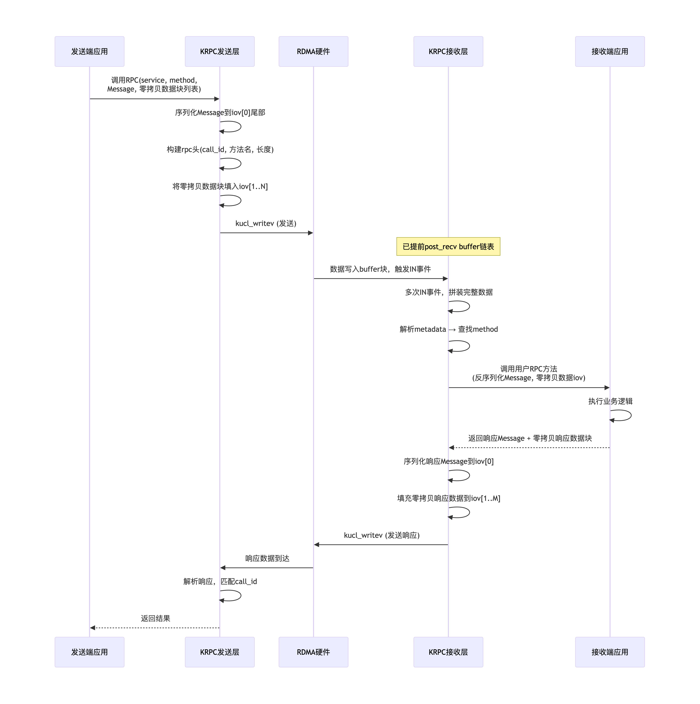

KRPC相关：为了在KRPC时，基于RDMA来实现数据收发的零拷贝，改造如下：

（1）pb中的message的序列化和反序列化，还是可以通过protocol-c 工具来生成 .cc和.h文件（自动生成的stub代码），来进行message的序列化和反序列化。
    （pb文件中的 messag类似于普通的结构体；service类似于函数指针的结构体，每个成员都是函数）

（2）pb中的service中的每个method都是自己实现的，这个没有问题。    
   但是 method的 rpc调用，==依赖之前的传统的 一整套的网络框架(连接建立、method的注册、发请求、请求解析「收请求查找method并且调用」、发响应、异常处理「超时、部分发送等」、服务发现，服务异常感知、服务负载均衡等等)，现在就不能用了==；因为现在为了ZC（zoro-copy），就需要自己实现这样的一套框架（目前可以仅仅只实现部分功能）。

（3）新的框架：原有框架的实现现在要自己进行实现，包括错误处理，部分写处理、延迟发送、超时重传等等处理。

UCL_writev：使用多个iov，每个iov的结构如下：

```c
ssize_t UCL_writev(int fd, struct UCL_iovec *iovs, int nr_iov, int flags);
ssize_t UCL_readv(int fd, struct UCL_iovec *iovs, int nr_iov);

typedef void (*event_notify_t)(void *base, void *user_data);

struct UCL_iovec {
    void *iov_base;
    uint64_t reserved1;
    uint32_t iov_len;
    uint32_t reserved2;
    void *iov_param;

    union {
        event_notify_t read_done;
        event_notify_t write_done;
    };
};
```
发送者：发送的请求和接收的响应之间，使用 rpc_call_id 来进行关联。
接受者：收到一个请求之后，提取rpc_call_id，回复的响应将 rpc_call_id 送回去。

（4）发送者：writev
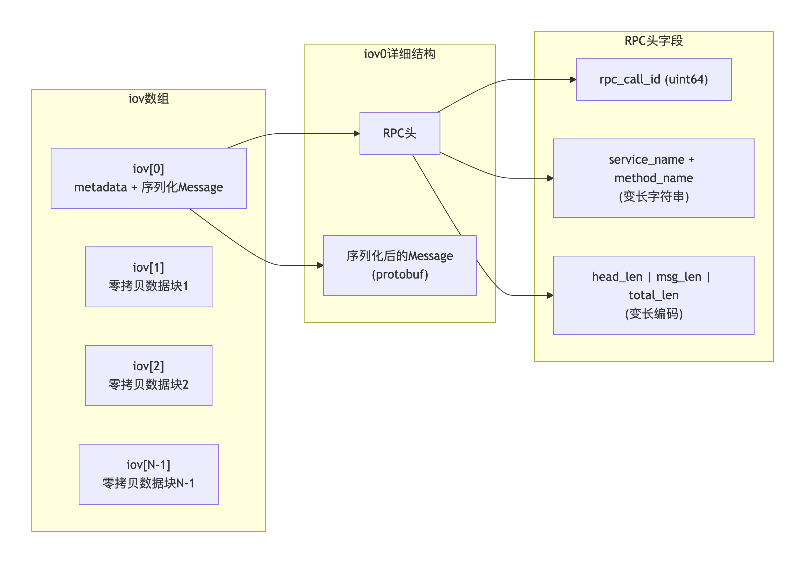

其中第一个iov，是传递metadata，包含2部分：
    rpc头：包含 rpc_call_id, 要远程调用的 service_name + method_name, 头数据长度（变长：因为service_name + method_name长度不固定），message序列化后的数据长度（变长），传递的总数据长度（变长）；
    请求的message序列化后的数据：

后面的 N-1 个 iov：其实就是发送端真实的要传递的数据；

（5）接收者：readv

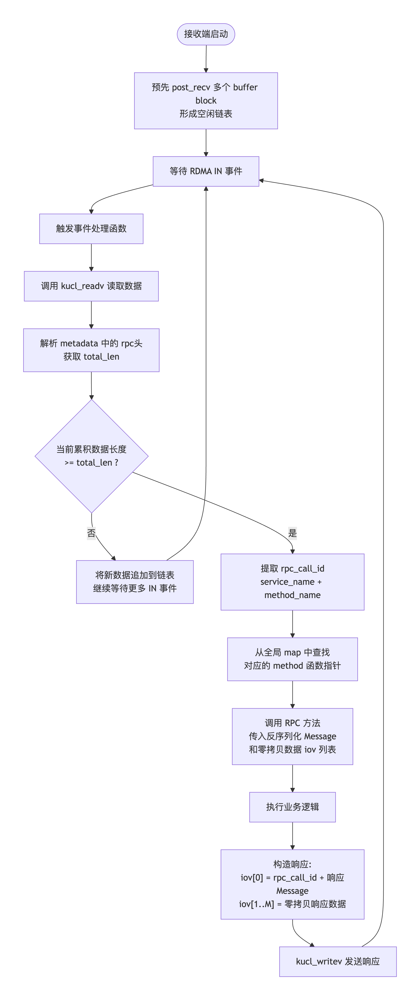

（5.1）提前实现method方法并注册: 
将各个service的method，提前自己实现，然后注册到map中，方便收到请求之后，查找到该方法后进行调用。

（5.2）==非阻塞异步RPC==：通过回调函数实现
通过一个rpc_callback, 接收发送者发送过来的rpc头（包含 rpc_call_id, 要远程调用的 service_name + method_name, 头数据长度等） 以及 rpc消息体（包含序列化的messag，以及后续的数据「数据没有被序列化」）；

（5.3）实现一个 buff 缓冲区（可以认为是多个接收buffer的链表）：
因为对于RDMA而言，为了ZC，需要提前post_recv多个内存块(buffer block)，每收到一块每块内存块(buffer block)就会产生一个IN事件，但是什么时候将发送者发送的数据接收完，这个其实是不知道的。

(5.4) ==非阻塞异步RPC==：回调函数+读取数据

(5.4.1)异步RPC:
通过一个rpc_callback, 接收发送者发送过来的rpc头（包含 rpc_call_id, 要远程调用的 service_name + method_name, 头数据长度等） + 序列化的message + 零拷贝的消息体（数据没有被序列化）；

(5.4.2)读取数据：
收到IN事件之后，就开始读取数据，但是此时可能无法得到发送者发送的完整数据，完整的数据有多长，可以基于发送的 metadata（rpc头） 获取到。
得到metadata 之后，基于 service_name + method_name 从 map中查找到方法，在完整接受到数据之后，就可以调用自己查找到的method方法。
注：在method方法中，会有一些反序列化的操作，以及后面的零拷贝数据的处理。
    
(5.4.3)响应数据：和发送者发送数据一样；
    第一个iov也是metadata：包含rpc头（rpc_call_id 原样返回）+ 响应message序列化后的数据
    后面的 N-1 个 iov：其实就是真实要响应的数据；

##### client RPC流程

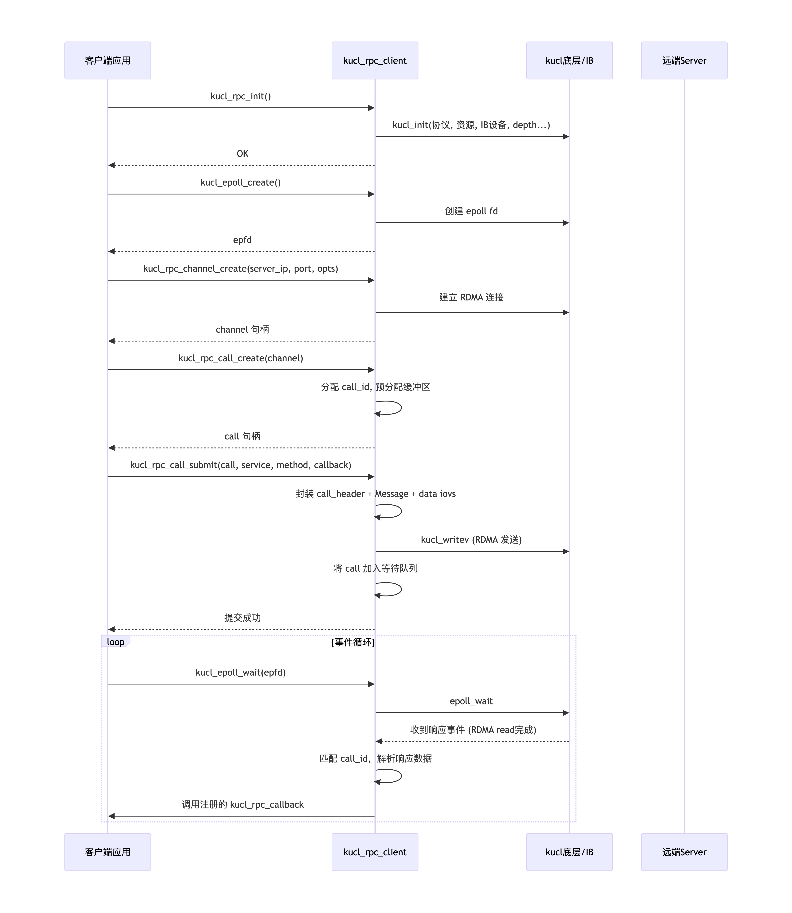
```bash
client:
（1）UCL_rpc_init （底层调用UCL_init 进行初始化: 指定传输协议，内存使用，资源申请，接收buff大小，worker数，ib设备，max_conns, qp/cq/srq depth, trace/日志配置）
（2）通过UCL socket接口 UCL_epoll_create 创建一个epoll fd;
（3）创建rpc channel(即一个连接)，传入参数server ip + port，以及UCL_rpc_chan_opts 配置；
（4）通过UCL_rpc_call_create分配一个rpc请求调用（rpc call：一个连接上可以有多个call）;
    请求数据（非序列化） + 请求medata（序列化）：rpc数据「call_header(call_id, 各部分长度) +  message的序列化 + data部分」、call所属的channel 等等。

（5）通过UCL_rpc_call_submit发送一个rpc call request：

    指定call：本端要发送的数据，包含了序列化的message（在iov[0]中） + 数据部分（不进行序列化，在iov[1~N] 中）；
    对方的service+method：对方要执行的函数
    设置响应回调函数：UCL_rpc_callback（为了异步非阻塞）；

（6）通过 UCL_epoll_wait 驱动工作线程，且指定call的reponse返回时会自动回调 UCL_rpc_callback

```
##### server RPC流程

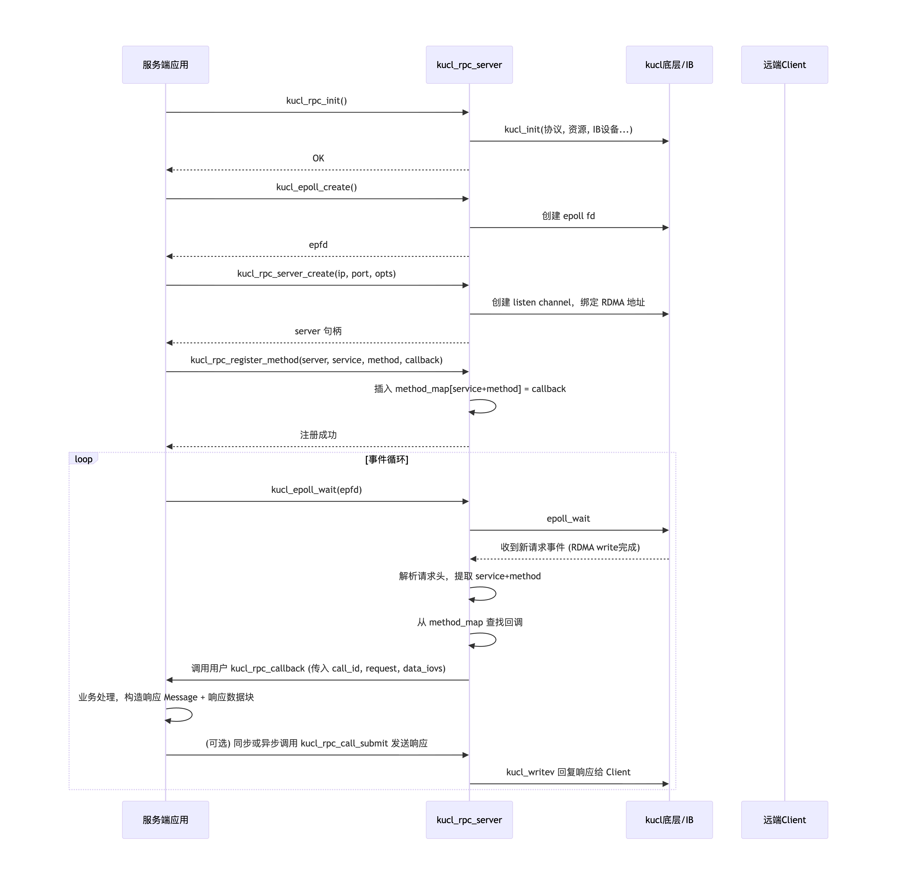

```bash
server:    
（1）UCL_rpc_init （底层调用UCL_init 进行初始化: 指定传输协议，内存使用，资源申请，接收buff大小，worker数，ib设备，max_conns, qp/cq/srq depth, trace/日志配置）
（2）通过UCL 接口UCL_epoll_create 创建一个epoll fd;
（3）创建rpc server，传入server ip + port，以及UCL_rpc_chan_opts 配置；
    rpc_server中包含：listen_channel, method_map, worker_id等等；
（4）通过 UCL_rpc_register_method 注册服务方法:
    包含 rpc server， service_name, method_name, UCL_rpc_callback
    service_name + method_name：UCL_rpc_callback 就是method 对应的具体的执行函数；

（5）通过 UCL_epoll_wait 驱动工作线程，在 UCL_rpc_callback 回调函数里处理 rpc request
（6）发送则同客户端使用方式，通过调用UCL_rpc_call_submit函数提交 rpc response

```

##### 完整 RPC 调用全过程
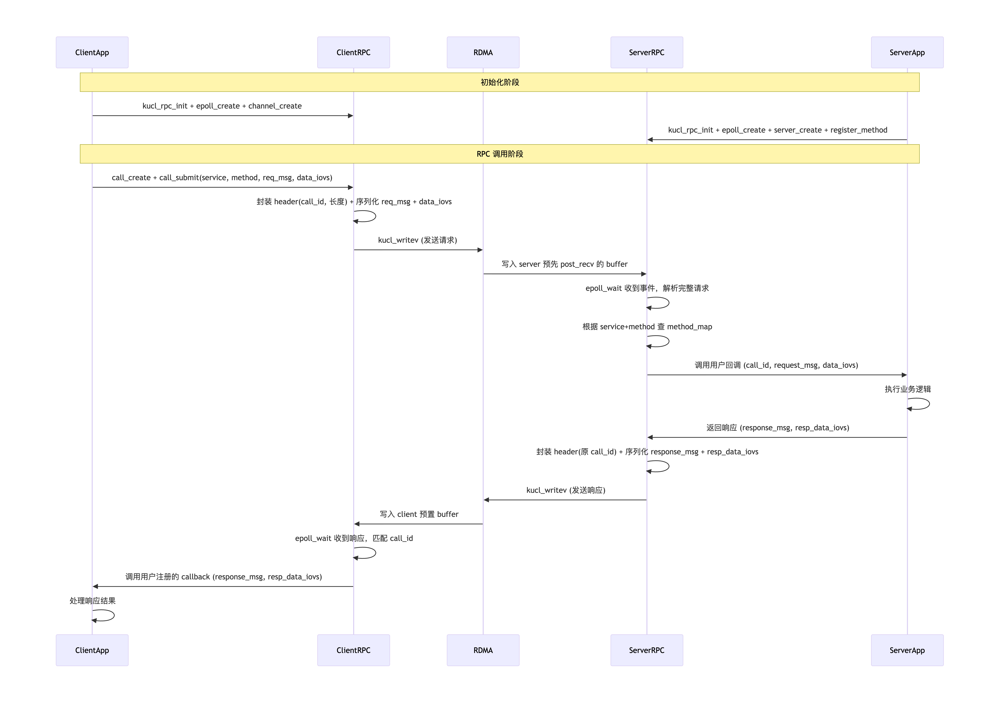


内部事件驱动流程图（基于 UCL_epoll_wait）:
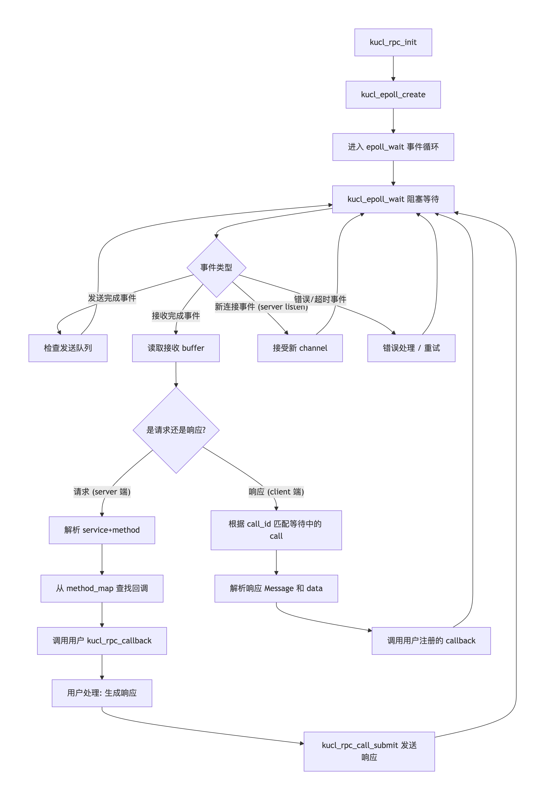

### 后续扩展
#### 通用RPC设计

KRPC 的定位是一个==通用 RPC 通信框架，专注于提供高性能的消息传输能力，而非绑定任何特定的序列化协议==。框架本身**只负责 RPC 消息的传输**，不参与业务数据的序列化/反序列化。序列化协议的选择（Protobuf、FlatBuffers、自定义二进制协议等）完全由业务方决定。

> 注：前面的带有PB的序列化和反序列化的RPC，也可以和这个通用RPC合并。可以在固定长度的RPC头中添加一个Flags字段，表示这个是通用的RPC（业务自己决定是否序列化，以及如何序列化）还是默认的PB序列化的RPC。如果是默认的PB序列化的RPC，那么相当于在通用RPC的基础上，自己实现了一部分业务RPC的逻辑（因为PB序列化为常见的序列化，大部分业务有这个就足够了）。


##### 背景
不同的业务，有不同的序列化需求。比如：
	有的业务不需要序列化(Raw格式)；
	有的业务通过pb进行序列化（PB格式）；
	有的业务不使用pb，而是使用其他的方法进行序列化（其他格式）。

##### 方案
**（1）通用rpc层**：
==通用层不进行任何的序列化和反序列化；是否进行序列化，以及序列化的工作，交给业务来实现==。

对于通用层来讲，readv收取一个固定长度头（rpc_hdr）+ payload（头中指定）长度的数据。
 通用层也不感知 service 和 method，收到上面的信息之后；如果是异步的rpc处理，直接就会交给**通用的接收回调函数（rpc_cb）** 处理。这个`rpc_cb` 是在 `rpc`层实现的；
 
 `rpc_cb` 内部，调用业务传递的业务层实现的 `cb_handle` 函数，传递的参数是：业务层的头指针，payload长度。

**（2）业务侧中间层**：
业务侧实现自己的 `cb_handle` 函数，在==业务头==(变长)中一般含有`service + method`（指定`service_name_len, method_name_len`），基于`service + method`可以找到自己实现的方法；
==业务侧实现自己的 `cb_handle` 函数，可以兼容处理业务的多个`service+method`方法，可以认为是业务自己实现的一个统一的处理接口==。


**（3）业务侧处理逻辑**：
在业务实现的每个`method`方法中，对于序列化的`message`以及真实的`payload`进行处理。这样业务就可以自己进行反序列化处理，以及各种处理。
> 注：最终的头的格式为：`通用rpc_hdr(固定长度) + 业务hdr_len（变长）  [ + 序列化的业务message信息（变长）] + 业务payload`。
> 其中，对于通用的rpc而言，`业务hdr_len（变长）  [ + 序列化的业务message信息（变长）] + 业务payload` 可以认为都是通用rpc的payload部分。


如上所示：
```bash
A> 图中的（1） 就是 通用rpc 感知的信息，业务不感知这个 rpc_hdr;
readv收到数据之后，就是一个固定的头（rpc_hdr） + payload; 是否序列化，以及如何序列化，通用rpc层不做任何决定。
```

#### 类protobuf-c工具：实现服务接口
目前基于标准的 protobuf-c 工具将.pb文件中的message以及service生成的.h,.c文件，**其中message生成的结构以及序列化和反序列化函数可用。
但是service中的method 以及底层框架其实是完全没法用的**，都是krpc自己实现底层的框架，比如rpc发送时，传递service+method，对方收到之后，需要实现查找method的逻辑。

目前的KRPC接口需要在 rpc_callback 中申请一个`rpc_call`，然后填充`rpc_header`，`序列化message`，然后调用`submit` 来发送(指定call， service, method 等)。这个流程不是自动化生产的，如果可以使用一个类似于 protobuf-c 工具将这样的接口自动化生产就好了，用户就可以更简单的调用rpc接口，将注意力放在业务逻辑上。

#### 同步RPC 和 异步RPC

参考：[brpc 的client和server的同步/异步接口](https://github.com/apache/brpc/blob/master/docs/cn/client.md#%E5%90%8C%E6%AD%A5%E8%AE%BF%E9%97%AE)

**（1） 异步RPC**


**（2）同步RPC**


#### 线程模型
RPC线程模型有两种：
1> RTC线程模型（rpc的io处理和业务处理在一个线程）
2> Reactor（pipeline）线程模型（rpc的io线程和业务的worker处理线程分离）

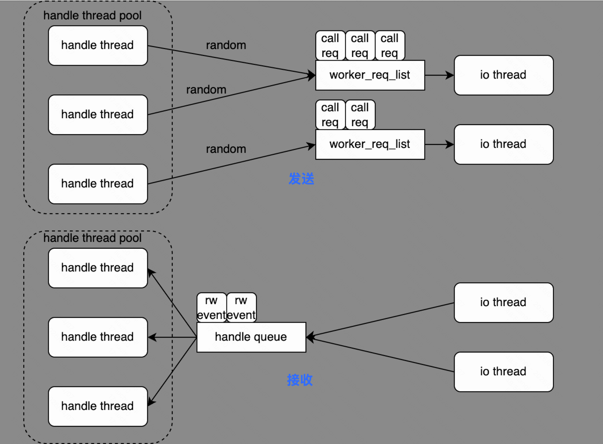

RTC模型在**低延迟的业务处理**场景下具有极致性能，但当业务处理（callback）耗时较长时，会阻塞 IO 事件循环，导致吞吐下降和尾部延迟恶化。
Pipeline（Reactor）线程模型，将 IO 处理和业务处理分离到不同线程组，使得 IO 线程不被业务阻塞，保障网络层的及时响应。


协议格式：
```bash
+------------------+-------------------+------------------+
|    rpc_hdr       |   business hdr    |     payload      |
|  (20 bytes)     |   (变长)          |   (变长)         |
+------------------+-------------------+------------------+
| magic_num (4B)   | svc_name_len (2B) | [ext_data]       |
| rpc_id     (8B)  | method_name_len(2)| [业务数据]       |
| hdr_len    (4B)  | service_name (变) | (框架不透明)     |
| payload_len(4B)  | method_name  (变) |                  |
| flags            | ext_data_len  (4) |                  |
+------------------+-------------------+------------------+
       ↑                  ↑                     ↑
   框架解析/组装      框架解析(路由)        框架不感知
```

框架职责：
```bash
┌──────────────────────────────────────────────────────────┐
│                   框架职责 (KRPC)                         │
│                                                          │
│  ┌──────────────┐   ┌──────────────┐   ┌─────────────┐  │
│  │ 解析/组装     │   │ 解析/组装     │   │ 消息定界    │  │
│  │ rpc_hdr      │──▶│ business hdr  │──▶│ (按长度切分) │  │
│  └──────────────┘   └──────┬───────┘   └─────────────┘  │
│                            │                              │
│  ┌──────────────┐   ┌──────▼───────┐   ┌─────────────┐  │
│  │ 传输层 IO    │   │ 路由分发      │   │ 超时/重试   │  │
│  │ (readv/writev│   │ (find_method) │   │ 管理        │  │
│  └──────────────┘   └──────────────┘   └─────────────┘  │
└──────────────────────────────────────────────────────────┘

┌──────────────────────────────────────────────────────────┐
│                   业务方职责                               │
│                                                          │
│  ┌──────────────┐   ┌──────────────┐   ┌─────────────┐  │
│  │ 选择序列化协议 │   │ 序列化       │   │ 反序列化    │  │
│  │ (pb/fb/自定义)│   │ payload      │   │ payload     │  │
│  └──────────────┘   └──────────────┘   └─────────────┘  │
│                                                          │
│  ┌──────────────┐                                       │
│  │ 业务逻辑处理  │                                       │
│  └──────────────┘                                       │
└──────────────────────────────────────────────────────────┘
```

##### RTC线程模型


**(1)client端**
```bash
┌─────────────── Client 发送请求 (RTC) ────────────────┐
│                                                        │
│  Worker 线程 (调用方所在线程):                          │
│    [1] UCL_call_alloc(chan)     //rpc call申请       │
│    [2] 业务方: 序列化 request → call->send_payload     │
│    [3] UCL_call_submit(call, svc, method, cb, arg)   │
│        │                                               │
│        │  内部流程:                                     │
│        ├─ [4] 组装 rpc_hdr + business hdr (框架职责)   │
│        ├─ [5] call->status = READY                     │
│        ├─ [6] writev() 发送完整帧                      │
│        └─ [7] insert flighting_call + 启动 timer        │
│                                                        │
│  关键: 发送请求在同一线程内完成，零跨线程开销            │
│  若调用方不在 Worker 线程:                              │
│    → 投递到目标 Worker 的 req_list                     │
│    → Worker 在 worker_poll() 中取出执行 [4]-[7]        │
│                                                        │
└────────────────────────────────────────────────────────┘


┌─────────────── Client 收到响应 (RTC) ────────────────┐
│                                                       │
│  Worker 线程:                                         │
│    [1] event_poll() → 收到可读事件                    │
│    [2] pipe_append() → readv() 到 ibuf               │
│    [3] 解析 rpc_hdr → 根据 rpc_id 找 flighting_call  │
│    [4] 解析 business hdr → 提取 ext_data              │
│    [5] 按 hdr_len + payload_len 切分完整帧            │
│    [6] 将 payload 拷贝到 call->recv_payload           │
│        (框架不反序列化，原样存放)                      │
│    [7] remove flighting_call + cancel timer           │
│    [8] cb(call, arg, UCL_RPC_OK)                    │
│        │                                              │
│        │  业务方在 cb 中:                              │
│        │  ├─ 反序列化 call->recv_payload               │
│        │  ├─ 执行业务逻辑 (赋值/通知等)               │
│        │  └─ call_free(call)                           │
│                                                       │
│  超时路径:                                            │
│    Worker 线程 timer 检测超时                         │
│    → remove flighting_call                            │
│    → cb(call, arg, UCL_RPC_TIMEOUT)                  │
│                                                       │
└───────────────────────────────────────────────────────┘


```

**(2) server端**：
```bash
[IO] event_poll → [IO] pipe_append → [IO] 解析 rpc_hdr
    → [IO] 解析 business hdr → [IO] find_method
    → [业务] cb() [反序列化/执行/序列化]
    → [IO] 组装 rpc_hdr + hdr → [IO] writev
```

详细流程如下：
```bash
Worker 线程 (既做 IO 又做业务):
    [1] event_poll       → 收到可读事件
    [2] pipe_append     → 读取数据到 ibuf
    [3] 解析 rpc_hdr    → 消息定界
    [4] 解析 business hdr → 提取 service_name, method_name
    [5] find_method      → 查找业务回调
    [6] cb()             → 业务处理 (含 payload 反序列化，业务逻辑，序列化 response)
    [7] 组装 rpc_hdr+hdr → 框架组装传输头
    [8] writev           → 发送响应
```


##### Reactor（pipeline）线程模型


**（1）client 端**：
```bash

┌─────────────── Client 收到响应 (Pipeline) ──────────────┐
│                                                            │
│  IO 线程:                                                  │
│    [1] event_poll() → 收到可读事件                         │
│    [2] pipe_append() → readv() 到 ibuf                     │
│    [3] 解析 rpc_hdr → 根据 rpc_id 找 flighting_call        │
│    [4] 解析 business hdr → 提取 ext_data                   │
│    [5] 按 hdr_len + payload_len 切分完整帧                 │
│    [6] 将 payload 拷贝到 call->recv_payload                │
│        (框架不反序列化，原样存放)                           │
│    [7] remove flighting_call + cancel timer                │
│    [8] inbound_enqueue(worker.inbound_queue)             │
│        call->status = IN_QUEUING                          │
│                                                            │
│  ═══════════════ 投递到 Worker 线程 ═══════════════════   │
│        │                                                   │
│        ▼                                                   │
│  Worker 线程:                                              │
│    [9]  inbound_dequeue(call)                             │
│    [10] call->status = PROCESSING                          │
│    [11] cb(call, arg, UCL_RPC_OK)                         │
│         │                                                  │
│         │  业务方在 cb 中:                                  │
│         │  ├─ 反序列化 call->recv_payload                   │
│         │  ├─ 执行业务逻辑 (赋值/通知等)                   │
│         │  └─ cb 返回后 call 生命周期结束                  │
│         │                                                  │
│    [12] call_free(call)                                    │
│                                                            │
│  超时路径:                                                 │
│    IO 线程 timer 检测超时                                  │
│    → remove flighting_call                                 │
│    → inbound_enqueue 到 Worker                            │
│    → cb(call, arg, UCL_RPC_TIMEOUT)                       │
│                                                            │
└────────────────────────────────────────────────────────────┘

远端 Server            Client IO Thread                     Client Worker Thread
  │                       │                                    │
  │                       │                                    │
  │  ──── 响应帧 ────▶   │                                    │
  │                       │ [1] readv() 读到 ibuf              │
  │                       │ [2] 解析 rpc_hdr → 定界             │
  │                       │ [3] 找 flighting_call               │
  │                       │ [4] 解析 business hdr → ext_data   │
  │                       │ [5] 切分 → recv_payload (不反序列化) │
  │                       │ [6] remove flighting + cancel timer │
  │                       │                                    │
  │                       │ ─── call (含 opaque payload) ──▶   │
  │                       │   inbound_enqueue                  │
  │                       │                                    │
  │                       │                                    │ [7] inbound_dequeue
  │                       │                                    │ [8] cb(call, arg, OK)
  │                       │                                    │     反序列化 recv_payload
  │                       │                                    │     执行业务逻辑
  │                       │                                    │ [9] call_free(call)
  │                       │                                    │

```


**(2) server端：**

```bash
Client                 IO Thread                          Worker Thread
  │                       │                                    │
  │  ──── 请求帧 ────▶   │                                    │
  │                       │ [1] readv() 读到 ibuf             │
  │                       │ [2] 解析 rpc_hdr → 定界            │
  │                       │ [3] 解析 business hdr → 路由      │
  │                       │ [4] find_method() → 找到 cb        │
  │                       │                                    │
  │                       │ ─── call (含 opaque payload) ──▶  │
  │                       │   inbound_enqueue                  │
  │                       │                                    │
  │                       │                                    │ [5] inbound_dequeue
  │                       │                                    │ [6] cb(call)
  │                       │                                    │     反序列化 payload
  │                       │                                    │     执行业务逻辑
  │                       │                                    │     序列化 response
  │                       │                                    │
  │                       │ ◀── call (含 response payload) ─── │
  │                       │   outbound_enqueue                  │
  │                       │   + eventfd 通知                   │
  │                       │                                    │
  │                       │ [7] outbound_dequeue                │
  │                       │ [8] 组装 rpc_hdr + hdr             │
  │  ◀─── 响应帧 ─────   │ [9] writev() 发送                 │
  │                       │                                    │


┌─────────────── Server IO 线程主循环 ───────────────┐
│                                                       │
│  while (true) {                                       │
│      ┌─── Step 1: IO 事件轮询 ─────────────────┐    │
│      │  event_poll() → 收到可读事件              │    │
│      └──────────────────────────────────────────┘    │
│                    │                                  │
│                    ▼                                  │
│      ┌─── Step 2: 读取原始数据 ────────────────┐    │
│      │  pipe_append() → readv() 到 ibuf          │    │
│      └──────────────────────────────────────────┘    │
│                    │                                  │
│                    ▼                                  │
│      ┌─── Step 3: 解析 rpc_hdr ────────────────┐    │
│      │  提取 magic_num, rpc_id, hdr_len,        │    │
│      │  payload_len → 消息定界                   │    │
│      └──────────────────────────────────────────┘    │
│                    │                                  │
│                    ▼                                  │
│      ┌─── Step 4: 解析 business hdr ────────────┐    │
│      │  提取 service_name, method_name,           │    │
│      │  ext_data_len → 路由信息                   │    │
│      └──────────────────────────────────────────┘    │
│                    │                                  │
│                    ▼                                  │
│      ┌─── Step 5: 路由查找 ───────────────────┐    │
│      │  find_method(service_name, method_name)   │    │
│      │  ├─ 找到    → 继续分发                    │    │
│      │  └─ 未找到  → 组装错误响应 → writev()     │    │
│      └──────────────────────────────────────────┘    │
│                    │ (找到)                           │
│                    ▼                                  │
│      ┌─── Step 6: 分发到 Worker ───────────────┐    │
│      │  选择目标 Worker (affinity / RR)          │    │
│      │  call->status = IN_QUEUING               │    │
│      │  inbound_enqueue(worker.inbound_queue)   │    │
│      │  (payload 不透明传递，框架不解析)          │    │
│      └──────────────────────────────────────────┘    │
│                                                       │
│  ══════════════ 跨线程边界 (inbound_queue) ════════ │
│                                                       │
│      ┌─── Step 7: 从 outbound_queue 取响应 ────┐    │
│      │  outbound_dequeue_batch() → 批量取出 call │    │
│      └──────────────────────────────────────────┘    │
│                    │                                  │
│                    ▼                                  │
│      ┌─── Step 8: 组装并发送响应 ───────────────┐    │
│      │  组装 rpc_hdr + business hdr               │    │
│      │  (send_payload 中是业务方已序列化的数据)  │    │
│      │  writev() → 发送完整帧                     │    │
│      └──────────────────────────────────────────┘    │
│                                                       │
│      ┌─── Step 9: 其他 poller ─────────────────┐    │
│      │  timer 检查超时 / broken channel 清理    │    │
│      └──────────────────────────────────────────┘    │
│  }                                                    │
└───────────────────────────────────────────────────────┘

```


```bash
IO 线程职责:                         Worker 线程职责:
─────────────                        ──────────────
2. readv() 读取原始字节               1. 从 inbound_queue 取 call
3. 解析 rpc_hdr                      2. 执行 cb(call, arg, OK)
4. 解析 business hdr                 3. 业务方在 cb 中:
5. 按 hdr_len + payload_len 切帧        - 反序列化 call->recv_payload
6. find_method(svc, method)              - 执行业务逻辑
7. 投递 call 到 inbound_queue           - 序列化到 call->send_payload
8. 从 outbound_queue 取 call          4. 投递 call 到 outbound_queue
9. 组装 rpc_hdr + business hdr
10. writev() 发送完整帧
```


Pipeline 模式下，IO 线程是否需要感知 service_name / method_name？find_method 放在 IO 线程还是 Worker 线程？

```bash
方案 A: find_method 在 IO 线程 (推荐： 错误路径最短)
============================================
IO Thread:
    readv → 解析 rpc_hdr → 解析 business hdr → find_method()
        ├─ 找到    → inbound_enqueue(call, cb)     [1次跨线程]
        └─ 未找到 → 直接组装错误响应 → writev()    [0次跨线程]

Worker Thread:
    inbound_dequeue → cb(call) → outbound_enqueue   [1次跨线程]

总计: 2次跨线程 (正常路径), 0次跨线程 (错误路径)


方案 B: find_method 在 Worker 线程 (不推荐)
============================================
IO Thread:
    readv → 解析 rpc_hdr → 解析 business hdr → inbound_enqueue(call)
                                                     [1次跨线程]

Worker Thread:
    inbound_dequeue → find_method()
        ├─ 找到    → cb(call) → outbound_enqueue     [1次跨线程]
        └─ 未找到 → 组装错误响应 → outbound_enqueue  [1次跨线程]

总计: 2次跨线程 (正常路径), 2次跨线程 (错误路径)
```

#### 序列化和反序列化
message的序列化和反序列化的好处之一：增强可扩展性（比较方便的进行扩展字段）。但是**序列化和反序列化带来的一个很大的问题，就是CPU的消耗，性那的下降**。

推荐的做法是：
==控制消息（调用频率低，关注扩展性）进行序列化和反序列化。
数据消息（调用频率高，关注性能，后续变化少）直接传递结构体，跳过序列化和反序列化==。

#### 流式RPC
上面的实现的rpc都是简单RPC（一元RPC），也就是RPC请求和响应是一对一的；或者只有RPC请求，没有RPC响应。

##### server端流式RPC
服务端流式 RPC 是指客户端发送一个请求消息给服务端，服务端返回一个数据流，在这个流中可以包含多个响应消息。客户端从流中读取消息直到没有更多消息为止。

client收到RPC响应之后，从在飞的flighting call中查找到对应的RPC 请求，不可以将其摘除，因为后续还是有RPC响应。

##### client端流式RPC
客户端流式 RPC 是指客户端发送一个数据流给服务端，在这个流中可以包含多个请求消息，服务端接收完整个流后返回一个响应消息。

client发送了多个RPC请求，server只回复一个响应。
> 即：client支持发送多个RPC请求；server端收到RPC请求之后，如果后续还有RPC请求，则不进行回复；直到收到最后一个RPC请求，才进行回复。

对于server端：需要在server端的RPC的method处理函数进行特殊处理，只有收到最后一个RPC请求之后，才可以进行回复响应。
对于client端：比如，上传一个大文件，支持断点续传。其实具体传到哪里了，新的client应该从哪里继续传输，这个应该是需要server告知client。

##### 双向流式RPC


#### 发布订阅模式
发布者，订阅者，broker

发布者：向broker 发送message 以及 message的标签Topic 给 broker；
订阅者：向broker 发送关注的topic
broker：对于某个topic的订阅者，向所有的订阅者发送其感兴趣的message


# 可观测性 和 可运维性

## 可观测性
### 日志

**日志**：不同级别的日志，日志切割；
### trace

**Trace**：收发全链路的Trace，链路上的各个函数耗时以及关键参数，返回值等。

### 统计
**统计**：进程级别 /线程级别/连接基本的统计信息，meminfo， CPU使用信息；
> 注：**单机(节点)级别**的统计，可以通过额外的监控发现；比如：机器的**网卡级别**的各个统计，RDMA各种报文和异常/错误：CNP报文，RNR报文，RDMA Seq_err 等等。

### 抓包
**抓包**：通过高版本的tcpdump，抓取IB设备接口的流量，可以摘取RDMA和DPDK等kernel bypass的流量。


### ebpf

**ebpf**： 对于DPDK/libverbs这种用户态的程序，通过ebpf Uprobe 或者 USDT探针 低侵入性的监控追踪（关键字段查询、关键路径耗时等）。
```bash
uprobe: 用户态动态探针「代码无侵入，任意位置，获取部分信息（参数、返回值、执行时刻、执行时间）」。
        触发时机：
	    1》程序进入时：对于用户态的函数前插入指令断点，执行特定函数前，先到ebpf中执行执行的程序，获取信息，写入到map中；用户态程序从map中获取信息。
        2》函数退出时: 也可以执行指定的程序，这样就可以获取函数的执行时间。
        比如：ibv_post_send / ibv_poll_cq 以及 UCL 自己的内部函数打 uprobe；

USDT（Userland Statically Defined Tracing）:  
        用户态，在指定的代码位置预埋静态探针「代码预埋，指定API，获取信息丰富（自定义）」，对于源码少量侵入。
        需要在代码中主动添加几行代码（探针）。USDT 探针未挂载时是 NOP 指令，无性能影响；
        可以在 UCL 现有 Trace 体系的基础上，额外添加 USDT 探针。只需在关键路径加几行宏，未挂载时性能零损耗。


uprobe 和 kprobe 相对：一个用户态，一个内核态，都是动态探针。
USDT 和 内核的 tracepoint相对：一个用户态，一个内核态，都是静态探针。
```

### xdp

**xdp**:   但是对于RDMA流量，没有信息到网卡驱动层，因为DMA已经将数据放入到指定的位置了，因此XDP也就不生效。

或者这么认为：==XDP、DPDK、RDMA是三种不同的实现高性能的解决方案，三者本身就不太兼容==。

|方案|技术路径|适用 RDMA？|适用 DPDK？|侵入性|热路径开销|最佳场景|
|---|---|---|---|---|---|---|
|Native XDP/TC eBPF|Native XDP 驱动层； TC: 网络协议栈的设备层|❌ 完全不可达|❌ 已被接管|零|极低|**不适用 UCL**|
|uprobe libibverbs|ibv_post_send/poll_cq|✅|不涉及|零|中 ~200ns|生产毛刺排查|
|uprobe UCL 内部|kbuff_malloc/rdma_send|✅|✅|零|中|Thread Cache 监控|
|USDT 探针|源码加宏 + eBPF 挂载|✅|✅|**极小（加宏）**|**近零（未挂载=NOP）**|生产长期埋点|
|perf_event 采样|CPU 周期采样|✅|✅|零|极低|CPU 火焰图|
|MLX5 sysfs 计数器|硬件端口计数器|✅|✅|零|零|带宽/错误趋势|
|rdma stat 工具|内核 RDMA QP 统计|✅|不涉及|零|零|QP 级别统计|


## 可运维性

**动态更改配置**：比如动态更改debug基本，开启关闭trace；


# 性能数据

## 时延
使用RDMA的 send/recv 操作, UCL 测试程序在单个QP，100G同TOR下的两台设备，写4k，响应100B。
时延是：7.1us；perftest 是 6.7us。
注：perftest中的send/recv的测试，时延是单向的时延，即RTT/2；

## 带宽
写4K的情况下，限制并发度（比如最大并发度8，意味着一个线程最多同时发8个请求，收到相应了才允许发下一个），使用send/recv：差不多3个线程，就可以将100G的带宽打满。

如果不限制并发度的情况下，按理一个线程，就可以给100G的带宽给打满。

# AI提效
## 闭环开发
### skills
（1）ssh-relay
通过ssh登录开发机，需要首先登录堡垒机(relay), 通过ssh-relay skill工具，登录开发机或者线上机器。

（2）case测试
把client以及server的测试机器配置，RDMA IP, 各类的测试工具（比如：kperf， msgperf 等）的用法沉淀为skills，AI可以直接驱动client和server进行打流测试，发起带有参数的测试。

### 工作流
整体流程：
```bash
1> 在KUCL工程中提需求----> 
2> AI 自动coding ---> 
3> 建立临时分支，向gitlab提交代码----> 
4> 编译机器上拉取代码，进行编译，产出二进制可执行文件----->
5> 将二进制可执行文件，拷贝到client和server的测试机器上---->
6> 执行 case测试的skills
7> 输出测试结果报告
```

### skill 、subagent、workflow 之间的区别和联系

Skill 是"AI 读的说明书"；Subagent 是"AI 调用的另一个 AI"；Workflow 是"AI 按顺序做事的剧本"。
Skill 让 AI 知道怎么做；Subagent 让 AI 找别人帮忙做；Workflow 让 AI 按步骤把事做完。
三者通常嵌套使用：Workflow 调用 Skill 获取知识、调用 Subagent 处理子任务。

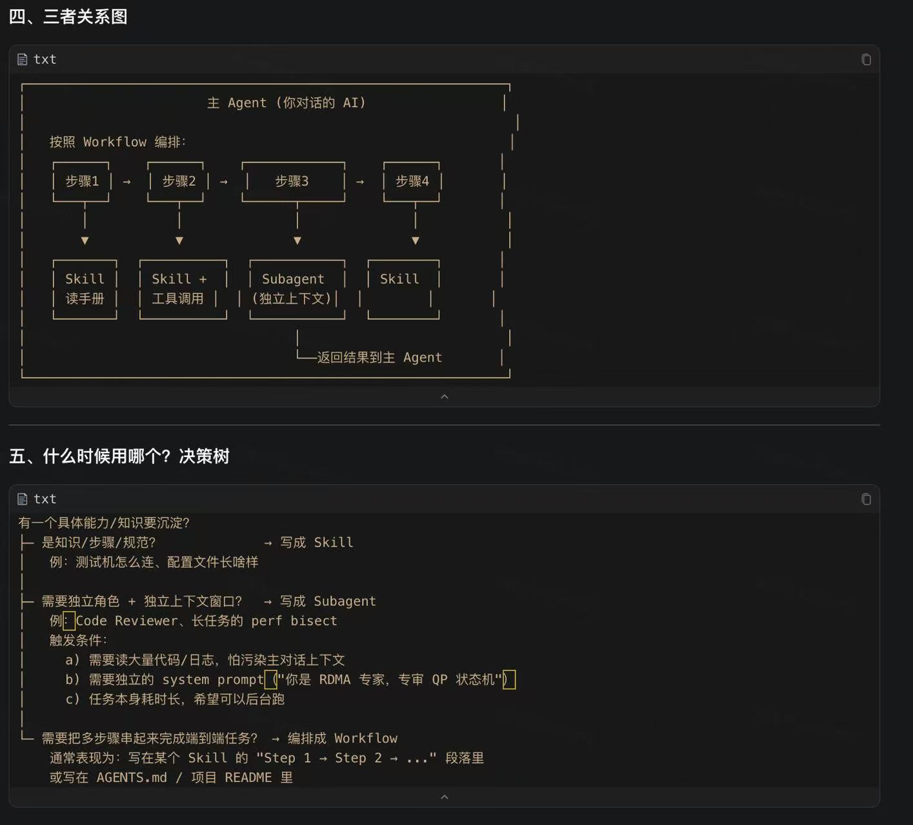

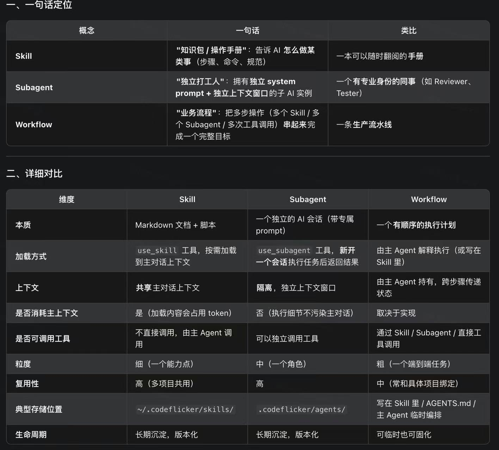

## TODO：Code Review 智能化
### 痛点
KUCL涉及到RDMA状态机，QP生命周期，CQ/SRQ、QP的引用计数、内存池等踩坑高发区。新人提交的PR经常因为这些细节被打回。

### 做法
建立KUCL专属的 `kucl-core-reviewer`的 subagent, 加载领域知识后审查diff。

（1）RDMA状态机检查：
QP的状态转移路径是否合法（`INIT->RTR->RTS`）, 错误路径回滚是否到正确的状态

（2）线程模式检查
操作设备的cq/srq是否在worker线程中；操作ctrl_data是否在kpoll线程中。

（3）代码风格审查
自动跑 `clang-format -i` 并报告diff。


## TODO: 性能回归 + 自动二分定位
### 痛点
KUCL作为一个延迟敏感的高性能通讯库，提交的多个commit 可能会让P99 时延上升 5%，但是被功能测试漏过。人工跑perf 二分查找是哪个commit提交导致时延变大通常需要半天。

### 做法
（1）比较性能diff：
新建一个perf-regresssion(性能回归)的skill，封装"基线baseline 以及 当前的HEAD 提交，跑性能测试工具（比如kperf、msgperf）--> 得到P50/P99/带宽 的  diff----> 一旦性能存在下降，并且下降幅度超过5%，则出发告警"的完整链路。

（2）定位性能回退的commit：
当AI检测到性能回退时，自动出发`git bisect(对半切分、 二分查找)`：在两个commit之间，反复的进行`编译 + 部署 + 跑性能测试用例`，二分定位到首个引起回退的 commit。

（3）生成性能演进曲线：
把perf性能数据，写入到时序的数据库中（或者简答的CSV），形成性能演进曲线。AI在 Core Review 时引入历史曲线给出趋势判断。


### 预期收益
把每次release 发版前的性能回归从1天压缩到一小时，且可在nightly 自动触发。

## TODO：新人Onboarding Agent
Onboarding Agent ≠ 一份新人手册，而是一个"专门带新人的 AI 学长"：

它陪着新人，一步一步、动手实操、随时答疑、定期检验， 把"3-4 周才能上手"压缩到"3-5 天能交付"， 同时把老同事从重复的入职辅导中解放出来。

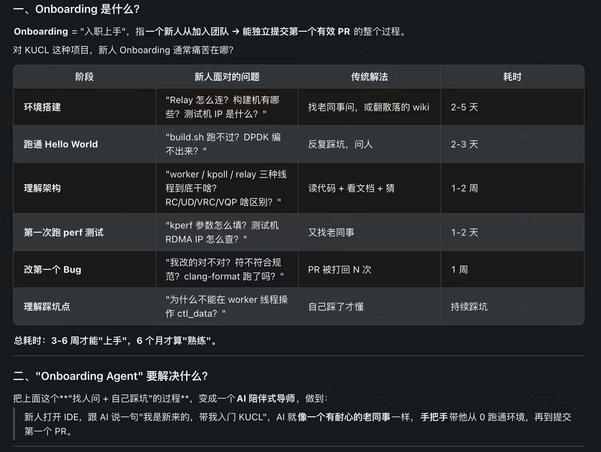

## TODO: 问题定位推断：失败日志--> root case 推断
### 痛点
测试机器跑kperf 失败，错误日志散落在多个机器，多个文件（KUCL_LOG_ERR + dmesg + ibv async event + 内核 RDMA 模块日志），新人面对一堆log经常无从下手

### 做法
（1）新增 kucl-log-doctor skill：
- 自动拉取测试机器上的 `/var/log/kucl/*.log`、`dmesg`、`ibv_devinfo`输出；
- 识别常见的错误模式（如：`cqe with error`, `qp transition failed`, `mr registration failed`, `hugepage 不足`， `PCIe BDF 找不到`）
- 输出，根因 + 修复建议 + 相关的代码位置

（2）把历史bug复盘（root cause + fix commit）做成知识库，AI在遇到类似问题时，引用过往的案例


## AI 在系统软件中的应用的发展趋势预测
### 能力演进：从代码补全到自主闭环

（1）代码补全：
时间窗口：2021-2023年；
特征：单行或者单个函数的代码补全；

（2）任务级的辅助：
时间窗口：2024-2025年；
特征：在多个文件内完成一个feature；

（3）闭环开发：
时间窗口：2025-2027年；
特征：AI自主完成`改代码--->编译---->测试---->调优---->提PR`全链路，人类只是做code review。

（4）系统级自主
时间窗口：2027+；
特征：AI长期维护一个子系统： 监控相关指标，自主提性能优化的PR，自主修复线上的bug。

#### 注意
通用LLM对于C内存安全、并发原语、硬件交互（PCIe/IBV）上的幻觉比业务代码严重的多。所以，领域知识沉淀（skill/subagent/workflow/Rag知识库）的价值远大于更换更强的模型。KUCL的`agents.md + skills`的路线是对的。


### 协作方式的演进：人机分工的新边界
未来的1-2年，工程师的工作越来越向`架构 + review + 调优`集中， AI接管 `实现 + 测试 + 部署  + 文档`：
```bash
人类                          AI
┌──────────────────────────┐    ┌──────────────────────────┐
│ • 业务需求拆解             │    │ • 代码实现（多轮）          │
│ • 架构/接口设计            │ ←→ │ • 单元测试编写             │
│ • 复杂 Bug 的根因判断      │    │ • 性能回归 + 二分定位       │
│ • PR Review（最后一道闸）  │    │ • 文档同步                  │
│ • 安全/合规决策            │    │ • Onboarding 陪伴          │
└──────────────────────────┘    └──────────────────────────┘
```

### 风险和反共识
下面的一些问题，需要警惕；


# 规划

.png)

.png)


# 参考
```bash

```