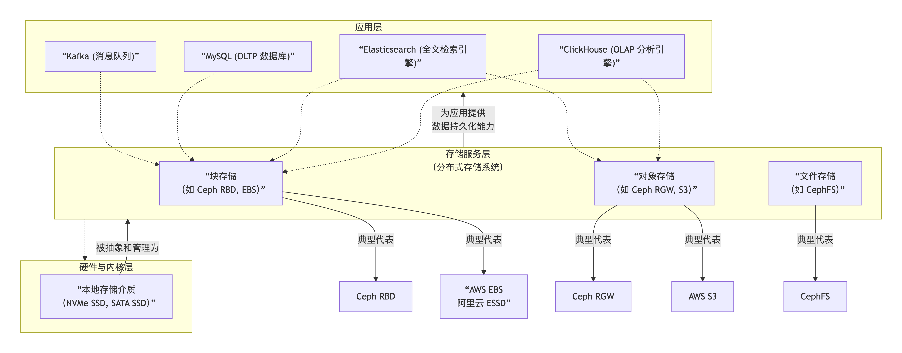

```table-of-contents
```
# 整体技术栈层次（从底到顶）
```bash
┌─────────────────────────────────────┐
│            应用 / 数据系统层          │
│  Kafka / MySQL / ClickHouse / ES     │
└─────────────────────────────────────┘
                    ↑
┌─────────────────────────────────────┐
│         分布式存储 / 云存储层         │
│  Ceph / 对象存储 / 云块存储(EBS/ESSD)  │
└─────────────────────────────────────┘
                    ↑
┌─────────────────────────────────────┐
│           高性能 I/O 框架层           │
│        SPDK / DPDK / io_uring        │
└─────────────────────────────────────┘
                    ↑
┌─────────────────────────────────────┐
│            存储硬件接口层             │
│               NVMe                   │
└─────────────────────────────────────┘
                    ↑
┌─────────────────────────────────────┐
│               硬件层                  │
│             NVMe SSD                 │
└─────────────────────────────────────┘
```

每一层解决什么问题：

|层|技术|解决问题|
|---|---|---|
|应用层|Kafka / MySQL / ClickHouse / ES|数据处理|
|存储服务层|Ceph / EBS / 对象存储|存储资源池化|
|I/O框架|SPDK|高性能访问|
|协议层|NVMe|SSD访问标准|
|硬件|NVMe SSD|数据存储|

## 关系



**Kafka/MySQL/CH/ES 不直接碰 NVMe/SPDK**
它们只认：**块设备（盘）**

- **Ceph/EBS 才会直接用 NVMe、用 SPDK**
    它们把磁盘包装成**可靠、分布式、可挂载的云盘**

- **NVMe 是硬件能力，SPDK 是让硬件能力跑满的软件**

## 应用层
这些是我们最熟悉的软件，它们直接面向业务，并通过调用底层存储服务来持久化数据。

**Kafka (消息队列)**：作为高吞吐的实时数据管道，分布式消息队列/流处理平台，解耦生产者和消费者，缓冲流量，实时数据管道。Kafka将数据持久化到磁盘上。官方强烈推荐为其使用**块存储**，无论是基于云厂商的EBS，还是使用本地NVMe盘，都能保证其高性能和可靠性。

**MySQL (关系型数据库)**：作为在线事务处理（OLTP）的典型代表，它需要极低延迟和高一致性的存储。因此，**块存储**是它的最佳拍档。无论是运行在物理机的NVMe盘上，还是虚拟机挂载的EBS/ESSD云盘上，块存储都直接为MySQL的数据文件提供了最底层的支持。

**ClickHouse (分析型数据库)**：它专为海量数据的在线分析处理（OLAP）设计。ClickHouse对存储的使用是分层且灵活的：**热数据**通常存放在本地NVMe SSD或高性能块存储上以保证分析速度；而**冷数据**则可以存放在S3/OSS这样的对象存储上以降低成本。

**Elasticsearch (搜索引擎)**：用于日志分析和全文搜索。它同样可以利用**块存储**来存放索引文件以获得最佳性能，也可以将不常用的索引快照备份到**对象存储**中。

## 存储服务层

这些不是数据库，是**给数据库 / 中间件当硬盘用的**。这一层解决一个问题：**如何把很多磁盘变成一个存储服务**。

- **块存储**：像硬盘 → 给数据库 / Kafka 用
- **对象存储**：像网盘 → 存文件、备份

### 分布式块存储

分布式块存储（Ceph-RBD、阿里云云盘、AWS EBS、阿里云 ESSD）；
它将分散在不同服务器上的硬盘空间整合起来，对外提供了一种“**虚拟硬盘**”的服务。它的特点是延迟极低、性能卓越，使用体验就像你直接插在电脑上的一块物理硬盘（如 `/dev/vda`），可以被格式化、分区、创建文件系统。这正是像MySQL这类对I/O性能极为敏感的数据库所需要的。

- **是什么**：虚拟出来的 “硬盘”；
- **作用**：把多台机器的磁盘拼成一块大的、高可靠、可扩容的虚拟块设备
- **提供能力**：挂载、格式化、像本地盘一样用
- **服务对象**：Kafka、MySQL、ClickHouse、ES、虚拟机、容器
- **角色**：虚拟块设备（云盘）

### 对象存储

对象存储（Ceph-RGW、S3、OSS、COS）：它提供的是“**存储空间（桶）里的文件（对象）**”这种服务，通过简单的**HTTP RESTful API进行访问**。它的特点是**海量、弹性、易于访问**，非常适合存储图片、视频、备份归档、日志文件等海量的非结构化数据。像ClickHouse和Elasticsearch在处理大规模数据时，也常会用到对象存储来存放冷数据或快照。

- **是什么**：基于 HTTP 的文件存储
- **作用**：存图片、视频、备份、大文件
- **服务对象**：归档、备份、离线数据、冷数据
- **角色**：**对象仓库**

### 文件存储
文件存储（如 CephFS）：它提供的是一个标准的“**共享文件夹/目录树**”服务，兼容POSIX接口。它主要用于需要多个服务器共享访问同一份文件系统的场景，比如传统的Unix/Linux环境下的共享目录。

### 其他
#### Ceph
Ceph 是 统一分布式存储系统，目标是提供：
- **无限水平扩展**
- **高可靠**
- **统一存储接口**


**Ceph同时提供块存储、对象存储、文件存储**。

|类型|接口|用途|
|---|---|---|
|RBD|block|虚拟机磁盘（快存）|
|CephFS|filesystem|文件系统|
|RGW|object|S3对象存储|

内部结构：
```bash
客户端
   ↓
Ceph Cluster
   ↓
OSD
   ↓
NVMe SSD


OSD 就是：一个磁盘 + 一个进程
```

##### Ceph 的核心组件

MON 管集群状态，OSD 存数据，RBD 提供块存储，RGW 提供对象存储，MDS 管文件元数据，全部基于 RADOS（Reliable Autonomic Distributed Object Store） 分布式对象存储。

**（1） MON（Monitor）**
MON 负责：
- 集群状态
- 节点信息
- quorum（仲裁）

作用类似：cluster manager
特点：
- 一般部署 3 / 5 个
- 保证一致性


**（2）OSD（Object Storage Daemon）**
OSD 是 Ceph  最核心组件。
每个 OSD：一个磁盘 + 一个进程
负责：
- 数据存储
- 数据复制
- 数据恢复
- 响应读写 IO

**（3）MDS（Metadata Server）**
MDS 只在 CephFS 使用，只为 CephFS（文件存储）提供元数据，块 / 对象存储不需要 MDS。

**（4）RGW（RADOS Gateway）**
RGW —— 对象存储网关：提供 S3 / Swift API 兼容接口，让应用用 HTTP 做对象存储。
一般图片 / 备份 / 日志归档等， 用 RGW（对象）存储。

**（5）RBD （RADOS Block Device）**
RBD —— 块设备：提供分布式块存储，可挂载、可格式化、可给虚拟机 / 数据库用。
比如服务：Kafka、MySQL、ClickHouse、ES、云主机等。

#### 云厂商块存储
云厂商封装的远程块设备；给用户感觉：像一块本地磁盘。但实际是：远程分布式存储。比如：
```bash
例如：
- Amazon EBS
- Alibaba ESSD
```

例如：
```bash
EC2
 ↓
EBS
 ↓
AWS分布式存储系统
 ↓
NVMe SSD集群
```

云块存储的角色：远程块设备服务。
服务对象：
```bash
云主机
数据库
容器
```


## NVMe：存储硬件协议标准
NVMe （Non-Volatile Memory Express）是 **SSD 的高速访问协议标准**，专门为基于闪存的固态硬盘（SSD）设计，通过高速的PCIe总线与CPU连接，你可以把它想象成一条为SSD量身定制的超级高速公路，极大地缩短了数据I/O的路径和延迟，是高性能存储的基石。

本质是：CPU <—— PCIe ——> NVMe SSD

|特点|解释|
|---|---|
|多队列|64K queue|
|低延迟|10~100us|
|高并发|每核独立队列|
|PCIe直连|不走SATA/SAS|

NVMe 的角色：底层硬件访问协议；NVMe 只定义接口协议，类似：
```bash
TCP 定义网络
NVMe 定义SSD访问
```

## SPDK：用户态 NVMe 高性能 I/O 框架

这是一套由Intel主导的**高性能存储开发套件**，旨在释放像NVMe SSD这样的硬件的全部潜力。它采用了一种“不走寻常路”的优化方式：将驱动程序移到用户态，并使用轮询模式代替传统的中断处理，从而彻底绕开了操作系统内核带来的开销。
SPDK通常被集成到Ceph这类分布式存储系统中，作为其底层I/O引擎，让软件能更高效地驾驭NVMe硬件；作为底层I/O引擎，核心思想：绕过 `Linux Kernel block layer`, 即`kernel-bypass`。

传统路径：
```bash
App
 ↓
syscall
 ↓
Kernel block layer
 ↓
NVMe driver
 ↓
SSD
```

SPDK路径：
```bash
App
 ↓
SPDK
 ↓
PCIe
 ↓
NVMe SSD
```

SPDK 的定位：高性能 I/O 框架。


## 趋势
现在存储架构正在变化，趋势：

### SPDK化
越来越多系统绕过 kernel：
```bash
- Ceph SPDK
- NVMe-oF
- RocksDB SPDK
```

### NVMe-oF
NVMe over network：

```bash
GPU server
   ↓
RDMA
   ↓
NVMe storage cluster
```

### 数据库直连 NVMe
存储系统和数据库系统开始融合；

新数据库：
```bash
DB → SPDK → NVMe
```
绕过 filesystem。

# 参考
```bash
# nvme、spdk、dpdk、rdma
https://blog.csdn.net/lincolnjunior_lj/article/details/131515742
```