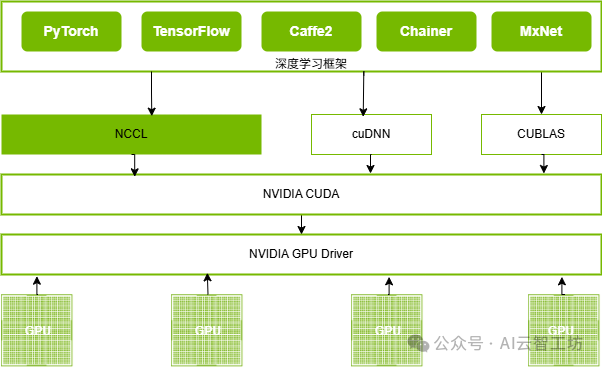

```table-of-contents
```
# 介绍
NVIDIA 的 集合通信库（NCCL, NVIDIA Collective Communications Library） 是一个专为多GPU和分布式计算环境设计的高效通信库。它提供了一系列优化的通信操作，能够在多GPU或节点间进行快速的数据交换。
它具有自主的拓扑意识，能自动获取设备（GPU、NIC、CPU、PCIe、NVLink）拓扑信息，并在设备间建立高速且最优的通信通道，实现数据的高效传输和同步，支持节点内PCIe、NVLink和节点间InfiniBand verbs、libfabric、RoCE、IP Socket等。
NCCL 库基于 NVIDIA 的硬件加速技术，特别是针对 GPU 之间的高速通信进行了优化，提供了一系列高度优化的集合通信原语：AllReduce、Broadcast、Reduce、AllGather、ReduceScatter等，以及点对点通信原语，以提高大规模并行计算的效率。

# 特性
## （1）自动拓扑检测

它具有自主的拓扑意识，能自动获取设备（GPU、NIC、CPU、PCIe、NVLink）拓扑信息，并在设备间建立高速且最优的通信通道，实现数据的高效传输和同步，支持节点内PCIe、NVLink和节点间InfiniBand verbs、libfabric、RoCE、IP Socket等。

## （2）多种集合通信原语

同时提供了一系列高度优化的集合通信原语：AllReduce、Broadcast、Reduce、AllGather、ReduceScatter等，以及点对点通信原语。

## （3）自主选择最优通道

NCCL支持节点内和跨节点的GPU通信通道，并会依据GPU架构和网络连接情况进行优化并选择最优的通道，通过NVLink和PCIe P2P、RDMA等技术实现GPU Direct通信，比如在支持NVLink的GPU间首选NVLink通道，如果节点间通过InfiniBnad连接情况下，首选IB RDMA的通道，这些都是NCCL自主探测和选择，而无需人工介入。

## （4）简化编程

NCCL提供简单易用的API，且严格遵循MPI（消息传递接口）定义的主流，NCCL极大简化并消除了开发者为特定机器或者GPU架构而优化应用程序的必要，即应用开发与GPU架构解耦。

## （5）已被多种深度学习框架集成

主流的深度学习框架：Caffe2、Chainer、MxNet、PyTorch 和 TensorFlow，都已集成NCCL，以在多GPU、多节点的系统下加快深度学习训练速度。




# 应用场景
常见应用场景
**深度学习训练**：
在分布式训练中，不同的GPU需要共享参数和梯度。NCCL 提供了多种集合通信操作来协助模型参数同步，减少训练时间。

**大规模数据并行计算**：
当训练模型需要使用多个 GPU 时，NCCL 可以用来实现高效的数据分发、同步和合并。

**分布式计算框架**：
NCCL 作为深度学习框架（如 PyTorch、TensorFlow）中的重要组件，提供了底层的通信支持，使得分布式训练更加高效。

**高性能计算（HPC）**：
在需要大规模并行计算的科学模拟、图像处理等领域，NCCL 也能提供加速的集合通信操作。


# 参考
```bash
# NCCL概述和NCCL-Test分析
https://mp.weixin.qq.com/s/3lrLSYe7JhalTcXjpFQ0dA

# NCCL官方文档
https://docs.nvidia.com/deeplearning/nccl/user-guide/docs/nccl1.html

https://my.oschina.net/u/1459307/blog/1650028
```