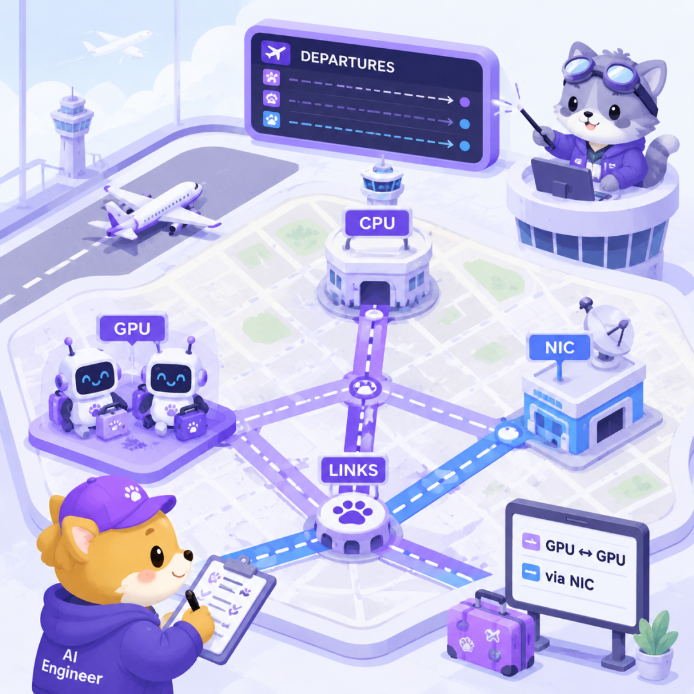
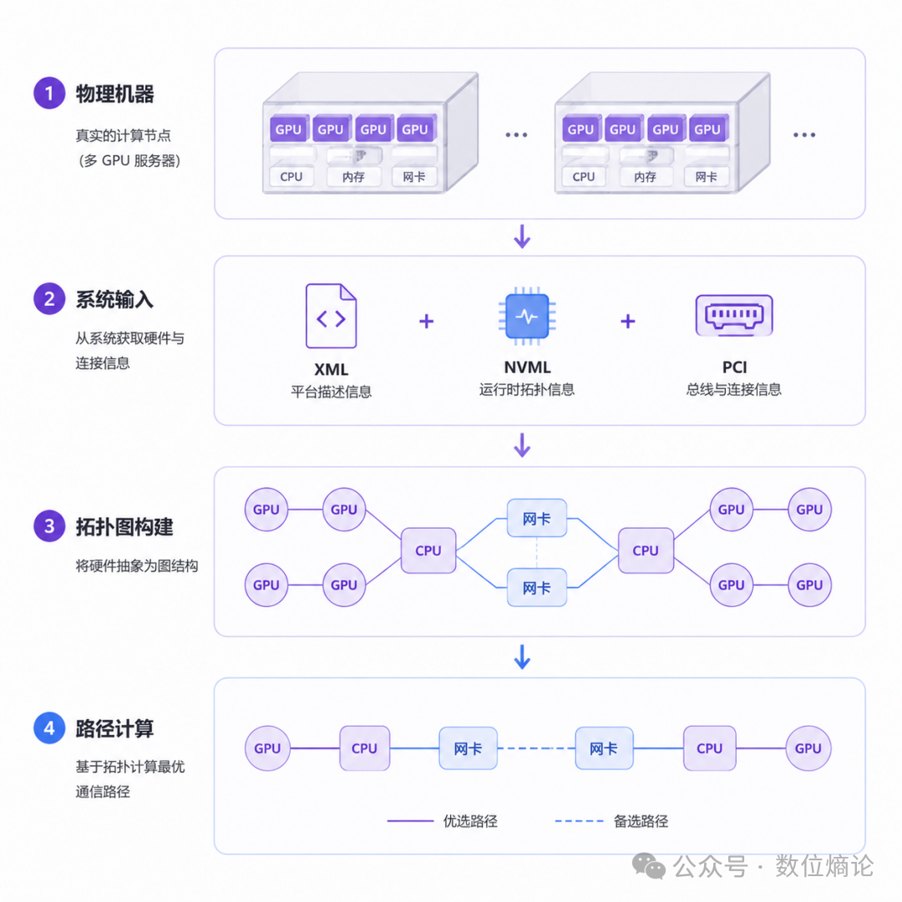

```table-of-contents
```
# 概述
一台 8 GPU 机器跑 collective communication，工程师常先看硬件：几张 GPU、几条 NVLink、几个 NIC。NCCL 更关心另一件事：这些设备怎样连在一起。

NCCL 是 NVIDIA Collective Communications Library，用来做多 GPU 集体通信。topology 指设备和链路组成的连接关系。

它先把机器画成可搜索地图，再决定数据该走哪条路。

# 硬件清单
硬件清单回答“有什么”，topology 回答“从这里到那里怎么走”。GPU、CPU、PCI、NVLink、NIC 单独列出来，只是零件表。

NCCL 需要知道 GPU 到 GPU、GPU 到 NIC 中间经过哪些 PCI 层级、链路类型和路径代价。



**设备节点不等于通信路径**。NVML 是 NVIDIA Management Library，可提供 GPU 设备相关信息；PCI 是主机侧设备互连层级；XML 是可读写的结构化描述格式。

它们都能提供输入，但输入本身还不是 NCCL 后面搜索 ring、tree 等通信结构时使用的图。

NCCL 不能只说“8 张 GPU 都在”。它要分清哪些 GPU 在同一 PCI switch 后面，哪些跨 CPU socket，哪些需要通过 NIC 出机器。

# XML、NVML 和 PCI 信息如何进入 NCCL 视野

NCCL 获取 topology 的入口可以来自自动探测，也可以来自 XML 文件。自动探测会把 NVML、PCI 等系统信息组织起来。

XML 则像一份外部提供的机器地图。两者的共同目标，是进入 NCCL 内部的 system tree 和 topology graph。

官方源码里，XML 入口会按 `system` 根节点加载拓扑树。这个片段说明：XML 文件会被解析成 NCCL 后续能接住的系统结构。

```c
ncclResult_t ncclTopoGetXmlFromFile(constchar* xmlTopoFile, structncclXml* xml, int warn) {
  FILE* file = fopen(xmlTopoFile, "r");
  ...
  structxmlHandler handlers[] = { { "system", ncclTopoXmlLoadSystem } };
  xml->maxIndex = 0;
  NCCLCHECK(xmlLoadSub(file, xml, NULL, handlers, 1));
}
```

这一步改变了数据状态：原先分散在 XML、NVML、PCI 层级里的信息，被归并到 NCCL 能遍历的结构里。

XML 提供“写好的地图”，NVML 和 PCI 提供“现场测绘材料”。最终它们都要变成可计算的 topology。

# 节点和边如何变成可计算的路径
有了节点和边，NCCL 还不能直接开跑。GPU0 到 GPU3 之间可能有多跳路径，GPU 到 NIC 也可能经过不同 PCI 分支。

路径计算要把“相邻连接”扩展成“任意关键设备之间怎么到达”。后续 P2P、SHM、NET 选择才有基础。



源码里的路径计算入口先清掉旧路径，再分别从 GPU 和 NET 节点出发设置路径。
NET 可以理解为网络通信设备抽象，常对应跨机器通信会用到的 NIC。
```c
ncclResult_t ncclTopoComputePaths(structncclTopoSystem* system, structncclComm* comm) {
  // Precompute paths between GPUs/NICs.
  ncclTopoRemovePaths(system);
  ...
  for (int g=0; g<system->nodes[GPU].count; g++) {
    NCCLCHECK(ncclTopoSetPaths(system->nodes[GPU].nodes+g, system));
  }
  for (int n=0; n<system->nodes[NET].count; n++) {
    NCCLCHECK(ncclTopoSetPaths(system->nodes[NET].nodes+n, system));
  }
}
```
topology 路径算完后，NCCL 才能知道本机内 GPU 之间适合怎样互通，跨机器时哪些 GPU 更接近 NIC。

# QA
## 为什么有链路不等于一定会选这条链路
ring 要考虑每一步谁发给谁，tree 要考虑上行和下行，跨机器还要把 NET 路径纳入同一张图。

**局部最短不一定带来全局合适**。一条 GPU-GPU 链路存在，只说明它可以成为候选边。

它是否进入 ring 或 tree，还取决于路径类型、距离、带宽等级、跨 NIC 关系、通信模式，以及 communicator 里所有 rank 的排列。

随后，数据通过更靠近 NIC 的路径跨机器交换，最后在目标 rank 上形成 reduce(A) 这类结果。

NCCL 的 topology graph 决定“哪些通道进入候选集”。后续算法搜索再决定“哪些候选被排进执行结构”。

补足深度时仍要留在当前机制内部：先说明这个机制管理哪类状态，再说明这些状态怎样影响下一段数据流、连接关系或执行节奏。

# 参考
```bash
# NCCL 原理漫游｜它如何把机器看成一张拓扑图
https://mp.weixin.qq.com/s/aV-zbx3y9CCee0zVoBXndw
```