```table-of-contents
```
# 并行计算
在高性能计算领域（HPC）大量依赖并行分布式并行计算：数值模拟、天气预报、CFD、分子动力学、地震勘探。并行计算的核心，是把一个大问题拆成许多子任务，分配到不同核、不同节点上并行执行，然后在合适的时机：把各自的局部计算结果汇总起来（比如全局求和、最大值）。
**分治法：（拆分、解决、合并）**

这样把任务分发再把分布式计算的结果进行交换汇聚和再计算等，就是典型的集合通信（Collective Communication）。

# 并行方式
大家都知道，AI计算（尤其是模型训练和推理），主要以并行计算为主。

AI计算中涉及到的很多具体算法（例如矩阵相乘、卷积、循环层、梯度运算等），都需要基于成千上万的GPU，以并行任务的方式去完成。这样才能有效缩短计算时间。

AI训练使用的并行，总的来说，分为数据并行和模型并行两类。PP（流水线并行）、TP（张量并行）和EP（专家并行），都属于模型并行。

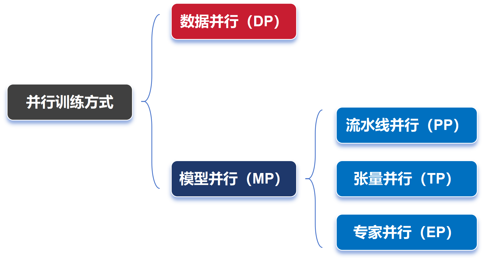

## 背景知识
### 神经网络的训练过程
简单来说，包括以下主要步骤：
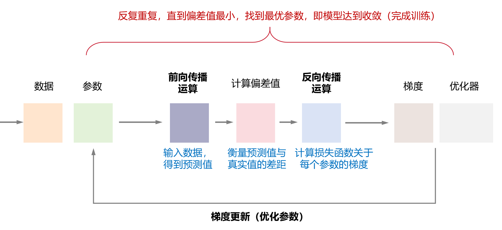

1、前向传播：输入一批训练数据，计算得到预测结果。
2、计算损失：通过损失函数比较预测结果与真实标签的差距。
3、反向传播：将损失值反向传播，计算网络中每个参数的梯度。
4、梯度更新：优化器使用这些梯度来更新所有的权重和偏置（更新参数）。
以上过程循环往复，直到模型的性能达到令人满意的水平。训练就完成了。


## 数据并行 (Data Parallelism：DP)
数据并行（DP）是大模型训练中最为常见的一种并行方式（当然，也适用于推理过程）。数据并行（DP）是解决数据并发量大时使用的策略。
它的核心思想很简单，就是每个GPU都拥有完整的模型副本，然后，将训练数据划分成多个小批次（mini-batch），每个批次分配给不同的GPU进行处理。

数据并行的情况下，大模型训练的过程是这样的：
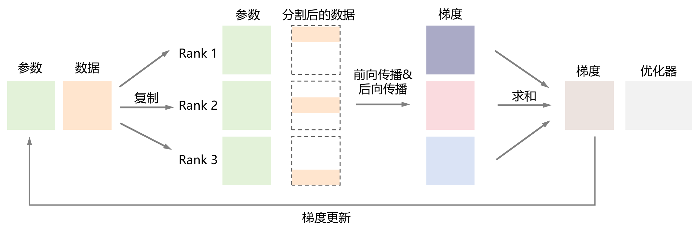

1、对数据进行均匀切割，发给不同的、并行工作的GPU（Worker）；
2、各GPU都拥有一样的模型以及模型参数，它们各自独立进行前向传播、反向传播，计算得到各自的梯度；
3、各GPU通过卡间通信，以All-Reduce的通信方式，将梯度推给一个类似管理者的GPU（Server）；
4、Server GPU对所有梯度进行求和或者平均，得到全局梯度；
5、Server GPU将全局梯度回传（broadcast广播）到每个Worker GPU，进行参数更新（更新本地模型权重）。更新后，所有worker GPU模型参数保持一致。
然后，再继续重复这样的过程，直至完成所有的训练。

再来一张图，帮助理解：
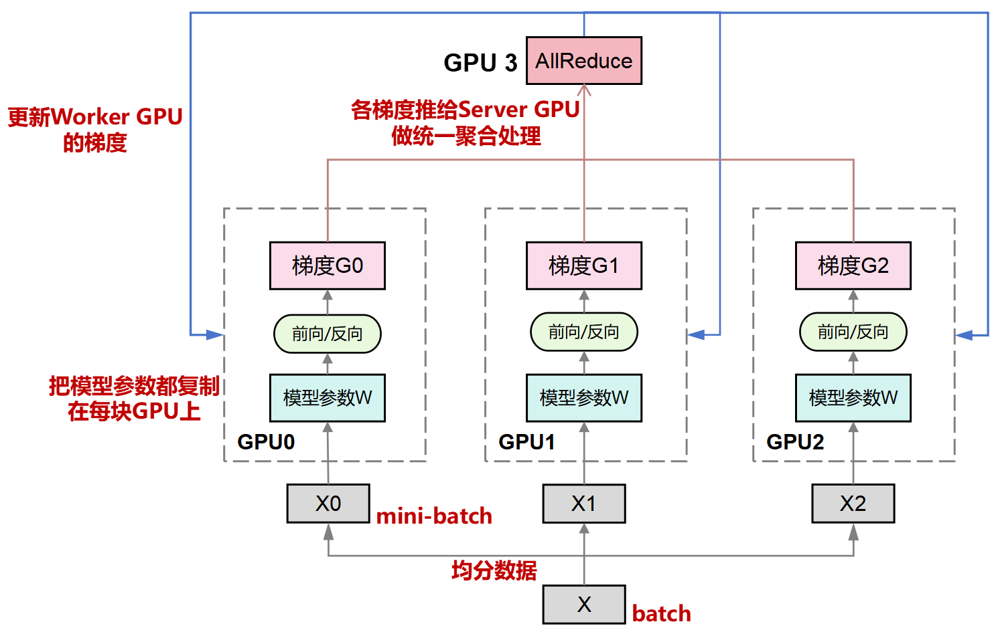

### 优缺点

数据并行的优点，在于实现过程比较简单，能够显著加速大规模数据的训练过程，尤其适用于数据量远大于模型参数的场景。
数据并行的缺点，在于显存的限制。因为每个GPU上都有完整的模型副本，而当模型的规模和参数越大，所需要的显存就越大，很可能超过单个GPU的显存大小。

数据并行的通信开销也比较大。不同GPU之间需要频繁通信，以同步模型参数或梯度。而且，模型参数规模越大，GPU数量越多，这个通信开销就越大。例如，对于千亿参数模型，单次梯度同步需传输约2TB数据（FP16精度下）。


### 零冗余优化器(ZeRO)
这里要插播介绍一个概念——`ZeRO`（`Zero Redundancy Optimizer`，零冗余优化器）。
在数据并行策略中，每个GPU的内存都保存一个完整的模型副本，很占内存空间。那么，能否每个GPU只存放模型副本的一部分呢？
没错，这就是`ZeRo`——通过对模型副本中的优化器状态、梯度和参数进行切分，来实现减少对内存的占用。

`ZeRO`有3个阶段，分别是：
```bash
ZeRO-1：对优化器状态进行划分。
ZeRO-2：对优化器状态和梯度进行划分
ZeRO-3：对优化器状态、梯度和参数进行划分。（最节省显存）
```

通过下面的图和表，可以看得更明白些：
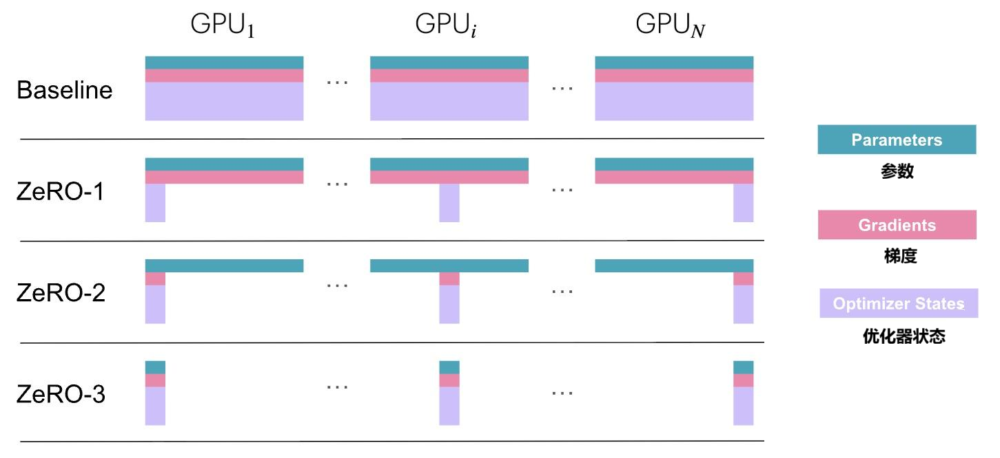

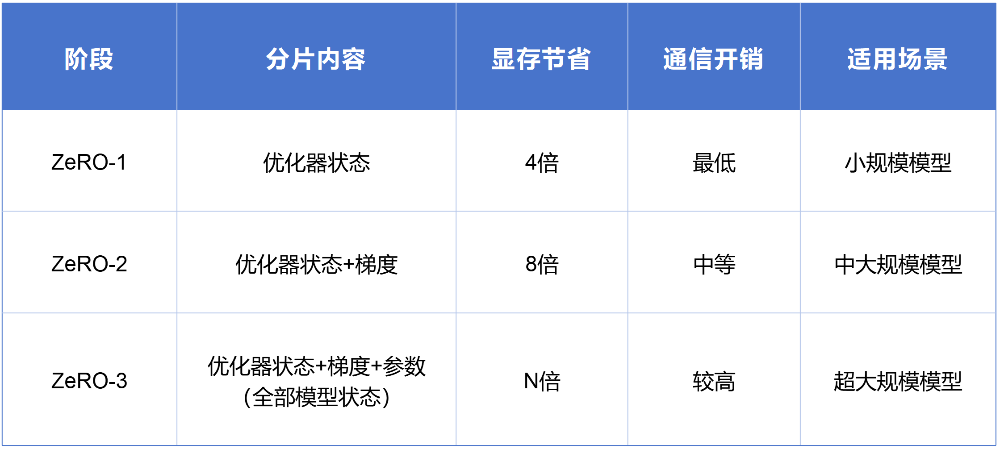

根据实测数据显示，ZeRO-3在1024块GPU上训练万亿参数模型时，显存占用从7.5TB降至7.3GB/卡。

### 分布式数据并行（DDP）
值得一提的是，DP还有一个DDP（分布式数据并行）。传统DP一般用于单机多卡场景。而DDP能多机也能单机。这依赖于Ring-AllReduce，它由百度最先提出，可以有效解决数据并行中通信负载不均（Server存在瓶颈）的问题。

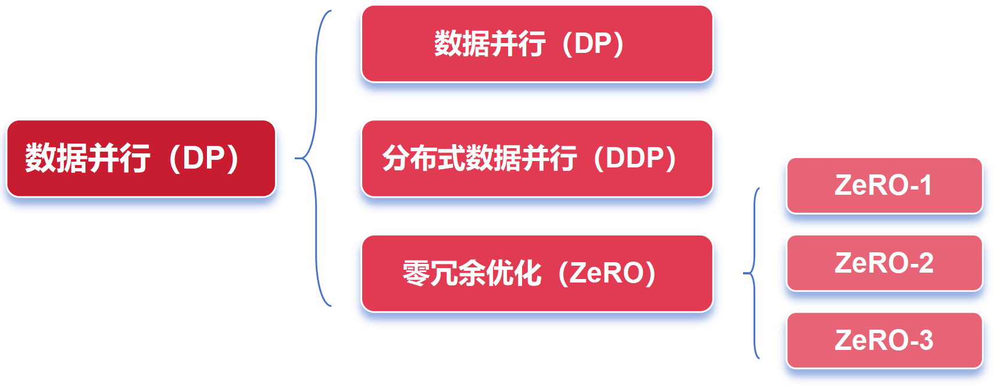


## 模型并行 (Model Parallelism：MP)

刚才**数据并行，是把数据分为好几个部分**。**模型并行，很显然，就是把模型分为好几个部分。不同的GPU，运行不同的部分**。
（注意：业界对模型并行的定义有点混乱。也有的资料会将张量并行等同于模型并行。）

### 流水线并行(Pipeline Parallelism： PP)
流水线并行，是**将模型的不同层（单层，或连续的多层）分配到不同的GPU上**，按顺序处理数据，实现流水线式的并行计算。

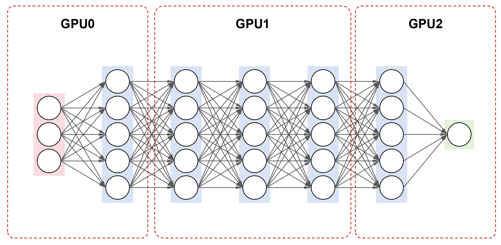

例如，对于一个包含7层的神经网络，将1~2层放在第一个GPU上，3~5层放在第二个GPU上，6~7层放在第三个GPU上。训练时，数据按照顺序，在不同的GPU上进行处理。

乍一看，流水并行有点像串行。每个GPU需要等待前一个GPU的计算结果，可能会导致大量的GPU资源浪费。

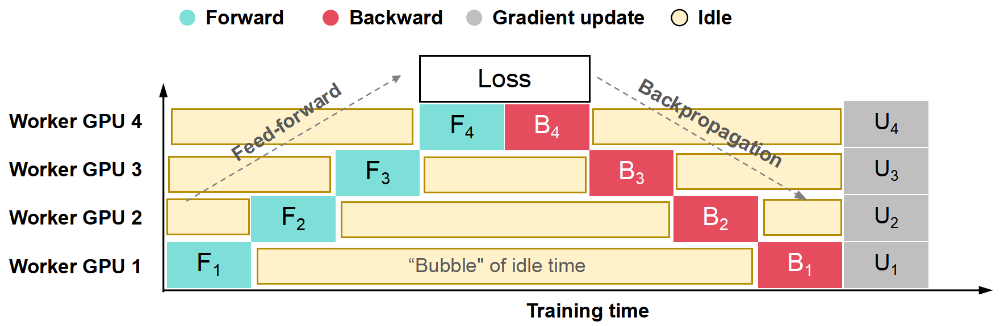

上面这个图中，黄色部分就是Bubble （气泡）时间。气泡越多，代表GPU处于等待状态（空闲状态）越长，资源浪费越严重。

为了解决上述问题，可以将mini-batch的数据进一步切分成micro-batch数据。当GPU 0处理完一个micro-batch数据后，紧接着开始处理下一个micro-batch数据，以此来减少GPU的空闲时间。如下图（b）所示：

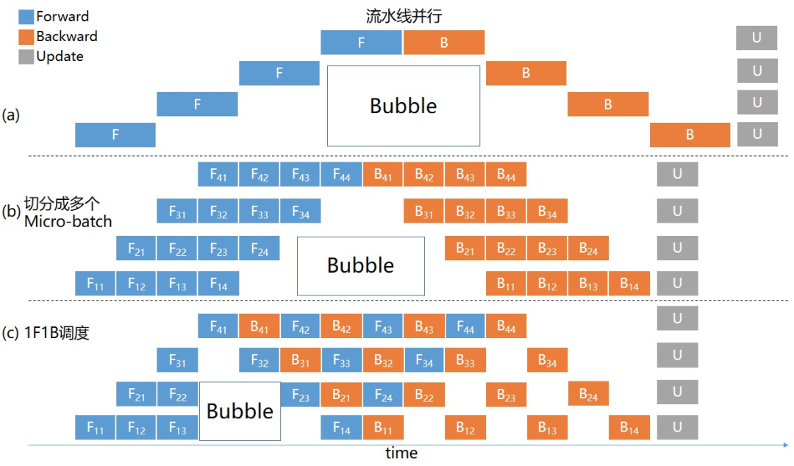

还有，在一个micro-batch完成前向计算后，提前调度，完成相应的反向计算，这样就能释放部分显存，用以接纳新的数据，提升整体训练性能。如上图（c）所示。

这些方法，都能够显著减少流水线并行的Bubble时间。

对于**流水线并行，需要对任务调度和数据传输进行精确管理，否则可能导致流水线阻塞，以及产生更多的Bubble时间**。

### 张量并行(Tensor Parallelism: TP)

模型并行的另外一种，是张量并行。
如果说流水线并行是将一个模型按层「垂直」分割，那么，张量并行则是在一个层内「横向」分割某些操作。
具体来说，张量并行是将模型的张量（如权重矩阵）按维度切分到不同的GPU上运行的并行方式。
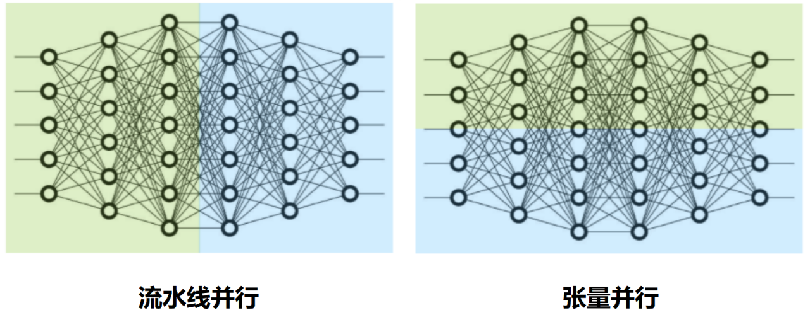

Tensor Parallelism (TP)张量并行，**将模型的每一层分割到不同GPU上执行**，用户请求（输入数据）会在GPU间流转，每个GPU计算的部分结果最终重新组合为完整输出。TP的计算理论基础是矩阵的分块运算，该运算不会改变最终计算结果。
TP在LLM推理中应用得比较广泛，其主要作用是降低单卡显存消耗以及计算量。

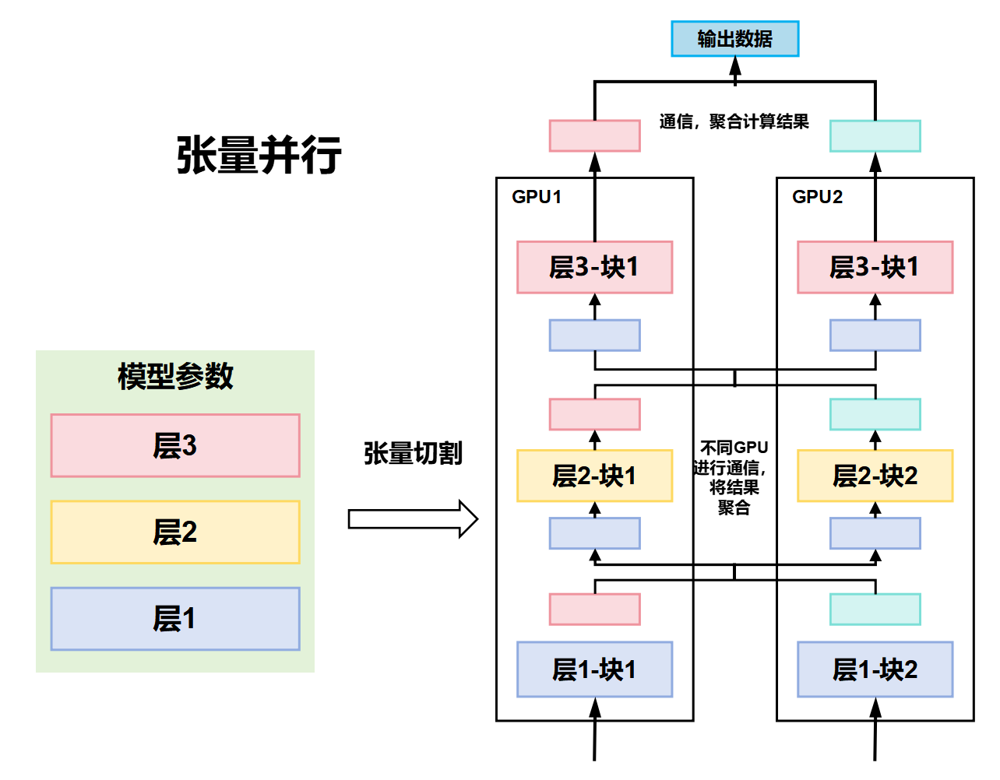

#### 什么是张量
张量（Tensor）是数学和物理中的一个基本概念。
在深度学习中，**张量**通常指的是一种高维的数据结构，用于表示模型中的数据、权重等。具体来说，张量是一个由数值组成的多维数组，它可以有多个维度（轴）：
```bash
标量（Scalar）：零维张量（0D Tensor）。一个数，例如，数字 5 或 -2.3。
向量（Vector）：一维张量（1D Tensor）。一维数组，例如，[1, 2, 3] 是一个包含三个元素的向量。
矩阵（Matrix）：二维张量（2D Tensor）。二维数组，例如，[[1, 2], [3, 4]] 是一个2×2的矩阵。
高阶张量：三维或更多维度的张量。三维、四维甚至更多维度的数组。例如，一个立方体可以表示为三维张量。例如，RGB图像可以看作是一个三维张量（宽、高、颜色通道）。
```

张量可以表示：
- 输入数据（如图像是一个 4D 张量：批次 × 高 × 宽 × 通道）。
- 模型参数（如权重矩阵）。
- 中间计算结果（如激活值）。

#### 为什么存在张量并行
当模型非常大，以至于单个GPU无法容纳时（比如：模型的参数的权重矩阵很大），张量并行通过将一个大张量（如权重矩阵）按维度切分到多个GPU上来实现计算。

因此，**张量并行就是把一个大张量按某个维度切分到多个 GPU 上**。这样可以突破单 GPU 的显存限制，并提升计算速度。
例如，一个巨大的全连接层权重矩阵可以按列或按行拆分。每个 GPU 只负责一部分计算，最后再把结果拼接或聚合。

**想象一个巨大的 Excel 表格（矩阵），如果一台电脑处理不了，就把表格按列或按行分割，分给多台电脑分别计算，再把结果合并。这个表格就是张量，而分割计算就是张量并行**。

#### 张量切分方式
张量切分方式分为按行进行切分和按列进行切分，分别对应行并行（Row Parallelism）（权重矩阵按行分割）与列并行（Column Parallelism）（权重矩阵按列分割）。

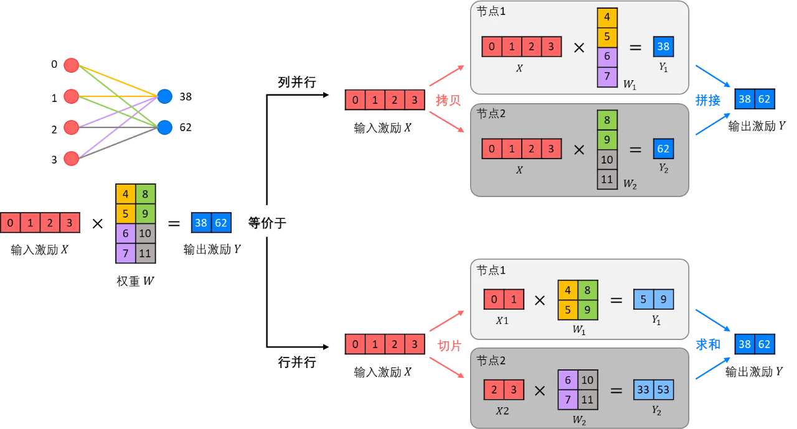

每个节点处理切分后的子张量。最后，通过集合通信操作（如All-Gather或All-Reduce）来合并结果。

假设我们有一个大型的神经网络模型，它的权重矩阵 `W` 大小为 `1000 x 1000`（一个二维张量）。我们希望将这个矩阵分布在两个GPU上进行计算。我们可以将这个矩阵按行或列切分，具体切分方式取决于计算的需求。

- **按行切分**：将矩阵 `W` 分为两个子矩阵 `W1` 和 `W2`，其中 `W1` 包含前 500 行，`W2` 包含后 500 行。每个GPU负责处理一个子矩阵。    
    - GPU 1 处理 `W1`（前 500 行）
    - GPU 2 处理 `W2`（后 500 行）
        
- **按列切分**：将矩阵 `W` 分为两个子矩阵 `W1` 和 `W2`，其中 `W1` 包含前 500 列，`W2` 包含后 500 列。每个GPU负责处理一个子矩阵。
    - GPU 1 处理 `W1`（前 500 列）
    - GPU 2 处理 `W2`（后 500 列）

#### 优缺点
张量并行的优点，是适合单个张量过大的情况，可以显著减少单个节点的内存占用。
张量并行的缺点，是当切分维度较多的时候，通信开销比较大。而且，张量并行的实现过程较为复杂，需要仔细设计切分方式和通信策略。

#### 对比
放一张数据并行、流水线并行、张量并行的简单对比：

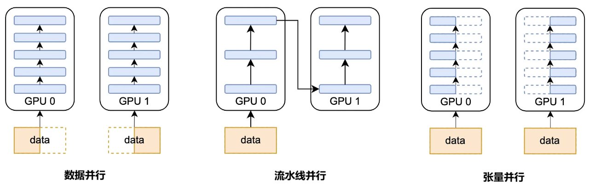


### 序列并行(Seqeunce Parallelism: SP)
### 专家并行(Expert Parallelism: EP)


# 通信模式
点对点大家一看就懂，就是两个点之间进行通信。一个是Sender，一个是Receiver。
什么是集合通信呢？是指一组（多个）节点内进行通信。在我们传统通信里，就是点到多点，多点到多点，涉及到组网（网状、星状、环状、mesh等）那种。

## 点对点通信（Point to point communication，P2P）
## 集合通信（Collective communication，CC）

# 单轨(single-rail)和多轨(multi-rail)
GPU 服务器接入分为多轨和单轨两种方式。
图3-1 为多轨接入方式，其 GPU 服务器上的 8 张网卡依次接入8 台Leaf 交换机，该方式集群通信效率高，大部分流量经一级 Leaf 传输或者先走本地GPU服务器机内代理再经一级 Leaf 传输。

图 3-2 为单轨接入方式，1 台GPU服务器上的网卡全部接入同一台 Leaf 交换机，该方式集群通信效率偏低，但在机房实施布线中有较大优势。
此外，若Leaf 交换机发生故障，多轨方式所影响的 GPU 服务器数量将多于单轨方式。


## 单轨(single-rail)

## 多轨(multi-rail)


## 分层
### Ring 分层 (Hierarchical Rings)
```bash
单 Rail Ring（4 GPU）:
GPU0 → GPU1 → GPU2 → GPU3 → GPU0

多 Rail Ring（每个连接用 2 个 Rail）:
GPU0 ─Rail0─▶ GPU1
     ─Rail1─▶
GPU1 ─Rail0─▶ GPU2
     ─Rail1─▶
GPU2 ─Rail0─▶ GPU3
     ─Rail1─▶
GPU3 ─Rail0─▶ GPU0
     ─Rail1─▶

带宽翻倍！
```
### 对轨和分层对比

### 多轨和bond

传统网卡单上联的架构下，无论光纤或交换机异常，都会导致训练任务中断。交换机升级期间，业务也需要提前迁移。这对用户体验、系统稳定性以及网络运维都带来了很多问题。


在双上联架构下，服务器上所有网卡的两个端口分别上联至不同交换机，并将两个端口共同组成一个bond端口提供服务。这样在一个上联链路或者对应接入层交换机出现故障时，流量可以切换至另一个端口，从而保证训练任务不中断。双上联架构设计避免了网卡单上联接入交换机带来的单点故障风险，极大提高了整体系统互联的鲁棒性。

## Rail-local


## 小结
Rail 本质就是**一条独立的端到端的 RDMA 网络通路**。

# 参考
```bash

```