```table-of-contents
```
# 概述

NCCL还定义了一些计算节点之间数据交换的基本操作模式，并将其命名为——“通信原语（也有写作“通信元语”）。
这些通信原语包括：Broadcast、Scatter、Gather、All-Gather、Reduce、All-Reduce、Reduce-Scatter、All-to-All等。
这些==通信原语是构建复杂通信行为的“原子操作”==。现在所有复杂的AI算力集群，内部通信都是基于这些通信原语。它们极大地提升了并行计算的效率和便利性。

AI大模型训练推理任务，是由海量的GPU共同完成的。而这些GPU之间的通信，就是基于下面这些通信原语模型。
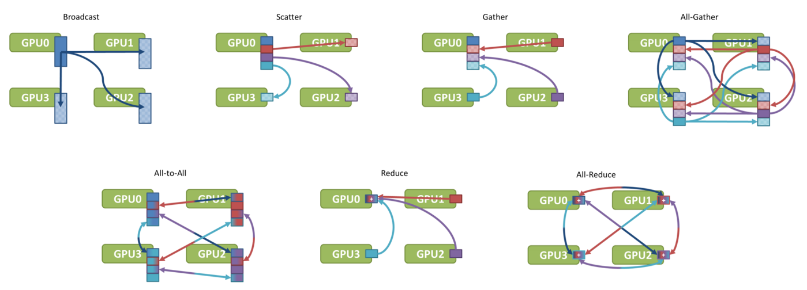

分布式训练中最常用的集合通信操作：

|操作|功能|训练中的应用|
|---|---|---|
|AllReduce|所有节点数据求和，结果分发到所有节点|梯度同步（DDP）|
|AllGather|收集所有节点数据，合并后分发|参数收集（FSDP/ZeRO-3）|
|ReduceScatter|数据求和后按rank分片|梯度分片（ZeRO-2/3）|
|Broadcast|一个节点数据广播到所有节点|参数初始化|
|Reduce|所有节点数据求和，结果到一个节点|损失汇总|


# Broadcast（1对多的广播）

这个最简单。当主节点执行Broadcast操作时，数据会从主节点发送至其他所有节点。
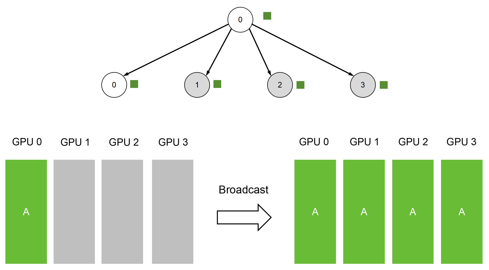

Broadcast是一个典型的分发、散播行为。在分布式机器学习中，Broadcast常用于网络参数的初始化，确保所有GPU的初始参数一致性。


# Scatter（1对多的发散）

Scatter也是一种分发、散播行为。它也是将主节点的数据发送至其他所有节点。只不过，Broadcast发送的是完整数据，而Scatter是将数据进行切割后，再分发，就像分生日蛋糕。


## Scatter 和 Broadcast

分散Scatter与广播Broadcast虽同属一对多通信原语，但存在本质区别。分散与广播的核心差异在于：

- 广播Broadcast：向所有节点发送**相同的完整数据**。
    
- 分散Scatter：将数据**拆分后分别发送**给不同节点。

# Gather（多对1的收集）

Gather，是将多个sender（发送节点）上的数据收集到单个节点上，可以理解为反向的Scatter。


# All-Gather/AllGather（多对多的收集）

Gather是多个到一个，All-Gather是多个到多个。  

All-Gather是将多个sender（发送节点）上的数据收集到多个节点上。它相当于多个Gather操作。或者说，是一个Gather操作之后，跟着一个Broadcast操作。


# Reduce（多对1的规约）

Reduce的英文意思是“减少、降低”。在集合通信里，它表示“规约”运算，是一系列简单运算操作（包括：SUM、MIN、MAX、PROD、LOR等）的统称。
经常用Excel表格的童鞋，对这些简单运算应该不陌生。例如SUM，就是求和。MIN，就是找出最小值。
其实说白了，Reduce就是：**输入多个数，执行操作后，得到更少的数（例如1个数）**。

下面这个，就是以ReduceSum（求和规约）为例：
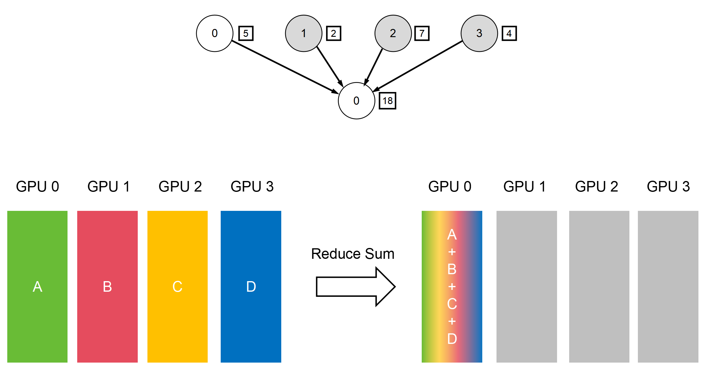

## 常见的规约Reduce操作包括：

- 求和（SUM）
- 求积（PROD）
- 最大值/最小值（MAX/MIN）
- 逻辑与/或（LAND/LOR）
- 按位与/或/异或（BAND/BOR/BXOR）
- 最大值位置/最小值位置（MAXLOC/MINLOC）

注：==这些规约Reduce操作通常需要GPU或加速卡硬件支持对应的算子（operator）才能实现高性能==。


## 规约Reduce的典型应用场景
规约Reduce的典型应用场景：

- 全规约AllReduce中的规约Reduce环节；
- 规约分散ReduceScatter组合通信中的规约Reduce操作；
- 分布式训练参数服务器架构中，Master节点先将模型参数广播Broadcast至所有Worker节点，各Worker完成计算后通过规约Reduce操作将结果聚合回Master节点。


# Reduce-Scatter/ReduceScatter（规约分散：多对多通信）

`Reduce-Scatter`稍微有点复杂。它是先归约（Reduce），再分散（Scatter）。
Reduce-scatter等价于节点个数次的reduce规约运算操作，再后面执行节点个数的scatter次操作

具体来说：  
首先，在所有参与计算的GPU节点上，对位于相同位置或索引的数据块执行指定的规约运算（例如求和SUM）。  
接着，将规约后的完整结果按维度切分，并将不同的数据块分发给各个节点。**最终，每个节点只得到整个规约结果的一部分，而不是全部**。
简单来说，它先对所有数据进行“汇总计算”，然后再将计算好的结果“分散下发”。
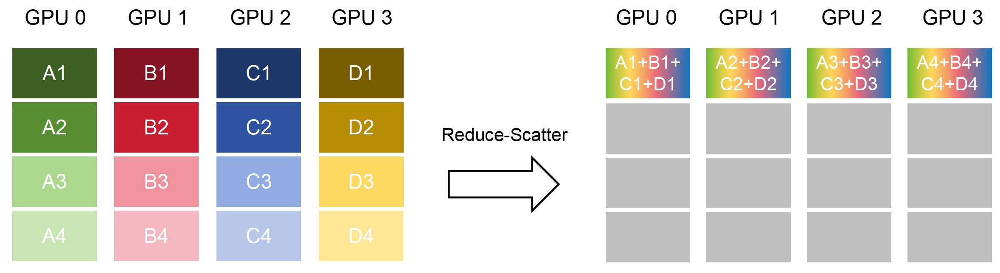


# All-Reduce/AllReduce（多对多的规约）

在大模型训练中，经常会用到数据并行（DP）这个并行方式。里面就有AIl Reduce这个关键操作。  

把一批训练数据切成若干份，分给多块 GPU，每块 GPU 独立计算， 算完之后，每块 GPU 手里都有一份"我觉得模型应该怎么调整"的意见—— 这份意见在技术上叫**梯度**。

但问题是，每块 GPU 只看到了一部分数据，它的"意见"是片面的。
必须把所有 GPU 的梯度**加在一起，求平均，再发回给每一块 GPU**， 大家拿到同一份"综合意见"，才能一起更新模型参数，进入下一轮训练。
这个"所有GPU的梯度 → 求和/求平均 → 结果发回给每一块GPU"的操作，就叫 **AllReduce**。

> **用一句话解释：**  
> AllReduce 就是让所有 GPU 把各自的计算结果汇总成一个共同结论， 再人手一份发回去，然后才能继续干活。

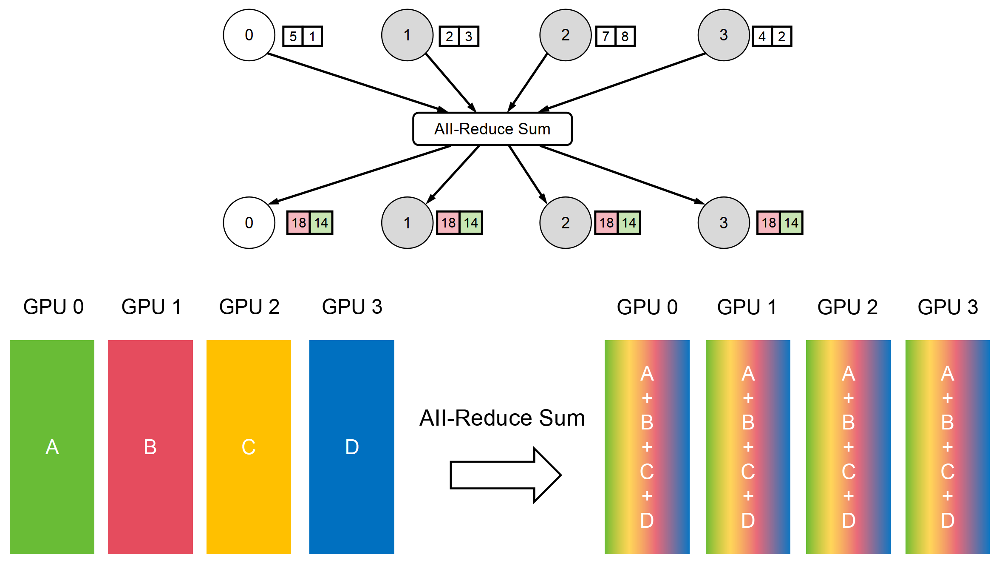

在大模型训练中，Server GPU节点收集的数据，就是各个Worker GPU节点计算得出的“梯度”。求和之后再发回的过程，是“更新梯度”。

## 实现算法
AllReduce = Reduce + Broadcast 或 ReduceScatter + AllGather。

实现AllReduce有多种算法，它们在不同场景下各有优劣。主要的算法包括：
1. **Ring-AllReduce** - 环形算法
2. **Tree-AllReduce** - 树形算法
3. **Recursive Halving-Doubling** - 递归减半加倍算法
4. **Butterfly AllReduce** - 蝶形算法


## Ring AllReduce
Ring-AllReduce将所有GPU组织成一个逻辑环，每个GPU只与相邻的两个GPU通信。
```bash
# 拓扑结构（4个GPU）  
GPU0 <-> GPU1 <-> GPU2 <-> GPU3  
 ^                           |  
 +---------------------------+  
   
# 每个GPU只需要：  
# - 向下一个GPU发送数据  
# - 从上一个GPU接收数据
```

### 两个阶段

AllReduce = ReduceScatter + AllGather

英伟达的NCCL通信库采用了这种算法，该算法每次跟相邻的两个节点进行通信，每次通信数据总量是`1/N`，过程如下图。


该算法的优点是实现简单，能充分利用每个节点的上行和下行带宽；
缺点是通信延迟随着节点数线性增加，特别是对于小包延迟增加比较明显。


Ring逻辑拓扑与物理拓扑，GPU0123是全连接的，但是两边不是，比如1只和5连，2只和6连，那么ring拓扑可能是右边的情况。如下所示：


#### 阶段1：Scatter-Reduce（环形归约）
```bash
# 目标：将聚合任务分散到各个GPU  
# 方法：每个GPU负责聚合一个数据块  
  
# 初始状态（4个GPU，数据分成4块）  
GPU0: [A0, B0, C0, D0]  
GPU1: [A1, B1, C1, D1]  
GPU2: [A2, B2, C2, D2]  
GPU3: [A3, B3, C3, D3]  
  
# Round 1: 每个GPU发送最后一块，接收并累加  
GPU0发送D0→GPU1, 接收C3, 计算C0←C0+C3  
GPU1发送A1→GPU2, 接收D0, 计算D1←D1+D0  
GPU2发送B2→GPU3, 接收A1, 计算A2←A2+A1  
GPU3发送C3→GPU0, 接收B2, 计算B3←B3+B2  
  
结果:  
GPU0: [A0, B0, C0+C3, D0]  
GPU1: [A1, B1, C1, D1+D0]  
GPU2: [A2+A1, B2, C2, D2]  
GPU3: [A3, B3+B2, C3, D3]  
  
# Round 2: 继续环形传递  
GPU0: [A0, B0, C0+C3+C2, D0]  
GPU1: [A1, B1, C1, D1+D0+D3]  
GPU2: [A2+A1+A0, B2, C2, D2]  
GPU3: [A3, B3+B2+B1, C3, D3]  
  
# Round 3: 最后一轮Scatter-Reduce  
GPU0: [A0, B0+B3+B2+B1, C0+C3+C2, D0]        # B块完成  
GPU1: [A1, B1, C1+C0+C3+C2, D1+D0+D3]        # C块完成  
GPU2: [A2+A1+A0, B2, C2, D2+D1+D0+D3]        # D块完成  
GPU3: [A3+A2+A1+A0, B3+B2+B1, C3, D3]        # A块完成  
  
# 注意：每个GPU现在都有一个完全聚合的块！
```

#### 阶段2：AllGather（环形收集）

```bash
# 目标：让每个GPU都拥有所有的聚合结果  
# 方法：继续环形传递已聚合的块  
  
# Round 1: 传递已聚合的块  
GPU0发送(B0+B1+B2+B3)→GPU1, 接收(A0+A1+A2+A3)  
# ...  
  
# 经过P-1轮后，每个GPU都有完整的聚合结果  
最终所有GPU: [A0+A1+A2+A3, B0+B1+B2+B3, C0+C1+C2+C3, D0+D1+D2+D3]
```

### 分析
```bash
# 假设P个GPU，数据大小N  
  
# 通信复杂度  
每轮传输: N/P (一个块的大小)  
总轮数: 2(P-1) (Scatter-Reduce和AllGather各P-1轮)  
总通信量: 2(P-1) × N/P = 2N(1 - 1/P) ≈ 2N  
  
# 关键特性：通信量与GPU数量P无关！  
  
# 时间复杂度  
延迟: O(P) - 需要P-1轮  
带宽: O(N) - 总传输量约2N  
  
# 适用场景  
✓ GPU数量较多 (P > 8)  
✓ 数据量较大  
✓ 带宽是瓶颈  
✓ 点对点带宽高（如NVLink）
```

**适用拓扑**：Star、Tree等小规模集群；通信步骤：2×（N-1）Step

**优点**：实现简单，能充分利用节点上行和下行带宽；

**缺点**：通信延迟随着节点数**线性增加**（好理解），特别是对于小包延迟增加明显；Ring太大，Ring-AllReduce效率也会变得很低。


### 伪代码实现

```python
# 伪代码示意  
# N个GPU，数据分成N份  
  
defring_allreduce(data, world_size, rank):  
    """Ring AllReduce实现"""  
    chunks = chunk(data, world_size)  
      
    # Phase 1: Scatter-Reduce  
    for step inrange(world_size - 1):  
        send_idx = (rank - step) % world_size  
        recv_idx = (rank - step - 1) % world_size  
          
        # 发送chunk给下一个rank  
        send_chunk(chunks[send_idx], (rank + 1) % world_size)  
          
        # 接收chunk并累加  
        recv_chunk = receive((rank - 1) % world_size)  
        chunks[recv_idx] += recv_chunk  
      
    # Phase 2: AllGather  
    for step inrange(world_size - 1):  
        send_idx = (rank - step + 1) % world_size  
        recv_idx = (rank - step) % world_size  
          
        # 发送聚合后的chunk  
        send_chunk(chunks[send_idx], (rank + 1) % world_size)  
          
        # 接收chunk  
        chunks[recv_idx] = receive((rank - 1) % world_size)  
      
    return concat(chunks)  
  
# 通信量：2*(N-1)/N * data_size ≈ 2*data_size (当N较大时)
```

### 应用

我们选择Ring-AllReduce作为深入讲解的对象，原因如下：

1. **主流采用**：PyTorch、TensorFlow、Horovod等主流框架默认使用Ring
    
2. **可扩展性**：在大规模训练中表现最优
    
3. **通用性**：不需要特殊的拓扑结构或GPU数量要求
    
4. **教学价值**：Ring的两阶段设计最能体现分布式算法的设计思想

```bash
# 统计数据（基于开源项目）  
主流框架使用Ring的比例:  
- PyTorch DDP: ~90%  
- TensorFlow: ~85%  
- Horovod: ~95%  
- Megatron-LM: ~100%  
  
原因:  
- 深度学习模型的梯度通常很大(>100MB)  
- Ring在带宽受限时表现最好  
- 实现相对简单，调试容易
```

## Recursive Halving-Doubling AllReduce

另一种常见的AllReduce实现算法是Recursive Halving-Doubling，[阿里巴巴的通信库ACCL](https://link.zhihu.com/?target=https%3A//ieeexplore.ieee.org/document/9462480)采用了这种算法。

Recursive Halving-Doubling是一种更复杂但更高效的算法，它将GPU分组递归处理。
```bash
# 核心思想：每轮将GPU分成两组，组间交换并聚合  
  
# 特点：  
# - 每轮活跃的GPU数量减半（Halving）  
# - 然后数量加倍恢复（Doubling）  
# - 适合GPU数量是2的幂
```
该算法每次选择节点距离倍增的节点相互通信，每次通信量倍减（或倍增）.

### 两个阶段


逻辑拓扑与物理拓扑，如下：


也就是说，Reduce Scatter是由近及远，AllGather是由远及近。


假如每张卡上的数据量是P，那么第一步互相交换P/2的数据，第二步互相交换P/4，第三步`P/8`。。。以此类推，最后一步交换的是P/N。所以每个进程发送的数据总量是`2*（P/2+P/4+。。。+P/N）=2P（N-1）/N`，与ring是相同的。

####  阶段1：Recursive Halving（递归减半）
```bash
# Round 1: 8个GPU分成2组，每组4个  
# 组1: GPU0-3, 组2: GPU4-7  
# 组间两两配对交换并聚合  
  
GPU0 ↔ GPU4: 交换数据后半部分，聚合前半部分  
GPU1 ↔ GPU5: 交换数据后半部分，聚合前半部分  
GPU2 ↔ GPU6: 交换数据后半部分，聚合前半部分  
GPU3 ↔ GPU7: 交换数据后半部分，聚合前半部分  
  
# 结果：  
# GPU0-3 拥有前半部分的聚合结果  
# GPU4-7 拥有后半部分的聚合结果  
  
# Round 2: 4个GPU继续分组  
# 组1内: GPU0-1, 组2内: GPU2-3  
GPU0 ↔ GPU2: 交换并聚合前半部分的前半部分  
GPU1 ↔ GPU3: 同上  
# GPU4-7内部类似操作  
  
# Round 3: 继续递归直到每个GPU有完整聚合的一个块
```

#### 阶段2：Recursive Doubling（递归加倍）
```bash
# 反向过程：从1个块扩展到完整数据  
  
# Round 1: 相邻GPU交换  
GPU0 ↔ GPU1: 交换各自的聚合块  
GPU2 ↔ GPU3: 交换各自的聚合块  
# ...  
  
# Round 2: 距离加倍  
GPU0 ↔ GPU2: 交换  
GPU1 ↔ GPU3: 交换  
# ...  
  
# Round 3: 最终所有GPU拥有完整结果
```

### 分析
```bash
# 假设P个GPU（P=2^k），数据大小N  
  
# 通信复杂度  
总轮数: 2 × log_2(P)  
每轮传输量: N/2, N/4, N/8, ... (几何级数)  
总通信量: N × (1/2 + 1/4 + 1/8 + ...) × 2 ≈ 2N  
  
# 时间复杂度  
延迟: O(log P)  
带宽: O(N)  
  
# 特点  
✓ 通信量和Ring一样是O(N)  
✓ 延迟比Ring小，是O(log P)  
✓ 但需要GPU数量是2的幂  
✓ 实现复杂度较高  
  
# 适用场景  
✓ GPU数量恰好是2的幂  
✓ 需要低延迟  
✓ 对带宽和延迟都敏感
```

**适用拓扑**：Fat-Tree等；通信步骤：log N；

**优点**：通信步骤少，只需2×log N次通信。其中N为参与通信的Rank数。并且可以同时并发访问其他NPU。

**缺点**：固定并行算法（如TP=8，否则性能劣化严重），每一个步骤相互通信Rank均不相同，链接需要来回切换，带来额外开销。

### Recursive Halving-Doubling AllReduce 和 Ring AllReduce 对比


## Tree AllReduce

Tree-AllReduce将GPU组织成树形结构，利用树的层次性进行递归聚合和广播。

```bash
# 拓扑结构（8个GPU，二叉树）  
        GPU0 (root)  
       /    \  
    GPU1    GPU2  
    /  \    /  \  
  GPU3 GPU4 GPU5 GPU6  
  /  
GPU7  
  
# 特点：  
# - 有根节点  
# - 父节点与子节点通信  
# - 层次化的聚合和分发
```

### 两个阶段
#### 阶段1：Reduce（向上聚合）
```bash
# 从叶节点开始，向根节点聚合  
  
# 第1层：叶节点发送给父节点  
GPU7 → GPU3: data_7  
GPU4 → GPU1: data_4  
GPU5 → GPU2: data_5  
GPU6 → GPU2: data_6  
  
# 父节点计算：  
GPU3: data_3 + data_7  
GPU1: data_1 + data_4  
GPU2: data_2 + data_5 + data_6  
  
# 第2层：继续向上  
GPU3 → GPU1: (data_3 + data_7)  
GPU2 → GPU0: (data_2 + data_5 + data_6)  
  
# 父节点计算：  
GPU1: data_1 + data_4 + data_3 + data_7  
GPU0: data_0 + data_2 + data_5 + data_6  
  
# 第3层：到达根节点  
GPU1 → GPU0: (data_1 + data_4 + data_3 + data_7)  
  
# 根节点得到最终结果：  
GPU0: sum(data_0 to data_7)
```

#### 阶段2：Broadcast（向下广播）
```bash
# 从根节点开始，向叶节点广播结果  
  
# 第1层：根节点广播  
GPU0 → GPU1: final_result  
GPU0 → GPU2: final_result  
  
# 第2层：继续向下  
GPU1 → GPU3: final_result  
GPU1 → GPU4: final_result  
GPU2 → GPU5: final_result  
GPU2 → GPU6: final_result  
  
# 第3层：到达叶节点  
GPU3 → GPU7: final_result  
  
# 最终所有GPU都有相同的结果
```


### 分析
```bash
# 假设P个GPU，数据大小N，树的度为k（k叉树）  
  
# 通信复杂度  
树的高度: h = log_k(P)  
每层传输: N (完整数据)  
总通信量: 2N × log_k(P) (向上和向下)  
  
# 时间复杂度  
延迟: O(log P) - 树的高度  
带宽: O(N log P)  
  
# 对比Ring  
当P较小时: O(log P) < O(P) → Tree更快  
当P较大时: 2N log P > 2N → Tree通信量更大  
  
# 适用场景  
✓ GPU数量较少 (P < 8)  
✓ 延迟敏感  
✓ 数据量较小  
✓ 跨节点通信（网络拓扑是树形）
```


### Tree AllReduce 和 Ring AllReduce 对比

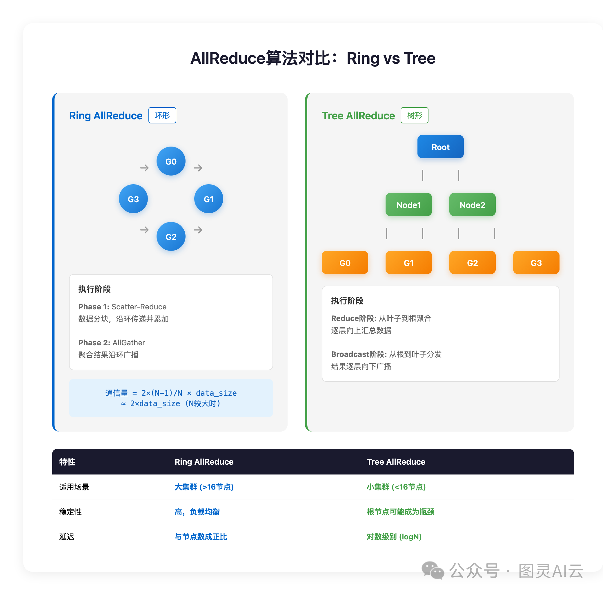


## 三种算法对比

### 综合对比表

|对比维度|Ring-AllReduce|Tree-AllReduce|Recursive Halving-Doubling|
|---|---|---|---|
|**通信量**|2N|2N log P|2N|
|**延迟**|O(P)|O(log P)|O(log P)|
|**拓扑要求**|环形连接|树形层次|任意（但最好是2的幂）|
|**带宽利用率**|100%|随P增加而降低|100%|
|**实现复杂度**|中等|简单|较高|
|**可扩展性**|优秀(>32 GPU)|一般(<16 GPU)|优秀(2的幂时)|
|**适用数据量**|大|小到中|中到大|


### 性能对比
假设：
```bash
- 8个GPU
- 每个GPU间带宽：10 GB/s
- 延迟：10 μs
- 数据量：1 GB
```

```bash
# Ring-AllReduce  
通信轮数 = 2 × (8-1) = 14轮  
每轮传输 = 1GB / 8 = 125MB  
传输时间 = 14 × (125MB / 10GB/s) = 175ms  
延迟时间 = 14 × 10μs = 0.14ms  
总时间 ≈ 175.14ms  
  
# Tree-AllReduce (二叉树)  
树高 = log_2(8) = 3  
通信轮数 = 2 × 3 = 6轮  
每轮传输 = 1GB  
传输时间 = 6 × (1GB / 10GB/s) = 600ms  
延迟时间 = 6 × 10μs = 0.06ms  
总时间 ≈ 600.06ms  
  
# Recursive Halving-Doubling  
通信轮数 = 2 × log_2(8) = 6轮  
每轮传输 ≈ 1GB/2^i (几何级数)  
总传输 ≈ 2GB  
传输时间 ≈ 200ms  
延迟时间 = 6 × 10μs = 0.06ms  
总时间 ≈ 200.06ms
```
**结论**：在这个场景下，Ring最快！

### 不同场景下的选择
```bash
# 场景1：单机多卡（NVLink连接）  
GPU数量: 8  
数据量: 大 (>100MB)  
带宽: 高 (300 GB/s NVLink)  
延迟: 低 (< 5μs)  
→ 推荐: Ring-AllReduce  
原因: 带宽是主要瓶颈，Ring能充分利用带宽  
  
# 场景2：多节点训练（以太网连接）  
GPU数量: 16 (分布在4个节点)  
数据量: 中 (10MB)  
带宽: 低 (10 Gb/s 网络)  
延迟: 高 (100μs)  
→ 推荐: Tree-AllReduce (按节点构建树)  
原因: 延迟是主要瓶颈，树能减少通信轮数  
  
# 场景3：超大规模训练  
GPU数量: 64 (恰好是2的幂)  
数据量: 超大 (>1GB)  
带宽: 中等  
延迟: 中等  
→ 推荐: Recursive Halving-Doubling  
原因: 兼顾低延迟和高带宽利用率  
  
# 场景4：异构集群  
GPU数量: 不规则 (如12个)  
拓扑: 复杂  
→ 推荐: Ring-AllReduce  
原因: 适应性最强，不需要特殊的拓扑结构
```

### 实际系统中的选择
```bash
# NCCL (NVIDIA Collective Communications Library)  
# 根据GPU数量和数据大小自动选择算法  
  
if num_gpus <= 8 and data_size < 1MB:  
    algorithm = "Tree"  # 延迟优先  
elif num_gpus > 32 and data_size > 100MB:  
    algorithm = "Ring"  # 带宽优先  
elif is_power_of_2(num_gpus) and data_size > 10MB:  
    algorithm = "Halving-Doubling"  # 平衡  
else:  
    algorithm = "Ring"  # 默认  
  
# PyTorch DDP  
# 主要使用Ring-AllReduce (通过NCCL)  
# 因为大多数深度学习场景：  
# - GPU数量: 4-64  
# - 梯度大小: 100MB-10GB  
# - 需要高带宽利用率
```


## 分层AllReduce（Hierarchical）

### 伪代码实现
```python
# 节点内使用Ring，节点间使用Tree  
defhierarchical_allreduce(data, local_size, num_nodes):  
    """分层AllReduce"""  
      
    # Step 1: 节点内Reduce  
    local_data = ring_reduce(data, local_size)  
      
    # Step 2: 节点间AllReduce（每个节点一个代表）  
    if is_local_leader():  
        global_data = tree_allreduce(local_data, num_nodes)  
      
    # Step 3: 节点内Broadcast  
    result = broadcast_within_node(global_data, local_size)  
      
    return result  
  
# 优势：充分利用节点内高速互联（NVLink）
```


# All-to-All/All2All（多对多的全互连）

AIl-to-AII也是AI领域出现频率很高的一个词组。它是全交换操作，可以让每个节点都获取其他节点的值。

在使用All-to-All时，每一个节点都会向任意一个节点发送消息，每一个节点也都会接收到任意一个节点的消息。每个节点的接收缓冲区和发送缓冲区都是一个分为若干个数据块的数组。

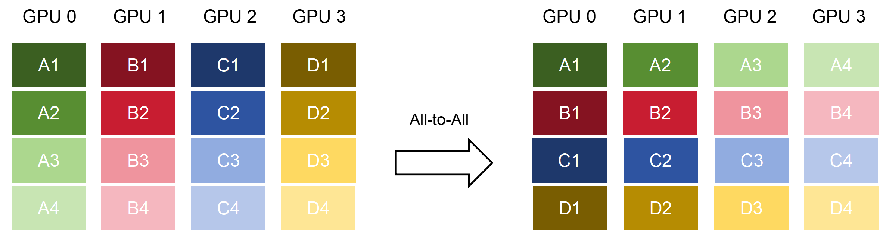

All-to-All的具体操作是：将节点i的发送缓冲区中的第j块数据发送给节点j。节点j将接收到的来自节点i的数据块，放在自身接收缓冲区的第i块位置。

上面这个图，大家如果学过工程数学的话，就会发现，它就是一个**矩阵倒置**。或者说，是Excel里的**行列倒转**。

All-to-All的核心目标是重分布。它不进行聚合运算，而是专注于在不同节点间重新分布数据块。All-to-All操作在大模型训练中的混合并行策略里至关重要。例如，当需要从数据并行组切换到模型并行组时，All-to-All可以高效地重组数据。

## All-to-All与All-Gather比较
All-to-All与All-Gather相比较，区别在于：All-Gather操作中，不同节点向某一节点收集到的数据是完全相同的。而在All-to-All中，不同的节点向某一节点收集到的数据是不同的。在每个节点的发送缓冲区中，为每个节点都单独准备了一块数据。

# Ring-based collective（基于环的集合）

最后还要提一个有趣的结构——环（Ring）。
Ring-base collective是将所有的通信节点通过首尾相连形成一个单向环，数据在环上依次传输。
传输方式有两种，一种是一次性传输全部，还有一种，是对数据进行切割，然后分别发送。

## Ring All-Reduce（环形全规约）
All-Reduce里有一种Ring All-Reduce（环形全规约）算法。它是通过组合Reduce-Scatter和All-Gather两个操作来实现的。
Ring All-Reduce算法分为两个阶段：
第一阶段，将N个worker分布在一个环上，并且把每个worker的数据分成N份。

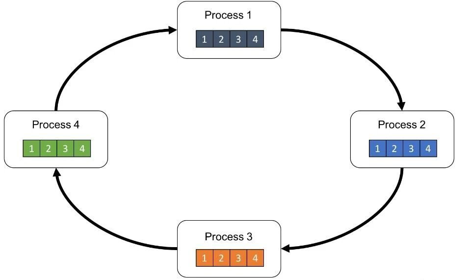

对于第k个worker，这个worker会把第k份数据发给下一个worker，同时从前一个worker收到第k-1份数据。
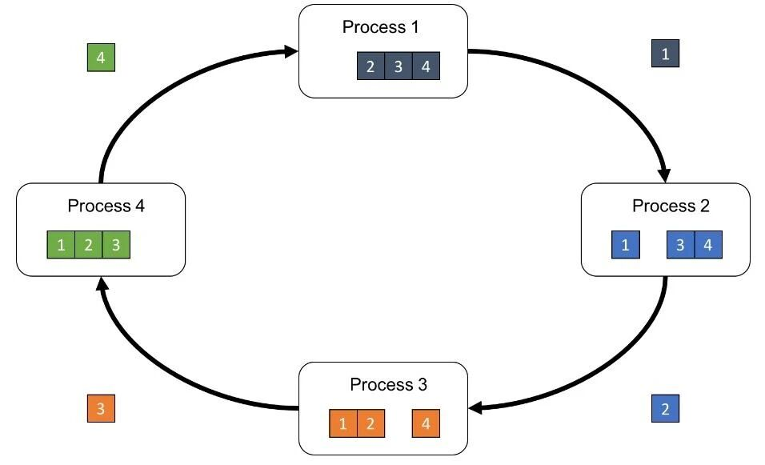

然后，第k个worker会把收到的第k-1份数据和自己的第k-1份数据整合，再将整合的数据发送给下一个worker。
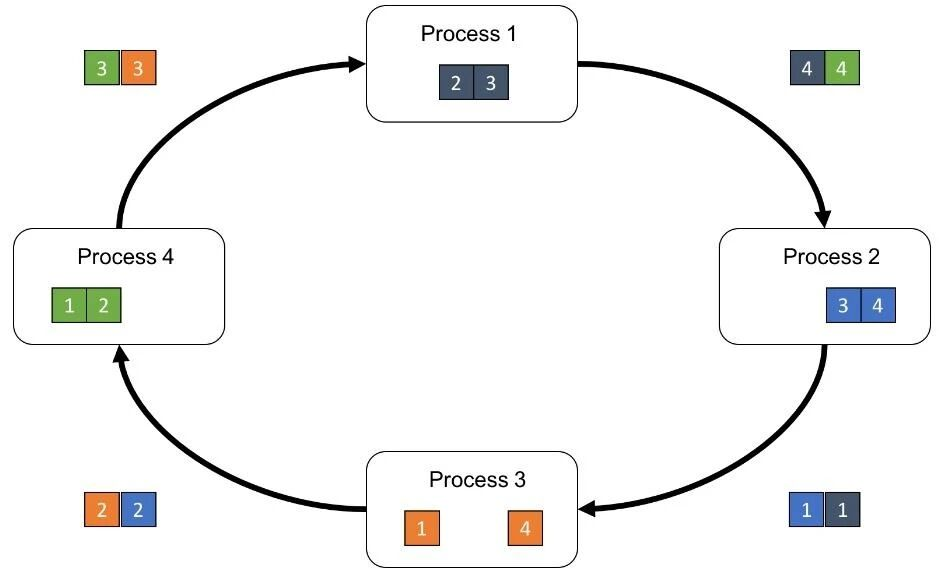

以此循环N次之后，每一个worker都会包含最终整合结果的一份。
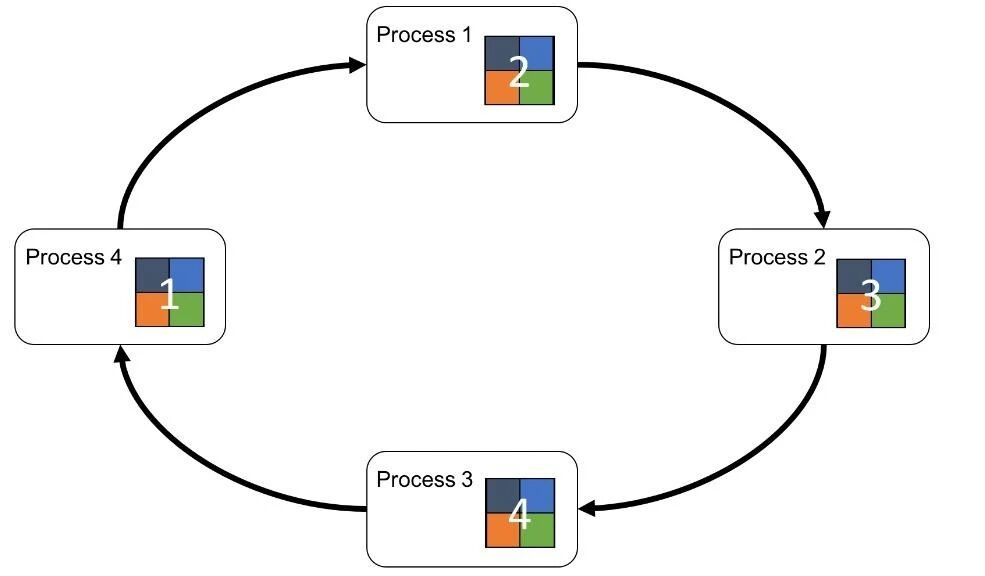

第二阶段，每个worker将整合好的部分发送给下一个worker。worker在收到数据之后，更新自身数据对应的部分即可。

很显然，这种环形算法可以**解决传统All-Reduce中Server节点的能力瓶颈问题**。

# Tree-based collective（基于二叉树的集合）


# Ring-AllReduce是不是使用Ring-AllGather代替Scatter-Reduce阶段？
## 初始想法
"既然每个GPU已经计算出了完整的梯度，为什么不能直接用AllGather收集所有梯度，然后本地求和？如果担心通信量太大，可以使用分块的Ring-AllGather，这样不就和AllReduce的第二阶段一样了吗？那是不是就可以省略Scatter-Reduce阶段？"

这个想法的逻辑链条：
```text
1. 每个GPU已有完整梯度（1GB）  
2. 使用分块Ring-AllGather传输  
3. 看起来和AllReduce的AllGather阶段一样  
4. 结论：可以省略Scatter-Reduce？
```


# QA
## 为什么"慢一块就全部等"？

回到工厂的比喻。

9条流水线要汇总结果。汇总这件事，必须等**所有人都交卷**才能开始统计。

第5条流水线网络堵了，数据晚到了10毫秒。

其他7条流水线算完了，数据早就发出去了，但它们没办法继续—— 因为下一步需要的"综合结论"还没有算出来。

**8块GPU在干等1块GPU的数据。**

这10毫秒的等待，乘以每小时几万次迭代，就是白白浪费的训练时间。

这就是为什么A 集群对网络延迟的要求，远比你见过的任何业务都苛刻—— 不是因为单次传输的数据量有多大，而是因为**这个等待每一轮都在发生， 一天下来积累的损耗是惊人的。**


## 丢一个包，为什么比延迟更可怕？

在传统网络里，丢包了，TCP重传，用户顶多感觉"慢了一下"，业务继续跑。


但 AI 集群用的不是TCP，用的是一种叫 **RDMA** 的传输协议。

RDMA 的设计目标是极低延迟——它几乎绕过了操作系统，CPU 不参与数据搬运， 数据直接在网卡和 GPU 显存之间流转。

代价是：**它对丢包几乎没有容忍度。**

一旦丢包，整个传输队列可能陷入等待，GPU停下来， 而且恢复的时间远比TCP重传要长得多。

所以AI网络的设计目标不是"尽量少丢包"，而是：

**在架构层面消灭丢包这件事本身。**

这就是为什么你在AI集群的架构图里会看到各种陌生的机制—— PFC、ECN、DCQCN——它们都是为了这一个目标服务的：

**让网络永远不要丢包。**

# 参考
```bash
# AllReduce深度理解：从误解到清晰
https://mp.weixin.qq.com/s/tEzs_4E8SxqPr6953pjzIw

# 分布式训练中All-Reduce、All-Gather、Reduce-Scatter原理介绍
https://zhuanlan.zhihu.com/p/17201336684

# 文章收藏 NCCL 系列之深入理解内部原理和运行机制
https://zhuanlan.zhihu.com/p/1938676472207355952
```