```table-of-contents
```
# 背景

当一张 GPU 无法承载千亿参数模型的显存需求，当百张 GPU 的算力仍需数月才能完成一次大模型训练，Scale-Out（横向扩展）成为大模型时代的必然选择。但 Scale-Out 绝非简单地将 GPU 堆叠，而是需要一张能让所有 GPU 高效协同的 “通信网”。大模型训练过程中，跨服务器的高频梯度同步（AllReduce 操作）如同 “血液流动”，每一轮训练都需要上万张 GPU 交换 TB 级数据，且对延迟的敏感度精确到微秒级 —— 哪怕 1 微秒的延迟增加，都可能导致每天的训练步数减少数十万次，训练周期延长数天。

## 传统数据中心(通用数据中心)的缺陷
通用数据中心网络以南北向流量（用户请求、云服务访问）为主，采用“过度订阅” 设计，根本无法满足 AI 训练 “高通量、低跳数、高容错” 的需求。
例如，传统树形网络跨机柜通信需经过 3-4 跳，延迟高达 50 微秒以上，且带宽瓶颈明显，在 AllReduce 操作中会导致 GPU 大量空闲。

因此，大模型集群必须采用专为 AI 场景设计的 Scale-Out 拓扑。当前，工业界与学术界的主流选择高度集中于三类经典架构：Fat-Tree（胖树）、Torus（环面网络）与 Dragonfly（蜻蜓网络），它们分别在中小规模效率、成本控制、超大规模扩展上展现出独特优势，共同支撑起万卡级 AI 训练的通信需求。

### 过度订阅

过度订阅 = 下层汇聚更多带宽，上层提供更少带宽 → 上行链路不够，一旦多机器同时通信就会堵车。

在传统数据中心（DCN）网络里：
- **接入层（ToR）交换机**：连接服务器
- **汇聚 / 核心层交换机**：连接交换机之间的上行
    

“过度订阅”是指：**服务器之间的总带宽 >（远大于） 汇聚交换机上行链路带宽**
换句话说：  **给服务器的带宽是“超配”的，但真正能出去的带宽不足。**


#### 订阅比（Oversubscription ratio）/ 收敛比

**订阅比（Oversubscription ratio） = 下行带宽 / 上行带宽**

例如：
- 48 台服务器，每台 25Gbps
- ToR 下行总带宽：48 × 25 = **1200Gbps**
- 但上行链路只有 4 × 100Gbps = **400Gbps**

```bash
1200Gbps / 400Gbps = 3:1
```

#### 为什么传统 DCN 要用“过度订阅”？

因为：
- 网路设备贵
- 南北流量（用户访问）的特点是**突发性强但总量小**
- 很少需要东西向（机器之间）同时高速通信

因此：**为了节省成本，大部分数据中心都不做“全带宽、无阻塞网络”。**

#### 为什么过度订阅无法满足 AI 训练？
AI 训练流量是：
（1）东西向（East-West）流量，（GPU → GPU、GPU → 参数服务器）
（2）极高带宽需求（100Gbps、200Gbps、400Gbps），而且是**持续满负载**而不是突发的
（3）全网同时通信，不能堵（All-Reduce、Collective 操作）

#### AI 网络的特点：必须“零过度订阅（non-blocking）”

大型 GPU 集群要求：
- **无 oversubscription（即 1:1）**
- **全网无阻塞（比如：fat-tree / Clos 网络）**
- **高带宽、多路径（ECMP）**
- **RDMA + RoCE 超低延迟**

所以 AI 训练网络是：不能省钱的网络 —— **必须全带宽、低阻塞、高冗余。**

#### 小结
**传统数据中心网络：**
- 设计给南北向流量（请求-返回）
- **过度订阅 3:1、5:1 节省设备成本**
- 能接受偶尔拥塞


**AI 训练网络：**
- 大规模东西向全带宽通信
- 需要 **1:1 完全无阻塞网络**
- 需要 RDMA / RoCE / InfiniBand


# Fat-Tree胖树架构

**Fat-Tree 是无带宽收敛的**：
传统的树形网络拓扑中，带宽是逐层收敛的，树根处的网络带宽要远小于各个叶子处所有带宽的总和。而 Fat-Tree 则更像是真实的树，越到树根，枝干越粗，即：从叶子到树根，网络带宽不收敛。这是 Fat-Tree 能够支撑无阻塞网络的基础。

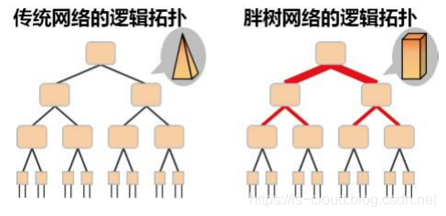

如上图所示，为了实现网络带宽的无收敛，Fat-Tree 中的每个节点（根节点除外）都需要保证上行带宽和下行带宽相等，并且每个节点都要提供对接入带宽的线速转发的能力。


## 分类

对于中小型规模的 GPU 集群网络，通常采用 Spine-Leaf 两层架构， 对于较大规模的GPU集群则使用三层胖树（Core-Spine-Leaf）进行扩展组网，由于网络的层次增加，其转发跳数与时延也相应增加。

### 三层胖树（Core-Spine-Leaf）

Fat-Tree 的结构如同一棵 “倒过来的树”，分为核心层（Core）、汇聚层（Aggregation）和接入层（Edge）三层。

接入层交换机直接连接 GPU 服务器，每个接入层交换机与多个汇聚层交换机相连；
汇聚层交换机再与所有核心层交换机全互联，形成 “多层冗余” 的通信路径。

例如，在一个包含 1024 张 GPU 的 Fat-Tree 集群中，接入层用 16 台交换机（每台连接 64 张 GPU），汇聚层用 16 台交换机，核心层用 8 台交换机，任意两张 GPU 之间都有至少 8 条通信路径，且每条路径的带宽完全一致。

#### 特性
一个k元的`Fat-Tree`可以归纳为5个特征：

- 每台交换机都有k个端口；
- 核心层为顶层，一共有(k/2)^2个交换机；
- 一共有k个pod，每个pod有k台交换机组成。其中汇聚层和接入层各占k/2台交换机；
- 接入层每个交换机可以容纳k/2台服务器，因此，k元Fat-Tree一共有k个pod，每个pod容纳k*k/4个服务器，所有pod共能容纳k*k*k/4台服务器；
- 任意两个pod之间存在k条路径。


#### 范例

常见的有2元、4元、6元等结构。

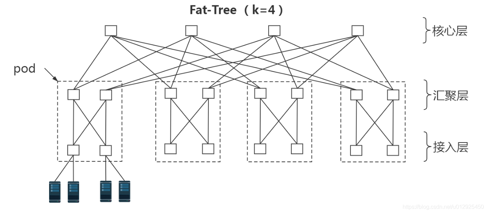

上图为最简单的 k=4 时的 Fat-Tree 拓扑，
**连在同一个接入交换机下的服务器处于同一个子网，他们之间的通信走二层报文交换。
不同接入交换机下的服务器通信，需要走路由**。

下面是一个6元胖树结构。

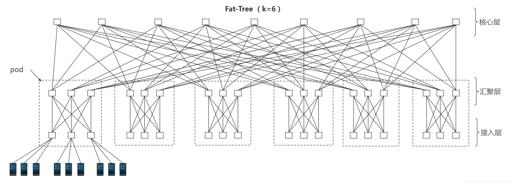


###  Spine-Leaf 两层架构
 Spine-Leaf 设计，本质上是两层 Fat-Tree 的简化实现。
 
GPU 服务器接入分为多轨和单轨两种方式。

下图为多轨接入方式，其 GPU 服务器上的 8 张网卡依次接入 8 台 Leaf 交换机；
该方式**集群通信效率高**，大部分流量经一级 Leaf 传输或者先走本地 GPU 服务器机内代理再经一级 Leaf 传输。

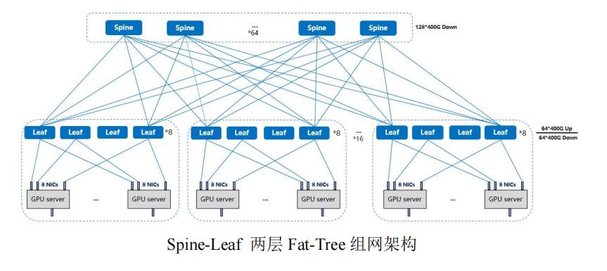

下图为单轨接入方式，1 台 GPU服务器上的网卡全部接入同一台 Leaf 交换机；
该方式**集群通信效率偏低**，但在机房实施**布线中有较大优势**。

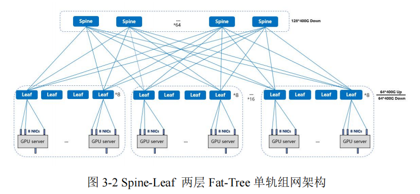

若 Leaf 交换机发生故障，多轨方式所影响的 GPU 服务器数量将多于单轨方式。


## 特点
### 带宽对称
这种结构在 AI 场景中的最大价值，在于 “带宽对称”—— 无论 GPU 位于哪个服务器、哪个机柜，跨节点通信的带宽都不会因路径不同而衰减，完美匹配 AllReduce 操作 “全局同步、均匀流量” 的需求。

例如，阿里云基于 Fat-Tree 理念构建的智算集群，在进行 2048 卡数据并行训练时，AllReduce 操作的带宽利用率达 98%，几乎无性能损耗，GPU 利用率稳定在 90% 以上。

### 支持 ECMP（等价多路径）负载均衡

同时，Fat-Tree 天然支持 ECMP（等价多路径）负载均衡算法，可将 AllReduce 的随机流量均匀分配到多条路径上，避免单一链路拥堵。某互联网企业的测试显示，在 1024 卡 Fat-Tree 集群中，ECMP 能将链路利用率差异控制在 5% 以内，远优于传统网络 20% 以上的差异。

## 优缺点
优势与局限：平衡性能与成本

### 优点

Fat-Tree 的优势在于理论上的 “无阻塞” 特性和工程上的易实现性。

### 无阻塞的网络
对于中小规模 AI 集群（数百至数千卡），它能提供接近 “全互联” 的通信性能，且与以太网生态高度兼容，可直接使用 RoCEv2 协议实现 GPU-to-GPU 的 RDMA 通信，无需定制硬件。


当前，Fat-Tree 是业界普遍认可的实现无阻塞网络的技术。
其基本理念是：**使用大量低性能的交换机，构建出大规模的无阻塞网络**，对于任意的通信模式，总有路径让他们的通信带宽达到网卡带宽。

Fat-Tree 的另一个好处是，**它用到的所有交换机都是相同的（所有交换机均为相同端口数量的普通设备），这让我们能够在整个数据中心网络架构中采用廉价的交换机**。


### 可运维性好
此外，Fat-Tree 的运维友好性极强，标准化的网络管理工具（如华为 CloudEngine 的 iMaster NCE、Cisco 的 DNA Center）均可直接用于拓扑发现、故障定位，降低了运维团队的技术门槛。


### 缺点

Fat-Tree 的扩展规模在理论上受限于核心层交换机的端口数目，不利于数据中心的长期发展要求；


#### 硬件成本高：需要的交换机数量多
Fat-Tree 网络中**交换机与服务器的比值较大**，在一定程度上使得网络设备成本依然很高，不利于企业的经济发展。
Fat-Tree 需要大量交换机，且核心层交换机的端口数量需随集群规模呈指数级增长。

例如，构建一个 4096 卡的 Fat-Tree 集群，核心层需 32 台 400G 交换机（每台含 64 个端口），汇聚层需 64 台交换机，接入层需 64 台交换机，硬件成本比简化版的 Spine-Leaf 高 40% 以上。

因此，**工业界在实际部署中，常将 Fat-Tree 简化为两层结构（即 Spine-Leaf），通过减少核心层与汇聚层的层级，在性能与成本之间寻找平衡**。
例如，AWS Trainium 集群采用两层 Spine-Leaf（Spine 层对应 Fat-Tree 的核心层，Leaf 层对应接入层），在保证 90% 带宽利用率的同时，成本降低 30%，成为公有云 AI 平台的主流选择。


## 应用

Fat-Tree 及其简化版（Spine-Leaf）是当前公有云 AI 平台的 “标配”，阿里云灵骏、AWS Trainium、Google TPU v4 Pods 均基于这一架构构建。

这类架构尤其适合数百至数千卡的中小规模 AI 训练场景，例如互联网企业的大模型微调、自动驾驶公司的多模态数据训练、科研机构的中等规模预训练任务等 —— 这些场景对性能稳定性要求高，且需要兼容多品牌 GPU（如 NVIDIA、AMD、昇腾），Fat-Tree 的生态兼容性和易维护性可大幅降低部署成本。

业内典型的大模型组网架构有腾讯星脉与阿里巴巴 HPN 网络。

### 腾讯星脉网络

腾讯星脉网络采用无阻塞胖树（Fat-Tree）拓扑，分为 Cluster-Pod-Block三级。以 128 端口 400G 交换机为例，其中Block为最小单元，各 Block 包含 1024 个 GPU，各 Pod 支持最大 64 个 Block，即 65536 个 GPU。多个 Pod 构成一个 Cluster 集群，支持 524288 个GPU。

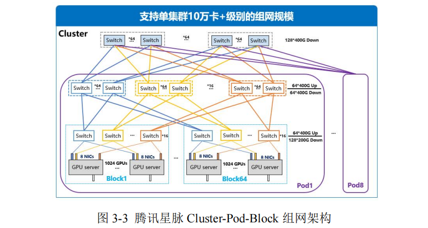


### 阿里云大模型训练网络

阿里云大模型训练网络（HPN，High-Performance Networking）引入一种双平面两层架构，每台 GPU 服务器配置了 8个 GPU，对应 8 个 NIC，各 NIC 提供 2×200Gbps 带宽，并上行连接到不同 Leaf 设备，形成双平面设计，从而避免单 Leaf 故障对训练任务的影响。若交换机为 128 端口，每台 GPU 服务器分别上行连至 16台 Leaf，组成一个 Segment（包含 1024 个 GPU）。


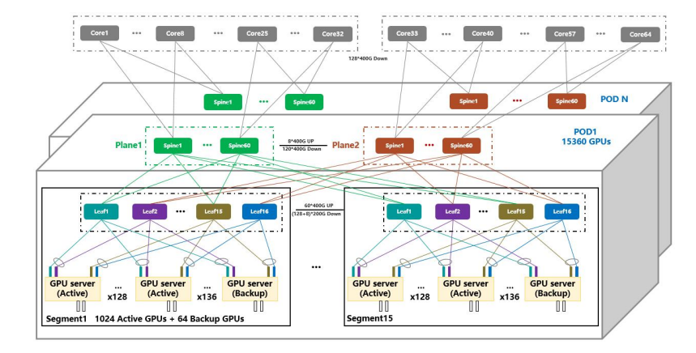

每台 Leaf 预留了额外 8×200G 端口接入 GPU 服务器，便于 GPU 服务器发生硬件等故障后可快速替换。Spine 层面连接多个 Segments 组成一个 Pod，每台Leaf 上行有 60×400G 端口连接 Spine，因此一个 Pod 可容纳 15 个Segments，即 15360 个 GPU。对于更大规模的训练任务，则会涉及到 Core 层面的连接进而组成算力规模更大的 GPU 集群。阿里根据其训练任务流量特性，选择 Spine-Core 之间采用 15:1 的收敛比设计，集群可支持 245760 个 GPU。


# Dragonfly（蜻蜓） 网络架构

传统 Clos 树形架构作为主流的智算网络架构，重点突出其普适性，但在时延与建设成本方面并非最优。在高性能计算网络中，Dragonfly 网络因其较小的网络直径与较低的部署成本被大量使用。


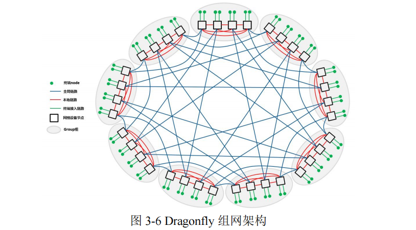

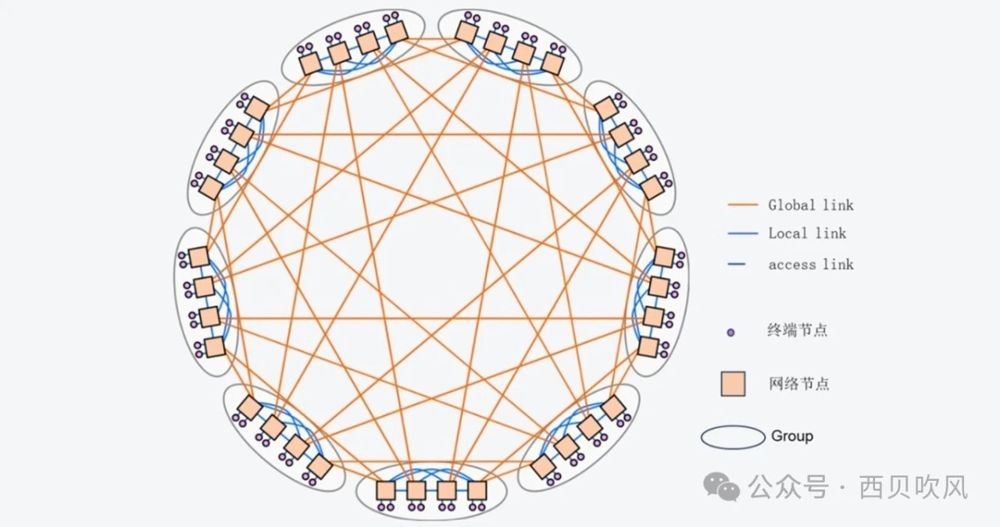

## 分层

Dragonfly的拓扑结构分为三层：Switch层、Group层、System层。

- Switch层：包括一个交换机及其相连的P个计算节点；
    
- Group层：包含a个Switch层，这a个Switch层的a个交换机是全连接(All-to-all)的，换言之，每个交换机都有a-1条链路连接分别连接到其他的a-1台交换机；
    
- System层：包含g个Group层，这g个Group层也是全连接的。


对于单个Switch交换机，它有p个端口连接到了计算节点，a-1个端口连接到Group内其他交换机，h个端口连接到其他Group的交换机。因此，我们可以计算得到网络中的如下属性：

- 每个交换机的端口数为k=p+(a-1)+h
    
- Group的数量为g=ah+1
    
- 网络中一共有N=ap(ah+1) 个计算节点
    
- 如果我们把一个Group内的交换机都合成一个，将它们视为一个交换机，那么这个交换机的端口数为k‘=a(p+h)
    
不难发现，在确定了 p、a、h、g四个参数之后，我们就可以确定一个Dragonfly的拓扑，因此，一个Dragonfly的拓扑可以用dfly(p,a,h,g) 来表示，**一种推荐的较为平衡的配置是方法是：a=2p=2h**。


## 优缺点

**Dragonfly**为各种应用程序（或通信模式）提供了良好的性能，与其他拓扑相比，它通过直连模式，缩短网络路径，减少中间节点数量。**64端口交换机支持组网规模27万节点，端到端交换机转发跳数减至3跳。

**Dragonfly**拓扑在性能和性价比方面有显著的优势。然而，这种优势的实现需要依赖于有效的拥塞控制和自适应路由策略。**Dragonfly**网络在扩展性方面存在问题，每次需要增加网络容量时，都必须对**Dragonfly**网络进行重新布线，这增加了网络的复杂性和管理难度。**

# Torus（环面） 网络架构
## 背景
随着模型参数的增加和训练数据的增加，单台机器算力无法满足，存储无法满足，所以要分布式机器学习，集合通信则是分布式机器学习的底层支撑，集合通信的难点在于需要在一定的网络互联结构的约束下进行高效的通信，需要在效率与成本、带宽与时延、客户要求与质量、创新与产品化等之间进行合理取舍。

## 介绍


Torus（环面网络）源自高性能计算（HPC）领域，是一种将节点排列成 2D 或 3D 网格，并将网格边缘首尾相连形成 “环” 的拓扑结构。它凭借 “规则布线、低功耗、低成本” 的特点，成为 AI 与科学计算混合负载的优选，尤其在对能耗和成本敏感的超算中心中应用广泛。

Torus网络架构是一种完全对称的拓扑结构，具有很多优良特性，如网络直径小、结构简单、路径多以及可扩展性好等特点，非常适合集合通信使用。

## 特点
### 规则带来的效率
Torus 的核心设计思路是 “用规则性降低复杂度”。

在 2D Torus 中，节点排列成 N×N 的网格，每个节点与上下左右四个相邻节点相连，同时网格的第一行与最后一行、第一列与最后一列首尾相连，形成两个相互垂直的 “环”；

3D Torus 则在此基础上增加 “层” 的维度，每个节点与六个方向（上下、左右、前后）的节点相连，形成三维环状结构。

这种规则性使得 Torus 的布线极为简单 —— 每个节点的连接数量固定（2D 为 4 个，3D 为 6 个），无需复杂的交换机端口分配，可直接通过机柜内的固定线缆连接，大幅降低部署难度。

## 分类

### 2D-Torus

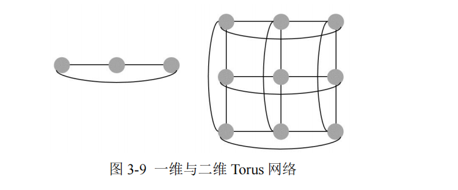
上图 呈现了一维边长为 3 的 Torus 及二维边长为 3 的 Torus 网络。Torus 网络环面拓扑特性可使得其在邻居节点之间拥有最优通信性能。然而，Torus 网络扩展可能涉及拓扑重新调整，且维护复杂度较高。

索尼公司提出2D-Torus算法，其主要思想就是`组内satter-reduce`->`组间all-reduce`->`组内all-gather`。

我们用`k-ary n-cube`来表示。k是排列的边的长度，n是排列的维度。

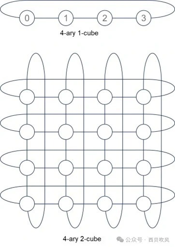

以2D-Torus拓扑为例，可以将网络结构表达成如下的Torus结构。

（1）横向：每台服务器X个GPU节点，每GPU节点通过私有协议网络互联（如NVLINK）；
（2）纵向：每台服务器通过至少2张RDMA网卡NIC0 /NIC1通过交换机互联。

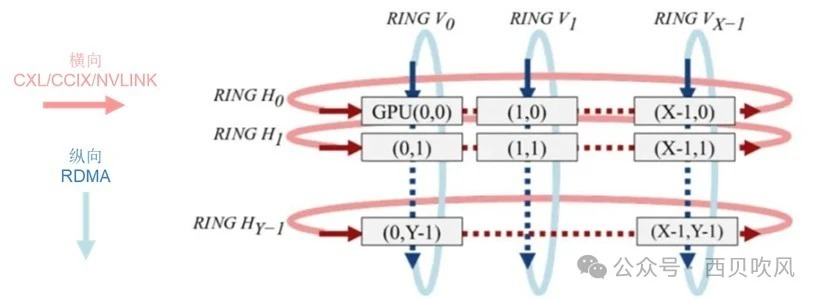

第1步，横向，先进行主机内`Ring Scatter Reduce`，将主机内8张卡上的梯度进行拆分与规约，这样经过迭代，到最后每个GPU将有一个完整的同维梯度，该块梯度包含所有GPU中该块所对应的所有梯度的总和；

第2步，纵向，进行主机间X个纵向的 `Ring All Reduce`，将每台服务器的X个GPU上的数据进行集群内纵向全局规约；

第3步，横向，进行主机内All Gather，将`GPUi[i=0~(X-1)]`上的梯度复制到服务器内的其他GPU上；


### 3D-Toru

IBM提出了3D-Torus算法。
3-ary 3-cube拓扑如下：

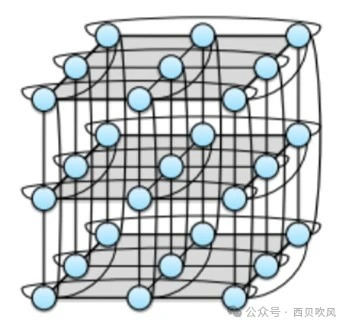


## 优缺点
### 优点

Torus网络架构具有如下优势：

- 更低的延迟：环面拓扑可以提供更低的延迟，因为它在相邻节点之间有短而直接的链接；
    
- 更好的局部性：在环面网络中，物理上彼此靠近的节点在逻辑上也很接近，这可以带来更好的数据局部性并减少通信开销，从而降低时延和功耗。
    
- 较低的网络直径：对于相同数量的节点，环面拓扑的网络直径低于CLOS网络，需要更少的交换机，从而节省大量成本。


### 缺点

Torus网络架构也存在一些不足：

- 可预测方面，环面网络中是无法保证的；
    
- 易扩展方面：缩放环面网络可能涉及重新配置整个拓扑，可能更加复杂和耗时；
    
- 负载平衡方面：环面网络提供多条路径，但相对Fat-tree备选路径数量要少；
    
- 故障排查：对于突发故障的排查复杂性略高，不过动态可重配路由的灵活性可以大幅避免事故。


# 参考
```bash
# 白话GPU-32 大规模GPU集群的硬件配置和网络设计案例 （+++++）
https://mp.weixin.qq.com/s/B8k9N2Vu1y5ShHG0nd3jHQ

# Fat-Tree、Torus、Dragonfly：支撑万卡 AI 训练的三大 Scale-Out 网络架构
https://mp.weixin.qq.com/s/V4h7Nl-6Psqr7OIQhh76bA

# 一文读懂胖树(Fat-Tree)拓扑结构
https://mp.weixin.qq.com/s/XzLU04hfmCzS6dSYsUv1cg
```