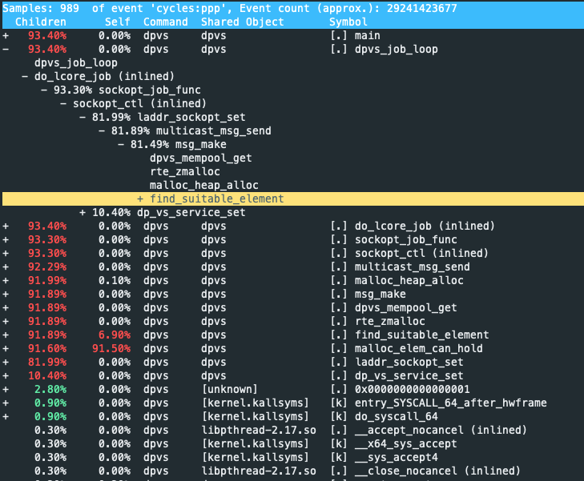

```table-of-contents
```
# 背景
日常的工作中，会收到一堆CPU使用率过高的告警邮件，遇到某台服务的`CPU被占满了`，这时候我们就要去查看是什么进程将服务器的CPU资源占用满了。通常我们会通过`top`或者`htop`来快速的查看占据CPU最高的那个进程，如下图：

当然你可能遇到一个服务器上运行有多个服务，想快速知道占用率最高的那几个进程的话，你可以使用以下命令:
```bash
ps aux|head -1;ps -aux | sort -k3nr | head -n 10 //查看前10个最占用CPU的进程
ps aux|head -1;ps -aux | sort -k4nr | head -n 10 //查看前10个最占用内存的进程
```
通过以上的方法获取到服务器占用资源的进程之后，还是`不知道CPU使用究竟耗时在哪里`,不清楚瓶颈在哪里，此时就可以通过`Linux`系统的性能分析工具`perf`分析，分析其返回的正在消耗CPU的函数以及调用栈。

# 介绍
Perf全名是`Performance`，是在Linux内建的性能分析工具。
perf通过对监测对象进行采样，根据采样点的分布来推断整个程序的行为。
通过`perf list`命令我们可以看到`perf`支持很多的采样事件，比如`branch-misse`s、`cpu-clock`等等。

## 原理
Perf 可以对程序进行**函数级别的采样**，从而了解程序的性能瓶颈在哪里。
其基本原理是：每隔一个固定时间，就是CPU上产生一个中断，看当前是哪个进程、哪个函数，然后给对应的进程和函数加一个统计值，这样就知道CPU有多少时间在某个进程或某个函数上了。


# 准备与环境配置
## 安装
```bash
# which perf
/bin/perf

# rpm -qf /bin/perf
perf-3.10.0-693.5.2.el7.x86_64
```

## 环境配置
### 程序编译
程序编译带调试信息：`-g`，并保留 frame pointers 或使用 DWARF。


### 系统配置
```bash
# ll /proc/sys/kernel/perf_*
-rw-r--r-- 1 root root 0 Sep 17 11:00 /proc/sys/kernel/perf_cpu_time_max_percent
-rw-r--r-- 1 root root 0 Sep 17 11:00 /proc/sys/kernel/perf_event_max_contexts_per_stack
-rw-r--r-- 1 root root 0 Sep 17 11:00 /proc/sys/kernel/perf_event_max_sample_rate
-rw-r--r-- 1 root root 0 Sep 16 20:40 /proc/sys/kernel/perf_event_max_stack
-rw-r--r-- 1 root root 0 Sep 17 11:00 /proc/sys/kernel/perf_event_mlock_kb
-rw-r--r-- 1 root root 0 Sep 16 18:27 /proc/sys/kernel/perf_event_paranoid

# cat /proc/sys/kernel/perf_*
25
8
100000
127
516
2
```

#### `perf_event_max_sample_rate`
设置**最大采样率**。 将此值设置得太高会导致用户以影响整体机器性能的速率进行采样，并有可能锁定机器。 默认值为100000（每秒采样数）。


# 使用


## 总览
**perf top**：查看实时性能数据。
类似于系统中的`top`命令。某些时候我们可能并不知道是哪个程序影响了系统性能，这时候就可以用perf top来查找可疑的程序。

**perf stat**：比较适合单个程序的性能分析。

**perf record/report**：更适合对程序进行更细粒度的分析

**perf annotate**：显示源代码级别的性能分析

## perf list
```bash
# man perf-list

```


`perf-list` 命令接受搜索子字符串作为参数。
```bash
# Listing all currently known events:
perf list

# Listing sched tracepoints:
perf list 'sched:*'
```


### 查看事件


## perf top
```bash
- 进程级：perf top -p <pid>
- 线程级：perf top -t <tid>
线程tid可以通过 pidstat -t -p <pid>获取 或 ps -T -p xxx
```

我们可以通过-e参数指定统计其他的事件，比如`perf top -e context-switches`可以查看进程切换最多的`top N`个进程。

## perf stat

`perf stat`命令提供**常见性能事件的总体统计信息（包括软件事件，硬件事件等等）**，包括执行的指令和消耗的时钟周期。选项可用于选择默认测量事件以外的事件。


选项如 `--repeat`、`--sync`、`--pre` 和 `--post` 在进行自动化测试（automated testing）或微基准测试（micro-benchmarking) 时非常有用。

### 使用范例
#### Counting Events
```bash
# CPU counter statistics for the specified command:
perf stat command

# Detailed CPU counter statistics (includes extras) for the specified command:
perf stat -d command

# CPU counter statistics for the specified PID, until Ctrl-C:
perf stat -p PID

# CPU counter statistics for the entire system, for 5 seconds:
perf stat -a sleep 5

# Various basic CPU statistics, system wide, for 10 seconds:
perf stat -e cycles,instructions,cache-references,cache-misses,bus-cycles -a sleep 10

# Various CPU level 1 data cache statistics for the specified command:
perf stat -e L1-dcache-loads,L1-dcache-load-misses,L1-dcache-stores command

# Various CPU data TLB statistics for the specified command:
perf stat -e dTLB-loads,dTLB-load-misses,dTLB-prefetch-misses command

# Various CPU last level cache statistics for the specified command:
perf stat -e LLC-loads,LLC-load-misses,LLC-stores,LLC-prefetches command

# Using raw PMC counters, eg, counting unhalted core cycles:
perf stat -e r003c -a sleep 5 

# PMCs: counting cycles and frontend stalls via raw specification:
perf stat -e cycles -e cpu/event=0x0e,umask=0x01,inv,cmask=0x01/ -a sleep 5

# Count syscalls per-second system-wide:
perf stat -e raw_syscalls:sys_enter -I 1000 -a

# Count system calls by type for the specified PID, until Ctrl-C:
perf stat -e 'syscalls:sys_enter_*' -p PID

# Count system calls by type for the entire system, for 5 seconds:
perf stat -e 'syscalls:sys_enter_*' -a sleep 5

# Count scheduler events for the specified PID, until Ctrl-C:
perf stat -e 'sched:*' -p PID

# Count scheduler events for the specified PID, for 10 seconds:
perf stat -e 'sched:*' -p PID sleep 10

# Count ext4 events for the entire system, for 10 seconds:
perf stat -e 'ext4:*' -a sleep 10

# Count block device I/O events for the entire system, for 10 seconds:
perf stat -e 'block:*' -a sleep 10

# Count all vmscan events, printing a report every second:
perf stat -e 'vmscan:*' -a -I 1000
```


## perf record 和 perf report
perf 的使用方法也很丰富，目前只要会用 `perf record` 和 `perf report` 就能够进行大部分的性能分析了。
```bash
(1) perf record
perf record -F 99 -C 1 --call-graph dwarf -o xxxx.data -- sleep 30
    -F: (freq) 采集的评率
    -p: 指定进程; 
    -t: 指定线程号;
    -C：指定某个cpu；
    --call-graph: 栈回溯方式。
	    fp, dwarf, lbr；
	    dwarf较为常用；
    sleep: 采集的时间，以s为单位；
    -o: output file, 不指定时默认保存到当前目录新建立的 perf.data 文件中；

(2) perf report
perf report  -i FILE
-i: input file; 
```


### 使用方法
#### perf record： 记录性能数据
有三种方法：

**（1）与程序一起运行**：

```text
perf record -g -- <程序命令>
```

**（2）挂载到正在运行的进程**：

```text
perf record -F 199 -p <PID> -g -- sleep <采样秒数>

下面的可能更好一些：

perf record -F 199 -g --call-graph dwarf -e cycles xxxx
perf report
```

**（3）挂载到正在运行的线程**：

```text
perf record -t <线程ID> -g -- sleep <采样秒数>
```


```bash
-a: all cpu
-e: event; 多个事件之间使用逗号分隔
-p: pid
-t: tid
-c: count
-o: output
-F: freq
-g: Enables call-graph (stack chain/backtrace) recording.
-q: quiet,Don’t print any message, useful for scripting.
-v: verbose
-C: cpu core

```

##### perf.data

perf record 运行完毕或中断后会在运行目录生成 perf.data 文件，后续使用 perf 分析时需要用到这个文件。


#### perf report ：分析性能数据


这里按照总用时（Children，意思是自身用时+调用其他函数的用时）降序列出了所有函数。

##### 使用方法


按h可以查看帮助。常用的有：


- 上下方向键，用于选择函数。
- 回车，对指定函数进行进一步操作，包括逐代码行查看耗时、转到某个线程等。
- e，展开函数的被调用链路（所有左侧带+的都是可以展开的项）。


##### 字段含义

在 `perf report` 中，每一行代表一个函数（符号），常见列里有 `self` 和 `children`：

|列名|含义|
|---|---|
|**self**|事件（比如 CPU cycles、cache miss 等）**直接在这个函数自身执行指令时发生**的比例。即：函数体内的指令产生的开销，不包括它调用的其它函数。|
|**children**|事件**在这个函数本身以及它（直接或间接）调用的所有子函数中发生**的比例。即：当前函数作为调用者的整棵调用子树的总开销。|


### 分析数据
#### 火焰图方式
参考： 火焰图的生成。

火焰图一般够用，但有几个缺点：
一，只有调用关系，没有被调用关系；
二，不方便查看自用时，只能查看总用时。`perf report`中 `self` 表示自用时，`children`表示总用时（即自用时+函数内调用的其他函数的用时）

#### perf report 方式
除了火焰图分析，perf 还自带了交互式分析工具。在perf.data文件所在目录下执行 perf report 即可。

### FAQ
#### perf record 可以同时跟踪多个事件吗？
可以。

#### perf report 如何按 Self 的降序，而不是 Children 的降序排列？

```text
perf report --no-children
```
即可。

####  查看采样的属性
```bash
perf record -vv
```


#### 调整采集频率

可以使用-F选项修改事件频率，或者使用-c将事件频率更改为一个周期，该周期在每个周期中捕获一个事件（也称为溢出采样）。

对于许多事件，每次发生时都采集堆栈会导致过高的开销，从而减缓系统速度并改变目标的性能特征。通常，只需对其发生的少量事件进行监控，而不是对所有事件进行监控。可以通过指定触发事件收集的阈值来实现，使用 `-c` 和计数。

例如，以下命令对 Level 1 数据缓存加载未命中进行监控，每 10,000 次发生时收集一次堆栈跟踪：
```bash
# perf record -e L1-dcache-load-misses -c 10000 -ag -- sleep 5
```
`-c count` 的机制由处理器实现，只有在达到阈值时才会中断内核。


##### 注意
请注意，频率有限制，perf的CPU利用率也有限制，可以使用sysctl查看和设置。

```bash
[root@localhost perf]# sysctl kernel.perf_event_max_sample_rate
kernel.perf_event_max_sample_rate = 50000
[root@localhost perf]# cat /proc/sys/kernel/perf_event_max_sample_rate
50000

这表明该系统的最大采样率为50000 Hertz。
```

```bash
[root@localhost perf]# sysctl kernel.perf_cpu_time_max_percent
kernel.perf_cpu_time_max_percent = 25
[root@localhost perf]# cat /proc/sys/kernel/perf_cpu_time_max_percent
25

perf（特别是PMU中断）允许的最大CPU利用率为25%。
```

### 使用范例
#### Profiling
```bash
# Sample on-CPU functions for the specified command, at 99 Hertz:
perf record -F 99 command

# Sample on-CPU functions for the specified PID, at 99 Hertz, until Ctrl-C:
perf record -F 99 -p PID

# Sample on-CPU functions for the specified PID, at 99 Hertz, for 10 seconds:
perf record -F 99 -p PID sleep 10

# Sample CPU stack traces (via frame pointers) for the specified PID, at 99 Hertz, for 10 seconds:
perf record -F 99 -p PID -g -- sleep 10

# Sample CPU stack traces for the PID, using dwarf (dbg info) to unwind stacks, at 99 Hertz, for 10 seconds:
perf record -F 99 -p PID --call-graph dwarf sleep 10

# Sample CPU stack traces for the entire system, at 99 Hertz, for 10 seconds (< Linux 4.11):
perf record -F 99 -ag -- sleep 10

# Sample CPU stack traces for the entire system, at 99 Hertz, for 10 seconds (>= Linux 4.11):
perf record -F 99 -g -- sleep 10

# If the previous command didn't work, try forcing perf to use the cpu-clock event:
perf record -F 99 -e cpu-clock -ag -- sleep 10

# Sample CPU stack traces for a container identified by its /sys/fs/cgroup/perf_event cgroup:
perf record -F 99 -e cpu-clock --cgroup=docker/1d567f4393190204...etc... -a -- sleep 10

# Sample CPU stack traces for the entire system, with dwarf stacks, at 99 Hertz, for 10 seconds:
perf record -F 99 -a --call-graph dwarf sleep 10

# Sample CPU stack traces for the entire system, using last branch record for stacks, ... (>= Linux 4.?):
perf record -F 99 -a --call-graph lbr sleep 10

# Sample CPU stack traces, once every 10,000 Level 1 data cache misses, for 5 seconds:
perf record -e L1-dcache-load-misses -c 10000 -ag -- sleep 5

# Sample CPU stack traces, once every 100 last level cache misses, for 5 seconds:
perf record -e LLC-load-misses -c 100 -ag -- sleep 5 

# Sample on-CPU kernel instructions, for 5 seconds:
perf record -e cycles:k -a -- sleep 5 

# Sample on-CPU user instructions, for 5 seconds:
perf record -e cycles:u -a -- sleep 5 

# Sample on-CPU user instructions precisely (using PEBS), for 5 seconds:
perf record -e cycles:up -a -- sleep 5 

# Perform branch tracing (needs HW support), for 1 second:
perf record -b -a sleep 1

# Sample CPUs at 49 Hertz, and show top addresses and symbols, live (no perf.data file):
perf top -F 49

# Sample CPUs at 49 Hertz, and show top process names and segments, live:
perf top -F 49 -ns comm,dso
```

#### Static Tracing
```bash
# Trace new processes, until Ctrl-C:
perf record -e sched:sched_process_exec -a

# Sample (take a subset of) context-switches, until Ctrl-C:
perf record -e context-switches -a

# Trace all context-switches, until Ctrl-C:
perf record -e context-switches -c 1 -a

# Include raw settings used (see: man perf_event_open):
perf record -vv -e context-switches -a

# Trace all context-switches via sched tracepoint, until Ctrl-C:
perf record -e sched:sched_switch -a

# Sample context-switches with stack traces, until Ctrl-C:
perf record -e context-switches -ag

# Sample context-switches with stack traces, for 10 seconds:
perf record -e context-switches -ag -- sleep 10

# Sample CS, stack traces, and with timestamps (< Linux 3.17, -T now default):
perf record -e context-switches -ag -T

# Sample CPU migrations, for 10 seconds:
perf record -e migrations -a -- sleep 10

# Trace all connect()s with stack traces (outbound connections), until Ctrl-C:
perf record -e syscalls:sys_enter_connect -ag

# Trace all accepts()s with stack traces (inbound connections), until Ctrl-C:
perf record -e syscalls:sys_enter_accept* -ag

# Trace all block device (disk I/O) requests with stack traces, until Ctrl-C:
perf record -e block:block_rq_insert -ag

# Sample at most 100 block device requests per second, until Ctrl-C:
perf record -F 100 -e block:block_rq_insert -a

# Trace all block device issues and completions (has timestamps), until Ctrl-C:
perf record -e block:block_rq_issue -e block:block_rq_complete -a

# Trace all block completions, of size at least 100 Kbytes, until Ctrl-C:
perf record -e block:block_rq_complete --filter 'nr_sector > 200'

# Trace all block completions, synchronous writes only, until Ctrl-C:
perf record -e block:block_rq_complete --filter 'rwbs == "WS"'

# Trace all block completions, all types of writes, until Ctrl-C:
perf record -e block:block_rq_complete --filter 'rwbs ~ "*W*"'

# Sample minor faults (RSS growth) with stack traces, until Ctrl-C:
perf record -e minor-faults -ag

# Trace all minor faults with stack traces, until Ctrl-C:
perf record -e minor-faults -c 1 -ag

# Sample page faults with stack traces, until Ctrl-C:
perf record -e page-faults -ag

# Trace all ext4 calls, and write to a non-ext4 location, until Ctrl-C:
perf record -e 'ext4:*' -o /tmp/perf.data -a 

# Trace kswapd wakeup events, until Ctrl-C:
perf record -e vmscan:mm_vmscan_wakeup_kswapd -ag

# Add Node.js USDT probes (Linux 4.10+):
perf buildid-cache --add `which node`

# Trace the node http__server__request USDT event (Linux 4.10+):
perf record -e sdt_node:http__server__request -a
```


#### 范例
```bash
root@master:~# sudo perf record -F 99 -p 25633 -g -- sleep 30
[ perf record: Woken up 1 times to write data ]
[ perf record: Captured and wrote 0.039 MB perf.data (120 samples) ]

上面的命令中:
	`perf record`表示记录
	`-F 99`表示每秒99次
	`-p 25633`是进程号，即对哪个进程进行分析
	`-g`表示记录调用栈
	`sleep 30`则是持续30秒，参数信息可以视情况调整。
生成的数据采集文件在当前目录下，名称为`perf.data`。
```
这个命令会产生一个大的数据文件，取决与你采集的进程与CPU的配置，如果一台服务器有16个 CPU，每秒抽样99次，持续30秒，就得到 47,520 (99*30*16)个调用栈，长达几十万甚至上百万行。

## perf probe


```bash
man perf probe
```


### 使用范例

#### Dynamic Tracing

```bash
# Add a tracepoint for the kernel tcp_sendmsg() function entry ("--add" is optional):
perf probe --add tcp_sendmsg

# Remove the tcp_sendmsg() tracepoint (or use "--del"):
perf probe -d tcp_sendmsg

# Add a tracepoint for the kernel tcp_sendmsg() function return:
perf probe 'tcp_sendmsg%return'

# Show available variables for the kernel tcp_sendmsg() function (needs debuginfo):
perf probe -V tcp_sendmsg

# Show available variables for the kernel tcp_sendmsg() function, plus external vars (needs debuginfo):
perf probe -V tcp_sendmsg --externs

# Show available line probes for tcp_sendmsg() (needs debuginfo):
perf probe -L tcp_sendmsg

# Show available variables for tcp_sendmsg() at line number 81 (needs debuginfo):
perf probe -V tcp_sendmsg:81

# Add a tracepoint for tcp_sendmsg(), with three entry argument registers (platform specific):
perf probe 'tcp_sendmsg %ax %dx %cx'

# Add a tracepoint for tcp_sendmsg(), with an alias ("bytes") for the %cx register (platform specific):
perf probe 'tcp_sendmsg bytes=%cx'

# Trace previously created probe when the bytes (alias) variable is greater than 100:
perf record -e probe:tcp_sendmsg --filter 'bytes > 100'

# Add a tracepoint for tcp_sendmsg() return, and capture the return value:
perf probe 'tcp_sendmsg%return $retval'

# Add a tracepoint for tcp_sendmsg(), and "size" entry argument (reliable, but needs debuginfo):
perf probe 'tcp_sendmsg size'

# Add a tracepoint for tcp_sendmsg(), with size and socket state (needs debuginfo):
perf probe 'tcp_sendmsg size sk->__sk_common.skc_state'

# Tell me how on Earth you would do this, but don't actually do it (needs debuginfo):
perf probe -nv 'tcp_sendmsg size sk->__sk_common.skc_state'

# Trace previous probe when size is non-zero, and state is not TCP_ESTABLISHED(1) (needs debuginfo):
perf record -e probe:tcp_sendmsg --filter 'size > 0 && skc_state != 1' -a

# Add a tracepoint for tcp_sendmsg() line 81 with local variable seglen (needs debuginfo):
perf probe 'tcp_sendmsg:81 seglen'

# Add a tracepoint for do_sys_open() with the filename as a string (needs debuginfo):
perf probe 'do_sys_open filename:string'

# Add a tracepoint for myfunc() return, and include the retval as a string:
perf probe 'myfunc%return +0($retval):string'

# Add a tracepoint for the user-level malloc() function from libc:
perf probe -x /lib64/libc.so.6 malloc

# Add a tracepoint for this user-level static probe (USDT, aka SDT event):
perf probe -x /usr/lib64/libpthread-2.24.so %sdt_libpthread:mutex_entry

# List currently available dynamic probes:
perf probe -l
```

## perf trace
此命令执行与 `strace` 工具类似的函数。它监控指定线程或进程使用的系统调用，以及该应用收到的所有信号。


### perf VS strace
`strace`的当前实现使用`ptrace()`附加到目标进程，并在系统调用期间停止它，就像`gdb`调试器一样，这可能会造成严重的开销。

为了证明这一点，下面的系统调用重载程序使用perf和strace自行运行。我只列出了显示其性能的输出行：

```bash
[root@localhost perf]# dd if=/dev/zero of=/dev/null bs=512 count=10000k
10240000+0 records in
10240000+0 records out
5242880000 bytes (5.2 GB) copied, 9.13118 s, 574 MB/s

[root@localhost perf]# perf stat -e 'syscalls:sys_enter_*' dd if=/dev/zero of=/dev/null bs=512 count=10000k
10240000+0 records in
10240000+0 records out
5242880000 bytes (5.2 GB) copied, 12.1365 s, 432 MB/s

[root@localhost perf]# strace -c dd if=/dev/zero of=/dev/null bs=512 count=10000k
10240000+0 records in
10240000+0 records out
5242880000 bytes (5.2 GB) copied, 283.28 s, 18.5 MB/s

```

使用perf时，程序运行速度慢1.3倍。但有了strace，它跑得慢了32倍。这很可能是最坏的结果：如果系统调用不那么频繁，两种工具之间的差异就不会那么大。
最新版本的perf包含了trace子命令，以提供与strace类似的功能，但开销要低得多。


### 介绍
`perf trace` 于`Linux 3.7`内核版本主线引入：
`perf trace`是`perf`性能分析基础设施中新增的一个工具。该工具的设计灵感来自于广受欢迎的’strace’工具，但它不使用`ptrace()`系统调用，而是使用Linux的追踪基础设施。它的目的是使追踪对更广泛的Linux用户群体更加容易。

`perf trace`将显示与目标相关的事件，最初是系统调用，但也包括其他系统事件，如页面错误、任务生命周期事件、调度事件等。这个工具目前还处于早期版本，因此只支持实时模式，并且还有很多细节需要改进，但最终将与其他perf工具一样，能够处理`perf.data`文件，允许从分析阶段分离出来的“记录”进行后续分析。


## perf annotate
```bash
# perf annotate -h

 Usage: perf annotate [<options>]

    -C, --cpu <cpu>       list of cpus to profile
    -d, --dsos <dso[,dso...]>
                          only consider symbols in these dsos
    -D, --dump-raw-trace  dump raw trace in ASCII
    -f, --force           don't complain, do it
    -i, --input <file>    input file name
    -k, --vmlinux <file>  vmlinux pathname
    -l, --print-line      print matching source lines (may be slow)
    -M, --disassembler-style <disassembler style>
                          Specify disassembler style (e.g. -M intel for intel syntax)
    -m, --modules         load module symbols - WARNING: use only with -k and LIVE kernel
    -P, --full-paths      Don't shorten the displayed pathnames
    -s, --symbol <symbol>
                          symbol to annotate
    -v, --verbose         be more verbose (show symbol address, etc)
        --asm-raw         Display raw encoding of assembly instructions (default)
        --group           Show event group information together
        --gtk             Use the GTK interface
        --objdump <path>  objdump binary to use for disassembly and annotations
        --show-total-period
                          Show a column with the sum of periods
        --skip-missing    Skip symbols that cannot be annotated
        --source          Interleave source code with assembly code (default)
        --stdio           Use the stdio interface
        --stdio-color <mode>
                          'always' (default), 'never' or 'auto' only applicable to --stdio mode
        --symfs <directory>
                          Look for files with symbols relative to this directory
        --tui             Use the TUI interface
```


### 使用方法

`perf report`进入到交互之后，选中某个函数，然后annotate, 进入之后，`h`查看帮助：


```bash

perf annotate -s <symbol>： 存在perf.data时， 通过左边命令，可以直接指定函数名看

perf annotate --stdio 或 perf annotate --stdio -s <symbol>：可以直接在终端看文本模式输出

```

#### 查看汇编对应的指定行代码

`perf report` 进入交互之后，`annotate` 进入到某个函数内部查看汇编，查看可以在左边看到函数内，热点机器指令占这个函数总CPU的比例。
指的是：这个机器指令占用这个函数的CPU比例， 并不是整体CPU的比例。如下所示：


(1) `perf annotate --stdio` 获取指定函数的指令地址
```bash
perf annotate --stdio -s kucl_epoll_wait
```


注：**其实也可以不通过`perf annotate --stdio` 获取指定函数的指令地址，直接在`perf report` 进入交互之后，`annotate` 进入到某个函数内部，然后通过`o`以及`k`就可以查看指定指令的地址以及行号，具体参见`annotate`之后的`h`后的帮助**。
```bash
o: Toggle disassembler output/simplified view
s: Toggle source code view
k:
```

(2) 输出源码的位置：


```bash
# addr2line -e ./ibv_test_client 69e309
/home/relay/xxxx/kucl/include/stats/trace_declare_comm.h:48
```


### annotate Func 看不到源码，只有汇编

可能的原因：

#### 编译的时候，没有添加`-g`，二进制文件不包含调试符号信息

**代码编译**
编译代码的时候，最好是添加`-g 和 -fno-omit-frame-pointer`，比如：
```bash
gcc -O2 -g -fno-omit-frame-pointer -o your_program your_program.c
```

**查看一个二进制文件中，是否存在调试符号信息**：
```bash
readelf -S ./your_prog | grep debug

- 如果输出里能看到 `.debug_info`、`.debug_line`、`.debug_abbrev` 等 section，说明编译时加了 `-g`，有源码行号信息。
- 如果什么都没有，说明是 release 版本（没有 `-g`），`perf annotate` 无法显示源码。
```

**perf使用**：
```bash
perf record -g -p <PID>
```

##### `-fno-omit-frame-pointer`

**`-fno-omit-frame-pointer`**：告诉编译器 不要省略栈帧指针（RBP），方便 `perf` 解析调用栈
```bash
RBP「Register Base Pointer，也常叫 Register Frame Pointer」用于指向当前函数栈帧的底部，方便访问函数局部变量和参数。
默认现代 x86_64 编译器在优化时，会把 RBP 寄存器当作普通寄存器使用，不维护标准栈帧（frame pointer）。
这样做能略微提高性能，因为少一次寄存器保存/恢复，但代价是 调用栈信息变得难以追踪。
```

当加上 `-fno-omit-frame-pointer`：
每个函数都会保留一个固定的栈帧指针（RBP 指向栈底），方便调试和性能分析工具跟踪调用关系。


**是否需要加**

|场景|建议|
|---|---|
|**性能分析 / profiling / perf / gprof**|**加上** `-fno-omit-frame-pointer`，能看到完整调用栈和源码热点，否则 perf 只能看到偏移地址（如 0x2）|
|**生产发布 / 高性能运行**|可以 **不加**，省一点寄存器开销，提高少量性能（通常 1~2%）|
|**调试 / crash 分析**|**加上**，便于 gdb backtrace 查看栈帧|


#### `perf` 找不到源码文件本身的路径，无法把行号映射回源代码内容

编译时 `-g` 会在调试信息里记录源码的绝对路径，比如：
```bash
/home/user/project/src
```
`perf annotate` 会尝试打开这些路径上的源文件，显示对应的源码行。
如果你后来：
- 把源码文件移走 / 删除，
- 或者二进制被拷贝到另一个机器上，源码不在同样路径，
- 或者源码路径是容器/构建环境里的虚拟路径（和当前机器不一致），

那么 `perf annotate` 就会显示不出源码，只能显示汇编。


**(1) 查看二进制编译时候的源码目录**：

```bash
readelf --debug-dump=info ./ibv_test_client  | grep -i -e DW_AT_comp_dir

或 

objdump --dwarf=info ./ibv_test_client | grep  DW_AT_comp_dir

或

gdb 方式查看：

# gdb ./ibv_test_client
(gdb) info sources
```


**（2）切换源码路径**：

如果源码不在原来的路径，
```bash
(1) 可以在 gdb 中：
`directory /new/path/to/source`
- gdb 会先在新路径下查找源码文件

(2) 可以在perf中：
- perf annotate 也可以用类似方法（`--symfs`）指定新路径
```

**（3）gdb中查看源码**：
```bash
info source：当前源码文件和编译目录
info sources：所有源码文件路径
list <func>：查看函数源码
directory <path>：添加源码搜索路径

tip: 如果你用 gdb 能看到源码，就说明 perf annotate 也能通过正确路径显示源码。
```


## perf script
`perf script`：把`perf record`录制结果转为文本，适合直接输出文本或者后续处理（生成 FlameGraph）。


```bash

```

## perf sched

## perf mem
`perf` 里有 `perf mem` 子命令（在新版 perf 中）用于**对单条 load/store 的延迟/缺失进行聚合**（会更接近“哪一次内存访问导致 miss”）。


# 性能优化之事件分析

## 事件分类


参考: [# perf Examples](https://www.brendangregg.com/perf.html)


```bash
■ Hardware event: Mostly processor events (implemented using PMCs)
■ Software event: A kernel counter event
■ Hardware cache event: Processor cache events (PMCs)
■ Kernel PMU event: Performance Monitoring Unit (PMU) events (PMCs)
■ cache, floating point...: Processor vendor events (PMCs) and brief descriptions
■ Raw hardware event descriptor: PMCs specified using raw codes
■ Hardware breakpoint: Processor breakpoint event
■ Tracepoint event: Kernel static instrumentation events
■ SDT event: User-level static instrumentation events (USDT)
■ pfm-events: libpfm events (added in Linux 5.8)
```

```c
// include/uapi/linux/perf_event.h

*
 * attr.type
 */
enum perf_type_id {
	PERF_TYPE_HARDWARE			= 0,
	PERF_TYPE_SOFTWARE			= 1,
	PERF_TYPE_TRACEPOINT			= 2,
	PERF_TYPE_HW_CACHE			= 3,
	PERF_TYPE_RAW				= 4,
	PERF_TYPE_BREAKPOINT			= 5,

	PERF_TYPE_MAX,				/* non-ABI */
};

```


Perf 能触发的事件分为以下几类：

**hardware event** : 
由 PMU/PMC (PMU: Performance Monitoring Unit/ PMC: CPU performance monitoring counters ) 产生的事件，比如`cache-misses`、`cpu-cycles`、`instructions`、`branch-misses` …等等，
通常是当需要了解程序对硬体特性的使用情况时会使用。

**software event** : 
是内核产生的事件，分布在各个功能模块中，统计和操作系统相关性能事件。比如进程切换，tick数等。比如`context-switches（上下文切换）`、`page-faults（页错误）`、`cpu-clock`、`cpu-migrations（程序迁移到其他的CPU）` …等等。

**kernel tracepoint event** :
这是静态内核级的插入点，它们被硬编码在内核中比较重要的逻辑位置。这些`tracepoint`用来判断程序运行期间内核的行为细节，比如slab分配器的分配次数等。

**User Statically-Defined Tracing (USDT)**：
这些是用户级程序和应用程序的静态跟踪点。

**Dynamic Tracing**：
软件可以动态监测，在任何位置创建事件。对于内核软件，这使用`kprobes`框架。对于用户级软件，是`uprobes`框架。

> 注: 带有probe，都是动态检测。带有`tracing/tracepoint`都是静态监测，即代码硬编码写死的。

**Timed Profiling**：
可以使用perf-record-FHz以任意频率收集快照。这通常用于CPU使用情况分析，并通过创建自定义定时中断事件来工作。


### Hardware event


虽然有数百个PMC可用，但在CPU中只有固定数量的寄存器可用于同时测量它们，可能只有6个。您需要选择要在这六个寄存器上测量哪些PMC，或者循环使用不同的PMC集作为对它们进行采样的一种方式(Linux perf自动支持此功能)。

#### 字段说明

##### cycles
统计cpu周期数，用于程序性能的各个函数耗时分析。一般用于统计程序的CPU使用率的热点函数。

##### instructions
机器指令数目。
```bash
instructions per cycle (IPC), labled "insns per cycle", or in earlier versions, "IPC".

IPC: instructions per cycle
PCI: cycles per instructions
```
较高的 IPC 值意味着更高的指令吞吐量，而较低的值则表示更多的停顿周期。一般来说，我会将高 IPC 值（例如，超过 1.0）视为良好，表示工作处理的最优。


##### cache相关

当运算器需要从存储器中提取数据时，它首先在最高级的cache中寻找然后在次高级的`cache`中寻找。如果在cache中找到，则称为命中hit；反之，则称为不命中miss。  
**cache-references 含义**：cache访问次数,  数值=cache hit + cache miss。 

**cache-misses含义**：`cache-misses`为L1L2L3失效的统计和，具体哪个寄存器的可在`Hardware cache event`中检测。

##### branch相关
分支预测器是一种数字电路，在分支指令执行前，猜测哪一个分支会被执行，能显著提高pipelines的性能。
加入分支预测器后，为避免pipeline停顿(stream stalled)，其会猜测两路分支哪一路最有可能执行，然后投机执行；如果猜错，则流水线中投机执行中间结果全部抛弃，重新获取正确分支路线上的指令执行。可见，错误的预测会导致程序执行的延迟。

**branch-instructions**：分支预测次数

**branch-misses**:  分支预测失败次数。

#### perf 事件的多路复用(multiplex)

`perf` 同时不能追踪所有事件，因为硬件 PMU（性能监控单元）寄存器的数量有限（通常只有 4~8 个）。  
所以如果你一次性统计很多事件，`perf` 会轮流 multiplex（多路复用）这些事件，导致每个事件只在一部分时间被计数。


如上所示，同时监测多个事件。

这里面的 `94.91%`、`94.84%` 等，不是 cache miss 的比例，而是 统计样本可用率，也就是 perf 中称为 **测量精度/运行期的可用性：measurement ratio / scaling factor**，更准确的是 测量时间占总运行时间的比例。

 在 `perf stat` 运行过程中，可能会因为 上下文切换、CPU 频率变化、PMU（性能计数器）溢出等原因，导致采样周期里有部分时间无法收集到硬件事件。`perf` 会计算「有多少时间计数器是有效工作的」，然后显示这个百分比。

```bash
`(94.91%)` 就表示 `cache-misses` 在程序运行时间的 94.91% 的周期中都被成功计数了。
- 这个值越接近 100%，结果越可靠。
- 如果你看到这个数字很低（比如 10% 以下），就说明你统计的事件太多，测量结果不准确。
```


##### 提高测量精度的方法
(1)分多次运行测不同事件

如果你想测的事件很多，那就：
- 把这些事件拆分为多组，每次运行程序测一组。

```bash
perf stat -e cycles,instructions ./prog
perf stat -e cache-references,cache-misses ./prog
perf stat -e branch-instructions,branch-misses ./prog
```

#### 范例

```bash
perf stat -e cycles,instructions,cache-references,cache-misses,branch-instructions,branch-misses  /bin/ls
```


##### Timed Profiling: 基于cycles的 cpu 使用率

`perf_events` 可以通过在固定间隔内对指令指针或堆栈跟踪进行采样（定时分析）来分析 CPU 使用情况。
以 99 赫兹（-F 99）对整个系统（-a，针对所有 CPU）进行 CPU 堆栈采样，并进行堆栈跟踪（-g，针对调用图），持续 30 秒：
```bash
# perf record -F 99 -a -g -- sleep 30
[ perf record: Woken up 9 times to write data ]
[ perf record: Captured and wrote 3.135 MB perf.data (~136971 samples) ]
# ls -lh perf.data
-rw------- 1 root root 3.2M Jan 26 07:26 perf.data

```

选择 99 赫兹而不是 100 赫兹是为了避免与某些周期性活动同步采样，这可能会导致结果偏差。这种采样方式也比较粗略：您可能希望将其提高到更高的频率（例如，最高可达 997 赫兹），以获得更精细的分辨率，特别是当您采样短时间的活动时，仍希望保持足够的分辨率以便有用。请记住，更高的频率意味着更高的开销。


##### Event Profiling：如cache-miss 事件


```c
# cat test_perf_cache_miss.c
#include <stdio.h>
#include <stdlib.h>
#include <stdint.h>

#define N (16 * 1024 * 1024)   // 足够大，超过 LLC
int main(void) {
    size_t size = N;
    uint64_t *a = aligned_alloc(64, size * sizeof(uint64_t));
    if (!a) return 1;
    // initialize
    for (size_t i = 0; i < size; ++i) a[i] = i;

    // stride access to cause misses
    size_t stride = 64; // tune this (in elements) to create misses
    uint64_t s = 0;
    for (size_t t = 0; t < 100; ++t)
        for (size_t i = 0; i < size; i += stride)
            s += a[i];
    printf("%lu\n", s);
    free(a);
    return 0;
}
```

```bash
# gcc -O2 -g -fno-omit-frame-pointer ./test_perf_cache_miss.c -o cache_miss

# perf stat -e cache-references,cache-misses ./cache_miss
219901486694400

 Performance counter stats for './cache_miss':

        28,788,926      cache-references
        23,363,864      cache-misses              #   81.156 % of all cache refs

       0.232361510 seconds time elapsed


# perf record -e cache-references,cache-misses -c 1000 -g -- ./cache_miss
219901486694400
[ perf record: Woken up 16 times to write data ]
[ perf record: Captured and wrote 3.859 MB perf.data (52915 samples) ]

# perf report

```
如下所示，`perf report` 之后，main函数占用了大多的 `cache-miss` 热点，`Annotate main函数`，可以发现具体的`cache-miss` 热点行。


##### 一次采集多个事件(事件的多路复用：multiplex)


```bash
（1）方法一：
perf record -e cycles,instructions,cache-misses,branch-misses -e page-faults,context-switches,cpu-migrations   -g -- /bin/ls


（2）方法二：
perf stat gzip a.out
```

`perf report`先选择事件：


### software event


`Software event`是定义在`Linux内核`代码中的几个特定的事件，比较典型的有进程上下文切换（内核态到用户态的转换）事件`context-switches`、发生缺页中断的事件`page-faults`、`cpu-migrations`等。
软件事件通常映射到硬件事件，但在软件中进行检测。与硬件事件一样，它们可能具有默认的采样频率，通常为4000，因此在使用record子命令时只捕获一个子集。
```c
// include/uapi/linux/perf_event.h

/*
 * Special "software" events provided by the kernel, even if the hardware
 * does not support performance events. These events measure various
 * physical and sw events of the kernel (and allow the profiling of them as
 * well):
 */
enum perf_sw_ids {
	PERF_COUNT_SW_CPU_CLOCK			= 0,
	PERF_COUNT_SW_TASK_CLOCK		= 1,
	PERF_COUNT_SW_PAGE_FAULTS		= 2,
	PERF_COUNT_SW_CONTEXT_SWITCHES		= 3,
	PERF_COUNT_SW_CPU_MIGRATIONS		= 4,
	PERF_COUNT_SW_PAGE_FAULTS_MIN		= 5,
	PERF_COUNT_SW_PAGE_FAULTS_MAJ		= 6,
	PERF_COUNT_SW_ALIGNMENT_FAULTS		= 7,
	PERF_COUNT_SW_EMULATION_FAULTS		= 8,

	PERF_COUNT_SW_MAX,			/* non-ABI */
};

```


手册页 perf_event_open 中也记录了这些内容：
```bash
The perf_event_attr structure provides detailed configuration information for the event being created.

           struct perf_event_attr {
               __u32 type;                 /* Type of event */
               ......   
           }

type   This field specifies the overall event type.  It has one of the following values:

PERF_TYPE_SOFTWARE
                     This indicates one of the software-defined events provided by the kernel (even if no hardware support is available).

If type is PERF_TYPE_SOFTWARE, we are measuring software events provided by the kernel.  Set config to one of the following:

                   PERF_COUNT_SW_CPU_CLOCK
                          This reports the CPU clock, a high-resolution per-CPU timer.

                   PERF_COUNT_SW_TASK_CLOCK
                          This reports a clock count specific to the task that is running.

                   PERF_COUNT_SW_PAGE_FAULTS
                          This reports the number of page faults.

                   PERF_COUNT_SW_CONTEXT_SWITCHES
                          This counts context switches.  Until Linux 2.6.34, these were all reported as user-space events, after that they are reported as happening in the kernel.

                   PERF_COUNT_SW_CPU_MIGRATIONS
                          This reports the number of times the process has migrated to a new CPU.

                   PERF_COUNT_SW_PAGE_FAULTS_MIN
                          This counts the number of minor page faults.  These did not require disk I/O to handle.

                   PERF_COUNT_SW_PAGE_FAULTS_MAJ
                          This counts the number of major page faults.  These required disk I/O to handle.

                   PERF_COUNT_SW_ALIGNMENT_FAULTS (since Linux 2.6.33)
                          This  counts  the number of alignment faults.  These happen when unaligned memory accesses happen; the kernel can handle these but it reduces performance.  This hap‐
                          pens only on some architectures (never on x86).

                   PERF_COUNT_SW_EMULATION_FAULTS (since Linux 2.6.33)
                          This counts the number of emulation faults.  The kernel sometimes traps on unimplemented instructions and emulates them for user space.  This can  negatively  impact
                          performance.

                   PERF_COUNT_SW_DUMMY (since Linux 3.12)
                          This  is  a placeholder event that counts nothing.  Informational sample record types such as mmap or comm must be associated with an active event.  This dummy event
                          allows gathering such records without requiring a counting event.

```

#### 内核源码示例
**(1) 内核源码中进程上下文切换事件`context-switches`**：
```c
/*
 * context_switch - switch to the new MM and the new
 * thread's register state.
 */
static inline void
context_switch(struct rq *rq, struct task_struct *prev,
	       struct task_struct *next)
{
	......
	prepare_task_switch(rq, prev, next);
	......
	finish_task_switch(this_rq(), prev);
	......
}

```


```bash
prepare_task_switch()
	-->perf_event_task_sched_out()
		{
		perf_sw_event(PERF_COUNT_SW_CONTEXT_SWITCHES, 1, NULL, 0);
	
		if (static_key_false(&perf_sched_events.key))
			__perf_event_task_sched_out(prev, next);
		}
}


finish_task_switch()
	-->perf_event_task_sched_in()
		{
		if (static_key_false(&perf_sched_events.key))
			__perf_event_task_sched_in(prev, task);
		}

```


**(2)缺页中断的事件page-faults **
```c
do_page_fault()
	-->__do_page_fault()
		{
			/* Get the faulting address: */
			address = read_cr2();
			
			perf_sw_event(PERF_COUNT_SW_PAGE_FAULTS, 1, regs, address);
			
		}
		

```


### kernel tracepoint event


```bash
# perf list | awk -F: '/Tracepoint event/ { lib[$1]++ } END {
    for (l in lib) { printf "  %-16.16s %d\n", l, lib[l] } }' | sort | column
```


#### Tracepoints Overhead
**背景**
当跟踪点被激活时，它们会为每个事件增加少量的CPU开销。开销是否高到足以干扰生产应用程序取决于事件的速率和CPU的数量，这是使用跟踪点时需要考虑的问题。

在当今的典型系统（4到128个CPU）上，**发现低于每秒10000个的事件速率的开销可以忽略不计，只有超过100000个的开销才开始变得可测量**。
作为事件示例，您可能会发现磁盘事件通常小于每秒10000个，但调度程序事件可能远远超过每秒100000个，因此跟踪成本可能很高。

2018年在Linux 4.7中添加了一种新的跟踪点，称为原始跟踪点（raw tracepoints），它避免了创建稳定跟踪点参数的成本，从而减少了开销。

除了在使用跟踪点时启用的开销外，还有使跟踪点不可用的禁用开销。禁用的跟踪点变为少量指令：对于x86_64，它是一个5字节无操作（nop）指令。在函数的末尾还添加了一个跟踪点处理程序，这会稍微增加它的文本大小。虽然这些开销很小，但在向内核添加跟踪点时，应该分析和理解这些开销。


#### 范例
##### Static Kernel Tracing：查看系统调用
查看`gzip a.out 2>&1` 生成 `a.out.gz` 的过程中的 系统调用的次数，并打印摘要（非零计数）：
```bash
perf stat -e 'syscalls:sys_enter_*' gzip a.out 2>&1 | awk '$1 != 0'
```


##### Static Kernel Tracing：查看新进程的创建
```bash
# perf record -e sched:sched_process_exec -a
^C[ perf record: Woken up 1 times to write data ]
[ perf record: Captured and wrote 0.064 MB perf.data (~2788 samples) ]


# perf report -n --sort comm --stdio
[...]
# Overhead       Samples  Command
# ........  ............  .......
#
    11.11%             1    troff
    11.11%             1      tbl
    11.11%             1  preconv
    11.11%             1    pager
    11.11%             1    nroff
    11.11%             1      man
    11.11%             1   locale
    11.11%             1   grotty
    11.11%             1    groff
```

这通过跟踪 `sched:sched_process_exec` 实现，当一个进程运行 `exec()` 来执行不同的二进制文件时。这通常是创建新进程的方式，但并不总是如此。
比如：
(1) 一个应用程序可能通过 `fork()` 创建一组工作进程，但不 `exec()` 不同的二进制文件。
(2) 应用程序也可能重新执行：再次调用 `exec()`，通常是为了清理其地址空间。在这种情况下，它将被这个 `exec` 跟踪点捕获，但并不是一个新进程。

`sched:sched_process_fork` 跟踪点也可以被跟踪，以仅捕获通过 `fork()` 创建的新进程。


##### Static Kernel Tracing：connect 发起连接

有时检查服务器发起的网络连接、由哪些进程发起以及原因是有用的， 可以通过 perf 监测整个系统的 connect 系统调用作为 double check。


##### Static Kernel Tracing：socket 缓冲区消耗

跟踪套接字缓冲区的消耗，以及对应的堆栈跟踪，是识别导致套接字或网络 I/O 的原因的一种方法。


### User-Level Statically Defined Tracing (USDT)

与内核跟踪点类似，用户级静态定义跟踪（USDT）是 tracepoints 的用户空间版本。
`USDT(用户空间静态tracing)` 与 `uprobes(用户空间动态tracing)` 的关系类似于 `tracepoints(内核空间静态tracing)` 与 `kprobes(内核空间动态tracing)` 之间的关系。

`USDT` 和 `tracepoints` 是硬编码在源码中，是稳定的API，开销较小，跟踪点数量较少。
而`uprobes`和`kprobes`是修改运行代码的指令，以便在需要时插入指令，使用时有一定的开销，可以跟踪的数量很多。

一些应用程序和库在其代码中添加了`USDT`探针，为跟踪应用程序级事件提供了一个稳定的（和文档化的）API。这些跟踪点在应用程序源代码中的重要逻辑位置进行硬编码（通常通过放置宏），并作为一个稳定的API呈现（事件名称和参数）。许多应用程序已经包含了跟踪点，这些跟踪点是为了支持`DTrace`而添加的。


### Dynamic Tracing


## 流程和步骤
这里以分析某程序的 cpu cache miss 情况为例。总体流程分为三步：
（1）统计 cpu cache miss 事件发生率，确认是否需要分析。
（2）记录 cache miss 事件发生的函数位置数据。
（3）分析数据。


详细如下：
（1）用 `perf stat` 统计整个程序运行期间的 `cache miss`。
（2）用 `perf record + perf report` 定位 miss 发生位置（函数/源码行）。
（3）用 `perf annotate` 看到汇编级热点
如果你加了 `-g` 记录调用栈，还可以在报告中进入 `perf annotate`，看到 `cache miss` 热点对应的汇编行。

|目标|方法|精度|
|---|---|---|
|整体 cache miss 数量|`perf stat -e <events>`|整体统计|
|定位 miss 热点函数|`perf record -e <events> -g` + `perf report`|函数级|
|定位 miss 热点代码行/汇编|`perf annotate`|代码/汇编级|


### 查看perf可用的事件

运行 `perf list` 命令，可以列出 perf 当前支持的事件列表。


### perf stat

```text
perf stat -p <PID> -e  cache-references,cache-misses  -- sleep <秒数>
```

也可以随程序一起运行，或者用 -t 挂载到具体线程。类似于上面的`perf record`的说明方法。

#### 范例

这里我经过了20秒的采集后，得到了如下的数据：


cache-references 是 cache 总访问数，cache-misses 是 cache miss 数。
右边 perf 贴心地用红色字体给出了 73.13% 的 cache miss 率。很显然这值得进一步分析。

### perf record 和  perf report 
`perf record` 和 `stat` 一样支持 `-e cache-misses` 参数。因此只需执行

```text
 perf record -p <PID>  -e cache-misses -g -- sleep <采样秒数>
```

#### 分析数据
**火焰图**：
这里应该同样可以用火焰图，不过我没试过。

**perf report**
使用 `perf report` 可以查看 `cache-misses` 事件集中发生在哪个函数。
这里由于我们是想定位到 `cache miss` 的具体位置、而且越底层越好，所以我们可以关注自身频数（Self，意思是仅执行函数内代码的事件频数，不包括调用的其他函数）而不是总频数（Children，意思是自身事件频数+调用其他函数的频数）。

#### 范例


# Linux C源码和汇编混合视图
## 背景
`perf top`可以看到函数的热点在某个函数，但是进入到函数内部时候，此时是汇编代码，如何知道热点在函数内的哪个位置呢？


# 常见问题
## 火焰图/report没有显示函数名称，而是显示了很多`[xxx]和??`，这是为什么？

这是因为 perf 没有找到调试符号。需要保证以下几点：
- 你的程序在编译时是附带调试符号(-g)的。
- 在运行 perf record 的目录下运行 perf script/report 而不是其他目录，否则可能找不到符号。注意，调试符号是在 script/report 时才加载的。

## 我对程序使用了多线程优化，但没有在火焰图中看到性能提升，这是为什么？

`perf record -p` 进行采样时是对所有线程进行采样。如果你把一个计算任务分成n份分给n个线程，每个线程运行时间是原来的 1/n。那么由于线程数增多，这个函数会在一次采样中获得n条记录；同时，由于时间是原来的 1/n，那么被采样的频率也会降为原来的 1/n。两者相乘，总频数和原来是基本相同的，所以你在火焰图看不到效果。

建议：可以考虑`perf record -t`来采样和分析。


# 参考
```bash

# brendan 的 perf 使用说明
https://www.brendangregg.com/perf.html

# Linux perf event 的使用（二）
https://blog.csdn.net/weixin_45030965/article/details/128919985
https://blog.csdn.net/weixin_45030965/category_11740054.html 【系列产品】

# Exploring USDT Probes on Linux [图很好]
https://leezhenghui.github.io/linux/2019/03/05/exploring-usdt-on-linux.html
```