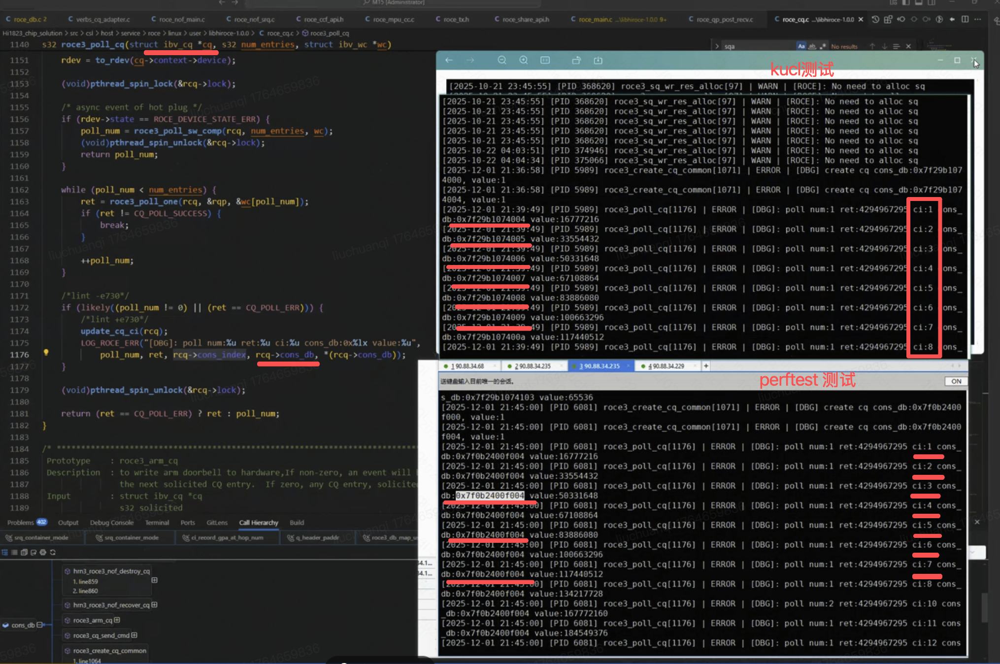
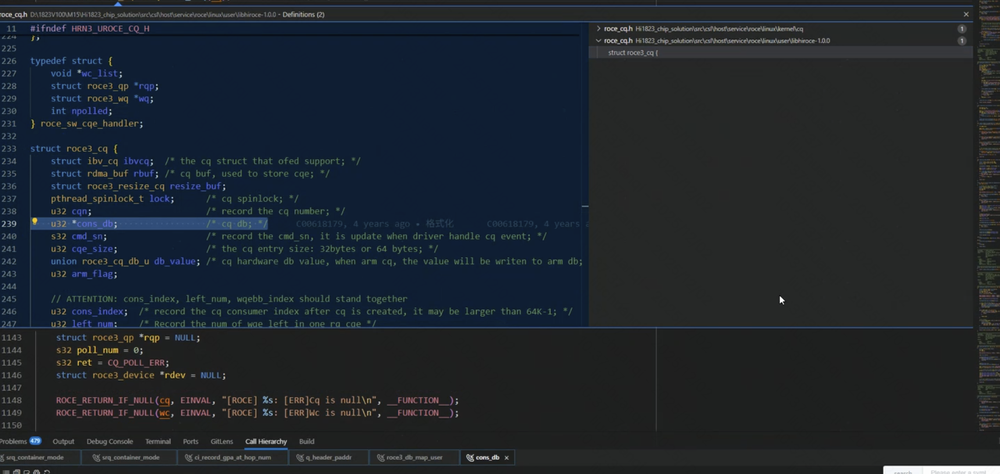

```table-of-contents
```
# 踩内存理解
踩内存 ≈ **非法写**，本质只有三类：

1. **写越界**
2. **Use-after-free**
3. **多线程并发写坏**

# 多线程读写
## “丢 bit”问题（数据竞争）

```c
#define STRUCT_A_FLAGS_1  (1u << 0)
#define STRUCT_A_FLAGS_2  (1u << 1)
#define STRUCT_A_FLAGS_3  (1u << 2)
#define STRUCT_A_FLAGS_4  (1u << 3)

struct A {
	...
	uint32_t flags;
	....
};
```

比如：结构体中的成员 flags， 通过 异或`|=`的方式设置某个`bit`。
全部代码中，都没有取消该`bit`的地方，但是发现该结构体中就是没有这个`bit`的设置。

程序中：`struct A`会创建多个，只是极少的情况下，某个实例的该`bit`没有被设置上，导致后续的逻辑错误。


原因：**多个线程对同一个 32-bit 字段执行 `read-modify-write`，而没有加锁或使用原子操作 → 发生数据竞争 (data race)。**
比如线程1正在设置`STRUCT_A_FLAGS_1`,同时线程2正在给同一个结构体设置`STRUCT_A_FLAGS_2`；
有可能出现线程2设置`STRUCT_A_FLAGS_2`没有成功的情况。

```bash
线程 A：flags |= (1 << 3);
线程 B：flags |= (1 << 7);

实际的 CPU 执行流程可能是：
Thread A: LOAD(flags = 0)
Thread B: LOAD(flags = 0)
Thread A: STORE(0b00001000)
Thread B: STORE(0b10000000)

最终 flags = 0x80（Bit7），Bit3被覆盖掉 → 丢 bit。
```


### 范例

```c
$ cat test_flags_race_print.c
#define _GNU_SOURCE
#include <stdio.h>
#include <stdint.h>
#include <pthread.h>
#include <unistd.h>
#include <sched.h>

volatile uint32_t g_flags = 0;

void bind_cpu(int cpu)
{
    cpu_set_t set;
    CPU_ZERO(&set);
    CPU_SET(cpu, &set);
    pthread_setaffinity_np(pthread_self(), sizeof(set), &set);
}

void* thread_set_bit(void* arg)
{
    uint32_t bit = (uint32_t)(uintptr_t)arg;
    pthread_t tid = pthread_self();

    bind_cpu(bit == (1U << 3) ? 0 : 1);

    while (1) {

        g_flags = 0;
        g_flags |= bit;

        // 立即检查
        uint32_t after = g_flags;
        if (!(after & bit)) {
            printf("[LOSS] Thread %lx: expected bit=0x%X but got=0x%X\n", tid, bit, after);
        }
    }
    return NULL;
}

int main()
{
    pthread_t t1, t2;

    pthread_create(&t1, NULL, thread_set_bit, (void*)(uintptr_t)(1U << 3));
    pthread_create(&t2, NULL, thread_set_bit, (void*)(uintptr_t)(1U << 7));

    pthread_join(t1, NULL);
    pthread_join(t2, NULL);

    return 0;
}

```


```bash
 gcc -O0 test_flags_race_print.c -o test_flags -lpthread

分析：
编译时用 `-O0` 关闭优化，避免编译器对内存操作做过度优化，增加竞态复现概率：

加上内存屏障和volatile（防止编译器乱优化）；`g_flags` 已经是 `volatile`，保证每次都从内存读写。


$ ./test_flags
[LOSS] Thread 7f874a3b8700: expected bit=0x8 but got=0x80
[LOSS] Thread 7f874a3b8700: expected bit=0x8 but got=0x0
[LOSS] Thread 7f87499b7700: expected bit=0x80 but got=0x0
[LOSS] Thread 7f87499b7700: expected bit=0x80 but got=0x0
[LOSS] Thread 7f87499b7700: expected bit=0x80 but got=0x0
[LOSS] Thread 7f874a3b8700: expected bit=0x8 but got=0x80
[LOSS] Thread 7f874a3b8700: expected bit=0x8 but got=0x0
[LOSS] Thread 7f87499b7700: expected bit=0x80 but got=0x0
[LOSS] Thread 7f874a3b8700: expected bit=0x8 but got=0x0
[LOSS] Thread 7f874a3b8700: expected bit=0x8 but got=0x80
[LOSS] Thread 7f87499b7700: expected bit=0x80 but got=0x0
[LOSS] Thread 7f874a3b8700: expected bit=0x8 but got=0x0
[LOSS] Thread 7f87499b7700: expected bit=0x80 but got=0x0
[LOSS] Thread 7f874a3b8700: expected bit=0x8 but got=0x0
[LOSS] Thread 7f87499b7700: expected bit=0x80 but got=0x0
[LOSS] Thread 7f87499b7700: expected bit=0x80 but got=0x0
```


## 验证手段

最简单的方法：
==就是在设置完了之后，立马通过assert来验证是否设置上==。
如果没有设置上，说明存在data race；另外一个重要的是，通过产生coredump，可以看到其他设置这个共享内存的线程运行到哪里，
进而在其之前，应该刚刚设置过了这个共享内存。

## 可用工具以及思路

|工具|可检测|优点|
|---|---|---|
|**Valgrind – Helgrind**|线程数据竞争|使用简单、误报少|
|**Valgrind – DRD**|数据竞争|更快、对锁敏感|
|**GCC/Clang ThreadSanitizer (TSan)**|数据竞争、原子问题|检测效果最强；现代优选|
|**AddressSanitizer + TSan 组合**|内存 + 同步错误|完整检测|
|**perf c2c（cache-to-cache）**|观察共享缓存争用|可辅助，但不能直接检测数据竞争|
|**strace / gdb**|不能直接查 race|不适用|


### Valgrind

#### 使用
```bash
gcc test_flags_race_print.c -o test_flags -lpthread

# valgrind --tool=helgrind ./test_flags
==581== Helgrind, a thread error detector
==581== Copyright (C) 2007-2017, and GNU GPL'd, by OpenWorks LLP et al.
==581== Using Valgrind-3.15.0 and LibVEX; rerun with -h for copyright info
==581== Command: ./test_flags
==581==
==581== ---Thread-Announcement------------------------------------------
==581==
==581== Thread #3 was created
==581==    at 0x5156ACE: clone (clone.S:74)
==581==    by 0x4E43059: do_clone.constprop.4 (createthread.c:74)
==581==    by 0x4E44569: create_thread (createthread.c:244)
==581==    by 0x4E44569: pthread_create@@GLIBC_2.2.5 (pthread_create.c:553)
==581==    by 0x4C30CEA: pthread_create_WRK (hg_intercepts.c:427)
==581==    by 0x4C31DC8: pthread_create@* (hg_intercepts.c:460)
==581==    by 0x4012D3: main (in /home/relay/liuchuanqi/test_flags)
==581==
==581== ---Thread-Announcement------------------------------------------
==581==
==581== Thread #2 was created
==581==    at 0x5156ACE: clone (clone.S:74)
==581==    by 0x4E43059: do_clone.constprop.4 (createthread.c:74)
==581==    by 0x4E44569: create_thread (createthread.c:244)
==581==    by 0x4E44569: pthread_create@@GLIBC_2.2.5 (pthread_create.c:553)
==581==    by 0x4C30CEA: pthread_create_WRK (hg_intercepts.c:427)
==581==    by 0x4C31DC8: pthread_create@* (hg_intercepts.c:460)
==581==    by 0x4012B8: main (in /home/relay/liuchuanqi/test_flags)
==581==
==581== ----------------------------------------------------------------
==581==
==581== Possible data race during write of size 4 at 0x404058 by thread #3
==581== Locks held: none
==581==    at 0x40124C: thread_set_bit (in /home/relay/liuchuanqi/test_flags)
==581==    by 0x4C30EDE: mythread_wrapper (hg_intercepts.c:389)
==581==    by 0x4E43EA4: start_thread (pthread_create.c:307)
==581==    by 0x5156B0C: clone (clone.S:111)
==581==
==581== This conflicts with a previous write of size 4 by thread #2
==581== Locks held: none
==581==    at 0x40124C: thread_set_bit (in /home/relay/liuchuanqi/test_flags)
==581==    by 0x4C30EDE: mythread_wrapper (hg_intercepts.c:389)
==581==    by 0x4E43EA4: start_thread (pthread_create.c:307)
==581==    by 0x5156B0C: clone (clone.S:111)
==581==  Address 0x404058 is 0 bytes inside data symbol "g_flags"
==581==
^C==581==
==581== Process terminating with default action of signal 2 (SIGINT)
==581==    at 0x4E45017: pthread_join (pthread_join.c:90)
==581==    by 0x4C2DF81: pthread_join_WRK (hg_intercepts.c:553)
==581==    by 0x4C31DD3: pthread_join (hg_intercepts.c:572)
==581==    by 0x4012E4: main (in /home/relay/liuchuanqi/test_flags)
==581==
==581== Use --history-level=approx or =none to gain increased speed, at
==581== the cost of reduced accuracy of conflicting-access information
==581== For lists of detected and suppressed errors, rerun with: -s
==581== ERROR SUMMARY: 3 errors from 1 contexts (suppressed: 1 from 1)


分析：
如上所示：
	Possible data race during write of size 4 at 0x404058 by thread #3
	This conflicts with a previous write of size 4 by thread #2	
```

#### 缺点
可能对于DPDK程序，不太适用。

### mprotest
#### 问题
##### 为什么大页(比如:2M的大页)的内存踩踏特别难查

你这个场景有几个“debuff”叠加：

（1）**2M Hugepage**
    - 粗粒度
    - 一页里可能放了很多对象
    - 越界写不会立刻 SIGSEGV

（2）**用户态高性能程序**
    - DPDK / RDMA
    - 大量 `memcpy / rte_memcpy`
    - OOB（越界）后还能“正常跑”

（3）**ASAN / Valgrind 不好用**
    - 不支持 hugepage
    - 性能不可接受
    - 甚至直接跑不起来


#### 思路
- **策略**：将你怀疑“被踩”的那块大页内存设置为 **只读（PROT_READ）**。
- **效果**：任何企图修改这段内存的代码（即“凶手”）都会立即触发一个 **SIGSEGV（段错误）**。
- **定位**：通过捕获`SIGSEGV`信号或分析 Core Dump，你可以直接通过函数调用栈（Backtrace）锁定那一行的写操作。
当程序崩溃时，你可以使用 GDB 运行或分析 Core 文件：
```bash
GDB 实时捕获：程序会停在发生非法写入的那一行。
Backtrace：输入 `bt` 查看完整的调用链路。
```

#### 原理
**问题**
mprotect 如果是2个进程共享同一个物理内存，在2个进程中看到的虚拟地址不一样。其中一个进程使用mprotect 进行保护这块物理内存为只读，另外一个进程写这块物理内存，是否会coredump？


**不会。**
这是因为 `mprotect` 作用的对象是进程的页表（Page Table），而不是物理内存本身。页表是per 进程的。

**核心原理：虚拟内存的隔离性**

在 Linux 中，物理内存（Physical RAM）通过页表映射到每个进程的虚拟地址空间。虽然两个进程指向同一个物理内存页，但它们各自拥有的页表项（PTE - Page Table Entry）是独立存储和管理的。
```bash

- 进程 A：
执行 `mprotect(addr_a, len, PROT_READ)`。内核会修改进程 A 的页表，将 `addr_a` 对应的页表项标记为“只读”。如果进程 A 尝试写，CPU 会触发异常，进程 A 收到 `SIGSEGV`。


- 进程 B：
其页表项中 `addr_b` 的权限依然是 `PROT_READ | PROT_WRITE`（假设初始是可写的）。当进程 B 写入该内存时，CPU 检查的是进程 B 的页表。既然进程 B 的页表允许写入，操作就会成功执行，数据会被写入物理内存。
```

==物理内存本身并没有“只读”或“读写”的属性，这些属性是由 CPU 的 MMU（内存管理单元） 在查找页表时强制执行的==。

进程 A 看到的物理内存：通过它的虚拟地址访问时，被 MMU 限制为只读。
进程 B 看到的物理内存：通过它的虚拟地址访问时，MMU 认为可以写入。

因此：如果你是通过 `mmap` 的 `MAP_SHARED` 方式映射的：
进程 A 使用 `mprotect` 只能保护它自己不去写这块内存，类似于“自我约束”。
它完全无法阻止进程 B 修改这块内存。一旦进程 B 修改了，进程 A 下次读取时，会发现内容已经变了（因为物理页是同一个）。

##### 范例

这种机制的典型应用：写时复制 (Copy-On-Write, COW)

这种“同一物理页在不同进程中权限不同”的机制正是 `fork()` 的基础：
```bash
- `fork()` 之后，父子进程共享物理页面。
- 内核将双方的页表项都设为 `PROT_READ`。
- 只有当其中一个进程尝试写时，才会触发异常，由内核执行真正的物理内存拷贝，并恢复该进程的写权限。
```

#### 使用


#### 缺陷
##### 起始地址是页大小的整数倍
（1）`mprotect` 要求起始地址必须是页面大小的整数倍。对于2M的大页，地址必须是 **2MB (0x200000)** 对齐。

#### 范例
##### 大页内存下的mprotect

- **粒度问题**：
`mprotect` 的最小粒度是一个页面。在`2M`的大页场景下，你只能以 **2MB** 为单位进行保护。如果你只想监控 2MB 中的某几个字节，你需要把整个 2MB 都设为只读。这意味着**合法的写入也会被拦截**。

###### 普通设置
```c
    uint64_t i, size;
    uint64_t pagesize = 2 * 1024 * 1024;  // 2M的大页
    struct ucl_conn *new_conn;

    fdtable.fds = rte_ring_create("fdarray", kcontext.skconn_max_fds,
                                  SOCKET_ID_ANY, 0);
    if (!fdtable.fds) {
        return -1;
    }

    size = ucl_conn_SIZE * (kcontext.skconn_max_fds - 1);
    size += pagesize; // 前面追加哨兵
    size = (((size) + (pagesize)-1) & ~((pagesize)-1)); // 2M 对齐

    new_conn = (struct ucl_conn *)rte_zmalloc("fdtable", size,
                                               RTE_CACHE_LINE_SIZE); // new_conn 是cacheline 对齐，不一定是 2M大页对齐；
    if (!new_conn) {
        return -1;
    }
    fdtable.table =
        (struct ucl_conn *)(((uintptr_t)(new_conn) + (pagesize)-1) &
                             ~((pagesize)-1)); // 设置为 2M大页对齐

    protect_addr = (uint8_t *)fdtable.table;
    fdtable.table = (struct ucl_conn *)(protect_addr + pagesize);
    mprotect((void *)protect_addr, pagesize, PROT_READ);

    UCL_LOG_INFO("kconn_init: protect_addr:%p, fdtable.table:%p, new_conn:%p, "
                  "fdtable.size:%ld, pagesize:%ld",
                  protect_addr, fdtable.table, new_conn, size, pagesize);
                  
    for (i = 1; i < kcontext.skconn_max_fds; i++) {
        struct ucl_conn *conn = ucl_conn_GET_BY_INDEX(fdtable.table, i - 1);
        conn->fd = 0;
        rte_ring_enqueue(fdtable.fds, (void *)i);
    }
```

###### 分段排查法

- **业务逻辑适配**：
如果这块内存是纯配置数据，设置只读后观察即可。
如果这块内存本就需要频繁读写，你需要采用 **“分段排查法”**：在业务逻辑的间隙（如处理完一个报文后）开启保护，在下一个合法写入点前解除保护（`PROT_READ | PROT_WRITE`）。

##### 绕开大页内存（mmap + guard page： 哨兵页）后的mprotect
```bash
[ guard page ][ object ][ guard page ]
```

### assert：变量设置完了之后立马assert检查
#### 思路
==就是在设置完了之后，立马通过assert来验证是否设置上==。
如果没有设置上，说明存在data race；另外一个重要的是，通过产生coredump，可以看到其他设置这个共享内存的线程运行到哪里，
进而在其之前，应该刚刚设置过了这个共享内存。

#### 使用
```bash
# diff -urN test_flags_race_print_new.c test_flags_race_print.c
--- test_flags_race_print_new.c	2025-12-02 22:03:12.367018226 +0800
+++ test_flags_race_print.c	2025-12-02 21:48:08.526726558 +0800
@@ -4,7 +4,6 @@
 #include <pthread.h>
 #include <unistd.h>
 #include <sched.h>
-#include <assert.h>

 volatile uint32_t g_flags = 0;

@@ -27,7 +26,6 @@

         g_flags = 0;
         g_flags |= bit;
-        assert(g_flags & bit);

         // 立即检查
         uint32_t after = g_flags;


# gcc -g test_flags_race_print_new.c -o test_flags -lpthread

# ./test_flags
test_flags: test_flags_race_print_new.c:30: thread_set_bit: Assertion `g_flags & bit' failed.
Aborted (core dumped)

```

gdb 查看：
```bash
# gdb ./test_flags /data/coredump/core-1764684303-0-0-6-10709-test_flags
(gdb) bt
#0  0x00007ff68b816387 in __GI_raise (sig=sig@entry=6) at ../nptl/sysdeps/unix/sysv/linux/raise.c:55
#1  0x00007ff68b817a78 in __GI_abort () at abort.c:90
#2  0x00007ff68b80f1a6 in __assert_fail_base (fmt=0x7ff68b96af60 "%s%s%s:%u: %s%sAssertion `%s' failed.\n%n", assertion=assertion@entry=0x40202c "g_flags & bit",
    file=file@entry=0x402010 "test_flags_race_print_new.c", line=line@entry=30, function=function@entry=0x402078 <__PRETTY_FUNCTION__.3867> "thread_set_bit") at assert.c:92
#3  0x00007ff68b80f252 in __GI___assert_fail (assertion=0x40202c "g_flags & bit", file=0x402010 "test_flags_race_print_new.c", line=30, function=0x402078 <__PRETTY_FUNCTION__.3867> "thread_set_bit") at assert.c:101
#4  0x000000000040129b in thread_set_bit (arg=0x80) at test_flags_race_print_new.c:30
#5  0x00007ff68bbb5ea5 in start_thread (arg=0x7ff68adde700) at pthread_create.c:307
#6  0x00007ff68b8deb0d in clone () at ../sysdeps/unix/sysv/linux/x86_64/clone.S:111
(gdb) f 4
#4  0x000000000040129b in thread_set_bit (arg=0x80) at test_flags_race_print_new.c:30
30	        assert(g_flags & bit);
(gdb) list
25
26	    while (1) {
27
28	        g_flags = 0;
29	        g_flags |= bit;
30	        assert(g_flags & bit);
31
32	        // 立即检查
33	        uint32_t after = g_flags;
34	        if (!(after & bit)) {

```

```bash
如下所示：

出现coredump的时候，查看其他的线程在哪里，在此之前应该是该线程设置了这个flags。

(gdb) info threads
  Id   Target Id                         Frame
* 1    Thread 0x7ff68adde700 (LWP 10711) 0x000000000040129b in thread_set_bit (arg=0x80) at test_flags_race_print_new.c:30
  2    Thread 0x7ff68b7df700 (LWP 10710) thread_set_bit (arg=0x8) at test_flags_race_print_new.c:28
  3    Thread 0x7ff68bfcf740 (LWP 10709) 0x00007ff68bbb7017 in pthread_join (threadid=140696878970624, thread_return=0x0) at pthread_join.c:90
* 
(gdb) thread 2
[Switching to thread 2 (Thread 0x7ff68b7df700 (LWP 10710))]
#0  thread_set_bit (arg=0x8) at test_flags_race_print_new.c:28
28	        g_flags = 0;

(gdb) bt
#0  thread_set_bit (arg=0x8) at test_flags_race_print_new.c:28
#1  0x00007ff68bbb5ea5 in start_thread (arg=0x7ff68b7df700) at pthread_create.c:307
#2  0x00007ff68b8deb0d in clone () at ../sysdeps/unix/sysv/linux/x86_64/clone.S:111

(gdb) f 0
#0  thread_set_bit (arg=0x8) at test_flags_race_print_new.c:28
28	        g_flags = 0;

(gdb) list
23
24	    bind_cpu(bit == (1U << 3) ? 0 : 1);
25
26	    while (1) {
27
28	        g_flags = 0;
29	        g_flags |= bit;
30	        assert(g_flags & bit);
31
32	        // 立即检查
```

### gdb的watch
#### 思路
通过gdb的watch，在每次访问（读写）这个内存地址的内容时，都会gdb停下来。

#### 缺点：gdb的watch使用的DR寄存器个数有限
如果一个程序中，某个结构有多份，比如，存在多个`conn`, 可能多个线程对于 conn这个结构体中的 flags 进行操作，不同的线程设置不同的bit位。

实际每次出现错误的时候，不知道是哪个conn的flags出现了错误。并且，后续该flags可能还是会被多次的读和多次的写（后续的写可能都是单个线程的写）。

那么：
（1）由于不知道是哪个conn发生了错误。所以，watch不太容易看具体的 哪个地址。
（2）后续conn中的flags，还是存在读和写，watch还是会观察到。

# 踩内存
## 现象
结构体中某个成员的值 非预期，但是直接看代码，没有发现设置这个非预期值的地方。

## 验证手段
（1）不停的调整结构中某个成员的位置，看是否出现上面的问题。
（2）在结构体中该成员的前后，增加一些魔数，代码中不存在更改该魔数的值，程序中检查该魔数的值是否发生变更。


## 可用工具以及思路

### `userfaultfd`（缺页异常）
#### 介绍
它允许一个进程在用户态接管“缺页异常（Page Fault）”。

#### 原理


## 其他
### 滥用联合体导致踩内存的问题
联合体最容易出踩内存的问题了。因为，一旦联合体的使用方式不对，就会出现踩内存的情况。

#### 范例
```c
strcut rdma_conn {
	union {
		struct { // 挂载到epoll_conn中的普通的conn使用；
			struct rdma_qp* qp;
			int send_uncompleted;
		};
		
		strcut { // epoll_conn 使用，每个线程一个epoll_conn;
			struct {
				struct ibv_cq* cq;
				struct ibv_comp_channel* channel;
			} rdma_cq;
		};
	};
};

struct rdma_qp {
	struct ibv_qp* ib_qp;
	int qp_type;
	struct rdma_stats_t stats;
};


```

#### 现象
同样的一套代码(基于libibverbs的程序)，在Mellanox网卡上测试正常，在华为网卡上测试总是出现CQ的错误（主要是CQ溢出的错误）。
但是perftest程序，在华为网卡上，测试又是没有问题的。



#### 分析

如下所示，是华为的`ibverbs`的用户态驱动(即`rdma-core`中华为的`provider`) 中 `cq`的结构。
`ibv_cq`成员作为`roce3_cq`的第一个成员，后面的是`hw`自己`cq`的私有数据。



```bash
● 概念
cq: 完成队列；硬件作为生产者，软件作为消费者。
ci：华为rdma用户态驱动中 cq的消费者索引值(consumer index)。用户每次`poll_cq`时，该值+n「n为poll到的cqe的个数，此中每次可能是1」；
pi: cq的生产者索引。
cons_db: 华为网卡用户态驱动中，存储ci的值的指针，驱动将该指针指向的值下发到硬件cq中。

● 原理
正常情况下，cons_db 作为一个指针，其自身的值是不应该发生变化的，其指向的内存的值才应该是在poll_cq时，每次自增。

● 现象
perftest测试华为网卡是正常的；
ucl测试华为网卡是异常的：主要是因为每次 cons_db 都自增了1，即地址出错了，导致写入到硬件的ci的值都是0，进而出现了cq溢出的问题。
cons_db的值每次自增和某个统计计数每次自增1很像。

● 原因
就是：误将epoll_conn当成是普通的conn来使用，就会错误使用conn结构体中的 union中的qp。
由于该qp指向了cq的地址空间，进行统计计数时，出现了踩cq的内存的问题。
```

#### 小结
对于一个结构体中出现了联合体`union`时，其使用一定要注意。
因为，==联合体`union`中成员共享同一个内存空间。如果错误的使用了联合体的成员，可能会导致踩内存==。

# 踩内存范例：结构体中间的某个成员被踩
## 问题
```bash
场景：
  - DPDK mempool，成千上万个元素，活跃使用中约 100 个
  - 线程 B 计算出错误指针，踩到了线程 A 持有的某个 elem 中的某个成员
  - 哪个 elem 被踩，运行前完全不知道
  - 被踩的成员前后成员均完好（只有单一成员被踩）

核心需求：
  - 踩内存的那一刻同步捕获现场（踩内存的线程 B 的调用栈）
  - DPDK 使用大页（2MB/1GB hugepage）
```


## 问题分析

## 方案分析
### DR 寄存器(调试寄存器: Debug registers)
X86寄存器有如下：
```bash
①8个通用寄存器：EAX,EBX,ECX,EDX,ESI,EPI,ESP.EBP
②1个标志寄存器：EFLAGS
③6个段寄存器：CS,DS,ES,FS,GS,SS
④5个控制寄存器：CR0,CR1,CR2,CR3,CR4
⑤8个调试寄存器：DR0,DR1,DR2,DR4,DR5,DR6,DR7
⑥4个系统地址寄存器：GDTR,IDTR,LDTR,TR
```

在x86架构CPU内部，提供了**8个调试寄存器DR0~DR7**。调试寄存器主要作用是调试应用代码、系统代码、开发多任务操作系统.来监视代码的运行和处理器的性能。


```bash
DR0 ← 断点地址 0
DR1 ← 断点地址 1
DR2 ← 断点地址 2
DR3 ← 断点地址 3
DR6 ← 状态寄存器（哪个断点触发了）
DR7 ← 控制寄存器（每个断点的启用/类型/长度）
```

这 8 个寄存器通常成组使用：
- **DR0 - DR3 (线性地址寄存器)：**
    - 存储 4 个断点的线性地址。
    - 在 64 位模式下，这些寄存器保存 64 位有效地址。
- **DR4 - DR5 (保留)：**
    - 通常保留。当 `CR4` 寄存器中的 `DE` (Debugging Extensions) 位被置 1 时，访问 DR4/DR5 会产生异常。
- **DR6 (调试状态寄存器)：**
    - 报告调试异常的来源。当断点触发时，DR6 的特定位会被置位，告诉调试器是哪个断点（DR0-DR3）被触发。
- **DR7 (调试控制寄存器)：**
    - 控制断点的启用/禁用。
    - 定义断点类型：执行断点（Execution）、写入断点（Data Write）、读写断点（Data Read/Write）。
    - 定义断点监控的长度（1、2、4 或 8 字节）。

**工作流程**；
```bash
1. 把目标地址写入 DR0~DR3（任意一个空闲的）
2. 在 DR7 中配置该断点为"写触发"+ 长度
3. 使能该断点（DR7 对应使能位置 1）

CPU 执行每条指令后，检查：
  如果有内存写操作，且写入地址落在 DRn 指定的范围内
      → 设置 DR6 中的对应标志位
      → 产生 Debug 异常（INT 1 / #DB）
      → OS 将其转换为 SIGTRAP 发给当前线程
      → 精确到踩内存的那条指令
```

**约束**：
```bash
每个线程只有 4 个可用断点（DR0~DR3）
每个断点只能监控连续的 1/2/4/8 字节
DR 寄存器是每 CPU 核心独立的，线程切换时由 OS 保存/恢复
用户态可以通过 ptrace(PTRACE_POKEUSER) 或 perf_event_open 设置
```


#### 硬件 watchpoint（ DR 寄存器）

**原理**：对目标成员地址设写断点，CPU 写入时同步触发 SIGTRAP，精确到指令。

**致命缺陷**：x86 每线程只有 **4 个 DR 寄存器可用**，100 个活跃元素 >> 4，根本放不下。轮换监控虽然理论可行，但实现复杂且覆盖率是概率性的，不能保证命中。

**结论**： 单独使用不可行，100 个活跃元素场景下无解。

#### GDB watchpoint 方案
GDB 的 watchpoint 本质上也走 DR 寄存器
GDB 的 watch 命令在 x86 底层就是设 DR0~DR3，所以**同样受 4 个的限制**。唯一的区别是 GDB 有一个"软件 watchpoint"的 fallback：
```bash
(gdb) watch -location some_var   # 硬件 watchpoint，受限4个
(gdb) watch some_var             # 软件 watchpoint（fallback）
```

**软件 watchpoint 的原理**：GDB 在每条指令执行后单步检查目标地址的值有没有变化，相当于每条指令都做一次内存比较。

**问题**：DPDK 程序是 busy-poll 的，每秒执行数十亿条指令，软件 watchpoint 会使程序**慢到完全无法运行**（慢 1000x 以上），根本无法复现正常的并发行为，所以 GDB 软件 watchpoint 在这个场景下实际不可用。

GDB 硬件 watchpoint 的价值：如果你通过 Canary 或 Intel PT 已经锁定了是"某个特定元素的这个 offset"，下次复现时，只对这一个已知地址设硬件 watchpoint，4 个完全够用，反而是最简单的最终确认手段。

#### debugfs ftrace
**ftrace uprobe**：只能在函数入口/出口打点，无法监控任意内存地址的写入。

#### 缺陷

**原理**：对目标成员地址设写断点，CPU 同步触发 SIGTRAP，精确到踩内存的那条指令。
**致命缺陷**：x86 每线程只有 **4 个 DR 寄存器**可用，100 个活跃元素远超上限，无法覆盖全部。

### mprotect 只读陷阱（关大页，改 allocator）

mprotect 保护的是一个整页(只能基于整页设置属性，不可以基于某个成员大小来设置属性)，也就是某个字段单独放入到一个页中，然后设置只读。
由于之前，结构体之间的成员的内存是紧凑的，互相挨着的，现在如果给某个成员放入到一个整页中，会导致前面的成员会有padding，那么再次踩内存可能就踩了padding内存部分，而不是放入到单独页的成员了。导致问题无法复现了。

比如：

```bash
原始布局（紧凑排列）：
	[member_a: offset 0~47]
	[suspect: offset 48~63] ← 被踩的成员，offset=48
	[member_c: offset 64~...]

线程B 的错误计算：
	wrong_ptr = some_base + wrong_delta
	→ 恰好命中 offset=48 这个位置 → 踩中 suspect

注：线程 B 的错误指针，未必是通过 struct 内部 offset 计算出来的。这个指针值直接就是一个错误的绝对地址，和 struct 的布局根本没关系。
改变 struct 布局 → suspect 成员的绝对地址变了
	→ 线程B 的错误绝对地址不再指向 suspect 成员
	→ 踩内存位置发生了变化（可能踩别处，可能不踩任何有效数据）
	→ bug 无法复现
```

为了用 mprotect 保护 suspect，需要让它独占一个 4KB 页，就必须在它前面加 padding 对齐：

```bash
调整后布局（为了 mprotect 对齐）：
	[member_a: offset 0~47]
	[padding:  offset 48~4095]  ← 补了 4048 字节的 padding
	[suspect:  offset 4096~4111] ← 现在独占一页，offset 变成了 4096
	[member_c: offset 4112~...]

线程B 同样的错误计算：
	wrong_ptr = some_base + wrong_delta
	→ 命中 offset=48 这个位置 → 踩中的是 padding，不是 suspect
	→ mprotect 的保护页没有被触发
	→ SIGSEGV 不发生
	→ bug "消失了"
```

### 巡检线程

**原理**：在目标成员前后插 magic 值，另起线程定时扫描所有元素检查 canary 是否被破坏。

**致命缺陷**：无法精确抓现场。
信号是异步的——巡检线程检测到损坏时，施害线程 B 早已跑了 N 条指令甚至被调度走。只能知道"有人踩了"，无法拿到施害者的调用栈。

**结论**：无法精确定位，只能作为"发现问题"的辅助手段，不能作为"抓现场"的方案。

### 最后方案

#### Intel PT 离线过滤（推荐，零侵入）
Intel PT（Processor Trace）是 Intel 硬件提供的**指令级追踪**，全程记录 CPU 执行路径。以极低开销**全程录制所有指令的执行轨迹**，保存在环形缓冲区中。**完全不修改任何内存布局**，bug 正常发生，事后回放录像找到踩内存的那条指令。


|约束|Intel PT 的应对|
|---|---|
|不改内存布局|✅ 纯硬件录制，零侵入|
|活跃 100 个元素|✅ 录制全部指令，没有数量限制|
|需要精确到指令|✅ 指令级时序还原|
|事先不知道哪个 elem 被踩|✅ 事后按条件过滤|

**巡检线程**：Canary 损坏 → 确认"发生了踩内存" → 触发保存 PT trace → 事后分析。
当 Canary 检测到被踩后（巡检线程发现的，有延迟检测也没关系），PT 已经录下了整个时间段内所有线程的完整指令执行序列。通过 PT 解码可以精确找到向该地址写入的指令。

```bash
# 步骤1：启动时开启 PT 录制（环形缓冲，内存开销可控）
perf record -e intel_pt//u --snapshot -m,64M -p $(pidof your_binary) &

# 步骤2：程序运行，bug 正常发生
# （内存布局完全未变，踩内存正常发生，PT 在后台默默录制）

# 步骤3：检测到异常后（Canary末尾检测，或程序崩溃），保存 PT 快照
kill -USR2 $perf_pid

# 步骤4：解码 PT trace，用过滤条件精确找到踩内存指令
perf script --itrace=m64 | awk -F: '{print $NF}' | python3 filter.py
```

解码 PT trace时的过滤条件。
```python
# filter.py
POOL_BASE    = 0x7f0000000000  # 运行时从 /proc/pid/maps 获取
ELEM_SIZE    = 256             # 你的 struct 大小
MEMBER_OFFSET = 48             # suspect_member 的 offset

for line in sys.stdin:
    addr = parse_addr(line)
    if POOL_BASE <= addr < POOL_BASE + POOL_SIZE:
        offset = (addr - POOL_BASE) % ELEM_SIZE
        if offset == MEMBER_OFFSET:
            print(f"HIT: {line}")
```

#### perf_event（硬件 watchpoint）+ BPF 联动采集（概率命中）

##### ebpf的能力

|能力|说明|
|---|---|
|uprobe|在用户态函数入口/出口执行 BPF 程序|
|perf_event + BPF|在 perf 事件触发时执行 BPF 程序|
|采集调用栈|bpf_get_stackid() 可以拿到用户态/内核态调用栈|
|读取寄存器|可以读取触发时的 PT_REGS（rip、rsp、rbp 等）|
|高频无锁输出|bpf_perf_event_output() 输出到 ring buffer|

**eBPF 无法直接监控"任意用户态地址被写入"**。原因：
```bash
内核 kprobe/uprobe 只能在"函数边界"挂钩
eBPF 没有"地址写入监控"的 hook 点

唯一能监控地址写入的硬件机制 = DR 寄存器（watchpoint）
perf_event_open + BPF 的组合，底层仍然用的是 DR 寄存器 → 仍然受 4 个的限制
```
所以 eBPF **本身不能直接实现"无限制地址监控"**，它的价值在于**配合其他机制提供更丰富的上下文**。


##### 具体方案

**原理**：用 perf_event_open 设置硬件 watchpoint（DR 寄存器），即设置一个地址的写断点，在触发时挂载 eBPF 程序执行过滤逻辑，在触发时不仅记录地址，还运行 BPF 程序采集完整的多线程上下文；不满足则放行（修改 watchpoint 到下一个候选地址）。

mempool 的内存是**连续的**，每个元素大小**固定**，因此 suspect 成员在每个元素中的偏移量是固定的。所有 suspect 成员的地址构成一个**等差数列**：

```bash
suspect 成员的合法地址集合：
	{ pool_base + member_offset,
	pool_base + elem_size + member_offset,
	pool_base + 2 * elem_size + member_offset,
	... }

等价过滤条件：
	addr ∈ [pool_base, pool_base + pool_size) && (addr - pool_base) % elem_size ∈ [member_offset, member_offset + member_size)
```

**整体流程**：
```bash
初始化：
  watchpoint → pool_base + member_offset（第 0 个元素）

触发流程：
  write 命中 watchpoint
      ↓
  eBPF 程序：
      offset = (fault_addr - pool_base) % elem_size
      if offset == member_offset:
          bpf_get_stackid() → 输出调用栈
      // 无论是否命中，更新 watchpoint 到下一个元素
      next_addr = fault_addr + elem_size
      update_watchpoint(next_addr)
```

**特点**：
- 运行时即时响应，不需要保存 trace 文件
- 仍受 DR 寄存器限制（同时只能保护 1 个元素），但通过滚动换位可以最终覆盖全部
```bash
watchpoint 仍受 DR 限制，根本上无法同时保护 100 个元素，只能轮换
```
- ==命中概率==取决于踩内存频率与轮换速度的比值
```bash
命中是概率性的, 踩内存频率低时可能需要很长时间才能捕获
```


**说明**：
```bash
eBPF 的本质定位：
  eBPF 是"信息采集增强器"，不是"监控触发器"

  触发器：必须是硬件机制（DR 寄存器 / page fault）
  增强器：触发后，BPF 程序可以做比 signal handler 更多的事

  单独的 eBPF ≠ 完整方案
  eBPF + (DR watchpoint 或 内核模块页表钩子) = 完整方案
```

# 内存问题的整体排查流程
## 先确定是什么内存问题
### 多申请一部分内存
在申请内存的时候，多申请一部分内存，有2种方法：
（1）在结构体的前后多申请一部分内存空间。
（2）在结构体中，重要字段的前后添加几个字段。

多申请出的一部分内存空间中，可以添加魔数，添加flag标记，正常情况下，设置完了之后，就不会再更改。

### 踩内存问题
多申请出的一部分内存空间中，可以添加魔数。

**设置时机**：内存申请之后，就进行设置魔数。
**检测时机**：在内存释放的时候，检查这块魔数的值 是否发生变化。一旦存在变化

### double-free问题
对于预申请的内存空间（比如：mempool申请的内存），这种内存即使释放了，也不会还给系统，而是还在在应用程序中管理，对于释放的内存，即使访问这块内存也不会有问题。

在申请内存时，多申请出的一部分内存空间中，可以添加 flags标记。

**清除时机**：申请内存时， 去掉free标记。
**设置时机**：释放内存时，就进行设置free标记。
**检测时机**：释放内存时，检查free标记是否存在，如果存在，就是double-free。

### UAF(use-after-free问题)

对于UAF的问题，如果释放之后，继续访问，但是还没有到释放，此时就没到检测时机，可能没法检测。
此时，需要参考 ASAN的机制，也就是设置影子内存，每访问一块内存空间的时候，都替换为含有影子内存的检测。

那个需要代码级别的替换。

## 踩内存问题的排查


# 参考
```bash
# 工欲善其事必先利其器——AddressSanitizer
https://zhuanlan.zhihu.com/p/382994002

```