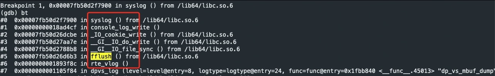

# 背景
DPDK中提供了打印日志的接口，rte_log ，如果DPDK应用程序是多线程，多个线程同时调用 rte_log 进行日志打印，则性能相对来说会下降很多。

# 原因

## rte_vlog
```c
int
rte_log(uint32_t level, uint32_t logtype, const char *format, ...)
{
	va_list ap;
	int ret;

	va_start(ap, format);
	ret = rte_vlog(level, logtype, format, ap);
	va_end(ap);
	return ret;
}

int
rte_vlog(uint32_t level, uint32_t logtype, const char *format, va_list ap)
{
	FILE *f = rte_log_get_stream();
	int ret;
	
	if (logtype >= rte_logs.dynamic_types_len)
		return -1;
	if (!rte_log_can_log(logtype, level))
		return 0;
	/* save loglevel and logtype in a global per-lcore variable */
	RTE_PER_LCORE(log_cur_msg).loglevel = level;
	RTE_PER_LCORE(log_cur_msg).logtype = logtype;
	ret = vfprintf(f, format, ap);
	fflush(f);
	return ret;
}

int
rte_eal_log_init(const char *id, int facility)
{
    FILE *log_stream;

    log_stream = fopencookie(NULL, "w+", console_log_func);
    if (log_stream == NULL)
        return -1;

    openlog(id, LOG_NDELAY | LOG_PID, facility);

    eal_log_set_default(log_stream);

    return 0;
}


static ssize_t
console_log_write(__rte_unused void *c, const char *buf, size_t size)
{
    ssize_t ret;

    /* write on stdout */
    ret = fwrite(buf, 1, size, stdout);
    fflush(stdout);

    /* Syslog error levels are from 0 to 7, so subtract 1 to convert */
    syslog(rte_log_cur_msg_loglevel() - 1, "%.*s", (int)size, buf);

    return ret;
}

static cookie_io_functions_t console_log_func = {
    .write = console_log_write,
};

```
## vfprintf

```c
int
vfprintf(FILE *fp, const char *fmt0, __va_list ap)

{

	int ret;
	
	FLOCKFILE(fp);
	ret = __vfprintf(fp, fmt0, ap);
	FUNLOCKFILE(fp);
	return (ret);

}

void
flockfile(FILE * fp)
{
    LockTable*  t = lock_table_lock();
    if (t != NULL) {
        FileLock**  lookup = lock_table_lookup(t, fp);
        FileLock*   lock   = *lookup;
        if (lock == NULL) {
            pthread_mutexattr_t  attr;
            /* create a new node in the hash table */
            lock = malloc(sizeof(*lock));
            if (lock == NULL) {
                lock_table_unlock(t);
                return;
            }
            lock->next        = NULL;
            lock->file        = fp;
            pthread_mutexattr_init(&attr);
            pthread_mutexattr_settype(&attr, PTHREAD_MUTEX_RECURSIVE);
            pthread_mutex_init( &lock->mutex, &attr );
            *lookup           = lock;
        }
        lock_table_unlock(t);
        /* we assume that another thread didn't destroy 'lock'
        * by calling fclose() on the FILE*. This can happen if
        * the client is *really* buggy, but we don't care about
        * such code here.
        */
        pthread_mutex_lock(&lock->mutex);
    }
}

static LockTable*      _lockTable;
static pthread_once_t  _lockTable_once = PTHREAD_ONCE_INIT;

static void
lock_table_init( void )
{
    _lockTable = malloc(sizeof(*_lockTable));
    if (_lockTable != NULL) {
        pthread_mutex_init(&_lockTable->lock, NULL);
        memset(_lockTable->buckets, 0, sizeof(_lockTable->buckets));
    }
}

static LockTable*
lock_table_lock( void )
{
    pthread_once( &_lockTable_once, lock_table_init );
    pthread_mutex_lock( &_lockTable->lock );
    return _lockTable;
}

```

## fflush
```c
/* Flush a single file, or (if fp is NULL) all files.  */
int
fflush(FILE *fp)
{
    if (fp == NULL)
        return (_fwalk(__sflush));
    if ((fp->_flags & (__SWR | __SRW)) == 0) {
        errno = EBADF;
        return (EOF);
    }
    return (__sflush(fp));
}

int
__sflush(FILE *fp)
{
    unsigned char *p;
    int n, t;
    t = fp->_flags;
    if ((t & __SWR) == 0)
        return (0);
    if ((p = fp->_bf._base) == NULL)
        return (0);
    n = fp->_p - p;     /* write this much */
    /*
     * Set these immediately to avoid problems with longjmp and to allow
     * exchange buffering (via setvbuf) in user write function.
     */
    fp->_p = p;
    fp->_w = t & (__SLBF|__SNBF) ? 0 : fp->_bf._size;
    for (; n > 0; n -= t, p += t) {
        t = (*fp->_write)(fp->_cookie, (char *)p, n);
        if (t <= 0) {
            fp->_flags |= __SERR;
            return (EOF);
        }
    }
    return (0);
}

typedef struct __sFILE {
    unsigned char *_p;  /* current position in (some) buffer */
    int _r;     /* read space left for getc() */
    int _w;     /* write space left for putc() */
    short   _flags;     /* flags, below; this FILE is free if 0 */
    short   _file;      /* fileno, if Unix descriptor, else -1 */
    struct  __sbuf _bf; /* the buffer (at least 1 byte, if !NULL) */
    int _lbfsize;   /* 0 or -_bf._size, for inline putc */
    /* operations */
    void    *_cookie;   /* cookie passed to io functions */
    int (*_close)(void *);
    int (*_read)(void *, char *, int);
    fpos_t  (*_seek)(void *, fpos_t, int);
    int (*_write)(void *, const char *, int);
    /* extension data, to avoid further ABI breakage */
    struct  __sbuf _ext;
    /* data for long sequences of ungetc() */
    unsigned char *_up; /* saved _p when _p is doing ungetc data */
    int _ur;        /* saved _r when _r is counting ungetc data */
    /* tricks to meet minimum requirements even when malloc() fails */
    unsigned char _ubuf[3]; /* guarantee an ungetc() buffer */
    unsigned char _nbuf[1]; /* guarantee a getc() buffer */
    /* separate buffer for fgetln() when line crosses buffer boundary */
    struct  __sbuf _lb; /* buffer for fgetln() */
    /* Unix stdio files get aligned to block boundaries on fseek() */
    int _blksize;   /* stat.st_blksize (may be != _bf._size) */
    fpos_t  _offset;    /* current lseek offset */
} FILE;
```

## fopencookie
```c
static size_t cookiewrite(FILE *f, const unsigned char *buf, size_t len)
{
    struct fcookie *fc = f->cookie;
    ssize_t ret;
    size_t len2 = f->wpos - f->wbase;
    if (!fc->iofuncs.write) return len;
    if (len2) {
        f->wpos = f->wbase;
        if (cookiewrite(f, f->wpos, len2) < len2) return 0;
    }
    ret = fc->iofuncs.write(fc->cookie, (const char *) buf, len);
    if (ret < 0) {
        f->wpos = f->wbase = f->wend = 0;
        f->flags |= F_ERR;
        return 0;
    }
    return ret;
}


FILE *fopencookie(void *cookie, const char *mode, cookie_io_functions_t iofuncs)
{
    struct cookie_FILE *f;

    /* Check for valid initial mode character */
    if (!strchr("rwa", *mode)) {
        errno = EINVAL;
        return 0;
    }

    /* Allocate FILE+fcookie+buffer or fail */
    if (!(f=malloc(sizeof *f))) return 0;

    /* Zero-fill only the struct, not the buffer */
    memset(&f->f, 0, sizeof f->f);

    /* Impose mode restrictions */
    if (!strchr(mode, '+')) f->f.flags = (*mode == 'r') ? F_NOWR : F_NORD;

    /* Set up our fcookie */
    f->fc.cookie = cookie;
    f->fc.iofuncs = iofuncs;

    f->f.fd = -1;
    f->f.cookie = &f->fc;
    f->f.buf = f->buf + UNGET;
    f->f.buf_size = sizeof f->buf - UNGET;
    f->f.lbf = EOF;

    /* Initialize op ptrs. No problem if some are unneeded. */
    f->f.read = cookieread;
    f->f.write = cookiewrite;
    f->f.seek = cookieseek;
    f->f.close = cookieclose;

    /* Add new FILE to open file list */
    return __ofl_add(&f->f);
}

```
## openlog
```c
void
openlog(const char *ident, int logstat, int logfac)
{
    openlog_r(ident, logstat, logfac, &sdata);
}

void
openlog_r(const char *ident, int logstat, int logfac, struct syslog_data *data)
{
    if (ident != NULL)
        data->log_tag = ident;
    data->log_stat = logstat;
    if (logfac != 0 && (logfac &~ LOG_FACMASK) == 0)
        data->log_fac = logfac;
    if (data->log_stat & LOG_NDELAY)    /* open immediately */
        connectlog_r(data);
    data->opened = 1;   /* ident and facility has been set */
}
```

## syslog
```c
void
__syslog (int pri, const char *fmt, ...)
{
  va_list ap;

  va_start (ap, fmt);
  __vsyslog_internal (pri, fmt, ap, 0);
  va_end (ap);
}

void
__vsyslog_internal (int pri, const char *fmt, va_list ap,
            unsigned int mode_flags)
{
  /* Try to use a static buffer as an optimization.  */
  char bufs[1024];
  char *buf = NULL;
  size_t bufsize = 0;
  int msgoff;
  int saved_errno = errno;

#define INTERNALLOG LOG_ERR|LOG_CONS|LOG_PERROR|LOG_PID
  /* Check for invalid bits. */
  if (pri & ~(LOG_PRIMASK | LOG_FACMASK))
    {
      syslog (INTERNALLOG, "syslog: unknown facility/priority: %x", pri);
      pri &= LOG_PRIMASK | LOG_FACMASK;
    }

  /* Prepare for multiple users.  We have to take care: most syscalls we are
     using are cancellation points.  */
  struct cleanup_arg clarg = { NULL, NULL };
  __libc_cleanup_push (cancel_handler, &clarg);
  __libc_lock_lock (syslog_lock);

  /* Check priority against setlogmask values. */
  if ((LOG_MASK (LOG_PRI (pri)) & LogMask) == 0)
    goto out;

  /* Set default facility if none specified. */
  if ((pri & LOG_FACMASK) == 0)
    pri |= LogFacility;

  pid_t pid = LogStat & LOG_PID ? __getpid () : 0;

  /* "%b %e %H:%M:%S "  */
  char timestamp[sizeof "MMM DD hh:mm:ss "];
  __time64_t now = time64_now ();
  struct tm now_tm;
  struct tm *now_tmp = __localtime64_r (&now, &now_tm);
  bool has_ts = now_tmp != NULL;

  /* In the unlikely case of localtime_r failure (tm_year out of int range)
     skip the hostname so the message is handled as valid PRI but without
     TIMESTAMP or invalid TIMESTAMP (which should force the relay to add the
     timestamp itself).  */
  if (has_ts)
    __strftime_l (timestamp, sizeof timestamp, "%h %e %T ", now_tmp,
          _nl_C_locobj_ptr);

#define SYSLOG_HEADER(__pri, __timestamp, __msgoff, pid) \
  "<%d>%s%n%s%s%.0d%s: ",                                \
  __pri, __timestamp, __msgoff,                          \
  LogTag == NULL ? __progname : LogTag,                  \
  "[" + (pid == 0), pid, "]" + (pid == 0)

#define SYSLOG_HEADER_WITHOUT_TS(__pri, __msgoff)        \
  "<%d>: %n", __pri, __msgoff

  int l;
  if (has_ts)
    l = __snprintf (bufs, sizeof bufs,
            SYSLOG_HEADER (pri, timestamp, &msgoff, pid));
  else
    l = __snprintf (bufs, sizeof bufs,
            SYSLOG_HEADER_WITHOUT_TS (pri, &msgoff));
  if (0 <= l && l < sizeof bufs)
    {
      va_list apc;
      va_copy (apc, ap);

      /* Restore errno for %m format.  */
      __set_errno (saved_errno);

      int vl = __vsnprintf_internal (bufs + l, sizeof bufs - l, fmt, apc,
                                     mode_flags);
      if (0 <= vl && vl < sizeof bufs - l)
        buf = bufs;
      bufsize = l + vl;

      va_end (apc);
    }

  if (buf == NULL)
    {
      buf = malloc ((bufsize + 1) * sizeof (char));
      if (buf != NULL)
    {
      /* Tell the cancellation handler to free this buffer.  */
      clarg.buf = buf;

      if (has_ts)
        __snprintf (buf, l + 1,
            SYSLOG_HEADER (pri, timestamp, &msgoff, pid));
      else
        __snprintf (buf, l + 1,
            SYSLOG_HEADER_WITHOUT_TS (pri, &msgoff));

      va_list apc;
      va_copy (apc, ap);
      __vsnprintf_internal (buf + l, bufsize - l + 1, fmt, apc,
                mode_flags);
      va_end (apc);
    }
      else
        {
      /* Nothing much to do but emit an error message.  */
          bufsize = __snprintf (bufs, sizeof bufs,
                                "out of memory[%d]", __getpid ());
          buf = bufs;
        }
    }

  /* Output to stderr if requested. */
  if (LogStat & LOG_PERROR)
    __dprintf (STDERR_FILENO, "%s%s", buf + msgoff,
           "\n" + (buf[bufsize - 1] == '\n'));

  /* Get connected, output the message to the local logger.  */
  if (!connected)
    openlog_internal (NULL, LogStat | LOG_NDELAY, LogFacility);

  /* If we have a SOCK_STREAM connection, also send ASCII NUL as a record
     terminator.  */
  if (LogType == SOCK_STREAM)
    ++bufsize;

  if (!connected || __send (LogFile, buf, bufsize, MSG_NOSIGNAL) < 0)
    {
      if (connected)
    {
      /* Try to reopen the syslog connection.  Maybe it went down.  */
      closelog_internal ();
      openlog_internal (NULL, LogStat | LOG_NDELAY, LogFacility);
    }

      if (!connected || __send (LogFile, buf, bufsize, MSG_NOSIGNAL) < 0)
    {
      closelog_internal (); /* attempt re-open next time */
      /*
       * Output the message to the console; don't worry
       * about blocking, if console blocks everything will.
       * Make sure the error reported is the one from the
       * syslogd failure.
       */
      int fd;
      if (LogStat & LOG_CONS &&
          (fd = __open (_PATH_CONSOLE, O_WRONLY | O_NOCTTY
                | O_CLOEXEC, 0)) >= 0)
        {
          __dprintf (fd, "%s\r\n", buf + msgoff);
          __close (fd);
        }
    }
    }

out:
  /* End of critical section.  */
  __libc_cleanup_pop (0);
  __libc_lock_unlock (syslog_lock);

  if (buf != bufs)
    free (buf);
}

```

## fwrite
```c
size_t fwrite(const void * __restrict ptr, size_t size,
              size_t nmemb, register FILE * __restrict stream)
{
    size_t retval;
    __STDIO_AUTO_THREADLOCK_VAR;

    __STDIO_AUTO_THREADLOCK(stream);

    retval = fwrite_unlocked(ptr, size, nmemb, stream);

    __STDIO_AUTO_THREADUNLOCK(stream);

    return retval;
}

size_t fwrite_unlocked(const void * __restrict ptr, size_t size,
                         size_t nmemb, register FILE * __restrict stream)
{
    __STDIO_STREAM_VALIDATE(stream);

    /* Note: If nmbem * size > SIZE_MAX then there is an application
     * bug since no array can be larger than SIZE_MAX in size. */

    if ((__STDIO_STREAM_IS_NARROW_WRITING(stream)
         || !__STDIO_STREAM_TRANS_TO_WRITE(stream, __FLAG_NARROW))
        && size && nmemb
        ) {

        if (nmemb <= (SIZE_MAX / size)) {
            return __stdio_fwrite((const unsigned char *) ptr,
                                  size*nmemb, stream) / size;
        }

        __STDIO_STREAM_SET_ERROR(stream);
        __set_errno(EINVAL);
    }

    return 0;
}

size_t attribute_hidden __stdio_fwrite(const unsigned char * __restrict buffer,
                      size_t bytes,
                      register FILE * __restrict stream)
{
    size_t pending;
    const unsigned char *p;

    __STDIO_STREAM_VALIDATE(stream);
    assert(__STDIO_STREAM_IS_WRITING(stream));
    assert(buffer);
    assert(bytes);

    if (!__STDIO_STREAM_IS_NBF(stream)) { /* FBF or LBF. */
        if (__STDIO_STREAM_IS_FAKE_VSNPRINTF(stream)) {
            pending = __STDIO_STREAM_BUFFER_WAVAIL(stream);
            if (pending > bytes) {
                pending = bytes;
            }
            memcpy(stream->__bufpos, buffer, pending);
            stream->__bufpos += pending;
            __STDIO_STREAM_VALIDATE(stream);
            return bytes;
        }

/*  RETRY: */
        if (bytes <= __STDIO_STREAM_BUFFER_WAVAIL(stream)) {
            memcpy(stream->__bufpos, buffer, bytes);
            stream->__bufpos += bytes;
            if (__STDIO_STREAM_IS_LBF(stream)
                && memrchr(buffer, '\n', bytes) /* Search backwards. */
                ) {
                if ((pending = __STDIO_COMMIT_WRITE_BUFFER(stream)) > 0) {
                    if (pending > bytes) {
                        pending = bytes;
                    }
                    buffer += (bytes - pending);
                    if ((p = memchr(buffer, '\n', pending)) != NULL) {
                        pending = (buffer + pending) - p;
                        bytes -= pending;
                        stream->__bufpos -= pending;
                    }
                }
            }
            __STDIO_STREAM_VALIDATE(stream);
            return bytes;
        }
        /* FBF or LBF and not enough space in buffer. */
        if (__STDIO_STREAM_BUFFER_WUSED(stream)) { /* Buffered data. */
            if (__STDIO_COMMIT_WRITE_BUFFER(stream)) { /* Commit failed! */
                return 0;
            }
/*          goto RETRY; */
        }
    }

    return __stdio_WRITE(stream, buffer, bytes);
}
```

### 小结
如下所示，感觉 dpdk 的 rte_vlog的实现不是很合理。如果 dpvs 使用 syslog，通过如下的方式来使用：
```c
dpvs -- -l 1,2,3,4,5,6,7,8,9,10,22,23,24,25,26,27,28,29,30 -w 0000:3b:00.1 -w 0000:3b:00.0 --syslog local5


# cat /etc/rsyslog.d/xxx.conf
local5.* /xxx/xxxx/dpvs.log

```
rte_vlog 中的  vfprintf 没啥意义。console_log_write 中的 fwrite 也是没意义的。



虽然，这些函数的调用是没有意义的，但是却消耗的CPU。另外，比如，vfprintf  以及  fwrite 都是加锁的，但是实际没有任何作用。


# 解决方法
DPDK转发线程不应该打印任何的日志。
- 转发线程中添加统计日志
- 设置专门打日志的线程，转发线程将日志格式化，通过Rte_ring 传递给日志线程进行打印.
- 自己单独写一个写日志的函数，不适用dpdk的 rte_vlog。自己进行类似于syslog日志的切割等维护管理